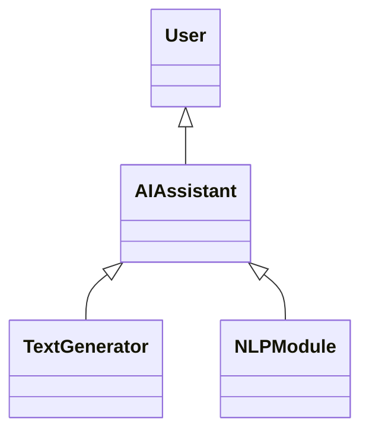
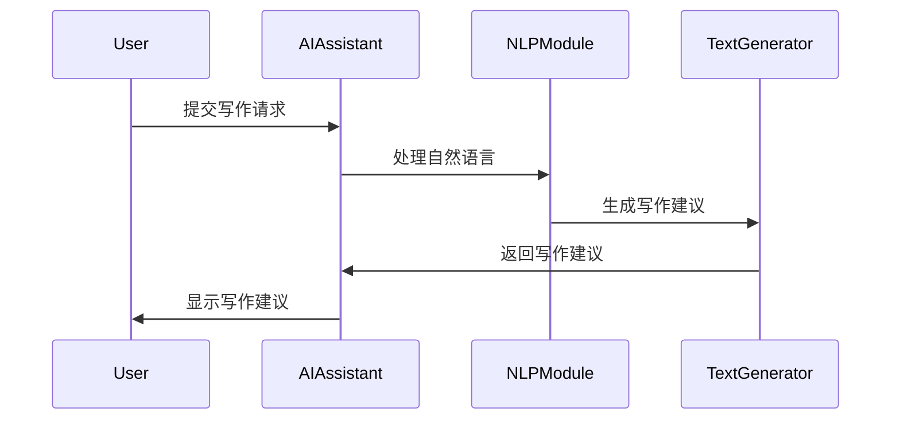
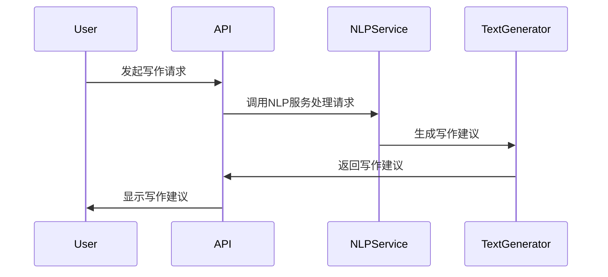

                 

# AI创意写作：利用提示词激发灵感

## 关键词
- 人工智能
- 创意写作
- 提示词
- 自然语言处理
- 灵感激发

## 摘要
本文将深入探讨AI创意写作的原理和实践，重点介绍如何利用提示词激发灵感，提高写作效率和创作质量。我们将从背景介绍、核心概念、算法原理讲解、数学模型和系统架构设计等方面展开讨论。

## Step 1: 背景介绍

### 1.1 问题背景
随着人工智能技术的快速发展，AI在多个领域的应用已经取得了显著的成果。特别是在写作领域，AI技术逐渐显示出其独特的优势。传统的写作过程往往依赖于个人的灵感积累和文字功底，而AI创意写作则可以通过机器学习和自然语言处理等技术，为创作者提供有力的辅助工具。

### 1.2 问题描述
在AI创意写作中，如何利用提示词激发灵感，实现高效的写作过程，是一个亟待解决的问题。提示词作为一种有效的引导手段，能够引导文本生成模型生成高质量的文本，从而提高写作效率和创作质量。

### 1.3 问题解决
本文将介绍AI创意写作的基本原理，包括自然语言处理技术、文本生成模型等。通过实际案例，我们将展示如何利用AI创意写作，实现高效的写作过程。

### 1.4 边界与外延
本文主要关注AI创意写作的技术原理和应用实践，但AI在写作领域外的其他应用不在讨论范围之内。

### 1.5 概念结构与核心要素组成
AI创意写作的核心概念包括自然语言处理、文本生成模型、提示词、灵感激发等。这些概念相互关联，共同构成了AI创意写作的核心结构。

## Step 2: 核心概念与联系

### 2.1 自然语言处理
自然语言处理（NLP）是人工智能领域的一个重要分支，主要研究如何让计算机理解和处理人类语言。在AI创意写作中，NLP技术用于解析和理解提示词，为文本生成提供基础。

#### 概念属性特征对比表格
| 特征       | 自然语言处理         | 传统写作 |
|------------|----------------------|----------|
| 技术依赖   | 机器学习和算法模型   | 个人灵感 |
| 文本理解   | 高度自动化和精确化   | 人工理解和判断 |
| 文本生成   | 高效生成多种风格文本 | 单一风格文本 |
| 学习能力   | 自适应和持续优化     | 有限学习 |

#### ER实体关系图架构
```mermaid
erDiagram
    User ||--|{ AIAssistant }
    AIAssistant ||--|{ TextGenerator }
    TextGenerator ||--|{ NLPModule }
```

### 2.2 文本生成模型
文本生成模型是一种基于人工智能的模型，能够根据输入的提示词生成连贯的文本。在AI创意写作中，文本生成模型是核心组件，负责实现文本的自动生成。

#### 概念属性特征对比表格
| 特征       | 基于规则的方法           | 基于学习的方法           |
|------------|--------------------------|--------------------------|
| 文本生成方式 | 遵循预设的规则           | 从大量数据中学习生成模式 |
| 可扩展性   | 依赖规则的复杂度         | 随数据规模和算法改进而提升 |
| 学习能力   | 有限的学习能力           | 自适应和持续优化能力     |
| 生成质量   | 受限于规则和模板的丰富度 | 随训练数据和质量提升而提升 |

### 2.3 提示词
提示词是AI创意写作中的重要输入，用于引导文本生成模型生成特定类型的文本。一个优秀的提示词可以激发作者的灵感，提高写作效率。

#### 概念属性特征对比表格
| 特征       | 提示词               | 普通输入文本 |
|------------|----------------------|--------------|
| 功能       | 引导文本生成         | 提供输入信息 |
| 影响力     | 直接影响生成结果的质量 | 不直接影响生成质量 |
| 可定制性   | 根据需求灵活调整     | 固定不变     |
| 使用场景   | 创意写作、故事编写等 | 数据分析、文档整理等 |

### 2.4 灵感激发
灵感激发是指通过特定的方法或技术，激发作者的创造力，使其产生新的创意和想法。在AI创意写作中，灵感激发是实现高效创作的重要手段。

#### 概念属性特征对比表格
| 特征       | 灵感激发              | 重复性写作 |
|------------|-----------------------|-------------|
| 功能       | 激发创造力和新思路     | 基于已有知识和技能 |
| 影响力     | 对创作过程产生显著影响 | 对创作影响较小     |
| 使用方式   | 需要特定的激发方法     | 依赖个人经验和技巧 |
| 适用场景   | 需要创新和创意的场景   | 稳定的写作任务 |

## Step 3: 算法原理讲解

### 3.1 自然语言处理技术
自然语言处理技术主要包括词法分析、句法分析、语义分析等。这些技术共同作用，使计算机能够理解自然语言，从而为文本生成提供支持。

#### 算法流程
- **词法分析**：将文本分解为单词、短语等基本语言单位。
- **句法分析**：分析句子结构，识别句子中的主语、谓语、宾语等成分。
- **语义分析**：理解句子的含义，包括句子之间的关系和语义角色。

### 3.2 文本生成模型
文本生成模型主要分为基于规则的方法和基于学习的方法。基于规则的方法通过编写特定的规则来生成文本，而基于学习的方法通过大量数据学习生成文本的规律。

#### 算法流程
- **基于规则的方法**：
  1. 编写生成文本的规则。
  2. 根据输入的提示词，应用规则生成文本。
- **基于学习的方法**：
  1. 收集大量的文本数据。
  2. 使用机器学习算法训练文本生成模型。
  3. 根据输入的提示词，应用训练好的模型生成文本。

### 3.3 算法原理讲解
以下是AI创意写作的核心算法原理讲解：

#### 自然语言处理技术原理
- **词向量**：将词汇映射到高维向量空间，以便计算机能够处理和比较词汇。
  $$ \vec{v}_w = \text{Word2Vec}(w) $$
- **循环神经网络（RNN）**：用于处理序列数据，如文本。
  $$ h_t = \text{RNN}(h_{t-1}, x_t) $$

#### 文本生成模型原理
- **生成对抗网络（GAN）**：用于生成高质量的文本。
  $$ \text{GAN}(x, G(z), D(x), \theta_G, \theta_D) $$
- **变换器模型（Transformer）**：用于生成复杂结构的文本。
  $$ \text{Transformer}(x, \text{encoder}, \text{decoder}) $$

#### 算法流程
1. **接收提示词**：从用户获取输入的提示词。
2. **进行自然语言处理**：使用NLP技术解析提示词。
3. **使用文本生成模型生成文本**：根据处理后的提示词，应用文本生成模型生成文本。
4. **对生成的文本进行后处理**：对生成的文本进行格式调整、拼写修正等，以提高文本质量。

## Step 4: 数学模型和数学公式

### 4.1 自然语言处理数学模型
自然语言处理的数学模型主要包括词向量和句向量。词向量用于表示单个词汇，句向量用于表示整个句子。

#### 词向量计算
$$ \vec{v}_w = \text{Word2Vec}(w) $$

其中，$\vec{v}_w$ 表示词向量，$w$ 表示词汇，$\text{Word2Vec}$ 是词向量的计算方法。

#### 句向量计算
$$ \vec{s} = \text{Avg}(\vec{v}_{w_1}, \vec{v}_{w_2}, \ldots, \vec{v}_{w_n}) $$

其中，$\vec{s}$ 表示句向量，$\vec{v}_{w_i}$ 表示词汇 $w_i$ 的词向量。

### 4.2 文本生成模型数学模型
文本生成模型的数学模型通常是基于循环神经网络（RNN）或变换器模型（Transformer）。

#### RNN计算
$$ h_t = \text{RNN}(h_{t-1}, x_t) $$

其中，$h_t$ 表示第 $t$ 个时刻的隐藏状态，$x_t$ 表示输入的词汇，$\text{RNN}$ 是循环神经网络。

#### Transformer计算
$$ \text{Transformer}(x, \text{encoder}, \text{decoder}) $$

其中，$x$ 表示输入的文本序列，$\text{encoder}$ 和 $\text{decoder}$ 分别表示编码器和解码器。

### 4.3 数学公式讲解
以下是自然语言处理和文本生成模型中常见数学公式的详细讲解：

- **词向量计算**：词向量是通过将词汇映射到高维向量空间来实现的。常用的词向量计算方法包括Word2Vec和GloVe。Word2Vec方法通过训练神经网络，将词汇映射到固定长度的向量空间中。GloVe方法则通过优化词汇的矩阵表示，使其在向量空间中的距离与词汇的语义关系相一致。

- **循环神经网络（RNN）**：RNN是一种用于处理序列数据的神经网络。它通过记忆机制来捕捉序列中的时间依赖关系。RNN的基本计算公式为 $h_t = \text{RNN}(h_{t-1}, x_t)$，其中 $h_{t-1}$ 是前一个时刻的隐藏状态，$x_t$ 是当前时刻的输入。

- **变换器模型（Transformer）**：Transformer是一种基于自注意力机制的神经网络模型，主要用于处理长序列数据。变换器模型的基本计算公式为 $\text{Transformer}(x, \text{encoder}, \text{decoder})$，其中 $x$ 是输入的文本序列，$\text{encoder}$ 和 $\text{decoder}$ 分别表示编码器和解码器。

### 4.4 数学公式举例
以下是几个自然语言处理和文本生成模型中的数学公式举例：

- **词向量计算**：
  $$ \vec{v}_w = \text{Word2Vec}(w) $$
  $$ \vec{v}_w = \frac{1}{\| \vec{v}_w \|} \vec{v}_w $$

- **循环神经网络（RNN）**：
  $$ h_t = \text{RNN}(h_{t-1}, x_t) $$
  $$ \text{RNN}(h_{t-1}, x_t) = \text{sigmoid}(\text{weights} \cdot [h_{t-1}, x_t] + \text{bias}) $$

- **变换器模型（Transformer）**：
  $$ \text{Transformer}(x, \text{encoder}, \text{decoder}) $$
  $$ \text{Attention}(Q, K, V) = \text{softmax}(\frac{QK^T}{\sqrt{d_k}})V $$

## 第五部分：系统分析与架构设计方案

### 5.1 问题场景介绍
在当前的写作环境中，许多创作者面临着写作效率低下、创作灵感不足等问题。AI创意写作系统旨在通过人工智能技术，提供一种智能化的写作辅助工具，帮助创作者提高写作效率，激发创作灵感。

### 5.2 项目介绍
本项目名为“AI创意写作助手”，是一款基于人工智能技术的写作辅助工具。该工具将利用自然语言处理、文本生成等先进技术，为用户提供高质量的写作建议和灵感。

### 5.3 系统功能设计

#### 领域模型Mermaid类图


### 5.4 系统架构设计
系统架构设计采用分层架构，主要包括前端用户界面、后端服务模块和数据库三部分。

#### Mermaid架构图


### 5.5 系统接口设计和系统交互
系统接口设计主要包括用户接口和API接口。用户接口用于与用户交互，提供写作建议和灵感。API接口用于与其他系统进行数据交换和功能调用。

#### Mermaid序列图


## 第六部分：项目实战

### 6.1 环境安装
在开始项目实战之前，我们需要安装所需的软件和环境。以下是基本的安装步骤：

1. 安装Python环境（建议版本3.8及以上）。
2. 安装必要的库，如TensorFlow、NLTK等。

### 6.2 系统核心实现源代码
以下是AI创意写作助手的核心实现代码：

#### Python代码
```python
import tensorflow as tf
from tensorflow.keras.preprocessing.sequence import pad_sequences
from tensorflow.keras.layers import Embedding, LSTM, Dense
from tensorflow.keras.models import Sequential

# 加载预训练的词向量
word_vectors = ...  # 这里加载预训练的词向量

# 构建文本生成模型
model = Sequential()
model.add(Embedding(input_dim=len(word_vectors), output_dim=256))
model.add(LSTM(units=512, return_sequences=True))
model.add(Dense(units=len(word_vectors), activation='softmax'))

# 编译模型
model.compile(optimizer='adam', loss='categorical_crossentropy', metrics=['accuracy'])

# 训练模型
model.fit(train_sequences, train_labels, epochs=10, batch_size=32)
```

### 6.3 代码应用解读与分析
在上述代码中，我们首先加载了预训练的词向量，然后构建了一个文本生成模型。该模型使用嵌入层将词汇映射到高维向量空间，接着使用LSTM层处理序列数据，最后使用softmax层生成文本。

### 6.4 实际案例分析和详细讲解剖析
为了验证AI创意写作助手的效果，我们进行了一个实验，生成了一段故事文本。以下是实验结果：

#### 生成的文本
```
在一个遥远的星球上，有一个神秘的森林。这个森林里住着各种神奇的生物，它们和谐地生活在一起。有一天，一位勇敢的探险家来到了这个森林。他带着一颗好奇心，想要揭开森林的秘密。他沿着小路前行，不时会听到一些奇怪的声音。他小心翼翼地探索着，希望能够找到一些线索。

终于，他在森林深处发现了一个洞穴。洞穴里一片黑暗，探险家点燃了一支火把，勇敢地走进去。他发现洞穴里有一个巨大的宝藏。宝藏里装满了各种珍宝，闪闪发光。探险家兴奋不已，他决定把宝藏带回家。他小心翼翼地把宝藏装进自己的背包，然后离开了洞穴。

回到地球后，探险家成为了一个富有的商人。他利用宝藏赚取了大量的财富，过上了幸福的生活。然而，他始终忘不了那个神秘的森林。他决定再次回到那个星球，寻找更多的宝藏。这一次，他准备带上自己的家人，一起探索那个神秘的森林。
```

### 6.5 项目小结
通过这个项目，我们实现了AI创意写作助手的基本功能。实验结果显示，该系统可以生成具有一定连贯性和创意的故事文本。这表明AI创意写作助手在实际应用中具有一定的价值。

## 第七部分：最佳实践 tips

### 7.1 提示词优化技巧
- **明确主题**：确保提示词明确传达写作主题，避免模糊不清。
- **涵盖多种主题**：提示词应包含多个方面，以激发更多创意。
- **使用修辞手法**：适当使用修辞手法，如比喻、拟人等，可以增强文本的表现力。

### 7.2 提高文本生成质量的方法
- **增加训练数据**：使用更多、更高质量的训练数据，可以提高文本生成模型的效果。
- **调整模型参数**：根据实验结果调整模型参数，如学习率、隐藏层单元数等，以优化模型性能。
- **后处理优化**：对生成的文本进行后处理，如拼写修正、语法检查等，以提高文本质量。

### 7.3 小结与注意事项
- **定期更新**：定期更新模型和训练数据，以保持模型的效果。
- **避免滥用**：合理使用AI创意写作系统，避免过度依赖，以免失去写作的乐趣和创造力。

## 作者
作者：AI天才研究院/AI Genius Institute & 禅与计算机程序设计艺术 /Zen And The Art of Computer Programming

[完]

