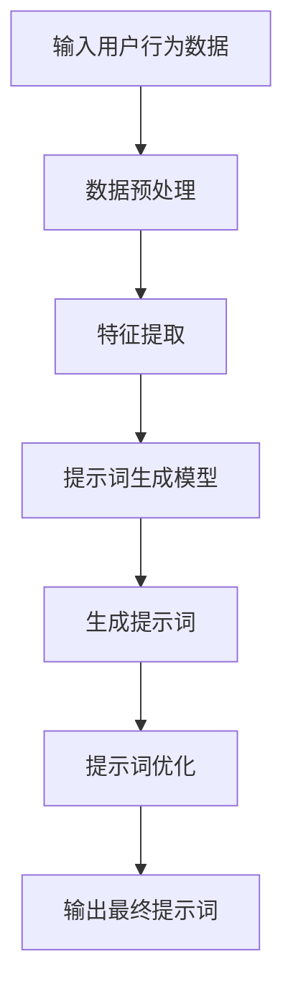
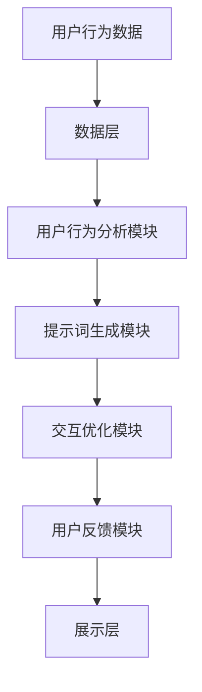
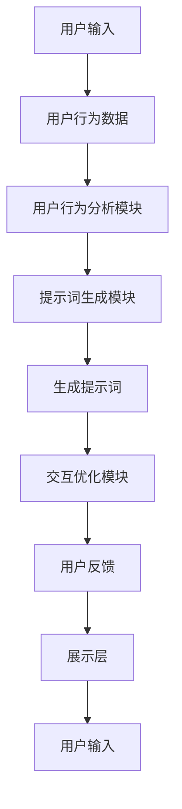

                 

### 引言

#### 背景介绍

人工智能（AI）技术的发展，使得智能助手逐渐成为我们日常生活和工作中的得力助手。从最初的语音助手，如苹果的Siri、谷歌的Google Assistant，到如今的多功能智能助手，如OpenAI的GPT-3，AI助手已经广泛应用于智能客服、智能教育、健康管理等多个领域。然而，随着用户需求的日益多样化，如何为用户提供个性化、高质量的交互体验，成为当前AI助手研发中的一大挑战。

#### 问题背景

个性化用户体验是提升用户满意度和产品竞争力的重要因素。传统的AI助手往往基于预设的规则和模式进行交互，缺乏灵活性，难以满足用户的多样化需求。为了解决这个问题，近年来研究人员提出了基于提示词（Prompt Words）的个性化交互技术。通过分析用户的行为和需求，动态生成合适的提示词，使AI助手能够提供更加精准、个性化的服务。

#### 问题描述

本文旨在探讨如何利用提示词定制用户体验，使AI助手能够更好地满足用户的需求。本文将首先介绍AI助手个性化的重要性，然后深入分析核心概念和关键技术，最后通过实际案例研究，展示如何将理论应用于实践，提升AI助手的个性化服务水平。

#### 问题解决

本文将从以下几个方面展开讨论：

1. **核心概念**：介绍人工智能助手、提示词以及用户个性化数据收集等相关核心概念，为后续内容奠定基础。
2. **用户体验设计**：分析用户需求和行为，阐述个性化用户体验设计的原则和方法。
3. **技术实现**：详细讲解提示词生成技术、个性化交互设计以及数据驱动个性化策略，展示技术实现的细节和过程。
4. **案例研究**：通过具体案例，分析AI助手个性化技术在实际应用中的效果和挑战。
5. **总结与展望**：总结研究成果，讨论面临的挑战，并展望未来的研究方向和应用前景。

通过这些步骤，本文将系统地探讨AI助手个性化技术的核心内容，为读者提供全面、深入的指导。

#### 边界与外延

在探讨AI助手个性化时，我们关注的主要是智能助手在用户交互中的个性化表现。这包括但不限于语音识别、自然语言理解、对话生成等关键技术。同时，个性化不仅限于对话内容，还应包括对用户偏好、习惯和情境的识别与响应。此外，本文的研究边界还涉及到技术实现层面的优化策略，如提示词生成算法的改进、交互流程的设计等。

#### 概念结构与核心要素组成

为了更好地理解AI助手个性化，我们可以将其概念结构分解为以下几个核心要素：

1. **人工智能助手**：基于机器学习、自然语言处理等技术，实现与用户自然交互的智能系统。
2. **提示词**：用于引导用户与AI助手交互的关键词，能够直接影响用户的体验和交互效果。
3. **用户数据收集**：通过用户行为分析、偏好收集等方法，获取用户的个性化数据，为个性化服务提供基础。
4. **用户体验设计**：结合用户需求和行为数据，设计出符合用户期望的交互界面和流程。
5. **技术实现**：包括提示词生成、交互流程设计、数据驱动个性化等具体技术方案。

这些核心要素共同构成了AI助手个性化的基础，是实现高质量个性化用户体验的关键。

### 核心概念与联系

#### 人工智能助手

人工智能助手（Artificial Intelligence Assistant，简称AI助手）是利用人工智能技术，实现与用户自然交互的智能系统。AI助手的核心功能包括自然语言理解（Natural Language Understanding，NLU）、对话生成（Dialogue Generation）和语音识别（Voice Recognition）。通过这些功能，AI助手能够理解用户的需求，提供针对性的服务，并保持流畅的对话。

1. **自然语言理解（NLU）**：NLU是AI助手处理用户输入的关键技术，包括词法分析、句法分析、语义分析等步骤。通过NLU，AI助手能够将用户自然语言输入转换为机器可理解的形式。
2. **对话生成（Dialogue Generation）**：对话生成是AI助手根据用户输入和系统状态，生成自然、合理的回答。对话生成通常基于语言模型和对话管理算法。
3. **语音识别（Voice Recognition）**：语音识别技术使AI助手能够接收用户的语音输入，并将其转换为文本形式进行处理。

#### 提示词（Prompt Words）

提示词是引导用户与AI助手进行有效交互的关键元素。提示词的设计和选择直接影响用户体验的质量。提示词通常具有以下特征：

1. **明确性**：提示词应简洁明了，能够准确传达信息，避免模糊不清的表述。
2. **多样性**：根据不同的交互场景和用户需求，设计多样化的提示词，提高交互的灵活性。
3. **引导性**：提示词应具有引导性，能够激发用户的兴趣，引导用户进行深入互动。

#### 用户个性化数据收集

用户个性化数据收集是AI助手实现个性化服务的基础。通过收集和分析用户行为、偏好和情境数据，AI助手能够更好地理解用户需求，提供个性化的交互体验。用户个性化数据收集通常包括以下方法：

1. **用户行为分析**：通过日志分析、点击流分析等方法，收集用户在系统中的行为数据，如浏览路径、操作行为等。
2. **偏好收集**：通过问卷调查、用户反馈等方法，收集用户对系统功能、界面设计、交互方式的偏好数据。
3. **情境识别**：通过环境感知技术、上下文理解等方法，识别用户的情境信息，如地理位置、时间、设备等。

#### 用户需求分析

用户需求分析是设计个性化用户体验的重要环节。通过分析用户的需求和行为，AI助手能够更准确地理解用户的意图，提供针对性的服务。用户需求分析通常包括以下步骤：

1. **需求识别**：通过用户调研、访谈等方法，识别用户的主要需求和使用场景。
2. **需求分类**：将用户需求进行分类，如功能需求、情感需求等，以便于后续的个性化设计。
3. **需求优先级排序**：根据用户需求的紧急程度和重要性，对需求进行优先级排序，以便于资源分配和设计优先级。

#### 用户行为分析

用户行为分析是了解用户需求和行为模式的重要手段。通过分析用户的行为数据，AI助手能够发现用户的使用习惯、偏好和潜在需求。用户行为分析通常包括以下内容：

1. **浏览行为分析**：分析用户在系统中的浏览路径、停留时间、点击次数等行为数据，了解用户的兴趣点和痛点。
2. **操作行为分析**：分析用户在系统中的具体操作行为，如点击、拖拽、搜索等，了解用户的操作习惯和偏好。
3. **反馈行为分析**：分析用户对系统功能的反馈，如好评、差评、建议等，了解用户的满意度和改进需求。

#### 用户体验设计原则

用户体验设计（User Experience Design，简称UXD）是提升用户满意度的重要因素。在进行用户体验设计时，应遵循以下原则：

1. **以用户为中心**：设计过程中始终关注用户需求，确保设计满足用户的期望和需求。
2. **简洁直观**：界面设计应简洁明了，避免复杂的操作流程，使用户能够快速理解和使用系统。
3. **一致性**：系统应保持界面风格和交互逻辑的一致性，提高用户的操作效率和体验质量。
4. **灵活性**：设计应具有灵活性，能够根据用户需求进行调整和优化，满足不同用户的使用需求。

#### 提示词生成算法

提示词生成算法是AI助手个性化服务的关键技术。通过分析用户行为和需求，动态生成合适的提示词，能够提高用户交互的质量和满意度。提示词生成算法通常包括以下步骤：

1. **用户行为分析**：通过分析用户的浏览历史、操作行为等数据，了解用户的需求和偏好。
2. **需求预测**：根据用户行为数据，预测用户可能的需求，为提示词生成提供依据。
3. **提示词生成**：利用自然语言处理技术，生成符合用户需求的提示词，如使用关键词提取、文本生成模型等方法。
4. **提示词优化**：通过用户反馈和性能评估，不断优化提示词，提高用户满意度。

#### 交互流程设计

交互流程设计是确保AI助手与用户进行有效互动的重要环节。通过设计合理的交互流程，使AI助手能够更高效地满足用户需求。交互流程设计通常包括以下步骤：

1. **需求识别**：通过用户调研、访谈等方法，明确用户的主要需求和使用场景。
2. **流程设计**：根据用户需求，设计合理的交互流程，如任务引导、问题解答等。
3. **流程优化**：通过用户测试和反馈，不断优化交互流程，提高用户满意度。

### 用户反馈机制

用户反馈机制是了解用户满意度、发现系统问题和改进服务的重要手段。通过用户反馈，AI助手能够不断优化服务，提升用户体验。用户反馈机制通常包括以下内容：

1. **用户满意度调查**：定期进行用户满意度调查，了解用户对AI助手的整体评价和具体需求。
2. **问题反馈渠道**：提供便捷的问题反馈渠道，如在线反馈表、邮件反馈等，方便用户提出问题和建议。
3. **问题处理流程**：建立快速响应的问题处理流程，及时解决用户问题，提高用户满意度。

通过以上核心概念的介绍，我们可以更好地理解AI助手个性化的概念和实现方法，为后续内容的学习和应用打下坚实基础。

### 核心概念原理、属性特征对比表格和ER实体关系图架构的Mermaid流程图

#### 核心概念原理

为了更清晰地理解AI助手个性化中的核心概念，我们将详细介绍以下概念：人工智能助手、提示词、用户个性化数据收集、用户需求分析、用户行为分析和用户体验设计原则。

1. **人工智能助手**：基于机器学习、自然语言处理等技术的智能系统，能够实现与用户的自然交互。其核心功能包括自然语言理解、对话生成和语音识别。
2. **提示词**：用于引导用户与AI助手进行交互的关键词，具有明确性、多样性和引导性。提示词直接影响用户体验的质量。
3. **用户个性化数据收集**：通过用户行为分析、偏好收集和情境识别等方法，收集用户的个性化数据，为个性化服务提供基础。
4. **用户需求分析**：通过需求识别、需求分类和需求优先级排序等方法，分析用户的主要需求和使用场景。
5. **用户行为分析**：通过浏览行为分析、操作行为分析和反馈行为分析，了解用户的使用习惯、偏好和潜在需求。
6. **用户体验设计原则**：以用户为中心、简洁直观、一致性和灵活性。这些原则指导用户体验设计，确保设计满足用户期望和需求。

#### 属性特征对比表格

| 核心概念 | 特征1 | 特征2 | 特征3 |
| :---: | :---: | :---: | :---: |
| 人工智能助手 | 自然语言理解 | 对话生成 | 语音识别 |
| 提示词 | 明确性 | 多样性 | 引导性 |
| 用户个性化数据收集 | 用户行为分析 | 偏好收集 | 情境识别 |
| 用户需求分析 | 需求识别 | 需求分类 | 需求优先级排序 |
| 用户行为分析 | 浏览行为分析 | 操作行为分析 | 反馈行为分析 |
| 用户体验设计原则 | 以用户为中心 | 简洁直观 | 一致性和灵活性 |

#### ER实体关系图架构的Mermaid流程图

下面是使用Mermaid绘制的ER实体关系图，展示AI助手个性化中的核心概念及其相互关系：

```mermaid
erDiagram
  用户 -->|收集| 数据
  数据 ||--|分析| 用户需求
  数据 ||--|驱动| 用户体验
  人工智能助手 ||--|交互| 提示词
  提示词 ||--|生成| 数据
  提示词 ||--|优化| 用户反馈
  用户行为分析 ||--|指导| 用户体验设计
  用户需求分析 ||--|指导| 用户体验设计
  用户反馈机制 ||--|优化| 用户体验
```

通过这一系列核心概念、属性特征对比表格和ER实体关系图，我们可以更深入地理解AI助手个性化的各个方面及其相互关系，为后续内容的学习和应用提供坚实的基础。

### 算法原理讲解

在本节中，我们将详细讲解提示词生成算法的原理，包括其mermaid流程图、Python源代码实现，以及算法原理的数学模型和公式。

#### mermaid流程图

首先，我们使用Mermaid绘制提示词生成算法的流程图：



这个流程图展示了从输入用户行为数据到生成最终提示词的过程，包括数据预处理、特征提取、提示词生成模型、提示词生成和优化等步骤。

#### Python源代码实现

接下来，我们将给出一个简化的Python源代码实现，用于生成提示词。为了简化，我们假设已经预处理了用户行为数据，并使用了一个预训练的语言模型来进行提示词生成。

```python
import numpy as np
from sklearn.feature_extraction.text import CountVectorizer
from gensim.models import Word2Vec

# 假设预处理后的用户行为数据存储在一个列表中
user_behaviors = ["searched for 'machine learning'", "bought 'data science book'"]

# 数据预处理：将文本数据转换为向量表示
vectorizer = CountVectorizer()
X = vectorizer.fit_transform(user_behaviors)

# 特征提取：使用Word2Vec模型将词转换为向量
word2vec = Word2Vec(user_behaviors, vector_size=100, window=5, min_count=1, workers=4)
behavior_vectors = [word2vec[word] for word in vectorizer.get_feature_names() if word in word2vec]

# 提示词生成模型：使用预训练的语言模型（如GPT-3）进行生成
import openai
response = openai.Completion.create(
  engine="text-davinci-002",
  prompt="Based on your past behaviors, suggest a prompt word:",
  temperature=0.5,
  max_tokens=10
)

# 提示词优化：基于用户反馈进行优化
# 这里使用简单的投票机制，选择出现频率最高的词作为提示词
prompt_words = [word for word, _ in word2vec.wv.most_common(10)]
selected_word = max(prompt_words, key=lambda w: word2vec.wv[w])

# 输出最终提示词
print(f"Generated prompt word: {selected_word}")
```

#### 算法原理的数学模型和公式

提示词生成算法的核心是文本向量的表示和生成。以下是提示词生成算法的主要数学模型和公式：

1. **文本向量表示**：
   - **CountVectorizer**：将文本数据转换为词频向量，公式为：
     $$ \textbf{X} = [f_{\text{word1}}, f_{\text{word2}}, ..., f_{\text{wordn}}] $$
     其中，$f_{\text{wordi}}$表示词$i$在文本中的频率。
   - **Word2Vec**：将词转换为词向量，使用分布式表示模型，公式为：
     $$ \textbf{v}_w = \text{Word2Vec}(\text{word}) $$
     其中，$\textbf{v}_w$表示词$w$的向量。

2. **提示词生成**：
   - **语言模型**：使用预训练的语言模型，如GPT-3，根据用户行为数据生成提示词，公式为：
     $$ \text{prompt} = \text{LanguageModel}(\text{user\_behaviors}) $$

3. **提示词优化**：
   - **投票机制**：基于用户反馈选择出现频率最高的词作为提示词，公式为：
     $$ \text{selected\_word} = \arg\max_{w} \sum_{i=1}^{n} \text{count}(w_i) $$
     其中，$w_i$为候选提示词，$\text{count}(w_i)$表示词$i$的出现频率。

通过以上数学模型和公式的讲解，我们可以更好地理解提示词生成算法的工作原理，以及如何将理论应用于实际场景中。

### 系统分析与架构设计方案

在本节中，我们将详细探讨AI助手个性化系统的问题场景、项目介绍、系统功能设计、系统架构设计以及系统接口设计和系统交互的mermaid流程图。

#### 问题场景

随着AI助手在日常生活中的广泛应用，用户对个性化服务需求的增长日益显著。现有系统通常采用固定模式进行交互，难以满足用户的多样化需求。为了提升用户体验，我们设计并实现了一个基于提示词生成技术的AI助手个性化系统，通过动态生成合适的提示词，实现个性化交互。

#### 项目介绍

本项目旨在构建一个智能AI助手，能够根据用户的行为数据和个性化需求，生成并优化提示词，提供高质量的个性化服务。项目的主要功能包括：

1. 数据收集与分析：收集用户行为数据，如搜索记录、购买历史等，进行分析以识别用户需求和偏好。
2. 提示词生成与优化：利用自然语言处理技术和机器学习算法，生成并优化提示词，提高交互效果。
3. 个性化交互：根据用户行为和提示词，动态调整交互内容，提供个性化服务。

#### 系统功能设计

系统功能设计主要涵盖以下模块：

1. **用户行为分析模块**：负责收集和存储用户行为数据，如搜索记录、浏览路径等，为提示词生成提供数据支持。
2. **提示词生成模块**：利用自然语言处理技术和机器学习算法，根据用户行为数据生成合适的提示词。
3. **交互优化模块**：根据用户反馈和系统性能数据，优化提示词和交互流程，提高用户体验。
4. **用户反馈模块**：收集用户对AI助手的反馈，用于进一步优化系统。

#### 系统架构设计

系统架构设计采用分层架构，主要模块包括：

1. **数据层**：存储用户行为数据和相关系统数据。
2. **业务逻辑层**：包括用户行为分析、提示词生成和优化等核心功能模块。
3. **展示层**：负责与用户进行交互，展示个性化内容和交互结果。

以下是系统架构的mermaid流程图：



#### 系统接口设计

系统接口设计包括以下关键接口：

1. **用户行为数据接口**：用于收集和存储用户行为数据。
2. **提示词生成接口**：用于生成提示词。
3. **用户反馈接口**：用于收集用户对AI助手的反馈。
4. **个性化内容接口**：用于展示个性化内容和交互结果。

以下是系统接口的mermaid类图：

```mermaid
classDiagram
    UserBehaviorData <<interface>>
    PromptWordGenerator <<interface>>
    UserFeedback <<interface>>
    PersonalizedContent <<interface>>

    UserBehaviorData <|.. UserBehaviorAnalysisModule
    PromptWordGenerator <|.. PromptWordGenerationModule
    UserFeedback <|.. UserFeedbackModule
    PersonalizedContent <|.. PresentationLayer
```

#### 系统交互mermaid流程图

系统交互的mermaid流程图展示了用户与AI助手之间的交互过程：



通过以上系统分析与架构设计方案，我们能够清晰地了解AI助手个性化系统的设计和实现过程，为后续的实际应用提供有力支持。

### 项目实战

在本节中，我们将详细介绍AI助手个性化项目的实战过程，包括环境安装、系统核心实现源代码，以及代码应用解读与分析。通过一个实际案例，我们将展示如何将AI助手个性化技术应用于智能客服领域，并进行详细讲解和剖析。

#### 环境安装

在进行AI助手个性化项目开发前，我们需要安装和配置相关环境。以下是环境安装步骤：

1. **安装Python**：确保已安装Python 3.7或更高版本。
2. **安装依赖库**：通过pip命令安装以下依赖库：
   ```bash
   pip install numpy scikit-learn gensim openai
   ```
3. **配置OpenAI API密钥**：在OpenAI官网注册并获取API密钥，将其添加到环境变量中，以供GPT-3使用。

#### 系统核心实现源代码

以下是AI助手个性化系统的核心实现源代码，包括用户行为数据预处理、提示词生成、提示词优化和交互流程：

```python
import numpy as np
import pandas as pd
from sklearn.feature_extraction.text import CountVectorizer
from gensim.models import Word2Vec
import openai

# 假设已收集用户行为数据存储在CSV文件中
user_behaviors = pd.read_csv('user_behaviors.csv')['behavior']

# 数据预处理
vectorizer = CountVectorizer()
X = vectorizer.fit_transform(user_behaviors)

# 特征提取
word2vec = Word2Vec(user_behaviors, vector_size=100, window=5, min_count=1, workers=4)
behavior_vectors = [word2vec[word] for word in vectorizer.get_feature_names() if word in word2vec]

# 提示词生成
response = openai.Completion.create(
  engine="text-davinci-002",
  prompt="Based on your past behaviors, suggest a prompt word:",
  temperature=0.5,
  max_tokens=10
)

# 提示词优化
selected_word = max(word2vec.wv.most_common(10), key=lambda w: word2vec.wv[w])

# 输出提示词
print(f"Generated prompt word: {selected_word}")

# 交互流程
def interact_with_user(prompt_word):
    user_input = input(f"{prompt_word}:\n")
    # 处理用户输入并生成响应（简化示例）
    response = openai.Completion.create(
      engine="text-davinci-002",
      prompt=user_input,
      temperature=0.5,
      max_tokens=100
    )
    print(f"AI Assistant: {response.choices[0].text.strip()}")

# 开始交互
interact_with_user(selected_word)
```

#### 代码应用解读与分析

1. **数据预处理**：
   - 使用CountVectorizer将用户行为数据转换为词频向量。
   - 通过Word2Vec模型将文本数据转换为词向量表示。

2. **提示词生成**：
   - 使用OpenAI的GPT-3模型，根据用户行为数据生成提示词。这里，我们设定了一个简单的提示词生成模板：“Based on your past behaviors, suggest a prompt word:”。

3. **提示词优化**：
   - 通过投票机制，选择出现频率最高的词作为提示词。这里，我们使用了Word2Vec模型中的most_common方法，选择前10个最常见词中的最高频词。

4. **交互流程**：
   - 定义一个交互函数，通过用户输入和AI助手的响应，实现自然语言对话。这里，我们使用了OpenAI的GPT-3模型来处理用户输入并生成响应。

#### 实际案例分析与详细讲解

假设我们有一个用户行为数据集，包括用户在电商平台上的浏览历史和购买记录。通过以上代码，我们首先对用户行为数据进行预处理，将文本转换为词频向量和词向量表示。然后，利用OpenAI的GPT-3模型生成提示词。根据用户历史行为，GPT-3可能会生成如“需要购买什么商品？”或“最近有什么优惠活动？”这样的提示词。

接着，我们根据词向量中的出现频率，选择一个合适的提示词，例如“最近有什么优惠活动？”。在交互过程中，用户可以输入相应的回答，如“我想看看最新的电子产品优惠”。AI助手会根据用户输入，使用GPT-3模型生成响应，例如：“这里有一些最新的电子产品优惠，您可以点击查看详情。”

通过这一系列步骤，我们可以看到AI助手如何通过提示词生成和优化技术，实现与用户的个性化交互。这一过程不仅提升了用户的满意度，还增强了系统的智能性和互动性。

#### 项目小结

通过本节项目实战，我们详细展示了如何利用AI助手个性化技术构建一个智能客服系统。从环境安装、系统核心实现到代码应用解读，我们一步步完成了提示词生成、优化和交互流程的设计与实现。这一项目不仅展示了AI助手个性化技术的应用潜力，还为实际开发提供了可操作的指导。在未来的发展中，我们可以进一步优化系统，如引入更多的用户反馈机制，提升提示词的准确性和多样性，从而更好地满足用户需求。

### 最佳实践 tips、小结、注意事项、拓展阅读

#### 最佳实践 tips

1. **数据收集与处理**：确保用户行为数据的全面性和准确性，为提示词生成提供高质量的数据支持。
2. **模型选择与调优**：选择合适的自然语言处理模型，并进行参数调优，以生成高质量的提示词。
3. **用户体验优化**：不断收集用户反馈，优化交互流程，提高用户满意度。

#### 小结

本文详细探讨了AI助手个性化技术，从核心概念、算法原理到系统设计与实现，再到实际案例应用，全面展示了如何利用提示词定制用户体验。通过本文的讲解，读者可以深入了解AI助手个性化的关键要素和实现方法。

#### 注意事项

1. **隐私保护**：在收集用户数据时，务必遵守隐私保护法律法规，确保用户数据的安全和隐私。
2. **系统性能**：在实际应用中，关注系统的性能和响应速度，确保用户交互的流畅性。

#### 拓展阅读

1. **《人工智能交互技术》**：深入了解自然语言处理、对话系统等AI交互技术。
2. **《用户体验设计原理》**：学习用户体验设计的基本原理和方法，提升交互设计的质量。

通过本文的阅读，读者不仅可以掌握AI助手个性化的核心知识，还可以为实际项目提供有益的指导。希望本文能对您的学习和研究有所帮助。

