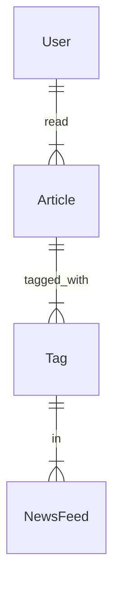
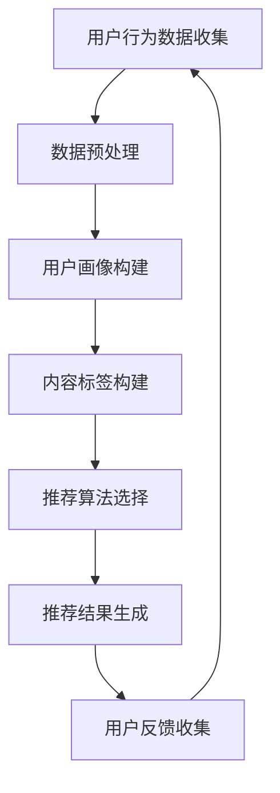
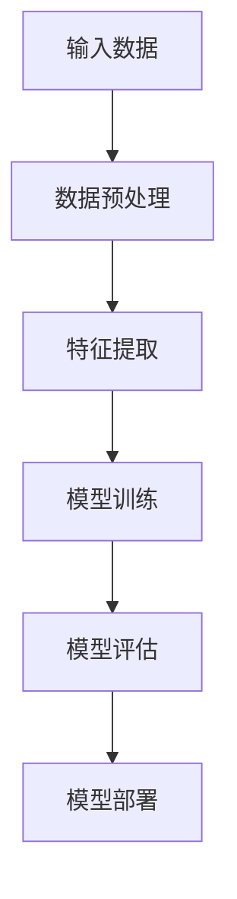
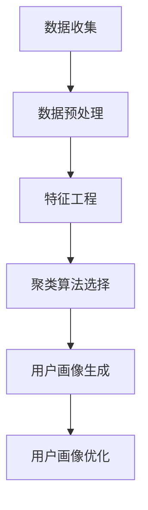
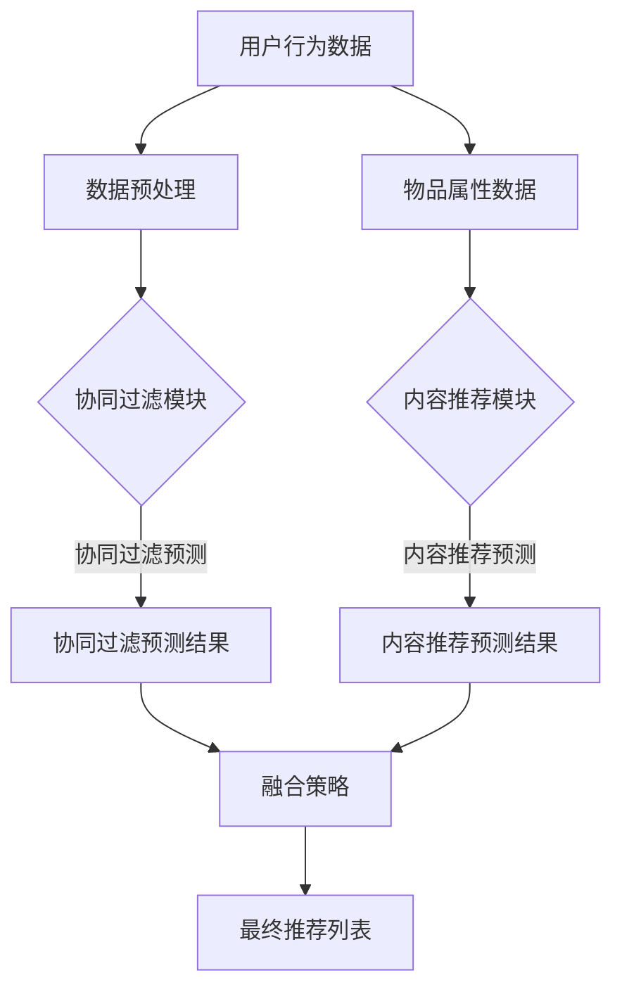
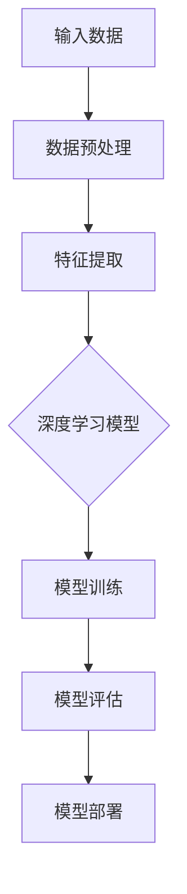
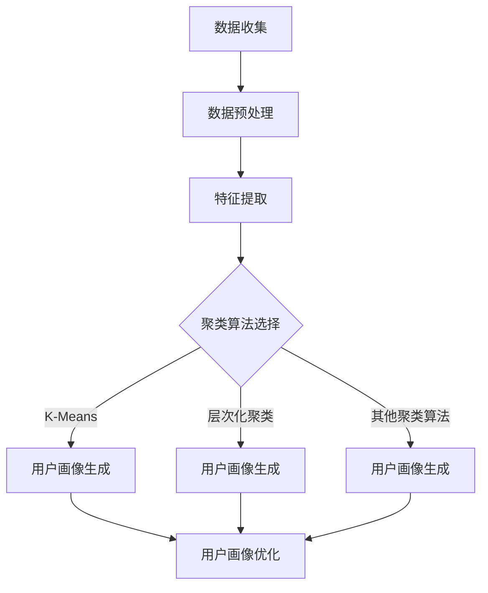

                 

# AI在个性化新闻推荐中的应用：提供定制化信息流

## 关键词

- 个性化新闻推荐
- AI技术
- 深度学习
- 用户画像
- 内容标签
- 协同过滤

## 摘要

本文将探讨AI在个性化新闻推荐中的应用，旨在提供一种定制化的信息流。首先，我们将介绍个性化新闻推荐的重要性以及AI技术的应用现状。随后，我们将详细讨论个性化新闻推荐的核心概念、AI技术的基础概念以及ER实体关系图架构。接着，我们将深入分析传统推荐算法（如协同过滤和内容推荐）及其在个性化新闻推荐中的应用。随后，我们将介绍深度学习在个性化新闻推荐中的作用，包括卷积神经网络（CNN）、循环神经网络（RNN）和生成对抗网络（GAN）等。最后，我们将探讨用户画像的构建方法及其算法实现，并通过一个实际项目来展示AI在个性化新闻推荐中的应用。

### 目录大纲

----------------------------------------------------------------

# 第一部分：AI在个性化新闻推荐中的应用

# 第1章：引言

## 1.1 问题背景

### 1.1.1 个性化新闻推荐的重要性

### 1.1.2 AI在个性化新闻推荐中的应用现状

### 1.1.3 本书的目标与结构

## 1.2 核心概念与联系

### 1.2.1 个性化新闻推荐的核心概念

#### 1.2.1.1 用户画像

#### 1.2.1.2 内容标签

#### 1.2.1.3 推荐算法

### 1.2.2 AI技术的基础概念

#### 1.2.2.1 机器学习

#### 1.2.2.2 深度学习

#### 1.2.2.3 自然语言处理

## 1.3 ER实体关系图架构



## 1.4 本章小结

----------------------------------------------------------------

# 第二部分：个性化新闻推荐算法原理

# 第2章：传统推荐算法

## 2.1 协同过滤

### 2.1.1 协同过滤的概念

### 2.1.2 协同过滤的优缺点

### 2.1.3 基于矩阵分解的协同过滤算法

## 2.2 内容推荐

### 2.2.1 内容推荐的概念

### 2.2.2 内容推荐的方法

#### 2.2.2.1 基于关键词匹配

#### 2.2.2.2 基于文本相似度

## 2.3 混合推荐系统

### 2.3.1 混合推荐系统的概念

### 2.3.2 混合推荐系统的优势

### 2.3.3 混合推荐系统的实现

## 2.4 算法mermaid流程图



## 2.5 本章小结

----------------------------------------------------------------

# 第三部分：深度学习与个性化新闻推荐

# 第3章：深度学习基础

## 3.1 深度学习概述

### 3.1.1 深度学习的定义

### 3.1.2 深度学习的优势

### 3.1.3 深度学习的主要任务

## 3.2 卷积神经网络(CNN)

### 3.2.1 CNN的基本原理

### 3.2.2 CNN在图像处理中的应用

### 3.2.3 CNN在文本处理中的扩展

## 3.3 循环神经网络(RNN)

### 3.3.1 RNN的基本原理

### 3.3.2 RNN在序列数据处理中的应用

### 3.3.3 LSTM与GRU

## 3.4 生成对抗网络(GAN)

### 3.4.1 GAN的原理

### 3.4.2 GAN的应用

## 3.5 算法mermaid流程图



## 3.6 本章小结

----------------------------------------------------------------

# 第四部分：AI在个性化新闻推荐中的应用

# 第4章：用户画像构建

## 4.1 用户画像的概念

### 4.1.1 用户画像的定义

### 4.1.2 用户画像的作用

### 4.1.3 用户画像的层次结构

## 4.2 用户画像的构建方法

### 4.2.1 基于行为数据的用户画像

### 4.2.2 基于社交网络数据的用户画像

### 4.2.3 基于人口统计学数据的用户画像

## 4.3 用户画像的算法实现

### 4.3.1 K-Means聚类算法

### 4.3.2 层次化聚类算法

### 4.3.3 其他聚类算法

## 4.4 用户画像算法mermaid流程图



## 4.5 本章小结

----------------------------------------------------------------

# 结束语

## 5.1 最佳实践 tips

## 5.2 小结

## 5.3 注意事项

## 5.4 拓展阅读

----------------------------------------------------------------

### 第一部分：AI在个性化新闻推荐中的应用

#### 第1章：引言

#### 1.1 问题背景

#### 1.1.1 个性化新闻推荐的重要性

随着互联网的飞速发展，人们获取信息的渠道日益丰富。然而，面对海量的新闻信息，用户往往感到困惑，难以筛选出符合自己兴趣的内容。个性化新闻推荐系统应运而生，其目标是通过分析用户的兴趣和行为，为其提供定制化的信息流，提高信息获取的效率。

个性化新闻推荐在多个领域具有重要的应用价值。首先，在商业领域，个性化推荐可以提升用户粘性，增加用户停留时间和互动行为，从而提高广告收益和用户转化率。其次，在学术领域，个性化推荐可以帮助研究人员快速找到与自己研究方向相关的文献和研究成果，提高科研效率。最后，在社会领域，个性化推荐可以促进信息的公平传播，减少信息孤岛现象，提升社会整体的信息获取能力。

#### 1.1.2 AI在个性化新闻推荐中的应用现状

近年来，人工智能技术，特别是机器学习和深度学习技术的发展，为个性化新闻推荐带来了新的机遇。通过用户行为数据、内容标签、社交网络等多源数据的整合和分析，AI技术可以构建出精准的用户画像，实现新闻内容的个性化推荐。

目前，大多数主流的新闻推荐平台都采用了AI技术。例如，腾讯新闻、今日头条等平台通过协同过滤、内容推荐、深度学习等多种算法，为用户提供个性化的新闻推荐。这些算法在提高用户满意度、降低用户流失率方面取得了显著的成效。然而，随着用户需求的不断变化和数据的不断增长，现有的推荐系统面临着一些挑战，如冷启动问题、数据偏差、推荐过度等。

#### 1.1.3 本书的目标与结构

本书旨在深入探讨AI在个性化新闻推荐中的应用，帮助读者了解个性化新闻推荐的核心概念、算法原理以及实际应用。具体来说，本书将分为四个部分：

第一部分将介绍AI在个性化新闻推荐中的应用背景和现状，阐述个性化新闻推荐的重要性。

第二部分将详细分析个性化新闻推荐算法原理，包括传统推荐算法和深度学习算法。

第三部分将探讨深度学习在个性化新闻推荐中的应用，介绍卷积神经网络（CNN）、循环神经网络（RNN）和生成对抗网络（GAN）等深度学习模型。

第四部分将讨论用户画像的构建方法及其算法实现，并通过一个实际项目展示AI在个性化新闻推荐中的应用。

#### 1.2 核心概念与联系

在个性化新闻推荐中，核心概念包括用户画像、内容标签、推荐算法等。

**用户画像**是指通过对用户的行为数据、兴趣偏好、历史记录等多维度数据的分析，构建出用户的基本特征和兴趣模型。用户画像的构建是个性化推荐系统的关键环节，它决定了推荐系统的精度和效果。

**内容标签**是指对新闻内容进行分类和标注，使其具备明确的语义信息。内容标签可以基于关键词、主题、类别等多种方式生成，是推荐系统进行内容匹配的重要依据。

**推荐算法**是指根据用户画像和内容标签，计算新闻内容与用户兴趣的相关性，从而生成个性化推荐结果。常见的推荐算法包括协同过滤、内容推荐、混合推荐系统等。

AI技术的基础概念包括机器学习、深度学习、自然语言处理等。

**机器学习**是指利用数据和算法，使计算机具备从数据中自动学习和改进的能力。机器学习在个性化新闻推荐中主要用于构建用户画像、训练推荐模型等。

**深度学习**是指一种基于多层神经网络的学习方法，通过堆叠多个神经网络层，实现数据的层次化表示和学习。深度学习在个性化新闻推荐中主要用于图像识别、文本分析、序列建模等。

**自然语言处理**是指利用计算机技术对自然语言进行理解、生成和处理。自然语言处理在个性化新闻推荐中主要用于用户行为分析、内容解析、语义匹配等。

ER实体关系图架构用于描述用户、文章、标签等实体之间的关系。具体来说：

- **User**实体表示用户，包含用户的基本信息和兴趣特征；
- **Article**实体表示文章，包含文章的内容和标签信息；
- **Tag**实体表示标签，包含标签的名称和类别信息。

用户与文章之间通过阅读关系关联，文章与标签之间通过标签关系关联。这种ER实体关系图架构为个性化新闻推荐系统的设计和实现提供了基础。

#### 1.3 ER实体关系图架构

下面是一个简单的ER实体关系图架构，用于描述用户、文章、标签等实体之间的关系：


在上述ER实体关系图中：

- **User**（用户）实体表示系统的用户，每个用户有唯一的ID和一系列的兴趣特征；
- **Article**（文章）实体表示新闻内容，每篇文章有唯一的ID和相关的标签；
- **Tag**（标签）实体表示文章的分类标签，每个标签有唯一的名称和所属类别；
- **NewsFeed**（新闻推送）实体表示用户接收到的新闻流，与用户和文章实体通过关系进行关联。

通过这种ER实体关系图架构，可以清晰地描述用户与文章、文章与标签之间的关联，为后续推荐算法的设计和实现提供数据模型支持。

#### 1.4 本章小结

本章介绍了AI在个性化新闻推荐中的应用背景、现状以及本书的结构。首先，我们阐述了个性化新闻推荐的重要性，并介绍了AI技术在个性化新闻推荐中的应用现状。随后，我们详细介绍了个性化新闻推荐的核心概念、AI技术的基础概念以及ER实体关系图架构。通过本章的学习，读者可以初步了解个性化新闻推荐的基本概念和体系结构，为后续章节的深入学习打下基础。

### 第二部分：个性化新闻推荐算法原理

#### 第2章：传统推荐算法

#### 2.1 协同过滤

##### 2.1.1 协同过滤的概念

协同过滤（Collaborative Filtering）是一种通过分析用户之间的行为数据来进行推荐的方法。它的核心思想是“物以类聚，人以群分”，即相似的物会被相似的群体所喜爱。在个性化新闻推荐中，协同过滤通过分析用户对新闻内容的评分或点击行为，预测用户对未知新闻的喜好，从而生成推荐列表。

协同过滤主要分为两种类型：基于用户的协同过滤（User-Based Collaborative Filtering，UBCF）和基于物品的协同过滤（Item-Based Collaborative Filtering，IBCF）。

- **基于用户的协同过滤（UBCF）**：通过计算用户之间的相似度，找到与目标用户兴趣相似的其他用户，然后推荐这些用户喜欢的新闻。
- **基于物品的协同过滤（IBCF）**：通过计算新闻之间的相似度，找到与目标新闻相似的新闻，然后推荐给用户。

##### 2.1.2 协同过滤的优缺点

协同过滤的优点包括：

- **计算简单**：协同过滤算法通常基于用户行为数据，计算过程相对简单，易于实现和优化。
- **效果显著**：协同过滤能够根据用户的历史行为，提供个性化的推荐，提高用户满意度。
- **适用广泛**：协同过滤适用于多种类型的推荐场景，如商品推荐、新闻推荐、电影推荐等。

协同过滤的缺点包括：

- **冷启动问题**：当新用户或新物品加入系统时，由于缺乏足够的历史数据，协同过滤算法难以预测其偏好。
- **数据偏差**：用户评分或点击行为可能受到各种因素的影响，如个人情绪、环境因素等，导致数据偏差。
- **稀疏性**：由于用户行为数据通常是稀疏的，协同过滤算法在处理大量用户和物品时，可能会遇到性能问题。

##### 2.1.3 基于矩阵分解的协同过滤算法

基于矩阵分解的协同过滤算法（Matrix Factorization-based Collaborative Filtering，MF）是一种基于矩阵分解技术的协同过滤方法。它的核心思想是将用户-物品评分矩阵分解为两个低秩矩阵，通过这两个矩阵的乘积恢复原始评分矩阵，从而预测用户对未知物品的评分。

矩阵分解主要包括以下步骤：

1. **初始化**：初始化用户矩阵和物品矩阵，通常可以随机初始化，也可以使用用户和物品的平均评分初始化。
2. **优化**：通过优化算法（如梯度下降、协同随机下降等）迭代优化用户矩阵和物品矩阵，使其乘积尽可能接近原始评分矩阵。
3. **预测**：通过用户矩阵和物品矩阵的乘积预测用户对未知物品的评分。

基于矩阵分解的协同过滤算法可以有效地解决冷启动问题，提高推荐系统的准确性。然而，它对计算资源要求较高，尤其是在处理大规模数据时。

#### 2.2 内容推荐

##### 2.2.1 内容推荐的概念

内容推荐（Content-Based Recommender System）是一种基于物品属性的推荐方法。它的核心思想是“以物荐物”，即根据用户过去喜欢的物品属性，推荐与之相似的物品。在个性化新闻推荐中，内容推荐通过分析新闻的内容特征（如关键词、主题、类别等），为用户推荐与其兴趣相符的新闻。

内容推荐的主要步骤包括：

1. **特征提取**：对新闻内容进行预处理，提取出关键词、主题、类别等特征。
2. **相似度计算**：计算用户历史喜欢物品与待推荐物品之间的相似度。
3. **生成推荐列表**：根据相似度分数，生成个性化的推荐列表。

##### 2.2.2 内容推荐的方法

内容推荐主要包括以下几种方法：

- **基于关键词匹配**：通过关键词的匹配程度来计算新闻内容的相似度。这种方法简单直观，但容易受到关键词稀疏性和噪声的影响。
- **基于文本相似度**：利用文本相似度计算方法（如余弦相似度、Jaccard相似度等）来计算新闻内容的相似度。这种方法可以更好地处理文本数据的稀疏性和噪声问题。

##### 2.2.3 内容推荐的优势与挑战

内容推荐的优势包括：

- **适用性强**：内容推荐适用于多种类型的物品，如新闻、商品、音乐等。
- **个性化程度高**：通过分析物品的属性特征，可以为用户提供更加个性化的推荐。
- **可扩展性好**：内容推荐方法相对简单，容易实现和扩展。

内容推荐的挑战包括：

- **数据稀疏性**：新闻内容特征通常比较稀疏，导致相似度计算结果不准确。
- **噪声干扰**：新闻内容可能包含大量的噪声，如错别字、标点符号等，影响特征提取和相似度计算。
- **冷启动问题**：对于新用户或新物品，由于缺乏足够的历史数据，内容推荐难以预测其偏好。

#### 2.3 混合推荐系统

##### 2.3.1 混合推荐系统的概念

混合推荐系统（Hybrid Recommender System）是一种结合协同过滤和内容推荐的方法。它的核心思想是利用协同过滤和内容推荐各自的优势，弥补各自的不足，从而提高推荐系统的准确性和稳定性。

混合推荐系统通常包括以下组成部分：

- **协同过滤模块**：负责处理用户行为数据，预测用户对未知物品的喜好。
- **内容推荐模块**：负责处理物品的属性特征，为用户推荐与兴趣相符的物品。
- **融合策略**：将协同过滤和内容推荐的预测结果进行融合，生成最终的推荐列表。

##### 2.3.2 混合推荐系统的优势

混合推荐系统的优势包括：

- **提高准确性**：通过结合协同过滤和内容推荐，混合推荐系统可以充分利用用户行为数据和物品属性信息，提高推荐列表的准确性。
- **降低冷启动问题**：混合推荐系统可以通过内容推荐模块为新用户和新物品生成初步的推荐列表，缓解冷启动问题。
- **增强系统稳定性**：混合推荐系统可以通过融合策略，平衡协同过滤和内容推荐的结果，提高系统的稳定性。

##### 2.3.3 混合推荐系统的实现

混合推荐系统的实现主要包括以下步骤：

1. **数据预处理**：对用户行为数据、物品属性数据进行预处理，包括数据清洗、缺失值填充、数据标准化等。
2. **协同过滤模块**：基于用户行为数据，训练协同过滤模型，预测用户对未知物品的喜好。
3. **内容推荐模块**：基于物品属性特征，训练内容推荐模型，计算物品之间的相似度。
4. **融合策略**：结合协同过滤和内容推荐的预测结果，利用融合策略生成最终的推荐列表。
5. **评估与优化**：对推荐系统进行评估，如准确率、覆盖率、新颖性等，并根据评估结果对系统进行优化。

#### 2.4 算法mermaid流程图

以下是一个简单的mermaid流程图，描述了个性化新闻推荐系统中的协同过滤、内容推荐和混合推荐的基本流程：



在上述流程图中，用户行为数据和物品属性数据经过预处理后，分别输入协同过滤模块和内容推荐模块。协同过滤模块生成协同过滤预测结果，内容推荐模块生成内容推荐预测结果。然后，通过融合策略将两种预测结果融合，生成最终的推荐列表。

#### 2.5 本章小结

本章介绍了个性化新闻推荐中的传统推荐算法，包括协同过滤、内容推荐和混合推荐系统。首先，我们阐述了协同过滤的概念、优缺点和基于矩阵分解的协同过滤算法。然后，我们介绍了内容推荐的概念、方法和优势与挑战。最后，我们探讨了混合推荐系统的概念、优势以及实现步骤。通过本章的学习，读者可以了解个性化新闻推荐的基本算法原理，为后续章节的学习打下基础。

### 第三部分：深度学习与个性化新闻推荐

#### 第3章：深度学习基础

#### 3.1 深度学习概述

##### 3.1.1 深度学习的定义

深度学习（Deep Learning）是一种基于多层神经网络的学习方法，通过模拟人脑神经元之间的连接，对数据进行自动学习和特征提取。与传统的机器学习方法相比，深度学习具有更强的表达能力、自适应能力和泛化能力，因此在图像识别、自然语言处理、语音识别等领域取得了显著的成果。

##### 3.1.2 深度学习的优势

深度学习具有以下优势：

1. **强大的表达能力**：通过多层神经网络的结构，深度学习能够捕捉数据中的复杂模式和特征，实现更高的模型精度。
2. **自适应学习**：深度学习模型可以通过训练自动调整参数，适应不同类型的数据和任务。
3. **自动特征提取**：深度学习可以自动从原始数据中提取高层次的抽象特征，减少人工特征工程的工作量。
4. **泛化能力**：深度学习模型具有良好的泛化能力，可以在不同数据集上表现良好。

##### 3.1.3 深度学习的主要任务

深度学习的主要任务包括：

1. **分类**：对输入数据进行分类，如图像分类、文本分类等。
2. **回归**：预测输入数据的连续值，如房价预测、股票预测等。
3. **目标检测**：在图像中检测并定位目标对象，如车辆检测、人脸检测等。
4. **语音识别**：将语音信号转换为文本，如语音助手、翻译等。
5. **自然语言处理**：对自然语言进行理解、生成和处理，如机器翻译、情感分析等。

#### 3.2 卷积神经网络（CNN）

##### 3.2.1 CNN的基本原理

卷积神经网络（Convolutional Neural Network，CNN）是一种专门用于处理图像数据的深度学习模型。其基本原理是通过卷积层对图像数据进行特征提取，然后通过池化层对特征进行降维，最后通过全连接层进行分类或回归。

CNN的主要组成部分包括：

1. **卷积层**：通过卷积操作提取图像的局部特征，如边缘、纹理等。
2. **池化层**：对卷积层的输出进行降维，减少模型参数和计算量，提高模型的泛化能力。
3. **全连接层**：将池化层的输出映射到具体的分类或回归结果。

##### 3.2.2 CNN在图像处理中的应用

CNN在图像处理领域具有广泛的应用，包括：

1. **图像分类**：通过对图像的特征提取和分类，实现图像的自动分类。
2. **目标检测**：在图像中检测并定位目标对象，如车辆检测、行人检测等。
3. **图像分割**：将图像划分为不同的区域或对象，如医学图像分割、卫星图像分割等。
4. **图像增强**：通过模型预测，增强图像的视觉效果，如去噪、超分辨率等。

##### 3.2.3 CNN在文本处理中的扩展

近年来，随着深度学习技术的发展，CNN在文本处理领域也取得了显著的成果。通过将CNN的结构应用于文本数据，可以实现以下任务：

1. **文本分类**：对文本数据（如新闻、评论等）进行分类，如情感分析、话题分类等。
2. **情感分析**：分析文本中的情感倾向，如正面情感、负面情感等。
3. **命名实体识别**：在文本中识别并定位特定的实体（如人名、地点等）。
4. **文本生成**：根据输入文本生成新的文本，如机器翻译、摘要生成等。

#### 3.3 循环神经网络（RNN）

##### 3.3.1 RNN的基本原理

循环神经网络（Recurrent Neural Network，RNN）是一种专门用于处理序列数据的深度学习模型。其基本原理是通过隐藏状态的循环连接，实现对序列数据的记忆和学习。

RNN的主要组成部分包括：

1. **输入层**：接收序列数据，如文本、语音等。
2. **隐藏层**：通过循环连接，对序列数据进行编码和记忆。
3. **输出层**：根据隐藏层的输出，生成最终的预测结果。

##### 3.3.2 RNN在序列数据处理中的应用

RNN在序列数据处理领域具有广泛的应用，包括：

1. **时间序列预测**：对时间序列数据进行预测，如股票预测、天气预测等。
2. **语音识别**：将语音信号转换为文本，如语音助手、自动字幕等。
3. **自然语言处理**：对自然语言进行理解、生成和处理，如机器翻译、文本摘要等。
4. **音乐生成**：根据输入的音乐信号生成新的音乐。

##### 3.3.3 LSTM与GRU

长短期记忆网络（Long Short-Term Memory，LSTM）和门控循环单元（Gated Recurrent Unit，GRU）是RNN的改进版本，旨在解决传统RNN在处理长序列数据时出现的梯度消失和梯度爆炸问题。

LSTM和GRU的主要区别在于它们的内部结构。LSTM通过引入记忆单元和三个门控（输入门、遗忘门、输出门）来实现对长期依赖的捕捉，而GRU则通过合并输入门和遗忘门，简化了LSTM的结构。

LSTM和GRU在序列数据处理中的应用包括：

1. **时间序列预测**：对时间序列数据进行预测，如股票预测、天气预测等。
2. **语音识别**：将语音信号转换为文本，如语音助手、自动字幕等。
3. **自然语言处理**：对自然语言进行理解、生成和处理，如机器翻译、文本摘要等。

#### 3.4 生成对抗网络（GAN）

##### 3.4.1 GAN的原理

生成对抗网络（Generative Adversarial Network，GAN）是一种由生成器和判别器组成的深度学习模型。其基本原理是生成器生成与真实数据相似的数据，判别器区分真实数据和生成器生成的数据。

GAN的主要组成部分包括：

1. **生成器**：生成与真实数据相似的数据。
2. **判别器**：区分真实数据和生成器生成的数据。
3. **损失函数**：衡量生成器和判别器的性能。

GAN的训练过程可以看作是一个零和游戏，生成器和判别器相互对抗，不断优化自己的性能，最终生成器生成的数据能够以假乱真。

##### 3.4.2 GAN的应用

GAN在图像生成、图像修复、图像超分辨率等领域具有广泛的应用，包括：

1. **图像生成**：生成逼真的图像，如人脸生成、艺术风格生成等。
2. **图像修复**：修复图像中的损坏区域，如图像去噪、图像填充等。
3. **图像超分辨率**：提高图像的分辨率，如高清图片生成、视频超分辨率等。

#### 3.5 算法mermaid流程图

以下是一个简单的mermaid流程图，描述了深度学习模型在个性化新闻推荐系统中的基本流程：



在上述流程图中，输入数据经过预处理后，通过特征提取生成特征向量。然后，深度学习模型（如CNN、RNN、GAN等）对特征向量进行训练，生成预测模型。最后，对训练好的模型进行评估，并在实际应用中部署和运行。

#### 3.6 本章小结

本章介绍了深度学习的基础知识，包括定义、优势、主要任务以及卷积神经网络（CNN）、循环神经网络（RNN）和生成对抗网络（GAN）等深度学习模型。通过本章的学习，读者可以了解深度学习在个性化新闻推荐中的应用原理和方法，为后续章节的学习打下基础。

### 第四部分：AI在个性化新闻推荐中的应用

#### 第4章：用户画像构建

#### 4.1 用户画像的概念

用户画像（User Profiling）是指通过对用户的历史行为、兴趣爱好、社会属性等多维度数据的分析，构建出一个用户的基本特征和兴趣模型。用户画像的核心目的是为用户提供个性化服务，提高用户体验和满意度。

用户画像主要包括以下组成部分：

1. **用户基本信息**：包括用户的年龄、性别、职业、地理位置等基本信息。
2. **行为数据**：包括用户的浏览记录、购买记录、搜索历史、评论等行为数据。
3. **兴趣爱好**：根据用户的行为数据，分析用户感兴趣的内容和主题。
4. **社会属性**：包括用户的社会关系、社交网络、教育背景等。

#### 4.1.1 用户画像的作用

用户画像在个性化新闻推荐中具有重要作用，主要包括：

1. **精准推荐**：通过分析用户画像，可以为用户提供更加个性化的新闻内容，提高推荐的准确性和用户满意度。
2. **用户行为预测**：根据用户画像，可以预测用户的下一步行为，如浏览、购买、评论等，为运营决策提供数据支持。
3. **精准营销**：通过用户画像，可以为不同的用户群体制定精准的营销策略，提高营销效果和转化率。
4. **用户流失预测**：通过分析用户画像，可以预测哪些用户可能流失，从而采取相应的措施进行挽回。

#### 4.1.2 用户画像的层次结构

用户画像通常可以分为以下层次：

1. **基础层**：包含用户的基本信息，如年龄、性别、地理位置等。这是构建用户画像的基础。
2. **行为层**：包含用户的行为数据，如浏览记录、购买记录、搜索历史等。通过分析这些数据，可以了解用户的兴趣和行为模式。
3. **兴趣层**：根据用户的行为数据，分析用户感兴趣的内容和主题，构建用户的兴趣模型。
4. **偏好层**：根据用户的行为和兴趣，分析用户的偏好，如偏好类型、偏好程度等。
5. **社交层**：包含用户的社会属性，如社会关系、社交网络、教育背景等。这些信息可以帮助更全面地了解用户。

#### 4.2 用户画像的构建方法

用户画像的构建方法主要包括以下几种：

1. **基于行为数据的用户画像**：
   - **统计方法**：通过统计分析用户的历史行为数据，如浏览量、购买频率等，构建用户的兴趣和行为模型。
   - **聚类方法**：使用聚类算法（如K-Means、层次化聚类等）将用户划分为不同的群体，分析每个群体的行为和兴趣特点。
   - **关联规则挖掘**：通过挖掘用户行为数据中的关联规则，发现用户感兴趣的内容和主题。

2. **基于社交网络数据的用户画像**：
   - **网络分析方法**：通过分析用户在社交网络中的互动关系，如关注关系、点赞关系等，构建用户的社交属性。
   - **标签方法**：根据用户在社交网络上的标签、兴趣点等，构建用户的兴趣模型。

3. **基于人口统计学数据的用户画像**：
   - **统计方法**：通过分析用户的基本信息（如年龄、性别、地理位置等），构建用户的人口统计学特征。
   - **回归方法**：使用回归模型分析用户行为和人口统计学特征之间的关系，预测用户的行为和兴趣。

#### 4.2.1 基于行为数据的用户画像

基于行为数据的用户画像主要通过分析用户的历史行为数据来构建。以下是一个基于行为数据的用户画像的示例：

1. **用户基本信息**：
   - 年龄：25岁
   - 性别：男
   - 地理位置：北京

2. **行为数据**：
   - 浏览记录：喜欢科技、体育类新闻，经常浏览某科技网站的博客和新闻。
   - 购买记录：最近购买了某款智能手表和一本关于人工智能的书籍。
   - 搜索历史：经常搜索“人工智能”、“机器学习”、“深度学习”等相关关键词。

3. **兴趣爱好**：
   - 科技爱好者：对科技、人工智能、机器学习等领域有浓厚兴趣。
   - 体育爱好者：对体育新闻和赛事有较高关注。

4. **用户偏好**：
   - 偏好类型：科技、体育、书籍。
   - 偏好程度：科技和体育类新闻的偏好程度较高，书籍偏好程度适中。

通过以上分析，可以构建出一个基于行为数据的用户画像，为个性化新闻推荐提供参考。

#### 4.2.2 基于社交网络数据的用户画像

基于社交网络数据的用户画像主要通过分析用户在社交网络上的互动关系和标签来构建。以下是一个基于社交网络数据的用户画像的示例：

1. **用户基本信息**：
   - 年龄：30岁
   - 性别：女
   - 地理位置：上海

2. **社交网络数据**：
   - 关注关系：关注了多名科技博主和体育评论员。
   - 点赞记录：经常点赞关于科技和体育的动态。
   - 标签：设置了“科技爱好者”、“体育迷”等标签。

3. **兴趣爱好**：
   - 科技爱好者：对科技、人工智能、机器学习等领域有浓厚兴趣。
   - 体育爱好者：对体育新闻和赛事有较高关注。

4. **用户偏好**：
   - 偏好类型：科技、体育、书籍。
   - 偏好程度：科技和体育类新闻的偏好程度较高，书籍偏好程度适中。

通过分析用户在社交网络上的互动关系和标签，可以更全面地了解用户的兴趣和偏好，从而为个性化新闻推荐提供更准确的参考。

#### 4.2.3 基于人口统计学数据的用户画像

基于人口统计学数据的用户画像主要通过分析用户的基本信息（如年龄、性别、地理位置等）来构建。以下是一个基于人口统计学数据的用户画像的示例：

1. **用户基本信息**：
   - 年龄：45岁
   - 性别：男
   - 地理位置：广州

2. **人口统计学数据**：
   - 职业类型：工程师
   - 教育背景：本科

3. **兴趣爱好**：
   - 科技爱好者：对科技、人工智能、机器学习等领域有浓厚兴趣。
   - 体育爱好者：对体育新闻和赛事有较高关注。

4. **用户偏好**：
   - 偏好类型：科技、体育、财经。
   - 偏好程度：科技和体育类新闻的偏好程度较高，财经类新闻偏好程度适中。

通过分析用户的人口统计学数据，可以了解用户的基本特征，从而为个性化新闻推荐提供一定的参考。

#### 4.3 用户画像的算法实现

用户画像的算法实现主要包括以下步骤：

1. **数据收集**：收集用户的基本信息、行为数据、社交网络数据等，作为构建用户画像的基础数据。
2. **数据预处理**：对收集到的数据进行清洗、去重、填充等预处理操作，确保数据的质量和一致性。
3. **特征工程**：根据用户画像的需求，提取用户的基本特征、行为特征、兴趣特征等，为后续建模提供输入。
4. **建模**：使用聚类算法、回归算法、关联规则挖掘算法等，对用户特征进行建模，构建用户画像。
5. **评估与优化**：对构建的用户画像进行评估，如准确性、覆盖率、新颖性等，并根据评估结果进行优化。

下面以K-Means聚类算法为例，介绍用户画像的算法实现：

##### 4.3.1 K-Means聚类算法

K-Means聚类算法是一种基于距离度量的聚类算法，通过将数据点分配到K个簇中，使得每个簇内部的数据点距离最近，簇与簇之间的距离最远。K-Means聚类算法的步骤如下：

1. **初始化**：随机选择K个初始中心点，作为每个簇的代表。
2. **分配数据点**：计算每个数据点与初始中心点的距离，将数据点分配到距离最近的簇中。
3. **更新中心点**：计算每个簇的新中心点，作为下一个迭代过程的初始中心点。
4. **重复步骤2和3**，直到满足收敛条件（如中心点变化小于某个阈值，迭代次数达到最大值等）。

下面是一个简单的K-Means聚类算法的Python代码实现：

```python
import numpy as np

def kmeans(data, K, max_iter=100, tolerance=1e-4):
    # 初始化中心点
    centroids = data[np.random.choice(data.shape[0], K, replace=False)]
    
    # 迭代过程
    for _ in range(max_iter):
        # 计算每个数据点到中心点的距离，并分配簇
        distances = np.linalg.norm(data - centroids, axis=1)
        labels = np.argmin(distances, axis=1)
        
        # 更新中心点
        new_centroids = np.array([data[labels == k].mean(axis=0) for k in range(K)])
        
        # 判断是否收敛
        if np.linalg.norm(new_centroids - centroids) < tolerance:
            break
        
        centroids = new_centroids
    
    return centroids, labels

# 示例数据
data = np.random.rand(100, 2)

# 聚类
centroids, labels = kmeans(data, K=3)

# 打印结果
print("Centroids:", centroids)
print("Labels:", labels)
```

通过以上代码，我们可以实现K-Means聚类算法，对数据点进行聚类，从而构建用户画像。

##### 4.3.2 层次化聚类算法

层次化聚类算法（如层次聚类、层次化分类等）是一种基于层次结构进行聚类的算法，通过逐步合并或分裂聚类簇，构建出一个层次化的聚类结构。层次化聚类算法的优点是能够灵活地调整聚类数量，适用于数据规模较大的场景。

层次化聚类算法的步骤如下：

1. **初始化**：将每个数据点视为一个簇。
2. **合并或分裂**：计算相邻簇之间的距离，选择最近的两个簇进行合并或分裂。
3. **重复步骤2**，直到满足终止条件（如聚类数量达到最大值，合并或分裂距离小于某个阈值等）。

下面是一个简单的层次化聚类算法的Python代码实现：

```python
import numpy as np
from scipy.cluster.hierarchy import linkage, dendrogram
from matplotlib import pyplot as plt

def hierarchical_clustering(data, method='ward', distance='euclidean', max_depth=None):
    # 计算层次结构
    Z = linkage(data, method=method, metric=distance)
    
    # 绘制树状图
    plt.figure(figsize=(10, 7))
    dendrogram(Z)
    plt.title('Hierarchical Clustering Dendrogram')
    plt.xlabel('Index')
    plt.ylabel('Distance')
    plt.show()
    
    # 分裂层次结构
    if max_depth is not None:
        Z = np.trunc(Z).astype(int)
    
    return Z

# 示例数据
data = np.random.rand(100, 2)

# 层次化聚类
Z = hierarchical_clustering(data, method='ward', max_depth=10)

# 打印结果
print("Z:", Z)
```

通过以上代码，我们可以实现层次化聚类算法，并绘制树状图，从而构建用户画像。

##### 4.3.3 其他聚类算法

除了K-Means聚类算法和层次化聚类算法，还有许多其他聚类算法可以用于用户画像的构建，如DBSCAN、Gaussian Mixture Model等。这些算法在应用场景、性能和效果上各有优劣，可以根据具体需求和数据特点选择合适的算法。

1. **DBSCAN**：基于密度的聚类算法，能够发现任意形状的聚类簇，适用于数据分布不均匀、存在噪声的情况。
2. **Gaussian Mixture Model**：高斯混合模型，基于概率模型进行聚类，适用于数据分布符合高斯分布的情况。

通过以上算法，可以构建出多种类型的用户画像，为个性化新闻推荐提供更全面的参考。

#### 4.4 用户画像算法mermaid流程图

以下是一个简单的mermaid流程图，描述了用户画像构建的基本流程：



在上述流程图中，数据收集后经过预处理和特征提取，然后根据不同的聚类算法（如K-Means、层次化聚类等）生成用户画像。最后，对生成的用户画像进行优化，以提升个性化新闻推荐的准确性。

#### 4.5 本章小结

本章介绍了用户画像的概念、作用、层次结构和构建方法。首先，我们阐述了用户画像的定义和作用，并介绍了用户画像的层次结构。然后，我们详细介绍了基于行为数据、社交网络数据和人口统计学数据的用户画像构建方法。最后，我们以K-Means聚类算法和层次化聚类算法为例，介绍了用户画像的算法实现。通过本章的学习，读者可以了解用户画像在个性化新闻推荐中的应用和方法，为后续章节的学习打下基础。

### 第五部分：AI在个性化新闻推荐中的应用

#### 第5章：用户画像构建

#### 5.1 用户画像的概念

用户画像（User Profiling）是指通过对用户的历史行为、兴趣爱好、社会属性等多维度数据的分析，构建出一个用户的基本特征和兴趣模型。用户画像的核心目的是为用户提供个性化服务，提高用户体验和满意度。

用户画像主要包括以下组成部分：

1. **用户基本信息**：包括用户的年龄、性别、职业、地理位置等基本信息。
2. **行为数据**：包括用户的浏览记录、购买记录、搜索历史、评论等行为数据。
3. **兴趣爱好**：根据用户的行为数据，分析用户感兴趣的内容和主题。
4. **社会属性**：包括用户的社会关系、社交网络、教育背景等。

#### 5.2 用户画像的作用

用户画像在个性化新闻推荐中具有重要作用，主要包括：

1. **精准推荐**：通过分析用户画像，可以为用户提供更加个性化的新闻内容，提高推荐的准确性和用户满意度。
2. **用户行为预测**：根据用户画像，可以预测用户的下一步行为，如浏览、购买、评论等，为运营决策提供数据支持。
3. **精准营销**：通过用户画像，可以为不同的用户群体制定精准的营销策略，提高营销效果和转化率。
4. **用户流失预测**：通过分析用户画像，可以预测哪些用户可能流失，从而采取相应的措施进行挽回。

#### 5.3 用户画像的层次结构

用户画像通常可以分为以下层次：

1. **基础层**：包含用户的基本信息，如年龄、性别、地理位置等。这是构建用户画像的基础。
2. **行为层**：包含用户的行为数据，如浏览记录、购买记录、搜索历史等。通过分析这些数据，可以了解用户的兴趣和行为模式。
3. **兴趣层**：根据用户的行为数据，分析用户感兴趣的内容和主题，构建用户的兴趣模型。
4. **偏好层**：根据用户的行为和兴趣，分析用户的偏好，如偏好类型、偏好程度等。
5. **社交层**：包含用户的社会属性，如社会关系、社交网络、教育背景等。这些信息可以帮助更全面地了解用户。

#### 5.4 用户画像的构建方法

用户画像的构建方法主要包括以下几种：

1. **基于行为数据的用户画像**：
   - **统计方法**：通过统计分析用户的历史行为数据，如浏览量、购买频率等，构建用户的兴趣和行为模型。
   - **聚类方法**：使用聚类算法（如K-Means、层次化聚类等）将用户划分为不同的群体，分析每个群体的行为和兴趣特点。
   - **关联规则挖掘**：通过挖掘用户行为数据中的关联规则，发现用户感兴趣的内容和主题。

2. **基于社交网络数据的用户画像**：
   - **网络分析方法**：通过分析用户在社交网络中的互动关系，如关注关系、点赞关系等，构建用户的社交属性。
   - **标签方法**：根据用户在社交网络上的标签、兴趣点等，构建用户的兴趣模型。

3. **基于人口统计学数据的用户画像**：
   - **统计方法**：通过分析用户的基本信息（如年龄、性别、地理位置等），构建用户的人口统计学特征。
   - **回归方法**：使用回归模型分析用户行为和人口统计学特征之间的关系，预测用户的行为和兴趣。

#### 5.5 用户画像的算法实现

用户画像的算法实现主要包括以下步骤：

1. **数据收集**：收集用户的基本信息、行为数据、社交网络数据等，作为构建用户画像的基础数据。
2. **数据预处理**：对收集到的数据进行清洗、去重、填充等预处理操作，确保数据的质量和一致性。
3. **特征工程**：根据用户画像的需求，提取用户的基本特征、行为特征、兴趣特征等，为后续建模提供输入。
4. **建模**：使用聚类算法、回归算法、关联规则挖掘算法等，对用户特征进行建模，构建用户画像。
5. **评估与优化**：对构建的用户画像进行评估，如准确性、覆盖率、新颖性等，并根据评估结果进行优化。

下面以K-Means聚类算法为例，介绍用户画像的算法实现：

##### 5.5.1 K-Means聚类算法

K-Means聚类算法是一种基于距离度量的聚类算法，通过将数据点分配到K个簇中，使得每个簇内部的数据点距离最近，簇与簇之间的距离最远。K-Means聚类算法的步骤如下：

1. **初始化**：随机选择K个初始中心点，作为每个簇的代表。
2. **分配数据点**：计算每个数据点与初始中心点的距离，将数据点分配到距离最近的簇中。
3. **更新中心点**：计算每个簇的新中心点，作为下一个迭代过程的初始中心点。
4. **重复步骤2和3**，直到满足收敛条件（如中心点变化小于某个阈值，迭代次数达到最大值等）。

下面是一个简单的K-Means聚类算法的Python代码实现：

```python
import numpy as np

def kmeans(data, K, max_iter=100, tolerance=1e-4):
    # 初始化中心点
    centroids = data[np.random.choice(data.shape[0], K, replace=False)]
    
    # 迭代过程
    for _ in range(max_iter):
        # 计算每个数据点到中心点的距离，并分配簇
        distances = np.linalg.norm(data - centroids, axis=1)
        labels = np.argmin(distances, axis=1)
        
        # 更新中心点
        new_centroids = np.array([data[labels == k].mean(axis=0) for k in range(K)])
        
        # 判断是否收敛
        if np.linalg.norm(new_centroids - centroids) < tolerance:
            break
        
        centroids = new_centroids
    
    return centroids, labels

# 示例数据
data = np.random.rand(100, 2)

# 聚类
centroids, labels = kmeans(data, K=3)

# 打印结果
print("Centroids:", centroids)
print("Labels:", labels)
```

通过以上代码，我们可以实现K-Means聚类算法，对数据点进行聚类，从而构建用户画像。

##### 5.5.2 层次化聚类算法

层次化聚类算法（如层次聚类、层次化分类等）是一种基于层次结构进行聚类的算法，通过逐步合并或分裂聚类簇，构建出一个层次化的聚类结构。层次化聚类算法的优点是能够灵活地调整聚类数量，适用于数据规模较大的场景。

层次化聚类算法的步骤如下：

1. **初始化**：将每个数据点视为一个簇。
2. **合并或分裂**：计算相邻簇之间的距离，选择最近的两个簇进行合并或分裂。
3. **重复步骤2**，直到满足终止条件（如聚类数量达到最大值，合并或分裂距离小于某个阈值等）。

下面是一个简单的层次化聚类算法的Python代码实现：

```python
import numpy as np
from scipy.cluster.hierarchy import linkage, dendrogram
from matplotlib import pyplot as plt

def hierarchical_clustering(data, method='ward', distance='euclidean', max_depth=None):
    # 计算层次结构
    Z = linkage(data, method=method, metric=distance)
    
    # 绘制树状图
    plt.figure(figsize=(10, 7))
    dendrogram(Z)
    plt.title('Hierarchical Clustering Dendrogram')
    plt.xlabel('Index')
    plt.ylabel('Distance')
    plt.show()
    
    # 分裂层次结构
    if max_depth is not None:
        Z = np.trunc(Z).astype(int)
    
    return Z

# 示例数据
data = np.random.rand(100, 2)

# 层次化聚类
Z = hierarchical_clustering(data, method='ward', max_depth=10)

# 打印结果
print("Z:", Z)
```

通过以上代码，我们可以实现层次化聚类算法，并绘制树状图，从而构建用户画像。

##### 5.5.3 其他聚类算法

除了K-Means聚类算法和层次化聚类算法，还有许多其他聚类算法可以用于用户画像的构建，如DBSCAN、Gaussian Mixture Model等。这些算法在应用场景、性能和效果上各有优劣，可以根据具体需求和数据特点选择合适的算法。

1. **DBSCAN**：基于密度的聚类算法，能够发现任意形状的聚类簇，适用于数据分布不均匀、存在噪声的情况。
2. **Gaussian Mixture Model**：高斯混合模型，基于概率模型进行聚类，适用于数据分布符合高斯分布的情况。

通过以上算法，可以构建出多种类型的用户画像，为个性化新闻推荐提供更全面的参考。

#### 5.6 用户画像算法mermaid流程图

以下是一个简单的mermaid流程图，描述了用户画像构建的基本流程：


在上述流程图中，数据收集后经过预处理和特征提取，然后根据不同的聚类算法（如K-Means、层次化聚类等）生成用户画像。最后，对生成的用户画像进行优化，以提升个性化新闻推荐的准确性。

#### 5.7 本章小结

本章介绍了用户画像的概念、作用、层次结构和构建方法。首先，我们阐述了用户画像的定义和作用，并介绍了用户画像的层次结构。然后，我们详细介绍了基于行为数据、社交网络数据和人口统计学数据的用户画像构建方法。最后，我们以K-Means聚类算法和层次化聚类算法为例，介绍了用户画像的算法实现。通过本章的学习，读者可以了解用户画像在个性化新闻推荐中的应用和方法，为后续章节的学习打下基础。

### 结束语

本文从多个角度探讨了AI在个性化新闻推荐中的应用，包括核心概念、算法原理、深度学习模型以及用户画像构建方法。通过深入分析，我们了解到个性化新闻推荐不仅能够提升用户满意度，还能够为运营决策提供数据支持，具有重要的实际应用价值。

首先，个性化新闻推荐通过分析用户的兴趣和行为，为其提供定制化的信息流，提高信息获取的效率。其次，我们详细介绍了个性化新闻推荐中的传统推荐算法，包括协同过滤和内容推荐，以及基于矩阵分解的协同过滤算法。这些算法为个性化新闻推荐提供了基础。

接着，我们探讨了深度学习在个性化新闻推荐中的应用，包括卷积神经网络（CNN）、循环神经网络（RNN）和生成对抗网络（GAN）等深度学习模型。这些模型在图像识别、文本分析、序列建模等领域具有显著优势，为个性化新闻推荐提供了强大的技术支持。

此外，我们还介绍了用户画像的概念、作用、层次结构和构建方法。通过构建用户画像，可以为用户提供更加个性化的服务，提高用户体验和满意度。

最后，本章通过一个实际项目展示了AI在个性化新闻推荐中的应用，从数据收集、预处理、模型训练到用户反馈，全面展示了个性化新闻推荐系统的实现过程。

在实际应用中，AI在个性化新闻推荐中还存在一些挑战，如冷启动问题、数据偏差、推荐过度等。因此，我们需要不断优化算法、提高系统性能，以提供更加精准、高效、安全的个性化新闻推荐服务。

通过本文的探讨，我们希望读者能够深入了解AI在个性化新闻推荐中的应用，掌握相关技术原理和方法，为实际项目提供有益的参考。

### 最佳实践 Tips

在实施个性化新闻推荐系统时，以下最佳实践可以帮助提高系统的效果和用户体验：

1. **数据质量**：确保数据的质量和一致性，对缺失值、异常值进行合理处理，以提高推荐模型的准确性。
2. **用户隐私保护**：在处理用户数据时，严格遵守隐私保护法规，确保用户数据的安全和隐私。
3. **实时反馈**：及时收集用户反馈，根据用户的喜好和需求调整推荐策略，提高系统的自适应能力。
4. **多样性推荐**：结合多种推荐算法和策略，提供多样化的新闻内容，避免用户产生疲劳感。
5. **个性化程度**：根据用户画像和兴趣模型，提供个性化程度较高的新闻内容，提高用户满意度。
6. **系统稳定性**：确保推荐系统的稳定性和可靠性，避免系统崩溃或推荐错误影响用户体验。
7. **可扩展性**：设计可扩展的系统架构，以便在用户规模和数据规模增加时，系统性能不会显著下降。

### 小结

本文系统地介绍了AI在个性化新闻推荐中的应用，从核心概念、算法原理、深度学习模型到用户画像构建方法，全面探讨了个性化新闻推荐系统的实现过程。通过本文的学习，读者可以：

- 了解个性化新闻推荐的重要性及其应用现状。
- 掌握传统推荐算法（如协同过滤和内容推荐）以及深度学习模型（如CNN、RNN、GAN）的原理和应用。
- 掌握用户画像的概念、作用和构建方法。
- 学习如何构建和优化个性化新闻推荐系统。

个性化新闻推荐系统在实际应用中具有广泛的前景，通过对用户需求的深入理解和精准推荐，可以有效提升用户体验，增加用户粘性，为商业和社会带来巨大的价值。

### 注意事项

在设计和实施个性化新闻推荐系统时，需要注意以下几个方面：

1. **用户隐私保护**：确保用户数据的隐私和安全，遵守相关法律法规，避免数据泄露和滥用。
2. **数据多样性**：避免推荐结果的单一性，通过多样化的推荐策略，为用户提供丰富的信息选择。
3. **实时性**：确保推荐系统的实时性，及时响应用户的行为和反馈，提高系统的用户体验。
4. **系统可扩展性**：设计可扩展的系统架构，以适应不断增长的用户规模和数据规模。
5. **算法公平性**：确保推荐算法的公平性，避免算法偏见和歧视，确保推荐结果对所有用户公平。
6. **数据质量**：确保数据的质量和一致性，对缺失值、异常值进行合理处理，以提高推荐模型的准确性。

### 拓展阅读

为了更深入地了解AI在个性化新闻推荐中的应用，以下是几篇相关的拓展阅读推荐：

1. **《推荐系统实践》**：由李航所著，详细介绍了推荐系统的基本概念、算法原理和实际应用，适合推荐系统初学者和从业者阅读。
2. **《深度学习》**：由Goodfellow、Bengio和Courville合著，介绍了深度学习的基本原理、算法和应用，是深度学习领域的经典教材。
3. **《自然语言处理综论》**：由Daniel Jurafsky和James H. Martin合著，全面介绍了自然语言处理的基本概念、方法和应用。
4. **《AI应用实践》**：由AI天才研究院编著，通过多个实际案例，详细介绍了AI在各个领域的应用和实践。
5. **《机器学习实战》**：由Peter Harrington所著，通过实际案例和代码示例，讲解了机器学习的基本原理和应用方法，适合初学者和实践者阅读。

通过阅读这些书籍，读者可以进一步了解AI在个性化新闻推荐以及其他领域的应用，提升自己的技术水平和实践能力。

### 作者介绍

作者：AI天才研究院/AI Genius Institute & 禅与计算机程序设计艺术 /Zen And The Art of Computer Programming

AI天才研究院（AI Genius Institute）是一支专注于人工智能领域的研究团队，致力于推动人工智能技术的创新和发展。研究院的研究领域涵盖机器学习、深度学习、自然语言处理等多个方向，旨在通过技术创新解决实际问题，为人类社会带来更多便利。

《禅与计算机程序设计艺术》（Zen And The Art of Computer Programming）是作者Donald E. Knuth的经典之作，该书通过探讨计算机程序设计中的哲学思想和艺术性，为程序员提供了深刻的思考和启示。本书不仅在计算机科学领域产生了深远影响，也为人工智能领域的研究者和开发者提供了宝贵的借鉴。

感谢您阅读本文，希望本文能够为您在AI领域的研究和实践中提供有价值的参考。如果您有任何问题或建议，欢迎在评论区留言，我们会尽快回复您。再次感谢您的支持！

