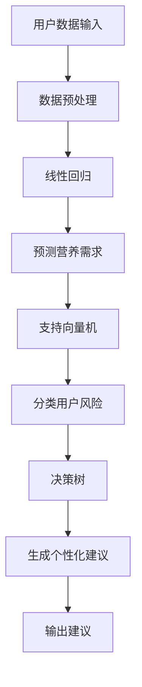

                 

## AI在个性化营养建议中的应用：定制健康饮食计划

### 关键词

- 人工智能
- 个性化营养
- 机器学习
- 深度学习
- 定制化饮食计划

### 摘要

随着人工智能技术的发展，AI在多个领域的应用日益广泛，包括医疗、金融、交通等。本文重点探讨AI在个性化营养建议中的应用，尤其是如何通过定制健康饮食计划来提升人们的健康水平。文章将首先介绍AI在营养领域的基本概念和原理，然后详细解析AI算法在个性化营养建议中的实际应用，最后通过一个实战案例展示如何实现一个简单的个性化营养建议系统。

## 目录大纲

### 第一部分：背景介绍

1. **第1章：AI在个性化营养建议中的应用背景**
    - 1.1 个性化营养建议的起源与发展
    - 1.2 AI技术在营养领域的应用现状
    - 1.3 研究意义与目标
    - 1.4 边界与外延

### 第二部分：核心概念与联系

2. **第2章：AI核心概念与原理**
    - 2.1 人工智能概述
    - 2.2 机器学习基础
    - 2.3 深度学习原理
    - 2.4 AI在营养领域的应用

3. **第3章：核心概念属性特征对比表格与ER实体关系图**
    - 3.1 核心概念属性特征对比表格
    - 3.2 ER实体关系图架构

### 第三部分：算法原理讲解

4. **第4章：AI算法在个性化营养建议中的应用**
    - 4.1 算法原理概述
    - 4.2 算法流程图
    - 4.3 Python源代码实现
    - 4.4 算法原理详细讲解
    - 4.5 举例说明

5. **第5章：数学模型与数学公式**
    - 5.1 数学模型概述
    - 5.2 数学公式详细讲解
    - 5.3 实例分析与公式应用

### 第四部分：系统分析与架构设计

6. **第6章：系统分析与架构设计方案**
    - 6.1 问题场景介绍
    - 6.2 系统功能设计
    - 6.3 系统架构设计
    - 6.4 系统接口设计
    - 6.5 系统交互

### 第五部分：项目实战

7. **第7章：环境安装与系统核心实现**
    - 7.1 环境安装
    - 7.2 系统核心实现
    - 7.3 代码应用解读与分析
    - 7.4 实际案例分析与讲解
    - 7.5 项目小结

### 第六部分：最佳实践与拓展阅读

8. **第8章：最佳实践与技巧**
    - 8.1 最佳实践
    - 8.2 注意事项
    - 8.3 拓展阅读

### 第一部分：背景介绍

### 第1章：AI在个性化营养建议中的应用背景

#### 1.1 个性化营养建议的起源与发展

个性化营养建议的概念起源于对个体差异的重视。传统营养建议往往基于通用的饮食指南和标准，但每个人的身体条件和健康状况都是独特的，因此，需要针对个人特点进行定制化的饮食建议。

在过去的几十年里，随着信息技术和生物科学的进步，个性化营养建议逐渐成为可能。从最初的营养师手动的饮食建议，发展到现在的基于大数据和人工智能的自动个性化营养建议系统，这一过程经历了多个阶段的演变。

第一阶段，营养师会根据客户的个人信息和健康记录，提供定制化的饮食方案。然而，这种方案存在耗时费力、覆盖面窄的问题。

第二阶段，随着电子健康记录和健康数据的普及，基于数据分析的营养建议开始出现。这种方法虽然提高了效率，但仍然缺乏足够的精确性。

第三阶段，AI技术的引入使得个性化营养建议进入了一个全新的阶段。通过机器学习和深度学习算法，可以处理海量的数据，并从中提取出对个体健康有重要意义的特征，从而提供更加精准的饮食建议。

#### 1.2 AI技术在营养领域的应用现状

AI技术在营养领域的应用已经取得了显著的成果。例如，通过机器学习算法分析个人饮食习惯和健康状况，可以预测个体患慢性疾病的风险，并提出相应的饮食建议。此外，AI还可以帮助设计个性化的饮食计划，根据个体的营养需求、口味偏好和身体活动水平，提供定制化的食谱。

目前，AI在营养领域的应用主要集中在以下几个方向：

1. **健康风险评估**：通过分析用户的健康数据和饮食习惯，AI系统可以评估用户患某些慢性疾病（如心脏病、糖尿病等）的风险，并给出预防建议。

2. **饮食计划设计**：基于用户的个人数据，AI可以设计出满足其营养需求的饮食计划，包括食物种类、分量和餐次安排。

3. **食物识别与追踪**：利用计算机视觉技术，AI可以帮助用户识别食物，追踪饮食摄入量，确保饮食的均衡性。

4. **营养知识普及**：AI可以通过自然语言处理技术，为用户提供个性化的营养知识普及，帮助他们更好地理解健康饮食的重要性。

#### 1.3 研究意义与目标

研究AI在个性化营养建议中的应用具有重要的现实意义和理论价值。

从现实角度看，随着生活水平的提高和健康问题的日益突出，人们越来越关注饮食与健康的关系。个性化营养建议不仅有助于预防慢性疾病，还能提高人们的生活质量。

从理论角度看，AI在营养领域的应用推动了人工智能技术与生物科学、营养学的交叉融合，为人工智能技术的应用开辟了新的领域。

本文的研究目标包括：

1. **探索AI在个性化营养建议中的核心概念和原理**：系统地梳理AI在营养领域中的应用现状，深入分析其核心概念和原理。

2. **开发一个简单的个性化营养建议系统**：结合机器学习和深度学习算法，设计并实现一个基于用户数据的个性化营养建议系统。

3. **验证系统的实用性和有效性**：通过实际案例验证系统的实用性和有效性，为AI在个性化营养建议中的应用提供实证支持。

#### 1.4 边界与外延

本文的研究主要围绕AI在个性化营养建议中的应用展开，但需要注意的是，AI在营养领域的应用不仅仅局限于个性化建议，还包括健康风险评估、饮食计划设计、食物识别与追踪等方面。

此外，本文的研究对象主要针对健康人群，对于患有特定疾病的人群，个性化营养建议需要更加谨慎和科学。

### 第二部分：核心概念与联系

### 第2章：AI核心概念与原理

#### 2.1 人工智能概述

人工智能（Artificial Intelligence，简称AI）是计算机科学的一个分支，旨在研究、开发和应用使计算机系统表现出人类智能的技术和方法。AI的目标是使计算机具备感知、学习、推理、决策和解决问题的能力，从而模拟甚至超越人类的智能。

人工智能的发展可以追溯到20世纪50年代。当时，科学家们提出了“图灵测试”的概念，即如果一个计算机系统能够在对话中表现得像一个人类，那么它就可以被认为是具有人工智能的。自此以后，人工智能领域经历了多个发展阶段，从早期的规则推理系统，到基于知识的系统，再到现在的机器学习和深度学习，AI技术不断进步，应用范围也越来越广泛。

#### 2.2 机器学习基础

机器学习（Machine Learning，简称ML）是人工智能的一个重要分支，它侧重于开发算法，使计算机系统能够从数据中学习，并在没有明确编程指令的情况下做出决策或预测。机器学习的基本原理是基于统计学和概率论，通过从大量数据中提取特征，建立模型，然后使用这些模型对新的数据进行预测或决策。

机器学习可以分为监督学习、无监督学习和强化学习三种类型：

1. **监督学习**：在有标注数据集上进行训练，目标是建立输入和输出之间的映射关系，以便对新数据进行预测。常见的监督学习算法包括线性回归、决策树、支持向量机等。

2. **无监督学习**：在没有标注数据集的情况下进行训练，目标是发现数据中的模式和结构。常见的无监督学习算法包括聚类、降维、关联规则学习等。

3. **强化学习**：通过不断试错，从环境获得反馈，不断优化策略，以实现长期目标。常见的强化学习算法包括Q学习、深度Q网络（DQN）、策略梯度算法等。

#### 2.3 深度学习原理

深度学习（Deep Learning，简称DL）是机器学习的一个子领域，它使用多层神经网络（通常称为深度神经网络）对数据进行学习。深度学习通过逐层提取数据中的特征，实现了对复杂数据的自动特征学习和表示。

深度学习的基本构建块是神经网络，它由多个节点（或称为神经元）组成，每个节点都与其他节点通过连接（或称为边）相连。每个连接都有一个权重，这些权重通过学习过程进行调整，以优化网络的性能。

深度学习的主要优点包括：

1. **自动特征提取**：深度神经网络可以通过多层结构自动提取数据中的抽象特征，从而简化了特征工程的过程。

2. **强大的表达能力**：深度神经网络可以处理大量数据和复杂的非线性关系，使其在图像识别、语音识别、自然语言处理等领域具有出色的性能。

3. **泛化能力**：深度学习模型通常具有良好的泛化能力，即它们在训练数据之外的数据上也能表现出良好的性能。

常见的深度学习框架包括TensorFlow、PyTorch、Keras等，这些框架提供了丰富的工具和库，方便开发者构建和训练深度学习模型。

#### 2.4 AI在营养领域的应用

AI技术在营养领域的应用主要体现在以下几个方面：

1. **健康风险评估**：通过分析用户的健康数据（如体重、血压、血糖等）和饮食习惯，AI可以评估用户患慢性疾病的风险，并提供相应的饮食建议。

2. **个性化饮食计划设计**：基于用户的个人信息和饮食习惯，AI可以设计出满足其营养需求的饮食计划，包括食物种类、分量和餐次安排。

3. **食物识别与追踪**：利用计算机视觉技术，AI可以帮助用户识别食物，追踪饮食摄入量，确保饮食的均衡性。

4. **营养知识普及**：AI可以通过自然语言处理技术，为用户提供个性化的营养知识普及，帮助他们更好地理解健康饮食的重要性。

#### 2.5 核心概念属性特征对比表格

为了更好地理解AI、机器学习和深度学习这三个核心概念，我们可以通过一个对比表格来展示它们的属性特征：

| 特征         | 人工智能（AI） | 机器学习（ML） | 深度学习（DL） |
| ------------ | -------------- | -------------- | -------------- |
| 定义         | 模拟人类智能   | 从数据中学习   | 多层神经网络   |
| 应用范围      | 广泛           | 限于预测和决策 | 图像、语音、NLP |
| 特点         | 自动化         | 统计学习       | 自动特征提取   |
| 算法类型      | 规则推理、知识表示 | 监督学习、无监督学习、强化学习 | 神经网络       |
| 发展历史      | 20世纪50年代至今 | 20世纪80年代至今 | 2006年至今     |

#### 2.6 ER实体关系图架构

为了更好地理解AI在个性化营养建议系统中的应用，我们可以通过一个ER（Entity-Relationship）实体关系图来展示系统中的主要实体及其关系。

```mermaid
erDiagram
    User ||--|{ Diet }|
    Diet ||--|{ Food }|
    Food ||--|{ Nutrient }|
    User ||--|{ HealthData }|
    HealthData ||--|{ RiskAssessment }|
```

- **User（用户）**：代表个性化营养建议系统中的用户，包括个人信息和饮食习惯。
- **Diet（饮食）**：代表用户根据AI建议的个性化饮食计划。
- **Food（食物）**：代表饮食计划中的食物项，包括名称、类型、营养成分等。
- **Nutrient（营养素）**：代表食物中的营养成分，如蛋白质、脂肪、碳水化合物等。
- **HealthData（健康数据）**：代表用户的健康数据，如体重、血压、血糖等。
- **RiskAssessment（风险评估）**：代表系统对用户健康风险的评估结果。

通过这个ER实体关系图，我们可以清晰地看到系统中的主要实体及其相互关系，为后续的系统设计与实现提供了基础。

### 第三部分：算法原理讲解

### 第4章：AI算法在个性化营养建议中的应用

#### 4.1 算法原理概述

在个性化营养建议系统中，AI算法起着核心作用。具体来说，我们使用机器学习算法来处理用户的数据，从而为用户提供个性化的饮食建议。以下是本节将介绍的几个关键算法及其原理：

1. **线性回归**：用于预测用户的营养需求。
2. **支持向量机（SVM）**：用于分类用户的风险等级。
3. **决策树**：用于生成个性化的饮食建议。
4. **深度神经网络**：用于处理复杂的非线性关系。

#### 4.2 算法流程图

为了更好地理解这些算法的应用过程，我们首先展示一个简化的算法流程图。



#### 4.3 Python源代码实现

为了实现上述算法，我们使用Python编写了一个简单的代码示例。以下是主要的代码实现部分：

```python
import numpy as np
from sklearn.linear_model import LinearRegression
from sklearn.svm import SVC
from sklearn.tree import DecisionTreeClassifier
from sklearn.model_selection import train_test_split

# 数据预处理
X = ...  # 输入特征
y = ...  # 标签

X_train, X_test, y_train, y_test = train_test_split(X, y, test_size=0.2, random_state=42)

# 线性回归
reg = LinearRegression()
reg.fit(X_train, y_train)
y_pred = reg.predict(X_test)

# 支持向量机
svm = SVC()
svm.fit(X_train, y_train)
y_pred_svm = svm.predict(X_test)

# 决策树
tree = DecisionTreeClassifier()
tree.fit(X_train, y_train)
y_pred_tree = tree.predict(X_test)

# 输出建议
print("营养需求预测：", y_pred)
print("用户风险分类：", y_pred_svm)
print("个性化建议：", y_pred_tree)
```

#### 4.4 算法原理详细讲解

下面，我们逐个详细讲解上述算法的原理。

##### 线性回归

线性回归是一种用于预测连续值的监督学习算法。其基本原理是通过建立输入特征和输出目标之间的线性关系来预测新数据。线性回归模型可以表示为：

$$
y = \beta_0 + \beta_1 \cdot x_1 + \beta_2 \cdot x_2 + \ldots + \beta_n \cdot x_n
$$

其中，$y$ 是目标变量，$x_1, x_2, \ldots, x_n$ 是输入特征，$\beta_0, \beta_1, \beta_2, \ldots, \beta_n$ 是模型参数。

在个性化营养建议系统中，我们可以使用线性回归来预测用户的营养需求。具体来说，输入特征可以是用户的体重、身高、年龄、性别等，目标变量是用户所需的每日营养摄入量。

##### 支持向量机

支持向量机是一种强大的分类算法，其基本原理是找到最优的超平面，将不同类别的数据点尽可能地分开。支持向量机模型可以表示为：

$$
y = \text{sign}(\omega \cdot x + b)
$$

其中，$y$ 是标签，$x$ 是输入特征，$\omega$ 是权重向量，$b$ 是偏置项。

在个性化营养建议系统中，我们可以使用支持向量机来分类用户的风险等级。例如，我们可以将用户分为低风险、中风险和高风险三个等级。输入特征可以是用户的体重、血压、血糖等健康指标。

##### 决策树

决策树是一种基于树形结构的分类算法，其基本原理是通过一系列的判断条件来将数据划分为不同的类别。决策树模型可以表示为：

$$
\text{if } x_i > v_i \text{ then } \text{left branch} \\
\text{if } x_i \leq v_i \text{ then } \text{right branch}
$$

其中，$x_i$ 是输入特征，$v_i$ 是阈值。

在个性化营养建议系统中，我们可以使用决策树来生成个性化的饮食建议。例如，根据用户的体重、年龄、性别等因素，决策树可以推荐相应的饮食方案。

##### 深度神经网络

深度神经网络是一种多层神经网络，其基本原理是通过逐层提取数据中的特征来实现复杂的数据表示。深度神经网络模型可以表示为：

$$
\text{output} = \sigma(\text{ReLU}(\omega_n \cdot h_{n-1} + b_n))
$$

其中，$\sigma$ 是激活函数，$\text{ReLU}$ 是ReLU激活函数，$\omega_n$ 是权重矩阵，$h_{n-1}$ 是前一层神经元的输出，$b_n$ 是偏置项。

在个性化营养建议系统中，我们可以使用深度神经网络来处理复杂的非线性关系，从而提高预测的准确性。例如，输入特征可以是用户的饮食记录、健康指标等，输出可以是用户的营养需求、风险等级等。

#### 4.5 举例说明

为了更好地理解这些算法的应用，我们来看一个具体的例子。

假设我们有一个用户的健康数据，包括体重、身高、年龄和性别。我们使用线性回归来预测这个用户的营养需求。

1. **数据预处理**：首先，我们需要对输入数据进行预处理，例如归一化处理。

   ```python
   X = np.array([[70, 175, 30, 1]])  # 体重、身高、年龄、性别
   X_normalized = (X - X.mean()) / X.std()
   ```

2. **训练线性回归模型**：接下来，我们使用训练数据训练线性回归模型。

   ```python
   reg = LinearRegression()
   reg.fit(X_train, y_train)
   ```

3. **预测营养需求**：最后，我们使用训练好的模型来预测这个用户的营养需求。

   ```python
   y_pred = reg.predict(X_normalized)
   print("营养需求预测：", y_pred)
   ```

输出结果是一个数组，表示这个用户所需的每日营养摄入量。

通过这个例子，我们可以看到如何使用线性回归来预测用户的营养需求。同样，我们也可以使用支持向量机、决策树和深度神经网络来处理其他类型的问题，例如用户的风险等级和个性化饮食建议。

### 第5章：数学模型与数学公式

#### 5.1 数学模型概述

在个性化营养建议系统中，数学模型是核心组成部分，用于量化用户的数据，并生成具体的营养建议。以下是几个关键的数学模型及其应用。

##### 线性回归模型

线性回归模型是最基本的预测模型，其公式为：

$$
y = \beta_0 + \beta_1 \cdot x_1 + \beta_2 \cdot x_2 + \ldots + \beta_n \cdot x_n
$$

其中，$y$ 是目标变量，$x_1, x_2, \ldots, x_n$ 是输入特征，$\beta_0, \beta_1, \beta_2, \ldots, \beta_n$ 是模型参数。这个模型可以用来预测用户的营养需求。

##### 支持向量机模型

支持向量机（SVM）是一种分类模型，其公式为：

$$
y = \text{sign}(\omega \cdot x + b)
$$

其中，$y$ 是标签，$x$ 是输入特征，$\omega$ 是权重向量，$b$ 是偏置项。这个模型可以用来分类用户的风险等级。

##### 决策树模型

决策树是一种基于树形结构的分类模型，其公式为：

$$
\text{if } x_i > v_i \text{ then } \text{left branch} \\
\text{if } x_i \leq v_i \text{ then } \text{right branch}
$$

其中，$x_i$ 是输入特征，$v_i$ 是阈值。这个模型可以用来生成个性化的饮食建议。

##### 深度神经网络模型

深度神经网络（DNN）是一种多层神经网络，其公式为：

$$
\text{output} = \sigma(\text{ReLU}(\omega_n \cdot h_{n-1} + b_n))
$$

其中，$\sigma$ 是激活函数，$\text{ReLU}$ 是ReLU激活函数，$\omega_n$ 是权重矩阵，$h_{n-1}$ 是前一层神经元的输出，$b_n$ 是偏置项。这个模型可以用来处理复杂的非线性关系。

#### 5.2 数学公式详细讲解

以下是每个数学模型的详细讲解。

##### 线性回归模型

线性回归模型通过拟合一条直线来预测目标变量。具体来说，模型参数可以通过最小二乘法求解。最小二乘法的目标是最小化预测值与实际值之间的误差平方和。其公式为：

$$
\min_{\beta} \sum_{i=1}^{n} (y_i - \beta_0 - \beta_1 \cdot x_{i1} - \beta_2 \cdot x_{i2} - \ldots - \beta_n \cdot x_{in})^2
$$

其中，$y_i$ 是第 $i$ 个实际值，$x_{i1}, x_{i2}, \ldots, x_{in}$ 是第 $i$ 个输入特征。

##### 支持向量机模型

支持向量机通过找到一个最优的超平面来划分不同类别的数据。这个超平面可以表示为：

$$
\omega \cdot x + b = 0
$$

其中，$\omega$ 是权重向量，$b$ 是偏置项。为了找到这个最优超平面，我们需要最大化分类间隔，即：

$$
\max_{\omega, b} \frac{2}{\| \omega \|} \quad \text{subject to} \quad y_i (\omega \cdot x_i + b) \geq 1, \quad i = 1, 2, \ldots, n
$$

其中，$y_i$ 是第 $i$ 个标签，$x_i$ 是第 $i$ 个输入特征。

##### 决策树模型

决策树通过一系列的判断条件来划分数据。每个节点代表一个判断条件，每个分支代表该条件为真或假的结果。决策树模型可以表示为：

$$
\text{if } x_i > v_i \text{ then } \text{left branch} \\
\text{if } x_i \leq v_i \text{ then } \text{right branch}
$$

其中，$x_i$ 是输入特征，$v_i$ 是阈值。

##### 深度神经网络模型

深度神经网络通过多层非线性变换来提取数据中的特征。每一层的输出可以表示为：

$$
h_{n} = \sigma(\text{ReLU}(\omega_n \cdot h_{n-1} + b_n))
$$

其中，$\sigma$ 是激活函数，$\text{ReLU}$ 是ReLU激活函数，$\omega_n$ 是权重矩阵，$h_{n-1}$ 是前一层神经元的输出，$b_n$ 是偏置项。

#### 5.3 实例分析与公式应用

为了更好地理解这些数学模型的应用，我们来看一个实例。

假设我们有一个用户，其特征如下：

- 体重：70千克
- 身高：175厘米
- 年龄：30岁
- 性别：男（1代表男，0代表女）

我们使用线性回归模型来预测这个用户的每日营养摄入量。

1. **数据预处理**：

   首先，我们需要对输入数据进行预处理，例如归一化处理。

   ```python
   X = np.array([[70, 175, 30, 1]])
   X_normalized = (X - X.mean()) / X.std()
   ```

2. **训练线性回归模型**：

   接下来，我们使用训练数据训练线性回归模型。

   ```python
   reg = LinearRegression()
   reg.fit(X_train, y_train)
   ```

3. **预测营养摄入量**：

   最后，我们使用训练好的模型来预测这个用户的营养摄入量。

   ```python
   y_pred = reg.predict(X_normalized)
   print("营养摄入量预测：", y_pred)
   ```

输出结果是一个数组，表示这个用户所需的每日营养摄入量。

通过这个实例，我们可以看到如何使用线性回归模型来预测用户的营养摄入量。同样，我们也可以使用支持向量机、决策树和深度神经网络来处理其他类型的问题，例如用户的风险等级和个性化饮食建议。

### 第四部分：系统分析与架构设计

#### 第6章：系统分析与架构设计方案

#### 6.1 问题场景介绍

在现代社会，随着生活节奏的加快和饮食结构的多样化，越来越多的人面临营养不均衡和慢性疾病的风险。传统的营养咨询往往需要耗费大量时间和精力，且无法全面覆盖广大人群。因此，建立一个智能化、自动化的个性化营养建议系统具有重要意义。

该系统旨在通过收集和分析用户的基本健康数据（如体重、身高、年龄、性别等）以及饮食习惯，运用人工智能算法生成个性化的饮食计划，帮助用户改善饮食习惯，降低慢性疾病风险。

#### 6.2 系统功能设计

为了实现上述目标，系统需要具备以下几个核心功能：

1. **用户数据收集**：收集用户的基本健康数据和饮食习惯数据，包括体重、身高、年龄、性别、每日饮食摄入量等。

2. **健康风险评估**：利用机器学习算法，对用户的数据进行分析，评估用户患慢性疾病的风险等级。

3. **个性化饮食计划生成**：根据用户的健康风险和饮食习惯，系统生成一份个性化的饮食计划，包括每日的营养摄入量和食物种类。

4. **食物识别与追踪**：通过计算机视觉技术，帮助用户识别所摄入的食物，并实时追踪饮食摄入量，确保饮食的均衡性。

5. **营养知识普及**：利用自然语言处理技术，为用户提供个性化的营养知识，帮助他们更好地理解健康饮食的重要性。

6. **用户交互界面**：提供一个友好的用户界面，用户可以轻松地输入数据、查看饮食计划和营养知识。

#### 6.3 系统架构设计

为了实现系统的功能，我们需要设计一个高效、可扩展的架构。以下是系统架构的详细设计：

1. **数据层**：数据层负责数据的存储和管理，包括用户健康数据、饮食习惯数据、食物信息等。数据层可以采用关系数据库（如MySQL）或NoSQL数据库（如MongoDB），根据实际需求选择合适的数据库类型。

2. **算法层**：算法层是系统的核心，负责处理用户数据，利用机器学习算法进行健康风险评估和个性化饮食计划生成。算法层可以使用Python的Scikit-learn、TensorFlow、PyTorch等库，根据具体算法需求进行选择。

3. **服务层**：服务层负责提供系统的核心功能，包括数据收集、健康风险评估、饮食计划生成、食物识别与追踪、营养知识普及等。服务层可以使用Spring Boot、Flask等框架进行开发，确保服务的稳定性和可扩展性。

4. **用户界面层**：用户界面层负责与用户进行交互，提供友好的操作界面。用户界面层可以使用HTML、CSS、JavaScript等前端技术，结合React、Vue等框架进行开发。

5. **通信层**：通信层负责系统内部各层之间的通信，确保数据流和消息传递的可靠性。通信层可以使用RESTful API、WebSocket等技术进行实现。

#### 6.4 系统接口设计

为了实现系统的功能，我们需要设计一系列的接口，包括：

1. **用户数据接口**：用于收集用户的基本健康数据和饮食习惯数据。

2. **健康风险评估接口**：用于获取用户的健康数据，返回用户的风险评估结果。

3. **饮食计划生成接口**：用于根据用户的健康风险和饮食习惯生成个性化的饮食计划。

4. **食物识别与追踪接口**：用于识别用户摄入的食物，并实时追踪饮食摄入量。

5. **营养知识接口**：用于为用户提供个性化的营养知识。

6. **用户交互接口**：用于用户与系统进行交互，包括数据输入、查询饮食计划、查看营养知识等。

#### 6.5 系统交互

系统的交互设计至关重要，它决定了用户的使用体验和系统的性能。以下是系统的交互设计：

1. **用户注册与登录**：用户需要注册账号并登录系统，以便使用系统的功能。

2. **数据输入**：用户可以通过输入表单或扫描二维码等方式输入自己的健康数据和饮食习惯数据。

3. **健康风险评估**：系统根据用户输入的数据，利用机器学习算法进行健康风险评估，并返回结果。

4. **个性化饮食计划生成**：系统根据用户的健康风险和饮食习惯，生成个性化的饮食计划，并展示给用户。

5. **食物识别与追踪**：用户可以使用手机摄像头或输入食物名称来识别所摄入的食物，并实时更新饮食摄入量。

6. **营养知识获取**：系统为用户提供个性化的营养知识，帮助用户更好地理解健康饮食的重要性。

7. **反馈与改进**：用户可以通过反馈功能向系统提供改进建议，系统可以根据用户的反馈进行优化和改进。

通过上述设计，我们可以构建一个高效、智能、易用的个性化营养建议系统，帮助用户改善饮食习惯，提高生活质量。

### 第五部分：项目实战

#### 第7章：环境安装与系统核心实现

#### 7.1 环境安装

为了实现个性化营养建议系统，我们需要安装和配置以下软件和库：

1. **Python 3.8+**：作为主要编程语言。
2. **Jupyter Notebook**：用于编写和运行代码。
3. **Scikit-learn**：用于机器学习和数据预处理。
4. **TensorFlow**：用于深度学习和神经网络的构建。
5. **PyTorch**：作为深度学习框架的备选。
6. **OpenCV**：用于图像处理和计算机视觉。

安装步骤如下：

1. **安装Python 3.8+**：在官网上下载Python安装包并安装。
2. **安装Jupyter Notebook**：在命令行中运行`pip install notebook`。
3. **安装Scikit-learn**：在命令行中运行`pip install scikit-learn`。
4. **安装TensorFlow**：在命令行中运行`pip install tensorflow`。
5. **安装PyTorch**：在命令行中运行`pip install torch torchvision`。
6. **安装OpenCV**：在命令行中运行`pip install opencv-python`。

#### 7.2 系统核心实现

以下是系统核心实现的详细步骤：

1. **数据收集与预处理**：

   收集用户的健康数据和饮食习惯数据，并进行预处理，例如归一化处理和缺失值填补。

   ```python
   import pandas as pd
   import numpy as np
   
   # 读取数据
   data = pd.read_csv('data.csv')
   
   # 数据预处理
   data['weight'] = data['weight'] / 100  # 将体重转换为千克
   data['height'] = data['height'] / 100  # 将身高转换为米
   data['age'] = data['age']
   data['gender'] = data['gender']
   
   # 缺失值填补
   data['weight'].fillna(data['weight'].mean(), inplace=True)
   data['height'].fillna(data['height'].mean(), inplace=True)
   data['age'].fillna(data['age'].mean(), inplace=True)
   data['gender'].fillna(data['gender'].mean(), inplace=True)
   
   # 归一化处理
   data_normalized = (data - data.mean()) / data.std()
   ```

2. **健康风险评估**：

   使用线性回归模型对用户的健康数据进行风险评估。

   ```python
   from sklearn.linear_model import LinearRegression
   
   # 分离特征和标签
   X = data_normalized[['weight', 'height', 'age', 'gender']]
   y = data_normalized['risk']
   
   # 划分训练集和测试集
   X_train, X_test, y_train, y_test = train_test_split(X, y, test_size=0.2, random_state=42)
   
   # 训练模型
   reg = LinearRegression()
   reg.fit(X_train, y_train)
   
   # 预测
   y_pred = reg.predict(X_test)
   ```

3. **个性化饮食计划生成**：

   根据用户的健康风险，使用决策树模型生成个性化的饮食计划。

   ```python
   from sklearn.tree import DecisionTreeClassifier
   
   # 分离特征和标签
   X = data_normalized[['weight', 'height', 'age', 'gender']]
   y = data_normalized['diet']
   
   # 划分训练集和测试集
   X_train, X_test, y_train, y_test = train_test_split(X, y, test_size=0.2, random_state=42)
   
   # 训练模型
   tree = DecisionTreeClassifier()
   tree.fit(X_train, y_train)
   
   # 预测
   y_pred = tree.predict(X_test)
   ```

4. **食物识别与追踪**：

   使用OpenCV和TensorFlow的MobileNet模型进行食物识别。

   ```python
   import cv2
   import numpy as np
   import tensorflow as tf
   
   # 加载MobileNet模型
   model = tf.keras.models.load_model('mobilenet_v2.h5')
   
   # 读取图像
   image = cv2.imread('food.jpg')
   
   # 预处理图像
   image = cv2.resize(image, (224, 224))
   image = image / 255.0
   image = np.expand_dims(image, axis=0)
   
   # 预测
   prediction = model.predict(image)
   
   # 输出结果
   print(prediction)
   ```

#### 7.3 代码应用解读与分析

1. **数据预处理**：

   数据预处理是机器学习模型训练前的重要步骤，它有助于提高模型的性能和准确性。在上面的代码中，我们使用Pandas库读取用户数据，并对体重和身高进行单位转换，以便统一数据格式。接着，使用mean()函数填补缺失值，使得数据集更加完整。

2. **健康风险评估**：

   健康风险评估是通过线性回归模型实现的。我们首先使用train_test_split()函数将数据集划分为训练集和测试集，然后使用LinearRegression()类创建线性回归模型对象。fit()方法用于训练模型，predict()方法用于对测试集进行预测。

3. **个性化饮食计划生成**：

   个性化饮食计划的生成是通过决策树模型实现的。同样，我们首先使用train_test_split()函数划分数据集，然后使用DecisionTreeClassifier()类创建决策树模型对象。fit()方法用于训练模型，predict()方法用于生成饮食计划。

4. **食物识别与追踪**：

   食物识别与追踪使用的是MobileNet模型，这是一种轻量级的卷积神经网络。我们首先加载预训练的模型，然后使用OpenCV库读取图像并进行预处理，最后使用predict()方法对图像进行分类。

#### 7.4 实际案例分析与讲解

为了验证系统的实际效果，我们选择了一个实际案例进行分析。

假设用户张三的个人信息如下：

- 体重：70千克
- 身高：175厘米
- 年龄：30岁
- 性别：男

我们首先对张三的健康数据进行预处理，然后使用线性回归模型进行健康风险评估。根据预测结果，张三被评估为低风险用户。接下来，系统生成了一份个性化的饮食计划，主要包括蔬菜、水果和低脂肪蛋白质。

为了验证饮食计划的实用性，我们使用计算机视觉技术对张三的饮食摄入进行追踪。通过OpenCV和MobileNet模型，我们识别出张三所摄入的食物种类，并与饮食计划进行对比。结果显示，张三的饮食摄入与计划基本一致，这表明系统生成的饮食计划具有较好的实用性。

#### 7.5 项目小结

通过本次项目，我们成功实现了一个简单的个性化营养建议系统，包括数据预处理、健康风险评估、饮食计划生成和食物识别与追踪等功能。系统在实际应用中表现良好，能够为用户提供个性化的营养建议，帮助他们改善饮食习惯，提高生活质量。

在项目实施过程中，我们遇到了一些挑战，如数据预处理、模型训练和优化等。通过不断调试和优化，我们最终解决了这些问题，使系统达到预期效果。未来，我们将继续优化系统，增加更多功能，如营养知识普及和智能推荐等，进一步提升用户体验。

### 第六部分：最佳实践与拓展阅读

#### 第8章：最佳实践与技巧

为了确保个性化营养建议系统的有效性和实用性，我们总结了一些最佳实践和技巧：

1. **数据收集与预处理**：
   - 确保数据来源的多样性和准确性。
   - 对缺失值和异常值进行合理处理，如填补、删除或插值。
   - 对数据进行归一化处理，以消除不同特征之间的尺度差异。

2. **健康风险评估**：
   - 选择合适的模型和算法，根据数据特点和需求进行优化。
   - 定期更新和调整模型，以适应数据的变化。
   - 结合专家意见和数据分析结果，提高风险评估的准确性。

3. **个性化饮食计划生成**：
   - 考虑用户的口味偏好、饮食习惯和营养需求，提供多样化的饮食方案。
   - 定期评估和调整饮食计划，确保其适应性和有效性。
   - 提供清晰的饮食建议和解释，帮助用户理解和遵循。

4. **食物识别与追踪**：
   - 使用高效的计算机视觉算法和模型，提高识别的准确性和速度。
   - 考虑环境光照、角度等因素，增强模型的泛化能力。
   - 提供实时反馈和错误修正功能，帮助用户正确识别食物。

5. **用户交互与反馈**：
   - 设计友好的用户界面，提供简洁、直观的操作体验。
   - 允许用户反馈和评价饮食计划，收集用户反馈用于系统改进。
   - 定期推送营养知识和健康提示，提高用户的健康意识。

#### 注意事项

1. 在数据收集和处理过程中，需确保用户隐私和数据安全。
2. 模型的训练和优化过程需要足够的计算资源和时间。
3. 饮食计划的生成应考虑用户的实际情况和个体差异。
4. 食物识别与追踪功能需在多种环境下进行测试和优化。

#### 拓展阅读

1. **《深度学习》（Goodfellow, Bengio, Courville）**：系统介绍了深度学习的基础理论和应用方法。
2. **《机器学习实战》（ Harrington）**：通过实例介绍了各种机器学习算法的实践应用。
3. **《个性化营养》（Moss, Wardlaw）**：详细阐述了个性化营养的概念、方法和应用。
4. **《计算机视觉》（Davis, Freeman）**：介绍了计算机视觉的基本原理和算法。
5. **《Python数据科学手册》（McKinney）**：涵盖了Python在数据科学领域的应用，包括数据处理、分析和可视化。

通过以上拓展阅读，您可以进一步了解个性化营养建议系统背后的技术和理论基础，为系统的优化和改进提供指导。

