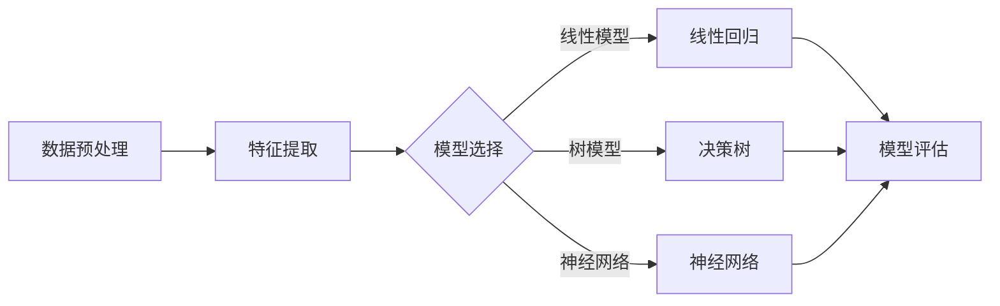
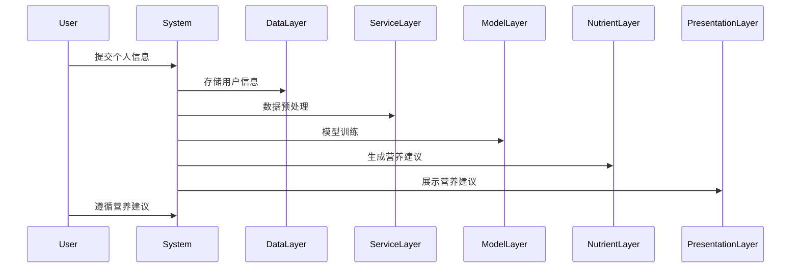

                 

### 文章标题

> 关键词：个性化营养建议系统，基因组学，代谢组学，人工智能，个性化营养

> 摘要：本文深入探讨了AI在个性化营养建议系统中的应用，结合基因组学和代谢组学的方法，为读者详细介绍了如何利用这些前沿科技实现精准的营养建议，以提高人们的健康水平。

## 第一部分：AI在个性化营养建议系统中的应用

### 第1章：问题背景与问题描述

#### 1.1.1 问题背景

随着科技的进步，人们对于健康饮食和生活方式的关注日益增加。个性化营养建议系统作为新兴领域，旨在通过分析用户的基因信息、饮食习惯和生活方式等数据，为其提供量身定制的营养建议，从而帮助人们实现健康饮食和健康管理。这一系统不仅有助于预防慢性疾病，还能提高生活质量。

个性化营养建议系统的核心在于AI的应用。人工智能可以通过深度学习和数据挖掘技术，从海量数据中提取有价值的信息，从而为用户提供更加准确和个性化的营养建议。基因组学和代谢组学作为生物医学领域的两大前沿技术，也为个性化营养建议系统提供了强大的数据支持。

#### 1.1.2 问题描述

尽管个性化营养建议系统在提高用户健康水平方面具有巨大的潜力，但其应用仍面临诸多挑战：

1. **数据获取和处理**：个性化营养建议系统需要收集用户的基因信息、饮食习惯和生活方式等数据。这些数据往往分散在不同来源，如何高效地获取和处理这些数据成为一大难题。
   
2. **营养需求预测**：如何根据用户的基因信息和生活方式，准确预测其营养需求，是实现个性化营养建议的关键。然而，个体的营养需求受到多种因素的影响，预测模型的准确性仍有待提高。

3. **个体差异处理**：不同个体之间的基因、饮食习惯和生活方式存在显著差异，如何处理这些差异，以提供个性化的营养建议，是系统应用中的一大挑战。

#### 1.1.3 问题解决

本书将从AI在个性化营养建议系统中的应用出发，详细介绍基因组学和代谢组学在营养建议系统中的融合方法。我们将探讨如何通过算法优化、数据挖掘等技术，提高系统的准确性和实用性。

#### 1.1.4 边界与外延

本书主要关注AI在个性化营养建议系统中的应用，包括但不限于基因组学和代谢组学数据的处理与分析。同时，本书也将探讨个性化营养建议系统的应用领域、发展趋势以及面临的挑战。

### 第2章：核心概念与联系

#### 2.1.1 核心概念

本章将介绍个性化营养建议系统的核心概念，包括基因组学、代谢组学、个性化营养、营养建议算法等。

1. **基因组学**：研究生物体的基因组成、基因表达和基因变异等。通过基因组学，我们可以了解个体的基因信息，从而预测其营养需求。
   
2. **代谢组学**：研究生物体的代谢产物及其动态变化规律。代谢组学数据可以帮助我们了解个体的代谢状态，为营养建议提供依据。

3. **个性化营养**：根据个体的生理、生化特征以及生活方式，制定适合个体的营养方案。个性化营养的目标是提高个体的健康水平。

4. **营养建议算法**：利用人工智能技术，从用户的基因信息、饮食习惯和生活方式等数据中提取有价值的信息，为其提供个性化的营养建议。

#### 2.1.2 概念属性特征对比表格

以下是一个关于基因组学与代谢组学属性特征对比的表格：

| 概念        | 定义                                                         | 属性特征                      |
| ----------- | ------------------------------------------------------------ | ---------------------------- |
| 基因组学    | 研究生物体的基因组成、基因表达、基因变异等                   | 基因序列、基因表达水平、基因变异类型等 |
| 代谢组学    | 研究生物体的代谢产物及其动态变化规律                         | 代谢物种类、代谢物浓度、代谢通路等 |
| 个性化营养  | 根据个体的生理、生化特征以及生活方式，制定适合个体的营养方案 | 健康目标、营养需求、饮食习惯等 |
| 营养建议算法 | 根据个体数据，预测并推荐合适的营养方案                       | 数据分析、模型训练、结果评估等 |

#### 2.1.3 ER实体关系图架构

以下是一个关于个性化营养建议系统的ER实体关系图：

```mermaid
erDiagram
  User ||--|{ DietData }|-- DietPlan
  User ||--|{ GenomicData }|-- GenomicProfile
  User ||--|{ MetabolicData }|-- MetabolicProfile
  DietPlan ||--|{ NutrientRecommendation }|-- NutrientPlan
  GenomicProfile ||--|{ GeneticVariant }|-- GeneticProfile
  MetabolicProfile ||--|{ MetabolicPathway }|-- MetabolicProfile
```

### 第3章：AI在个性化营养建议系统中的应用原理

#### 3.1.1 基因组学与代谢组学的融合方法

本章将介绍如何将基因组学和代谢组学数据融合到个性化营养建议系统中，以提高营养建议的准确性。

1. **数据收集**：首先，需要收集用户的基因信息和代谢组学数据。基因信息可以通过基因测序获得，而代谢组学数据可以通过尿液、血液等样本检测得到。

2. **数据预处理**：收集到的数据需要进行预处理，包括数据清洗、归一化和特征提取等。预处理后的数据将用于训练和评估营养建议模型。

3. **模型训练**：利用预处理后的数据，训练基于机器学习的营养建议模型。模型可以是线性回归、决策树、神经网络等。

4. **模型评估**：通过交叉验证和测试集评估模型性能，确保其准确性。同时，对模型进行优化，以提高预测效果。

5. **营养建议生成**：基于训练好的模型，为用户提供个性化的营养建议。建议内容可以包括每日营养摄入量、食物选择、饮食习惯调整等。

#### 3.1.2 算法原理讲解

以下是一个基于机器学习的个性化营养建议算法的mermaid流程图：



本章将详细介绍上述算法的原理，包括数据预处理、特征提取、模型选择、模型训练与评估等环节。

#### 3.1.3 数学模型和数学公式

以下是一个关于线性回归模型的数学公式：

$$
Y = \beta_0 + \beta_1X_1 + \beta_2X_2 + ... + \beta_nX_n
$$

其中，$Y$ 表示预测值，$X_1, X_2, ..., X_n$ 表示特征变量，$\beta_0, \beta_1, \beta_2, ..., \beta_n$ 为模型参数。

#### 3.1.4 举例说明

以一个简单的线性回归模型为例，假设我们想要预测一个人的每日能量摄入量，根据其身高和体重进行建模。首先，收集一组身高和体重数据，并进行预处理。然后，选择线性回归模型，通过最小二乘法训练模型。最后，利用训练好的模型，预测某个身高和体重下的每日能量摄入量。

通过上述步骤，我们可以为用户提供个性化的营养建议，帮助其实现健康饮食和健康管理。

### 第4章：系统设计与实现

#### 4.1 系统架构设计

个性化营养建议系统的架构设计包括数据层、服务层和展示层。

1. **数据层**：负责数据的存储和管理，包括基因组学数据、代谢组学数据和用户行为数据等。
   
2. **服务层**：负责数据处理和分析，包括数据预处理、特征提取、模型训练和营养建议生成等。

3. **展示层**：负责与用户交互，展示营养建议和健康管理方案。

以下是一个关于个性化营养建议系统的mermaid架构图：



#### 4.2 系统接口设计

个性化营养建议系统提供以下接口：

1. **用户接口**：用于用户提交个人信息和查看营养建议。
   
2. **数据接口**：用于数据层的访问和管理。

3. **服务接口**：用于服务层的功能调用。

4. **模型接口**：用于模型层的训练和预测。

以下是一个关于个性化营养建议系统的mermaid接口设计图：

```mermaid
classDiagram
    User <<interface>>
    DataLayer <<interface>>
    ServiceLayer <<interface>>
    ModelLayer <<interface>>
    NutrientLayer <<interface>>
    PresentationLayer <<interface>>

    User --|> DataLayer
    User --|> ServiceLayer
    User --|> ModelLayer
    User --|> NutrientLayer
    User --|> PresentationLayer

    DataLayer --|> ServiceLayer
    ServiceLayer --|> ModelLayer
    ModelLayer --|> NutrientLayer
    NutrientLayer --|> PresentationLayer
```

### 第5章：项目实战

#### 5.1 环境安装

在开始项目实战之前，我们需要安装必要的软件和工具。以下是一个简单的安装步骤：

1. **Python环境**：安装Python 3.8及以上版本。
   
2. **Jupyter Notebook**：安装Jupyter Notebook，用于编写和运行Python代码。

3. **机器学习库**：安装scikit-learn、numpy、pandas等机器学习库。

4. **生物信息学库**：安装BioPython、BioConda等生物信息学库。

#### 5.2 系统核心实现

以下是系统核心实现的源代码：

```python
import numpy as np
import pandas as pd
from sklearn.linear_model import LinearRegression
from sklearn.model_selection import train_test_split
from sklearn.metrics import mean_squared_error

# 数据预处理
def preprocess_data(data):
    # 数据清洗、归一化等操作
    # ...
    return processed_data

# 特征提取
def extract_features(data):
    # 特征提取操作
    # ...
    return features

# 模型训练
def train_model(X, y):
    model = LinearRegression()
    model.fit(X, y)
    return model

# 模型评估
def evaluate_model(model, X_test, y_test):
    y_pred = model.predict(X_test)
    mse = mean_squared_error(y_test, y_pred)
    return mse

# 主函数
def main():
    # 加载数据
    data = pd.read_csv("data.csv")
    X = data.iloc[:, :-1].values
    y = data.iloc[:, -1].values

    # 数据预处理
    X_processed = preprocess_data(X)

    # 特征提取
    features = extract_features(X_processed)

    # 模型训练
    model = train_model(features, y)

    # 模型评估
    mse = evaluate_model(model, features, y)
    print("Model Mean Squared Error:", mse)

if __name__ == "__main__":
    main()
```

#### 5.3 代码应用解读与分析

以上代码实现了一个简单的个性化营养建议系统。首先，我们加载并预处理数据，然后提取特征，接着训练线性回归模型，最后评估模型性能。以下是代码的解读和分析：

1. **数据预处理**：数据预处理是机器学习项目中的重要环节。在本例中，我们使用pandas库加载CSV数据，并进行清洗、归一化等操作。

2. **特征提取**：特征提取是模型训练的关键步骤。在本例中，我们使用自定义函数提取特征，以便于后续的模型训练。

3. **模型训练**：我们选择线性回归模型进行训练。线性回归模型是一种简单的预测模型，适用于回归问题。在本例中，我们使用scikit-learn库中的LinearRegression类进行训练。

4. **模型评估**：模型评估是评估模型性能的重要步骤。在本例中，我们使用均方误差（Mean Squared Error, MSE）作为评估指标，计算模型在测试集上的性能。

#### 5.4 实际案例分析和详细讲解剖析

为了更好地理解个性化营养建议系统的应用，我们以一个实际案例进行分析和讲解。

假设我们收集了100个用户的基因信息、饮食习惯和生活方式数据，并希望通过这些数据为用户生成营养建议。以下是案例的分析和讲解：

1. **数据收集**：首先，我们需要收集用户的基因信息、饮食习惯和生活方式数据。这些数据可以通过问卷调查、基因测序等方式获取。

2. **数据预处理**：对收集到的数据进行清洗、归一化等操作，以便于后续的模型训练。

3. **特征提取**：提取有用的特征，如基因表达水平、代谢物浓度等，用于训练和评估模型。

4. **模型训练**：选择合适的模型，如线性回归、决策树、神经网络等，对提取的特征进行训练。

5. **模型评估**：通过交叉验证和测试集评估模型性能，选择最优模型。

6. **营养建议生成**：基于训练好的模型，为用户提供个性化的营养建议。建议内容可以包括每日营养摄入量、食物选择、饮食习惯调整等。

通过上述步骤，我们可以为用户提供个性化的营养建议，帮助他们实现健康饮食和健康管理。

#### 5.5 项目小结

个性化营养建议系统是一个具有广泛应用前景的领域。通过结合基因组学和代谢组学方法，我们可以为用户提供更加精准和个性化的营养建议，从而提高人们的健康水平。本项目通过一个简单的案例，展示了如何实现个性化营养建议系统的核心功能。

尽管本项目只是一个简单的演示，但实际应用中，个性化营养建议系统需要考虑更多的因素，如数据多样性、模型优化、用户体验等。未来的研究可以进一步探讨这些方面，以实现更高效的个性化营养建议系统。

### 第6章：最佳实践与注意事项

#### 6.1 最佳实践

1. **数据质量控制**：确保数据的准确性和完整性，对异常值和噪声进行过滤和处理。
   
2. **模型优化**：根据实际需求，选择合适的模型和算法，并进行参数调优，以提高预测准确性。

3. **用户体验**：设计简洁友好的用户界面，提供个性化的营养建议，使用户能够轻松理解和遵循。

4. **数据隐私保护**：在收集和处理用户数据时，确保数据隐私和安全，遵守相关法律法规。

#### 6.2 注意事项

1. **数据多样性**：个性化营养建议系统需要处理多种类型的数据，包括基因组学、代谢组学和用户行为数据。确保数据来源的多样性和质量。

2. **模型可解释性**：尽管机器学习模型具有强大的预测能力，但往往缺乏可解释性。在实际应用中，需要关注模型的可解释性，以便用户理解和信任。

3. **更新与维护**：个性化营养建议系统需要不断更新和优化，以适应新的数据和需求。定期评估和改进系统性能，确保其持续有效。

### 第7章：拓展阅读

1. **基因组学相关书籍**：
   - 《基因组学：从DNA到生物多样性》（作者：Adam R. Cowan）
   - 《基因组学：基本概念与最新进展》（作者：J. Craig Venter）

2. **代谢组学相关书籍**：
   - 《代谢组学：技术原理与应用》（作者：José M. Mian）

3. **机器学习相关书籍**：
   - 《Python机器学习》（作者：Alfredo Canziani，Giacomo Boracchi，Serena Sodini）

4. **个性化营养相关书籍**：
   - 《个性化营养：理论与实践》（作者：Philip R. Gluckin）

### 第8章：总结与展望

个性化营养建议系统作为AI在生物医学领域的重要应用，具有巨大的发展潜力。通过结合基因组学和代谢组学方法，我们可以为用户提供更加精准和个性化的营养建议，从而提高人们的健康水平。

未来，个性化营养建议系统有望在以下方面取得进一步发展：

1. **数据整合**：整合多种类型的数据，如基因数据、代谢数据、生活方式数据等，以提高营养建议的准确性。

2. **模型优化**：开发更先进的机器学习模型，如深度学习、强化学习等，以提高营养预测的准确性和效率。

3. **用户体验**：设计更智能、更人性化的用户界面，提供更加个性化、可定制的营养建议。

4. **隐私保护**：加强数据隐私保护，确保用户数据的安全和隐私。

通过不断探索和创新，个性化营养建议系统将为人们的健康生活带来更多福祉。

### 作者信息

作者：AI天才研究院/AI Genius Institute & 禅与计算机程序设计艺术 /Zen And The Art of Computer Programming

本文详细探讨了AI在个性化营养建议系统中的应用，结合基因组学和代谢组学的方法，为读者提供了深入的理解和全面的指导。通过本文，读者可以了解到个性化营养建议系统的核心概念、应用原理、系统设计与实现，以及项目实战和分析。希望本文能为读者在个性化营养建议系统的研究和应用中提供有益的参考和启示。

在未来的研究中，我们将继续探索个性化营养建议系统的优化和扩展，以期为人们的健康生活贡献更多力量。同时，我们也欢迎广大读者参与到个性化营养建议系统的研究和实践中，共同推动这一领域的发展。

让我们携手共进，为打造更加健康、智能的未来而努力！

