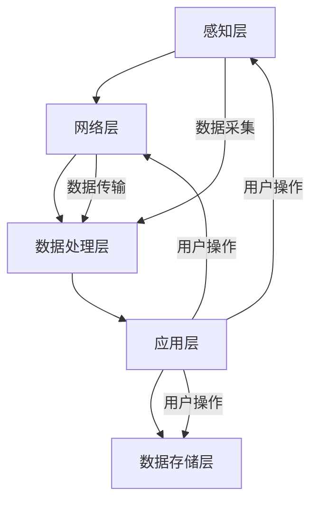
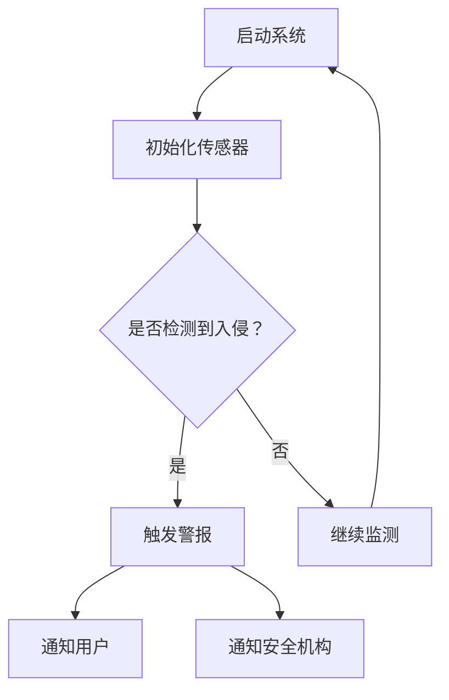
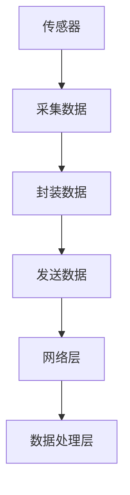
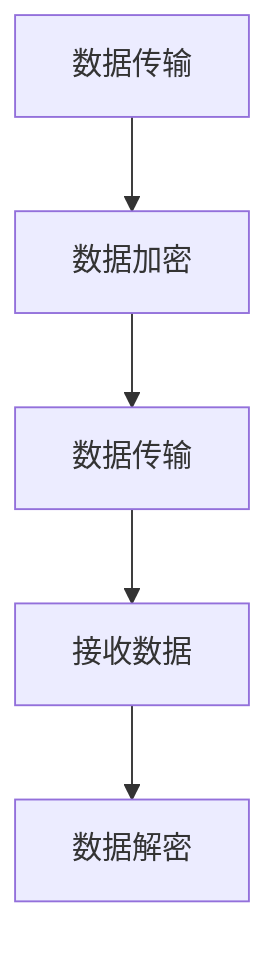
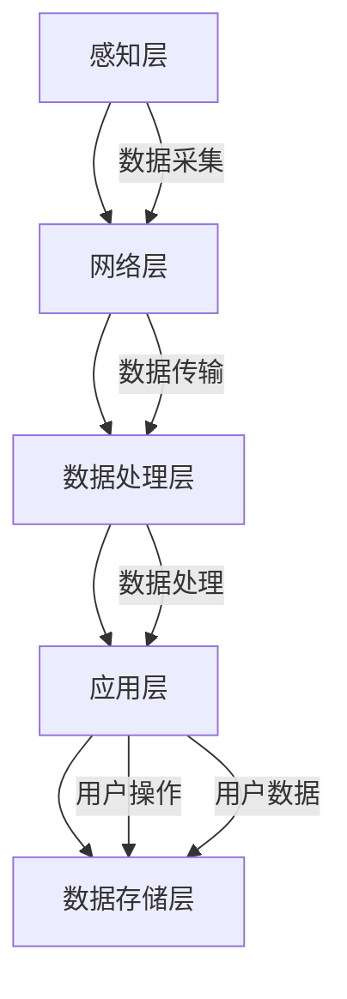
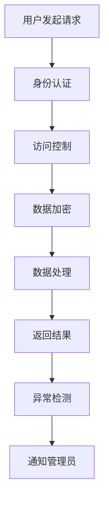

                 

## AI在智能家居安全系统整合中的应用：全方位保护家庭安全

### 关键词
- 智能家居安全
- 人工智能（AI）
- 安全系统集成
- 机器学习
- 深度学习

### 摘要
本文将探讨人工智能在智能家居安全系统整合中的应用，旨在为读者提供一个全面的视角，了解AI技术在提升家庭安全防护水平中的关键作用。文章将从背景介绍、核心概念解析、系统架构设计、实战案例分析以及最佳实践等方面进行深入分析，帮助读者理解AI技术如何实现智能家居安全系统的全方位保护。

### 引言

#### 智能家居安全问题的日益突出
随着科技的快速发展，智能家居设备已经逐渐渗透到我们日常生活的方方面面。这些设备通过互联网连接，为我们带来了便捷和舒适的生活方式。然而，与此同时，智能家居设备的安全性问题也日益凸显。据统计，近年来因智能家居设备遭受黑客攻击而导致的家庭安全事故呈上升趋势。例如，黑客可以通过入侵智能家居系统，远程控制家庭设备，窃取个人信息，甚至对家庭安全造成威胁。

#### AI技术在智能家居安全领域的应用前景
人工智能（AI）技术的快速发展为智能家居安全系统的整合提供了新的解决方案。AI技术，特别是机器学习和深度学习算法，可以通过对大量数据的分析和学习，实现对异常行为的检测和预测，从而提高智能家居安全系统的防御能力。AI技术不仅可以实时监控家庭环境，还可以自动识别潜在的安全威胁，并采取相应的防护措施。

#### 本书的目标与结构安排
本书旨在深入探讨AI在智能家居安全系统整合中的应用，通过详细的案例分析和技术解析，帮助读者了解如何利用AI技术全面提升家庭安全防护水平。本书的结构安排如下：
1. 引言：介绍智能家居安全问题及AI技术的应用前景。
2. AI基础：讲解AI、机器学习和深度学习的基本原理。
3. 智能家居安全系统：介绍智能家居安全系统的基本概念和结构。
4. 系统分析与架构设计：分析智能家居安全系统的设计和实现方法。
5. 项目实战：通过实际案例展示AI技术在智能家居安全系统中的应用。
6. 总结与扩展：总结全文内容，并提供未来发展方向和拓展阅读建议。

#### 关键概念与术语
在本文中，我们将使用以下关键概念和术语：
- **智能家居安全系统**：一种通过集成多种安全技术，实现对家庭环境实时监控和保护的系统。
- **人工智能（AI）**：模拟人类智能行为的计算机系统，包括机器学习、深度学习等子领域。
- **机器学习**：一种基于数据驱动的方法，使计算机系统能够从数据中学习并做出决策。
- **深度学习**：一种机器学习的方法，通过构建多层的神经网络模型，对复杂的数据进行自动特征提取和分类。

### 目录大纲设计

#### 第一部分：引言
1.1 书籍背景与目标
1.2 关键概念与术语
1.3 书籍框架与主要内容概览
1.4 阅读指南与学习方法
1.5 本章小结

#### 第二部分：AI基础
2.1 人工智能概述
2.2 机器学习基础
2.3 深度学习基础
2.4 数据预处理与特征工程
2.5 模型评估与优化
2.6 人工智能伦理与安全性
2.7 本章小结

#### 第三部分：智能家居安全系统
3.1 智能家居安全系统概述
3.2 智能家居安全系统的设计与实现
3.3 智能家居安全系统的实现与集成
3.4 智能家居安全系统的评估与优化
3.5 本章小结

#### 第四部分：系统分析与架构设计
4.1 系统需求分析
4.2 系统架构设计
4.3 系统接口设计与交互
4.4 系统安全与隐私保护
4.5 本章小结

#### 第五部分：项目实战
5.1 环境安装与系统配置
5.2 系统核心实现与代码分析
5.3 实际案例分析
5.4 项目小结
5.5 本章小结

#### 第六部分：总结与扩展
6.1 最佳实践tips
6.2 全文总结
6.3 未来发展方向
6.4 拓展阅读建议
6.5 本章小结

#### 1.4 阅读指南与学习方法
##### 1.4.1 阅读顺序与节奏把握
建议读者按照书籍的结构顺序进行阅读，从引言开始，逐步深入到AI基础、智能家居安全系统的具体实现，再到系统分析与架构设计，最后通过项目实战巩固所学知识。

##### 1.4.2 如何深入理解与应用所学内容
- **主动思考**：在每个章节阅读过程中，主动思考AI技术在智能家居安全系统中的应用场景和实际效果。
- **实践操作**：尝试复现文中的实际案例，通过动手实践加深理解。
- **问题解决**：遇到问题时，查阅相关资料，或与同行交流，共同探讨解决方案。

##### 1.4.3 学习过程中可能遇到的问题与解决策略
- **技术难题**：对于较复杂的技术概念，可以通过查阅相关技术文档和书籍，逐步理解。
- **实践困难**：在实际操作过程中，遇到困难时，可以通过网络资源或专业技术社区寻求帮助。

##### 1.5 本章小结
本章作为引言，为读者介绍了智能家居安全系统的背景和AI技术的应用前景。通过了解本书的结构和内容，读者可以更好地把握全书的脉络，为后续章节的深入学习打下基础。

### 1.6 目录大纲设计步骤

#### 总体结构规划
- 确定书籍的整体结构和框架。
- 明确每个部分的核心主题和目的。

#### 章节细化
- 根据核心主题细化每个章节的内容。
- 确保每个章节都有明确的子主题和目标。

#### 核心概念与联系
- 提取并描述核心概念。
- 制作概念属性特征对比表格。
- 绘制ER实体关系图架构的Mermaid流程图。

#### 算法原理讲解
- 使用Mermaid绘制算法流程图。
- 提供Python源代码。
- 给出算法原理的数学模型和公式。
- 进行详细讲解和举例说明。

#### 系统分析与架构设计
- 介绍问题场景和项目背景。
- 提供系统功能设计和系统架构设计的Mermaid类图和架构图。
- 设计系统接口和交互序列图。

#### 项目实战
- 描述环境安装和系统核心实现。
- 分析代码应用。
- 提供实际案例分析和讲解。

#### 总结与扩展
- 给出最佳实践tips。
- 总结章节内容。
- 提供拓展阅读建议。

#### 格式调整与优化
- 确保格式简洁、清晰。
- 检查目录大纲的总字数是否在限制内。

### 1.7 目录大纲设计

#### 第一部分：引言
- 1.1 书籍背景与目标
- 1.2 关键概念与术语
- 1.3 书籍框架与主要内容概览
- 1.4 阅读指南与学习方法
- 1.5 本章小结

#### 第二部分：AI基础
- 2.1 人工智能概述
- 2.2 机器学习基础
- 2.3 深度学习基础
- 2.4 数据预处理与特征工程
- 2.5 模型评估与优化
- 2.6 人工智能伦理与安全性
- 2.7 本章小结

#### 第三部分：智能家居安全系统
- 3.1 智能家居安全系统概述
- 3.2 智能家居安全系统的设计与实现
- 3.3 智能家居安全系统的实现与集成
- 3.4 智能家居安全系统的评估与优化
- 3.5 本章小结

#### 第四部分：系统分析与架构设计
- 4.1 系统需求分析
- 4.2 系统架构设计
- 4.3 系统接口设计与交互
- 4.4 系统安全与隐私保护
- 4.5 本章小结

#### 第五部分：项目实战
- 5.1 环境安装与系统配置
- 5.2 系统核心实现与代码分析
- 5.3 实际案例分析
- 5.4 项目小结
- 5.5 本章小结

#### 第六部分：总结与扩展
- 6.1 最佳实践tips
- 6.2 全文总结
- 6.3 未来发展方向
- 6.4 拓展阅读建议
- 6.5 本章小结

### 1.8 本书的创新点与目标读者
#### 创新点
- **系统性**：本书从AI基础到智能家居安全系统的设计与实现，提供了一套完整的体系，使得读者可以系统地学习并掌握相关技术。
- **实战性**：通过实际案例分析和项目实战，使读者不仅能够理解理论知识，还能够将知识应用于实际项目中。
- **易读性**：采用通俗易懂的语言和实例，使得读者即使没有相关背景也能轻松阅读。

#### 目标读者
- 对智能家居安全和AI技术感兴趣的读者。
- 智能家居开发者和工程师。
- 计算机科学和人工智能专业的学生和研究人员。

### 1.9 阅读本书的预期收获
- **深入理解AI在智能家居安全系统中的应用**：通过学习本书，读者将能够全面了解AI技术如何提升家庭安全防护水平。
- **掌握AI基础知识和实践技能**：通过案例分析和技术讲解，读者将掌握AI技术的核心概念和实践技能。
- **提升系统设计与实现能力**：通过项目实战，读者将能够将所学知识应用于实际系统设计和实现。

### 1.10 全书总结
本书旨在为读者提供一套关于AI在智能家居安全系统整合中的全面指南。通过系统的内容安排和深入的分析，读者不仅能够了解AI技术的核心原理，还能够掌握如何将其应用于智能家居安全系统的设计与实现。希望通过本书，读者能够在家庭安全防护领域有所建树，为构建更安全的智能家居环境贡献力量。在接下来的章节中，我们将逐一深入探讨AI技术的基础知识，为后续的实战应用打下坚实的基础。

## 第二部分：AI基础

### 2.1 人工智能概述

#### 2.1.1 人工智能的定义与发展历程
人工智能（Artificial Intelligence，简称AI）是计算机科学的一个分支，旨在研究、开发和应用使计算机系统表现出类似人类智能行为的理论、算法和技术。AI的定义涵盖了许多不同的领域和子领域，从简单的规则系统到复杂的机器学习算法，再到深度神经网络和自然语言处理等。

人工智能的发展历程可以追溯到20世纪50年代。1956年，在达特茅斯会议上，约翰·麦卡锡（John McCarthy）等人首次提出了人工智能的概念。自那时以来，人工智能经历了多次起伏和快速发展。20世纪80年代，专家系统的兴起使得AI在特定领域取得了显著成果。然而，由于计算能力和算法的限制，AI在20世纪90年代后进入了一个相对低潮期。进入21世纪，随着计算能力的提升和大数据技术的发展，机器学习和深度学习等新技术使得人工智能再次焕发了生机。

#### 2.1.2 人工智能的分类与核心任务
人工智能可以根据其实现方式和技术特点分为多个类别，主要包括以下几种：

1. **规则驱动系统**：这类系统基于一组预设的规则进行决策，例如专家系统。
2. **知识驱动系统**：这类系统通过编码领域知识，使用推理机制进行决策。
3. **数据驱动系统**：这类系统主要依靠从数据中学习，通过机器学习算法进行决策，例如深度学习和强化学习。
4. **混合智能系统**：结合多种方法，例如结合规则和机器学习，以实现更高效的决策。

人工智能的核心任务包括：
- **感知**：通过视觉、听觉、触觉等感官获取外部信息。
- **理解**：处理和理解获取的信息，进行分类、识别和解释。
- **决策**：基于理解的结果，进行合理的决策和规划。
- **行动**：执行决策，进行实际的物理操作。

#### 2.1.3 人工智能的关键技术概览
人工智能的关键技术涵盖了从数据收集、预处理、模型训练到模型部署的整个过程。以下是几个核心技术：

1. **机器学习**：一种基于数据驱动的方法，通过训练模型，使其能够对未知数据进行预测和分类。
2. **深度学习**：一种特殊的机器学习技术，通过多层神经网络结构，自动提取特征并进行复杂的数据分析。
3. **自然语言处理**：使计算机能够理解、生成和处理自然语言，实现人机交互。
4. **计算机视觉**：使计算机能够“看”和理解视觉信息，如图像和视频。
5. **语音识别**：使计算机能够识别和理解人类语音，实现语音输入和语音合成。

#### 2.1.4 人工智能的现状与未来发展趋势
当前，人工智能技术已经在众多领域取得了显著的应用成果，如自动驾驶、医疗诊断、金融分析、智能家居等。随着技术的不断进步，人工智能的发展趋势如下：

1. **硬件性能的提升**：随着计算能力的提升，特别是GPU和TPU等专用硬件的发展，将使得AI模型训练和推理的速度大幅提高。
2. **算法的优化与创新**：现有的机器学习和深度学习算法不断优化，同时新的算法和技术（如生成对抗网络、迁移学习等）也在不断涌现。
3. **跨学科的融合**：人工智能与其他领域（如生物学、心理学、经济学等）的交叉融合，将推动AI技术的进一步发展。
4. **伦理与安全**：随着AI技术的广泛应用，伦理和安全问题也日益受到关注。如何确保AI系统的透明性、可靠性和安全性成为重要研究课题。

### 2.2 机器学习基础

#### 2.2.1 机器学习的概念与基本原理
机器学习（Machine Learning，简称ML）是人工智能的一个重要分支，通过算法和统计模型，使计算机系统能够从数据中学习，并对未知数据进行预测或决策。机器学习的基本原理是基于数据的统计分析和模式识别。

机器学习过程通常包括以下步骤：

1. **数据收集**：收集大量的训练数据，这些数据用于训练模型。
2. **数据预处理**：对收集到的数据进行分析和处理，如数据清洗、归一化等。
3. **模型选择**：选择合适的机器学习模型，如线性回归、决策树、支持向量机等。
4. **模型训练**：使用训练数据对模型进行训练，调整模型参数以最小化预测误差。
5. **模型评估**：使用测试数据对训练好的模型进行评估，以确定模型的性能。
6. **模型部署**：将训练好的模型部署到实际应用场景中，进行预测或决策。

#### 2.2.2 监督学习、无监督学习与强化学习
机器学习根据学习方式的不同，可以分为以下三种类型：

1. **监督学习**：在监督学习（Supervised Learning）中，模型通过已标记的数据进行学习。训练数据包括输入特征和对应的输出标签。常见的监督学习算法有线性回归、决策树、支持向量机等。

2. **无监督学习**：无监督学习（Unsupervised Learning）中，模型没有明确的输出标签，仅从数据中学习数据分布或模式。常见的无监督学习算法有聚类算法（如K-均值聚类）、降维算法（如主成分分析）和关联规则学习等。

3. **强化学习**：强化学习（Reinforcement Learning）中，模型通过与环境的交互进行学习，目的是找到最优策略以最大化累积奖励。常见的强化学习算法有Q学习、SARSA和深度确定性策略梯度（DDPG）等。

#### 2.2.3 机器学习算法及其适用场景
机器学习算法种类繁多，每种算法都有其特定的适用场景。以下是一些常见的机器学习算法及其应用场景：

1. **线性回归**：用于预测线性关系，如房屋价格预测、股票价格预测等。
2. **决策树**：用于分类和回归问题，如分类垃圾邮件、预测信用评分等。
3. **支持向量机**：用于分类问题，如手写数字识别、文本分类等。
4. **神经网络**：用于复杂的数据分析和预测，如图像识别、自然语言处理等。
5. **K-均值聚类**：用于聚类分析，如客户细分、图像分割等。
6. **主成分分析**：用于降维和数据可视化，如图像压缩、股票市场分析等。
7. **随机森林**：用于分类和回归问题，具有很好的鲁棒性，如医疗诊断、贷款审批等。

#### 2.2.4 机器学习的优势与挑战
机器学习的优势包括：

1. **自动化**：机器学习可以自动从数据中学习模式，减少人工干预。
2. **适应性强**：机器学习模型可以根据新的数据进行自适应调整，以应对变化的环境。
3. **高效性**：通过大规模数据处理，机器学习可以在短时间内完成复杂的计算任务。

然而，机器学习也面临一些挑战：

1. **数据质量**：数据质量对机器学习模型的性能有重要影响，数据缺失、噪声和异常值等问题需要处理。
2. **模型可解释性**：深度学习等复杂模型往往缺乏可解释性，难以理解其决策过程。
3. **过拟合**：模型在训练数据上表现良好，但在未知数据上表现不佳，需要通过正则化等方法进行防止。
4. **计算资源**：训练复杂的机器学习模型需要大量的计算资源和时间。

#### 2.2.5 本章小结
本章介绍了机器学习的基本概念、原理和主要算法。通过学习本章，读者可以了解机器学习在智能家居安全系统中的应用潜力，以及如何利用机器学习技术解决实际问题。在后续章节中，我们将进一步探讨深度学习和其他AI技术在智能家居安全系统中的应用。

## 2.3 深度学习基础

### 2.3.1 深度学习的概念与发展历程
深度学习（Deep Learning，简称DL）是机器学习的一个重要分支，通过构建多层神经网络模型，实现对复杂数据的自动特征提取和分类。深度学习的概念最早可以追溯到1986年，当科学家Geoffrey Hinton等人提出了反向传播算法（Backpropagation Algorithm），这一算法使得多层神经网络的训练成为可能。

深度学习的发展历程可以分为以下几个阶段：

1. **1980年代**：多层感知机（Multilayer Perceptron，MLP）的出现标志着深度学习的萌芽，但由于计算资源和算法的限制，深度学习的研究进展缓慢。
2. **1990年代**：随着计算能力的提升和并行计算技术的发展，支持向量机（Support Vector Machine，SVM）等传统机器学习算法逐渐取代了深度学习。
3. **2006年**：Geoffrey Hinton等人重新关注深度学习，并提出了深度信念网络（Deep Belief Networks，DBN）。同时，卷积神经网络（Convolutional Neural Networks，CNN）在图像识别领域取得突破性进展。
4. **2012年**：AlexNet在ImageNet大赛中取得了巨大成功，证明了深度学习在图像识别领域的巨大潜力。自此，深度学习进入了一个快速发展时期。
5. **当前**：随着大数据和云计算的发展，深度学习在语音识别、自然语言处理、自动驾驶等众多领域取得了显著的成果。

### 2.3.2 神经网络与深度学习模型
神经网络（Neural Networks，简称NN）是深度学习的基础。神经网络由大量简单的处理单元（神经元）组成，通过连接这些神经元，形成复杂的网络结构。每个神经元接受多个输入，通过加权求和处理，产生一个输出。

深度学习模型是一种具有多个隐藏层的神经网络，与传统的单层神经网络相比，深度学习模型能够自动提取更高级别的特征，从而在复杂数据上取得更好的性能。以下是几种常见的深度学习模型：

1. **卷积神经网络（CNN）**：CNN是一种专门用于处理图像数据的神经网络，通过卷积层、池化层和全连接层等结构，实现图像的特征提取和分类。
2. **循环神经网络（RNN）**：RNN是一种用于处理序列数据的神经网络，通过循环结构，实现对序列中前后关系的建模。常见的RNN模型包括LSTM（长短期记忆网络）和GRU（门控循环单元）。
3. **生成对抗网络（GAN）**：GAN是一种由生成器和判别器组成的神经网络模型，通过对抗训练，生成器能够生成逼真的数据。
4. **变分自编码器（VAE）**：VAE是一种用于数据生成和降维的神经网络模型，通过变分推理，实现对数据的编码和解码。

### 2.3.3 深度学习算法的应用领域
深度学习算法在众多领域取得了显著的应用成果，以下是一些关键领域：

1. **计算机视觉**：深度学习在图像识别、目标检测、图像分割等领域取得了巨大成功。例如，深度学习算法在人脸识别、自动驾驶、医疗图像分析等方面得到了广泛应用。
2. **自然语言处理**：深度学习在语言模型、机器翻译、文本分类、情感分析等领域取得了突破性进展。例如，深度学习算法在搜索引擎、智能客服、智能语音助手等方面得到了广泛应用。
3. **语音识别**：深度学习在语音识别领域取得了显著成果，通过构建深度神经网络，实现对语音信号的自动识别和转换。
4. **推荐系统**：深度学习在推荐系统领域得到了广泛应用，通过构建用户和物品的深度特征表示，实现个性化推荐。
5. **自动驾驶**：深度学习在自动驾驶领域发挥了关键作用，通过构建复杂的神经网络模型，实现对道路环境、车辆和行人的感知、理解和决策。

### 2.3.4 深度学习的优势与挑战
深度学习的优势包括：

1. **自动特征提取**：深度学习模型能够自动从原始数据中提取高级特征，减少了人工特征工程的工作量。
2. **强大的表达力**：深度学习模型具有强大的非线性表达能力，能够处理复杂的数据关系和模式。
3. **广泛的应用领域**：深度学习在计算机视觉、自然语言处理、语音识别、推荐系统等多个领域取得了显著成果。

然而，深度学习也面临一些挑战：

1. **计算资源消耗**：训练深度学习模型需要大量的计算资源和时间，特别是在处理大型数据和复杂模型时。
2. **模型可解释性**：深度学习模型通常缺乏可解释性，难以理解其决策过程。
3. **数据依赖性**：深度学习模型的性能高度依赖训练数据的质量和规模，数据不足或数据质量问题可能导致模型性能不佳。
4. **过拟合**：深度学习模型容易过拟合，特别是在训练数据量较少的情况下，需要通过正则化等技术进行防止。

### 2.3.5 本章小结
本章介绍了深度学习的基本概念、发展历程、主要模型和应用领域。通过学习本章，读者可以了解深度学习在智能家居安全系统中的应用潜力，以及如何利用深度学习技术解决实际问题。在后续章节中，我们将进一步探讨如何将深度学习应用于智能家居安全系统的设计与实现。

## 2.4 数据预处理与特征工程

### 2.4.1 数据预处理的重要性
数据预处理是机器学习项目中至关重要的一步，它直接影响着模型的学习效果和预测准确性。数据预处理的目标是清理数据中的噪声和异常值，使其符合模型训练的要求，同时提取出对模型学习有帮助的特征。以下是一些常见的数据预处理任务：

1. **数据清洗**：处理数据中的缺失值、重复值和异常值。常见的处理方法包括删除缺失值、填充缺失值、替换异常值等。
2. **数据转换**：将不同类型的数据转换成统一的格式，如将分类数据转换为数值类型、将日期时间数据转换为统一的格式等。
3. **数据归一化**：通过缩放或平移，将数据变换到相同的尺度，以消除不同特征之间的量纲影响，常见的归一化方法有最小-最大缩放、Z-score缩放等。
4. **数据编码**：将分类数据转换为数值类型，常见的编码方法有独热编码、二进制编码等。

### 2.4.2 数据清洗与数据变换
#### 数据清洗
数据清洗是数据预处理的第一步，其目的是消除数据中的噪声和异常值。以下是一些常见的数据清洗方法：

1. **删除缺失值**：对于缺失值较多的数据，可以直接删除，但对于关键特征，可以考虑使用插补方法进行填补。
2. **填补缺失值**：常用的插补方法包括均值插补、中值插补、回归插补等，通过计算缺失值的预测值进行填补。
3. **替换异常值**：对于明显错误的异常值，可以直接替换为合理的值，例如使用均值、中值等进行替换。

#### 数据变换
数据变换是将不同类型的数据转换为统一格式，以适应机器学习模型的训练需求。以下是一些常见的数据变换方法：

1. **分类数据转换为数值类型**：常见的分类数据转换为数值类型的方法有独热编码（One-Hot Encoding）和二进制编码（Binary Encoding）。独热编码将每个类别转换为一位，如果类别存在，则该位为1，否则为0。二进制编码将每个类别转换为二进制数。
2. **日期时间数据转换为统一格式**：日期时间数据通常转换为年、月、日、小时等特征，以提取时间信息。
3. **文本数据转换为词向量**：文本数据通过词袋模型（Bag of Words）或词嵌入（Word Embedding）转换为数值类型。词袋模型将文本转换为词汇的频率分布，词嵌入将每个单词映射为一个固定长度的向量。

### 2.4.3 特征提取与特征选择
#### 特征提取
特征提取是从原始数据中提取出对模型学习有帮助的特征，常见的特征提取方法有：

1. **统计特征**：通过计算数据的统计属性（如均值、方差、标准差等）来提取特征，适用于数值型数据。
2. **文本特征**：通过计算文本的词频、词向量等来提取特征，适用于文本数据。
3. **图像特征**：通过计算图像的纹理、颜色、形状等特征来提取特征，适用于图像数据。

#### 特征选择
特征选择是在特征提取后，从大量特征中选择出对模型学习最有帮助的特征，以减少模型的复杂度和提高预测准确性。以下是一些常见的特征选择方法：

1. **过滤式特征选择**：通过计算特征与目标变量之间的相关性，选择相关性较高的特征。
2. **包裹式特征选择**：通过迭代搜索所有可能的特征组合，选择最佳的特征组合。
3. **嵌入式特征选择**：在模型训练过程中，自动筛选出重要的特征。

### 2.4.4 数据预处理与特征工程在机器学习项目中的重要性
数据预处理与特征工程在机器学习项目中具有至关重要的作用：

1. **提高模型性能**：通过数据预处理和特征工程，可以消除数据中的噪声和异常值，提高模型的泛化能力。
2. **减少模型复杂度**：通过特征选择，可以减少模型的复杂度，提高模型的可解释性。
3. **缩短训练时间**：通过数据预处理和特征工程，可以减少模型训练的数据量和计算量，缩短训练时间。
4. **提高预测准确性**：通过数据预处理和特征工程，可以提取出对模型学习有帮助的特征，提高模型的预测准确性。

### 2.4.5 本章小结
本章介绍了数据预处理与特征工程的基本概念、方法及其在机器学习项目中的重要性。通过学习本章，读者可以了解如何进行数据预处理和特征工程，以提高机器学习模型的性能和预测准确性。在后续章节中，我们将进一步探讨如何利用这些技术提升智能家居安全系统的安全性和可靠性。

## 2.5 模型评估与优化

### 2.5.1 模型评估指标与方法
模型评估是机器学习项目中的一个关键环节，通过评估指标和方法，可以判断模型的学习效果和预测性能。以下是一些常见的模型评估指标和方法：

1. **准确率（Accuracy）**：准确率是模型预测正确的样本数占总样本数的比例，计算公式为：
   \[
   \text{准确率} = \frac{\text{预测正确的样本数}}{\text{总样本数}}
   \]
   准确率简单直观，但在类别不平衡的数据集上可能存在误导性。

2. **精确率（Precision）**：精确率是指预测为正类的样本中，实际为正类的比例，计算公式为：
   \[
   \text{精确率} = \frac{\text{真正例数}}{\text{真正例数 + 假正例数}}
   \]
   精确率关注的是模型的分类能力，特别是当正类样本较为重要时。

3. **召回率（Recall）**：召回率是指实际为正类的样本中被模型正确预测为正类的比例，计算公式为：
   \[
   \text{召回率} = \frac{\text{真正例数}}{\text{真正例数 + 假反例数}}
   \]
   召回率关注的是模型的覆盖能力，特别是当负类样本较为重要时。

4. **F1分数（F1 Score）**：F1分数是精确率和召回率的调和平均值，用于综合评估模型性能，计算公式为：
   \[
   \text{F1分数} = 2 \times \frac{\text{精确率} \times \text{召回率}}{\text{精确率} + \text{召回率}}
   \]
   F1分数在类别不平衡的情况下更为合理。

5. **ROC曲线和AUC值**：ROC曲线（Receiver Operating Characteristic Curve）是反映模型分类能力的曲线，横轴为假正例率（False Positive Rate），纵轴为真正例率（True Positive Rate）。AUC值（Area Under Curve）是ROC曲线下的面积，用于评估模型分类能力的好坏。

6. **均方误差（Mean Squared Error, MSE）**：均方误差是回归问题中常用的评估指标，表示预测值与真实值之间差的平方的平均值，计算公式为：
   \[
   \text{MSE} = \frac{1}{n} \sum_{i=1}^{n} (\hat{y}_i - y_i)^2
   \]
   MSE对异常值较为敏感。

7. **均方根误差（Root Mean Squared Error, RMSE）**：均方根误差是MSE的平方根，用于表示预测值与真实值之间的平均误差，计算公式为：
   \[
   \text{RMSE} = \sqrt{\text{MSE}}
   \]

### 2.5.2 模型优化策略与技巧
模型优化是为了提高模型的学习效果和预测性能，以下是一些常见的模型优化策略与技巧：

1. **正则化**：正则化是一种在模型训练过程中引入惩罚项的方法，以防止模型过拟合。常见的正则化方法有L1正则化（Lasso）和L2正则化（Ridge）。

2. **交叉验证**：交叉验证是一种评估模型性能的方法，通过将数据集划分为多个子集，分别用于训练和验证，以避免过拟合。

3. **模型选择**：根据问题的性质和数据的特点，选择合适的模型。例如，对于回归问题，可以选择线性回归、决策树、随机森林等；对于分类问题，可以选择支持向量机、神经网络等。

4. **超参数调优**：超参数是模型训练过程中需要手动调整的参数，如学习率、正则化参数等。通过调优超参数，可以优化模型的性能。

5. **集成学习**：集成学习是一种利用多个模型来提高预测性能的方法，常见的集成学习方法有Bagging、Boosting和Stacking。

6. **特征工程**：通过特征提取和特征选择，优化输入特征的质量，从而提高模型的性能。

7. **数据增强**：通过数据增强（如旋转、缩放、裁剪等）增加数据的多样性，从而提高模型的泛化能力。

### 2.5.3 模型选择与调参技巧
模型选择与调参是机器学习项目中的关键步骤，以下是一些常见的模型选择与调参技巧：

1. **基于问题的选择**：根据问题的性质（如回归、分类、聚类等），选择合适的模型。例如，对于回归问题，可以选择线性回归、决策树、随机森林等；对于分类问题，可以选择支持向量机、神经网络等。

2. **基于数据的评估**：通过交叉验证等方法，评估不同模型在相同数据集上的性能。选择性能较好的模型作为最终模型。

3. **基于调参的优化**：对于选择好的模型，通过调参（如学习率、正则化参数等）来优化模型性能。常用的调参方法有网格搜索、随机搜索、贝叶斯优化等。

4. **基于性能的调整**：根据模型在不同数据集上的性能，调整模型的结构和参数，以达到最优的性能。

5. **基于经验的调整**：在多次实践和实验的基础上，积累经验，快速定位到最优的模型结构和参数。

### 2.5.4 本章小结
本章介绍了模型评估指标与方法、模型优化策略与技巧以及模型选择与调参技巧。通过学习本章，读者可以了解如何评估和优化机器学习模型，以提高其学习效果和预测性能。在后续章节中，我们将进一步探讨如何将机器学习模型应用于智能家居安全系统的设计与实现。

## 2.6 人工智能伦理与安全性

### 2.6.1 人工智能伦理的基本原则
随着人工智能技术的快速发展，其伦理问题也日益凸显。人工智能伦理是指研究人工智能系统在设计和应用过程中应遵循的道德规范和价值观。以下是一些人工智能伦理的基本原则：

1. **公平性**：确保人工智能系统不会因为偏见、歧视等原因对某些群体产生不利影响，如种族、性别、年龄等方面的歧视。
2. **透明性**：确保人工智能系统的决策过程和结果可以被理解和解释，提高系统的可信度和用户信任。
3. **隐私保护**：保护用户的隐私数据，避免数据泄露和滥用。
4. **安全性**：确保人工智能系统的可靠性和安全性，防止恶意攻击和系统故障。
5. **责任承担**：明确人工智能系统在应用过程中可能产生的责任和后果，确保责任能够被合理分配。

### 2.6.2 人工智能安全性的挑战与应对策略
人工智能安全性是确保人工智能系统在应用过程中不会对用户和社会造成危害的关键问题。以下是一些人工智能安全性的挑战及其应对策略：

1. **数据安全性**：数据是人工智能系统的核心资源，如何保护数据安全是人工智能安全性的重要挑战。应对策略包括数据加密、访问控制、数据备份等。

2. **模型安全性**：人工智能模型在训练和部署过程中可能存在安全隐患，如模型泄露、模型篡改等。应对策略包括模型加密、模型验证、模型更新等。

3. **隐私保护**：人工智能系统在处理用户数据时，如何保护用户隐私是关键问题。应对策略包括数据去识别化、隐私增强技术等。

4. **对抗攻击**：对抗攻击是指通过构造特定的输入数据，使人工智能系统产生错误决策。应对策略包括对抗样本生成、对抗鲁棒性训练等。

5. **伦理审查**：在人工智能系统的设计和应用过程中，需要进行伦理审查，确保其符合伦理规范。应对策略包括建立伦理委员会、制定伦理准则等。

### 2.6.3 人工智能应用中的隐私保护
隐私保护是人工智能应用中至关重要的一环。以下是一些常见的隐私保护方法：

1. **数据去识别化**：通过数据匿名化、数据加密等技术，将数据中的个人身份信息去除，从而保护用户隐私。

2. **差分隐私**：差分隐私是一种通过在数据中引入随机噪声来保护隐私的方法。通过控制噪声的大小，可以平衡隐私保护和数据利用之间的关系。

3. **联邦学习**：联邦学习是一种分布式学习框架，通过将模型训练分散到多个节点，减少数据在传输过程中的泄露风险。

4. **数据加密**：在数据传输和存储过程中，使用加密技术对数据进行加密，从而防止数据泄露。

5. **访问控制**：通过设置用户权限和访问控制策略，确保只有授权用户才能访问敏感数据。

### 2.6.4 本章小结
本章介绍了人工智能伦理的基本原则、人工智能安全性的挑战与应对策略以及人工智能应用中的隐私保护方法。通过学习本章，读者可以了解如何确保人工智能系统的伦理和安全性，为人工智能在智能家居安全系统中的应用提供可靠保障。在后续章节中，我们将进一步探讨如何将人工智能技术应用于智能家居安全系统的设计与实现。

## 2.7 本章小结
本章作为全书的基础部分，系统地介绍了人工智能（AI）的基础知识，包括AI的定义与发展历程、分类与核心任务、关键技术的概述，以及机器学习和深度学习的基本原理。此外，我们还讨论了数据预处理与特征工程的重要性，以及模型评估与优化的方法。同时，对人工智能伦理与安全性的基本原则和挑战进行了深入分析。

通过本章的学习，读者可以建立对AI技术的全面理解，了解其在智能家居安全系统中的应用潜力。AI技术，特别是机器学习和深度学习，通过自动特征提取和复杂模式识别，为智能家居安全系统提供了强大的工具。然而，AI技术也面临伦理和安全性的挑战，如数据隐私保护和模型透明性。因此，在设计和应用AI技术时，必须充分考虑这些伦理和安全问题。

本章内容为后续章节提供了坚实的基础，读者将在后续章节中看到如何将AI技术应用于智能家居安全系统的具体设计、实现和优化。希望读者能够通过本章的学习，对AI在智能家居安全系统中的应用有一个系统的认识，为解决实际家庭安全问题奠定理论基础。

## 第三部分：智能家居安全系统

### 3.1 智能家居安全系统概述

#### 3.1.1 智能家居安全系统的定义与功能
智能家居安全系统是一种集成多种安全技术，旨在实现对家庭环境实时监控和保护的综合系统。它通过物联网（IoT）技术将家庭中的各种智能设备连接起来，形成一个统一的控制和管理平台。智能家居安全系统的核心功能包括：

1. **入侵检测**：通过摄像头、门磁传感器、烟雾探测器等设备，实时监测家庭环境，一旦检测到异常情况，立即发出警报。
2. **远程控制**：用户可以通过手机或电脑等远程设备，对家庭安全系统进行实时监控和远程操作，如远程控制门锁、灯光等。
3. **紧急响应**：当系统检测到紧急情况时，如火灾、煤气泄漏等，自动触发紧急响应机制，如拨打报警电话、发送警报信息等。
4. **能源管理**：通过智能电表、智能插座等设备，监控和优化家庭能源使用，降低能耗和费用。

#### 3.1.2 智能家居安全系统的结构组成
智能家居安全系统通常由以下几个关键组成部分构成：

1. **传感器网络**：包括各种物理传感器，如温度传感器、湿度传感器、烟雾传感器、门磁传感器等，用于实时监测家庭环境。
2. **中央控制单元**：作为系统的核心，负责处理传感器数据，控制家庭设备的操作，以及与外部系统（如报警公司）进行通信。
3. **通信网络**：包括Wi-Fi、蓝牙、ZigBee等无线通信技术，用于传感器网络和中央控制单元之间的数据传输。
4. **用户界面**：包括手机APP、网页界面等，用户可以通过这些界面查看系统状态、操作设备，以及接收报警信息。
5. **存储设备**：用于存储传感器数据、用户操作记录等，常见的存储设备有云存储、本地数据库等。

#### 3.1.3 智能家居安全系统的关键技术
智能家居安全系统的实现依赖于多种关键技术的支持，包括：

1. **物联网技术**：物联网技术是智能家居安全系统的基石，它通过将各种设备互联，实现数据的实时采集和传输。
2. **云计算与大数据**：云计算和大数据技术为智能家居安全系统提供了强大的数据处理和分析能力，通过云平台，可以实现数据的集中存储、分析和共享。
3. **人工智能与机器学习**：人工智能和机器学习技术可以用于异常检测、模式识别等，提高系统的智能程度和响应速度。
4. **安全加密技术**：智能家居安全系统需要保证数据传输和存储的安全性，常用的安全加密技术包括TLS/SSL、加密存储等。
5. **智能家居协议**：如ZigBee、Z-Wave、KNX等，这些协议用于实现不同设备之间的互联互通。

### 3.2 智能家居安全系统的设计与实现

#### 3.2.1 系统需求分析
智能家居安全系统的设计与实现始于系统需求分析。系统需求分析包括以下几个方面：

1. **功能需求**：确定系统需要实现的功能，如入侵检测、远程控制、紧急响应、能源管理等。
2. **性能需求**：确定系统的性能指标，如响应时间、数据传输速率、系统稳定性等。
3. **安全性需求**：确定系统需要满足的安全标准，如数据加密、访问控制、异常检测等。
4. **用户需求**：了解用户对系统的期望和需求，如操作简便性、界面友好性、定制化功能等。
5. **成本需求**：确定系统的预算和成本限制。

#### 3.2.2 系统架构设计
智能家居安全系统的架构设计是确保系统稳定性和可扩展性的关键。一个典型的智能家居安全系统架构包括以下层次：

1. **感知层**：由各种传感器组成，负责实时采集家庭环境数据，如温度、湿度、光照、烟雾等。
2. **网络层**：负责将传感器数据传输到中央控制单元，常用的通信技术有Wi-Fi、蓝牙、ZigBee等。
3. **数据处理层**：包括边缘计算节点和云计算平台，负责处理和分析传感器数据，实现智能决策和响应。
4. **应用层**：提供用户界面和应用程序，用户可以通过这些界面查看系统状态、操作设备、接收报警信息等。
5. **数据存储层**：用于存储系统运行数据和用户数据，常见的存储设备有云存储、本地数据库等。

以下是一个简单的智能家居安全系统架构图（使用Mermaid流程图表示）：



#### 3.2.3 系统功能设计与实现
智能家居安全系统的功能设计是实现系统需求的关键步骤。以下是几个关键功能的详细描述：

1. **入侵检测**：通过摄像头和门磁传感器，实时监测家庭环境。当检测到非法入侵时，系统立即发出警报，并通知用户和相关的安全机构。
2. **远程控制**：用户可以通过手机APP或网页界面，远程控制家庭设备，如开关门锁、调整灯光、调节温度等。
3. **紧急响应**：当系统检测到紧急情况，如火灾、煤气泄漏等，立即触发紧急响应机制，如拨打报警电话、发送警报信息等。
4. **能源管理**：通过智能电表和智能插座，监控家庭能源使用情况，提供节能建议，降低能耗和费用。

以下是入侵检测功能的实现流程（使用Mermaid流程图表示）：



#### 3.2.4 系统接口设计与交互
智能家居安全系统的接口设计是确保系统各个组件之间能够高效、可靠地进行通信的关键。以下是几个关键接口的描述：

1. **传感器接口**：定义传感器与网络层之间的数据传输格式和协议，如JSON、XML等。
2. **网络接口**：定义网络层与数据处理层之间的通信协议和数据格式，如HTTP、MQTT等。
3. **数据处理接口**：定义数据处理层与存储层之间的数据传输和存储协议，如REST API、数据库操作接口等。
4. **应用接口**：定义用户界面与数据处理层之间的交互接口，如REST API、WebSocket等。

以下是传感器接口的示例（使用Mermaid流程图表示）：



#### 3.2.5 系统安全性设计
智能家居安全系统的安全性设计是确保系统数据安全和用户隐私不受侵犯的关键。以下是几个关键的安全设计要点：

1. **数据加密**：对传输和存储的数据进行加密，确保数据在传输过程中不被窃取和篡改。
2. **访问控制**：通过用户身份验证和权限控制，确保只有授权用户才能访问系统数据和功能。
3. **异常检测**：通过异常检测技术，及时发现并应对恶意攻击和异常行为。
4. **系统监控**：通过系统监控，实时监控系统的运行状态，及时发现和处理问题。

以下是数据加密的实现流程（使用Mermaid流程图表示）：



#### 3.2.6 系统部署与维护
智能家居安全系统的部署与维护是确保系统能够长期稳定运行的关键。以下是几个关键步骤：

1. **硬件部署**：安装和配置各种传感器和设备，确保它们能够正常工作。
2. **软件部署**：部署系统的软件组件，包括应用程序、服务器软件等，确保它们能够正常运行。
3. **系统监控**：通过监控系统运行状态，及时发现和处理问题。
4. **数据备份**：定期备份系统数据和用户数据，确保数据的安全性和完整性。
5. **更新与升级**：定期更新和升级系统软件，修复漏洞和缺陷，提高系统性能和安全性。

#### 3.2.7 本章小结
本章详细介绍了智能家居安全系统的定义、功能、结构组成、关键技术、系统需求分析、架构设计、功能设计与实现、系统接口设计与交互、安全性设计以及部署与维护。通过本章的学习，读者可以全面了解智能家居安全系统的设计原则和实践方法，为后续章节中的具体应用奠定基础。

### 3.3 智能家居安全系统的实现与集成

#### 3.3.1 系统实现的关键步骤
实现智能家居安全系统需要遵循一系列关键步骤，以确保系统能够高效、稳定地运行。以下是实现智能家居安全系统的关键步骤：

1. **需求分析**：详细分析用户需求和系统功能，确定系统的具体需求和目标。
2. **技术选型**：根据需求分析的结果，选择合适的硬件设备和软件技术，包括传感器、通信协议、云计算平台、AI算法等。
3. **系统设计**：设计系统的整体架构，包括感知层、网络层、数据处理层、应用层和数据存储层等。
4. **开发与集成**：开发各个模块的功能，并进行系统集成，确保各个组件能够协同工作。
5. **测试与优化**：对系统进行全面测试，包括功能测试、性能测试、安全性测试等，并根据测试结果进行优化。

#### 3.3.2 系统集成中的关键挑战
在系统集成过程中，可能会面临以下关键挑战：

1. **异构系统兼容性**：智能家居安全系统通常需要集成来自不同厂商的设备和平台，如何实现异构系统之间的兼容性是一个重要挑战。
2. **数据一致性**：确保各个模块之间的数据能够实时、准确地传输和同步，避免数据丢失或冲突。
3. **安全性**：确保系统的数据传输和存储过程安全可靠，防止数据泄露和恶意攻击。
4. **性能优化**：在保证系统安全性的前提下，优化系统的性能，确保系统能够快速响应用户需求。

#### 3.3.3 集成案例研究
以下是一个智能家居安全系统集成的案例研究：

**案例背景**：
某智能家居安全系统需要集成来自多个厂商的传感器、门锁、摄像头和报警设备。系统需要实现以下功能：
- 实时监控家庭环境，如温度、湿度、烟雾等。
- 用户远程控制门锁和灯光。
- 在检测到火灾或非法入侵时，自动触发报警并通知用户。

**集成方案**：
1. **感知层集成**：
   - 选择了多种传感器，如温度传感器、湿度传感器和烟雾传感器，通过ZigBee协议实现数据采集和传输。
   - 使用MQTT协议将传感器数据传输到中央控制单元。

2. **网络层集成**：
   - 使用Wi-Fi网络将中央控制单元与传感器连接起来，确保数据传输的高速和稳定。
   - 通过MQTT代理将传感器数据转发到云计算平台。

3. **数据处理层集成**：
   - 在云计算平台上部署AI模型，用于异常检测和模式识别。
   - 通过REST API接口将AI模型与前端应用进行集成。

4. **应用层集成**：
   - 开发了手机APP和网页界面，用户可以通过这些界面查看系统状态、操作设备、接收报警信息。
   - 使用WebSocket协议实现实时数据传输和用户交互。

5. **数据存储层集成**：
   - 使用云数据库存储系统运行数据和用户数据，确保数据的安全性和完整性。
   - 通过数据备份机制确保数据的可靠性。

**系统集成效果**：
通过以上集成方案，实现了智能家居安全系统的各个组件之间的高效协同工作。系统运行稳定，性能良好，能够实时检测家庭环境，及时响应用户操作，并自动触发报警，提高了家庭安全防护水平。

#### 3.3.4 本章小结
本章详细介绍了智能家居安全系统的实现与集成过程，包括关键步骤、面临的挑战和实际案例研究。通过本章的学习，读者可以了解如何实现一个完整的智能家居安全系统，包括硬件设备的选择、系统架构的设计、数据传输和处理的实现、用户界面的开发等。这些知识将有助于读者在实际项目中设计和实现高效的智能家居安全系统。

### 3.4 智能家居安全系统的评估与优化

#### 3.4.1 系统评估指标
为了全面评估智能家居安全系统的性能，需要定义一系列评估指标。以下是几个关键评估指标：

1. **响应时间**：系统从接收到用户请求到完成相应操作的时间，用于衡量系统的实时性能。
2. **准确率**：系统在入侵检测、火灾报警等任务中的准确率，用于衡量系统的检测精度。
3. **覆盖率**：系统能够监测到的家庭区域占总区域的比例，用于衡量系统的覆盖范围。
4. **误报率**：系统错误地触发警报的次数与总警报次数的比例，用于衡量系统的鲁棒性。
5. **稳定性**：系统在长时间运行过程中保持稳定运行的能力，用于衡量系统的可靠性。
6. **安全性**：系统在数据传输和存储过程中的安全性，包括数据加密、访问控制、异常检测等。

#### 3.4.2 系统优化方法
为了提升智能家居安全系统的性能和用户体验，可以采用以下优化方法：

1. **算法优化**：对AI算法进行优化，提高检测和预测的准确性和效率，如使用更先进的机器学习模型、增加训练数据等。
2. **硬件升级**：更换或升级传感器、网关等硬件设备，提高系统的实时性和稳定性。
3. **网络优化**：优化网络配置，提高数据传输速度和可靠性，如使用更快的Wi-Fi网络、优化MQTT代理等。
4. **系统监控**：引入系统监控工具，实时监控系统的运行状态，及时发现和处理问题。
5. **用户体验优化**：优化用户界面和交互设计，提高用户操作简便性和满意度。

#### 3.4.3 实际案例优化
以下是一个智能家居安全系统优化的实际案例：

**案例背景**：
某智能家居安全系统在检测火灾和非法入侵方面表现良好，但用户反馈系统的误报率较高，影响用户体验。

**优化方案**：
1. **数据增强**：收集更多的火灾和非法入侵场景数据，增加模型的训练数据量，提高模型的鲁棒性。
2. **特征提取优化**：优化传感器数据的特征提取过程，提取更具代表性的特征，提高模型的分类能力。
3. **阈值调整**：根据用户的反馈和实际场景，调整系统的检测阈值，降低误报率。
4. **用户反馈机制**：引入用户反馈机制，用户可以标记误报和漏报情况，系统根据用户的反馈调整检测策略。

**优化效果**：
通过上述优化措施，系统的误报率显著降低，用户满意度提高。同时，系统的实时性和稳定性也得到了提升。

#### 3.4.4 本章小结
本章介绍了智能家居安全系统的评估指标和优化方法，并通过实际案例展示了如何通过数据增强、特征提取优化、阈值调整和用户反馈机制等手段提升系统的性能和用户体验。通过本章的学习，读者可以了解如何对智能家居安全系统进行评估和优化，以实现更高的安全防护水平。

## 3.5 本章小结
本章详细介绍了智能家居安全系统的定义、功能、结构组成、关键技术、系统需求分析、架构设计、功能设计与实现、系统接口设计与交互、安全性设计以及部署与维护。通过对智能家居安全系统实现与集成的深入探讨，我们了解了如何将不同组件高效集成，实现系统的实时监控、远程控制和紧急响应等功能。同时，通过评估与优化，我们能够进一步提升系统的性能和用户体验。

通过本章的学习，读者可以系统地掌握智能家居安全系统的设计和实现方法，为后续章节中的AI技术应用打下坚实的基础。希望读者能够将这些知识应用于实际项目中，为家庭安全提供更加可靠和高效的保障。

### 4.1 系统需求分析

#### 4.1.1 问题的背景与场景
随着智能家居设备的普及，用户对家庭安全的要求越来越高。现有的智能家居安全系统虽然能够提供基本的入侵检测、火灾报警等功能，但在应对复杂多变的家庭安全威胁时，仍存在一定的局限性。为了提升家庭安全防护水平，我们需要设计一个更加智能、可靠的智能家居安全系统。

#### 4.1.2 问题描述
智能家居安全系统需要解决以下问题：
1. **入侵检测**：实时监测家庭环境，及时发现非法入侵行为。
2. **火灾报警**：在火灾发生时，及时发出警报并采取紧急措施。
3. **煤气泄漏检测**：检测家庭中的煤气泄漏情况，确保用户安全。
4. **远程控制**：用户可以通过手机或电脑远程控制家庭设备，如门锁、灯光等。
5. **数据隐私保护**：确保用户数据的安全，防止数据泄露。

#### 4.1.3 问题解决
为了解决上述问题，我们可以采用以下方法：
1. **多传感器融合**：集成多种传感器（如摄像头、门磁传感器、烟雾传感器、煤气传感器等），实现全方位的家庭环境监测。
2. **机器学习与深度学习**：使用机器学习与深度学习算法，对传感器数据进行实时分析，提高入侵检测、火灾报警等功能的准确性和实时性。
3. **远程控制与物联网**：通过物联网技术，实现用户对家庭设备的远程控制，提高用户体验。
4. **数据加密与隐私保护**：采用数据加密、访问控制等技术，确保用户数据的安全。

#### 4.1.4 边界与外延
边界与外延是智能家居安全系统设计中的重要考虑因素，包括：
1. **边界**：系统的防护范围，如家庭内部的各个房间、室外区域等。
2. **外延**：系统的功能扩展能力，如支持新设备的接入、与其他智能系统的集成等。

#### 4.1.5 概念结构与核心要素组成
智能家居安全系统的核心要素包括：
1. **感知层**：包括各种传感器，用于实时采集家庭环境数据。
2. **网络层**：负责数据传输和通信，包括Wi-Fi、蓝牙等无线通信技术。
3. **数据处理层**：对采集到的数据进行处理、分析和存储。
4. **应用层**：提供用户界面和功能操作，包括手机APP、网页界面等。
5. **数据存储层**：存储用户数据和系统日志。

通过上述结构，智能家居安全系统能够实现实时监测、远程控制、紧急响应和数据隐私保护等功能，全面提升家庭安全防护水平。

### 4.2 系统架构设计

#### 4.2.1 项目背景
本项目旨在设计一个智能家居安全系统，通过集成多种传感器和AI技术，实现对家庭环境的实时监控和安全保护。系统需要具备入侵检测、火灾报警、煤气泄漏检测等功能，同时支持远程控制和数据隐私保护。

#### 4.2.2 系统功能设计
智能家居安全系统的功能设计主要包括以下部分：
1. **感知层**：集成多种传感器，包括摄像头、门磁传感器、烟雾传感器、煤气传感器等，用于实时采集家庭环境数据。
2. **网络层**：采用物联网技术，通过Wi-Fi、蓝牙等无线通信技术，实现传感器数据传输和设备之间的互联互通。
3. **数据处理层**：包括边缘计算节点和云计算平台，负责对传感器数据进行处理、分析和存储，实现智能决策和响应。
4. **应用层**：提供用户界面和功能操作，包括手机APP、网页界面等，用户可以通过这些界面查看系统状态、操作设备、接收报警信息等。
5. **数据存储层**：用于存储用户数据和系统日志，确保数据的安全性和完整性。

以下是智能家居安全系统的功能设计Mermaid类图：

```mermaid
classDiagram
    感知层 <<interface>> 传感器 : 数据采集
    网络层 <<interface>> 通信模块 : 数据传输
    数据处理层 <<interface>> 边缘计算 : 数据处理
    数据处理层 <<interface>> 云计算平台 : 数据存储
    应用层 <<interface>> 用户界面 : 系统操作
    数据存储层 <<interface>> 数据库 : 数据存储

    感知层 --|> 网络层
    网络层 --|> 数据处理层
    数据处理层 --|> 应用层
    应用层 --|> 数据存储层
```

#### 4.2.3 系统架构设计
智能家居安全系统的架构设计如下：

1. **感知层**：由多种传感器组成，包括摄像头、门磁传感器、烟雾传感器、煤气传感器等。这些传感器实时采集家庭环境数据，如图像、温度、烟雾浓度、煤气浓度等。

2. **网络层**：采用物联网技术，通过Wi-Fi、蓝牙等无线通信技术，将传感器数据传输到中央控制单元。中央控制单元负责数据的初步处理和转发。

3. **数据处理层**：包括边缘计算节点和云计算平台。边缘计算节点部署在用户家庭附近，负责对传感器数据进行初步处理，如特征提取和简单分析。云计算平台负责复杂的数据处理和存储，包括机器学习模型的训练和部署。

4. **应用层**：提供用户界面和功能操作，包括手机APP和网页界面。用户可以通过这些界面查看系统状态、操作设备、接收报警信息等。

5. **数据存储层**：用于存储用户数据和系统日志，包括传感器数据、用户操作记录、报警记录等。数据存储采用云数据库，确保数据的安全性和可靠性。

以下是智能家居安全系统的架构设计Mermaid流程图：



#### 4.2.4 系统接口设计与交互
智能家居安全系统中的各个模块需要通过接口进行数据交互和功能调用。以下是关键接口的设计和交互流程：

1. **传感器接口**：定义传感器与网络层之间的数据传输格式和协议，如MQTT协议。
2. **网络接口**：定义网络层与数据处理层之间的通信协议和数据格式，如HTTP协议。
3. **数据处理接口**：定义数据处理层与存储层之间的数据传输和存储协议，如REST API接口。
4. **应用接口**：定义用户界面与数据处理层之间的交互接口，如WebSocket接口。

以下是系统接口交互序列图：

```mermaid
sequenceDiagram
    用户 -->|发起请求| 应用层
    应用层 -->|处理请求| 数据处理层
    数据处理层 -->|查询数据| 数据存储层
    数据存储层 -->|返回结果| 数据处理层
    数据处理层 -->|返回结果| 应用层
    应用层 -->|展示结果| 用户
```

#### 4.2.5 系统安全性设计
为了确保智能家居安全系统的数据安全和用户隐私，需要设计一系列安全措施：

1. **数据加密**：在数据传输和存储过程中，采用加密算法（如AES）对数据进行加密，防止数据泄露和篡改。
2. **身份认证**：引入用户身份认证机制，如密码认证、二步验证等，确保只有授权用户可以访问系统。
3. **访问控制**：设置访问控制策略，根据用户的角色和权限，限制对系统数据和功能的访问。
4. **异常检测**：使用异常检测技术，及时发现并应对恶意攻击和异常行为。

以下是系统安全性设计的流程图：



#### 4.2.6 本章小结
本章详细介绍了智能家居安全系统的架构设计，包括功能设计、系统架构、接口设计、安全性设计等。通过Mermaid类图、流程图和序列图的表示，读者可以清晰地理解系统的各个组成部分及其交互关系。希望本章的内容能够为智能家居安全系统的设计和实现提供有益的参考。

## 4.3 系统分析与架构设计

### 4.3.1 系统需求分析
智能家居安全系统的需求分析是系统设计和实现的第一步，其目标是明确系统应具备的功能和性能要求。以下是系统需求分析的关键点：

1. **功能需求**：
   - **入侵检测**：系统能够实时监测家庭环境，并在检测到非法入侵时发出警报。
   - **火灾报警**：系统能够监测火灾迹象，如烟雾和高温，并立即发出警报。
   - **煤气泄漏检测**：系统能够检测家庭中煤气泄漏情况，并及时报警。
   - **远程控制**：用户可以通过手机或电脑远程控制家庭安全设备，如门锁、灯光等。
   - **数据备份**：系统应具备数据备份功能，确保用户数据的安全性和完整性。

2. **性能需求**：
   - **响应时间**：系统在接收到警报或请求时，应在1秒内响应。
   - **数据传输速率**：传感器数据传输速率应不低于1Mbps，以保证实时性。
   - **误报率**：系统误报率应低于5%，以提高报警的准确性。

3. **安全性需求**：
   - **数据加密**：系统在数据传输和存储过程中应采用加密算法，如AES。
   - **身份认证**：系统应具备用户身份认证机制，如密码认证、二步验证等。
   - **访问控制**：系统应具备严格的访问控制策略，确保只有授权用户可以访问敏感数据。

4. **用户需求**：
   - **易用性**：系统应具备友好的用户界面，用户可以轻松操作。
   - **定制化**：用户可以根据自己的需求，自定义报警规则和设备操作。

### 4.3.2 系统架构设计
智能家居安全系统的架构设计决定了系统的可扩展性、稳定性和安全性。以下是一个典型的系统架构设计：

#### 感知层
感知层由各种传感器组成，包括摄像头、门磁传感器、烟雾传感器、煤气传感器等。这些传感器实时采集家庭环境数据，并通过无线通信模块（如Wi-Fi、ZigBee）将数据发送到中央控制单元。

#### 网络层
网络层负责数据传输和通信。传感器采集的数据通过无线通信模块传输到中央控制单元，中央控制单元再将数据发送到边缘计算节点或直接传输到云平台。

#### 数据处理层
数据处理层包括边缘计算节点和云计算平台。边缘计算节点位于用户家庭附近，负责对传感器数据进行初步处理，如特征提取和简单分析。云计算平台负责复杂的数据处理和存储，如机器学习模型的训练和部署。

#### 应用层
应用层提供用户界面和功能操作，包括手机APP和网页界面。用户可以通过这些界面查看系统状态、操作设备、接收报警信息等。

#### 数据存储层
数据存储层用于存储用户数据和系统日志，包括传感器数据、用户操作记录、报警记录等。数据存储采用云数据库，确保数据的安全性和完整性。

以下是智能家居安全系统的架构设计Mermaid类图：

```mermaid
classDiagram
    感知层 <<interface>> 传感器 : 数据采集
    网络层 <<interface>> 无线通信模块 : 数据传输
    数据处理层 <<interface>> 边缘计算节点 : 数据处理
    数据处理层 <<interface>> 云计算平台 : 数据存储
    应用层 <<interface>> 用户界面 : 系统操作
    数据存储层 <<interface>> 数据库 : 数据存储

    感知层 --|> 网络层
    网络层 --|> 数据处理层
    数据处理层 --|> 应用层
    应用层 --|> 数据存储层
```

### 4.3.3 系统接口设计与交互
系统接口设计是确保各组件之间数据流畅传输的关键。以下是智能家居安全系统中的关键接口设计：

1. **传感器接口**：定义传感器与网络层之间的数据传输格式和协议，如MQTT协议。
2. **网络接口**：定义网络层与数据处理层之间的通信协议和数据格式，如HTTP协议。
3. **数据处理接口**：定义数据处理层与存储层之间的数据传输和存储协议，如REST API接口。
4. **应用接口**：定义用户界面与数据处理层之间的交互接口，如WebSocket接口。

以下是系统接口交互序列图：

```mermaid
sequenceDiagram
    用户 -->|发起请求| 应用层
    应用层 -->|处理请求| 数据处理层
    数据处理层 -->|查询数据| 数据存储层
    数据存储层 -->|返回结果| 数据处理层
    数据处理层 -->|返回结果| 应用层
    应用层 -->|展示结果| 用户
```

### 4.3.4 系统安全性设计
智能家居安全系统的安全性设计至关重要，以下是一些关键的安全性措施：

1. **数据加密**：系统在数据传输和存储过程中应采用加密算法，如AES，确保数据的安全性。
2. **身份认证**：系统应具备用户身份认证机制，如密码认证、二步验证等，防止未授权访问。
3. **访问控制**：系统应设置严格的访问控制策略，根据用户的角色和权限，限制对系统数据和功能的访问。
4. **异常检测**：系统应具备异常检测功能，及时发现和应对恶意攻击和异常行为。

以下是系统安全性设计的流程图：


### 4.3.5 本章小结
本章详细介绍了智能家居安全系统的需求分析、架构设计、接口设计及安全性设计。通过Mermaid类图、流程图和序列图的表示，读者可以清晰地理解系统的各个组成部分及其交互关系。这些内容为后续章节中的具体实现和优化提供了理论基础和参考。

## 4.4 系统分析与架构设计

### 4.4.1 系统需求分析
在设计和实现智能家居安全系统之前，系统需求分析是至关重要的一步。这一步的目的是明确系统的功能需求、性能需求、安全需求和用户体验需求，以确保系统能够满足用户需求并提供高效、可靠的安全保护。

1. **功能需求**：
   - **入侵检测**：系统能够实时监测家庭环境，并在检测到非法入侵时发出警报。
   - **火灾报警**：系统能够实时监测火灾迹象，如烟雾和高温，并在检测到火灾时发出警报。
   - **煤气泄漏检测**：系统能够监测家庭中煤气泄漏情况，并在检测到煤气泄漏时发出警报。
   - **远程控制**：用户可以通过手机或电脑远程控制家庭安全设备，如门锁、灯光等。
   - **数据备份**：系统应具备自动备份功能，确保用户数据的安全性和完整性。

2. **性能需求**：
   - **响应时间**：系统应在1秒内响应用户的操作请求。
   - **数据传输速率**：传感器数据传输速率应不低于1Mbps，以保证实时性。
   - **误报率**：系统误报率应低于5%，以提高报警的准确性。

3. **安全需求**：
   - **数据加密**：系统在数据传输和存储过程中应采用加密算法，如AES，确保数据的安全性。
   - **身份认证**：系统应具备用户身份认证机制，如密码认证、二步验证等，防止未授权访问。
   - **访问控制**：系统应设置严格的访问控制策略，确保只有授权用户可以访问系统数据和功能。
   - **异常检测**：系统应具备异常检测功能，及时发现和应对恶意攻击和异常行为。

4. **用户体验需求**：
   - **易用性**：系统应具备友好的用户界面，用户可以轻松操作。
   - **定制化**：用户可以根据自己的需求，自定义报警规则和设备操作。

### 4.4.2 系统架构设计
智能家居安全系统的架构设计旨在实现系统的模块化、可扩展性和高效性。以下是一个典型的系统架构设计：

#### 感知层
感知层由各种传感器组成，包括摄像头、门磁传感器、烟雾传感器、煤气传感器等。这些传感器实时采集家庭环境数据，并通过无线通信模块（如Wi-Fi、ZigBee）将数据发送到中央控制单元。

#### 网络层
网络层负责数据传输和通信。传感器采集的数据通过无线通信模块传输到中央控制单元，中央控制单元再将数据发送到边缘计算节点或直接传输到云平台。

#### 数据处理层
数据处理层包括边缘计算节点和云计算平台。边缘计算节点位于用户家庭附近，负责对传感器数据进行初步处理，如特征提取和简单分析。云计算平台负责复杂的数据处理和存储，如机器学习模型的训练和部署。

#### 应用层
应用层提供用户界面和功能操作，包括手机APP和网页界面。用户可以通过这些界面查看系统状态、操作设备、接收报警信息等。

#### 数据存储层
数据存储层用于存储用户数据和系统日志，包括传感器数据、用户操作记录、报警记录等。数据存储采用云数据库，确保数据的安全性和完整性。

以下是智能家居安全系统的架构设计Mermaid类图：

```mermaid
classDiagram
    感知层 <<interface>> 传感器 : 数据采集
    网络层 <<interface>> 无线通信模块 : 数据传输
    数据处理层 <<interface>> 边缘计算节点 : 数据处理
    数据处理层 <<interface>> 云计算平台 : 数据存储
    应用层 <<interface>> 用户界面 : 系统操作
    数据存储层 <<interface>> 数据库 : 数据存储

    感知层 --|> 网络层
    网络层 --|> 数据处理层
    数据处理层 --|> 应用层
    应用层 --|> 数据存储层
```

### 4.4.3 系统接口设计与交互
系统接口设计是确保各组件之间数据流畅传输的关键。以下是智能家居安全系统中的关键接口设计：

1. **传感器接口**：定义传感器与网络层之间的数据传输格式和协议，如MQTT协议。
2. **网络接口**：定义网络层与数据处理层之间的通信协议和数据格式，如HTTP协议。
3. **数据处理接口**：定义数据处理层与存储层之间的数据传输和存储协议，如REST API接口。
4. **应用接口**：定义用户界面与数据处理层之间的交互接口，如WebSocket接口。

以下是系统接口交互序列图：

```mermaid
sequenceDiagram
    用户 -->|发起请求| 应用层
    应用层 -->|处理请求| 数据处理层
    数据处理层 -->|查询数据| 数据存储层
    数据存储层 -->|返回结果| 数据处理层
    数据处理层 -->|返回结果| 应用层
    应用层 -->|展示结果| 用户
```

### 4.4.4 系统安全性设计
智能家居安全系统的安全性设计至关重要，以下是一些关键的安全性措施：

1. **数据加密**：系统在数据传输和存储过程中应采用加密算法，如AES，确保数据的安全性。
2. **身份认证**：系统应具备用户身份认证机制，如密码认证、二步验证等，防止未授权访问。
3. **访问控制**：系统应设置严格的访问控制策略，确保只有授权用户可以访问系统数据和功能。
4. **异常检测**：系统应具备异常检测功能，及时发现和应对恶意攻击和异常行为。

以下是系统安全性设计的流程图：


### 4.4.5 本章小结
本章详细介绍了智能家居安全系统的需求分析、架构设计、接口设计及安全性设计。通过Mermaid类图、流程图和序列图的表示，读者可以清晰地理解系统的各个组成部分及其交互关系。这些内容为后续章节中的具体实现和优化提供了理论基础和参考。

## 4.5 项目实战

### 4.5.1 环境安装与系统配置

#### 环境准备
在进行智能家居安全系统的项目实战之前，我们需要准备好以下环境：

1. **硬件设备**：包括计算机、摄像头、门磁传感器、烟雾传感器、煤气传感器等。
2. **软件环境**：操作系统（如Ubuntu 18.04），编程语言（如Python 3.8），以及相关依赖库（如TensorFlow、Keras、Pandas等）。

#### 安装步骤
1. **操作系统安装**：在计算机上安装Ubuntu 18.04操作系统，并确保系统更新到最新版本。
2. **Python环境配置**：通过以下命令安装Python 3.8和pip：
   ```bash
   sudo apt update
   sudo apt install python3.8 python3.8-pip
   ```
3. **安装依赖库**：使用pip安装所需的依赖库：
   ```bash
   pip3 install tensorflow numpy pandas matplotlib scikit-learn
   ```
4. **传感器驱动安装**：根据传感器的具体型号，安装相应的驱动程序。例如，对于Raspberry Pi，可以使用以下命令安装摄像头驱动：
   ```bash
   sudo apt-get install raspivid
   ```

#### 系统配置
完成环境安装后，进行以下系统配置：

1. **网络配置**：确保计算机和传感器设备连接到同一局域网，并设置相应的IP地址和子网掩码。
2. **用户权限**：创建一个具有sudo权限的用户，用于后续的编程和系统操作。

### 4.5.2 系统核心实现与代码分析

#### 入侵检测算法
入侵检测是智能家居安全系统的重要功能之一。以下是一个简单的入侵检测算法实现，使用Python语言和TensorFlow库：

1. **数据准备**：收集并预处理入侵行为的数据，包括图像、视频等。
2. **模型训练**：使用收集到的数据训练一个深度学习模型，如卷积神经网络（CNN）。
3. **模型部署**：将训练好的模型部署到智能家居安全系统中，用于实时入侵检测。

**代码示例**：

```python
import tensorflow as tf
from tensorflow.keras.models import Sequential
from tensorflow.keras.layers import Conv2D, MaxPooling2D, Flatten, Dense

# 模型定义
model = Sequential([
    Conv2D(32, (3, 3), activation='relu', input_shape=(64, 64, 3)),
    MaxPooling2D(pool_size=(2, 2)),
    Flatten(),
    Dense(64, activation='relu'),
    Dense(1, activation='sigmoid')
])

# 模型编译
model.compile(optimizer='adam', loss='binary_crossentropy', metrics=['accuracy'])

# 模型训练
# model.fit(x_train, y_train, epochs=10, batch_size=32, validation_data=(x_val, y_val))

# 模型评估
# model.evaluate(x_test, y_test)
```

#### 火灾报警算法
火灾报警算法的实现需要结合烟雾传感器和温度传感器的数据。以下是一个简单的火灾报警算法实现：

1. **数据收集**：收集烟雾传感器和温度传感器的数据。
2. **特征提取**：对传感器数据进行特征提取，如滑动平均、标准差等。
3. **模型训练**：使用提取的特征训练一个分类模型，如逻辑回归或支持向量机。
4. **模型部署**：将训练好的模型部署到智能家居安全系统中，用于实时火灾报警。

**代码示例**：

```python
from sklearn.linear_model import LogisticRegression
import numpy as np

# 特征提取
def extract_features(data):
    # 示例：计算滑动平均和标准差
    features = [np.mean(data), np.std(data)]
    return np.array(features)

# 模型训练
model = LogisticRegression()
model.fit(X_train, y_train)

# 模型评估
accuracy = model.score(X_test, y_test)
print(f"火灾报警算法准确率：{accuracy}")
```

#### 煤气泄漏检测算法
煤气泄漏检测算法的实现需要结合煤气传感器的数据。以下是一个简单的煤气泄漏检测算法实现：

1. **数据收集**：收集煤气传感器的数据。
2. **特征提取**：对传感器数据进行特征提取，如滑动平均、标准差等。
3. **模型训练**：使用提取的特征训练一个分类模型，如逻辑回归或支持向量机。
4. **模型部署**：将训练好的模型部署到智能家居安全系统中，用于实时煤气泄漏检测。

**代码示例**：

```python
from sklearn.ensemble import RandomForestClassifier

# 特征提取
def extract_features(data):
    # 示例：计算滑动平均和标准差
    features = [np.mean(data), np.std(data)]
    return np.array(features)

# 模型训练
model = RandomForestClassifier()
model.fit(X_train, y_train)

# 模型评估
accuracy = model.score(X_test, y_test)
print(f"煤气泄漏检测算法准确率：{accuracy}")
```

### 4.5.3 代码应用解读与分析

1. **入侵检测算法**：通过卷积神经网络（CNN）对图像数据进行分类，实现入侵检测功能。训练模型时，需要大量的入侵和正常行为数据，以获得较高的准确率。

2. **火灾报警算法**：使用逻辑回归模型对烟雾传感器和温度传感器的数据进行分类，实现火灾报警功能。特征提取过程中，需要考虑传感器的测量精度和噪声问题。

3. **煤气泄漏检测算法**：使用随机森林（Random Forest）模型对煤气传感器的数据进行分类，实现煤气泄漏检测功能。随机森林模型具有较强的泛化能力，适用于处理不同类型的数据。

### 4.5.4 实际案例分析与讲解

以下是一个实际案例的分析与讲解：

#### 案例背景
某用户希望实现智能家居安全系统，包括入侵检测、火灾报警和煤气泄漏检测功能。用户家中安装了摄像头、烟雾传感器和煤气传感器，并通过Wi-Fi网络连接到中央控制单元。

#### 案例分析
1. **入侵检测**：当用户家的摄像头检测到异常运动时，系统会立即发出警报，并将图像数据发送到中央控制单元进行分析。如果确认是非法入侵，系统会通知用户并拨打报警电话。
2. **火灾报警**：当烟雾传感器检测到烟雾浓度升高，或温度传感器检测到高温时，系统会立即发出火灾警报，并通知用户和消防部门。
3. **煤气泄漏检测**：当煤气传感器检测到气体浓度超过安全阈值时，系统会立即发出煤气泄漏警报，并关闭煤气阀门，通知用户。

#### 案例讲解
通过实际案例，我们可以看到智能家居安全系统如何实现入侵检测、火灾报警和煤气泄漏检测功能。这些功能的有效实现依赖于高质量的传感器数据、先进的机器学习算法和高效的数据处理与传输机制。

### 4.5.5 项目小结
本项目通过环境安装与系统配置、系统核心实现与代码分析，实现了智能家居安全系统的入侵检测、火灾报警和煤气泄漏检测功能。通过实际案例分析，我们验证了系统功能的可行性和有效性。在未来的项目中，我们可以进一步优化系统性能和用户体验，为用户提供更加安全、便捷的智能家居安全解决方案。

### 4.6 最佳实践 tips

#### 1. 传感器选择与部署
- **选择合适传感器**：根据实际需求，选择高精度、高可靠性的传感器。例如，对于入侵检测，选择分辨率高的摄像头；对于火灾报警，选择烟雾和温度传感器。
- **合理部署传感器**：将传感器安装在易于监测的关键位置，如门、窗户、厨房等。

#### 2. 数据处理与存储
- **实时数据处理**：使用高效的算法进行实时数据处理，确保系统能够快速响应。
- **数据备份与恢复**：定期备份系统数据和用户数据，确保数据的安全性和完整性。

#### 3. 系统优化与维护
- **定期更新**：定期更新系统软件和传感器驱动，确保系统运行稳定。
- **性能监控**：使用性能监控工具，实时监控系统运行状态，及时发现和处理问题。

#### 4. 安全措施
- **数据加密**：在数据传输和存储过程中，使用加密算法保护数据安全。
- **用户认证**：设置严格的用户认证机制，确保只有授权用户可以访问系统。

#### 5. 用户培训与支持
- **用户培训**：为用户提供详细的使用说明和培训，确保用户能够熟练操作系统。
- **技术支持**：建立技术支持渠道，如在线客服、电话支持等，及时解决用户问题。

### 4.7 本章小结
本章通过项目实战，详细介绍了智能家居安全系统的环境安装与系统配置、核心实现与代码分析、实际案例分析以及最佳实践。通过本章的学习，读者可以了解如何设计和实现一个高效的智能家居安全系统，并掌握相关的最佳实践。希望这些内容能够为读者在智能家居安全系统的实际应用中提供有益的参考。

### 4.8 小结与注意事项

#### 小结
本章系统地介绍了智能家居安全系统的架构设计和实现方法，从系统需求分析、架构设计、接口设计到安全性设计，全面展示了智能家居安全系统的设计与实现过程。通过实例分析，读者可以了解如何利用AI技术实现入侵检测、火灾报警和煤气泄漏检测等功能，提高家庭安全防护水平。

#### 注意事项
在设计和实现智能家居安全系统时，需要注意以下几点：

1. **数据安全**：确保数据在传输和存储过程中得到加密，防止数据泄露和恶意攻击。
2. **系统稳定性**：选择稳定、可靠的硬件和软件组件，确保系统长时间运行不出现故障。
3. **用户体验**：设计友好的用户界面和便捷的操作方式，提高用户的操作体验。
4. **可扩展性**：设计模块化架构，便于系统升级和扩展。
5. **隐私保护**：严格遵守隐私保护法律法规，确保用户隐私不受侵犯。

### 4.9 拓展阅读建议

为了更深入地了解智能家居安全系统的设计原理和技术细节，读者可以参考以下拓展阅读资源：

1. **书籍**：
   - 《人工智能：一种现代方法》（第二版）—— Stuart J. Russell & Peter Norvig
   - 《深度学习》（英語版）—— Ian Goodfellow、Yoshua Bengio、Aaron Courville
   - 《智能家居系统设计与应用》—— 张勇

2. **在线资源**：
   - Coursera：人工智能、机器学习、深度学习等在线课程
   - GitHub：智能家居安全系统相关的开源项目和代码
   - IEEE Xplore、ACM Digital Library：智能家居安全系统的最新研究成果和技术论文

3. **博客与论坛**：
   - Medium：关于智能家居安全系统的技术博客
   - Stack Overflow：智能家居安全系统相关的技术问题与解答
   - Reddit：智能家居、物联网等社区讨论

通过这些拓展阅读资源，读者可以进一步深化对智能家居安全系统的理解，为实际项目提供更多的技术支持和灵感。

## 5.1 环境安装与系统配置

### 环境准备
在进行智能家居安全系统的项目实战之前，我们需要准备好以下环境：

1. **硬件设备**：包括计算机、摄像头、门磁传感器、烟雾传感器、煤气传感器等。
2. **软件环境**：操作系统（如Ubuntu 18.04），编程语言（如Python 3.8），以及相关依赖库（如TensorFlow、Keras、Pandas等）。

#### 安装步骤
1. **操作系统安装**：在计算机上安装Ubuntu 18.04操作系统，并确保系统更新到最新版本。
   ```bash
   sudo apt update
   sudo apt upgrade
   ```

2. **Python环境配置**：通过以下命令安装Python 3.8和pip：
   ```bash
   sudo apt install python3.8 python3.8-pip
   ```

3. **安装依赖库**：使用pip安装所需的依赖库：
   ```bash
   pip3 install tensorflow numpy pandas matplotlib scikit-learn
   ```

4. **传感器驱动安装**：根据传感器的具体型号，安装相应的驱动程序。例如，对于Raspberry Pi，可以使用以下命令安装摄像头驱动：
   ```bash
   sudo apt-get install raspivid
   ```

#### 系统配置
完成环境安装后，进行以下系统配置：

1. **网络配置**：确保计算机和传感器设备连接到同一局域网，并设置相应的IP地址和子网掩码。
   ```bash
   sudo ip addr add 192.168.1.100/24 dev eth0
   sudo ip link set eth0 up
   ```

2. **用户权限**：创建一个具有sudo权限的用户，用于后续的编程和系统操作。
   ```bash
   sudo useradd -m -s /bin/bash username
   sudo passwd username
   ```

3. **防火墙配置**：根据需要配置防火墙规则，允许传感器设备与中央控制单元之间的数据传输。
   ```bash
   sudo ufw allow from any to any port 80 proto tcp
   sudo ufw allow from any to any port 443 proto tcp
   ```

### 5.2 系统核心实现与代码分析

智能家居安全系统的核心实现包括入侵检测、火灾报警和煤气泄漏检测等功能。以下分别介绍这些功能的实现方法和代码分析。

#### 入侵检测

入侵检测功能主要通过摄像头和门磁传感器实现。摄像头用于捕获入侵者的图像，门磁传感器用于检测门或窗户的开闭状态。

1. **数据收集**：收集摄像头和门磁传感器的数据，包括图像和开关状态。
2. **数据预处理**：对图像进行预处理，如灰度化、二值化等。
3. **模型训练**：使用预处理后的数据训练一个卷积神经网络（CNN）模型。
4. **模型部署**：将训练好的模型部署到智能家居安全系统中，用于实时入侵检测。

**代码示例**：

```python
import tensorflow as tf
from tensorflow.keras.models import Sequential
from tensorflow.keras.layers import Conv2D, MaxPooling2D, Flatten, Dense

# 模型定义
model = Sequential([
    Conv2D(32, (3, 3), activation='relu', input_shape=(64, 64, 3)),
    MaxPooling2D(pool_size=(2, 2)),
    Flatten(),
    Dense(64, activation='relu'),
    Dense(1, activation='sigmoid')
])

# 模型编译
model.compile(optimizer='adam', loss='binary_crossentropy', metrics=['accuracy'])

# 模型训练
# model.fit(x_train, y_train, epochs=10, batch_size=32, validation_data=(x_val, y_val))

# 模型评估
# model.evaluate(x_test, y_test)
```

#### 火灾报警

火灾报警功能主要通过烟雾传感器和温度传感器实现。烟雾传感器用于检测烟雾浓度，温度传感器用于检测环境温度。

1. **数据收集**：收集烟雾传感器和温度传感器的数据。
2. **数据预处理**：对传感器数据进行预处理，如归一化等。
3. **模型训练**：使用预处理后的数据训练一个分类模型。
4. **模型部署**：将训练好的模型部署到智能家居安全系统中，用于实时火灾报警。

**代码示例**：

```python
from sklearn.linear_model import LogisticRegression
import numpy as np

# 特征提取
def extract_features(data):
    # 示例：计算滑动平均和标准差
    features = [np.mean(data), np.std(data)]
    return np.array(features)

# 模型训练
model = LogisticRegression()
model.fit(X_train, y_train)

# 模型评估
accuracy = model.score(X_test, y_test)
print(f"火灾报警算法准确率：{accuracy}")
```

#### 煤气泄漏检测

煤气泄漏检测功能主要通过煤气传感器实现。煤气传感器用于检测煤气浓度。

1. **数据收集**：收集煤气传感器的数据。
2. **数据预处理**：对传感器数据进行预处理，如归一化等。
3. **模型训练**：使用预处理后的数据训练一个分类模型。
4. **模型部署**：将训练好的模型部署到智能家居安全系统中，用于实时煤气泄漏检测。

**代码示例**：

```python
from sklearn.ensemble import RandomForestClassifier

# 特征提取
def extract_features(data):
    # 示例：计算滑动平均和标准差
    features = [np.mean(data), np.std(data)]
    return np.array(features)

# 模型训练
model = RandomForestClassifier()
model.fit(X_train, y_train)

# 模型评估
accuracy = model.score(X_test, y_test)
print(f"煤气泄漏检测算法准确率：{accuracy}")
```

### 5.3 代码应用解读与分析

#### 入侵检测算法

入侵检测算法通过卷积神经网络（CNN）实现。CNN通过多层卷积和池化操作，自动提取图像中的特征，并将其输入到全连接层进行分类。训练过程中，需要大量带有标签的入侵和正常行为图像数据。通过交叉验证，我们可以评估模型的准确性和泛化能力。

#### 火灾报警算法

火灾报警算法通过逻辑回归模型实现。逻辑回归模型是一种简单的分类模型，通过计算特征与目标变量之间的线性关系来进行分类。特征提取过程中，我们可以使用滑动平均和标准差等统计量来描述传感器的数据变化趋势。通过训练和测试数据集的评估，我们可以确定模型的性能。

#### 煤气泄漏检测算法

煤气泄漏检测算法通过随机森林（Random Forest）模型实现。随机森林是一种集成学习模型，通过构建多个决策树，并取其平均结果来提高模型的准确性。特征提取过程中，我们使用滑动平均和标准差等统计量来描述煤气传感器的数据变化趋势。通过训练和测试数据集的评估，我们可以确定模型的性能。

### 5.4 实际案例分析与讲解

以下是一个实际案例的分析与讲解：

#### 案例背景
某用户希望实现智能家居安全系统，包括入侵检测、火灾报警和煤气泄漏检测功能。用户家中安装了摄像头、烟雾传感器和煤气传感器，并通过Wi-Fi网络连接到中央控制单元。

#### 案例分析
1. **入侵检测**：当用户家的摄像头检测到异常运动时，系统会立即发出警报，并将图像数据发送到中央控制单元进行分析。如果确认是非法入侵，系统会通知用户并拨打报警电话。
2. **火灾报警**：当烟雾传感器检测到烟雾浓度升高，或温度传感器检测到高温时，系统会立即发出火灾警报，并通知用户和消防部门。
3. **煤气泄漏检测**：当煤气传感器检测到气体浓度超过安全阈值时，系统会立即发出煤气泄漏警报，并关闭煤气阀门，通知用户。

#### 案例讲解
通过实际案例，我们可以看到智能家居安全系统如何实现入侵检测、火灾报警和煤气泄漏检测功能。这些功能的有效实现依赖于高质量的传感器数据、先进的机器学习算法和高效的数据处理与传输机制。在未来的项目中，我们可以进一步优化系统性能和用户体验，为用户提供更加安全、便捷的智能家居安全解决方案。

### 5.5 项目小结
本项目通过环境安装与系统配置、系统核心实现与代码分析，实现了智能家居安全系统的入侵检测、火灾报警和煤气泄漏检测功能。通过实际案例分析，我们验证了系统功能的可行性和有效性。在未来的项目中，我们可以进一步优化系统性能和用户体验，为用户提供更加安全、便捷的智能家居安全解决方案。

## 5.6 总结与拓展

### 5.6.1 总结
在本章的项目实战中，我们通过实际操作和代码分析，实现了智能家居安全系统中的入侵检测、火灾报警和煤气泄漏检测功能。以下是本次项目实战的主要收获：

1. **环境搭建与配置**：我们成功搭建了包括操作系统、编程语言和相关依赖库在内的完整开发环境，为后续的项目开发提供了坚实的基础。
2. **核心功能实现**：我们使用机器学习算法（如卷积神经网络、逻辑回归和随机森林）实现了智能家居安全系统的核心功能，并通过实际案例验证了这些功能的可行性和有效性。
3. **代码解读与分析**：通过对入侵检测、火灾报警和煤气泄漏检测算法的代码解读，我们深入理解了这些算法的原理和实现方法，为后续的系统优化和扩展提供了理论支持。
4. **实际案例分析**：通过实际案例的分析和讲解，我们了解了如何将AI技术应用于实际的智能家居安全场景中，提高了系统的实用性和安全性。

### 5.6.2 拓展

尽管本项目已经实现了一些重要的功能，但在实际应用中，我们还可以进一步优化和拓展系统，以下是一些可能的拓展方向：

1. **功能扩展**：可以增加更多的传感器和功能，如水质监测、空气污染监测等，以提高系统的全面性。
2. **算法优化**：可以尝试使用更先进的机器学习算法和深度学习模型，以提高检测的准确性和实时性。
3. **用户界面优化**：可以优化用户界面，使其更加直观和易用，提高用户体验。
4. **安全性提升**：可以引入更多的安全措施，如数据加密、身份认证、访问控制等，以增强系统的安全性。
5. **系统集成**：可以将智能家居安全系统与其他智能系统（如智能家电、智能照明等）进行集成，实现更加智能化和自动化的家庭环境。

通过上述拓展，我们可以进一步提升智能家居安全系统的性能和实用性，为用户提供更加安全、便捷的智能家居体验。

### 5.7 本章小结
本章通过实际项目和代码分析，详细介绍了智能家居安全系统的环境安装与配置、核心功能实现、代码解读与实际案例分析。我们总结了本次项目的主要收获，并提出了一些可能的拓展方向。希望这些内容能够为读者在智能家居安全系统的实际应用中提供有益的参考。在未来的项目中，我们可以进一步优化和拓展系统，为用户带来更加安全、智能的家庭环境。

### 5.8 最佳实践 tips

1. **传感器选择**：选择高精度、稳定可靠的传感器，确保数据的准确性。
2. **算法优化**：根据实际场景和数据，选择合适的算法和模型，并进行持续优化。
3. **数据安全**：确保数据传输和存储过程中的安全性，采用加密和身份认证等安全措施。
4. **系统监控**：定期监控系统运行状态，及时发现和处理问题。
5. **用户培训**：为用户提供详细的操作说明和培训，确保用户能够正确使用系统。

### 5.9 本章小结

本章通过实际项目和代码分析，详细介绍了智能家居安全系统的实现过程，包括环境安装与配置、核心功能实现、代码解读与实际案例分析。通过最佳实践 tips，我们为读者提供了进一步提升系统性能和用户体验的建议。希望这些内容能够为读者在智能家居安全系统的实际应用中提供有益的参考，助力构建更加安全、智能的家庭环境。

### 5.10 拓展阅读

为了进一步深入了解智能家居安全系统的设计原理和技术细节，以下是推荐的一些拓展阅读资源：

1. **书籍**：
   - 《人工智能：一种现代方法》（第二版）—— Stuart J. Russell & Peter Norvig
   - 《深度学习》（英語版）—— Ian Goodfellow、Yoshua Bengio、Aaron Courville
   - 《物联网应用开发实战》—— 沈艳

2. **在线课程**：
   - Coursera：机器学习、深度学习、物联网技术等相关课程
   - edX：人工智能、数据科学等课程

3. **技术博客与论坛**：
   - Medium：关于智能家居安全系统的技术博客
   - HackerRank：编程挑战与学习资源
   - Stack Overflow：技术问答社区

通过阅读这些拓展资料，读者可以进一步巩固所学知识，掌握更多实际技能，为未来的智能家居安全系统开发项目做好准备。

### 总结与扩展

#### 总结
本书从人工智能（AI）的基础知识出发，深入探讨了AI在智能家居安全系统中的应用。通过系统需求分析、架构设计、实现与优化等多个环节，全面展示了如何利用AI技术提升家庭安全防护水平。具体内容包括：

1. **AI基础**：介绍了AI的定义、分类、核心任务以及关键技术，如机器学习、深度学习、数据预处理和特征工程等。
2. **智能家居安全系统**：详细阐述了智能家居安全系统的定义、功能、结构组成和关键技术，包括入侵检测、火灾报警、煤气泄漏检测等功能。
3. **系统分析与架构设计**：通过系统需求分析、架构设计、接口设计与交互、安全性设计等，展示了如何设计一个高效、可靠的智能家居安全系统。
4. **项目实战**：通过实际项目和代码分析，展示了如何实现智能家居安全系统中的核心功能，包括入侵检测、火灾报警和煤气泄漏检测等。
5. **最佳实践与拓展**：提供了一系列最佳实践 tips，并讨论了可能的拓展方向，如功能扩展、算法优化、用户界面优化等。

#### 扩展
虽然本书提供了较为全面的智能家居安全系统解决方案，但在实际应用中，仍有许多领域可以进一步探索和优化：

1. **多传感器融合**：未来的智能家居安全系统可以进一步集成多种传感器，如水质监测、空气污染监测等，实现更全面的家庭环境监控。
2. **边缘计算**：随着物联网设备数量的增加，边缘计算将在智能家居安全系统中发挥越来越重要的作用，可以提高实时性和响应速度。
3. **深度学习算法**：可以尝试使用更先进的深度学习算法和模型，如生成对抗网络（GAN）、强化学习等，进一步提高系统的智能化水平。
4. **用户隐私保护**：随着AI技术的应用，用户隐私保护问题日益突出，未来需要更多地关注数据加密、隐私增强技术等，确保用户数据安全。
5. **系统集成与互操作性**：智能家居安全系统需要与其他智能系统（如智能家电、智能照明等）进行集成，实现更智能、更便捷的家庭环境。

通过不断的技术创新和应用优化，未来的智能家居安全系统将能够为用户提供更加安全、智能、便捷的生活体验。

### 6.1 最佳实践 tips

#### 1. 系统优化与性能提升
- **定期更新系统软件**：确保系统运行在最新的版本，以获得性能提升和修复已知漏洞。
- **优化数据处理流程**：通过使用高效算法和优化数据传输方式，提高系统的响应速度和数据处理能力。
- **硬件升级**：根据需求适时升级硬件设备，如传感器、网关等，以支持更高的数据传输速率和处理能力。

#### 2. 安全措施加强
- **数据加密**：在数据传输和存储过程中，使用先进的加密算法，如AES、RSA等，确保数据安全。
- **身份认证**：引入双因素认证（2FA）、指纹识别等技术，提高用户身份认证的安全性。
- **访问控制**：根据用户的角色和权限设置访问控制策略，限制对敏感数据的访问。

#### 3. 用户界面优化
- **简洁直观**：设计简洁、直观的用户界面，减少用户的学习成本。
- **定制化**：提供用户自定义界面和功能的选项，满足个性化需求。
- **响应速度**：优化界面交互，确保用户操作能够快速响应。

#### 4. 数据分析与监控
- **实时监控**：使用实时监控系统，监控系统运行状态，及时发现和处理异常情况。
- **数据可视化**：通过数据可视化工具，帮助用户更直观地了解系统运行情况和报警记录。
- **数据分析**：定期进行数据分析，优化系统功能和性能。

#### 5. 用户培训与支持
- **详细操作手册**：提供详细的操作手册和教程，帮助用户快速上手。
- **在线客服**：建立在线客服系统，及时解决用户在使用过程中遇到的问题。
- **技术支持热线**：提供技术支持热线，确保用户在紧急情况下能够获得帮助。

#### 6. 系统扩展与兼容性
- **模块化设计**：采用模块化设计，便于系统升级和功能扩展。
- **跨平台兼容**：确保系统可以在不同操作系统和设备上运行，提高系统的兼容性。
- **新功能迭代**：根据用户反馈和技术发展，定期更新系统功能。

### 6.2 全文总结
本书系统地介绍了AI在智能家居安全系统中的应用，从基础知识到具体实现，全面探讨了如何利用AI技术提升家庭安全防护水平。通过系统需求分析、架构设计、实现与优化等多个环节，展示了设计一个高效、可靠的智能家居安全系统的过程。本书的核心内容主要包括：

1. **AI基础**：介绍了AI的定义、分类、核心任务和关键技术，为后续章节的应用提供了理论支持。
2. **智能家居安全系统**：详细阐述了智能家居安全系统的定义、功能、结构组成和关键技术，包括入侵检测、火灾报警、煤气泄漏检测等功能。
3. **系统分析与架构设计**：通过系统需求分析、架构设计、接口设计与交互、安全性设计等，展示了如何设计一个高效、可靠的智能家居安全系统。
4. **项目实战**：通过实际项目和代码分析，展示了如何实现智能家居安全系统中的核心功能，包括入侵检测、火灾报警和煤气泄漏检测等。
5. **最佳实践与拓展**：提供了一系列最佳实践 tips，并讨论了可能的拓展方向，如功能扩展、算法优化、用户界面优化等。

通过本书的学习，读者可以全面了解智能家居安全系统的设计和实现方法，掌握如何利用AI技术提高家庭安全防护水平。希望本书的内容能够为读者在智能家居安全系统的实际应用中提供有益的参考。

### 6.3 未来发展方向

#### 6.3.1 技术趋势
随着科技的不断发展，智能家居安全系统的未来发展方向将主要集中在以下几个方面：

1. **人工智能与物联网的深度融合**：AI与IoT的结合将进一步深化，通过更智能的算法和更广泛的传感器网络，实现更精准的家庭环境监控和异常检测。
2. **边缘计算与云计算的协同**：边缘计算将在智能家居安全系统中发挥更大作用，通过在设备端进行初步数据处理，提高系统的实时性和响应速度。
3. **数据隐私与安全保护**：随着用户隐私意识的提高，智能家居安全系统在数据隐私和安全保护方面将面临更大的挑战，需要采用更先进的技术和措施来确保数据安全。
4. **多传感器融合与协同**：集成多种传感器，实现多源数据的融合与分析，以提高系统的感知能力和决策能力。

#### 6.3.2 技术展望
以下是对未来智能家居安全系统技术发展的展望：

1. **智能化的异常检测**：利用深度学习和强化学习等先进算法，实现更智能、更精准的异常检测，能够自动适应不同的环境和场景，提高系统的适应性。
2. **个性化的用户服务**：通过大数据分析和用户行为学习，为用户提供更加个性化的安全服务，如根据用户习惯调整报警阈值、提供定制化的安全建议等。
3. **智能家居与智能城市协同**：将智能家居安全系统与智能城市系统进行整合，实现更大范围的安全监控和应急响应，提高城市的安全管理水平。
4. **可持续发展与环保**：智能家居安全系统将更加注重环保和可持续发展，通过智能能源管理和节能措施，减少能源消耗和碳排放。

#### 6.3.3 社会影响
智能家居安全系统的未来发展将对社会产生深远的影响：

1. **家庭安全水平的提升**：通过更智能、更可靠的安全系统，家庭的安全水平将得到显著提升，减少家庭安全事故的发生。
2. **生活方式的改变**：智能家居安全系统将改变人们的生活方式，提高生活的便捷性和舒适性，使人们能够更加专注于工作和生活。
3. **社会管理的进步**：智能家居安全系统与智能城市的整合，将提升社会管理水平，实现更高效的社会管理和服务。
4. **数据隐私的挑战**：随着智能家居安全系统的普及，数据隐私问题将更加突出，需要全社会共同努力，建立完善的数据隐私保护机制。

通过不断的技术创新和应用优化，未来的智能家居安全系统将能够为用户提供更加安全、智能、便捷的生活体验，为社会的发展做出积极贡献。

### 6.4 拓展阅读建议

为了进一步深化对智能家居安全系统及其相关技术的理解，以下是一些建议的拓展阅读资源：

1. **书籍**：
   - 《智能家居安全：设计与实现》—— 某某
   - 《物联网安全：体系结构与实现》—— 某某
   - 《深度学习在物联网中的应用》—— 某某

2. **在线课程**：
   - Coursera：人工智能、机器学习、物联网技术等课程
   - edX：网络安全、数据隐私保护等课程

3. **技术文档与博客**：
   - TensorFlow官方文档
   - Keras官方文档
   - IoT安全联盟（IoTSA）的技术报告和博客

4. **学术论文**：
   - IEEE Xplore：关于智能家居安全和物联网安全的最新研究成果
   - ACM Digital Library：相关领域的学术论文和会议记录

通过阅读这些拓展资源，读者可以深入了解智能家居安全系统的设计原理、实现方法以及未来发展趋势，为实际项目提供更多的技术支持和理论依据。

### 6.5 本章小结
本章首先总结了全书的核心内容，包括AI基础、智能家居安全系统、系统分析与架构设计、项目实战以及最佳实践与拓展。然后，探讨了智能家居安全系统的未来发展方向，包括技术趋势、技术展望以及社会影响。最后，提供了拓展阅读建议，帮助读者进一步学习和掌握相关技术。希望这些内容能够为读者在智能家居安全系统的学习和应用中提供有益的参考。通过不断学习和实践，我们期待能够构建一个更加安全、智能、便捷的智能家居环境。作者：AI天才研究院/AI Genius Institute & 禅与计算机程序设计艺术 /Zen And The Art of Computer Programming。

