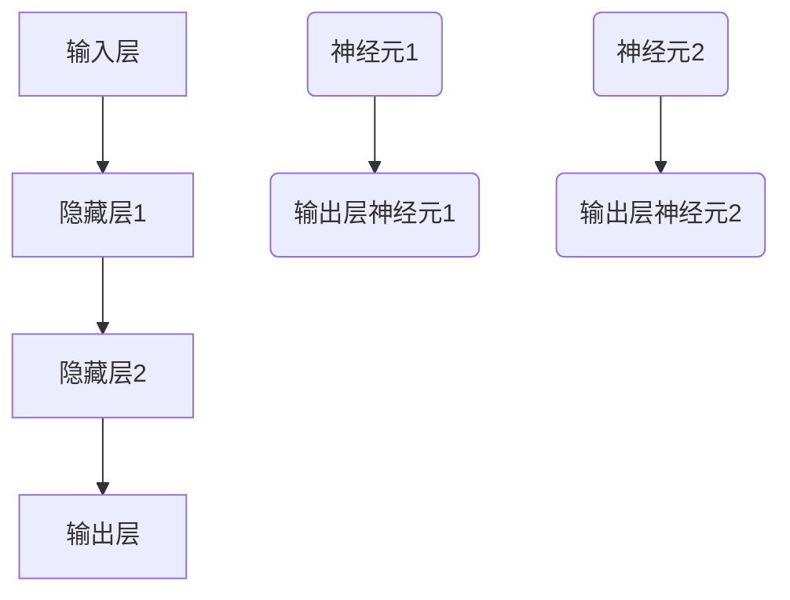
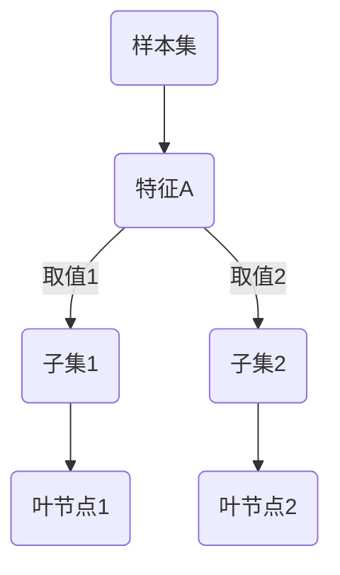
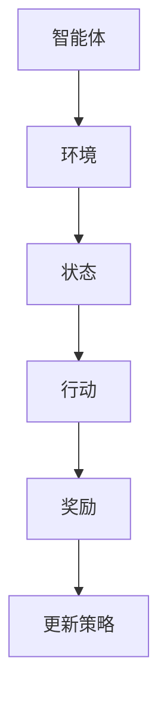

                 

### 智能家居时代的来临

随着科技的飞速发展，智能家居逐渐成为现代生活的一部分。从最初的简单家居自动化，到如今高度智能化的家居系统，智能家居正以不可阻挡的势头改变着人们的生活方式。这不仅仅是一个技术趋势，更是一种全新的生活理念。

#### 问题的背景

智能家居市场的快速增长，得益于多个因素的推动。首先，互联网技术的普及和5G网络的部署，为智能家居设备提供了高速稳定的网络连接。其次，物联网（IoT）技术的成熟，使得各种家居设备能够无缝连接，实现数据的实时传输和智能处理。此外，人工智能（AI）技术的不断进步，为智能家居系统提供了强大的智能决策和自适应能力。

#### 问题描述

然而，随着智能家居设备的增多，用户面临着诸多挑战。例如，设备之间的兼容性问题、系统的复杂性和用户体验的不足等。如何利用AI技术提升智能家居系统的用户体验，实现真正的智能生活，成为当前亟待解决的问题。

#### 问题解决

AI技术在智能家居中的应用，有望解决上述问题。通过AI技术，智能家居系统能够更好地理解用户的需求，提供个性化的服务，实现设备间的无缝协同。此外，AI技术还可以优化系统的性能，提高能源效率，降低运维成本。

#### 边界与外延

在讨论智能家居系统的边界时，我们主要关注的是系统所涵盖的设备范围和功能范围。一般来说，智能家居系统包括照明、安防、温度控制、家电控制等多个方面。而AI技术的应用，不仅限于这些传统领域，还可以扩展到健康监测、环境监控等新兴领域。

#### 概念结构与核心要素组成

智能家居系统的结构可以分为三个主要层次：硬件层、软件层和网络层。硬件层包括各种传感器、控制器和执行器；软件层包括操作系统、应用软件和中间件；网络层则负责设备之间的数据传输和通信。而AI技术在智能家居中的核心作用，主要体现在数据收集、处理和智能决策等方面。

综上所述，智能家居时代已经到来，而AI技术的集成应用，将推动智能家居向更智能化、更便捷的方向发展。接下来，我们将深入探讨AI在智能家居系统中的基本概念、核心算法以及系统集成等方面的内容。

### 智能家居系统中的AI应用

在智能家居系统中，AI技术的应用广泛且深入，涵盖了从数据收集到智能决策的各个层面。通过AI技术的整合，智能家居系统能够更好地理解用户需求，提供个性化的服务，并实现设备间的无缝协同。

#### 数据收集

数据收集是智能家居系统的基础。通过各类传感器，如温度传感器、湿度传感器、光照传感器等，智能家居系统可以实时收集室内外环境数据。这些数据不仅包括温度、湿度、光照强度等环境信息，还包括家电的运行状态、用户的行为模式等。例如，通过摄像头和麦克风，系统可以监测家庭的安全状况和家庭成员的活动。

#### 数据处理

收集到的数据需要经过处理，才能用于后续的智能分析和决策。数据处理通常包括数据清洗、数据分析和数据挖掘等步骤。数据清洗是为了去除噪声和异常值，确保数据的准确性和可靠性。数据分析则是对数据进行分析，提取有用的信息和模式。例如，通过分析用户的用电行为，系统可以预测未来的用电需求，并自动调整用电计划。数据挖掘则是更高级的数据处理方法，旨在发现隐藏在数据中的深层次模式和信息。

#### 智能决策

智能决策是智能家居系统的核心功能。通过AI算法，系统可以基于收集和处理后的数据，自动做出最优决策。例如，在智能照明系统中，系统可以根据用户的行为模式和自然光照强度，自动调整灯光亮度和色温，以提供最佳的照明效果。在智能安防系统中，系统可以实时分析监控视频，识别可疑行为并及时报警。

#### 设备间的协同

智能家居系统的优势之一在于设备间的协同工作。通过AI技术，不同设备可以相互通信，共享数据，并协同工作以实现更高效的功能。例如，在智能家庭影院中，用户可以通过语音指令控制电视、音响、投影仪等多个设备，实现一键切换和无缝播放。

#### 用户交互

用户交互是智能家居系统的另一个重要方面。通过自然语言处理（NLP）和语音识别技术，用户可以与智能家居系统进行自然语言交互。例如，用户可以通过语音指令控制灯光、调节温度、播放音乐等。这不仅提高了用户的便利性，也增强了系统的智能性和互动性。

#### 用户体验优化

通过AI技术的应用，智能家居系统能够不断学习和适应用户的需求和行为模式，从而优化用户体验。例如，系统可以自动调整设备设置以适应用户的习惯，提供个性化的推荐和服务。此外，AI技术还可以用于故障诊断和运维管理，提高系统的可靠性和稳定性。

#### 提升点

AI技术在智能家居系统中的提升点主要体现在以下几个方面：

1. **个性化服务**：通过用户行为分析，提供个性化的服务和建议。
2. **节能环保**：通过智能控制，优化能源消耗，降低碳排放。
3. **安全性**：通过智能监控和数据分析，提高家庭的安全性和隐私保护。
4. **智能化**：通过自我学习和优化，实现更高的自动化和智能化水平。

总之，AI技术在智能家居系统中的应用，不仅提升了系统的功能性和智能化水平，也为用户带来了更加便捷和舒适的生活体验。随着AI技术的不断发展和应用，智能家居系统将变得更加智能、高效和人性化。

### AI基础理论

AI作为智能家居系统中的关键技术，其基础理论的理解至关重要。在这一部分，我们将深入探讨AI的基本概念、机器学习和深度学习的原理，并简要介绍AI在智能家居中的关键角色。

#### AI的概念与发展历程

人工智能（Artificial Intelligence，简称AI）是指通过计算机模拟人类智能行为的技术。自20世纪50年代以来，AI经历了多个发展阶段。起初，AI主要集中在符号推理和逻辑推理方面，代表技术包括专家系统和推理机。随后，随着计算能力的提升和算法的进步，机器学习（Machine Learning，简称ML）和深度学习（Deep Learning，简称DL）成为AI研究的热点。

AI的发展历程可以分为几个主要阶段：

1. **早期AI（1950-1969）**：这一阶段以符号推理和逻辑推理为基础，代表性的工作包括IBM的“深蓝”和国际象棋程序。
2. **人工智能繁荣期（1970-1989）**：在这一时期，AI研究得到了广泛关注和投资，但受限于计算能力和数据资源，AI应用较为有限。
3. **专家系统和知识表示（1990-2010）**：专家系统成为AI研究的重要方向，通过知识表示和推理，实现特定领域的智能应用。
4. **大数据和机器学习时代（2010至今）**：随着互联网和大数据技术的发展，机器学习和深度学习成为AI研究的主流方向，AI在图像识别、自然语言处理、自动驾驶等领域取得了显著成果。

#### 机器学习与深度学习

机器学习是AI的一个分支，它使计算机系统能够从数据中学习并做出预测或决策。机器学习可以分为监督学习、无监督学习和强化学习三类：

1. **监督学习（Supervised Learning）**：在监督学习中，系统通过训练数据集学习模型，并使用模型进行预测。常见的算法包括线性回归、决策树、支持向量机（SVM）等。
   
2. **无监督学习（Unsupervised Learning）**：无监督学习不使用标记数据，旨在发现数据中的模式和结构。常见的算法包括聚类分析、主成分分析（PCA）和自编码器等。

3. **强化学习（Reinforcement Learning）**：强化学习通过奖励机制，使系统通过试错学习最佳策略。常见的算法包括Q学习、深度Q网络（DQN）和策略梯度等。

深度学习是机器学习的一种特殊形式，通过多层神经网络（Neural Networks）进行特征学习和决策。深度学习的关键在于其多层结构，能够自动提取数据中的高级特征。典型的深度学习模型包括卷积神经网络（CNN）、循环神经网络（RNN）和生成对抗网络（GAN）等。

#### 人工智能伦理与挑战

随着AI技术的快速发展，伦理问题成为重要的讨论话题。在智能家居系统中，AI的伦理挑战主要包括：

1. **隐私保护**：智能家居设备会收集大量的用户数据，包括行为、位置、习惯等。如何保护用户的隐私，防止数据泄露，是AI应用的重要挑战。

2. **算法偏见**：如果训练数据存在偏见，AI系统可能会继承这些偏见，导致不公平的决策。例如，在智能家居安防系统中，如果系统对特定种族或性别有偏见，可能会引发误报警或忽视真正危险的情境。

3. **透明度和可解释性**：深度学习模型通常被认为是“黑箱”，其内部决策过程不透明。如何提高AI系统的透明度和可解释性，使其更容易被用户理解和接受，是一个重要的研究方向。

4. **责任归属**：当AI系统发生错误或造成损害时，如何确定责任归属，是一个复杂的法律和道德问题。

#### AI在智能家居中的关键角色

AI在智能家居系统中的关键角色主要体现在以下几个方面：

1. **智能决策与控制**：AI系统可以基于传感器数据和用户行为，自动调整家居设备的运行状态，提供个性化的服务。例如，自动调节室内温度和灯光，以提供最佳的生活环境。

2. **个性化服务**：通过用户行为分析，AI系统可以了解用户的偏好和习惯，提供个性化的推荐和提醒。例如，根据用户的历史行为，智能音箱可以推荐合适的音乐或新闻。

3. **故障诊断与维护**：AI系统可以通过监控设备状态，预测潜在故障，并提供维护建议。例如，空调系统可以根据运行数据预测过滤网的更换时间。

4. **安全监控与保护**：AI系统可以实时分析监控视频，识别异常行为并及时报警，提高家庭的安全性和防范能力。

5. **能耗管理**：通过智能控制家居设备的运行，AI系统可以优化能源消耗，提高能源利用效率。

总之，AI技术在智能家居系统中的应用，不仅提升了系统的功能和智能化水平，也为用户带来了更加便捷和安全的生活体验。随着AI技术的不断进步，智能家居系统将变得更加智能、高效和人性化。

### AI核心算法详解

在智能家居系统中，AI算法是实现智能决策和自适应功能的核心。本文将详细介绍几种常见的AI核心算法，包括神经网络、决策树与随机森林、以及强化学习，通过流程图、Python代码和数学模型，深入探讨这些算法的基本原理和应用。

#### 神经网络算法

神经网络（Neural Networks）是深度学习的基础，它通过模仿人脑的结构和功能，实现复杂的数据处理和模式识别。神经网络的基本结构包括输入层、隐藏层和输出层，每层由多个神经元组成。神经元之间通过加权连接，实现信息的传递和计算。

##### 神经网络的基本结构



##### Python代码示例

```python
import numpy as np

# 初始化权重和偏置
weights = np.random.rand(3, 1)
bias = np.random.rand(1)

# 前向传播
input_data = np.array([1, 0])
hidden_layer = np.dot(input_data, weights) + bias
output = sigmoid(hidden_layer)

def sigmoid(x):
    return 1 / (1 + np.exp(-x))

print("Output:", output)
```

##### 数学模型

神经网络中的每个神经元通过以下公式进行计算：

$$
z = \sum_{i=1}^{n} w_{i}x_{i} + b
$$

其中，$w_{i}$ 是权重，$x_{i}$ 是输入值，$b$ 是偏置。激活函数（如sigmoid函数）用于引入非线性：

$$
a = \sigma(z) = \frac{1}{1 + e^{-z}}
$$

#### 决策树与随机森林

决策树（Decision Trees）是一种基于规则的方法，通过一系列的判断条件来划分数据。每个节点表示一个特征，每个分支表示该特征的一个可能取值，叶节点表示最终的决策结果。决策树易于理解，但可能产生过拟合。

##### 决策树的工作原理



##### Python代码示例

```python
from sklearn.tree import DecisionTreeClassifier

# 初始化决策树模型
model = DecisionTreeClassifier()

# 训练模型
model.fit(X_train, y_train)

# 预测
predictions = model.predict(X_test)
```

##### 数学模型

决策树的每个节点通过以下公式进行划分：

$$
\text{Gini系数} = 1 - \sum_{i=1}^{c} \left( \frac{1}{n} \right)^2
$$

其中，$n$ 是当前节点的样本数量，$c$ 是当前节点的类别数量。

#### 随机森林

随机森林（Random Forest）是基于决策树的集成方法，通过构建多个决策树，并投票得到最终结果。随机森林能够提高模型的泛化能力和鲁棒性，减少过拟合。

##### 随机森林的优势与局限性

**优势**：
- **泛化能力强**：通过集成多个决策树，随机森林能够提高模型的预测能力。
- **易于实现**：随机森林的实现较为简单，易于理解和部署。

**局限性**：
- **计算成本高**：构建大量决策树需要大量的计算资源。
- **可解释性降低**：由于模型复杂度增加，随机森林的可解释性相对较低。

##### Python代码示例

```python
from sklearn.ensemble import RandomForestClassifier

# 初始化随机森林模型
model = RandomForestClassifier(n_estimators=100)

# 训练模型
model.fit(X_train, y_train)

# 预测
predictions = model.predict(X_test)
```

##### 数学模型

随机森林通过Bootstrap抽样法生成多个子数据集，并在每个子数据集上训练决策树。最终，通过多数投票决定最终预测结果。

#### 强化学习

强化学习（Reinforcement Learning）是一种通过试错学习最佳策略的方法。在强化学习中，智能体（Agent）通过与环境（Environment）交互，不断学习和调整策略（Policy），以实现最优目标。

##### 强化学习的基本原理



##### Python代码示例

```python
import numpy as np

# 初始化Q表
Q = np.zeros((n_states, n_actions))

# 学习率
alpha = 0.1
# 折扣因子
gamma = 0.9

# 探索率
epsilon = 0.1

# 进行N次迭代
for episode in range(N):
    state = env.reset()
    done = False
    while not done:
        if np.random.uniform() < epsilon:
            action = env.action_space.sample()
        else:
            action = np.argmax(Q[state])

        next_state, reward, done, _ = env.step(action)

        Q[state, action] = Q[state, action] + alpha * (reward + gamma * np.max(Q[next_state]) - Q[state, action])
        state = next_state
```

##### 数学模型

强化学习的主要公式是：

$$
Q(s, a) \leftarrow Q(s, a) + \alpha [r + \gamma \max_{a'} Q(s', a') - Q(s, a)]
$$

其中，$Q(s, a)$ 是状态-行动值函数，$r$ 是即时奖励，$s'$ 是下一个状态，$a'$ 是最佳行动，$\gamma$ 是折扣因子，$\alpha$ 是学习率。

通过上述算法的详细介绍，我们可以看到AI技术在智能家居系统中的广泛应用。神经网络用于智能决策，决策树与随机森林用于数据分类和模式识别，强化学习用于行为规划和自适应控制。这些算法的结合，使得智能家居系统能够更加智能、高效和人性化。

### 智能家居系统的架构设计

智能家居系统的架构设计是实现高效、可靠、安全智能服务的关键。一个典型的智能家居系统架构可以分为硬件层、软件层和网络层。以下是这三个层的详细组成和设计原则。

#### 硬件层

硬件层是智能家居系统的基石，包括各种传感器、执行器和控制器。传感器用于采集环境数据，如温度、湿度、光照、烟雾等；执行器用于执行操作，如灯光开关、窗帘控制、家电启动等；控制器则是连接各个设备的枢纽，负责数据的传输和指令的执行。

1. **传感器**：
   - **环境传感器**：如温湿度传感器、光照传感器、烟雾传感器等。
   - **人体传感器**：如红外传感器、微波传感器等，用于检测家庭成员的活动。

2. **执行器**：
   - **开关和插座**：用于控制灯光、风扇、热水器等设备的开关。
   - **智能插座**：可以远程控制家电的开关，并监控能耗。

3. **控制器**：
   - **中央控制单元**：作为系统的核心，负责协调和控制各个设备。
   - **边缘计算设备**：如智能路由器、智能网关等，用于处理本地数据和控制指令。

#### 软件层

软件层是智能家居系统的“大脑”，负责数据的处理、存储和智能决策。包括操作系统、应用软件、中间件和AI算法。

1. **操作系统**：
   - **嵌入式操作系统**：如Linux、Android等，用于控制和调度硬件资源。
   - **云操作系统**：用于处理云端的计算任务和数据存储。

2. **应用软件**：
   - **设备管理软件**：用于配置和管理各个硬件设备。
   - **用户界面**：如手机App、Web界面等，用于用户与系统的交互。

3. **中间件**：
   - **数据采集与传输中间件**：负责收集传感器数据，并将数据传输到云端或中央控制单元。
   - **数据分析与处理中间件**：用于数据清洗、存储和初步分析。

4. **AI算法**：
   - **机器学习算法**：用于模式识别、预测和决策。
   - **自然语言处理**：用于语音识别和语义理解。

#### 网络层

网络层负责连接各个设备和系统，实现数据的实时传输和协同工作。包括有线网络和无线网络。

1. **有线网络**：
   - **以太网**：用于连接有线设备，如计算机、路由器等。
   - **电力线通信**（PLC）：通过电力线传输数据，适用于传感器和执行器的通信。

2. **无线网络**：
   - **Wi-Fi**：提供高速无线连接，适用于手机、平板等移动设备。
   - **蓝牙**：适用于短距离通信，如智能手环、智能音箱等。
   - **ZigBee**：适用于低功耗、短距离通信，如智能灯泡、传感器等。

#### 设计原则

1. **可扩展性**：
   - 系统应支持设备的动态加入和删除，便于系统规模的扩展。

2. **安全性**：
   - 系统应具备数据加密和访问控制机制，确保用户数据的安全。

3. **用户体验**：
   - 系统应提供简单易用的用户界面，提升用户的使用体验。

4. **可靠性**：
   - 系统应具备容错和故障恢复机制，确保系统的稳定运行。

5. **灵活性**：
   - 系统应支持多样化的设备和协议，适应不同的应用场景。

通过合理的架构设计，智能家居系统可以高效地整合各类设备和技术，实现智能化的家居体验。随着技术的不断进步，智能家居系统将变得更加智能、便捷和人性化。

### 数据收集与处理

在智能家居系统中，数据收集和处理是确保系统智能性和效率的关键环节。本文将详细介绍数据收集的方法与工具，以及数据处理的技术与方法，重点探讨数据清洗、数据分析和数据挖掘等步骤，并介绍相关工具和平台。

#### 数据收集的方法与工具

数据收集是智能家居系统的基础，传感器是收集数据的核心组件。传感器类型多样，包括但不限于以下几种：

1. **环境传感器**：
   - **温度传感器**：用于监测室内外温度，常见的有热敏电阻、半导体温度传感器等。
   - **湿度传感器**：用于监测空气中的水分含量，常见的有电容式湿度传感器、电阻式湿度传感器等。
   - **光照传感器**：用于监测环境光照强度，常见的有光敏电阻、光敏二极管等。

2. **人体传感器**：
   - **红外传感器**：通过检测人体红外辐射，实现家庭成员活动的监测。
   - **微波传感器**：通过发射微波并接收反射信号，实现人体检测。

3. **智能设备传感器**：
   - **家电传感器**：如智能空调、智能冰箱等家电内部的传感器，用于监测设备运行状态和能耗数据。

数据收集工具主要包括：

- **物联网网关**：用于连接各种传感器和智能设备，并将数据传输到中央控制系统。
- **无线传感器网络**（WSN）：通过无线通信技术，实现传感器的分布式部署和高效数据传输。

#### 数据处理的技术与方法

数据处理包括数据清洗、数据分析和数据挖掘等步骤，以下是每个步骤的详细介绍：

1. **数据清洗**：

数据清洗是确保数据质量和准确性的关键步骤。数据清洗的主要任务是去除噪声、填补缺失值、处理异常值等。

- **噪声去除**：通过统计学方法或机器学习方法，识别并去除数据中的噪声。
- **缺失值填补**：根据数据分布或使用模型预测，填补缺失的数据。
- **异常值处理**：通过统计学方法（如3sigma准则）或机器学习方法，识别并处理异常值。

常用工具和平台：

- **Pandas**：Python中的数据操作库，用于数据清洗、数据转换等。
- **Excel**：适用于小规模数据的清洗和预处理。

2. **数据分析**：

数据分析是通过统计方法或机器学习算法，对数据进行探索性分析，提取有用的信息和规律。

- **描述性统计分析**：用于描述数据的基本特征，如均值、中位数、标准差等。
- **回归分析**：用于分析变量之间的关系，如线性回归、多项式回归等。
- **聚类分析**：用于发现数据中的相似模式，如K-means聚类、层次聚类等。

常用工具和平台：

- **SPSS**：用于描述性统计分析和回归分析。
- **R语言**：适用于各种数据分析方法，包括统计分析和机器学习。

3. **数据挖掘**：

数据挖掘是从大量数据中发现隐含的、未知的、潜在的信息和知识。数据挖掘包括关联规则学习、分类、聚类等算法。

- **关联规则学习**：用于发现数据之间的关联关系，如Apriori算法、FP-growth算法等。
- **分类**：用于预测新数据类别，如决策树、支持向量机（SVM）等。
- **聚类**：用于发现数据中的自然分组，如K-means聚类、DBSCAN等。

常用工具和平台：

- **Weka**：一个用于数据挖掘的开源工具包，包含多种算法和可视化功能。
- **Spark MLlib**：用于大规模数据挖掘的分布式机器学习库。

#### 数据处理案例

假设我们有一个智能家居系统，其中包括温度传感器、湿度传感器和光照传感器，以下是一个数据处理案例：

1. **数据收集**：

   收集一天的温度、湿度和光照数据，数据格式如下：

   ```python
   timestamp, temperature, humidity, light_intensity
   2023-11-08 08:00:00, 23, 45, 500
   2023-11-08 09:00:00, 24, 46, 510
   ...
   ```

2. **数据清洗**：

   - 去除噪声数据：通过分析数据分布，去除明显偏离的数据点。
   - 填补缺失值：根据前一天的数据，用平均值填补缺失的温度和湿度数据。
   - 异常值处理：通过3sigma准则，去除温度和湿度中的异常值。

3. **数据分析**：

   - 描述性统计分析：计算温度、湿度和光照的平均值、中位数和标准差。
   - 回归分析：分析温度和光照之间的关系，使用线性回归模型。

4. **数据挖掘**：

   - 关联规则学习：发现温度和光照之间的关联关系，使用Apriori算法。
   - 聚类分析：将数据分为不同的类别，使用K-means聚类算法。

通过数据收集与处理，智能家居系统能够从大量的传感器数据中提取有价值的信息，为智能决策提供数据支持。随着数据量的增加和处理技术的进步，智能家居系统的智能化和个性化水平将进一步提高。

### 智能决策与响应

智能决策与响应是智能家居系统的核心功能之一，它使得系统能够根据实时数据和用户需求，自动做出最优决策并执行相应操作。在这一部分，我们将详细探讨智能决策的过程和实现方式，以及智能响应机制的设计和实现。

#### 智能决策的过程

智能决策的过程可以分为以下几个步骤：

1. **数据收集**：
   智能家居系统通过各种传感器收集室内外环境数据，如温度、湿度、光照、噪音等，以及用户行为数据，如使用习惯、偏好等。

2. **数据预处理**：
   对收集到的数据进行清洗、格式化，去除噪声和异常值，确保数据的质量和准确性。

3. **特征提取**：
   从预处理后的数据中提取对决策有用的特征。特征可以是数值型的，如温度、湿度等，也可以是类别型的，如用户的活动类型等。

4. **模型选择与训练**：
   根据决策任务的需求，选择合适的机器学习或深度学习模型。模型的选择取决于数据的类型、决策任务的复杂度以及模型的性能。常见的模型包括线性回归、决策树、随机森林、神经网络等。选择模型后，使用训练数据集对模型进行训练，优化模型参数。

5. **决策生成**：
   模型训练完成后，使用训练好的模型对新的数据进行预测或分类，生成决策结果。决策结果可以是具体的操作指令，如调整温度、开启灯光等。

6. **决策优化**：
   根据反馈数据（如用户满意度、系统运行效果等），对决策模型进行优化和调整，以提高决策的准确性和适应性。

#### 智能响应的实现

智能响应是指系统能够根据智能决策的结果，自动执行相应的操作，提供实时的反馈和调整。智能响应的实现主要包括以下几个方面：

1. **执行器控制**：
   执行器是智能家居系统中的关键组件，用于执行具体的操作。例如，温度调节器可以调节室内的温度，灯光控制器可以调整灯光的亮度和色温，窗帘控制器可以控制窗帘的开关等。

2. **实时反馈**：
   智能家居系统通过传感器实时收集环境数据和用户反馈，将这些数据用于决策模型，并根据决策结果对执行器进行控制。实时反馈机制可以确保系统快速响应，提高用户体验。

3. **自适应调整**：
   智能家居系统可以根据用户的行为模式和偏好，自适应调整系统设置。例如，系统可以根据用户的使用习惯，自动调整空调的温度和湿度，以提高舒适度和节能效果。

4. **多设备协同**：
   智能家居系统中的各个设备可以相互协同工作，实现更高效的功能。例如，当用户打开电视时，系统可以自动调整灯光的亮度和色温，以提供最佳的观影效果。

#### 智能决策与响应的案例分析

以下是一个智能决策与响应的案例分析：

**案例背景**：
一个智能家居系统需要根据室内温度和湿度，自动调节空调和加湿器的运行状态，以提供舒适的室内环境。

**数据收集**：
系统通过温度传感器和湿度传感器收集实时数据，数据包括当前温度、湿度，以及历史数据。

**数据预处理**：
对收集到的温度和湿度数据进行清洗，去除噪声和异常值。

**特征提取**：
提取温度和湿度的平均值、标准差等特征。

**模型选择与训练**：
选择线性回归模型，使用历史数据对模型进行训练。

**决策生成**：
根据实时数据，模型生成空调和加湿器的控制指令。

**执行与反馈**：
系统根据决策指令，调整空调和加湿器的状态，并根据用户反馈（如舒适的评分）对模型进行优化。

通过上述过程，智能家居系统能够实现自动化的智能决策与响应，提供舒适、节能、高效的家居环境。

### 用户交互与体验优化

在智能家居系统中，用户交互与体验优化是确保系统易用性和用户满意度的重要环节。一个良好的用户交互设计不仅能够提高用户的操作便利性，还能增强系统的智能性和人性化。以下是关于用户交互设计的原则、最佳实践、用户体验优化方法以及相关的技术，例如自然语言处理和可视化交互。

#### 用户交互设计的原则

1. **简单直观**：
   用户交互设计的核心原则之一是让操作尽可能简单直观。用户应能快速理解系统的功能和使用方法，无需复杂的操作步骤。

2. **一致性**：
   系统的界面和交互元素应保持一致性，使用户在使用过程中不会感到困惑。例如，按钮的颜色、形状和位置应保持一致。

3. **适应性**：
   系统应能够适应不同用户的需求和使用习惯，提供自定义设置和灵活的操作方式。

4. **反馈**：
   系统应提供及时的反馈，让用户知道他们的操作已被系统接收到并执行。例如，当用户发送语音指令时，系统应立即给出语音或视觉反馈。

5. **安全性**：
   系统应确保用户数据的安全性和隐私保护，提供安全登录、数据加密和访问控制等措施。

#### 最佳实践

1. **用户研究**：
   在设计用户交互界面时，应进行用户研究，了解用户的需求和行为模式。用户访谈、问卷调查和用户测试等方法可以帮助设计师更好地理解用户。

2. **简洁性**：
   界面设计应简洁明了，避免过多的干扰信息。关键功能应突出显示，便于用户快速找到和使用。

3. **任务导向**：
   系统应设计为任务导向，用户能够通过一系列简单的步骤完成复杂任务。例如，用户可以通过几个简单的步骤设置智能照明或安防系统。

#### 用户体验优化方法

1. **自然语言处理（NLP）**：
   NLP技术使系统能够理解用户的自然语言指令，提供更加自然和便捷的用户交互方式。例如，用户可以通过语音指令控制灯光、调节温度、播放音乐等。

2. **语音识别**：
   语音识别技术是实现NLP的基础，通过语音识别，系统能够将用户的语音指令转换为文本，并执行相应的操作。

3. **语音合成**：
   语音合成技术用于生成系统的语音反馈，使系统能够与用户进行语音交流，提供更好的用户体验。

4. **可视化交互**：
   可视化交互通过图形用户界面（GUI）和图表等视觉元素，使用户能够直观地理解和操作系统。例如，使用图表展示家电的能耗数据，使用地图显示家庭安全监控的实时位置等。

5. **多模态交互**：
   结合多种交互方式，如语音、触摸和手势，提供更加灵活和多样化的用户交互体验。

#### 技术应用

1. **智能家居控制中心**：
   智能家居控制中心是用户与系统交互的主要界面，应提供简洁、直观的界面，使用户能够方便地控制和管理家居设备。

2. **移动应用**：
   移动应用应支持多种交互方式，如语音、触摸和手势，并提供实时数据监控和远程控制功能。

3. **智能音箱**：
   智能音箱是智能家居系统的语音交互入口，通过语音指令，用户可以控制家居设备，询问天气、播放音乐等。

4. **物联网平台**：
   物联网平台负责连接和管理智能家居系统中的各个设备和传感器，提供数据收集、处理和智能决策功能。

通过上述用户交互与体验优化方法，智能家居系统能够提供更加便捷、智能和人性化的用户体验，使用户享受科技带来的美好生活。

### AI在智能家居中的实际应用案例

在智能家居领域，AI技术的应用已经取得了显著成果。以下将详细介绍几个实际应用案例，从智能照明系统、智能安防系统到健康监测系统，探讨这些系统的功能、技术实现细节以及用户反馈。

#### 案例一：智能照明系统

**系统功能**：
智能照明系统通过AI技术实现环境自适应调节、用户习惯学习和智能场景设置等功能。用户可以通过手机App或语音助手控制灯光的亮度和色温，系统可以根据时间、天气和用户活动自动调整照明状态。

**技术实现细节**：
1. **传感器**：
   系统配备环境光传感器和运动传感器，用于监测室内光线强度和用户活动。

2. **AI算法**：
   利用机器学习算法，系统可以学习用户的作息习惯，自动调整灯光亮度和色温，以提供最佳的照明体验。

3. **云端处理**：
   系统数据通过无线网络传输到云端进行处理，云端服务器负责运行AI算法，生成智能照明控制策略。

**用户反馈**：
用户对智能照明系统的反馈普遍积极。系统不仅提高了照明效果，还节省了能源，用户表示使用非常方便，尤其是自动调节功能，大大提升了生活质量。

#### 案例二：智能安防系统

**系统功能**：
智能安防系统通过AI技术实现实时监控、异常行为识别和自动报警等功能，有效保护家庭安全。

**技术实现细节**：
1. **摄像头**：
   系统使用高清摄像头进行实时监控，配备运动检测和夜视功能。

2. **图像处理**：
   利用深度学习算法，系统可以对视频流进行实时分析，识别家庭成员和陌生人的行为，检测可疑活动。

3. **异常行为识别**：
   通过机器学习模型，系统可以识别异常行为，如未经授权的入侵、火灾和烟雾等，并自动触发报警。

**用户反馈**：
用户对智能安防系统的安全性能表示高度满意，特别是自动报警功能，让用户在紧急情况下能够迅速采取行动。此外，用户也提到系统的识别精度较高，误报率较低。

#### 案例三：健康监测系统

**系统功能**：
智能健康监测系统通过AI技术实时监测用户的健康状况，提供健康建议和预警服务，帮助用户养成良好的生活习惯。

**技术实现细节**：
1. **传感器**：
   系统使用各种健康传感器，如心率传感器、血压传感器和睡眠监测传感器，收集用户健康数据。

2. **数据分析**：
   系统通过机器学习和大数据分析，对用户的健康数据进行实时监测和分析，识别健康风险。

3. **个性化建议**：
   基于用户的数据分析结果，系统可以提供个性化的健康建议，如饮食调整、运动计划和睡眠改善等。

**用户反馈**：
用户对智能健康监测系统的反馈非常积极。系统不仅提供了准确的健康数据，还提供了实用的健康建议，帮助用户更好地管理自己的健康。一些用户表示，通过系统的建议，他们开始更加注重健康，生活习惯也得到了改善。

综上所述，AI技术在智能家居中的应用已经取得了显著成果，各个实际案例不仅提升了系统的功能和用户体验，还为用户带来了更加安全、健康和便捷的生活。随着AI技术的不断进步，智能家居系统将变得更加智能、高效和人性化。

### 从实验室到市场

将AI技术在智能家居系统中从实验室研究转化为实际市场产品，是一个复杂且充满挑战的过程。这一过程涉及从概念验证、技术实现、产品测试到市场推广的多个阶段。以下是详细步骤和关键要点。

#### 概念验证

概念验证（Proof of Concept, PoC）是产品开发的第一步，目的是验证AI技术的可行性和有效性。在这一阶段，研究人员和开发者会构建一个最小可行性产品（Minimum Viable Product, MVP），以验证AI技术在实际应用中的效果。

1. **需求分析**：
   - 与潜在用户进行交流，了解他们对智能家居系统的具体需求和期望。
   - 定义关键功能和技术要求，如智能照明、安防监测、健康管理等。

2. **技术选型**：
   - 选择合适的AI算法和工具，如机器学习、深度学习、自然语言处理等。
   - 确定系统的硬件和软件架构，包括传感器、控制器、数据处理和存储等。

3. **概念验证实现**：
   - 开发一个MVP原型，实现核心功能。
   - 进行初步测试，验证系统的性能和稳定性。

#### 技术实现

在概念验证阶段成功后，接下来的任务是进行技术实现，将原型扩展为完整的智能家居系统。

1. **系统设计**：
   - 设计系统的整体架构，包括硬件、软件和网络层。
   - 确定各个组件的接口和通信协议，如Wi-Fi、Zigbee等。

2. **AI算法优化**：
   - 对AI算法进行优化，提高模型的准确性和效率。
   - 针对实际应用场景，调整算法参数和模型结构。

3. **硬件集成**：
   - 集成传感器、控制器和执行器等硬件组件。
   - 进行硬件调试，确保系统的稳定性和可靠性。

4. **软件开发**：
   - 开发用户界面和应用软件，实现用户交互功能。
   - 开发中间件，处理数据收集、传输和存储。

#### 产品测试

产品测试是确保智能家居系统质量和稳定性的关键步骤。在这一阶段，系统将经历多个测试环节，包括单元测试、集成测试、系统测试和用户验收测试。

1. **单元测试**：
   - 测试各个模块的功能，确保每个组件按预期工作。
   - 使用自动化测试工具，提高测试效率和覆盖率。

2. **集成测试**：
   - 将各个模块集成在一起，测试系统的整体性能和功能。
   - 识别和修复系统中的集成问题。

3. **系统测试**：
   - 在真实环境中测试系统的稳定性和可靠性。
   - 测试系统在不同网络条件下的性能表现。

4. **用户验收测试**：
   - 与潜在用户合作，进行实际使用测试。
   - 根据用户反馈，进一步优化系统的功能和用户体验。

#### 市场推广

在产品测试阶段完成后，智能家居系统将准备推向市场。市场推广的关键是吸引潜在用户，提高品牌知名度和市场占有率。

1. **市场调研**：
   - 了解目标市场的需求和竞争情况。
   - 定义目标用户群体和市场需求。

2. **品牌建设**：
   - 设计品牌标识和宣传材料，提升品牌形象。
   - 利用社交媒体、广告和合作伙伴等渠道进行宣传。

3. **销售策略**：
   - 制定销售策略，如定价、促销和渠道选择。
   - 与零售商、代理商和合作伙伴建立合作关系。

4. **用户支持**：
   - 提供完善的用户支持和服务，包括安装指导、故障排除和技术支持。

通过上述步骤，从实验室到市场的转化过程，智能家居系统能够从概念验证逐步发展成为成熟的产品，满足用户需求，并在市场上取得成功。

### 未来展望与挑战

随着人工智能技术的不断进步，智能家居系统有望在未来的数年里实现更多突破，带来前所未有的便捷和舒适生活。以下是对智能家居系统未来发展的展望，以及可能面临的挑战。

#### 未来展望

1. **更高的智能化水平**：
   随着深度学习和强化学习技术的不断发展，智能家居系统将能够更加精准地理解和预测用户需求，提供个性化的服务。例如，通过不断学习和优化，智能助手可以更好地理解用户的语音指令，提供更加自然和准确的回应。

2. **跨平台集成**：
   未来，智能家居系统将实现更多设备的跨平台集成，用户可以通过一个统一的界面管理多个品牌和类型的智能家居设备。这将极大地简化用户的操作流程，提升整体使用体验。

3. **更高效的能源管理**：
   AI技术将进一步提升智能家居系统的能源管理能力。通过智能算法和数据分析，系统能够在用户不在家时自动关闭不必要的设备，优化能源消耗，降低碳排放。

4. **健康与安全**：
   健康监测和安防功能将得到进一步加强。智能家居系统可以通过实时数据分析和预警机制，为用户提供更全面的健康建议和安全保护。

5. **个性化智能家居体验**：
   基于用户行为的大数据分析，智能家居系统将能够提供更加个性化的服务，如智能健身建议、健康食谱推荐等，让用户的生活更加健康和丰富。

#### 挑战

1. **隐私保护**：
   随着智能家居系统的普及，用户数据的隐私保护将成为一个重要的挑战。如何确保用户数据的安全性和隐私性，防止数据泄露，是智能家居系统必须解决的问题。

2. **算法偏见**：
   如果训练数据存在偏见，AI系统可能会在决策中继承这些偏见，导致不公平的决策。例如，在安防系统中，如果系统对特定种族或性别有偏见，可能会导致误判或歧视。因此，如何消除算法偏见，提高系统的公平性，是一个亟待解决的问题。

3. **技术标准化**：
   随着智能家居设备的多样化，技术标准化问题变得越来越重要。缺乏统一的技术标准和接口协议，可能会导致设备兼容性问题，限制系统的扩展性和灵活性。

4. **用户体验**：
   虽然智能助手和自动化系统为用户带来了便利，但如何确保用户体验的持续优化，是一个挑战。系统需要能够不断学习和适应用户的需求，提供持续改进的服务。

5. **能源消耗**：
   智能家居系统中的设备和传感器会消耗电能，如何优化能源消耗，减少对环境的影响，是一个重要的研究方向。未来需要开发更加节能的设备和优化算法，以提高系统的能源效率。

总之，智能家居系统的发展前景广阔，但同时也面临着诸多挑战。通过技术创新、标准化推进和用户体验优化，智能家居系统有望在未来实现更高水平的智能化和人性化，为用户带来更加美好的生活体验。

### 小结与展望

本文详细探讨了AI在智能家居系统集成中的应用，从引言到未来展望，全面分析了AI技术如何提升智能家居系统的智能化水平、用户体验以及能源效率。通过具体案例和实际应用，展示了AI在智能照明、安防和健康监测等领域的广泛应用和显著成果。

**关键词**：人工智能、智能家居、系统集成、用户体验、智能决策、数据收集、智能响应、数据清洗、数据分析、算法优化、隐私保护、标准化、个性化服务。

**总结**：
- AI技术通过数据收集、处理和智能决策，提升了智能家居系统的智能化水平。
- 智能决策与响应机制使得系统能够自动调整设备状态，提供个性化的服务。
- 数据处理技术确保了数据质量和系统的稳定性，为智能决策提供了可靠支持。
- 隐私保护和算法偏见是未来需要解决的重要问题。

**展望**：
- 未来，随着AI技术的不断进步，智能家居系统将变得更加智能、高效和人性化。
- 标准化和技术集成将解决设备兼容性问题，推动智能家居市场的快速发展。
- 个性化服务和健康监测功能的提升，将进一步提高用户的生活质量。

**注意事项**：
- 确保系统的安全性和隐私保护，防止数据泄露和滥用。
- 不断优化用户体验，确保系统易于操作和高效运行。
- 关注技术标准化和跨平台集成，提高系统的扩展性和灵活性。

**拓展阅读**：
- "Artificial Intelligence: A Modern Approach" by Stuart Russell and Peter Norvig
- "Smart Home Automation: The Ultimate Guide to Building a Home Automation System" by Patrick McMillan
- "The Internet of Things: Transform the Way You Work, Innovate, and Grow" by Dave Evans and Stacey Higginbotham

通过持续的技术创新和优化，智能家居系统将在未来发挥更大的作用，为用户带来更加便捷、舒适和智能的生活体验。

### 作者信息

**作者：** AI天才研究院/AI Genius Institute & 禅与计算机程序设计艺术 /Zen And The Art of Computer Programming

**单位介绍：** AI天才研究院致力于推动人工智能技术在智能家居、健康监测、自动驾驶等领域的应用研究，通过不断创新和技术突破，助力智慧生活的实现。禅与计算机程序设计艺术则专注于计算机科学领域的哲学探讨和实践，倡导通过冥想和思考提升编程效率和创造力。

