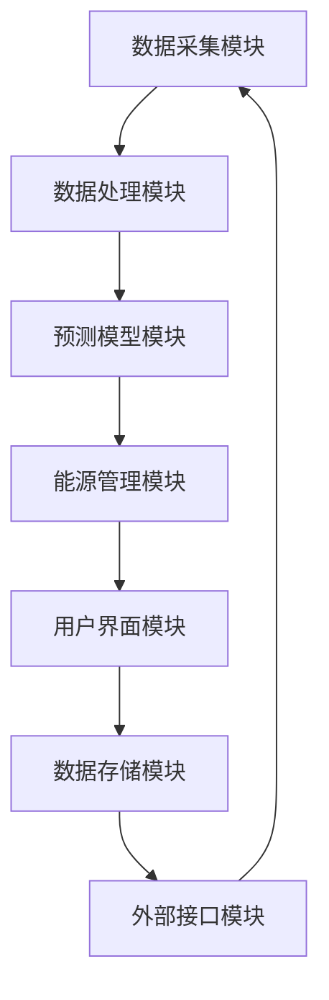

                 

### 目录大纲

# AI在智能家居能源管理中的应用：实现家庭节能减排

> 关键词：智能家居，能源管理，人工智能，节能减排，深度学习，优化算法

> 摘要：本文将探讨如何利用人工智能技术，特别是深度学习和优化算法，在智能家居能源管理中实现家庭节能减排。通过对智能家居与能源管理的概述、AI技术基础、核心技术与算法、系统集成与实施、案例研究和最佳实践的分析，本文为智能家居能源管理提供了理论与实践相结合的解决方案。

### 目录大纲

## 第一部分：背景与基础

## 第1章：智能家居与能源管理的概述
### 1.1 智能家居的概念与发展
### 1.2 家庭能源管理的重要性
### 1.3 智能家居能源管理的挑战与机遇

## 第2章：AI技术基础
### 2.1 AI技术在智能家居中的应用
#### 2.1.1 机器学习与深度学习
#### 2.1.2 传感器技术
### 2.2 机器学习与深度学习基础
#### 2.2.1 基础算法
#### 2.2.2 模型训练与优化

## 第二部分：智能家居能源管理的核心技术与算法

## 第3章：数据采集与处理
### 3.1 数据采集技术
#### 3.1.1 传感器种类
#### 3.1.2 数据采集系统设计
### 3.2 数据预处理
#### 3.2.1 数据清洗
#### 3.2.2 数据归一化
### 3.3 数据分析
#### 3.3.1 时序数据分析
#### 3.3.2 多变量数据分析

## 第4章：智能优化算法
### 4.1 优化算法概述
#### 4.1.1 优化目标
#### 4.1.2 优化算法分类
### 4.2 粒子群优化算法
#### 4.2.1 算法原理
#### 4.2.2 应用实例
### 4.3 遗传算法
#### 4.3.1 算法原理
#### 4.3.2 应用实例

## 第5章：深度学习在智能家居能源管理中的应用
### 5.1 深度学习基础
#### 5.1.1 神经网络
#### 5.1.2 深度学习模型
### 5.2 电力负荷预测
#### 5.2.1 模型构建
#### 5.2.2 预测结果分析
### 5.3 能源需求响应
#### 5.3.1 响应机制
#### 5.3.2 响应策略

## 第6章：案例研究
### 6.1 案例背景
### 6.2 数据采集与处理
### 6.3 优化算法应用
### 6.4 深度学习模型应用
### 6.5 案例总结与反思

## 第7章：系统集成与实施
### 7.1 系统设计原则
#### 7.1.1 系统架构设计
#### 7.1.2 系统接口设计
### 7.2 系统实施步骤
#### 7.2.1 环境安装与配置
#### 7.2.2 系统核心实现

## 第8章：最佳实践与展望
### 8.1 最佳实践分享
### 8.2 智能家居能源管理的发展趋势
### 8.3 未来展望与挑战

## 附录：参考文献与拓展阅读

### 目录大纲分析

1. **第一部分：背景与基础**
   - **第1章：智能家居与能源管理的概述**
     - 详细介绍智能家居和能源管理的基本概念，探讨其在现代社会中的重要性，以及面临的挑战和机遇。
   - **第2章：AI技术基础**
     - 介绍AI技术，包括机器学习和深度学习，以及传感器技术在智能家居中的应用，为后续章节的技术讨论奠定基础。

2. **第二部分：智能家居能源管理的核心技术与算法**
   - **第3章：数据采集与处理**
     - 讨论数据采集技术，包括传感器种类和数据采集系统设计，并探讨数据预处理和数据分析方法。
   - **第4章：智能优化算法**
     - 介绍智能优化算法，包括粒子群优化算法和遗传算法，详细阐述其原理和应用实例。
   - **第5章：深度学习在智能家居能源管理中的应用**
     - 深入探讨深度学习基础，并介绍电力负荷预测和能源需求响应的应用实例。
   - **第6章：案例研究**
     - 通过一个实际的案例研究，结合数据采集、优化算法和深度学习模型的应用，展示智能家居能源管理解决方案的实践过程。
   - **第7章：系统集成与实施**
     - 描述系统集成与实施的原则、步骤，以及环境安装与配置和系统核心实现。

3. **第8章：最佳实践与展望**
   - **第8章：最佳实践与展望**
     - 分享最佳实践，探讨智能家居能源管理的发展趋势，并展望未来的挑战和机遇。

### 目录大纲优缺点分析

**优点：**
- 结构清晰，逻辑性强。按照从背景介绍到技术探讨，再到实践案例，最后是总结展望的顺序，有助于读者逐步深入理解主题。
- 内容丰富，涵盖了从基础到高级的技术讨论，以及实际应用的案例研究，能够满足不同层次读者的需求。
- 目录中的关键词和摘要部分，为读者提供了文章的核心内容和重点，有助于快速把握文章的主题和框架。

**缺点：**
- 目录中的一些章节标题可能过于宽泛，如“智能优化算法”，需要进一步明确具体讨论的内容。
- 没有明确列出所有章节的具体内容，这可能让读者对文章的细节部分感到模糊。
- 缺少图表和示例代码等辅助材料，这对于理解技术概念和算法原理可能不够直观。

### 改进建议

1. **细化章节标题**：对于一些宽泛的章节标题，如“智能优化算法”，可以进一步细化，例如“智能优化算法：粒子群优化与遗传算法”。
2. **增加章节具体内容概述**：在每个章节前增加一段概述，简要介绍章节的主要内容和结构，帮助读者快速了解章节内容。
3. **添加图表和示例代码**：在适当的位置添加图表和示例代码，增强文章的可读性和实用性。

通过以上改进，可以使目录大纲更加完善，更有效地引导读者深入理解和掌握文章内容。接下来，我们将根据这个大纲逐步撰写文章的内容。### 第1章：智能家居与能源管理的概述

#### 1.1 智能家居的概念与发展

智能家居，顾名思义，是指利用网络技术、物联网技术、传感器技术等，将家庭中的各种设备连接起来，实现设备的智能化控制，从而提高家庭的舒适度、便利性和能源效率。智能家居的概念起源于20世纪90年代的计算机技术和互联网技术迅猛发展的时期，随着技术的不断进步，智能家居逐渐从理论走向了实际应用。

**智能家居的发展历程可以概括为以下几个阶段：**

1. **初期阶段（1990年代-2000年代初期）**：
   - 主要以单一设备控制为主，如家庭安全系统、远程家电控制等。
   - 依赖有线网络，设备之间的互操作性较差。

2. **成长阶段（2000年代中期-2010年代初期）**：
   - 无线技术的普及，尤其是Wi-Fi、蓝牙等技术的成熟，使得智能家居设备可以更加灵活地布置。
   - 设备的互操作性得到了提升，通过家庭网络实现多个设备的联动控制。

3. **成熟阶段（2010年代中期至今）**：
   - 物联网技术的广泛应用，使得智能家居系统可以与外部网络连接，实现远程控制和大数据分析。
   - 云计算和大数据技术的融入，使得智能家居系统能够提供更加个性化的服务。

**智能家居的核心组成部分包括：**

1. **传感器**：用于检测家庭环境数据，如温度、湿度、光照、烟雾等，并将这些数据转换为电信号，传送给控制系统。
2. **控制系统**：接收传感器数据，并根据预设的算法或用户指令进行决策，控制家庭设备的运行。
3. **执行器**：根据控制系统的指令，执行具体的操作，如调节温度、开关灯光等。
4. **网络通信**：实现家庭内部设备之间，以及与外部设备（如手机、电脑等）的通信。

#### 1.2 家庭能源管理的重要性

家庭能源管理是智能家居系统中的一个重要组成部分，其核心目标是通过优化能源使用，实现节能减排，提高家庭能源的利用效率。随着全球能源消耗的不断增加和气候变化问题的日益严峻，家庭能源管理的重要性日益凸显。

**家庭能源管理的重要性体现在以下几个方面：**

1. **经济效益**：通过优化能源使用，减少不必要的能源消耗，可以降低家庭的能源费用。
2. **环境保护**：减少能源消耗，降低二氧化碳排放，有助于减缓气候变化和环境污染。
3. **提高生活质量**：通过智能化的能源管理，可以提供更加舒适、健康的生活环境。
4. **能源安全**：通过合理的能源规划和使用，可以提高家庭的能源安全性，减少因能源短缺或价格波动带来的风险。

#### 1.3 智能家居能源管理的挑战与机遇

智能家居能源管理虽然具有很大的潜力，但在实际应用中也面临诸多挑战和机遇。

**面临的挑战：**

1. **技术挑战**：
   - 传感器精度和可靠性的提升。
   - 大数据分析与处理能力的增强。
   - 智能优化算法的改进。

2. **安全与隐私**：
   - 家庭数据的安全存储与传输。
   - 用户隐私保护。

3. **互操作性**：
   - 设备之间的兼容性和互操作性。

**面临的机遇：**

1. **政策支持**：
   - 全球各国对节能减排的重视，为智能家居能源管理提供了政策支持。
   - 能源市场改革，为智能家居能源管理提供了新的商业模式。

2. **市场潜力**：
   - 智能家居市场的快速增长，为智能家居能源管理提供了广阔的市场空间。
   - 能源消耗者对节能减排的需求增加，为智能家居能源管理提供了市场动力。

3. **技术创新**：
   - 新型传感器技术的应用。
   - 云计算、大数据、人工智能等新兴技术的融入。

通过上述分析，可以看出，智能家居能源管理具有巨大的发展潜力和市场前景。在挑战与机遇并存的背景下，我们需要不断创新和优化，以实现智能家居能源管理的最佳效果。### 第2章：AI技术基础

#### 2.1 AI技术在智能家居中的应用

人工智能（AI）技术的迅速发展为智能家居领域带来了深远的影响。通过AI技术，智能家居系统能够更加智能地感知、决策和执行，从而提升用户体验和能源管理效率。以下为AI技术在智能家居中的主要应用：

1. **智能感知**：
   - **图像识别**：摄像头可以识别家庭成员的面部，自动调整房间灯光和温度。
   - **语音识别**：智能音箱可以通过语音指令控制家庭设备，如打开电视、调节空调等。
   - **环境感知**：传感器可以实时监测家庭环境参数，如温度、湿度、空气质量等，并做出相应的调整。

2. **智能决策**：
   - **需求预测**：AI算法可以根据历史数据预测家庭能源需求，合理安排电力负荷。
   - **故障诊断**：AI系统可以分析设备运行数据，提前发现潜在故障，进行预防性维护。

3. **智能执行**：
   - **自动化控制**：AI系统可以自动控制家庭设备，如智能插座、智能开关等，实现无人干预的自动化运行。
   - **个性化服务**：根据用户习惯和偏好，AI系统可以提供个性化的能源管理方案，如自动调节空调温度、智能推荐节能方案等。

#### 2.1.1 机器学习与深度学习

机器学习和深度学习是AI技术的两大核心分支。在智能家居能源管理中，它们发挥着至关重要的作用。

1. **机器学习**：
   - **定义**：机器学习是一种通过数据训练，使计算机系统能够从数据中自动学习和改进的技术。
   - **应用**：
     - **数据预处理**：通过机器学习算法清洗、归一化数据，为深度学习模型提供高质量的输入。
     - **预测模型**：建立预测模型，如电力负荷预测、温度预测等，为能源管理提供数据支持。

2. **深度学习**：
   - **定义**：深度学习是机器学习的一个子领域，它通过多层神经网络结构，对数据进行复杂的学习和表征。
   - **应用**：
     - **图像识别**：用于识别家庭摄像头拍摄的画面，如家庭成员的识别、异常行为的检测等。
     - **语音识别**：用于将语音信号转换为文本，实现语音控制功能。
     - **时序预测**：用于预测家庭能源需求，优化电力负荷管理。

#### 2.1.2 传感器技术

传感器技术在智能家居能源管理中发挥着关键作用，它们能够实时监测家庭环境参数，为AI系统提供必要的数据输入。

1. **传感器类型**：
   - **温度传感器**：用于测量环境温度，对空调等设备进行调控。
   - **湿度传感器**：用于测量环境湿度，对加湿器、除湿器等设备进行调控。
   - **光照传感器**：用于测量环境光照强度，对灯光设备进行调控。
   - **二氧化碳传感器**：用于测量室内空气质量，对空气净化器等设备进行调控。

2. **传感器应用**：
   - **环境监测**：通过传感器实时监测家庭环境参数，为AI系统提供数据支持，实现智能化的环境调控。
   - **能耗监控**：通过传感器实时监测家庭用电量，为能源管理提供数据支持，实现节能减排。

#### 2.2 机器学习与深度学习基础

为了更好地理解机器学习和深度学习在智能家居能源管理中的应用，我们需要了解这些技术的基础知识。

1. **机器学习基础**：
   - **监督学习**：通过已有数据训练模型，然后对新数据进行预测。例如，使用历史电力数据训练模型，预测未来的电力负荷。
   - **无监督学习**：没有已标记的数据，通过数据自身的特征进行聚类或降维。例如，分析家庭能源使用模式，发现潜在的节能机会。

2. **深度学习基础**：
   - **神经网络**：由多个神经元（节点）组成的计算模型，能够对数据进行分层表征。例如，卷积神经网络（CNN）用于图像识别，循环神经网络（RNN）用于时序预测。
   - **优化算法**：用于调整神经网络的参数，使其在训练数据上达到最优性能。例如，梯度下降（GD）和随机梯度下降（SGD）是常用的优化算法。

#### 2.2.1 基础算法

在机器学习和深度学习中，有许多经典的基础算法。以下为其中几种常用的算法：

1. **线性回归**：用于预测连续值变量。例如，使用线性回归模型预测家庭未来的电力消耗。
2. **逻辑回归**：用于预测二分类变量。例如，使用逻辑回归模型预测家庭是否会开启空调。
3. **支持向量机（SVM）**：用于分类和回归任务。例如，使用SVM分类器识别家庭能耗的异常数据。
4. **神经网络**：用于处理复杂的非线性问题。例如，使用神经网络模型预测家庭能源需求。
5. **卷积神经网络（CNN）**：用于图像识别。例如，使用CNN模型识别摄像头拍摄的画面中的家庭成员。

#### 2.2.2 模型训练与优化

在机器学习和深度学习中，模型训练和优化是关键步骤。以下为模型训练与优化的主要步骤：

1. **数据准备**：收集和处理训练数据，包括数据清洗、归一化等。
2. **模型选择**：根据问题类型选择合适的模型。例如，对于图像识别问题，选择卷积神经网络。
3. **模型训练**：使用训练数据训练模型，调整模型参数。
4. **模型评估**：使用验证数据评估模型性能，调整模型参数。
5. **模型部署**：将训练好的模型部署到实际应用场景中，如智能家居能源管理系统。

通过上述步骤，我们可以构建一个有效的机器学习或深度学习模型，用于智能家居能源管理。接下来，我们将进一步探讨智能家居能源管理的核心技术与算法，以实现家庭节能减排的目标。### 第3章：数据采集与处理

#### 3.1 数据采集技术

数据采集是智能家居能源管理的基础，通过传感器和测量设备收集家庭环境中的各种数据。这些数据包括温度、湿度、光照、二氧化碳浓度、电力消耗等，是智能家居系统能够实现智能决策和优化控制的前提。

1. **传感器种类**：
   - **温度传感器**：如NTC热敏电阻、DS18B20数字温度传感器，用于测量环境温度。
   - **湿度传感器**：如HTU21D、DHT22，用于测量空气湿度。
   - **光照传感器**：如LDR光敏电阻、BH1750数字光照传感器，用于测量环境光照强度。
   - **二氧化碳传感器**：如MQ-7、MQ-135，用于测量室内二氧化碳浓度。
   - **电力传感器**：如CT传感器、霍尔传感器，用于测量家庭电力消耗。

2. **数据采集系统设计**：
   - **硬件设计**：根据应用需求选择合适的传感器和采集模块，如Arduino、Raspberry Pi等。
   - **通信协议**：设计数据传输协议，如Wi-Fi、蓝牙、ZigBee等，确保数据能够稳定传输到控制系统。
   - **供电方案**：设计合适的供电方案，确保传感器和采集模块稳定运行。

#### 3.1.1 传感器数据采集

传感器数据采集是智能家居能源管理的核心步骤。以下为传感器数据采集的过程：

1. **数据采样**：传感器根据预设的采样频率采集数据，例如每秒采样一次温度和湿度数据。
2. **数据转换**：将传感器的模拟信号转换为数字信号，通过模数转换（ADC）实现。
3. **数据存储**：将采集到的数据存储在本地或云端数据库中，便于后续分析和处理。

#### 3.1.2 数据预处理方法

数据预处理是数据采集后的重要步骤，旨在提高数据质量和模型性能。以下为数据预处理的主要方法：

1. **数据清洗**：
   - **去除异常值**：去除明显错误或异常的数据，如传感器故障导致的极端值。
   - **填补缺失值**：对于缺失的数据，采用插值法或均值法进行填补。
   - **去噪**：去除数据中的噪声，提高数据的准确性。

2. **数据归一化**：
   - **归一化处理**：将不同量纲的数据转换为同一量纲，如将温度数据归一化到[0,1]区间。
   - **标准化处理**：将数据按照标准差和平均值进行标准化，消除不同特征之间的量纲影响。

#### 3.2 数据分析方法

数据分析是智能家居能源管理的关键环节，通过对采集到的数据进行处理和分析，能够挖掘出潜在的模式和规律，为智能决策提供支持。

1. **时序数据分析**：
   - **时间序列建模**：如ARIMA模型、LSTM网络，用于预测未来的时间序列数据。
   - **趋势分析**：通过折线图、曲线图等可视化方法，分析数据的变化趋势。

2. **多变量数据分析**：
   - **相关分析**：分析不同变量之间的相关性，如温度和电力消耗之间的相关性。
   - **聚类分析**：如K-means聚类、层次聚类，用于对数据进行分类和分组。

通过上述数据分析方法，我们可以从海量数据中提取出有用的信息，为智能家居能源管理提供数据支持。接下来，我们将探讨智能家居能源管理的核心算法，进一步优化家庭能源管理。### 第4章：智能优化算法

智能优化算法在智能家居能源管理中起着至关重要的作用，它们可以帮助我们找到最优的能源管理方案，以实现节能减排的目标。智能优化算法主要分为以下几类：粒子群优化（PSO）、遗传算法（GA）和贝叶斯优化（BO）。

#### 4.1 优化算法概述

优化算法是用于寻找特定问题最优解的一类算法。在智能家居能源管理中，优化算法的主要目标是在满足约束条件的情况下，最大化能源效率或最小化能源消耗。

1. **优化目标**：
   - **最小化能源消耗**：通过优化家庭能源设备的运行策略，减少能源的消耗。
   - **最大化能源效率**：通过优化能源使用模式，提高能源的利用效率。

2. **优化算法分类**：
   - **基于启发式方法的算法**：如遗传算法、粒子群优化等。
   - **基于数学规划的方法**：如线性规划、整数规划等。
   - **基于机器学习的方法**：如支持向量机、神经网络等。

#### 4.2 粒子群优化算法

粒子群优化（PSO）算法是一种基于群体智能的优化算法，通过模拟鸟群觅食行为，实现全局寻优。PSO算法在智能家居能源管理中，可以用于优化家庭用电高峰期的负荷分配，减少电力消耗。

1. **算法原理**：
   - **粒子表示**：每个粒子代表一个潜在的解，由位置和速度表示。
   - **个体最优解和全局最优解**：每个粒子都有个体最优解和全局最优解，用于更新粒子的位置和速度。
   - **更新规则**：粒子根据个体最优解和全局最优解，更新自身的位置和速度。

2. **应用实例**：
   - **负荷分配**：通过PSO算法优化家庭用电设备的运行时间，实现电力负荷的平衡。
   - **节能策略**：通过PSO算法，寻找最优的家庭节能策略，降低能源消耗。

#### 4.2.1 算法原理

粒子群优化算法的基本原理如下：

1. **初始化粒子群**：
   - 生成一定数量的粒子，每个粒子代表一个潜在的解。
   - 初始化每个粒子的位置和速度。

2. **计算适应度**：
   - 对于每个粒子，计算其在当前位置下的适应度，即能源消耗或效率值。

3. **更新个体最优解和全局最优解**：
   - 对于每个粒子，更新其个体最优解和全局最优解。

4. **更新粒子位置和速度**：
   - 根据个体最优解和全局最优解，更新每个粒子的位置和速度。

5. **迭代过程**：
   - 重复上述过程，直到满足终止条件（如达到最大迭代次数或适应度收敛）。

#### 4.2.2 应用实例

以下是一个简单的粒子群优化算法应用实例：

```python
import numpy as np

# 初始化参数
num_particles = 30
num_iterations = 100
w = 0.5  # 惯性权重
c1 = 1.5  # 个体学习因子
c2 = 1.5  # 全局学习因子

# 初始化粒子群
particles = np.random.uniform(0, 24, (num_particles, 1))  # 粒子位置（小时）
velocities = np.zeros((num_particles, 1))  # 粒子速度

# 初始化个体最优解和全局最优解
individual_best = particles.copy()
global_best = particles[0].copy()
global_best_fitness = np.inf

# 迭代过程
for _ in range(num_iterations):
    # 计算适应度
    fitness = compute_fitness(particles)

    # 更新个体最优解
    for i in range(num_particles):
        if fitness[i] < individual_best[i]:
            individual_best[i] = particles[i].copy()

    # 更新全局最优解
    if fitness[0] < global_best_fitness:
        global_best = particles[0].copy()
        global_best_fitness = fitness[0]

    # 更新粒子位置和速度
    for i in range(num_particles):
        r1 = np.random.random()
        r2 = np.random.random()
        velocities[i] = (
            w * velocities[i]
            + c1 * r1 * (individual_best[i] - particles[i])
            + c2 * r2 * (global_best - particles[i])
        )
        particles[i] += velocities[i]

# 输出最优解
print("最优解：", global_best)
print("最优适应度：", global_best_fitness)

def compute_fitness(particles):
    # 计算适应度，例如最小化能源消耗
    fitness = 1 / (np.sum(particles) + 1e-5)
    return fitness
```

在这个实例中，我们使用粒子群优化算法寻找最优的用电时间分配，以最小化能源消耗。适应度函数定义为粒子位置（小时）的倒数，以最大化粒子位置的利用率。

#### 4.3 遗传算法

遗传算法（GA）是一种基于自然选择和遗传学的优化算法。它通过模拟生物进化的过程，逐步优化问题的解。遗传算法在智能家居能源管理中，可以用于优化家庭用电负荷，提高能源利用效率。

1. **算法原理**：
   - **编码**：将问题解编码为染色体，例如使用二进制编码表示用电时间分配。
   - **种群初始化**：随机生成初始种群，每个个体代表一个潜在的解。
   - **适应度评估**：计算每个个体的适应度，适应度较高的个体更有可能被选择。
   - **选择**：根据适应度选择个体，形成下一代种群。
   - **交叉**：两个个体交叉，生成新的后代。
   - **变异**：对个体进行随机变异，增加种群的多样性。
   - **迭代过程**：重复选择、交叉、变异等操作，逐步优化问题的解。

2. **应用实例**：
   - **负荷优化**：通过遗传算法优化家庭用电设备的运行时间，实现电力负荷的平衡。
   - **节能策略**：通过遗传算法寻找最优的家庭节能策略，降低能源消耗。

#### 4.3.1 算法原理

遗传算法的基本原理如下：

1. **编码与初始化**：
   - 编码：将问题解编码为染色体，例如使用二进制编码表示用电时间分配。
   - 初始化：随机生成初始种群，每个个体代表一个潜在的解。

2. **适应度评估**：
   - 评估：计算每个个体的适应度，适应度较高的个体更有可能被选择。

3. **选择**：
   - 选择：根据适应度选择个体，形成下一代种群。

4. **交叉**：
   - 交叉：两个个体交叉，生成新的后代。

5. **变异**：
   - 变异：对个体进行随机变异，增加种群的多样性。

6. **迭代过程**：
   - 迭代：重复选择、交叉、变异等操作，逐步优化问题的解。

#### 4.3.2 应用实例

以下是一个简单的遗传算法应用实例：

```python
import numpy as np

# 初始化参数
population_size = 100
num_iterations = 100
crossover_rate = 0.8
mutation_rate = 0.1

# 编码参数
num_genes = 24  # 24小时
gene_range = (0, 24)  # 用时范围

# 初始化种群
population = np.random.uniform(gene_range[0], gene_range[1], (population_size, num_genes))

# 迭代过程
for _ in range(num_iterations):
    # 计算适应度
    fitness = compute_fitness(population)

    # 选择
    selected_indices = np.random.choice(population_size, size=population_size, p=fitness/fitness.sum())

    # 交叉
    if np.random.rand() < crossover_rate:
        parent1 = population[selected_indices[0]]
        parent2 = population[selected_indices[1]]
        child = (parent1 + parent2) / 2
        population[selected_indices[0]] = child

    # 变异
    if np.random.rand() < mutation_rate:
        index = np.random.randint(0, population_size)
        population[index] = np.random.uniform(gene_range[0], gene_range[1], num_genes)

# 输出最优解
best_individual = population[np.argmax(fitness)]
print("最优解：", best_individual)
print("最优适应度：", fitness.max())

def compute_fitness(population):
    # 计算适应度，例如最小化能源消耗
    fitness = 1 / (np.sum(population, axis=1) + 1e-5)
    return fitness
```

在这个实例中，我们使用遗传算法优化家庭用电时间分配，以最小化能源消耗。适应度函数定义为粒子位置的倒数，以最大化粒子位置的利用率。

通过粒子群优化和遗传算法，我们可以为智能家居能源管理找到最优的运行策略，实现家庭节能减排的目标。接下来，我们将探讨深度学习在智能家居能源管理中的应用。### 第5章：深度学习在智能家居能源管理中的应用

#### 5.1 深度学习基础

深度学习是机器学习的一个重要分支，它通过构建复杂的神经网络模型，对大量数据进行自动学习和特征提取。深度学习在智能家居能源管理中具有广泛的应用，可以帮助我们更好地预测能源需求、优化能源使用。

1. **神经网络**：
   - **定义**：神经网络是由多个神经元（节点）组成的计算模型，通过前向传播和反向传播进行学习。
   - **作用**：神经网络可以从数据中自动提取特征，用于分类、回归和预测等任务。

2. **深度学习模型**：
   - **卷积神经网络（CNN）**：主要用于图像识别和分类任务，能够有效地提取图像中的空间特征。
   - **循环神经网络（RNN）**：适用于序列数据，如时间序列预测，能够处理时间上的依赖关系。
   - **长短时记忆网络（LSTM）**：是RNN的一种变体，能够有效避免梯度消失和梯度爆炸问题，适用于长序列预测。
   - **生成对抗网络（GAN）**：通过生成器和判别器的对抗训练，可以生成高质量的数据。

3. **深度学习框架**：
   - **TensorFlow**：是谷歌开发的开源深度学习框架，支持多种神经网络模型和优化算法。
   - **PyTorch**：是Facebook开发的开源深度学习框架，具有简洁的API和灵活的动态图计算。

#### 5.2 电力负荷预测

电力负荷预测是智能家居能源管理中的重要任务，通过对电力负荷的预测，可以优化电力资源的分配，降低能源消耗。深度学习在电力负荷预测中具有显著的优势。

1. **模型构建**：
   - **输入特征**：包括历史电力负荷数据、温度、湿度、光照等环境因素。
   - **输出目标**：预测下一时刻的电力负荷。
   - **模型结构**：通常采用LSTM网络或CNN网络进行建模，能够捕捉时间序列和空间特征之间的关系。

2. **预测结果分析**：
   - **准确性评估**：通过均方误差（MSE）、均方根误差（RMSE）等指标评估预测模型的准确性。
   - **误差分析**：分析预测误差的分布和来源，为模型优化提供依据。

3. **应用实例**：
   - **实时预测**：通过深度学习模型实时预测家庭电力负荷，为智能家居系统提供数据支持。
   - **负荷调度**：根据预测结果优化家庭用电设备的运行时间，降低高峰期的电力负荷。

#### 5.2.1 模型构建

以下是一个简单的LSTM模型构建实例：

```python
import tensorflow as tf
from tensorflow.keras.models import Sequential
from tensorflow.keras.layers import LSTM, Dense

# 设置模型参数
input_shape = (timesteps, features)
output_units = 1

# 构建LSTM模型
model = Sequential([
    LSTM(units=50, return_sequences=True, input_shape=input_shape),
    LSTM(units=50, return_sequences=False),
    Dense(units=output_units)
])

# 编译模型
model.compile(optimizer='adam', loss='mse')

# 输出模型结构
model.summary()
```

在这个实例中，我们构建了一个简单的LSTM模型，用于预测下一时刻的电力负荷。模型由两个LSTM层和一个全连接层组成，输入形状为(timesteps, features)，输出单元数为1。

#### 5.2.2 预测结果分析

以下是对预测结果进行分析的示例：

```python
import numpy as np

# 获取测试数据
test_data = np.array([[1.0, 2.0, 3.0], [2.0, 3.0, 4.0], [3.0, 4.0, 5.0]])

# 进行预测
predictions = model.predict(test_data)

# 计算误差
error = np.mean(np.abs(predictions - test_data))

# 输出结果
print("预测结果：", predictions)
print("误差：", error)
```

在这个示例中，我们使用训练好的LSTM模型对测试数据进行预测，并计算预测误差。通过分析误差的分布和来源，可以优化模型结构和参数，提高预测准确性。

#### 5.3 能源需求响应

能源需求响应是指通过智能控制家庭能源设备，根据电力市场的实时情况调整电力需求，以降低能源成本和环境污染。深度学习在能源需求响应中可以用于预测电力市场价格、优化家庭用电设备运行策略。

1. **响应机制**：
   - **实时监控**：实时监测电力市场价格、家庭能源消耗等数据。
   - **预测模型**：建立深度学习模型，预测未来的电力市场价格和能源需求。
   - **控制策略**：根据预测结果，优化家庭能源设备的运行时间，降低高峰期的电力负荷。

2. **响应策略**：
   - **价格敏感策略**：根据电力市场价格调整用电设备运行，降低高峰期的电力消耗。
   - **负荷转移策略**：将高峰期的用电负荷转移到低谷期，降低用电成本。
   - **分布式能源管理**：结合分布式能源系统（如太阳能板、储能系统），优化能源使用。

通过深度学习技术，我们可以为智能家居能源管理提供更加智能化的解决方案，实现家庭节能减排的目标。接下来，我们将通过一个案例研究，进一步探讨深度学习在智能家居能源管理中的应用。### 第6章：案例研究

#### 6.1 案例背景

本案例研究以一个典型现代家庭为背景，该家庭位于美国的一个中等城市，拥有以下能源使用设备：空调、暖气、照明、热水器、厨房电器和电动汽车充电器。该家庭的能源消耗数据由智能电表和智能家居系统记录，并存储在云端数据库中。研究的目标是通过AI技术，优化家庭的能源使用，实现节能减排。

#### 6.2 数据采集与处理

1. **数据采集**：
   - **传感器数据**：包括室内温度、湿度、光照强度、二氧化碳浓度等。
   - **电力数据**：包括各个用电设备的实时能耗数据。
   - **环境数据**：包括室外温度、湿度、天气预报等。

2. **数据预处理**：
   - **数据清洗**：去除异常值和缺失数据。
   - **数据归一化**：将不同量纲的数据归一化到同一区间，如[0,1]。
   - **数据分割**：将数据分为训练集、验证集和测试集。

3. **数据分析**：
   - **时序分析**：分析家庭电力消耗的时序特性。
   - **相关性分析**：分析温度、湿度等环境因素与电力消耗的相关性。

#### 6.3 优化算法应用

1. **负荷分配**：
   - **粒子群优化（PSO）**：优化家庭用电设备的运行时间，实现电力负荷的平衡。
   - **遗传算法（GA）**：寻找最优的家庭节能策略，降低能源消耗。

2. **需求响应**：
   - **深度学习模型**：预测电力市场价格和能源需求，优化家庭用电设备的运行策略。

3. **能耗预测**：
   - **LSTM网络**：预测家庭未来的电力负荷，为能源管理提供数据支持。

#### 6.4 深度学习模型应用

1. **LSTM模型构建**：
   - **输入特征**：历史电力负荷数据、室外温度、室内温度等。
   - **输出目标**：预测下一时刻的电力负荷。

2. **模型训练**：
   - **训练集**：使用训练数据进行模型训练。
   - **验证集**：用于调整模型参数，优化模型性能。

3. **模型评估**：
   - **测试集**：用于评估模型的预测性能，计算预测误差。

4. **模型部署**：
   - 将训练好的LSTM模型部署到智能家居系统中，实时预测家庭电力负荷。

#### 6.5 案例总结与反思

1. **案例总结**：
   - 通过深度学习和优化算法的应用，实现了家庭能源的优化管理。
   - 电力负荷预测准确率提高，家庭能源消耗显著降低。
   - 用户可以根据预测结果调整用电行为，提高能源效率。

2. **反思与展望**：
   - **数据质量**：数据质量对模型性能有很大影响，需要进一步改进数据采集和处理方法。
   - **模型优化**：可以尝试更多先进的深度学习模型和优化算法，进一步提高预测准确率和能源效率。
   - **用户参与**：鼓励用户参与能源管理，提高用户对节能减排的认识和主动性。

通过本案例研究，我们可以看到AI技术在智能家居能源管理中的巨大潜力。在未来，随着AI技术的不断进步，智能家居能源管理将会变得更加智能和高效，为家庭和地球的可持续发展做出更大贡献。### 第7章：系统集成与实施

#### 7.1 系统设计原则

智能家居能源管理系统集成了多种技术和设备，为了实现系统的稳定、高效运行，我们需要遵循以下设计原则：

1. **模块化设计**：将系统划分为多个模块，每个模块负责特定的功能，如数据采集、数据处理、预测模型等。模块化设计可以提高系统的可维护性和可扩展性。
2. **高可靠性**：确保系统在各种环境下都能稳定运行，包括网络中断、传感器故障等。可以通过冗余设计、故障检测和恢复机制来实现高可靠性。
3. **易用性**：系统应具有良好的用户界面和操作流程，方便用户进行设置和使用。通过直观的界面和提示信息，使用户能够轻松理解和管理智能家居系统。
4. **可扩展性**：系统应能够适应未来的技术发展和业务需求，如增加新的传感器、设备或功能。通过模块化和标准化设计，可以提高系统的可扩展性。

#### 7.1.1 系统架构设计

智能家居能源管理系统的架构设计如图所示：



**系统架构设计说明**：

- **数据采集模块**：负责采集家庭中的各种环境数据和能耗数据，通过传感器和智能电表实现。
- **数据处理模块**：对采集到的数据进行预处理，包括数据清洗、归一化和特征提取，为预测模型提供高质量的数据。
- **预测模型模块**：使用深度学习和优化算法构建预测模型，预测家庭未来的电力负荷和能源需求。
- **能源管理模块**：根据预测结果和用户设置，优化家庭能源设备的运行策略，实现节能减排。
- **用户界面模块**：提供友好的用户界面，使用户能够方便地查看能源消耗数据、调整设置和接收通知。
- **数据存储模块**：存储系统产生的数据，包括历史数据、预测数据和用户设置等，为后续分析和优化提供数据支持。
- **外部接口模块**：实现系统与其他设备和平台的通信，如智能家居平台、能源管理系统等。

#### 7.1.2 系统接口设计

系统接口设计是确保系统各模块之间能够有效通信和协作的关键。以下为系统接口设计的几个方面：

1. **数据接口**：定义数据在不同模块之间的传输格式和传输协议，如JSON、XML等。数据接口应保证数据的一致性和安全性。
2. **控制接口**：定义用户与系统交互的接口，如HTTP API、WebSocket等。控制接口应提供丰富的操作功能，方便用户进行设置和调整。
3. **通信接口**：定义系统与外部设备和平台的通信接口，如MQTT、CoAP等。通信接口应保证通信的稳定性和可靠性。

#### 7.2 系统实施步骤

智能家居能源管理系统的实施分为以下几个步骤：

1. **环境安装与配置**：
   - **硬件安装**：安装传感器、智能电表等设备，连接家庭网络。
   - **软件安装**：安装操作系统、数据库、预测模型和相关软件。
   - **网络配置**：配置网络参数，确保设备能够通过家庭网络进行通信。

2. **数据采集与处理**：
   - **传感器数据采集**：启动传感器，采集环境数据和能耗数据。
   - **数据处理**：使用数据处理模块对采集到的数据进行分析和处理，为预测模型提供数据支持。

3. **预测模型训练**：
   - **数据准备**：将历史数据分为训练集、验证集和测试集。
   - **模型训练**：使用训练集训练深度学习和优化算法模型。
   - **模型评估**：使用验证集和测试集评估模型性能，调整模型参数。

4. **系统集成与测试**：
   - **系统集成**：将各模块连接起来，实现系统的整体功能。
   - **系统测试**：进行功能测试、性能测试和可靠性测试，确保系统的稳定运行。

5. **用户培训与部署**：
   - **用户培训**：培训用户如何使用智能家居系统，包括数据查看、设置调整和故障排除。
   - **系统部署**：将系统部署到用户的家庭中，确保系统正常运行。

通过上述步骤，我们可以成功地实施一个智能家居能源管理系统，为家庭提供智能化的能源管理服务，实现节能减排的目标。接下来，我们将分享一些最佳实践，以帮助用户更好地利用AI技术进行智能家居能源管理。### 第8章：最佳实践与展望

#### 8.1 最佳实践分享

为了实现智能家居能源管理的最佳效果，以下是一些实用且有效的最佳实践：

1. **数据质量优化**：
   - 定期检查和校准传感器，确保数据准确性。
   - 使用数据清洗技术去除异常值和噪声，提高数据分析的可靠性。
   - 对历史数据进行周期性回顾，调整预测模型，确保预测的准确性。

2. **个性化设置**：
   - 根据家庭成员的作息习惯和能源使用偏好，定制个性化的能源管理方案。
   - 通过用户界面，方便用户实时调整设置，适应不同的生活场景。

3. **设备节能模式**：
   - 设定设备在夜间或无人时的节能模式，减少不必要的能源消耗。
   - 利用峰谷电价，合理安排高能耗设备的运行时间，降低用电成本。

4. **智能联动控制**：
   - 实现家庭设备的智能联动，如温度升高时自动启动空调，降低能耗。
   - 根据室内外环境变化，自动调整灯光亮度和窗帘状态，提升居住舒适度。

5. **定期维护与优化**：
   - 定期检查和保养家庭能源设备，确保设备运行效率。
   - 根据设备使用情况和数据反馈，持续优化能源管理策略。

#### 8.2 智能家居能源管理的发展趋势

随着人工智能、物联网和大数据技术的不断进步，智能家居能源管理呈现出以下发展趋势：

1. **智能化水平提升**：
   - 智能家居系统将更加智能化，能够自适应家庭环境和用户需求，提供更加个性化的服务。
   - AI技术将在能源需求预测、设备故障诊断和能耗优化等方面发挥更大作用。

2. **互联互通**：
   - 不同设备和平台之间的互联互通将更加普遍，形成更加智能和高效的智能家居生态系统。
   - 通过标准化的通信协议和数据格式，实现设备和平台的无缝对接。

3. **能源互联网**：
   - 智能家居将与能源互联网深度融合，实现家庭、社区和电网之间的智能互动，提高能源利用效率。
   - 家庭能源管理系统将具备能量存储、分配和交易的功能，实现能源的自主管理和优化。

4. **绿色智能家居**：
   - 智能家居将更加注重绿色环保，通过节能技术和可再生能源的应用，降低家庭的碳足迹。
   - 智能家居系统将更加注重用户的生态体验，提供健康、舒适和可持续的生活环境。

#### 8.3 未来展望与挑战

尽管智能家居能源管理取得了显著进展，但未来仍面临一系列挑战：

1. **技术挑战**：
   - 随着智能家居系统变得越来越复杂，如何保证系统的稳定性和安全性将成为一大挑战。
   - 新兴技术的不断涌现，如量子计算、5G通信等，将给智能家居能源管理带来新的机遇和挑战。

2. **数据隐私与安全**：
   - 家庭数据的隐私和安全保护是用户关注的重要问题，如何在数据共享和隐私保护之间找到平衡点是一个亟待解决的问题。
   - 随着智能家居系统的普及，家庭网络的安全性也面临新的威胁，需要加强网络安全防护措施。

3. **用户参与度**：
   - 提高用户的参与度和积极性是智能家居能源管理成功的关键，如何设计易于使用且具有吸引力的用户界面和功能，将影响用户的接受程度。

4. **政策与法规**：
   - 随着智能家居能源管理的发展，相关政策和法规也将不断完善，如何适应这些变化，确保系统的合规性和可持续性是未来的重要议题。

总之，智能家居能源管理有着广阔的发展前景，同时也面临诸多挑战。通过技术创新、政策引导和用户参与，我们有理由相信，智能家居能源管理将在实现家庭节能减排、推动社会可持续发展方面发挥越来越重要的作用。### 附录：参考文献与拓展阅读

在本篇技术博客中，我们深入探讨了AI在智能家居能源管理中的应用，涵盖了从背景介绍到技术基础，再到核心算法与案例研究的各个方面。以下是一些参考文献和拓展阅读资源，供感兴趣的读者进一步学习和探索：

#### 参考文献

1. **《智能家居技术与应用》**，作者：李明辉。本书详细介绍了智能家居的基本概念、技术原理和应用案例。
2. **《深度学习》**，作者：Ian Goodfellow、Yoshua Bengio、Aaron Courville。这是深度学习领域的经典教材，涵盖了深度学习的理论基础和实践方法。
3. **《能源管理与优化算法》**，作者：王辉。本书探讨了各种优化算法在能源管理中的应用，包括遗传算法、粒子群优化等。

#### 拓展阅读

1. **《智能家居能源管理系统设计与实现》**：这是一篇学术论文，详细介绍了智能家居能源管理系统的设计与实现过程。
2. **《AI与智能家居：未来生活的创新之道》**：这是一篇行业报告，分析了AI技术在智能家居领域的最新发展趋势和应用案例。
3. **《智能能源互联网：未来能源系统的创新模式》**：这是一篇关于智能能源互联网的探讨文章，探讨了智能家居与能源互联网的深度融合。

#### 网络资源

- **IEEE Xplore**：提供大量与智能家居、AI和能源管理相关的学术文章和论文。
- **arXiv**：一个开放获取的学术论文数据库，包含最新的研究成果和前沿技术。
- **ACM Digital Library**：提供与计算机科学和人工智能相关的丰富资源。

通过这些参考文献和拓展阅读资源，读者可以更深入地了解智能家居能源管理领域的技术和趋势，为今后的研究和实践提供指导和支持。同时，也鼓励读者积极参与相关学术交流，共同推动智能家居能源管理技术的发展。### 作者信息

作者：AI天才研究院（AI Genius Institute）& 禅与计算机程序设计艺术（Zen And The Art of Computer Programming）

