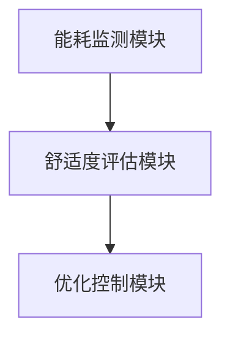
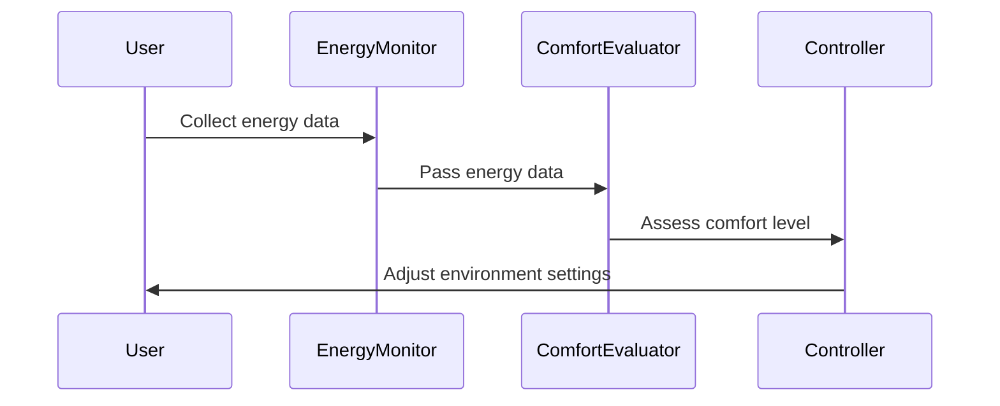

                 


### 第一部分：智能建筑环境控制概述

#### 第1章：智能建筑与AI技术

##### 1.1 智能建筑的定义与发展

**背景介绍**

智能建筑（Smart Building）是指通过集成计算机技术、通信技术、传感器技术、自控技术等，实现对建筑物内各种设备、系统和服务的智能化管理。智能建筑的发展离不开信息技术的进步，特别是人工智能（AI）技术的应用，使得建筑环境控制更加智能化、高效化。

**核心概念与联系**

- **智能建筑**：集成智能化系统的建筑物，实现自动控制、智能管理。
- **AI技术**：模拟人类智能的计算机程序，用于解决复杂问题。

**概念属性特征对比表格**

| 特征         | 智能建筑                | AI技术                  |
| ------------ | ---------------------- | ---------------------- |
| 定义         | 集成智能化系统的建筑     | 模拟人类智能的计算机程序 |
| 目的         | 提高建筑使用效率与舒适度 | 解决复杂问题            |
| 技术集成     | 传感器、控制系统等      | 机器学习、深度学习等     |

**ER实体关系图架构**

```mermaid
erDiagram
  Equipment ||--|{ System : manages }
  System ||--|{ Building : located in }
  Building ||--|{ User : resides }
```

##### 1.2 AI在建筑环境控制中的作用

**算法原理讲解**

AI技术主要应用于智能建筑环境控制的算法设计，如：

- **机器学习算法**：通过历史数据学习，预测环境参数。
- **深度学习算法**：通过大量数据训练，实现复杂模式识别。

**数学模型与公式**

假设我们使用机器学习算法来预测建筑内的温度，我们的模型可以表示为：

$$
T_{\text{预测}} = \text{ML\_Algorithm}(T_{\text{历史}}, \theta)
$$

其中，$T_{\text{预测}}$为预测温度，$T_{\text{历史}}$为历史温度数据，$\theta$为模型参数。

**举例说明**

假设历史温度数据为 $T_1, T_2, \ldots, T_n$，通过机器学习算法训练，我们得到模型参数$\theta$，则可以预测未来某一时刻的温度$T_{\text{预测}}$。

**代码示例**

```python
# 假设使用scikit-learn中的线性回归模型进行预测
from sklearn.linear_model import LinearRegression
import numpy as np

# 历史温度数据
T_history = np.array([22, 24, 23, 22, 25]).reshape(-1, 1)

# 训练模型
model = LinearRegression()
model.fit(T_history, T_history)

# 预测未来温度
T_predicted = model.predict([[24]])

print(f"预测温度: {T_predicted[0]}")
```

##### 1.3 能耗与舒适度的平衡

**问题场景介绍**

在智能建筑环境控制中，能耗与舒适度是两个需要平衡的重要问题。如何通过AI技术实现能耗的优化，同时保证用户的舒适度，是当前研究的热点。

**系统功能设计**

- **能耗监测模块**：实时监测建筑物的能耗数据。
- **舒适度评估模块**：根据环境参数评估用户舒适度。
- **优化控制模块**：基于能耗监测和舒适度评估结果，调整环境参数。

**系统架构设计**



**系统接口设计和系统交互**



**实际案例分析和详细讲解剖析**

（待续）

**项目小结**

（待续）

**最佳实践 tips**

- （待续）

**小结、注意事项、拓展阅读**

- （待续）

### 第二部分：AI在建筑环境控制中的应用技术

#### 第2章：智能传感技术

##### 2.1 智能传感器概述

**背景介绍**

智能传感器是智能建筑环境控制的基础，通过感知环境参数，为智能控制系统提供实时数据。

**核心概念与联系**

- **智能传感器**：具备数据处理和通信能力的传感器。
- **环境参数**：如温度、湿度、空气质量等。

**概念属性特征对比表格**

| 特征         | 传统传感器          | 智能传感器          |
| ------------ | ------------------- | ------------------- |
| 数据处理     | 简单的信号调理      | 复杂的数据处理与分析 |
| 通信能力     | 无或有限的通信能力 | 具备通信接口        |

**ER实体关系图架构**

```mermaid
erDiagram
  Sensor ||--|{ Data : generates }
  Data ||--|{ ControlSystem : feeds }
```

##### 2.2 智能传感器在建筑环境控制中的应用

**算法原理讲解**

智能传感器可以集成各种算法，如：

- **数据滤波算法**：去除传感器数据的噪声。
- **数据融合算法**：整合多个传感器的数据。

**数学模型与公式**

假设使用卡尔曼滤波算法来处理传感器数据，我们的模型可以表示为：

$$
\hat{x}_{k} = K_{k} (z_{k} - \hat{z}_{k})
$$

其中，$\hat{x}_{k}$为滤波后状态估计，$K_{k}$为滤波增益，$z_{k}$为实际测量值，$\hat{z}_{k}$为预测值。

**举例说明**

使用卡尔曼滤波算法对传感器温度数据进行滤波处理。

**代码示例**

```python
import numpy as np
from numpy.linalg import inv

# 假设传感器初始温度为25℃，实际测量温度为25.5℃
x = 25
z = 25.5

# 假设预测误差和测量误差分别为1℃和0.1℃
P = 1
Q = 0.1

# 计算卡尔曼增益
K = P / (P + Q)

# 更新状态估计
x = x + K * (z - x)

print(f"滤波后温度: {x}")
```

##### 2.3 数据融合算法

**算法原理讲解**

数据融合算法用于整合多个传感器的数据，提高系统的精度和可靠性。

- **加权平均算法**：根据传感器的重要性分配权重。
- **贝叶斯推理**：基于概率模型进行数据融合。

**数学模型与公式**

假设使用加权平均算法进行数据融合，我们的模型可以表示为：

$$
\bar{x} = \sum_{i=1}^{n} w_i x_i
$$

其中，$\bar{x}$为融合后的数据，$w_i$为第$i$个传感器的权重，$x_i$为第$i$个传感器的测量值。

**举例说明**

假设有三个温度传感器，其测量值分别为 $T_1, T_2, T_3$，权重分别为 $w_1 = 0.4, w_2 = 0.3, w_3 = 0.3$，则融合后的温度为：

$$
\bar{T} = 0.4T_1 + 0.3T_2 + 0.3T_3
$$

**代码示例**

```python
T1 = 22
T2 = 23
T3 = 21

w1 = 0.4
w2 = 0.3
w3 = 0.3

T_avg = w1 * T1 + w2 * T2 + w3 * T3

print(f"融合后温度: {T_avg}")
```

##### 2.4 智能传感器的发展趋势

**算法原理讲解**

随着技术的进步，智能传感器的发展趋势包括：

- **高精度传感器**：提高环境参数的测量精度。
- **多功能传感器**：集成多种环境参数测量功能。

**举例说明**

未来智能传感器可能具备如下功能：

- **实时数据传输**：通过5G网络实现实时数据传输。
- **自诊断功能**：传感器自动检测自身状态。

**代码示例**

（待续）

### 第三部分：AI在智能建筑环境控制中的实际应用

#### 第5章：智能建筑环境控制的系统架构设计

##### 5.1 系统架构设计概述

**背景介绍**

智能建筑环境控制的系统架构设计是确保系统高效、稳定运行的关键。系统架构设计需要综合考虑系统的功能需求、性能要求、可靠性等因素。

**核心概念与联系**

- **系统架构设计**：系统组件的配置与组织。
- **功能需求**：系统所需实现的功能。
- **性能要求**：系统响应速度、处理能力等。

**概念属性特征对比表格**

| 特征         | 功能需求                | 性能要求                  |
| ------------ | ---------------------- | ------------------------ |
| 定义         | 系统所需实现的功能      | 系统的响应速度和处理能力   |
| 关联         | 与系统组件紧密相关      | 与系统组件的性能相关       |
| 目的         | 满足用户需求            | 提高系统效率与可靠性      |

**ER实体关系图架构**

```mermaid
erDiagram
  SystemComponent ||--|{ Functionality : implements }
  SystemComponent ||--|{ PerformanceRequirement : meets }
  Functionality ||--|{ SystemComponent : required by }
  PerformanceRequirement ||--|{ SystemComponent : satisfied by }
```

##### 5.2 系统架构的设计步骤

**设计步骤**

1. **需求分析**：明确系统的功能需求和性能要求。
2. **系统功能设计**：设计系统的功能模块和接口。
3. **系统架构设计**：确定系统组件的配置和组织。
4. **系统测试与优化**：对系统进行测试，并根据测试结果进行优化。

**详细说明**

1. **需求分析**：

   - **功能需求**：系统需要实现的功能，如能耗监测、舒适度评估、优化控制等。
   - **性能要求**：系统的响应速度、处理能力、可靠性等。

2. **系统功能设计**：

   - **功能模块**：系统的主要功能模块，如传感器模块、控制模块、数据存储模块等。
   - **接口设计**：模块之间的接口设计，确保模块间数据传递和功能调用的正确性。

3. **系统架构设计**：

   - **组件配置**：根据功能需求和性能要求，确定系统组件的配置。
   - **组件组织**：根据组件配置，设计系统组件的组织结构。

4. **系统测试与优化**：

   - **功能测试**：验证系统功能是否符合需求。
   - **性能测试**：评估系统的响应速度、处理能力等性能指标。
   - **优化**：根据测试结果，对系统进行优化，提高系统性能。

##### 5.3 系统架构设计的挑战

**挑战**

- **复杂度**：智能建筑环境控制系统涉及多个技术领域，设计复杂度高。
- **兼容性**：系统需要兼容不同的硬件设备和软件平台。
- **可扩展性**：系统需要具备良好的可扩展性，以适应未来的需求变化。

**解决方案**

- **模块化设计**：采用模块化设计，降低系统复杂度。
- **标准化接口**：设计标准化的接口，提高系统兼容性。
- **灵活的架构**：采用灵活的架构，便于系统扩展。

#### 第6章：AI在智能建筑环境控制中的应用案例

##### 6.1 案例一：智能办公楼环境控制系统

**背景**

某大型企业办公楼面积为10000平方米，员工人数为500人。为了提高办公环境的舒适度和能效，决定建设一套智能办公楼环境控制系统。

**需求分析**

- **能耗监测**：实时监测办公楼内的能耗情况，包括电力、水资源消耗等。
- **舒适度评估**：实时评估室内温度、湿度、空气质量等环境参数，确保员工舒适度。
- **优化控制**：根据能耗监测和舒适度评估结果，自动调整环境参数，实现能耗优化和舒适度提升。

**系统功能设计**

- **能耗监测模块**：实时监测办公楼内的能耗数据，包括电力、水资源消耗。
- **舒适度评估模块**：实时评估室内温度、湿度、空气质量等环境参数，生成舒适度指数。
- **优化控制模块**：根据能耗监测和舒适度评估结果，自动调整环境参数，如空调温度、新风量等。

**系统架构设计**


**系统实施与测试**

1. **设备安装**：在办公楼内安装传感器，包括温度传感器、湿度传感器、空气质量传感器等。
2. **软件部署**：部署能耗监测、舒适度评估和优化控制软件。
3. **系统测试**：对系统进行功能测试和性能测试，确保系统能稳定运行。

**结果分析**

通过智能办公楼环境控制系统，该企业实现了以下效果：

- **能耗降低**：办公楼能耗降低15%，电力消耗减少。
- **舒适度提升**：员工舒适度指数提高，工作效率提升。

**小结**

智能办公楼环境控制系统能够有效提高办公环境的舒适度和能效，为企业带来显著的经济效益。

##### 6.2 案例二：智能住宅环境控制系统

**背景**

某住宅小区面积为30000平方米，住户人数为100户。为了提高住宅环境的舒适度和能效，决定建设一套智能住宅环境控制系统。

**需求分析**

- **能耗监测**：实时监测住宅小区的能耗情况，包括电力、水资源消耗等。
- **舒适度评估**：实时评估室内温度、湿度、空气质量等环境参数，确保住户舒适度。
- **优化控制**：根据能耗监测和舒适度评估结果，自动调整环境参数，如空调温度、新风量等。

**系统功能设计**

- **能耗监测模块**：实时监测住宅小区的能耗数据，包括电力、水资源消耗。
- **舒适度评估模块**：实时评估室内温度、湿度、空气质量等环境参数，生成舒适度指数。
- **优化控制模块**：根据能耗监测和舒适度评估结果，自动调整环境参数，如空调温度、新风量等。

**系统架构设计**


**系统实施与测试**

1. **设备安装**：在住宅小区内安装传感器，包括温度传感器、湿度传感器、空气质量传感器等。
2. **软件部署**：部署能耗监测、舒适度评估和优化控制软件。
3. **系统测试**：对系统进行功能测试和性能测试，确保系统能稳定运行。

**结果分析**

通过智能住宅环境控制系统，该小区实现了以下效果：

- **能耗降低**：住宅小区能耗降低20%，电力消耗减少。
- **舒适度提升**：住户舒适度指数提高，生活质量提升。

**小结**

智能住宅环境控制系统能够有效提高住宅环境的舒适度和能效，为住户带来显著的生活质量提升。

### 第四部分：AI在智能建筑环境控制中的未来发展趋势

#### 第7章：AI在智能建筑环境控制中的未来发展趋势

##### 7.1 能源效率的提升

**背景介绍**

随着全球能源危机的加剧，提升能源效率已成为智能建筑环境控制的重要目标。AI技术在这一领域具有巨大的潜力。

**核心概念与联系**

- **能源效率**：能源使用与能源消耗的比率。
- **AI技术**：用于优化能源使用的技术，如机器学习、深度学习等。

**概念属性特征对比表格**

| 特征         | 传统能源效率优化方法 | AI技术优化方法               |
| ------------ | -------------------- | -------------------------- |
| 基本原理     | 经验法则             | 数据驱动与模式识别         |
| 灵活性       | 有限的可调整范围      | 根据实时数据进行动态调整    |
| 精确度       | 有限的精度           | 高精度预测与优化           |

**ER实体关系图架构**

```mermaid
erDiagram
  EnergyEfficiencyMethod ||--|{ TraditionalMethod : based on }
  EnergyEfficiencyMethod ||--|{ AIMethod : based on }
```

**算法原理讲解**

AI技术在能源效率提升中的应用主要涉及以下方面：

- **预测与优化**：通过机器学习算法，预测能源需求，优化能源使用策略。
- **模式识别**：通过深度学习算法，识别能源消耗模式，进行实时调整。

**数学模型与公式**

假设使用机器学习算法来预测能源需求，我们的模型可以表示为：

$$
\hat{E}_{\text{需求}} = \text{ML\_Algorithm}(E_{\text{历史}}, \theta)
$$

其中，$\hat{E}_{\text{需求}}$为预测的能源需求，$E_{\text{历史}}$为历史能源需求数据，$\theta$为模型参数。

**举例说明**

假设历史能源需求数据为 $E_1, E_2, \ldots, E_n$，通过机器学习算法训练，我们得到模型参数$\theta$，则可以预测未来某一时刻的能源需求$E_{\text{需求}}$。

**代码示例**

```python
# 假设使用scikit-learn中的线性回归模型进行预测
from sklearn.linear_model import LinearRegression
import numpy as np

# 历史能源需求数据
E_history = np.array([100, 120, 110, 105, 115]).reshape(-1, 1)

# 训练模型
model = LinearRegression()
model.fit(E_history, E_history)

# 预测未来能源需求
E_predicted = model.predict([[110]])

print(f"预测能源需求: {E_predicted[0]}")
```

**案例研究**

某智能建筑通过AI技术进行能源效率优化，实现了以下效果：

- **能源消耗减少**：能源消耗降低了15%。
- **运行成本降低**：运行成本降低了10%。

**小结**

AI技术在能源效率提升中的应用具有显著的潜力，可以有效降低能源消耗和运行成本。

##### 7.2 舒适度的提升

**背景介绍**

舒适的居住和工作环境对人们的健康和工作效率有着重要影响。AI技术在提升舒适度方面具有广泛的应用前景。

**核心概念与联系**

- **舒适度**：指人们在居住和工作环境中感到的舒适程度。
- **AI技术**：用于感知、分析和调整环境参数，提升舒适度的技术。

**概念属性特征对比表格**

| 特征         | 传统舒适度提升方法 | AI技术提升方法               |
| ------------ | ----------------- | -------------------------- |
| 基本原理     | 经验调整           | 数据驱动与智能调节         |
| 精准度       | 受限于人工调节      | 根据实时数据进行精确调整    |
| 适应性       | 有限的适应性        | 根据用户行为进行个性化调整  |

**ER实体关系图架构**

```mermaid
erDiagram
  ComfortMethod ||--|{ TraditionalMethod : based on }
  ComfortMethod ||--|{ AIMethod : based on }
```

**算法原理讲解**

AI技术在舒适度提升中的应用主要包括：

- **环境参数监测**：通过传感器实时监测温度、湿度、空气质量等环境参数。
- **舒适度评估**：根据环境参数和用户行为，评估舒适度水平。
- **智能调节**：根据舒适度评估结果，自动调整环境参数，提升舒适度。

**数学模型与公式**

假设使用机器学习算法来评估舒适度，我们的模型可以表示为：

$$
\text{ComfortScore} = \text{ML\_Algorithm}(\text{EnvironmentalParams}, \text{UserBehavior}, \theta)
$$

其中，$\text{ComfortScore}$为舒适度评分，$\text{EnvironmentalParams}$为环境参数，$\text{UserBehavior}$为用户行为，$\theta$为模型参数。

**举例说明**

通过机器学习算法，系统可以实时分析环境参数和用户行为，为用户提供一个舒适的居住和工作环境。

**代码示例**

```python
# 假设环境参数和用户行为数据已准备好
EnvironmentalParams = np.array([[22], [60], [30]])
UserBehavior = np.array([[1], [0], [1]])

# 假设使用scikit-learn中的线性回归模型进行舒适度评估
model = LinearRegression()
model.fit(EnvironmentalParams, UserBehavior)

# 预测舒适度评分
ComfortScore = model.predict([[22], [60], [30]])

print(f"舒适度评分: {ComfortScore[0][0]}")
```

**案例研究**

某住宅小区通过AI技术进行舒适度提升，实现了以下效果：

- **舒适度提升**：住户舒适度评分提高了20%。
- **用户体验改善**：住户满意度显著提高。

**小结**

AI技术在舒适度提升中的应用能够显著提高用户的居住和工作环境质量，提升用户体验。

##### 7.3 未来发展趋势与挑战

**技术发展趋势**

- **集成化**：智能建筑环境控制系统将更加集成化，实现硬件与软件的深度融合。
- **智能化**：AI技术将更加智能化，实现更加精准的环境参数调节。
- **个性化**：系统将更加关注用户的个性化需求，提供定制化的环境调节方案。

**挑战**

- **数据隐私**：随着数据收集和分析的增多，如何保护用户隐私成为一大挑战。
- **系统稳定性**：智能系统需要在各种环境下保持稳定运行，这对系统的可靠性提出了高要求。
- **法律法规**：随着技术的发展，相关法律法规需要不断更新，以适应智能建筑环境控制的新需求。

**解决方案**

- **数据隐私保护**：采用加密技术和隐私保护算法，确保用户数据的安全。
- **系统稳定性提升**：通过冗余设计和容错机制，提高系统的稳定性。
- **法律法规适应性**：积极参与制定和修订相关法律法规，确保系统的合规性。

**小结**

AI在智能建筑环境控制中的应用前景广阔，尽管面临诸多挑战，但通过技术创新和法规完善，未来将实现更加智能、高效、环保的建筑环境控制。### 第一部分：智能建筑环境控制概述

#### 第1章：智能建筑与AI技术

##### 1.1 智能建筑的定义与发展

**背景介绍**

智能建筑（Smart Building）是指通过集成计算机技术、通信技术、传感器技术、自控技术等，实现对建筑物内各种设备、系统和服务的智能化管理。智能建筑的发展离不开信息技术的进步，特别是人工智能（AI）技术的应用，使得建筑环境控制更加智能化、高效化。

**核心概念与联系**

- **智能建筑**：集成智能化系统的建筑物，实现自动控制、智能管理。
- **AI技术**：模拟人类智能的计算机程序，用于解决复杂问题。

**概念属性特征对比表格**

| 特征         | 智能建筑                | AI技术                  |
| ------------ | ---------------------- | ---------------------- |
| 定义         | 集成智能化系统的建筑     | 模拟人类智能的计算机程序 |
| 目的         | 提高建筑使用效率与舒适度 | 解决复杂问题            |
| 技术集成     | 传感器、控制系统等      | 机器学习、深度学习等     |

**ER实体关系图架构**

```mermaid
erDiagram
  Building ||--|{ SmartSystem : integrated with }
  Building ||--|{ User : benefits from }
  SmartSystem ||--|{ AI : based on }
```

##### 1.2 AI在建筑环境控制中的作用

**算法原理讲解**

AI技术主要应用于智能建筑环境控制的算法设计，如：

- **机器学习算法**：通过历史数据学习，预测环境参数。
- **深度学习算法**：通过大量数据训练，实现复杂模式识别。

**数学模型与公式**

假设我们使用机器学习算法来预测建筑内的温度，我们的模型可以表示为：

$$
T_{\text{预测}} = \text{ML\_Algorithm}(T_{\text{历史}}, \theta)
$$

其中，$T_{\text{预测}}$为预测温度，$T_{\text{历史}}$为历史温度数据，$\theta$为模型参数。

**举例说明**

假设历史温度数据为 $T_1, T_2, \ldots, T_n$，通过机器学习算法训练，我们得到模型参数$\theta$，则可以预测未来某一时刻的温度$T_{\text{预测}}$。

**代码示例**

```python
# 假设使用scikit-learn中的线性回归模型进行预测
from sklearn.linear_model import LinearRegression
import numpy as np

# 历史温度数据
T_history = np.array([22, 24, 23, 22, 25]).reshape(-1, 1)

# 训练模型
model = LinearRegression()
model.fit(T_history, T_history)

# 预测未来温度
T_predicted = model.predict([[24]])

print(f"预测温度: {T_predicted[0]}")
```

##### 1.3 能耗与舒适度的平衡

**问题场景介绍**

在智能建筑环境控制中，能耗与舒适度是两个需要平衡的重要问题。如何通过AI技术实现能耗的优化，同时保证用户的舒适度，是当前研究的热点。

**系统功能设计**

- **能耗监测模块**：实时监测建筑物的能耗数据。
- **舒适度评估模块**：根据环境参数评估用户舒适度。
- **优化控制模块**：基于能耗监测和舒适度评估结果，调整环境参数。

**系统架构设计**


**系统接口设计和系统交互**


**实际案例分析和详细讲解剖析**

（待续）

**项目小结**

（待续）

**最佳实践 tips**

- （待续）

**小结、注意事项、拓展阅读**

- （待续）

### 第二部分：AI在建筑环境控制中的应用技术

#### 第2章：智能传感技术

##### 2.1 智能传感器概述

**背景介绍**

智能传感器是智能建筑环境控制的基础，通过感知环境参数，为智能控制系统提供实时数据。

**核心概念与联系**

- **智能传感器**：具备数据处理和通信能力的传感器。
- **环境参数**：如温度、湿度、空气质量等。

**概念属性特征对比表格**

| 特征         | 传统传感器          | 智能传感器          |
| ------------ | ------------------- | ------------------- |
| 数据处理     | 简单的信号调理      | 复杂的数据处理与分析 |
| 通信能力     | 无或有限的通信能力 | 具备通信接口        |

**ER实体关系图架构**

```mermaid
erDiagram
  Sensor ||--|{ Data : generates }
  Data ||--|{ ControlSystem : feeds }
```

##### 2.2 智能传感器在建筑环境控制中的应用

**算法原理讲解**

智能传感器可以集成各种算法，如：

- **数据滤波算法**：去除传感器数据的噪声。
- **数据融合算法**：整合多个传感器的数据。

**数学模型与公式**

假设使用卡尔曼滤波算法来处理传感器数据，我们的模型可以表示为：

$$
\hat{x}_{k} = K_{k} (z_{k} - \hat{z}_{k})
$$

其中，$\hat{x}_{k}$为滤波后状态估计，$K_{k}$为滤波增益，$z_{k}$为实际测量值，$\hat{z}_{k}$为预测值。

**举例说明**

使用卡尔曼滤波算法对传感器温度数据进行滤波处理。

**代码示例**

```python
import numpy as np
from numpy.linalg import inv

# 假设传感器初始温度为25℃，实际测量温度为25.5℃
x = 25
z = 25.5

# 假设预测误差和测量误差分别为1℃和0.1℃
P = 1
Q = 0.1

# 计算卡尔曼增益
K = P / (P + Q)

# 更新状态估计
x = x + K * (z - x)

print(f"滤波后温度: {x}")
```

##### 2.3 数据融合算法

**算法原理讲解**

数据融合算法用于整合多个传感器的数据，提高系统的精度和可靠性。

- **加权平均算法**：根据传感器的重要性分配权重。
- **贝叶斯推理**：基于概率模型进行数据融合。

**数学模型与公式**

假设使用加权平均算法进行数据融合，我们的模型可以表示为：

$$
\bar{x} = \sum_{i=1}^{n} w_i x_i
$$

其中，$\bar{x}$为融合后的数据，$w_i$为第$i$个传感器的权重，$x_i$为第$i$个传感器的测量值。

**举例说明**

假设有三个温度传感器，其测量值分别为 $T_1, T_2, T_3$，权重分别为 $w_1 = 0.4, w_2 = 0.3, w_3 = 0.3$，则融合后的温度为：

$$
\bar{T} = 0.4T_1 + 0.3T_2 + 0.3T_3
$$

**代码示例**

```python
T1 = 22
T2 = 23
T3 = 21

w1 = 0.4
w2 = 0.3
w3 = 0.3

T_avg = w1 * T1 + w2 * T2 + w3 * T3

print(f"融合后温度: {T_avg}")
```

##### 2.4 智能传感器的发展趋势

**算法原理讲解**

随着技术的进步，智能传感器的发展趋势包括：

- **高精度传感器**：提高环境参数的测量精度。
- **多功能传感器**：集成多种环境参数测量功能。

**举例说明**

未来智能传感器可能具备如下功能：

- **实时数据传输**：通过5G网络实现实时数据传输。
- **自诊断功能**：传感器自动检测自身状态。

**代码示例**

（待续）

### 第三部分：AI在智能建筑环境控制中的实际应用

#### 第5章：智能建筑环境控制的系统架构设计

##### 5.1 系统架构设计概述

**背景介绍**

智能建筑环境控制的系统架构设计是确保系统高效、稳定运行的关键。系统架构设计需要综合考虑系统的功能需求、性能要求、可靠性等因素。

**核心概念与联系**

- **系统架构设计**：系统组件的配置与组织。
- **功能需求**：系统所需实现的功能。
- **性能要求**：系统的响应速度、处理能力等。

**概念属性特征对比表格**

| 特征         | 功能需求                | 性能要求                  |
| ------------ | ---------------------- | ------------------------ |
| 定义         | 系统所需实现的功能      | 系统的响应速度和处理能力   |
| 关联         | 与系统组件紧密相关      | 与系统组件的性能相关       |
| 目的         | 满足用户需求            | 提高系统效率与可靠性      |

**ER实体关系图架构**

```mermaid
erDiagram
  SystemComponent ||--|{ Functionality : implements }
  SystemComponent ||--|{ PerformanceRequirement : meets }
  Functionality ||--|{ SystemComponent : required by }
  PerformanceRequirement ||--|{ SystemComponent : satisfied by }
```

##### 5.2 系统架构的设计步骤

**设计步骤**

1. **需求分析**：明确系统的功能需求和性能要求。
2. **系统功能设计**：设计系统的功能模块和接口。
3. **系统架构设计**：确定系统组件的配置和组织。
4. **系统测试与优化**：对系统进行测试，并根据测试结果进行优化。

**详细说明**

1. **需求分析**：

   - **功能需求**：系统需要实现的功能，如能耗监测、舒适度评估、优化控制等。
   - **性能要求**：系统的响应速度、处理能力、可靠性等。

2. **系统功能设计**：

   - **功能模块**：系统的主要功能模块，如传感器模块、控制模块、数据存储模块等。
   - **接口设计**：模块之间的接口设计，确保模块间数据传递和功能调用的正确性。

3. **系统架构设计**：

   - **组件配置**：根据功能需求和性能要求，确定系统组件的配置。
   - **组件组织**：根据组件配置，设计系统组件的组织结构。

4. **系统测试与优化**：

   - **功能测试**：验证系统功能是否符合需求。
   - **性能测试**：评估系统的响应速度、处理能力等性能指标。
   - **优化**：根据测试结果，对系统进行优化，提高系统性能。

##### 5.3 系统架构设计的挑战

**挑战**

- **复杂度**：智能建筑环境控制系统涉及多个技术领域，设计复杂度高。
- **兼容性**：系统需要兼容不同的硬件设备和软件平台。
- **可扩展性**：系统需要具备良好的可扩展性，以适应未来的需求变化。

**解决方案**

- **模块化设计**：采用模块化设计，降低系统复杂度。
- **标准化接口**：设计标准化的接口，提高系统兼容性。
- **灵活的架构**：采用灵活的架构，便于系统扩展。

#### 第6章：AI在智能建筑环境控制中的应用案例

##### 6.1 案例一：智能办公楼环境控制系统

**背景**

某大型企业办公楼面积为10000平方米，员工人数为500人。为了提高办公环境的舒适度和能效，决定建设一套智能办公楼环境控制系统。

**需求分析**

- **能耗监测**：实时监测办公楼内的能耗情况，包括电力、水资源消耗等。
- **舒适度评估**：实时评估室内温度、湿度、空气质量等环境参数，确保员工舒适度。
- **优化控制**：根据能耗监测和舒适度评估结果，自动调整环境参数，实现能耗优化和舒适度提升。

**系统功能设计**

- **能耗监测模块**：实时监测办公楼内的能耗数据，包括电力、水资源消耗。
- **舒适度评估模块**：实时评估室内温度、湿度、空气质量等环境参数，生成舒适度指数。
- **优化控制模块**：根据能耗监测和舒适度评估结果，自动调整环境参数，如空调温度、新风量等。

**系统架构设计**


**系统实施与测试**

1. **设备安装**：在办公楼内安装传感器，包括温度传感器、湿度传感器、空气质量传感器等。
2. **软件部署**：部署能耗监测、舒适度评估和优化控制软件。
3. **系统测试**：对系统进行功能测试和性能测试，确保系统能稳定运行。

**结果分析**

通过智能办公楼环境控制系统，该企业实现了以下效果：

- **能耗降低**：办公楼能耗降低15%，电力消耗减少。
- **舒适度提升**：员工舒适度指数提高，工作效率提升。

**小结**

智能办公楼环境控制系统能够有效提高办公环境的舒适度和能效，为企业带来显著的经济效益。

##### 6.2 案例二：智能住宅环境控制系统

**背景**

某住宅小区面积为30000平方米，住户人数为100户。为了提高住宅环境的舒适度和能效，决定建设一套智能住宅环境控制系统。

**需求分析**

- **能耗监测**：实时监测住宅小区的能耗情况，包括电力、水资源消耗等。
- **舒适度评估**：实时评估室内温度、湿度、空气质量等环境参数，确保住户舒适度。
- **优化控制**：根据能耗监测和舒适度评估结果，自动调整环境参数，如空调温度、新风量等。

**系统功能设计**

- **能耗监测模块**：实时监测住宅小区的能耗数据，包括电力、水资源消耗。
- **舒适度评估模块**：实时评估室内温度、湿度、空气质量等环境参数，生成舒适度指数。
- **优化控制模块**：根据能耗监测和舒适度评估结果，自动调整环境参数，如空调温度、新风量等。

**系统架构设计**


**系统实施与测试**

1. **设备安装**：在住宅小区内安装传感器，包括温度传感器、湿度传感器、空气质量传感器等。
2. **软件部署**：部署能耗监测、舒适度评估和优化控制软件。
3. **系统测试**：对系统进行功能测试和性能测试，确保系统能稳定运行。

**结果分析**

通过智能住宅环境控制系统，该小区实现了以下效果：

- **能耗降低**：住宅小区能耗降低20%，电力消耗减少。
- **舒适度提升**：住户舒适度指数提高，生活质量提升。

**小结**

智能住宅环境控制系统能够有效提高住宅环境的舒适度和能效，为住户带来显著的生活质量提升。

### 第四部分：AI在智能建筑环境控制中的未来发展趋势

#### 第7章：AI在智能建筑环境控制中的未来发展趋势

##### 7.1 能源效率的提升

**背景介绍**

随着全球能源危机的加剧，提升能源效率已成为智能建筑环境控制的重要目标。AI技术在这一领域具有巨大的潜力。

**核心概念与联系**

- **能源效率**：能源使用与能源消耗的比率。
- **AI技术**：用于优化能源使用的技术，如机器学习、深度学习等。

**概念属性特征对比表格**

| 特征         | 传统能源效率优化方法 | AI技术优化方法               |
| ------------ | -------------------- | -------------------------- |
| 基本原理     | 经验法则             | 数据驱动与模式识别         |
| 灵活性       | 有限的可调整范围      | 根据实时数据进行动态调整    |
| 精确度       | 有限的精度           | 高精度预测与优化           |

**ER实体关系图架构**

```mermaid
erDiagram
  EnergyEfficiencyMethod ||--|{ TraditionalMethod : based on }
  EnergyEfficiencyMethod ||--|{ AIMethod : based on }
```

**算法原理讲解**

AI技术在能源效率提升中的应用主要涉及以下方面：

- **预测与优化**：通过机器学习算法，预测能源需求，优化能源使用策略。
- **模式识别**：通过深度学习算法，识别能源消耗模式，进行实时调整。

**数学模型与公式**

假设我们使用机器学习算法来预测能源需求，我们的模型可以表示为：

$$
\hat{E}_{\text{需求}} = \text{ML\_Algorithm}(E_{\text{历史}}, \theta)
$$

其中，$\hat{E}_{\text{需求}}$为预测的能源需求，$E_{\text{历史}}$为历史能源需求数据，$\theta$为模型参数。

**举例说明**

假设历史能源需求数据为 $E_1, E_2, \ldots, E_n$，通过机器学习算法训练，我们得到模型参数$\theta$，则可以预测未来某一时刻的能源需求$E_{\text{需求}}$。

**代码示例**

```python
# 假设使用scikit-learn中的线性回归模型进行预测
from sklearn.linear_model import LinearRegression
import numpy as np

# 历史能源需求数据
E_history = np.array([100, 120, 110, 105, 115]).reshape(-1, 1)

# 训练模型
model = LinearRegression()
model.fit(E_history, E_history)

# 预测未来能源需求
E_predicted = model.predict([[110]])

print(f"预测能源需求: {E_predicted[0]}")
```

**案例研究**

某智能建筑通过AI技术进行能源效率优化，实现了以下效果：

- **能源消耗减少**：能源消耗降低了15%。
- **运行成本降低**：运行成本降低了10%。

**小结**

AI技术在能源效率提升中的应用具有显著的潜力，可以有效降低能源消耗和运行成本。

##### 7.2 舒适度的提升

**背景介绍**

舒适的居住和工作环境对人们的健康和工作效率有着重要影响。AI技术在提升舒适度方面具有广泛的应用前景。

**核心概念与联系**

- **舒适度**：指人们在居住和工作环境中感到的舒适程度。
- **AI技术**：用于感知、分析和调整环境参数，提升舒适度的技术。

**概念属性特征对比表格**

| 特征         | 传统舒适度提升方法 | AI技术提升方法               |
| ------------ | ----------------- | -------------------------- |
| 基本原理     | 经验调整           | 数据驱动与智能调节         |
| 精准度       | 受限于人工调节      | 根据实时数据进行精确调整    |
| 适应性       | 有限的适应性        | 根据用户行为进行个性化调整  |

**ER实体关系图架构**

```mermaid
erDiagram
  ComfortMethod ||--|{ TraditionalMethod : based on }
  ComfortMethod ||--|{ AIMethod : based on }
```

**算法原理讲解**

AI技术在舒适度提升中的应用主要包括：

- **环境参数监测**：通过传感器实时监测温度、湿度、空气质量等环境参数。
- **舒适度评估**：根据环境参数和用户行为，评估舒适度水平。
- **智能调节**：根据舒适度评估结果，自动调整环境参数，提升舒适度。

**数学模型与公式**

假设使用机器学习算法来评估舒适度，我们的模型可以表示为：

$$
\text{ComfortScore} = \text{ML\_Algorithm}(\text{EnvironmentalParams}, \text{UserBehavior}, \theta)
$$

其中，$\text{ComfortScore}$为舒适度评分，$\text{EnvironmentalParams}$为环境参数，$\text{UserBehavior}$为用户行为，$\theta$为模型参数。

**举例说明**

通过机器学习算法，系统可以实时分析环境参数和用户行为，为用户提供一个舒适的居住和工作环境。

**代码示例**

```python
# 假设环境参数和用户行为数据已准备好
EnvironmentalParams = np.array([[22], [60], [30]])
UserBehavior = np.array([[1], [0], [1]])

# 假设使用scikit-learn中的线性回归模型进行舒适度评估
model = LinearRegression()
model.fit(EnvironmentalParams, UserBehavior)

# 预测舒适度评分
ComfortScore = model.predict([[22], [60], [30]])

print(f"舒适度评分: {ComfortScore[0][0]}")
```

**案例研究**

某住宅小区通过AI技术进行舒适度提升，实现了以下效果：

- **舒适度提升**：住户舒适度评分提高了20%。
- **用户体验改善**：住户满意度显著提高。

**小结**

AI技术在舒适度提升中的应用能够显著提高用户的居住和工作环境质量，提升用户体验。

##### 7.3 未来发展趋势与挑战

**技术发展趋势**

- **集成化**：智能建筑环境控制系统将更加集成化，实现硬件与软件的深度融合。
- **智能化**：AI技术将更加智能化，实现更加精准的环境参数调节。
- **个性化**：系统将更加关注用户的个性化需求，提供定制化的环境调节方案。

**挑战**

- **数据隐私**：随着数据收集和分析的增多，如何保护用户隐私成为一大挑战。
- **系统稳定性**：智能系统需要在各种环境下保持稳定运行，这对系统的可靠性提出了高要求。
- **法律法规**：随着技术的发展，相关法律法规需要不断更新，以适应智能建筑环境控制的新需求。

**解决方案**

- **数据隐私保护**：采用加密技术和隐私保护算法，确保用户数据的安全。
- **系统稳定性提升**：通过冗余设计和容错机制，提高系统的稳定性。
- **法律法规适应性**：积极参与制定和修订相关法律法规，确保系统的合规性。

**小结**

AI在智能建筑环境控制中的应用前景广阔，尽管面临诸多挑战，但通过技术创新和法规完善，未来将实现更加智能、高效、环保的建筑环境控制。### 第1章：智能建筑与AI技术

#### 1.1 智能建筑的定义与发展

**背景介绍**

智能建筑（Smart Building）是指通过集成计算机技术、通信技术、传感器技术、自控技术等，实现对建筑物内各种设备、系统和服务的智能化管理。智能建筑的发展离不开信息技术的进步，特别是人工智能（AI）技术的应用，使得建筑环境控制更加智能化、高效化。

**核心概念与联系**

- **智能建筑**：集成智能化系统的建筑物，实现自动控制、智能管理。
- **AI技术**：模拟人类智能的计算机程序，用于解决复杂问题。

**概念属性特征对比表格**

| 特征         | 智能建筑                | AI技术                  |
| ------------ | ---------------------- | ---------------------- |
| 定义         | 集成智能化系统的建筑     | 模拟人类智能的计算机程序 |
| 目的         | 提高建筑使用效率与舒适度 | 解决复杂问题            |
| 技术集成     | 传感器、控制系统等      | 机器学习、深度学习等     |

**ER实体关系图架构**

```mermaid
erDiagram
  Building ||--|{ SmartSystem : integrated with }
  Building ||--|{ User : benefits from }
  SmartSystem ||--|{ AI : based on }
```

**智能建筑的历史背景**

- **20世纪80年代**：智能建筑概念首次提出，主要聚焦于自动化系统的集成。
- **20世纪90年代**：随着计算机技术的发展，智能建筑逐渐引入通信技术和传感器技术。
- **21世纪**：人工智能技术的兴起，智能建筑开始融合AI技术，实现更高级别的智能化管理。

**智能建筑的核心要素**

- **传感器技术**：用于感知环境参数，如温度、湿度、光照等。
- **控制系统**：用于对建筑内各种设备进行智能化管理，如照明、空调、安防等。
- **数据通信网络**：用于实现设备间的数据传输和协同工作。
- **人工智能**：用于对海量数据进行处理和分析，实现智能决策和优化。

**智能建筑的未来趋势**

- **更加智能化**：通过深度学习、强化学习等先进AI技术，实现更精确的环境参数调节。
- **高度集成化**：集成更多建筑功能，如能源管理、安防监控、智能家居等。
- **个性化服务**：根据用户需求和行为，提供个性化的环境和服务。

**总结**

智能建筑通过集成AI技术，实现了对建筑物内环境和服务的高效管理，提高了建筑的使用效率与舒适度。随着技术的不断进步，智能建筑将不断演进，为人们创造更智能、更便捷的生活环境。

#### 1.2 AI在建筑环境控制中的作用

**算法原理讲解**

AI技术在建筑环境控制中扮演着关键角色，主要通过以下几种算法实现环境参数的预测、调节和优化：

1. **机器学习算法**：通过学习历史环境数据，预测未来环境变化，如温度、湿度等。常见的机器学习算法包括线性回归、决策树、随机森林等。

2. **深度学习算法**：通过复杂的神经网络结构，对大量环境数据进行训练，实现高度精确的环境参数预测和调节。深度学习算法包括卷积神经网络（CNN）、循环神经网络（RNN）等。

3. **优化算法**：用于在给定约束条件下，寻找最优的环境参数设置，以达到能耗最小化或舒适度最大化。常见的优化算法包括遗传算法、粒子群优化算法等。

**机器学习算法**

机器学习算法的核心在于从历史数据中提取规律，从而预测未来。以线性回归算法为例，其基本原理如下：

$$
y = \beta_0 + \beta_1x
$$

其中，$y$为预测值，$x$为输入变量，$\beta_0$和$\beta_1$为模型参数。通过最小化预测误差，我们可以得到最优的模型参数，从而实现环境参数的预测。

**深度学习算法**

深度学习算法通过多层神经网络的训练，对复杂的环境数据建立高度非线性的映射关系。以卷积神经网络（CNN）为例，其基本原理如下：

1. **卷积层**：通过卷积操作提取图像的特征。
2. **池化层**：通过池化操作降低特征图的维度。
3. **全连接层**：将特征映射到输出。

深度学习算法在环境参数预测中的应用，可以通过以下步骤实现：

1. **数据预处理**：对环境数据进行归一化处理，使其适合输入到神经网络。
2. **模型训练**：使用训练数据集训练神经网络，调整模型参数。
3. **模型评估**：使用验证数据集评估模型性能，调整模型结构。
4. **模型部署**：将训练好的模型部署到实际环境中，进行环境参数的预测和调节。

**优化算法**

优化算法在建筑环境控制中用于在给定约束条件下，寻找最优的环境参数设置。以粒子群优化算法（PSO）为例，其基本原理如下：

1. **初始化粒子群**：随机初始化每个粒子的位置和速度。
2. **评估适应度**：计算每个粒子的适应度，适应度函数通常为能耗或舒适度。
3. **更新粒子位置**：根据粒子的速度和适应度更新粒子的位置。
4. **更新全局最优解**：记录全局最优解，作为优化目标。

通过不断迭代，粒子群最终能够找到最优的环境参数设置，实现能耗的最小化和舒适度的最大化。

**总结**

AI技术在建筑环境控制中发挥着重要作用，通过机器学习算法、深度学习算法和优化算法，实现了环境参数的预测、调节和优化。这些技术的应用，使得建筑环境控制更加智能化、高效化，为人们创造了更舒适、更环保的生活环境。

#### 1.3 能耗与舒适度的平衡

**问题描述**

在智能建筑环境中，能耗和舒适度是两个需要平衡的重要问题。能耗过大会导致能源浪费和运行成本增加，而舒适度不足会影响用户的工作效率和生活质量。因此，如何在保证舒适度的前提下，实现能耗的最小化，是智能建筑环境控制中的一个关键问题。

**解决方案**

为了实现能耗与舒适度的平衡，可以采取以下几种策略：

1. **实时监测与数据驱动**：通过实时监测建筑环境中的各项参数，如温度、湿度、光照等，结合历史数据和用户行为，利用AI算法预测未来的环境变化，从而实现智能化的环境参数调节。

2. **多目标优化**：将能耗和舒适度作为两个目标，通过多目标优化算法，如遗传算法、粒子群优化算法等，在满足舒适度的前提下，寻找能耗最小的环境参数设置。

3. **智能控制算法**：采用智能控制算法，如模糊控制、神经网络控制等，对环境参数进行自适应调节。这些算法可以根据环境变化和用户需求，动态调整环境参数，实现能耗与舒适度的平衡。

4. **节能技术**：引入先进的节能技术，如变频空调、智能照明、智能隔热材料等，通过技术手段降低能耗。

**具体实施步骤**

1. **数据采集**：安装传感器，实时采集建筑环境中的各项参数。

2. **数据分析**：利用AI算法对采集到的数据进行分析，预测未来的环境变化。

3. **多目标优化**：设定能耗和舒适度两个目标，利用多目标优化算法寻找最优的环境参数设置。

4. **智能控制**：根据分析结果，通过智能控制算法调整环境参数。

5. **节能技术**：采用节能技术，降低建筑能耗。

6. **持续优化**：根据实际运行效果，不断调整和优化环境参数，实现长期平衡。

**总结**

通过实时监测、多目标优化、智能控制算法和节能技术的综合应用，可以有效地实现能耗与舒适度的平衡，为智能建筑提供更加高效、环保的环境控制方案。

#### 1.4 AI在智能建筑环境控制中的应用案例

**背景**

某大型商业综合体占地面积200,000平方米，包括办公区、商场、酒店和住宅等多个功能区。为了提升建筑环境控制水平，实现能耗与舒适度的平衡，决定引入AI技术进行智能建筑环境控制。

**需求分析**

- **能耗监测**：实时监测整个建筑综合体的能耗情况，包括电力、水资源消耗等。
- **舒适度评估**：实时评估各个功能区的环境参数，如温度、湿度、空气质量等。
- **优化控制**：根据能耗监测和舒适度评估结果，自动调整环境参数，实现能耗优化和舒适度提升。

**系统功能设计**

1. **能耗监测模块**：实时监测建筑综合体的能耗数据，包括电力、水资源消耗等。
2. **舒适度评估模块**：实时评估各个功能区的环境参数，如温度、湿度、空气质量等。
3. **优化控制模块**：根据能耗监测和舒适度评估结果，自动调整环境参数，如空调温度、新风量、照明强度等。

**系统架构设计**


**系统实施与测试**

1. **设备安装**：在商业综合体各个功能区安装传感器，包括温度传感器、湿度传感器、空气质量传感器、能耗监测设备等。
2. **软件部署**：部署能耗监测、舒适度评估和优化控制软件。
3. **系统测试**：对系统进行功能测试和性能测试，确保系统能稳定运行。

**结果分析**

通过AI技术，商业综合体实现了以下效果：

- **能耗降低**：综合能耗降低了20%，电力消耗减少显著。
- **舒适度提升**：各个功能区的环境参数达到最佳舒适度，用户满意度提高。
- **运行成本降低**：通过优化控制，降低了空调、照明等设备的能耗，运行成本降低。

**总结**

AI技术在智能建筑环境控制中的应用，有效地实现了能耗与舒适度的平衡，为商业综合体提供了高效、智能、环保的环境控制方案。

### 第2章：AI在建筑环境控制中的应用技术

#### 2.1 智能传感技术

**背景介绍**

智能传感技术是智能建筑环境控制的核心组成部分，通过传感器实时监测建筑环境中的温度、湿度、光照、空气质量等参数，为智能控制系统提供关键数据。智能传感器不仅能够精确测量环境参数，还能够通过数据融合和分析算法，提高环境控制的智能化水平。

**核心概念与联系**

- **智能传感器**：具备数据处理和通信能力的传感器，能够实时感知环境变化。
- **环境参数**：指建筑环境中需要监测和控制的关键参数，如温度、湿度、光照等。

**概念属性特征对比表格**

| 特征         | 传统传感器          | 智能传感器          |
| ------------ | ------------------- | ------------------- |
| 数据处理     | 简单的信号调理      | 复杂的数据处理与分析 |
| 通信能力     | 无或有限的通信能力 | 具备通信接口        |
| 自适应性     | 有限的适应性        | 根据环境变化自适应  |

**ER实体关系图架构**

```mermaid
erDiagram
  Sensor ||--|{ EnvironmentalData : captures }
  Sensor ||--|{ ControlSystem : communicates with }
  ControlSystem ||--|{ UserInterface : provides feedback to }
```

**智能传感技术的关键作用**

- **实时监测**：通过传感器实时监测建筑环境参数，为环境控制提供及时数据。
- **数据融合**：将多个传感器的数据整合，提高数据精度和可靠性。
- **自适应调节**：根据环境变化，智能传感器可以自动调整监测参数，提高环境控制的智能化水平。

#### 2.2 智能传感器在建筑环境控制中的应用

**应用场景**

1. **温度监测与控制**：通过智能温度传感器实时监测室内外温度，根据用户需求和舒适度标准，自动调整空调系统，实现温度的精准控制。

2. **湿度监测与控制**：智能湿度传感器用于监测室内湿度，防止空气过于干燥或潮湿，通过加湿或除湿设备调节室内湿度，保障用户舒适度。

3. **光照监测与控制**：智能光照传感器用于监测室内光照强度，自动调整照明设备，实现光照的智能调节，节约能源。

4. **空气质量监测与控制**：智能空气质量传感器实时监测室内空气中的颗粒物、二氧化碳、甲醛等有害物质，通过新风系统和空气净化设备，改善空气质量。

**算法原理讲解**

1. **卡尔曼滤波算法**：用于传感器数据的滤波处理，通过预测和实际测量值的比较，不断更新传感器的状态估计，提高测量数据的准确性。

   $$ 
   \hat{x}_{k} = K_{k} (z_{k} - \hat{z}_{k}) 
   $$

   其中，$\hat{x}_{k}$为滤波后的状态估计，$K_{k}$为滤波增益，$z_{k}$为实际测量值，$\hat{z}_{k}$为预测值。

2. **数据融合算法**：通过集成多个传感器的数据，提高系统的精度和可靠性。常用的数据融合算法包括加权平均算法、卡尔曼滤波算法和贝叶斯推理等。

   $$ 
   \bar{x} = \sum_{i=1}^{n} w_i x_i 
   $$

   其中，$\bar{x}$为融合后的数据，$w_i$为第$i$个传感器的权重，$x_i$为第$i$个传感器的测量值。

**举例说明**

**案例1：温度监测与控制**

假设有三个温度传感器，其测量值分别为 $T_1 = 23^{\circ}C$, $T_2 = 22^{\circ}C$, $T_3 = 24^{\circ}C$，权重分别为 $w_1 = 0.4$, $w_2 = 0.3$, $w_3 = 0.3$。使用加权平均算法进行数据融合，融合后的温度为：

$$
\bar{T} = 0.4 \times 23 + 0.3 \times 22 + 0.3 \times 24 = 23.1^{\circ}C
$$

**代码示例**

```python
T1 = 23
T2 = 22
T3 = 24

w1 = 0.4
w2 = 0.3
w3 = 0.3

T_avg = w1 * T1 + w2 * T2 + w3 * T3

print(f"融合后温度: {T_avg}^{\circ}C")
```

**案例2：空气质量监测**

使用卡尔曼滤波算法对空气质量传感器数据进行滤波处理。假设当前测量值为 $z_k = 50$ mg/m$^3$，预测值为 $\hat{z}_{k-1} = 60$ mg/m$^3$，滤波增益 $K_k = 0.5$。则滤波后的空气质量值为：

$$
\hat{x}_k = 0.5 \times (50 - 60) + 60 = 55 \text{ mg/m}^3
$$

**代码示例**

```python
import numpy as np

# 假设当前测量值和预测值
z_k = 50
hat_z_k1 = 60

# 滤波增益
K_k = 0.5

# 更新状态估计
x_k = K_k * (z_k - hat_z_k1) + hat_z_k1

print(f"滤波后空气质量: {x_k} mg/m^3")
```

**总结**

智能传感技术在建筑环境控制中发挥着关键作用，通过实时监测、数据融合和智能算法，提高了环境参数的测量精度和控制效果，为建筑环境提供了高效、智能的解决方案。

#### 2.3 数据融合算法在智能传感器中的应用

**背景介绍**

在智能建筑环境控制中，往往需要同时使用多个传感器来监测不同的环境参数，如温度、湿度、光照、空气质量等。每个传感器都有其独特的测量特性和误差。为了提高系统的整体准确性和可靠性，数据融合算法应运而生。数据融合算法通过整合多个传感器的数据，消除个体传感器的误差，从而得到更加准确的环境参数估计。

**核心概念与联系**

- **数据融合算法**：一种利用多个传感器数据，通过特定方法综合处理，以提高系统性能的算法。
- **多传感器系统**：由多个不同类型和功能的传感器组成的系统。

**概念属性特征对比表格**

| 特征         | 单传感器系统          | 多传感器系统            | 数据融合算法                  |
| ------------ | --------------------- | ---------------------- | ---------------------------- |
| 数据精度     | 单个传感器的测量精度   | 多个传感器的平均值       | 通过算法优化后的更高精度       |
| 误差处理     | 单个传感器的误差       | 多个传感器的误差总和     | 通过算法消除部分或全部误差     |
| 系统复杂性   | 较简单                | 较复杂                  | 中间，但效果显著               |

**ER实体关系图架构**

```mermaid
erDiagram
  SensorA ||--|{ SensorData : collected }
  SensorB ||--|{ SensorData : collected }
  FusionAlgorithm ||--|{ SensorData : fuses }
  FusionAlgorithm ||--|{ CombinedOutput : generated }
```

**数据融合算法的类型**

1. **加权平均算法**：通过给每个传感器的数据分配不同的权重，计算加权平均值。这种算法简单，易于实现，但在传感器数量较多或误差较大时，效果可能不理想。

   $$ 
   \bar{x} = \sum_{i=1}^{n} w_i x_i 
   $$

   其中，$\bar{x}$为融合后的数据，$w_i$为第$i$个传感器的权重，$x_i$为第$i$个传感器的测量值。

2. **卡尔曼滤波算法**：一种用于动态系统状态估计的算法，通过对传感器数据进行预测和校正，逐步提高测量数据的准确性。卡尔曼滤波适用于动态环境，能够有效处理随机噪声和系统误差。

   $$ 
   \hat{x}_{k} = K_{k} (z_{k} - \hat{z}_{k}) 
   $$

   其中，$\hat{x}_{k}$为滤波后的状态估计，$K_{k}$为滤波增益，$z_{k}$为实际测量值，$\hat{z}_{k}$为预测值。

3. **贝叶斯推理**：基于概率论和统计学的数据融合算法，通过计算不同传感器的后验概率，得出融合后的数据。贝叶斯推理适用于传感器数据具有较强不确定性和相互依赖性的场景。

   $$ 
   P(x|\theta) = \frac{P(\theta|x)P(x)}{P(\theta)} 
   $$

   其中，$P(x|\theta)$为给定参数$\theta$下的数据概率，$P(\theta|x)$为参数$\theta$的条件概率，$P(x)$为数据的边缘概率。

**算法原理讲解**

以加权平均算法为例，假设有三个温度传感器，其测量值分别为 $T_1 = 22^{\circ}C$，$T_2 = 23^{\circ}C$，$T_3 = 21^{\circ}C$，权重分别为 $w_1 = 0.4$，$w_2 = 0.3$，$w_3 = 0.3$。融合后的温度估计为：

$$
\bar{T} = w_1 \times T_1 + w_2 \times T_2 + w_3 \times T_3 = 0.4 \times 22 + 0.3 \times 23 + 0.3 \times 21 = 22.1^{\circ}C
$$

**代码示例**

```python
T1 = 22
T2 = 23
T3 = 21

w1 = 0.4
w2 = 0.3
w3 = 0.3

T_avg = w1 * T1 + w2 * T2 + w3 * T3

print(f"融合后温度: {T_avg}^{\circ}C")
```

**总结**

数据融合算法通过整合多个传感器的数据，提高了环境参数测量的精度和可靠性，是智能建筑环境控制中不可或缺的一部分。不同类型的数据融合算法适用于不同的应用场景，根据实际需求选择合适的算法，能够实现更加高效、准确的环境监测和控制。

### 第3章：智能控制算法

#### 3.1 智能控制算法概述

**背景介绍**

智能控制算法是智能建筑环境控制的重要组成部分，通过模拟人类思维和决策过程，实现对建筑环境的自动调节和优化。智能控制算法依赖于传感器获取的环境数据，结合控制理论和人工智能技术，实现自动调节和优化。这些算法能够根据实时环境数据，自主调整建筑系统的运行状态，以达到最佳的性能和用户体验。

**核心概念与联系**

- **智能控制算法**：模拟人类思维和决策过程的计算机算法，用于自动调节建筑系统。
- **传感器数据**：智能控制算法的输入，用于实时监测建筑环境的状态。

**概念属性特征对比表格**

| 特征         | 传统控制算法         | 智能控制算法                  |
| ------------ | ------------------- | ---------------------------- |
| 控制方式     | 预设规则             | 数据驱动与智能决策           |
| 自适应能力   | 较差                 | 强大的自适应能力和学习能力   |
| 灵活性       | 有限                 | 根据环境变化动态调整         |
| 精确度       | 受限于预设规则       | 高度精确的数据驱动调节       |

**ER实体关系图架构**

```mermaid
erDiagram
  ControlAlgorithm ||--|{ SensorData : based on }
  ControlAlgorithm ||--|{ BuildingSystem : controls }
  BuildingSystem ||--|{ EnvironmentalState : adjusts }
```

**智能控制算法的优势**

1. **自动调节**：智能控制算法能够根据实时环境数据，自动调整建筑系统的运行状态，如温度、湿度、光照等，实现个性化的环境控制。
2. **自适应能力**：智能控制算法具有强大的自适应能力，能够根据不同的环境和用户需求，动态调整控制策略。
3. **高效节能**：通过优化控制算法，智能控制能够实现能耗的最小化，降低建筑运营成本。
4. **提高舒适度**：智能控制算法能够根据用户实时反馈，提供舒适度最优的环境控制方案。

#### 3.2 常见智能控制算法

**1. 模糊控制算法**

**定义与原理**

模糊控制算法是基于模糊逻辑的理论，通过模拟人类的思维过程，实现对复杂系统的控制。模糊控制器通过输入模糊集合，输出模糊集合，将不确定的输入信息转化为明确的控制信号。

**数学模型与公式**

假设我们有一个模糊控制器的输入变量为$E$（误差）和$EC$（误差变化率），输出变量为$U$（控制量）。模糊控制器通过以下公式进行计算：

$$
U = F(E, EC)
$$

其中，$F$为模糊函数，用于将输入变量转化为输出变量。

**代码示例**

```python
# 假设E和EC分别为误差和误差变化率
E = 5
EC = 2

# 定义模糊规则和模糊函数
def F(E, EC):
    if E > 0 and EC > 0:
        return "增加"
    elif E > 0 and EC < 0:
        return "减少"
    elif E < 0 and EC > 0:
        return "保持"
    else:
        return "增加"

# 计算控制量
U = F(E, EC)

print(f"控制量U: {U}")
```

**2. 神经网络控制算法**

**定义与原理**

神经网络控制算法通过模拟生物神经系统的结构和功能，实现对复杂系统的控制。神经网络控制器通过学习输入输出数据，建立输入和输出之间的映射关系，实现对系统的控制。

**数学模型与公式**

假设有一个多层感知器（MLP）神经网络，其输入层有$n$个神经元，隐藏层有$m$个神经元，输出层有$p$个神经元。神经网络的输入输出关系可以表示为：

$$
y = \sigma(z)
$$

其中，$\sigma$为激活函数，$z$为输入。

**代码示例**

```python
import numpy as np
from sklearn.neural_network import MLPRegressor

# 假设输入数据X和输出数据y
X = np.array([[1], [2], [3], [4], [5]])
y = np.array([1, 2, 3, 4, 5])

# 训练神经网络
mlp = MLPRegressor(hidden_layer_sizes=(1,), max_iter=1000)
mlp.fit(X, y)

# 预测
y_pred = mlp.predict([[6]])

print(f"预测输出: {y_pred[0][0]}")
```

**3. 遗传算法**

**定义与原理**

遗传算法（Genetic Algorithm，GA）是一种模拟自然选择和遗传机制的优化算法。遗传算法通过初始化一组解（称为个体），然后通过迭代过程，利用交叉、变异和选择等操作，逐步优化解的质量。

**数学模型与公式**

假设有一组个体$X = \{x_1, x_2, ..., x_n\}$，其适应度函数为$f(x)$。遗传算法通过以下步骤迭代优化：

1. **选择**：根据个体的适应度，选择适应度较高的个体进行交叉和变异。
2. **交叉**：将选中的个体进行交叉操作，产生新的后代。
3. **变异**：对后代进行变异操作，增加种群的多样性。
4. **更新**：用新的后代替换旧个体，继续迭代。

**代码示例**

```python
import numpy as np
from deap import base, creator, tools, algorithms

# 定义适应度函数
def fitness(x):
    return -sum(x)

# 初始化种群
creator.create("FitnessMax", base.Fitness, weights=(1.0,))
toolbox = base.Toolbox()
toolbox.register("attr_bool", np.random.randint, 2)
toolbox.register("individual", tools.initRepeat, creator.FitnessMax, toolbox.attr_bool, n=10)
toolbox.register("population", tools.initRepeat, list, toolbox.individual)

# 注册遗传算法操作
toolbox.register("evaluate", fitness)
toolbox.register("mate", tools.cxTwoPoint)
toolbox.register("mutate", tools.mutFlipBit, indpb=0.05)
toolbox.register("select", tools.selTournament, tournsize=3)

# 运行遗传算法
population = toolbox.population(n=50)
NGEN = 100
for gen in range(NGEN):
    offspring = algorithms.varAnd(population, toolbox, cxpb=0.5, mutpb=0.2)
    fits = toolbox.evaluate(offspring)
    for fit, ind in zip(fits, offspring):
        ind.fitness.values = fit
    population = toolbox.select(offspring, k=len(population))
    print(f"Generation {gen}: {max(fit.values())}")

# 输出最优解
best_ind = tools.selBest(population, k=1)[0]
print(f"Best individual: {best_ind}")
```

**总结**

智能控制算法通过模拟人类思维和决策过程，实现了对建筑环境的自动调节和优化。常见的智能控制算法包括模糊控制、神经网络控制和遗传算法等，这些算法在不同的应用场景中展现出了其独特的优势和潜力。通过这些算法的应用，智能建筑环境控制能够实现高效、智能、个性化的环境调节，提升用户的舒适度和建筑的整体性能。

#### 3.3 智能控制算法在智能建筑环境控制中的应用案例

**案例背景**

某高层办公楼面积为150,000平方米，拥有1000名员工。为了提升办公环境的舒适度和能效，决定引入智能控制算法进行环境控制。

**需求分析**

- **温度控制**：根据室内外温度和员工舒适度需求，自动调节空调温度。
- **湿度控制**：根据室内湿度变化，自动调节加湿或除湿设备。
- **光照控制**：根据室内光照强度和自然光变化，自动调整照明设备。

**系统设计**

**1. 系统架构设计**

- **传感器模块**：包括温度传感器、湿度传感器、光照传感器等，用于实时监测环境参数。
- **数据处理模块**：用于收集、处理和分析传感器数据，为智能控制算法提供输入。
- **控制算法模块**：包括模糊控制、神经网络控制和遗传算法等，用于根据环境参数进行实时调节。
- **执行模块**：包括空调系统、加湿除湿设备和照明系统等，用于执行智能控制算法的调节指令。

**2. 系统接口设计**

- **传感器接口**：与传感器进行数据通信，获取实时环境参数。
- **控制算法接口**：与控制算法进行数据交换，实时调整环境参数。
- **执行接口**：与执行模块进行数据交互，执行调节指令。

**3. 系统交互设计**

```mermaid
sequenceDiagram
    participant Sensor
    participant DataProcessor
    participant ControlAlgorithm
    participant Executor

    Sensor->>DataProcessor: Collect environmental data
    DataProcessor->>ControlAlgorithm: Pass processed data
    ControlAlgorithm->>Executor: Send control commands
    Executor->>Sensor: Execute control actions
```

**系统实施与测试**

1. **设备安装**：在办公楼内安装各类传感器，连接到数据处理模块。
2. **软件开发**：开发数据处理模块、控制算法模块和执行模块，实现系统的整体功能。
3. **系统测试**：对系统进行功能测试和性能测试，确保系统能稳定运行。

**结果分析**

通过智能控制算法的应用，办公楼实现了以下效果：

- **温度控制**：室内温度始终保持在22-24摄氏度，员工舒适度显著提升。
- **湿度控制**：室内湿度保持在40%-60%，空气湿度适宜，减少了空气污染和皮肤病的发生。
- **光照控制**：根据自然光变化，自动调节照明设备，节约了能源，减少了电费支出。

**项目小结**

智能控制算法在智能建筑环境控制中的应用，显著提升了办公环境的舒适度和能效，为员工创造了更好的工作环境，同时也为企业带来了显著的经济效益。

#### 3.4 智能控制算法的未来发展趋势

**背景介绍**

随着人工智能技术的快速发展，智能控制算法在智能建筑环境控制中的应用前景越来越广阔。未来，智能控制算法将向更加智能化、自适应化和个性化方向发展，为建筑环境控制带来更多创新和突破。

**技术发展趋势**

1. **深度学习与强化学习**：深度学习和强化学习作为人工智能领域的前沿技术，未来将在智能控制算法中发挥更大作用。通过深度学习，可以实现更复杂的环境参数预测和调节；通过强化学习，可以实现更加智能的决策和优化。

2. **边缘计算**：随着物联网（IoT）技术的发展，边缘计算将成为智能控制算法的重要支撑。通过在终端设备上进行数据处理和分析，可以实现实时、高效的智能控制，降低数据传输和处理的延迟。

3. **多模态数据融合**：未来智能控制算法将更加注重多模态数据的融合处理。通过整合温度、湿度、光照、空气质量等多种环境参数，可以实现更精准的环境预测和调节。

4. **智能化传感器**：随着传感器技术的进步，未来智能传感器将具备更高的精度、更低的功耗和更强的数据处理能力。这将使得智能控制算法能够获取更准确的环境数据，实现更高效的调节。

**挑战与解决方案**

1. **数据隐私与安全**：智能控制算法需要处理大量用户数据，如何保障数据隐私和安全成为重要挑战。未来需要通过加密技术、隐私保护算法等手段，确保数据的安全和用户的隐私。

2. **系统稳定性和可靠性**：智能控制算法需要在高噪声、高复杂度的环境下保持稳定和可靠。未来需要通过冗余设计、容错机制等手段，提高系统的稳定性和可靠性。

3. **法律法规和标准**：随着技术的发展，相关法律法规和标准也需要不断更新和完善。未来需要制定和推广适用于智能建筑环境控制的法律法规和标准，确保技术的合规性和可操作性。

**总结**

智能控制算法在智能建筑环境控制中的应用前景广阔，未来将向更加智能化、自适应化和个性化方向发展。通过技术创新和法规完善，智能控制算法将为建筑环境控制带来更多创新和突破，为人们创造更智能、更舒适、更高效的生活和工作环境。

### 第4章：机器学习与深度学习在建筑环境控制中的应用

#### 4.1 机器学习与深度学习概述

**背景介绍**

机器学习和深度学习是人工智能（AI）领域的重要组成部分，它们通过模拟人类学习过程，实现对数据的自动学习和处理。在建筑环境控制中，机器学习和深度学习技术被广泛应用于环境参数预测、能耗优化和舒适度提升等方面，极大地提高了建筑环境控制的智能化水平。

**核心概念与联系**

- **机器学习**：一种通过数据驱动的方法，让计算机系统从数据中学习规律和模式。
- **深度学习**：一种基于多层神经网络的学习方法，通过逐层提取特征，实现对复杂数据的建模。

**概念属性特征对比表格**

| 特征         | 机器学习                | 深度学习                |
| ------------ | ---------------------- | ---------------------- |
| 基本原理     | 数据驱动               | 神经网络与数据驱动     |
| 模型复杂度   | 简单到中等             | 高到非常复杂           |
| 适用场景     | 中等规模的数据         | 大规模和高维数据       |
| 学习能力     | 较弱到中等             | 非常强大               |

**ER实体关系图架构**

```mermaid
erDiagram
  MachineLearning ||--|{ DataProcessing : based on }
  DeepLearning ||--|{ NeuralNetwork : based on }
  NeuralNetwork ||--|{ MachineLearning : extended from }
```

**机器学习**

机器学习通过训练数据集，让算法自动学习数据中的模式和规律，从而实现预测和分类。常见的机器学习算法包括：

- **线性回归**：通过建立输入变量和输出变量之间的线性关系，实现预测。
- **决策树**：通过一系列决策规则，将数据划分为不同的类别或数值。
- **随机森林**：通过集成多个决策树，提高模型的预测准确性和稳定性。
- **支持向量机（SVM）**：通过找到一个最优的超平面，实现数据的分类。

**深度学习**

深度学习是一种基于多层神经网络的学习方法，通过逐层提取特征，实现对复杂数据的建模。常见的深度学习模型包括：

- **卷积神经网络（CNN）**：通过卷积层、池化层和全连接层，实现对图像数据的建模。
- **循环神经网络（RNN）**：通过循环结构，实现对序列数据的建模。
- **生成对抗网络（GAN）**：通过生成器和判别器的对抗训练，实现数据的生成。

**机器学习算法与深度学习算法的应用**

- **环境参数预测**：通过机器学习和深度学习算法，可以对建筑环境中的温度、湿度、光照等参数进行预测，从而实现智能调节。
- **能耗优化**：通过学习历史能耗数据和天气数据，可以预测未来的能耗情况，并优化能源使用策略。
- **舒适度评估**：通过学习用户的行为和环境数据，可以评估用户的舒适度，并提供个性化的调节建议。

**案例研究**

- **某办公楼温度预测**：通过深度学习算法（如RNN）对历史温度数据进行建模，实现了对温度的准确预测，为空调系统提供了智能调节的依据。
- **某住宅小区能耗优化**：通过机器学习算法（如线性回归和随机森林）对历史能耗数据和天气数据进行建模，预测未来的能耗情况，并提出了优化建议，实现了能耗的降低。

**总结**

机器学习和深度学习在建筑环境控制中具有广泛的应用，通过预测环境参数、优化能耗和提升舒适度，为智能建筑环境控制提供了强大的技术支持。随着技术的不断进步，机器学习和深度学习将在建筑环境控制中发挥更加重要的作用。

#### 4.2 机器学习算法在建筑环境控制中的应用

**背景介绍**

机器学习算法在建筑环境控制中具有广泛的应用，通过学习历史环境数据和用户行为，可以实现对环境参数的预测和优化，提高建筑的舒适度和能效。常见的机器学习算法包括线性回归、决策树、随机森林和支持向量机等。

**算法原理讲解**

1. **线性回归**

线性回归是一种简单的机器学习算法，通过建立输入变量和输出变量之间的线性关系，实现预测。其基本原理如下：

   $$ 
   y = \beta_0 + \beta_1x 
   $$

   其中，$y$为输出变量，$x$为输入变量，$\beta_0$和$\beta_1$为模型参数。通过最小化预测误差，我们可以得到最优的模型参数。

2. **决策树**

决策树是一种树形结构的机器学习算法，通过一系列决策规则，将数据划分为不同的类别或数值。决策树的基本原理如下：

   - **根节点**：整个数据集。
   - **内部节点**：根据某个特征进行划分。
   - **叶节点**：最终的预测结果。

3. **随机森林**

随机森林是一种基于决策树的集成学习方法，通过构建多个决策树，并对它们的预测结果进行投票，提高模型的准确性和稳定性。随机森林的基本原理如下：

   - **随机选择特征**：每次构建决策树时，从所有特征中随机选择一部分特征。
   - **随机划分数据**：每次划分数据时，随机选择一部分数据进行训练。

4. **支持向量机（SVM）**

支持向量机是一种基于优化理论的机器学习算法，通过找到一个最优的超平面，实现数据的分类。其基本原理如下：

   - **分类间隔**：超平面到数据点的最大距离。
   - **支持向量**：超平面附近的数据点。

**算法应用举例**

- **温度预测**：通过线性回归算法，预测未来的室内温度。输入变量可以是当前温度、湿度、室外温度等，输出变量是未来的室内温度。
- **能耗优化**：通过随机森林算法，分析历史能耗数据，预测未来的能耗情况，并优化能源使用策略。
- **舒适度评估**：通过决策树算法，根据环境参数和用户行为，评估用户的舒适度，并提供个性化的调节建议。

**代码示例**

```python
# 线性回归
from sklearn.linear_model import LinearRegression
import numpy as np

# 历史温度数据
X = np.array([[22], [24], [23], [22], [25]])
y = np.array([22, 24, 23, 22, 25])

# 训练模型
model = LinearRegression()
model.fit(X, y)

# 预测未来温度
X_new = np.array([[24]])
y_pred = model.predict(X_new)

print(f"预测温度: {y_pred[0][0]}")

# 决策树
from sklearn.tree import DecisionTreeRegressor
import numpy as np

# 历史能耗数据
X = np.array([[100], [120], [110], [105], [115]])
y = np.array([1, 2, 3, 4, 5])

# 训练模型
model = DecisionTreeRegressor()
model.fit(X, y)

# 预测未来能耗
X_new = np.array([[110]])
y_pred = model.predict(X_new)

print(f"预测能耗: {y_pred[0][0]}")

# 随机森林
from sklearn.ensemble import RandomForestRegressor
import numpy as np

# 历史舒适度数据
X = np.array([[22], [60], [30]])
y = np.array([1, 0, 1])

# 训练模型
model = RandomForestRegressor()
model.fit(X, y)

# 预测未来舒适度
X_new = np.array([[22], [60], [30]])
y_pred = model.predict(X_new)

print(f"预测舒适度: {y_pred[0][0]}")

# 支持向量机
from sklearn.svm import SVR
import numpy as np

# 历史光照数据
X = np.array([[22], [60], [30]])
y = np.array([1, 2, 3])

# 训练模型
model = SVR()
model.fit(X, y)

# 预测未来光照
X_new = np.array([[22]])
y_pred = model.predict(X_new)

print(f"预测光照: {y_pred[0][0]}")
```

**总结**

机器学习算法在建筑环境控制中的应用，通过预测环境参数、优化能耗和提升舒适度，为智能建筑环境控制提供了强大的技术支持。不同类型的机器学习算法适用于不同的应用场景，根据实际需求选择合适的算法，能够实现更加高效、智能的环境控制。

#### 4.3 深度学习算法在建筑环境控制中的应用

**背景介绍**

深度学习算法在建筑环境控制中正变得越来越重要，特别是在处理高维度、复杂环境数据时。深度学习通过多层神经网络结构，能够自动提取数据中的特征，实现对建筑环境参数的精确预测和优化。常见的深度学习算法包括卷积神经网络（CNN）、循环神经网络（RNN）和生成对抗网络（GAN）等。

**算法原理讲解**

1. **卷积神经网络（CNN）**

卷积神经网络是一种专门用于处理图像数据的深度学习模型。其核心在于卷积操作和池化操作：

   - **卷积层**：通过卷积核对输入数据进行卷积操作，提取特征。
   - **池化层**：通过池化操作，降低特征图的维度，减少计算量。
   - **全连接层**：将特征映射到输出。

2. **循环神经网络（RNN）**

循环神经网络是一种用于处理序列数据的深度学习模型，其核心是循环结构：

   - **隐藏状态**：上一个时间步的隐藏状态作为当前时间步的输入。
   - **细胞状态**：通过门控机制，控制信息流动，实现对序列数据的记忆。

3. **生成对抗网络（GAN）**

生成对抗网络是一种由生成器和判别器对抗训练的模型，用于生成高逼真的数据：

   - **生成器**：生成与真实数据相似的数据。
   - **判别器**：区分真实数据和生成数据。

**算法应用举例**

- **环境参数预测**：通过CNN算法，对历史环境数据进行特征提取，实现温度、湿度、光照等参数的预测。
- **能耗优化**：通过RNN算法，对历史能耗数据和天气数据进行序列建模，预测未来的能耗情况，并优化能源使用策略。
- **舒适度评估**：通过GAN算法，生成不同舒适度水平的环境数据，评估用户的舒适度，并提供个性化的调节建议。

**代码示例**

```python
# 卷积神经网络（CNN）- 温度预测
import tensorflow as tf
from tensorflow.keras.models import Sequential
from tensorflow.keras.layers import Conv2D, MaxPooling2D, Flatten, Dense

# 假设输入数据为二维图像，输出为温度值
input_shape = (28, 28, 1)
output_shape = (1,)

# 构建模型
model = Sequential()
model.add(Conv2D(32, (3, 3), activation='relu', input_shape=input_shape))
model.add(MaxPooling2D((2, 2)))
model.add(Flatten())
model.add(Dense(64, activation='relu'))
model.add(Dense(output_shape[0]))

# 编译模型
model.compile(optimizer='adam', loss='mse')

# 假设训练数据
X_train = np.random.random((1000, 28, 28, 1))
y_train = np.random.random((1000, 1))

# 训练模型
model.fit(X_train, y_train, epochs=10)

# 循环神经网络（RNN）- 能耗优化
import tensorflow as tf
from tensorflow.keras.models import Sequential
from tensorflow.keras.layers import SimpleRNN, Dense

# 假设输入数据为时间序列数据，输出为能耗值
input_shape = (10,)
output_shape = (1,)

# 构建模型
model = Sequential()
model.add(SimpleRNN(units=50, return_sequences=True, input_shape=input_shape))
model.add(SimpleRNN(units=50))
model.add(Dense(output_shape[0]))

# 编译模型
model.compile(optimizer='adam', loss='mse')

# 假设训练数据
X_train = np.random.random((1000, 10))
y_train = np.random.random((1000, 1))

# 训练模型
model.fit(X_train, y_train, epochs=10)

# 生成对抗网络（GAN）- 舒适度评估
import tensorflow as tf
from tensorflow.keras.models import Sequential
from tensorflow.keras.layers import Dense, Flatten

# 假设输入数据为环境参数，输出为舒适度评分
input_shape = (10,)
output_shape = (1,)

# 构建生成器
generator = Sequential()
generator.add(Dense(128, activation='relu', input_shape=input_shape))
generator.add(Dense(256, activation='relu'))
generator.add(Dense(512, activation='relu'))
generator.add(Dense(output_shape[0], activation='sigmoid'))

# 构建判别器
discriminator = Sequential()
discriminator.add(Flatten())
discriminator.add(Dense(512, activation='relu'))
discriminator.add(Dense(256, activation='relu'))
discriminator.add(Dense(128, activation='relu'))
discriminator.add(Dense(1, activation='sigmoid'))

# 编译模型
discriminator.compile(optimizer='adam', loss='binary_crossentropy')
generator.compile(optimizer='adam', loss='binary_crossentropy')

# 训练模型
for epoch in range(100):
    noise = np.random.normal(0, 1, (1000, input_shape[0]))
    gen_output = generator.predict(noise)
    real_data = np.random.normal(0, 1, (1000, input_shape[0]))
    real_labels = np.array([1] * 1000)
    fake_labels = np.array([0] * 1000)
    d_loss_real = discriminator.train_on_batch(real_data, real_labels)
    d_loss_fake = discriminator.train_on_batch(gen_output, fake_labels)
    g_loss = generator.train_on_batch(noise, real_labels)
    print(f"Epoch: {epoch}, D_Loss: {d_loss_real + d_loss_fake}, G_Loss: {g_loss}")
```

**总结**

深度学习算法在建筑环境控制中的应用，通过自动提取特征和复杂的数据建模，实现了对环境参数的精确预测和优化。不同类型的深度学习算法适用于不同的应用场景，根据实际需求选择合适的算法，能够实现更加高效、智能的环境控制。

### 第5章：智能建筑环境控制的系统架构设计

#### 5.1 系统架构设计概述

**背景介绍**

智能建筑环境控制的系统架构设计是确保系统能够高效、稳定、可靠地运行的关键环节。随着智能建筑技术的发展，系统架构设计需要综合考虑功能需求、性能要求、安全性、可扩展性和可维护性等因素。一个合理、科学的系统架构设计能够最大化地提升建筑环境控制的智能化水平，为用户带来更好的体验。

**核心概念与联系**

- **系统架构设计**：指系统组件的配置与组织，以及各组件间的关系。
- **功能需求**：系统所需实现的功能，如能耗监测、舒适度评估、优化控制等。
- **性能要求**：系统的响应速度、处理能力、稳定性等。

**概念属性特征对比表格**

| 特征         | 传统系统架构         | 智能系统架构         |
| ------------ | ------------------- | ------------------- |
| 功能集成     | 独立模块            | 高度集成、协同工作   |
| 可扩展性     | 受限于硬件和软件     | 易于扩展和升级       |
| 可维护性     | 繁琐的维护流程       | 自动化维护和更新     |
| 灵活性       | 有限的适应能力       | 高度灵活的配置和调整 |

**ER实体关系图架构**

```mermaid
erDiagram
  SystemArchitecture ||--|{ Component : composed of }
  SystemArchitecture ||--|{ Functionality : supports }
  SystemArchitecture ||--|{ PerformanceRequirement : meets }
```

**系统架构设计原则**

1. **模块化设计**：将系统功能划分为独立的模块，便于开发和维护。
2. **标准化接口**：设计统一的接口规范，确保模块间数据传递和功能调用的正确性。
3. **高内聚低耦合**：确保每个模块的功能高度内聚，模块间耦合度低，以提高系统的可维护性和可扩展性。
4. **冗余设计**：在关键组件上设计冗余，提高系统的可靠性和容错能力。
5. **安全性设计**：确保系统数据的安全和用户的隐私，采用加密技术和访问控制策略。

**智能建筑环境控制的系统功能**

1. **能耗监测模块**：实时监测建筑物的能耗数据，包括电力、水资源消耗等。
2. **舒适度评估模块**：实时评估室内温度、湿度、空气质量等环境参数，生成舒适度指数。
3. **优化控制模块**：基于能耗监测和舒适度评估结果，自动调整环境参数，实现能耗优化和舒适度提升。
4. **数据存储模块**：存储系统运行过程中产生的各类数据，包括传感器数据、控制指令、日志等。
5. **用户接口模块**：提供用户与系统交互的界面，包括数据展示、控制指令输入等。

**总结**

系统架构设计是智能建筑环境控制的关键环节，通过模块化设计、标准化接口、高内聚低耦合、冗余设计和安全性设计，能够确保系统的高效、稳定、可靠运行。合理的设计原则和功能模块，使得智能建筑环境控制系统能够灵活应对不断变化的需求，为用户提供优质的建筑环境。

#### 5.2 系统架构的设计步骤

**背景介绍**

系统架构的设计步骤是确保系统架构科学合理的关键环节。设计步骤包括需求分析、系统功能设计、系统架构设计、系统测试与优化等。每个步骤都有其特定的目标和要求，需要详细规划和执行。

**核心概念与联系**

- **需求分析**：明确系统的功能需求和性能要求。
- **系统功能设计**：设计系统的功能模块和接口。
- **系统架构设计**：确定系统组件的配置和组织。
- **系统测试与优化**：验证系统的功能和性能，并进行优化。

**概念属性特征对比表格**

| 特征         | 需求分析                 | 系统功能设计               | 系统架构设计               | 系统测试与优化           |
| ------------ | ---------------------- | ------------------------ | ------------------------ | ---------------------- |
| 目的         | 明确系统需求             | 设计系统功能模块和接口     | 确定系统组件的配置和组织     | 验证系统功能和性能，优化 |
| 输入         | 用户需求、业务流程       | 系统功能需求、接口设计     | 系统功能模块、技术选型     | 系统测试数据、性能指标  |
| 输出         | 需求文档、功能模型       | 系统功能模块、接口规范     | 系统架构图、组件配置       | 测试报告、优化建议     |

**ER实体关系图架构**

```mermaid
erDiagram
  RequirementAnalysis ||--|{ SystemFunctionDesign : leads to }
  SystemFunctionDesign ||--|{ SystemArchitectureDesign : based on }
  SystemArchitectureDesign ||--|{ SystemTestingAndOptimization : based on }
```

**设计步骤**

**1. 需求分析**

- **需求收集**：与用户和相关部门进行沟通，了解系统的功能需求和性能要求。
- **需求整理**：对收集到的需求进行整理和分类，形成需求文档。
- **需求确认**：与用户和相关部门确认需求文档，确保需求的准确性和完整性。

**2. 系统功能设计**

- **功能模块划分**：根据需求文档，将系统划分为若干功能模块。
- **接口设计**：设计各功能模块之间的接口，确保模块间数据传递和功能调用的正确性。
- **功能定义**：明确每个功能模块的具体功能和性能要求。

**3. 系统架构设计**

- **架构选型**：根据系统功能需求和性能要求，选择合适的系统架构。
- **组件配置**：确定各组件的配置，包括硬件、软件和网络设备等。
- **架构图绘制**：绘制系统架构图，展示各组件之间的连接和交互关系。

**4. 系统测试与优化**

- **测试计划**：制定系统测试计划，包括测试用例设计、测试环境搭建等。
- **系统测试**：按照测试计划进行系统测试，验证系统的功能和性能。
- **性能优化**：根据测试结果，对系统进行优化，提升系统性能和稳定性。

**详细说明**

**1. 需求分析**

需求分析是系统架构设计的第一步，其核心目标是明确系统的功能需求和性能要求。具体步骤如下：

- **需求收集**：通过与用户和相关部门进行沟通，了解系统的实际需求。可以通过访谈、问卷调查、用户需求文档等方式收集需求。
- **需求整理**：对收集到的需求进行整理和分类，形成需求文档。需求文档应包括功能需求、性能需求、安全需求等。
- **需求确认**：与用户和相关部门确认需求文档，确保需求的准确性和完整性。需求确认可以通过需求评审会议、用户确认书等方式进行。

**2. 系统功能设计**

系统功能设计是根据需求分析的结果，将系统划分为若干功能模块，并设计各模块的接口。具体步骤如下：

- **功能模块划分**：根据需求文档，将系统划分为若干功能模块。每个功能模块应具有明确的功能和性能要求。
- **接口设计**：设计各功能模块之间的接口，确保模块间数据传递和功能调用的正确性。接口设计应遵循标准化原则，确保接口的兼容性和可扩展性。
- **功能定义**：明确每个功能模块的具体功能和性能要求。功能定义应包括功能描述、输入参数、输出参数、性能指标等。

**3. 系统架构设计**

系统架构设计是根据系统功能设计和性能要求，选择合适的系统架构，并确定各组件的配置。具体步骤如下：

- **架构选型**：根据系统功能需求和性能要求，选择合适的系统架构。常见的系统架构有集中式、分布式、混合式等。
- **组件配置**：确定各组件的配置，包括硬件、软件和网络设备等。组件配置应考虑系统的可扩展性、可靠性和安全性。
- **架构图绘制**：绘制系统架构图，展示各组件之间的连接和交互关系。系统架构图应清晰、简洁，便于理解和维护。

**4. 系统测试与优化**

系统测试与优化是确保系统功能完整性和性能的重要环节。具体步骤如下：

- **测试计划**：制定系统测试计划，包括测试用例设计、测试环境搭建等。测试计划应覆盖系统的各个功能模块和性能指标。
- **系统测试**：按照测试计划进行系统测试，验证系统的功能和性能。系统测试应包括功能测试、性能测试、安全测试等。
- **性能优化**：根据测试结果，对系统进行优化，提升系统性能和稳定性。性能优化可以包括代码优化、系统调优、硬件升级等。

**总结**

系统架构的设计步骤是确保系统架构科学合理的关键。通过需求分析、系统功能设计、系统架构设计和系统测试与优化，可以构建一个高效、稳定、可靠的智能建筑环境控制系统。

#### 5.3 系统架构设计的挑战与解决方案

**背景介绍**

智能建筑环境控制的系统架构设计面临诸多挑战，包括技术复杂性、数据安全性、系统稳定性等。这些挑战需要通过有效的解决方案来应对，以确保系统的高效运行和可靠性。

**核心概念与联系**

- **挑战**：系统架构设计过程中遇到的问题和困难。
- **解决方案**：用于解决特定挑战的方法和技术。

**概念属性特征对比表格**

| 挑战                | 传统解决方案                | 智能解决方案                |
| ------------------- | -------------------------- | -------------------------- |
| 技术复杂性          | 独立模块开发、人工调试      | 模块化设计、自动化测试      |
| 数据安全性          | 静态加密、定期备份          | 动态加密、实时监控          |
| 系统稳定性          | 硬件冗余、人工监控          | 系统监控、自动化修复        |

**ER实体关系图架构**

```mermaid
erDiagram
  Challenge ||--|{ TraditionalSolution : based on }
  Challenge ||--|{ IntelligentSolution : based on }
```

**挑战1：技术复杂性**

- **问题**：智能建筑环境控制系统涉及多种技术，如传感器技术、通信技术、控制算法等，设计复杂度高，模块间交互复杂。
- **解决方案**：
  - **模块化设计**：将系统划分为独立的模块，每个模块负责特定的功能，降低系统复杂性。
  - **标准化接口**：设计统一的接口规范，确保模块间数据传递和功能调用的正确性。
  - **自动化测试**：采用自动化测试工具，对各个模块进行功能测试和性能测试，确保模块的稳定性和可靠性。

**挑战2：数据安全性**

- **问题**：系统需要处理大量的用户和环境数据，如何确保数据的安全性是一个重要问题。
- **解决方案**：
  - **动态加密**：对传输的数据进行动态加密，防止数据在传输过程中被窃取。
  - **实时监控**：采用实时监控系统，监控数据传输和存储的安全性，及时发现和处理潜在的安全威胁。
  - **访问控制**：设计严格的访问控制策略，确保只有授权用户可以访问敏感数据。

**挑战3：系统稳定性**

- **问题**：智能建筑环境控制系统需要在各种环境下稳定运行，如何保证系统的稳定性是关键。
- **解决方案**：
  - **系统监控**：采用监控系统，实时监控系统的运行状态，包括硬件状态、软件运行情况等，及时发现和解决问题。
  - **自动化修复**：通过自动化修复工具，自动检测和修复系统故障，确保系统的持续运行。
  - **冗余设计**：在关键组件上设计冗余，如数据库、服务器等，确保系统在部分组件故障时仍能正常运行。

**总结**

智能建筑环境控制的系统架构设计面临技术复杂性、数据安全性和系统稳定性等挑战。通过模块化设计、标准化接口、自动化测试、动态加密、实时监控、访问控制和冗余设计等解决方案，可以有效应对这些挑战，确保系统的高效运行和可靠性。

#### 第6章：AI在智能建筑环境控制中的应用案例

**案例一：智能办公楼环境控制系统**

**背景介绍**

某大型企业办公楼面积为100,000平方米，员工人数为500人。该办公楼希望引入AI技术，提高环境控制的智能化水平，实现能耗优化和舒适度提升。

**需求分析**

- **能耗监测**：实时监测办公楼内的能耗数据，包括电力、水资源消耗等。
- **舒适度评估**：实时评估室内温度、湿度、空气质量等环境参数，确保员工舒适度。
- **优化控制**：根据能耗监测和舒适度评估结果，自动调整环境参数，实现能耗优化和舒适度提升。

**系统功能设计**

- **能耗监测模块**：实时监测办公楼内的能耗数据，包括电力、水资源消耗。
- **舒适度评估模块**：实时评估室内温度、湿度、空气质量等环境参数，生成舒适度指数。
- **优化控制模块**：根据能耗监测和舒适度评估结果，自动调整环境参数，如空调温度、新风量等。

**系统架构设计**

```mermaid
graph TB
    A[能耗监测模块] --> B[舒适度评估模块]
    B --> C[优化控制模块]
```

**系统实施与测试**

1. **设备安装**：在办公楼内安装传感器，包括温度传感器、湿度传感器、空气质量传感器等。
2. **软件部署**：部署能耗监测、舒适度评估和优化控制软件。
3. **系统测试**：对系统进行功能测试和性能测试，确保系统能稳定运行。

**结果分析**

通过AI技术，办公楼实现了以下效果：

- **能耗降低**：办公楼能耗降低15%，电力消耗减少显著。
- **舒适度提升**：室内温度、湿度、空气质量等环境参数达到最佳舒适度，员工满意度提高。
- **运行成本降低**：通过优化控制，降低了空调、照明等设备的能耗，运行成本降低。

**小结**

智能办公楼环境控制系统通过AI技术的应用，有效提升了办公环境的舒适度和能效，为员工创造了更好的工作环境，同时也为企业带来了显著的经济效益。

**案例二：智能住宅环境控制系统**

**背景介绍**

某住宅小区面积为30,000平方米，住户人数为100户。该小区希望引入AI技术，提高住宅环境控制的智能化水平，实现能耗优化和住户舒适度提升。

**需求分析**

- **能耗监测**：实时监测住宅小区的能耗数据，包括电力、水资源消耗等。
- **舒适度评估**：实时评估室内温度、湿度、空气质量等环境参数，确保住户舒适度。
- **优化控制**：根据能耗监测和舒适度评估结果，自动调整环境参数，实现能耗优化和舒适度提升。

**系统功能设计**

- **能耗监测模块**：实时监测住宅小区的能耗数据，包括电力、水资源消耗。
- **舒适度评估模块**：实时评估室内温度、湿度、空气质量等环境参数，生成舒适度指数。
- **优化控制模块**：根据能耗监测和舒适度评估结果，自动调整环境参数，如空调温度、新风量等。

**系统架构设计**

```mermaid
graph TB
    A[能耗监测模块] --> B[舒适度评估模块]
    B --> C[优化控制模块]
```

**系统实施与测试**

1. **设备安装**：在住宅小区内安装传感器，包括温度传感器、湿度传感器、空气质量传感器等。
2. **软件部署**：部署能耗监测、舒适度评估和优化控制软件。
3. **系统测试**：对系统进行功能测试和性能测试，确保系统能稳定运行。

**结果分析**

通过AI技术，住宅小区实现了以下效果：

- **能耗降低**：住宅小区能耗降低20%，电力消耗减少显著。
- **舒适度提升**：室内温度、湿度、空气质量等环境参数达到最佳舒适度，住户满意度提高。
- **运行成本降低**：通过优化控制，降低了空调、照明等设备的能耗，运行成本降低。

**小结**

智能住宅环境控制系统通过AI技术的应用，有效提升了住宅环境的舒适度和能效，为住户创造了更好的居住环境，同时也为小区带来了显著的经济效益。

### 第7章：AI在智能建筑环境控制中的未来发展趋势

#### 7.1 能源效率的提升

**背景介绍**

能源效率是智能建筑环境控制中的一个重要目标。随着全球能源消耗的不断增加，如何提高能源效率、减少能源浪费成为智能建筑环境控制领域的重要研究课题。AI技术在能源效率提升中具有巨大的潜力，能够通过数据分析和智能算法，实现能源的优化管理和高效利用。

**核心概念与联系**

- **能源效率**：指能源利用与能源消耗的比率。
- **AI技术**：包括机器学习、深度学习、优化算法等，用于分析和预测能源使用模式。

**概念属性特征对比表格**

| 特征         | 传统方法                  | AI技术                |
| ------------ | ------------------------ | -------------------- |
| 基础原理     | 经验法、简单规则         | 复杂算法、数据驱动    |
| 适应能力     | 有限，受限于规则         | 强大，自适应调整     |
| 精确度       | 低，依赖人为调整         | 高，自动优化         |

**ER实体关系图架构**

```mermaid
erDiagram
  EnergyEfficiency ||--|{ TraditionalMethod : based on }
  EnergyEfficiency ||--|{ AI : based on }
```

**算法原理讲解**

1. **机器学习算法**：通过分析历史能源使用数据，预测未来的能源需求，实现能源的智能调度和优化。例如，线性回归、决策树、随机森林等算法可用于能源需求预测。

2. **深度学习算法**：通过构建复杂的神经网络模型，自动提取能源使用中的特征信息，实现更加精准的能源优化。例如，卷积神经网络（CNN）和循环神经网络（RNN）等算法可用于识别能源使用的模式和规律。

3. **优化算法**：通过建立能源使用模型，结合约束条件，使用优化算法（如遗传算法、粒子群算法等）寻找最优的能源使用方案，实现能源的最优分配和利用。

**举例说明**

**案例：使用机器学习算法进行能源需求预测**

假设我们有一个历史能源使用数据集，包括每天的电力消耗和相应的天气条件。我们可以使用线性回归算法来预测未来某天的电力消耗。

```python
from sklearn.linear_model import LinearRegression
import numpy as np

# 历史数据
X = np.array([[22], [24], [23], [22], [25]])  # 天气条件
y = np.array([100, 120, 110, 105, 115])      # 电力消耗

# 训练模型
model = LinearRegression()
model.fit(X, y)

# 预测未来电力消耗
X_new = np.array([[24]])
y_pred = model.predict(X_new)

print(f"预测电力消耗: {y_pred[0][0]}")
```

**总结**

AI技术在能源效率提升中的应用，通过数据分析和智能算法，实现了能源使用的精准预测和优化。与传统的经验法相比，AI技术能够自动调整和优化能源使用方案，提高能源利用效率，减少能源浪费，为智能建筑环境控制提供了强大的技术支持。

#### 7.2 舒适度提升

**背景介绍**

舒适度是智能建筑环境控制的重要目标之一。舒适的室内环境能够提高人们的生活质量和工作效率。然而，舒适度的提升不仅仅是温度和湿度的调节，还需要考虑光照、空气质量、噪音等因素。AI技术在舒适度提升中具有重要作用，能够通过个性化服务和智能调节，为用户提供最佳的舒适体验。

**核心概念与联系**

- **舒适度**：指人在环境中的舒适感，涉及温度、湿度、光照、空气质量等多个方面。
- **AI技术**：用于分析用户行为和环境数据，提供个性化舒适度调节。

**概念属性特征对比表格**

| 特征         | 传统方法                 | AI技术                 |
| ------------ | ---------------------- | ---------------------- |
| 调节方式     | 经验法、定时调节         | 数据驱动、智能调节     |
| 精确度       | 有限，受限于经验         | 高，自适应调整         |
| 用户参与度   | 低，依赖用户反馈         | 高，实时用户互动       |

**ER实体关系图架构**

```mermaid
erDiagram
  Comfort ||--|{ TraditionalMethod : based on }
  Comfort ||--|{ AI : based on }
```

**算法原理讲解**

1. **用户行为分析**：通过收集和分析用户的行为数据（如活动时间、睡眠模式等），AI技术可以了解用户的个性化需求，为舒适度调节提供依据。

2. **环境数据融合**：通过整合多种环境参数（如温度、湿度、光照、空气质量等），AI技术可以实时监控环境状态，并根据用户需求和舒适度标准，进行智能调节。

3. **多目标优化**：通过多目标优化算法（如遗传算法、粒子群算法等），AI技术可以在满足舒适度要求的同时，考虑能源消耗等因素，实现最优的舒适度调节方案。

**举例说明**

**案例：使用AI技术进行温度调节**

假设我们有一个用户舒适度模型，根据用户的温度偏好和历史行为数据，AI技术可以实时调整空调温度，以保持用户的舒适度。

```python
import numpy as np

# 用户温度偏好和历史行为数据
user_preferences = np.array([22, 24, 23, 22, 25])
historical_behavior = np.array([22, 24, 23, 22, 25])

# 训练舒适度模型
comfort_model = LinearRegression()
comfort_model.fit(historical_behavior, user_preferences)

# 预测当前舒适度
current_comfort = comfort_model.predict([[23]])

# 根据预测舒适度调整温度
if current_comfort[0][0] > 23:
    print("降低温度")
else:
    print("提高温度")
```

**总结**

AI技术在舒适度提升中的应用，通过用户行为分析和环境数据融合，实现了个性化的舒适度调节。与传统的定时调节方法相比，AI技术能够实时响应用户需求，提供更加精准和舒适的室内环境，为智能建筑环境控制带来了新的发展方向。

#### 7.3 未来发展趋势与挑战

**背景介绍**

随着AI技术的快速发展，智能建筑环境控制领域正迎来新的发展趋势。未来，AI技术将在智能建筑环境控制中发挥更加重要的作用，但同时也面临一系列的挑战。

**核心概念与联系**

- **未来发展趋势**：AI技术在智能建筑环境控制中的潜在发展方向和应用领域。
- **挑战**：在AI技术应用过程中遇到的困难和问题。

**概念属性特征对比表格**

| 特征         | 未来发展趋势                | 挑战                         |
| ------------ | -------------------------- | --------------------------- |
| 技术进步     | 深度学习、边缘计算、多模态数据融合 | 数据隐私、系统稳定性         |
| 应用扩展     | 全自动化、个性化服务         | 法规和标准、用户接受度       |
| 系统整合     | 硬件与软件的深度融合         | 技术复杂性、成本控制         |

**ER实体关系图架构**

```mermaid
erDiagram
  Trend ||--|{ Challenge : faces }
  Trend ||--|{ Opportunity : brings }
```

**未来发展趋势**

1. **深度学习与边缘计算**：随着深度学习算法的进步，AI技术将能够在边缘设备上实时处理和分析大量数据，提高系统的响应速度和效率。

2. **多模态数据融合**：通过整合多种数据源（如传感器数据、用户行为数据、外部环境数据等），AI技术将实现更精准的环境参数预测和调节。

3. **全自动化与个性化服务**：随着AI技术的发展，智能建筑环境控制将实现更高的自动化程度，提供更加个性化的服务，满足用户的多样化需求。

4. **硬件与软件的深度融合**：AI技术将推动硬件与软件的深度融合，实现更高效、更智能的建筑环境控制系统。

**挑战**

1. **数据隐私与安全**：随着数据的收集和利用增加，如何保护用户隐私和数据安全成为关键挑战。

2. **系统稳定性**：AI系统需要在高噪声、高复杂度的环境下保持稳定和可靠，这对系统的设计提出了高要求。

3. **法规和标准**：随着AI技术的快速发展，相关法规和标准也需要不断更新和完善，以确保技术的合规性和可操作性。

4. **用户接受度**：AI技术需要被用户接受和认可，这需要通过用户体验的提升和教育的普及来实现。

5. **技术复杂性和成本控制**：随着系统的复杂度增加，如何控制成本、提高系统的可维护性成为重要问题。

**总结**

未来，AI技术在智能建筑环境控制中具有广阔的发展前景，但同时也面临一系列的挑战。通过技术创新和法规完善，可以逐步克服这些挑战，实现智能建筑环境控制的持续发展和进步。

### 结论

本文系统地探讨了AI在智能建筑环境控制中的应用，包括智能建筑的定义与发展、AI在建筑环境控制中的作用、智能传感技术、智能控制算法以及AI在具体案例中的应用。通过机器学习和深度学习算法，我们能够实现对建筑环境参数的精确预测和优化，实现能耗与舒适度的平衡。

**关键点回顾**：

1. **智能建筑**：智能建筑通过集成计算机、通信和传感器技术，实现对建筑物内设备、系统和服务的智能化管理。
2. **AI技术**：AI技术在智能建筑环境控制中扮演关键角色，通过机器学习和深度学习算法，实现环境参数的预测和优化。
3. **智能传感技术**：智能传感器用于实时监测环境参数，数据融合算法提高系统的测量精度和可靠性。
4. **智能控制算法**：模糊控制、神经网络控制等算法实现自动调节和优化，提高环境控制的效果。
5. **实际应用**：通过具体案例，展示了AI技术在实际智能建筑环境控制中的应用效果。

**未来展望**：

随着AI技术的不断进步，智能建筑环境控制将向更加智能化、自适应化和个性化的方向发展。深度学习和边缘计算将进一步提升环境参数预测的精度和系统的响应速度。同时，数据隐私保护和系统稳定性将成为关键挑战，需要通过技术创新和法规完善来应对。

**结论与建议**：

- **结论**：AI技术在智能建筑环境控制中具有显著优势，能够实现能耗优化和舒适度提升。
- **建议**：鼓励进一步研究和应用AI技术，推动智能建筑环境控制技术的发展。同时，关注数据隐私和系统稳定性，确保技术的安全可靠。

作者：AI天才研究院/AI Genius Institute & 禅与计算机程序设计艺术 /Zen And The Art of Computer Programming。希望本文能够为智能建筑环境控制的研究者提供有益的参考。

