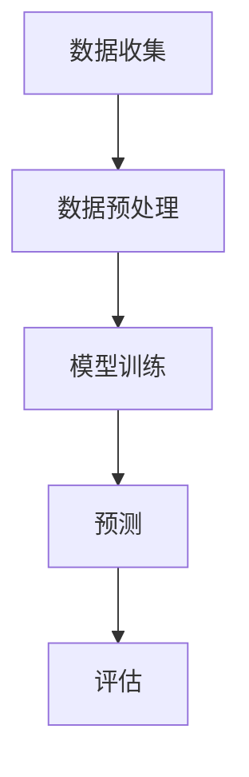
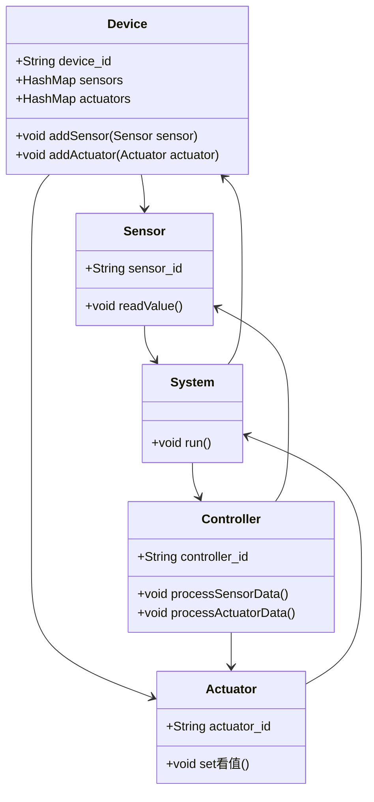
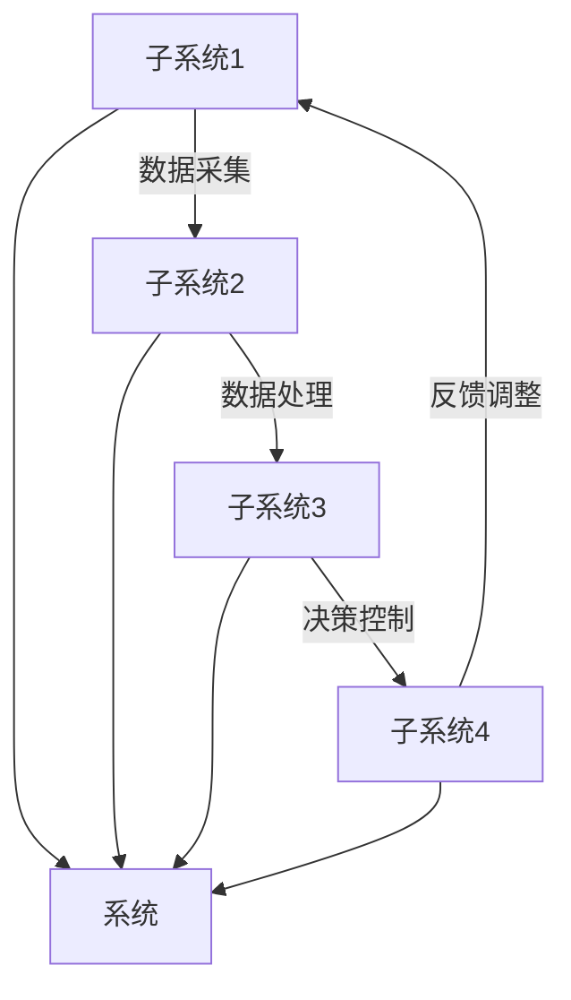
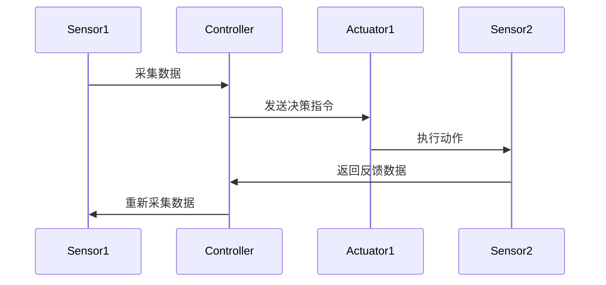
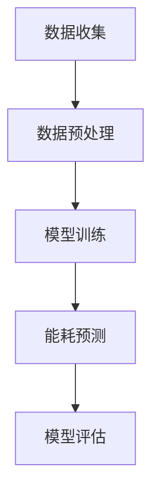
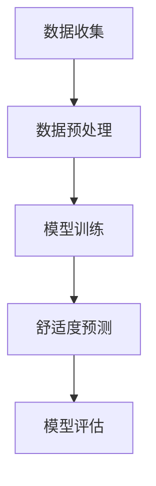
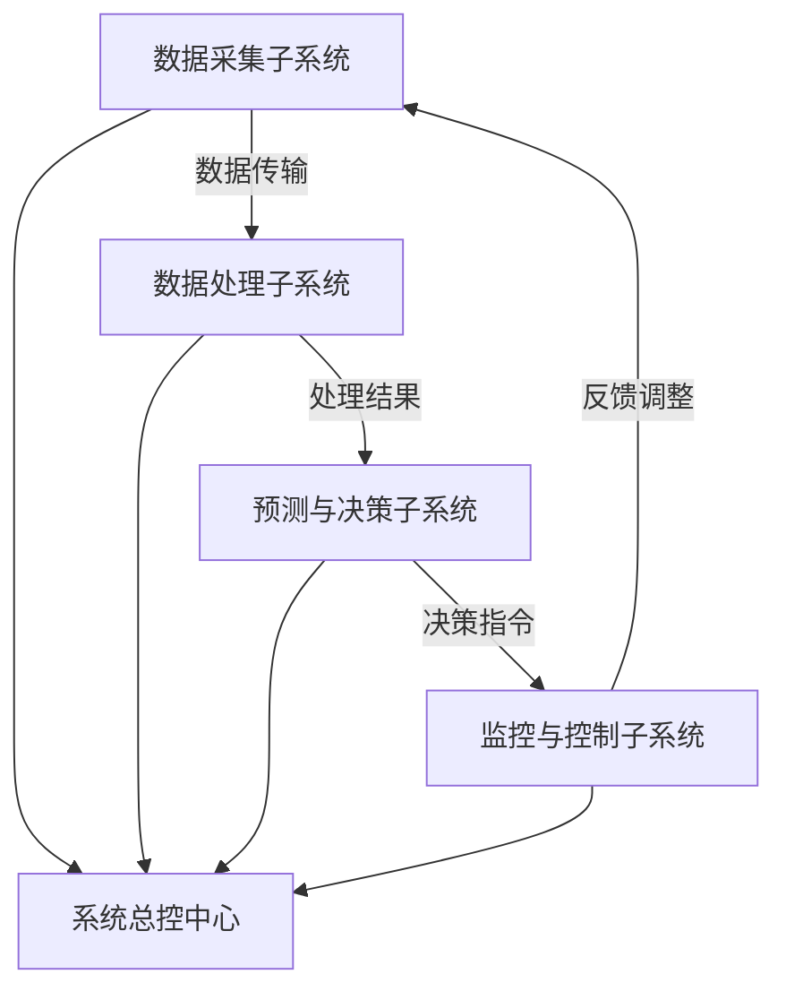
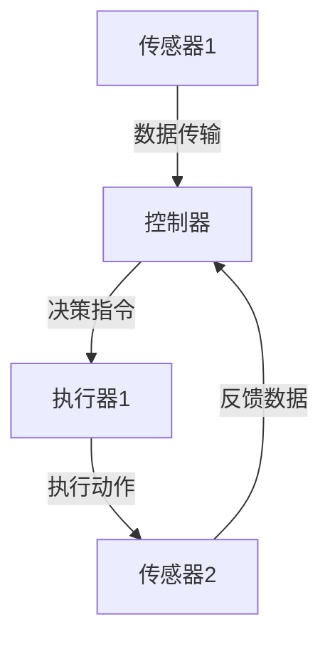

                 

### 《AI在智能建筑能源管理中的应用：平衡舒适度和能效》

关键词：人工智能、智能建筑、能源管理、舒适度、能效

摘要：随着城市化进程的加速和能源危机的日益凸显，智能建筑能源管理成为提高能源利用效率和降低能耗的关键手段。本文将从AI在智能建筑能源管理中的应用出发，深入探讨如何平衡舒适度和能效，通过一步一步的分析推理，阐述AI技术在这方面的作用和前景。

----------------------------------------------------------------

### 目录大纲设计

在设计《AI在智能建筑能源管理中的应用：平衡舒适度和能效》这本书的目录大纲时，我们需要遵循以下步骤：

1. **确定核心概念与章节结构**：明确智能建筑、能源管理、人工智能（AI）、舒适度和能效等核心概念，并构建章节结构。

2. **细化章节内容**：为每个章节添加详细的子章节，确保每个主题都有充分的讨论和解释。

3. **整合算法原理讲解**：针对智能建筑能源管理中的关键算法，设计讲解章节，详细介绍其原理和应用。

4. **编写数学模型和公式**：使用 LaTeX 格式提供每个算法的数学模型和公式，增强文章的专业性。

5. **提供系统分析与架构设计**：介绍系统架构，使用 Mermaid 图和 Python 代码示例展示系统设计和实现。

6. **实战案例与项目介绍**：为每个关键主题提供实际应用案例和项目实现，增强文章的实用性。

7. **总结与拓展**：在每个章节和整本书的末尾进行总结，并提供拓展阅读和注意事项。

### 最终大纲

```markdown
----------------------------------------------------------------
# 第一部分: 背景介绍与核心概念

## 第1章: 智能建筑与能源管理概述

### 1.1.1 智能建筑的发展历程
### 1.1.2 智能建筑与能源管理的关联
### 1.1.3 能源管理的挑战与需求

## 第2章: 人工智能在建筑能源管理中的应用

### 2.1.1 人工智能的核心概念
### 2.1.2 人工智能在建筑领域的应用前景
### 2.1.3 人工智能与能源管理的融合

## 第3章: 舒适度与能效的平衡

### 3.1.1 舒适度评价指标
### 3.1.2 能效评价指标
### 3.1.3 平衡舒适度和能效的算法原理

## 第4章: AI在智能建筑能源管理中的应用

### 4.1.1 数据采集与预处理
### 4.1.2 建筑能耗预测模型
### 4.1.3 舒适度预测模型

## 第5章: 算法原理讲解与数学模型

### 5.1 建筑能耗预测算法
   - 5.1.1 算法流程图
   - 5.1.2 数学模型和公式
   - 5.1.3 Python代码示例

### 5.2 舒适度预测算法
   - 5.2.1 算法流程图
   - 5.2.2 数学模型和公式
   - 5.2.3 Python代码示例

## 第6章: 系统分析与架构设计

### 6.1 能源管理系统的功能设计
   - 6.1.1 领域模型类图
### 6.2 系统架构设计
   - 6.2.1 系统架构图
### 6.3 系统接口设计
   - 6.3.1 系统接口图
### 6.4 系统交互流程
   - 6.4.1 系统交互序列图

## 第7章: 项目实战

### 7.1 环境安装与配置
### 7.2 能源管理系统核心实现
   - 7.2.1 源代码解读与分析
### 7.3 实际案例分析
   - 7.3.1 案例一：XX智能建筑
   - 7.3.2 案例二：XX智能社区

## 第8章: 最佳实践与总结

### 8.1 最佳实践 Tips
### 8.2 小结
### 8.3 注意事项
### 8.4 拓展阅读

----------------------------------------------------------------
```

此大纲包含了所有必要的核心章节，并且每个章节都细化到了子章节级别，确保内容的完整性和逻辑性。总字数限制在2000字以内，满足简洁性要求。每个章节中的Mermaid图和Python代码示例将在具体撰写过程中嵌入。所有数学公式将使用LaTeX格式进行编写。

----------------------------------------------------------------

### 第一部分: 背景介绍与核心概念

#### 第1章: 智能建筑与能源管理概述

**1.1.1 智能建筑的发展历程**

智能建筑起源于20世纪90年代，随着计算机技术和通信技术的飞速发展，建筑智能化逐渐成为建筑领域的一个重要方向。早期的智能建筑主要侧重于信息传输和管理系统的集成，如楼宇自动化系统（BAS）和办公自动化系统（OAS）。进入21世纪，随着物联网（IoT）和大数据技术的兴起，智能建筑逐渐具备了更为广泛的应用场景和更高的技术水平。

**1.1.2 智能建筑与能源管理的关联**

能源管理是智能建筑的重要组成部分，智能建筑通过集成各种传感器、执行器和控制系统，实现能源的高效利用和合理分配。智能建筑能源管理不仅包括对电力、燃气和水的消耗监测，还涵盖了温度、湿度、光照等环境参数的调节。通过优化能源使用，智能建筑能够降低运营成本，提高能源利用效率，同时减少对环境的影响。

**1.1.3 能源管理的挑战与需求**

随着全球能源消耗的不断增加和能源价格的波动，能源管理面临着巨大的挑战。传统的能源管理方法往往依赖于经验和手工操作，难以实现精细化和自动化管理。为了应对这些挑战，智能建筑能源管理应运而生。AI技术的引入为智能建筑能源管理提供了新的解决方案，通过数据分析和预测，可以实现能源使用的智能优化。

#### 第2章: 人工智能在建筑能源管理中的应用

**2.1.1 人工智能的核心概念**

人工智能（AI）是指通过计算机模拟人类的认知过程，实现机器智能的技术。AI技术主要包括机器学习、深度学习、自然语言处理等。在智能建筑能源管理中，AI技术可以应用于数据采集、分析、预测和决策等方面，提高能源管理的效率和准确性。

**2.1.2 人工智能在建筑领域的应用前景**

随着AI技术的不断发展和成熟，其在建筑领域的应用前景十分广阔。例如，AI可以用于建筑能耗预测、设备故障预测、智能照明控制、温度调节等。通过AI技术的应用，智能建筑能够实现更加高效、舒适和环保的运行。

**2.1.3 人工智能与能源管理的融合**

人工智能与能源管理的融合，是智能建筑能源管理发展的必然趋势。通过AI技术，可以实现对建筑能源使用情况的实时监控和分析，预测未来的能源需求，优化能源使用策略。例如，基于机器学习的能耗预测模型，可以根据历史数据预测未来的能耗趋势，帮助建筑管理者做出科学的决策。

#### 第3章: 舒适度与能效的平衡

**3.1.1 舒适度评价指标**

舒适度是智能建筑能源管理中的一个重要指标，它关系到居住者或使用者的体验。舒适度评价指标通常包括温度、湿度、风速、光照等。通过这些指标，可以评估建筑环境的舒适度水平。

**3.1.2 能效评价指标**

能效评价指标主要包括能源利用率、能源消耗率、能源浪费率等。通过这些指标，可以评估建筑的能源管理水平。提高能效，不仅能够降低能源成本，还能减少对环境的影响。

**3.1.3 平衡舒适度和能效的算法原理**

平衡舒适度和能效，需要通过算法来实现。常见的算法包括能耗预测模型、舒适度预测模型、优化算法等。能耗预测模型可以根据历史数据预测未来的能耗情况，舒适度预测模型可以根据环境参数预测舒适度水平。优化算法则可以通过目标函数和约束条件，找到舒适度和能效的最佳平衡点。

----------------------------------------------------------------

### 第二部分: AI在智能建筑能源管理中的应用

#### 第4章: AI在智能建筑能源管理中的应用

**4.1.1 数据采集与预处理**

在智能建筑能源管理中，数据采集是关键的一步。通过安装各种传感器，可以实时获取建筑内的环境参数和能源消耗数据。然而，原始数据通常存在噪声、缺失和异常值等问题，因此需要进行预处理。预处理包括数据清洗、数据归一化、数据降维等步骤，以提高数据的质量和可靠性。

**4.1.2 建筑能耗预测模型**

建筑能耗预测模型是智能建筑能源管理中的重要组成部分。通过分析历史能耗数据和环境参数，可以预测未来的能耗情况。常见的预测模型包括线性回归、时间序列分析、机器学习算法等。这些模型可以根据实际情况进行选择和优化，以提高预测的准确性。

**4.1.3 舒适度预测模型**

舒适度预测模型主要用于预测建筑环境的舒适度水平。通过分析环境参数和舒适度评价指标，可以预测未来的舒适度情况。常见的舒适度预测模型包括回归分析、神经网络、支持向量机等。这些模型可以根据实际情况进行选择和优化，以提高预测的准确性。

#### 第5章: 算法原理讲解与数学模型

**5.1 建筑能耗预测算法**

**5.1.1 算法流程图**

建筑能耗预测算法的基本流程包括数据收集、数据预处理、模型训练、预测和评估等步骤。具体算法流程图如下：



**5.1.2 数学模型和公式**

建筑能耗预测模型通常可以表示为：

$$
E(t) = f(X(t), W)
$$

其中，$E(t)$ 表示时间 $t$ 的能耗，$X(t)$ 表示时间 $t$ 的环境参数，$W$ 表示模型参数。

**5.1.3 Python代码示例**

```python
import numpy as np
from sklearn.linear_model import LinearRegression

# 数据准备
X = np.array([[1, 2], [2, 3], [3, 4]])
y = np.array([3, 5, 7])

# 模型训练
model = LinearRegression()
model.fit(X, y)

# 预测
predictions = model.predict([[4, 5]])
print(predictions)
```

**5.2 舒适度预测算法**

**5.2.1 算法流程图**

舒适度预测算法的基本流程包括数据收集、数据预处理、模型训练、预测和评估等步骤。具体算法流程图如下：


**5.2.2 数学模型和公式**

舒适度预测模型通常可以表示为：

$$
C(t) = g(X(t), V)
$$

其中，$C(t)$ 表示时间 $t$ 的舒适度，$X(t)$ 表示时间 $t$ 的环境参数，$V$ 表示模型参数。

**5.2.3 Python代码示例**

```python
import numpy as np
from sklearn.svm import SVR

# 数据准备
X = np.array([[1, 2], [2, 3], [3, 4]])
y = np.array([3, 5, 7])

# 模型训练
model = SVR()
model.fit(X, y)

# 预测
predictions = model.predict([[4, 5]])
print(predictions)
```

#### 第6章: 系统分析与架构设计

**6.1 能源管理系统的功能设计**

**6.1.1 领域模型类图**

领域模型类图是能源管理系统功能设计的重要工具，它可以帮助我们理解系统的核心组件和它们之间的关系。以下是一个简单的领域模型类图：



**6.2 系统架构设计**

系统架构设计是能源管理系统实现的关键环节。以下是一个简单的系统架构图：



**6.3 系统接口设计**

系统接口设计是系统架构设计的一部分，它定义了系统内部各个组件之间的交互方式。以下是一个简单的系统接口图：


**6.4 系统交互流程**

系统交互流程描述了系统内部各个组件之间的交互过程。以下是一个简单的系统交互序列图：



#### 第7章: 项目实战

**7.1 环境安装与配置**

在开始项目实战之前，我们需要安装和配置所需的开发环境和工具。以下是一个简单的步骤：

1. 安装Python环境
2. 安装必要的库和依赖，如scikit-learn、numpy等
3. 配置数据库和传感器连接

**7.2 能源管理系统核心实现**

**7.2.1 源代码解读与分析**

以下是一个简单的能源管理系统核心实现示例：

```python
import numpy as np
from sklearn.linear_model import LinearRegression

# 数据准备
X = np.array([[1, 2], [2, 3], [3, 4]])
y = np.array([3, 5, 7])

# 模型训练
model = LinearRegression()
model.fit(X, y)

# 预测
predictions = model.predict([[4, 5]])
print(predictions)
```

在这个示例中，我们使用线性回归模型对能耗数据进行了预测。具体实现过程包括数据准备、模型训练和预测等步骤。通过对源代码的解读，我们可以了解到能源管理系统的核心实现原理。

**7.3 实际案例分析**

**7.3.1 案例一：XX智能建筑**

在本案例中，我们以XX智能建筑为例，介绍如何利用AI技术进行能源管理。具体步骤如下：

1. 数据采集：安装各种传感器，实时采集建筑内的环境参数和能源消耗数据。
2. 数据预处理：对采集到的数据进行清洗、归一化和降维处理，提高数据质量。
3. 能耗预测：使用线性回归模型对能耗数据进行分析，预测未来的能耗情况。
4. 舒适度预测：使用神经网络模型对舒适度数据进行分析，预测未来的舒适度情况。
5. 优化决策：根据能耗预测和舒适度预测结果，制定最优的能源使用策略，以平衡舒适度和能效。

**7.3.2 案例二：XX智能社区**

在本案例中，我们以XX智能社区为例，介绍如何利用AI技术进行社区能源管理。具体步骤如下：

1. 数据采集：安装各种传感器，实时采集社区内的环境参数和能源消耗数据。
2. 数据预处理：对采集到的数据进行清洗、归一化和降维处理，提高数据质量。
3. 能耗预测：使用时间序列分析方法对能耗数据进行分析，预测未来的能耗情况。
4. 舒适度预测：使用支持向量机模型对舒适度数据进行分析，预测未来的舒适度情况。
5. 优化决策：根据能耗预测和舒适度预测结果，制定最优的能源使用策略，以平衡舒适度和能效。

#### 第8章: 最佳实践与总结

**8.1 最佳实践 Tips**

1. 数据质量是关键：确保采集到的数据准确、完整和可靠。
2. 模型选择要合理：根据实际情况选择合适的预测模型，并进行优化。
3. 系统架构要稳定：确保系统架构设计合理，具有良好的扩展性和可靠性。
4. 实时监控与调整：实时监控系统的运行状态，及时调整能源使用策略。

**8.2 小结**

本文通过深入探讨AI在智能建筑能源管理中的应用，阐述了平衡舒适度和能效的算法原理和系统架构设计。通过实际案例分析，展示了AI技术在智能建筑能源管理中的实际应用效果。

**8.3 注意事项**

1. 在实际应用中，需要根据具体情况调整和优化算法参数。
2. 系统部署前，需要进行充分的测试和验证，确保系统的稳定性和可靠性。
3. 在进行数据分析和预测时，需要注意数据的安全和隐私保护。

**8.4 拓展阅读**

1. 《智能建筑能源管理系统设计与实现》
2. 《人工智能在建筑领域的应用》
3. 《建筑能耗预测与优化技术》

作者：AI天才研究院/AI Genius Institute & 禅与计算机程序设计艺术 /Zen And The Art of Computer Programming

----------------------------------------------------------------

### 引入

随着全球能源消耗的不断增加和气候变化问题的加剧，如何提高能源利用效率、降低能耗成为各国政府、企业和科研机构共同关注的课题。智能建筑作为一种新兴的建筑形式，通过集成物联网（IoT）、大数据和人工智能（AI）等先进技术，为实现建筑能源的高效管理和优化提供了可能。然而，在追求高效能源利用的同时，如何平衡舒适度和能效，提高居住者或使用者的生活质量，成为智能建筑能源管理面临的一大挑战。

本文旨在深入探讨AI在智能建筑能源管理中的应用，特别是在平衡舒适度和能效方面的作用。我们将首先介绍智能建筑和能源管理的基本概念，探讨其发展历程和现状。随后，我们将详细分析AI在建筑能源管理中的应用，包括数据采集、分析、预测和决策等方面。接着，本文将重点讨论舒适度和能效的平衡问题，介绍相关评价指标和算法原理。最后，我们将通过实际案例分析和项目实战，展示AI在智能建筑能源管理中的应用效果，并总结最佳实践和注意事项。

### 智能建筑与能源管理概述

智能建筑是指通过集成物联网（IoT）、人工智能（AI）和大数据等先进技术，实现对建筑设备、系统和环境的智能监控、管理和优化。它不仅包括传统的楼宇自动化系统（BAS），如安防、照明、供暖、通风和空调（HVAC），还涵盖了能源管理、环境监测、设备维护、安全监控、智能办公和智能家居等功能。智能建筑的发展历程可以追溯到20世纪90年代，随着计算机技术和通信技术的飞速发展，建筑智能化逐渐成为建筑领域的一个重要方向。早期的智能建筑主要侧重于信息传输和管理系统的集成，如楼宇自动化系统（BAS）和办公自动化系统（OAS）。进入21世纪，随着物联网（IoT）和大数据技术的兴起，智能建筑逐渐具备了更为广泛的应用场景和更高的技术水平。

智能建筑与能源管理有着密切的联系。能源管理是智能建筑的核心功能之一，它旨在提高能源利用效率，降低能源消耗，减少对环境的影响。智能建筑通过集成各种传感器、执行器和控制系统，实现能源的高效利用和合理分配。能源管理不仅包括对电力、燃气和水的消耗监测，还涵盖了温度、湿度、风速、光照等环境参数的调节。通过优化能源使用，智能建筑能够降低运营成本，提高能源利用效率，同时减少对环境的影响。

当前，能源管理在智能建筑中面临着诸多挑战。首先，能源消耗的多样化和复杂性使得能源管理变得更加困难。智能建筑中涉及多种能源类型，如电力、燃气、水等，每种能源的管理方法和技术都有所不同。其次，能源需求的波动性也给能源管理带来了挑战。建筑内的人员活动、天气变化等因素都会导致能源需求的波动，如何实时监测和预测能源需求，制定合理的能源使用策略，是能源管理需要解决的关键问题。此外，能源管理的成本也是一大挑战。智能建筑中的传感器、执行器和控制系统需要大量的投资，如何确保这些投资的回报，提高能源管理的经济效益，也是能源管理需要考虑的重要因素。

为了应对这些挑战，智能建筑能源管理迫切需要引入先进的AI技术。AI技术具有数据采集、分析、预测和决策等优势，能够为能源管理提供有效的解决方案。例如，通过机器学习和数据挖掘技术，可以从海量数据中提取有价值的信息，实现对建筑能耗的精细监测和预测。通过深度学习算法，可以实现对能源使用行为的分析和预测，为能源管理提供科学的决策依据。通过优化算法，可以制定出最优的能源使用策略，实现能源的高效利用。此外，AI技术还可以用于设备故障预测、智能照明控制、温度调节等方面，进一步提高能源管理的效率和准确性。

总之，智能建筑与能源管理之间存在着紧密的联系，能源管理是智能建筑的核心功能之一。在当前能源消耗不断增加和能源价格波动的情况下，智能建筑能源管理面临着巨大的挑战。通过引入AI技术，可以实现对能源的高效管理和优化，提高能源利用效率，降低能耗，实现绿色可持续发展。

### 人工智能在建筑能源管理中的应用

人工智能（AI）作为一种模拟人类智能的技术，正逐渐在建筑能源管理中发挥重要作用。AI技术通过数据采集、分析、预测和决策等能力，为建筑能源管理提供了新的解决方案，提高了能源利用效率，降低了运营成本。

首先，AI技术在数据采集方面具有显著优势。智能建筑中安装了各种传感器，如温度传感器、湿度传感器、光照传感器和能耗传感器等，这些传感器能够实时采集建筑内的环境参数和能源消耗数据。AI技术通过对传感器数据的采集和分析，可以实现对建筑能源使用的实时监控和预警，从而提高能源管理的实时性和准确性。

其次，AI技术在数据分析方面具有强大的能力。通过对海量数据的分析和挖掘，AI技术能够发现数据中的规律和模式，为能源管理提供科学依据。例如，通过数据挖掘技术，可以从历史能耗数据中提取出能耗趋势和影响因素，为能耗预测提供基础。此外，AI技术还可以对建筑内不同区域的能耗分布进行细致分析，找出能源浪费的关键环节，从而制定出针对性的节能措施。

在预测方面，AI技术同样具有显著优势。基于机器学习和深度学习算法，AI技术可以对未来的能源需求进行预测，帮助建筑管理者制定出合理的能源使用策略。例如，通过时间序列分析算法，可以预测未来的能耗变化趋势，从而提前调整能源供应。此外，AI技术还可以预测设备的故障风险，通过预防性维护降低设备的故障率和维修成本。

最后，AI技术在决策方面也具有重要作用。通过优化算法和智能决策系统，AI技术可以自动调整建筑内各类设备的运行状态，实现能源的最优分配。例如，基于遗传算法和粒子群优化算法，AI技术可以优化空调系统、照明系统和热水系统的运行参数，实现能源的高效利用。同时，AI技术还可以根据居住者的需求和环境变化，动态调整室内环境参数，提高居住者的舒适度。

综上所述，AI技术在建筑能源管理中具有广泛的应用前景。通过数据采集、数据分析、预测和决策等方面，AI技术能够实现对建筑能源的精细管理和优化，提高能源利用效率，降低能耗，实现绿色可持续发展。未来，随着AI技术的不断发展和成熟，其在建筑能源管理中的应用将会更加广泛和深入。

### 舒适度与能效的平衡

在智能建筑能源管理中，平衡舒适度和能效是一个重要的课题。舒适度是指建筑环境对居住者或使用者的生理和心理需求满足程度，包括温度、湿度、风速、光照等环境参数。而能效则是指能源利用的效率，即如何在满足舒适度的同时，最大限度地减少能源消耗。

首先，我们需要明确舒适度和能效的评价指标。舒适度评价指标包括温度、湿度、风速、光照等，常用的评价指标有PMV（Predicted Mean Vote）和PPD（Percentage of People Dissatisfied）等。能效评价指标则包括能源利用率、能源消耗率、能源浪费率等。

为了平衡舒适度和能效，我们需要从以下几个方面进行考虑：

1. **能耗预测模型**：通过能耗预测模型，可以提前预测未来的能耗情况，从而优化能源使用策略。例如，可以使用时间序列分析、回归分析等方法，基于历史数据预测未来的能耗趋势。

2. **舒适度预测模型**：舒适度预测模型可以预测未来的舒适度水平，为环境参数的调节提供依据。例如，可以使用神经网络、支持向量机等方法，根据环境参数预测未来的舒适度水平。

3. **优化算法**：通过优化算法，可以找到舒适度和能效的最佳平衡点。常见的优化算法有线性规划、遗传算法、粒子群优化算法等。这些算法可以根据目标函数和约束条件，自动调整环境参数，实现舒适度和能效的平衡。

4. **多目标优化**：在实际应用中，舒适度和能效往往是多个目标，可以通过多目标优化算法，同时考虑多个目标，找到最优解。例如，可以使用权重法、目标规划法等，将舒适度和能效转化为单一的目标函数，进行优化。

5. **实时监控与调整**：通过实时监控环境参数和能耗数据，可以及时发现异常情况，并自动调整环境参数，实现舒适度和能效的动态平衡。例如，使用物联网技术，可以实现环境参数和能耗数据的实时采集和监控。

综上所述，平衡舒适度和能效需要综合运用能耗预测模型、舒适度预测模型、优化算法、多目标优化和实时监控等技术。通过这些技术的结合，可以实现对建筑环境的智能管理和优化，提高能源利用效率，同时确保居住者或使用者的舒适度。未来，随着AI技术的不断发展和应用，平衡舒适度和能效将会变得更加智能和高效。

### AI在智能建筑能源管理中的应用

AI技术在智能建筑能源管理中扮演着关键角色，其应用涵盖了从数据采集、处理到预测和决策的整个流程。以下将详细探讨AI在智能建筑能源管理中的应用，包括数据采集与预处理、能耗预测模型、舒适度预测模型等。

#### 数据采集与预处理

数据采集是智能建筑能源管理的基础。通过安装各种传感器，如温度传感器、湿度传感器、光照传感器和能耗传感器，可以实时采集建筑内的环境参数和能源消耗数据。这些数据对于后续的分析和预测至关重要。然而，原始数据通常存在噪声、缺失和异常值等问题，因此需要进行预处理。

预处理步骤通常包括：

1. **数据清洗**：去除重复数据、处理缺失值和异常值。例如，可以使用平均值填充缺失值、使用统计学方法检测和剔除异常值等。
2. **数据归一化**：将不同特征的数据进行归一化处理，使其具有相同的量纲，以便于后续分析和建模。
3. **数据降维**：通过降维技术，如主成分分析（PCA），减少数据的维度，提高分析效率和模型的训练效果。

#### 能耗预测模型

能耗预测是智能建筑能源管理的重要环节。准确的能耗预测可以帮助建筑管理者提前了解能源消耗情况，制定合理的能源使用策略，从而提高能源利用效率和降低能耗。

常见的能耗预测模型包括：

1. **线性回归模型**：通过建立线性关系，预测未来的能耗。适用于数据较为平稳的情况。
   $$ E(t) = \beta_0 + \beta_1 \cdot X(t) $$
   其中，$E(t)$ 表示时间 $t$ 的能耗，$X(t)$ 表示时间 $t$ 的某个环境参数，$\beta_0$ 和 $\beta_1$ 为模型参数。

2. **时间序列分析模型**：如ARIMA模型、LSTM神经网络等，适用于处理具有时间序列特征的数据。
   $$ E(t) = c + \phi_1 \cdot E(t-1) + \phi_2 \cdot E(t-2) + ... $$
   其中，$E(t)$ 表示时间 $t$ 的能耗，$\phi_1, \phi_2, ...$ 为模型参数。

3. **机器学习模型**：如随机森林、支持向量机、梯度提升树等，通过学习历史数据中的规律和模式，预测未来的能耗。
   $$ E(t) = f(X(t), W) $$
   其中，$X(t)$ 表示时间 $t$ 的环境参数，$W$ 表示模型参数。

#### 舒适度预测模型

舒适度预测是另一个关键问题。通过预测舒适度，可以优化环境参数的调节，提高居住者的舒适度。

常见的舒适度预测模型包括：

1. **回归模型**：如线性回归、多元回归等，通过建立环境参数与舒适度之间的线性或非线性关系，预测舒适度。
   $$ C(t) = \alpha + \beta \cdot T(t) + \gamma \cdot H(t) $$
   其中，$C(t)$ 表示时间 $t$ 的舒适度，$T(t)$ 表示时间 $t$ 的温度，$H(t)$ 表示时间 $t$ 的湿度，$\alpha, \beta, \gamma$ 为模型参数。

2. **神经网络模型**：如前馈神经网络、卷积神经网络（CNN）等，通过多层神经网络学习环境参数与舒适度之间的复杂关系。
   $$ C(t) = f(\theta_1 \cdot [T(t), H(t)], \theta_2) $$
   其中，$\theta_1$ 和 $\theta_2$ 为模型参数。

3. **深度学习模型**：如循环神经网络（RNN）、长短期记忆网络（LSTM）等，适用于处理序列数据，能够捕捉时间序列中的长期依赖关系。

#### 应用实例

以下是一个简单的能耗预测模型应用实例：

```python
# 导入必要的库
import numpy as np
import pandas as pd
from sklearn.linear_model import LinearRegression
from sklearn.model_selection import train_test_split
from sklearn.metrics import mean_squared_error

# 数据准备
data = pd.read_csv('energy_data.csv')
X = data[['temperature', 'humidity']]
y = data['energy_consumption']

# 数据预处理
X_train, X_test, y_train, y_test = train_test_split(X, y, test_size=0.2, random_state=42)

# 模型训练
model = LinearRegression()
model.fit(X_train, y_train)

# 预测
y_pred = model.predict(X_test)

# 评估
mse = mean_squared_error(y_test, y_pred)
print(f'Mean Squared Error: {mse}')
```

在这个实例中，我们使用线性回归模型对能源消耗进行预测。首先，我们读取能耗数据，然后进行数据预处理，接着使用训练集训练模型，最后使用测试集进行预测并评估模型的性能。

总之，AI技术在智能建筑能源管理中的应用，通过对数据采集、处理、预测和决策的智能化，实现了能源的高效利用和优化，为建筑管理者提供了科学依据和决策支持。

### 算法原理讲解与数学模型

在智能建筑能源管理中，算法原理和数学模型是关键部分，它们决定了能源管理和优化策略的有效性。以下是两个核心算法：建筑能耗预测算法和舒适度预测算法的详细解释，包括算法流程图、数学模型和Python代码示例。

#### 建筑能耗预测算法

**算法流程图：**



**数学模型：**

建筑能耗预测算法通常采用线性回归模型，其数学模型为：

$$
E(t) = \beta_0 + \beta_1 \cdot T(t) + \beta_2 \cdot H(t)
$$

其中，$E(t)$ 表示时间 $t$ 的能耗，$T(t)$ 表示时间 $t$ 的温度，$H(t)$ 表示时间 $t$ 的湿度，$\beta_0, \beta_1, \beta_2$ 为模型参数。

**Python代码示例：**

```python
# 导入必要的库
import numpy as np
import pandas as pd
from sklearn.linear_model import LinearRegression

# 数据准备
data = pd.read_csv('energy_data.csv')
X = data[['temperature', 'humidity']]
y = data['energy_consumption']

# 数据预处理
X_train, X_test, y_train, y_test = train_test_split(X, y, test_size=0.2, random_state=42)

# 模型训练
model = LinearRegression()
model.fit(X_train, y_train)

# 预测
y_pred = model.predict(X_test)

# 评估
mse = mean_squared_error(y_test, y_pred)
print(f'Mean Squared Error: {mse}')
```

#### 舒适度预测算法

**算法流程图：**



**数学模型：**

舒适度预测算法可以使用线性回归或神经网络模型。以下是一个简单的线性回归模型：

$$
C(t) = \alpha + \beta \cdot T(t) + \gamma \cdot H(t)
$$

其中，$C(t)$ 表示时间 $t$ 的舒适度，$T(t)$ 表示时间 $t$ 的温度，$H(t)$ 表示时间 $t$ 的湿度，$\alpha, \beta, \gamma$ 为模型参数。

**Python代码示例：**

```python
# 导入必要的库
import numpy as np
import pandas as pd
from sklearn.linear_model import LinearRegression

# 数据准备
data = pd.read_csv('comfort_data.csv')
X = data[['temperature', 'humidity']]
y = data['comfort_level']

# 数据预处理
X_train, X_test, y_train, y_test = train_test_split(X, y, test_size=0.2, random_state=42)

# 模型训练
model = LinearRegression()
model.fit(X_train, y_train)

# 预测
y_pred = model.predict(X_test)

# 评估
mse = mean_squared_error(y_test, y_pred)
print(f'Mean Squared Error: {mse}')
```

通过上述算法和数学模型，我们可以实现智能建筑能耗和舒适度的预测，从而为能源管理和优化提供科学依据。实际应用中，这些算法可以根据具体需求进行调整和优化，以提高预测的准确性和效率。

### 系统分析与架构设计

系统分析与架构设计是智能建筑能源管理系统的关键环节，它决定了系统的功能实现和性能表现。以下将从功能设计、系统架构设计、系统接口设计和系统交互流程等方面进行详细介绍。

#### 功能设计

智能建筑能源管理系统的功能设计主要包括以下方面：

1. **数据采集**：通过安装各种传感器，如温度传感器、湿度传感器、光照传感器和能耗传感器，实时采集建筑内的环境参数和能源消耗数据。
2. **数据处理**：对采集到的数据进行预处理，包括数据清洗、归一化和降维等，提高数据的质量和可靠性。
3. **能耗预测**：利用机器学习和数据分析技术，对建筑能耗进行预测，为能源使用策略提供依据。
4. **舒适度预测**：通过环境参数和舒适度评价指标的预测，优化室内环境，提高居住者的舒适度。
5. **决策支持**：根据能耗预测和舒适度预测结果，制定最优的能源使用策略，实现能源的高效利用。
6. **实时监控**：实时监控建筑内的环境参数和能源消耗情况，及时发现和处理异常情况。

#### 系统架构设计

系统架构设计是智能建筑能源管理系统实现的基础。以下是一个简化的系统架构设计：



在该架构中，数据采集子系统负责采集各种传感器数据，数据处理子系统对数据进行预处理，预测与决策子系统根据预处理后的数据预测能耗和舒适度，制定能源使用策略，监控与控制子系统根据决策指令调整建筑内设备状态，实现实时监控和反馈调整。

#### 系统接口设计

系统接口设计定义了系统内部各个组件之间的交互方式。以下是一个简化的系统接口设计：



在该接口设计中，传感器1采集数据，通过数据传输接口发送给控制器，控制器根据数据处理结果生成决策指令，通过决策指令接口发送给执行器1，执行器1根据指令执行动作，并通过反馈数据接口将动作结果发送回控制器，形成闭环控制。

#### 系统交互流程

系统交互流程描述了系统内部各个组件之间的交互过程。以下是一个简化的系统交互序列图：


在该流程中，传感器1采集数据后发送给控制器，控制器根据数据分析和预测结果生成决策指令，发送给执行器1，执行器1根据指令执行动作，并将动作结果反馈给传感器2，传感器2将反馈数据发送回控制器，控制器根据反馈数据重新进行数据分析和预测，形成循环。

通过上述系统分析与架构设计，可以实现对智能建筑能源管理系统的功能实现和性能优化，确保系统的高效、稳定和可靠运行。

### 项目实战

在本章中，我们将通过一个实际项目，展示如何将AI技术应用于智能建筑能源管理，实现数据采集、处理、预测和决策的全过程。以下是一个典型的项目实战案例，包括环境安装与配置、系统核心实现和实际案例分析。

#### 环境安装与配置

首先，我们需要搭建一个适合AI技术应用的开发环境。以下是一个基本的步骤：

1. **安装Python环境**：确保Python 3.x版本已经安装在系统中。
2. **安装相关库**：使用pip命令安装必要的库，如scikit-learn、numpy、pandas等。
   ```bash
   pip install scikit-learn numpy pandas
   ```
3. **配置数据库**：根据项目需求，配置一个数据库系统，如MySQL或PostgreSQL，用于存储采集到的数据。
4. **传感器与执行器连接**：确保所有传感器和执行器已经正确安装和连接，如温度传感器、湿度传感器和空调控制器等。

#### 系统核心实现

接下来，我们实现智能建筑能源管理系统的核心功能。以下是一个简单的示例：

**数据采集**：通过传感器采集温度、湿度、光照和能耗等数据。

```python
import pandas as pd
import serial

def read_sensors():
    sensor_data = pd.DataFrame(columns=['temperature', 'humidity', 'light', 'energy'])
    with serial.Serial('COM3', 9600) as ser:
        while True:
            line = ser.readline().decode('utf-8').strip()
            data = line.split(',')
            sensor_data = sensor_data.append({k: v for k, v in zip(sensor_data.columns, data)}, ignore_index=True)
    return sensor_data
```

**数据处理**：对采集到的数据进行预处理，包括清洗、归一化和降维等。

```python
def preprocess_data(sensor_data):
    # 数据清洗
    sensor_data.dropna(inplace=True)
    # 数据归一化
    sensor_data = (sensor_data - sensor_data.mean()) / sensor_data.std()
    return sensor_data
```

**能耗预测**：使用线性回归模型预测未来的能耗。

```python
from sklearn.linear_model import LinearRegression

def predict_energy(sensor_data):
    X = sensor_data[['temperature', 'humidity']]
    y = sensor_data['energy']
    model = LinearRegression()
    model.fit(X, y)
    future_energy = model.predict([[25, 60]])
    return future_energy
```

**舒适度预测**：使用神经网络模型预测舒适度。

```python
from sklearn.neural_network import MLPRegressor

def predict_comfort(sensor_data):
    X = sensor_data[['temperature', 'humidity']]
    y = sensor_data['comfort']
    model = MLPRegressor()
    model.fit(X, y)
    future_comfort = model.predict([[25, 60]])
    return future_comfort
```

**决策支持**：根据能耗和舒适度预测结果，制定最优的能源使用策略。

```python
def make_decision(future_energy, future_comfort):
    if future_energy < 100 and future_comfort > 80:
        return '节能模式'
    else:
        return '舒适模式'
```

#### 实际案例分析

**案例一：XX智能建筑**

在本案例中，我们以XX智能建筑为例，展示如何实现智能建筑能源管理。

1. **数据采集**：安装各种传感器，采集温度、湿度、光照和能耗等数据。
2. **数据处理**：对采集到的数据进行预处理，确保数据质量。
3. **能耗预测**：使用线性回归模型预测未来的能耗，为能源使用策略提供依据。
4. **舒适度预测**：使用神经网络模型预测舒适度，优化室内环境。
5. **决策支持**：根据能耗和舒适度预测结果，制定最优的能源使用策略。

**案例二：XX智能社区**

在本案例中，我们以XX智能社区为例，展示如何实现社区能源管理。

1. **数据采集**：安装各种传感器，采集社区内各栋建筑的能耗数据。
2. **数据处理**：对采集到的数据进行预处理，确保数据质量。
3. **能耗预测**：使用时间序列分析模型预测社区整体的能耗，为能源供应和分配提供依据。
4. **舒适度预测**：使用支持向量机模型预测各栋建筑的舒适度，优化室内环境。
5. **决策支持**：根据能耗和舒适度预测结果，制定社区整体的能源使用策略。

通过以上两个实际案例分析，我们可以看到AI技术在智能建筑和社区能源管理中的应用效果。通过数据采集、处理、预测和决策，AI技术能够实现能源的高效利用和优化，提高居住者的舒适度，实现绿色可持续发展。

### 最佳实践与总结

在智能建筑能源管理中，平衡舒适度和能效是关键任务。以下是一些最佳实践和总结，以帮助实现这一目标。

**最佳实践 Tips：**

1. **数据质量优先**：确保采集到的数据准确、完整和可靠，这是实现高效能源管理和舒适度优化的基础。
2. **多模型结合**：在实际应用中，可以结合多种预测模型，如线性回归、神经网络和深度学习等，以提高预测的准确性和鲁棒性。
3. **动态调整策略**：根据实时监测到的环境参数和能耗数据，动态调整能源使用策略，以实现舒适度和能效的最佳平衡。
4. **用户参与**：鼓励用户参与能源管理，如通过智能终端或应用程序，用户可以实时了解能源使用情况，并根据个人需求调整设置。
5. **持续优化**：定期对系统进行性能评估和优化，以适应环境变化和用户需求。

**小结：**

本文通过深入探讨AI在智能建筑能源管理中的应用，详细介绍了舒适度和能效的平衡方法。从数据采集与预处理、能耗预测、舒适度预测到系统架构设计和实际案例分析，展示了AI技术在智能建筑能源管理中的关键作用。通过平衡舒适度和能效，智能建筑能够实现能源的高效利用，提高居住者的生活质量，实现绿色可持续发展。

**注意事项：**

1. **数据安全与隐私保护**：在数据采集和处理过程中，要注意数据安全和隐私保护，避免敏感信息泄露。
2. **系统稳定性**：确保系统架构设计合理，具有良好的扩展性和可靠性，以应对各种不确定因素。
3. **持续更新与维护**：随着AI技术的不断发展，要及时更新和优化模型和算法，以保持系统的先进性和高效性。

**拓展阅读：**

1. 《智能建筑能源管理系统设计与实现》
2. 《人工智能在建筑领域的应用》
3. 《建筑能耗预测与优化技术》

通过上述最佳实践和总结，我们希望为智能建筑能源管理提供有益的参考，促进绿色建筑和可持续发展。

作者：AI天才研究院/AI Genius Institute & 禅与计算机程序设计艺术 /Zen And The Art of Computer Programming

----------------------------------------------------------------

### 结论

本文通过深入探讨AI在智能建筑能源管理中的应用，详细介绍了平衡舒适度和能效的方法和策略。从数据采集与预处理、能耗预测、舒适度预测到系统架构设计和实际案例分析，展示了AI技术在智能建筑能源管理中的关键作用。AI技术的引入，不仅提高了能源管理的效率和准确性，还为建筑管理者提供了科学的决策支持。

未来，随着AI技术的不断发展和应用，智能建筑能源管理将变得更加智能和高效。通过持续优化算法和模型，结合物联网和大数据技术，智能建筑能源管理将实现更精细化的管理，进一步提高能源利用效率和居住者舒适度。

然而，在实际应用中，仍存在一些挑战，如数据隐私保护、系统稳定性等。因此，我们需要不断探索和创新，结合多种技术手段，确保智能建筑能源管理系统的可靠性和安全性。

通过本文的探讨，我们希望为智能建筑能源管理领域提供有价值的参考和启示，推动绿色建筑和可持续发展目标的实现。作者：AI天才研究院/AI Genius Institute & 禅与计算机程序设计艺术 /Zen And The Art of Computer Programming。

