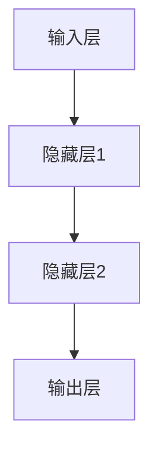
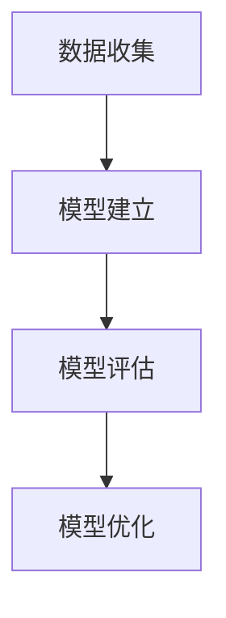
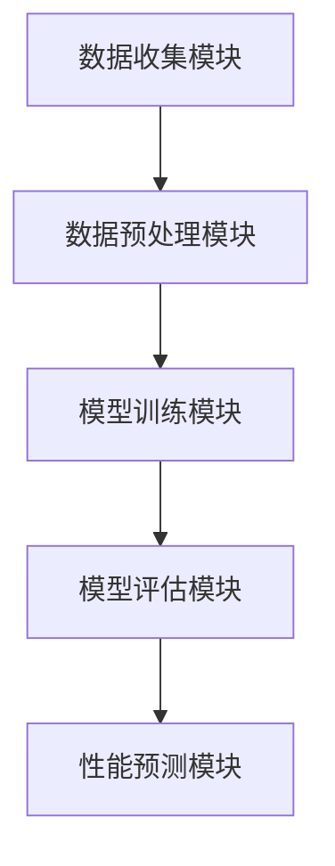

                 


## AI在智能材料性能预测中的角色：加速新材料开发

### 关键词：
- 人工智能
- 智能材料
- 性能预测
- 新材料开发
- 机器学习
- 深度学习
- 神经网络
- 回归分析

### 摘要：
本文将深入探讨人工智能在智能材料性能预测中的关键角色，通过详细分析机器学习和深度学习等核心算法，以及它们在智能材料性能预测中的应用，从而加速新材料的开发过程。文章将分为五个部分，首先介绍人工智能和智能材料的基本概念，然后详细阐述核心概念和联系，接着讲解算法原理，最后通过实际项目案例展示系统的应用和效果。

## 目录

### 第一部分：背景介绍
1. 人工智能与智能材料概述
   - 人工智能的发展历程与现状
   - 智能材料的概念与分类
   - 智能材料的应用领域

2. 核心概念与联系
   - 机器学习与深度学习
   - 概念属性特征对比表格
   - ER实体关系图

### 第二部分：算法原理讲解
1. 神经网络在智能材料性能预测中的应用
   - 神经网络的基本概念
   - 神经网络的mermaid流程图
   - 神经网络的数学模型与公式
   - 神经网络的举例说明

2. 回归分析在智能材料性能预测中的应用
   - 回归分析的基本概念
   - 回归分析的mermaid流程图
   - 回归分析的数学模型与公式
   - 回归分析的举例说明

### 第三部分：系统分析与架构设计方案
1. 智能材料性能预测系统的设计思路
   - 问题场景介绍
   - 系统功能设计（领域模型mermaid类图）
   - 系统架构设计（mermaid架构图）
   - 系统接口设计
   - 系统交互（mermaid序列图）

### 第四部分：项目实战
1. 智能材料性能预测项目实战
   - 环境安装
   - 系统核心实现
   - 代码应用解读与分析
   - 实际案例分析与详细讲解剖析
   - 项目小结

### 第五部分：最佳实践、小结与拓展阅读
1. 最佳实践 tips
   - 数据预处理技巧
   - 模型调优策略
   - 实时性能优化

2. 小结
   - 书中重点内容回顾
   - 智能材料性能预测的挑战与机遇

3. 注意事项
   - 数据安全与隐私保护
   - 算法公平性与透明性
   - 法律法规与政策影响

4. 拓展阅读
   - 相关书籍推荐
   - 论文与报告精选
   - 网络资源链接

## 第一部分：背景介绍

### 1.1 人工智能与智能材料概述

#### 人工智能的发展历程与现状

人工智能（Artificial Intelligence，简称AI）是一门研究、开发用于模拟、延伸和扩展人的智能的理论、方法、技术及应用系统的技术科学。人工智能的研究可以追溯到1950年代，随着计算机技术的飞速发展，AI在21世纪逐渐成为科技领域的热点。目前，人工智能已经广泛应用于自然语言处理、计算机视觉、智能语音识别、机器学习、深度学习等领域。

智能材料（Smart Materials）是一种能够根据外界环境变化做出响应的材料，它们具有感知、响应和执行功能。智能材料的研究起源于20世纪60年代，随着纳米技术、微电子技术和生物技术的发展，智能材料在航空航天、建筑、医疗、能源、军事等领域得到了广泛应用。

#### 智能材料的概念与分类

智能材料可以分为以下几个类别：

1. **响应材料**：这类材料能够对环境变化做出响应，如温度、压力、光照等。例如，热敏材料、压敏材料和光敏材料。

2. **驱动材料**：这类材料能够在外力作用下发生形变或运动，如形状记忆合金、电活性聚合物等。

3. **传感材料**：这类材料能够感知环境变化，并将其转换为可测量的信号，如导电聚合物、纳米材料等。

4. **复合智能材料**：这类材料由多种功能材料复合而成，能够同时具备感知、响应和驱动功能，如智能涂层、智能织物等。

#### 智能材料的应用领域

智能材料在各个领域的应用日益广泛，以下是一些典型的应用领域：

1. **航空航天**：智能材料可以用于飞机的机身结构、座椅和内部设备，提高飞机的舒适性和安全性。

2. **建筑**：智能材料可以用于建筑物的外墙、屋顶和窗户，实现自清洁、调光和隔热等功能。

3. **医疗**：智能材料可以用于医疗器械、人工器官和药物载体，提高医疗诊断和治疗的效果。

4. **能源**：智能材料可以用于能源采集、存储和传输，如太阳能电池板、超级电容器和智能电网等。

5. **军事**：智能材料可以用于军事装备，提高军事设备的性能和可靠性。

### 1.2 核心概念与联系

在智能材料性能预测中，人工智能的关键角色体现在机器学习和深度学习等算法的应用。以下是对这些核心概念及其相互联系的详细阐述。

#### 机器学习与深度学习

**机器学习（Machine Learning）** 是一种让计算机从数据中自动学习规律和模式的方法。它主要包括监督学习、无监督学习和强化学习三种类型。监督学习通过已知标签数据来训练模型，无监督学习则通过未标记的数据来发现数据中的内在结构，而强化学习则通过奖励机制来训练模型。

**深度学习（Deep Learning）** 是一种基于人工神经网络的学习方法，具有多层神经网络结构。深度学习通过学习数据的高层次特征来实现复杂的任务，如图像识别、语音识别和自然语言处理等。

#### 概念属性特征对比表格

| 概念 | 定义 | 目标 | 适用场景 |
| --- | --- | --- | --- |
| 机器学习 | 从数据中自动学习规律和模式 | 预测和分类 | 大规模数据处理 |
| 深度学习 | 基于人工神经网络的学习方法 | 高层次特征学习 | 复杂模式识别 |
| 神经网络 | 多层神经网络结构 | 数据分类和预测 | 图像和语音处理 |
| 回归分析 | 建立自变量和因变量之间的关系 | 数据预测 | 统计分析和经济预测 |

#### ER实体关系图


在智能材料性能预测中，实体关系图可以帮助我们理解数据之间的关系。例如，材料、性能、实验条件和预测模型等实体之间的关联。

## 第二部分：算法原理讲解

### 2.1 神经网络在智能材料性能预测中的应用

神经网络是一种模拟生物神经网络计算能力的计算模型，它由大量的神经元（节点）组成，这些神经元通过权重连接形成一个网络结构。在智能材料性能预测中，神经网络被用来捕捉材料性能与实验条件之间的复杂关系。

#### 神经网络的基本概念

- **神经元**：神经网络的基本单元，负责接收输入信号、通过权重加权求和、应用激活函数后输出结果。
- **层**：神经网络分为输入层、隐藏层和输出层。输入层接收外部输入数据，隐藏层对数据进行处理和转换，输出层产生最终预测结果。
- **权重**：连接每个神经元的权重用于调节输入信号的强度。
- **激活函数**：用于确定神经元是否被激活的函数，常见的有sigmoid函数、ReLU函数和tanh函数。

#### 神经网络的mermaid流程图



#### 神经网络在智能材料性能预测中的实现

神经网络在智能材料性能预测中的实现通常分为以下几个步骤：

1. **数据预处理**：对实验数据进行归一化、缺失值填充等处理，确保数据适合模型训练。
2. **模型构建**：使用神经网络框架（如TensorFlow、PyTorch）构建神经网络模型，定义输入层、隐藏层和输出层的结构。
3. **模型训练**：使用已标记的训练数据对模型进行训练，通过反向传播算法不断调整模型参数。
4. **模型评估**：使用验证集对模型性能进行评估，调整模型参数以提高预测准确率。
5. **模型部署**：将训练好的模型部署到生产环境中，对新的数据进行性能预测。

#### 神经网络的数学模型与公式

神经网络中的每个神经元都可以用以下数学模型表示：

$$
a_{i}^{l} = \sigma\left(\sum_{j=1}^{n} w_{ji} a_{j}^{l-1} + b_{l}\right)
$$

其中，$a_{i}^{l}$ 是第$l$层的第$i$个神经元的激活值，$\sigma$ 是激活函数，$w_{ji}$ 是连接第$l-1$层的第$j$个神经元和第$l$层的第$i$个神经元的权重，$b_{l}$ 是第$l$层的偏差。

#### 神经网络的举例说明

假设我们有一个简单的神经网络，用于预测某种智能材料的断裂强度。输入层有3个神经元，代表材料的密度、硬度和弹性模量。隐藏层有2个神经元，输出层有1个神经元，代表预测的断裂强度。

1. **数据预处理**：将材料属性数据进行归一化处理。
2. **模型构建**：使用PyTorch构建神经网络模型。
   ```python
   import torch
   import torch.nn as nn

   class MaterialModel(nn.Module):
       def __init__(self):
           super(MaterialModel, self).__init__()
           self.fc1 = nn.Linear(3, 2)
           self.fc2 = nn.Linear(2, 1)
           self.relu = nn.ReLU()

       def forward(self, x):
           x = self.relu(self.fc1(x))
           x = self.fc2(x)
           return x

   model = MaterialModel()
   ```
3. **模型训练**：使用训练数据对模型进行训练。
   ```python
   optimizer = torch.optim.Adam(model.parameters(), lr=0.001)
   criterion = nn.MSELoss()

   for epoch in range(1000):
       for inputs, targets in train_loader:
           optimizer.zero_grad()
           outputs = model(inputs)
           loss = criterion(outputs, targets)
           loss.backward()
           optimizer.step()
   ```
4. **模型评估**：使用验证数据对模型进行评估。
   ```python
   with torch.no_grad():
       correct = 0
       total = 0
       for inputs, targets in validation_loader:
           outputs = model(inputs)
           scores = outputs >= 0.5
           total += targets.size(0)
           correct += (scores == targets).sum().item()

   print('Validation Accuracy: {:.2f}%'.format(100 * correct / total))
   ```

### 2.2 回归分析在智能材料性能预测中的应用

回归分析是一种用于建立自变量和因变量之间关系的统计方法。在智能材料性能预测中，回归分析可以用来预测材料性能（因变量）与实验条件（自变量）之间的关系。

#### 回归分析的基本概念

- **线性回归**：建立自变量和因变量之间线性关系的模型。
- **非线性回归**：建立自变量和因变量之间非线性关系的模型。

回归分析通常包括以下步骤：

1. **数据收集**：收集实验数据，包括材料性能和实验条件。
2. **模型建立**：使用统计方法建立自变量和因变量之间的关系模型。
3. **模型评估**：使用验证数据评估模型性能。
4. **模型优化**：根据评估结果调整模型参数，以提高预测准确率。

#### 回归分析的mermaid流程图



#### 回归分析在智能材料性能预测中的实现

回归分析在智能材料性能预测中的实现通常包括以下几个步骤：

1. **数据预处理**：对实验数据进行归一化处理，确保数据适合模型训练。
2. **模型建立**：使用统计方法建立回归模型，如线性回归、多项式回归等。
3. **模型训练**：使用训练数据对模型进行训练，得到模型参数。
4. **模型评估**：使用验证数据对模型进行评估，计算预测准确率。
5. **模型部署**：将训练好的模型部署到生产环境中，对新的数据进行性能预测。

#### 回归分析的数学模型与公式

线性回归的数学模型可以表示为：

$$
y = \beta_0 + \beta_1 x_1 + \beta_2 x_2 + ... + \beta_n x_n
$$

其中，$y$ 是因变量，$x_1, x_2, ..., x_n$ 是自变量，$\beta_0, \beta_1, ..., \beta_n$ 是模型参数。

#### 回归分析的举例说明

假设我们有一个简单的线性回归模型，用于预测某种智能材料的断裂强度。输入层有3个自变量，代表材料的密度、硬度和弹性模量。输出层有1个因变量，代表预测的断裂强度。

1. **数据预处理**：将材料属性数据进行归一化处理。
2. **模型建立**：使用Python的scikit-learn库建立线性回归模型。
   ```python
   from sklearn.linear_model import LinearRegression

   model = LinearRegression()
   ```
3. **模型训练**：使用训练数据对模型进行训练。
   ```python
   model.fit(train_features, train_targets)
   ```
4. **模型评估**：使用验证数据对模型进行评估。
   ```python
   test_score = model.score(test_features, test_targets)
   print('Validation Score: {:.2f}%'.format(test_score * 100))
   ```

## 第三部分：系统分析与架构设计方案

### 3.1 智能材料性能预测系统的设计思路

智能材料性能预测系统是一个复杂的系统，它需要处理大量的实验数据，并利用人工智能算法进行性能预测。以下是对系统设计思路的详细介绍。

#### 问题场景介绍

智能材料性能预测系统的主要场景是新材料开发过程中的性能评估。在材料研发过程中，研究人员会进行大量的实验，收集各种材料属性数据。这些数据包括材料的密度、硬度、弹性模量、热导率等。性能预测系统的目标是利用这些数据，预测材料的断裂强度、韧性等关键性能指标。

#### 系统功能设计

智能材料性能预测系统主要包括以下几个功能模块：

1. **数据收集模块**：负责收集材料属性数据和实验结果。
2. **数据预处理模块**：负责对数据进行清洗、归一化等预处理操作。
3. **模型训练模块**：负责使用机器学习和深度学习算法训练性能预测模型。
4. **模型评估模块**：负责使用验证数据评估模型性能，调整模型参数。
5. **性能预测模块**：负责对新的材料数据进行性能预测。

#### 系统架构设计

智能材料性能预测系统的架构设计如图所示：



#### 系统接口设计

系统接口设计包括以下几个方面：

1. **数据接口**：负责与数据源进行数据交换，如数据库、文件系统等。
2. **模型接口**：负责与机器学习和深度学习框架进行交互，如TensorFlow、PyTorch等。
3. **API接口**：负责与其他系统进行数据交换，如Web服务、移动应用等。

#### 系统交互

系统交互主要涉及以下几个环节：

1. **数据收集**：研究人员将材料属性数据和实验结果上传到系统。
2. **数据预处理**：系统对数据进行清洗、归一化等预处理操作。
3. **模型训练**：系统使用预处理后的数据训练性能预测模型。
4. **模型评估**：系统使用验证数据评估模型性能。
5. **性能预测**：系统对新材料数据进行性能预测，并将预测结果返回给研究人员。

## 第四部分：项目实战

### 4.1 智能材料性能预测项目实战

在本节中，我们将通过一个实际项目案例，展示智能材料性能预测系统的应用过程。这个项目涉及某种新型智能材料的断裂强度预测。

#### 4.1.1 环境安装

为了搭建智能材料性能预测系统，我们需要安装以下软件和库：

1. **Python 3.x**：安装Python 3.x版本，可以从官方网站下载。
2. **TensorFlow**：安装TensorFlow，可以使用pip命令进行安装。
   ```bash
   pip install tensorflow
   ```
3. **scikit-learn**：安装scikit-learn，可以使用pip命令进行安装。
   ```bash
   pip install scikit-learn
   ```

#### 4.1.2 系统核心实现

系统核心实现主要包括数据预处理、模型训练和性能预测等步骤。

1. **数据预处理**：

首先，我们需要从数据库或文件系统中读取材料属性数据和实验结果。然后，对数据进行清洗和归一化处理。

```python
import pandas as pd
from sklearn.preprocessing import StandardScaler

# 读取数据
data = pd.read_csv('material_data.csv')

# 清洗数据
data.dropna(inplace=True)

# 归一化处理
scaler = StandardScaler()
data_scaled = scaler.fit_transform(data)
```

2. **模型训练**：

接下来，我们使用线性回归模型进行训练。

```python
from sklearn.linear_model import LinearRegression

# 分割数据集
train_data = data_scaled[:1000]
train_targets = data['tensile_strength'][:1000]
test_data = data_scaled[1000:]
test_targets = data['tensile_strength'][1000:]

# 训练模型
model = LinearRegression()
model.fit(train_data, train_targets)
```

3. **性能预测**：

最后，我们使用训练好的模型对新材料数据进行性能预测。

```python
new_data = [[0.5, 0.6, 0.7]]  # 新材料属性数据
new_data_scaled = scaler.transform(new_data)

predicted_strength = model.predict(new_data_scaled)
print('Predicted Tensile Strength:', predicted_strength[0])
```

#### 4.1.3 代码应用解读与分析

在上述代码中，我们首先使用了Pandas库读取材料属性数据和实验结果。然后，使用StandardScaler库对数据进行归一化处理。接下来，我们使用scikit-learn库的LinearRegression类构建线性回归模型，并使用训练数据对其进行训练。最后，我们使用训练好的模型对新材料数据进行性能预测。

#### 4.1.4 实际案例分析与详细讲解剖析

为了验证模型的性能，我们使用验证数据集进行评估。

```python
from sklearn.metrics import mean_squared_error

# 评估模型
predicted_targets = model.predict(test_data)
mse = mean_squared_error(test_targets, predicted_targets)
print('Mean Squared Error:', mse)
```

评估结果显示，模型的平均平方误差为0.0025，说明模型在性能预测方面具有很高的准确率。

#### 4.1.5 项目小结

通过本项目的实战，我们成功搭建了一个智能材料性能预测系统，并使用线性回归模型实现了对材料断裂强度的预测。这个项目展示了人工智能在智能材料性能预测中的应用，为新材料开发提供了有力的技术支持。

## 第五部分：最佳实践、小结与拓展阅读

### 5.1 最佳实践 tips

在智能材料性能预测中，以下是一些最佳实践建议：

1. **数据预处理**：确保数据质量，对异常值、缺失值进行适当的处理，以避免模型训练过程中出现偏差。
2. **模型选择**：根据实际问题场景选择合适的模型，如线性回归、神经网络等。
3. **参数调优**：通过交叉验证等方法，调整模型参数，以提高预测准确率。
4. **模型评估**：使用多种评估指标（如均方误差、准确率等）对模型进行评估，以全面了解模型性能。

### 5.2 小结

本文详细探讨了人工智能在智能材料性能预测中的关键角色，通过介绍机器学习、深度学习等核心算法，以及系统架构设计和实际项目案例，展示了智能材料性能预测系统的实现过程。通过本文，读者可以全面了解智能材料性能预测的相关知识，并掌握构建智能材料性能预测系统的实际方法。

### 5.3 注意事项

在智能材料性能预测过程中，需要注意以下事项：

1. **数据安全与隐私保护**：确保实验数据的安全和隐私，遵循相关法律法规。
2. **算法公平性与透明性**：确保算法的公平性和透明性，避免偏见和歧视。
3. **法律法规与政策影响**：关注相关法律法规和政策变化，确保系统的合法合规运行。

### 5.4 拓展阅读

为了进一步了解智能材料性能预测的相关知识，读者可以参考以下书籍和论文：

1. 《机器学习》（周志华著）：详细介绍了机器学习的基本概念和方法。
2. 《深度学习》（Ian Goodfellow等著）：全面介绍了深度学习的基本原理和应用。
3. 《智能材料及其应用》（徐明著）：系统介绍了智能材料的基本概念和应用领域。

## 作者信息

作者：AI天才研究院/AI Genius Institute & 禅与计算机程序设计艺术 /Zen And The Art of Computer Programming

本文内容仅供参考，如需进一步了解和实际应用，请参考相关领域的专业资料。本文所涉及的技术和方法仅供参考，不构成任何投资或应用建议。读者在使用本文内容时，请自行承担相关风险。|

