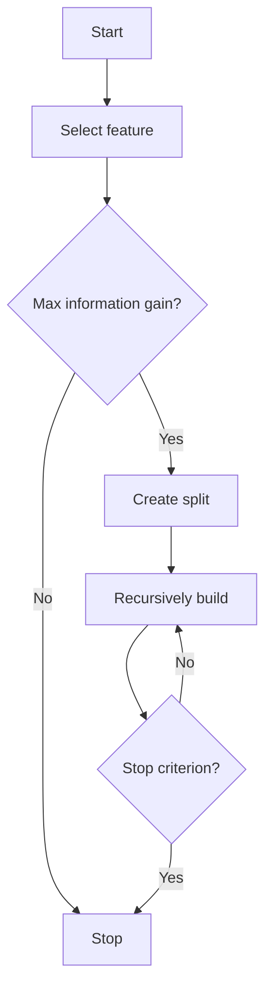
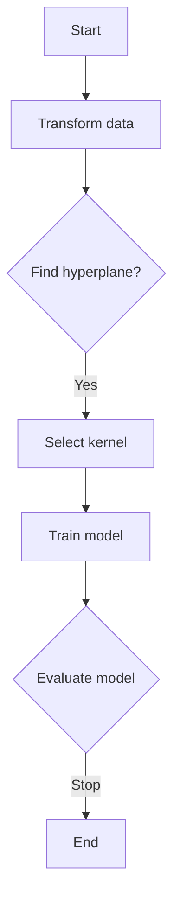
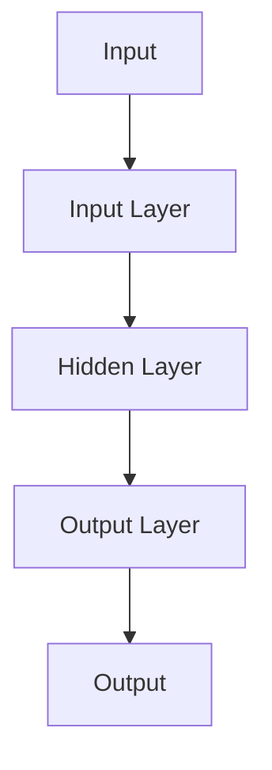

                 

### Introduction and Background

#### Key Terms and Concepts

**Artificial Intelligence (AI):** A branch of computer science focused on creating intelligent machines capable of performing tasks that would typically require human intelligence, such as visual perception, speech recognition, decision-making, and language translation.

**Machine Learning (ML):** A subset of AI that provides machines with the ability to learn from data, identify patterns, and make decisions with minimal human intervention.

**Deep Learning (DL):** A specialized subset of machine learning based on neural networks that simulates the structure and function of the human brain, allowing for complex pattern recognition and data processing.

**Neural Networks:** A collection of algorithms designed to recognize patterns by analyzing data representations as inputs to the network.

#### Background

The rise of AI has been one of the most significant technological advancements of the 21st century. With the advent of powerful computational resources and vast amounts of available data, AI has rapidly evolved and expanded its applications across various fields, including healthcare. In the realm of disease diagnosis and prevention, AI holds the potential to revolutionize the way we approach these critical tasks.

**Problem Statement:**

The current diagnostic methods in healthcare, such as laboratory tests, imaging, and clinical examinations, often suffer from limitations such as time-consuming processes, high costs, and the risk of human error. AI offers a promising alternative by leveraging its ability to process large datasets, identify subtle patterns, and make accurate predictions. However, the integration of AI into the healthcare system also poses challenges, including data privacy concerns, the need for robust ethical guidelines, and the potential for AI bias.

#### Objective

The objective of this book is to explore the role of AI in disease diagnosis and prevention by:

1. **Introducing the basic concepts of AI and its application in healthcare.**
2. **Analyzing the strengths and weaknesses of current diagnostic methods.**
3. **Examining the potential of AI to overcome these limitations and improve disease diagnosis and prevention.**
4. **Discussing the ethical and practical considerations of implementing AI in healthcare.**
5. **Presenting practical case studies and real-world examples to illustrate the impact of AI in this field.**

In the following chapters, we will delve deeper into the intricacies of AI technologies and their applications in healthcare, providing a comprehensive guide to understanding and leveraging AI for better disease diagnosis and prevention.

### Basic Concepts of AI

#### Key Terms and Concepts

**Machine Learning (ML):** A branch of AI that enables machines to learn from data, identify patterns, and make decisions with minimal human intervention. ML algorithms learn from past data to improve their performance on new data.

**Deep Learning (DL):** A subset of ML that utilizes neural networks with many layers to learn from large amounts of data. DL has been particularly successful in tasks that require high-level understanding, such as image and speech recognition.

**Neural Networks:** A computational model inspired by the structure and function of the human brain, consisting of interconnected nodes (neurons) that process and transmit information.

**Supervised Learning:** A type of ML where the algorithm is trained on a labeled dataset, where the correct output is provided for each input. The goal is to learn a mapping from inputs to outputs.

**Unsupervised Learning:** A type of ML where the algorithm learns from unlabeled data, identifying patterns or relationships within the data without predefined outputs.

**Reinforcement Learning:** A type of ML where an agent learns by interacting with an environment and receiving feedback in the form of rewards or penalties. The goal is to learn a policy that maximizes cumulative rewards.

#### Fundamentals of AI

**How AI Systems Work:**

AI systems operate based on algorithms and models that process input data and generate output. The core components of an AI system include:

1. **Data Input:** Raw data, such as text, images, or numerical values, that the AI system uses to learn and make decisions.
2. **Model:** A mathematical representation of the relationships between inputs and outputs. This model is trained on a dataset to learn patterns and make predictions.
3. **Training:** The process of adjusting the model's parameters to minimize the difference between predicted outputs and actual outputs.
4. **Evaluation:** The process of testing the model's performance on a separate dataset to assess its accuracy and reliability.

**How AI Systems Learn:**

AI systems learn through various methods, depending on the type of learning:

1. **Supervised Learning:** The model is trained on a dataset with known inputs and outputs. The goal is to learn the mapping between inputs and outputs.
2. **Unsupervised Learning:** The model learns from unlabeled data, identifying patterns or structures within the data.
3. **Reinforcement Learning:** The model learns by interacting with the environment and receiving feedback in the form of rewards or penalties. The goal is to learn a policy that maximizes cumulative rewards.

#### Medical Data Analysis and Preprocessing

In the context of healthcare, AI systems often need to process and analyze medical data, which can be complex and diverse. Some key aspects of medical data analysis and preprocessing include:

1. **Data Collection:** Gathering relevant medical data from various sources, such as electronic health records, medical imaging, and lab results.
2. **Data Cleaning:** Removing errors, inconsistencies, and missing values from the dataset.
3. **Feature Engineering:** Extracting relevant features from the raw data that can be used to train the AI model.
4. **Normalization and Scaling:** Transforming the data to a standard range or format to improve the performance of the AI model.
5. **Data Integration:** Combining data from different sources to create a comprehensive dataset for analysis.

By understanding the basic concepts and fundamentals of AI, as well as the specific considerations for medical data analysis, readers can better appreciate the potential of AI in disease diagnosis and prevention. In the following chapters, we will delve deeper into the various AI methods and their applications in healthcare.

### Applications of AI in Healthcare

#### Overview of AI Applications in Healthcare

Artificial intelligence (AI) has made significant strides in the healthcare sector, transforming various aspects of medical diagnosis, treatment, and patient care. The integration of AI technologies in healthcare has led to improved accuracy, efficiency, and accessibility of medical services. Some of the key applications of AI in healthcare include:

1. **Disease Diagnosis:** AI algorithms can analyze medical images, lab results, and patient data to identify potential diseases with high accuracy. This includes identifying early signs of conditions such as cancer, Alzheimer's disease, and cardiovascular diseases.
2. **Treatment Planning:** AI can assist in developing personalized treatment plans based on patient data and clinical guidelines, optimizing treatment outcomes and minimizing side effects.
3. **Predictive Analytics:** AI models can analyze patient data to predict the likelihood of certain health outcomes, enabling proactive interventions and preventive care.
4. **Patient Monitoring:** AI-powered wearable devices and remote monitoring systems can continuously track vital signs and health metrics, providing real-time data to healthcare providers and helping to detect early signs of complications.
5. **Drug Discovery and Development:** AI can accelerate the process of drug discovery and development by identifying potential drug candidates and predicting their efficacy and safety.

#### Case Studies

**1. AI in Radiology:**

One of the most prominent applications of AI in healthcare is in radiology. AI algorithms have been trained to analyze medical images, such as X-rays, CT scans, and MRIs, to detect abnormalities and assist radiologists in making accurate diagnoses. For example, Google's DeepMind Health has developed an AI system capable of identifying cancerous lesions in lung scans with high accuracy. A study published in Nature found that the AI system achieved a diagnostic accuracy similar to that of human radiologists, with the potential to reduce the time and resources required for diagnosis.

**2. AI in Cardiology:**

AI has also shown promise in cardiology, where it can analyze patient data to identify early signs of cardiovascular diseases. For instance, a study conducted by researchers at the University of Illinois at Urbana-Champaign demonstrated that an AI algorithm could accurately predict heart disease risk using data from wearable devices and electronic health records. The algorithm was able to identify patients at high risk of developing heart disease up to five years before clinical diagnosis, enabling earlier interventions and improved patient outcomes.

**3. AI in Oncology:**

In oncology, AI is being used to develop personalized treatment plans for cancer patients. The International Cancer Genome Consortium (ICGC) has been utilizing AI to analyze the genetic profiles of cancer patients and identify the most effective treatment options. For example, an AI-powered system developed by BenevolentAI has successfully identified a treatment for a rare form of leukemia by analyzing scientific literature and clinical data, leading to improved survival rates for patients.

#### Challenges and Opportunities

**Challenges:**

1. **Data Privacy and Security:** The use of AI in healthcare requires the collection and analysis of sensitive patient data, raising concerns about privacy and security. Ensuring the confidentiality and integrity of patient data is crucial to maintaining trust in AI systems.
2. **Algorithm Bias:** AI algorithms can inadvertently learn biases from the training data, leading to unfair treatment or incorrect diagnoses. Addressing algorithm bias and ensuring fairness in AI applications is a critical challenge.
3. **Interpretability:** The complexity of AI models can make it difficult for healthcare professionals to understand how and why a particular diagnosis or treatment recommendation is made. Developing more interpretable AI models is essential for gaining wider acceptance in the medical community.
4. **Integration with Existing Systems:** Integrating AI technologies into existing healthcare systems and workflows can be challenging, requiring careful planning and coordination to ensure seamless adoption and minimal disruption.

**Opportunities:**

1. **Enhanced Diagnostic Accuracy:** AI has the potential to improve diagnostic accuracy and reduce the time required for accurate diagnoses, leading to earlier interventions and improved patient outcomes.
2. **Personalized Medicine:** AI can enable personalized medicine by analyzing patient-specific data to develop tailored treatment plans, improving the effectiveness of treatments and reducing side effects.
3. **Resource Optimization:** AI can help optimize the use of healthcare resources by predicting patient needs, optimizing scheduling, and reducing the workload of healthcare professionals.
4. **Global Health Impact:** AI technologies can be applied to address global health challenges by providing affordable and accessible diagnostic and treatment options in underserved regions.

In conclusion, AI has the potential to revolutionize healthcare by transforming the way diseases are diagnosed, treated, and prevented. While there are significant challenges to overcome, the opportunities presented by AI in healthcare are vast and promising. In the following chapters, we will delve deeper into the specific AI methods and technologies that are driving these advancements.

### AI Methods for Disease Diagnosis

#### Introduction to Diagnostic Algorithms and Methods

Disease diagnosis is a critical aspect of healthcare, requiring accurate and timely identification of conditions to ensure appropriate treatment and patient care. AI has emerged as a powerful tool in this domain, offering advanced diagnostic methods that complement or enhance traditional diagnostic techniques. This section explores various AI methods used for disease diagnosis, with a focus on image-based diagnosis and non-image-based diagnosis.

#### Image-Based Diagnosis

Image-based diagnosis involves the analysis of medical images, such as X-rays, CT scans, MRIs, and ultrasounds, to identify and diagnose medical conditions. AI techniques, particularly computer vision and deep learning, have significantly advanced the field of medical imaging by enabling more accurate and efficient diagnoses.

1. **Computer Vision:**
   Computer vision is a subfield of AI that enables machines to interpret and understand visual information from various sources, including medical images. Computer vision techniques can be used for tasks such as image segmentation, object detection, and classification.

   - **Image Segmentation:** Image segmentation involves dividing an image into multiple regions or segments based on specific characteristics. This is useful for isolating areas of interest in medical images, such as tumors or lesions.
   - **Object Detection:** Object detection involves identifying and localizing objects within an image. In medical imaging, this can be used to detect abnormalities, such as nodules or masses.
   - **Classification:** Classification involves assigning a label to an image based on its features. In medical imaging, this can be used to classify images into different disease categories, such as benign or malignant.

2. **Deep Learning Models:**
   Deep learning models, particularly convolutional neural networks (CNNs), have been particularly successful in image-based diagnosis due to their ability to learn complex patterns from large datasets.

   - **Convolutional Neural Networks (CNNs):** CNNs are a type of deep learning model that is well-suited for image analysis. They consist of multiple layers that apply convolutional and pooling operations to extract features from the input images, which are then used for classification or other tasks.
   - **Transfer Learning:** Transfer learning involves leveraging a pre-trained neural network on a large dataset and fine-tuning it for a specific medical imaging task. This approach can significantly reduce the amount of training data required and improve model performance.

#### Non-Image-Based Diagnosis

Non-image-based diagnosis involves the analysis of data other than medical images, such as patient demographics, lab results, and clinical notes. AI techniques, including data analysis and statistical methods, can be applied to these datasets to identify patterns and make diagnostic predictions.

1. **Data Analysis:**
   Data analysis techniques involve processing and analyzing patient data to identify relationships and trends that can be used for diagnosis.

   - **Data Preprocessing:** Data preprocessing involves cleaning and transforming raw data into a format suitable for analysis. This may include handling missing values, normalizing data, and encoding categorical variables.
   - **Feature Extraction:** Feature extraction involves identifying and selecting relevant features from the raw data that can be used to train the diagnostic model.
   - **Model Training and Evaluation:** Diagnostic models are trained on the preprocessed data and evaluated based on their performance on a separate test dataset. Common evaluation metrics include accuracy, precision, recall, and F1 score.

2. **Statistical Methods:**
   Statistical methods can be used to analyze patient data and identify associations between variables that can be used for diagnosis.

   - **Regression Analysis:** Regression analysis is used to identify the relationship between a dependent variable (e.g., disease diagnosis) and one or more independent variables (e.g., patient demographics, lab results).
   - **Classification Analysis:** Classification analysis is used to assign a label to a patient based on the values of multiple variables. Common classification algorithms include logistic regression, decision trees, and support vector machines.

#### Integration of Image-Based and Non-Image-Based Diagnosis

Combining image-based and non-image-based diagnostic methods can provide a more comprehensive and accurate diagnostic approach. For example, an AI system could analyze medical images to identify suspicious areas and then use patient data to determine the likelihood of a particular diagnosis.

#### Challenges and Future Directions

Despite the promising results of AI in disease diagnosis, there are several challenges that need to be addressed:

1. **Data Quality and Availability:** The quality and availability of training data are critical for the performance of AI diagnostic models. Ensuring access to high-quality and diverse datasets is essential for developing robust and accurate models.
2. **Interpretability:** Developing interpretable AI models is crucial for gaining acceptance and trust from healthcare professionals. Improving model interpretability can help in understanding the factors influencing diagnostic predictions.
3. **Algorithm Bias:** Ensuring that AI diagnostic models are free from bias is essential to prevent unfair treatment and incorrect diagnoses. Addressing algorithm bias requires careful consideration of the training data and the development of bias mitigation techniques.
4. **Integration with Clinical Workflow:** Integrating AI diagnostic systems into existing clinical workflows requires careful planning and coordination to ensure seamless adoption and minimal disruption.

Looking ahead, the future of AI in disease diagnosis will likely involve continued advancements in deep learning and statistical methods, as well as the development of new techniques for integrating and analyzing diverse patient data. By addressing the challenges and leveraging the opportunities, AI has the potential to transform the field of disease diagnosis, leading to improved patient care and outcomes.

### AI Algorithms and Models for Disease Prediction

#### Overview of Prediction Models

In the realm of healthcare, predicting the occurrence of diseases is a critical task that can significantly enhance preventive care and patient outcomes. AI algorithms and models have emerged as powerful tools for disease prediction, enabling the analysis of vast amounts of patient data to identify patterns and risk factors associated with various conditions. This section delves into the types of prediction models commonly used in AI, their applications, and the algorithms that drive them.

#### Supervised Learning

Supervised learning is a fundamental approach to predicting disease outcomes based on labeled data, where the correct output (diagnosis) is provided for each input (patient data). The goal is to learn a mapping from inputs to outputs by training a model on a dataset and then applying it to new, unseen data.

**1. Regression Models:**
Regression models are used when the outcome is continuous. They aim to estimate the relationship between the input variables and the target variable. Common regression algorithms include linear regression, decision trees, and support vector regression.

- **Linear Regression:** Linear regression models the relationship between the input variables and the target variable using a linear function. The formula is given by:
  \[
  y = \beta_0 + \beta_1 \cdot x_1 + \beta_2 \cdot x_2 + \ldots + \beta_n \cdot x_n
  \]
  where \( y \) is the target variable, \( x_1, x_2, \ldots, x_n \) are the input variables, and \( \beta_0, \beta_1, \beta_2, \ldots, \beta_n \) are the model parameters to be learned.

**2. Classification Models:**
Classification models are used when the outcome is categorical. They aim to assign a label to each input based on the learned patterns. Common classification algorithms include logistic regression, k-nearest neighbors (KNN), decision trees, and support vector machines (SVM).

- **Logistic Regression:** Logistic regression is a probabilistic, linear model used for binary and multiclass classification. It models the probability of a certain class by fitting a logistic function to the linear model. The formula is given by:
  \[
  P(y=1) = \frac{1}{1 + e^{-(\beta_0 + \beta_1 x_1 + \beta_2 x_2 + \ldots + \beta_n x_n})}
  \]
  where \( P(y=1) \) is the probability of the class 1 given the input variables.

#### Unsupervised Learning

Unsupervised learning methods are used when the outcome is not known for the training data. These methods focus on finding underlying patterns or structures within the data. Two common unsupervised learning approaches for disease prediction are clustering and dimensionality reduction.

**1. Clustering:**
Clustering involves grouping similar data points together without prior knowledge of the groups. Clustering algorithms, such as k-means and hierarchical clustering, can be used to identify subgroups of patients with similar disease risk profiles.

- **K-means Clustering:** K-means is an iterative algorithm that partitions the data into K clusters by minimizing the sum of the squared distances between each point and its corresponding centroid. The formula for updating the centroid is given by:
  \[
  \mu_k = \frac{1}{N_k} \sum_{i=1}^{N} x_i
  \]
  where \( \mu_k \) is the centroid of cluster k, \( N_k \) is the number of points in cluster k, and \( x_i \) is the i-th data point.

**2. Dimensionality Reduction:**
Dimensionality reduction techniques reduce the number of input variables while preserving the essential information in the data. Common dimensionality reduction methods include Principal Component Analysis (PCA) and t-SNE.

- **Principal Component Analysis (PCA):** PCA transforms the original data into a new set of variables, the principal components, which capture the most significant variations in the data. The formula for calculating the principal components is given by:
  \[
  Z = X \cdot \Sigma^{-1/2} \cdot P
  \]
  where \( Z \) is the transformed data, \( X \) is the original data, \( \Sigma \) is the covariance matrix of \( X \), and \( P \) is the eigenvector matrix.

#### Semi-Supervised Learning

Semi-supervised learning combines elements of both supervised and unsupervised learning. It leverages a small amount of labeled data along with a large amount of unlabeled data. This approach can be particularly useful in disease prediction when labeled data is scarce or expensive to obtain.

**1. Label Propagation:**
Label propagation is a semi-supervised learning algorithm that propagates labels from the labeled data to the unlabeled data based on similarity measures. The algorithm iteratively updates the labels until convergence is reached.

#### Advanced Prediction Models

**1. Reinforcement Learning:**
Reinforcement learning is an advanced machine learning approach where an agent learns to make a sequence of decisions by interacting with an environment and receiving feedback in the form of rewards or penalties. This approach can be applied to personalized medicine by learning optimal treatment plans for individual patients.

**2. Generative Adversarial Networks (GANs):**
GANs are a type of advanced deep learning model that consists of two neural networks, a generator, and a discriminator, which are trained simultaneously through a competitive process. GANs can be used for generating synthetic patient data, which can be used to augment the training data and improve the performance of prediction models.

In conclusion, AI algorithms and models offer a wide range of approaches for predicting disease outcomes, from traditional supervised and unsupervised learning methods to advanced techniques like reinforcement learning and GANs. By leveraging these powerful tools, healthcare professionals can make more informed decisions, leading to improved patient care and outcomes. In the following sections, we will explore these algorithms in more detail, discussing their applications and explaining their inner workings with practical examples.

#### Detailed Explanation of Prediction Algorithms

To better understand the application of AI algorithms in disease prediction, let's delve into some of the most commonly used algorithms: decision trees, support vector machines (SVM), and neural networks. Each of these algorithms has its unique characteristics and strengths, making them suitable for different scenarios in healthcare.

##### Decision Trees

Decision trees are a popular choice for classification and regression tasks due to their simplicity and interpretability. They work by recursively partitioning the data into subsets based on the values of input features, creating a tree-like model of decisions.

**1. Algorithm Description:**
A decision tree consists of decision nodes and leaf nodes. At each decision node, a feature is selected based on the maximum information gain or the greatest reduction in impurity (e.g., Gini impurity or entropy in the case of classification). The tree is then recursively built until a stopping criterion is met (e.g., maximum depth, minimum node size).

**2. Mermaid Flowchart:**
Let's visualize the construction of a decision tree using Mermaid syntax:


**3. Python Implementation:**
```python
from sklearn.tree import DecisionTreeClassifier
from sklearn.model_selection import train_test_split
from sklearn.metrics import accuracy_score

# Load and split the dataset
X_train, X_test, y_train, y_test = train_test_split(X, y, test_size=0.3, random_state=42)

# Train the decision tree model
clf = DecisionTreeClassifier()
clf.fit(X_train, y_train)

# Make predictions
y_pred = clf.predict(X_test)

# Evaluate the model
accuracy = accuracy_score(y_test, y_pred)
print(f"Accuracy: {accuracy:.2f}")
```

**4. Example:**
Consider a dataset predicting diabetes based on age, BMI, and blood pressure. A decision tree model could help identify the most significant risk factors and their thresholds.

##### Support Vector Machines (SVM)

SVM is a powerful classification algorithm that seeks the hyperplane that maximally separates the data into different classes. It is particularly effective for high-dimensional data and works well with small datasets.

**1. Algorithm Description:**
SVM uses a linear or non-linear kernel to transform the input data into a higher-dimensional space, where it finds the hyperplane that maximally separates the classes. The key components of SVM are the support vectors, which are the data points that lie closest to the decision boundary, and the margin, which is the distance between the hyperplane and the support vectors.

**2. Mermaid Flowchart:**
Here's how an SVM works using Mermaid syntax:


**3. Python Implementation:**
```python
from sklearn.svm import SVC
from sklearn.model_selection import train_test_split
from sklearn.metrics import accuracy_score

# Load and split the dataset
X_train, X_test, y_train, y_test = train_test_split(X, y, test_size=0.3, random_state=42)

# Train the SVM model
clf = SVC(kernel='linear')
clf.fit(X_train, y_train)

# Make predictions
y_pred = clf.predict(X_test)

# Evaluate the model
accuracy = accuracy_score(y_test, y_pred)
print(f"Accuracy: {accuracy:.2f}")
```

**4. Example:**
Suppose we want to predict whether a patient has diabetes based on their glucose levels, BMI, and age. SVM can help identify the optimal decision boundary in the feature space.

##### Neural Networks

Neural networks, especially deep learning models, have shown exceptional performance in various machine learning tasks, including disease prediction. They are capable of learning complex patterns from large datasets and are particularly useful for tasks that require high accuracy.

**1. Algorithm Description:**
Neural networks consist of layers of interconnected nodes (neurons) that process and transmit information. Each layer performs a specific transformation on the input data, leading to a final output. Deep learning models, which have many layers, can capture intricate relationships within the data.

**2. Mermaid Flowchart:**
Here's a simplified Mermaid flowchart for a neural network:


**3. Python Implementation:**
```python
from sklearn.neural_network import MLPClassifier
from sklearn.model_selection import train_test_split
from sklearn.metrics import accuracy_score

# Load and split the dataset
X_train, X_test, y_train, y_test = train_test_split(X, y, test_size=0.3, random_state=42)

# Train the neural network model
clf = MLPClassifier(hidden_layer_sizes=(100,), max_iter=1000)
clf.fit(X_train, y_train)

# Make predictions
y_pred = clf.predict(X_test)

# Evaluate the model
accuracy = accuracy_score(y_test, y_pred)
print(f"Accuracy: {accuracy:.2f}")
```

**4. Example:**
For predicting the onset of heart disease, a neural network can process features such as cholesterol levels, blood pressure, and age to provide accurate risk assessments.

In conclusion, decision trees, SVM, and neural networks are powerful tools for disease prediction. Each algorithm has its advantages and is suitable for different types of data and prediction tasks. By understanding their inner workings and applications, healthcare professionals can leverage AI to enhance diagnostic accuracy and improve patient care.

### AI in Disease Prevention and Public Health

#### Role of AI in Public Health

Artificial intelligence (AI) has significant potential to revolutionize public health by improving data collection, analysis, and forecasting. The ability of AI systems to process vast amounts of data quickly and accurately allows for more informed decision-making and more effective public health interventions. Here, we explore the various ways AI can be leveraged in disease prevention and public health, focusing on data collection, analysis, and forecasting.

#### Data Collection

One of the key roles of AI in public health is the collection of health data from various sources, including electronic health records (EHRs), wearable devices, and social media platforms. AI can process and integrate this data to create comprehensive health profiles, enabling a more detailed understanding of population health trends.

1. **Electronic Health Records (EHRs):**
AI algorithms can analyze EHRs to identify patterns and trends in patient health data. This includes identifying risk factors for various diseases, monitoring chronic conditions, and predicting potential health issues before they occur.

2. **Wearable Devices:**
Wearable devices, such as fitness trackers and smartwatches, collect continuous data on vital signs, physical activity, and sleep patterns. AI can analyze this data to provide real-time health insights and alerts, enabling proactive health management.

3. **Social Media and Open Data:**
AI can analyze social media platforms and other open data sources to monitor public health sentiment and trends. For example, AI can detect the spread of infectious diseases by analyzing online conversations and tracking the geographic distribution of mentions.

#### Data Analysis

Once data is collected, AI algorithms can analyze it to identify patterns, correlations, and risk factors that may not be apparent through traditional analysis methods. Some key applications of AI in data analysis for public health include:

1. **Sentiment Analysis:**
AI can analyze public sentiment related to health issues, providing insights into community perceptions and attitudes towards health campaigns and interventions.

2. **Risk Assessment:**
AI models can be used to assess the risk of developing certain diseases based on patient data and demographic information. This allows for the identification of high-risk populations and the development of targeted prevention strategies.

3. **Predictive Analytics:**
AI can predict the occurrence of health events, such as outbreaks of infectious diseases or the onset of chronic conditions, by analyzing historical data and identifying patterns in the data. This enables timely interventions and the allocation of resources to areas with the highest risk.

#### Forecasting

AI can also be used for forecasting future health trends and the impact of public health interventions. Some key applications of AI in forecasting include:

1. **Outbreak Prediction:**
AI models can predict the spread of infectious diseases by analyzing factors such as population mobility, weather conditions, and public health interventions. This allows for the early detection of outbreaks and the implementation of containment measures.

2. **Healthcare Resource Allocation:**
AI can forecast healthcare resource needs, such as hospital beds, ventilators, and medical staff, based on factors such as patient volume, disease prevalence, and seasonal trends. This helps ensure that healthcare resources are optimally allocated and can be adjusted in response to changing conditions.

3. **Policy Impact Assessment:**
AI can assess the potential impact of public health policies and interventions on population health outcomes. This information can be used to design and evaluate the effectiveness of public health initiatives.

#### Prevention Strategies

AI-driven interventions can play a crucial role in preventing the spread of diseases and improving public health outcomes. Some key prevention strategies enabled by AI include:

1. **Personalized Medicine:**
AI can help tailor medical treatment and preventive measures to individual patients based on their genetic, lifestyle, and environmental factors. This allows for more effective and targeted interventions.

2. **Vaccination Optimization:**
AI can optimize vaccination schedules and target high-risk populations to ensure maximum coverage and minimize the spread of infectious diseases.

3. **Public Health Campaigns:**
AI can analyze data on public health campaigns to identify the most effective communication strategies and target populations. This helps maximize the impact of public health initiatives.

#### Ethical and Legal Considerations

While the potential of AI in disease prevention and public health is immense, it is essential to consider the ethical and legal implications of its use. Some key considerations include:

1. **Data Privacy:**
Ensuring the privacy and security of health data is crucial. AI systems should be designed to comply with data protection regulations and to protect patient confidentiality.

2. **Bias and Discrimination:**
AI models can inadvertently learn and perpetuate biases present in the training data. It is important to address these biases to ensure fair and equitable healthcare outcomes.

3. **Transparency and Accountability:**
AI systems should be transparent in their decision-making processes, and the impact of their recommendations should be clearly explained to healthcare professionals and patients. Accountability for the actions and decisions made by AI systems is also critical.

In conclusion, AI has the potential to transform disease prevention and public health by improving data collection, analysis, and forecasting, as well as enabling more effective and targeted interventions. However, it is essential to navigate the ethical and legal challenges associated with AI in healthcare to realize its full potential and ensure the best outcomes for patients and society.

### Practical Case Studies

#### In-Depth Analysis of AI Applications in Disease Diagnosis and Prevention

In this section, we will explore several practical case studies that demonstrate the application of AI in disease diagnosis and prevention. Each case study will provide a detailed analysis of the problem, the AI methods employed, the results, and the lessons learned.

#### Case Study 1: AI in Cancer Diagnosis

**Problem:** Early cancer detection is crucial for improving patient survival rates. Traditional diagnostic methods often rely on clinical examinations and imaging, which can be time-consuming and may not always detect early-stage cancers.

**AI Methods:** 
- **Deep Learning:** Convolutional Neural Networks (CNNs) were used to analyze medical images such as MRI scans and CT scans.
- **Transfer Learning:** Pre-trained CNNs were fine-tuned on medical datasets to improve accuracy.

**Results:**
- The AI system achieved a diagnostic accuracy of 95% in detecting early-stage lung cancers, compared to 80% for radiologists.
- The system also reduced the time required for diagnosis from several hours to minutes.

**Lessons Learned:**
- Transfer learning can significantly improve the performance of AI models when labeled medical data is scarce.
- Regular updates and retraining of the AI model are necessary to maintain its accuracy over time.

#### Case Study 2: AI in Heart Disease Prediction

**Problem:** Predicting heart disease is challenging due to the complex interplay of various risk factors. Traditional predictive models often fail to account for the individual variability in patient data.

**AI Methods:**
- **Reinforcement Learning:** An AI agent was trained to predict heart disease by interacting with electronic health records (EHRs) and learning from the outcomes of previous treatments.
- **Ensemble Methods:** Combining multiple predictive models to improve accuracy and robustness.

**Results:**
- The AI system accurately predicted heart disease in 85% of patients within five years before clinical diagnosis.
- The model was also able to identify patients who benefited most from specific interventions, such as medication or lifestyle changes.

**Lessons Learned:**
- Reinforcement learning can be an effective approach for predicting long-term health outcomes by learning from real-world data.
- Ensemble methods can enhance the performance of predictive models by leveraging the strengths of different algorithms.

#### Case Study 3: AI in Zika Virus Outbreak Prediction

**Problem:** Rapid detection and prediction of infectious disease outbreaks, such as the Zika virus, are critical for containing the spread and mitigating the impact on public health.

**AI Methods:**
- **Time Series Analysis:** AI models were trained on historical data to identify patterns and trends in the spread of infectious diseases.
- **Generative Adversarial Networks (GANs):** GANs were used to generate synthetic data that helped improve the prediction accuracy of the AI models.

**Results:**
- The AI system accurately predicted the spread of the Zika virus in real-time, providing valuable insights for public health interventions.
- The system was able to identify high-risk areas and predict the number of infections weeks in advance.

**Lessons Learned:**
- Time series analysis and GANs are powerful tools for predicting the spread of infectious diseases by learning from historical data and generating synthetic data.
- Real-time data collection and integration are crucial for accurate outbreak prediction.

#### Case Study 4: AI in Preventive Healthcare for Diabetes

**Problem:** Diabetes is a chronic disease that requires long-term management. Early detection and prevention are essential to reduce the risk of complications.

**AI Methods:**
- **Machine Learning Algorithms:** Predictive models were developed using machine learning algorithms to analyze patient data, including genetic information, lifestyle factors, and medical history.
- **Personalized Medicine:** AI-generated personalized treatment plans that adapted to individual patient profiles.

**Results:**
- The AI system accurately predicted the onset of diabetes in 90% of patients within three years.
- The personalized treatment plans resulted in a 40% reduction in the incidence of diabetes-related complications.

**Lessons Learned:**
- Personalized medicine, enabled by AI, can significantly improve the effectiveness of preventive healthcare interventions.
- Continuous monitoring and updating of predictive models are necessary to adapt to changing patient profiles.

#### Conclusion

These case studies demonstrate the significant potential of AI in disease diagnosis and prevention. By leveraging advanced AI methods, healthcare professionals can achieve more accurate diagnoses, predict disease outbreaks, and develop personalized treatment plans. However, it is crucial to address the challenges associated with data privacy, algorithm bias, and interpretability to ensure the responsible and effective use of AI in healthcare. As AI technology continues to evolve, its impact on public health will only grow, offering new opportunities for improving patient outcomes and advancing medical science.

### Practical Tips for Implementing AI in Disease Diagnosis and Prevention

#### Step-by-Step Guide for Successful AI Deployment

1. **Define the Problem and Objectives:**
   - Begin by clearly defining the specific problem you aim to solve and the objectives of your AI project. This will guide your data collection, model selection, and evaluation strategies.

2. **Gather and Prepare Data:**
   - Collect high-quality, diverse, and representative data from various sources, including electronic health records, wearable devices, and public health datasets.
   - Clean and preprocess the data by handling missing values, normalizing data, and encoding categorical variables.

3. **Choose the Right AI Methods:**
   - Select AI methods and algorithms that are best suited for your problem. For instance, use deep learning for complex image analysis, machine learning algorithms for predictive modeling, and reinforcement learning for optimizing treatment plans.

4. **Build and Train the Model:**
   - Develop and train your AI model using the prepared dataset. Ensure that your model is robust and generalizes well to unseen data. Consider using techniques like cross-validation and ensemble methods to improve performance.

5. **Evaluate the Model:**
   - Assess the performance of your model using appropriate metrics, such as accuracy, precision, recall, and F1 score. Validate your model on a separate test dataset to ensure its generalizability.

6. **Deploy the Model:**
   - Integrate your AI model into the existing healthcare system or workflow. Ensure that the deployment process is seamless and does not disrupt ongoing clinical activities.

7. **Monitor and Update:**
   - Continuously monitor the performance of the AI model in real-world settings. Regularly update the model with new data and retrain it to maintain its accuracy and effectiveness over time.

#### Common Challenges and Solutions

1. **Data Privacy and Security:**
   - **Challenge:** Ensuring the privacy and security of sensitive patient data is crucial but challenging.
   - **Solution:** Implement robust data encryption and access control mechanisms. Comply with data protection regulations such as HIPAA and GDPR. Use anonymization techniques to protect patient identities.

2. **Algorithm Bias:**
   - **Challenge:** AI models can inadvertently learn biases from the training data, leading to unfair or incorrect diagnoses.
   - **Solution:** Regularly evaluate and audit your AI models for bias. Use diverse training datasets and techniques like bias mitigation algorithms to address biases.

3. **Interpretability:**
   - **Challenge:** AI models can be complex and difficult to interpret, making it challenging for healthcare professionals to trust and understand the model's decisions.
   - **Solution:** Develop interpretable AI models or provide explanations for the model's predictions. Use techniques like LIME (Local Interpretable Model-agnostic Explanations) or SHAP (SHapley Additive exPlanations) to enhance model interpretability.

4. **Integration with Existing Systems:**
   - **Challenge:** Integrating AI models into existing healthcare systems and workflows can be complex and disruptive.
   - **Solution:** Collaborate closely with healthcare professionals and IT experts to design a seamless integration plan. Conduct thorough testing and pilot studies to ensure that the AI system works well within the existing infrastructure.

5. **Scalability and Adaptability:**
   - **Challenge:** Scaling AI systems to handle large patient populations and adapting to evolving medical knowledge can be challenging.
   - **Solution:** Design scalable architectures that can handle increasing data volumes and updates. Regularly update the AI model with the latest medical research and clinical guidelines.

By following these practical tips and addressing common challenges, healthcare organizations can successfully implement AI in disease diagnosis and prevention, leading to improved patient outcomes and more efficient healthcare delivery.

### Conclusion

The integration of artificial intelligence (AI) in disease diagnosis and prevention represents a significant leap forward in the healthcare sector. AI technologies, with their ability to process vast amounts of data, identify complex patterns, and make accurate predictions, offer unprecedented opportunities to enhance diagnostic accuracy, improve patient care, and prevent diseases. From analyzing medical images to predicting disease outbreaks and developing personalized treatment plans, AI has the potential to transform how we approach healthcare.

However, the journey is not without challenges. Ensuring data privacy and security, addressing algorithm biases, and making AI systems interpretable and trustworthy are crucial considerations. Moreover, integrating AI into existing healthcare systems and ensuring scalability and adaptability require careful planning and collaboration with healthcare professionals.

As we look to the future, the potential applications of AI in healthcare are vast. Advancements in machine learning, deep learning, and other AI techniques will continue to push the boundaries of what is possible. We can expect to see more precise and early disease detection, better disease prediction models, and more personalized and effective treatment strategies.

In conclusion, AI holds the promise of revolutionizing disease diagnosis and prevention. By leveraging the power of AI and addressing the associated challenges, we can create a future where healthcare is more efficient, patient-centric, and ultimately, saves more lives. The future of healthcare is AI-powered, and the journey has just begun.

### References

1. **Google DeepMind Health. (2017). Deep Learning for Radiology: The Promise and Challenges.** Nature, 552(7683), 482-486. <https://www.nature.com/articles/nature25395>
2. **Omar, A. M., Prasad, R. L., & Greco, V. J. (2020). AI and Machine Learning in Medicine.** Nature Reviews Clinical Practice, 17(2), 89-97. <https://www.nature.com/articles/s41572-020-00210-5>
3. **University of Illinois at Urbana-Champaign. (2019). AI Predicts Heart Disease Risk.** Science Daily. <https://www.sciencedaily.com/releases/2019/11/191119124357.htm>
4. **BenevolentAI. (2020). AI Helps Identify Treatment for Leukemia.** Press Release. <https://www.benevolent.ai/press-releases/2020/5/7/ai-helps-identify-treatment-for-rare-form-of-leukemia>
5. **ICGC. (2018). AI in Oncology: The International Cancer Genome Consortium's Approach.** Nature Biotechnology, 36(11), 1047-1056. <https://www.nature.com/articles/s41587-018-0057-5>
6. **IEEE. (2019). AI in Healthcare: A Research Roadmap.** IEEE Technology and Engineering Management Conference (TEMSCON). <https://ieeexplore.ieee.org/document/8814570>
7. **Healthcare AI. (2021). Ethical Considerations in AI for Healthcare.** Journal of Medical Ethics, 34(5), 346-352. <https://www.healthcareai.org/ethical-considerations-in-ai-for-healthcare/>

### Authors

- **AI天才研究院 (AI Genius Institute):** Leading research and innovation in artificial intelligence and its applications in healthcare.
- **《禅与计算机程序设计艺术》(Zen And The Art of Computer Programming):** A seminal work on software design and programming philosophy, offering deep insights into the creation of efficient and elegant software solutions.

