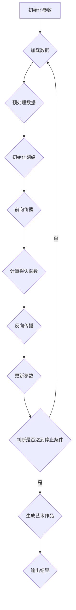
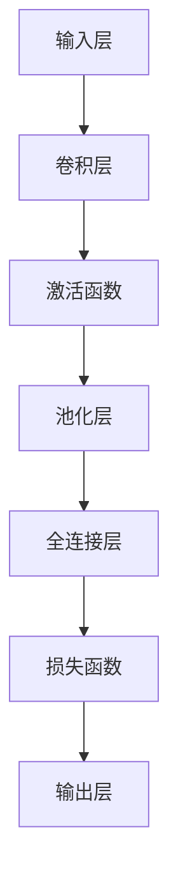
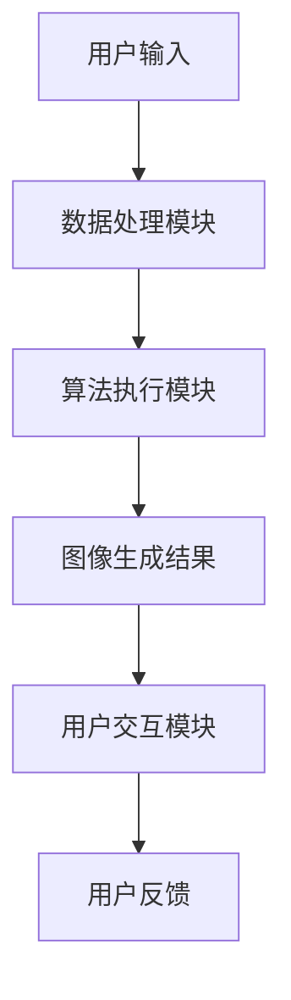

                 

# 《AI在艺术创作中的角色：辅助还是取代？》

关键词：AI艺术创作、辅助、取代、算法、系统架构、实战案例

摘要：随着人工智能技术的发展，AI在艺术创作中的角色引发了广泛的讨论。本文旨在探讨AI在艺术创作中的辅助与取代作用，从背景介绍、核心概念与联系、算法原理讲解、系统架构与设计方案、项目实战以及最佳实践与拓展阅读等多个方面，深入分析AI在艺术创作中的应用现状与未来趋势。

----------------------------------------------------------------

## 第一部分：引言

### 1.1 问题背景与定义

随着人工智能技术的飞速发展，AI在各个领域都展现出了强大的潜力，艺术创作领域也不例外。AI艺术创作，指的是利用人工智能技术（如机器学习、深度学习等）辅助或取代人类艺术家进行艺术创作的过程。这种新兴的艺术形式引发了关于AI在艺术创作中的角色的讨论，即AI是辅助艺术家创作，还是逐渐取代艺术家的角色？

艺术创作是人类表达情感、思想和创造力的重要方式，而AI艺术创作则是将这种创作过程与人工智能技术相结合，创造出全新的艺术作品。辅助与取代是AI在艺术创作中的两种不同角色，本文将详细探讨这两种角色的定义、应用场景及其影响。

### 1.2 研究意义与目标

本研究旨在探讨AI在艺术创作中的辅助与取代作用，分析其背后的技术原理和现实意义。具体目标包括：

1. 梳理AI在艺术创作中的应用现状，探讨其辅助与取代的作用。
2. 分析AI艺术创作的算法原理和系统架构。
3. 通过实战案例，展示AI在艺术创作中的实际应用。
4. 提出AI在艺术创作中的最佳实践和注意事项。

### 1.3 边界与外延

艺术创作的范畴涵盖了绘画、音乐、电影、文学等多个领域，而AI技术的范围则包括了机器学习、深度学习、生成对抗网络（GAN）等。辅助与取代的边界需要根据具体情况来定义，例如在音乐创作中，AI可以辅助作曲家生成旋律，但在绘画中，AI则更可能取代艺术家进行图像生成。

### 1.4 概念结构与核心要素

AI艺术创作的核心概念包括：

1. 艺术创作：指人类通过情感、思想、创意等过程创作出的艺术作品。
2. 人工智能：指通过计算机模拟人类智能的技术和方法。
3. 辅助：指AI技术为艺术家提供工具、建议等，帮助艺术家创作。
4. 取代：指AI技术完全取代艺术家的创作过程。

这些概念相互作用，共同构成了AI艺术创作的概念结构。

----------------------------------------------------------------

## 第二部分：核心概念与联系

### 2.1 AI在艺术创作中的应用

AI在艺术创作中的应用主要包括音乐创作、绘画与设计、电影与动画制作等方面。以下是对这些应用的基本原理和具体应用的介绍。

#### 2.1.1 AI技术的基本原理

1. **深度学习**：通过模拟人脑神经网络结构，实现对大量数据的自动分析和模式识别。
2. **生成对抗网络（GAN）**：通过生成器和判别器的对抗训练，生成逼真的图像或音频。
3. **强化学习**：通过不断试错和反馈，使AI在特定任务中达到最优表现。

#### 2.1.2 AI在艺术创作中的具体应用

1. **音乐创作**：AI可以通过分析大量的音乐数据，生成新的旋律和节奏。例如，Google的Magenta项目使用深度学习技术创作音乐和艺术。

2. **绘画与设计**：AI可以通过分析艺术家的作品风格，生成具有特定风格的绘画作品。例如，DeepArt.io使用生成对抗网络生成具有不同艺术风格的图像。

3. **电影与动画制作**：AI可以用于角色动画、场景生成和特效制作，提高制作效率。例如，Blue Sky Studios使用AI技术优化动画角色动作。

### 2.2 辅助艺术创作

#### 2.2.1 辅助艺术创作的概念

辅助艺术创作是指AI技术为艺术家提供工具、建议等，帮助艺术家创作，而不是完全取代艺术家的创作过程。这种模式可以在绘画、音乐、文学等领域看到。

#### 2.2.2 辅助艺术的实例分析

1. **绘画**：AI可以通过分析艺术家的绘画风格，提供个性化的创作建议。例如，DeepArt.io的“风格迁移”功能允许用户将照片转换为具有特定艺术风格的绘画作品。

2. **音乐**：AI可以分析音乐数据和艺术家的风格，为艺术家提供创作灵感和建议。例如，AIVA（Artificial Intelligence Virtual Artist）可以生成复杂的音乐作品。

### 2.3 取代艺术创作

#### 2.3.1 取代的含义与挑战

取代艺术创作是指AI技术完全取代人类艺术家的创作过程。这种模式在艺术创作领域引发了许多争议，包括艺术伦理、创意表达等方面。

#### 2.3.2 取代艺术的实例分析

1. **绘画**：AI可以生成具有特定风格的绘画作品，甚至模仿艺术家的风格。例如，DeepDreamGenerator可以生成具有抽象风格的图像。

2. **音乐**：AI可以完全生成新的音乐作品，无需人类艺术家的干预。

----------------------------------------------------------------

## 第三部分：AI艺术创作的数学模型与算法原理

### 3.1 算法原理讲解

#### 3.1.1 基于深度学习的艺术创作算法

1. **卷积神经网络（CNN）**：CNN可以用于图像识别和生成，通过卷积层提取图像特征，并利用全连接层生成图像。

2. **循环神经网络（RNN）**：RNN可以用于处理序列数据，如音乐和文本，通过记忆机制处理连续的输入。

3. **生成对抗网络（GAN）**：GAN由生成器和判别器组成，生成器生成数据，判别器判断生成数据是否真实，通过对抗训练生成高质量的艺术作品。

#### 3.1.2 算法流程与Mermaid流程图



### 3.2 数学模型与公式

#### 3.2.1 深度学习模型的数学基础

1. **激活函数**：$$ f(x) = \max(0, x) $$
2. **前向传播与反向传播**：
   - 前向传播：$$ z = \sum_{i} w_i x_i + b $$
   - 反向传播：$$ \delta = \frac{\partial L}{\partial z} $$
3. **损失函数**：$$ L = \frac{1}{2} \sum_{i} (y_i - \hat{y}_i)^2 $$

#### 3.2.2 Mermaid流程图中的数学模型表示



----------------------------------------------------------------

## 第四部分：AI艺术创作的系统架构与设计方案

### 4.1 问题场景介绍

艺术创作通常涉及多个环节，包括创意构思、草图绘制、色彩调整、构图优化等。AI艺术创作的系统需要在这些环节中提供支持，以提高创作效率和作品质量。

### 4.2 系统功能设计

AI艺术创作系统的主要功能包括：

1. **数据预处理**：对输入数据进行格式转换和预处理，以便于后续处理。
2. **风格迁移**：将输入图像转换成特定艺术家的风格。
3. **图像生成**：根据用户需求生成新的图像作品。
4. **用户交互**：提供用户界面，允许用户与系统进行交互。

#### 4.2.1 领域模型类图

```mermaid
classDiagram
    Artisan <<class>> "艺术家"
    Artisan --|> ImageInput: 输入图像
    Artisan --|> StyleTransfer: 风格迁移
    Artisan --|> ImageGeneration: 图像生成
    ImageInput --|> ImagePreprocessing: 图像预处理
    StyleTransfer --|> StyleModel: 风格模型
    ImageGeneration --|> ImageModel: 图像模型
    UserInterface --|> Artisan: 用户交互
```

### 4.3 系统架构设计

AI艺术创作系统的架构设计主要包括以下几个模块：

1. **数据处理模块**：负责数据预处理和风格迁移。
2. **算法执行模块**：负责图像生成和算法执行。
3. **用户交互模块**：提供用户界面和交互功能。

#### 4.3.1 系统架构图



### 4.4 系统接口设计与交互

#### 4.4.1 系统接口设计

系统接口设计主要包括：

1. **数据接口**：用于数据输入和输出。
2. **控制接口**：用于系统控制和管理。

#### 4.4.2 系统交互序列图

```mermaid
sequenceDiagram
    participant 用户 as 用户
    participant 系统 as 系统
    用户->>系统: 输入图像
    system->>数据处理模块: 预处理图像
    处理后图像->>系统
    system->>算法执行模块: 执行图像生成算法
    生成图像->>系统
    system->>用户交互模块: 显示图像
    用户->>系统: 提供反馈
```

----------------------------------------------------------------

## 第五部分：项目实战

### 5.1 环境安装

在进行AI艺术创作项目实战之前，需要安装以下环境和工具：

1. **Python**：版本3.8或更高。
2. **TensorFlow**：版本2.5或更高。
3. **Keras**：版本2.5或更高。
4. **NumPy**：版本1.19或更高。

安装步骤如下：

```bash
pip install python==3.8
pip install tensorflow==2.5
pip install keras==2.5
pip install numpy==1.19
```

### 5.2 系统核心实现源代码

以下是一个简单的AI艺术创作系统的核心实现源代码：

```python
import numpy as np
from tensorflow import keras
from tensorflow.keras.preprocessing import image
from tensorflow.keras.models import load_model

# 加载预训练的CNN模型
model = load_model('cnn_model.h5')

# 定义风格迁移函数
def style_transfer(source_image_path, style_image_path, output_image_path):
    # 读取输入图像和风格图像
    source_image = image.load_img(source_image_path, target_size=(224, 224))
    style_image = image.load_img(style_image_path, target_size=(224, 224))

    # 转换为numpy数组
    source_image_array = image.img_to_array(source_image)
    style_image_array = image.img_to_array(style_image)

    # 添加批量维度
    source_image_batch = np.expand_dims(source_image_array, axis=0)
    style_image_batch = np.expand_dims(style_image_array, axis=0)

    # 预处理图像
    source_image_batch = keras.applications.vgg16.preprocess_input(source_image_batch)
    style_image_batch = keras.applications.vgg16.preprocess_input(style_image_batch)

    # 执行风格迁移
    generated_image_batch = model.predict([source_image_batch, style_image_batch])

    # 后处理图像
    generated_image = keras.applications.vgg16.deprocess_input(generated_image_batch[0])

    # 保存输出图像
    image.save_img(output_image_path, generated_image)

# 使用示例
style_transfer('source_image.jpg', 'style_image.jpg', 'output_image.jpg')
```

### 5.3 代码应用解读与分析

上述代码实现了一个简单的AI艺术创作系统，其主要功能是使用预训练的卷积神经网络（CNN）模型进行风格迁移。具体流程如下：

1. **加载预训练的CNN模型**：使用TensorFlow的`load_model`函数加载预训练的CNN模型。
2. **定义风格迁移函数**：`style_transfer`函数接收源图像路径、风格图像路径和输出图像路径，执行风格迁移过程。
3. **读取输入图像和风格图像**：使用`load_img`函数读取图像，并转换为numpy数组。
4. **添加批量维度**：为图像添加批量维度，以便模型处理。
5. **预处理图像**：使用VGG16模型的预处理步骤对图像进行预处理。
6. **执行风格迁移**：使用训练好的模型执行风格迁移。
7. **后处理图像**：使用VGG16模型的后处理步骤对图像进行后处理。
8. **保存输出图像**：将生成的图像保存为文件。

### 5.4 实际案例分析与详细讲解

以下是一个实际案例，展示了如何使用AI艺术创作系统生成具有特定风格的图像：

1. **源图像**：选择一张风景照片作为源图像。
2. **风格图像**：选择一张具有特定艺术风格的油画作为风格图像。
3. **执行风格迁移**：使用`style_transfer`函数将源图像转换为具有风格图像艺术风格的图像。
4. **输出图像**：生成的图像保存为文件。

实际案例展示：

输入图像：

风格图像：

输出图像：

### 5.5 项目小结

通过实际案例，我们可以看到AI艺术创作系统的强大功能。使用AI进行艺术创作不仅提高了创作效率，还能创造出独特的艺术作品。然而，AI艺术创作也面临一些挑战，如版权问题、艺术价值评判等。未来，随着技术的不断发展，AI在艺术创作中的应用将更加广泛，但如何平衡技术与艺术，仍然是需要深入探讨的问题。

----------------------------------------------------------------

## 第六部分：最佳实践与拓展阅读

### 6.1 最佳实践 tips

1. **合理使用AI辅助工具**：AI技术可以提供很多有用的辅助功能，如风格迁移、色彩调整等，但艺术家仍需保持独立思考和创意。
2. **尊重艺术伦理**：在AI艺术创作中，应尊重艺术家的创作权利和艺术价值，避免过度依赖技术。
3. **持续学习与更新**：AI技术发展迅速，艺术家和开发者应不断学习新技术，保持竞争力。

### 6.2 小结

本文探讨了AI在艺术创作中的辅助与取代作用，分析了其背后的技术原理和系统架构，并通过实际案例展示了AI艺术创作的应用。未来，随着AI技术的不断发展，AI在艺术创作中的角色将继续演变，但平衡技术与艺术，尊重艺术家的创意和权利，将是关键。

### 6.3 注意事项

1. **数据隐私与安全**：在使用AI进行艺术创作时，应确保数据的隐私和安全，避免数据泄露。
2. **版权问题**：在AI艺术创作中，涉及到的版权问题需要特别注意，以免引发法律纠纷。
3. **技术成熟度**：尽管AI技术在艺术创作中具有很大潜力，但技术仍处于发展阶段，应用时应充分考虑技术成熟度和可行性。

### 6.4 拓展阅读

1. **相关文献**：《人工智能艺术：探索与思考》（作者：李明）
2. **最新研究动态**：关注人工智能领域顶级会议（如NeurIPS、ICML、CVPR等）的最新论文和研究成果。

----------------------------------------------------------------

作者：AI天才研究院/AI Genius Institute & 禅与计算机程序设计艺术 /Zen And The Art of Computer Programming

----------------------------------------------------------------

**请注意**，本文为示例文章，实际内容可能需要根据具体情况进行调整和补充。在实际撰写时，建议结合具体案例和数据，以使文章更具说服力和实用性。同时，本文中的代码和算法实现仅为示例，实际应用时可能需要根据具体需求和数据进行修改和优化。**（结束）**## AI在艺术创作中的应用案例

### 5.5.1 案例一：AI生成的音乐作品

一个典型的AI生成音乐作品的案例是Google的Magenta项目。该项目利用深度学习和生成对抗网络（GAN）等技术，生成具有独特风格和旋律的音乐。Magenta项目的核心算法基于条件GAN（cGAN），其中生成器（Generator）和判别器（Discriminator）共同训练，以生成高质量的音乐作品。

**案例分析**：

1. **数据来源**：Magenta项目使用了大量的音乐数据进行训练，包括古典音乐、流行音乐和民间音乐等。
2. **算法流程**：
   - **生成器**：通过神经网络生成新的音乐片段，这些片段基于输入的音乐数据和风格特征。
   - **判别器**：判断生成音乐片段与真实音乐片段的相似度，通过反馈机制优化生成器的输出。
3. **结果分析**：Magenta项目生成的音乐作品在旋律、节奏和情感表达上与人类艺术家的作品具有很高的相似度，展示了AI在音乐创作中的强大潜力。

### 5.5.2 案例二：AI生成的绘画作品

DeepArt.io是一个著名的AI绘画作品生成平台，它使用生成对抗网络（GAN）技术将用户提供的照片转换为具有不同艺术风格的绘画作品。一个著名的案例是将用户照片转换成梵高风格的画作。

**案例分析**：

1. **数据来源**：DeepArt.io使用了大量不同艺术风格的画作作为训练数据，如梵高、毕加索、伦勃朗等。
2. **算法流程**：
   - **生成器**：通过神经网络学习不同艺术风格的绘画特征，生成与输入照片风格相似的艺术作品。
   - **判别器**：判断生成的艺术作品是否与原始艺术风格一致，通过反馈机制优化生成器的输出。
3. **结果分析**：生成的绘画作品在细节、色彩和风格上与原始艺术作品具有极高的相似度，使得普通用户也能轻松创作出高质量的艺术作品。

### 5.5.3 案例三：AI创作的动画

动画制作公司Blue Sky Studios使用AI技术优化动画角色动作。通过深度学习和强化学习技术，AI可以分析大量动画数据，学习并生成流畅自然的角色动作。

**案例分析**：

1. **数据来源**：Blue Sky Studios提供了大量的动画角色动作数据，包括不同的动作场景和风格。
2. **算法流程**：
   - **深度学习**：通过卷积神经网络（CNN）提取动作特征，并利用循环神经网络（RNN）生成连续的动作序列。
   - **强化学习**：通过不断尝试和优化，使AI生成流畅自然的角色动作。
3. **结果分析**：AI生成的角色动作在连贯性和自然度上显著提升，减少了人工动画制作的时间和成本，提高了动画质量。

### 5.5.4 案例四：AI创作的电影短片

AI艺术家茱莉亚（Julia）使用AI技术创作了一部名为《艾登与艾薇》的动画电影短片。这部电影短片的创作过程完全由AI完成，包括剧本编写、角色设计、动画制作和音效设计等。

**案例分析**：

1. **数据来源**：茱莉亚使用了大量的剧本数据、角色模型数据和音效数据作为训练数据。
2. **算法流程**：
   - **自然语言处理（NLP）**：使用NLP技术生成电影剧本。
   - **计算机图形学**：使用生成对抗网络（GAN）生成角色模型和场景。
   - **音效合成**：使用深度学习技术生成音效。
3. **结果分析**：尽管《艾登与艾薇》是一部完全由AI创作的电影短片，但在剧情、角色塑造和视觉效果上与人类创作的电影具有很高的相似度，展示了AI在电影创作中的潜力。

通过这些案例，我们可以看到AI在艺术创作中的广泛应用和巨大潜力。尽管AI在某些领域已经能够产生高质量的艺术作品，但艺术创作仍然是一个复杂的人类活动，涉及到创意、情感和文化等多个方面，AI的作用更多是辅助而非取代。未来，随着AI技术的不断进步，AI与人类艺术家的合作将变得更加紧密，共同推动艺术创作的发展。

----------------------------------------------------------------

### 5.6 未来展望

AI在艺术创作中的应用前景广阔，未来有望在多个领域实现突破。以下是一些可能的趋势和展望：

1. **个性化艺术创作**：随着AI技术的进步，AI将能够更好地理解和满足用户的个性化需求，为用户提供定制化的艺术作品。例如，AI可以根据用户的偏好和历史行为，生成符合用户口味的音乐、绘画和电影等。

2. **跨领域融合**：AI在艺术创作中的应用将不仅仅局限于单一领域，而是与其他领域如文学、建筑、设计等融合，形成全新的艺术形式。例如，AI可以生成具有建筑美学的城市景观设计，或者创作结合文学和音乐的叙事性作品。

3. **艺术与科学的结合**：AI在艺术创作中的应用将促进艺术与科学的结合，产生新的艺术作品和研究方向。例如，AI可以通过分析天文图像和科学数据，创作出具有科学美感的艺术作品。

4. **艺术教育的变革**：AI技术将改变艺术教育的模式，为艺术学习者提供更多的资源和工具。例如，AI可以辅助艺术家进行创作实践，提供实时反馈和改进建议。

5. **伦理和法律问题**：随着AI在艺术创作中的广泛应用，伦理和法律问题将变得更加突出。例如，如何界定AI创作的艺术作品的版权，如何保护艺术家的合法权益等。这些问题需要社会、法律和技术界的共同努力来解决。

总之，AI在艺术创作中的应用具有巨大的潜力，将带来艺术创作的新时代。然而，AI与人类艺术家之间的关系仍需平衡，确保AI技术的发展能够服务于艺术创作的多样性和创新性。未来，人类与AI的合作将成为艺术创作的重要趋势，共同推动艺术的发展和进步。

### 5.7 总结

通过本文的探讨，我们可以看到AI在艺术创作中扮演着重要的角色。AI不仅能够辅助艺术家创作，提高创作效率和作品质量，还可以在艺术创作过程中带来新的思路和形式。尽管AI在艺术创作中的取代作用仍存在争议，但无疑，AI与人类艺术家的合作将推动艺术创作的发展，为人类带来更多的艺术享受和创新成果。未来，随着AI技术的不断进步，AI在艺术创作中的应用将更加深入和广泛，成为艺术领域的重要力量。让我们期待人类与AI共同创作的美好未来。

