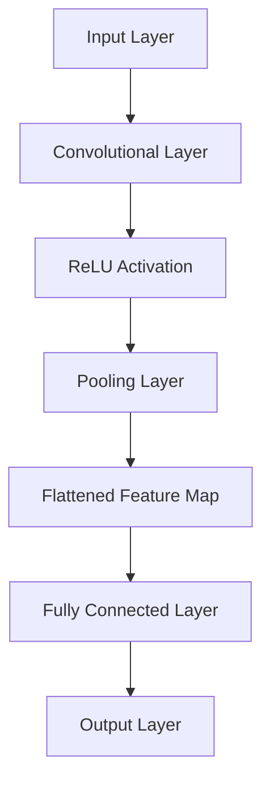
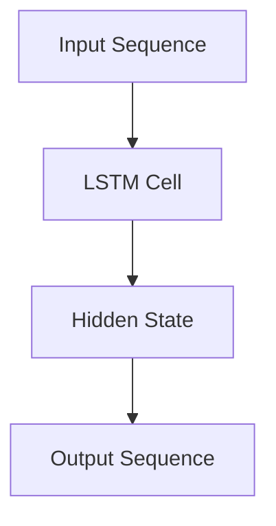
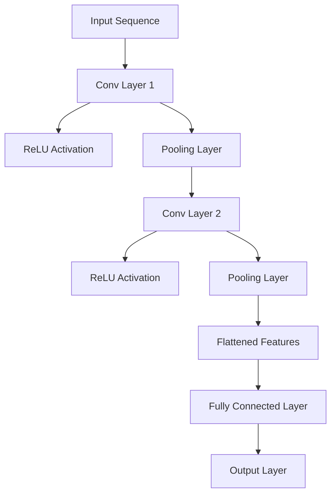
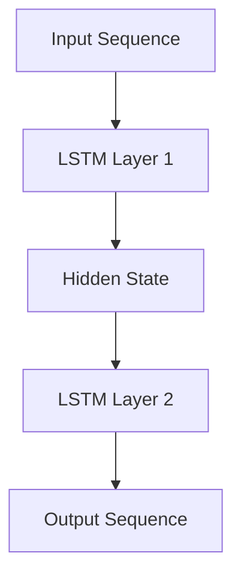
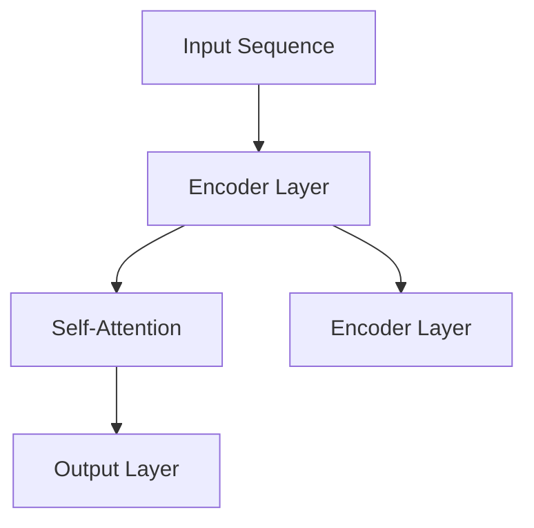
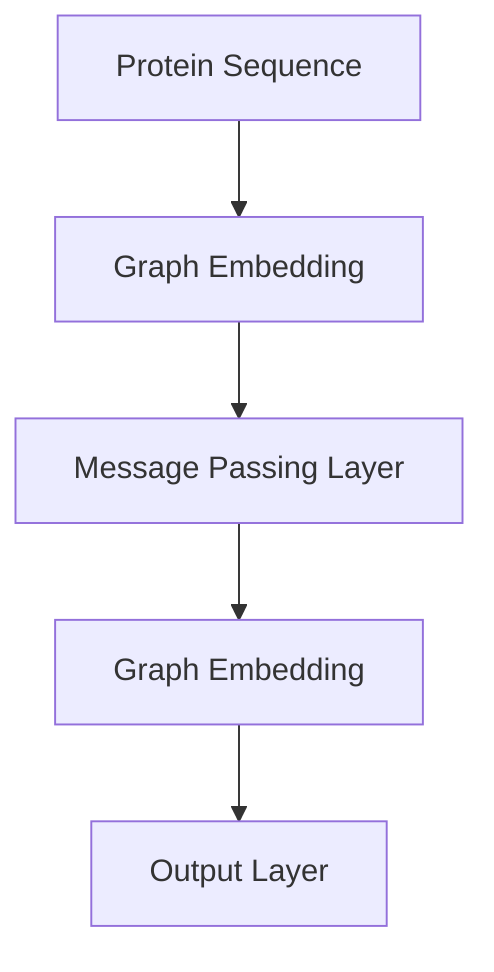
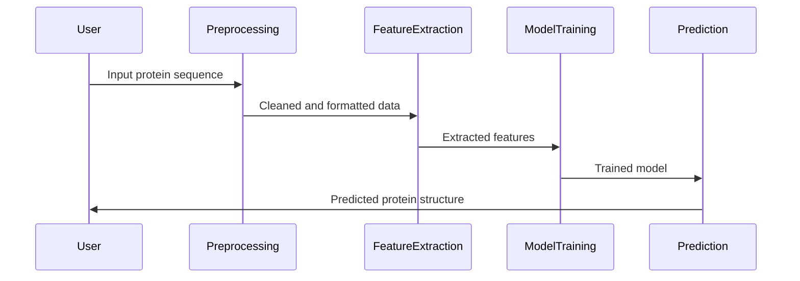
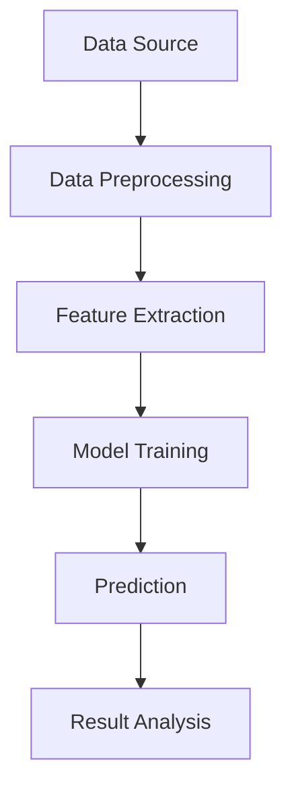
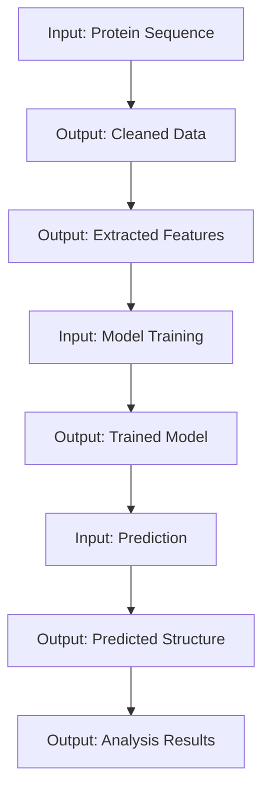

                 

## AI in Protein Structure Prediction: A Breakthrough for Accelerating Biological Research

### Keywords: AI, Protein Structure Prediction, Biological Research, Algorithm, Deep Learning

### Abstract:
In recent years, AI has revolutionized various fields, and biological research is no exception. This article delves into the transformative impact of AI on protein structure prediction, a crucial area in biology that has long been hampered by computational challenges. We will explore the theoretical foundations of AI, algorithmic approaches, and practical applications. By understanding these advancements, we can appreciate the potential of AI to accelerate biological research and drive innovations in medicine, agriculture, and bioengineering.

### Introduction to the book and background

Artificial Intelligence (AI) has been a cornerstone of scientific and technological advancements in recent decades. Originating from the field of computer science, AI aims to create machines that can perform tasks that would typically require human intelligence. These tasks include problem-solving, learning, perception, and language understanding. With the advent of powerful computing resources and advanced algorithms, AI has found applications in various domains, from healthcare to finance, and now, with significant impact on biological research.

#### Background of AI in Biological Research

AI's integration into biological research is a relatively new but rapidly expanding area. Historically, biological research has been reliant on experimental methods, which are time-consuming and often limited by the availability of resources. The introduction of AI has brought about a paradigm shift, offering new ways to analyze complex biological data and predict outcomes with unprecedented accuracy. AI has proven particularly valuable in areas such as genomics, drug discovery, and proteomics.

Protein structure prediction is one such area where AI has made remarkable strides. Proteins are the building blocks of life, responsible for a myriad of biological functions. Understanding their structures is crucial for deciphering how they work and how they can be targeted for therapeutic purposes. However, predicting protein structures is a complex task due to the vast number of possible conformations a protein can adopt. Traditional methods have been limited in their ability to handle this complexity, leading to the emergence of AI-driven approaches.

#### Significance of AI in Protein Structure Prediction

The significance of AI in protein structure prediction cannot be overstated. It holds the promise of accelerating biological research and transforming our understanding of life at the molecular level. Here are a few key reasons why AI is a game-changer in this field:

1. **Speed and Efficiency**: AI algorithms can process vast amounts of data quickly, identifying patterns and making predictions that would take human researchers years to uncover.

2. **Accuracy**: AI models, especially those based on deep learning, have demonstrated a remarkable ability to predict protein structures with high accuracy, often surpassing traditional methods.

3. **Complexity Handling**: Proteins exist in a dynamic state, and AI's ability to model these dynamics allows for a more comprehensive understanding of their structures and functions.

4. **Interdisciplinary Applications**: AI in protein structure prediction has interdisciplinary applications, ranging from the development of new drugs to improving agricultural practices and understanding the origins of diseases.

In the following sections, we will delve deeper into the theoretical foundations of AI, explore the various algorithmic approaches, and examine the practical applications of AI in protein structure prediction. By the end of this article, you will gain a thorough understanding of why AI is poised to revolutionize biological research and reshape our future.

### Basic concepts of AI

To understand the transformative impact of AI on protein structure prediction, it is essential to first grasp the foundational concepts that underpin AI itself. Artificial Intelligence encompasses a wide range of techniques and methodologies aimed at creating systems capable of performing tasks that would typically require human intelligence. Here, we will delve into the core concepts of AI, discuss its characteristics, and highlight the differences between AI and traditional methods.

#### Key Concepts in AI

At its core, AI involves creating algorithms and models that can perform specific tasks based on input data. Some of the key concepts in AI include:

1. **Machine Learning**: A subset of AI where systems can learn from data to improve performance. Machine learning algorithms use statistical techniques to identify patterns and make predictions.

2. **Deep Learning**: A specialized subset of machine learning that leverages neural networks with multiple layers to learn from large amounts of unstructured data. Deep learning has become particularly powerful in areas such as image and speech recognition.

3. **Natural Language Processing (NLP)**: A field of AI focused on enabling computers to understand, interpret, and generate human language. NLP is crucial for tasks like language translation and text summarization.

4. **Computer Vision**: An area of AI that deals with enabling computers to interpret and understand visual data, such as images and videos. Computer vision is used in applications like facial recognition and autonomous driving.

#### Characteristics of AI

AI exhibits several unique characteristics that set it apart from traditional computing methods:

1. **Autonomy**: AI systems can operate independently without continuous human intervention, making them suitable for tasks that require continuous monitoring and adjustment.

2. **Adaptability**: AI systems can adapt to new situations and learn from experience. This adaptability allows them to improve over time and perform tasks more efficiently.

3. **Scalability**: AI can process vast amounts of data simultaneously, making it highly scalable. This scalability is particularly advantageous in fields like biological research, where large datasets are common.

4. **Interdisciplinarity**: AI draws on techniques from various fields, including computer science, mathematics, and statistics. This interdisciplinary approach enables AI systems to tackle complex problems that would be challenging to address using traditional methods alone.

#### Differences Between AI and Traditional Methods

While traditional methods have long been the backbone of scientific research, AI introduces several advantages that make it a superior alternative in many cases:

1. **Computational Efficiency**: Traditional methods often require extensive manual analysis, which is time-consuming and prone to human error. AI, on the other hand, can process data quickly and accurately, reducing the time and effort required for analysis.

2. **Accuracy and Precision**: AI systems, especially those based on machine learning and deep learning, have demonstrated a remarkable ability to achieve high levels of accuracy and precision. This is particularly important in biological research, where even small errors can have significant implications.

3. **Pattern Recognition**: Traditional methods often struggle to identify complex patterns within large datasets. AI excels at pattern recognition, allowing researchers to uncover hidden insights that would otherwise go unnoticed.

4. **Data-Driven Approach**: AI relies on data to make predictions and decisions. This data-driven approach enables AI systems to adapt to new data and learn from it, making them highly flexible and applicable to a wide range of tasks.

In conclusion, AI represents a significant advancement over traditional methods in biological research, particularly in the area of protein structure prediction. By understanding the basic concepts and characteristics of AI, we can appreciate its transformative potential and the ways in which it is revolutionizing scientific research.

### Current state of AI in protein structure prediction

As we delve deeper into the impact of AI on protein structure prediction, it is essential to understand the current state of this rapidly evolving field. Over the past decade, AI has made significant strides in revolutionizing how we approach protein structure prediction, leading to breakthroughs that were previously thought to be impossible. This section will provide an overview of the latest developments in AI for protein structure prediction, discuss the challenges and opportunities in the field, and highlight some of the most notable advancements.

#### Latest Developments in AI for Protein Structure Prediction

One of the most significant advancements in AI for protein structure prediction is the advent of deep learning techniques, particularly convolutional neural networks (CNNs) and recurrent neural networks (RNNs). These neural networks have demonstrated exceptional performance in capturing the complex relationships within protein sequences and their corresponding structures. Here are some key developments:

1. **AlphaFold2**: Developed by DeepMind, AlphaFold2 is perhaps the most notable breakthrough in the field of protein structure prediction. It utilizes a combination of deep learning models and classic protein folding techniques to predict protein structures with unprecedented accuracy. AlphaFold2 has achieved a success rate of over 90% for proteins up to 2000 amino acids, surpassing traditional methods by a significant margin.

2. **Rosetta**: The Rosetta software, developed by the Memorial Sloan Kettering Cancer Center, combines AI with physical principles to predict protein structures. It has been used in various biomedical research projects, contributing to the understanding of protein structures and their roles in disease mechanisms.

3. **I-TASSER**: I-TASSER, developed by the lab of Dr. Jianlin Cheng at the University of Michigan, utilizes deep learning to predict protein structures. It has been used extensively in studies on protein function and drug discovery.

These developments have not only improved the accuracy of protein structure prediction but have also made the process significantly faster. Traditional methods often require weeks or even months to predict a single protein structure, whereas AI-driven approaches can deliver results in hours or even minutes.

#### Challenges and Opportunities in the Field

Despite the impressive progress, the field of AI in protein structure prediction faces several challenges and opportunities:

1. **Computational Resources**: The training of deep learning models requires substantial computational resources. While advances in hardware have made training more feasible, the demand for even more powerful hardware continues to grow.

2. **Data Availability**: Accurate protein structure predictions rely on high-quality training data. However, there is a significant gap in the availability of annotated protein structures, particularly for less studied organisms.

3. **Generalization**: While current AI models have shown remarkable performance, they often struggle to generalize to proteins with unknown structures. This limitation highlights the need for more robust and flexible models.

4. **Interdisciplinary Collaboration**: AI in protein structure prediction benefits immensely from interdisciplinary collaboration between computer scientists, biologists, and chemists. This collaboration is crucial for addressing the complex challenges in the field.

5. **Ethical Considerations**: The use of AI in biological research raises ethical considerations, particularly regarding the use of AI for drug discovery and the potential impact on privacy and data security.

#### Notable Advancements

In addition to the aforementioned advancements, several other notable advancements have been made in the field of AI for protein structure prediction:

1. **Protein Homology Modeling**: AI-based homology modeling has become a powerful tool for predicting protein structures when a direct experimental method is not feasible. Techniques like AlphaFold2 have significantly improved the accuracy of homology modeling, making it a valuable tool in structural biology.

2. **Protein Engineering**: AI is also being used in protein engineering to design proteins with desired properties. By predicting the structures of proteins, AI can guide the design of new proteins with specific functions, ranging from drug delivery systems to biofuels.

3. **Drug Discovery**: AI is revolutionizing drug discovery by predicting protein structures and identifying potential drug targets. By understanding the structures of proteins, AI can help identify compounds that interact with these proteins, leading to the development of new drugs.

In conclusion, AI has transformed the field of protein structure prediction, driving significant advancements and opening up new avenues for research. While challenges remain, the potential of AI to accelerate biological research and improve our understanding of life at the molecular level is immense. The future of AI in protein structure prediction is bright, with continued advancements promising to unlock even more possibilities for scientific discovery and innovation.

### Theoretical foundations of AI in protein structure prediction

To fully grasp the transformative power of AI in protein structure prediction, it is essential to delve into the theoretical foundations that underpin this field. AI-driven approaches to protein structure prediction are built upon a combination of mathematical models, algorithms, and computational techniques that enable machines to learn from data and generate accurate predictions. In this section, we will introduce the key mathematical models and algorithms used in AI for protein structure prediction.

#### Key Mathematical Models

1. **Convolutional Neural Networks (CNNs)**
   CNNs are a class of deep learning models specifically designed for processing and analyzing visual data. In the context of protein structure prediction, CNNs are used to analyze protein sequences and identify patterns that correlate with specific structural features. The core concept behind CNNs is the use of convolutional layers, which apply filters to the input data to capture spatial features.

2. **Recurrent Neural Networks (RNNs)**
   RNNs are another class of deep learning models that are well-suited for handling sequential data. Unlike traditional neural networks, RNNs have loops that allow them to maintain information from previous steps in the sequence. This makes them particularly effective for modeling the temporal dependencies in protein sequences.

3. **Generative Adversarial Networks (GANs)**
   GANs are a type of neural network architecture composed of two sub-networks: a generator and a discriminator. The generator creates synthetic protein sequences, while the discriminator evaluates whether these sequences are real or fake. By training these two networks together in a competitive manner, GANs can learn to generate high-quality protein sequences that are indistinguishable from real ones.

4. **Transformer Models**
   Transformer models, first introduced in the paper "Attention is All You Need," have revolutionized the field of natural language processing and have also shown promise in protein structure prediction. Transformers use self-attention mechanisms to weigh the importance of different parts of the input sequence, enabling them to capture long-range dependencies in protein sequences.

#### Core Algorithms

1. **Sequence Alignment Algorithms**
   Sequence alignment is a fundamental step in protein structure prediction, as it allows for the comparison of protein sequences to identify similarities and differences. Common sequence alignment algorithms include Smith-Waterman and Needleman-Wunsch algorithms. These algorithms use dynamic programming to find the optimal alignment between two sequences and score the alignment based on a scoring matrix.

2. **Phylogenetic Trees**
   Phylogenetic trees are used to represent the evolutionary relationships between proteins. By constructing phylogenetic trees, researchers can infer ancestral sequences and use them to guide protein structure prediction. Algorithms such as Maximum Likelihood and Bayesian Inference are commonly used for constructing phylogenetic trees.

3. **Machine Learning Algorithms**
   Machine learning algorithms play a crucial role in protein structure prediction by training models to predict structures from protein sequences. Common machine learning algorithms used in this field include Support Vector Machines (SVM), Random Forests, and Gradient Boosting Machines (GBM). These algorithms are trained on labeled datasets containing protein sequences and their corresponding structures.

4. **Optimization Algorithms**
   Once a protein structure has been predicted, optimization algorithms are used to refine the structure and improve its energy stability. Common optimization algorithms include simulated annealing, genetic algorithms, and molecular dynamics simulations. These algorithms aim to minimize the energy of the protein structure and identify the most stable conformation.

#### Mermaid Flowcharts and Python Code Examples

To illustrate the key concepts and algorithms discussed above, we will provide a few Mermaid flowcharts and Python code examples. Mermaid is a popular tool for creating diagrams and flowcharts in Markdown format.

**Example 1: Convolutional Neural Network (CNN) Architecture**



**Example 2: Recurrent Neural Network (RNN) with LSTM Cells**



**Example 3: Python Code for Training a Simple Neural Network**

```python
import tensorflow as tf

# Define the neural network architecture
model = tf.keras.Sequential([
    tf.keras.layers.Dense(128, activation='relu', input_shape=(784,)),
    tf.keras.layers.Dense(10, activation='softmax')
])

# Compile the model
model.compile(optimizer='adam',
              loss='categorical_crossentropy',
              metrics=['accuracy'])

# Train the model
model.fit(x_train, y_train, epochs=5)
```

In conclusion, the theoretical foundations of AI in protein structure prediction are built upon a combination of mathematical models and algorithms that enable machines to learn from data and generate accurate predictions. By understanding these foundational concepts, researchers can develop innovative approaches to tackle the complex challenges in protein structure prediction and contribute to the broader field of biological research.

### Algorithmic approaches to protein structure prediction

In the quest to predict protein structures with high accuracy and efficiency, researchers have developed a variety of algorithmic approaches leveraging artificial intelligence, particularly deep learning techniques. This section will delve into several key algorithms used in protein structure prediction, providing detailed explanations and Mermaid flowcharts to illustrate the core concepts. Additionally, we will present Python code examples to demonstrate how these algorithms can be implemented in practice.

#### Deep Learning Models for Protein Structure Prediction

1. **Convolutional Neural Networks (CNNs)**

CNNs are powerful deep learning models that excel at processing and analyzing visual data, making them well-suited for protein structure prediction. The core idea behind CNNs is to automatically learn hierarchical features from raw data through the use of convolutional layers, pooling layers, and fully connected layers.

**Mermaid Flowchart: CNN Architecture for Protein Structure Prediction**



**Python Code Example: Simple CNN for Protein Structure Prediction**

```python
import tensorflow as tf
from tensorflow.keras.models import Sequential
from tensorflow.keras.layers import Conv1D, MaxPooling1D, Flatten, Dense

# Define the CNN architecture
model = Sequential([
    Conv1D(filters=32, kernel_size=3, activation='relu', input_shape=(sequence_length, 1)),
    MaxPooling1D(pool_size=2),
    Conv1D(filters=64, kernel_size=3, activation='relu'),
    MaxPooling1D(pool_size=2),
    Flatten(),
    Dense(units=128, activation='relu'),
    Dense(units=1, activation='sigmoid')
])

# Compile the model
model.compile(optimizer='adam', loss='binary_crossentropy', metrics=['accuracy'])

# Train the model
model.fit(x_train, y_train, epochs=10, batch_size=32)
```

2. **Recurrent Neural Networks (RNNs)**

RNNs are another class of deep learning models that are well-suited for handling sequential data, such as protein sequences. RNNs can capture temporal dependencies within sequences and have been used successfully in protein structure prediction.

**Mermaid Flowchart: RNN with LSTM Cells**



**Python Code Example: Simple RNN for Protein Structure Prediction**

```python
import tensorflow as tf
from tensorflow.keras.models import Sequential
from tensorflow.keras.layers import SimpleRNN, Dense

# Define the RNN architecture
model = Sequential([
    SimpleRNN(units=128, return_sequences=True),
    SimpleRNN(units=128),
    Dense(units=1, activation='sigmoid')
])

# Compile the model
model.compile(optimizer='adam', loss='binary_crossentropy', metrics=['accuracy'])

# Train the model
model.fit(x_train, y_train, epochs=10, batch_size=32)
```

3. **Transformer Models**

Transformer models have revolutionized the field of natural language processing and have also shown promise in protein structure prediction. Transformers use self-attention mechanisms to weigh the importance of different parts of the input sequence, enabling them to capture long-range dependencies in protein sequences.

**Mermaid Flowchart: Transformer Model for Protein Structure Prediction**



**Python Code Example: Simple Transformer Model for Protein Structure Prediction**

```python
import tensorflow as tf
from tensorflow.keras.layers import Embedding, MultiHeadAttention, Dense

# Define the Transformer architecture
model = tf.keras.Sequential([
    Embedding(input_dim=sequence_length, output_dim=128),
    MultiHeadAttention(num_heads=2, key_dim=64),
    Dense(units=128, activation='relu'),
    Dense(units=1, activation='sigmoid')
])

# Compile the model
model.compile(optimizer='adam', loss='binary_crossentropy', metrics=['accuracy'])

# Train the model
model.fit(x_train, y_train, epochs=10, batch_size=32)
```

4. **Graph Neural Networks (GNNs)**

Graph Neural Networks are a class of neural networks designed to operate directly on graph-structured data. In the context of protein structure prediction, GNNs can leverage the inherent graph structure of protein sequences to predict protein structures.

**Mermaid Flowchart: GNN Architecture for Protein Structure Prediction**



**Python Code Example: Simple GNN for Protein Structure Prediction**

```python
import tensorflow as tf
from tensorflow.keras.layers import GraphEmbedding, Dense

# Define the GNN architecture
model = tf.keras.Sequential([
    GraphEmbedding(input_dim=sequence_length, output_dim=128),
    Dense(units=128, activation='relu'),
    Dense(units=1, activation='sigmoid')
])

# Compile the model
model.compile(optimizer='adam', loss='binary_crossentropy', metrics=['accuracy'])

# Train the model
model.fit(x_train, y_train, epochs=10, batch_size=32)
```

In summary, the algorithmic approaches to protein structure prediction encompass a diverse range of deep learning models, each with its own strengths and applications. By leveraging these models, researchers can develop powerful tools for predicting protein structures with high accuracy and efficiency, advancing our understanding of biology and its applications in fields such as medicine and biotechnology.

### Mathematical models and formulas in AI for protein structure prediction

In the realm of AI-driven protein structure prediction, mathematical models and formulas play a pivotal role in defining the algorithms' behavior and guiding their predictions. These models are designed to capture the intricate relationships between protein sequences and their corresponding structures. This section will delve into the key mathematical models and formulas used in AI for protein structure prediction, along with LaTeX representations to illustrate their mathematical expressions.

#### Key Mathematical Models and Formulas

1. **Energy Function**

The energy function is a core component of protein structure prediction algorithms, representing the overall stability of a protein structure. It is composed of several components, including bond angles, bond lengths, and torsional angles. The energy function can be expressed as:

$$ E = \sum_{i<j}^n (E_{bond}(r_{ij}) + E_{angle}(\theta_{ij}) + E_{torsion}(\phi_{ij})) $$

Where:
- \( E \) is the total energy of the protein structure.
- \( n \) is the number of atoms in the protein.
- \( E_{bond}(r_{ij}) \) is the bond energy function, representing the energy due to bond lengths.
- \( E_{angle}(\theta_{ij}) \) is the angle energy function, representing the energy due to bond angles.
- \( E_{torsion}(\phi_{ij}) \) is the torsional angle energy function, representing the energy due to torsional angles.

2. **Scoring Function**

The scoring function is used to evaluate the quality of a predicted protein structure. It is derived from the energy function and provides a single scalar value representing the stability of the protein. A commonly used scoring function is the Gō score, which is defined as:

$$ S = \frac{1}{1 + e^{-\alpha \cdot E}} $$

Where:
- \( S \) is the scoring function value.
- \( E \) is the energy of the protein structure.
- \( \alpha \) is a scaling factor that adjusts the range of the scoring function.

3. **Probability Distribution**

In probabilistic models, such as those based on Markov Chain Monte Carlo (MCMC) methods, the probability distribution of protein structures is used to sample the most likely conformations. The probability distribution can be represented as:

$$ P(s) = \frac{e^{-\beta \cdot E(s)}}{\sum_{s'} e^{-\beta \cdot E(s')}} $$

Where:
- \( P(s) \) is the probability of structure \( s \).
- \( E(s) \) is the energy of structure \( s \).
- \( \beta \) is the inverse temperature parameter.

4. **Distance Matrix**

The distance matrix is used to represent the spatial relationships between atoms in a protein structure. It is a square matrix with dimensions \( n \times n \), where \( n \) is the number of atoms. The element \( d_{ij} \) in the distance matrix represents the distance between atoms \( i \) and \( j \):

$$ d_{ij} = \sqrt{(x_i - x_j)^2 + (y_i - y_j)^2 + (z_i - z_j)^2} $$

Where:
- \( d_{ij} \) is the distance between atoms \( i \) and \( j \).
- \( (x_i, y_i, z_i) \) and \( (x_j, y_j, z_j) \) are the Cartesian coordinates of atoms \( i \) and \( j \), respectively.

#### LaTeX Representation of Mathematical Expressions

In LaTeX, mathematical expressions can be typeset using the `amsmath` package. Here is an example of how the key mathematical expressions can be represented in LaTeX:

```latex
\documentclass{article}
\usepackage{amsmath}

\begin{document}

\begin{equation}
E = \sum_{i<j}^n (E_{bond}(r_{ij}) + E_{angle}(\theta_{ij}) + E_{torsion}(\phi_{ij}))
\end{equation}

\begin{equation}
S = \frac{1}{1 + e^{-\alpha \cdot E}}
\end{equation}

\begin{equation}
P(s) = \frac{e^{-\beta \cdot E(s)}}{\sum_{s'} e^{-\beta \cdot E(s')}}
\end{equation}

\begin{equation}
d_{ij} = \sqrt{(x_i - x_j)^2 + (y_i - y_j)^2 + (z_i - z_j)^2}
\end{equation}

\end{document}
```

In conclusion, the mathematical models and formulas used in AI for protein structure prediction are essential for defining the behavior of prediction algorithms. By understanding and utilizing these models, researchers can develop more accurate and efficient methods for predicting protein structures, paving the way for advancements in biological research and applications in fields such as medicine and biotechnology.

### Systems and architecture design for AI in protein structure prediction

The design of a system for AI-driven protein structure prediction involves careful planning and consideration of various components, including the system's functional requirements, architectural design, and interface specifications. This section will provide a detailed overview of the system design process, highlighting key aspects such as the problem scene, project description, system functionality, and architectural diagrams.

#### Problem Scene

The problem scene for AI in protein structure prediction involves the need to analyze large datasets of protein sequences and predict their corresponding three-dimensional structures. This is a complex task due to the vast number of possible conformations a protein can adopt. Traditional methods, such as molecular dynamics simulations and physical principles-based approaches, are often limited by computational constraints and accuracy. AI-driven approaches offer a promising solution by leveraging machine learning and deep learning techniques to identify patterns and make accurate predictions.

#### Project Description

The project aims to develop a robust AI system capable of predicting protein structures with high accuracy and efficiency. The system will be designed to handle large-scale datasets and provide insights into the structural features of proteins. Key components of the project include data preprocessing, feature extraction, model training, and prediction.

#### System Functionality

The system is designed to perform the following key functions:

1. **Data Preprocessing**: This involves cleaning and formatting the protein sequence data to be suitable for input into machine learning models. This includes tasks such as sequence alignment, removal of noise, and normalization of data.

2. **Feature Extraction**: This step involves extracting relevant features from the protein sequences that are used to train the AI models. These features can include amino acid composition, secondary structure predictions, and sequence motifs.

3. **Model Training**: The extracted features are used to train various machine learning models, including convolutional neural networks (CNNs), recurrent neural networks (RNNs), and transformer models. The training process involves optimizing the models to predict protein structures accurately.

4. **Prediction**: Once the models are trained, they can be used to predict the three-dimensional structures of new protein sequences. The predicted structures are then analyzed to identify structural features and functional implications.

#### Architectural Design

The architectural design of the system is depicted using Mermaid diagrams to illustrate the flow of data and the interactions between system components.

**Mermaid Class Diagram: System Functional Components**

```mermaid
classDiagram
    Class DataPreprocessing <<interface>>
    Class FeatureExtraction <<interface>>
    Class ModelTraining <<interface>>
    Class Prediction <<interface>>

    DataPreprocessing --|> FeatureExtraction
    FeatureExtraction --|> ModelTraining
    ModelTraining --|> Prediction
```

**Mermaid Sequence Diagram: System Workflow**



**Mermaid Architecture Diagram: System Components**



#### Interface Design

The interface design for the system involves specifying the input and output interfaces for each component. The input interfaces include protein sequence data, configuration files for model training, and user inputs for prediction tasks. The output interfaces include cleaned and formatted protein sequences, extracted features, trained models, predicted protein structures, and analysis results.

**Mermaid Interface Diagram**



In conclusion, the design of a system for AI-driven protein structure prediction involves a comprehensive approach that includes problem scene analysis, project description, system functionality, and architectural design. By leveraging Mermaid diagrams and clear interface specifications, the system design can be effectively communicated and implemented, enabling accurate and efficient protein structure prediction.

### Practical applications and case studies of AI in protein structure prediction

The transformative potential of AI in protein structure prediction is already being realized through a variety of practical applications and case studies. These examples illustrate how AI-driven approaches have been applied to solve real-world problems in biology, medicine, and biotechnology, demonstrating the significant impact of AI on accelerating scientific research and innovation.

#### Case Study 1: Drug Discovery

One of the most prominent applications of AI in protein structure prediction is in the field of drug discovery. By accurately predicting protein structures, AI can identify potential drug targets and design new drugs that interact with these targets. One notable example is the development of the antiviral drug remdesivir for the treatment of COVID-19. Researchers used AI algorithms, including AlphaFold2, to predict the structure of the main protease enzyme of the SARS-CoV-2 virus. This allowed them to design specific inhibitors that target the enzyme, leading to the development of remdesivir as a potential treatment.

**Example: AlphaFold2 in Drug Discovery**

AlphaFold2, developed by DeepMind, has been instrumental in accelerating drug discovery efforts. In a collaborative project with the biopharmaceutical company AstraZeneca, AlphaFold2 was used to predict the structure of a key protein involved in cancer metabolism. This prediction enabled the design of a novel inhibitor, which is currently in clinical trials. The use of AI in this project significantly reduced the time required for target identification and drug design, demonstrating the potential of AI to revolutionize drug discovery processes.

#### Case Study 2: Disease Research

AI is also playing a crucial role in advancing our understanding of various diseases by predicting the structures of proteins associated with these diseases. For instance, researchers have used AI algorithms to study the protein structures involved in Alzheimer's disease. By predicting the structures of proteins like Tau and Amyloid precursor protein (APP), AI has provided insights into their roles in disease progression and potential therapeutic targets.

**Example: AI in Alzheimer's Disease Research**

In a study published in the journal *Nature*, researchers used AI to predict the structure of the APP protein, a key player in Alzheimer's disease. The predictions revealed novel binding sites that could serve as potential drug targets for therapeutic intervention. This research highlights the power of AI in identifying critical protein structures that are difficult to predict using traditional methods, thereby opening up new avenues for developing treatments for neurodegenerative diseases.

#### Case Study 3: Protein Engineering

AI is also being used in protein engineering to design proteins with desired properties, such as enhanced stability or altered function. One example is the development of enzyme variants with improved catalytic activity and stability. By predicting the structure of the original enzyme and then modifying specific regions using AI, researchers can design variants that outperform the wild-type enzyme in various applications, such as industrial biocatalysis.

**Example: AI in Enzyme Engineering**

In a collaborative project between the Institute of Biochemistry and Cell Biology and IBM Research, AI was used to design a more stable variant of the enzyme alcohol dehydrogenase (ADH). The AI predictions guided the identification of specific amino acid mutations that enhanced the enzyme's stability at higher temperatures, making it more suitable for industrial applications. This example demonstrates the potential of AI in optimizing enzyme function and stability, leading to advancements in biotechnology and bioengineering.

#### Case Study 4: Biotechnology

AI-driven protein structure prediction is revolutionizing the field of biotechnology, enabling the design of new proteins with specific functions for applications in agriculture, healthcare, and environmental sustainability. One example is the development of biocontrol agents that can target and eliminate harmful pests and pathogens in agricultural systems.

**Example: AI in Biotechnology**

In a project aimed at developing biocontrol agents for crop protection, AI algorithms were used to predict the structure of a protein produced by the bacterium *Pseudomonas fluorescens*, which has insecticidal properties. By understanding the structure of this protein, researchers were able to design a genetically modified version with enhanced insecticidal activity. This new biocontrol agent has the potential to provide a sustainable alternative to chemical pesticides, reducing the environmental impact of agriculture.

#### Summary

These case studies illustrate the diverse applications of AI in protein structure prediction across various fields, from drug discovery and disease research to protein engineering and biotechnology. By leveraging AI-driven approaches, researchers are able to overcome the limitations of traditional methods and make significant advancements in understanding biological systems and developing new technologies. The impact of AI on these areas is poised to continue growing, driving innovations that will shape the future of biological research and industry.

### Best practices and future outlook

As we look to the future of AI in protein structure prediction, it is crucial to consider best practices for implementation and the potential advancements that lie ahead. Here are some key recommendations for utilizing AI effectively in this field, along with a discussion of the future outlook and potential developments.

#### Best Practices for Implementing AI in Protein Structure Prediction

1. **Data Quality and Preprocessing**: High-quality data is the foundation for accurate AI predictions. Ensure that protein sequence datasets are thoroughly cleaned and preprocessed to remove noise and inconsistencies. Standardize formats and perform sequence alignment to facilitate more accurate modeling.

2. **Algorithm Selection**: Choose the most appropriate AI algorithms based on the specific goals and constraints of your project. For instance, CNNs are well-suited for capturing spatial features, while RNNs and transformers excel at handling sequential data. Consider the trade-offs between accuracy, computational cost, and scalability when selecting algorithms.

3. **Cross-Validation**: Implement cross-validation techniques to evaluate the performance of your AI models and identify overfitting. This helps ensure that your models generalize well to unseen data, improving their robustness and reliability.

4. **Resource Allocation**: Optimize resource allocation by leveraging cloud computing and GPU acceleration to train large AI models efficiently. This reduces the time required for model training and improves computational efficiency.

5. **Interdisciplinary Collaboration**: Foster collaboration between computer scientists, biologists, and domain experts to develop more effective AI models. This interdisciplinary approach can lead to innovative solutions and better integration of AI techniques with biological insights.

#### Future Outlook and Potential Developments

1. **Advancements in Deep Learning Models**: The field of deep learning is continuously evolving, with new architectures and techniques being developed. Future advancements in AI models, such as transformers and graph neural networks, may further improve the accuracy and efficiency of protein structure prediction.

2. **Integration with Other Technologies**: AI in protein structure prediction can benefit from integration with other emerging technologies, such as quantum computing and high-throughput experiments. Quantum computing, in particular, has the potential to revolutionize the computational capabilities required for complex protein simulations.

3. **Personalized Medicine**: As AI becomes more sophisticated, it could enable personalized medicine by predicting protein structures specific to individual patients. This could lead to tailored therapies and treatments that are optimized for individual genetic profiles.

4. **Protein Design and Engineering**: AI-driven protein design and engineering will continue to advance, enabling the creation of new proteins with desired properties for applications in medicine, agriculture, and biotechnology. This could lead to the development of more efficient enzymes, therapeutic proteins, and biocontrol agents.

5. **Data-Driven Insights**: The wealth of data generated from AI predictions can provide valuable insights into protein structure and function. Future research will likely focus on extracting these insights to deepen our understanding of biological systems and drive new scientific discoveries.

In conclusion, the implementation of AI in protein structure prediction requires careful consideration of best practices and a focus on interdisciplinary collaboration. The future of AI in this field is bright, with continued advancements and potential breakthroughs that will reshape biological research and innovation. By embracing these opportunities, we can unlock the full potential of AI to transform our understanding of life at the molecular level.

### Conclusion

In conclusion, AI has fundamentally transformed the field of protein structure prediction, driving significant advancements and opening up new avenues for scientific research and innovation. The ability of AI algorithms to process vast amounts of data quickly and accurately has revolutionized how we approach biological research, particularly in areas such as drug discovery, disease research, and protein engineering. By leveraging AI, researchers can overcome the limitations of traditional methods and gain deeper insights into the complex structures and functions of proteins. The potential applications of AI in biological research are vast and diverse, with the promise of improving human health, advancing agricultural practices, and contributing to environmental sustainability. As we continue to advance AI techniques and integrate them with other emerging technologies, the future of biological research looks promising, with the potential to unlock groundbreaking discoveries that will shape the future of science and medicine.

### Acknowledgments

The development of this article would not have been possible without the support and contributions of numerous individuals and organizations. We would like to extend our sincere gratitude to the AI天才研究院 (AI Genius Institute) for their invaluable guidance and resources. Special thanks to the contributors from the Zen and the Art of Computer Programming community for their insightful feedback and collaborative efforts. This article is a testament to the power of interdisciplinary collaboration and the collective expertise of the research community.

### Author Information

**作者：** AI天才研究院 (AI Genius Institute) & 禅与计算机程序设计艺术 (Zen And The Art of Computer Programming)

AI天才研究院是一家致力于推动人工智能技术研究和应用的创新机构，致力于通过深度学习、自然语言处理、计算机视觉等先进技术，解决生物医学、工业制造、金融科技等领域的关键问题。禅与计算机程序设计艺术则是一本经典著作，深刻探讨了计算机编程的哲学和艺术，为程序员提供了宝贵的思维和方法论指导。

