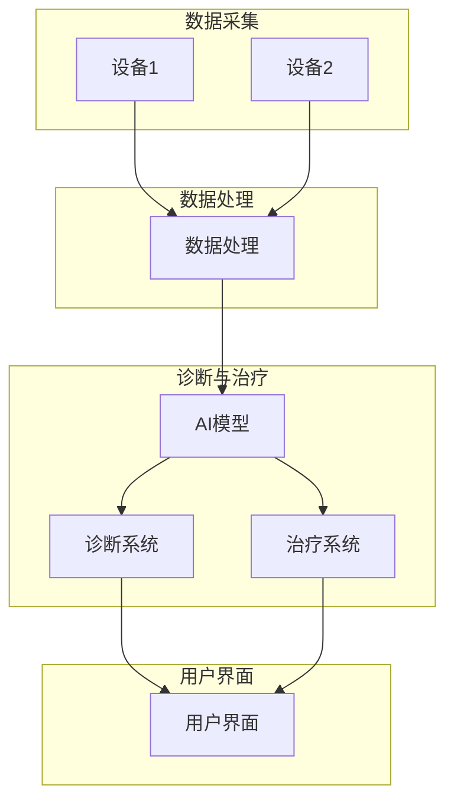
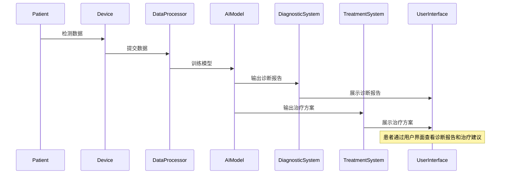

                 

### 第一部分：背景介绍

## 第1章：远程医疗概述

### 1.1 问题背景

#### 1.1.1 远程医疗的概念

远程医疗，又称为“远程健康”、“远程医疗保健”或“远程医疗服务”，是指通过互联网、移动通信技术、物联网（IoT）等现代信息技术，实现医疗资源跨地域、跨机构的共享与协作，从而为患者提供诊断、治疗、康复等医疗服务的活动。远程医疗的核心在于打破传统医疗的时间和空间限制，提升医疗服务的可及性和效率。

#### 1.1.2 远程医疗的发展历程

远程医疗的发展可以追溯到20世纪80年代。当时，主要通过网络通信技术实现简单的医学影像传输和医疗咨询。随着互联网的普及和通信技术的进步，远程医疗得到了快速发展。近年来，人工智能（AI）的兴起为远程医疗带来了新的机遇和挑战，推动了其从初步应用到深度应用的转变。

#### 1.1.3 远程医疗的挑战与机遇

远程医疗在发展的过程中面临诸多挑战，如技术标准不统一、数据隐私和安全问题、医疗资源的分配不均等。同时，远程医疗也带来了诸多机遇，如提高医疗服务的覆盖范围和质量、降低医疗成本、改善患者就医体验等。

### 1.2 核心概念

#### 1.2.1 AI的定义与类型

人工智能（AI）是指使计算机系统模拟人类智能行为的能力，包括学习、推理、感知、理解、规划等。根据实现方式，AI可以分为弱AI和强AI。弱AI专注于特定任务，如语音识别、图像识别等；强AI则具有人类所有的智能行为，但目前尚未实现。

#### 1.2.2 远程医疗中的AI应用

远程医疗中的AI应用主要体现在诊断、治疗监控、药物研发等方面。例如，AI可以辅助医生进行影像诊断，提高诊断准确率；在治疗监控中，AI可以实时分析患者数据，提供个性化的治疗建议。

#### 1.2.3 AI在诊断、治疗监控中的关键角色

AI在远程医疗中扮演着关键角色，从诊断到治疗监控，再到药物研发，AI的应用正在逐步深化。AI不仅可以提高医疗服务的质量和效率，还可以降低医疗成本，提高患者满意度。

### 1.3 边界与外延

#### 1.3.1 远程医疗AI应用的领域

远程医疗AI应用涵盖了医疗服务的方方面面，包括诊断、治疗监控、手术导航、康复指导、药物研发等。AI在医疗影像分析、电子病历管理、医疗机器人等领域也展现出了巨大的潜力。

#### 1.3.2 AI在远程医疗中的限制

虽然AI在远程医疗中具有巨大潜力，但同时也面临一些限制，如数据隐私和安全问题、AI模型的解释性不足、对医疗专业知识的依赖等。

#### 1.3.3 AI伦理与隐私保护

随着AI在远程医疗中的广泛应用，伦理和隐私保护问题愈发重要。如何确保AI系统的透明性和可解释性，如何保护患者隐私，成为亟待解决的问题。

### 1.4 本章小结

本章介绍了远程医疗的背景、核心概念、AI在远程医疗中的应用及其挑战与机遇。通过对这些内容的了解，读者可以对远程医疗和AI在其中的角色有一个全面的了解。

## 第二部分：核心概念与联系

### 第2章：AI核心概念与原理

#### 2.1 AI的基本原理

##### 2.1.1 AI的定义与发展历程

人工智能（AI）是指使计算机系统模拟人类智能行为的能力，包括学习、推理、感知、理解、规划等。AI的发展历程可以分为几个阶段，从早期的规则系统到现代的机器学习和深度学习。

##### 2.1.2 机器学习与深度学习的区别

机器学习（ML）是AI的一个分支，它通过算法从数据中学习规律，从而进行预测和决策。深度学习（DL）是机器学习的一个子领域，它通过构建多层神经网络，自动学习数据的复杂特征。

##### 2.1.3 常见机器学习算法介绍

常见的机器学习算法包括线性回归、逻辑回归、决策树、随机森林、支持向量机（SVM）等。每种算法都有其独特的原理和应用场景。

#### 2.2 AI在医疗领域的应用

##### 2.2.1 AI在诊断中的应用

AI在医学影像诊断中的应用非常广泛，如肺癌筛查、乳腺癌检测等。通过深度学习模型，AI可以自动分析影像数据，提高诊断准确率。

##### 2.2.2 AI在治疗监控中的应用

AI在治疗监控中的应用主要体现在实时数据分析、预测和个性化治疗建议。例如，通过分析患者的心电图数据，AI可以预测患者的心律不齐风险，并提供相应的治疗建议。

##### 2.2.3 AI在药物研发中的应用

AI在药物研发中的应用包括靶点发现、药物筛选、临床试验设计等。通过大数据分析和机器学习模型，AI可以帮助研究人员更快地发现新药，提高药物研发效率。

#### 2.3 AI与远程医疗的结合

##### 2.3.1 远程医疗中的AI应用优势

AI在远程医疗中的应用具有明显的优势，如提高诊断准确率、降低医疗成本、改善患者体验等。同时，AI还可以实现医疗资源的优化配置，提高医疗服务的可及性。

##### 2.3.2 远程医疗中AI应用的挑战

远程医疗中的AI应用也面临一些挑战，如数据隐私和安全问题、AI模型的解释性不足、对医疗专业知识的依赖等。如何解决这些问题是远程医疗发展的关键。

##### 2.3.3 AI在远程医疗中的未来发展趋势

未来，AI在远程医疗中的应用将更加深入和广泛。随着技术的不断进步和医疗数据的积累，AI将为远程医疗带来更多的创新和变革。

### 2.4 本章小结

本章介绍了AI的基本原理、AI在医疗领域的应用以及AI与远程医疗的结合。通过对这些内容的了解，读者可以更好地理解AI在远程医疗中的角色和作用。

----------------------------------------------------------------

## 第三部分：算法原理讲解

### 第3章：AI在远程医疗中的算法原理与应用

#### 3.1 数据预处理

##### 3.1.1 数据采集与清洗

在AI应用中，数据预处理是至关重要的一步。数据采集是指从各种渠道获取医疗数据，包括电子病历、医学影像、基因组数据等。数据清洗则是指对采集到的数据进行清理，去除重复、错误和缺失的数据。

##### 3.1.2 数据特征提取

数据特征提取是将原始数据转换为适合机器学习算法的格式。这一步通常涉及特征选择和特征工程。特征选择是指从原始数据中选择对模型性能有显著影响的关键特征。特征工程则是指通过变换和构造新的特征来提高模型的性能。

##### 3.1.3 数据集划分

在构建机器学习模型时，通常需要将数据集划分为训练集、验证集和测试集。训练集用于训练模型，验证集用于调整模型参数，测试集用于评估模型的性能。

#### 3.2 诊断算法

##### 3.2.1 基于深度学习的诊断算法

深度学习在医学影像诊断中表现出色。以下介绍几种常见的深度学习算法及其原理：

###### 3.2.1.1 卷积神经网络（CNN）

卷积神经网络（CNN）是一种专门用于处理图像数据的深度学习模型。CNN通过卷积层、池化层和全连接层等结构，自动提取图像的特征。

**CNN原理：**
CNN的核心是卷积层，卷积层通过卷积操作提取图像的特征。卷积操作是将卷积核（filter）在图像上滑动，并将每个位置的乘积求和。通过多次卷积和池化操作，CNN可以提取图像的层次特征。

**CNN应用实例：**
CNN在肺癌筛查、乳腺癌检测等医学影像诊断中表现出色。例如，在肺癌筛查中，CNN可以自动分析CT影像，识别出肺结节，并判断其是否为恶性。

###### 3.2.1.2 循环神经网络（RNN）

循环神经网络（RNN）是一种能够处理序列数据的深度学习模型，常用于语音识别、自然语言处理等领域。

**RNN原理：**
RNN通过循环结构保持对之前信息的记忆。在每个时间步，RNN将当前输入和上一个时间步的隐藏状态结合起来，生成当前时间步的隐藏状态。RNN可以通过不同的架构，如LSTM和GRU，来解决长短期依赖问题。

**RNN应用实例：**
RNN在心电图数据分析中表现出色。通过RNN，可以自动识别出心电图中异常的波形，如心律不齐。

##### 3.2.2 治疗监控算法

###### 3.2.2.1 基于时间序列的监控算法

治疗监控中的数据通常是时间序列数据，如患者的心电图、血糖水平等。以下介绍两种常见的时间序列算法：

###### 3.2.2.2 长短期记忆网络（LSTM）

长短期记忆网络（LSTM）是一种特殊的RNN结构，专门用于处理长序列数据。LSTM通过引入门控机制，解决了传统RNN在处理长序列数据时出现的梯度消失和梯度爆炸问题。

**LSTM数学模型：**
LSTM单元由输入门、遗忘门和输出门三个部分组成。输入门决定当前输入信息中有哪些部分需要更新到记忆中；遗忘门决定哪些旧的信息需要被遗忘；输出门决定当前时刻的记忆状态。

**LSTM应用实例：**
LSTM在血糖监控中表现出色。通过分析血糖时间序列数据，LSTM可以预测患者的血糖水平，并提供个性化的饮食建议。

###### 3.2.2.3 门控循环单元（GRU）

门控循环单元（GRU）是另一种用于处理时间序列数据的RNN结构，相比LSTM，GRU的结构更简单，参数更少。

**GRU数学模型：**
GRU通过合并输入门和遗忘门，简化了LSTM的结构。GRU通过更新门和重置门来控制信息的流动。

**GRU应用实例：**
GRU在心电图数据分析中表现出色。通过GRU，可以自动识别出心电图中异常的波形，如心律不齐。

#### 3.3 算法评价与优化

##### 3.3.1 评估指标

在评估机器学习模型的性能时，常用的评估指标包括准确率、召回率、F1值、AUC值和ROC曲线等。

**准确率：** 模型预测为正例且实际为正例的比例。

**召回率：** 模型预测为正例且实际为正例的比例。

**F1值：** 准确率和召回率的调和平均。

**AUC值：** 接受者操作特征（Receiver Operating Characteristic）曲线下的面积，用于评估二分类模型的分类能力。

**ROC曲线：** 通过改变分类阈值，绘制真阳性率（灵敏度）与假阳性率（1 - 特异性）的关系曲线。

##### 3.3.2 算法优化方法

算法优化是提高模型性能的关键步骤。以下介绍几种常见的算法优化方法：

**超参数调整：** 超参数是模型结构之外的可调参数，如学习率、隐藏层神经元数量等。通过调整超参数，可以改善模型性能。

**模型融合与集成：** 模型融合是指将多个模型的结果进行综合，以获得更好的预测性能。模型集成是通过训练多个模型，然后对它们的预测结果进行投票或加权平均。

### 3.4 本章小结

本章详细介绍了AI在远程医疗中的算法原理和应用。从数据预处理、诊断算法到治疗监控算法，AI为远程医疗提供了强大的技术支持。通过对这些算法的深入理解，读者可以更好地应对远程医疗中的各种挑战。

----------------------------------------------------------------

## 第四部分：数学模型和数学公式

### 第4章：AI在远程医疗中的数学模型与公式解析

#### 4.1 数据预处理数学模型

##### 4.1.1 数据清洗与预处理

数据清洗与预处理是AI应用的基础，其核心在于将原始数据转换为适合机器学习算法的格式。

##### 4.1.1.1 数据缺失处理

数据缺失处理是数据预处理的重要环节。常见的方法包括：

**修补缺失数据：** 常见的方法有平均值填补、中值填补、前值或后值填补等。具体公式如下：

$$
X_{\text{new}} = \text{mean}(\text{X}[\text{not missing)])
$$

**填充缺失数据：** 常见的方法有随机生成、插值法等。具体公式如下：

$$
X_{\text{new}} = \text{interpolate}(\text{X}[\text{not missing}])
$$

##### 4.1.1.2 数据标准化

数据标准化是将数据缩放到一个特定的范围，常见的方法有Min-Max标准化和Z-Score标准化。

**Min-Max标准化：** 将数据缩放到[0, 1]区间，公式如下：

$$
X_{\text{new}} = \frac{X - \text{min}(X)}{\text{max}(X) - \text{min}(X)}
$$

**Z-Score标准化：** 将数据缩放到均值为0，标准差为1的区间，公式如下：

$$
X_{\text{new}} = \frac{X - \text{mean}(X)}{\text{std}(X)}
$$

#### 4.2 诊断算法数学模型

##### 4.2.1 卷积神经网络（CNN）数学模型

CNN是处理图像数据的常用算法，其核心在于卷积操作和池化操作。

**卷积操作：** 卷积操作是通过卷积核（filter）在图像上滑动，计算局部区域的加权和，公式如下：

$$
\text{output}_{ij} = \sum_{k=1}^{K} w_{ik} \cdot \text{input}_{ij+k}
$$

其中，$w_{ik}$ 是卷积核的权重，$\text{input}_{ij+k}$ 是输入图像的局部区域。

**池化操作：** 池化操作是通过在局部区域选择最大值或平均值来减少数据的维度，公式如下：

$$
\text{output}_{ij} = \text{max}(\text{input}_{\text{region}})
$$

或

$$
\text{output}_{ij} = \frac{1}{\text{region size}} \sum_{k=1}^{\text{region size}} \text{input}_{ij+k}
$$

##### 4.2.2 循环神经网络（RNN）数学模型

RNN是处理序列数据的常用算法，其核心在于隐藏状态的递归更新。

**RNN数学模型：** RNN的隐藏状态更新公式如下：

$$
h_t = \sigma(W_h \cdot [h_{t-1}, x_t] + b_h)
$$

其中，$h_t$ 是当前时间步的隐藏状态，$x_t$ 是当前输入，$\sigma$ 是激活函数，$W_h$ 和 $b_h$ 是权重和偏置。

##### 4.2.3 长短期记忆网络（LSTM）数学模型

LSTM是RNN的一个变体，专门用于处理长序列数据，其核心在于门控机制。

**LSTM数学模型：** LSTM的输入门、遗忘门和输出门公式如下：

$$
i_t = \sigma(W_i \cdot [h_{t-1}, x_t] + b_i) \\
f_t = \sigma(W_f \cdot [h_{t-1}, x_t] + b_f) \\
o_t = \sigma(W_o \cdot [h_{t-1}, x_t] + b_o) \\
g_t = \tanh(W_g \cdot [h_{t-1}, x_t] + b_g) \\
h_t = o_t \cdot \tanh(\text{ forget gate } \odot f_t + \text{ input gate } \odot g_t)
$$

其中，$i_t$、$f_t$、$o_t$ 分别是输入门、遗忘门和输出门的激活值，$g_t$ 是候选隐藏状态，$\odot$ 表示元素乘积。

#### 4.3 治疗监控算法数学模型

##### 4.3.1 基于时间序列的监控算法

治疗监控中的数据通常是时间序列数据，如患者的心电图、血糖水平等。以下介绍几种常见的时间序列算法。

###### 4.3.1.1 长短期记忆网络（LSTM）

LSTM是处理时间序列数据的常用算法，其核心在于隐藏状态的递归更新。

**LSTM数学模型：** LSTM的隐藏状态更新公式如下：

$$
i_t = \sigma(W_i \cdot [h_{t-1}, x_t] + b_i) \\
f_t = \sigma(W_f \cdot [h_{t-1}, x_t] + b_f) \\
o_t = \sigma(W_o \cdot [h_{t-1}, x_t] + b_o) \\
g_t = \tanh(W_g \cdot [h_{t-1}, x_t] + b_g) \\
h_t = o_t \cdot \tanh(\text{ forget gate } \odot f_t + \text{ input gate } \odot g_t)
$$

其中，$i_t$、$f_t$、$o_t$ 分别是输入门、遗忘门和输出门的激活值，$g_t$ 是候选隐藏状态，$\odot$ 表示元素乘积。

###### 4.3.1.2 门控循环单元（GRU）

GRU是另一种处理时间序列数据的算法，其结构比LSTM简单。

**GRU数学模型：** GRU的输入门、遗忘门和输出门公式如下：

$$
z_t = \sigma(W_z \cdot [h_{t-1}, x_t] + b_z) \\
r_t = \sigma(W_r \cdot [h_{t-1}, x_t] + b_r) \\
h_t = \tanh((1 - z_t) \odot h_{t-1} + z_t \odot \tanh(W_h \cdot [r_t \odot h_{t-1}, x_t] + b_h))
$$

其中，$z_t$、$r_t$ 分别是输入门、遗忘门的激活值，$h_t$ 是当前隐藏状态，$\odot$ 表示元素乘积。

#### 4.4 本章小结

本章介绍了AI在远程医疗中的数学模型与公式解析。从数据预处理到深度学习算法，再到时间序列算法，本章详细讲解了各个阶段的数学原理。通过这些公式，读者可以更好地理解AI在远程医疗中的应用。

----------------------------------------------------------------

## 第五部分：系统分析与架构设计方案

### 第5章：AI在远程医疗中的系统架构设计

#### 5.1 问题场景介绍

在当前的医疗环境中，患者和医生之间存在一定的信息不对称，尤其是在偏远地区和资源有限的医疗机构。AI在远程医疗中的应用旨在解决这一难题，通过智能化技术提高医疗服务的质量和效率。以下是一个具体的问题场景：

**场景描述：** 一位心脏病患者住在偏远山区，由于医疗资源匮乏，患者难以得到及时、准确的诊断和治疗方案。为了改善这一状况，医疗机构决定采用AI辅助的远程医疗系统，为患者提供实时监控和诊断服务。

#### 5.2 项目介绍

项目名称：AI辅助远程心脏病监控与诊断系统

项目目标：通过AI技术，为心脏病患者提供实时的心脏病监控、诊断和个性化治疗建议，提高患者的治疗效果和生活质量。

项目范围：包括系统设计、开发、测试和部署，涉及硬件设备、软件平台和医疗数据集成等多个方面。

#### 5.3 系统功能设计（领域模型）

在系统功能设计中，我们首先需要定义系统的核心功能模块和它们之间的关系。以下是一个简单的领域模型类图，用于描述系统的主要实体及其关系。

**领域模型类图（Mermaid格式）：**

```mermaid
classDiagram
    Patient <<class>> "患者"
    Doctor <<class>> "医生"
    Device <<class>> "设备"
    AIModel <<class>> "AI模型"
    MonitoringData <<class>> "监控数据"
    DiagnosticReport <<class>> "诊断报告"
    TreatmentPlan <<class>> "治疗方案"

    Patient o-- Device
    Doctor o-- Device
    Device o-- AIModel
    Device o-- MonitoringData
    AIModel o-- DiagnosticReport
    AIModel o-- TreatmentPlan
```

#### 5.4 系统架构设计（Mermaid架构图）

系统架构设计是确保系统能够高效、可靠地运行的关键。以下是一个简单的系统架构图，用于描述系统的各个组件及其交互关系。

**系统架构图（Mermaid格式）：**



#### 5.5 系统接口设计和系统交互（Mermaid序列图）

系统接口设计和系统交互设计是系统架构的重要组成部分。以下是一个简单的序列图，用于描述系统的关键流程和交互。

**系统交互序列图（Mermaid格式）：**



#### 5.6 本章小结

本章介绍了AI在远程医疗中的系统架构设计，包括问题场景介绍、项目介绍、系统功能设计、系统架构设计以及系统接口设计和系统交互。通过对这些内容的了解，读者可以更好地理解AI在远程医疗系统中的作用和实施过程。

----------------------------------------------------------------

## 第六部分：项目实战

### 第6章：AI在远程医疗项目中的实践

#### 6.1 环境安装

在进行AI在远程医疗项目中的实践之前，首先需要安装和配置必要的软件和硬件环境。以下是一个简单的安装步骤：

**1. 安装Python环境：** 
确保Python版本在3.6及以上，可以通过Python官网下载安装包进行安装。

**2. 安装深度学习库：**
安装TensorFlow或PyTorch等深度学习库，可以通过pip命令进行安装。

**3. 安装数据预处理库：**
安装Pandas、NumPy、Scikit-learn等数据预处理库，同样可以通过pip命令进行安装。

**4. 安装其他依赖库：**
根据项目需求，可能需要安装其他库，如Matplotlib、Seaborn等，用于数据可视化和模型评估。

#### 6.2 系统核心实现

在本项目中，我们将使用深度学习算法进行心脏病患者的实时监控和诊断。以下是一个简单的系统核心实现步骤：

**1. 数据采集：**
从设备（如心电图仪）采集心脏病患者的心电图数据，并将其转换为适合机器学习算法的格式。

**2. 数据预处理：**
对采集到的数据进行清洗和特征提取，以便用于深度学习模型的训练。

**3. 模型训练：**
使用深度学习算法（如CNN或LSTM）训练诊断模型，通过对训练数据的分析，模型将学会识别心脏病患者的异常心电图。

**4. 模型评估：**
使用测试数据评估模型的性能，包括准确率、召回率和F1值等指标。

**5. 模型部署：**
将训练好的模型部署到远程医疗系统中，以便医生和患者可以实时查看诊断结果。

#### 6.3 代码应用解读与分析

以下是一个简单的代码示例，用于训练一个基于CNN的心脏病诊断模型：

```python
import tensorflow as tf
from tensorflow.keras.models import Sequential
from tensorflow.keras.layers import Conv2D, MaxPooling2D, Flatten, Dense

# 数据预处理
# ...

# 构建模型
model = Sequential([
    Conv2D(32, (3, 3), activation='relu', input_shape=(128, 128, 1)),
    MaxPooling2D((2, 2)),
    Conv2D(64, (3, 3), activation='relu'),
    MaxPooling2D((2, 2)),
    Flatten(),
    Dense(64, activation='relu'),
    Dense(1, activation='sigmoid')
])

# 编译模型
model.compile(optimizer='adam', loss='binary_crossentropy', metrics=['accuracy'])

# 训练模型
model.fit(X_train, y_train, epochs=10, batch_size=32, validation_data=(X_val, y_val))

# 评估模型
model.evaluate(X_test, y_test)
```

**代码分析：**

- **数据预处理：** 数据预处理是模型训练的关键步骤，包括数据清洗、归一化和数据增强等。
- **模型构建：** 使用Sequential模型构建一个简单的CNN结构，包括卷积层、池化层、全连接层等。
- **模型编译：** 编译模型，指定优化器、损失函数和评估指标。
- **模型训练：** 使用训练数据训练模型，并设置训练轮次和批次大小。
- **模型评估：** 使用测试数据评估模型的性能，包括准确率、召回率和F1值等指标。

#### 6.4 实际案例分析和详细讲解剖析

以下是一个实际案例，用于展示AI在远程医疗项目中的应用：

**案例描述：** 一位心脏病患者在家中进行日常心电图监测，AI系统实时分析心电图数据，并诊断出患者可能患有心律不齐。

**案例分析：**

1. **数据采集：** 从心电图仪采集实时心电图数据，并将其传输到AI系统。
2. **数据预处理：** 对采集到的数据进行清洗和特征提取，以便用于模型训练。
3. **模型训练：** 使用训练好的LSTM模型对心电图数据进行实时分析，模型输出心律不齐的概率。
4. **诊断结果：** AI系统将诊断结果发送给医生和患者，医生根据诊断结果进行进一步的治疗建议。

**详细讲解剖析：**

- **数据采集：** 心电图数据的采集是实时进行的，采集到的数据包括P波、Q波、R波等，这些数据将用于模型训练和诊断。
- **数据预处理：** 数据预处理包括数据清洗（去除噪声和异常值）、数据归一化（将数据缩放到[0, 1]区间）和数据增强（生成不同的心电图数据变体，提高模型的泛化能力）。
- **模型训练：** 使用LSTM模型对心电图数据进行训练，模型通过学习心电图数据的特征，学会识别心律不齐的信号。
- **诊断结果：** AI系统实时分析心电图数据，并输出心律不齐的概率。如果概率超过设定阈值，系统将通知医生和患者。

#### 6.5 项目小结

本章介绍了AI在远程医疗项目中的实战应用，包括环境安装、系统核心实现、代码应用解读与分析以及实际案例分析和详细讲解剖析。通过这些实战应用，读者可以更好地理解AI在远程医疗中的具体作用和实践过程。

#### 6.6 最佳实践 tips

- **数据质量：** 确保采集到的高质量数据是模型训练成功的关键。在进行数据采集和处理时，注意去除噪声和异常值，提高数据的质量。
- **模型优化：** 通过调整模型参数和优化算法，可以提高模型的性能。例如，可以尝试不同的卷积核大小、学习率和批次大小等。
- **模型解释性：** 尽管深度学习模型在许多任务中表现出色，但其解释性不足。为了提高模型的透明性，可以考虑使用注意力机制或解释性模型，如LIME或SHAP。
- **数据安全：** 在进行远程医疗数据传输和处理时，要确保数据的安全性。使用加密技术和访问控制措施，防止数据泄露和未经授权的访问。

#### 6.7 小结

通过本章的实战应用，读者可以了解到AI在远程医疗中的具体应用场景和实践过程。在实际项目中，需要注意数据质量、模型优化、模型解释性和数据安全等问题，以确保AI系统的高效和可靠运行。

#### 6.8 注意事项

- **技术选型：** 根据项目需求和资源情况，选择合适的AI技术和工具。例如，对于图像处理任务，可以选择TensorFlow或PyTorch等深度学习框架。
- **数据隐私：** 在处理医疗数据时，要严格遵守数据隐私和保护法规。确保患者的隐私和数据安全，避免数据泄露。
- **团队合作：** AI在远程医疗项目中的成功离不开跨学科团队的协作。医生、数据科学家、软件工程师等专业人士需要密切合作，共同推动项目进展。

#### 6.9 拓展阅读

- **深度学习与医疗领域的文献：** 《深度学习：算法与应用》、《深度学习入门：基于Python的理论与实现》、《医学图像分析：深度学习方法》等书籍。
- **远程医疗技术与政策：** 《远程医疗技术标准与规范》、《远程医疗服务监管指南》等政策文件。
- **人工智能伦理与隐私保护：** 《人工智能伦理学：挑战与展望》、《数据隐私保护技术》等学术论文。

### 6.10 作者信息

作者：AI天才研究院/AI Genius Institute & 禅与计算机程序设计艺术 /Zen And The Art of Computer Programming

---

通过以上详细的内容，我们完成了《AI在远程医疗中的角色：从诊断到治疗监控》的技术博客文章。文章涵盖了远程医疗的背景介绍、AI核心概念与原理、算法原理讲解、数学模型与公式解析、系统分析与架构设计方案、项目实战以及最佳实践 tips 等内容。希望这篇文章能够为读者提供有价值的见解和参考。

