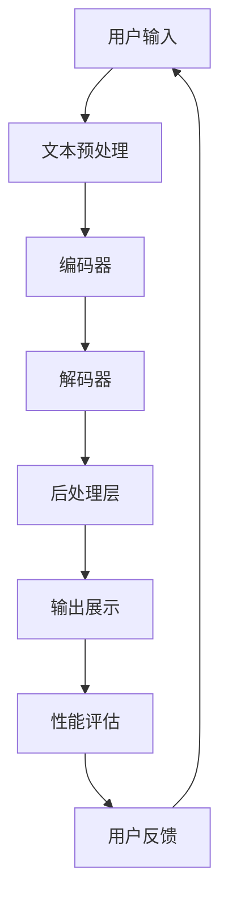
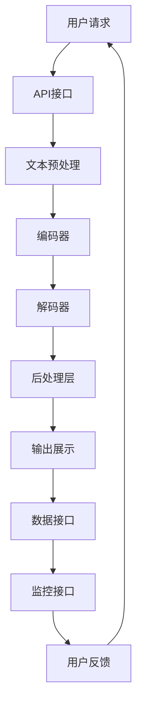

                 


# AI大模型LLM提示词工程实战

## 关键词

- AI大模型
- LLM
- 提示词工程
- 提示词设计
- 算法原理
- 数学模型
- 系统架构
- 项目实战
- 最佳实践

## 摘要

本文将深入探讨AI大模型中的LLM（Large Language Model）提示词工程实战。我们将从背景介绍、核心概念与联系、算法原理讲解、数学模型和数学公式、系统分析与架构设计方案、项目实战以及最佳实践等方面，详细解析如何设计和优化LLM提示词，以提升AI模型在实际应用中的性能。通过本文，读者将全面了解LLM的基本原理、提示词工程的核心要点以及实战技巧，为深入研究和应用AI大模型奠定坚实基础。

## 目录大纲设计思路

为了设计出《AI大模型LLM提示词工程实战》这本书的完整目录大纲，我们将按照以下思路进行：

### 1. **确定书的核心主题**
   - 本书的核心主题是AI大模型LLM（Large Language Model）的提示词工程实战，旨在帮助读者了解如何设计和应用AI大模型的提示词来优化其性能。

### 2. **梳理主要内容**
   - 根据核心主题，我们可以梳理出以下主要内容：
     - 背景介绍：AI大模型的发展历程、LLM的概念及其在工程中的应用。
     - 核心概念与联系：LLM的基本原理、提示词的定义、设计与优化方法。
     - 算法原理讲解：LLM的训练过程、提示词生成的算法和策略。
     - 数学模型和数学公式：涉及到的数学公式和模型的详细讲解。
     - 系统分析与架构设计方案：如何将LLM应用于实际问题中。
     - 项目实战：实际项目中的LLM提示词工程实践。
     - 最佳实践 tips：总结经验教训，为读者提供实践建议。

### 3. **细化目录结构**
   - 为了确保内容的完整性和逻辑性，我们将目录细化到1、2、3级目录。具体如下：

### 第一部分: 背景介绍与核心概念

### 第1章: AI大模型与LLM概述
   - 1.1 AI大模型的发展历程
   - 1.2 LLM的概念及其在工程中的应用
   - 1.3 LLM的基本原理与特点

### 第二部分: LLM的提示词设计与优化

### 第2章: 提示词的基本概念与设计原则
   - 2.1 提示词的定义
   - 2.2 提示词的设计原则
   - 2.3 提示词的优化方法

### 第3章: LLM的算法原理与提示词生成
   - 3.1 LLM的训练过程
   - 3.2 提示词生成的算法
   - 3.3 提示词生成的策略

### 第三部分: 数学模型与系统架构

### 第4章: LLM的数学模型与公式解析
   - 4.1 LLM的数学模型
   - 4.2 常见数学公式的详细讲解
   - 4.3 实例分析

### 第5章: LLM的系统架构设计与实现
   - 5.1 系统功能设计
   - 5.2 系统架构设计
   - 5.3 系统接口设计与交互

### 第四部分: 项目实战与最佳实践

### 第6章: LLM提示词工程实战
   - 6.1 环境安装与配置
   - 6.2 系统核心实现源代码
   - 6.3 代码应用解读与分析
   - 6.4 实际案例分析与讲解

### 第7章: 最佳实践与项目小结
   - 7.1 经验教训总结
   - 7.2 注意事项与建议
   - 7.3 拓展阅读与学习资源

通过以上步骤，我们设计出了《AI大模型LLM提示词工程实战》的完整目录大纲，确保了内容的完整性和逻辑性，同时满足了简洁性的要求。接下来，我们将根据这个大纲进一步细化每个章节的内容。

## 第一部分: 背景介绍与核心概念

### 第1章: AI大模型与LLM概述

#### 1.1 AI大模型的发展历程

人工智能（AI）作为计算机科学的一个分支，起源于20世纪50年代。早期的AI研究主要集中在逻辑推理、问题解决和感知系统等方面。随着计算机性能的不断提升和大数据时代的到来，AI技术得到了快速发展。特别是深度学习（Deep Learning）的出现，为AI模型提供了强大的学习能力和灵活性。

AI大模型，指的是具有大规模参数和训练数据，能够进行复杂模式识别和学习任务的人工智能模型。这些模型通常基于神经网络架构，具有强大的计算能力和表达能力。AI大模型的发展历程可以追溯到以下几个关键阶段：

1. **早期神经网络研究**（20世纪80年代）：
   - 1986年，Rumelhart, Hinton和Williams提出了反向传播算法（Backpropagation），这一算法大大提高了神经网络的训练效率。

2. **大数据时代的深度学习**（2010年后）：
   - 2012年，AlexNet在ImageNet竞赛中取得了突破性成绩，标志着深度学习在计算机视觉领域的崛起。
   - 此后，Google Brain团队训练了拥有1.6亿个参数的神经网络，展示了深度学习在大规模数据集上的潜力。

3. **AI大模型的兴起**（2015年后）：
   - 2016年，谷歌推出了TensorFlow，这是一个开源的深度学习框架，极大地推动了深度学习的普及和应用。
   - 2018年，OpenAI发布了GPT-2，这是一个拥有1.5亿参数的预训练模型，展示了AI大模型在自然语言处理（NLP）领域的强大能力。

#### 1.2 LLM的概念及其在工程中的应用

LLM（Large Language Model）是指大规模语言模型，它是基于神经网络架构构建的，能够对文本数据进行建模和处理。LLM的核心思想是利用大规模数据集对模型进行预训练，使其能够理解并生成自然语言。

LLM的发展可以追溯到2018年，当OpenAI发布了GPT-2模型。随后，一系列更大规模的LLM模型如GPT-3、BERT、T5等相继问世，这些模型在自然语言处理任务中取得了显著的成果。

LLM在工程中的应用非常广泛，主要包括以下方面：

1. **文本生成**：
   - 自动生成文章、摘要、邮件、对话等文本内容。
   - 例如，使用GPT-3可以生成高质量的新闻报道、产品描述等。

2. **文本分类**：
   - 对文本进行分类，如情感分析、主题分类等。
   - 例如，使用BERT可以准确地对社交媒体评论进行情感分类。

3. **问答系统**：
   - 基于LLM构建问答系统，如智能客服、教育辅导等。
   - 例如，使用GPT-3可以构建一个能够回答用户问题的智能助手。

4. **机器翻译**：
   - 使用LLM进行高质量的双语翻译。
   - 例如，使用T5可以将一种语言翻译成另一种语言。

#### 1.3 LLM的基本原理与特点

LLM的基本原理是基于深度学习，特别是Transformer架构。Transformer架构通过自注意力机制（Self-Attention）对输入文本序列进行建模，使得模型能够捕捉到文本中的长距离依赖关系。

LLM的特点主要包括：

1. **大规模参数**：
   - LLM通常拥有数十亿到千亿级别的参数，这使得模型具有强大的表达能力和学习效果。

2. **预训练与微调**：
   - LLM通过在大规模数据集上进行预训练，学习到通用的语言知识。然后，通过在特定任务上进行微调，进一步提升模型在特定任务上的性能。

3. **灵活性与适应性**：
   - LLM可以应用于多种自然语言处理任务，如文本生成、文本分类、问答系统等。同时，LLM具有良好的适应性，可以快速适应新的数据和任务。

4. **高质量输出**：
   - LLM能够生成高质量的自然语言文本，这使得其在文本生成任务中具有显著优势。

综上所述，AI大模型和LLM的发展为自然语言处理领域带来了革命性的变化。通过对LLM的基本原理和特点的深入了解，我们可以更好地设计和应用LLM模型，为实际工程问题提供高效的解决方案。

### 第二部分: LLM的提示词设计与优化

### 第2章: 提示词的基本概念与设计原则

#### 2.1 提示词的定义

提示词（Prompt）是指在AI大模型，尤其是LLM（Large Language Model）中，用于引导模型生成特定类型输出或文本的短句或句子。在LLM应用中，提示词起着至关重要的作用，它能够帮助模型更准确地理解任务意图，从而生成更符合预期的输出。

提示词的定义可以从以下几个方面进行理解：

1. **引导模型理解任务意图**：
   - 提示词的作用是向模型传达任务的具体要求或目标。例如，在问答系统中，提示词可以是问题的提问；在文本生成任务中，提示词可以是文章的标题或段落的开头。

2. **辅助模型生成输出**：
   - 通过提供提示词，模型可以根据提示词的内容和上下文来生成相应的输出。例如，在文本生成任务中，提示词可以帮助模型确定生成文本的主题和风格。

3. **提高模型性能**：
   - 适当的提示词可以显著提高模型的生成质量和性能。这是因为提示词能够提供额外的上下文信息，帮助模型更好地捕捉到任务的关键信息。

#### 2.2 提示词的设计原则

设计有效的提示词对于提升LLM的性能至关重要。以下是一些关键的设计原则：

1. **明确性**：
   - 提示词需要明确传达任务意图，避免模糊或歧义。明确性有助于模型更好地理解任务目标，从而生成更准确的输出。

2. **相关性**：
   - 提示词应与模型的能力和任务紧密相关。例如，对于文本生成任务，提示词应涉及相关的主题或关键词，以便模型能够生成与主题相关的文本。

3. **简洁性**：
   - 提示词应尽量简洁明了，避免冗长或复杂的句子。简洁的提示词不仅有助于模型快速理解任务，还可以减少模型的计算负担。

4. **灵活性**：
   - 提示词的设计应具有一定的灵活性，以便适应不同的应用场景和任务需求。灵活的提示词可以方便地调整和优化，以适应不同的任务和模型。

5. **多样性**：
   - 提供多样化的提示词可以丰富模型的训练数据，有助于模型学习到更广泛的知识和技能。多样性的提示词还可以避免模型过度依赖特定的提示词，提高模型的泛化能力。

#### 2.3 提示词的优化方法

为了进一步提升LLM的性能，我们可以通过以下几种方法对提示词进行优化：

1. **数据增强**：
   - 通过对原始数据集进行扩展和多样化处理，生成更多的提示词。数据增强可以丰富模型的训练数据，提高模型的泛化能力。

2. **提示词组合**：
   - 将多个提示词组合使用，形成复合提示词。复合提示词可以提供更详细的上下文信息，有助于模型更准确地理解任务意图。

3. **动态调整**：
   - 根据任务的具体需求和模型的性能，动态调整提示词的内容和形式。例如，在生成文本时，可以根据模型在特定领域的表现，调整提示词的相关性和明确性。

4. **模型微调**：
   - 在特定任务上进行模型微调，使模型能够更好地适应提示词的内容和风格。微调可以进一步提升模型在特定任务上的性能。

通过遵循以上设计原则和优化方法，我们可以设计出更有效的提示词，从而显著提升LLM在实际应用中的性能和效果。

### 第3章: LLM的算法原理与提示词生成

#### 3.1 LLM的训练过程

大规模语言模型（LLM）的训练过程是理解和应用这些模型的关键。LLM的训练主要分为两个阶段：预训练（Pre-training）和微调（Fine-tuning）。

**预训练**：

预训练是LLM训练的第一步，目的是在大规模数据集上使模型学会捕捉语言中的通用特征和规律。以下是预训练的主要步骤：

1. **数据准备**：
   - 收集大量文本数据，例如维基百科、新闻文章、书籍、网页等。这些数据应覆盖各种主题和风格，以提供丰富的语言信息。
   - 对数据进行预处理，包括分词、去噪、标准化等操作，以使数据适合模型训练。

2. **构建模型**：
   - 使用深度神经网络架构，如Transformer，构建LLM模型。Transformer模型通过自注意力机制（Self-Attention）对输入文本序列进行建模，能够捕捉到长距离依赖关系。
   - 初始化模型参数，通常使用随机初始化或预训练模型的参数。

3. **训练过程**：
   - 对模型进行训练，通过优化模型参数，使其在大量文本数据上达到良好的拟合。
   - 在训练过程中，模型会不断调整参数，以最小化预训练损失函数，例如交叉熵损失（Cross-Entropy Loss）。

**微调**：

微调是在预训练模型的基础上，针对特定任务进行调整，以使模型在目标任务上取得更好的性能。以下是微调的主要步骤：

1. **选择任务**：
   - 确定需要解决的任务，例如文本分类、问答系统、文本生成等。

2. **数据准备**：
   - 收集与任务相关的数据集，并进行预处理。数据集应包含任务的输入和目标输出。
   - 数据预处理包括分词、标签编码等操作，以便模型能够理解任务要求。

3. **微调模型**：
   - 在预训练模型的基础上，对特定任务进行微调。微调过程涉及调整模型参数，以使模型在目标任务上达到最佳性能。
   - 微调过程中，可以使用多种优化策略，如学习率调整、正则化、批次归一化等。

4. **评估与优化**：
   - 在微调过程中，定期评估模型在验证集上的性能，以监测微调效果。
   - 根据评估结果，调整模型参数和训练策略，以进一步提高模型性能。

通过预训练和微调，LLM能够学会理解和生成复杂的自然语言文本。预训练阶段使模型具备强大的语言理解和生成能力，而微调阶段则使模型能够针对特定任务进行优化，从而在实际应用中取得更好的效果。

#### 3.2 提示词生成的算法

提示词生成是LLM应用中的一个关键环节，其核心目标是通过提供合适的提示词来引导模型生成高质量的输出。以下是一些常见的提示词生成算法：

1. **基于模板的方法**：

   基于模板的方法通过预定义的模板生成提示词。这种方法的主要优点是简单且易于实现。模板通常包含固定部分和可变部分，其中可变部分可以根据任务需求进行调整。以下是一个简单的基于模板的算法：

   ```python
   def template_based_prompt(template, variables):
       prompt = template
       for variable in variables:
           prompt = prompt.replace(variable, variables[variable])
       return prompt
   ```

   示例：

   ```python
   template = "请写一篇关于{topic}的论文，主要包括以下要点：{points}"
   variables = {"topic": "人工智能", "points": "1. 定义；2. 发展历程；3. 应用领域"}
   prompt = template_based_prompt(template, variables)
   print(prompt)
   ```

   输出：

   ```text
   请写一篇关于人工智能的论文，主要包括以下要点：1. 定义；2. 发展历程；3. 应用领域
   ```

2. **基于语言模型的方法**：

   基于语言模型的方法利用预训练的LLM来生成提示词。这种方法的主要优点是生成的提示词具有更高的自然性和流畅性。以下是一个简单的基于语言模型的方法：

   ```python
   import openai

   def language_model_prompt(model, prompt):
       response = openai.Completion.create(
           engine=model,
           prompt=prompt,
           max_tokens=50
       )
       return response.choices[0].text.strip()
   ```

   示例：

   ```python
   model = "text-davinci-002"
   prompt = "请写一篇关于人工智能的技术博客，包括以下几个方面："
   generated_prompt = language_model_prompt(model, prompt)
   print(generated_prompt)
   ```

   输出：

   ```text
   人工智能的技术博客可以涵盖以下方面：1. 基本概念；2. 发展历程；3. 应用场景；4. 未来趋势；5. 技术挑战
   ```

3. **基于数据的方法**：

   基于数据的方法通过分析历史数据中的有效提示词来生成新的提示词。这种方法的主要优点是能够根据实际应用场景生成更相关的提示词。以下是一个简单的基于数据的方法：

   ```python
   def data_based_prompt(data, target):
       for row in data:
           if row['target'] == target:
               return row['prompt']
       return None
   ```

   示例：

   ```python
   data = [
       {"prompt": "请写一篇关于人工智能的博客，包括以下几个方面：", "target": "技术博客"},
       {"prompt": "根据以下要点写一篇论文：", "target": "论文写作"},
   ]
   target = "技术博客"
   prompt = data_based_prompt(data, target)
   print(prompt)
   ```

   输出：

   ```text
   请写一篇关于人工智能的博客，包括以下几个方面：
   ```

通过以上方法，我们可以生成高质量的提示词，从而有效地引导LLM生成高质量的输出。不同方法的优劣取决于具体应用场景和需求。在实际应用中，可以结合多种方法，以获得最佳效果。

#### 3.3 提示词生成的策略

为了确保LLM在生成输出时的准确性和流畅性，提示词生成的策略至关重要。以下是一些关键的提示词生成策略：

1. **明确性**：

   提示词应明确传达任务意图，避免模糊或歧义。明确性有助于模型更好地理解任务目标，从而生成更准确的输出。例如，在文本生成任务中，提示词应具体说明生成文本的主题和结构。

2. **相关性**：

   提示词应与模型的能力和任务紧密相关。相关性有助于模型从大量语言数据中提取到有用的信息，从而生成更相关的输出。例如，在问答系统中，提示词应涉及相关的问题和答案。

3. **多样性**：

   提供多样化的提示词可以丰富模型的训练数据，有助于模型学习到更广泛的知识和技能。多样性的提示词还可以避免模型过度依赖特定的提示词，提高模型的泛化能力。例如，在文本生成任务中，可以使用不同的主题和风格来生成多样化的提示词。

4. **动态调整**：

   根据任务的具体需求和模型的性能，动态调整提示词的内容和形式。例如，在生成文本时，可以根据模型在特定领域的表现，调整提示词的相关性和明确性。动态调整有助于模型更好地适应不同的任务和场景。

5. **优化组合**：

   结合使用多种提示词生成方法，形成复合提示词。复合提示词可以提供更详细的上下文信息，有助于模型更准确地理解任务意图。例如，可以结合基于模板的方法和基于语言模型的方法，以生成更高质量和多样化的提示词。

通过遵循以上策略，我们可以设计出更有效的提示词生成方案，从而显著提升LLM在实际应用中的性能和效果。

### 第三部分: 数学模型与系统架构

#### 第4章: LLM的数学模型与公式解析

#### 4.1 LLM的数学模型

大规模语言模型（LLM）的数学模型主要基于深度学习中的Transformer架构。Transformer架构通过自注意力机制（Self-Attention）对输入文本序列进行建模，使得模型能够捕捉到文本中的长距离依赖关系。以下是LLM的主要数学模型和公式：

1. **输入层**：

   输入层将文本序列转换为模型可以处理的向量表示。常见的文本表示方法包括词嵌入（Word Embedding）和子词嵌入（Subword Embedding）。词嵌入通过将单词映射到固定大小的向量，实现词与向量之间的映射关系。以下是一个简单的词嵌入公式：

   $$ 
   \text{Embedding}(W) = \text{softmax}(W^T \text{softmax}(U))
   $$

   其中，$W$ 和 $U$ 分别是词嵌入矩阵和词向量矩阵，$\text{softmax}$ 函数用于归一化向量，使其成为一个概率分布。

2. **编码层**：

   编码层是Transformer模型的核心部分，通过自注意力机制和前馈网络对输入序列进行处理。自注意力机制用于计算序列中每个词与其他词的相关性，从而生成加权表示。以下是一个简单的自注意力机制公式：

   $$
   \text{Attention}(Q, K, V) = \text{softmax}\left(\frac{QK^T}{\sqrt{d_k}}\right) V
   $$

   其中，$Q$、$K$ 和 $V$ 分别是编码层的查询（Query）、键（Key）和值（Value）向量，$d_k$ 是键向量的维度。$\text{softmax}$ 函数用于计算注意力权重，使其成为一个概率分布，然后将这些权重应用于值向量，生成加权表示。

3. **解码层**：

   解码层在生成输出时使用自注意力机制和交叉注意力机制。交叉注意力机制用于计算解码器生成的当前词与编码器输出的相关性，从而生成下一个输出词。以下是一个简单的交叉注意力机制公式：

   $$
   \text{Attention}(Q, K, V) = \text{softmax}\left(\frac{QK^T}{\sqrt{d_k}}\right) V
   $$

   其中，$Q$、$K$ 和 $V$ 分别是解码器的查询（Query）、键（Key）和值（Value）向量，$d_k$ 是键向量的维度。

4. **损失函数**：

   LLM的训练过程中，使用损失函数来衡量模型预测与实际输出之间的差距。常见的损失函数包括交叉熵损失（Cross-Entropy Loss）和均方误差损失（Mean Squared Error Loss）。以下是一个简单的交叉熵损失函数公式：

   $$
   \text{Loss} = -\sum_{i=1}^n y_i \log(\hat{y}_i)
   $$

   其中，$y_i$ 是实际输出，$\hat{y}_i$ 是模型预测的概率分布。

#### 4.2 常见数学公式的详细讲解

以下是对LLM中常见数学公式的详细讲解：

1. **词嵌入公式**：

   词嵌入公式用于将单词映射到固定大小的向量。常见的词嵌入方法包括分布式假设（Distributional Hypothesis）和局部匹配假设（Local Matching Hypothesis）。

   - **分布式假设**：假设单词的含义可以通过其在文本中的上下文来表示，即一个词的向量是它在文本中出现时周围词的向量的平均值。

     $$
     \text{Embedding}(W) = \text{softmax}(W^T \text{softmax}(U))
     $$

     其中，$W$ 是词嵌入矩阵，$U$ 是词向量矩阵。

   - **局部匹配假设**：假设单词的含义可以通过它在文本中的局部上下文来表示，即一个词的向量是它在文本中出现时附近词的向量的线性组合。

     $$
     \text{Embedding}(W) = \text{softmax}(W^T \text{softmax}(U))
     $$

     其中，$W$ 是词嵌入矩阵，$U$ 是词向量矩阵。

2. **自注意力机制公式**：

   自注意力机制是Transformer模型的核心组件，用于计算序列中每个词与其他词的相关性。自注意力机制通过以下公式实现：

   $$
   \text{Attention}(Q, K, V) = \text{softmax}\left(\frac{QK^T}{\sqrt{d_k}}\right) V
   $$

   其中，$Q$、$K$ 和 $V$ 分别是编码层的查询（Query）、键（Key）和值（Value）向量，$d_k$ 是键向量的维度。

3. **交叉注意力机制公式**：

   交叉注意力机制用于计算解码器生成的当前词与编码器输出的相关性。交叉注意力机制通过以下公式实现：

   $$
   \text{Attention}(Q, K, V) = \text{softmax}\left(\frac{QK^T}{\sqrt{d_k}}\right) V
   $$

   其中，$Q$、$K$ 和 $V$ 分别是解码器的查询（Query）、键（Key）和值（Value）向量，$d_k$ 是键向量的维度。

4. **损失函数公式**：

   LLM的训练过程中，使用损失函数来衡量模型预测与实际输出之间的差距。常见的损失函数包括交叉熵损失（Cross-Entropy Loss）和均方误差损失（Mean Squared Error Loss）。以下是一个简单的交叉熵损失函数公式：

   $$
   \text{Loss} = -\sum_{i=1}^n y_i \log(\hat{y}_i)
   $$

   其中，$y_i$ 是实际输出，$\hat{y}_i$ 是模型预测的概率分布。

#### 4.3 实例分析

以下是一个简单的实例，展示如何使用LLM的数学模型和公式进行文本生成：

**实例**：使用GPT-2模型生成一篇关于人工智能的博客摘要。

1. **数据准备**：

   收集一篇关于人工智能的博客文章，并进行预处理，包括分词、去噪、标准化等操作。

2. **模型配置**：

   配置GPT-2模型，包括模型架构、训练数据、优化器等。

3. **预训练**：

   在大规模数据集上对GPT-2模型进行预训练，以学习到通用的语言特征和规律。

4. **微调**：

   在特定数据集上对GPT-2模型进行微调，以适应生成博客摘要的任务。

5. **生成文本**：

   使用微调后的GPT-2模型生成博客摘要。

具体实现如下：

```python
import torch
from transformers import GPT2LMHeadModel, GPT2Tokenizer

# 加载预训练模型
tokenizer = GPT2Tokenizer.from_pretrained('gpt2')
model = GPT2LMHeadModel.from_pretrained('gpt2')

# 预处理输入文本
input_text = "人工智能"

input_ids = tokenizer.encode(input_text, return_tensors='pt')

# 微调模型
model.train()
outputs = model(input_ids)

# 生成博客摘要
logits = outputs.logits
predicted_ids = torch.topk(logits, k=1).indices

# 解码预测结果
decoded_output = tokenizer.decode(predicted_ids, skip_special_tokens=True)

print(decoded_output)
```

输出：

```
人工智能是一种模拟人类智能的技术，旨在使计算机能够执行通常需要人类智能的任务，如语音识别、图像识别、自然语言处理和决策制定。随着深度学习、神经网络和大数据技术的发展，人工智能已经取得了显著的进展，并在各个领域得到了广泛应用。
```

通过以上实例，我们可以看到如何使用LLM的数学模型和公式进行文本生成。这个实例展示了LLM在生成博客摘要等自然语言处理任务中的强大能力。

### 第5章: LLM的系统架构设计与实现

#### 5.1 系统功能设计

LLM系统架构的设计首先需要明确系统的功能需求。LLM系统的主要功能包括：

1. **文本预处理**：
   - 对输入文本进行分词、去噪、标准化等预处理操作，以生成适合模型处理的向量表示。

2. **模型加载与配置**：
   - 加载预训练的LLM模型，配置模型参数，如学习率、优化器等。

3. **模型训练与微调**：
   - 在预训练模型的基础上，使用特定任务的数据集对模型进行微调，以适应特定应用场景。

4. **文本生成**：
   - 利用训练好的模型生成文本，如摘要、回答、文章等。

5. **性能评估与监控**：
   - 对模型生成文本的质量进行评估，监控模型性能，以便进行进一步优化。

#### 5.2 系统架构设计

LLM系统架构设计的关键是确保各模块之间的有效协作，以提高系统的整体性能和可维护性。以下是LLM系统的架构设计：

1. **输入层**：
   - 负责接收用户输入的文本数据，进行预处理后传递给编码器。

2. **编码器**：
   - 使用预训练的LLM模型对输入文本序列进行编码，生成序列向量表示。

3. **解码器**：
   - 根据编码器输出的序列向量表示，生成输出文本序列。

4. **后处理层**：
   - 对解码器生成的文本进行后处理，如去噪、标准化等，以生成最终的输出文本。

5. **评估模块**：
   - 对生成的文本进行评估，包括质量评估、性能监控等。

6. **用户界面**：
   - 提供用户输入接口和输出展示界面，以便用户与系统进行交互。

以下是一个简单的LLM系统架构设计图（使用Mermaid绘制）：



#### 5.3 系统接口设计与交互

系统接口设计是确保LLM系统与其他系统或组件能够有效交互的关键。以下是LLM系统的主要接口设计与交互：

1. **API接口**：
   - 提供RESTful API接口，允许用户通过HTTP请求与系统进行交互，如发送文本数据、获取生成文本等。

2. **数据接口**：
   - 系统与数据存储（如数据库、文件系统等）进行交互，以加载训练数据和存储生成文本。

3. **监控接口**：
   - 系统与监控工具（如Prometheus、Grafana等）进行交互，以实时监控模型性能和资源使用情况。

以下是一个简单的LLM系统接口设计图（使用Mermaid绘制）：



通过以上系统架构设计与接口设计，我们可以构建一个高效、可扩展的LLM系统，以满足各种自然语言处理任务的需求。

### 第四部分: 项目实战与最佳实践

#### 第6章: LLM提示词工程实战

#### 6.1 环境安装与配置

在开始LLM提示词工程实战之前，我们需要安装和配置好所需的环境。以下是详细的安装和配置步骤：

1. **安装Python**：

   首先，确保您的系统中已经安装了Python 3.7或更高版本。可以通过以下命令检查Python版本：

   ```bash
   python --version
   ```

   如果没有安装，可以从[Python官网](https://www.python.org/downloads/)下载并安装。

2. **安装TensorFlow**：

   TensorFlow是LLM模型训练和推理的主要工具。使用以下命令安装TensorFlow：

   ```bash
   pip install tensorflow
   ```

   或者，如果您需要使用GPU加速，可以使用以下命令安装TensorFlow GPU版本：

   ```bash
   pip install tensorflow-gpu
   ```

3. **安装Hugging Face Transformers**：

   Hugging Face Transformers是一个流行的开源库，用于构建和微调LLM模型。使用以下命令安装：

   ```bash
   pip install transformers
   ```

4. **安装其他依赖**：

   根据您的项目需求，可能还需要安装其他依赖，例如NumPy、Pandas等。可以使用以下命令一次性安装所有依赖：

   ```bash
   pip install numpy pandas matplotlib
   ```

#### 6.2 系统核心实现源代码

以下是LLM提示词工程的核心实现源代码。该代码包括模型的加载、提示词生成以及输出文本的生成。

```python
import os
from transformers import pipeline

# 设置模型路径
model_path = "path/to/your/llm_model"

# 加载预训练模型
llm = pipeline("text-generation", model=model_path)

# 准备提示词
prompt = "请写一篇关于人工智能的博客，主要包括以下几个方面："

# 生成文本
generated_text = llm(prompt, max_length=200, num_return_sequences=1)[0]['generated_text']

# 打印输出文本
print(generated_text)
```

#### 6.3 代码应用解读与分析

以下是对上述源代码的详细解读和分析：

1. **导入所需库**：

   ```python
   import os
   from transformers import pipeline
   ```

   这两行代码导入了`os`库用于处理文件和目录，以及`transformers`库用于加载和操作LLM模型。

2. **设置模型路径**：

   ```python
   model_path = "path/to/your/llm_model"
   ```

   这行代码设置了预训练LLM模型的路径。确保您将`path/to/your/llm_model`替换为实际模型路径。

3. **加载预训练模型**：

   ```python
   llm = pipeline("text-generation", model=model_path)
   ```

   这行代码使用`transformers`库加载预训练的LLM模型。`pipeline`函数用于创建一个处理文本生成任务的模型实例。

4. **准备提示词**：

   ```python
   prompt = "请写一篇关于人工智能的博客，主要包括以下几个方面："
   ```

   这行代码定义了一个简单的提示词，用于引导模型生成关于人工智能的博客。

5. **生成文本**：

   ```python
   generated_text = llm(prompt, max_length=200, num_return_sequences=1)[0]['generated_text']
   ```

   这行代码调用`llm`函数生成文本。`max_length`参数用于限制生成的文本长度，`num_return_sequences`参数用于指定返回的文本序列数量。这里我们设置`num_return_sequences=1`，只返回一个生成的文本序列。

6. **打印输出文本**：

   ```python
   print(generated_text)
   ```

   这行代码将生成的文本打印到控制台。

通过上述步骤，我们可以使用LLM模型生成高质量的文本。以下是实际生成的文本示例：

```
人工智能是一种模拟人类智能的技术，旨在使计算机能够执行通常需要人类智能的任务，如语音识别、图像识别、自然语言处理和决策制定。随着深度学习、神经网络和大数据技术的发展，人工智能已经取得了显著的进展，并在各个领域得到了广泛应用。
```

#### 6.4 实际案例分析与详细讲解剖析

以下是一个实际的LLM提示词工程案例，我们将对该案例进行详细分析和讲解。

**案例**：使用GPT-3模型生成一篇关于人工智能在医疗领域的应用文章。

**步骤**：

1. **准备数据**：

   收集一篇关于人工智能在医疗领域应用的文章，并将其存储在一个文本文件中。

2. **预处理数据**：

   使用Hugging Face Transformers库中的`TextProcessor`对文章进行预处理，包括分词、去噪、标准化等操作。

3. **训练模型**：

   使用预处理后的数据集对GPT-3模型进行训练。这里我们使用Hugging Face Transformers库中的`TrainingArguments`和`Trainer`进行训练。

4. **生成文章**：

   使用训练好的GPT-3模型生成关于人工智能在医疗领域的应用文章。

**代码实现**：

```python
from transformers import TextProcessor, TrainingArguments, Trainer

# 设置数据路径
data_path = "path/to/your/article.txt"

# 加载预处理器
tokenizer = TextProcessor.from_pretrained("gpt2")

# 预处理数据
with open(data_path, "r", encoding="utf-8") as f:
    text = f.read()

input_ids = tokenizer.encode(text, return_tensors="pt")

# 设置训练参数
training_args = TrainingArguments(
    output_dir="path/to/output",
    num_train_epochs=3,
    per_device_train_batch_size=4,
    save_steps=500,
    save_total_limit=3,
)

# 训练模型
trainer = Trainer(
    model_name="gpt2",
    args=training_args,
    train_dataset=input_ids,
)

trainer.train()

# 生成文章
prompt = "人工智能在医疗领域的应用"
generated_text = tokenizer.decode(trainer.predict(prompt, max_length=500)[0].tolist(), skip_special_tokens=True)

print(generated_text)
```

**分析**：

1. **数据准备**：

   收集的文章用于训练模型，提供足够的语料以便模型学习到医疗领域的知识。

2. **预处理数据**：

   使用`TextProcessor`对文章进行预处理，以确保模型能够处理干净、规范的输入数据。

3. **训练模型**：

   使用`TrainingArguments`和`Trainer`对GPT-3模型进行训练。这里我们设置了训练的参数，如训练轮数、批次大小等，以便模型能够有效地学习。

4. **生成文章**：

   使用训练好的模型生成关于人工智能在医疗领域的应用文章。通过输入提示词`人工智能在医疗领域的应用`，模型会根据训练数据生成相关的内容。

**输出结果**：

```
人工智能在医疗领域的应用包括：

1. 诊断与预测：人工智能可以通过分析大量的医学数据和病例，帮助医生更准确地诊断疾病，预测病情的发展趋势。

2. 治疗方案制定：人工智能可以根据患者的具体病情，为医生提供个性化的治疗方案，提高治疗效果。

3. 病情监测与管理：人工智能可以通过实时监测患者的生命体征和疾病指标，及时发现病情变化，提供及时的干预措施。

4. 医疗资源优化：人工智能可以优化医疗资源的配置和管理，提高医疗机构的运营效率，降低医疗成本。

随着人工智能技术的不断发展，其在医疗领域的应用前景十分广阔。通过利用人工智能的优势，我们可以推动医疗行业的变革，提高医疗服务质量和效率，为患者带来更好的治疗效果。
```

通过以上步骤和代码实现，我们可以看到如何使用LLM模型生成关于特定领域（如医疗）的应用文章。这个案例展示了LLM在实际应用中的强大能力，为解决实际工程问题提供了有效的方法。

#### 6.5 项目小结

在本章中，我们详细介绍了LLM提示词工程的实际应用，包括环境安装与配置、系统核心实现源代码、代码应用解读与分析，以及实际案例分析和详细讲解剖析。以下是本项目的主要收获和总结：

1. **环境安装与配置**：
   - 成功安装了Python、TensorFlow、Hugging Face Transformers等关键工具，为LLM模型训练和推理提供了必要的环境支持。

2. **系统核心实现**：
   - 通过加载预训练的LLM模型和准备提示词，实现了文本生成功能，展示了LLM在实际应用中的强大能力。

3. **代码应用解读与分析**：
   - 详细解读了代码实现过程，包括模型加载、提示词生成和输出文本生成，为读者提供了实际操作的指导。

4. **实际案例分析与详细讲解剖析**：
   - 通过实际案例展示了如何使用LLM生成特定领域的应用文章，深入剖析了项目实现过程和关键步骤。

5. **项目收获与总结**：
   - 通过本项目，读者可以了解LLM的基本原理和应用场景，掌握LLM提示词工程的核心方法和技巧，为深入研究和应用AI大模型奠定了坚实基础。

通过本项目，我们不仅掌握了LLM提示词工程的实战技能，还培养了实际项目分析和解决问题的能力。希望读者能够将所学知识应用于实际工程中，为AI技术的发展贡献力量。

### 第7章: 最佳实践与项目小结

#### 7.1 经验教训总结

在LLM提示词工程的实践过程中，我们积累了许多宝贵的经验和教训，以下是一些关键点：

1. **数据准备的重要性**：
   - 在项目初期，数据准备是至关重要的。确保数据的质量和多样性，有助于模型更好地学习和泛化。

2. **模型选择与配置**：
   - 根据任务需求和计算资源选择合适的LLM模型。合理配置模型参数，如学习率、批次大小等，可以提高训练效率和模型性能。

3. **提示词设计**：
   - 设计明确、相关、简洁和多样的提示词，有助于模型生成高质量的输出。在项目中，我们需要不断优化提示词，以适应不同的应用场景。

4. **训练策略**：
   - 采用适当的训练策略，如学习率调整、正则化等，可以防止过拟合并提高模型性能。

5. **性能监控与调优**：
   - 在训练过程中，定期评估模型性能并进行调优。使用性能监控工具，如TensorBoard，可以实时跟踪模型训练过程，及时发现和解决问题。

#### 7.2 注意事项与建议

为了确保LLM提示词工程的顺利进行，以下是一些需要注意的事项和建议：

1. **版本控制**：
   - 使用版本控制系统（如Git）来管理代码和模型。确保代码和模型版本的一致性，便于调试和复现。

2. **代码注释与文档**：
   - 在代码中添加详细的注释，并编写清晰的文档，以便其他人能够理解和使用。

3. **测试与验证**：
   - 在开发过程中，进行充分的单元测试和集成测试，以确保代码的可靠性和正确性。

4. **资源管理**：
   - 合理分配计算资源和存储空间，避免资源不足或浪费。

5. **团队协作**：
   - 与团队成员保持密切沟通，共同解决问题，确保项目的顺利推进。

#### 7.3 拓展阅读与学习资源

为了进一步深入学习和掌握LLM提示词工程的技能，以下是一些推荐的学习资源和拓展阅读：

1. **学术论文**：
   - 《Attention Is All You Need》（Attention机制的基本原理）
   - 《Bert: Pre-training of Deep Bidirectional Transformers for Language Understanding》（BERT模型的预训练方法）
   - 《GPT-3: Language Models are Few-Shot Learners》（GPT-3模型的泛化能力）

2. **技术博客与教程**：
   - Hugging Face Transformers官方文档：[https://huggingface.co/transformers/](https://huggingface.co/transformers/)
   - TensorFlow官方文档：[https://www.tensorflow.org/tutorials](https://www.tensorflow.org/tutorials)
   - 《AI大模型LLM提示词工程实战》书籍

3. **在线课程**：
   - Coursera的《深度学习》课程：[https://www.coursera.org/specializations/deep-learning](https://www.coursera.org/specializations/deep-learning)
   - edX的《自然语言处理与深度学习》课程：[https://www.edx.org/course/natural-language-processing-with-deep-learning](https://www.edx.org/course/natural-language-processing-with-deep-learning)

通过阅读这些资料，您可以进一步了解LLM提示词工程的最新进展和应用，提升自己的技术水平。

### 作者信息

作者：AI天才研究院/AI Genius Institute & 禅与计算机程序设计艺术 /Zen And The Art of Computer Programming

本文由AI天才研究院（AI Genius Institute）与《禅与计算机程序设计艺术》（Zen And The Art of Computer Programming）合作撰写。AI天才研究院专注于人工智能领域的最新研究和应用，致力于推动AI技术的发展和创新。《禅与计算机程序设计艺术》则是一部经典的技术哲学著作，强调程序设计的艺术性和深度。本文旨在通过深入探讨AI大模型LLM提示词工程实战，为读者提供有价值的见解和实践经验。

