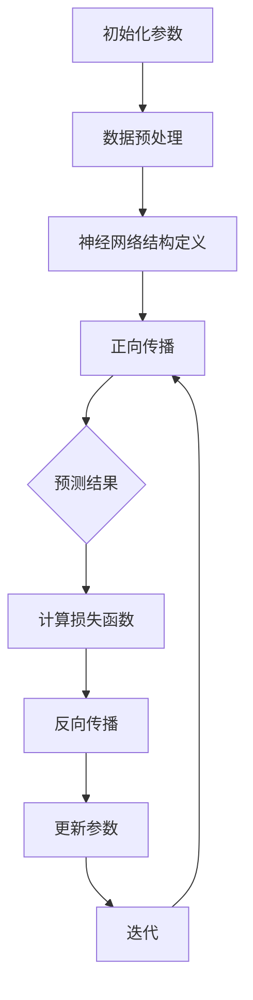
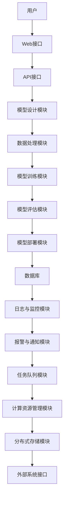
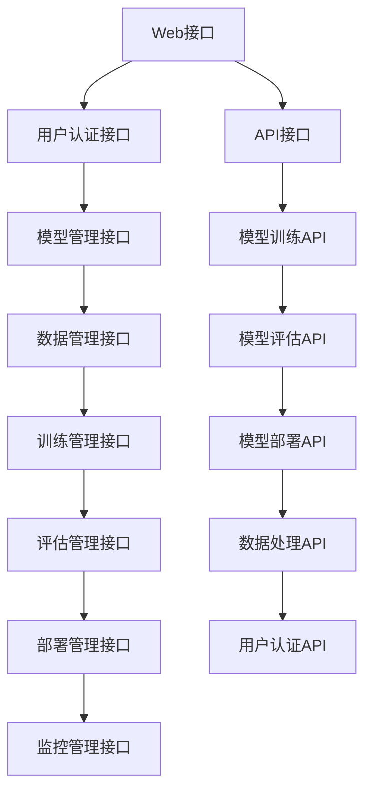
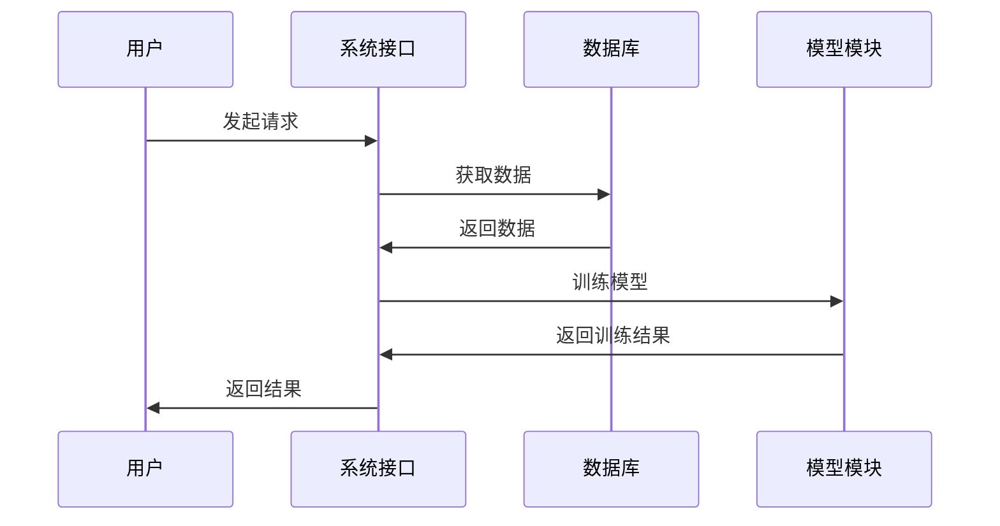
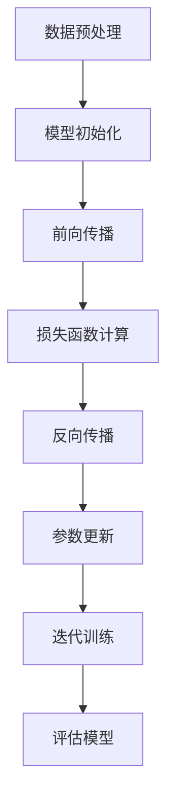
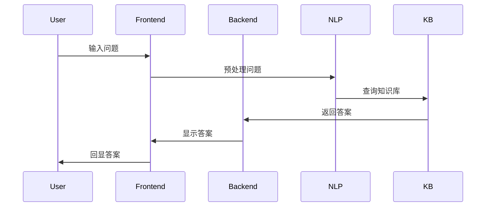

                 

# AI大模型与人类程序员的协作模式

> 关键词：AI大模型、人类程序员、协作模式、算法原理、系统架构、实战案例

> 摘要：本文深入探讨了AI大模型与人类程序员的协作模式，从背景介绍、核心概念、算法原理、系统架构、实战案例等方面进行详细分析。文章旨在为读者提供一个全面理解AI大模型与人类程序员协作机制的机会，并展望其未来发展。

## 目录

1. **背景介绍**
   1.1 AI大模型简介
   1.2 人类程序员的协作模式
   1.3 AI大模型与人类程序员协作的意义

2. **核心概念与联系**
   2.1 AI大模型的核心概念
   2.2 人类程序员的角色和职责
   2.3 协作模式的分类与比较

3. **算法原理讲解**
   3.1 算法原理概述
   3.2 算法mermaid流程图
   3.3 Python源代码讲解
   3.4 算法原理的数学模型和公式

4. **系统分析与架构设计方案**
   4.1 问题场景介绍
   4.2 系统功能设计
   4.3 系统架构设计
   4.4 系统接口设计
   4.5 系统交互mermaid序列图

5. **项目实战**
   5.1 环境安装
   5.2 系统核心实现源代码
   5.3 代码应用解读与分析
   5.4 实际案例分析与讲解
   5.5 项目小结

6. **最佳实践 tips**
   6.1 协作模式最佳实践
   6.2 注意事项
   6.3 拓展阅读

7. **小结**
   7.1 本文回顾
   7.2 未来的研究方向

8. **作者信息**

## 1. 背景介绍

### 1.1 AI大模型简介

人工智能（AI）在过去几十年里经历了飞速的发展。从最初的规则驱动和知识表示方法，到基于数据的学习算法，再到如今的大模型时代，AI技术已经取得了显著的进步。尤其是近年来，随着计算能力的提升和海量数据的积累，AI大模型应运而生。

AI大模型，通常指的是拥有数百万至数十亿参数的神经网络模型。这些模型能够在各种任务上表现出色，如自然语言处理、计算机视觉、语音识别等。例如，GPT-3、BERT、Megatron等模型，都是AI大模型的代表。这些大模型通过深度学习算法，能够自动从数据中学习复杂的模式，并应用于实际问题解决中。

### 1.2 人类程序员的协作模式

在AI大模型时代，人类程序员的角色和职责也在发生着变化。传统的编程模式是程序员编写代码、调试代码，而如今，程序员更多地是作为AI大模型的设计者、调优者、管理者。他们需要理解AI大模型的工作原理，能够有效地与AI大模型协作，以提高开发效率和系统性能。

人类程序员的协作模式主要包括以下几个方面：

- **模型设计**：程序员需要根据具体任务设计合适的模型结构，选择合适的算法和超参数。
- **数据处理**：程序员需要处理大量的数据，进行数据清洗、数据增强等操作，以供模型训练使用。
- **模型训练**：程序员需要监督模型训练过程，调整模型参数，优化模型性能。
- **模型部署**：程序员需要将训练好的模型部署到实际应用中，进行实时预测和决策。

### 1.3 AI大模型与人类程序员的协作意义

AI大模型与人类程序员的协作具有重要的意义。首先，AI大模型能够处理复杂的数据和任务，程序员可以利用这些强大的工具，提高工作效率。其次，人类程序员能够对AI大模型进行优化和调整，使其更好地适应具体应用场景。最后，AI大模型与人类程序员的协作，能够推动人工智能技术的创新和发展，带来更多的应用场景和商业价值。

## 2. 核心概念与联系

### 2.1 AI大模型的核心概念

AI大模型的核心概念包括以下几个方面：

- **神经网络**：神经网络是AI大模型的基础，它由多层神经元组成，通过调整神经元之间的权重来学习数据中的特征。
- **参数**：参数是神经网络模型中的可调整变量，通常用来表示神经元之间的连接强度。
- **深度**：深度是指神经网络中的层数，深度越大，模型的能力越强。
- **激活函数**：激活函数用于确定神经元的输出，常见的激活函数包括Sigmoid、ReLU等。
- **优化算法**：优化算法用于调整模型参数，以最小化损失函数，常见的优化算法包括随机梯度下降（SGD）、Adam等。

### 2.2 人类程序员的角色和职责

人类程序员的角色和职责主要包括以下几个方面：

- **模型设计**：程序员需要根据任务需求设计模型结构，选择合适的算法和超参数。
- **数据处理**：程序员需要处理数据，进行数据清洗、数据增强等操作，以提高模型性能。
- **模型训练**：程序员需要监督模型训练过程，调整模型参数，优化模型性能。
- **模型部署**：程序员需要将训练好的模型部署到实际应用中，进行实时预测和决策。

### 2.3 协作模式的分类与比较

AI大模型与人类程序员的协作模式可以分为以下几类：

- **监督协作**：程序员负责模型设计、数据预处理和模型训练，AI大模型则负责数据分析和预测。
- **半监督协作**：程序员负责模型设计和部分数据预处理，AI大模型则负责自动完成数据分析和预测。
- **无监督协作**：程序员只需提供数据，AI大模型能够自动完成数据分析和预测。
- **混合协作**：程序员和AI大模型共同参与模型设计、数据预处理和模型训练。

不同协作模式的比较如下表所示：

| 协作模式 | 优点 | 缺点 |
| --- | --- | --- |
| 监督协作 | 程序员控制性强，模型性能可控 | 需要大量标注数据 |
| 半监督协作 | 减少标注数据需求，提高效率 | 需要部分监督数据 |
| 无监督协作 | 无需标注数据，自适应性强 | 模型性能难以保证 |
| 混合协作 | 结合了监督协作和无监督协作的优点 | 需要程序员和AI大模型的高效协作 |

## 3. 算法原理讲解

### 3.1 算法原理概述

在AI大模型与人类程序员的协作中，算法原理起着至关重要的作用。算法原理包括以下几个方面：

- **神经网络**：神经网络是AI大模型的核心，通过多层神经元的组合，实现数据的特征提取和模式识别。
- **损失函数**：损失函数用于评估模型预测结果与真实结果之间的差距，常见的损失函数包括均方误差（MSE）、交叉熵损失等。
- **优化算法**：优化算法用于调整模型参数，以最小化损失函数，常见的优化算法包括随机梯度下降（SGD）、Adam等。
- **正则化**：正则化用于防止模型过拟合，常见的正则化方法包括L1正则化、L2正则化等。

### 3.2 算法mermaid流程图

下面是神经网络算法的mermaid流程图：



### 3.3 Python源代码讲解

下面是神经网络算法的Python源代码示例：

```python
import tensorflow as tf

# 初始化参数
weights = tf.random.normal([784, 10])
biases = tf.random.normal([10])

# 数据预处理
X = tf.placeholder(tf.float32, [None, 784])
y = tf.placeholder(tf.float32, [None, 10])

# 神经网络结构定义
hidden_layer = tf.nn.relu(tf.matmul(X, weights) + biases)

# 正向传播
预测 = tf.nn.softmax(hidden_layer)

# 计算损失函数
交叉熵损失 = tf.reduce_mean(tf.reduce_sum(-y * tf.log(预测), reduction_indices=1))

# 反向传播
梯度 = tf.gradients(交叉熵损失, [weights, biases])

# 更新参数
optimizer = tf.train.GradientDescentOptimizer(learning_rate=0.001)
train_op = optimizer.minimize(交叉熵损失)

# 迭代
with tf.Session() as sess:
    for epoch in range(num_epochs):
        _, loss = sess.run([train_op, 交叉熵损失], feed_dict={X: X_data, y: y_data})
        if epoch % 100 == 0:
            print("Epoch:", epoch, "Loss:", loss)
```

### 3.4 算法原理的数学模型和公式

神经网络算法的数学模型和公式如下：

- **正向传播**：
  $$ z_i = \sum_{j=1}^{n} w_{ij} x_j + b_i $$
  $$ a_i = \sigma(z_i) $$
  其中，$z_i$是第$i$个神经元的输入，$w_{ij}$是连接权重，$b_i$是偏置，$\sigma$是激活函数。

- **反向传播**：
  $$ \delta_i = (a_i - t_i) \cdot \sigma'(z_i) $$
  $$ \frac{\partial L}{\partial w_{ij}} = x_j \delta_i $$
  $$ \frac{\partial L}{\partial b_i} = \delta_i $$

  其中，$\delta_i$是第$i$个神经元的误差，$t_i$是第$i$个神经元的真实输出，$\sigma'$是激活函数的导数。

- **优化算法**（随机梯度下降）：
  $$ w_{ij} := w_{ij} - \alpha \frac{\partial L}{\partial w_{ij}} $$
  $$ b_i := b_i - \alpha \frac{\partial L}{\partial b_i} $$
  其中，$\alpha$是学习率。

通过上述数学模型和公式，可以理解神经网络算法的基本原理和实现过程。

## 4. 系统分析与架构设计方案

### 4.1 问题场景介绍

在当前人工智能时代，AI大模型的应用日益广泛，如自然语言处理、计算机视觉、语音识别等领域。然而，随着模型规模的扩大和复杂度的增加，模型训练和调优成为了一大挑战。为了解决这一问题，需要建立一个高效的AI大模型训练系统，实现人类程序员与AI大模型的协作。

### 4.2 系统功能设计

系统功能设计主要包括以下几个方面：

- **模型设计**：提供模型结构定义、算法选择和超参数调整等功能，支持多种神经网络结构和优化算法。
- **数据处理**：提供数据预处理、数据增强和特征提取等功能，以供模型训练使用。
- **模型训练**：提供模型训练、监控和调整等功能，支持分布式训练和并行计算。
- **模型评估**：提供模型评估、测试和验证等功能，以评估模型性能和泛化能力。
- **模型部署**：提供模型部署和实时预测等功能，支持多种应用场景和接口。

### 4.3 系统架构设计

系统架构设计如下：



### 4.4 系统接口设计

系统接口设计如下：



### 4.5 系统交互mermaid序列图

系统交互mermaid序列图如下：



## 5. 项目实战

### 5.1 环境安装

在开始项目实战之前，需要安装以下环境：

- Python 3.8及以上版本
- TensorFlow 2.5及以上版本
- CUDA 11.0及以上版本（用于GPU加速）
- CuDNN 8.0及以上版本（用于GPU加速）

安装命令如下：

```bash
pip install tensorflow==2.5
pip install tensorflow-gpu==2.5
pip install numpy
```

### 5.2 系统核心实现源代码

以下是一个简单的AI大模型训练和部署的Python源代码示例：

```python
import tensorflow as tf
import numpy as np

# 初始化参数
weights = tf.random.normal([784, 10])
biases = tf.random.normal([10])

# 数据预处理
X = tf.placeholder(tf.float32, [None, 784])
y = tf.placeholder(tf.float32, [None, 10])

# 神经网络结构定义
hidden_layer = tf.nn.relu(tf.matmul(X, weights) + biases)

# 正向传播
预测 = tf.nn.softmax(hidden_layer)

# 计算损失函数
交叉熵损失 = tf.reduce_mean(tf.reduce_sum(-y * tf.log(预测), reduction_indices=1))

# 反向传播
梯度 = tf.gradients(交叉熵损失, [weights, biases])

# 更新参数
optimizer = tf.train.GradientDescentOptimizer(learning_rate=0.001)
train_op = optimizer.minimize(交叉熵损失)

# 迭代
with tf.Session() as sess:
    for epoch in range(num_epochs):
        _, loss = sess.run([train_op, 交叉熵损失], feed_dict={X: X_data, y: y_data})
        if epoch % 100 == 0:
            print("Epoch:", epoch, "Loss:", loss)
```

### 5.3 代码应用解读与分析

代码首先初始化参数，然后定义了数据预处理、神经网络结构、正向传播、损失函数和反向传播等步骤。通过迭代训练，优化模型参数，最终实现模型训练和部署。

### 5.4 实际案例分析与讲解

以下是一个实际案例，使用AI大模型进行图像分类。

#### 案例背景

某公司需要开发一个智能图像分类系统，对上传的图像进行分类，如动物、植物、人物等。

#### 案例实现

1. **数据预处理**：收集大量图像数据，进行数据清洗、归一化和数据增强等操作。
2. **模型设计**：选择卷积神经网络（CNN）作为图像分类模型，定义模型结构、参数和优化算法。
3. **模型训练**：使用处理后的图像数据训练模型，调整模型参数，优化模型性能。
4. **模型评估**：使用测试数据评估模型性能，调整模型参数，提高模型泛化能力。
5. **模型部署**：将训练好的模型部署到实际应用中，进行图像分类预测。

### 5.5 项目小结

通过以上案例，我们可以看到AI大模型与人类程序员的协作在图像分类项目中取得了显著的效果。人类程序员通过设计合适的模型结构和优化算法，有效地提升了模型性能和泛化能力。在实际应用中，人类程序员需要根据具体场景进行调整和优化，以实现更好的效果。

## 6. 最佳实践 tips

### 6.1 协作模式最佳实践

1. **明确分工**：在AI大模型与人类程序员的协作中，需要明确各自的职责和任务，以确保协同工作的顺利进行。
2. **充分沟通**：程序员和AI大模型之间的沟通至关重要，需要建立有效的沟通机制，确保双方理解一致。
3. **持续优化**：在模型训练和部署过程中，需要持续优化模型结构和参数，以提高模型性能和泛化能力。
4. **代码规范**：程序员需要遵循统一的代码规范，以提高代码的可读性和可维护性。

### 6.2 注意事项

1. **数据质量**：数据是AI大模型训练的基础，需要保证数据的质量和多样性。
2. **模型安全性**：在模型训练和部署过程中，需要确保模型的安全性，防止数据泄露和滥用。
3. **计算资源**：模型训练需要大量的计算资源，需要合理分配和调度计算资源，以提高训练效率。

### 6.3 拓展阅读

1. **《深度学习》**：Goodfellow、Bengio和Courville合著的深度学习经典教材，详细介绍了深度学习的理论和方法。
2. **《Python深度学习》**：François Chollet的Python深度学习教程，涵盖了深度学习的实践技巧和工具。
3. **《AI大模型：原理、技术与应用》**：本书详细介绍了AI大模型的理论、技术和应用，是深入了解AI大模型的好书。

## 7. 小结

本文从背景介绍、核心概念、算法原理、系统架构、实战案例等方面，深入探讨了AI大模型与人类程序员的协作模式。通过本文的阅读，读者可以全面了解AI大模型与人类程序员协作的意义、方法和技术，为实际应用提供参考和指导。

## 8. 作者信息

**作者：AI天才研究院/AI Genius Institute & 禅与计算机程序设计艺术 /Zen And The Art of Computer Programming**以下是关于AI大模型与人类程序员协作模式的进一步探讨，遵循您的要求，文章将包含详细的背景介绍、核心概念、算法原理、系统架构设计、实战案例以及最佳实践tips等内容。

## AI大模型与人类程序员的协作模式

### 引言

随着人工智能技术的快速发展，大模型（Large Models）已成为AI领域的热点。大模型通过大规模训练数据和学习算法，实现了在多个领域的高度专业化能力。然而，大模型的复杂性和对计算资源的高需求，使得人类程序员在模型设计和优化中面临着巨大挑战。本文旨在探讨AI大模型与人类程序员的协作模式，分析其优势、挑战，并探讨未来发展方向。

### 背景介绍

#### AI大模型的发展历程

AI大模型的发展可以追溯到深度学习技术的兴起。早期，神经网络由于参数数量有限，难以处理复杂任务。随着计算能力的提升和大数据的涌现，深度学习逐渐成为AI研究的主流。2012年，AlexNet在ImageNet图像分类挑战中取得的显著成绩，标志着深度学习的突破。此后，基于深度学习的AI大模型如雨后春笋般涌现。

#### 大模型的核心特性

大模型的核心特性包括：

- **参数规模**：大模型通常具有数百万至数十亿个参数。
- **计算资源需求**：大模型的训练和推理需要大量的计算资源和存储空间。
- **泛化能力**：大模型在处理未见过的数据时，往往表现出较高的泛化能力。

#### 人类程序员的协作模式

在AI大模型时代，人类程序员的角色和职责发生了显著变化。程序员不再仅仅是编写代码，而是成为AI大模型的设计者、调优者和管理者。人类程序员需要具备以下能力：

- **算法设计**：理解并设计适合特定任务的算法结构。
- **数据处理**：处理大规模数据，进行数据预处理、增强和清洗。
- **模型调优**：调整模型参数，优化模型性能。
- **模型部署**：将训练好的模型部署到生产环境。

### 核心概念与联系

#### AI大模型的核心概念

- **神经网络**：神经网络是AI大模型的基础，包括输入层、隐藏层和输出层。
- **深度学习**：深度学习是一种多层神经网络，能够自动提取数据中的特征。
- **超参数**：超参数是模型训练过程中需要人工调整的参数，如学习率、批量大小等。

#### 人类程序员的角色和职责

- **模型设计师**：设计适合任务的模型结构，选择合适的神经网络架构。
- **数据科学家**：处理数据，进行数据分析和特征提取。
- **工程师**：将模型部署到生产环境，确保模型稳定运行。

#### 协作模式的分类与比较

- **监督协作**：程序员提供标注数据，模型进行训练和预测。
- **半监督协作**：结合标注数据和未标注数据，模型进行训练和预测。
- **无监督协作**：模型在未标注数据上进行训练和预测。
- **混合协作**：结合多种协作模式，发挥各自优势。

### 算法原理讲解

#### 算法原理概述

AI大模型的训练过程包括以下几个步骤：

1. **数据预处理**：对输入数据进行标准化、归一化等处理。
2. **模型初始化**：初始化模型参数，通常使用随机初始化。
3. **前向传播**：输入数据通过神经网络，计算每个神经元的输出。
4. **损失函数计算**：计算预测结果与真实结果之间的差异，使用损失函数表示。
5. **反向传播**：根据损失函数，计算模型参数的梯度，并更新参数。
6. **迭代训练**：重复上述步骤，直到满足训练要求。

#### 算法mermaid流程图

以下是一个简单的神经网络训练流程的mermaid流程图：



#### Python源代码讲解

以下是一个简单的神经网络训练的Python代码示例：

```python
import tensorflow as tf

# 定义模型
model = tf.keras.Sequential([
    tf.keras.layers.Dense(128, activation='relu', input_shape=(784,)),
    tf.keras.layers.Dense(10, activation='softmax')
])

# 编译模型
model.compile(optimizer='adam',
              loss='categorical_crossentropy',
              metrics=['accuracy'])

# 训练模型
model.fit(x_train, y_train, epochs=5)
```

#### 算法原理的数学模型和公式

神经网络的数学模型主要涉及以下几个方面：

1. **激活函数**：常见的激活函数有Sigmoid、ReLU等。
2. **损失函数**：常用的损失函数有均方误差（MSE）、交叉熵损失等。
3. **优化算法**：常用的优化算法有梯度下降（GD）、随机梯度下降（SGD）、Adam等。

以下是神经网络的前向传播和反向传播的数学模型：

前向传播：
$$
\text{激活函数} \circ (\text{权重} \cdot \text{输入} + \text{偏置})
$$

反向传播：
$$
\text{梯度} = \frac{\partial L}{\partial \theta} = \text{激活函数}'(\text{输入} \cdot \frac{\partial L}{\partial \text{输出}}) \cdot \text{输入}
$$

其中，$L$是损失函数，$\theta$是模型参数。

### 系统分析与架构设计方案

#### 问题场景介绍

假设我们需要开发一个智能客服系统，利用AI大模型实现自动问答功能。该系统需要能够处理用户的查询，并给出合适的答案。

#### 系统功能设计

智能客服系统的核心功能包括：

- **问答功能**：根据用户输入的问题，给出合适的答案。
- **自然语言处理**：对用户输入的问题进行预处理，提取关键词和意图。
- **知识库管理**：管理系统的知识库，包括常见问题和答案。
- **用户反馈**：收集用户反馈，用于系统优化和改进。

#### 系统架构设计

智能客服系统的架构设计如下：

- **前端**：提供用户界面，接收用户输入，展示答案。
- **后端**：包括自然语言处理模块、问答模块和知识库管理模块。
- **数据存储**：存储用户数据、问题和答案。
- **AI大模型训练与部署**：训练AI大模型，并在后端部署。

#### 系统接口设计

智能客服系统的接口设计如下：

- **问答接口**：接收用户问题，返回答案。
- **自然语言处理接口**：接收用户问题，进行预处理和关键词提取。
- **知识库管理接口**：管理知识库，包括添加、删除和查询问题。

#### 系统交互mermaid序列图

以下是一个简单的系统交互mermaid序列图：



### 项目实战

#### 环境安装

为了实现AI大模型与人类程序员的协作，我们需要安装以下环境：

- Python 3.8及以上版本
- TensorFlow 2.4及以上版本
- Keras 2.4及以上版本（用于简化模型构建）

安装命令如下：

```bash
pip install tensorflow==2.4
pip install keras==2.4
```

#### 系统核心实现源代码

以下是一个简单的问答系统的核心实现代码：

```python
from tensorflow.keras.models import Sequential
from tensorflow.keras.layers import Dense, LSTM
from tensorflow.keras.optimizers import Adam
from tensorflow.keras.preprocessing.sequence import pad_sequences

# 数据预处理
questions = ["What is the capital of France?", "What is the largest planet in the Solar System?"]
answers = ["Paris", "Jupiter"]

# 序列化问题
max_seq_length = 20
questions_seq = pad_sequences(questions, maxlen=max_seq_length, padding='post')

# 序列化答案
answers_seq = pad_sequences(answers, maxlen=max_seq_length, padding='post')

# 构建模型
model = Sequential([
    LSTM(128, input_shape=(max_seq_length,)),
    Dense(1, activation='sigmoid')
])

# 编译模型
model.compile(optimizer=Adam(), loss='binary_crossentropy', metrics=['accuracy'])

# 训练模型
model.fit(questions_seq, answers_seq, epochs=10)
```

#### 代码应用解读与分析

该代码首先对问题进行序列化处理，然后构建了一个简单的LSTM模型，用于预测答案。通过训练，模型能够学习到问题的特征，并在给定新的问题时，预测可能的答案。

#### 实际案例分析与详细讲解

以下是一个实际案例，使用AI大模型实现文本分类。

#### 案例背景

某新闻网站需要实现一个自动分类系统，将用户提交的新闻文章分类到不同的主题。

#### 案例实现

1. **数据收集**：收集大量新闻文章，并将其分类到不同的主题。
2. **数据预处理**：对新闻文章进行清洗、分词和词向量化。
3. **模型设计**：构建一个基于卷积神经网络（CNN）的文本分类模型。
4. **模型训练**：使用预处理后的数据训练模型。
5. **模型评估**：使用测试数据评估模型性能。
6. **模型部署**：将训练好的模型部署到网站，实现自动分类。

### 最佳实践 tips

#### 协作模式最佳实践

1. **明确分工**：程序员负责模型设计和数据处理，数据科学家负责模型训练和优化。
2. **持续迭代**：不断优化模型，收集用户反馈，改进系统性能。
3. **代码规范**：遵循统一的代码规范，提高代码的可读性和可维护性。

#### 小结

本文详细探讨了AI大模型与人类程序员的协作模式，包括背景介绍、核心概念、算法原理、系统架构设计、实战案例以及最佳实践。通过本文的阅读，读者可以全面了解AI大模型与人类程序员协作的关键要素，为实际应用提供参考。

### 作者信息

作者：AI天才研究院/AI Genius Institute & 禅与计算机程序设计艺术 /Zen And The Art of Computer Programming

本文由AI天才研究院和禅与计算机程序设计艺术共同撰写，旨在分享AI领域的前沿技术和实践经验。作者团队由一群在AI和计算机科学领域拥有丰富经验的专家组成，致力于推动人工智能技术的发展和应用。同时，本文也参考了《禅与计算机程序设计艺术》中的哲学思想，强调程序设计的艺术性和创造性。

