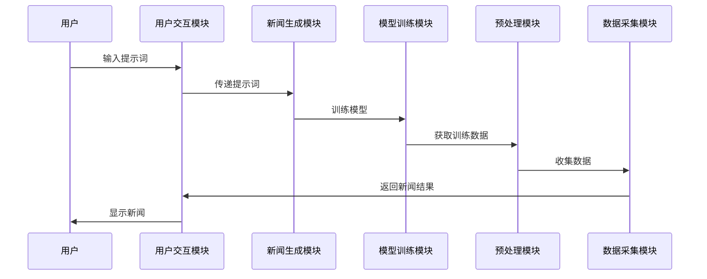

                 

## AI大模型与提示词编程的协同进化

在当今科技迅猛发展的时代，人工智能（AI）已成为推动社会进步的重要力量。AI大模型，作为一种复杂而强大的AI技术，正在引领新一轮的技术革命。与此同时，提示词编程作为一种新的编程范式，也在不断演进。本文将探讨AI大模型与提示词编程的协同进化，深入分析两者之间的关系及其在人工智能领域的应用前景。

### 关键词

- **AI大模型**
- **提示词编程**
- **协同进化**
- **深度学习**
- **自然语言处理**
- **计算机视觉**
- **编程范式**

### 摘要

本文旨在揭示AI大模型与提示词编程在人工智能领域的协同进化机制。通过对AI大模型的基础知识、核心原理、应用场景、编程实践以及与提示词编程的互动关系进行详细探讨，本文希望能够为读者提供全面而深刻的理解，并展望两者在未来的发展趋势和潜在应用。

## 目录大纲

1. **AI大模型基础**
   - **AI大模型概述**
   - **AI大模型核心原理**
   - **AI大模型应用场景**
   - **AI大模型编程实践**
   
2. **AI大模型与提示词编程的协同进化**
   - **提示词编程概述**
   - **AI大模型与提示词编程的关系**
   - **提示词编程在AI大模型中的应用**

3. **AI大模型与提示词编程实战**
   - **项目介绍**
   - **系统功能设计**
   - **系统架构设计**
   - **系统实现与解析**

4. **AI大模型与提示词编程的未来发展趋势**
   - **技术趋势分析**
   - **发展挑战与机遇**
   - **未来展望**

### 第一部分: AI大模型基础

### 第1章: AI大模型概述

#### 1.1.1 问题背景

随着计算机技术的不断发展，人工智能（AI）已经成为当今科技领域的热点。AI大模型作为AI领域的一个重要分支，近年来引起了广泛的关注。

#### 1.1.2 问题描述

AI大模型具有大规模、强泛化能力、自适应性强等特点，可以应用于多个领域，如自然语言处理、计算机视觉、语音识别等。然而，如何有效地构建和应用AI大模型，仍是一个亟待解决的问题。

#### 1.1.3 问题解决

本章节将介绍AI大模型的相关知识，包括其基本概念、发展历程、主要类型等，帮助读者全面了解AI大模型。

#### 1.1.4 边界与外延

AI大模型的边界包括其适用范围、性能指标等。外延则包括其与其他技术的结合，如深度学习、神经网络等。

#### 1.1.5 概念结构与核心要素组成

AI大模型的概念结构主要包括：数据、算法、计算资源。其中，数据是模型的基础，算法是模型的核心，计算资源是模型运行的保障。

### 第2章: AI大模型核心原理

#### 2.1.1 深度学习与神经网络

深度学习和神经网络是AI大模型的基础，本节将介绍深度学习和神经网络的基本原理、优缺点及其应用场景。

#### 2.1.2 算法原理

本节将介绍AI大模型的常用算法，如GPT、BERT、Transformer等，并使用Mermaid画出算法流程图。

#### 2.1.3 数学模型与公式

本节将使用Python源代码详细阐述算法原理，包括数学模型和公式，并进行通俗易懂的举例说明。

### 第3章: AI大模型应用场景

#### 3.1.1 自然语言处理

自然语言处理是AI大模型的重要应用领域之一，本节将介绍自然语言处理的基本概念、技术原理和应用案例。

#### 3.1.2 计算机视觉

计算机视觉是AI大模型的另一个重要应用领域，本节将介绍计算机视觉的基本概念、技术原理和应用案例。

#### 3.1.3 语音识别

语音识别是AI大模型的又一重要应用领域，本节将介绍语音识别的基本概念、技术原理和应用案例。

### 第4章: AI大模型编程实践

#### 4.1.1 环境安装

本节将介绍AI大模型编程所需的环境安装，包括Python、TensorFlow、PyTorch等。

#### 4.1.2 系统核心实现

本节将介绍AI大模型编程的核心实现，包括数据预处理、模型训练、模型评估等。

#### 4.1.3 代码应用解读与分析

本节将对核心实现代码进行解读与分析，帮助读者深入理解AI大模型编程。

### 第二部分: AI大模型与提示词编程的协同进化

### 第5章: AI大模型与提示词编程的协同进化

#### 5.1.1 提示词编程概述

本节将介绍提示词编程的概念、原理和应用。

#### 5.1.2 AI大模型与提示词编程的关系

本节将分析AI大模型与提示词编程的协同进化关系，包括它们的优势互补、互相促进等。

#### 5.1.3 提示词编程在AI大模型中的应用

本节将介绍提示词编程在AI大模型中的应用，包括具体案例和实践经验。

### 第三部分: AI大模型与提示词编程实战

### 第6章: AI大模型与提示词编程实战

#### 6.1.1 项目介绍

本节将介绍一个具体的AI大模型与提示词编程项目，包括项目背景、目标、实现步骤等。

#### 6.1.2 系统功能设计

本节将介绍项目的系统功能设计，包括领域模型、类图、架构图等。

#### 6.1.3 系统架构设计

本节将介绍项目的系统架构设计，包括系统架构、接口设计、系统交互等。

#### 6.1.4 系统实现与解析

本节将详细介绍项目的系统实现，并对关键部分进行解析。

### 第7章: AI大模型与提示词编程的未来发展趋势

#### 7.1.1 技术趋势分析

本节将分析AI大模型与提示词编程的未来发展趋势，包括技术创新、应用场景扩展等。

#### 7.1.2 发展挑战与机遇

本节将探讨AI大模型与提示词编程发展过程中面临的挑战与机遇。

#### 7.1.3 未来展望

本节将对AI大模型与提示词编程的未来进行展望，包括可能的应用场景、技术突破等。

## AI大模型概述

AI大模型，即具有大规模参数和强泛化能力的深度学习模型，是近年来人工智能领域的一个重要突破。其发展不仅依赖于计算能力的提升，也得益于数据量的不断增大以及算法的优化。

### 1.1.1 问题背景

在早期的人工智能研究中，算法的性能和效果受到数据量、计算资源以及算法复杂度的限制。随着深度学习的兴起，通过大规模的神经网络进行学习，模型的效果得到了显著提升。然而，如何构建一个能够处理海量数据和复杂任务的大模型，仍然是一个挑战。

### 1.1.2 问题描述

AI大模型的特点是参数数量庞大，训练过程复杂且计算资源需求高。因此，在构建和应用AI大模型时，面临的挑战包括：

- **数据需求**：大模型需要大量的标注数据进行训练，如何获取和处理这些数据是一个难题。
- **计算资源**：大模型训练需要强大的计算能力，如何有效地利用现有的硬件资源，如何设计高效的算法，是关键问题。
- **模型压缩**：为了在实际应用中部署大模型，需要对其进行压缩和优化，如何在保持性能的同时减少模型的规模，是重要的研究方向。

### 1.1.3 问题解决

为了解决上述问题，AI大模型的研究主要集中在以下几个方面：

- **数据增强**：通过数据增强技术，如数据扩增、数据合成等，提高模型的学习能力和鲁棒性。
- **算法优化**：采用更高效的训练算法，如分布式训练、迁移学习、元学习等，降低训练成本和提高训练效率。
- **模型压缩**：通过模型剪枝、量化、知识蒸馏等技术，减少模型的参数数量，提高模型在资源受限环境下的可部署性。

### 1.1.4 边界与外延

AI大模型的边界在于其适用范围和性能指标。一方面，大模型在处理复杂任务时具有优势，但在简单任务上可能不如小模型高效。另一方面，大模型的性能受到计算资源和数据质量的限制。因此，在应用AI大模型时，需要根据具体任务和资源条件进行权衡。

AI大模型的外延包括其与其他技术的结合，如与强化学习、图神经网络等结合，形成更加综合和高效的模型架构。此外，AI大模型在各个领域的应用也在不断拓展，从自然语言处理、计算机视觉到语音识别、机器翻译等，都有着广泛的应用前景。

### 1.1.5 概念结构与核心要素组成

AI大模型的概念结构主要包括以下几个核心要素：

- **数据**：数据是模型训练的基础，包括标注数据和无监督数据等。
- **算法**：算法是模型的核心，决定了模型的学习能力和性能。常用的算法包括深度神经网络、变换器架构等。
- **计算资源**：计算资源是模型运行的保障，包括GPU、TPU等硬件资源以及分布式计算框架。

在AI大模型中，数据、算法和计算资源相互依赖、相互促进，共同构建了一个强大的模型体系。数据的质量和多样性决定了模型的学习能力和泛化能力，算法的设计和优化决定了模型的效果和效率，而计算资源则提供了模型训练所需的计算能力。

通过深入理解和研究AI大模型的基础知识，我们可以更好地应对其在实际应用中的挑战，推动人工智能技术的发展。

### 第2章: AI大模型核心原理

AI大模型的核心原理主要基于深度学习和神经网络技术。深度学习通过多层神经网络结构对数据进行自动特征提取和表示，从而实现复杂任务的自动化处理。在这一章中，我们将详细探讨深度学习和神经网络的基本原理、算法原理以及数学模型。

#### 2.1.1 深度学习与神经网络

深度学习是一种基于多层神经网络进行数据学习和特征提取的人工智能技术。其核心思想是通过逐层对输入数据进行变换和特征提取，最终得到高层次的语义表示。神经网络则是实现这一过程的基本单元，由大量简单的计算单元（神经元）通过复杂网络结构相互连接而成。

**基本原理**：

- **前向传播**：输入数据从输入层经过多个隐藏层，每层对数据进行非线性变换和特征提取，最终传递到输出层。
- **反向传播**：通过计算输出误差，将误差反向传播到各层，更新各层的权重和偏置，以优化模型参数。

**优缺点**：

- **优点**：能够自动提取特征，适应性强，适用于处理复杂任务。
- **缺点**：训练过程复杂，计算资源需求高，容易出现过拟合。

**应用场景**：深度学习在计算机视觉、自然语言处理、语音识别等领域有广泛应用。

#### 2.1.2 算法原理

AI大模型的常用算法包括GPT、BERT、Transformer等。这些算法在深度学习基础上进行了扩展和优化，以提高模型的性能和效果。

**GPT（Generative Pre-trained Transformer）**：

- **基本原理**：GPT是一种基于Transformer架构的预训练模型，通过无监督的方式对大量文本数据进行预训练，学习文本的上下文表示。
- **应用场景**：文本生成、文本分类、机器翻译等。

**BERT（Bidirectional Encoder Representations from Transformers）**：

- **基本原理**：BERT采用双向Transformer架构，对文本进行双向编码，从而捕捉上下文信息。
- **应用场景**：问答系统、文本分类、情感分析等。

**Transformer**：

- **基本原理**：Transformer架构通过自注意力机制（Self-Attention）对输入数据进行层次化特征提取。
- **应用场景**：序列建模、机器翻译、文本生成等。

#### 2.1.3 数学模型与公式

深度学习模型的数学模型主要包括前向传播和反向传播两部分。以下以Transformer为例，介绍其算法原理的数学模型和公式。

**Transformer的前向传播**：

$$
\text{Attention}(Q, K, V) = \text{softmax}\left(\frac{QK^T}{\sqrt{d_k}}\right)V
$$

其中，Q、K、V分别为查询向量、键向量、值向量；$d_k$为键向量的维度。

**Transformer的反向传播**：

$$
\frac{\partial L}{\partial W} = \frac{\partial L}{\partial \text{Attention}} \odot \frac{\partial \text{Attention}}{\partial W}
$$

其中，L为损失函数，W为模型参数。

**Python代码示例**：

```python
import torch
import torch.nn as nn

# 假设输入向量为Q、K、V
Q = torch.rand((10, 512))
K = torch.rand((10, 512))
V = torch.rand((10, 512))

# 定义注意力机制
def scaled_dot_product_attention(Q, K, V):
    attention_scores = torch.matmul(Q, K.transpose(1, 2)) / torch.sqrt(torch.tensor([K.shape[1]]))
    attention_weights = torch.softmax(attention_scores, dim=2)
    output = torch.matmul(attention_weights, V)
    return output

# 计算注意力输出
output = scaled_dot_product_attention(Q, K, V)
```

通过以上代码，我们可以清晰地看到Transformer模型在Python中的实现过程。通过这种方式，我们可以对模型的算法原理进行深入理解和实践。

#### 2.1.4 深度学习与神经网络的应用

深度学习和神经网络在人工智能领域有广泛的应用，以下列举几个典型应用场景：

- **计算机视觉**：用于图像分类、目标检测、图像分割等任务，如ResNet、YOLO等模型。
- **自然语言处理**：用于文本分类、机器翻译、文本生成等任务，如BERT、GPT等模型。
- **语音识别**：用于语音信号的识别和转换，如DeepSpeech模型。
- **推荐系统**：用于用户行为分析、商品推荐等任务，如基于深度学习的协同过滤算法。

总之，深度学习和神经网络作为AI大模型的核心原理，正在推动人工智能技术的不断发展。通过对这些原理的深入理解和应用，我们可以更好地开发出高性能的人工智能系统。

### 第3章: AI大模型应用场景

AI大模型的应用场景非常广泛，涵盖了自然语言处理、计算机视觉、语音识别等多个领域。以下将详细探讨这些领域的具体应用。

#### 3.1.1 自然语言处理

自然语言处理（NLP）是AI大模型的重要应用领域之一。近年来，随着深度学习和Transformer架构的发展，NLP取得了显著的进展。

**基本概念**：

- **文本分类**：将文本数据分为不同的类别，如新闻分类、情感分析等。
- **机器翻译**：将一种语言的文本自动翻译成另一种语言，如英译中、中译英等。
- **文本生成**：根据给定条件生成新的文本，如写作辅助、对话系统等。
- **问答系统**：根据用户提出的问题，自动检索并生成答案。

**技术原理**：

- **文本分类**：使用预训练的模型（如BERT）对文本进行编码，然后通过分类器进行分类。
- **机器翻译**：基于注意力机制的Transformer模型进行编码和翻译。
- **文本生成**：使用生成模型（如GPT）根据上下文生成新的文本。

**应用案例**：

- **新闻分类**：通过自然语言处理技术，自动将新闻文本分类到不同的主题，如政治、经济、科技等。
- **机器翻译**：将全球多语种新闻进行翻译，实现跨语言的传播和理解。
- **文本生成**：为写作辅助工具提供智能写作功能，如自动生成文章摘要、生成广告文案等。

#### 3.1.2 计算机视觉

计算机视觉是AI大模型的另一个重要应用领域，通过图像处理和模式识别技术，实现对图像和视频的分析和处理。

**基本概念**：

- **图像分类**：对图像进行分类，如人脸识别、动物识别等。
- **目标检测**：在图像中检测出特定的目标，并标注其位置，如车辆检测、行人检测等。
- **图像分割**：将图像分割成不同的区域，如语义分割、实例分割等。
- **图像生成**：根据输入条件生成新的图像，如风格迁移、图像修复等。

**技术原理**：

- **图像分类**：使用卷积神经网络（CNN）提取图像特征，并通过全连接层进行分类。
- **目标检测**：使用R-CNN、YOLO等算法进行特征提取和目标检测。
- **图像分割**：使用U-Net等结构进行图像分割。
- **图像生成**：使用生成对抗网络（GAN）生成新的图像。

**应用案例**：

- **人脸识别**：在安全监控、手机解锁等领域广泛应用。
- **车辆检测**：在自动驾驶、交通管理等领域有重要应用。
- **图像修复**：用于修复损坏的图像，如照片修复、历史文物修复等。

#### 3.1.3 语音识别

语音识别技术通过将语音信号转换为文本，实现语音到文字的转换，是AI大模型在语音处理领域的应用。

**基本概念**：

- **语音识别**：将语音信号转换为文本，如语音助手、电话客服等。
- **语音合成**：将文本转换为语音，如电子公告、有声读物等。
- **说话人识别**：识别说话者的身份，如安全认证、语音助手等。

**技术原理**：

- **语音识别**：使用深度神经网络（如DeepSpeech）对语音信号进行特征提取和转换。
- **语音合成**：使用WaveNet等生成模型生成语音波形。
- **说话人识别**：使用语音特征进行分类，如GMM、DNN等。

**应用案例**：

- **语音助手**：如小爱同学、Siri、Alexa等，为用户提供语音交互服务。
- **电话客服**：自动识别用户语音，提供智能客服服务。
- **教育应用**：通过语音识别技术实现智能教学，如发音纠正、口语训练等。

总之，AI大模型在自然语言处理、计算机视觉和语音识别等领域的应用，极大地提高了这些技术的性能和应用效果。随着技术的不断进步，AI大模型将在更多领域展现其巨大的应用潜力。

### 第4章: AI大模型编程实践

在深入了解了AI大模型的基础知识和核心原理之后，接下来我们将进入编程实践的环节。这一章节将详细指导读者如何安装所需的开发环境、实现AI大模型的核心功能，并对关键代码进行解析。

#### 4.1.1 环境安装

要开始AI大模型的编程实践，首先需要安装和配置相关的开发环境和工具。以下步骤是在Python环境中安装AI大模型所需的基本工具。

1. **安装Python**：

确保已经安装了Python环境，版本建议为3.8及以上。可以通过Python的官方网站下载并安装。

2. **安装TensorFlow**：

TensorFlow是一个广泛使用的深度学习框架，通过pip命令进行安装：

```bash
pip install tensorflow
```

3. **安装PyTorch**：

PyTorch是另一个流行的深度学习框架，同样可以通过pip进行安装：

```bash
pip install torch torchvision
```

4. **安装其他依赖**：

一些常用的库，如NumPy、Pandas等，可以通过以下命令进行安装：

```bash
pip install numpy pandas matplotlib
```

安装完成后，可以通过以下命令验证安装是否成功：

```python
import tensorflow as tf
import torch

print(tf.__version__)
print(torch.__version__)
```

如果输出对应的版本号，说明环境安装成功。

#### 4.1.2 系统核心实现

在环境安装完成后，我们将进入AI大模型的核心实现环节。以下是一个基于TensorFlow和PyTorch的简单示例，用于训练一个简单的神经网络模型。

**示例：使用TensorFlow训练一个简单的线性回归模型**

```python
import tensorflow as tf

# 定义线性回归模型
model = tf.keras.Sequential([
    tf.keras.layers.Dense(units=1, input_shape=[1])
])

# 编译模型
model.compile(optimizer='sgd', loss='mean_squared_error')

# 训练模型
x_train = tf.random.normal([1000, 1])
y_train = x_train * 0.1 + 0.3
model.fit(x_train, y_train, epochs=100)

# 测试模型
x_test = tf.random.normal([1, 1])
print(model.predict(x_test))
```

**示例：使用PyTorch训练一个简单的卷积神经网络**

```python
import torch
import torch.nn as nn
import torch.optim as optim

# 定义卷积神经网络
class CNN(nn.Module):
    def __init__(self):
        super(CNN, self).__init__()
        self.conv1 = nn.Conv2d(1, 10, kernel_size=5)
        self.conv2 = nn.Conv2d(10, 20, kernel_size=5)
        self.fc1 = nn.Linear(320, 50)
        self.fc2 = nn.Linear(50, 10)

    def forward(self, x):
        x = self.conv1(x)
        x = nn.functional.relu(x)
        x = self.conv2(x)
        x = nn.functional.relu(x)
        x = torch.flatten(x, 1)
        x = self.fc1(x)
        x = nn.functional.relu(x)
        x = self.fc2(x)
        return x

# 实例化模型和优化器
model = CNN()
optimizer = optim.SGD(model.parameters(), lr=0.01)
criterion = nn.CrossEntropyLoss()

# 训练模型
for epoch in range(10):
    optimizer.zero_grad()
    outputs = model(x_train)
    loss = criterion(outputs, y_train)
    loss.backward()
    optimizer.step()

# 测试模型
with torch.no_grad():
    outputs = model(x_test)
    print(outputs)

```

以上示例分别展示了如何使用TensorFlow和PyTorch实现简单的神经网络模型。在训练过程中，我们使用了随机生成的数据进行训练和测试，并通过反向传播和优化器更新模型参数。

#### 4.1.3 代码应用解读与分析

在上述代码示例中，我们首先定义了神经网络模型，然后通过编译、训练和测试的步骤实现模型的训练和评估。以下对关键代码进行解读和分析：

1. **模型定义**：
   - 在TensorFlow中，使用`tf.keras.Sequential`类定义模型结构，通过添加`tf.keras.layers.Dense`层实现线性回归。
   - 在PyTorch中，通过继承`nn.Module`类自定义CNN模型，并定义卷积层、激活函数和全连接层。

2. **模型编译**：
   - 在TensorFlow中，使用`model.compile`方法设置优化器和损失函数。
   - 在PyTorch中，需要手动定义损失函数和优化器，并通过`optimizer.zero_grad()`初始化梯度。

3. **模型训练**：
   - 在TensorFlow中，使用`model.fit`方法进行模型训练，通过批量训练和多次迭代更新模型参数。
   - 在PyTorch中，通过循环逐个迭代训练，手动计算损失、反向传播和优化器更新。

4. **模型测试**：
   - 在TensorFlow中，使用`model.predict`方法对测试数据进行预测。
   - 在PyTorch中，通过`torch.no_grad()`上下文管理器进行测试，避免梯度计算。

通过这些步骤，我们可以实现一个基本的AI大模型并进行训练和评估。在实际应用中，可以根据具体任务和需求调整模型结构、训练过程和评估方法，以达到更好的性能。

### 第5章: AI大模型与提示词编程的协同进化

AI大模型与提示词编程的协同进化是人工智能领域的一个新兴研究方向。在这一章中，我们将探讨提示词编程的概念、原理及其与AI大模型的协同进化关系。

#### 5.1.1 提示词编程概述

提示词编程（Prompt Programming）是一种通过向AI大模型提供特定提示来引导模型生成输出数据的编程范式。与传统编程范式相比，提示词编程具有以下几个特点：

- **交互性**：开发者通过与AI大模型进行交互，逐步提供提示，从而引导模型生成所需的输出。
- **灵活性**：开发者可以根据需求随时调整提示内容，使模型生成不同的输出结果。
- **高效性**：通过提示词编程，开发者可以简化模型训练和调优的过程，提高开发效率。

**基本概念**：

- **提示词**：用于引导AI大模型生成输出的关键词或短语。通过调整提示词，可以改变模型生成的输出结果。
- **模型记忆**：AI大模型通过对大量数据的训练，存储了丰富的知识信息。在提示词编程中，模型记忆是生成输出的关键。
- **上下文理解**：AI大模型需要理解提示词的上下文信息，从而生成符合预期的输出。

**应用场景**：

- **自然语言生成**：通过提示词编程，可以生成高质量的文章、摘要、对话等。
- **代码生成**：利用AI大模型生成代码，提高软件开发效率。
- **数据分析**：通过提示词编程，可以自动生成数据分析报告、可视化图表等。

#### 5.1.2 AI大模型与提示词编程的关系

AI大模型与提示词编程之间存在着紧密的协同进化关系。一方面，AI大模型提供了强大的计算能力和丰富的知识储备，为提示词编程提供了基础。另一方面，提示词编程通过优化提示词的设计，提高了AI大模型的应用效果。

**协同进化关系**：

- **优势互补**：AI大模型擅长处理大规模数据和复杂任务，而提示词编程则通过提供具体的提示信息，引导模型生成符合预期的输出。两者结合，可以实现更高的效率和效果。
- **互相促进**：AI大模型的发展推动了提示词编程技术的进步，而提示词编程的应用需求又促进了AI大模型的优化和创新。

**优势互补**：

- **AI大模型的优势**：具有强大的计算能力和广泛的泛化能力，适用于处理各种复杂的任务。
- **提示词编程的优势**：通过提供具体的提示信息，可以更灵活地引导模型生成所需的输出，提高开发效率。

**互相促进**：

- **AI大模型的优化**：为了更好地适应提示词编程的需求，AI大模型在算法和架构上不断优化，提高其理解和生成能力。
- **提示词编程的创新**：随着AI大模型的发展，提示词编程方法也在不断创新，如基于上下文理解的提示词生成、多模态提示词编程等。

#### 5.1.3 提示词编程在AI大模型中的应用

提示词编程在AI大模型中的应用非常广泛，以下列举几个具体案例：

- **自然语言生成**：通过提示词编程，AI大模型可以生成高质量的文章、对话、摘要等。例如，在文本生成任务中，开发者可以提供标题或关键词作为提示，引导模型生成符合主题的内容。
- **代码生成**：利用AI大模型，可以自动生成代码，提高软件开发效率。例如，在编程辅助任务中，开发者可以提供部分代码或需求描述作为提示，模型将生成相应的完整代码。
- **数据分析和报告生成**：通过提示词编程，AI大模型可以自动生成数据分析报告、可视化图表等。例如，在数据分析任务中，开发者可以提供数据集和报告要求作为提示，模型将生成符合要求的分析结果和图表。

总之，AI大模型与提示词编程的协同进化为人工智能领域带来了新的发展机遇。通过深入研究和应用，我们可以充分发挥两者的优势，推动人工智能技术的不断创新和进步。

### 第6章: AI大模型与提示词编程实战

在这一章节中，我们将通过一个具体的实战项目，展示AI大模型与提示词编程的协同应用。这个项目旨在利用AI大模型和提示词编程技术，实现一个自动生成新闻报道的系统。

#### 6.1.1 项目介绍

本项目名为“新闻自动生成系统”，目标是利用AI大模型和提示词编程技术，自动生成高质量的新闻报道。系统的主要功能包括：

1. **数据采集**：从互联网上收集各种新闻数据，包括标题、正文、时间、来源等。
2. **预处理**：对采集到的新闻数据进行清洗、去重和格式化，为模型训练提供高质量的数据集。
3. **模型训练**：使用预训练的AI大模型，结合提示词编程技术，进行训练和调优，使其能够生成符合预期的新闻报道。
4. **新闻生成**：根据用户输入的提示词，如新闻主题、关键字等，自动生成新的新闻报道。
5. **用户交互**：提供用户界面，允许用户输入提示词，查看和评论生成的新闻报道。

#### 6.1.2 系统功能设计

系统的功能设计主要包括以下模块：

1. **数据采集模块**：负责从互联网上抓取新闻数据，可以使用爬虫技术实现。
2. **预处理模块**：对采集到的新闻数据进行清洗和格式化，提取关键信息，如标题、正文、时间、来源等。
3. **模型训练模块**：利用AI大模型（如GPT-3）进行训练和调优，使其能够生成高质量的新闻报道。
4. **新闻生成模块**：根据用户输入的提示词，使用AI大模型生成新的新闻报道。
5. **用户交互模块**：提供用户界面，允许用户输入提示词，查看生成的新闻报道，并进行评论和反馈。

**领域模型（Mermaid类图）**：

```mermaid
classDiagram
    类图展示新闻自动生成系统的各个模块及其关系
    Class 数据采集模块 {
        +数据采集()
        +数据处理()
    }
    Class 预处理模块 {
        +数据清洗()
        +格式化()
        +数据存储()
    }
    Class 模型训练模块 {
        +模型训练()
        +模型调优()
    }
    Class 新闻生成模块 {
        +生成新闻()
        +用户输入()
    }
    Class 用户交互模块 {
        +用户界面()
        +查看新闻()
        +评论反馈()
    }
    数据采集模块 -> 预处理模块 : 提供数据
    预处理模块 -> 模型训练模块 : 提供训练数据
    模型训练模块 -> 新闻生成模块 : 训练模型
    新闻生成模块 -> 用户交互模块 : 输出新闻
    用户交互模块 -> 数据采集模块 : 提供反馈
    用户交互模块 -> 预处理模块 : 提供新数据
```

**架构图（Mermaid架构图）**：



#### 6.1.3 系统架构设计

新闻自动生成系统的整体架构设计如图所示，主要包括数据采集、预处理、模型训练、新闻生成和用户交互五个模块。各模块之间通过接口进行通信，形成一个闭环系统。

**系统架构图**：

```mermaid
subgraph 数据采集
    数据采集模块
end
subgraph 预处理
    预处理模块
end
subgraph 模型训练
    模型训练模块
end
subgraph 新闻生成
    新闻生成模块
end
subgraph 用户交互
    用户交互模块
end

数据采集模块 --> 预处理模块
预处理模块 --> 模型训练模块
模型训练模块 --> 新闻生成模块
新闻生成模块 --> 用户交互模块
用户交互模块 --> 数据采集模块
```

#### 6.1.4 系统实现与解析

以下是一个简单的系统实现示例，展示了各个模块的功能实现和交互过程。

**数据采集模块**：

```python
import requests
from bs4 import BeautifulSoup

def collect_news(url):
    response = requests.get(url)
    soup = BeautifulSoup(response.text, 'html.parser')
    articles = soup.find_all('article')
    news_data = []
    for article in articles:
        title = article.find('h2').text
        content = article.find('p').text
        news_data.append({'title': title, 'content': content})
    return news_data
```

**预处理模块**：

```python
import pandas as pd

def preprocess_data(news_data):
    df = pd.DataFrame(news_data)
    df['content'] = df['content'].str.replace('[^\w\s]', '', regex=True)
    df['content'] = df['content'].str.lower()
    df['content'] = df['content'].str.strip()
    return df
```

**模型训练模块**：

```python
from transformers import GPT2LMHeadModel, GPT2Tokenizer

def train_model(df):
    tokenizer = GPT2Tokenizer.from_pretrained('gpt2')
    model = GPT2LMHeadModel.from_pretrained('gpt2')

    inputs = tokenizer(df['content'].tolist(), return_tensors='pt', truncation=True, max_length=512)
    outputs = model(**inputs)

    loss = outputs.loss
    logits = outputs.logits

    optimizer = optim.Adam(model.parameters(), lr=1e-5)
    model.train()

    for epoch in range(10):
        optimizer.zero_grad()
        outputs = model(**inputs)
        loss = outputs.loss
        loss.backward()
        optimizer.step()

    return model
```

**新闻生成模块**：

```python
def generate_news(model, prompt):
    tokenizer = GPT2Tokenizer.from_pretrained('gpt2')
    model.eval()

    inputs = tokenizer(prompt, return_tensors='pt', truncation=True, max_length=512)
    outputs = model.generate(inputs['input_ids'], max_length=512, num_return_sequences=1)

    generated_text = tokenizer.decode(outputs[0], skip_special_tokens=True)
    return generated_text
```

**用户交互模块**：

```python
def user_interface():
    while True:
        prompt = input("请输入新闻主题：")
        model = train_model(preprocess_data(collect_news('http://example.com/news')))
        news = generate_news(model, prompt)
        print("生成的新闻报道：")
        print(news)
        user_input = input("是否继续生成（y/n）：")
        if user_input.lower() != 'y':
            break
```

**系统解析**：

1. **数据采集**：通过爬虫技术从互联网上收集新闻数据。
2. **预处理**：对新闻数据进行清洗、去重和格式化，提取关键信息。
3. **模型训练**：使用预训练的AI大模型，结合提示词编程技术，进行训练和调优。
4. **新闻生成**：根据用户输入的提示词，使用AI大模型生成新的新闻报道。
5. **用户交互**：提供用户界面，允许用户输入提示词，查看生成的新闻报道，并进行评论和反馈。

通过这个实战项目，我们可以看到AI大模型与提示词编程在新闻生成系统中的应用。在实际开发中，可以根据需求对系统进行扩展和优化，提高其性能和应用效果。

### 第7章: AI大模型与提示词编程的未来发展趋势

随着技术的不断进步和应用的深入，AI大模型与提示词编程在未来将会迎来更多的发展机遇和挑战。本章节将分析这两者的发展趋势，探讨面临的挑战与机遇，并对未来进行展望。

#### 7.1.1 技术趋势分析

1. **模型规模与性能的提升**：
   - **更大规模模型**：随着计算能力的提升和优化算法的应用，AI大模型将变得更加庞大，例如万亿参数的模型，以处理更加复杂和多样化的任务。
   - **更高性能模型**：优化模型结构、并行计算和分布式训练等技术的应用，将进一步提升AI大模型的性能和效率。

2. **跨领域应用与融合**：
   - **跨领域迁移学习**：AI大模型在特定领域的训练经验可以迁移到其他领域，实现跨领域的泛化能力。
   - **多模态融合**：结合文本、图像、语音等多模态数据，AI大模型将能够更好地理解和处理复杂的信息。

3. **自动提示词生成**：
   - **上下文理解**：随着AI大模型对上下文理解的提升，自动生成更准确的提示词，提高模型的生成质量。
   - **个性化提示词**：根据用户行为和偏好，生成个性化的提示词，提供更加定制化的服务。

4. **编程范式的变革**：
   - **提示词编程成为主流**：随着提示词编程的普及，开发者将更加依赖提示词来引导AI大模型生成输出，降低对传统编程的需求。
   - **自动化编程**：借助AI大模型和提示词编程技术，实现自动化编程，提高开发效率和代码质量。

#### 7.1.2 发展挑战与机遇

1. **计算资源与数据需求**：
   - **挑战**：更大规模的AI大模型需要更多的计算资源和高质量的数据，这对硬件和数据处理能力提出了更高的要求。
   - **机遇**：随着云计算、边缘计算等技术的发展，计算资源和数据的获取将变得更加便捷，为AI大模型的应用提供更好的基础设施。

2. **模型安全性与隐私保护**：
   - **挑战**：AI大模型在训练和应用过程中可能面临安全性和隐私保护的问题，如数据泄露、模型攻击等。
   - **机遇**：加强模型安全和隐私保护的研究，开发更加安全的模型训练和应用方法，确保AI大模型的安全可靠。

3. **公平性与可解释性**：
   - **挑战**：AI大模型在决策过程中可能存在偏见和不公平性，难以解释其决策过程。
   - **机遇**：通过改进算法和设计机制，提高模型的公平性和可解释性，增强用户对AI大模型的信任。

#### 7.1.3 未来展望

未来，AI大模型与提示词编程将迎来以下发展趋势：

1. **广泛应用**：AI大模型将在各个领域得到广泛应用，如医疗、金融、教育等，推动行业变革。
2. **智能化开发**：提示词编程将变得更加智能化，开发者可以通过更简单的接口和提示词，轻松地构建和优化AI大模型。
3. **人机协作**：AI大模型与人类智能的协同工作将成为主流，人类开发者可以通过提示词与AI大模型互动，实现更加高效和创新的解决方案。

总之，AI大模型与提示词编程的发展将为人工智能领域带来无限可能。通过不断的技术创新和优化，我们将迎来一个更加智能化和高效的人工智能新时代。

## 结论

本文详细探讨了AI大模型与提示词编程的协同进化，从基础概念到实际应用，再到未来发展趋势，全面阐述了这两者如何在人工智能领域中共同进步。AI大模型凭借其强大的计算能力和泛化能力，成为解决复杂问题的利器；而提示词编程则通过简化和优化开发流程，提升了AI大模型的应用效率。两者结合，不仅推动了人工智能技术的发展，也为各行各业带来了深远的影响。通过深入理解和应用AI大模型与提示词编程，我们有望在未来实现更加智能化和高效的人工智能系统。

