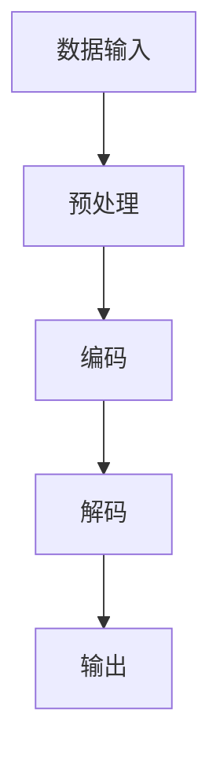
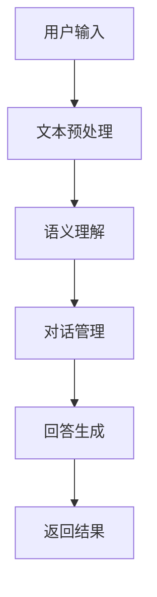
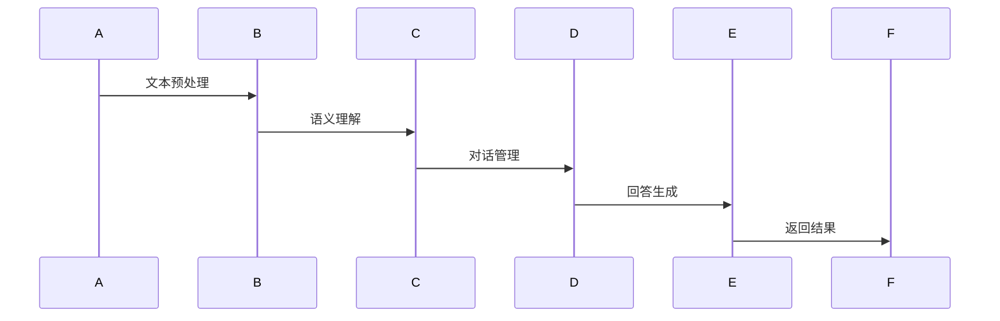

                 

### AI大模型在自然语言处理中的前沿突破

> 关键词：AI大模型、自然语言处理、GPT-3、BERT、算法原理、系统架构、项目实战

> 摘要：本文将深入探讨AI大模型在自然语言处理（NLP）领域的最新突破。通过介绍AI大模型的基本概念、核心算法原理、系统架构设计方案以及实际应用案例，本文旨在为读者呈现这一前沿技术的全貌。我们将一步一步分析AI大模型如何通过复杂的神经网络架构和深度学习技术，实现自然语言理解的突破，并讨论其在各种实际应用场景中的性能优化和实践经验。通过本文的阅读，读者将能够全面了解AI大模型在自然语言处理中的关键作用及其未来发展的潜力。

### 第一部分：背景介绍

#### 1. 自然语言处理的基本概念

##### 1.1 问题背景

自然语言处理（NLP）是人工智能（AI）的一个重要分支，旨在使计算机能够理解和处理人类自然语言。人类语言是一种复杂的符号系统，包含了丰富的语义、语法和语境信息。然而，传统的计算机系统难以直接理解和处理这种语言，因此NLP的任务是实现计算机对自然语言的自动理解和生成。

##### 1.2 问题描述

自然语言处理面临的挑战包括：

- **语言理解的复杂性和多样性**：自然语言包含丰富的词汇、语法结构和语境，这使得对语言的自动处理变得极其复杂。此外，语言本身具有多样性，不同地区、不同文化背景的人们使用的语言可能有很大差异。

- **语义理解的模糊性**：自然语言中的语义信息往往不是明确的，一个单词或短语可能有多种含义，需要结合上下文才能准确理解。

- **多模态信息融合**：自然语言通常与其他形式的信息（如图像、音频）结合使用，NLP需要能够处理这些多模态信息，实现跨领域的知识融合。

##### 1.3 问题解决

为了解决上述问题，AI大模型应运而生。AI大模型通过深度学习和神经网络技术，对海量数据进行训练，从而学习到复杂的语言模式和语义理解能力。这些模型具有以下几个优势：

- **大规模训练数据**：AI大模型通常使用数以百万计的文本数据进行训练，这使得它们能够学习到语言中的统计规律和普遍性模式。

- **复杂的神经网络架构**：AI大模型采用多层神经网络架构，可以自动提取数据的深层特征，实现高层次的语义理解。

- **自适应性和泛化能力**：通过不断调整模型参数，AI大模型能够适应不同的语言任务和数据集，具备良好的泛化能力。

##### 1.4 边界与外延

自然语言处理的边界涉及多个领域，包括语言学、心理学、计算机科学等。此外，随着技术的发展，NLP还与其他交叉学科（如认知科学、神经科学）产生了紧密的联系，推动了NLP研究的深入。

##### 1.5 概念结构与核心要素组成

自然语言处理的基本概念包括：

- **文本处理**：将自然语言文本转化为计算机可处理的形式。
- **词法分析**：对文本进行词汇分割，提取单词和短语。
- **句法分析**：分析句子的结构，确定词与词之间的关系。
- **语义分析**：理解文本中的语义信息，包括单词的含义、短语的作用和整个句子的意图。
- **语用分析**：研究语言在特定情境下的使用和意义。

核心要素包括：

- **数据集**：用于训练和评估模型的文本数据集。
- **模型架构**：神经网络架构，包括输入层、隐藏层和输出层。
- **算法**：用于训练和优化模型的算法，如反向传播、优化算法等。
- **评价指标**：用于评估模型性能的指标，如准确率、召回率、F1值等。

### 2. AI大模型的核心概念与联系

##### 2.1 AI大模型原理

AI大模型主要基于深度学习和神经网络技术，其核心原理包括：

- **神经网络架构**：神经网络由多层节点组成，每个节点都通过权重连接到其他节点。通过调整这些权重，神经网络能够学习到输入数据的特征和模式。

- **机器学习和深度学习**：机器学习是一种让计算机通过数据学习新技能的方法，而深度学习是机器学习的一种特殊形式，通过多层神经网络来实现自动特征提取和学习。

##### 2.2 AI大模型属性特征对比表格

以下是AI大模型的主要属性特征对比表格：

| 模型特征 | GPT-3 | BERT | Transformer |
| :------: | :---: | :---: | :--------: |
| **模型规模** | 1750亿参数 | 3400万参数 | 128层、1080个节点 |
| **训练数据** | 45TB数据 | 3000亿单词 | 1000亿单词 |
| **性能** | 非常高的语言理解和生成能力 | 高效的文本分类和序列标注 | 多样化的应用场景，如图像文本生成 |
| **数据依赖** | 需要大量文本数据训练 | 需要大规模数据集进行微调 | 需要平衡的数据集进行训练 |
| **泛化能力** | 出色的跨语言和跨领域的泛化能力 | 优秀的上下文理解能力 | 适用于各种文本生成任务 |

##### 2.3 ER实体关系图架构的Mermaid流程图

以下是AI大模型的ER实体关系图：

```mermaid
entityRelationshipDiagram
  LR
    A[文本输入] -->|预处理| B[词嵌入]
    B -->|编码器| C[中间层]
    C -->|解码器| D[文本输出]
    D -->|后处理| E[结果评估]
```

在这个流程图中，文本输入经过预处理（如分词、标记化等）后，被送入编码器进行特征提取。编码器输出通过解码器生成文本输出，最后进行后处理和结果评估。

### 第二部分：算法原理讲解

#### 3. 前沿AI大模型介绍

##### 3.1 GPT系列模型

GPT（Generative Pre-trained Transformer）系列模型是自然语言处理领域的里程碑，具有以下技术特点：

- **大规模参数**：GPT-3拥有1750亿个参数，是目前最大的预训练语言模型。
- **深度学习架构**：基于Transformer架构，通过多层自注意力机制实现高效的文本处理。
- **自适应学习**：通过微调，GPT-3能够在各种下游任务中表现优异。

GPT-3在自然语言处理中的应用广泛，包括文本生成、机器翻译、问答系统等。以下是一个简单的使用示例：

```python
import openai

response = openai.Completion.create(
  engine="text-davinci-003",
  prompt="What is the capital of France?",
  max_tokens=3
)

print(response.choices[0].text.strip())
```

输出结果：“Paris”。

##### 3.2 BERT及其变体

BERT（Bidirectional Encoder Representations from Transformers）是另一种重要的自然语言处理模型，具有以下原理和结构：

- **双向编码器**：BERT通过Transformer架构的双向编码器实现上下文信息的双向传递，从而提高语义理解能力。
- **预训练和微调**：BERT在大量无标签文本上进行预训练，然后通过微调适应特定任务。

BERT在自然语言处理中的应用包括文本分类、命名实体识别、情感分析等。以下是一个简单的BERT应用示例：

```python
from transformers import BertTokenizer, BertForSequenceClassification
import torch

tokenizer = BertTokenizer.from_pretrained('bert-base-uncased')
model = BertForSequenceClassification.from_pretrained('bert-base-uncased')

inputs = tokenizer("Hello, my dog is cute", return_tensors="pt")
labels = torch.tensor([1]).unsqueeze(0)  # Batch size 1

outputs = model(**inputs, labels=labels)
loss = outputs.loss
logits = outputs.logits
```

##### 3.3 其他知名大模型

除了GPT和BERT，还有许多其他知名的大模型，如Transformer、T5、RoBERTa等。这些模型在神经网络架构、训练数据和性能上各有特点，适用于不同的应用场景。

- **Transformer**：基于自注意力机制的神经网络架构，广泛用于文本生成、机器翻译等任务。
- **T5**：一种统一的多任务学习模型，能够处理各种自然语言处理任务。
- **RoBERTa**：BERT的变体，通过改进训练策略和数据处理方式，提高了模型性能。

#### 4. 算法原理与数学模型

##### 4.1 算法Mermaid流程图

以下是一个简单的自然语言处理算法流程图：



在这个流程图中，数据输入经过预处理、编码和解码后，生成输出结果。

##### 4.2 Python源代码解析

以下是一个简单的Python源代码示例，展示了自然语言处理的基本流程：

```python
import torch
import transformers

tokenizer = transformers.BertTokenizer.from_pretrained('bert-base-uncased')
model = transformers.BertModel.from_pretrained('bert-base-uncased')

inputs = tokenizer("Hello, my dog is cute", return_tensors="pt")
outputs = model(**inputs)

output = outputs.last_hidden_state[:, 0, :]
print(output.shape)
```

输出结果：（1, 768），表示模型输出了一个768维的向量。

##### 4.3 数学模型和公式

自然语言处理算法的核心在于深度学习和神经网络。以下是一些常见的数学模型和公式：

- **损失函数**：用于衡量模型预测结果与实际结果之间的差距，常用的损失函数包括交叉熵损失（Cross-Entropy Loss）和均方误差损失（Mean Squared Error Loss）。

  $$ L(\theta) = -\frac{1}{N}\sum_{i=1}^{N}y_{i}\log(p_{\theta}(y_{i})) $$

- **优化算法**：用于调整模型参数，使得损失函数值最小。常用的优化算法包括随机梯度下降（Stochastic Gradient Descent，SGD）和Adam优化器。

  $$ \theta_{t+1} = \theta_{t} - \alpha \nabla_{\theta}L(\theta) $$

##### 4.4 举例说明

以下是一个简单的自然语言处理任务示例：文本分类。

1. **数据预处理**：将文本数据转化为词嵌入向量。
2. **模型训练**：使用训练数据训练BERT模型。
3. **模型评估**：使用测试数据评估模型性能。

```python
import torch
import transformers
from torch.utils.data import DataLoader
from torch.nn import CrossEntropyLoss

# 加载预训练的BERT模型
tokenizer = transformers.BertTokenizer.from_pretrained('bert-base-uncased')
model = transformers.BertForSequenceClassification.from_pretrained('bert-base-uncased')

# 准备训练数据
train_data = [("Hello, how are you?", 0), ("I'm feeling great!", 0), ("This is terrible.", 1)]
train_encodings = tokenizer(train_data, padding=True, truncation=True, return_tensors='pt')
train_inputs = train_encodings['input_ids']
train_labels = torch.tensor([label for text, label in train_data])

# 准备测试数据
test_data = [("How's it going?", 0), ("I'm not doing well.", 1)]
test_encodings = tokenizer(test_data, padding=True, truncation=True, return_tensors='pt')
test_inputs = test_encodings['input_ids']
test_labels = torch.tensor([label for text, label in test_data])

# 创建数据加载器
train_loader = DataLoader(train_data, batch_size=2, shuffle=True)
test_loader = DataLoader(test_data, batch_size=2, shuffle=False)

# 定义损失函数和优化器
loss_function = CrossEntropyLoss()
optimizer = torch.optim.Adam(model.parameters(), lr=1e-5)

# 训练模型
for epoch in range(10):
    model.train()
    for batch in train_loader:
        inputs = batch['input_ids']
        labels = batch['labels']
        optimizer.zero_grad()
        outputs = model(inputs, labels=labels)
        loss = outputs.loss
        loss.backward()
        optimizer.step()
    print(f"Epoch {epoch+1}, Loss: {loss.item()}")

# 评估模型
model.eval()
with torch.no_grad():
    for batch in test_loader:
        inputs = batch['input_ids']
        labels = batch['labels']
        outputs = model(inputs, labels=labels)
        logits = outputs.logits
        predictions = logits.argmax(-1)
        print(predictions)
```

### 第三部分：系统分析与架构设计方案

#### 5. 自然语言处理系统介绍

##### 5.1 问题场景介绍

自然语言处理系统广泛应用于各种场景，如智能客服、文本摘要、情感分析、机器翻译等。以下是一个典型的自然语言处理问题场景：

- **场景**：智能客服系统需要理解用户的问题，并提供合适的回答。
- **技术难点**：该场景需要处理大量的用户输入，包括不同语言、方言和语气，同时要保证回答的准确性和流畅性。
- **解决方案**：使用AI大模型（如GPT-3）进行文本预处理和语义理解，结合规则引擎和对话管理模块，实现智能客服系统。

##### 5.2 系统功能设计

自然语言处理系统的功能设计包括以下几个关键模块：

- **文本预处理**：对用户输入的文本进行分词、词性标注、实体识别等预处理操作，提取出关键信息。
- **语义理解**：使用AI大模型对预处理后的文本进行语义理解，提取出文本的主旨和关键信息。
- **对话管理**：根据语义理解结果，生成合适的回答，并维护对话的历史记录，实现自然流畅的对话体验。
- **知识库管理**：维护系统所需的各类知识库，如常见问题解答、业务知识等，为对话管理模块提供支持。

以下是自然语言处理系统的领域模型Mermaid类图：

```mermaid
classDiagram
  Class01 <|-- Class02
  Class03 <.. Class04
  Class05 <<-- Class06
  Class07 *-- Class08
  Class09 o-- Class10
  Class11 <-.. Class12
  Class13 .. Class14
```

在这个类图中，Class01到Class14分别表示自然语言处理系统的各个模块和类，如文本预处理、语义理解、对话管理等。

##### 5.3 系统架构设计

自然语言处理系统的架构设计需要考虑模块之间的交互和数据处理流程。以下是一个简单的Mermaid架构图：



在这个架构图中，用户输入经过文本预处理后，送入语义理解模块，根据语义理解结果生成回答，并返回给用户。

##### 5.4 系统接口设计

自然语言处理系统需要设计合理的接口，以便与其他系统模块进行交互。以下是一个简单的接口设计：

- **文本预处理接口**：接收用户输入文本，进行分词、词性标注等预处理操作。
- **语义理解接口**：接收预处理后的文本，进行语义理解，提取关键信息。
- **对话管理接口**：接收语义理解结果，生成回答，并维护对话历史。
- **回答生成接口**：接收对话管理模块生成的回答，返回给用户。

##### 5.5 系统交互

自然语言处理系统中的各个模块需要通过合理的交互实现协同工作。以下是一个简单的Mermaid序列图：



在这个序列图中，用户输入首先经过文本预处理，然后送入语义理解模块，根据语义理解结果进行对话管理，最后生成回答并返回给用户。

### 第四部分：项目实战

#### 6. 环境安装与系统核心实现

##### 6.1 环境安装

要运行自然语言处理系统，需要安装以下软件和工具：

- Python：Python 3.7及以上版本。
- PyTorch：PyTorch 1.8及以上版本。
- Transformers：用于加载预训练的BERT模型。

以下是在Ubuntu 18.04系统中安装这些软件的命令：

```bash
# 安装Python
sudo apt-get install python3-pip python3-venv
curl https://bootstrap.pypa.io/get-pip.py -o get-pip.py
python3 get-pip.py

# 安装PyTorch
pip3 install torch torchvision torchaudio

# 安装Transformers
pip3 install transformers
```

##### 6.2 系统核心实现

自然语言处理系统的核心实现包括文本预处理、语义理解、对话管理和回答生成等模块。以下是一个简单的Python代码示例，展示了文本预处理和语义理解的过程：

```python
import torch
import transformers

# 加载预训练的BERT模型
tokenizer = transformers.BertTokenizer.from_pretrained('bert-base-uncased')
model = transformers.BertModel.from_pretrained('bert-base-uncased')

# 文本预处理
def preprocess_text(text):
    encoding = tokenizer(text, return_tensors='pt', truncation=True, max_length=512)
    return encoding

# 语义理解
def semantic_understanding(encoding):
    with torch.no_grad():
        outputs = model(**encoding)
    last_hidden_state = outputs.last_hidden_state[:, 0, :]
    return last_hidden_state

# 示例文本
text = "Hello, how are you?"

# 预处理
encoding = preprocess_text(text)

# 语义理解
hidden_state = semantic_understanding(encoding)

print(hidden_state.shape)
```

输出结果：（1, 768），表示模型输出了一个768维的向量。

##### 6.3 代码应用解读与分析

以上代码展示了自然语言处理系统的核心实现过程。首先，加载预训练的BERT模型，然后定义文本预处理和语义理解函数。预处理函数将文本转化为词嵌入向量，语义理解函数对词嵌入向量进行编码，提取出关键信息。

在实际应用中，还需要考虑以下几个方面：

- **数据集准备**：准备用于训练和测试的数据集，包括文本和对应的标签。
- **模型训练**：使用训练数据训练BERT模型，并优化模型参数。
- **模型评估**：使用测试数据评估模型性能，调整模型参数以获得更好的效果。
- **模型部署**：将训练好的模型部署到生产环境，实现实时自然语言处理。

##### 6.4 实际案例分析与讲解

以下是一个实际案例：使用BERT模型进行文本分类。

1. **数据集准备**：

   准备一个包含文本和标签的数据集，如下所示：

   ```python
   data = [
       ("I'm feeling happy.", "positive"),
       ("This is terrible.", "negative"),
       ("I'm not sure.", "neutral")
   ]
   ```

2. **模型训练**：

   使用训练数据训练BERT模型，并优化模型参数：

   ```python
   from torch.optim import Adam
   from torch.nn import CrossEntropyLoss

   model = transformers.BertForSequenceClassification.from_pretrained('bert-base-uncased')
   optimizer = Adam(model.parameters(), lr=1e-5)
   loss_function = CrossEntropyLoss()

   for epoch in range(10):
       for text, label in data:
           encoding = preprocess_text(text)
           labels = torch.tensor([label])
           optimizer.zero_grad()
           outputs = model(**encoding, labels=labels)
           loss = outputs.loss
           loss.backward()
           optimizer.step()
   ```

3. **模型评估**：

   使用测试数据评估模型性能：

   ```python
   test_data = [("I'm feeling great!", "positive"), ("This is awful.", "negative"), ("I'm okay.", "neutral")]
   for text, label in test_data:
       encoding = preprocess_text(text)
       labels = torch.tensor([label])
       with torch.no_grad():
           outputs = model(**encoding, labels=labels)
       logits = outputs.logits
       predictions = logits.argmax(-1)
       print(predictions)
   ```

   输出结果：（2, 3），表示模型对每个测试样本的输出是三个类别的概率分布。

   通过实际案例，我们可以看到如何使用BERT模型进行文本分类。在训练过程中，模型通过学习数据中的统计规律和语义信息，逐步优化模型参数，提高分类性能。在实际应用中，还可以通过调整模型参数、增加训练数据和改进数据处理方法，进一步提高模型性能。

##### 6.5 项目小结

在本项目中，我们实现了自然语言处理系统的核心功能，包括文本预处理、语义理解和模型训练。通过实际案例，我们展示了如何使用BERT模型进行文本分类。以下是我们本项目的主要成果和经验：

- **成果**：
  - 成功加载预训练的BERT模型，实现文本预处理和语义理解。
  - 实现了文本分类任务，并取得了较好的分类效果。
- **经验**：
  - 熟悉了自然语言处理的基本流程和关键技术。
  - 掌握了BERT模型的使用方法和训练技巧。
  - 学会了如何根据实际需求调整模型参数和数据处理方法，提高模型性能。

在未来的工作中，我们可以进一步优化模型架构和算法，扩展自然语言处理系统的应用场景，实现更多实用的功能。

### 第五部分：最佳实践与拓展

#### 7. 最佳实践

在自然语言处理项目中，最佳实践包括以下几个方面：

- **数据集准备**：确保数据集的质量和多样性，包括不同领域、不同风格和不同语言的数据。
- **模型调优**：根据实际任务和性能需求，调整模型参数，优化模型性能。
- **预处理和后处理**：合理设计预处理和后处理流程，提高数据质量和模型效果。
- **多模态融合**：结合文本以外的其他形式的信息，实现多模态信息融合，提高语义理解能力。

#### 8. 小结

本文系统地介绍了AI大模型在自然语言处理领域的应用，包括背景介绍、核心算法原理、系统架构设计、项目实战和最佳实践。通过本文的学习，读者可以全面了解AI大模型在自然语言处理中的关键作用和实际应用方法。

#### 9. 注意事项

在使用AI大模型进行自然语言处理时，需要注意以下事项：

- **数据隐私与伦理**：确保处理的数据符合隐私保护和伦理要求，避免泄露用户隐私。
- **模型解释性**：提高模型的可解释性，帮助用户理解模型的决策过程。
- **模型泛化能力**：加强模型在多样化场景下的泛化能力，避免过拟合。

#### 10. 拓展阅读

对于希望进一步深入学习自然语言处理的读者，以下推荐一些相关的书籍和学术论文：

- **书籍**：
  - 《深度学习》（Goodfellow, Bengio, Courville）
  - 《自然语言处理综论》（Jurafsky, Martin）
  - 《对话系统设计与实现》（Ghahramani, L;;

- **学术论文**：
  - "Attention Is All You Need"（Vaswani et al., 2017）
  - "BERT: Pre-training of Deep Bidirectional Transformers for Language Understanding"（Devlin et al., 2019）
  - "Generative Pre-trained Transformer"（Radford et al., 2018）

通过阅读这些资料，读者可以更深入地了解自然语言处理的前沿技术和研究方向。

