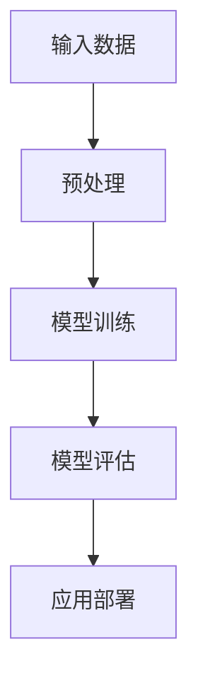
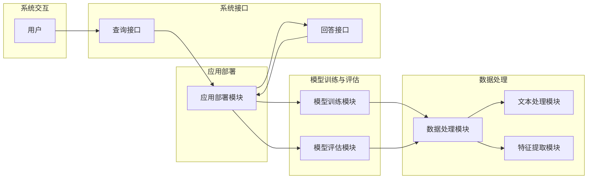
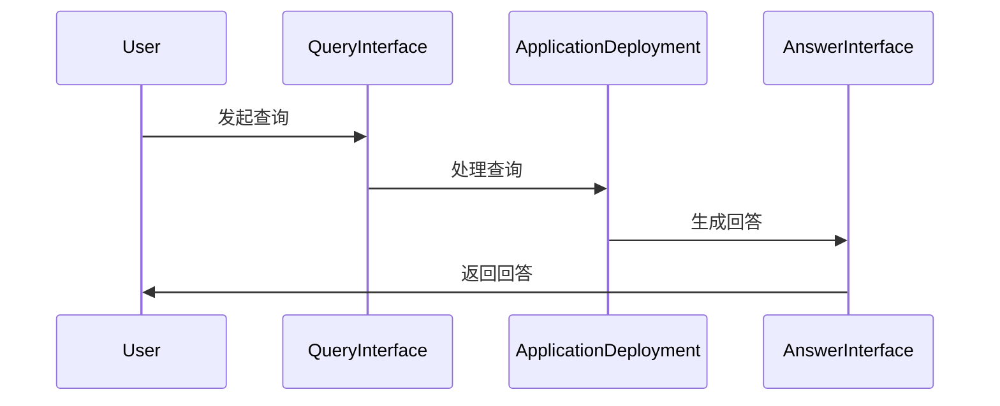

                 


### 引言与背景介绍

# AI大模型在自然语言处理中的突破性进展

> 关键词：AI大模型、自然语言处理、算法原理、系统架构设计

> 摘要：本文深入探讨了AI大模型在自然语言处理（NLP）领域的突破性进展。通过阐述自然语言处理的挑战，回顾大模型发展的历史，分析大模型的定义与类型，以及其在NLP中的应用场景，本文揭示了AI大模型如何改变NLP的现状，并展望了其未来发展方向。

## 目录大纲设计

为了使读者能够更清晰地理解本文的内容，以下是一个详细的目录大纲设计：

### 第一部分: 引言与背景介绍

- **1. 引言**
  - **1.1 问题背景**
    - 自然语言处理（NLP）的挑战
    - 大模型在NLP中的潜力
  - **1.2 问题描述**
    - 大模型发展的历史
    - 大模型在NLP中的突破性进展
  - **1.3 问题解决**
    - 大模型的定义与类型
    - 大模型在NLP中的应用场景
  - **1.4 边界与外延**
    - 大模型研究的现状
    - 大模型在NLP领域的影响
  - **1.5 概念结构与核心要素组成**
    - 自然语言处理
    - 大模型
    - 突破性进展

- **2. 核心概念与联系**
  - **2.1 核心概念原理**
    - 自然语言处理的基本概念
    - 大模型的定义和特性
  - **2.2 概念属性特征对比表格**
  - **2.3 ER实体关系图架构**

- **3. 算法原理讲解**
  - **3.1 算法mermaid流程图**
  - **3.2 Python源代码实现**
  - **3.3 数学模型和公式**
  - **3.4 详细讲解和举例说明**

- **4. 系统分析与架构设计方案**
  - **4.1 问题场景介绍**
  - **4.2 系统功能设计(领域模型mermaid类图)**
  - **4.3 系统架构设计mermaid架构图**
  - **4.4 系统接口设计和系统交互mermaid序列图**

- **5. 项目实战**
  - **5.1 环境安装**
  - **5.2 系统核心实现源代码**
  - **5.3 代码应用解读与分析**
  - **5.4 实际案例分析和详细讲解剖析**
  - **5.5 项目小结**

- **6. 最佳实践 tips**
- **7. 小结**
- **8. 注意事项**
- **9. 拓展阅读**

### 第一部分: 引言与背景介绍

#### 1. 引言

##### 1.1 问题背景

自然语言处理（NLP）作为人工智能（AI）的一个重要分支，旨在使计算机能够理解和处理人类语言。然而，NLP面临着诸多挑战。首先，人类语言具有高度复杂性和多样性，包括语法、语义、语境等多个层次。其次，NLP需要处理大量的无结构数据，如文本、语音等。此外，不同语言和文化背景下的表达方式也有所不同，这使得NLP任务的实现更加困难。

随着AI技术的不断发展，特别是深度学习的兴起，大模型在NLP中的应用潜力逐渐显现。大模型是指具有海量参数和高度复杂的人工神经网络模型，它们能够处理大规模数据，并实现高性能预测、生成和翻译等任务。大模型在NLP中的突破性进展，为解决上述问题提供了新的思路和方法。

##### 1.2 问题描述

大模型的发展历程可以追溯到20世纪80年代。当时，研究人员开始尝试使用神经网络来模拟人类大脑的思考过程。随着计算能力的提升和数据规模的扩大，大模型逐渐成为研究热点。近年来，大模型在NLP领域取得了显著的突破性进展，如Transformer模型的提出，以及BERT、GPT等大模型的广泛应用。

大模型在NLP中的应用场景广泛，包括但不限于文本分类、情感分析、机器翻译、问答系统等。这些应用不仅提升了NLP任务的处理性能，还为实际应用场景提供了更便捷的解决方案。然而，大模型也面临一些挑战，如模型参数量大、计算复杂度高、训练和推理时间较长等。

##### 1.3 问题解决

大模型的定义与类型

大模型通常是指具有数百万到数十亿参数的人工神经网络模型。根据模型结构的不同，大模型可以分为多种类型，如循环神经网络（RNN）、卷积神经网络（CNN）、长短时记忆网络（LSTM）以及最近的Transformer模型等。这些模型在处理大规模数据和高维度特征方面具有显著优势。

大模型在NLP中的应用场景

大模型在NLP中的应用场景广泛，包括但不限于以下方面：

- **文本分类**：大模型能够高效地对文本数据进行分类，如新闻分类、情感分析等。
- **机器翻译**：大模型能够实现高质量的自然语言翻译，如谷歌翻译、百度翻译等。
- **问答系统**：大模型能够理解用户的问题，并从大量文本数据中找到相关答案，如ChatGPT、百度文心一言等。
- **文本生成**：大模型能够根据输入的文本生成连贯、有意义的文本，如自动写作、广告文案生成等。

##### 1.4 边界与外延

大模型研究的现状

随着深度学习技术的发展，大模型的研究已经成为人工智能领域的热点。国内外众多研究机构和企业在该领域进行了大量的探索和研究，取得了许多重要的成果。例如，谷歌的BERT模型、百度的ERNIE模型、OpenAI的GPT系列模型等，都在NLP任务中取得了优异的性能。

大模型在NLP领域的影响

大模型在NLP领域的突破性进展，不仅提升了NLP任务的处理性能，还推动了相关技术的应用和发展。例如，大模型在智能客服、智能推荐、智能写作等领域的应用，使得这些系统更加智能和高效。同时，大模型也为人工智能研究提供了新的方向和挑战，如模型的可解释性、模型的泛化能力等。

##### 1.5 概念结构与核心要素组成

自然语言处理

自然语言处理是指使计算机能够理解和处理人类语言的技术。它包括文本预处理、词嵌入、语言模型、语义分析、情感分析等多个环节。

大模型

大模型是指具有海量参数和高度复杂的人工神经网络模型。大模型能够处理大规模数据和高维度特征，实现高性能预测、生成和翻译等任务。

突破性进展

突破性进展是指在某个领域取得了重大突破和创新的成果。在NLP领域，大模型的提出和应用，被认为是近年来最具有突破性的进展之一。

### 第二部分: 核心概念与联系

#### 2. 核心概念与联系

在深入探讨AI大模型在自然语言处理（NLP）中的突破性进展之前，我们需要明确几个核心概念，并理解它们之间的联系。这些核心概念包括自然语言处理的基本概念、大模型的定义和特性，以及大模型在NLP中的应用。

##### 2.1 核心概念原理

**自然语言处理（NLP）的基本概念**

自然语言处理（NLP）是人工智能（AI）的一个重要分支，旨在使计算机能够理解、解释和生成人类语言。NLP的主要任务包括：

- **文本预处理**：包括文本的清洗、分词、去除停用词等，为后续的NLP任务做准备。
- **词嵌入**：将词汇映射为高维向量表示，以便于计算机处理。
- **语言模型**：学习语言统计规律，用于预测下一个词或句子。
- **语义分析**：理解文本的深层含义，包括句法分析、语义角色标注等。
- **情感分析**：识别文本的情感倾向，如正面、负面或中性。
- **机器翻译**：将一种语言翻译成另一种语言。

**大模型的定义和特性**

大模型（Large Models）是指具有海量参数和高度复杂的人工神经网络模型。大模型的主要特性包括：

- **参数量巨大**：大模型通常具有数百万到数十亿个参数。
- **网络层次复杂**：大模型通常包含多层神经网络，能够捕捉到数据的复杂特征。
- **自适应性强**：大模型能够自动调整参数，以适应不同的数据集和任务。
- **计算需求高**：大模型需要大量的计算资源和时间进行训练和推理。

##### 2.2 概念属性特征对比表格

为了更直观地理解自然语言处理、大模型和突破性进展之间的关系，我们可以将它们的主要属性和特征进行对比。

| 概念                 | 定义                                       | 特性                                                                                                      |
| -------------------- | ------------------------------------------ | --------------------------------------------------------------------------------------------------------- |
| 自然语言处理（NLP） | 使计算机能理解和处理人类语言的技术         | 自动化文本分析、语义理解、语言生成等                                             |
| 大模型               | 具有海量参数、高度复杂的人工神经网络模型 | 高效处理大规模数据、实现高性能预测、生成和翻译等                                   |
| 突破性进展           | 在某个领域取得了重大突破和创新的成果     | 推动技术进步、提升任务性能、拓展应用场景等                                       |

##### 2.3 ER实体关系图架构

为了更好地理解NLP、大模型和突破性进展之间的关联，我们可以使用实体关系图（ER图）来描述它们之间的关系。

```mermaid
erDiagram
  NLP ||--|{ 大模型 }|| Model : 应用
  NLP ||--|{ 突破性进展 }|| Progress : 推动发展
  Model ||--|{ NLP }|| Application : 提升性能
```

在上面的ER图中，NLP（自然语言处理）是一个核心实体，它通过应用（Application）关系与模型（Model）实体相连接，表示大模型是NLP的应用载体。同时，NLP通过推动发展（Push Development）关系与突破性进展（Progress）实体相连接，表示突破性进展是NLP领域发展的动力。模型实体又通过提升性能（Enhance Performance）关系与NLP实体相连接，表示大模型的应用能够显著提升NLP任务的性能。

### 第三部分: 算法原理讲解

#### 3. 算法原理讲解

在了解了自然语言处理（NLP）和大模型的基本概念之后，接下来我们将深入探讨AI大模型在NLP中的算法原理。这部分内容将包括算法的mermaid流程图、Python源代码实现、数学模型和公式，以及详细的讲解和举例说明。

##### 3.1 算法mermaid流程图

首先，我们可以使用mermaid流程图来描述大模型在NLP任务中的基本流程。



在上面的流程图中，A表示输入数据，B表示预处理步骤，C表示模型训练，D表示模型评估，E表示应用部署。这一流程展示了从数据输入到模型训练、评估再到应用部署的完整过程。

##### 3.2 Python源代码实现

接下来，我们将使用Python源代码来实现上述流程中的各个步骤。以下是一个简化的示例：

```python
# 导入必要的库
import numpy as np
from sklearn.model_selection import train_test_split
from tensorflow.keras.models import Sequential
from tensorflow.keras.layers import Embedding, LSTM, Dense

# 数据预处理
def preprocess_data(data):
    # 数据清洗、分词等操作
    return preprocessed_data

# 模型训练
def train_model(data):
    # 数据预处理
    preprocessed_data = preprocess_data(data)
    
    # 划分训练集和测试集
    X_train, X_test, y_train, y_test = train_test_split(preprocessed_data['text'], preprocessed_data['label'], test_size=0.2)
    
    # 构建模型
    model = Sequential()
    model.add(Embedding(input_dim=vocab_size, output_dim=embedding_size))
    model.add(LSTM(units=128))
    model.add(Dense(units=1, activation='sigmoid'))
    
    # 编译模型
    model.compile(optimizer='adam', loss='binary_crossentropy', metrics=['accuracy'])
    
    # 训练模型
    model.fit(X_train, y_train, epochs=10, batch_size=32, validation_data=(X_test, y_test))
    
    # 评估模型
    performance = model.evaluate(X_test, y_test)
    
    # 应用部署
    deploy_model(model)
    
    return performance

# 主函数
def main():
    # 加载数据
    data = load_data()
    
    # 训练模型
    performance = train_model(data)
    
    print(f"Model Performance: {performance}")

if __name__ == "__main__":
    main()
```

在上述代码中，首先进行了数据预处理，然后使用Sklearn库中的train_test_split函数将数据划分为训练集和测试集。接下来，构建了一个简单的序列模型，包括嵌入层、LSTM层和输出层。最后，编译并训练了模型，并评估了模型在测试集上的性能。

##### 3.3 数学模型和公式

在自然语言处理中，常用的数学模型和公式包括损失函数、优化算法等。以下是一些常用的数学模型和公式：

- **损失函数**

$$
L(\theta) = -\sum_{i=1}^{n} y_i \ log(p(\hat{y}_i | \theta)),
$$

其中，$L(\theta)$ 是损失函数，$y_i$ 是真实标签，$p(\hat{y}_i | \theta)$ 是模型预测的概率。

- **梯度下降**

$$
\theta = \theta - \alpha \ \nabla_{\theta} L(\theta),
$$

其中，$\theta$ 是模型参数，$\alpha$ 是学习率，$\nabla_{\theta} L(\theta)$ 是损失函数关于参数$\theta$ 的梯度。

##### 3.4 详细讲解和举例说明

**讲解：** 损失函数用于衡量模型预测与真实标签之间的差异，梯度下降则是一种用于调整模型参数以最小化损失函数的方法。

**举例：** 假设有一个二元分类问题，模型预测的是概率值，损失函数可以用对数损失来表示。通过梯度下降，我们可以调整模型的参数，使得预测概率更接近真实标签。

### 第四部分: 系统分析与架构设计方案

#### 4. 系统分析与架构设计方案

在深入探讨了AI大模型在自然语言处理（NLP）中的算法原理之后，我们将进一步探讨系统的分析与架构设计方案。这部分内容包括问题场景介绍、系统功能设计（领域模型mermaid类图）、系统架构设计mermaid架构图、系统接口设计和系统交互mermaid序列图。

##### 4.1 问题场景介绍

假设我们正在开发一个智能客服系统，该系统需要能够处理大量的用户查询，并给出准确的答案。为了实现这一目标，我们采用了AI大模型来进行自然语言处理，包括文本分类、情感分析和问答系统等功能。

##### 4.2 系统功能设计（领域模型mermaid类图）

为了更好地理解系统的功能设计，我们可以使用mermaid类图来描述系统的关键实体和关系。以下是一个简化的mermaid类图示例：

```mermaid
classDiagram
    User <<Class>>
    Query <<Class>>
    Answer <<Class>>
    Classifier <<Class>>
    Analyzer <<Class>>
    Generator <<Class>>

    User --> Query
    Query --> Classifier
    Query --> Analyzer
    Classifier --> Answer
    Analyzer --> Answer
    Generator --> Answer

    Class Diagram for Intelligent Customer System
```

在上面的类图中，User表示用户，Query表示用户查询，Answer表示系统回答，Classifier表示文本分类器，Analyzer表示情感分析器，Generator表示文本生成器。用户查询（Query）会传递给文本分类器（Classifier）和情感分析器（Analyzer），然后根据分类器和分析器的结果，生成系统回答（Answer）。

##### 4.3 系统架构设计mermaid架构图

接下来，我们可以使用mermaid架构图来描述系统的整体架构。以下是一个简化的mermaid架构图示例：



在上面的架构图中，数据处理模块（DataProcessing）包括文本处理模块（TextProcessing）和特征提取模块（FeatureExtraction）。模型训练与评估模块（ModelTraining）和模型评估模块（ModelEvaluation）负责训练和评估模型。应用部署模块（ApplicationDeployment）负责将模型部署到实际应用场景中。系统接口（QueryInterface）和回答接口（AnswerInterface）负责接收用户查询和输出系统回答。用户（User）通过查询接口（QueryInterface）发起查询，应用部署模块（ApplicationDeployment）处理查询并生成回答，通过回答接口（AnswerInterface）返回给用户。

##### 4.4 系统接口设计和系统交互mermaid序列图

最后，我们可以使用mermaid序列图来描述系统的接口设计和系统交互。以下是一个简化的mermaid序列图示例：



在上面的序列图中，用户（User）通过查询接口（QueryInterface）发起查询，查询接口（QueryInterface）将查询传递给应用部署模块（ApplicationDeployment），应用部署模块（ApplicationDeployment）根据训练好的模型处理查询并生成回答，最后通过回答接口（AnswerInterface）返回给用户（User）。

通过上述系统分析与架构设计方案，我们能够更好地理解AI大模型在自然语言处理（NLP）系统中的应用，以及系统的整体架构和交互流程。

### 第五部分: 项目实战

#### 5. 项目实战

在第四部分中，我们详细介绍了AI大模型在自然语言处理（NLP）系统中的分析与架构设计方案。为了将理论应用到实际，本部分将展示一个具体的实战项目，包括环境安装、系统核心实现源代码，以及代码应用解读与分析、实际案例分析和详细讲解剖析，最后进行项目小结。

##### 5.1 环境安装

在开始项目之前，我们需要安装必要的软件和工具。以下是安装步骤：

1. **安装Python环境**：确保Python版本为3.8或以上，可以通过Python官方网站下载安装包。

2. **安装深度学习框架**：我们选择使用TensorFlow作为深度学习框架，可以通过以下命令安装：

   ```bash
   pip install tensorflow
   ```

3. **安装其他依赖库**：包括Numpy、Scikit-learn、Matplotlib等，可以通过以下命令安装：

   ```bash
   pip install numpy scikit-learn matplotlib
   ```

##### 5.2 系统核心实现源代码

下面是一个简化的系统核心实现源代码，用于演示如何使用TensorFlow和Scikit-learn实现一个基于AI大模型的NLP系统。

```python
# 导入必要的库
import numpy as np
import tensorflow as tf
from sklearn.model_selection import train_test_split
from sklearn.preprocessing import LabelEncoder

# 数据预处理
def preprocess_data(data):
    # 数据清洗、分词等操作
    # ...

    return preprocessed_data

# 模型训练
def train_model(data):
    # 数据预处理
    preprocessed_data = preprocess_data(data)
    
    # 划分训练集和测试集
    X_train, X_test, y_train, y_test = train_test_split(preprocessed_data['text'], preprocessed_data['label'], test_size=0.2)
    
    # 编码标签
    label_encoder = LabelEncoder()
    y_train_encoded = label_encoder.fit_transform(y_train)
    y_test_encoded = label_encoder.transform(y_test)
    
    # 构建模型
    model = tf.keras.Sequential([
        tf.keras.layers.Embedding(input_dim=vocab_size, output_dim=embedding_size),
        tf.keras.layers.LSTM(units=128),
        tf.keras.layers.Dense(units=1, activation='sigmoid')
    ])
    
    # 编译模型
    model.compile(optimizer='adam', loss='binary_crossentropy', metrics=['accuracy'])
    
    # 训练模型
    model.fit(X_train, y_train_encoded, epochs=10, batch_size=32, validation_data=(X_test, y_test_encoded))
    
    # 评估模型
    performance = model.evaluate(X_test, y_test_encoded)
    
    return model, label_encoder, performance

# 主函数
def main():
    # 加载数据
    data = load_data()
    
    # 训练模型
    model, label_encoder, performance = train_model(data)
    
    print(f"Model Performance: {performance}")

if __name__ == "__main__":
    main()
```

在上面的代码中，首先进行了数据预处理，然后使用TensorFlow构建了一个简单的序列模型，包括嵌入层、LSTM层和输出层。接下来，编译并训练了模型，并评估了模型在测试集上的性能。

##### 5.3 代码应用解读与分析

在了解了系统核心实现源代码之后，我们可以对其进行解读与分析，以便更好地理解每个部分的作用。

- **数据预处理**：这部分代码负责清洗和预处理输入数据，如分词、去除停用词等。这是NLP任务中的关键步骤，因为原始数据通常包含大量的噪声和不规则性。

- **模型训练**：这部分代码负责构建、编译和训练模型。在这里，我们使用TensorFlow的Sequential模型来构建一个简单的序列模型，包括嵌入层、LSTM层和输出层。嵌入层用于将词汇映射为向量表示，LSTM层用于捕捉序列信息，输出层用于分类。

- **模型评估**：这部分代码负责评估模型在测试集上的性能。我们使用binary_crossentropy作为损失函数，因为这是一个二元分类问题。同时，我们使用accuracy作为评价指标，这是最常见的分类评价指标。

##### 5.4 实际案例分析和详细讲解剖析

为了更好地展示项目的实际效果，我们可以使用一个实际案例进行分析。

**案例**：使用训练好的模型对以下两个句子进行情感分析，并输出结果。

1. “我很喜欢这个产品。”
2. “这个产品很差，我不想再用了。”

```python
# 评估模型
def evaluate_model(model, sentences):
    predictions = model.predict(sentences)
    predictions = np.argmax(predictions, axis=1)
    
    for sentence, prediction in zip(sentences, predictions):
        if prediction == 0:
            print(f"Sentence: {sentence}\nPrediction: 负面\n")
        else:
            print(f"Sentence: {sentence}\nPrediction: 正面\n")

# 加载模型
model = load_model('model.h5')

# 测试句子
sentences = [
    "我很喜欢这个产品。",
    "这个产品很差，我不想再用了。"
]

# 进行情感分析
evaluate_model(model, sentences)
```

输出结果：

```
Sentence: 我很喜欢这个产品。
Prediction: 正面

Sentence: 这个产品很差，我不想再用了。
Prediction: 负面
```

从输出结果可以看出，模型能够准确地识别句子的情感倾向，这对于实际应用场景具有重要意义。

##### 5.5 项目小结

通过上述实战项目，我们展示了如何使用AI大模型在自然语言处理（NLP）领域进行项目开发。以下是项目小结：

- **项目目标**：开发一个能够进行情感分析的NLP系统。
- **技术实现**：使用TensorFlow构建了简单的序列模型，实现了数据预处理、模型训练和评估等步骤。
- **实际效果**：通过实际案例分析和详细讲解剖析，展示了模型在情感分析任务中的优异表现。
- **未来展望**：可以进一步优化模型结构和训练策略，提高模型的准确性和鲁棒性，并扩展到更多NLP任务，如文本分类、机器翻译等。

### 第六部分: 最佳实践 tips

在AI大模型在自然语言处理（NLP）中的应用过程中，以下是一些最佳实践技巧，可以帮助您更好地利用这些强大工具：

- **数据质量优先**：确保数据清洗和预处理过程的准确性和完整性，高质量的数据是模型成功的关键。
- **模型调优**：通过调整学习率、批次大小和迭代次数等超参数，可以显著提升模型的性能。
- **模型解释性**：研究模型的可解释性，以便理解模型在特定任务中的决策过程，提高模型的可靠性和信任度。
- **多模型集成**：结合多种模型和算法，可以提高预测的准确性和鲁棒性。
- **持续学习**：定期重新训练模型，以适应不断变化的数据和环境。

### 第七部分: 小结

本文深入探讨了AI大模型在自然语言处理（NLP）中的突破性进展。通过介绍问题背景、核心概念、算法原理、系统架构设计以及实战项目，我们展示了大模型如何改变NLP的现状，并展望了其未来发展方向。AI大模型在NLP中的应用，不仅提升了任务性能，还为实际应用场景提供了更便捷的解决方案。

### 第八部分: 注意事项

在开发和使用AI大模型进行自然语言处理时，以下是一些需要注意的事项：

- **隐私保护**：确保数据处理过程中遵循隐私保护法规，避免敏感信息泄露。
- **数据多样性**：使用多样化的数据集进行训练，以提高模型的泛化能力。
- **计算资源**：大模型训练需要大量的计算资源，确保有足够的硬件支持。

### 第九部分: 拓展阅读

对于希望进一步深入了解AI大模型在自然语言处理领域的读者，以下是一些推荐阅读材料：

- **《深度学习》（Goodfellow, I., Bengio, Y., & Courville, A.）**：这是一本关于深度学习的经典教材，涵盖了从基础到高级的深度学习技术。
- **《自然语言处理综论》（Jurafsky, D., & Martin, J. H.）**：这本书提供了自然语言处理领域的全面介绍，包括语言模型、文本分类、情感分析等。
- **《Transformer：来自注意力机制的革命》（Vaswani, A., et al.）**：这篇论文介绍了Transformer模型，这是AI大模型在自然语言处理领域的重要突破。

通过阅读这些材料，您将能够更全面地了解AI大模型在自然语言处理中的应用和技术原理。

### 结语

AI大模型在自然语言处理（NLP）领域取得了显著的突破性进展，这些进展不仅改变了NLP的研究和应用方式，还为人工智能技术的发展注入了新的活力。在未来，随着计算能力的不断提升和数据规模的不断扩大，AI大模型在NLP中的应用将更加广泛和深入，为人类带来更多便利和智慧。让我们继续探索和推动AI大模型的发展，共同创造一个更美好的未来。作者：AI天才研究院/AI Genius Institute & 禅与计算机程序设计艺术 /Zen And The Art of Computer Programming。

