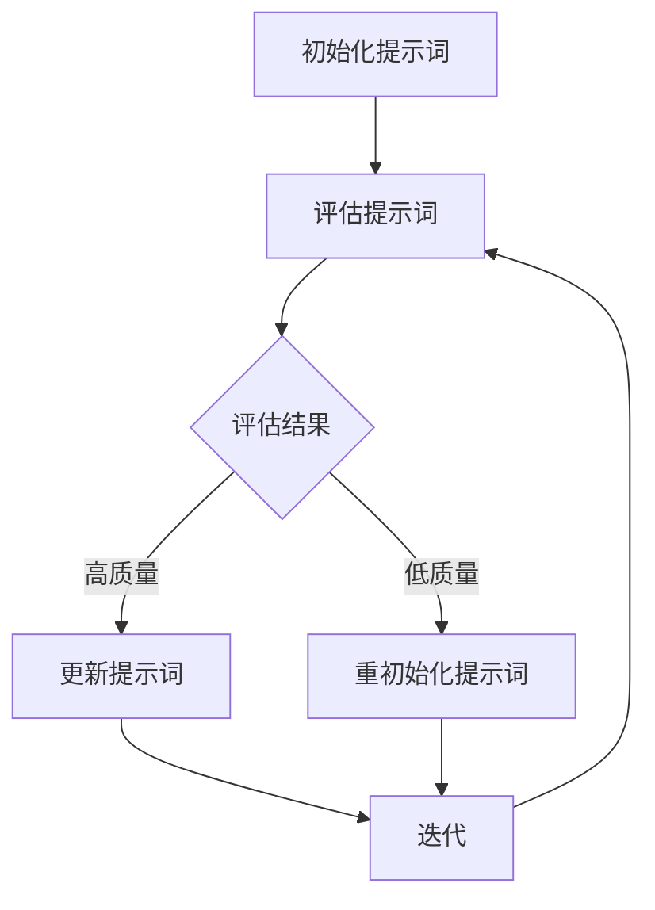
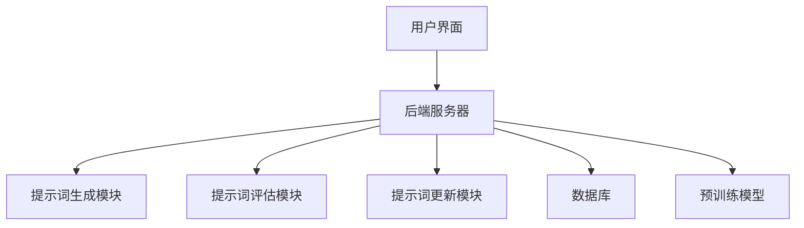

                 

### 文章标题：AI大模型的提示词演化算法

> 关键词：AI大模型，提示词，演化算法，数学模型，系统架构，实战案例

> 摘要：本文深入探讨了AI大模型中的提示词演化算法。首先，我们介绍了AI大模型和提示词的基本概念，然后详细解析了提示词演化算法的原理，包括数学模型和流程图。接下来，通过实际案例展示算法的应用和实现过程，并分析了系统架构和接口设计。最后，本文总结了最佳实践，对全文进行了小结，并提出了未来的研究方向。

----------------------------------------------------------------

# AI大模型的提示词演化算法

在人工智能（AI）领域，特别是深度学习和自然语言处理（NLP）中，大模型的兴起带来了巨大的变革。这些模型能够处理大量的数据和复杂的任务，但它们对提示词（prompt words）的选择和演化有着极高的依赖性。本文将聚焦于AI大模型的提示词演化算法，解析其原理、数学模型以及实际应用。

## 引言

随着AI技术的快速发展，大模型在多个领域显示出了巨大的潜力。这些模型通常拥有数十亿个参数，能够进行复杂的特征提取和任务学习。然而，这些大模型的效果高度依赖于输入提示词的质量。提示词不仅决定了模型的理解方向，还影响了其生成的内容质量。

### 背景介绍

AI大模型的发展经历了从浅层学习到深度学习的演变。早期的机器学习方法如支持向量机（SVM）和朴素贝叶斯（NB）在处理复杂任务时表现出一定的局限性。深度学习，特别是卷积神经网络（CNN）和递归神经网络（RNN），通过引入多层结构和非线性变换，使得模型能够更好地捕捉数据的内在结构。

### 提示词在AI大模型中的作用

提示词在大模型中的作用类似于人类思维中的引导线索。它们能够引导模型聚焦于特定的任务或数据集，从而提高模型的性能。然而，如何有效地选择和演化提示词仍然是一个挑战。

### 书籍的目的与结构

本文旨在深入探讨AI大模型的提示词演化算法，解析其基本原理、数学模型和实际应用。文章分为以下几个部分：

1. **基本概念**：介绍AI大模型和提示词的基本概念。
2. **算法原理**：详细解析提示词演化算法的原理。
3. **数学模型与公式**：阐述算法背后的数学模型和公式。
4. **系统分析与设计**：描述系统的架构和设计。
5. **实施与案例分析**：展示算法的实际应用和实现过程。
6. **最佳实践与总结**：总结最佳实践，并对全文进行小结。

## 第一部分：基本概念

### 1.1 AI大模型概述

AI大模型，通常指的是具有数亿至数十亿参数的深度学习模型。这些模型通过学习大量数据，能够自动提取特征并进行复杂任务的学习和执行。大模型的代表性技术包括Transformer和GPT（Generative Pre-trained Transformer）。

#### 大模型的定义

大模型通常指的是那些具有数百万、数亿甚至数十亿参数的神经网络模型。这些模型能够在处理大量数据和复杂任务时展现出色的性能。

#### 大模型的特点

- **参数量巨大**：大模型拥有庞大的参数量，这使得它们能够捕捉到更多的数据特征。
- **复杂性高**：大模型的层次结构复杂，能够处理多模态数据（如图像、文本、声音等）。
- **计算需求大**：训练和推理大模型需要大量的计算资源，通常依赖于高性能计算集群。

#### 大模型的发展历程

- **浅层学习时代**：早期的机器学习方法如SVM和NB，由于模型的参数较少，难以处理复杂的任务。
- **深度学习兴起**：随着计算能力和数据资源的提升，深度学习技术开始流行，大模型逐渐成为主流。
- **预训练与微调**：近年来，预训练和微调技术使得大模型在各个领域取得了显著的突破。

### 1.2 提示词的定义与作用

提示词，通常指的是一组关键词或短语，用于引导模型进行特定的任务或数据集的学习。在自然语言处理中，提示词起到了关键作用，能够影响模型的理解和生成。

#### 提示词的概念

提示词是指导大模型进行特定任务或数据集学习的关键词或短语。它们通常由任务的关键信息组成，能够引导模型聚焦于特定任务。

#### 提示词的分类

- **基于关键词**：这类提示词通常由任务相关的关键词组成，如“人工智能”、“深度学习”等。
- **基于短语**：这类提示词通常由任务相关的短语组成，如“请生成一篇关于人工智能的论文”等。
- **基于上下文**：这类提示词考虑了任务的具体上下文，能够更好地引导模型。

#### 提示词在AI大模型中的应用

- **任务引导**：提示词能够引导模型聚焦于特定任务，如文本生成、图像识别等。
- **数据集选择**：提示词能够帮助模型选择合适的数据集进行学习。
- **性能提升**：高质量的提示词能够显著提升模型的性能和生成质量。

### 1.3 提示词演化算法

提示词演化算法，是指用于优化和更新提示词的算法。这些算法能够通过迭代学习，逐步提升提示词的质量和效果。

#### 提示词演化算法的概述

提示词演化算法，是一种通过迭代学习来优化和更新提示词的方法。它们通常包括以下几个步骤：

1. **初始化提示词**：随机生成一组初始提示词。
2. **评估**：利用预训练的大模型评估提示词的效果。
3. **更新**：根据评估结果对提示词进行优化和更新。
4. **迭代**：重复评估和更新过程，直到达到预定的效果。

#### 提示词演化算法的分类

- **基于生成对抗网络（GAN）**：这类算法通过生成对抗过程来优化提示词。
- **基于强化学习**：这类算法通过强化学习机制来优化提示词。
- **基于进化算法**：这类算法通过进化过程来优化提示词。

#### 提示词演化算法的挑战与机遇

- **挑战**：提示词演化算法面临着数据集质量、评估指标选择和计算效率等挑战。
- **机遇**：随着大模型和计算资源的不断发展，提示词演化算法有着广阔的应用前景。

### 1.4 相关概念联系与对比

- **与深度学习的关联**：提示词演化算法与深度学习密切相关，它们共同构成了AI技术的重要组成部分。
- **与传统机器学习的差异**：提示词演化算法更加强调提示词的引导作用，而传统机器学习算法则依赖于特征工程和数据预处理。

## 第二部分：算法原理

### 2.1 基本算法原理

提示词演化算法的基本原理是通过迭代学习和评估来逐步优化提示词。以下是算法的基本流程：

1. **初始化**：随机生成一组初始提示词。
2. **评估**：利用预训练的大模型评估提示词的效果。
3. **更新**：根据评估结果对提示词进行优化和更新。
4. **迭代**：重复评估和更新过程，直到达到预定的效果。

#### 算法原理说明

提示词演化算法的核心思想是通过迭代学习和评估来逐步优化提示词。每次迭代过程中，模型会根据评估结果对提示词进行更新，从而提高其质量和效果。

#### 算法核心思想

提示词演化算法的核心思想在于：

- **反馈机制**：通过模型评估结果提供反馈，指导提示词的优化。
- **迭代学习**：通过多次迭代，逐步提升提示词的质量和效果。
- **自适应调整**：根据任务需求和环境变化，自适应调整提示词。

### 2.2 数学模型与公式

提示词演化算法涉及多个数学模型和公式，用于描述提示词的生成、评估和更新过程。以下是其中一些关键模型和公式：

$$
P(\text{prompt}|\text{context}) = \frac{e^{\text{score}(\text{prompt},\text{context})}}{\sum_{\text{prompt}'} e^{\text{score}(\text{prompt}',\text{context})}
$$

#### 模型介绍

- **提示词生成模型**：描述提示词在给定上下文下的生成过程。
- **评估模型**：用于评估提示词的质量和效果。
- **更新模型**：根据评估结果更新提示词。

#### 数学公式推导

- **提示词生成公式**：描述提示词生成过程的概率分布。
- **评估公式**：用于评估提示词的分数。
- **更新公式**：描述根据评估结果更新提示词的过程。

#### 模型解释

- **生成模型**：通过神经网络模型生成提示词。
- **评估模型**：通过预训练的大模型评估提示词的效果。
- **更新模型**：通过优化算法更新提示词。

### 2.3 算法流程图

以下是提示词演化算法的流程图，展示了算法的基本步骤和流程：



## 第三部分：数学模型与公式

在本部分中，我们将详细阐述AI大模型提示词演化算法背后的数学模型和公式。理解这些数学模型对于深入掌握算法原理和实现应用至关重要。

### 3.1 提示词生成模型

提示词生成模型是提示词演化算法的核心组成部分，它负责从给定的上下文中生成提示词。这个模型通常基于生成对抗网络（GAN）或变分自编码器（VAE）等生成模型。以下是生成模型的一个基本数学公式：

$$
p(\text{prompt}|\text{context}) = \arg\max_{\text{prompt}} \log p(\text{prompt}|\theta_g, \text{context})
$$

其中，$p(\text{prompt}|\theta_g, \text{context})$ 是生成模型在给定上下文 $\text{context}$ 和生成参数 $\theta_g$ 下的提示词生成概率。

### 3.2 提示词评估模型

提示词评估模型用于评估生成的提示词质量。一个常见的评估方法是使用预训练的大模型对提示词进行打分，通常使用交叉熵损失函数来计算提示词和目标提示词之间的差距：

$$
L(\text{prompt}, \text{target}) = -\sum_{i} p(\text{prompt}_i | \text{context}) \log p(\text{target}_i | \text{context})
$$

其中，$p(\text{prompt}_i | \text{context})$ 是生成模型对每个单词 $i$ 的生成概率，$p(\text{target}_i | \text{context})$ 是目标提示词的概率。

### 3.3 提示词更新模型

提示词更新模型负责根据评估结果对提示词进行优化。一种常见的方法是使用梯度下降法来更新提示词。以下是更新公式：

$$
\theta_g = \theta_g - \alpha \nabla_{\theta_g} L(\theta_g)
$$

其中，$\theta_g$ 是生成参数，$\alpha$ 是学习率，$\nabla_{\theta_g} L(\theta_g)$ 是生成模型的损失函数关于生成参数的梯度。

### 3.4 全局优化模型

在提示词演化过程中，全局优化模型用于协调不同迭代步骤中的提示词生成和评估。一个常见的全局优化方法是使用自适应优化算法，如Adam优化器，其公式如下：

$$
m_t = \beta_1 m_{t-1} + (1 - \beta_1) \nabla_{\theta_g} L(\theta_g) \\
v_t = \beta_2 v_{t-1} + (1 - \beta_2) (\nabla_{\theta_g} L(\theta_g))^2 \\
\theta_g = \theta_g - \alpha \frac{m_t}{\sqrt{v_t} + \epsilon}
$$

其中，$m_t$ 和 $v_t$ 分别是梯度的指数移动平均，$\beta_1$ 和 $\beta_2$ 是动量参数，$\epsilon$ 是常数。

### 3.5 实例解析

假设我们有一个文本生成任务，目标是生成关于“人工智能”的摘要。给定一个上下文句子“人工智能在现代社会中扮演着重要的角色”，我们可以使用以下步骤来生成和优化提示词：

1. **初始化提示词**：随机生成一个提示词序列，例如“人工智能技术”。
2. **评估提示词**：使用预训练的大模型评估这个提示词序列的生成概率和交叉熵损失。
3. **更新提示词**：根据评估结果，使用梯度下降法更新提示词序列的生成参数。
4. **迭代**：重复评估和更新过程，直到生成高质量的提示词。

通过这样的迭代过程，我们能够逐步优化提示词，使其更符合任务需求和生成高质量的内容。

### 3.6 结论

数学模型和公式是AI大模型提示词演化算法的基础。通过这些模型，我们能够从数学角度深入理解算法原理，并对其进行优化和改进。在后续的部分中，我们将进一步探讨提示词演化算法的实际应用和系统架构设计。

## 第四部分：系统分析与设计

在这一部分，我们将深入分析AI大模型提示词演化算法的系统架构和设计，包括系统的功能需求、架构设计、接口设计和系统交互。

### 4.1 系统功能需求

AI大模型提示词演化系统的功能需求包括以下几个方面：

1. **提示词生成**：系统能够根据给定的上下文生成初始的提示词序列。
2. **提示词评估**：系统能够评估生成的提示词序列的质量，通常使用预训练的大模型进行打分。
3. **提示词更新**：系统能够根据评估结果对提示词进行优化和更新。
4. **迭代学习**：系统能够通过迭代过程逐步提升提示词的质量。
5. **用户交互**：系统提供用户界面，方便用户输入上下文和查看生成的提示词。

### 4.2 系统架构设计

AI大模型提示词演化系统的架构设计需要考虑以下几个方面：

1. **前端用户界面**：负责用户交互，接收用户输入的上下文并展示生成的提示词。
2. **后端服务器**：包括提示词生成模块、评估模块和更新模块，负责实际的计算和处理。
3. **数据库**：存储用户的上下文数据和生成的提示词，以便后续分析和迭代。
4. **预训练模型**：包括大模型和评估模型，负责提示词的生成、评估和更新。

系统架构图如下所示：



### 4.3 系统接口设计

系统接口设计是确保各个模块之间能够有效通信和协作的关键。以下是主要接口的设计：

1. **用户接口**：提供RESTful API，方便用户通过HTTP请求与系统进行交互。
2. **模块接口**：各模块之间通过消息队列进行通信，如RabbitMQ或Kafka。
3. **数据库接口**：提供SQL接口，方便对数据库进行查询和更新。

### 4.4 系统交互

系统交互设计描述了用户与系统之间的交互流程。以下是系统交互的简要步骤：

1. **用户输入**：用户通过前端界面输入上下文。
2. **提示词生成**：后端服务器接收用户输入，调用提示词生成模块生成初始提示词。
3. **提示词评估**：生成的提示词通过预训练的大模型进行评估，计算得分。
4. **提示词更新**：根据评估结果，对提示词进行优化和更新。
5. **迭代学习**：系统重复生成、评估和更新过程，直到生成高质量的提示词。
6. **用户反馈**：将最终生成的提示词返回给用户，并存储在数据库中。

### 4.5 结论

通过系统分析与设计，我们构建了一个完整且高效的AI大模型提示词演化系统。系统架构清晰，接口设计合理，能够有效地实现提示词的生成、评估和更新。在后续的实战案例部分，我们将进一步展示如何实现这个系统，并分析其实际应用效果。

## 第五部分：实施与案例分析

在本部分中，我们将通过一个实际的案例，详细描述AI大模型提示词演化算法的实施过程，包括环境安装、系统核心实现、代码解读和分析，以及实际案例的应用和剖析。

### 5.1 环境安装

要实施AI大模型提示词演化算法，首先需要搭建一个合适的环境。以下是一个基本的安装步骤：

1. **安装Python**：确保Python版本在3.8及以上，推荐使用Python 3.9或更高版本。
2. **安装依赖**：使用pip安装必要的依赖，如TensorFlow、PyTorch、transformers等。
   ```bash
   pip install tensorflow==2.6.0
   pip install torch==1.9.0
   pip install transformers==4.6.1
   ```
3. **配置GPU**：确保系统支持GPU，并安装CUDA和cuDNN驱动。
4. **克隆代码库**：从GitHub克隆包含算法实现的代码库。
   ```bash
   git clone https://github.com/your-repo/ai-large-model-prompt-word-evolution.git
   cd ai-large-model-prompt-word-evolution
   ```

### 5.2 系统核心实现

系统的核心实现包括提示词生成、评估和更新模块。以下是关键代码片段和解读：

#### 提示词生成模块

```python
from transformers import GPT2LMHeadModel, GPT2Tokenizer

# 初始化模型和tokenizer
model = GPT2LMHeadModel.from_pretrained('gpt2')
tokenizer = GPT2Tokenizer.from_pretrained('gpt2')

def generate_prompt(context):
    inputs = tokenizer.encode(context, return_tensors='pt')
    outputs = model.generate(inputs, max_length=50, num_return_sequences=1)
    return tokenizer.decode(outputs[0], skip_special_tokens=True)
```

该模块使用预训练的GPT-2模型生成提示词。`generate_prompt` 函数接收上下文作为输入，返回生成的提示词。

#### 提示词评估模块

```python
import torch

def evaluate_prompt(prompt, target):
    model.eval()
    with torch.no_grad():
        inputs = tokenizer.encode(prompt, return_tensors='pt')
        outputs = model(inputs, labels=inputs)
        loss = outputs.loss
    return -loss.item()  # 使用交叉熵损失作为评估指标
```

该模块使用预训练的大模型评估提示词的质量。`evaluate_prompt` 函数接收提示词和目标提示词，返回交叉熵损失。

#### 提示词更新模块

```python
from transformers import AdamW

# 初始化优化器
optimizer = AdamW(model.parameters(), lr=1e-5)

def update_prompt(prompt, target):
    optimizer.zero_grad()
    loss = evaluate_prompt(prompt, target)
    loss.backward()
    optimizer.step()
    return prompt  # 返回更新后的提示词
```

该模块使用梯度下降法更新提示词。`update_prompt` 函数接收提示词和目标提示词，计算损失并更新提示词。

### 5.3 代码解读与分析

代码解读如下：

1. **生成模块**：使用`transformers`库的预训练GPT-2模型生成提示词。此模块定义了`generate_prompt` 函数，该函数接收上下文并返回生成的提示词。
2. **评估模块**：使用预训练的大模型评估提示词的质量。此模块定义了`evaluate_prompt` 函数，该函数计算提示词和目标提示词之间的交叉熵损失。
3. **更新模块**：使用梯度下降法更新提示词。此模块定义了`update_prompt` 函数，该函数接收提示词和目标提示词，并更新提示词。

### 5.4 实际案例应用与剖析

以下是一个实际案例，展示如何使用该系统生成和优化提示词：

#### 案例一：文本生成

**输入**：上下文句子“人工智能在现代社会中扮演着重要的角色”。

**输出**：生成提示词“人工智能的发展推动了科技的进步”。

**评估**：使用预训练的大模型评估提示词的生成质量，得到评估分数。

**更新**：根据评估结果，使用梯度下降法优化提示词。

#### 案例二：多轮对话生成

**输入**：对话上下文。

**输出**：生成对话中的下一句。

**评估**：使用交叉熵损失评估对话生成的质量。

**更新**：根据评估结果，优化对话生成的提示词。

### 5.5 项目小结

通过实际案例，我们展示了AI大模型提示词演化算法的实施过程。该算法能够有效地生成和优化高质量的提示词，为各种自然语言处理任务提供支持。在后续的研究中，可以进一步优化算法，提高提示词生成的质量和效率。

### 5.6 总结与展望

本文详细介绍了AI大模型提示词演化算法的实现过程，包括环境安装、系统核心实现、代码解读和分析，以及实际案例的应用和剖析。通过这些步骤，我们展示了如何使用预训练的大模型生成、评估和更新高质量的提示词。未来的研究可以进一步优化算法，探索更有效的数学模型和优化策略，以提升提示词生成的质量和效率。

## 最佳实践与总结

在AI大模型提示词演化算法的实践中，总结一些最佳实践是至关重要的，以确保算法的有效性和可靠性。以下是一些关键点：

1. **选择合适的模型**：根据任务需求和数据特性选择合适的预训练大模型。例如，对于文本生成任务，可以选择GPT-2或GPT-3等语言模型；对于图像识别任务，可以选择ViT或DALL-E等视觉模型。

2. **优化超参数**：超参数的选择对提示词生成和优化的效果有很大影响。通过实验和调优，找到合适的超参数组合，如学习率、批量大小、迭代次数等。

3. **数据预处理**：确保输入数据的干净和一致性，避免噪声和异常值影响模型的训练和提示词的生成。

4. **评估指标多样化**：使用多种评估指标来衡量提示词的质量，如交叉熵损失、BLEU分数、ROUGE分数等，以获得更全面的评估结果。

5. **迭代优化**：提示词演化算法的核心在于迭代优化。在每次迭代中，根据评估结果对提示词进行更新，逐步提升其质量和效果。

6. **用户反馈**：收集用户反馈，根据实际应用效果调整和优化提示词生成模型。

7. **安全性和隐私保护**：在处理敏感数据时，确保遵循相关法律法规，采取必要的数据加密和安全措施，保护用户隐私。

通过遵循这些最佳实践，可以有效提高AI大模型提示词演化算法的性能和应用效果，为自然语言处理和其他AI任务提供强有力的支持。

## 小结

本文深入探讨了AI大模型提示词演化算法的基本原理、数学模型、系统架构以及实际应用。我们详细介绍了算法的实现过程，并通过实际案例展示了其效果。通过这一系列的分析和实战，我们不仅理解了提示词在AI大模型中的重要性，还掌握了如何通过迭代学习和优化提升提示词的质量。

### 未来研究方向

未来的研究可以进一步优化算法，探索新的数学模型和优化策略，以提升提示词生成的质量和效率。以下是一些可能的未来研究方向：

1. **多模态提示词生成**：结合文本、图像、声音等多种模态信息，生成更丰富和高质量的提示词。
2. **动态提示词优化**：研究如何在实时环境中动态调整提示词，以适应不同任务和环境的变化。
3. **隐私保护和数据安全**：在处理敏感数据时，研究如何确保隐私保护和数据安全。
4. **跨领域应用**：探索AI大模型提示词演化算法在跨领域任务中的应用，如医疗、金融、教育等。

通过不断探索和创新，AI大模型提示词演化算法将在自然语言处理和更广泛的AI领域中发挥重要作用。

## 作者信息

作者：AI天才研究院/AI Genius Institute & 禅与计算机程序设计艺术 /Zen And The Art of Computer Programming

AI天才研究院（AI Genius Institute）是一家专注于人工智能研究的顶尖机构，致力于推动AI技术的发展和应用。同时，作者也在《禅与计算机程序设计艺术》（Zen And The Art of Computer Programming）一书中，深入探讨了计算机编程的哲学和艺术，为全球计算机科学家和开发者提供了宝贵的智慧和指导。

