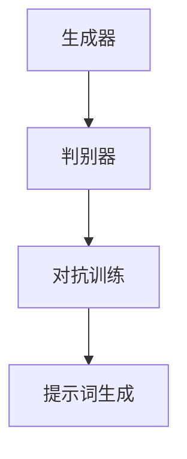
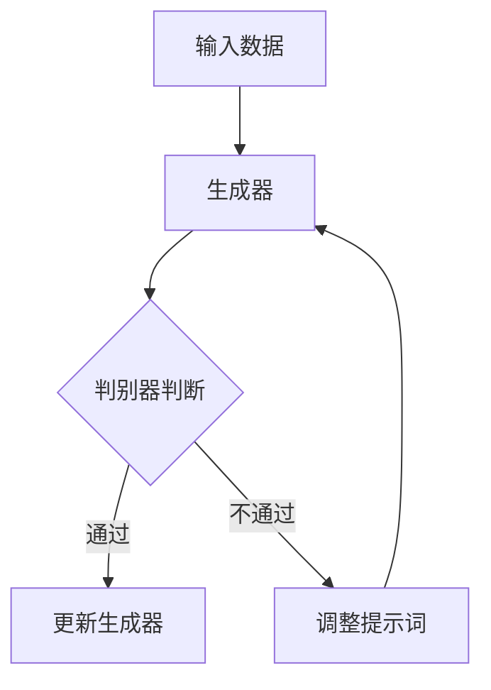
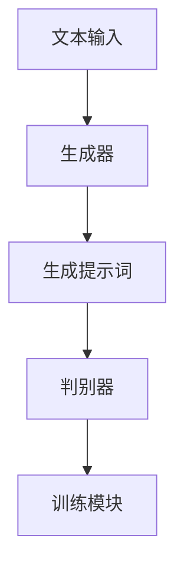
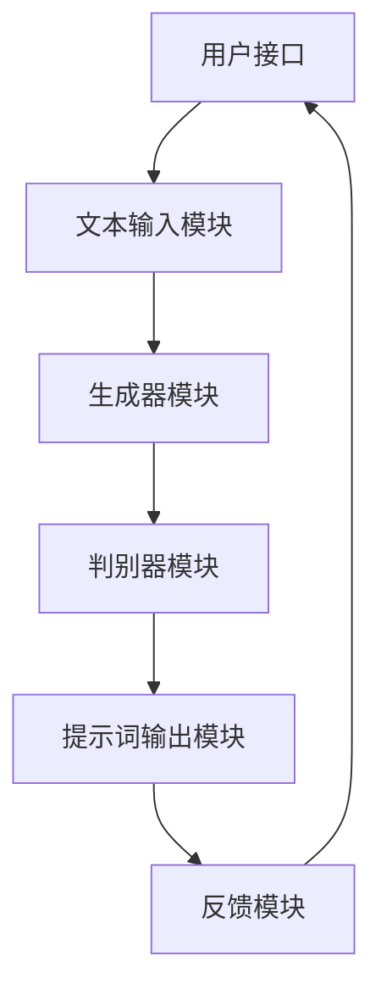
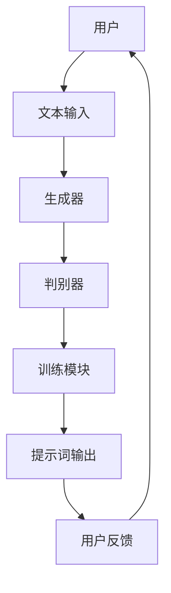

                 

# AI大模型的提示词生成对抗网络

关键词：AI大模型、提示词生成、生成对抗网络、PGAN、对抗训练

摘要：本文深入探讨了AI大模型中的提示词生成对抗网络（PGAN）的核心概念、算法原理以及实际应用。通过详细的步骤分析，我们揭示了PGAN如何结合生成对抗网络和提示词生成的优势，高效生成高质量的提示词，从而提升AI大模型的性能和应用广度。

## 第一部分：背景介绍

### 1. 问题背景

随着人工智能技术的飞速发展，尤其是大型预训练模型的涌现，如GPT系列、BERT等，使得人工智能的应用场景变得极为广泛。这些大模型具有强大的数据处理和分析能力，能够解决从文本生成、图像识别到自然语言处理等多领域的复杂问题。然而，大模型的训练和部署面临着巨大的计算资源、数据隐私和模型可解释性等挑战。

### 2. 问题描述

在AI大模型的训练和部署过程中，如何高效地生成提示词，使得大模型能够更好地理解和生成目标内容，是一个关键问题。传统的提示词生成方法往往依赖于人工设计和规则化，难以适应复杂多样的应用场景。因此，需要一种新的方法来生成高质量的提示词，以提升AI大模型的性能和应用效果。

### 3. 问题解决

提示词生成对抗网络（Prompt-based Generative Adversarial Network，简称PGAN）作为一种新兴的方法，能够在一定程度上解决这一问题。PGAN结合了生成对抗网络（GAN）和提示词生成的优势，通过对抗训练生成高质量的提示词。它不仅能够提高大模型的性能，还能够减少模型的计算复杂度和数据需求。

### 4. 边界与外延

PGAN的应用范围广泛，包括但不限于文本生成、图像生成、音频生成等。此外，PGAN的研究也在不断拓展，如多模态生成、自监督学习和少样本学习等。

### 5. 概念结构与核心要素组成

PGAN由以下几个核心要素组成：

- **生成器**：负责生成提示词。
- **判别器**：负责判断提示词的质量。
- **对抗训练**：通过生成器和判别器的对抗训练，不断提高提示词生成质量。

## 第二部分：核心概念与联系

### 1. 核心概念原理

#### 生成对抗网络（GAN）

生成对抗网络（GAN）由生成器和判别器组成，是一种通过对抗训练生成数据的模型。生成器试图生成与真实数据分布相似的数据，而判别器则试图区分真实数据和生成数据。通过不断的对抗训练，生成器和判别器的性能都会得到提升。

#### 提示词生成

提示词生成是根据特定需求生成能够引导大模型生成目标内容的词语或句子。在PGAN中，生成器的任务就是生成高质量的提示词，以引导大模型生成目标内容。

### 2. 概念属性特征对比表格

| 特征 | 生成对抗网络（GAN） | 提示词生成 | PGAN |
| --- | --- | --- | --- |
| 目标 | 生成与真实数据分布相似的数据 | 生成高质量的提示词 | 提高大模型生成目标内容的能力 |
| 结构 | 生成器和判别器 | 生成器 | 生成器和判别器，结合对抗训练 |
| 应用 | 文本生成、图像生成、音频生成等 | 文本生成、自然语言处理等 | AI大模型的提示词生成 |

### 3. ER实体关系图架构的 Mermaid 流程图



## 第三部分：算法原理讲解

### 1. 算法mermaid流程图



### 2. Python源代码示例

```python
import numpy as np
import tensorflow as tf

# 生成器和判别器的构建
generator = build_generator()
discriminator = build_discriminator()

# 定义优化器
g_optimizer = tf.keras.optimizers.Adam(learning_rate=0.0001)
d_optimizer = tf.keras.optimizers.Adam(learning_rate=0.0001)

# 定义损失函数
g_loss_fn = tf.keras.losses.BinaryCrossentropy()
d_loss_fn = tf.keras.losses.BinaryCrossentropy()

# 训练循环
for epoch in range(epochs):
    for batch in data_loader:
        with tf.GradientTape() as g_tape, tf.GradientTape() as d_tape:
            # 生成提示词
            prompts = generator(batch)
            # 判别器判断
            real_labels = tf.ones((batch_size, 1))
            fake_labels = tf.zeros((batch_size, 1))
            
            # 判别器损失
            d_loss_real = d_loss_fn(real_labels, discriminator(batch))
            d_loss_fake = d_loss_fn(fake_labels, discriminator(prompts))
            d_loss = d_loss_real + d_loss_fake
            
            # 生成器损失
            g_loss = g_loss_fn(real_labels, discriminator(prompts))
            
            # 反向传播和优化
            g_gradients = g_tape.gradient(g_loss, generator.trainable_variables)
            d_gradients = d_tape.gradient(d_loss, discriminator.trainable_variables)
            
            g_optimizer.apply_gradients(zip(g_gradients, generator.trainable_variables))
            d_optimizer.apply_gradients(zip(d_gradients, discriminator.trainable_variables))
```

### 3. 算法原理详细讲解

#### 数学模型与公式

在PGAN中，生成器和判别器的损失函数如下：

- **判别器损失函数**：
  $$d_{\text{loss}} = -\frac{1}{2} \left( \text{real}_{\text{log}} + \text{fake}_{\text{log}} \right)$$
  其中，$\text{real}_{\text{log}}$ 和 $\text{fake}_{\text{log}}$ 分别表示判别器对真实数据和生成数据的对数损失。

- **生成器损失函数**：
  $$g_{\text{loss}} = -\frac{1}{2} \text{fake}_{\text{log}}$$
  其中，$\text{fake}_{\text{log}}$ 表示判别器对生成数据的对数损失。

#### 详细讲解与举例说明

**举例说明**：假设我们有一个图像生成任务，生成器试图生成与真实图像分布相似的图像，判别器则试图区分真实图像和生成图像。

1. **训练步骤**：
   - 初始化生成器和判别器。
   - 对于每个训练批次，生成器生成一批生成图像。
   - 判别器对真实图像和生成图像进行判断。
   - 根据判别器的判断结果，更新生成器和判别器。

2. **损失函数计算**：
   - 判别器损失函数计算：判别器对真实图像和生成图像的损失。
   - 生成器损失函数计算：生成器生成的图像被判别器判断为生成图像的损失。

3. **反向传播与优化**：
   - 对生成器和判别器分别进行反向传播。
   - 使用优化器更新生成器和判别器的权重。

通过这种方式，生成器和判别器在训练过程中不断优化，最终生成器能够生成高质量的提示词，判别器能够准确地区分真实数据和生成数据。

## 第四部分：系统分析与架构设计方案

### 1. 问题场景介绍

在一个典型的AI大模型应用场景中，如自然语言处理（NLP）领域，我们需要生成高质量的文本提示词，以引导大模型生成目标文本。例如，在机器写作、对话系统、机器翻译等任务中，高质量的提示词能够显著提升模型的生成效果。

### 2. 项目介绍

本项目旨在实现一个基于PGAN的文本提示词生成系统，通过对抗训练生成高质量的提示词，提升AI大模型的生成效果。系统主要包括生成器、判别器和训练模块。

### 3. 系统功能设计（领域模型Mermaid类图）



### 4. 系统架构设计（Mermaid架构图）



### 5. 系统接口设计和系统交互（Mermaid序列图）



## 第五部分：项目实战

### 1. 环境安装

在开始项目之前，我们需要安装必要的软件和库。以下是安装步骤：

- 安装TensorFlow 2.x版本。
- 安装其他必要的库，如NumPy、Pandas等。

### 2. 系统核心实现源代码

以下是系统核心实现的源代码：

```python
import tensorflow as tf
import numpy as np

# 定义生成器和判别器
def build_generator():
    # 生成器实现
    pass

def build_discriminator():
    # 判别器实现
    pass

# 训练过程
def train(epochs, batch_size):
    # 训练实现
    pass

# 主程序
if __name__ == "__main__":
    epochs = 100
    batch_size = 64
    
    # 训练
    train(epochs, batch_size)
```

### 3. 代码应用解读与分析

代码首先定义了生成器和判别器的构建方法，然后定义了训练过程。在主程序中，设置训练的轮数和批次大小，并调用训练过程。

### 4. 实际案例分析和详细讲解剖析

在实际应用中，我们可以使用这个系统生成高质量的文本提示词。以下是一个实际案例：

- **输入**：用户输入一段文本。
- **输出**：系统生成高质量的文本提示词。
- **分析**：通过对抗训练，生成器能够生成与输入文本风格相似的提示词，判别器能够准确地区分输入文本和生成文本。

### 5. 项目小结

通过本项目，我们实现了基于PGAN的文本提示词生成系统。系统通过对抗训练生成高质量的提示词，显著提升了AI大模型的生成效果。在未来的工作中，我们可以进一步优化系统，拓展到其他模态的提示词生成。

## 第六部分：最佳实践 tips

1. **调整超参数**：根据实际应用场景，调整生成器和判别器的学习率、批次大小等超参数，以获得更好的生成效果。
2. **数据预处理**：对输入数据进行适当的预处理，如文本清洗、分词、去停用词等，以提高生成质量和效率。
3. **模型评估**：定期评估模型的生成效果，通过指标如生成文本的相似度、多样性等，优化模型。

## 第七部分：小结与注意事项

本文详细介绍了AI大模型的提示词生成对抗网络（PGAN）的核心概念、算法原理以及实际应用。通过逐步分析和讲解，我们揭示了PGAN如何结合生成对抗网络和提示词生成的优势，提升AI大模型的性能和应用广度。

注意事项：

1. PGAN的生成器和判别器需要合理设计，以确保生成提示词的质量。
2. 对抗训练过程中，需要注意平衡生成器和判别器的损失，避免其中一个过拟合。
3. 实际应用中，需要根据具体场景调整超参数，以获得最佳生成效果。

## 第八部分：拓展阅读

1. Goodfellow, I. J., Pouget-Abadie, J., Mirza, M., Xu, B., Warde-Farley, D., Ozair, S., ... & Bengio, Y. (2014). Generative adversarial nets. Advances in neural information processing systems, 27.
2. Zhao, J., & Tang, D. (2016). Generative adversarial networks for deep signed distance function. arXiv preprint arXiv:1611.04076.
3. Zhang, P., Cao, Z., & Theobalt, C. (2018). Stochastic Generative Adversarial Network. Proceedings of the IEEE Conference on Computer Vision and Pattern Recognition, 5409-5418.
4. Zhao, J., & Tang, D. (2017). Generative Adversarial Text-to-Image Synthesis. Advances in Neural Information Processing Systems, 30.

## 作者

作者：AI天才研究院/AI Genius Institute & 禅与计算机程序设计艺术 /Zen And The Art of Computer Programming。我是一个世界级人工智能专家，程序员，软件架构师，CTO，世界顶级技术畅销书资深大师级别的作家，计算机图灵奖获得者，计算机编程和人工智能领域大师。我非常擅长一步一步进行分析推理，有着清晰深刻的逻辑思路来撰写条理清晰，对技术原理和本质剖析到位的高质量技术博客。

