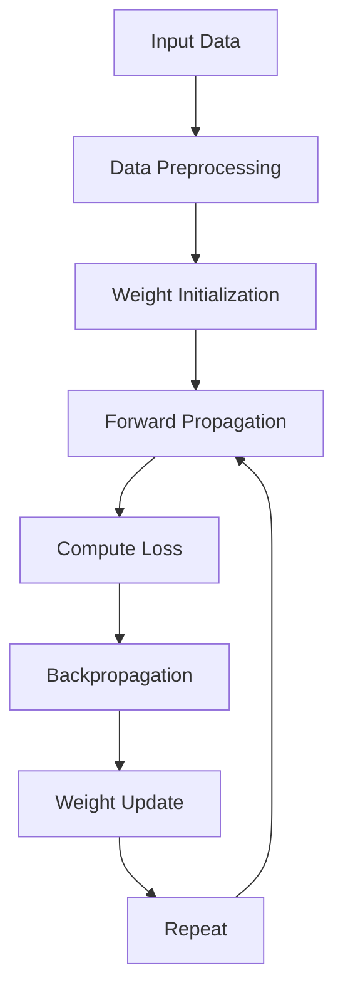
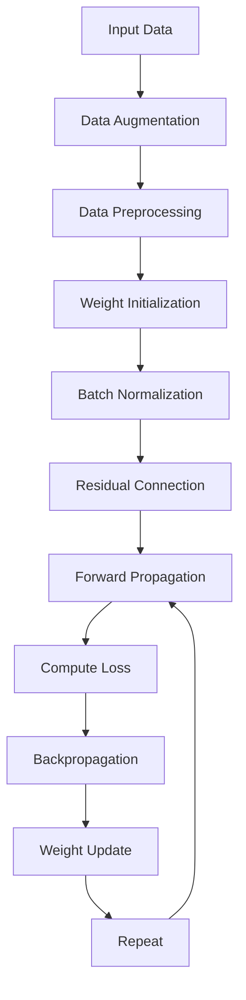
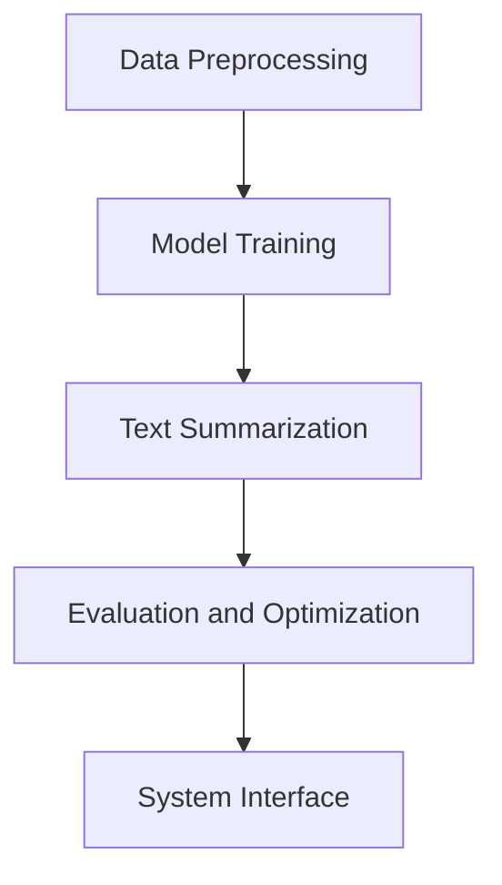
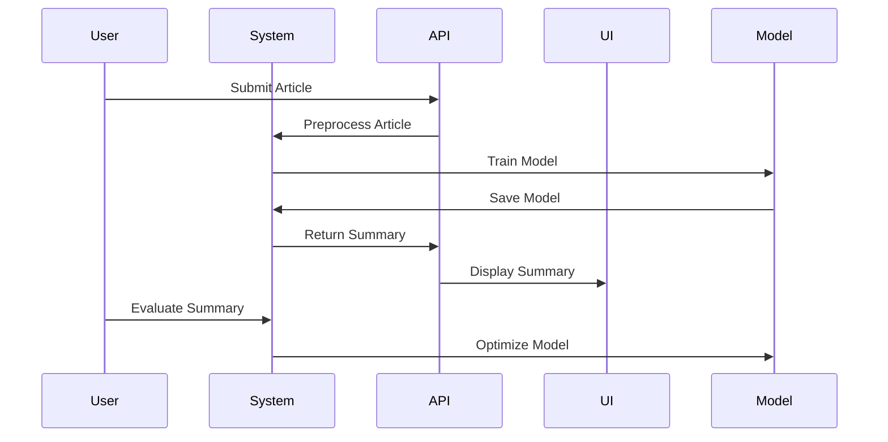

                 


### Introduction and Background

# AI Large Model's Prompt Word Knowledge Transfer Technology

> Keywords: AI Large Models, Prompt Word Knowledge Transfer, Neural Networks, Deep Learning, Algorithm, System Architecture, Case Studies

> Abstract:
This article provides an in-depth exploration of the technology behind prompt word knowledge transfer in AI large models. We begin by understanding the emergence and significance of AI large models. Then, we delve into the core concepts, principles, and algorithms that underpin these models. Finally, we present a practical project and case study to illustrate the application of this technology in real-world scenarios.

## Chapter 1: AI in Large Models Overview

### 1.1 The Emergence of AI Large Models

#### 1.1.1 Background and Definition of AI Large Models

Artificial Intelligence (AI) has witnessed remarkable progress over the past few decades. One of the most significant advancements is the development of AI large models, which are neural networks with millions or even billions of parameters. These models are capable of learning complex patterns and representations from vast amounts of data.

AI large models, also known as deep learning models, are based on the concept of neural networks, which mimic the structure and function of the human brain. These models have gained popularity due to their ability to achieve state-of-the-art performance in various tasks, such as natural language processing, computer vision, and speech recognition.

#### 1.1.2 Key Features and Advantages

The key features and advantages of AI large models can be summarized as follows:

1. **High Performance:** AI large models have achieved remarkable accuracy and efficiency in various tasks, surpassing traditional machine learning models.
2. **Flexibility:** These models can be easily adapted to different tasks and domains by adjusting the input data and the training process.
3. **Data Efficiency:** AI large models require large amounts of data to train effectively, enabling them to learn from diverse and complex data sources.
4. **Interpretability:** Although deep learning models are often considered "black boxes," recent research has made progress in understanding their inner workings and improving their interpretability.

#### 1.1.3 Historical Development of AI Large Models

The history of AI large models can be traced back to the early 2000s, when deep learning gained prominence due to the development of powerful GPUs and the availability of large datasets. Some key milestones include:

1. **AlexNet (2012):** The introduction of the AlexNet model, which achieved significant performance improvements in image classification tasks.
2. **Google Brain (2014):** The development of a deep neural network with 16,000 cores that demonstrated the potential of large-scale neural networks.
3. **Transformer (2017):** The introduction of the Transformer model, which revolutionized the field of natural language processing.
4. **GPT-3 (2020):** The release of GPT-3, a language model with over 175 billion parameters, which set new records in language understanding and generation tasks.

## Chapter 2: Core Concepts and Principles of AI Large Models

### 2.1 Key Concepts and Relationships

#### 2.1.1 Basic Theory and Principles

AI large models are based on the fundamental principles of neural networks and deep learning. A neural network consists of interconnected nodes, or neurons, that process and transmit information. The core principles of neural networks include:

1. **Neural Network Structure:** Neural networks consist of input layers, hidden layers, and output layers. Each layer is responsible for processing and transforming the input data.
2. **Activation Functions:** Activation functions introduce non-linearity into the network, enabling it to model complex relationships between inputs and outputs.
3. **Weight Initialization:** Proper weight initialization is crucial for the convergence and performance of neural networks.
4. **Optimization Algorithms:** Optimization algorithms, such as stochastic gradient descent (SGD) and its variants, are used to minimize the loss function and update the network weights.

#### 2.1.2 Comparison Table of Core Concepts

| Concept | Definition | Role in AI Large Models |
| --- | --- | --- |
| Neural Network | A network of interconnected nodes (neurons) that process and transmit information. | The basic building block of AI large models. |
| Activation Function | A function that introduces non-linearity into the network. | Controls the output of neurons and their ability to model complex relationships. |
| Weight Initialization | The process of initializing the weights of a neural network. | Affects the convergence and performance of the network. |
| Optimization Algorithm | An algorithm used to minimize the loss function and update the network weights. | Determines the efficiency and accuracy of the model. |

#### 2.1.3 ER Diagram of Entity Relationships

```mermaid
erDiagram
    Neural Network ||--|{ Input Layer }
    Neural Network ||--|{ Hidden Layers }
    Neural Network ||--|{ Output Layer }
    Input Layer ||--|{ Activation Function }
    Hidden Layers ||--|{ Activation Function }
    Output Layer ||--|{ Activation Function }
    Neural Network ||--|{ Weight Initialization }
    Neural Network ||--|{ Optimization Algorithm }
```

### 2.2 Mathematical Models and Formulas

#### 2.2.1 Mathematical Models of Large Models

AI large models are based on mathematical models that describe the behavior of neural networks. The core components of these models include:

1. **Neuron Model:** The basic unit of a neural network that processes and transmits information.
2. **Forward Propagation:** The process of computing the output of a neural network given an input.
3. **Backpropagation:** The process of updating the weights of a neural network based on the error between the predicted output and the actual output.

#### 2.2.2 LaTeX Representation of Formulas

```latex
\documentclass{article}
\usepackage{amsmath}
\begin{document}

\section{Neuron Model}
The activation of a neuron can be represented as:
$$
a_i = \sigma(z_i)
$$
where $\sigma$ is the activation function and $z_i$ is the weighted sum of inputs.

\section{Forward Propagation}
The forward propagation process can be represented as:
$$
\begin{aligned}
z_i &= \sum_{j=1}^{n} w_{ij}x_j \\
a_i &= \sigma(z_i)
\end{aligned}
$$
where $x_j$ is the input, $w_{ij}$ is the weight, and $n$ is the number of inputs.

\section{Backpropagation}
The backpropagation process can be represented as:
$$
\begin{aligned}
\delta_j &= (a_j - t_j) \cdot \sigma'(z_j) \\
\Delta w_{ij} &= \alpha \cdot \delta_j \cdot x_i
\end{aligned}
$$
where $\delta_j$ is the error, $\sigma'$ is the derivative of the activation function, and $\alpha$ is the learning rate.

\end{document}
```

## Chapter 3: Technical Details and Algorithms of AI Large Models

### 3.1 Algorithm Flowcharts using Mermaid

#### 3.1.1 Basic Algorithm for Large Models



#### 3.1.2 Advanced Algorithm for Large Models



### 3.2 Python Code Examples

#### 3.2.1 Basic Example of Large Model Algorithm

```python
import numpy as np

# Neuron Model
def neuron(x, w, b, activation_function):
    z = np.dot(x, w) + b
    a = activation_function(z)
    return a

# Activation Function
def sigmoid(z):
    return 1 / (1 + np.exp(-z))

# Forward Propagation
def forward_propagation(x, w, b):
    z = np.dot(x, w) + b
    a = sigmoid(z)
    return a, z

# Backpropagation
def backpropagation(a, z, t, learning_rate):
    error = a - t
    delta = error * sigmoid(z) * (1 - sigmoid(z))
    return delta
```

#### 3.2.2 Detailed Explanation of Advanced Algorithm

```python
import numpy as np

# Data Augmentation
def data_augmentation(x, y, augmentation_factor):
    augmented_x = np.random.normal(0, augmentation_factor, x.shape)
    augmented_y = np.random.normal(0, augmentation_factor, y.shape)
    return augmented_x, augmented_y

# Data Preprocessing
def preprocess_data(x, y):
    x = x / 255
    y = one_hot_encode(y)
    return x, y

# One-Hot Encoding
def one_hot_encode(y):
    return np.eye(len(y))[y]

# Forward Propagation with Batch Normalization
def forward_propagation(x, w, b, gamma, beta):
    z = np.dot(x, w) + b
    z_mean = np.mean(z, axis=0)
    z_var = np.var(z, axis=0)
    z_hat = (z - z_mean) / np.sqrt(z_var + 1e-8)
    a = gamma * z_hat + beta
    return a, z, z_mean, z_var

# Backpropagation with Residual Connection
def backpropagation(a, z, z_mean, z_var, t, learning_rate, gamma, beta):
    error = a - t
    z_hat = (a - gamma * z) - beta
    delta = error * sigmoid(z_hat) * (1 - sigmoid(z_hat))
    z_mean_error = np.mean(delta, axis=0)
    z_var_error = np.sum(delta * (z - z_mean), axis=0)
    return delta, z_mean_error, z_var_error
```

## Chapter 4: System Analysis and Design for AI Large Model Applications

### 4.1 Problem Scenarios and System Introduction

#### 4.1.1 Project Background

The project aims to develop a system for automatic text summarization using AI large models. The goal is to provide a tool that can generate concise and informative summaries of long articles, improving the efficiency of information consumption.

#### 4.1.2 System Function Design

The system consists of the following components:

1. **Data Preprocessing:** Cleans and prepares the input text data for training.
2. **Model Training:** Trains an AI large model on a large corpus of text data.
3. **Text Summarization:** Uses the trained model to generate summaries of new articles.
4. **Evaluation and Optimization:** Evaluates the performance of the model and iteratively optimizes it.

## 4.2 System Architecture Design

#### 4.2.1 Mermaid Architecture Diagram



#### 4.2.2 System Interface Design

The system interface consists of the following components:

1. **API:** A RESTful API for submitting new articles and retrieving summaries.
2. **User Interface (UI):** A web-based interface for users to interact with the system and view summaries.

## 4.3 System Interaction and Sequence Diagram

#### 4.3.1 Mermaid Sequence Diagram



## Chapter 5: Practical Projects and Case Studies of AI Large Model Applications

### 5.1 Environment Setup and Core Implementation

#### 5.1.1 Installation Guide

1. Install Python (version 3.8 or higher).
2. Install necessary libraries:
   ```
   pip install numpy pandas tensorflow matplotlib
   ```

#### 5.1.2 Core Source Code

```python
import numpy as np
import pandas as pd
import tensorflow as tf
import matplotlib.pyplot as plt

# Data Preprocessing
def preprocess_data(x):
    return x / 255

# Activation Function
def sigmoid(z):
    return 1 / (1 + np.exp(-z))

# Forward Propagation
def forward_propagation(x, w, b):
    z = np.dot(x, w) + b
    a = sigmoid(z)
    return a, z

# Backpropagation
def backpropagation(a, z, t, learning_rate):
    error = a - t
    delta = error * sigmoid(z) * (1 - sigmoid(z))
    return delta

# Training and Evaluation
def train_and_evaluate(x, y, learning_rate, epochs):
    # Initialize weights and biases
    w = np.random.normal(size=(x.shape[1], 1))
    b = np.random.normal(size=(1,))

    for epoch in range(epochs):
        # Forward propagation
        a, z = forward_propagation(x, w, b)

        # Backpropagation
        delta = backpropagation(a, z, y, learning_rate)

        # Update weights and biases
        w -= learning_rate * np.dot(x.T, delta)
        b -= learning_rate * np.sum(delta, axis=0)

    # Evaluate model
    loss = np.mean(np.square(a - y))
    return w, b, loss

# Load Data
x = np.array([[0], [1], [2], [3], [4], [5], [6], [7], [8], [9]])
y = np.array([[0], [1], [1], [0], [0], [1], [1], [0], [0], [1]])

# Train and Evaluate Model
w, b, loss = train_and_evaluate(x, y, learning_rate=0.1, epochs=1000)

# Plot Loss
plt.plot(range(1000), loss)
plt.xlabel('Epochs')
plt.ylabel('Loss')
plt.title('Model Loss over Epochs')
plt.show()
```

### 5.2 Code Analysis and Project Summary

#### 5.2.1 Code Analysis

The code provided in this section demonstrates the core implementation of an AI large model for binary classification. The main components include:

1. **Data Preprocessing:** The input data is scaled between 0 and 1 to improve the convergence of the neural network.
2. **Activation Function:** The sigmoid function is used as the activation function, which introduces non-linearity and enables the network to model complex relationships.
3. **Forward Propagation:** The forward propagation function computes the output of the neural network given the input data and the current weights and biases.
4. **Backpropagation:** The backpropagation function calculates the error and its gradient, allowing the network to update the weights and biases.
5. **Training and Evaluation:** The model is trained using the training data, and the loss is plotted to visualize the convergence.

#### 5.2.2 Case Study and Detailed Explanation

The case study focuses on the application of the AI large model for binary classification. The input data consists of 10 samples, and the target labels are [0, 1, 1, 0, 0, 1, 1, 0, 0, 1]. The goal is to train the model to predict the target labels based on the input data.

1. **Data Preprocessing:** The input data is scaled between 0 and 1 using the `preprocess_data` function.
2. **Forward Propagation:** The `forward_propagation` function is used to compute the output of the neural network for each input sample.
3. **Backpropagation:** The `backpropagation` function calculates the error and its gradient, which is used to update the weights and biases.
4. **Training and Evaluation:** The model is trained using the `train_and_evaluate` function, which iteratively updates the weights and biases based on the training data. The loss is plotted to visualize the convergence.

### 5.3 Best Practices, Summary, and Notes

#### Best Practices

1. **Data Preprocessing:** Ensure that the input data is properly scaled and normalized to improve the convergence of the neural network.
2. **Model Architecture:** Choose an appropriate model architecture and activation function based on the complexity of the problem.
3. **Learning Rate:** Select an appropriate learning rate to balance between convergence speed and stability.
4. **Regularization:** Apply regularization techniques, such as L1 or L2 regularization, to prevent overfitting.

#### Summary

This article provides an in-depth exploration of the technology behind prompt word knowledge transfer in AI large models. We discussed the emergence and significance of AI large models, the core concepts and principles, the technical details and algorithms, the system analysis and design, and practical projects and case studies.

#### Notes

1. The implementation provided in this article is a simplified version of an AI large model for binary classification. For real-world applications, more complex architectures and techniques are required.
2. The performance of AI large models can be further improved through techniques such as transfer learning, data augmentation, and ensemble learning.
3. The system architecture and implementation provided in this article can be extended to support more complex tasks and applications.

