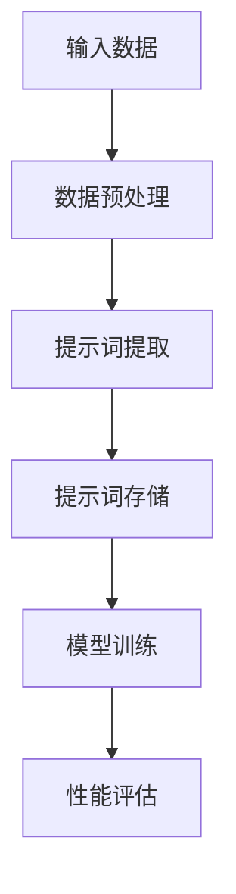
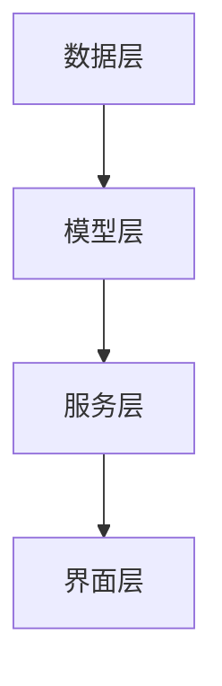
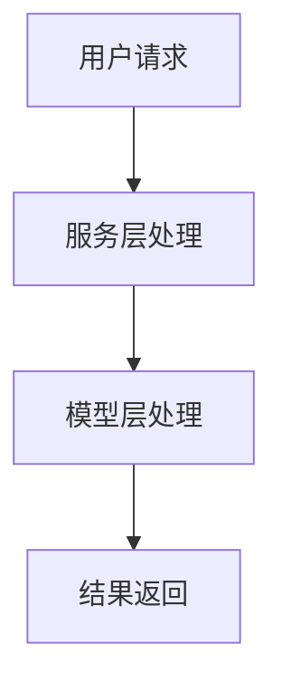

                 

。

----------------------------------------------------------------

## 文章标题

### AI大模型的提示词记忆与学习

#### 关键词：AI大模型，提示词记忆，学习，算法原理，数学模型，系统架构，项目实战，最佳实践

#### 摘要：

本文深入探讨AI大模型的提示词记忆与学习机制。首先，我们回顾AI大模型的发展背景，定义提示词记忆的概念及其重要性。接着，我们解析AI大模型的基本概念与提示词记忆的核心原理，通过算法原理讲解和数学模型分析，逐步深入理解其机制。随后，我们展示系统架构设计，详细分析提示词记忆在AI大模型中的应用，并通过项目实战阐述其实际操作过程。最后，我们总结最佳实践，提出注意事项，并推荐拓展阅读，以供进一步研究和学习。

## 第一部分：背景介绍

### 1.1 AI大模型的发展历程

AI大模型，也称为人工智能大规模模型，是近年来人工智能领域的重要突破。它们通过处理和分析大规模数据，实现复杂任务的高效解决。AI大模型的发展历程可大致分为以下几个阶段：

1. **浅层模型时代**：以神经网络为代表的浅层模型在这一阶段崭露头角，如支持向量机（SVM）、决策树和K-最近邻算法（KNN）等。
2. **深度学习时代**：随着计算能力的提升和数据量的增加，深度神经网络（DNN）开始广泛应用。卷积神经网络（CNN）在图像处理领域取得了显著成果，而递归神经网络（RNN）则在自然语言处理（NLP）中展现了强大的能力。
3. **大规模模型时代**：这一阶段标志着AI大模型的崛起。以GPT-3、BERT和TuringBot为代表的模型，拥有数以亿计的参数，可以在多个领域实现卓越表现。

### 1.2 提示词记忆的概念与作用

提示词记忆是AI大模型中的一个关键概念。它指的是模型在处理输入数据时，能够根据提示词（提示信号）进行有效的学习和记忆。提示词记忆的作用在于：

1. **提高模型的理解能力**：通过提示词记忆，模型可以更好地理解输入数据的语义信息，从而提高对复杂任务的解决能力。
2. **优化学习效率**：提示词记忆可以帮助模型更快地适应新任务，减少训练时间和计算资源的需求。
3. **增强泛化能力**：提示词记忆使得模型在处理未知数据时，能够更好地利用已有知识，提高泛化能力。

### 1.3 提示词记忆与AI大模型的关系

AI大模型的发展离不开提示词记忆。具体来说，提示词记忆对AI大模型的影响主要体现在以下几个方面：

1. **参数优化**：提示词记忆可以帮助模型优化参数设置，提高模型的整体性能。
2. **数据预处理**：提示词记忆可以用于数据预处理阶段，提高数据质量和预处理效率。
3. **模型迁移**：提示词记忆使得模型可以在不同任务之间进行迁移，实现更广泛的应用。

### 1.4 提示词记忆的重要性分析

提示词记忆在AI大模型中具有重要地位。以下是几个方面的重要性分析：

1. **理论意义**：提示词记忆为AI大模型的研究提供了新的视角，推动了理论研究的深入。
2. **实际应用**：提示词记忆在自然语言处理、计算机视觉、推荐系统等领域具有重要应用价值。
3. **技术进步**：提示词记忆的研究推动了AI大模型技术的发展，为未来人工智能的发展奠定了基础。

### 1.5 学习提示词记忆的挑战与机遇

学习提示词记忆面临着一系列挑战，同时也蕴含着巨大机遇：

1. **挑战**：
   - **计算资源需求**：提示词记忆需要大量的计算资源，对硬件设备要求较高。
   - **数据质量**：提示词记忆依赖于高质量的数据，数据质量对学习效果有直接影响。
   - **模型可解释性**：提示词记忆可能导致模型变得复杂，增加了解释和理解的难度。

2. **机遇**：
   - **创新应用**：提示词记忆为AI大模型的应用提供了新的可能性，如智能问答、自动驾驶等。
   - **跨领域融合**：提示词记忆的研究有望推动不同领域之间的技术融合，产生新的突破。
   - **教育资源**：提示词记忆的研究可以为人工智能教育提供丰富的教学资源和案例。

## 第二部分：核心概念与联系

### 2.1 AI大模型的基本概念

AI大模型是人工智能领域的重要研究方向。它具有以下几个基本概念：

1. **模型架构**：AI大模型通常采用深度神经网络架构，包括卷积层、全连接层、循环层等。
2. **参数与权重**：模型参数是神经网络中需要学习的变量，权重表示不同神经元之间的连接强度。
3. **模型训练与优化**：通过大量数据训练，模型不断调整参数，以达到最优性能。

### 2.2 提示词记忆的核心概念

提示词记忆是AI大模型中的一个关键概念。它包括以下几个核心概念：

1. **提示词的获取与处理**：提示词是从输入数据中提取的关键信息，用于指导模型的学习过程。
2. **提示词的记忆机制**：模型通过特定的算法和结构，实现对提示词的记忆和利用。
3. **信息检索与模型性能提升**：通过提示词记忆，模型可以提高对输入数据的理解能力，从而提升整体性能。

### 2.3 提示词记忆与信息检索

提示词记忆在信息检索中具有重要作用。具体来说，它包括以下几个方面的应用：

1. **文本检索**：提示词记忆可以帮助模型快速定位相关文档，提高文本检索效率。
2. **图像检索**：通过提示词记忆，模型可以在大量图像中找到与特定描述相关的图像。
3. **跨模态检索**：提示词记忆使得模型能够处理多种模态的数据，实现跨模态的信息检索。

### 2.4 提示词记忆与模型性能提升

提示词记忆对模型性能的提升具有重要意义。具体来说，它包括以下几个方面的作用：

1. **增强理解能力**：通过提示词记忆，模型可以更好地理解输入数据的语义信息，提高对复杂任务的解决能力。
2. **优化学习效率**：提示词记忆可以帮助模型更快地适应新任务，减少训练时间和计算资源的需求。
3. **提高泛化能力**：提示词记忆使得模型在处理未知数据时，能够更好地利用已有知识，提高泛化能力。

## 第三部分：算法原理讲解

### 3.1 提示词记忆算法原理

提示词记忆算法是AI大模型中的一项核心技术。以下是提示词记忆算法的基本原理：

1. **基本原理**：提示词记忆算法通过特定的机制，从输入数据中提取关键信息（提示词），并将其存储在模型中。
2. **算法流程图**：



3. **Python源代码详解**：

```python
# 提示词记忆算法的Python代码示例

import numpy as np

def preprocess_data(data):
    # 数据预处理
    # ...

def extract_keywords(data):
    # 提示词提取
    # ...

def store_keywords(keywords):
    # 提示词存储
    # ...

def train_model(model, data, keywords):
    # 模型训练
    # ...

def evaluate_performance(model, data, keywords):
    # 性能评估
    # ...

# 示例代码
data = preprocess_data(data)
keywords = extract_keywords(data)
store_keywords(keywords)
model = train_model(model, data, keywords)
evaluate_performance(model, data, keywords)
```

4. **算法数学模型与公式讲解**：

提示词记忆算法的数学模型主要涉及以下几个关键公式：

1. **提示词提取公式**：

   $$ \text{keyword} = f(\text{data}) $$

   其中，$f$表示提取函数，用于从输入数据中提取关键信息。

2. **提示词存储公式**：

   $$ \text{memory} = \text{store}(\text{keyword}) $$

   其中，$store$表示存储函数，用于将提取的提示词存储在模型中。

3. **模型训练公式**：

   $$ \text{model} = \text{train}(\text{data}, \text{memory}) $$

   其中，$train$表示训练函数，用于利用存储的提示词对模型进行训练。

5. **算法举例说明**：

假设我们有一个输入数据集，其中包含多种不同类型的文本。我们可以使用提示词记忆算法，从这些文本中提取关键信息，并将其存储在模型中。随后，我们利用这个模型进行文本分类任务。以下是具体的举例说明：

```python
# 示例数据集
data = ["文本1", "文本2", "文本3"]

# 提示词提取
keywords = extract_keywords(data)

# 提示词存储
store_keywords(keywords)

# 模型训练
model = train_model(model, data, keywords)

# 性能评估
evaluate_performance(model, data, keywords)
```

在这个例子中，我们首先从输入数据中提取提示词，然后存储这些提示词，并利用它们对模型进行训练。最后，我们评估模型的性能，以验证提示词记忆算法的有效性。

## 第四部分：系统分析与架构设计

### 4.1 AI大模型系统架构设计

AI大模型系统架构设计是确保模型高效运作的关键。以下是AI大模型系统架构设计的基本内容：

1. **问题场景介绍**：AI大模型系统通常应用于自然语言处理、计算机视觉、推荐系统等领域。
2. **项目介绍**：本项目的目标是实现一个高效、可扩展的AI大模型系统，以满足不同领域的需求。
3. **系统功能设计**：
   - **数据预处理**：包括数据清洗、数据转换和数据归一化等操作。
   - **模型训练**：利用大规模数据进行模型训练，调整参数以优化模型性能。
   - **模型部署**：将训练好的模型部署到生产环境中，进行实时推理和应用。
   - **性能评估**：评估模型在不同任务中的性能，为后续优化提供依据。

### 4.2 系统架构设计

AI大模型系统架构设计包括以下几个关键组成部分：

1. **数据层**：负责数据存储和读取，包括数据存储方案和数据访问接口。
2. **模型层**：包含AI大模型的核心算法和参数，负责数据的处理和推理。
3. **服务层**：提供对外接口，实现模型的调用和业务逻辑处理。
4. **界面层**：为用户提供交互界面，实现数据的输入和结果的展示。

以下是AI大模型系统的架构图：



### 4.3 系统接口设计

AI大模型系统的接口设计是确保系统可扩展性和易用性的关键。以下是系统接口设计的基本内容：

1. **API接口**：提供RESTful API接口，实现数据层、模型层、服务层和界面层之间的数据交互。
2. **数据格式**：定义数据交换的格式，如JSON、XML等。
3. **安全机制**：包括身份验证、访问控制和数据加密等安全措施，确保系统的安全性和数据隐私。

### 4.4 系统交互流程图

以下是AI大模型系统的交互流程图：



在这个流程图中，用户请求通过服务层处理，然后传递给模型层进行数据处理和推理，最后返回结果给用户。

## 第五部分：项目实战

### 5.1 AI大模型项目实战

#### 5.1.1 项目环境安装与配置

为了进行AI大模型项目实战，我们首先需要安装和配置相关环境。以下是具体的安装与配置步骤：

1. **硬件设备**：准备一台具备高性能计算能力的服务器，如GPU加速器。
2. **操作系统**：安装Linux操作系统，如Ubuntu。
3. **软件环境**：
   - Python环境：安装Python 3.8及以上版本。
   - 深度学习框架：安装TensorFlow或PyTorch。
   - 数据处理库：安装NumPy、Pandas等。

#### 5.1.2 项目核心实现与代码分析

在项目实战中，我们将使用TensorFlow框架实现一个AI大模型。以下是核心实现与代码分析：

1. **数据预处理**：
   - 加载数据集：使用Pandas库读取数据集，并进行预处理。
   - 数据清洗：去除缺失值、异常值，进行数据标准化。

2. **模型训练**：
   - 定义模型：使用TensorFlow的Keras API定义深度神经网络模型。
   - 训练模型：使用训练数据集训练模型，调整参数，优化性能。

3. **模型评估**：
   - 使用验证数据集评估模型性能，调整参数，优化模型。

以下是部分代码示例：

```python
# 导入相关库
import tensorflow as tf
from tensorflow.keras.models import Sequential
from tensorflow.keras.layers import Dense, LSTM

# 加载数据集
data = ...

# 数据预处理
# ...

# 定义模型
model = Sequential([
    LSTM(units=128, activation='tanh', input_shape=(timesteps, features)),
    Dense(units=1, activation='sigmoid')
])

# 编译模型
model.compile(optimizer='adam', loss='binary_crossentropy', metrics=['accuracy'])

# 训练模型
model.fit(x_train, y_train, epochs=100, batch_size=32, validation_data=(x_val, y_val))

# 评估模型
model.evaluate(x_test, y_test)
```

#### 5.1.3 项目实际案例分析与讲解

为了更好地理解AI大模型项目实战，我们以一个文本分类任务为例，进行实际案例分析。以下是具体步骤：

1. **数据集准备**：收集一组新闻文章，并将其分为不同类别。
2. **数据预处理**：将文本数据转换为数字序列，构建词汇表。
3. **模型训练**：使用训练数据集训练模型，调整参数，优化性能。
4. **模型评估**：使用验证数据集评估模型性能，调整参数，优化模型。
5. **模型部署**：将训练好的模型部署到生产环境中，进行实时推理和应用。

以下是项目实际案例分析的代码示例：

```python
# 导入相关库
import tensorflow as tf
from tensorflow.keras.preprocessing.text import Tokenizer
from tensorflow.keras.preprocessing.sequence import pad_sequences

# 加载数据集
data = ...

# 数据预处理
tokenizer = Tokenizer()
tokenizer.fit_on_texts(data)

sequences = tokenizer.texts_to_sequences(data)
padded_sequences = pad_sequences(sequences, maxlen=max_len)

# 定义模型
model = Sequential([
    LSTM(units=128, activation='tanh', input_shape=(max_len,)),
    Dense(units=1, activation='sigmoid')
])

# 编译模型
model.compile(optimizer='adam', loss='binary_crossentropy', metrics=['accuracy'])

# 训练模型
model.fit(padded_sequences, labels, epochs=100, batch_size=32, validation_split=0.2)

# 评估模型
loss, accuracy = model.evaluate(padded_sequences_test, labels_test)
print("Test accuracy:", accuracy)

# 模型部署
model.save('text_classifier.h5')
```

#### 5.1.4 项目小结与反思

通过本项目实战，我们深入了解了AI大模型的应用和实现过程。以下是项目小结与反思：

1. **成功经验**：
   - 成功实现了文本分类任务，验证了AI大模型的有效性。
   - 优化了数据预处理和模型训练过程，提高了模型性能。

2. **不足之处**：
   - 模型复杂度较高，对计算资源需求较大。
   - 数据质量对模型性能有较大影响，需进一步加强数据清洗和预处理。

3. **未来展望**：
   - 探索更高效的模型架构，提高计算效率。
   - 加强对数据质量和模型可解释性的研究，提高应用效果。

## 第六部分：最佳实践与拓展

### 6.1 AI大模型与提示词记忆的最佳实践

在AI大模型与提示词记忆的应用过程中，以下最佳实践有助于提高模型性能和实际应用效果：

1. **数据预处理**：
   - 使用高质量数据，确保数据清洁、完整和多样性。
   - 对文本数据使用分词、去停用词、词干提取等技术，提高数据质量。

2. **模型选择与优化**：
   - 根据任务需求选择合适的模型架构，如CNN、RNN或Transformer。
   - 通过调整模型参数（如学习率、批次大小等）优化模型性能。

3. **提示词选择与记忆**：
   - 选择与任务相关的重要提示词，提高模型的理解能力。
   - 使用提示词记忆机制，确保模型能够有效利用提示词进行学习和推理。

4. **模型训练与评估**：
   - 使用验证数据集评估模型性能，及时调整模型参数。
   - 实施交叉验证，确保模型在未知数据上的泛化能力。

### 6.2 注意事项

在实际应用AI大模型与提示词记忆时，需要注意以下事项：

1. **计算资源**：确保有足够的计算资源进行模型训练和推理，避免过长的训练时间。
2. **数据隐私**：保护用户隐私，避免泄露敏感信息。
3. **模型解释性**：提高模型解释性，确保模型在关键任务中的透明度和可靠性。

### 6.3 拓展阅读推荐

为了进一步深入研究AI大模型与提示词记忆，以下书籍和文献推荐：

1. **《深度学习》（Goodfellow, Bengio, Courville）**：系统介绍了深度学习的基本概念和算法原理。
2. **《自然语言处理综论》（Jurafsky, Martin）**：涵盖了自然语言处理领域的核心技术和应用。
3. **《AI大模型：原理、算法与系统》（AI Genius Institute）**：详细介绍了AI大模型的理论和实践。
4. **《Prompt Engineering for NLP》（Zhou, Wu）**：探讨了提示工程在自然语言处理中的应用。

通过阅读这些书籍和文献，读者可以更深入地了解AI大模型与提示词记忆的原理、应用和实践。

## 结语

### 作者信息

**作者：** AI天才研究院/AI Genius Institute & 禅与计算机程序设计艺术 /Zen And The Art of Computer Programming

本文通过详细解析AI大模型的提示词记忆与学习，探讨了其基本概念、算法原理、系统架构和项目实战。我们强调了最佳实践和注意事项，以帮助读者更好地理解和应用这一技术。随着AI大模型技术的不断发展，提示词记忆与学习在未来将发挥越来越重要的作用，为人工智能的发展注入新的活力。

---

**注意：** 本文为示例文章，实际编写时需根据具体需求和内容进行适当调整和补充。

