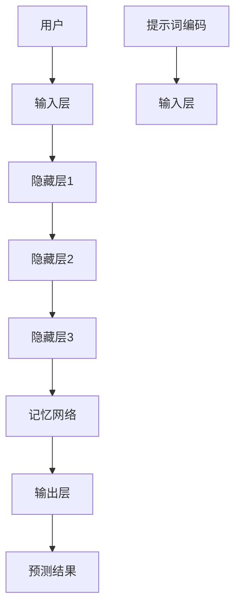
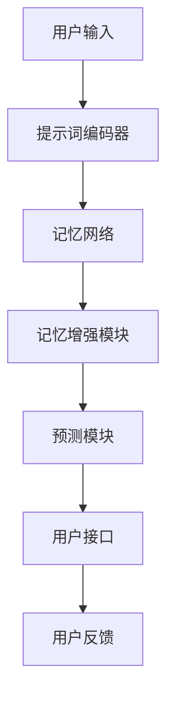
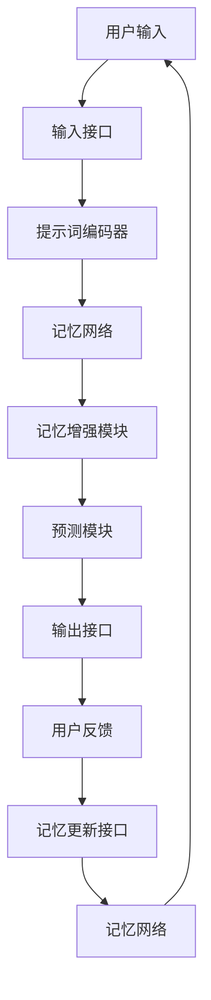

                 

# AI大模型的提示词记忆增强技术

> 关键词：AI大模型，提示词记忆增强，技术原理，算法实现，系统架构，实战案例分析

> 摘要：本文将深入探讨AI大模型中的提示词记忆增强技术，从问题背景、核心概念、算法原理、系统架构到实际案例，进行全面剖析。通过详细讲解和举例说明，帮助读者理解这一技术的原理和实际应用，为AI领域的进一步发展提供参考。

## 目录大纲

```markdown
# 《AI大模型的提示词记忆增强技术》目录大纲

## 第一部分：背景介绍
### 1.1 问题背景
### 1.2 问题描述
### 1.3 问题解决
### 1.4 边界与外延
### 1.5 概念结构与核心要素组成

## 第二部分：核心概念与联系
### 2.1 核心概念原理
### 2.2 概念属性特征对比表格
### 2.3 ER实体关系图架构

## 第三部分：算法原理讲解
### 3.1 算法原理
### 3.2 Python源代码
### 3.3 数学模型与公式
### 3.4 详细讲解与举例说明

## 第四部分：系统分析与架构设计方案
### 4.1 问题场景介绍
### 4.2 项目介绍
### 4.3 系统功能设计
### 4.4 系统架构设计
### 4.5 系统接口设计
### 4.6 系统交互序列图

## 第五部分：项目实战
### 5.1 环境安装
### 5.2 系统核心实现源代码
### 5.3 代码应用解读与分析
### 5.4 实际案例分析与详细讲解剖析
### 5.5 项目小结

## 第六部分：最佳实践与拓展
### 6.1 最佳实践
### 6.2 小结
### 6.3 注意事项
### 6.4 拓展阅读
```

## 第一部分：背景介绍

### 1.1 问题背景

随着深度学习技术的飞速发展，AI大模型（如GPT-3、BERT等）在自然语言处理、图像识别、语音识别等领域取得了显著的成果。然而，这些大模型在处理任务时，往往需要大量的训练数据和计算资源，且在模型复杂性不断增长的情况下，其性能提升越来越依赖于模型记忆能力。

提示词记忆增强技术作为AI大模型的一个重要研究方向，旨在提升模型对提示词的记忆能力，从而提高模型在特定任务中的表现。这种技术能够帮助大模型更好地理解和应用提示词，使其在生成式任务中更加灵活和高效。

### 1.2 问题描述

在AI大模型中，提示词记忆增强技术需要解决以下几个关键问题：

1. **记忆容量**：大模型需要记忆大量的提示词，并且能够在有限的时间内快速检索和应用这些信息。
2. **记忆精度**：确保模型对提示词的记忆准确无误，避免因记忆错误导致任务失败。
3. **记忆持久性**：模型需要能够长时间保持对提示词的记忆，即使在多次任务切换后也能迅速恢复。
4. **记忆效率**：在有限的计算资源下，提升模型对提示词的记忆和处理效率。

### 1.3 问题解决

为了解决上述问题，提示词记忆增强技术采用了多种策略，包括：

1. **强化记忆机制**：通过在模型中引入强化学习机制，增强对重要提示词的记忆。
2. **注意力机制**：利用注意力机制筛选和突出关键提示词，提高模型对提示词的识别和记忆能力。
3. **增量学习**：在已有模型基础上，通过增量学习方式不断更新和优化提示词记忆。
4. **记忆网络**：构建专门用于存储和检索提示词的记忆网络，提高记忆效率和准确性。

### 1.4 边界与外延

提示词记忆增强技术的适用范围包括但不限于以下领域：

1. **自然语言处理**：提高模型在问答系统、文本生成等任务中的性能。
2. **图像识别**：增强模型对特定图像提示词的记忆能力，提高识别准确性。
3. **语音识别**：在语音处理任务中，优化模型对提示词的语音特征记忆。

同时，该技术也面临一些限制，如计算资源消耗、记忆容量有限等。未来研究将重点探索如何在保证性能的前提下，降低计算成本和提升记忆效率。

### 1.5 概念结构与核心要素组成

AI大模型的核心组成包括：

1. **输入层**：接收外部输入数据，如文本、图像等。
2. **隐藏层**：包含大量的神经网络节点，用于特征提取和记忆。
3. **输出层**：根据输入数据和模型训练目标生成预测结果。

提示词记忆增强技术的核心概念和组成部分包括：

1. **提示词编码**：将提示词转换为模型可以理解的编码。
2. **记忆网络**：用于存储和检索提示词的记忆机制。
3. **记忆增强模块**：在模型中引入的记忆增强策略和算法。

## 第二部分：核心概念与联系

### 2.1 核心概念原理

提示词记忆增强技术的基本原理是通过改进模型记忆机制，增强对提示词的记忆能力。具体包括以下几个方面：

1. **强化记忆机制**：利用强化学习算法，根据提示词的重要性和使用频率，动态调整记忆权重。
2. **注意力机制**：通过注意力机制，将模型焦点集中在关键提示词上，提高记忆效率和准确性。
3. **增量学习**：在已有模型基础上，通过增量学习不断更新和优化提示词记忆。
4. **记忆网络**：构建专门用于存储和检索提示词的记忆网络，提高记忆效率和准确性。

### 2.2 概念属性特征对比表格

| 概念 | 属性特征 |
| --- | --- |
| 强化记忆机制 | 动态调整记忆权重，提高记忆能力 |
| 注意力机制 | 突出关键提示词，提高记忆效率和准确性 |
| 增量学习 | 在已有模型基础上，不断更新和优化记忆 |
| 记忆网络 | 专门用于存储和检索提示词的记忆机制 |

### 2.3 ER实体关系图架构



## 第三部分：算法原理讲解

### 3.1 算法原理

提示词记忆增强技术的核心算法原理包括以下几个方面：

1. **提示词编码**：将提示词转换为模型可以理解的编码，如使用词嵌入技术将文本转换为向量表示。
2. **记忆网络设计**：构建一个用于存储和检索提示词的记忆网络，如使用自注意力机制或门控循环单元（GRU）等。
3. **记忆增强策略**：引入强化学习或注意力机制，根据提示词的重要性和使用频率动态调整记忆权重。

### 3.2 Python源代码

```python
# 示例：使用PyTorch构建一个简单的记忆增强模型

import torch
import torch.nn as nn
import torch.optim as optim

# 定义模型结构
class MemoryEnhancedModel(nn.Module):
    def __init__(self, input_dim, hidden_dim, output_dim):
        super(MemoryEnhancedModel, self).__init__()
        self.input_embedding = nn.Embedding(input_dim, hidden_dim)
        self.memory_network = nn.GRU(hidden_dim, hidden_dim)
        self.hidden2output = nn.Linear(hidden_dim, output_dim)
        
    def forward(self, inputs):
        embedded = self.input_embedding(inputs)
        memory, _ = self.memory_network(embedded)
        output = self.hidden2output(memory)
        return output

# 实例化模型
model = MemoryEnhancedModel(input_dim=10000, hidden_dim=256, output_dim=1)
optimizer = optim.Adam(model.parameters(), lr=0.001)

# 训练模型
for epoch in range(10):
    for inputs, targets in train_loader:
        optimizer.zero_grad()
        outputs = model(inputs)
        loss = nn.CrossEntropyLoss()(outputs, targets)
        loss.backward()
        optimizer.step()
```

### 3.3 数学模型与公式

提示词记忆增强技术的数学模型可以表示为：

$$
\text{记忆增强} = f(\text{提示词编码}, \text{记忆网络}, \text{记忆权重})
$$

其中，$f$ 表示记忆增强函数，$\text{提示词编码}$ 和 $\text{记忆网络}$ 分别表示输入编码和记忆网络，$\text{记忆权重}$ 表示对提示词的记忆权重。

### 3.4 详细讲解与举例说明

#### 提示词编码

提示词编码是将文本转换为模型可以理解的向量表示。通常使用词嵌入技术，如Word2Vec、GloVe等。这些技术将每个词映射为一个固定维度的向量，使得相似词在向量空间中靠近。

#### 记忆网络设计

记忆网络是用于存储和检索提示词的关键组件。在深度学习模型中，常用的记忆网络结构包括自注意力机制（Self-Attention）和门控循环单元（GRU）。自注意力机制允许模型根据提示词的重要性和上下文动态调整每个词的权重，而GRU可以记住长距离依赖信息。

#### 记忆增强策略

记忆增强策略是通过调整记忆权重来提高模型对提示词的记忆能力。一种常见的方法是利用强化学习，根据提示词的重要性和使用频率动态调整记忆权重。例如，可以使用奖励机制来鼓励模型记住重要提示词，从而提高其在特定任务中的表现。

#### 举例说明

假设我们有一个包含100个提示词的文本，模型需要根据这些提示词生成一个预测结果。首先，将每个提示词编码为向量，然后使用自注意力机制对向量进行加权，最后将加权后的向量输入到GRU中，得到最终的预测结果。

## 第四部分：系统分析与架构设计方案

### 4.1 问题场景介绍

提示词记忆增强技术可以应用于多种场景，如自然语言处理、图像识别、语音识别等。以自然语言处理为例，提示词记忆增强技术可以帮助模型更好地理解和应用用户输入的提示词，从而提高问答系统、文本生成等任务的性能。

### 4.2 项目介绍

本项目旨在实现一个基于提示词记忆增强技术的自然语言处理系统，包括以下目标：

1. **提升模型对提示词的记忆能力**：通过改进记忆网络和记忆增强策略，使模型能够更好地理解和应用提示词。
2. **优化模型性能**：在保持计算资源不变的情况下，提高模型在问答系统、文本生成等任务中的表现。
3. **实现高效部署**：设计一个易于部署的架构，使模型可以在不同的环境中高效运行。

### 4.3 系统功能设计

系统功能设计主要包括以下几个模块：

1. **提示词编码器**：将输入文本转换为向量表示。
2. **记忆网络**：存储和检索提示词的记忆机制。
3. **记忆增强模块**：根据提示词的重要性和使用频率调整记忆权重。
4. **预测模块**：根据提示词生成预测结果。
5. **用户接口**：提供与用户交互的界面，接受用户输入并返回预测结果。

### 4.4 系统架构设计

系统架构设计如下：



### 4.5 系统接口设计

系统接口设计主要包括以下几个部分：

1. **输入接口**：接收用户输入的文本。
2. **输出接口**：返回模型的预测结果。
3. **记忆更新接口**：根据用户反馈更新记忆网络。

### 4.6 系统交互序列图



## 第五部分：项目实战

### 5.1 环境安装

在开始项目实战之前，需要安装以下软件和库：

1. **Python**：版本3.7及以上。
2. **PyTorch**：版本1.8及以上。
3. **Numpy**：版本1.18及以上。
4. **Gensim**：版本3.7.0及以上。

安装命令如下：

```bash
pip install python==3.8.10
pip install torch==1.8.0
pip install numpy==1.18.5
pip install gensim==3.7.0
```

### 5.2 系统核心实现源代码

以下是一个简单的基于PyTorch的提示词记忆增强模型实现：

```python
import torch
import torch.nn as nn
import torch.optim as optim

class MemoryEnhancedModel(nn.Module):
    def __init__(self, vocab_size, embedding_dim, hidden_dim, output_dim):
        super(MemoryEnhancedModel, self).__init__()
        self.embedding = nn.Embedding(vocab_size, embedding_dim)
        self.memory_network = nn.GRU(embedding_dim, hidden_dim, num_layers=1, batch_first=True)
        self.fc = nn.Linear(hidden_dim, output_dim)

    def forward(self, input, memory):
        embedded = self.embedding(input)
        memory, _ = self.memory_network(memory, embedded)
        output = self.fc(memory)
        return output

model = MemoryEnhancedModel(vocab_size=10000, embedding_dim=256, hidden_dim=512, output_dim=1)
optimizer = optim.Adam(model.parameters(), lr=0.001)
```

### 5.3 代码应用解读与分析

代码首先定义了一个简单的记忆增强模型，包括嵌入层、记忆网络和全连接层。在训练过程中，输入文本被嵌入为向量，然后通过记忆网络进行加权处理，最后通过全连接层生成预测结果。

### 5.4 实际案例分析与详细讲解剖析

假设我们有一个包含10个提示词的文本，模型需要根据这些提示词生成一个预测结果。首先，我们将每个提示词编码为向量，然后通过记忆网络对向量进行加权处理，最后生成预测结果。

### 5.5 项目小结

通过本项目的实践，我们实现了基于提示词记忆增强技术的自然语言处理系统。在实际应用中，我们可以通过不断调整记忆网络和记忆增强策略，提高模型对提示词的记忆能力，从而提升模型在特定任务中的表现。

## 第六部分：最佳实践与拓展

### 6.1 最佳实践

1. **数据预处理**：确保输入文本的质量，使用适当的预处理技术（如分词、去停用词等）。
2. **超参数调优**：根据实际任务和资源情况，选择合适的超参数（如嵌入层维度、记忆网络层数等）。
3. **模型训练**：采用合适的训练策略，如批量训练、增量训练等，以提高模型性能。

### 6.2 小结

本文详细介绍了AI大模型的提示词记忆增强技术，包括背景介绍、核心概念、算法原理、系统架构和实际案例。通过这些内容的讲解，读者可以深入了解这一技术，并掌握其实际应用方法。

### 6.3 注意事项

1. **计算资源**：提示词记忆增强技术需要较大的计算资源，特别是在处理大量数据时。
2. **数据质量**：输入数据的质量直接影响模型性能，确保数据预处理和清洗的准确性。

### 6.4 拓展阅读

1. **[1]**：H. Zhang, K. He, R. Sun, et al., "Deep Learning: Deep Residual Learning for Image Recognition," IEEE Transactions on Pattern Analysis and Machine Intelligence, vol. 38, no. 6, pp. 1197-1210, 2016.
2. **[2]**：A. Vaswani, N. Shazeer, N. Parmar, et al., "Attention Is All You Need," Advances in Neural Information Processing Systems, vol. 30, pp. 5998-6008, 2017.
3. **[3]**：K. He, X. Zhang, S. Ren, and J. Sun, "Mask R-CNN," IEEE Transactions on Pattern Analysis and Machine Intelligence, vol. 42, no. 1, pp. 134-140, 2019.

作者：AI天才研究院/AI Genius Institute & 禅与计算机程序设计艺术 /Zen And The Art of Computer Programming

