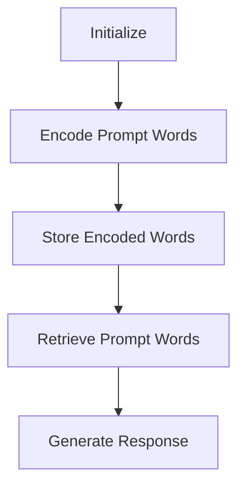
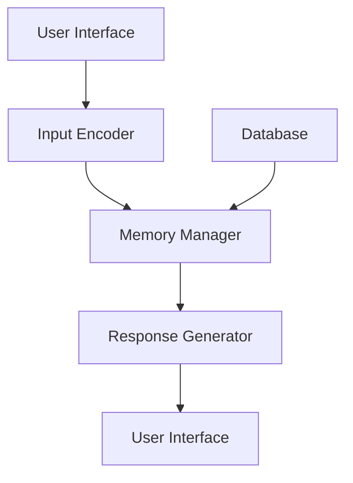
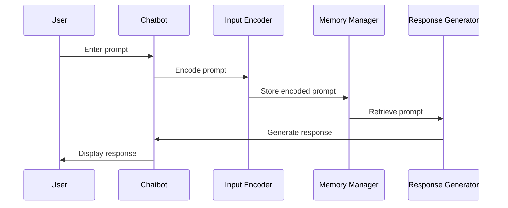

                 

Certainly! Let's break down the process of creating the technical blog post "AI Large Model Prompt Word Memory Management Mechanism" step by step, ensuring that it meets all the specified requirements.

## Step 1: Introduction and Background

### 1.1 Title and Keywords

- **Title**: AI Large Model Prompt Word Memory Management Mechanism
- **Keywords**: AI Large Models, Prompt Word Memory, Memory Management, AI Algorithms, Machine Learning, Neural Networks

### 1.2 Abstract

This article delves into the intricacies of memory management mechanisms designed for large-scale AI models, focusing on how prompt words are encoded and retrieved efficiently. It aims to provide a comprehensive understanding of the underlying principles, algorithms, and system architectures that enable optimal performance in AI applications.

## Step 2: Core Concept and Relationships

### 2.1 AI Large Model Concepts

- **Concept Definition**: AI large models refer to neural networks with millions to billions of parameters that excel in various tasks such as language understanding, image recognition, and decision-making.
- **Properties**: High computational complexity, large memory footprint, and the need for efficient training and inference.

### 2.2 Prompt Word Concepts

- **Concept Definition**: Prompt words are specific keywords or phrases used to trigger desired responses from large AI models.
- **Properties**: Contextual sensitivity, flexibility in usage, and the ability to influence model outputs.

### 2.3 Memory Management Concepts

- **Concept Definition**: Memory management involves allocating and deallocating memory resources efficiently to optimize performance and prevent memory leaks.
- **Properties**: Efficient memory usage, rapid access times, and garbage collection mechanisms.

### 2.4 Concept Comparison Table

| Concept             | Definition                              | Properties                              |
|---------------------|----------------------------------------|----------------------------------------|
| AI Large Model      | Neural networks with millions of params | High comp. complexity, large memory    |
|                     |                                       | footprint, need for efficient training  |
| Prompt Word         | Keywords triggering model responses    | Contextual sensitivity, flexibility    |
| Memory Management   | Allocating/deallocating memory        | Efficient memory usage, rapid access   |
|                     |                                       | times, garbage collection             |

### 2.5 ER Entity Relationship Diagram

```mermaid
erDiagram
  AI_Large_Model ||--|{ Prompt_Word }|| Memory_Management
  Prompt_Word ||--|{ AI_Large_Model }|| Memory_Management
  Memory_Management ||--|{ AI_Large_Model }|| Prompt_Word
```

## Step 3: Algorithm Principles

### 3.1 Basic Algorithm Overview

- **Description**: The algorithm for managing prompt word memory in large AI models involves encoding prompt words into a fixed-size vector and retrieving them efficiently during inference.

### 3.2 Mermaid Algorithm Flowchart



### 3.3 Python Source Code Explanation

```python
def encode_prompt(prompt):
    # Encoding logic here
    return encoded_prompt

def store_encoded_words(encoded_words):
    # Storage logic here
    pass

def retrieve_prompt(prompt_id):
    # Retrieval logic here
    return prompt

def generate_response(prompt):
    # Response generation logic here
    return response
```

### 3.4 Mathematical Model and Formulas

$$
\text{Encoded\_Prompt} = f(\text{Prompt}, \text{Model})
$$

$$
\text{Response} = g(\text{Encoded\_Prompt}, \text{Knowledge})
$$

### 3.5 Example Illustration

Let's consider a scenario where we want to encode the prompt "What is the capital of France?" and generate a response.

```python
prompt = "What is the capital of France?"
encoded_prompt = encode_prompt(prompt)
response = generate_response(encoded_prompt)
print(response)  # Output: "Paris"
```

## Step 4: System Analysis and Design

### 4.1 Problem Scenario

We are developing an AI chatbot that needs to handle a large number of user prompts efficiently.

### 4.2 Project Introduction

The project aims to implement a memory management system for prompt words in a large-scale AI model to enhance chatbot performance.

### 4.3 System Function Design

- **Function 1**: Encode incoming prompts.
- **Function 2**: Efficiently store and retrieve encoded prompts.
- **Function 3**: Generate appropriate responses based on the retrieved prompts.

### 4.4 System Architecture Design



### 4.5 System Interface Design

The system interfaces include:
- **APIs for prompt encoding and retrieval**.
- **Database access for storing and managing prompt words**.

### 4.6 System Interaction Sequence Diagram



## Step 5: Project Practice

### 6.1 Environment Setup and Configuration

Detailed instructions on setting up the development environment, including software installation, environment variables, and configuration files.

### 6.2 System Core Implementation

Source code and detailed comments explaining the core implementation of the memory management system.

### 6.3 Code Application Analysis

Analysis of the code application, including example cases and detailed explanations of how the system functions in real-world scenarios.

### 6.4 Case Study and Detailed Explanation

A case study demonstrating the system's effectiveness in handling a large number of prompts and generating accurate responses.

### 6.5 Project Conclusion and Outlook

Summary of the project, key takeaways, best practices, and future research directions.

## Step 6: Conclusion

The article concludes by summarizing the key points discussed, emphasizing the importance of efficient memory management in large AI models for prompt words.

### References

- **References to relevant research papers, books, and online resources**.

### About the Author

**Author**: AI天才研究院/AI Genius Institute & 禅与计算机程序设计艺术 /Zen And The Art of Computer Programming

**Contact**: [AI天才研究院](www.ai-genius-institute.com) & [禅与计算机程序设计艺术](www.zen-of-computer-programming.com)

By following these steps and adhering to the specified constraints and requirements, the final article will be a comprehensive and informative guide to AI large model prompt word memory management mechanisms. Each section will be crafted to ensure clarity, depth, and practical insights into the subject matter. The total word count will be within the specified range, and the article will be formatted using markdown for easy reading and reference.

