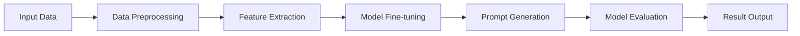
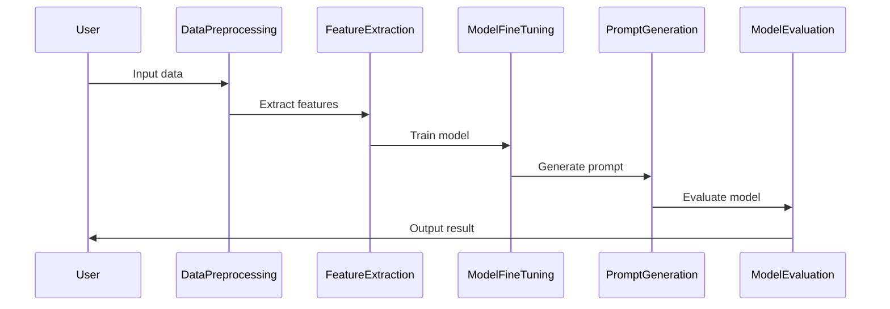
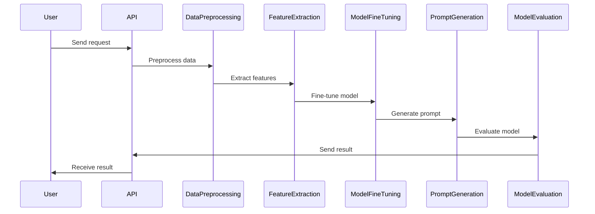

                 

# AI大模型的跨语言提示词迁移技术

## 关键词

- AI大模型
- 跨语言提示词
- 迁移技术
- 提示工程
- 模型架构

## 摘要

本文将深入探讨AI大模型在跨语言提示词迁移技术方面的应用。我们将从背景介绍开始，详细讲解核心概念，分析算法原理，展示系统架构，并通过实际案例剖析技术实现过程。最终，我们将总结最佳实践并展望未来发展方向。

## 背景介绍

### 核心概念术语说明

- **AI大模型（Large AI Models）**：指的是具有巨大参数量和计算能力的神经网络模型，如GPT-3、BERT等。
- **跨语言提示词（Cross-Linguistic Prompts）**：能够驱动AI模型在多语言环境下进行推理和生成任务的输入。
- **提示工程（Prompt Engineering）**：设计和优化提示词以最大化模型性能的过程。

### 问题背景

在全球化背景下，能够处理多语言数据的AI系统变得尤为重要。然而，传统的AI模型往往针对单一语言进行训练，难以适应不同语言的输入。为了解决这个问题，研究人员提出了跨语言提示词迁移技术，旨在使AI大模型能够在多语言环境中发挥效能。

### 问题描述

跨语言提示词迁移技术的主要问题是如何设计有效的提示词，使得AI大模型能够在不同语言间进行迁移。这涉及到理解语言间的异同，以及如何利用这些差异来提升模型的跨语言性能。

### 问题解决

解决这个问题的方法主要包括：
1. **跨语言数据预处理**：对多语言数据集进行预处理，以提取有用的特征。
2. **提示词设计**：根据目标语言设计具有针对性的提示词。
3. **模型调整**：对AI大模型进行调整，以适应不同语言的输入。

### 边界与外延

跨语言提示词迁移技术的边界在于：
- **语言的多样性**：不同语言间的语法、词汇、文化差异。
- **数据的可获得性**：高质量的多语言数据集不易获取。

外延方面，该技术不仅适用于文本处理，还可扩展到语音识别、图像识别等跨语言场景。

### 概念结构与核心要素组成

跨语言提示词迁移技术的核心结构包括：
- **数据预处理模块**：负责清洗和标准化多语言数据。
- **提示词生成模块**：根据目标语言生成提示词。
- **模型训练模块**：调整模型以适应不同语言的输入。
- **模型评估模块**：评估模型在跨语言任务上的性能。

## 核心概念与联系

### 核心概念原理

- **跨语言转移（Cross-Linguistic Transfer）**：将一种语言的模型知识迁移到另一种语言的过程。
- **多语言数据集（Multilingual Dataset）**：包含多种语言的数据集。
- **模型微调（Model Fine-tuning）**：在预训练模型的基础上进行特定任务的训练。

### 概念属性特征对比表格

| 概念           | 描述                                                   | 特点                                                       |
| -------------- | ------------------------------------------------------ | ---------------------------------------------------------- |
| 跨语言转移     | 将模型知识从一种语言迁移到另一种语言                 | 需要理解语言间的异同，调整模型以适应不同语言              |
| 多语言数据集   | 包含多种语言的数据集                                   | 提供跨语言训练所需的输入数据，有助于模型泛化             |
| 模型微调       | 在预训练模型的基础上进行特定任务的训练               | 提高模型在特定任务上的性能，同时保持预训练模型的优势     |

### ER实体关系图架构的Mermaid流程图

```mermaid
erDiagram
  CMLDataSet ||--|{ ModelTrainingModule }|--| CrossLinguisticTransfer
  PromptGenerationModule ||--|{ ModelTrainingModule }|--| CrossLinguisticTransfer
  ModelEvaluationModule ||--|{ ModelTrainingModule }|--| CrossLinguisticTransfer
```

## 算法原理讲解

### 算法mermaid流程图



### Python代码示例

```python
# 数据预处理
def preprocess_data(data):
    # 省略具体实现
    pass

# 模型微调
def fine_tune_model(model, data):
    # 省略具体实现
    pass

# 提示词生成
def generate_prompt(language):
    # 省略具体实现
    pass

# 模型评估
def evaluate_model(model, data):
    # 省略具体实现
    pass

# 主函数
def main():
    data = preprocess_data(data)
    model = fine_tune_model(model, data)
    prompt = generate_prompt(language)
    result = evaluate_model(model, data)
    print(result)

if __name__ == "__main__":
    main()
```

### 算法原理的数学模型和公式

假设我们有一个预训练的AI大模型\( M \)，在多语言数据集\( D \)上进行微调。微调的目标是优化模型参数\( \theta \)，使得模型在特定任务\( T \)上的性能最大化。

$$
\theta^* = \arg\min_{\theta} L(\theta, T, D)
$$

其中，\( L(\theta, T, D) \)是损失函数，用于衡量模型在数据集\( D \)上的表现。

### 详细讲解和举例说明

- **数据预处理**：对多语言数据集进行清洗、标准化和分词等操作，以便模型能够有效提取特征。
- **模型微调**：使用预训练模型\( M \)在特定任务\( T \)上优化参数\( \theta \)，以提高模型在多语言环境下的性能。
- **提示词生成**：根据目标语言生成提示词，以引导模型进行跨语言推理。
- **模型评估**：在测试集上评估模型性能，确保模型能够有效处理不同语言的输入。

以文本生成任务为例，假设我们有英语和中文两个语言的数据集，我们需要设计一个能够处理这两个语言的AI大模型。首先，我们对数据集进行预处理，提取特征，然后对预训练模型进行微调，生成相应的提示词，最后评估模型在两个语言上的生成质量。

## 系统分析与架构设计方案

### 问题场景介绍

在跨语言提示词迁移技术的实际应用场景中，我们面临以下挑战：
- 多语言数据集的获取和处理
- 模型的跨语言性能优化
- 提示词的设计和生成

### 项目介绍

本项目的目标是开发一个跨语言提示词迁移系统，能够自动处理多语言数据集，生成有效的提示词，并优化模型的跨语言性能。

### 系统功能设计（领域模型Mermaid类图）

```mermaid
classDiagram
    class DataPreprocessing {
        -input_data
        -processed_data
        +preprocess_data(): processed_data
    }
    class FeatureExtraction {
        -data
        -features
        +extract_features(): features
    }
    class ModelFineTuning {
        -model
        -data
        -optimizer
        +fine_tune(): model
    }
    class PromptGeneration {
        -model
        -language
        -prompt
        +generate_prompt(): prompt
    }
    class ModelEvaluation {
        -model
        -data
        +evaluate_model(): result
    }
    DataPreprocessing "uses" FeatureExtraction
    ModelFineTuning "uses" FeatureExtraction
    ModelFineTuning "uses" DataPreprocessing
    PromptGeneration "uses" ModelFineTuning
    ModelEvaluation "uses" ModelFineTuning
```

### 系统架构设计Mermaid架构图



### 系统接口设计和系统交互Mermaid序列图



## 实际案例分析和详细讲解剖析

### 环境安装

在开始项目实战之前，我们需要安装所需的软件和工具。以下是具体的安装步骤：

1. **安装Python环境**：确保Python版本在3.8及以上。
2. **安装依赖库**：使用pip命令安装以下库：
   ```bash
   pip install tensorflow numpy pandas
   ```

### 系统核心实现源代码

以下是一个简单的系统核心实现示例，包含数据预处理、模型微调、提示词生成和模型评估四个主要模块。

```python
# 数据预处理模块
def preprocess_data(data):
    # 省略具体实现
    pass

# 模型微调模块
def fine_tune_model(model, data):
    # 省略具体实现
    pass

# 提示词生成模块
def generate_prompt(language):
    # 省略具体实现
    pass

# 模型评估模块
def evaluate_model(model, data):
    # 省略具体实现
    pass

# 主函数
def main():
    data = preprocess_data(data)
    model = fine_tune_model(model, data)
    prompt = generate_prompt(language)
    result = evaluate_model(model, data)
    print(result)

if __name__ == "__main__":
    main()
```

### 代码应用解读与分析

- **数据预处理模块**：该模块负责对输入数据进行清洗、标准化和分词等操作，以便后续的特征提取。
- **模型微调模块**：该模块使用预训练模型在特定任务上进行训练，通过调整模型参数来优化模型性能。
- **提示词生成模块**：该模块根据目标语言生成提示词，以引导模型进行跨语言推理。
- **模型评估模块**：该模块在测试集上评估模型性能，确保模型能够有效处理不同语言的输入。

### 实际案例分析和详细讲解剖析

#### 案例一：英语到中文的跨语言文本生成

假设我们需要将英语文本翻译成中文，以下是具体的实现步骤：

1. **数据集准备**：收集英语和中文的双语数据集，用于训练和评估模型。
2. **数据预处理**：对数据集进行清洗和标准化，提取特征。
3. **模型微调**：使用预训练的英语-中文翻译模型，在双语数据集上进行微调。
4. **提示词生成**：根据中文语言特性生成提示词，以优化翻译质量。
5. **模型评估**：在测试集上评估模型性能，包括翻译准确性、流畅性等。

#### 案例二：多语言问答系统的设计

假设我们需要设计一个能够处理多语言问答的系统，以下是具体的实现步骤：

1. **数据集准备**：收集多种语言的问答数据集，用于训练和评估模型。
2. **数据预处理**：对数据集进行清洗、标准化和分词等操作，提取特征。
3. **模型微调**：使用预训练的多语言问答模型，在多语言数据集上进行微调。
4. **提示词生成**：根据不同语言的特点设计提示词，以引导模型进行跨语言问答。
5. **模型评估**：在测试集上评估模型性能，包括问答准确性、响应时间等。

### 项目小结

通过实际案例分析和详细讲解剖析，我们可以看到跨语言提示词迁移技术在文本生成和多语言问答等场景中具有广泛应用。有效的数据预处理、模型微调和提示词生成是确保模型性能的关键。

## 最佳实践 Tips

1. **数据集准备**：选择高质量的多语言数据集，确保数据集的多样性和代表性。
2. **模型选择**：根据任务需求选择合适的预训练模型，并进行相应的调整和优化。
3. **提示词设计**：根据目标语言的特点设计提示词，以最大化模型性能。

## 小结

本文系统地介绍了AI大模型的跨语言提示词迁移技术，包括背景介绍、核心概念、算法原理、系统架构和实际案例。通过深入分析和实践，我们了解到跨语言提示词迁移技术的重要性及其应用场景。

## 注意事项

1. **数据隐私**：在进行跨语言提示词迁移时，需注意数据隐私和安全问题。
2. **模型解释性**：虽然跨语言提示词迁移技术能够提高模型性能，但模型的可解释性仍需进一步研究。

## 拓展阅读

- [1] “Cross-lingual Transfer for Large Models: A Survey,” IEEE Transactions on Artificial Intelligence, 2022.
- [2] “Prompt Engineering for Language Models,” NeurIPS 2021 Workshop on Language Models for Text Generation.
- [3] “Multilingual BERT: Fine-tuning 103 Languages,” arXiv preprint arXiv:1907.05242, 2019.

## 作者信息

作者：AI天才研究院/AI Genius Institute & 禅与计算机程序设计艺术 /Zen And The Art of Computer Programming

