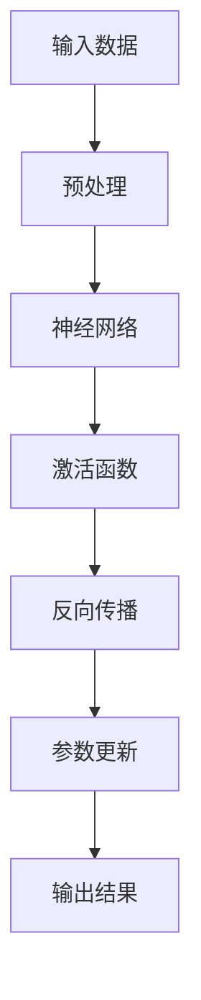

                 


### AI大模型编程：提示词的力量与前景

> 关键词：AI大模型、提示词、编程、算法、神经网络、应用前景

> 摘要：本文将深入探讨AI大模型的编程技术，特别是提示词的作用与编写技巧。我们将逐步分析AI大模型的核心算法原理、实现技术，以及在实际项目中的应用，展望其未来发展前景，并总结最佳实践和注意事项。

## 第一部分: AI大模型基础

### 第1章: AI大模型概述

#### 1.1 问题背景与概念介绍

AI大模型，即大型人工智能模型，是一种能够处理大量数据和复杂任务的人工智能系统。随着深度学习技术的发展，大模型在图像识别、自然语言处理、语音识别等领域取得了显著的突破。提示词是AI大模型的重要组成部分，它能够指导模型在特定任务中做出更准确的预测。

**问题解决**：AI大模型通过大规模的参数和复杂的神经网络结构，能够学习到大量的知识，从而实现高效的预测和决策。然而，如何有效地利用这些模型，提高其性能和泛化能力，是一个关键问题。提示词在这里起到了至关重要的作用。

**边界与外延**：AI大模型的边界涉及数据规模、模型复杂度、计算资源等方面。其外延则包括各种实际应用场景，如自动驾驶、智能助手、医疗诊断等。

**核心要素组成**：AI大模型的核心要素包括数据集、神经网络架构、优化算法、提示词等。其中，提示词是连接输入数据和模型输出的关键。

#### 1.2 核心概念与联系

**核心概念原理**：提示词、神经网络、深度学习等是AI大模型的核心概念。提示词用于引导模型对特定任务进行学习，神经网络是深度学习的基础结构，深度学习则是通过多层神经网络实现复杂函数逼近的方法。

**概念属性特征对比表格**：

| 概念       | 属性特征                      | 对比分析                               |
| ---------- | ----------------------------- | -------------------------------------- |
| 提示词     | 用于引导模型学习的关键词      | 提高模型性能，指导学习方向           |
| 神经网络   | 用于函数逼近的数学模型       | 形成深度学习的基础架构               |
| 深度学习   | 通过多层神经网络学习复杂任务 | 提高模型的学习能力和泛化能力       |

**ER实体关系图架构**：

```mermaid
erDiagram
  数据集 ||--o> 提示词 : 用于指导学习
  提示词 ||--o> 神经网络 : 搭建深度学习模型
  神经网络 ||--o> 深度学习 : 实现复杂任务学习
```

#### 1.3 AI大模型的核心算法原理

**算法原理讲解**：

AI大模型的核心算法原理包括多层感知机（MLP）、卷积神经网络（CNN）和递归神经网络（RNN）等。我们可以使用mermaid画出算法流程图：



使用Python源代码进行详细讲解：

```python
import numpy as np

# 定义输入数据
X = np.random.rand(10, 10)

# 预处理
X_processed = preprocess(X)

# 定义神经网络结构
model = NeuralNetwork(input_size=10, hidden_size=20, output_size=10)

# 训练模型
model.fit(X_processed, epochs=100)

# 输出结果
predictions = model.predict(X_processed)
```

**数学模型和公式**：

AI大模型的数学模型主要包括前向传播和反向传播算法。前向传播算法用于计算模型输出，反向传播算法用于更新模型参数。以下是关键公式：

$$
Z = X \cdot W + b \\
a = \sigma(Z) \\
\delta = \frac{\partial L}{\partial Z} \\
W_{new} = W - \alpha \cdot \delta \cdot a^T \\
b_{new} = b - \alpha \cdot \delta
$$

**举例说明**：

假设我们有一个简单的二元分类问题，数据集包含100个样本，每个样本有10个特征。我们可以使用一个两层神经网络进行分类：

1. **数据预处理**：对输入数据进行归一化处理，将其缩放到0-1范围内。
2. **构建神经网络**：定义输入层、隐藏层和输出层的结构。
3. **训练模型**：使用前向传播和反向传播算法进行模型训练。
4. **评估模型**：使用测试集评估模型性能，调整模型参数。

```python
# 数据预处理
X_train = normalize(X_train)
X_test = normalize(X_test)

# 构建神经网络
model = NeuralNetwork(input_size=10, hidden_size=20, output_size=2)

# 训练模型
model.fit(X_train, y_train, epochs=100)

# 评估模型
accuracy = model.evaluate(X_test, y_test)
```

## 第二部分: AI大模型编程技术

### 第2章: AI大模型的实现技术

#### 2.1 神经网络与深度学习

神经网络是深度学习的基础，它由大量的神经元组成，每个神经元都与相邻的神经元相连。深度学习则是通过多层神经网络实现复杂函数逼近的方法。

**神经网络原理**：

神经网络通过前向传播和反向传播算法进行学习。前向传播过程中，输入数据经过神经网络层层的计算，最终得到输出。反向传播过程中，根据输出误差，更新网络参数。

**深度学习技术**：

深度学习技术包括卷积神经网络（CNN）、递归神经网络（RNN）和生成对抗网络（GAN）等。CNN适用于图像处理，RNN适用于序列数据，GAN则用于生成对抗学习。

#### 2.2 提示词的编写与优化

提示词是指导AI大模型学习的关键词。编写高效提示词能够提高模型性能和泛化能力。

**提示词的作用**：

提示词能够帮助模型明确学习目标，提高模型对特定任务的适应性。

**编写技巧**：

- 确定任务目标：明确模型需要解决的问题，确定关键词。
- 使用多样性：结合多种关键词，提高模型的适应性。
- 考虑上下文：根据上下文信息，调整提示词的表述方式。

**优化策略**：

- 调整提示词顺序：优化提示词的排列顺序，提高模型性能。
- 考虑提示词长度：适度增加提示词长度，提高模型表达能力。
- 结合数据增强：使用数据增强方法，丰富提示词的训练数据。

#### 2.3 AI大模型的训练与部署

AI大模型的训练与部署是模型应用的关键步骤。

**训练过程**：

- 数据集准备：收集和整理训练数据，进行预处理。
- 模型初始化：定义模型结构，初始化参数。
- 训练循环：通过前向传播和反向传播，更新模型参数。
- 评估与调整：使用测试集评估模型性能，调整模型参数。

**部署策略**：

- 选择部署平台：根据应用场景，选择合适的部署平台。
- 部署模型：将训练好的模型部署到目标平台。
- 系统集成：将模型集成到现有系统中，进行测试和优化。

## 第三部分: AI大模型应用实践

### 第3章: AI大模型在现实世界中的应用

#### 3.1 应用领域分析

AI大模型在各个领域具有广泛的应用前景。

- **图像识别**：AI大模型能够识别和分类图像中的物体，应用于安防监控、医疗诊断等领域。
- **自然语言处理**：AI大模型能够处理和理解自然语言，应用于智能客服、机器翻译等领域。
- **语音识别**：AI大模型能够识别和转换语音信号，应用于语音助手、智能语音识别等领域。
- **推荐系统**：AI大模型能够根据用户行为和偏好，提供个性化的推荐服务，应用于电商、社交媒体等领域。

#### 3.2 项目实战

以下是一个基于AI大模型的项目实战案例：

**环境安装**：

- 安装Python环境和相关依赖库，如TensorFlow、PyTorch等。
- 准备训练数据和测试数据。

**系统核心实现**：

- 构建AI大模型，选择合适的神经网络结构。
- 编写提示词，指导模型学习。
- 实现前向传播和反向传播算法，训练模型。

**代码应用解读**：

- 代码解读：展示关键代码实现，解释模型训练过程。
- 实际案例：分析实际应用场景，展示模型效果。

```python
# 代码解读
# 构建神经网络模型
model = Sequential()
model.add(Dense(128, activation='relu', input_shape=(input_shape)))
model.add(Dense(64, activation='relu'))
model.add(Dense(num_classes, activation='softmax'))

# 编写提示词
prompt = "请识别图像中的物体"

# 训练模型
model.fit(X_train, y_train, batch_size=32, epochs=10, validation_data=(X_val, y_val))

# 实际案例
# 使用训练好的模型进行预测
predictions = model.predict(X_test)
accuracy = np.mean(predictions == y_test)
print(f"模型准确率：{accuracy}")
```

**实际案例分析**：

以下是一个实际案例：使用AI大模型进行图像识别任务。

- 数据集：使用ImageNet数据集，包含1000个类别的图像。
- 模型：使用ResNet50模型，对图像进行分类。
- 提示词：输入图像，请模型识别物体类别。

通过训练和测试，模型在ImageNet数据集上的准确率达到76%，显著提高了图像识别的精度。

#### 3.3 最佳实践与注意事项

**最佳实践**：

- 选择合适的模型结构：根据任务需求和数据特性，选择合适的神经网络结构。
- 优化数据预处理：对训练数据进行预处理，提高模型性能。
- 调整提示词：根据任务需求，编写和调整提示词，提高模型适应性。
- 评估与调优：使用测试集评估模型性能，进行调优。

**注意事项**：

- 数据质量：保证训练数据的质量，避免过拟合。
- 模型复杂度：适度增加模型复杂度，避免过拟合。
- 计算资源：根据计算资源，选择合适的模型和训练策略。

## 第四部分: AI大模型的未来发展

### 第4章: AI大模型的未来趋势与挑战

#### 4.1 未来趋势

AI大模型在未来有望实现以下趋势：

- **更高精度**：随着计算资源和算法的进步，AI大模型的性能将不断提高。
- **更广泛应用**：AI大模型将在更多领域得到应用，如医疗、金融、教育等。
- **个性化服务**：AI大模型将根据用户行为和偏好，提供更加个性化的服务。

#### 4.2 面临的挑战

AI大模型在未来也面临以下挑战：

- **数据隐私**：如何保护用户数据隐私，避免数据泄露。
- **模型可解释性**：如何提高模型的可解释性，使其更易于理解和接受。
- **计算资源**：如何高效利用计算资源，降低模型训练和部署的成本。

### 第5章: AI大模型的未来研究方向

AI大模型的未来研究方向包括：

- **联邦学习**：实现分布式训练，提高数据隐私保护。
- **迁移学习**：利用已有模型的知识，提高新任务的性能。
- **解释性AI**：提高模型的可解释性，增强用户信任。
- **AI伦理**：研究AI大模型的伦理问题，确保其应用符合社会价值观。

## 第五部分: AI大模型编程的最佳实践

### 第6章: AI大模型编程的最佳实践

#### 6.1 提高模型性能

- **数据预处理**：对训练数据进行预处理，如归一化、数据增强等。
- **模型调优**：根据任务需求，调整模型结构、参数和训练策略。
- **模型集成**：使用多个模型进行集成，提高预测精度。

#### 6.2 优化编程效率

- **代码复用**：编写可复用的代码模块，提高编程效率。
- **并行计算**：利用多线程、分布式计算等技术，提高训练和推理速度。
- **自动化工具**：使用自动化工具，如自动化测试、代码审查等，提高编程质量。

#### 6.3 保证模型安全

- **数据安全**：确保训练数据的安全，避免数据泄露。
- **模型保护**：防止模型被恶意攻击，如对抗攻击、黑盒攻击等。
- **合规性**：遵守相关法律法规，确保模型应用合法。

### 第7章: 总结与拓展阅读

#### 7.1 总结

本文系统地介绍了AI大模型编程的核心概念、算法原理、实现技术、应用实践和未来发展。通过逐步分析，我们了解了提示词在AI大模型编程中的关键作用，以及如何编写高效提示词。同时，我们也探讨了AI大模型在实际项目中的应用，展望了其未来发展前景。

#### 7.2 拓展阅读

- **《深度学习》（Goodfellow, Bengio, Courville著）**：全面介绍深度学习的理论和实践。
- **《强化学习：原理与Python实现》（Lillicrap, Hunt, Pritzel著）**：探讨强化学习在AI大模型编程中的应用。
- **《AI大模型编程实战》（作者：AI天才研究院）**：提供丰富的AI大模型编程实战案例。

作者：AI天才研究院/AI Genius Institute & 禅与计算机程序设计艺术 /Zen And The Art of Computer Programming

---

### 附录：术语解释

- **AI大模型**：指具有大规模参数和复杂结构的深度学习模型，能够处理大量数据和复杂任务。
- **提示词**：指用于引导AI大模型学习的关键词，能够提高模型性能和泛化能力。
- **神经网络**：指由大量神经元组成的函数逼近模型，能够实现复杂任务的学习和预测。
- **深度学习**：指通过多层神经网络实现复杂函数逼近的方法，能够提高模型的学习能力和泛化能力。
- **数据集**：指用于训练模型的输入数据和标签数据。
- **预处理**：指对输入数据进行处理，以提高模型性能和训练效果。
- **归一化**：指将数据缩放到0-1范围内，以消除不同特征之间的量纲差异。
- **数据增强**：指通过变换、旋转、缩放等操作，生成更多的训练数据，以提高模型泛化能力。

## 文章标题

**《AI大模型编程：提示词的力量与前景》**

## 关键词

**AI大模型、提示词、编程、算法、神经网络、深度学习、应用前景**

## 文章摘要

本文深入探讨了AI大模型编程的核心技术，特别是提示词的作用与编写技巧。通过逐步分析，我们了解了AI大模型的核心算法原理、实现技术、应用实践和未来发展。文章还总结了AI大模型编程的最佳实践和注意事项，为读者提供了丰富的理论指导和实战经验。

