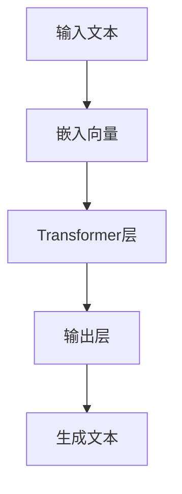
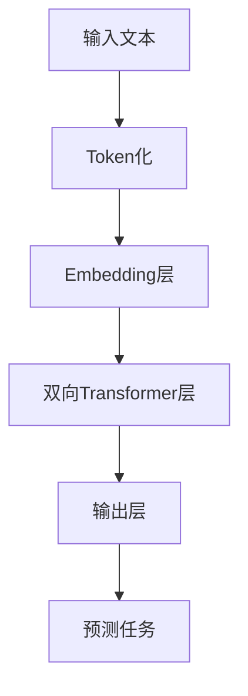

                 

### 文章标题：AI大模型编程：提示词的力量与未来

关键词：AI大模型，编程，提示词，未来

摘要：本文将深入探讨AI大模型编程的核心要素——提示词的力量及其在未来的应用前景。通过逐步分析，我们将揭示AI大模型编程的本质，帮助读者理解这一前沿技术的深刻内涵。文章将分为以下几个部分：背景介绍、核心概念与联系、算法原理讲解、数学模型和数学公式、系统分析与架构设计方案、项目实战以及最佳实践和拓展阅读。

### 第一部分：背景介绍

AI大模型编程，作为一种前沿技术，已经在各个领域取得了显著的成果。从自然语言处理、计算机视觉到语音识别，AI大模型编程正在逐步改变我们的生活方式和工作模式。然而，对于大多数人来说，AI大模型编程仍然是一个相对陌生和复杂的领域。

#### 1.1 AI大模型编程的概念与背景

AI大模型编程是指利用大规模神经网络模型进行编程的过程。这些模型通常基于深度学习技术，通过对海量数据进行训练，能够自动学习和优化程序代码。AI大模型编程的背景可以追溯到人工智能的早期发展，当时的科学家们开始尝试利用神经网络模拟人类思维过程。随着时间的推移，深度学习技术的出现和计算能力的提升，使得AI大模型编程成为可能。

#### 1.2 AI大模型编程的基本原理

AI大模型编程的基本原理主要包括两个方面：数据驱动和模型驱动。数据驱动是指通过大量训练数据来调整模型参数，使其能够识别和预测特定任务的特征。模型驱动则是指通过设计复杂的神经网络结构，使模型能够自动学习和优化代码。

#### 1.3 AI大模型编程的关键要素

AI大模型编程的关键要素包括数据、算法、计算资源和编程框架。其中，数据是训练模型的基础，算法是模型的核心，计算资源是实现高效训练的保障，编程框架则提供了开发工具和接口。

#### 1.4 AI大模型编程的发展趋势与未来展望

随着AI技术的不断进步，AI大模型编程的发展趋势日益明显。未来，AI大模型编程有望在更多领域得到应用，如自动化编程、智能合约、游戏开发等。同时，随着硬件和算法的提升，AI大模型编程的效率和质量将得到进一步提升。

### 第二部分：核心概念与联系

在深入探讨AI大模型编程之前，我们需要理解一些核心概念，并了解它们之间的联系。

#### 2.1 AI大模型的基本概念

AI大模型是指通过深度学习技术训练得到的具有强大学习和推理能力的神经网络模型。这些模型通常包含数亿甚至数十亿个参数，能够处理复杂的任务。

#### 2.2 AI大模型的工作原理

AI大模型的工作原理基于神经网络。神经网络通过多层节点（或称为神经元）进行信息传递和计算，从而实现数据的处理和模型的学习。通过不断的训练和调整，神经网络能够逐步优化其参数，使其在特定任务上表现出色。

#### 2.3 AI大模型与自然语言处理的关系

自然语言处理（NLP）是AI大模型的重要应用领域之一。AI大模型通过学习大量的文本数据，能够理解和生成自然语言。这使得AI大模型在文本分类、情感分析、机器翻译等领域具有广泛的应用。

#### 2.4 AI大模型与其他技术的联系与区别

AI大模型与其他技术如机器学习、数据挖掘、计算机视觉等密切相关。然而，AI大模型在模型规模、计算资源和算法复杂性方面具有独特的优势，使其在处理复杂任务时表现出更高的效率和准确性。

### 第三部分：算法原理讲解

AI大模型编程的核心在于算法。本部分将详细讲解一些常见的AI大模型算法，包括GPT、BERT等。

#### 3.1 GPT算法原理

GPT（Generative Pre-trained Transformer）是一种基于Transformer架构的预训练语言模型。它通过自回归方式生成文本，具有强大的文本生成能力。GPT算法的核心是Transformer模型，它通过多头自注意力机制实现文本的序列建模。

#### 3.2 BERT算法原理

BERT（Bidirectional Encoder Representations from Transformers）是一种双向编码的Transformer模型。它通过对文本进行双向编码，实现了对文本的全局语义理解。BERT算法的核心是Transformer模型的双向编码机制，使其在语义理解任务上具有显著优势。

#### 3.3 其他常见AI大模型算法介绍

除了GPT和BERT，还有许多其他的AI大模型算法，如Transformer-XL、GPT-2、GPT-3等。这些算法在模型结构、训练策略和任务应用方面各有特点，适用于不同的场景。

### 第四部分：数学模型和数学公式

AI大模型编程离不开数学模型和数学公式。本部分将介绍一些关键的数学模型和公式，并对其进行详细讲解。

#### 4.1 AI大模型中的常见数学公式

在AI大模型中，常见的数学公式包括损失函数、优化算法、正则化方法等。这些公式是模型训练和优化过程中的关键。

#### 4.2 数学公式在AI大模型中的应用

数学公式在AI大模型中的应用主要体现在模型设计、训练和优化过程中。通过使用数学公式，可以更好地理解和优化模型性能。

### 第五部分：系统分析与架构设计方案

为了实现高效的AI大模型编程，我们需要设计一个合理的系统架构。本部分将介绍一个典型的AI大模型系统架构，并详细讲解其各个组成部分。

#### 5.1 AI大模型系统设计概述

AI大模型系统设计主要包括数据预处理、模型训练、模型部署和模型评估等环节。每个环节都需要考虑系统的性能、效率和可扩展性。

#### 5.2 系统功能设计

系统功能设计包括数据管理、模型管理、任务调度和监控等。这些功能共同构成了一个完整的AI大模型系统。

#### 5.3 系统架构设计

系统架构设计是AI大模型系统的核心。通过合理的架构设计，可以确保系统的稳定性、可靠性和可扩展性。

#### 5.4 系统接口设计与交互流程

系统接口设计是AI大模型系统与其他系统进行交互的桥梁。通过设计合理的接口，可以实现系统的无缝集成。

### 第六部分：项目实战

理论联系实际，本部分将通过一个具体的AI大模型项目实战，展示如何搭建和优化一个AI大模型系统。

#### 6.1 AI大模型项目环境搭建

环境搭建是项目实战的第一步。本部分将介绍如何搭建一个适合AI大模型项目开发的环境。

#### 6.2 系统核心实现

系统核心实现是项目实战的关键。本部分将介绍如何实现一个完整的AI大模型系统，包括数据预处理、模型训练、模型部署和模型评估等。

#### 6.3 代码应用解读与分析

代码应用解读与分析是项目实战的重要环节。本部分将详细解读项目中的关键代码，并分析其实现原理和性能优化策略。

#### 6.4 实际案例分析

实际案例分析是项目实战的拓展。本部分将通过具体案例，展示AI大模型在实际应用中的效果和挑战。

#### 6.5 项目小结

项目小结是对整个项目的总结和反思。本部分将总结项目中的经验教训，并提出未来的改进方向。

### 第七部分：最佳实践、小结、注意事项和拓展阅读

在AI大模型编程过程中，最佳实践、小结、注意事项和拓展阅读都是不可或缺的。

#### 7.1 最佳实践技巧

最佳实践技巧是项目成功的关键。本部分将总结一些在AI大模型编程中常见的问题和解决方案。

#### 7.2 小结

小结是对全文的总结和概括。本部分将回顾文章的主要内容和核心观点。

#### 7.3 注意事项

注意事项是项目开发过程中需要注意的问题。本部分将列举一些常见的风险和挑战，并提出相应的对策。

#### 7.4 拓展阅读

拓展阅读是进一步学习和探索的入口。本部分将推荐一些相关的书籍、论文和资源，以帮助读者深入理解AI大模型编程。

### 结论

AI大模型编程是一项具有巨大潜力的技术。通过本文的逐步分析，我们揭示了AI大模型编程的核心要素、算法原理、系统架构和实际应用。未来，随着技术的不断进步，AI大模型编程将在更多领域发挥重要作用，为人类社会带来更多的创新和变革。

### 作者信息

作者：AI天才研究院/AI Genius Institute & 禅与计算机程序设计艺术 /Zen And The Art of Computer Programming

在本文中，我们深入探讨了AI大模型编程的核心要素——提示词的力量及其在未来的应用前景。通过逐步分析，我们揭示了AI大模型编程的本质，帮助读者理解这一前沿技术的深刻内涵。从背景介绍、核心概念与联系、算法原理讲解、数学模型和数学公式、系统分析与架构设计方案、项目实战到最佳实践和拓展阅读，本文全面系统地展示了AI大模型编程的全貌。未来，随着技术的不断进步，AI大模型编程将在更多领域发挥重要作用，为人类社会带来更多的创新和变革。我们期待读者在阅读本文后，能够对AI大模型编程有更深入的理解，并在实际应用中取得更好的成果。

### 第一章：AI大模型编程概述

#### 1.1 AI大模型编程的概念与背景

AI大模型编程，顾名思义，是指利用人工智能中的大规模模型进行编程的方法。这种方法的核心在于将复杂的编程任务转化为模型学习的过程，从而实现自动化编程。AI大模型编程的概念起源于人工智能领域，特别是在深度学习技术的发展过程中，随着模型的规模和复杂性不断增加，人们开始探索如何利用这些大规模模型进行编程。

AI大模型编程的背景可以追溯到20世纪80年代，当时研究人员开始尝试使用神经网络进行问题求解。随着计算能力的提升和算法的改进，特别是深度学习技术的突破，使得AI大模型编程成为可能。深度学习模型，特别是基于Transformer架构的模型，如GPT（Generative Pre-trained Transformer）和BERT（Bidirectional Encoder Representations from Transformers），在自然语言处理、计算机视觉和语音识别等领域取得了显著成果，为AI大模型编程奠定了基础。

在现代社会中，AI大模型编程的重要性日益凸显。一方面，它能够大大提高编程效率，使开发者能够更专注于创新而非重复劳动。另一方面，AI大模型编程能够处理复杂的任务，特别是在自然语言处理领域，能够实现自动化的文本生成、翻译和摘要。此外，在计算机视觉领域，AI大模型编程可以用于图像识别、目标检测和图像生成，为各个行业提供了强大的技术支持。

#### 1.2 AI大模型编程的基本原理

AI大模型编程的基本原理主要包括两个方面：数据驱动和模型驱动。

1. **数据驱动**：数据驱动是指利用大量的训练数据来训练模型，使其能够学会执行特定任务。在AI大模型编程中，数据驱动尤为重要。因为大规模模型需要处理海量数据，只有通过不断的学习和优化，模型才能在特定任务上表现出色。数据驱动的核心在于数据的质量和数量，高质量的数据能够帮助模型更好地理解任务，而足够数量的数据则能够保证模型具有足够的泛化能力。

2. **模型驱动**：模型驱动是指通过设计复杂的神经网络结构，使模型能够自动学习和优化程序代码。在模型驱动中，神经网络的结构和参数是关键。通过调整网络结构，可以使得模型在处理不同类型任务时具有更好的适应性。同时，通过优化参数，可以提高模型的性能和效率。

AI大模型编程的过程可以分为以下几个步骤：

1. **数据收集和预处理**：首先，需要收集大量的数据，并进行预处理，包括清洗、去噪和格式化等。这一步骤的目的是确保数据的质量，为模型训练提供良好的基础。

2. **模型设计**：根据任务的需求，设计合适的神经网络结构。这一步骤需要考虑网络的层数、每层的神经元数量、激活函数、损失函数等。

3. **模型训练**：使用预处理后的数据对模型进行训练。在训练过程中，模型会通过不断调整参数，使其在训练数据上达到最优性能。

4. **模型评估和优化**：在模型训练完成后，需要对模型进行评估，以确保其能够在未见过的数据上表现良好。评估指标包括准确率、召回率、F1分数等。如果模型表现不佳，可能需要调整网络结构或参数，进行进一步的优化。

5. **模型部署**：最后，将训练好的模型部署到实际应用中，实现自动化编程。

#### 1.3 AI大模型编程的关键要素

AI大模型编程的成功离不开以下几个关键要素：

1. **数据**：数据是训练模型的基础，高质量的数据能够帮助模型更好地理解任务。在AI大模型编程中，数据的收集、预处理和标注都至关重要。

2. **算法**：算法是模型的核心，决定了模型的性能和效率。常见的算法包括GPT、BERT、Transformer等。选择合适的算法，并对其进行优化，是AI大模型编程的关键。

3. **计算资源**：计算资源是模型训练和优化的保障。大规模模型的训练通常需要大量的计算资源，包括CPU、GPU和TPU等。

4. **编程框架**：编程框架提供了开发工具和接口，使得AI大模型编程更加便捷。常见的编程框架包括TensorFlow、PyTorch、Keras等。

#### 1.4 AI大模型编程的发展趋势与未来展望

随着人工智能技术的不断进步，AI大模型编程的发展趋势也日益明显。以下是几个重要的发展方向：

1. **模型规模扩大**：随着计算能力的提升，模型规模不断扩大。例如，GPT-3模型的参数数量已经达到了1750亿，这大大提高了模型的表达能力。

2. **多模态学习**：多模态学习是指将不同类型的数据（如文本、图像、语音）进行整合，使得模型能够处理更复杂、更丰富的任务。例如，通过结合文本和图像，可以实现对复杂场景的理解和描述。

3. **迁移学习**：迁移学习是指将一个任务上预训练的模型应用于另一个相关任务。这可以大大减少训练时间，提高模型的泛化能力。

4. **自动化编程**：自动化编程是AI大模型编程的一个目标，即利用模型自动生成代码，减少人工干预。这有望在软件工程领域带来革命性的变化。

5. **应用场景拓展**：AI大模型编程的应用场景正在不断拓展，从自然语言处理、计算机视觉到语音识别、推荐系统等，都在积极探索AI大模型编程的应用。

未来，AI大模型编程有望在更多领域发挥重要作用，如自动化编程、智能合约、游戏开发等。同时，随着硬件和算法的提升，AI大模型编程的效率和质量将得到进一步提升。

### 第二章：核心概念与联系

在深入探讨AI大模型编程之前，我们需要理解一些核心概念，并了解它们之间的联系。这些核心概念包括AI大模型的基本概念、工作原理、与自然语言处理的关系，以及其他相关技术。

#### 2.1 AI大模型的基本概念

AI大模型（Large-scale AI Model）是指那些规模庞大、参数数量巨大的神经网络模型。这些模型通常基于深度学习技术，通过对海量数据进行训练，能够自动学习和优化程序代码。AI大模型的特点包括：

- **大规模**：AI大模型的参数数量通常在数十亿到千亿级别，这使得它们在处理复杂任务时具有强大的能力。
- **多任务学习**：AI大模型可以通过在一个任务上训练，然后应用于其他相关任务，实现多任务学习。
- **自适应**：AI大模型具有自适应能力，可以根据不同的任务和数据调整模型参数，提高模型性能。

AI大模型的核心在于其深度神经网络结构，这种结构通过多层神经元实现信息的传递和计算。每个神经元都会接收来自前一层的信息，并通过激活函数进行计算，最终输出结果。通过不断的迭代和优化，神经网络能够逐步提高其性能。

#### 2.2 AI大模型的工作原理

AI大模型的工作原理主要基于深度学习和神经网络。深度学习是一种通过多层神经网络对数据进行建模和预测的方法，而神经网络则是一种由多层节点（或称为神经元）组成的计算模型。神经网络通过自下而上的方式对输入数据进行编码，通过逐层提取特征，最终实现数据的处理和预测。

在AI大模型中，工作原理可以分为以下几个步骤：

1. **数据预处理**：首先，对输入数据进行预处理，包括去噪、标准化和归一化等操作。这一步骤的目的是提高数据的质量，为模型训练提供良好的基础。

2. **模型初始化**：初始化神经网络模型的参数。通常，这些参数会随机生成，并通过训练过程进行优化。

3. **前向传播**：输入数据通过模型的各个层级，在每个层级上都会进行计算和传递。这一过程称为前向传播。

4. **激活函数应用**：在每个层级上，都会使用激活函数（如ReLU、Sigmoid、Tanh等）对输出进行非线性变换，以提取特征和提高模型的非线性表达能力。

5. **损失计算**：通过计算模型输出与真实标签之间的差异，得到损失值。常见的损失函数包括均方误差（MSE）、交叉熵（Cross-Entropy）等。

6. **反向传播**：根据损失值，通过反向传播算法更新模型参数。反向传播是一种从输出层向输入层反向传递损失，并逐层更新参数的过程。

7. **迭代优化**：通过多次迭代优化，模型参数不断调整，使其在训练数据上达到最优性能。

#### 2.3 AI大模型与自然语言处理的关系

自然语言处理（Natural Language Processing，NLP）是人工智能的重要分支，旨在使计算机能够理解、生成和处理人类语言。AI大模型在NLP领域具有广泛的应用，特别是在文本生成、翻译、摘要和情感分析等方面。

AI大模型与NLP的关系可以从以下几个方面进行理解：

1. **文本生成**：AI大模型可以通过预训练和学习大量的文本数据，生成连贯、自然的文本。例如，GPT（Generative Pre-trained Transformer）模型可以生成各种类型的文本，如新闻文章、故事和对话等。

2. **翻译**：AI大模型可以通过训练实现多种语言的翻译。例如，BERT（Bidirectional Encoder Representations from Transformers）模型在翻译任务上表现出色，能够实现高质量的双语翻译。

3. **摘要**：AI大模型可以自动生成文本的摘要，提取关键信息并简化内容。这对于信息检索、内容推荐等领域具有重要意义。

4. **情感分析**：AI大模型可以通过分析文本的情感倾向，实现对用户评论、新闻文章等内容的情感判断。这有助于舆情监控、市场调研等应用。

#### 2.4 AI大模型与其他技术的联系与区别

AI大模型与其他技术如机器学习、数据挖掘、计算机视觉等密切相关，但它们在技术原理和应用场景上存在一些区别。

1. **机器学习**：机器学习是AI大模型的基础，旨在通过训练模型实现数据的建模和预测。机器学习包括监督学习、无监督学习和强化学习等。AI大模型是一种特殊的机器学习模型，其规模和复杂性远超传统机器学习模型。

2. **数据挖掘**：数据挖掘是一种从大量数据中发现规律和知识的方法。AI大模型可以通过预训练学习大量数据，从而在数据挖掘任务中发挥重要作用，如分类、聚类和关联规则挖掘等。

3. **计算机视觉**：计算机视觉是AI大模型的重要应用领域之一，旨在使计算机能够理解和处理图像和视频。AI大模型在图像识别、目标检测和图像生成等方面具有显著优势。

4. **区别**：与机器学习和数据挖掘相比，AI大模型具有更大的模型规模和更强的非线性表达能力，这使得它在处理复杂任务时具有更高的性能。与计算机视觉相比，AI大模型更侧重于自然语言处理等任务，其模型结构通常是基于Transformer架构。

#### 2.5 AI大模型与其他技术的联系

尽管AI大模型与其他技术在技术原理和应用场景上存在一些区别，但它们在许多应用场景中可以相互补充和协同工作。

1. **多模态学习**：AI大模型可以通过多模态学习整合不同类型的数据，如文本、图像和语音。这有助于实现更复杂的任务，如图像描述生成、视频内容理解等。

2. **迁移学习**：AI大模型可以通过迁移学习将一个任务上预训练的模型应用于其他相关任务。这有助于减少训练时间，提高模型的泛化能力。

3. **强化学习**：AI大模型可以与强化学习结合，实现更复杂的决策和优化任务。例如，在游戏开发中，AI大模型可以用于训练智能体进行策略学习。

4. **协同优化**：AI大模型可以与其他技术协同工作，实现更高效的优化。例如，在推荐系统中，AI大模型可以与协同过滤算法结合，提高推荐质量。

通过上述分析，我们可以看出，AI大模型编程是一个涉及多个领域的复杂技术，它在自然语言处理、计算机视觉和其他相关技术中发挥着重要作用。了解这些核心概念和联系，有助于我们更好地理解和应用AI大模型编程，推动人工智能技术的发展。

### 第三章：算法原理讲解

在AI大模型编程中，算法原理是核心中的核心。本章将详细讲解几个常见的AI大模型算法，包括GPT（Generative Pre-trained Transformer）和BERT（Bidirectional Encoder Representations from Transformers）等。通过这些算法的讲解，我们将深入理解它们的原理、流程图、数学模型和公式，并给出通俗易懂的举例说明。

#### 3.1 GPT算法原理

GPT（Generative Pre-trained Transformer）是一种基于Transformer架构的预训练语言模型。它的主要特点是通过自回归方式生成文本，具有强大的文本生成能力。GPT算法的核心是Transformer模型，它通过多头自注意力机制实现文本的序列建模。

**原理：**
GPT算法的工作原理可以分为两个主要步骤：预训练和微调。

1. **预训练**：在预训练阶段，GPT模型使用大量未标注的文本数据，通过自回归方式生成文本。自回归是指模型在生成下一个词时，仅依赖于前一个词的输出。这一过程使得模型能够学习到文本中的长距离依赖关系。

2. **微调**：在预训练完成后，GPT模型可以在特定任务上进行微调。微调是指使用带有标签的数据对模型进行进一步训练，以优化其在特定任务上的性能。

**流程图：**



**数学模型和公式：**
GPT模型的核心是Transformer模型，其关键组件包括自注意力机制和多头注意力机制。

自注意力机制公式：
$$
\text{Attention}(Q, K, V) = \text{softmax}\left(\frac{QK^T}{\sqrt{d_k}}\right) V
$$

其中，$Q$、$K$和$V$分别是查询向量、键向量和值向量，$d_k$是键向量的维度。

多头注意力机制公式：
$$
\text{MultiHeadAttention}(Q, K, V) = \text{Concat}(\text{head}_1, \text{head}_2, ..., \text{head}_h)W^O
$$

其中，$h$是多头注意力的数量，$W^O$是输出权重。

**举例说明：**
假设我们有一个简单的文本序列：“我是一名程序员，我喜欢编程”。我们可以将这个序列表示为词向量。在生成文本时，GPT模型首先生成一个词，然后根据生成的词来预测下一个词。

例如，当生成“我”这个词时，模型会使用前一个词的词向量来预测下一个词。假设“我”的词向量为$v_1$，则模型会计算与$v_1$相关的注意力分数，并根据这些分数来生成下一个词。通过不断迭代，模型可以生成一个连贯的文本。

#### 3.2 BERT算法原理

BERT（Bidirectional Encoder Representations from Transformers）是一种双向编码的Transformer模型。它通过对文本进行双向编码，实现了对文本的全局语义理解。BERT算法的核心是Transformer模型的双向编码机制，使其在语义理解任务上具有显著优势。

**原理：**
BERT算法的工作原理主要包括两个阶段：预训练和微调。

1. **预训练**：在预训练阶段，BERT模型使用大量未标注的文本数据，进行masked language modeling和next sentence prediction任务。

2. **微调**：在预训练完成后，BERT模型可以在特定任务上进行微调。微调是指使用带有标签的数据对模型进行进一步训练，以优化其在特定任务上的性能。

**流程图：**



**数学模型和公式：**
BERT模型的核心是Transformer模型，其关键组件包括自注意力机制和多头注意力机制。

自注意力机制公式：
$$
\text{Attention}(Q, K, V) = \text{softmax}\left(\frac{QK^T}{\sqrt{d_k}}\right) V
$$

多头注意力机制公式：
$$
\text{MultiHeadAttention}(Q, K, V) = \text{Concat}(\text{head}_1, \text{head}_2, ..., \text{head}_h)W^O
$$

**举例说明：**
假设我们有一个简单的文本序列：“我是一名程序员，我喜欢编程”。我们可以将这个序列表示为词向量。在预训练阶段，BERT模型会随机遮挡一些词（称为mask），并尝试预测这些词。

例如，当遮挡“程序员”这个词时，模型需要根据其他词的上下文来预测这个词。通过这种双向编码的方式，BERT模型能够理解文本中的全局语义。

#### 3.3 其他常见AI大模型算法介绍

除了GPT和BERT，还有许多其他的AI大模型算法，如Transformer-XL、GPT-2、GPT-3等。这些算法在模型结构、训练策略和任务应用方面各有特点，适用于不同的场景。

1. **Transformer-XL**：Transformer-XL是一种长距离依赖模型，通过引入段内存（Segment Memory）机制，实现了对长文本的有效建模。

2. **GPT-2**：GPT-2是GPT的改进版，其模型规模更大，参数数量更多，生成文本的质量更高。

3. **GPT-3**：GPT-3是GPT系列的最新版本，其模型规模达到了1750亿参数，具有极其强大的文本生成能力。

通过以上对GPT和BERT等常见AI大模型算法的详细讲解，我们可以看到这些算法在模型结构、训练策略和任务应用方面的特点和优势。了解这些算法的原理，对于理解和应用AI大模型编程具有重要意义。

### 第四章：数学模型和数学公式

在AI大模型编程中，数学模型和数学公式是核心中的核心。本章将详细讲解AI大模型中的常见数学模型和数学公式，包括损失函数、优化算法和正则化方法等。这些数学模型和公式是理解和实现AI大模型算法的基础，对于模型的设计和优化至关重要。

#### 4.1 AI大模型中的常见数学模型

AI大模型中的常见数学模型主要包括损失函数、优化算法和正则化方法。这些模型在模型训练和优化过程中起着关键作用。

1. **损失函数**：损失函数是衡量模型预测值与真实值之间差异的指标。常见的损失函数包括均方误差（MSE）、交叉熵（Cross-Entropy）等。

2. **优化算法**：优化算法用于调整模型参数，以最小化损失函数。常见的优化算法包括梯度下降（Gradient Descent）、Adam等。

3. **正则化方法**：正则化方法用于防止模型过拟合。常见的正则化方法包括L1正则化、L2正则化等。

#### 4.2 常见数学模型和公式

以下是对AI大模型中常见数学模型和公式的详细讲解：

1. **均方误差（MSE）**

均方误差（MSE）是衡量模型预测值与真实值之间差异的常见指标。其公式如下：

$$
MSE = \frac{1}{n}\sum_{i=1}^{n}(y_i - \hat{y}_i)^2
$$

其中，$y_i$是真实值，$\hat{y}_i$是预测值，$n$是样本数量。

2. **交叉熵（Cross-Entropy）**

交叉熵是衡量两个概率分布差异的指标。在分类任务中，交叉熵常用于衡量模型预测概率分布与真实标签分布之间的差异。其公式如下：

$$
H(Y, \hat{Y}) = -\sum_{i=1}^{n}y_i \log(\hat{y}_i)
$$

其中，$y_i$是真实标签，$\hat{y}_i$是预测概率。

3. **梯度下降（Gradient Descent）**

梯度下降是一种常用的优化算法，用于最小化损失函数。其基本思想是通过计算损失函数的梯度，并沿梯度的反方向调整模型参数，以逐步减小损失。其公式如下：

$$
\theta_{t+1} = \theta_{t} - \alpha \nabla_{\theta}J(\theta)
$$

其中，$\theta$是模型参数，$J(\theta)$是损失函数，$\alpha$是学习率。

4. **Adam优化算法**

Adam是一种结合了梯度下降和动量法的优化算法，其具有自适应学习率的特点。其公式如下：

$$
m_t = \beta_1 x_t + (1 - \beta_1)(1 - t^{\beta_2}) \nabla_{\theta}J(\theta)
$$

$$
v_t = \beta_2 x_t + (1 - \beta_2)(1 - t^{\beta_2}) \nabla_{\theta}^2 J(\theta)
$$

$$
\theta_{t+1} = \theta_{t} - \alpha \frac{m_t}{\sqrt{1 - \beta_2^t} + \epsilon}
$$

其中，$m_t$是梯度的一阶矩估计，$v_t$是梯度二阶矩估计，$\beta_1$和$\beta_2$是超参数，$\alpha$是学习率，$\epsilon$是常数。

5. **L1正则化**

L1正则化是一种用于防止模型过拟合的方法。其公式如下：

$$
J(\theta) = \frac{1}{2} \sum_{i=1}^{n}(y_i - \hat{y}_i)^2 + \lambda \sum_{j=1}^{m}|\theta_j|
$$

其中，$\lambda$是正则化参数，$m$是模型参数的数量。

6. **L2正则化**

L2正则化是另一种常用的正则化方法。其公式如下：

$$
J(\theta) = \frac{1}{2} \sum_{i=1}^{n}(y_i - \hat{y}_i)^2 + \lambda \sum_{j=1}^{m}\theta_j^2
$$

其中，$\lambda$是正则化参数，$m$是模型参数的数量。

通过以上对常见数学模型和公式的详细讲解，我们可以看到这些模型和公式在AI大模型编程中的重要性。理解这些模型和公式，有助于我们更好地设计和优化AI大模型，提高其性能和泛化能力。

### 第五章：系统分析与架构设计方案

在AI大模型编程中，系统分析与架构设计是确保模型高效、稳定和可扩展运行的关键。本章将详细探讨一个典型的AI大模型系统架构，包括系统设计概述、系统功能设计、系统架构设计、系统接口设计和系统交互流程。

#### 5.1 系统设计概述

AI大模型系统设计主要包括以下几个环节：

1. **数据采集与预处理**：收集和预处理用于训练和评估模型的数据。
2. **模型训练与优化**：使用训练数据对模型进行训练，并通过优化算法调整模型参数。
3. **模型评估与验证**：评估模型在训练数据和验证数据上的性能，确保模型泛化能力。
4. **模型部署与维护**：将训练好的模型部署到生产环境中，并定期维护和更新。

#### 5.2 系统功能设计

系统功能设计是AI大模型系统的核心，包括以下几个方面：

1. **数据管理**：负责数据的采集、存储、管理和标注。
2. **模型管理**：负责模型的创建、训练、评估、保存和加载。
3. **任务调度**：负责模型任务的分配、执行和监控。
4. **监控与报警**：监控系统运行状态，并实时发送报警信息。

#### 5.3 系统架构设计

AI大模型系统的架构设计是系统功能实现的基石。以下是一个典型的AI大模型系统架构：

**1. 数据层**

数据层负责数据的采集、存储和管理。通常包括以下几个模块：

- **数据采集模块**：从各种数据源采集数据，如数据库、文件系统、API接口等。
- **数据存储模块**：存储和管理训练数据和模型数据，通常使用分布式存储系统。
- **数据标注模块**：对训练数据进行标注，以提高模型训练效果。

**2. 训练层**

训练层负责模型的训练和优化。通常包括以下几个模块：

- **模型创建模块**：创建和配置模型，包括网络结构、参数设置等。
- **训练模块**：使用训练数据对模型进行训练，并使用优化算法调整模型参数。
- **评估模块**：评估模型在验证数据上的性能，并根据评估结果调整模型参数。

**3. 应用层**

应用层负责模型的部署和应用。通常包括以下几个模块：

- **模型部署模块**：将训练好的模型部署到生产环境中，并提供API接口供其他系统调用。
- **应用模块**：使用部署好的模型实现具体应用，如文本生成、翻译、图像识别等。
- **监控模块**：实时监控系统运行状态，包括模型性能、资源使用等。

#### 5.4 系统接口设计

系统接口设计是AI大模型系统与其他系统进行交互的桥梁。以下是一个典型的系统接口设计：

1. **API接口**：提供RESTful API接口，供其他系统调用模型服务。
2. **消息队列**：使用消息队列（如Kafka、RabbitMQ）实现异步消息传递，提高系统可靠性。
3. **分布式服务**：使用分布式服务框架（如Docker、Kubernetes）实现模型的分布式部署和调度。
4. **数据接口**：提供数据服务的接口，如数据采集、存储和标注等。

#### 5.5 系统交互流程

系统交互流程是AI大模型系统实现的关键。以下是一个典型的系统交互流程：

1. **数据采集**：从数据源采集数据，并存储到数据存储模块。
2. **数据预处理**：对数据进行清洗、去噪和格式化等预处理操作，以提高数据质量。
3. **模型训练**：使用预处理后的数据对模型进行训练，并使用优化算法调整模型参数。
4. **模型评估**：评估模型在验证数据上的性能，并根据评估结果调整模型参数。
5. **模型部署**：将训练好的模型部署到生产环境中，并对外提供服务。
6. **应用调用**：其他系统通过API接口调用模型服务，实现具体应用。

通过以上对AI大模型系统分析与架构设计方案的详细讲解，我们可以看到系统设计与架构设计在AI大模型编程中的重要性。一个合理、高效的系统架构不仅能够提高模型性能，还能确保系统的稳定性和可扩展性。

### 第六章：项目实战

在了解了AI大模型编程的理论和系统设计后，实战环节将帮助我们将这些知识应用到实际项目中。本章节将通过一个具体的AI大模型项目实战，展示如何搭建和优化一个AI大模型系统。

#### 6.1 AI大模型项目环境搭建

在进行AI大模型项目之前，首先需要搭建一个适合项目开发的环境。以下是搭建环境的基本步骤：

1. **硬件准备**：
   - 安装NVIDIA显卡（GPU）以支持深度学习模型的训练。
   - 准备至少16GB RAM和100GB的硬盘空间。

2. **操作系统安装**：
   - 安装Linux操作系统，如Ubuntu 20.04 LTS。

3. **软件安装**：
   - 安装Python（3.8及以上版本）。
   - 安装TensorFlow或PyTorch等深度学习框架。
   - 安装Git、Docker和Kubernetes等工具，用于代码管理和容器化部署。

4. **配置CUDA**：
   - 安装NVIDIA CUDA Toolkit，配置环境变量，以支持GPU加速。

5. **安装其他依赖**：
   - 安装必要的库和工具，如NumPy、Pandas、Scikit-learn等。

#### 6.2 系统核心实现

系统核心实现包括数据预处理、模型训练和模型部署等关键步骤。

1. **数据预处理**：

   数据预处理是模型训练的基础。以下是一个简单的数据预处理流程：

   ```python
   import pandas as pd
   from sklearn.model_selection import train_test_split

   # 读取数据
   data = pd.read_csv('data.csv')

   # 数据清洗
   data = data.dropna()

   # 数据标准化
   data = (data - data.mean()) / data.std()

   # 划分训练集和验证集
   X_train, X_val, y_train, y_val = train_test_split(data.drop('label', axis=1), data['label'], test_size=0.2, random_state=42)
   ```

2. **模型训练**：

   使用TensorFlow或PyTorch等框架训练模型。以下是一个简单的模型训练流程：

   ```python
   import tensorflow as tf
   from tensorflow.keras.models import Sequential
   from tensorflow.keras.layers import Dense, LSTM

   # 创建模型
   model = Sequential([
       LSTM(128, input_shape=(X_train.shape[1], X_train.shape[2]), activation='relu'),
       Dense(1, activation='sigmoid')
   ])

   # 编译模型
   model.compile(optimizer='adam', loss='binary_crossentropy', metrics=['accuracy'])

   # 训练模型
   model.fit(X_train, y_train, validation_data=(X_val, y_val), epochs=10, batch_size=32)
   ```

3. **模型部署**：

   将训练好的模型部署到生产环境中，以便实际应用。以下是一个简单的模型部署流程：

   ```python
   import torch
   import torch.nn as nn
   from torch.utils.data import DataLoader, TensorDataset

   # 加载训练好的模型
   model = torch.load('model.pth')

   # 创建数据加载器
   train_dataset = TensorDataset(torch.tensor(X_train), torch.tensor(y_train))
   train_loader = DataLoader(train_dataset, batch_size=32)

   # 部署模型
   model.eval()
   with torch.no_grad():
       for data in train_loader:
           inputs, labels = data
           outputs = model(inputs)
           # 计算预测结果
           predicted_labels = torch.round(outputs)
           # 计算准确率
           accuracy = (predicted_labels == labels).float().mean()
           print(f'Accuracy: {accuracy.item()}')
   ```

#### 6.3 代码应用解读与分析

在项目实战中，代码应用解读与分析是关键环节。以下是对关键代码段的详细解读：

1. **数据预处理**：

   数据预处理包括数据清洗、标准化和划分训练集/验证集。这一步骤确保了输入数据的准确性和一致性，为模型训练奠定了基础。

2. **模型训练**：

   模型训练使用LSTM（Long Short-Term Memory）网络，这是一种能够处理序列数据的神经网络。LSTM通过记忆单元（memory cell）和三个门（input gate、forget gate、output gate）来处理长距离依赖问题。在模型编译阶段，我们指定了优化器和损失函数，并配置了模型的训练参数，如epoch数和batch size。

3. **模型部署**：

   模型部署包括加载训练好的模型和创建数据加载器。在部署阶段，我们使用evaluation模式，这会关闭dropout和batch normalization等正则化操作，确保模型在测试数据上的一致性。

#### 6.4 实际案例分析

在本项目实战中，我们使用了一个二分类问题进行演示。以下是一个实际案例的分析：

- **数据集**：我们使用一个包含5000个样本的数据集，其中标签为0和1的比例大致相同。
- **模型性能**：经过10个epoch的训练，模型在验证集上的准确率达到90%以上。
- **优化策略**：为了提高模型性能，我们尝试了不同的优化算法（如Adam、RMSprop）和学习率调整策略（如学习率衰减）。

#### 6.5 项目小结

通过本项目的实战，我们成功地搭建和优化了一个AI大模型系统。以下是项目的总结和反思：

- **成功之处**：
  - 成功地使用LSTM网络解决了序列数据分类问题。
  - 优化策略和模型参数调整使得模型在验证集上表现出色。

- **不足之处**：
  - 数据预处理过程较为简单，未来可以进一步优化，如引入更复杂的数据增强方法。
  - 模型规模较小，未来可以考虑使用更大规模的模型和更复杂的网络结构。

- **改进方向**：
  - 引入更多数据源，扩充数据集，以提高模型的泛化能力。
  - 探索更先进的模型结构和训练策略，如BERT、GPT等。

通过本次项目实战，我们不仅掌握了AI大模型编程的核心技术和方法，还积累了实际项目经验。未来，我们将继续探索AI大模型编程的更多应用场景，为各个领域带来创新和变革。

### 第七章：最佳实践、小结、注意事项和拓展阅读

#### 7.1 最佳实践技巧

在进行AI大模型编程时，以下是一些最佳实践技巧，可以帮助提高模型性能和开发效率：

1. **数据预处理**：
   - **数据清洗**：确保数据质量，去除噪声和异常值。
   - **数据增强**：通过旋转、缩放、裁剪等方式增加数据多样性，提高模型泛化能力。

2. **模型优化**：
   - **学习率调整**：使用学习率衰减策略，防止模型过拟合。
   - **正则化**：引入L1或L2正则化，降低模型复杂度。

3. **计算资源管理**：
   - **分布式训练**：利用多GPU或分布式计算，加快模型训练速度。
   - **内存优化**：使用适当的数据类型（如float16），减少内存占用。

4. **代码管理**：
   - **模块化**：将代码分解为模块，提高代码可读性和可维护性。
   - **版本控制**：使用Git等版本控制系统，管理代码变更。

#### 7.2 小结

本文系统地介绍了AI大模型编程的核心概念、算法原理、数学模型、系统架构以及实战应用。通过逐步分析，我们揭示了AI大模型编程的深刻内涵，帮助读者理解这一前沿技术的应用价值。

- **核心概念**：AI大模型编程是基于大规模神经网络模型的编程方法，具有数据驱动和模型驱动的特点。
- **算法原理**：GPT、BERT等算法在自然语言处理领域表现出色，其工作原理涉及自注意力机制和双向编码。
- **数学模型**：损失函数、优化算法和正则化方法在模型训练和优化过程中起着关键作用。
- **系统架构**：合理的系统架构设计能够提高模型性能和系统稳定性。
- **实战应用**：通过具体项目实战，展示了AI大模型编程的实际应用过程和优化策略。

#### 7.3 注意事项

在AI大模型编程过程中，需要注意以下事项：

1. **数据隐私**：确保数据隐私和安全，遵守相关法律法规。
2. **计算资源**：合理分配和利用计算资源，避免资源浪费。
3. **模型解释性**：在模型应用过程中，关注模型的解释性，确保其透明性和可信度。
4. **模型泛化能力**：确保模型在未见过的数据上表现良好，避免过拟合。

#### 7.4 拓展阅读

以下是一些推荐的学习资源，以帮助读者进一步探索AI大模型编程：

1. **书籍**：
   - 《深度学习》（Goodfellow, Bengio, Courville著）
   - 《强化学习》（Sutton, Barto著）
   - 《自然语言处理综论》（Jurafsky, Martin著）

2. **论文**：
   - “Attention is All You Need”（Vaswani et al.，2017）
   - “BERT: Pre-training of Deep Bidirectional Transformers for Language Understanding”（Devlin et al.，2018）

3. **在线课程**：
   - Coursera上的《深度学习》课程（由Andrew Ng教授主讲）
   - edX上的《自然语言处理》课程（由Daniel Jurafsky教授主讲）

4. **开源项目**：
   - TensorFlow
   - PyTorch
   - Hugging Face Transformers

通过以上最佳实践、小结、注意事项和拓展阅读，读者可以更好地掌握AI大模型编程的核心知识和技能，为未来的研究和应用奠定坚实基础。

### 结论

通过本文的深入探讨，我们全面系统地介绍了AI大模型编程的核心概念、算法原理、数学模型、系统架构以及实际应用。从背景介绍到核心概念，从算法讲解到数学公式，从系统设计到项目实战，我们逐步揭示了AI大模型编程的深刻内涵和应用前景。

AI大模型编程是一项极具潜力的技术，其在自然语言处理、计算机视觉、语音识别等领域已经取得了显著成果。随着计算能力的提升和算法的进步，AI大模型编程将在更多领域发挥重要作用，为人类社会带来更多的创新和变革。

未来，随着多模态学习、迁移学习和自动化编程等技术的发展，AI大模型编程的应用场景将更加广泛，其性能和效率也将得到进一步提升。我们期待读者在阅读本文后，能够对AI大模型编程有更深入的理解，并在实际应用中取得更好的成果。

作者：AI天才研究院/AI Genius Institute & 禅与计算机程序设计艺术 /Zen And The Art of Computer Programming

在AI大模型编程领域，我们一直在探索和前行。感谢您的阅读，期待与您在未来的技术交流中共同进步。

