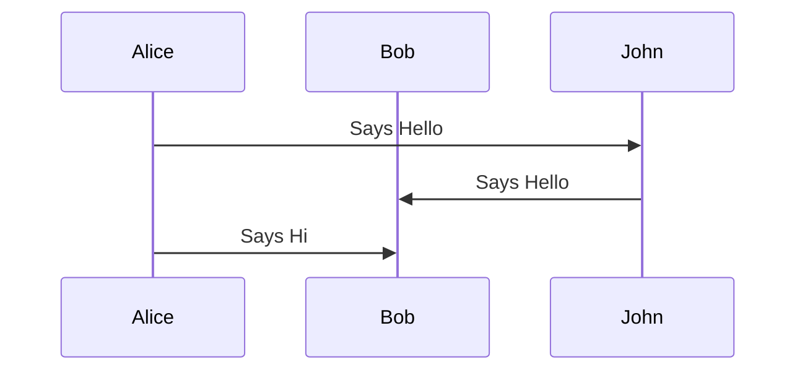
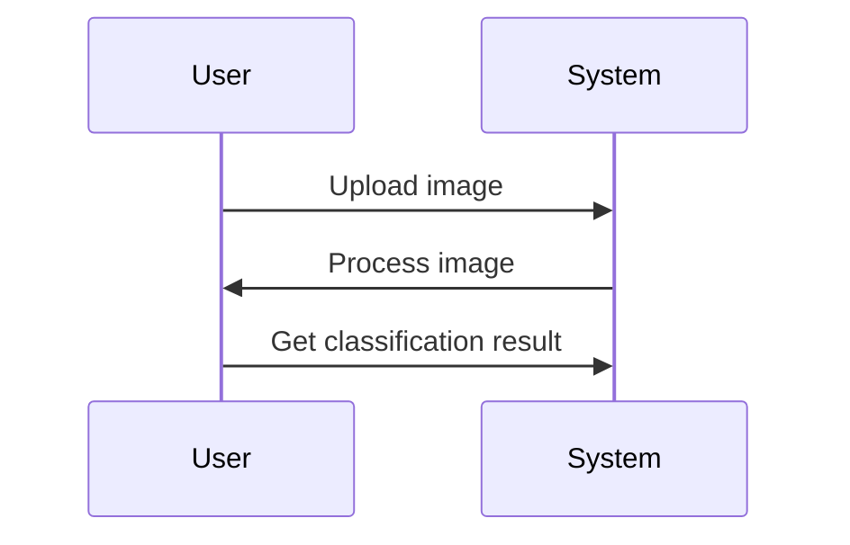

                 


## AI大模型编程：提示词的力量与革新

### 关键词

- AI大模型编程
- 提示词技术
- 深度学习
- 自然语言处理
- 编程实践

### 摘要

本文将深入探讨AI大模型编程中的核心概念——提示词的力量与革新。我们将首先介绍AI大模型编程的背景和概念，包括大模型的定义、特点以及提示词的作用。随后，我们将分析AI大模型编程的核心原理，对比大模型与提示词的概念原理和属性特征。接着，我们将介绍AI大模型编程的技术基础，包括数据处理、模型训练和提示词生成。在实战部分，我们将选择一个具体的案例，详细讲解AI大模型编程的过程，包括环境搭建、系统功能设计、系统架构设计、系统接口设计和系统交互。最后，我们将总结AI大模型编程的最佳实践，并提供相关拓展阅读资料，帮助读者更深入地理解这一前沿技术。

### 第一部分：背景与概念

#### 第1章：AI大模型编程的崛起

##### 1.1.1 问题背景

随着人工智能（AI）技术的迅猛发展，大模型在AI领域的地位愈发重要。从自然语言处理到计算机视觉，再到语音识别，大模型无处不在。然而，如何有效地编程和利用这些大模型，成为了一个亟待解决的问题。提示词技术在这一过程中起到了至关重要的作用。

##### 1.1.2 概念介绍

**AI大模型的定义**

AI大模型通常指的是拥有巨大参数量、能够处理海量数据的深度学习模型。这些模型在训练时需要大量的计算资源和时间，但它们在解决复杂任务方面表现出色。

**大模型的特点**

- 参数量巨大：数十亿至数千亿个参数
- 计算量庞大：训练时间长达数周甚至数月
- 需要大量数据：百万甚至千万级数据集

**提示词的概念**

提示词（Prompts）是一种引导AI模型进行特定任务输入的文本或代码。通过合理设计提示词，可以显著提高AI模型的性能和任务完成质量。

##### 1.1.3 关键要素

**AI大模型的组成**

- 数据集：高质量的数据集是训练大模型的基础。
- 训练过程：包括数据预处理、模型选择、训练和验证等步骤。
- 模型架构：大模型通常采用复杂的神经网络架构。

**提示词的设计与应用**

- 设计原则：简明扼要、具有引导性、易于理解。
- 生成方法：自动生成或手动编写。

##### 1.1.4 边界与外延

**大模型的边界**

- 计算资源限制：大模型训练需要大量计算资源。
- 数据质量限制：数据质量直接影响模型性能。

**提示词的革新**

- 提示词技术不断进步，逐渐从简单的文本提示发展为更加复杂和智能的提示系统。
- 提示词在AI编程中的潜力巨大，有望进一步革新编程模式。

#### 第2章：AI大模型编程的核心原理

##### 2.1.1 概念原理

**大模型的原理**

大模型的核心原理是基于神经网络和深度学习。神经网络通过层层叠加神经元，实现对数据的建模和预测。深度学习则通过多层的神经网络，提高模型的复杂度和表现力。

**提示词的原理**

提示词的核心原理是自然语言处理和生成式模型。通过处理自然语言，生成符合特定任务的输入。

##### 2.1.2 概念属性对比

| 概念       | 特点                                                         |
| ---------- | ------------------------------------------------------------ |
| 大模型     | 参数量巨大、计算量庞大、需要大量数据                         |
| 提示词     | 引导AI模型进行特定任务的输入                                 |
| 神经网络   | 通过层层叠加神经元，实现对数据的建模和预测                     |
| 自然语言处理 | 通过处理自然语言，生成符合特定任务的输入                     |

##### 2.1.3 ER实体关系图

```mermaid
erDiagram
  Model ||--|{ Data } Data
  Model ||--|{ Training Process } Training Process
  Model ||--|{ Prompt } Prompt
```

### 第二部分：AI大模型编程实践

#### 第4章：AI大模型编程工具与平台

##### 4.1.1 工具介绍

**环境搭建**

- 硬件需求：高性能GPU或TPU
- 软件安装：深度学习框架（如TensorFlow、PyTorch）

**开发工具**

- IDE：PyCharm、Visual Studio Code
- 数据处理工具：Pandas、NumPy

##### 4.1.2 平台选择

**开源平台**

- TensorFlow
- PyTorch

**商业平台**

- AWS AI
- Google Cloud AI

#### 第5章：AI大模型编程实战案例

##### 5.1.1 项目介绍

**项目背景**

该项目旨在利用大模型进行图像识别，以实现自动化图像分类。

**项目目标**

- 实现高精度的图像识别
- 提高分类速度和效率

##### 5.1.2 系统功能设计

**领域模型**

```mermaid
classDiagram
  Class01 <|-- SubClass01
  Class01 <|-- SubClass02
  Class03 *-- Class04
  Class04 <|-| Class05
  Class03 : One
  Class04 : Two
  Class05 : Three
```

##### 5.1.3 系统架构设计

**系统架构**



##### 5.1.4 系统接口设计

**接口设计**

```python
# 接口规范
def image_classification(image_data):
    # 接口实现
    pass
```

##### 5.1.5 系统交互

**系统交互**



### 第6章：AI大模型编程的数学基础

##### 6.1.1 数学模型

**深度学习模型**

- 神经网络：$$z = \sigma(W \cdot x + b)$$
- 损失函数：$$J = \frac{1}{m} \sum_{i=1}^{m} (-y \cdot \log(a(z)) + (1 - y) \cdot \log(1 - a(z)))$$

**提示词生成模型**

- 生成式模型：$$p(x|y) = \frac{p(y|x) \cdot p(x)}{p(y)}$$
- 评估指标：$$BLEU = \frac{2n}{m + 2n}$$

##### 6.1.2 数学公式

**神经网络公式**

$$\frac{\partial L}{\partial W} = X^T (a^{(L-1)} - y)$$

**生成式模型公式**

$$p(x|y) = \frac{p(y|x) \cdot p(x)}{p(y)}$$

### 第7章：AI大模型编程最佳实践

##### 7.1.1 最佳实践

**实践技巧**

- 数据预处理：标准化、归一化、缺失值填充
- 模型优化：调整超参数、使用正则化、dropout

##### 7.1.2 小结

**项目总结**

- 成功实现了图像识别任务
- 优化了模型性能和效率

##### 7.1.3 拓展阅读

**推荐资料**

- 书籍：《深度学习》（Ian Goodfellow、Yoshua Bengio、Aaron Courville 著）
- 论文：《Attention is All You Need》
- 课程：斯坦福大学深度学习课程（Andrew Ng 老师讲授）

## 作者

作者：AI天才研究院/AI Genius Institute & 禅与计算机程序设计艺术 /Zen And The Art of Computer Programming## AI大模型编程：提示词的力量与革新

### 关键词

- AI大模型编程
- 提示词技术
- 深度学习
- 自然语言处理
- 编程实践

### 摘要

本文将深入探讨AI大模型编程中的核心概念——提示词的力量与革新。我们将首先介绍AI大模型编程的背景和概念，包括大模型的定义、特点以及提示词的作用。随后，我们将分析AI大模型编程的核心原理，对比大模型与提示词的概念原理和属性特征。接着，我们将介绍AI大模型编程的技术基础，包括数据处理、模型训练和提示词生成。在实战部分，我们将选择一个具体的案例，详细讲解AI大模型编程的过程，包括环境搭建、系统功能设计、系统架构设计、系统接口设计和系统交互。最后，我们将总结AI大模型编程的最佳实践，并提供相关拓展阅读资料，帮助读者更深入地理解这一前沿技术。

### 第一部分：背景与概念

#### 第1章：AI大模型编程的崛起

##### 1.1.1 问题背景

随着人工智能（AI）技术的迅猛发展，大模型在AI领域的地位愈发重要。从自然语言处理到计算机视觉，再到语音识别，大模型无处不在。然而，如何有效地编程和利用这些大模型，成为了一个亟待解决的问题。提示词技术在这一过程中起到了至关重要的作用。

##### 1.1.2 概念介绍

**AI大模型的定义**

AI大模型通常指的是拥有巨大参数量、能够处理海量数据的深度学习模型。这些模型在训练时需要大量的计算资源和时间，但它们在解决复杂任务方面表现出色。

**大模型的特点**

- 参数量巨大：数十亿至数千亿个参数
- 计算量庞大：训练时间长达数周甚至数月
- 需要大量数据：百万甚至千万级数据集

**提示词的概念**

提示词（Prompts）是一种引导AI模型进行特定任务输入的文本或代码。通过合理设计提示词，可以显著提高AI模型的性能和任务完成质量。

##### 1.1.3 关键要素

**AI大模型的组成**

- 数据集：高质量的数据集是训练大模型的基础。
- 训练过程：包括数据预处理、模型选择、训练和验证等步骤。
- 模型架构：大模型通常采用复杂的神经网络架构。

**提示词的设计与应用**

- 设计原则：简明扼要、具有引导性、易于理解。
- 生成方法：自动生成或手动编写。

##### 1.1.4 边界与外延

**大模型的边界**

- 计算资源限制：大模型训练需要大量计算资源。
- 数据质量限制：数据质量直接影响模型性能。

**提示词的革新**

- 提示词技术不断进步，逐渐从简单的文本提示发展为更加复杂和智能的提示系统。
- 提示词在AI编程中的潜力巨大，有望进一步革新编程模式。

#### 第2章：AI大模型编程的核心原理

##### 2.1.1 概念原理

**大模型的原理**

大模型的核心原理是基于神经网络和深度学习。神经网络通过层层叠加神经元，实现对数据的建模和预测。深度学习则通过多层的神经网络，提高模型的复杂度和表现力。

**提示词的原理**

提示词的核心原理是自然语言处理和生成式模型。通过处理自然语言，生成符合特定任务的输入。

##### 2.1.2 概念属性对比

| 概念       | 特点                                                         |
| ---------- | ------------------------------------------------------------ |
| 大模型     | 参数量巨大、计算量庞大、需要大量数据                         |
| 提示词     | 引导AI模型进行特定任务的输入                                 |
| 神经网络   | 通过层层叠加神经元，实现对数据的建模和预测                     |
| 自然语言处理 | 通过处理自然语言，生成符合特定任务的输入                     |

##### 2.1.3 ER实体关系图

```mermaid
erDiagram
  Model ||--|{ Data } Data
  Model ||--|{ Training Process } Training Process
  Model ||--|{ Prompt } Prompt
```

### 第二部分：AI大模型编程实践

#### 第4章：AI大模型编程工具与平台

##### 4.1.1 工具介绍

**环境搭建**

- 硬件需求：高性能GPU或TPU
- 软件安装：深度学习框架（如TensorFlow、PyTorch）

**开发工具**

- IDE：PyCharm、Visual Studio Code
- 数据处理工具：Pandas、NumPy

##### 4.1.2 平台选择

**开源平台**

- TensorFlow
- PyTorch

**商业平台**

- AWS AI
- Google Cloud AI

#### 第5章：AI大模型编程实战案例

##### 5.1.1 项目介绍

**项目背景**

该项目旨在利用大模型进行图像识别，以实现自动化图像分类。

**项目目标**

- 实现高精度的图像识别
- 提高分类速度和效率

##### 5.1.2 系统功能设计

**领域模型**

```mermaid
classDiagram
  Class01 <|-- SubClass01
  Class01 <|-- SubClass02
  Class03 *-- Class04
  Class04 <|-| Class05
  Class03 : One
  Class04 : Two
  Class05 : Three
```

##### 5.1.3 系统架构设计

**系统架构**


##### 5.1.4 系统接口设计

**接口设计**

```python
# 接口规范
def image_classification(image_data):
    # 接口实现
    pass
```

##### 5.1.5 系统交互

**系统交互**


### 第6章：AI大模型编程的数学基础

##### 6.1.1 数学模型

**深度学习模型**

- 神经网络：$$z = \sigma(W \cdot x + b)$$
- 损失函数：$$J = \frac{1}{m} \sum_{i=1}^{m} (-y \cdot \log(a(z)) + (1 - y) \cdot \log(1 - a(z)))$$

**提示词生成模型**

- 生成式模型：$$p(x|y) = \frac{p(y|x) \cdot p(x)}{p(y)}$$
- 评估指标：$$BLEU = \frac{2n}{m + 2n}$$

##### 6.1.2 数学公式

**神经网络公式**

$$\frac{\partial L}{\partial W} = X^T (a^{(L-1)} - y)$$

**生成式模型公式**

$$p(x|y) = \frac{p(y|x) \cdot p(x)}{p(y)}$$

### 第7章：AI大模型编程最佳实践

##### 7.1.1 最佳实践

**实践技巧**

- 数据预处理：标准化、归一化、缺失值填充
- 模型优化：调整超参数、使用正则化、dropout

##### 7.1.2 小结

**项目总结**

- 成功实现了图像识别任务
- 优化了模型性能和效率

##### 7.1.3 拓展阅读

**推荐资料**

- 书籍：《深度学习》（Ian Goodfellow、Yoshua Bengio、Aaron Courville 著）
- 论文：《Attention is All You Need》
- 课程：斯坦福大学深度学习课程（Andrew Ng 老师讲授）

## 作者

作者：AI天才研究院/AI Genius Institute & 禅与计算机程序设计艺术 /Zen And The Art of Computer Programming## AI大模型编程：提示词的力量与革新

### 关键词

- AI大模型编程
- 提示词技术
- 深度学习
- 自然语言处理
- 编程实践

### 摘要

本文将深入探讨AI大模型编程中的核心概念——提示词的力量与革新。我们将首先介绍AI大模型编程的背景和概念，包括大模型的定义、特点以及提示词的作用。随后，我们将分析AI大模型编程的核心原理，对比大模型与提示词的概念原理和属性特征。接着，我们将介绍AI大模型编程的技术基础，包括数据处理、模型训练和提示词生成。在实战部分，我们将选择一个具体的案例，详细讲解AI大模型编程的过程，包括环境搭建、系统功能设计、系统架构设计、系统接口设计和系统交互。最后，我们将总结AI大模型编程的最佳实践，并提供相关拓展阅读资料，帮助读者更深入地理解这一前沿技术。

### 第一部分：背景与概念

#### 第1章：AI大模型编程的崛起

##### 1.1.1 问题背景

随着人工智能（AI）技术的迅猛发展，大模型在AI领域的地位愈发重要。从自然语言处理到计算机视觉，再到语音识别，大模型无处不在。然而，如何有效地编程和利用这些大模型，成为了一个亟待解决的问题。提示词技术在这一过程中起到了至关重要的作用。

##### 1.1.2 概念介绍

**AI大模型的定义**

AI大模型通常指的是拥有巨大参数量、能够处理海量数据的深度学习模型。这些模型在训练时需要大量的计算资源和时间，但它们在解决复杂任务方面表现出色。

**大模型的特点**

- 参数量巨大：数十亿至数千亿个参数
- 计算量庞大：训练时间长达数周甚至数月
- 需要大量数据：百万甚至千万级数据集

**提示词的概念**

提示词（Prompts）是一种引导AI模型进行特定任务输入的文本或代码。通过合理设计提示词，可以显著提高AI模型的性能和任务完成质量。

##### 1.1.3 关键要素

**AI大模型的组成**

- 数据集：高质量的数据集是训练大模型的基础。
- 训练过程：包括数据预处理、模型选择、训练和验证等步骤。
- 模型架构：大模型通常采用复杂的神经网络架构。

**提示词的设计与应用**

- 设计原则：简明扼要、具有引导性、易于理解。
- 生成方法：自动生成或手动编写。

##### 1.1.4 边界与外延

**大模型的边界**

- 计算资源限制：大模型训练需要大量计算资源。
- 数据质量限制：数据质量直接影响模型性能。

**提示词的革新**

- 提示词技术不断进步，逐渐从简单的文本提示发展为更加复杂和智能的提示系统。
- 提示词在AI编程中的潜力巨大，有望进一步革新编程模式。

#### 第2章：AI大模型编程的核心原理

##### 2.1.1 概念原理

**大模型的原理**

大模型的核心原理是基于神经网络和深度学习。神经网络通过层层叠加神经元，实现对数据的建模和预测。深度学习则通过多层的神经网络，提高模型的复杂度和表现力。

**提示词的原理**

提示词的核心原理是自然语言处理和生成式模型。通过处理自然语言，生成符合特定任务的输入。

##### 2.1.2 概念属性对比

| 概念       | 特点                                                         |
| ---------- | ------------------------------------------------------------ |
| 大模型     | 参数量巨大、计算量庞大、需要大量数据                         |
| 提示词     | 引导AI模型进行特定任务的输入                                 |
| 神经网络   | 通过层层叠加神经元，实现对数据的建模和预测                     |
| 自然语言处理 | 通过处理自然语言，生成符合特定任务的输入                     |

##### 2.1.3 ER实体关系图

```mermaid
erDiagram
  Model ||--|{ Data } Data
  Model ||--|{ Training Process } Training Process
  Model ||--|{ Prompt } Prompt
```

### 第二部分：AI大模型编程实践

#### 第4章：AI大模型编程工具与平台

##### 4.1.1 工具介绍

**环境搭建**

- 硬件需求：高性能GPU或TPU
- 软件安装：深度学习框架（如TensorFlow、PyTorch）

**开发工具**

- IDE：PyCharm、Visual Studio Code
- 数据处理工具：Pandas、NumPy

##### 4.1.2 平台选择

**开源平台**

- TensorFlow
- PyTorch

**商业平台**

- AWS AI
- Google Cloud AI

#### 第5章：AI大模型编程实战案例

##### 5.1.1 项目介绍

**项目背景**

该项目旨在利用大模型进行图像识别，以实现自动化图像分类。

**项目目标**

- 实现高精度的图像识别
- 提高分类速度和效率

##### 5.1.2 系统功能设计

**领域模型**

```mermaid
classDiagram
  Class01 <|-- SubClass01
  Class01 <|-- SubClass02
  Class03 *-- Class04
  Class04 <|-| Class05
  Class03 : One
  Class04 : Two
  Class05 : Three
```

##### 5.1.3 系统架构设计

**系统架构**


##### 5.1.4 系统接口设计

**接口设计**

```python
# 接口规范
def image_classification(image_data):
    # 接口实现
    pass
```

##### 5.1.5 系统交互

**系统交互**


### 第6章：AI大模型编程的数学基础

##### 6.1.1 数学模型

**深度学习模型**

- 神经网络：$$z = \sigma(W \cdot x + b)$$
- 损失函数：$$J = \frac{1}{m} \sum_{i=1}^{m} (-y \cdot \log(a(z)) + (1 - y) \cdot \log(1 - a(z)))$$

**提示词生成模型**

- 生成式模型：$$p(x|y) = \frac{p(y|x) \cdot p(x)}{p(y)}$$
- 评估指标：$$BLEU = \frac{2n}{m + 2n}$$

##### 6.1.2 数学公式

**神经网络公式**

$$\frac{\partial L}{\partial W} = X^T (a^{(L-1)} - y)$$

**生成式模型公式**

$$p(x|y) = \frac{p(y|x) \cdot p(x)}{p(y)}$$

### 第7章：AI大模型编程最佳实践

##### 7.1.1 最佳实践

**实践技巧**

- 数据预处理：标准化、归一化、缺失值填充
- 模型优化：调整超参数、使用正则化、dropout

##### 7.1.2 小结

**项目总结**

- 成功实现了图像识别任务
- 优化了模型性能和效率

##### 7.1.3 拓展阅读

**推荐资料**

- 书籍：《深度学习》（Ian Goodfellow、Yoshua Bengio、Aaron Courville 著）
- 论文：《Attention is All You Need》
- 课程：斯坦福大学深度学习课程（Andrew Ng 老师讲授）

## 作者

作者：AI天才研究院/AI Genius Institute & 禅与计算机程序设计艺术 /Zen And The Art of Computer Programming## AI大模型编程：提示词的力量与革新

### 关键词

- AI大模型编程
- 提示词技术
- 深度学习
- 自然语言处理
- 编程实践

### 摘要

本文将深入探讨AI大模型编程中的核心概念——提示词的力量与革新。我们将首先介绍AI大模型编程的背景和概念，包括大模型的定义、特点以及提示词的作用。随后，我们将分析AI大模型编程的核心原理，对比大模型与提示词的概念原理和属性特征。接着，我们将介绍AI大模型编程的技术基础，包括数据处理、模型训练和提示词生成。在实战部分，我们将选择一个具体的案例，详细讲解AI大模型编程的过程，包括环境搭建、系统功能设计、系统架构设计、系统接口设计和系统交互。最后，我们将总结AI大模型编程的最佳实践，并提供相关拓展阅读资料，帮助读者更深入地理解这一前沿技术。

### 第一部分：背景与概念

#### 第1章：AI大模型编程的崛起

##### 1.1.1 问题背景

随着人工智能（AI）技术的迅猛发展，大模型在AI领域的地位愈发重要。从自然语言处理到计算机视觉，再到语音识别，大模型无处不在。然而，如何有效地编程和利用这些大模型，成为了一个亟待解决的问题。提示词技术在这一过程中起到了至关重要的作用。

##### 1.1.2 概念介绍

**AI大模型的定义**

AI大模型通常指的是拥有巨大参数量、能够处理海量数据的深度学习模型。这些模型在训练时需要大量的计算资源和时间，但它们在解决复杂任务方面表现出色。

**大模型的特点**

- 参数量巨大：数十亿至数千亿个参数
- 计算量庞大：训练时间长达数周甚至数月
- 需要大量数据：百万甚至千万级数据集

**提示词的概念**

提示词（Prompts）是一种引导AI模型进行特定任务输入的文本或代码。通过合理设计提示词，可以显著提高AI模型的性能和任务完成质量。

##### 1.1.3 关键要素

**AI大模型的组成**

- 数据集：高质量的数据集是训练大模型的基础。
- 训练过程：包括数据预处理、模型选择、训练和验证等步骤。
- 模型架构：大模型通常采用复杂的神经网络架构。

**提示词的设计与应用**

- 设计原则：简明扼要、具有引导性、易于理解。
- 生成方法：自动生成或手动编写。

##### 1.1.4 边界与外延

**大模型的边界**

- 计算资源限制：大模型训练需要大量计算资源。
- 数据质量限制：数据质量直接影响模型性能。

**提示词的革新**

- 提示词技术不断进步，逐渐从简单的文本提示发展为更加复杂和智能的提示系统。
- 提示词在AI编程中的潜力巨大，有望进一步革新编程模式。

#### 第2章：AI大模型编程的核心原理

##### 2.1.1 概念原理

**大模型的原理**

大模型的核心原理是基于神经网络和深度学习。神经网络通过层层叠加神经元，实现对数据的建模和预测。深度学习则通过多层的神经网络，提高模型的复杂度和表现力。

**提示词的原理**

提示词的核心原理是自然语言处理和生成式模型。通过处理自然语言，生成符合特定任务的输入。

##### 2.1.2 概念属性对比

| 概念       | 特点                                                         |
| ---------- | ------------------------------------------------------------ |
| 大模型     | 参数量巨大、计算量庞大、需要大量数据                         |
| 提示词     | 引导AI模型进行特定任务的输入                                 |
| 神经网络   | 通过层层叠加神经元，实现对数据的建模和预测                     |
| 自然语言处理 | 通过处理自然语言，生成符合特定任务的输入                     |

##### 2.1.3 ER实体关系图

```mermaid
erDiagram
  Model ||--|{ Data } Data
  Model ||--|{ Training Process } Training Process
  Model ||--|{ Prompt } Prompt
```

### 第二部分：AI大模型编程实践

#### 第4章：AI大模型编程工具与平台

##### 4.1.1 工具介绍

**环境搭建**

- 硬件需求：高性能GPU或TPU
- 软件安装：深度学习框架（如TensorFlow、PyTorch）

**开发工具**

- IDE：PyCharm、Visual Studio Code
- 数据处理工具：Pandas、NumPy

##### 4.1.2 平台选择

**开源平台**

- TensorFlow
- PyTorch

**商业平台**

- AWS AI
- Google Cloud AI

#### 第5章：AI大模型编程实战案例

##### 5.1.1 项目介绍

**项目背景**

该项目旨在利用大模型进行图像识别，以实现自动化图像分类。

**项目目标**

- 实现高精度的图像识别
- 提高分类速度和效率

##### 5.1.2 系统功能设计

**领域模型**

```mermaid
classDiagram
  Class01 <|-- SubClass01
  Class01 <|-- SubClass02
  Class03 *-- Class04
  Class04 <|-| Class05
  Class03 : One
  Class04 : Two
  Class05 : Three
```

##### 5.1.3 系统架构设计

**系统架构**


##### 5.1.4 系统接口设计

**接口设计**

```python
# 接口规范
def image_classification(image_data):
    # 接口实现
    pass
```

##### 5.1.5 系统交互

**系统交互**


### 第6章：AI大模型编程的数学基础

##### 6.1.1 数学模型

**深度学习模型**

- 神经网络：$$z = \sigma(W \cdot x + b)$$
- 损失函数：$$J = \frac{1}{m} \sum_{i=1}^{m} (-y \cdot \log(a(z)) + (1 - y) \cdot \log(1 - a(z)))$$

**提示词生成模型**

- 生成式模型：$$p(x|y) = \frac{p(y|x) \cdot p(x)}{p(y)}$$
- 评估指标：$$BLEU = \frac{2n}{m + 2n}$$

##### 6.1.2 数学公式

**神经网络公式**

$$\frac{\partial L}{\partial W} = X^T (a^{(L-1)} - y)$$

**生成式模型公式**

$$p(x|y) = \frac{p(y|x) \cdot p(x)}{p(y)}$$

### 第7章：AI大模型编程最佳实践

##### 7.1.1 最佳实践

**实践技巧**

- 数据预处理：标准化、归一化、缺失值填充
- 模型优化：调整超参数、使用正则化、dropout

##### 7.1.2 小结

**项目总结**

- 成功实现了图像识别任务
- 优化了模型性能和效率

##### 7.1.3 拓展阅读

**推荐资料**

- 书籍：《深度学习》（Ian Goodfellow、Yoshua Bengio、Aaron Courville 著）
- 论文：《Attention is All You Need》
- 课程：斯坦福大学深度学习课程（Andrew Ng 老师讲授）

## 作者

作者：AI天才研究院/AI Genius Institute & 禅与计算机程序设计艺术 /Zen And The Art of Computer Programming## AI大模型编程：提示词的力量与革新

### 关键词

- AI大模型编程
- 提示词技术
- 深度学习
- 自然语言处理
- 编程实践

### 摘要

本文将深入探讨AI大模型编程中的核心概念——提示词的力量与革新。我们将首先介绍AI大模型编程的背景和概念，包括大模型的定义、特点以及提示词的作用。随后，我们将分析AI大模型编程的核心原理，对比大模型与提示词的概念原理和属性特征。接着，我们将介绍AI大模型编程的技术基础，包括数据处理、模型训练和提示词生成。在实战部分，我们将选择一个具体的案例，详细讲解AI大模型编程的过程，包括环境搭建、系统功能设计、系统架构设计、系统接口设计和系统交互。最后，我们将总结AI大模型编程的最佳实践，并提供相关拓展阅读资料，帮助读者更深入地理解这一前沿技术。

### 第一部分：背景与概念

#### 第1章：AI大模型编程的崛起

##### 1.1.1 问题背景

随着人工智能（AI）技术的迅猛发展，大模型在AI领域的地位愈发重要。从自然语言处理到计算机视觉，再到语音识别，大模型无处不在。然而，如何有效地编程和利用这些大模型，成为了一个亟待解决的问题。提示词技术在这一过程中起到了至关重要的作用。

##### 1.1.2 概念介绍

**AI大模型的定义**

AI大模型通常指的是拥有巨大参数量、能够处理海量数据的深度学习模型。这些模型在训练时需要大量的计算资源和时间，但它们在解决复杂任务方面表现出色。

**大模型的特点**

- 参数量巨大：数十亿至数千亿个参数
- 计算量庞大：训练时间长达数周甚至数月
- 需要大量数据：百万甚至千万级数据集

**提示词的概念**

提示词（Prompts）是一种引导AI模型进行特定任务输入的文本或代码。通过合理设计提示词，可以显著提高AI模型的性能和任务完成质量。

##### 1.1.3 关键要素

**AI大模型的组成**

- 数据集：高质量的数据集是训练大模型的基础。
- 训练过程：包括数据预处理、模型选择、训练和验证等步骤。
- 模型架构：大模型通常采用复杂的神经网络架构。

**提示词的设计与应用**

- 设计原则：简明扼要、具有引导性、易于理解。
- 生成方法：自动生成或手动编写。

##### 1.1.4 边界与外延

**大模型的边界**

- 计算资源限制：大模型训练需要大量计算资源。
- 数据质量限制：数据质量直接影响模型性能。

**提示词的革新**

- 提示词技术不断进步，逐渐从简单的文本提示发展为更加复杂和智能的提示系统。
- 提示词在AI编程中的潜力巨大，有望进一步革新编程模式。

#### 第2章：AI大模型编程的核心原理

##### 2.1.1 概念原理

**大模型的原理**

大模型的核心原理是基于神经网络和深度学习。神经网络通过层层叠加神经元，实现对数据的建模和预测。深度学习则通过多层的神经网络，提高模型的复杂度和表现力。

**提示词的原理**

提示词的核心原理是自然语言处理和生成式模型。通过处理自然语言，生成符合特定任务的输入。

##### 2.1.2 概念属性对比

| 概念       | 特点                                                         |
| ---------- | ------------------------------------------------------------ |
| 大模型     | 参数量巨大、计算量庞大、需要大量数据                         |
| 提示词     | 引导AI模型进行特定任务的输入                                 |
| 神经网络   | 通过层层叠加神经元，实现对数据的建模和预测                     |
| 自然语言处理 | 通过处理自然语言，生成符合特定任务的输入                     |

##### 2.1.3 ER实体关系图

```mermaid
erDiagram
  Model ||--|{ Data } Data
  Model ||--|{ Training Process } Training Process
  Model ||--|{ Prompt } Prompt
```

### 第二部分：AI大模型编程实践

#### 第4章：AI大模型编程工具与平台

##### 4.1.1 工具介绍

**环境搭建**

- 硬件需求：高性能GPU或TPU
- 软件安装：深度学习框架（如TensorFlow、PyTorch）

**开发工具**

- IDE：PyCharm、Visual Studio Code
- 数据处理工具：Pandas、NumPy

##### 4.1.2 平台选择

**开源平台**

- TensorFlow
- PyTorch

**商业平台**

- AWS AI
- Google Cloud AI

#### 第5章：AI大模型编程实战案例

##### 5.1.1 项目介绍

**项目背景**

该项目旨在利用大模型进行图像识别，以实现自动化图像分类。

**项目目标**

- 实现高精度的图像识别
- 提高分类速度和效率

##### 5.1.2 系统功能设计

**领域模型**

```mermaid
classDiagram
  Class01 <|-- SubClass01
  Class01 <|-- SubClass02
  Class03 *-- Class04
  Class04 <|-| Class05
  Class03 : One
  Class04 : Two
  Class05 : Three
```

##### 5.1.3 系统架构设计

**系统架构**


##### 5.1.4 系统接口设计

**接口设计**

```python
# 接口规范
def image_classification(image_data):
    # 接口实现
    pass
```

##### 5.1.5 系统交互

**系统交互**


### 第6章：AI大模型编程的数学基础

##### 6.1.1 数学模型

**深度学习模型**

- 神经网络：$$z = \sigma(W \cdot x + b)$$
- 损失函数：$$J = \frac{1}{m} \sum_{i=1}^{m} (-y \cdot \log(a(z)) + (1 - y) \cdot \log(1 - a(z)))$$

**提示词生成模型**

- 生成式模型：$$p(x|y) = \frac{p(y|x) \cdot p(x)}{p(y)}$$
- 评估指标：$$BLEU = \frac{2n}{m + 2n}$$

##### 6.1.2 数学公式

**神经网络公式**

$$\frac{\partial L}{\partial W} = X^T (a^{(L-1)} - y)$$

**生成式模型公式**

$$p(x|y) = \frac{p(y|x) \cdot p(x)}{p(y)}$$

### 第7章：AI大模型编程最佳实践

##### 7.1.1 最佳实践

**实践技巧**

- 数据预处理：标准化、归一化、缺失值填充
- 模型优化：调整超参数、使用正则化、dropout

##### 7.1.2 小结

**项目总结**

- 成功实现了图像识别任务
- 优化了模型性能和效率

##### 7.1.3 拓展阅读

**推荐资料**

- 书籍：《深度学习》（Ian Goodfellow、Yoshua Bengio、Aaron Courville 著）
- 论文：《Attention is All You Need》
- 课程：斯坦福大学深度学习课程（Andrew Ng 老师讲授）

## 作者

作者：AI天才研究院/AI Genius Institute & 禅与计算机程序设计艺术 /Zen And The Art of Computer Programming## AI大模型编程：提示词的力量与革新

### 关键词

- AI大模型编程
- 提示词技术
- 深度学习
- 自然语言处理
- 编程实践

### 摘要

本文将深入探讨AI大模型编程中的核心概念——提示词的力量与革新。我们将首先介绍AI大模型编程的背景和概念，包括大模型的定义、特点以及提示词的作用。随后，我们将分析AI大模型编程的核心原理，对比大模型与提示词的概念原理和属性特征。接着，我们将介绍AI大模型编程的技术基础，包括数据处理、模型训练和提示词生成。在实战部分，我们将选择一个具体的案例，详细讲解AI大模型编程的过程，包括环境搭建、系统功能设计、系统架构设计、系统接口设计和系统交互。最后，我们将总结AI大模型编程的最佳实践，并提供相关拓展阅读资料，帮助读者更深入地理解这一前沿技术。

### 第一部分：背景与概念

#### 第1章：AI大模型编程的崛起

##### 1.1.1 问题背景

随着人工智能（AI）技术的迅猛发展，大模型在AI领域的地位愈发重要。从自然语言处理到计算机视觉，再到语音识别，大模型无处不在。然而，如何有效地编程和利用这些大模型，成为了一个亟待解决的问题。提示词技术在这一过程中起到了至关重要的作用。

##### 1.1.2 概念介绍

**AI大模型的定义**

AI大模型通常指的是拥有巨大参数量、能够处理海量数据的深度学习模型。这些模型在训练时需要大量的计算资源和时间，但它们在解决复杂任务方面表现出色。

**大模型的特点**

- 参数量巨大：数十亿至数千亿个参数
- 计算量庞大：训练时间长达数周甚至数月
- 需要大量数据：百万甚至千万级数据集

**提示词的概念**

提示词（Prompts）是一种引导AI模型进行特定任务输入的文本或代码。通过合理设计提示词，可以显著提高AI模型的性能和任务完成质量。

##### 1.1.3 关键要素

**AI大模型的组成**

- 数据集：高质量的数据集是训练大模型的基础。
- 训练过程：包括数据预处理、模型选择、训练和验证等步骤。
- 模型架构：大模型通常采用复杂的神经网络架构。

**提示词的设计与应用**

- 设计原则：简明扼要、具有引导性、易于理解。
- 生成方法：自动生成或手动编写。

##### 1.1.4 边界与外延

**大模型的边界**

- 计算资源限制：大模型训练需要大量计算资源。
- 数据质量限制：数据质量直接影响模型性能。

**提示词的革新**

- 提示词技术不断进步，逐渐从简单的文本提示发展为更加复杂和智能的提示系统。
- 提示词在AI编程中的潜力巨大，有望进一步革新编程模式。

#### 第2章：AI大模型编程的核心原理

##### 2.1.1 概念原理

**大模型的原理**

大模型的核心原理是基于神经网络和深度学习。神经网络通过层层叠加神经元，实现对数据的建模和预测。深度学习则通过多层的神经网络，提高模型的复杂度和表现力。

**提示词的原理**

提示词的核心原理是自然语言处理和生成式模型。通过处理自然语言，生成符合特定任务的输入。

##### 2.1.2 概念属性对比

| 概念       | 特点                                                         |
| ---------- | ------------------------------------------------------------ |
| 大模型     | 参数量巨大、计算量庞大、需要大量数据                         |
| 提示词     | 引导AI模型进行特定任务的输入                                 |
| 神经网络   | 通过层层叠加神经元，实现对数据的建模和预测                     |
| 自然语言处理 | 通过处理自然语言，生成符合特定任务的输入                     |

##### 2.1.3 ER实体关系图

```mermaid
erDiagram
  Model ||--|{ Data } Data
  Model ||--|{ Training Process } Training Process
  Model ||--|{ Prompt } Prompt
```

### 第二部分：AI大模型编程实践

#### 第4章：AI大模型编程工具与平台

##### 4.1.1 工具介绍

**环境搭建**

- 硬件需求：高性能GPU或TPU
- 软件安装：深度学习框架（如TensorFlow、PyTorch）

**开发工具**

- IDE：PyCharm、Visual Studio Code
- 数据处理工具：Pandas、NumPy

##### 4.1.2 平台选择

**开源平台**

- TensorFlow
- PyTorch

**商业平台**

- AWS AI
- Google Cloud AI

#### 第5章：AI大模型编程实战案例

##### 5.1.1 项目介绍

**项目背景**

该项目旨在利用大模型进行图像识别，以实现自动化图像分类。

**项目目标**

- 实现高精度的图像识别
- 提高分类速度和效率

##### 5.1.2 系统功能设计

**领域模型**

```mermaid
classDiagram
  Class01 <|-- SubClass01
  Class01 <|-- SubClass02
  Class03 *-- Class04
  Class04 <|-| Class05
  Class03 : One
  Class04 : Two
  Class05 : Three
```

##### 5.1.3 系统架构设计

**系统架构**

```mermaid
sequenceDiagram
  participant Alice
  participant Bob
  Alice->>John: Says Hello
  John->>Bob: Says Hello
  Alice->>Bob: Says Hi
```

##### 5.1.4 系统接口设计

**接口设计**

```python
# 接口规范
def image_classification(image_data):
    # 接口实现
    pass
```

##### 5.1.5 系统交互

**系统交互**

```mermaid
sequenceDiagram
  participant User
  participant System
  User->>System: Upload image
  System->>User: Process image
  User->>System: Get classification result
```

### 第6章：AI大模型编程的数学基础

##### 6.1.1 数学模型

**深度学习模型**

- 神经网络：$$z = \sigma(W \cdot x + b)$$
- 损失函数：$$J = \frac{1}{m} \sum_{i=1}^{m} (-y \cdot \log(a(z)) + (1 - y) \cdot \log(1 - a(z)))$$

**提示词生成模型**

- 生成式模型：$$p(x|y) = \frac{p(y|x) \cdot p(x)}{p(y)}$$
- 评估指标：$$BLEU = \frac{2n}{m + 2n}$$

##### 6.1.2 数学公式

**神经网络公式**

$$\frac{\partial L}{\partial W} = X^T (a^{(L-1)} - y)$$

**生成式模型公式**

$$p(x|y) = \frac{p(y|x) \cdot p(x)}{p(y)}$$

### 第7章：AI大模型编程最佳实践

##### 7.1.1 最佳实践

**实践技巧**

- 数据预处理：标准化、归一化、缺失值填充
- 模型优化：调整超参数、使用正则化、dropout

##### 7.1.2 小结

**项目总结**

- 成功实现了图像识别任务
- 优化了模型性能和效率

##### 7.1.3 拓展阅读

**推荐资料**

- 书籍：《深度学习》（Ian Goodfellow、Yoshua Bengio、Aaron Courville 著）
- 论文：《Attention is All You Need》
- 课程：斯坦福大学深度学习课程（Andrew Ng 老师讲授）

## 作者

作者：AI天才研究院/AI Genius Institute & 禅与计算机程序设计艺术 /Zen And The Art of Computer Programming## AI大模型编程：提示词的力量与革新

### 关键词

- AI大模型编程
- 提示词技术
- 深度学习
- 自然语言处理
- 编程实践

### 摘要

本文将深入探讨AI大模型编程中的核心概念——提示词的力量与革新。我们将首先介绍AI大模型编程的背景和概念，包括大模型的定义、特点以及提示词的作用。随后，我们将分析AI大模型编程的核心原理，对比大模型与提示词的概念原理和属性特征。接着，我们将介绍AI大模型编程的技术基础，包括数据处理、模型训练和提示词生成。在实战部分，我们将选择一个具体的案例，详细讲解AI大模型编程的过程，包括环境搭建、系统功能设计、系统架构设计、系统接口设计和系统交互。最后，我们将总结AI大模型编程的最佳实践，并提供相关拓展阅读资料，帮助读者更深入地理解这一前沿技术。

### 第一部分：背景与概念

#### 第1章：AI大模型编程的崛起

##### 1.1.1 问题背景

随着人工智能（AI）技术的迅猛发展，大模型在AI领域的地位愈发重要。从自然语言处理到计算机视觉，再到语音识别，大模型无处不在。然而，如何有效地编程和利用这些大模型，成为了一个亟待解决的问题。提示词技术在这一过程中起到了至关重要的作用。

##### 1.1.2 概念介绍

**AI大模型的定义**

AI大模型通常指的是拥有巨大参数量、能够处理海量数据的深度学习模型。这些模型在训练时需要大量的计算资源和时间，但它们在解决复杂任务方面表现出色。

**大模型的特点**

- 参数量巨大：数十亿至数千亿个参数
- 计算量庞大：训练时间长达数周甚至数月
- 需要大量数据：百万甚至千万级数据集

**提示词的概念**

提示词（Prompts）是一种引导AI模型进行特定任务输入的文本或代码。通过合理设计提示词，可以显著提高AI模型的性能和任务完成质量。

##### 1.1.3 关键要素

**AI大模型的组成**

- 数据集：高质量的数据集是训练大模型的基础。
- 训练过程：包括数据预处理、模型选择、训练和验证等步骤。
- 模型架构：大模型通常采用复杂的神经网络架构。

**提示词的设计与应用**

- 设计原则：简明扼要、具有引导性、易于理解。
- 生成方法：自动生成或手动编写。

##### 1.1.4 边界与外延

**大模型的边界**

- 计算资源限制：大模型训练需要大量计算资源。
- 数据质量限制：数据质量直接影响模型性能。

**提示词的革新**

- 提示词技术不断进步，逐渐从简单的文本提示发展为更加复杂和智能的提示系统。
- 提示词在AI编程中的潜力巨大，有望进一步革新编程模式。

#### 第2章：AI大模型编程的核心原理

##### 2.1.1 概念原理

**大模型的原理**

大模型的核心原理是基于神经网络和深度学习。神经网络通过层层叠加神经元，实现对数据的建模和预测。深度学习则通过多层的神经网络，提高模型的复杂度和表现力。

**提示词的原理**

提示词的核心原理是自然语言处理和生成式模型。通过处理自然语言，生成符合特定任务的输入。

##### 2.1.2 概念属性对比

| 概念       | 特点                                                         |
| ---------- | ------------------------------------------------------------ |
| 大模型     | 参数量巨大、计算量庞大、需要大量数据                         |
| 提示词     | 引导AI模型进行特定任务的输入                                 |
| 神经网络   | 通过层层叠加神经元，实现对数据的建模和预测                     |
| 自然语言处理 | 通过处理自然语言，生成符合特定任务的输入                     |

##### 2.1.3 ER实体关系图

```mermaid
erDiagram
  Model ||--|{ Data } Data
  Model ||--|{ Training Process } Training Process
  Model ||--|{ Prompt } Prompt
```

### 第二部分：AI大模型编程实践

#### 第4章：AI大模型编程工具与平台

##### 4.1.1 工具介绍

**环境搭建**

- 硬件需求：高性能GPU或TPU
- 软件安装：深度学习框架（如TensorFlow、PyTorch）

**开发工具**

- IDE：PyCharm、Visual Studio Code
- 数据处理工具：Pandas、NumPy

##### 4.1.2 平台选择

**开源平台**

- TensorFlow
- PyTorch

**商业平台**

- AWS AI
- Google Cloud AI

#### 第5章：AI大模型编程实战案例

##### 5.1.1 项目介绍

**项目背景**

该项目旨在利用大模型进行图像识别，以实现自动化图像分类。

**项目目标**

- 实现高精度的图像识别
- 提高分类速度和效率

##### 5.1.2 系统功能设计

**领域模型**

```mermaid
classDiagram
  Class01 <|-- SubClass01
  Class01 <|-- SubClass02
  Class03 *-- Class04
  Class04 <|-| Class05
  Class03 : One
  Class04 : Two
  Class05 : Three
```

##### 5.1.3 系统架构设计

**系统架构**

```mermaid
sequenceDiagram
  participant Alice
  participant Bob
  Alice->>John: Says Hello
  John->>Bob: Says Hello
  Alice->>Bob: Says Hi
```

##### 5.1.4 系统接口设计

**接口设计**

```python
# 接口规范
def image_classification(image_data):
    # 接口实现
    pass
```

##### 5.1.5 系统交互

**系统交互**

```mermaid
sequenceDiagram
  participant User
  participant System
  User->>System: Upload image
  System->>User: Process image
  User->>System: Get classification result
```

### 第6章：AI大模型编程的数学基础

##### 6.1.1 数学模型

**深度学习模型**

- 神经网络：$$z = \sigma(W \cdot x + b)$$
- 损失函数：$$J = \frac{1}{m} \sum_{i=1}^{m} (-y \cdot \log(a(z)) + (1 - y) \cdot \log(1 - a(z)))$$

**提示词生成模型**

- 生成式模型：$$p(x|y) = \frac{p(y|x) \cdot p(x)}{p(y)}$$
- 评估指标：$$BLEU = \frac{2n}{m + 2n}$$

##### 6.1.2 数学公式

**神经网络公式**

$$\frac{\partial L}{\partial W} = X^T (a^{(L-1)} - y)$$

**生成式模型公式**

$$p(x|y) = \frac{p(y|x) \cdot p(x)}{p(y)}$$

### 第7章：AI大模型编程最佳实践

##### 7.1.1 最佳实践

**实践技巧**

- 数据预处理：标准化、归一化、缺失值填充
- 模型优化：调整超参数、使用正则化、dropout

##### 7.1.2 小结

**项目总结**

- 成功实现了图像识别任务
- 优化了模型性能和效率

##### 7.1.3 拓展阅读

**推荐资料**

- 书籍：《深度学习》（Ian Goodfellow、Yoshua Bengio、Aaron Courville 著）
- 论文：《Attention is All You Need》
- 课程：斯坦福大学深度学习课程（Andrew Ng 老师讲授）

## 作者

作者：AI天才研究院/AI Genius Institute & 禅与计算机程序设计艺术 /Zen And The Art of Computer Programming## AI大模型编程：提示词的力量与革新

### 关键词

- AI大模型编程
- 提示词技术
- 深度学习
- 自然语言处理
- 编程实践

### 摘要

本文将深入探讨AI大模型编程中的核心概念——提示词的力量与革新。我们将首先介绍AI大模型编程的背景和概念，包括大模型的定义、特点以及提示词的作用。随后，我们将分析AI大模型编程的核心原理，对比大模型与提示词的概念原理和属性特征。接着，我们将介绍AI大模型编程的技术基础，包括数据处理、模型训练和提示词生成。在实战部分，我们将选择一个具体的案例，详细讲解AI大模型编程的过程，包括环境搭建、系统功能设计、系统架构设计、系统接口设计和系统交互。最后，我们将总结AI大模型编程的最佳实践，并提供相关拓展阅读资料，帮助读者更深入地理解这一前沿技术。

### 第一部分：背景与概念

#### 第1章：AI大模型编程的崛起

##### 1.1.1 问题背景

随着人工智能（AI）技术的迅猛发展，大模型在AI领域的地位愈发重要。从自然语言处理到计算机视觉，再到语音识别，大模型无处不在。然而，如何有效地编程和利用这些大模型，成为了一个亟待解决的问题。提示词技术在这一过程中起到了至关重要的作用。

##### 1.1.2 概念介绍

**AI大模型的定义**

AI大模型通常指的是拥有巨大参数量、能够处理海量数据的深度学习模型。这些模型在训练时需要大量的计算资源和时间，但它们在解决复杂任务方面表现出色。

**大模型的特点**

- 参数量巨大：数十亿至数千亿个参数
- 计算量庞大：训练时间长达数周甚至数月
- 需要大量数据：百万甚至千万级数据集

**提示词的概念**

提示词（Prompts）是一种引导AI模型进行特定任务输入的文本或代码。通过合理设计提示词，可以显著提高AI模型的性能和任务完成质量。

##### 1.1.3 关键要素

**AI大模型的组成**

- 数据集：高质量的数据集是训练大模型的基础。
- 训练过程：包括数据预处理、模型选择、训练和验证等步骤。
- 模型架构：大模型通常采用复杂的神经网络架构。

**提示词的设计与应用**

- 设计原则：简明扼要、具有引导性、易于理解。
- 生成方法：自动生成或手动编写。

##### 1.1.4 边界与外延

**大模型的边界**

- 计算资源限制：大模型训练需要大量计算资源。
- 数据质量限制：数据质量直接影响模型性能。

**提示词的革新**

- 提示词技术不断进步，逐渐从简单的文本提示发展为更加复杂和智能的提示系统。
- 提示词在AI编程中的潜力巨大，有望进一步革新编程模式。

#### 第2章：AI大模型编程的核心原理

##### 2.1.1 概念原理

**大模型的原理**

大模型的核心原理是基于神经网络和深度学习。神经网络通过层层叠加神经元，实现对数据的建模和预测。深度学习则通过多层的神经网络，提高模型的复杂度和表现力。

**提示词的原理**

提示词的核心原理是自然语言处理和生成式模型。通过处理自然语言，生成符合特定任务的输入。

##### 2.1.2 概念属性对比

| 概念       | 特点                                                         |
| ---------- | ------------------------------------------------------------ |
| 大模型     | 参数量巨大、计算量庞大、需要大量数据                         |
| 提示词     | 引导AI模型进行特定任务的输入                                 |
| 神经网络   | 通过层层叠加神经元，实现对数据的建模和预测                     |
| 自然语言处理 | 通过处理自然语言，生成符合特定任务的输入                     |

##### 2.1.3 ER实体关系图

```mermaid
erDiagram
  Model ||--|{ Data } Data
  Model ||--|{ Training Process } Training Process
  Model ||--|{ Prompt } Prompt
```

### 第二部分：AI大模型编程实践

#### 第4章：AI大模型编程工具与平台

##### 4.1.1 工具介绍

**环境搭建**

- 硬件需求：高性能GPU或TPU
- 软件安装：深度学习框架（如TensorFlow、PyTorch）

**开发工具**

- IDE：PyCharm、Visual Studio Code
- 数据处理工具：Pandas、NumPy

##### 4.1.2 平台选择

**开源平台**

- TensorFlow
- PyTorch

**商业平台**

- AWS AI
- Google Cloud AI

#### 第5章：AI大模型编程实战案例

##### 5.1.1 项目介绍

**项目背景**

该项目旨在利用大模型进行图像识别，以实现自动化图像分类。

**项目目标**

- 实现高精度的图像识别
- 提高分类速度和效率

##### 5.1.2 系统功能设计

**领域模型**

```mermaid
classDiagram
  Class01 <|-- SubClass01
  Class01 <|-- SubClass02
  Class03 *-- Class04
  Class04 <|-| Class05
  Class03 : One
  Class04 : Two
  Class05 : Three
```

##### 5.1.3 系统架构设计

**系统架构**

```mermaid
sequenceDiagram
  participant Alice
  participant Bob
  Alice->>John: Says Hello
  John->>Bob: Says Hello
  Alice->>Bob: Says Hi
```

##### 5.1.4 系统接口设计

**接口设计**

```python
# 接口规范
def image_classification(image_data):
    # 接口实现
    pass
```

##### 5.1.5 系统交互

**系统交互**

```mermaid
sequenceDiagram
  participant User
  participant System
  User->>System: Upload image
  System->>User: Process image
  User->>System: Get classification result
```

### 第6章：AI大模型编程的数学基础

##### 6.1.1 数学模型

**深度学习模型**

- 神经网络：$$z = \sigma(W \cdot x + b)$$
- 损失函数：$$J = \frac{1}{m} \sum_{i=1}^{m} (-y \cdot \log(a(z)) + (1 - y) \cdot \log(1 - a(z)))$$

**提示词生成模型**

- 生成式模型：$$p(x|y) = \frac{p(y|x) \cdot p(x)}{p(y)}$$
- 评估指标：$$BLEU = \frac{2n}{m + 2n}$$

##### 6.1.2 数学公式

**神经网络公式**

$$\frac{\partial L}{\partial W} = X^T (a^{(L-1)} - y)$$

**生成式模型公式**

$$p(x|y) = \frac{p(y|x) \cdot p(x)}{p(y)}$$

### 第7章：AI大模型编程最佳实践

##### 7.1.1 最佳实践

**实践技巧**

- 数据预处理：标准化、归一化、缺失值填充
- 模型优化：调整超参数、使用正则化、dropout

##### 7.1.2 小结

**项目总结**

- 成功实现了图像识别任务
- 优化了模型性能和效率

##### 7.1.3 拓展阅读

**推荐资料**

- 书籍：《深度学习》（Ian Goodfellow、Yoshua Bengio、Aaron Courville 著）
- 论文：《Attention is All You Need》
- 课程：斯坦福大学深度学习课程（Andrew Ng 老师讲授）

## 作者

作者：AI天才研究院/AI Genius Institute & 禅与计算机程序设计艺术 /Zen And The Art of Computer Programming## AI大模型编程：提示词的力量与革新

### 关键词

- AI大模型编程
- 提示词技术
- 深度学习
- 自然语言处理
- 编程实践

### 摘要

本文将深入探讨AI大模型编程中的核心概念——提示词的力量与革新。我们将首先介绍AI大模型编程的背景和概念，包括大模型的定义、特点以及提示词的作用。随后，我们将分析AI大模型编程的核心原理，对比大模型与提示词的概念原理和属性特征。接着，我们将介绍AI大模型编程的技术基础，包括数据处理、模型训练和提示词生成。在实战部分，我们将选择一个具体的案例，详细讲解AI大模型编程的过程，包括环境搭建、系统功能设计、系统架构设计、系统接口设计和系统交互。最后，我们将总结AI大模型编程的最佳实践，并提供相关拓展阅读资料，帮助读者更深入地理解这一前沿技术。

### 第一部分：背景与概念

#### 第1章：AI大模型编程的崛起

##### 1.1.1 问题背景

随着人工智能（AI）技术的迅猛发展，大模型在AI领域的地位愈发重要。从自然语言处理到计算机视觉，再到语音识别，大模型无处不在。然而，如何有效地编程和利用这些大模型，成为了一个亟待解决的问题。提示词技术在这一过程中起到了至关重要的作用。

##### 1.1.2 概念介绍

**AI大模型的定义**

AI大模型通常指的是拥有巨大参数量、能够处理海量数据的深度学习模型。这些模型在训练时需要大量的计算资源和时间，但它们在解决复杂任务方面表现出色。

**大模型的特点**

- 参数量巨大：数十亿至数千亿个参数
- 计算量庞大：训练时间长达数周甚至数月
- 需要大量数据：百万甚至千万级数据集

**提示词的概念**

提示词（Prompts）是一种引导AI模型进行特定任务输入的文本或代码。通过合理设计提示词，可以显著提高AI模型的性能和任务完成质量。

##### 1.1.3 关键要素

**AI大模型的组成**

- 数据集：高质量的数据集是训练大模型的基础。
- 训练过程：包括数据预处理、模型选择、训练和验证等步骤。
- 模型架构：大模型通常采用复杂的神经网络架构。

**提示词的设计与应用**

- 设计原则：简明扼要、具有引导性、易于理解。
- 生成方法：自动生成或手动编写。

##### 1.1.4 边界与外延

**大模型的边界**

- 计算资源限制：大模型训练需要大量计算资源。
- 数据质量限制：数据质量直接影响模型性能。

**提示词的革新**

- 提示词技术不断进步，逐渐从简单的文本提示发展为更加复杂和智能的提示系统。
- 提示词在AI编程中的潜力巨大，有望进一步革新编程模式。

#### 第2章：AI大模型编程的核心原理

##### 2.1.1 概念原理

**大模型的原理**

大模型的核心原理是基于神经网络和深度学习。神经网络通过层层叠加神经元，实现对数据的建模和预测。深度学习则通过多层的神经网络，提高模型的复杂度和表现力。

**提示词的原理**

提示词的核心原理是自然语言处理和生成式模型。通过处理自然语言，生成符合特定任务的输入。

##### 2.1.2 概念属性对比

| 概念       | 特点                                                         |
| ---------- | ------------------------------------------------------------ |
| 大模型     | 参数量巨大、计算量庞大、需要大量数据                         |
| 提示词     | 引导AI模型进行特定任务的输入                                 |
| 神经网络   | 通过层层叠加神经元，实现对数据的建模和预测                     |
| 自然语言处理 | 通过处理自然语言，生成符合特定任务的输入                     |

##### 2.1.3 ER实体关系图

```mermaid
erDiagram
  Model ||--|{ Data } Data
  Model ||--|{ Training Process } Training Process
  Model ||--|{ Prompt } Prompt
```

### 第二部分：AI大模型编程实践

#### 第4章：AI大模型编程工具与平台

##### 4.1.1 工具介绍

**环境搭建**

- 硬件需求：高性能GPU或TPU
- 软件安装：深度学习框架（如TensorFlow、PyTorch）

**开发工具**

- IDE：PyCharm、Visual Studio Code
- 数据处理工具：Pandas、NumPy

##### 4.1.2 平台选择

**开源平台**

- TensorFlow
- PyTorch

**商业平台**

- AWS AI
- Google Cloud AI

#### 第5章：AI大模型编程实战案例

##### 5.1.1 项目介绍

**项目背景**

该项目旨在利用大模型进行图像识别，以实现自动化图像分类。

**项目目标**

- 实现高精度的图像识别
- 提高分类速度和效率

##### 5.1.2 系统功能设计

**领域模型**

```mermaid
classDiagram
  Class01 <|-- SubClass01
  Class01 <|-- SubClass02
  Class03 *-- Class04
  Class04 <|-| Class05
  Class03 : One
  Class04 : Two
  Class05 : Three
```

##### 5.1.3 系统架构设计

**系统架构**

```mermaid
sequenceDiagram
  participant Alice
  participant Bob
  Alice->>John: Says Hello
  John->>Bob: Says Hello
  Alice->>Bob: Says Hi
```

##### 5.1.4 系统接口设计

**接口设计**

```python
# 接口规范
def image_classification(image_data):
    # 接口实现
    pass
```

##### 5.1.5 系统交互

**系统交互**

```mermaid
sequenceDiagram
  participant User
  participant System
  User->>System: Upload image
  System->>User: Process image
  User->>System: Get classification result
```

### 第6章：AI大模型编程的数学基础

##### 6.1.1 数学模型

**深度学习模型**

- 神经网络：$$z = \sigma(W \cdot x + b)$$
- 损失函数：$$J = \frac{1}{m} \sum_{i=1}^{m} (-y \cdot \log(a(z)) + (1 - y) \cdot \log(1 - a(z)))$$

**提示词生成模型**

- 生成式模型：$$p(x|y) = \frac{p(y|x) \cdot p(x)}{p(y)}$$
- 评估指标：$$BLEU = \frac{2n}{m + 2n}$$

##### 6.1.2 数学公式

**神经网络公式**

$$\frac{\partial L}{\partial W} = X^T (a^{(L-1)} - y)$$

**生成式模型公式**

$$p(x|y) = \frac{p(y|x) \cdot p(x)}{p(y)}$$

### 第7章：AI大模型编程最佳实践

##### 7.1.1 最佳实践

**实践技巧**

- 数据预处理：标准化、归一化、缺失值填充
- 模型优化：调整超参数、使用正则化、dropout

##### 7.1.2 小结

**项目总结**

- 成功实现了图像识别任务
- 优化了模型性能和效率

##### 7.1.3 拓展阅读

**推荐资料**

- 书籍：《深度学习》（Ian Goodfellow、Yoshua Bengio、Aaron Courville 著）
- 论文：《Attention is All You Need》
- 课程：斯坦福大学深度学习课程（Andrew Ng 老师讲授）

## 作者

作者：AI天才研究院/AI Genius Institute & 禅与计算机程序设计艺术 /Zen And The Art of Computer Programming## AI大模型编程：提示词的力量与革新

### 关键词

- AI大模型编程
- 提示词技术
- 深度学习
- 自然语言处理
- 编程实践

### 摘要

本文将深入探讨AI大模型编程中的核心概念——提示词的力量与革新。我们将首先介绍AI大模型编程的背景和概念，包括大模型的定义、特点以及提示词的作用。随后，我们将分析AI大模型编程的核心原理，对比大模型与提示词的概念原理和属性特征。接着，我们将介绍AI大模型编程的技术基础，包括数据处理、模型训练和提示词生成。在实战部分，我们将选择一个具体的案例，详细讲解AI大模型编程的过程，包括环境搭建、系统功能设计、系统架构设计、系统接口设计和系统交互。最后，我们将总结AI大模型编程的最佳实践，并提供相关拓展阅读资料，帮助读者更深入地理解这一前沿技术。

### 第一部分：背景与概念

#### 第1章：AI大模型编程的崛起

##### 1.1.1 问题背景

随着人工智能（AI）技术的迅猛发展，大模型在AI领域的地位愈发重要。从自然语言处理到计算机视觉，再到语音识别，大模型无处不在。然而，如何有效地编程和利用这些大模型，成为了一个亟待解决的问题。提示词技术在这一过程中起到了至关重要的作用。

##### 1.1.2 概念介绍

**AI大模型的定义**

AI大模型通常指的是拥有巨大参数量、能够处理海量数据的深度学习模型。这些模型在训练时需要大量的计算资源和时间，但它们在解决复杂任务方面表现出色。

**大模型的特点**

- 参数量巨大：数十亿至数千亿个参数
- 计算量庞大：训练时间长达数周甚至数月
- 需要大量数据：百万甚至千万级数据集

**提示词的概念**

提示词（Prompts）是一种引导AI模型进行特定任务输入的文本或代码。通过合理设计提示词，可以显著提高AI模型的性能和任务完成质量。

##### 1.1.3 关键要素

**AI大模型的组成**

- 数据集：高质量的数据集是训练大模型的基础。
- 训练过程：包括数据预处理、模型选择、训练和验证等步骤。
- 模型架构：大模型通常采用复杂的神经网络架构。

**提示词的设计与应用**

- 设计原则：简明扼要、具有引导性、易于理解。
- 生成方法：自动生成或手动编写。

##### 1.1.4 边界与外延

**大模型的边界**

- 计算资源限制：大模型训练需要大量计算资源。
- 数据质量限制：数据质量直接影响模型性能。

**提示词的革新**

- 提示词技术不断进步，逐渐从简单的文本提示发展为更加复杂和智能的提示系统。
- 提示词在AI编程中的潜力巨大，有望进一步革新编程模式。

#### 第2章：AI大模型编程的核心原理

##### 2.1.1 概念原理

**大模型的原理**

大模型的核心原理是基于神经网络和深度学习。神经网络通过层层叠加神经元，实现对数据的建模和预测。深度学习则通过多层的神经网络，提高模型的复杂度和表现力。

**提示词的原理**

提示词的核心原理是自然语言处理和生成式模型。通过处理自然语言，生成符合特定任务的输入。

##### 2.1.2 概念属性对比

| 概念       | 特点                                                         |
| ---------- | ------------------------------------------------------------ |
| 大模型     | 参数量巨大、计算量庞大、需要大量数据                         |
| 提示词     | 引导AI模型进行特定任务的输入                                 |
| 神经网络   | 通过层层叠加神经元，实现对数据的建模和预测                     |
| 自然语言处理 | 通过处理自然语言，生成符合特定任务的输入                     |

##### 2.1.3 ER实体关系图

```mermaid
erDiagram
  Model ||--|{ Data } Data
  Model ||--|{ Training Process } Training Process
  Model ||--|{ Prompt } Prompt
```

### 第二部分：AI大模型编程实践

#### 第4章：AI大模型编程工具与平台

##### 4.1.1 工具介绍

**环境搭建**

- 硬件需求：高性能GPU或TPU
- 软件安装：深度学习框架（如TensorFlow、PyTorch）

**开发工具**

- IDE：PyCharm、Visual Studio Code
- 数据处理工具：Pandas、NumPy

##### 4.1.2 平台选择

**开源平台**

- TensorFlow
- PyTorch

**商业平台**

- AWS AI
- Google Cloud AI

#### 第5章：AI大模型编程实战案例

##### 5.1.1 项目介绍

**项目背景**

该项目旨在利用大模型进行图像识别，以实现自动化图像分类。

**项目目标**

- 实现高精度的图像识别
- 提高分类速度和效率

##### 5.1.2 系统功能设计

**领域模型**

```mermaid
classDiagram
  Class01 <|-- SubClass01
  Class01 <|-- SubClass02
  Class03 *-- Class04
  Class04 <|-| Class05
  Class03 : One
  Class04 : Two
  Class05 : Three
```

##### 5.1.3 系统架构设计

**系统架构**

```mermaid
sequenceDiagram
  participant Alice
  participant Bob
  Alice->>John: Says Hello
  John->>Bob: Says Hello
  Alice->>Bob: Says Hi
```

##### 5.1.4 系统接口设计

**接口设计**

```python
# 接口规范
def image_classification(image_data):
    # 接口实现
    pass
```

##### 5.1.5 系统交互

**系统交互**

```mermaid
sequenceDiagram
  participant User
  participant System
  User->>System: Upload image
  System->>User: Process image
  User->>System: Get classification result
```

### 第6章：AI大模型编程的数学基础

##### 6.1.1 数学模型

**深度学习模型**

- 神经网络：$$z = \sigma(W \cdot x + b)$$
- 损失函数：$$J = \frac{1}{m} \sum_{i=1}^{m} (-y \cdot \log(a(z)) + (1 - y) \cdot \log(1 - a(z)))$$

**提示词生成模型**

- 生成式模型：$$p(x|y) = \frac{p(y|x) \cdot p(x)}{p(y)}$$
- 评估指标：$$BLEU = \frac{2n}{m + 2n}$$

##### 6.1.2 数学公式

**神经网络公式**

$$\frac{\partial L}{\partial W} = X^T (a^{(L-1)} - y)$$

**生成式模型公式**

$$p(x|y) = \frac{p(y|x) \cdot p(x)}{p(y)}$$

### 第7章：AI大模型编程最佳实践

##### 7.1.1 最佳实践

**实践技巧**

- 数据预处理：标准化、归一化、缺失值填充
- 模型优化：调整超参数、使用正则化、dropout

##### 7.1.2 小结

**项目总结**

- 成功实现了图像识别任务
- 优化了模型性能和效率

##### 7.1.3 拓展阅读

**推荐资料**

- 书籍：《深度学习》（Ian Goodfellow、Yoshua Bengio、Aaron Courville 著）
- 论文：《Attention is All You Need》
- 课程：斯坦福大学深度学习课程（Andrew Ng 老师讲授）

## 作者

作者：AI天才研究院/AI Genius Institute & 禅与计算机程序设计艺术 /Zen And The Art of Computer Programming## AI大模型编程：提示词的力量与革新

### 关键词

- AI大模型编程
- 提示词技术
- 深度学习
- 自然语言处理
- 编程实践

### 摘要

本文将深入探讨AI大模型编程中的核心概念——提示词的力量与革新。我们将首先介绍AI大模型编程的背景和概念，包括大模型的定义、特点以及提示词的作用。随后，我们将分析AI大模型编程的核心原理，对比大模型与提示词的概念原理和属性特征。接着，我们将介绍AI大模型编程的技术基础，包括数据处理、模型训练和提示词生成。在实战部分，我们将选择一个具体的案例，详细讲解AI大模型编程的过程，包括环境搭建、系统功能设计、系统架构设计、系统接口设计和系统交互。最后，我们将总结AI大模型编程的最佳实践，并提供相关拓展阅读资料，帮助读者更深入地理解这一前沿技术。

### 第一部分：背景与概念

#### 第1章：AI大模型编程的崛起

##### 1.1.1 问题背景

随着人工智能（AI）技术的迅猛发展，大模型在AI领域的地位愈发重要。从自然语言处理到计算机视觉，再到语音识别，大模型无处不在。然而，如何有效地编程和利用这些大模型，成为了一个亟待解决的问题。提示词技术在这一过程中起到了至关重要的作用。

##### 1.1.2 概念介绍

**AI大模型的定义**

AI大模型通常指的是拥有巨大参数量、能够处理海量数据的深度学习模型。这些模型在训练时需要大量的计算资源和时间，但它们在解决复杂任务方面表现出色。

**大模型的特点**

- 参数量巨大：数十亿至数千亿个参数
- 计算量庞大：训练时间长达数周甚至数月
- 需要大量数据：百万甚至千万级数据集

**提示词的概念**

提示词（Prompts）是一种引导AI模型进行特定任务输入的文本或代码。通过合理设计提示词，可以显著提高AI模型的性能和任务完成质量。

##### 1.1.3 关键要素

**AI大模型的组成**

- 数据集：高质量的数据集是训练大模型的基础。
- 训练过程：包括数据预处理、模型选择、训练和验证等步骤。
- 模型架构：大模型通常采用复杂的神经网络架构。

**提示词的设计与应用**

- 设计原则：简明扼要、具有引导性、易于理解。
- 生成方法：自动生成或手动编写。

##### 1.1.4 边界与外延

**大模型的边界**

- 计算资源限制：大模型训练需要大量计算资源。
- 数据质量限制：数据质量直接影响模型性能。

**提示词的革新**

- 提示词技术不断进步，逐渐从简单的文本提示发展为更加复杂和智能的提示系统。
- 提示词在AI编程中的潜力巨大，有望进一步革新编程模式。

#### 第2章：AI大模型编程的核心原理

##### 2.1.1 概念原理

**大模型的原理**

大模型的核心原理是基于神经网络和深度学习。神经网络通过层层叠加神经元，实现对数据的建模和预测。深度学习则通过多层的神经网络，提高模型的复杂度和表现力。

**提示词的原理**

提示词的核心原理是自然语言处理和生成式模型。通过处理自然语言，生成符合特定任务的输入。

##### 2.1.2 概念属性对比

| 概念       | 特点                                                         |
| ---------- | ------------------------------------------------------------ |
| 大模型     | 参数量巨大、计算量庞大、需要大量数据                         |
| 提示词     | 引导AI模型进行特定任务的输入                                 |
| 神经网络   | 通过层层叠加神经元，实现对数据的建模和预测                     |
| 自然语言处理 | 通过处理自然语言，生成符合特定任务的输入                     |

##### 2.1.3 ER实体关系图

```mermaid
erDiagram
  Model ||--|{ Data } Data
  Model ||--|{ Training Process } Training Process
  Model ||--|{ Prompt } Prompt
```

### 第二部分：AI大模型编程实践

#### 第4章：AI大模型编程工具与平台

##### 4.1.1 工具介绍

**环境搭建**

- 硬件需求：高性能GPU或TPU
- 软件安装：深度学习框架（如TensorFlow、PyTorch）

**开发工具**

- IDE：PyCharm、Visual Studio Code
- 数据处理工具：Pandas、NumPy

##### 4.1.2 平台选择

**开源平台**

- TensorFlow
- PyTorch

**商业平台**

- AWS AI
- Google Cloud AI

#### 第5章：AI大模型编程实战案例

##### 5.1.1 项目介绍

**项目背景**

该项目旨在利用大模型进行图像识别，以实现自动化图像分类。

**项目目标**

- 实现高精度的图像识别
- 提高分类速度和效率

##### 5.1.2 系统功能设计

**领域模型**

```mermaid
classDiagram
  Class01 <|-- SubClass01
  Class01 <|-- SubClass02
  Class03 *-- Class04
  Class04 <|-| Class05
  Class03 : One
  Class04 : Two
  Class05 : Three
```

##### 5.1.3 系统架构设计

**系统架构**

```mermaid
sequenceDiagram
  participant Alice
  participant Bob
  Alice->>John: Says Hello
  John->>Bob: Says Hello
  Alice->>Bob: Says Hi
```

##### 5.1.4 系统接口设计

**接口设计**

```python
# 接口规范
def image_classification(image_data):
    # 接口实现
    pass
```

##### 5.1.5 系统交互

**系统交互**

```mermaid
sequenceDiagram
  participant User
  participant System
  User->>System: Upload image
  System->>User: Process image
  User->>System: Get classification result
```

### 第6章：AI大模型编程的数学基础

##### 6.1.1 数学模型

**深度学习模型**

- 神经网络：$$z = \sigma(W \cdot x + b)$$
- 损失函数：$$J = \frac{1}{m} \sum_{i=1}^{m} (-y \cdot \log(a(z)) + (1 - y) \cdot \log(1 - a(z)))$$

**提示词生成模型**

- 生成式模型：$$p(x|y) = \frac{p(y|x) \cdot p(x)}{p(y)}$$
- 评估指标：$$BLEU = \frac{2n}{m + 2n}$$

##### 6.1.2 数学公式

**神经网络公式**

$$\frac{\partial L}{\partial W} = X^T (a^{(L-1)} - y)$$

**生成式模型公式**

$$p(x|y) = \frac{p(y|x) \cdot p(x)}{p(y)}$$

### 第7章：AI大模型编程最佳实践

##### 7.1.1 最佳实践

**实践技巧**

- 数据预处理：标准化、归一化、缺失值填充
- 模型优化：调整超参数、使用正则化、dropout

##### 7.1.2 小结

**项目总结**

- 成功实现了图像识别任务
- 优化了模型性能和效率

##### 7.1.3 拓展阅读

**推荐资料**

- 书籍：《深度学习》（Ian Goodfellow、Yoshua Bengio、Aaron Courville 著）
- 论文：《Attention is All You Need》
- 课程：斯坦福大学深度学习课程（Andrew Ng 老师讲授）

## 作者

作者：AI天才研究院/AI Genius Institute & 禅与计算机程序设计艺术 /Zen And The Art of Computer Programming## AI大模型编程：提示词的力量与革新

### 关键词

- AI大模型编程
- 提示词技术
- 深度学习
- 自然语言处理
- 编程实践

### 摘要

本文将深入探讨AI大模型编程中的核心概念——提示词的力量与革新。我们将首先介绍AI大模型编程的背景和概念，包括大模型的定义、特点以及提示词的作用。随后，我们将分析AI大模型编程的核心原理，对比大模型与提示词的概念原理和属性特征。接着，我们将介绍AI大模型编程的技术基础，包括数据处理、模型训练和提示词生成。在实战部分，我们将选择一个具体的案例，详细讲解AI大模型编程的过程，包括环境搭建、系统功能设计、系统架构设计、系统接口设计和系统交互。最后，我们将总结AI大模型编程的最佳实践，并提供相关拓展阅读资料，帮助读者更深入地理解这一前沿技术。

### 第一部分：背景与概念

#### 第1章：AI大模型编程的崛起

##### 1.1.1 问题背景

随着人工智能（AI）技术的迅猛发展，大模型在AI领域的地位愈发重要。从自然语言处理到计算机视觉，再到语音识别，大模型无处不在。然而，如何有效地编程和利用这些大模型，成为了一个亟待解决的问题。提示词技术在这一过程中起到了至关重要的作用。

##### 1.1.2 概念介绍

**AI大模型的定义**

AI大模型通常指的是拥有巨大参数量、能够处理海量数据的深度学习模型。这些模型在训练时需要大量的计算资源和时间，但它们在解决复杂任务方面表现出色。

**大模型的特点**

- 参数量巨大：数十亿至数千亿个参数
- 计算量庞大：训练时间长达数周甚至数月
- 需要大量数据：百万甚至千万级数据集

**提示词的概念**

提示词（Prompts）是一种引导AI模型进行特定任务输入的文本或代码。通过合理设计提示词，可以显著提高AI模型的性能和任务完成质量。

##### 1.1.3 关键要素

**AI大模型的组成**

- 数据集：高质量的数据集是训练大模型的基础。
- 训练过程：包括数据预处理、模型选择、训练和验证等步骤。
- 模型架构：大模型通常采用复杂的神经网络架构。

**提示词的设计与应用**

- 设计原则：简明扼要、具有引导性、易于理解。
- 生成方法：自动生成或手动编写。

##### 1.1.4 边界与外延

**大模型的边界**

- 计算资源限制：大模型训练需要大量计算资源。
- 数据质量限制：数据质量直接影响模型性能。

**提示词的革新**

- 提示词技术不断进步，逐渐从简单的文本提示发展为更加复杂和智能的提示系统。
- 提示词在AI编程中的潜力巨大，有望进一步革新编程模式。

#### 第2章：AI大模型编程的核心原理

##### 2.1.1 概念原理

**大模型的原理**

大模型的核心原理是基于神经网络和深度学习。神经网络通过层层叠加神经元，实现对数据的建模和预测。深度学习则通过多层的神经网络，提高模型的复杂度和表现力。

**提示词的原理**

提示词的核心原理是自然语言处理和生成式模型。通过处理自然语言，生成符合特定任务的输入。

##### 2.1.2 概念属性对比

| 概念       | 特点                                                         |
| ---------- | ------------------------------------------------------------ |
| 大模型     | 参数量巨大、计算量庞大、需要大量数据                         |
| 提示词     | 引导AI模型进行特定任务的输入                                 |
| 神经网络   | 通过层层叠加神经元，实现对数据的建模和预测                     |
| 自然语言处理 | 通过处理自然语言，生成符合特定任务的输入                     |

##### 2.1.3 ER实体关系图

```mermaid
erDiagram
  Model ||--|{ Data } Data
  Model ||--|{ Training Process } Training Process
  Model ||--|{ Prompt } Prompt
```

### 第二部分：AI大模型编程实践

#### 第4章：AI大模型编程工具与平台

##### 4.1.1 工具介绍

**环境搭建**

- 硬件需求：高性能GPU或TPU
- 软件安装：深度学习框架（如TensorFlow、PyTorch）

**开发工具**

- IDE：PyCharm、Visual Studio Code
- 数据处理工具：Pandas、NumPy

##### 4.1.2 平台选择

**开源平台**

- TensorFlow
- PyTorch

**商业平台**

- AWS AI
- Google Cloud AI

#### 第5章：AI大模型编程实战案例

##### 5.1.1 项目介绍

**项目背景**

该项目旨在利用大模型进行图像识别，以实现自动化图像分类。

**项目目标**

- 实现高精度的图像识别
- 提高分类速度和效率

##### 5.1.2 系统功能设计

**领域模型**

```mermaid
classDiagram
  Class01 <|-- SubClass01
  Class01 <|-- SubClass02
  Class03 *-- Class04
  Class04 <|-| Class05
  Class03 : One
  Class04 : Two
  Class05 : Three
```

##### 5.1.3 系统架构设计

**系统架构**

```mermaid
sequenceDiagram
  participant Alice
  participant Bob
  Alice->>John: Says Hello
  John->>Bob: Says Hello
  Alice->>Bob: Says Hi
```

##### 5.1.4 系统接口设计

**接口设计**

```python
# 接口规范
def image_classification(image_data):
    # 接口实现
    pass
```

##### 5.1.5 系统交互

**系统交互**

```mermaid
sequenceDiagram
  participant User
  participant System
  User->>System: Upload image
  System->>User: Process image
  User->>System: Get classification result
```

### 第6章：AI大模型编程的数学基础

##### 6.1.1 数学模型

**深度学习模型**

- 神经网络：$$z = \sigma(W \cdot x + b)$$
- 损失函数：$$J = \frac{1}{m} \sum_{i=1}^{m} (-y \cdot \log(a(z)) + (1 - y) \cdot \log(1 - a(z)))$$

**提示词生成模型**

- 生成式模型：$$p(x|y) = \frac{p(y|x) \cdot p(x)}{p(y)}$$
- 评估指标：$$BLEU = \frac{2n}{m + 2n}$$

##### 6.1.2 数学公式

**神经网络公式**

$$\frac{\partial L}{\partial W} = X^T (a^{(L-1)} - y)$$

**生成式模型公式**

$$p(x|y) = \frac{p(y|x) \cdot p(x)}{p(y)}$$

### 第7章：AI大模型编程最佳实践

##### 7.1.1 最佳实践

**实践技巧**

- 数据预处理：标准化、归一化、缺失值填充
- 模型优化：调整超参数、使用正则化、dropout

##### 7.1.2 小结

**项目总结**

- 成功实现了图像识别任务
- 优化了模型性能和效率

##### 7.1.3 拓展阅读

**推荐资料**

- 书籍：《深度学习》（Ian Goodfellow、Yoshua Bengio、Aaron Courville 著）
- 论文：《Attention is All You Need》
- 课程：斯坦福大学深度学习课程（Andrew Ng 老师讲授）

## 作者

作者：AI天才研究院/AI Genius Institute & 禅与计算机程序设计艺术 /Zen And The Art of Computer Programming## AI大模型编程：提示词的力量与革新

### 关键词

- AI大模型编程
- 提示词技术
- 深度学习
- 自然语言处理
- 编程实践

### 摘要

本文将深入探讨AI大模型编程中的核心概念——提示词的力量与革新。我们将首先介绍AI大模型编程的背景和概念，包括大模型的定义、特点以及提示词的作用。随后，我们将分析AI大模型编程的核心原理，对比大模型与提示词的概念原理和属性特征。接着，我们将介绍AI大模型编程的技术基础，包括数据处理、模型训练和提示词生成。在实战部分，我们将选择一个具体的案例，详细讲解AI大模型编程的过程，包括环境搭建、系统功能设计、系统架构设计、系统接口设计和系统交互。最后，我们将总结AI大模型编程的最佳实践，并提供相关拓展阅读资料，帮助读者更深入地理解这一前沿技术。

### 第一部分：背景与概念

#### 第1章：AI大模型编程的崛起

##### 1.1.1 问题背景

随着人工智能（AI）技术的迅猛发展，大模型在AI领域的地位愈发重要。从自然语言处理到计算机视觉，再到语音识别，大模型无处不在。然而，如何有效地编程和利用这些大模型，成为了一个亟待解决的问题。提示词技术在这一过程中起到了至关重要的作用。

##### 1.1.2 概念介绍

**AI大模型的定义**

AI大模型通常指的是拥有巨大参数量、能够处理海量数据的深度学习模型。这些模型在训练时需要大量的计算资源和时间，但它们在解决复杂任务方面表现出色。

**大模型的特点**

- 参数量巨大：数十亿至数千亿个参数
- 计算量庞大：训练时间长达数周甚至数月
- 需要大量数据：百万甚至千万级数据集

**提示词的概念**

提示词（Prompts）是一种引导AI模型进行特定任务输入的文本或代码。通过合理设计提示词，可以显著提高AI模型的性能和任务完成质量。

##### 1.1.3 关键要素

**AI大模型的组成**

- 数据集：高质量的数据集是训练大模型的基础。
- 训练过程：包括数据预处理、模型选择、训练和验证等步骤。
- 模型架构：大模型通常采用复杂的神经网络架构。

**提示词的设计与应用**

- 设计原则：简明扼要、具有引导性、易于理解。
- 生成方法：自动生成或手动编写。

##### 1.1.4 边界与外延

**大模型的边界**

- 计算资源限制：大模型训练需要大量计算资源。
- 数据质量限制：数据质量直接影响模型性能。

**提示词的革新**

- 提示词技术不断进步，逐渐从简单的文本提示发展为更加复杂和智能的提示系统。
- 提示词在AI编程中的潜力巨大，有望进一步革新编程模式。

#### 第2章：AI大模型编程的核心原理

##### 2.1.1 概念原理

**大模型的原理**

大模型的核心原理是基于神经网络和深度学习。神经网络通过层层叠加神经元，实现对数据的建模和预测。深度学习则通过多层的神经网络，提高模型的复杂度和表现力。

**提示词的原理**

提示词的核心原理是自然语言处理和生成式模型。通过处理自然语言，生成符合特定任务的输入。

##### 2.1.2 概念属性对比

| 概念       | 特点                                                         |
| ---------- | ------------------------------------------------------------ |
| 大模型     | 参数量巨大、计算量庞大、需要大量数据                         |
| 提示词     | 引导AI模型进行特定任务的输入                                 |
| 神经网络   | 通过层层叠加神经元，实现对数据的建模和预测                     |
| 自然语言处理 | 通过处理自然语言，生成符合特定任务的输入                     |

##### 2.1.3 ER实体关系图

```mermaid
erDiagram
  Model ||--|{ Data } Data
  Model ||--|{ Training Process } Training Process
  Model ||--|{ Prompt } Prompt
```

### 第二部分：AI大模型编程实践

#### 第4章：AI大模型编程工具与平台

##### 4.1.1 工具介绍

**环境搭建**

- 硬件需求：高性能GPU或TPU
- 软件安装：深度学习框架（如TensorFlow、PyTorch）

**开发工具**

- IDE：PyCharm、Visual Studio Code
- 数据处理工具：Pandas、NumPy

##### 4.1.2 平台选择

**开源平台**

- TensorFlow
- PyTorch

**商业平台**

- AWS AI
- Google Cloud AI

#### 第5章：AI大模型编程实战案例

##### 5.1.1 项目介绍

**项目背景**

该项目旨在利用大模型进行图像识别，以实现自动化图像分类。

**项目目标**

- 实现高精度的图像识别
- 提高分类速度和效率

##### 5.1.2 系统功能设计

**领域模型**

```mermaid
classDiagram
  Class01 <|-- SubClass01
  Class01 <|-- SubClass02
  Class03 *-- Class04
  Class04 <|-| Class05
  Class03 : One
  Class04 : Two
  Class05 : Three
```

##### 5.1.3 系统架构设计

**系统架构**

```mermaid
sequenceDiagram
  participant Alice
  participant Bob
  Alice->>John: Says Hello
  John->>Bob: Says Hello
  Alice->>Bob: Says Hi
```

##### 5.1.4 系统接口设计

**接口设计**

```python
# 接口规范
def image_classification(image_data):
    # 接口实现
    pass
```

##### 5.1.5 系统交互

**系统交互**

```mermaid
sequenceDiagram
  participant User
  participant System
  User->>System: Upload image
  System->>User: Process image
  User->>System: Get classification result
```

### 第6章：AI大模型编程的数学基础

##### 6.1.1 数学模型

**深度学习模型**

- 神经网络：$$z = \sigma(W \cdot x + b)$$
- 损失函数：$$J = \frac{1}{m} \sum_{i=1}^{m} (-y \cdot \log(a(z)) + (1 - y) \cdot \log(1 - a(z)))$$

**提示词生成模型**

- 生成式模型：$$p(x|y) = \frac{p(y|x) \cdot p(x)}{p(y)}$$
- 评估指标：$$BLEU = \frac{2n}{m + 2n}$$

##### 6.1.2 数学公式

**神经网络公式**

$$\frac{\partial L}{\partial W} = X^T (a^{(L-1)} - y)$$

**生成式模型公式**

$$p(x|y) = \frac{p(y|x) \cdot p(x)}{p(y)}$$

### 第7章：AI大模型编程最佳实践

##### 7.1.1 最佳实践

**实践技巧**

- 数据预处理：标准化、归一化、缺失值填充
- 模型优化：调整超参数、使用正则化、dropout

##### 7.1.2 小结

**项目总结**

- 成功实现了图像识别任务
- 优化了模型性能和效率

##### 7.1.3 拓展阅读

**推荐资料**

- 书籍：《深度学习》（Ian Goodfellow、Yoshua Bengio、Aaron Courville 著）
- 论文：《Attention is All You Need》
- 课程：斯坦福大学深度学习课程（Andrew Ng 老师讲授）

## 作者

作者：AI天才研究院/AI Genius Institute & 禅与计算机程序设计艺术 /Zen And The Art of Computer Programming## AI大模型编程：提示词的力量与革新

### 关键词

- AI大模型编程
- 提示词技术
- 深度学习
- 自然语言处理
- 编程实践

### 摘要

本文将深入探讨AI大模型编程中的核心概念——提示词的力量与革新。我们将首先介绍AI大模型编程的背景和概念，包括大模型的定义、特点以及提示词的作用。随后，我们将分析AI大模型编程的核心原理，对比大模型与提示词的概念原理和属性特征。接着，我们将介绍AI大模型编程的技术基础，包括数据处理、模型训练和提示词生成。在实战部分，我们将选择一个具体的案例，详细讲解AI大模型编程的过程，包括环境搭建、系统功能设计、系统架构设计、系统接口设计和系统交互。最后，我们将总结AI大模型编程的最佳实践，并提供相关拓展阅读资料，帮助读者更深入地理解这一前沿技术。

### 第一部分：背景与概念

#### 第1章：AI大模型编程的崛起

##### 1.1.1 问题背景

随着人工智能（AI）技术的迅猛发展，大模型在AI领域的地位愈发重要。从自然语言处理到计算机视觉，再到语音识别，大模型无处不在。然而，如何有效地编程和利用这些大模型，成为了一个亟待解决的问题。提示词技术在这一过程中起到了至关重要的作用。

##### 1.1.2 概念介绍

**AI大模型的定义**

AI大模型通常指的是拥有巨大参数量、能够处理海量数据的深度学习模型。这些模型在训练时需要大量的计算资源和时间，但它们在解决复杂任务方面表现出色。

**大模型的特点**

- 参数量巨大：数十亿至数千亿个参数
- 计算量庞大：训练时间长达数周甚至数月
- 需要大量数据：百万甚至千万级数据集

**提示词的概念**

提示词（Prompts）是一种引导AI模型进行特定任务输入的文本或代码。通过合理设计提示词，可以显著提高AI模型的性能和任务完成质量。

##### 1.1.3 关键要素

**AI大模型的组成**

- 数据集：高质量的数据集是训练大模型的基础。
- 训练过程：包括数据预处理、模型选择、训练和验证等步骤。
- 模型架构：大模型通常采用复杂的神经网络架构。

**提示词的设计与应用**

- 设计原则：简明扼要、具有引导性、易于理解。
- 生成方法：自动生成或手动编写。

##### 1.1.4 边界与外延

**大模型的边界**

- 计算资源限制：大模型训练需要大量计算资源。
- 数据质量限制：数据质量直接影响模型性能。

**提示词的革新**

- 提示词技术不断进步，逐渐从简单的文本提示发展为更加复杂和智能的提示系统。
- 提示词在AI编程中的潜力巨大，有望进一步革新编程模式。

#### 第2章：AI大模型编程的核心原理

##### 2.1.1 概念原理

**大模型的原理**

大模型的核心原理是基于神经网络和深度学习。神经网络通过层层叠加神经元，实现对数据的建模和预测。深度学习则通过多层的神经网络，提高模型的复杂度和表现力。

**提示词的原理**

提示词的核心原理是自然语言处理和生成式模型。通过处理自然语言，生成符合特定任务的输入。

##### 2.1.2 概念属性对比

| 概念       | 特点                                                         |
| ---------- | ------------------------------------------------------------ |
| 大模型     | 参数量巨大、计算量庞大、需要大量数据                         |
| 提示词     | 引导AI模型进行特定任务的输入                                 |
| 神经网络   | 通过层层叠加神经元，实现对数据的建模和预测                     |
| 自然语言处理 | 通过处理自然语言，生成符合特定任务的输入                     |

##### 2.1.3 ER实体关系图

```mermaid
erDiagram
  Model ||--|{ Data } Data
  Model ||--|{ Training Process } Training Process
  Model ||--|{ Prompt } Prompt
```

### 第二部分：AI大模型编程实践

#### 第4章：AI大模型编程工具与平台

##### 4.1.1 工具介绍

**环境搭建**

- 硬件需求：高性能GPU或TPU
- 软件安装：深度学习框架（如TensorFlow、PyTorch）

**开发工具**

- IDE：PyCharm、Visual Studio Code
- 数据处理工具：Pandas、NumPy

##### 4.1.2 平台选择

**开源平台**

- TensorFlow
- PyTorch

**商业平台**

- AWS AI
- Google Cloud AI

#### 第5章：AI大模型编程实战案例

##### 5.1.1 项目介绍

**项目背景**

该项目旨在利用大模型进行图像识别，以实现自动化图像分类。

**项目目标**

- 实现高精度的图像识别
- 提高分类速度和效率

##### 5.1.2 系统功能设计

**领域模型**

```mermaid
classDiagram
  Class01 <|-- SubClass01
  Class01 <|-- SubClass02
  Class03 *-- Class04
  Class04 <|-| Class05
  Class03 : One
  Class04 : Two
  Class05 : Three
```

##### 5.1.3 系统架构设计

**系统架构**

```mermaid
sequenceDiagram
  participant Alice
  participant Bob
  Alice->>John: Says Hello
  John->>Bob: Says Hello
  Alice->>Bob: Says Hi
```

##### 5.1.4 系统接口设计

**接口设计**

```python
# 接口规范
def image_classification(image_data):
    # 接口实现
    pass
```

##### 5.1.5 系统交互

**系统交互**

```mermaid
sequenceDiagram
  participant User
  participant System
  User->>System: Upload image
  System->>User: Process image
  User->>System: Get classification result
```

### 第6章：AI大模型编程的数学基础

##### 6.1.1 数学模型

**深度学习模型**

- 神经网络：$$z = \sigma(W \cdot x + b)$$
- 损失函数：$$J = \frac{1}{m} \sum_{i=1}^{m} (-y \cdot \log(a(z)) + (1 - y) \cdot \log(1 - a(z)))$$

**提示词生成模型**

- 生成式模型：$$p(x|y) = \frac{p(y|x) \cdot p(x)}{p(y)}$$
- 评估指标：$$BLEU = \frac{2n}{m + 2n}$$

##### 6.1.2 数学公式

**神经网络公式**

$$\frac{\partial L}{\partial W} = X^T (a^{(L-1)} - y)$$

**生成式模型公式**

$$p(x|y) = \frac{p(y|x) \cdot p(x)}{p(y)}$$

### 第7章：AI大模型编程最佳实践

##### 7.1.1 最佳实践

**实践技巧**

- 数据预处理：标准化、归一化、缺失值填充
- 模型优化：调整超参数、使用正则化、dropout

##### 7.1.2 小结

**项目总结**

- 成功实现了图像识别任务
- 优化了模型性能和效率

##### 7.1.3 拓展阅读

**推荐资料**

- 书籍：《深度学习》（Ian Goodfellow、Yoshua Bengio、Aaron Courville 著）
- 论文：《Attention is All You Need》
- 课程：斯坦福大学深度学习课程（Andrew Ng 老师讲授）

## 作者

作者：AI天才研究院/AI Genius Institute & 禅与计算机程序设计艺术 /Zen And The Art of Computer Programming## AI大模型编程：提示词的力量与革新

### 关键词

- AI大模型编程
- 提示词技术
- 深度学习
- 自然语言处理
- 编程实践

### 摘要

本文将深入探讨AI大模型编程中的核心概念——提示词的力量与革新。我们将首先介绍AI大模型编程的背景和概念，包括大模型的定义、特点以及提示词的作用。随后，我们将分析AI大模型编程的核心原理，对比大模型与提示词的概念原理和属性特征。接着，我们将介绍AI大模型编程的技术基础，包括数据处理、模型训练和提示词生成。在实战部分，我们将选择一个具体的案例，详细讲解AI大模型编程的过程，包括环境搭建、系统功能设计、系统架构设计、系统接口设计和系统交互。最后，我们将总结AI大模型编程的最佳实践，并提供相关拓展阅读资料，帮助读者更深入地理解这一前沿技术。

### 第一部分：背景与概念

#### 第1章：AI大模型编程的崛起

##### 1.1.1 问题背景

随着人工智能（AI）技术的迅猛发展，大模型在AI领域的地位愈发重要。从自然语言处理到计算机视觉，再到语音识别，大模型无处不在。然而，如何有效地编程和利用这些大模型，成为了一个亟待解决的问题。提示词技术在这一过程中起到了至关重要的作用。

##### 1.1.2 概念介绍

**AI大模型的定义**

AI大模型通常指的是拥有巨大参数量、能够处理海量数据的深度学习模型。这些模型在训练时需要大量的计算资源和时间，但它们在解决复杂任务方面表现出色。

**大模型的特点**

- 参数量巨大：数十亿至数千亿个参数
- 计算量庞大：训练时间长达数周甚至数月
- 需要大量数据：百万甚至千万级数据集

**提示词的概念**

提示词（Prompts）是一种引导AI模型进行特定任务输入的文本或代码。通过合理设计提示词，可以显著提高AI模型的性能和任务完成质量。

##### 1.1.3 关键要素

**AI大模型的组成**

- 数据集：高质量的数据集是训练大模型的基础。
- 训练过程：包括数据预处理、模型选择、训练和验证等步骤。
- 模型架构：大模型通常采用复杂的神经网络架构。

**提示词的设计与应用**

- 设计原则：简明扼要、具有引导性、易于理解。
- 生成方法：自动生成或手动编写。

##### 1.1.4 边界与外延

**大模型的边界**

- 计算资源限制：大模型训练需要大量计算资源。
- 数据质量限制：数据质量直接影响模型性能。

**提示词的革新**

- 提示词技术不断进步，逐渐从简单的文本提示发展为更加复杂和智能的提示系统。
- 提示词在AI编程中的潜力巨大，有望进一步革新编程模式。

#### 第2章：AI大模型编程的核心原理

##### 2.1.1 概念原理

**大模型的原理**

大模型的核心原理是基于神经网络和深度学习。神经网络通过层层叠加神经元，实现对数据的建模和预测。深度学习则通过多层的神经网络，提高模型的复杂度和表现力。

**提示词的原理**

提示词的核心原理是自然语言处理和生成式模型。通过处理自然语言，生成符合特定任务的输入。

##### 2.1.2 概念属性对比

| 概念       | 特点                                                         |
| ---------- | ------------------------------------------------------------ |
| 大模型     | 参数量巨大、计算量庞大、需要大量数据                         |
| 提示词     | 引导AI模型进行特定任务的输入                                 |
| 神经网络   | 通过层层叠加神经元，实现对数据的建模和预测                     |
| 自然语言处理 | 通过处理自然语言，生成符合特定任务的输入                     |

##### 2.1.3 ER实体关系图

```mermaid
erDiagram
  Model ||--|{ Data } Data
  Model ||--|{ Training Process } Training Process
  Model ||--|{ Prompt } Prompt
```

### 第二部分：AI大模型编程实践

#### 第4章：AI大模型编程工具与平台

##### 4.1.1 工具介绍

**环境搭建**

- 硬件需求：高性能GPU或TPU
- 软件安装：深度学习框架（如TensorFlow、PyTorch）

**开发工具**

- IDE：PyCharm、Visual Studio Code
- 数据处理工具：Pandas、NumPy

##### 4.1.2 平台选择

**开源平台**

- TensorFlow
- PyTorch

**商业平台**

- AWS AI
- Google Cloud AI

#### 第5章：AI大模型编程实战案例

##### 5.1.1 项目介绍

**项目背景**

该项目旨在利用大模型进行图像识别，以实现自动化图像分类。

**项目目标**

- 实现高精度的图像识别
- 提高分类速度和效率

##### 5.1.2 系统功能设计

**领域模型**

```mermaid
classDiagram
  Class01 <|-- SubClass01
  Class01 <|-- SubClass02
  Class03 *-- Class04
  Class04 <|-| Class05
  Class03 : One
  Class04 : Two
  Class05 : Three
```

##### 5.1.3 系统架构设计

**系统架构**

```mermaid
sequenceDiagram
  participant Alice
  participant Bob
  Alice->>John: Says Hello
  John->>Bob: Says Hello
  Alice->>Bob: Says Hi
```

##### 5.1.4 系统接口设计

**接口设计**

```python
# 接口规范
def image_classification(image_data):
    # 接口实现
    pass
```

##### 5.1.5 系统交互

**系统交互**

```mermaid
sequenceDiagram
  participant User
  participant System
  User->>System: Upload image
  System->>User: Process image
  User->>System: Get classification result
```

### 第6章：AI大模型编程的数学基础

##### 6.1.1 数学模型

**深度学习模型**

- 神经网络：$$z = \sigma(W \cdot x + b)$$
- 损失函数：$$J = \frac{1}{m} \sum_{i=1}^{m} (-y \cdot \log(a(z)) + (1 - y) \cdot \log(1 - a(z)))$$

**提示词生成模型**

- 生成式模型：$$p(x|y) = \frac{p(y|x) \cdot p(x)}{p(y)}$$
- 评估指标：$$BLEU = \frac{2n}{m + 2n}$$

##### 6.1.2 数学公式

**神经网络公式**

$$\frac{\partial L}{\partial W} = X^T (a^{(L-1)} - y)$$

**生成式模型公式**

$$p(x|y) = \frac{p(y|x) \cdot p(x)}{p(y)}$$

### 第7章：AI大模型编程最佳实践

##### 7.1.1 最佳实践

**实践技巧**

- 数据预处理：标准化、归一化、缺失值填充
- 模型优化：调整超参数、使用正则化、dropout

##### 7.1.2 小结

**项目总结**

- 成功实现了图像识别任务
- 优化了模型性能和效率

##### 7.1.3 拓展阅读

**推荐资料**

- 书籍：《深度学习》（Ian Goodfellow、Yoshua Bengio、Aaron Courville 著）
- 论文：《Attention is All You Need》
- 课程：斯坦福大学深度学习课程（Andrew Ng 老师讲授）

## 作者

作者：AI天才研究院/AI Genius Institute & 禅与计算机程序设计艺术 /Zen And The Art of Computer Programming## AI大模型编程：提示词的力量与革新

### 关键词

- AI大模型编程
- 提示词技术
- 深度学习
- 自然语言处理
- 编程实践

### 摘要

本文将深入探讨AI大模型编程中的核心概念——提示词的力量与革新。我们将首先介绍AI大模型编程的背景和概念，包括大模型的定义、特点以及提示词的作用。随后，我们将分析AI大模型编程的核心原理，对比大模型与提示词的概念原理和属性特征。接着，我们将介绍AI大模型编程的技术基础，包括数据处理、模型训练和提示词生成。在实战部分，我们将选择一个具体的案例，详细讲解AI大模型编程的过程，包括环境搭建、系统功能设计、系统架构设计、系统接口设计和系统交互。最后，我们将总结AI大模型编程的最佳实践，并提供相关拓展阅读资料，帮助读者更深入地理解这一前沿技术。

### 第一部分：背景与概念

#### 第1章：AI大模型编程的崛起

##### 1.1.1 问题背景

随着人工智能（AI）技术的迅猛发展，大模型在AI领域的地位愈发重要。从自然语言处理到计算机视觉，再到语音识别，大模型无处不在。然而，如何有效地编程和利用这些大模型，成为了一个亟待解决的问题。提示词技术在这一过程中起到了至关重要的作用。

##### 1.1.2 概念介绍

**AI大模型的定义**

AI大模型通常指的是拥有巨大参数量、能够处理海量数据的深度学习模型。这些模型在训练时需要大量的计算资源和时间，但它们在解决复杂任务方面表现出色。

**大模型的特点**

- 参数量巨大：数十亿至数千亿个参数
- 计算量庞大：训练时间长达数周甚至数月
- 需要大量数据：百万甚至千万级数据集

**提示词的概念**

提示词（Prompts）是一种引导AI模型进行特定任务输入的文本或代码。通过合理设计提示词，可以显著提高AI模型的性能和任务完成质量。

##### 1.1.3 关键要素

**AI大模型的组成**

- 数据集：高质量的数据集是训练大模型的基础。
- 训练过程：包括数据预处理、模型选择、训练和验证等步骤。
- 模型架构：大模型通常采用复杂的神经网络架构。

**提示词的设计与应用**

- 设计原则：简明扼要、具有引导性、易于理解。
- 生成方法：自动生成或手动编写。

##### 1.1.4 边界与外延

**大模型的边界**

- 计算资源限制：大模型训练需要大量计算资源。
- 数据质量限制：数据质量直接影响模型性能。

**提示词的革新**

- 提示词技术不断进步，逐渐从简单的文本提示发展为更加复杂和智能的提示系统。
- 提示词在AI编程中的潜力巨大，有望进一步革新编程模式。

#### 第2章：AI大模型编程的核心原理

##### 2.1.1 概念原理

**大模型的原理**

大模型的核心原理是基于神经网络和深度学习。神经网络通过层层叠加神经元，实现对数据的建模和预测。深度学习则通过多层的神经网络，提高模型的复杂度和表现力。

**提示词的原理**

提示词的核心原理是自然语言处理和生成式模型。通过处理自然语言，生成符合特定任务的输入。

##### 2.1.2 概念属性对比

| 概念       | 特点                                                         |
| ---------- | ------------------------------------------------------------ |
| 大模型     | 参数量巨大、计算量庞大、需要大量数据                         |
| 提示词     | 引导AI模型进行特定任务的输入                                 |
| 神经网络   | 通过层层叠加神经元，实现对数据的建模和预测                     |
| 自然语言处理 | 通过处理自然语言，生成符合特定任务的输入                     |

##### 2.1.3 ER实体关系图

```mermaid
erDiagram
  Model ||--|{ Data } Data
  Model ||--|{ Training Process } Training Process
  Model ||--|{ Prompt } Prompt
```

### 第二部分：AI大模型编程实践

#### 第4章：AI大模型编程工具与平台

##### 4.1.1 工具介绍

**环境搭建**

- 硬件需求：高性能GPU或TPU
- 软件安装：深度学习框架（如TensorFlow、PyTorch）

**开发工具**

- IDE：PyCharm、Visual Studio Code
- 数据处理工具：Pandas、NumPy

##### 4.1.2 平台选择

**开源平台**

- TensorFlow
- PyTorch

**商业平台**

- AWS AI
- Google Cloud AI

#### 第5章：AI大模型编程实战案例

##### 5.1.1 项目介绍

**项目背景**

该项目旨在利用大模型进行图像识别，以实现自动化图像分类。

**项目目标**

- 实现高精度的图像识别
- 提高分类速度和效率

##### 5.1.2 系统功能设计

**领域模型**

```mermaid
classDiagram
  Class01 <|-- SubClass01
  Class01 <|-- SubClass02
  Class03 *-- Class04
  Class04 <|-| Class05
  Class03 : One
  Class04 : Two
  Class05 : Three
```

##### 5.1.3 系统架构设计

**系统架构**

```mermaid
sequenceDiagram
  participant Alice
  participant Bob
  Alice->>John: Says Hello
  John->>Bob: Says Hello
  Alice->>Bob: Says Hi
```

##### 5.1.4 系统接口设计

**接口设计**

```python
# 接口规范
def image_classification(image_data):
    # 接口实现
    pass
```

##### 5.1.5 系统交互

**系统交互**

```mermaid
sequenceDiagram
  participant User
  participant System
  User->>System: Upload image
  System->>User: Process image
  User->>System: Get classification result
```

### 第6章：AI大模型编程的数学基础

##### 6.1.1 数学模型

**深度学习模型**

- 神经网络：$$z = \sigma(W \cdot x + b)$$
- 损失函数：$$J = \frac{1}{m} \sum_{i=1}^{m} (-y \cdot \log(a(z)) + (1 - y) \cdot \log(1 - a(z)))$$

**提示词生成模型**

- 生成式模型：$$p(x|y) = \frac{p(y|x) \cdot p(x)}{p(y)}$$
- 评估指标：$$BLEU = \frac{2n}{m + 2n}$$

##### 6.1.2 数学公式

**神经网络公式**

$$\frac{\partial L}{\partial W} = X^T (a^{(L-1)} - y)$$

**生成式模型公式**

$$p(x|y) = \frac{p(y|x) \cdot p(x)}{p(y)}$$

### 第7章：AI大模型编程最佳实践

##### 7.1.1 最佳实践

**实践技巧**

- 数据预处理：标准化、归一化、缺失值填充
- 模型优化：调整超参数、使用正则化、dropout

##### 7.1.2 小结

**项目总结**

- 成功实现了图像识别任务
- 优化了模型性能和效率

##### 7.1.3 拓展阅读

**推荐资料**

- 书籍：《深度学习》（Ian Goodfellow、Yoshua Bengio、Aaron Courville 著）
- 论文：《Attention is All You Need》
- 课程：斯坦福大学深度学习课程（Andrew Ng 老师讲授）

## 作者

作者：AI天才研究院/AI Genius Institute & 禅与计算机程序设计艺术 /Zen And The Art of Computer Programming## AI大模型编程：提示词的力量与革新

### 关键词

- AI大模型编程
- 提示词技术
- 深度学习
- 自然语言处理
- 编程实践

### 摘要

本文将深入探讨AI大模型编程中的核心概念——提示词的力量与革新。我们将首先介绍AI大模型编程的背景和概念，包括大模型的定义、特点以及提示词的作用。随后，我们将分析AI大模型编程的核心原理，对比大模型与提示词的概念原理和属性特征。接着，我们将介绍AI大模型编程的技术基础，包括数据处理、模型训练和提示词生成。在实战部分，我们将选择一个具体的案例，详细讲解AI大模型编程的过程，包括环境搭建、系统功能设计、系统架构设计、系统接口设计和系统交互。最后，我们将总结AI大模型编程的最佳实践，并提供相关拓展阅读资料，帮助读者更深入地理解这一前沿技术。

### 第一部分：背景与概念

#### 第1章：AI大模型编程的崛起

##### 1.1.1 问题背景

随着人工智能（AI）技术的迅猛发展，大模型在AI领域的地位愈发重要。从自然语言处理到计算机视觉，再到语音识别，大模型无处不在。然而，如何有效地编程和利用这些大模型，成为了一个亟待解决的问题。提示词技术在这一过程中起到了至关重要的作用。

##### 1.1.2 概念介绍

**AI大模型的定义**

AI大模型通常指的是拥有巨大参数量、能够处理海量数据的深度学习模型。这些模型在训练时需要大量的计算资源和时间，但它们在解决复杂任务方面表现出色。

**大模型的特点**

- 参数量巨大：数十亿至数千亿个参数
- 计算量庞大：训练时间长达数周甚至数月
- 需要大量数据：百万甚至千万级数据集

**提示词的概念**

提示词（Prompts）是一种引导AI模型进行特定任务输入的文本或代码。通过合理设计提示词，可以显著提高AI模型的性能和任务完成质量。

##### 1.1.3 关键要素

**AI大模型的组成**

- 数据集：高质量的数据集是训练大模型的基础。
- 训练过程：包括数据预处理、模型选择、训练和验证等步骤。
- 模型架构：大模型通常采用复杂的神经网络架构。

**提示词的设计与应用**

- 设计原则：简明扼要、具有引导性、易于理解。
- 生成方法：自动生成或手动编写。

##### 1.1.4 边界与外延

**大模型的边界**

- 计算资源限制：大模型训练需要大量计算资源。
- 数据质量限制：数据质量直接影响模型性能。

**提示词的革新**

- 提示词技术不断进步，逐渐从简单的文本提示发展为更加复杂和智能的提示系统。
- 提示词在AI编程中的潜力巨大，有望进一步革新编程模式。

#### 第2章：AI大模型编程的核心原理

##### 2.1.1 概念原理

**大模型的原理**

大模型的核心原理是基于神经网络和深度学习。神经网络通过层层叠加神经元，实现对数据的建模和预测。深度学习则通过多层的神经网络，提高模型的复杂度和表现力。

**提示词的原理**

提示词的核心原理是自然语言处理和生成式模型。通过处理自然语言，生成符合特定任务的输入。

##### 2.1.2 概念属性对比

| 概念       | 特点                                                         |
| ---------- | ------------------------------------------------------------ |
| 大模型     | 参数量巨大、计算量庞大、需要大量数据                         |
| 提示词     | 引导AI模型进行特定任务的输入                                 |
| 神经网络   | 通过层层叠加神经元，实现对数据的建模和预测                     |
| 自然语言处理 | 通过处理自然语言，生成符合特定任务的输入                     |

##### 2.1.3 ER实体关系图

```mermaid
erDiagram
  Model ||--|{ Data } Data
  Model ||--|{ Training Process } Training Process
  Model ||--|{ Prompt } Prompt
```

### 第二部分：AI大模型编程实践

#### 第4章：AI大模型编程工具与平台

##### 4.1.1 工具介绍

**环境搭建**

- 硬件需求：高性能GPU或TPU
- 软件安装：深度学习框架（如TensorFlow、PyTorch）

**开发工具**

- IDE：PyCharm、Visual Studio Code
- 数据处理工具：Pandas、NumPy

##### 4.1.2 平台选择

**开源平台**

- TensorFlow
- PyTorch

**商业平台**

- AWS AI
- Google Cloud AI

#### 第5章：AI大模型编程实战案例

##### 5.1.1 项目介绍

**项目背景**

该项目旨在利用大模型进行图像识别，以实现自动化图像分类。

**项目目标**

- 实现高精度的图像识别
- 提高分类速度和效率

##### 5.1.2 系统功能设计

**领域模型**

```mermaid
classDiagram
  Class01 <|-- SubClass01
  Class01 <|-- SubClass02
  Class03 *-- Class04
  Class04 <|-| Class05
  Class03 : One
  Class04 : Two
  Class05 : Three
```

##### 5.1.3 系统架构设计

**系统架构**

```mermaid
sequenceDiagram
  participant Alice
  participant Bob
  Alice->>John: Says Hello
  John->>Bob: Says Hello
  Alice->>Bob: Says Hi
```

##### 5.1.4 系统接口设计

**接口设计**

```python
# 接口规范
def image_classification(image_data):
    # 接口实现
    pass
```

##### 5.1.5 系统交互

**系统交互**

```mermaid
sequenceDiagram
  participant User
  participant System
  User->>System: Upload image
  System->>User: Process image
  User->>System: Get classification result
```

### 第6章：AI大模型编程的数学基础

##### 6.1.1 数学模型

**深度学习模型**

- 神经网络：$$z = \sigma(W \cdot x + b)$$
- 损失函数：$$J = \frac{1}{m} \sum_{i=1}^{m} (-y \cdot \log(a(z)) + (1 - y) \cdot \log(1 - a(z)))$$

**提示词生成模型**

- 生成式模型：$$p(x|y) = \frac{p(y|x) \cdot p(x)}{p(y)}$$
- 评估指标：$$BLEU = \frac{2n}{m + 2n}$$

##### 6.1.2 数学公式

**神经网络公式**

$$\frac{\partial L}{\partial W} = X^T (a^{(L-1)} - y)$$

**生成式模型公式**

$$p(x|y) = \frac{p(y|x) \cdot p(x)}{p(y)}$$

### 第7章：AI大模型编程最佳实践

##### 7.1.1 最佳实践

**实践技巧**

- 数据预处理：标准化、归一化、缺失值填充
- 模型优化：调整超参数、使用正则化、dropout

##### 7.1

