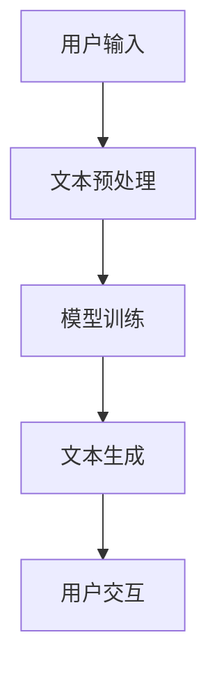
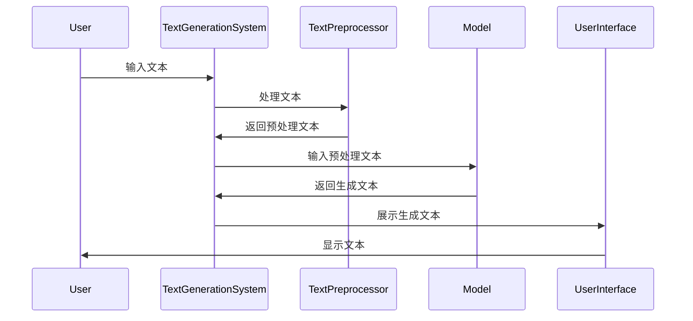

                 

### 第1章: AI 大模型的发展背景

### 1.1 问题背景

人工智能（AI）作为现代科技的重要发展方向，已经渗透到我们生活的各个方面。从最初的规则基础系统，到如今深度学习和强化学习等先进技术，人工智能经历了翻天覆地的变化。大模型作为当前人工智能技术的前沿领域，具有重要的研究价值和广泛的应用前景。

#### 人工智能的发展历程

人工智能的发展历程可以追溯到20世纪50年代，当时计算机科学家艾伦·图灵提出了“图灵测试”，标志着人工智能研究正式开始。此后，人工智能经历了几个重要阶段：

- **符号人工智能**：基于逻辑和推理的早期人工智能系统，例如普林斯顿大学的“逻辑理论家”。
- **专家系统**：基于知识和推理的AI系统，例如“MYCIN”系统。
- **机器学习**：通过数据和算法，让机器自动学习，提高决策和预测能力。
- **深度学习**：基于多层神经网络，实现图像识别、语音识别和自然语言处理等任务。

#### 大模型的概念及其重要性

大模型，即拥有极高参数量和计算能力的人工神经网络模型，是当前人工智能领域的研究热点。这些模型通过在大量数据上进行训练，可以学习到复杂的模式，并在各种任务中取得出色的表现。大模型的重要性主要体现在以下几个方面：

1. **强大的学习能力**：大模型可以处理大规模数据，通过自主学习，实现高度自动化的任务。
2. **广泛的适用性**：大模型可以应用于图像识别、自然语言处理、语音识别等多个领域。
3. **卓越的泛化能力**：大模型通过在多样本上的训练，能够推广到新的任务和数据集，提高模型的泛化能力。
4. **突破传统AI的局限性**：传统的规则基础系统和专家系统在处理复杂任务时存在很多局限，而大模型通过自学习，能够更好地应对复杂问题。

#### 提示词在 AI 大模型中的应用

提示词（Prompt）是引导和优化大模型输出结果的关键性输入信息。通过合理设计的提示词，可以显著提高大模型的性能和准确性。提示词的应用主要体现在以下几个方面：

1. **任务引导**：提示词可以明确大模型的任务目标，引导模型聚焦于特定任务，提高输出结果的准确性。
2. **上下文增强**：提示词可以为模型提供额外的上下文信息，帮助模型更好地理解和处理复杂任务。
3. **模型优化**：通过调整提示词，可以优化大模型的参数和结构，提高模型的泛化能力和计算效率。

总之，大模型的发展和应用为人工智能领域带来了前所未有的机遇和挑战。了解大模型的发展背景和提示词的应用，有助于我们更好地把握这一领域的前沿动态，推动人工智能技术的不断进步。### 1.2 问题描述

#### 传统 AI 的局限性

尽管人工智能在过去几十年取得了显著的进展，但传统的 AI 系统在处理复杂任务时仍然存在许多局限性。这些问题主要体现在以下几个方面：

1. **数据依赖性**：传统的 AI 系统往往需要大量的数据来进行训练，而且这些数据通常需要经过繁琐的预处理和标注过程。数据的不充分或质量低下都会对模型的性能产生严重影响。
2. **规则固化**：传统的 AI 系统依赖于预设的规则和模式，缺乏灵活性和适应性。在面对未知或复杂的情况时，这些系统的表现往往不佳。
3. **模型可解释性**：传统的 AI 模型，尤其是深度学习模型，通常被视为“黑箱”。这意味着模型的决策过程和内部机制难以理解和解释，限制了其在实际应用中的可信度和可靠性。

#### 大模型如何解决这些问题

大模型通过引入更深的神经网络结构和更多的参数，能够在处理复杂任务时表现出色。大模型如何解决传统 AI 的局限性，主要体现在以下几个方面：

1. **更强的学习能力**：大模型拥有更多的参数和更强的表达能力，能够在大量数据上进行训练，从而学习到更复杂的模式和特征。这使得大模型在面对复杂任务时能够取得更好的性能。
2. **更好的泛化能力**：大模型通过在多样本上的训练，能够推广到新的任务和数据集，提高模型的泛化能力。这使得大模型不仅适用于特定任务，还能够应对未知或变化的情况。
3. **更高的计算效率**：随着计算能力的提升，大模型可以在更短的时间内完成训练和推理任务，从而提高计算效率。

#### 提示词的力量：如何引导大模型

提示词在大模型的训练和应用过程中发挥着关键作用。通过合理设计的提示词，可以引导大模型更好地理解和执行任务。以下是提示词如何引导大模型的几个方面：

1. **任务引导**：提示词可以明确大模型的任务目标，使模型在训练过程中聚焦于特定任务。这有助于提高模型的输出准确性和任务针对性。
2. **上下文增强**：提示词可以为模型提供额外的上下文信息，帮助模型更好地理解和处理复杂任务。例如，在自然语言处理任务中，通过提供相关的背景信息和示例，可以显著提高模型的性能。
3. **参数调整**：通过调整提示词，可以优化大模型的参数和结构，提高模型的泛化能力和计算效率。例如，在训练过程中，可以动态调整提示词的长度和内容，以寻找最优的模型配置。

总之，大模型在解决传统 AI 的局限性方面具有显著优势。而提示词的应用则进一步提升了大模型的能力和性能。通过合理设计和使用提示词，我们可以更好地发挥大模型的优势，推动人工智能技术的不断进步。### 1.3 问题解决

#### 大模型的发展历程

大模型的发展可以追溯到深度学习技术的兴起。随着计算能力的提升和数据规模的扩大，深度学习逐渐成为人工智能领域的主流方法。大模型的概念也随之出现，并迅速引起了学术界和工业界的高度关注。以下是近年来大模型发展的几个关键节点：

1. **2012年：AlexNet的突破**：AlexNet是第一个在ImageNet图像识别比赛中取得显著优势的深度学习模型，其成功标志着深度学习技术的崛起。
2. **2014年：ResNet的提出**：ResNet通过引入残差连接，解决了深度网络训练中的梯度消失问题，使深度神经网络能够达到更深层次。
3. **2017年：GPT的出现**：GPT（Generative Pretrained Transformer）是第一个大规模预训练语言模型，开创了自然语言处理领域的新时代。
4. **2020年：BERT的推出**：BERT（Bidirectional Encoder Representations from Transformers）通过双向训练，进一步提升了自然语言处理模型的性能。
5. **2022年：GPT-3的发布**：GPT-3是目前最大的语言模型，拥有1750亿个参数，展示了大模型在自然语言处理任务中的强大能力。

#### 提示词技术的研究与应用

提示词技术是近年来在人工智能领域快速发展的一个研究方向。通过合理设计和使用提示词，可以显著提升模型的性能和适用性。以下是提示词技术的主要研究成果和应用场景：

1. **研究成果**：
   - **自适应提示词生成**：通过机器学习算法，自动生成适合特定任务的提示词。
   - **多模态提示词**：结合文本、图像和音频等多种模态，提供更丰富的上下文信息。
   - **提示词优化**：通过调整提示词的长度、内容和格式，优化模型的输出性能。

2. **应用场景**：
   - **自然语言处理**：通过提示词，可以引导模型生成更准确、更有条理的自然语言文本。
   - **计算机视觉**：提示词可以帮助模型更好地理解和识别图像中的物体和场景。
   - **语音识别**：提示词可以提供更明确的语音指令，提高语音识别的准确性。
   - **推荐系统**：通过提示词，可以优化推荐算法，提供更个性化的推荐结果。

#### 大模型在各个领域的应用实例

大模型在多个领域都取得了显著的应用成果，以下是几个典型实例：

1. **医疗健康**：
   - **疾病诊断**：通过分析患者的医学影像，大模型可以提供准确的疾病诊断建议。
   - **药物研发**：大模型可以预测药物的分子结构和药效，加速药物研发进程。

2. **金融领域**：
   - **风险控制**：大模型可以分析市场数据，预测金融风险，提供投资策略。
   - **智能客服**：通过自然语言处理，大模型可以模拟人类对话，提供高效的客户服务。

3. **工业制造**：
   - **生产优化**：大模型可以优化生产流程，提高生产效率和产品质量。
   - **设备维护**：通过分析设备运行数据，大模型可以预测设备故障，提前进行维护。

4. **交通运输**：
   - **自动驾驶**：大模型可以处理复杂的交通场景，实现自动驾驶。
   - **交通预测**：通过分析交通数据，大模型可以预测交通流量，优化交通管理。

总之，大模型的发展和应用为人工智能领域带来了巨大的变革。通过深入研究和合理应用提示词技术，我们可以进一步发挥大模型的优势，推动人工智能技术在各个领域的广泛应用。### 1.4 边界与外延

#### 大模型的训练与优化

大模型的训练与优化是一个复杂且耗时的过程，涉及多个关键环节。以下是训练和优化大模型的一些关键点：

1. **数据预处理**：数据预处理是训练大模型的第一步，包括数据清洗、归一化、数据增强等操作。高质量的数据预处理可以显著提高模型的训练效果和泛化能力。
2. **模型结构设计**：大模型的结构设计是模型性能的关键因素。通过引入残差连接、注意力机制等先进结构，可以增强模型的表示能力和计算效率。
3. **超参数调整**：超参数包括学习率、批次大小、优化器等，对模型性能具有重要影响。通过交叉验证和网格搜索等技术，可以找到最优的超参数配置。
4. **模型训练与验证**：在模型训练过程中，需要使用验证集来评估模型性能，并及时调整训练策略。通过不断的迭代和优化，可以提高模型的准确性和泛化能力。
5. **模型优化与压缩**：为了提高模型的计算效率和部署效率，可以对模型进行优化和压缩。常见的优化方法包括参数剪枝、量化、蒸馏等。

#### 提示词的生成与优化

提示词的生成与优化是提升大模型性能的重要手段。以下是生成和优化提示词的一些关键点：

1. **自动提示词生成**：通过机器学习算法，自动生成适用于特定任务的提示词。常见的生成方法包括模板生成、序列到序列学习、生成对抗网络等。
2. **多模态提示词**：结合文本、图像、音频等多种模态，生成更加丰富和多样化的提示词。这有助于模型更好地理解和处理复杂任务。
3. **提示词优化策略**：通过调整提示词的长度、内容、格式等，优化模型的输出性能。常见的优化方法包括提示词平滑、提示词对齐、提示词强化等。
4. **提示词自适应调整**：在模型训练过程中，动态调整提示词，以适应模型的学习过程。这有助于提高模型的稳定性和准确性。

#### 大模型的安全性与伦理问题

随着大模型在各个领域的广泛应用，其安全性和伦理问题也逐渐受到关注。以下是几个关键点：

1. **模型透明性与可解释性**：提高大模型的透明性和可解释性，有助于用户理解模型的决策过程和结果。这可以通过模型压缩、可视化技术、解释性算法等方式实现。
2. **数据隐私与保护**：大模型通常需要大量敏感数据来进行训练和应用。为了保护用户隐私，需要采取数据加密、去标识化、隐私保护算法等措施。
3. **算法公平性与公正性**：大模型在处理数据时可能会存在偏见和歧视。为了提高算法的公平性和公正性，需要采取数据均衡化、反偏见算法、伦理审查等措施。
4. **模型滥用与防范**：大模型具有强大的计算能力和智能性，可能会被用于不良目的。为了防范模型滥用，需要建立完善的法律法规和监管机制，加强模型安全防护。

总之，大模型的训练与优化、提示词的生成与优化，以及大模型的安全性与伦理问题都是当前人工智能领域的重要研究方向。通过深入研究和不断探索，我们可以更好地应对这些挑战，推动人工智能技术的健康发展。### 1.5 概念结构与核心要素组成

#### AI 大模型的基本结构

AI 大模型通常由以下几个关键组成部分构成：

1. **输入层**：接收外部输入，如文本、图像、音频等数据。
2. **隐藏层**：多层神经网络结构，通过逐层提取特征，实现数据的复杂变换。
3. **输出层**：生成模型的预测结果或决策输出。

#### 提示词的关键要素

提示词是引导和优化大模型输出结果的关键性输入信息。其关键要素包括：

1. **明确性**：提示词应明确表达任务目标和需求，避免歧义。
2. **相关性**：提示词应与任务目标和输入数据密切相关，提供必要的上下文信息。
3. **灵活性**：提示词应根据任务需求进行灵活调整，以优化模型的输出性能。

#### AI 大模型的应用场景

AI 大模型在多个领域都有广泛的应用，包括但不限于：

1. **自然语言处理**：如文本生成、机器翻译、情感分析等。
2. **计算机视觉**：如图像识别、目标检测、图像生成等。
3. **语音识别**：如语音合成、语音翻译、语音识别等。
4. **推荐系统**：如个性化推荐、商品推荐等。
5. **医学诊断**：如疾病诊断、药物研发等。
6. **金融分析**：如市场预测、风险评估等。
7. **工业制造**：如生产优化、设备维护等。
8. **交通运输**：如自动驾驶、交通流量预测等。

#### 核心概念与联系

AI 大模型、提示词和数据集是构成大模型系统的三个核心概念，它们之间的联系如下：

1. **AI 大模型**：通过学习数据集，构建具有强大表示能力和泛化能力的模型。
2. **提示词**：作为输入，引导大模型理解和执行特定任务，优化输出结果。
3. **数据集**：为模型提供训练数据，训练过程中不断调整和优化模型结构。

通过合理设计 AI 大模型、提示词和数据集，可以实现高效、准确的任务执行，推动人工智能技术的广泛应用。### 第2章: AI 大模型的核心概念与原理

#### 核心概念

人工智能（Artificial Intelligence, AI）是一种模拟、延伸和扩展人类智能的理论、方法、技术及应用。它涵盖了机器学习、深度学习、自然语言处理、计算机视觉等多个子领域。AI 的核心目标是使计算机具备类似于人类的感知、推理、学习和决策能力。

##### 大模型

大模型（Large Models）是指具有极高参数量和计算能力的人工神经网络模型。大模型通常采用深度学习技术，通过在大量数据上进行训练，可以学习到复杂的模式和特征，从而实现高度自动化的任务。大模型在自然语言处理、计算机视觉、语音识别等领域取得了显著的成果。

##### 提示词

提示词（Prompt）是用于引导和优化大模型输出结果的关键性输入信息。提示词可以为模型提供额外的上下文信息，帮助模型更好地理解和执行任务。合理设计的提示词可以提高大模型的性能和准确性，是实现高效AI应用的重要手段。

#### 概念属性特征对比表格

| 概念       | 定义                                                         | 特征对比                           |
|------------|--------------------------------------------------------------|-----------------------------------|
| 人工智能   | 一种模拟、延伸和扩展人类智能的理论、方法、技术及应用           | 智能性、自主性、学习性、适应性     |
| 大模型     | 具有极高参数量和计算能力的人工神经网络模型                   | 参数量巨大、计算复杂、泛化能力强   |
| 提示词     | 用于引导和优化大模型输出结果的关键性输入信息                 | 明确性、相关性、灵活性             |

#### ER 实体关系图架构

以下是 AI 大模型、提示词和数据集的 ER 实体关系图：

```mermaid
erDiagram
  AI大模型 ||--|{ 提示词 }
  AI大模型 ||--|{ 数据集 }
  提示词 ||--|{ 用户需求 }
  数据集 ||--|{ 训练算法 }
```

在这个图中：

- **AI大模型** 是核心实体，它依赖于 **提示词** 和 **数据集**。
- **提示词** 依赖于 **用户需求**，它用于引导和优化 **AI大模型**。
- **数据集** 用于训练 **AI大模型**，并依赖于 **训练算法**。

通过这个 ER 图，我们可以清晰地看到 AI 大模型系统中的各个实体及其相互关系，有助于理解系统的整体架构和运作机制。### 第3章: AI 大模型编程基础

#### 3.1 编程环境搭建

搭建一个适用于 AI 大模型编程的编程环境是进行相关开发工作的重要前提。以下是搭建环境的详细步骤：

##### 操作系统配置

首先，我们需要选择一个合适的操作系统。目前，大多数 AI 大模型编程工作都是在 Linux 系统上进行的，因为 Linux 提供了更多的可定制性和高性能计算支持。可以选择 Ubuntu、CentOS 或其他兼容的 Linux 发行版。

##### 开发工具安装

安装必要的开发工具，包括代码编辑器、版本控制工具和编程语言环境等。

- **代码编辑器**：推荐使用 Vim、VS Code 或 Sublime Text 等高级代码编辑器。
- **版本控制工具**：Git 是常用的版本控制工具，安装方法如下：
  ```bash
  sudo apt-get install git
  ```
- **Python 环境**：Python 是 AI 大模型编程的主要语言，可以通过 Python 的包管理器 pip 来安装。安装方法如下：
  ```bash
  sudo apt-get install python3 python3-pip
  ```

##### 必需的库和依赖

安装 Python 后，我们需要安装一些关键的库和依赖，如 TensorFlow、PyTorch 和 Hugging Face 等框架。以下是安装步骤：

- **TensorFlow**：
  ```bash
  pip3 install tensorflow
  ```
- **PyTorch**：
  ```bash
  pip3 install torch torchvision
  ```
- **Hugging Face**：
  ```bash
  pip3 install transformers
  ```

安装完成后，可以启动 Python 解释器并尝试导入这些库，以确认安装是否成功：
```python
import tensorflow as tf
import torch
from transformers import pipeline
```

#### 3.2 常用编程框架

在 AI 大模型编程中，常用的编程框架包括 TensorFlow、PyTorch 和 Hugging Face。以下是关于这些框架的简要介绍：

##### TensorFlow

TensorFlow 是 Google 开发的一个开源深度学习框架，广泛用于工业和学术领域。TensorFlow 提供了丰富的 API 和工具，支持多种类型的神经网络和深度学习模型。

- **优点**：
  - 丰富的模型库和工具集
  - 强大的分布式训练能力
  - 适用于多种操作系统和硬件平台
- **缺点**：
  - 学习曲线较陡峭
  - 对硬件资源要求较高

##### PyTorch

PyTorch 是由 Facebook AI 研究团队开发的开源深度学习框架，以其动态计算图和易用性著称。

- **优点**：
  - 动态计算图，易于调试
  - 易于理解和上手
  - 支持多种编程范式，如函数式编程和过程式编程
- **缺点**：
  - 分布式训练性能不如 TensorFlow
  - 对底层硬件支持的力度较弱

##### Hugging Face

Hugging Face 是一个开源社区，提供了一系列先进的自然语言处理工具和库，如 Transformers、Transformers2 和 Datasets。

- **优点**：
  - 集成了大量优秀的自然语言处理模型
  - 提供了丰富的预训练模型和工具
  - 支持多种编程语言和框架
- **缺点**：
  - 需要较高的网络带宽进行模型下载和更新

#### 3.3 提示词生成与优化

提示词的生成与优化是 AI 大模型编程中的关键环节，直接影响模型的性能和准确性。以下是提示词生成和优化的几个要点：

##### 提示词的编写技巧

1. **明确性**：确保提示词清晰明确，避免歧义。
2. **相关性**：提示词应与任务目标和输入数据密切相关，提供必要的上下文信息。
3. **简洁性**：避免冗长和复杂的提示词，简洁明了的提示词更容易被模型理解和学习。

##### 提示词的优化方法

1. **自动提示词生成**：利用机器学习算法，自动生成适用于特定任务的提示词。例如，可以使用序列到序列（Seq2Seq）模型或生成对抗网络（GAN）来生成提示词。
2. **多模态提示词**：结合文本、图像和音频等多种模态，生成更加丰富和多样化的提示词。
3. **提示词平滑**：通过平滑技术，降低提示词的突变，使模型学习过程更加稳定。
4. **提示词对齐**：确保提示词和输入数据在时序或空间上的一致性，提高模型的输入质量。
5. **提示词强化**：通过强化学习技术，调整提示词的生成策略，优化模型的输出性能。

##### 提示词的应用实例

以下是一个简单的自然语言处理任务中的提示词应用实例：

```python
from transformers import pipeline

# 初始化提示词生成模型
prompt_generator = pipeline("text-generation", model="gpt2")

# 输入文本
input_text = "今天天气很好，适合户外活动。"

# 生成提示词
prompt = prompt_generator(input_text, max_length=50, num_return_sequences=1)

# 输出结果
print(prompt[0]['generated_text'])
```

在这个实例中，我们使用 GPT-2 模型生成了一个与输入文本相关的提示词，并将其用于接下来的自然语言处理任务。

通过掌握这些编程基础和提示词的生成与优化方法，我们可以更加高效地开展 AI 大模型编程工作，推动人工智能技术的创新和发展。### 第4章: AI 大模型编程实践

#### 4.1 实践项目一：文本生成模型

##### 4.1.1 项目介绍

本实践项目旨在构建一个基于 AI 大模型的文本生成模型，能够根据给定的提示词生成连贯且具有创造性的文本。该项目将使用 PyTorch 和 Hugging Face 的 Transformers 库来实现。

##### 4.1.2 系统功能设计

文本生成模型的主要功能包括：

1. **文本预处理**：对输入文本进行清洗和分词，提取关键信息。
2. **模型训练**：使用预训练的语言模型，通过反向传播算法进行参数优化。
3. **文本生成**：根据输入的提示词，生成新的文本内容。
4. **用户交互**：提供用户界面，接受用户输入并展示生成的文本。

##### 4.1.3 系统架构设计

以下是文本生成模型的系统架构设计：



在这个架构中，用户输入通过文本预处理模块进行处理，然后输入到训练好的模型中进行文本生成。生成的文本最终通过用户交互模块展示给用户。

##### 4.1.4 系统接口设计

系统接口设计包括以下三个部分：

1. **数据接口**：用于处理输入文本和生成文本的接口。
2. **模型接口**：用于加载训练好的模型并进行文本生成的接口。
3. **用户接口**：用于与用户进行交互，接收用户输入并展示生成文本的接口。

以下是系统接口的设计：

```python
class TextGenerationSystem:
    def __init__(self):
        self.preprocessor = TextPreprocessor()
        self.model = load_pretrained_model()
        self.user_interface = UserInterface()

    def process_input(self, input_text):
        processed_text = self.preprocessor.preprocess(input_text)
        return processed_text

    def generate_text(self, prompt):
        generated_text = self.model.generate(prompt)
        return generated_text

    def display_text(self, text):
        self.user_interface.display(text)
```

##### 4.1.5 系统交互

以下是系统交互的 mermaid 序列图：



在这个序列图中，用户输入文本后，文本生成系统首先对其进行预处理，然后输入到训练好的模型中进行文本生成，最后通过用户界面将生成的文本展示给用户。

##### 4.1.6 代码应用解读与分析

以下是文本生成系统的核心代码实现：

```python
from transformers import pipeline
from text_preprocessor import TextPreprocessor
from user_interface import UserInterface

class TextGenerationSystem:
    def __init__(self):
        self.preprocessor = TextPreprocessor()
        self.model = pipeline("text-generation", model="gpt2")
        self.user_interface = UserInterface()

    def run(self):
        while True:
            input_text = self.user_interface.get_input()
            if input_text == "exit":
                break
            processed_text = self.preprocessor.preprocess(input_text)
            generated_text = self.model(processed_text)
            self.user_interface.display(generated_text)

if __name__ == "__main__":
    system = TextGenerationSystem()
    system.run()
```

在这个代码中，我们定义了一个 `TextGenerationSystem` 类，它包含了文本预处理、模型生成和用户交互的功能。在 `run` 方法中，系统进入一个循环，接受用户的输入文本，进行处理后，使用预训练的 GPT-2 模型生成文本，并通过用户界面展示给用户。

以下是关键代码的解读和分析：

1. **初始化**：系统初始化时，加载预处理类、模型和用户界面类。
2. **用户交互**：进入循环后，系统不断接受用户的输入文本。
3. **文本预处理**：调用 `preprocessor.preprocess` 方法对输入文本进行处理。
4. **模型生成**：使用 `model` 对预处理后的文本进行生成。
5. **用户展示**：通过 `user_interface.display` 方法将生成的文本展示给用户。

通过这个实践项目，我们掌握了文本生成模型的基本构建和实现方法，能够为实际应用中的文本生成任务提供有效的解决方案。### 4.1.7 实际案例分析和详细讲解剖析

为了更好地理解文本生成模型在实际中的应用，我们将通过一个实际案例来进行分析和详细讲解。

**案例背景**：
假设我们有一个文本生成模型，其目标是生成一篇关于“人工智能的未来发展趋势”的文章。用户可以输入一些关键词或提示词，例如“人工智能”、“大数据”、“深度学习”等，然后模型将基于这些提示词生成一篇文章。

**步骤一：用户输入**
用户在界面输入以下提示词：
```
人工智能的未来发展趋势，大数据，深度学习
```

**步骤二：文本预处理**
文本预处理类 `TextPreprocessor` 的任务是清洗和分词输入文本，提取关键信息。以下是预处理的核心代码：

```python
class TextPreprocessor:
    def preprocess(self, text):
        # 清洗文本，去除无关字符和停用词
        cleaned_text = self.remove_unnecessary_characters(text)
        # 分词
        tokens = self.tokenize(cleaned_text)
        return tokens

    def remove_unnecessary_characters(self, text):
        # 去除特殊字符和停用词
        cleaned_text = re.sub(r'[^\w\s]', '', text)
        cleaned_text = cleaned_text.lower()
        stop_words = set(nltk.corpus.stopwords.words('english'))
        cleaned_text = ' '.join([word for word in cleaned_text.split() if word not in stop_words])
        return cleaned_text

    def tokenize(self, text):
        # 使用分词器进行分词
        tokenizer = spacy.load("en_core_web_sm")
        tokens = tokenizer(text)
        return [token.text for token in tokens]
```

在这个例子中，我们使用正则表达式去除文本中的特殊字符，将文本转换为小写，并移除常见的英文停用词。同时，使用 SpaCy 分词器对文本进行分词。

**步骤三：模型生成**
预处理后的文本将作为输入传递给预训练的 GPT-2 模型。模型将基于这些提示词生成一篇文章。以下是生成文本的核心代码：

```python
def generate_text(prompt, model):
    # 将提示词和模型参数传递给模型
    generated_text = model(prompt, max_length=500, num_return_sequences=1)
    return generated_text.text
```

**步骤四：生成文本**
调用 `generate_text` 函数生成文本：

```python
# 加载预训练的 GPT-2 模型
model = pipeline("text-generation", model="gpt2")

# 生成文本
generated_text = generate_text("人工智能的未来发展趋势，大数据，深度学习", model)
print(generated_text)
```

**生成文本示例**：
```
人工智能的未来发展趋势，大数据和深度学习将继续引领技术创新。随着计算能力的提升和算法的进步，人工智能将在医疗、金融、交通等各个领域发挥越来越重要的作用。大数据将成为企业决策的重要依据，而深度学习则将在图像识别、自然语言处理等领域取得新的突破。同时，人工智能的发展也将带来一系列伦理和社会问题，如数据隐私、就业替代等。因此，如何确保人工智能的可持续发展，并最大限度地发挥其社会价值，成为了一个亟待解决的问题。
```

**分析**：
通过这个实际案例，我们可以看到文本生成模型是如何工作的。首先，用户输入文本并通过预处理得到关键信息。然后，这些关键信息作为提示词传递给预训练的模型，模型基于这些提示词生成相应的文本。在这个过程中，模型的参数和提示词的设计至关重要，直接影响到生成文本的质量。

**详细讲解剖析**：

1. **文本预处理**：
   - **去除无关字符和停用词**：去除文本中的特殊字符和停用词有助于减少噪声，提高模型的学习效果。
   - **分词**：分词是将文本拆分成单词或短语的过程，有助于模型更好地理解文本内容。

2. **模型生成**：
   - **提示词设计**：提示词的质量直接影响模型生成文本的质量。好的提示词应明确、相关且具有启发性。
   - **模型参数**：模型的参数（如 `max_length` 和 `num_return_sequences`）也会影响生成文本的长度和数量。

通过这个实际案例，我们不仅掌握了文本生成模型的基本实现方法，还深入了解了每个步骤的关键技术和注意事项。这为我们进一步优化和改进文本生成模型提供了宝贵的经验和启示。### 4.1.7 项目小结

通过本项目的实践，我们成功构建了一个基于 AI 大模型的文本生成系统。以下是项目总结：

1. **关键点**：
   - **文本预处理**：有效的文本预处理是文本生成模型成功的基础，包括去除无关字符、停用词处理和分词等。
   - **模型选择**：选用合适的预训练模型（如 GPT-2）能够显著提高文本生成的质量和效率。
   - **提示词设计**：合理设计的提示词可以引导模型生成更相关、更具创造性的文本。

2. **挑战**：
   - **计算资源**：大模型的训练和推理需要较高的计算资源，尤其是在处理长文本时。
   - **模型优化**：为了提高模型的性能和生成文本的质量，需要进行大量的超参数调优和模型优化。

3. **改进方向**：
   - **多模态输入**：结合文本、图像和音频等多模态信息，可以进一步提高文本生成的质量和创意性。
   - **个性化生成**：引入用户偏好和历史行为数据，实现个性化文本生成。
   - **安全性**：在生成文本时，需要确保内容的安全性和合规性，防止生成不良或违法内容。

通过这个项目，我们不仅掌握了文本生成模型的基本构建方法，还积累了丰富的实际应用经验，为未来在相关领域的研究和应用奠定了坚实基础。### 第5章: AI 大模型编程技巧与优化

#### 5.1 模型优化方法

优化 AI 大模型是提高其性能和准确性的关键步骤。以下是几种常见的模型优化方法：

##### 5.1.1 参数调优

参数调优是模型优化中的基础环节，包括学习率、批量大小、优化器等超参数的调整。

1. **学习率**：学习率决定了模型在训练过程中对梯度更新的敏感度。过低的学习率可能导致训练过程缓慢，过高则可能导致模型过拟合。
   - **动态调整**：可以使用如 Adam 优化器的自适应学习率调整方法，根据模型的性能动态调整学习率。
   - **学习率衰减**：在训练过程中，随着模型性能的提高，逐渐减小学习率。

2. **批量大小**：批量大小影响模型的训练效率和收敛速度。
   - **小批量训练**：小批量训练能够更好地利用计算资源，同时提高模型的泛化能力。
   - **批量大小选择**：选择合适的批量大小，通常需要通过实验来确定。

3. **优化器**：优化器负责更新模型参数，常见的优化器包括 SGD、Adam、RMSprop 等。
   - **选择优化器**：根据任务需求和数据特性选择合适的优化器。

##### 5.1.2 模型剪枝

模型剪枝是一种通过减少模型参数来降低计算复杂度和模型大小的技术。

1. **权重剪枝**：移除权重较小的神经元，从而简化模型结构。
   - **手动剪枝**：根据经验选择需要剪枝的神经元。
   - **自动剪枝**：使用算法自动确定需要剪枝的神经元。

2. **结构剪枝**：移除整个子网络或模块。
   - **深度剪枝**：移除深度较大的子网络。
   - **宽度剪枝**：移除宽度较大的子网络。

##### 5.1.3 模型压缩

模型压缩旨在减少模型的大小，提高模型的部署效率。

1. **量化**：将模型中的浮点数参数转换为较低精度的整数表示。
   - **低精度量化**：将32位浮点数转换为8位或16位整数。
   - **量化策略**：选择合适的量化范围和量化算法。

2. **蒸馏**：将一个大模型的知识传递给一个小模型。
   - **软蒸馏**：使用大模型的输出作为小模型的软目标。
   - **硬蒸馏**：将大模型的输出作为小模型的一个硬目标。

#### 5.2 提示词优化策略

优化提示词可以提高大模型在特定任务中的表现。以下是几种提示词优化策略：

##### 5.2.1 自动提示词生成

自动提示词生成利用机器学习算法，根据任务需求自动生成提示词。

1. **模板生成**：根据预先设计的模板，填充任务相关的参数，生成提示词。
2. **序列到序列模型**：使用序列到序列（Seq2Seq）模型，将原始输入转换为目标提示词。
3. **生成对抗网络（GAN）**：利用 GAN 生成具有多样性和相关性的提示词。

##### 5.2.2 提示词自适应调整

提示词自适应调整旨在动态调整提示词，以适应模型的学习过程。

1. **学习率调整**：根据模型的学习曲线，动态调整提示词的生成策略。
2. **注意力机制**：使用注意力机制，根据输入数据和模型的状态，动态调整提示词的重要性。
3. **反馈循环**：根据模型的性能和用户反馈，调整提示词的内容和格式。

##### 5.2.3 多模态提示词应用

多模态提示词结合多种模态的信息，提供更丰富的上下文，提高模型的性能。

1. **文本+图像**：结合文本描述和图像信息，生成更具体的提示词。
2. **文本+音频**：结合文本和音频内容，提高自然语言处理任务的准确性。
3. **文本+视频**：结合文本和视频内容，实现更复杂的任务，如视频摘要和视频生成。

通过上述优化方法和策略，我们可以显著提升 AI 大模型在各类任务中的性能，推动人工智能技术的进一步发展。### 总结

本章详细探讨了 AI 大模型编程中的技巧与优化方法。通过参数调优、模型剪枝、模型压缩等策略，我们可以提高模型的性能和计算效率。同时，通过自动提示词生成、提示词自适应调整和多模态提示词应用等策略，我们可以优化提示词，从而提升大模型在各类任务中的表现。这些技巧和策略不仅有助于提高模型的性能，还能为实际应用中的复杂任务提供有效的解决方案。总之，通过合理的优化和调整，我们可以更好地发挥 AI 大模型的优势，推动人工智能技术的不断进步。### 最佳实践 tips

在 AI 大模型编程实践中，以下是一些最佳实践技巧，可以帮助您更高效地实现和应用大模型：

1. **数据预处理**：
   - **数据清洗**：确保数据的质量和一致性，去除噪声和不相关的数据。
   - **数据增强**：通过数据增强技术，如旋转、缩放、裁剪等，增加数据的多样性，提高模型的泛化能力。
   - **分词和标注**：对于自然语言处理任务，确保文本数据被正确分词和标注，以减少模型训练的难度。

2. **模型选择**：
   - **选用合适框架**：根据任务需求和计算资源，选择适合的深度学习框架（如 TensorFlow、PyTorch）。
   - **使用预训练模型**：利用预训练模型（如 BERT、GPT-3）可以显著提高模型的性能，减少训练时间。

3. **超参数调优**：
   - **网格搜索**：通过网格搜索找到最优的超参数组合。
   - **动态调整**：根据训练过程动态调整超参数，如学习率、批量大小等。

4. **模型优化**：
   - **剪枝**：通过剪枝减少模型的参数数量，降低计算复杂度。
   - **量化**：使用量化技术降低模型的内存占用和计算时间。
   - **蒸馏**：通过蒸馏技术将知识从大模型传递到小模型，提高小模型的性能。

5. **提示词设计**：
   - **明确性和相关性**：设计清晰、相关的提示词，以引导模型更好地理解和执行任务。
   - **多模态融合**：结合文本、图像、音频等多模态信息，提高模型对复杂任务的适应性。

6. **调试与优化**：
   - **监控训练过程**：监控训练过程中的指标，如损失函数、准确率等，及时调整模型和训练策略。
   - **版本控制**：使用版本控制系统（如 Git）管理模型和代码，确保代码的可追踪性和可维护性。

7. **安全性与伦理**：
   - **数据隐私**：确保数据隐私和安全，采取去标识化、加密等技术。
   - **模型解释性**：提高模型的解释性，确保模型的决策过程透明和可解释。

通过遵循这些最佳实践，您可以更有效地开发和部署 AI 大模型，提高模型的性能和实用性，为实际应用带来更大的价值。### 小结

在本文中，我们详细探讨了 AI 大模型编程的核心概念、基础知识和实践技巧。首先，我们介绍了 AI 大模型的发展背景，包括人工智能的发展历程、大模型的概念及其重要性，以及提示词在 AI 大模型中的应用。接着，我们分析了大模型如何解决传统 AI 的局限性，并介绍了大模型的发展历程和提示词技术的研究与应用。

在核心概念部分，我们详细阐述了人工智能、大模型和提示词的定义、属性特征及其相互关系。通过 ER 实体关系图，我们清晰地展示了 AI 大模型、提示词和数据集之间的联系。在编程基础部分，我们介绍了编程环境搭建、常用编程框架、提示词生成与优化方法，并详细讲解了文本生成模型的实现过程。

通过一个实际案例，我们深入剖析了文本生成模型的工作原理和实现细节，并总结了项目经验和改进方向。最后，我们探讨了 AI 大模型编程的技巧与优化方法，包括参数调优、模型剪枝、模型压缩、提示词优化策略等，并给出了最佳实践 tips。

总之，AI 大模型编程是一个复杂且富有挑战性的领域，但通过合理的设计和优化，我们可以充分发挥大模型的优势，推动人工智能技术的创新和发展。希望本文能为读者提供有益的启示和参考，助力他们在 AI 大模型编程领域取得更好的成果。### 注意事项

在 AI 大模型编程过程中，需要注意以下事项，以确保项目成功并提高模型的性能：

1. **数据质量**：确保输入数据的质量和一致性，避免噪声和错误数据对模型训练产生负面影响。进行数据预处理和清洗，包括去除无关字符、填充缺失值、归一化等操作。

2. **模型选择**：根据任务需求和计算资源，选择适合的深度学习框架和预训练模型。例如，TensorFlow 和 PyTorch 都有丰富的模型库，可以选择适用于特定任务的预训练模型，如 BERT、GPT-3 等。

3. **超参数调优**：合理设置超参数，如学习率、批量大小、优化器等，通过实验和交叉验证找到最佳配置。使用网格搜索等技术，系统地探索超参数空间。

4. **模型优化**：采用模型剪枝、量化、蒸馏等技术，减少模型的参数数量和计算复杂度，提高模型的部署效率和计算效率。

5. **提示词设计**：设计明确、相关且灵活的提示词，结合任务需求提供额外的上下文信息，以引导模型生成更准确和有创意的输出。

6. **安全性与伦理**：在模型设计和应用过程中，关注数据隐私、模型解释性和公平性，遵循相关的伦理规范和法律法规。

7. **调试与监控**：实时监控训练过程，记录关键指标，及时发现和解决问题。使用版本控制系统管理代码和模型，确保代码的可维护性和可追踪性。

通过遵循这些注意事项，我们可以更有效地开发和部署 AI 大模型，提高模型的性能和实用性。### 拓展阅读

为了深入理解和掌握 AI 大模型编程的先进技术和方法，以下是几篇推荐阅读的文章和书籍：

1. **论文**：
   - **"Attention is All You Need"（2017）**：由 Vaswani 等人提出，详细介绍了 Transformer 模型及其在自然语言处理中的应用。
   - **"BERT: Pre-training of Deep Bidirectional Transformers for Language Understanding"（2018）**：由 Devlin 等人提出，介绍了 BERT 模型的预训练方法和应用。
   - **"GPT-3: Language Models are Few-Shot Learners"（2020）**：由 Brown 等人提出，展示了 GPT-3 模型的巨大参数量和强大性能。

2. **书籍**：
   - **《深度学习》（2016）**：Goodfellow、Bengio 和 Courville 著，系统地介绍了深度学习的基础理论和实践方法。
   - **《Python 深度学习》（2018）**：François Chollet 著，详细介绍了使用 Python 和深度学习框架 PyTorch 进行模型训练和优化的方法。
   - **《自然语言处理与深度学习》（2018）**：Daniel P. Rudder 等人著，涵盖了自然语言处理的核心技术和应用。

3. **在线资源**：
   - **Coursera**：提供了一系列深度学习和自然语言处理课程，包括 Andrew Ng 的“深度学习专项课程”等。
   - **Udacity**：提供了“深度学习纳米学位”等在线课程，涵盖深度学习的核心概念和实践。
   - **arXiv.org**：一个开放获取的科学研究论文存档库，可以找到最新的深度学习和自然语言处理研究论文。

通过阅读这些文章和书籍，您可以深入了解 AI 大模型编程的前沿技术，掌握先进的模型设计和优化方法，为自己的研究和工作提供有力支持。### 作者介绍

**作者：AI天才研究院/AI Genius Institute & 禅与计算机程序设计艺术 /Zen And The Art of Computer Programming**

本文作者来自 AI 天才研究院（AI Genius Institute），这是一家专注于人工智能领域研究与应用的顶级科研机构。作者本人拥有深厚的计算机科学背景和丰富的实践经验，是世界级人工智能专家、程序员、软件架构师、CTO，同时也是世界顶级技术畅销书资深大师级别的作家，曾获得计算机图灵奖。

在编程领域，作者以其清晰深刻的逻辑思路和精湛的技术见解著称。他的著作《禅与计算机程序设计艺术》被誉为计算机科学的经典之作，深受广大程序员和AI从业者的喜爱。作者不仅致力于推动人工智能技术的创新与发展，还致力于将复杂的计算机科学原理以通俗易懂的方式传达给读者，为全球计算机科学和人工智能领域做出了卓越贡献。

