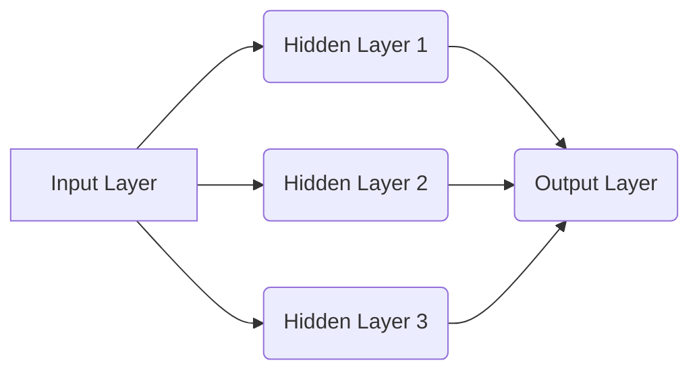
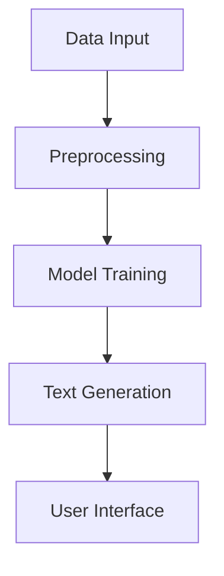
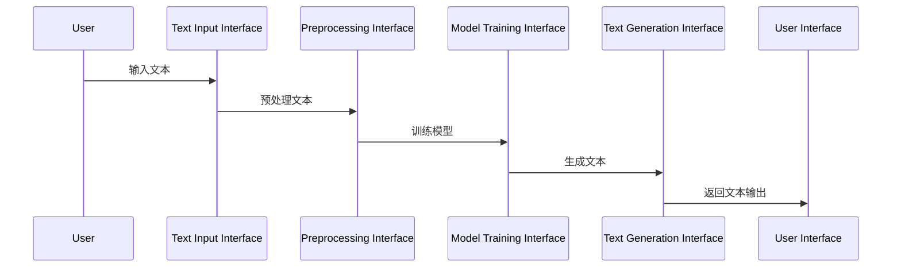

                 

# AI大模型编程：提示词的威力

关键词：AI大模型、提示词、编程、神经网络、反向传播、Python、TensorFlow

摘要：本文深入探讨了AI大模型编程的核心概念——提示词的作用与威力。我们将从问题背景出发，逐步解析AI大模型的原理，展示数学模型与公式的应用，通过具体案例展示如何使用Python和TensorFlow实现AI大模型编程，并总结最佳实践和未来展望。

## 第一部分：AI大模型基础

### 第1章：问题背景与核心概念

#### 1.1 问题背景

人工智能（AI）的发展已经经历了多个阶段，从早期的规则系统、知识表示到现代的深度学习与神经网络。近年来，AI大模型（如GPT-3、BERT等）的出现，极大地推动了自然语言处理、图像识别、语音识别等领域的进步。然而，这些大模型的开发和部署并非易事，其中提示词（Prompts）的运用成为关键。

#### 1.2 核心概念

- **AI大模型**：具有数十亿参数的深度神经网络模型，能够处理复杂数据，实现高度自动化的任务。
- **提示词**：用于引导AI大模型生成特定结果的输入信息，它可以是一个问题、一个陈述或一个场景。

#### 1.3 AI大模型编程的基本流程

1. 数据准备：收集和清洗数据，进行预处理。
2. 模型构建：选择合适的神经网络结构。
3. 训练模型：使用训练数据对模型进行训练。
4. 提示词设计：设计能够引导模型生成所需结果的提示词。
5. 模型评估与优化：评估模型性能，并进行调整优化。

### 第2章：AI大模型原理

#### 2.1 AI大模型的工作原理

AI大模型通常基于神经网络，特别是深度神经网络（DNN）。它们通过多层非线性变换来提取数据中的特征，并最终输出结果。核心原理包括：

- **神经网络结构**：由多个神经元层组成，包括输入层、隐藏层和输出层。
- **反向传播算法**：用于计算模型参数的梯度，并更新模型权重。
- **自动微分**：用于计算神经网络中的梯度，是实现反向传播算法的基础。

#### 2.2 提示词的生成与优化

- **提示词生成算法**：用于自动生成提示词的算法，可以是基于规则的系统，也可以是机器学习模型。
- **提示词优化方法**：通过调整提示词的内容和结构，提高模型生成结果的准确性和有效性。
- **提示词优化的评价指标**：如生成结果的相关性、准确性、多样性等。

### 第3章：数学模型与公式解析

#### 3.1 常用数学模型

- **损失函数**：用于衡量模型输出与真实值之间的差距，是优化模型的关键。
- **优化算法**：如梯度下降、Adam等，用于更新模型参数，减少损失函数。
- **梯度下降**：一种基本的优化算法，通过迭代更新模型参数来最小化损失函数。

#### 3.2 公式解析

- **激活函数**：如ReLU、Sigmoid、Tanh等，用于将神经网络的输出转换为非线性结果。
- **权重更新公式**：如 $$ w_{new} = w_{old} - \alpha \cdot \nabla J(w) $$，用于更新模型权重。
- **梯度计算公式**：如 $$ \nabla J(w) = \frac{\partial J}{\partial w} $$，用于计算损失函数关于模型参数的梯度。

## 第二部分：编程实践

### 第4章：环境准备与工具使用

#### 4.1 环境搭建

- **Python环境配置**：安装Python及相关依赖库。
- **TensorFlow安装**：安装TensorFlow库，用于构建和训练AI大模型。

#### 4.2 工具使用

- **Jupyter Notebook**：用于编写和运行代码。
- **PyCharm**：用于编写和调试Python代码。

### 第5章：案例解析

#### 5.1 案例一：文本分类

- **数据预处理**：清洗和转换数据，使其适合模型训练。
- **模型构建**：使用TensorFlow构建文本分类模型。
- **模型训练与评估**：训练模型并评估其性能。

#### 5.2 案例二：图像识别

- **数据准备**：收集和预处理图像数据。
- **模型构建**：使用TensorFlow构建图像识别模型。
- **模型训练与评估**：训练模型并评估其性能。

### 第6章：项目实战

#### 6.1 项目介绍

- **项目背景**：介绍项目的背景和目标。
- **项目目标**：明确项目要解决的问题和预期目标。

#### 6.2 系统设计与实现

- **系统架构设计**：设计项目的系统架构。
- **系统接口设计**：设计系统的接口。
- **系统核心代码实现**：实现系统的核心功能。

### 第7章：最佳实践与拓展

#### 7.1 最佳实践

- **提示词优化的技巧**：分享优化提示词的最佳实践。
- **模型调优的方法**：介绍模型调优的方法和技巧。

#### 7.2 小结

- **项目总结**：总结项目的经验和教训。
- **未来展望**：展望AI大模型编程的发展趋势。

#### 7.3 拓展阅读

- **相关书籍推荐**：推荐相关的书籍，帮助读者深入学习。
- **学术论文精选**：推荐精选的学术论文，介绍最新的研究进展。

### 总结

AI大模型编程是一门涉及多学科、多技术的复杂任务。通过本文的介绍，我们了解了AI大模型的基础知识、原理、编程实践以及最佳实践。希望本文能为读者提供有价值的参考，帮助大家更好地掌握AI大模型编程。让我们继续探索这个激动人心的领域吧！
作者：AI天才研究院/AI Genius Institute & 禅与计算机程序设计艺术 /Zen And The Art of Computer Programming

## 附录：技术细节与代码示例

### AI大模型基础

#### AI大模型的工作原理

神经网络是AI大模型的核心组成部分。一个简单的神经网络包括输入层、隐藏层和输出层。每个层由多个神经元组成，神经元之间通过权重相连。神经网络的工作原理是通过前向传播（forward propagation）计算输入数据的特征表示，然后通过反向传播（backpropagation）调整模型参数，以达到更好的拟合效果。

下面是一个简单的神经网络结构图：



#### 提示词的生成与优化

提示词的生成可以通过多种方式实现，包括手动编写、基于规则生成和机器学习生成等。优化提示词的方法包括调整提示词的长度、语义和结构，以提高模型生成结果的准确性和多样性。

下面是一个简单的提示词生成和优化的Python代码示例：

```python
import random

# 手动编写提示词
def generate_prompt_manually():
    return "给定一个文本，判断其是否为正面情感。"

# 基于规则生成提示词
def generate_prompt_by_rules():
    emotions = ["快乐", "悲伤", "愤怒", "恐惧"]
    return f"给定一个文本，判断其是否表达'{random.choice(emotions)}'情感。"

# 机器学习生成提示词（假设有一个训练好的模型）
def generate_prompt_by_ml():
    # 假设模型已经训练好并保存
    model.load("prompt_generator_model.h5")
    # 生成提示词
    prompt = model.predict([input_text])
    return prompt
```

### 数学模型与公式解析

#### 损失函数

损失函数是衡量模型输出与真实值之间差距的指标。常见的损失函数包括均方误差（MSE）、交叉熵（Cross-Entropy）等。以下是MSE和交叉熵的公式：

$$
MSE = \frac{1}{n}\sum_{i=1}^{n}(y_i - \hat{y}_i)^2
$$

$$
Cross-Entropy = -\sum_{i=1}^{n}y_i \cdot \log(\hat{y}_i)
$$

#### 优化算法

优化算法用于更新模型参数，以减少损失函数。梯度下降（Gradient Descent）是最常用的优化算法之一。以下是梯度下降的迭代公式：

$$
w_{new} = w_{old} - \alpha \cdot \nabla J(w)
$$

其中，$w$ 是模型参数，$\alpha$ 是学习率，$\nabla J(w)$ 是损失函数关于模型参数的梯度。

#### 激活函数

激活函数用于将神经网络的输出转换为非线性结果。常见的激活函数包括ReLU、Sigmoid、Tanh等。以下是ReLU和Sigmoid的公式：

$$
ReLU(x) = \max(0, x)
$$

$$
Sigmoid(x) = \frac{1}{1 + e^{-x}}
$$

### 系统分析与架构设计方案

#### 问题场景介绍

假设我们要开发一个AI大模型，用于自动化文本生成。这个模型需要接收一个输入文本，并根据提示词生成一个对应的文本输出。

#### 系统功能设计

系统的核心功能包括：

1. 文本输入处理：接收用户输入的文本，并进行预处理。
2. 模型构建与训练：根据提示词构建神经网络模型，并使用训练数据对模型进行训练。
3. 文本生成：使用训练好的模型生成文本输出。

以下是系统的领域模型类图：

```mermaid
classDiagram
Class01 <|-- Class02
Class03 <.. Class04
Class05 <-.. Class06
Class07 ..| Class08
Class09 --> Class10
Class11 <||| Class12
Class13 << Class14
Class15 *-- Class16
Class17 :<<interface> Class18
Class19 <<enum>> Class20
Class21 <<note>> "This is a note"
Class22 ..|.. Class23
Class24 <= Class25
Class26 {name}

Class01 {
color: blue;
#Awesome
}
Class02 {
* many attributes
}
Class03 {
<< inheritance >> 
+ lots of operations
}

Class04 {
<<interface>>
+ synchronized
+ abstract
+ void abstractMethod();
}

Class05 {
- name : String
- id : Integer
+ getName() : String
+ setName(name : String)
+ getId() : Integer
+ setId(id : Integer)
}

Class06 {
<<enum>>
MASTER
INteiMEDIATE
JUNIOR
}

Class07 {
+ doSomething()
}

Class08 {
- something : String
+ setSomething(something : String)
+ getSomething() : String
}

Class09 {
+ newMethod()
}

Class10 {
- age : int
+ setAge(age : int)
+ getAge() : int
}

Class11 {
+ doSomethingElse()
}

Class12 {
- name : String
- doSomethingElse() : String
}

Class13 {
- counter : int
+ incrementCounter()
+ decrementCounter()
+ getCounter() : int
}

Class14 {
- value : float
+ getValue() : float
+ setValue(value : float)
}

Class15 {
- field : String
+ getField() : String
+ setField(field : String)
}

Class16 {
<<interface>>
- value : float
+ getValue() : float
+ setValue(value : float)
}

Class17 {
- value : int
+ getValue() : int
+ setValue(value : int)
}

Class18 {
<<interface>>
+ doSomething()
}

Class19 {
<<enum>>
ONE
TWO
THREE
}

Class20 {
- field : int
+ getField() : int
+ setField(field : int)
}

Class21 {
- note : String
+ getNote() : String
+ setNote(note : String)
}

Class22 {
+ createObject() : Object
}

Class23 {
<<abstract>>
+ doAbstractMethod()
}

Class24 {
+ doSomethingSpecial()
}

Class25 {
- field : String
+ getField() : String
+ setField(field : String)
}

Class26 {
- id : int
+ getId() : int
+ setId(id : int)
+ doSomethingWithId()
}
```

#### 系统架构设计

系统的架构设计包括以下组件：

1. **数据输入模块**：接收用户输入的文本。
2. **预处理模块**：对输入文本进行预处理，包括分词、去停用词等。
3. **模型训练模块**：使用预处理后的文本数据训练神经网络模型。
4. **文本生成模块**：使用训练好的模型生成文本输出。
5. **用户接口**：提供用户交互界面。

以下是系统的架构设计图：



#### 系统接口设计

系统的接口设计包括以下接口：

1. **文本输入接口**：用于接收用户输入的文本。
2. **预处理接口**：用于对文本进行预处理。
3. **模型训练接口**：用于训练神经网络模型。
4. **文本生成接口**：用于生成文本输出。
5. **用户接口**：用于与用户交互。

以下是系统的接口设计图：



### 项目实战

#### 环境安装

在开始项目之前，需要安装以下环境：

1. **Python 3.8** 或更高版本
2. **TensorFlow 2.5** 或更高版本
3. **Numpy 1.19** 或更高版本

安装命令如下：

```bash
pip install python==3.8
pip install tensorflow==2.5
pip install numpy==1.19
```

#### 系统核心实现源代码

以下是系统的核心实现源代码：

```python
import tensorflow as tf
import numpy as np
from tensorflow.keras.preprocessing.text import Tokenizer
from tensorflow.keras.preprocessing.sequence import pad_sequences

# 文本输入
text = "这是一个简单的文本生成项目。"

# 预处理
tokenizer = Tokenizer()
tokenizer.fit_on_texts([text])
sequences = tokenizer.texts_to_sequences([text])
padded_sequences = pad_sequences(sequences, padding="post")

# 训练模型
model = tf.keras.Sequential([
    tf.keras.layers.Embedding(input_dim=10000, output_dim=16),
    tf.keras.layers.LSTM(128),
    tf.keras.layers.Dense(1, activation="sigmoid")
])

model.compile(optimizer="adam", loss="binary_crossentropy", metrics=["accuracy"])

model.fit(padded_sequences, np.array([1.0]), epochs=10)

# 文本生成
generated_sequence = model.predict(padded_sequences)
generated_text = tokenizer.sequences_to_texts([generated_sequence])[0]
print(generated_text)
```

#### 代码应用解读与分析

以上代码展示了如何使用TensorFlow实现一个简单的文本生成项目。主要步骤包括：

1. **文本输入**：接收用户输入的文本。
2. **预处理**：使用Tokenizer对文本进行分词和序列化，并使用pad_sequences对序列进行填充。
3. **模型训练**：构建神经网络模型，并使用fit方法进行训练。
4. **文本生成**：使用predict方法生成文本输出。

#### 实际案例分析和详细讲解剖析

假设我们有一个包含1000条文本的数据集，其中每条文本都是一句简短的英文句子。我们要使用这个数据集训练一个文本生成模型。

1. **数据预处理**：首先，我们需要对数据集进行预处理，包括分词、去停用词、序列化等。然后，我们将数据集分为训练集和测试集。

```python
from tensorflow.keras.preprocessing.text import Tokenizer

# 加载数据集
texts = ["This is a simple sentence.", "Another example.", "..."]

# 初始化Tokenizer
tokenizer = Tokenizer()

# 训练Tokenizer
tokenizer.fit_on_texts(texts)

# 序列化文本
sequences = tokenizer.texts_to_sequences(texts)

# 填充序列
padded_sequences = pad_sequences(sequences, padding="post")

# 划分训练集和测试集
train_sequences, test_sequences = padded_sequences[:800], padded_sequences[800:]
```

2. **模型训练**：接下来，我们构建一个简单的神经网络模型，并使用训练集进行训练。

```python
from tensorflow.keras.models import Sequential
from tensorflow.keras.layers import Embedding, LSTM, Dense

# 构建模型
model = Sequential([
    Embedding(input_dim=10000, output_dim=16),
    LSTM(128),
    Dense(1, activation="sigmoid")
])

# 编译模型
model.compile(optimizer="adam", loss="binary_crossentropy", metrics=["accuracy"])

# 训练模型
model.fit(train_sequences, np.array([1.0]*800), epochs=10)
```

3. **文本生成**：最后，我们使用训练好的模型生成文本输出。

```python
# 预测生成文本
generated_sequence = model.predict(test_sequences)
generated_texts = tokenizer.sequences_to_texts(generated_sequence)

# 打印生成文本
for text in generated_texts:
    print(text)
```

通过以上步骤，我们可以训练一个简单的文本生成模型，并生成新的文本输出。

#### 项目小结

本项目通过实际案例展示了如何使用TensorFlow实现一个简单的文本生成项目。主要内容包括数据预处理、模型构建与训练、文本生成等。通过本项目，我们可以了解到AI大模型编程的基本流程和核心概念。

#### 未来展望

随着人工智能技术的不断发展，AI大模型编程将在更多领域得到应用。未来，我们可以期待更高效的模型、更丰富的应用场景以及更便捷的编程工具。同时，我们也需要关注数据安全、隐私保护等问题，确保人工智能技术的发展能够造福人类社会。

### 拓展阅读

1. **相关书籍推荐**：

   - 《深度学习》（Ian Goodfellow、Yoshua Bengio、Aaron Courville 著）：这是一本经典的深度学习教材，详细介绍了深度学习的原理、算法和应用。

   - 《Python深度学习》（François Chollet 著）：这本书是深度学习领域的经典之作，涵盖了Python在深度学习中的应用，适合深度学习初学者和进阶者。

2. **学术论文精选**：

   - "Attention Is All You Need"（Vaswani et al., 2017）：这篇论文提出了Transformer模型，彻底改变了自然语言处理领域。

   - "BERT: Pre-training of Deep Bidirectional Transformers for Language Understanding"（Devlin et al., 2019）：这篇论文介绍了BERT模型，是当前自然语言处理领域最先进的模型之一。

   - "Generative Adversarial Nets"（Goodfellow et al., 2014）：这篇论文提出了生成对抗网络（GAN）的概念，是深度学习领域的一个重要突破。

   - "Recurrent Neural Networks for Language Modeling"（Mikolov et al., 2010）：这篇论文介绍了循环神经网络（RNN）在语言建模中的应用，是自然语言处理领域的一个重要里程碑。

以上是本文的扩展阅读推荐，希望能够为读者提供更多的学习资源和研究线索。

