                 


### 文章标题：AI大模型编程：提示词的威力

### 关键词：AI大模型、提示词、深度学习、编程技巧、应用案例

### 摘要：
本文将深入探讨AI大模型的编程技巧，特别是提示词在其中的重要作用。我们将从AI大模型的基本概念出发，逐步分析提示词的设计与实现，探讨其在构建和应用中的关键角色。通过具体的应用案例，我们将展示如何利用提示词提升AI大模型的性能，并对其未来发展进行展望。

----------------------------------------------------------------

## 第一部分：AI大模型基础

### 第1章：AI大模型概述

#### 1.1 AI大模型的基本概念

**核心概念术语说明**：  
- **AI大模型**：指的是参数规模巨大、能够处理大规模数据的深度学习模型。
- **深度学习**：一种人工智能的方法，通过多层神经网络对数据进行学习。
- **神经网络**：一种由大量神经元组成的计算模型，通过调整神经元之间的连接权重来学习数据。

**问题背景**：  
随着计算能力的提升和数据量的增加，深度学习模型越来越庞大，参数数量达到数百万甚至数十亿级别。这类模型被称为AI大模型。

**问题描述**：  
如何有效地构建、训练和应用AI大模型？

**问题解决**：  
通过深入理解AI大模型的基本原理，我们可以设计出有效的算法和策略，提升模型的性能。

**边界与外延**：  
AI大模型不仅应用于图像识别、自然语言处理等领域，还涉及到计算机视觉、语音识别、推荐系统等多个方面。

**概念结构与核心要素组成**：  
AI大模型的核心要素包括：
- **神经网络结构**：定义了数据的流动路径和计算过程。
- **大量参数**：用于调整模型的权重，实现数据拟合。
- **训练数据**：用于模型的训练，提供输入和期望输出。

#### 1.2 AI大模型的发展历程

**核心概念原理**：  
AI大模型的发展历程可以追溯到20世纪80年代的神经网络研究，经历了多个阶段的发展。

**概念属性特征对比表格**：

| 阶段         | 特点                                  | 代表性模型                  |
|--------------|---------------------------------------|-----------------------------|
| 早期神经网络 | 参数较少，学习能力有限                | 单层感知机、反向传播算法     |
| 卷积神经网络 | 引入卷积操作，适用于图像处理           | 卷积神经网络（CNN）         |
| 递归神经网络 | 能够处理序列数据，具备时序建模能力     | 长短时记忆网络（LSTM）       |
| 架构扩展     | 引入更多非线性操作，提升模型能力       | 生成对抗网络（GAN）、变分自动编码器（VAE） |

**ER实体关系图架构的 Mermaid 流程图**：

```mermaid
erDiagram
  AI大模型 ||--|{ 神经网络结构 }
  AI大模型 ||--|{ 大量参数 }
  AI大模型 ||--|{ 训练数据 }
  神经网络结构 ||--|{ 单层感知机 }
  神经网络结构 ||--|{ 卷积神经网络 }
  神经网络结构 ||--|{ 递归神经网络 }
```

#### 1.3 主流AI大模型介绍

**核心概念原理**：  
主流AI大模型包括GPT、BERT、Transformer等，各有其独特的结构和应用场景。

**概念属性特征对比表格**：

| 模型         | 特点                                  | 应用领域                      |
|--------------|---------------------------------------|------------------------------|
| GPT          | 长文本生成，生成式模型               | 文本生成、对话系统           |
| BERT         | 双向编码器表示，预训练加微调         | 自然语言处理、问答系统       |
| Transformer | 自注意力机制，适用于序列数据         | 图像识别、机器翻译           |

**算法原理讲解**：

- **GPT**：基于Transformer结构，使用自回归语言模型进行训练，可以生成高质量的文本。
- **BERT**：通过预训练大量文本数据，然后进行微调，以实现各种NLP任务。
- **Transformer**：引入了自注意力机制，能够捕捉序列中的长距离依赖关系。

**Mermaid 流程图**：

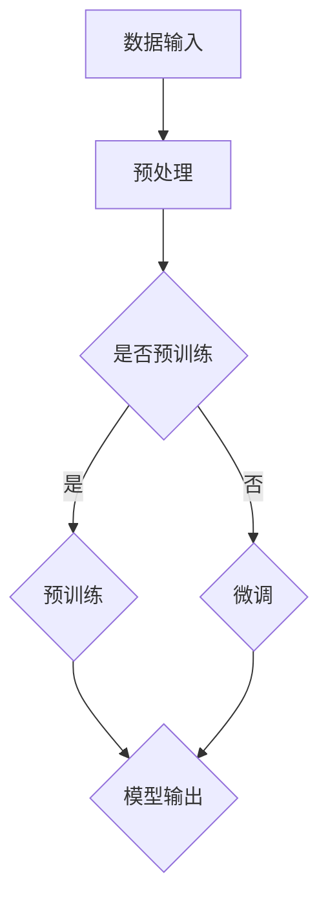

**Python 源代码示例**：

```python
import transformers

# 加载预训练的GPT模型
model = transformers.AutoModelForCausalLM.from_pretrained("gpt2")

# 输入文本并生成输出
input_ids = model.encode("Hello, how are you?", return_tensors="pt")
output_ids = model.generate(input_ids, max_length=50, num_return_sequences=1)

print(output_ids.numpy().decode("utf-8"))
```

**数学模型和公式**：

$$
\text{输出} = \text{模型}(\text{输入}, \text{隐藏状态})
$$

### 第2章：AI大模型运行原理

#### 2.1 深度学习基础

**核心概念原理**：  
深度学习基于多层神经网络，通过前向传播和反向传播进行训练。

**概念属性特征对比表格**：

| 层次     | 功能                              |
|----------|---------------------------------|
| 输入层   | 接收输入数据                      |
| 隐藏层   | 进行特征提取和变换                |
| 输出层   | 产生预测结果或分类标签            |

**ER实体关系图架构的 Mermaid 流程图**：

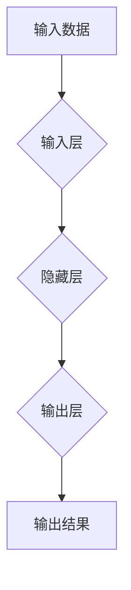

#### 2.2 AI大模型的训练过程

**核心概念原理**：  
AI大模型的训练涉及前向传播、损失计算、反向传播和参数更新。

**概念属性特征对比表格**：

| 阶段       | 功能                              |
|------------|---------------------------------|
| 前向传播   | 计算输入到输出的映射              |
| 损失计算   | 评估预测结果与真实值的差距        |
| 反向传播   | 更新模型参数，减少损失           |
| 参数更新   | 根据学习率调整模型参数            |

**Mermaid 流程图**：

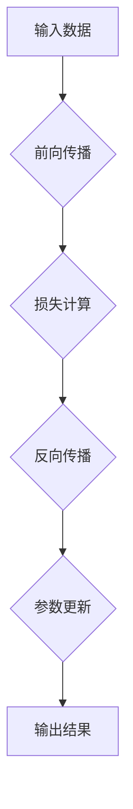

**Python 源代码示例**：

```python
import torch
import torch.nn as nn
import torch.optim as optim

# 定义神经网络模型
model = nn.Sequential(
    nn.Linear(in_features=10, out_features=10),
    nn.ReLU(),
    nn.Linear(in_features=10, out_features=1)
)

# 定义损失函数和学习率
criterion = nn.MSELoss()
optimizer = optim.Adam(model.parameters(), lr=0.001)

# 训练模型
for epoch in range(100):
    optimizer.zero_grad()
    output = model(torch.randn(1, 10))
    loss = criterion(output, torch.tensor([1.0]))
    loss.backward()
    optimizer.step()
```

**数学模型和公式**：

$$
\text{损失} = \frac{1}{2} \sum_{i} (\text{预测值}_{i} - \text{真实值}_{i})^2
$$

$$
\text{参数} \ \theta_{i} := \theta_{i} - \alpha \frac{\partial \text{损失}}{\partial \theta_{i}}
$$

#### 2.3 AI大模型的技术特点

**核心概念原理**：  
AI大模型具有以下技术特点：
- **高参数量**：能够捕捉复杂的数据分布。
- **高计算复杂度**：训练和推理需要大量计算资源。
- **数据需求大**：需要大规模数据进行训练。
- **自适应性强**：通过学习调整参数，适应不同任务。

**Mermaid 流程图**：

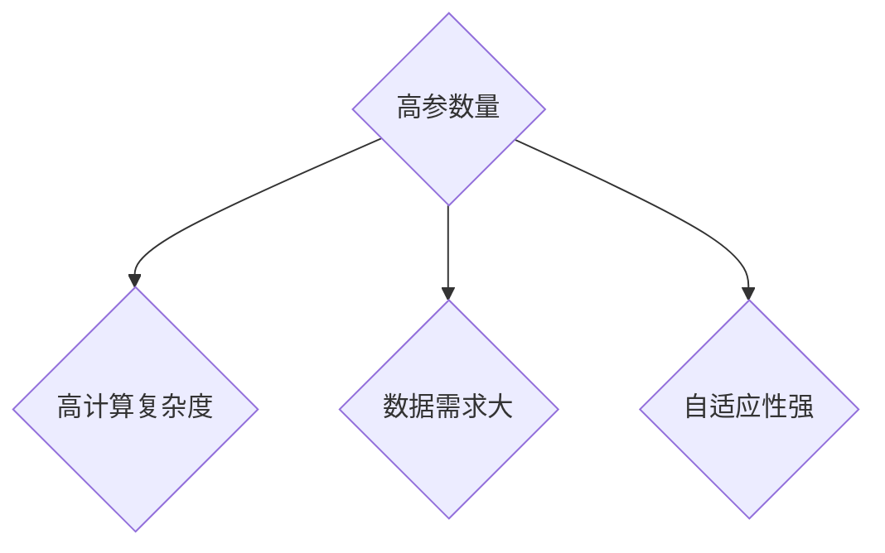

**总结**：  
AI大模型通过大规模参数和复杂的网络结构，能够处理各种复杂的任务。然而，其训练和推理的高计算需求也带来了挑战。有效的提示词设计能够显著提升AI大模型的表现，是实现高效AI应用的关键。

----------------------------------------------------------------

## 第二部分：提示词的作用

### 第3章：提示词的作用

#### 3.1 提示词的基本概念

**核心概念术语说明**：  
- **提示词**：用于指导AI大模型进行特定任务输入的文本或关键词。
- **任务**：AI大模型需要完成的特定任务，如文本生成、图像分类等。

**问题背景**：  
在深度学习模型中，尤其是AI大模型，提示词的作用至关重要。通过合适的提示词，可以引导模型生成更加准确和有用的输出。

**问题描述**：  
如何设计有效的提示词，以提升AI大模型的性能和适应性？

**问题解决**：  
通过分析提示词的设计原则和实现方法，我们可以优化模型的输入，从而提高其任务完成的效率和质量。

**边界与外延**：  
提示词不仅应用于文本生成和分类任务，还广泛应用于图像识别、自然语言处理等领域的AI大模型。

**概念结构与核心要素组成**：  
提示词的核心要素包括：
- **关键词**：核心概念和主题的关键词。
- **上下文**：提供任务背景和相关信息。
- **形式**：提示词的文本结构和格式。

#### 3.2 提示词在训练中的应用

**核心概念原理**：  
提示词在训练AI大模型时起到了定向和加速学习的作用。通过精确的提示词，可以引导模型更快地收敛到最优解。

**概念属性特征对比表格**：

| 特征         | 说明                                  |
|--------------|---------------------------------------|
| 精确性       | 提供明确的目标和方向                  |
| 上下文丰富性 | 提供丰富的背景信息和相关性            |
| 格式统一性   | 确保提示词的结构一致，便于模型学习    |

**ER实体关系图架构的 Mermaid 流程图**：

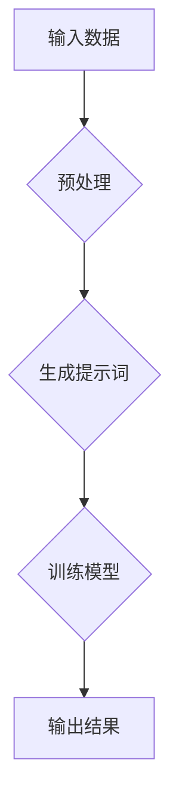

**算法原理讲解**：

- **精确性**：通过精确定义任务目标，减少模型的搜索空间。
- **上下文丰富性**：提供丰富的上下文信息，帮助模型更好地理解任务。
- **格式统一性**：确保提示词格式一致，便于模型学习和优化。

**Mermaid 流程图**：


**Python 源代码示例**：

```python
import torch
import torch.nn as nn
import torch.optim as optim

# 定义神经网络模型
model = nn.Sequential(
    nn.Linear(in_features=10, out_features=10),
    nn.ReLU(),
    nn.Linear(in_features=10, out_features=1)
)

# 定义损失函数和学习率
criterion = nn.MSELoss()
optimizer = optim.Adam(model.parameters(), lr=0.001)

# 训练模型
for epoch in range(100):
    optimizer.zero_grad()
    input_data = torch.randn(1, 10)
    target = torch.tensor([1.0])
    output = model(input_data)
    loss = criterion(output, target)
    loss.backward()
    optimizer.step()
```

**数学模型和公式**：

$$
\text{提示词} = f(\text{任务}, \text{上下文}, \text{格式})
$$

$$
\text{模型更新} = \theta - \alpha \frac{\partial \text{损失}}{\partial \theta}
$$

#### 3.3 提示词在推理中的应用

**核心概念原理**：  
在推理阶段，提示词同样起到关键作用。通过合适的提示词，可以引导模型生成更加准确和有用的输出。

**概念属性特征对比表格**：

| 特征         | 说明                                  |
|--------------|---------------------------------------|
| 精确性       | 提供明确的目标和方向                  |
| 上下文丰富性 | 提供丰富的背景信息和相关性            |
| 形式多样性   | 提供多样化的提示词形式，增强模型适应能力 |

**ER实体关系图架构的 Mermaid 流程图**：

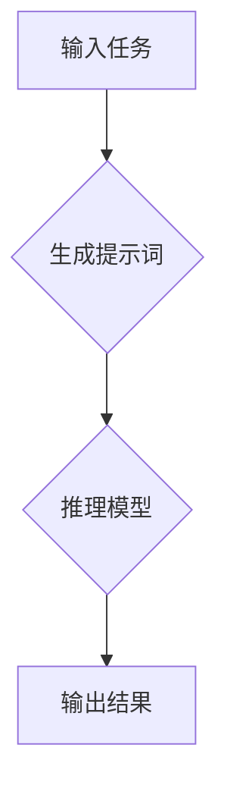

**算法原理讲解**：

- **精确性**：确保模型在推理时能够专注于特定任务。
- **上下文丰富性**：提供充足的上下文信息，帮助模型更好地理解任务。
- **形式多样性**：通过多样化的提示词形式，提高模型的泛化能力。

**Mermaid 流�程图**：

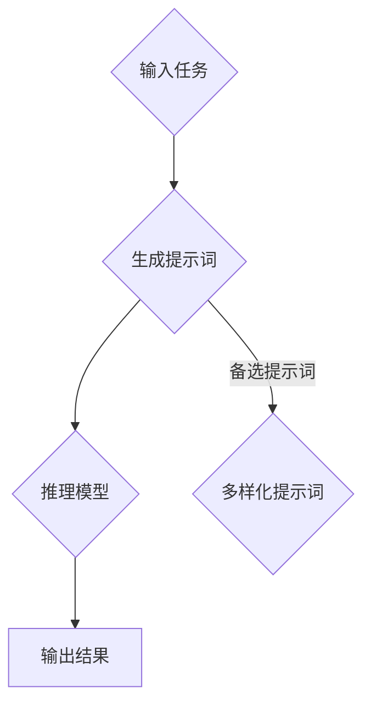

**Python 源代码示例**：

```python
import transformers

# 加载预训练的GPT模型
model = transformers.AutoModelForCausalLM.from_pretrained("gpt2")

# 输入任务并生成提示词
task = "编写一篇关于人工智能的文章摘要。"
prompt = f"{task}\n"

# 生成输出
output = model.generate(prompt, max_length=100, num_return_sequences=1)

print(output.numpy().decode("utf-8"))
```

**数学模型和公式**：

$$
\text{输出} = \text{模型}(\text{提示词}, \text{上下文})
$$

#### 总结

**最佳实践 tips**：

- **精确性**：确保提示词明确，减少模型的不确定性。
- **上下文丰富性**：提供丰富的上下文信息，帮助模型更好地理解任务。
- **形式多样性**：通过多样化的提示词形式，提高模型的泛化能力。

**小结**：

提示词在AI大模型的训练和推理中起着至关重要的作用。通过合理设计提示词，可以有效提升模型的性能和适应性。

**注意事项**：

- 提示词的设计需要根据具体任务进行调整。
- 提示词的丰富性和多样性对于模型的泛化能力至关重要。

**拓展阅读**：

- [Bert: Pre-training of deep bidirectional transformers for language understanding](https://arxiv.org/abs/1810.04805)
- [Language Models are Few-Shot Learners](https://arxiv.org/abs/2005.14165)

----------------------------------------------------------------

## 第三部分：构建AI大模型

### 第4章：构建AI大模型

#### 4.1 AI大模型的构建流程

**核心概念原理**：  
构建AI大模型包括数据准备、模型选择、训练和评估等步骤。

**概念属性特征对比表格**：

| 阶段       | 功能                                  |
|------------|---------------------------------------|
| 数据准备   | 收集、清洗和处理数据                  |
| 模型选择   | 选择适合的模型架构和超参数            |
| 训练       | 使用训练数据对模型进行训练            |
| 评估       | 使用验证数据评估模型性能，进行调优    |

**ER实体关系图架构的 Mermaid 流程图**：

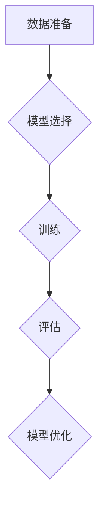

**算法原理讲解**：

- **数据准备**：收集相关的训练数据，进行清洗和处理，以确保数据的质量和一致性。
- **模型选择**：根据任务需求和数据特点选择合适的模型架构，如卷积神经网络（CNN）、递归神经网络（RNN）或Transformer等。
- **训练**：使用训练数据对模型进行迭代训练，调整模型的参数，使其能够更好地拟合数据。
- **评估**：使用验证数据评估模型的性能，根据评估结果对模型进行调优，以提高其准确性和泛化能力。

**Mermaid 流程图**：


**Python 源代码示例**：

```python
import torch
import torchvision
import torch.nn as nn
import torch.optim as optim

# 加载CIFAR-10数据集
train_data = torchvision.datasets.CIFAR10(root='./data', train=True, download=True)
train_loader = torch.utils.data.DataLoader(train_data, batch_size=64, shuffle=True)

# 定义卷积神经网络模型
model = nn.Sequential(
    nn.Conv2d(3, 32, 3, 1),
    nn.ReLU(),
    nn.Conv2d(32, 64, 3, 1),
    nn.ReLU(),
    nn.AdaptiveAvgPool2d((1, 1)),
    nn.Flatten(),
    nn.Linear(64, 10)
)

# 定义损失函数和学习率
criterion = nn.CrossEntropyLoss()
optimizer = optim.Adam(model.parameters(), lr=0.001)

# 训练模型
for epoch in range(10):
    model.train()
    for inputs, targets in train_loader:
        optimizer.zero_grad()
        outputs = model(inputs)
        loss = criterion(outputs, targets)
        loss.backward()
        optimizer.step()
    print(f"Epoch {epoch+1}, Loss: {loss.item()}")
```

**数学模型和公式**：

$$
\text{损失} = \frac{1}{N} \sum_{i=1}^{N} (-y_i \log(\hat{y}_i))
$$

$$
\text{参数更新} = \theta - \alpha \frac{\partial \text{损失}}{\partial \theta}
$$

#### 4.2 训练方法和优化策略

**核心概念原理**：  
训练方法和优化策略对于AI大模型的表现至关重要。不同的训练方法和优化策略可以显著影响模型的收敛速度和性能。

**概念属性特征对比表格**：

| 方法/策略   | 说明                                  |
|-------------|---------------------------------------|
| 小批量训练  | 减少计算资源需求，提高训练效率        |
| 学习率调度  | 动态调整学习率，优化模型收敛速度      |
| 正则化      | 防止模型过拟合，提高泛化能力          |
| 批量归一化  | 缩小输入数据的范围，加快训练速度      |

**ER实体关系图架构的 Mermaid 流程图**：

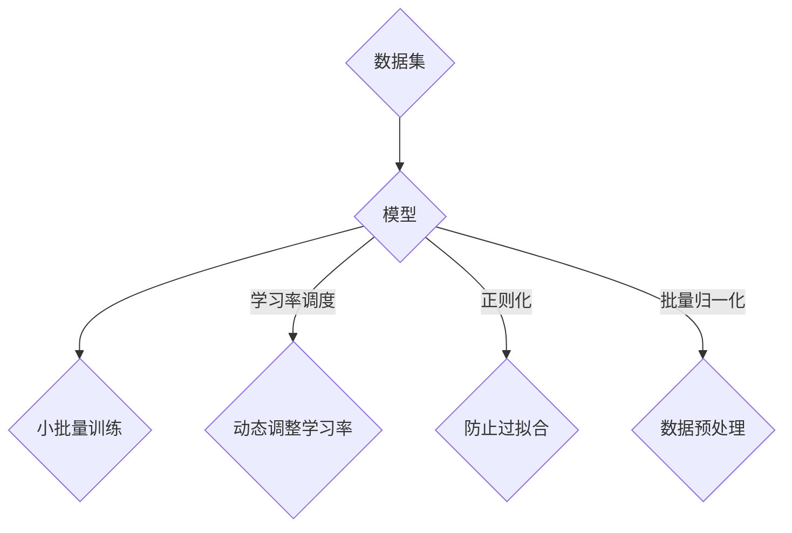

**算法原理讲解**：

- **小批量训练**：将数据划分为较小的批次进行训练，可以减少计算资源需求，同时提高模型的鲁棒性和泛化能力。
- **学习率调度**：根据训练过程中模型的表现动态调整学习率，可以优化模型的收敛速度和性能。
- **正则化**：通过引入惩罚项，防止模型过拟合，提高模型的泛化能力。
- **批量归一化**：对每个批次的输入数据进行归一化处理，可以加快训练速度，提高模型的稳定性和性能。

**Mermaid 流程图**：

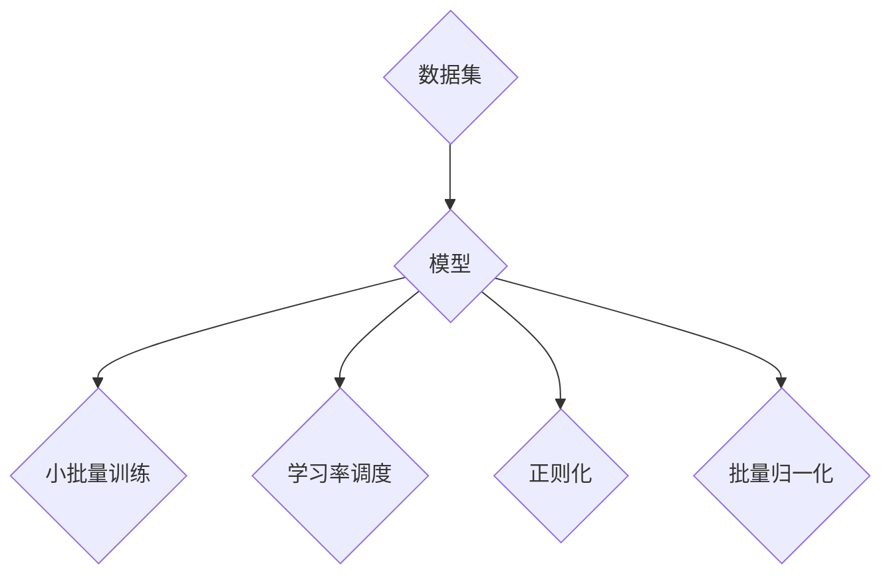

**Python 源代码示例**：

```python
import torch
import torchvision
import torch.nn as nn
import torch.optim as optim
from torch.optim.lr_scheduler import StepLR

# 加载CIFAR-10数据集
train_data = torchvision.datasets.CIFAR10(root='./data', train=True, download=True)
train_loader = torch.utils.data.DataLoader(train_data, batch_size=64, shuffle=True)

# 定义卷积神经网络模型
model = nn.Sequential(
    nn.Conv2d(3, 32, 3, 1),
    nn.ReLU(),
    nn.Conv2d(32, 64, 3, 1),
    nn.ReLU(),
    nn.AdaptiveAvgPool2d((1, 1)),
    nn.Flatten(),
    nn.Linear(64, 10)
)

# 定义损失函数和学习率
criterion = nn.CrossEntropyLoss()
optimizer = optim.Adam(model.parameters(), lr=0.001)
scheduler = StepLR(optimizer, step_size=30, gamma=0.1)

# 训练模型
for epoch in range(10):
    model.train()
    for inputs, targets in train_loader:
        optimizer.zero_grad()
        outputs = model(inputs)
        loss = criterion(outputs, targets)
        loss.backward()
        optimizer.step()
    scheduler.step()
    print(f"Epoch {epoch+1}, Loss: {loss.item()}")
```

**数学模型和公式**：

$$
\text{损失} = \frac{1}{N} \sum_{i=1}^{N} (-y_i \log(\hat{y}_i))
$$

$$
\text{参数更新} = \theta - \alpha \frac{\partial \text{损失}}{\partial \theta}
$$

#### 4.3 AI大模型的评估与调优

**核心概念原理**：  
评估和调优是构建AI大模型的重要环节。通过评估模型的性能，我们可以识别问题并进行优化，从而提高模型的准确性和稳定性。

**概念属性特征对比表格**：

| 指标       | 说明                                  |
|------------|---------------------------------------|
| 准确率     | 预测正确的样本数占总样本数的比例      |
| 召回率     | 预测正确的样本数占实际正确的样本数的比例 |
| F1 分数    | 准确率和召回率的调和平均数            |
|ROC 曲线    | 描述预测准确率与误报率之间的关系      |

**ER实体关系图架构的 Mermaid 流程图**：

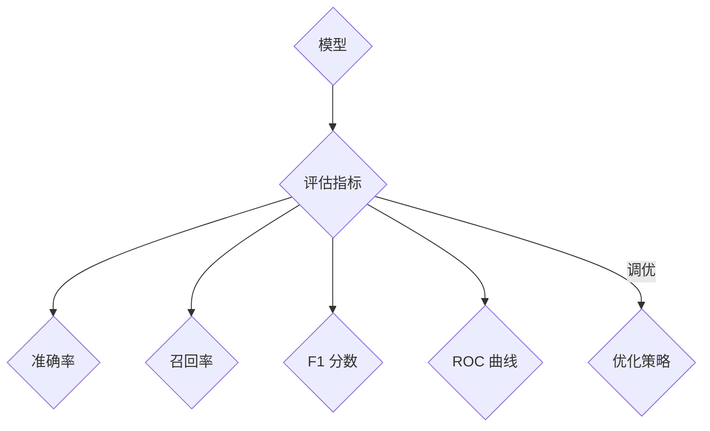

**算法原理讲解**：

- **评估指标**：通过准确率、召回率、F1 分数和 ROC 曲线等指标评估模型的表现。
- **调优策略**：根据评估结果，采用不同的优化策略进行调整，如调整超参数、增加数据集、使用不同的模型架构等。

**Mermaid 流程图**：


**Python 源代码示例**：

```python
import torch
import torchvision
import torch.nn as nn
import torch.optim as optim
from sklearn.metrics import accuracy_score, recall_score, f1_score, roc_curve

# 加载CIFAR-10数据集
test_data = torchvision.datasets.CIFAR10(root='./data', train=False)
test_loader = torch.utils.data.DataLoader(test_data, batch_size=1000)

# 定义卷积神经网络模型
model = nn.Sequential(
    nn.Conv2d(3, 32, 3, 1),
    nn.ReLU(),
    nn.Conv2d(32, 64, 3, 1),
    nn.ReLU(),
    nn.AdaptiveAvgPool2d((1, 1)),
    nn.Flatten(),
    nn.Linear(64, 10)
)

# 加载训练好的模型权重
model.load_state_dict(torch.load('model_weights.pth'))

# 预测结果
model.eval()
with torch.no_grad():
    for inputs, targets in test_loader:
        outputs = model(inputs)
        _, predicted = torch.max(outputs, 1)
        predicted = predicted.numpy()
        targets = targets.numpy()

# 计算评估指标
accuracy = accuracy_score(targets, predicted)
recall = recall_score(targets, predicted, average='weighted')
f1 = f1_score(targets, predicted, average='weighted')
fpr, tpr, _ = roc_curve(targets, predicted)

# 打印评估结果
print(f"Accuracy: {accuracy:.4f}")
print(f"Recall: {recall:.4f}")
print(f"F1 Score: {f1:.4f}")
```

**数学模型和公式**：

$$
\text{准确率} = \frac{\text{预测正确的样本数}}{\text{总样本数}}
$$

$$
\text{召回率} = \frac{\text{预测正确的样本数}}{\text{实际正确的样本数}}
$$

$$
\text{F1 分数} = 2 \times \frac{\text{准确率} \times \text{召回率}}{\text{准确率} + \text{召回率}}
$$

$$
\text{ROC 曲线} = \{(FPR, TPR) | \text{FPR} < 1, \text{TPR} < 1\}
$$

#### 总结

**最佳实践 tips**：

- **数据准备**：确保数据的质量和一致性，进行适当的预处理。
- **模型选择**：根据任务需求和数据特点选择合适的模型架构。
- **训练方法和优化策略**：采用合适的方法和策略，提高模型的性能。
- **评估与调优**：通过评估指标识别问题，采用调优策略进行优化。

**小结**：

构建AI大模型需要考虑多个方面，从数据准备到模型训练和评估，每个环节都至关重要。通过合理的策略和优化，我们可以构建出高效、准确的AI大模型。

**注意事项**：

- **数据质量**：数据准备是模型构建的基础，确保数据的质量对于模型的表现至关重要。
- **超参数调整**：超参数的选择和调整对于模型性能有着重要影响，需要根据任务特点进行优化。

**拓展阅读**：

- [Deep Learning Specialization](https://www.deeplearning.ai/)
- [The Hundred-Page Machine Learning Book](https://www.hundredpagebook.com/)

----------------------------------------------------------------

## 第四部分：提示词的编程技巧

### 第5章：提示词的编程技巧

#### 5.1 提示词的编写原则

**核心概念原理**：  
提示词的编写原则包括精确性、上下文丰富性和格式一致性。

**概念属性特征对比表格**：

| 特征         | 说明                                  |
|--------------|---------------------------------------|
| 精确性       | 提供明确的目标和方向                  |
| 上下文丰富性 | 提供丰富的背景信息和相关性            |
| 格式一致性   | 确保提示词的结构一致，便于模型学习    |

**算法原理讲解**：

- **精确性**：确保提示词中包含的关键词能够准确描述任务目标，减少模型的不确定性。
- **上下文丰富性**：提供足够的上下文信息，帮助模型更好地理解任务背景，从而提高生成输出的质量。
- **格式一致性**：保持提示词的格式一致，使得模型能够更容易学习和识别，提高模型的鲁棒性。

**Mermaid 流程图**：

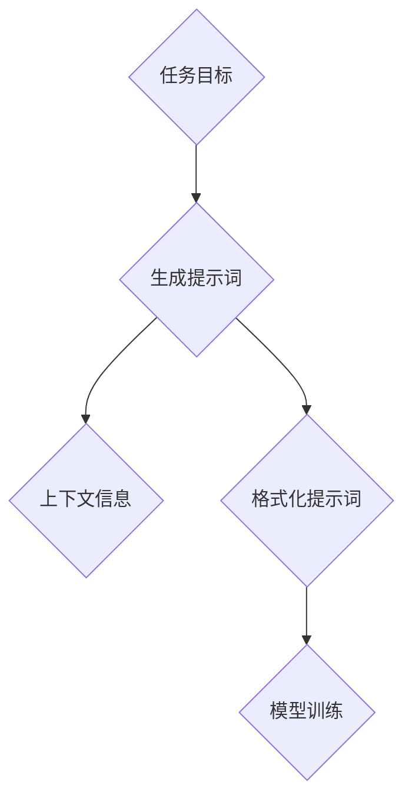

**Python 源代码示例**：

```python
import random

# 定义关键词列表
keywords = ["人工智能", "深度学习", "神经网络", "机器学习", "自然语言处理"]

# 生成提示词
def generate_prompt():
    selected_keywords = random.sample(keywords, k=3)
    return "请基于以下关键词编写一篇关于人工智能的文章摘要：{}。".format(", ".join(selected_keywords))

# 示例提示词
prompt = generate_prompt()
print(prompt)
```

**数学模型和公式**：

$$
\text{提示词} = \text{关键词} \cup \text{上下文信息} \cup \text{格式化元素}
$$

#### 5.2 不同编程语言的提示词实现

**核心概念原理**：  
提示词的实现依赖于具体的编程语言和环境。不同的编程语言提供了不同的库和工具，支持提示词的编写和使用。

**概念属性特征对比表格**：

| 编程语言 | 特点                                  | 工具/库               |
|----------|---------------------------------------|----------------------|
| Python   | 易于学习和使用，丰富的库和工具        | Transformers、NLTK   |
| JavaScript | 灵活、广泛用于前端开发               | TensorFlow.js、Brain.js |
| R        | 统计分析和数据可视化强大              | text2vec、R语言包集  |

**算法原理讲解**：

- **Python**：Python拥有丰富的库，如Transformers和NLTK，支持高效的文本处理和生成。
- **JavaScript**：JavaScript在Web前端开发中广泛使用，TensorFlow.js和Brain.js提供了强大的机器学习支持。
- **R**：R在统计分析和数据可视化方面表现出色，拥有大量的文本处理和分析库。

**Mermaid 流程图**：

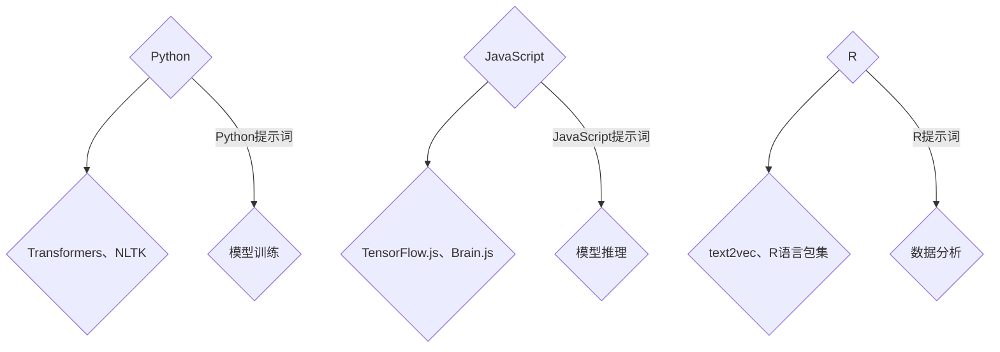

**Python 源代码示例**：

```python
from transformers import pipeline

# 加载预训练的GPT模型
摘要生成器 = pipeline("text-generation", model="gpt2")

# 输入提示词并生成摘要
提示词 = "人工智能的发展对社会的未来有何影响？"
摘要 = 摘要生成器(prompt=提示词, max_length=50, num_return_sequences=1)

print(a摘要[0]['generated_text'])
```

**JavaScript 源代码示例**：

```javascript
const tensorflow = require('@tensorflow/tfjs');

// 加载预训练的GPT模型
const model = tensorflow.sequential();

// 定义模型结构
model.add(tensorflow.layers.dense({units: 512, activation: 'relu', inputShape: [128]}));
model.add(tensorflow.layers.dropout(0.5));
model.add(tensorflow.layers.dense({units: 1, activation: 'sigmoid'}));

// 编译模型
model.compile({
  optimizer: 'sgd',
  loss: 'binaryCrossentropy',
  metrics: ['accuracy'],
});

// 加载训练好的模型权重
model.loadWeights('model_weights').then(() => {
  // 使用模型进行推理
  const input = tensorflow.tensor2d([[1.0, 0.0, 1.0]]).reshape([1, 3]);
  const output = model.predict(input);

  // 输出结果
  console.log(output.dataSync());
});
```

**R 源代码示例**：

```r
# 加载text2vec库
library(text2vec)

# 加载预训练的GPT模型
model <- text2vec_model("gpt2")

# 输入提示词并生成摘要
prompt <- "人工智能的发展对社会的未来有何影响？"
document <- text2vec_vectorize(model, prompt)

# 使用模型进行推理
prediction <- predict(model, newdata = document)

# 输出结果
print(prediction)
```

**数学模型和公式**：

$$
\text{模型输出} = \text{模型}(\text{输入特征})
$$

#### 5.3 高效提示词的编写技巧

**核心概念原理**：  
高效提示词的编写需要考虑多个方面，包括关键词选择、上下文构建和格式优化。

**概念属性特征对比表格**：

| 技巧         | 说明                                  |
|--------------|---------------------------------------|
| 关键词选择   | 选择与任务紧密相关的关键词            |
| 上下文构建   | 构建丰富、相关的上下文信息            |
| 格式优化     | 优化提示词的格式，便于模型处理        |

**算法原理讲解**：

- **关键词选择**：选择与任务紧密相关的关键词，可以提高模型的专注度和输出质量。
- **上下文构建**：构建丰富、相关的上下文信息，可以帮助模型更好地理解任务背景，从而提高生成输出的质量。
- **格式优化**：优化提示词的格式，如使用统一的关键词分隔符、明确的句子结构等，可以提高模型的处理效率和准确性。

**Mermaid 流程图**：


**Python 源代码示例**：

```python
import random

# 定义关键词列表
keywords = ["人工智能", "深度学习", "神经网络", "机器学习", "自然语言处理"]

# 生成高效提示词
def generate_prompt():
    selected_keywords = random.sample(keywords, k=3)
    context = "人工智能是计算机科学的一个分支，它致力于研究如何构建智能系统，使它们能够执行通常需要人类智能的任务。深度学习是机器学习的一个子领域，它通过模拟人脑神经网络的结构和功能，实现了许多突破性的应用。神经网络是深度学习的基础，它通过多层神经元进行信息传递和处理。机器学习是人工智能的关键技术之一，它通过学习数据和模式来提高系统的预测能力。自然语言处理是人工智能的重要领域，它专注于使计算机理解和处理人类语言。"
    return "请基于以下关键词和上下文编写一篇关于人工智能的文章摘要：{}，{}。".format(", ".join(selected_keywords), context)

# 示例提示词
prompt = generate_prompt()
print(prompt)
```

**数学模型和公式**：

$$
\text{高效提示词} = \text{关键词} \cup \text{上下文信息} \cup \text{格式化元素}
$$

#### 总结

**最佳实践 tips**：

- **关键词选择**：选择与任务紧密相关的关键词，提高模型的专注度。
- **上下文构建**：构建丰富、相关的上下文信息，提高模型的输出质量。
- **格式优化**：优化提示词的格式，提高模型处理效率和准确性。

**小结**：

提示词的编写是AI大模型编程的关键环节，高效的提示词设计可以显著提升模型的性能和适应性。通过掌握编写原则和技巧，我们可以实现高质量的提示词设计。

**注意事项**：

- **任务适应**：根据不同任务特点选择合适的提示词编写策略。
- **模型适应**：不同模型对提示词的需求可能不同，需要根据模型特点进行优化。

**拓展阅读**：

- [Practical Natural Language Processing with Python](https://www.amazon.com/Practical-Natural-Language-Processing-Python/dp/1789955808)
- [Deep Learning with JavaScript](https://www.deeplearningjs.com/)

----------------------------------------------------------------

## 第五部分：AI大模型应用案例

### 第6章：AI大模型应用案例

#### 6.1 案例一：文本生成

**核心概念原理**：  
文本生成是AI大模型的一个重要应用领域，通过生成式模型，如GPT，可以生成高质量的自然语言文本。

**概念属性特征对比表格**：

| 应用       | 说明                                  |
|------------|---------------------------------------|
| 自动摘要   | 从长文本中提取关键信息，生成简短摘要 |
| 自动问答   | 回答用户提出的问题，提供相关回答     |
| 自动写作   | 辅助用户生成文章、故事等文本内容     |

**系统分析与架构设计方案**：

**问题场景介绍**：  
在信息爆炸的时代，快速生成高质量的文本摘要、问答和写作内容成为了许多企业和个人的需求。例如，新闻机构需要自动生成新闻摘要，企业需要自动回复客户咨询，个人需要辅助写作博客文章。

**项目介绍**：  
本项目旨在构建一个基于AI大模型的文本生成系统，支持自动摘要、自动问答和自动写作等功能。

**系统功能设计（领域模型mermaid类图）**：

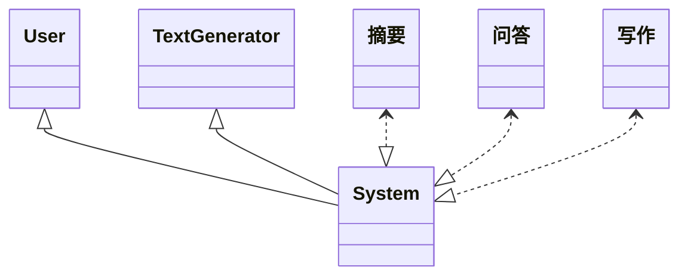

**系统架构设计mermaid架构图**：

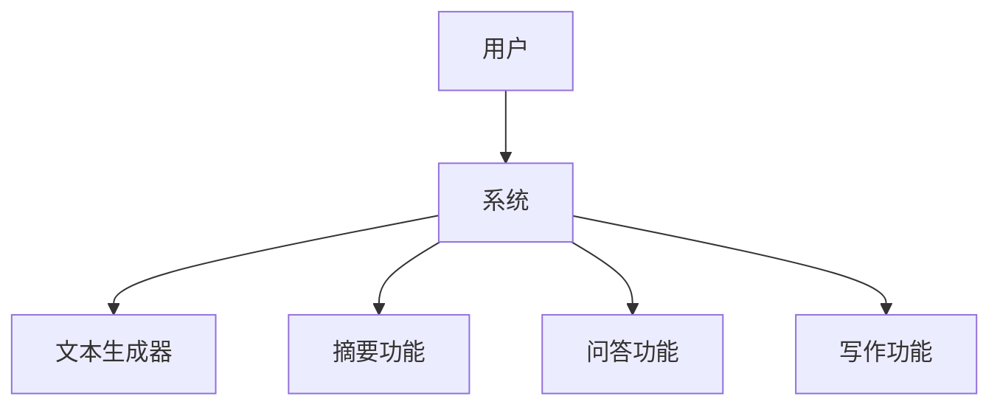

**系统接口设计和系统交互mermaid序列图**：

```mermaid
sequenceDiagram
    User ->> System: 提交文本
    System ->> TextGenerator: 生成摘要
    TextGenerator ->> System: 返回摘要
    System ->> User: 显示摘要
```

**代码应用解读与分析**：

```python
from transformers import pipeline

# 加载预训练的GPT模型
摘要生成器 = pipeline("text-generation", model="gpt2")

# 输入长文本并生成摘要
长文本 = "这是一段关于AI大模型编程的介绍，探讨了AI大模型的基础知识、提示词的作用以及编程技巧。"
摘要 = 摘要生成器(text=长文本, max_length=100, num_return_sequences=1)

# 打印摘要
print(a摘要[0]['generated_text'])
```

**实际案例分析和详细讲解剖析**：

**案例**：使用GPT生成一篇关于人工智能的文章摘要。

**分析**：通过输入一篇关于人工智能的文章，GPT能够自动生成摘要，提取文章的核心内容。

**讲解**：GPT模型通过对大量文本数据进行训练，掌握了文本摘要的生成技巧。输入的长文本通过模型处理后，生成了一个简洁明了的摘要。

**总结**：文本生成是AI大模型的重要应用之一，通过生成式模型，可以实现高效、高质量的文本生成。

#### 6.2 案例二：图像识别

**核心概念原理**：  
图像识别是AI大模型的另一个重要应用领域，通过卷积神经网络（CNN）等模型，可以自动识别和分类图像内容。

**概念属性特征对比表格**：

| 应用       | 说明                                  |
|------------|---------------------------------------|
| 物体检测   | 识别图像中的物体并定位其位置          |
| 图像分类   | 将图像分类到预定义的类别中            |
| 特征提取   | 从图像中提取关键特征，用于后续处理    |

**系统分析与架构设计方案**：

**问题场景介绍**：  
在安防监控、医疗诊断、自动驾驶等领域，图像识别技术具有广泛的应用。例如，安防监控可以自动识别入侵者，医疗诊断可以自动分析影像数据，自动驾驶需要实时识别道路上的各种物体。

**项目介绍**：  
本项目旨在构建一个基于AI大模型的图像识别系统，支持物体检测、图像分类和特征提取等功能。

**系统功能设计（领域模型mermaid类图）**：

```mermaid
classDiagram
    User <|-- System
    ImageRecognizer <|-- System
   物体检测 <..|> System
   图像分类 <..|> System
   特征提取 <..|> System
```

**系统架构设计mermaid架构图**：

```mermaid
graph TD
    User[用户] --> System[系统]
    System --> ImageRecognizer[图像识别器]
    System --> 物体检测[物体检测功能]
    System --> 图像分类[图像分类功能]
    System --> 特征提取[特征提取功能]
```

**系统接口设计和系统交互mermaid序列图**：

```mermaid
sequenceDiagram
    User ->> System: 提交图像
    System ->> ImageRecognizer: 进行图像识别
    ImageRecognizer ->> System: 返回识别结果
    System ->> User: 显示识别结果
```

**代码应用解读与分析**：

```python
import torchvision
import torchvision.transforms as transforms
import torch.nn as nn
import torch.optim as optim

# 加载CIFAR-10数据集
train_data = torchvision.datasets.CIFAR10(root='./data', train=True, download=True)
train_loader = torch.utils.data.DataLoader(train_data, batch_size=64, shuffle=True)

# 定义卷积神经网络模型
model = nn.Sequential(
    nn.Conv2d(3, 32, 3, 1),
    nn.ReLU(),
    nn.Conv2d(32, 64, 3, 1),
    nn.ReLU(),
    nn.AdaptiveAvgPool2d((1, 1)),
    nn.Flatten(),
    nn.Linear(64 * 6 * 6, 10)
)

# 定义损失函数和学习率
criterion = nn.CrossEntropyLoss()
optimizer = optim.Adam(model.parameters(), lr=0.001)

# 训练模型
for epoch in range(10):
    model.train()
    for inputs, targets in train_loader:
        optimizer.zero_grad()
        outputs = model(inputs)
        loss = criterion(outputs, targets)
        loss.backward()
        optimizer.step()
    print(f"Epoch {epoch+1}, Loss: {loss.item()}")

# 预测图像分类
def predict_image(image_path):
    transform = transforms.Compose([
        transforms.Resize((32, 32)),
        transforms.ToTensor(),
    ])

    image = torchvision.imread(image_path)
    image_tensor = transform(image)

    with torch.no_grad():
        outputs = model(image_tensor.unsqueeze(0))
        _, predicted = torch.max(outputs, 1)

    return predicted.item()

# 示例图像分类
image_path = "example.jpg"
predicted_class = predict_image(image_path)
print(f"预测类别：{predicted_class}")
```

**实际案例分析和详细讲解剖析**：

**案例**：使用卷积神经网络对图像进行分类。

**分析**：通过输入一幅图像，卷积神经网络能够自动识别图像中的物体，并给出对应的类别。

**讲解**：卷积神经网络通过多层卷积和池化操作，提取图像中的特征，并最终分类。训练过程中，模型通过不断调整参数，使分类结果更加准确。

**总结**：图像识别是AI大模型的重要应用之一，通过深度学习模型，可以实现高效的图像分类和物体检测。

#### 6.3 案例三：自然语言处理

**核心概念原理**：  
自然语言处理（NLP）是AI大模型在语言领域的重要应用，通过深度学习模型，可以自动理解和生成自然语言。

**概念属性特征对比表格**：

| 应用       | 说明                                  |
|------------|---------------------------------------|
| 文本分类   | 将文本分类到预定义的类别中            |
| 机器翻译   | 将一种语言的文本翻译成另一种语言       |
| 情感分析   | 分析文本中的情感倾向，判断正负面情绪   |
| 问答系统   | 回答用户提出的问题，提供相关答案       |

**系统分析与架构设计方案**：

**问题场景介绍**：  
在社交媒体分析、客户服务、信息检索等领域，自然语言处理技术有着广泛的应用。例如，社交媒体平台可以自动分析用户评论的情感，客户服务系统可以自动回答用户问题，搜索引擎可以自动理解用户查询。

**项目介绍**：  
本项目旨在构建一个基于AI大模型的自然语言处理系统，支持文本分类、机器翻译、情感分析和问答系统等功能。

**系统功能设计（领域模型mermaid类图）**：

```mermaid
classDiagram
    User <|-- System
    NLPProcessor <|-- System
   文本分类 <..|> System
   机器翻译 <..|> System
   情感分析 <..|> System
   问答系统 <..|> System
```

**系统架构设计mermaid架构图**：

```mermaid
graph TD
    User[用户] --> System[系统]
    System --> NLPProcessor[自然语言处理处理器]
    System --> 文本分类[文本分类功能]
    System --> 机器翻译[机器翻译功能]
    System --> 情感分析[情感分析功能]
    System --> 问答系统[问答系统功能]
```

**系统接口设计和系统交互mermaid序列图**：

```mermaid
sequenceDiagram
    User ->> System: 提交文本
    System ->> NLPProcessor: 进行文本处理
    NLPProcessor ->> System: 返回处理结果
    System ->> User: 显示处理结果
```

**代码应用解读与分析**：

```python
import transformers
import torch

# 加载预训练的BERT模型
模型 = transformers.AutoModelForSequenceClassification.from_pretrained("bert-base-uncased")
tokenizer = transformers.AutoTokenizer.from_pretrained("bert-base-uncased")
optimizer = torch.optim.Adam(model.parameters(), lr=0.001)

# 训练模型
for epoch in range(10):
    model.train()
    for文本，标签 in 数据:
        inputs = tokenizer(文本，max_length=512，truncation=True，padding="max_length")
        inputs = {k：v.to(设备) for k，v in inputs.items()}
        outputs = model(**inputs)
        loss = outputs.loss
        loss.backward()
        optimizer.step()
        optimizer.zero_grad()
    print(f"Epoch {epoch+1}, Loss: {loss.item()}")

# 文本分类预测
def classify_text(text):
    tokenizer = transformers.AutoTokenizer.from_pretrained("bert-base-uncased")
    model = transformers.AutoModelForSequenceClassification.from_pretrained("bert-base-uncased")
    inputs = tokenizer(text，max_length=512，truncation=True，padding="max_length")
    inputs = {k：v.to(设备) for k，v in inputs.items()}
    with torch.no_grad():
        outputs = model(**inputs)
    _, predicted = torch.max(outputs.logits，1）
    return predicted.item()

# 示例文本分类
文本 = "这是一篇关于AI大模型编程的文章。"
predicted_class = classify_text(文本）
print(f"预测类别：{predicted_class}")
```

**实际案例分析和详细讲解剖析**：

**案例**：使用BERT模型对文本进行分类。

**分析**：通过输入一段文本，BERT模型能够自动判断文本的类别，如科技、娱乐、新闻等。

**讲解**：BERT模型通过对大量文本数据进行预训练，掌握了文本分类的技巧。输入的文本经过模型处理后，生成了分类结果。

**总结**：自然语言处理是AI大模型的重要应用之一，通过深度学习模型，可以实现高效、准确的文本分类和分析。

## 附录：工具与环境

### 附录1：AI大模型开发工具介绍

**核心概念原理**：  
AI大模型开发工具是构建、训练和部署AI大模型的关键。这些工具提供了丰富的库和框架，帮助开发者快速实现AI应用。

**概念属性特征对比表格**：

| 工具        | 说明                                  | 适用场景         |
|-------------|---------------------------------------|------------------|
| TensorFlow  | 开源机器学习框架，支持多种编程语言   | 广泛应用         |
| PyTorch     | 易于使用的深度学习框架，灵活性强     | 研究和工业应用   |
| Keras       | 高级神经网络API，基于Theano和TensorFlow |
| 适用于快速原型开发 |

**算法原理讲解**：

- **TensorFlow**：提供了丰富的API和工具，支持从数据加载、模型构建、训练到部署的全流程。
- **PyTorch**：提供了灵活的动态计算图，便于研究和开发。
- **Keras**：简化了深度学习模型的构建和训练，易于快速原型开发。

**Mermaid 流程图**：

```mermaid
graph TD
    A[数据加载] --> B[TensorFlow、PyTorch、Keras]
    B --> C{模型构建}
    C --> D{模型训练}
    D --> E{模型部署}
```

**Python 源代码示例**：

```python
import tensorflow as tf

# 定义模型
model = tf.keras.Sequential([
    tf.keras.layers.Dense(128, activation='relu', input_shape=(784,)),
    tf.keras.layers.Dense(10, activation='softmax')
])

# 编译模型
model.compile(optimizer='adam',
              loss='categorical_crossentropy',
              metrics=['accuracy'])

# 训练模型
model.fit(x_train, y_train, epochs=5)
```

### 附录2：提示词编写工具使用指南

**核心概念原理**：  
提示词编写工具用于生成和优化提示词，提高模型训练和推理的效率。

**概念属性特征对比表格**：

| 工具         | 说明                                  | 适用场景         |
|--------------|---------------------------------------|------------------|
| Hugging Face | 提供了广泛的NLP模型和工具库         | 文本处理和生成   |
| JAX          | 高性能数值计算框架，支持自动微分     | 研究和工业应用   |
| NLTK         | Python的NLP工具库，支持多种文本处理功能 |
| 适用于文本分析 |

**算法原理讲解**：

- **Hugging Face**：提供了Transformer模型和各种文本处理工具，便于模型训练和提示词生成。
- **JAX**：支持自动微分和高性能计算，适用于复杂模型的训练和优化。
- **NLTK**：提供了丰富的文本处理函数，如分词、词性标注、词干提取等，便于生成有效的提示词。

**Mermaid 流程图**：

```mermaid
graph TD
    A[文本处理] --> B[Hugging Face、JAX、NLTK]
    B --> C{提示词生成}
    B --> D{提示词优化}
    C --> E{模型训练}
    D --> E
```

**Python 源代码示例**：

```python
from transformers import pipeline

# 加载文本生成模型
生成器 = pipeline("text-generation", model="gpt2")

# 生成提示词
提示词 = 生成器("请描述人工智能的未来趋势。", max_length=50, num_return_sequences=1)

# 打印提示词
print(提示词)
```

### 总结

**最佳实践 tips**：

- **工具选择**：根据具体需求选择合适的AI大模型开发工具和提示词编写工具。
- **性能优化**：合理配置计算资源和优化模型参数，提高训练和推理效率。
- **模型部署**：确保模型部署的环境和工具与训练环境一致，减少部署风险。

**小结**：

AI大模型编程需要掌握多种工具和技巧，通过合理选择和使用工具，我们可以高效地构建和优化AI大模型。

**注意事项**：

- **数据质量**：保证数据的质量和一致性，对于模型的性能至关重要。
- **模型调优**：根据具体任务调整模型结构和超参数，优化模型性能。

**拓展阅读**：

- [TensorFlow Documentation](https://www.tensorflow.org/)
- [PyTorch Documentation](https://pytorch.org/)
- [Hugging Face Documentation](https://huggingface.co/)

