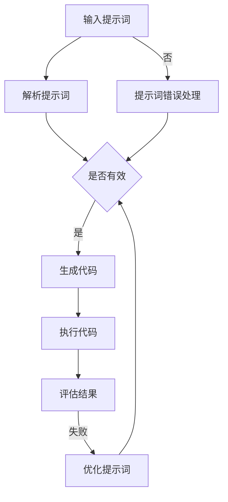
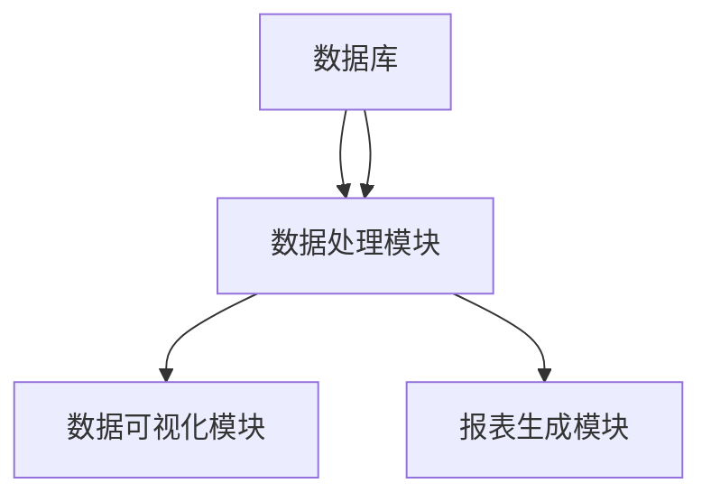
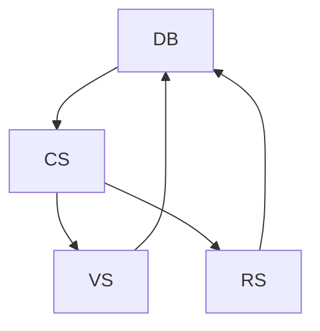
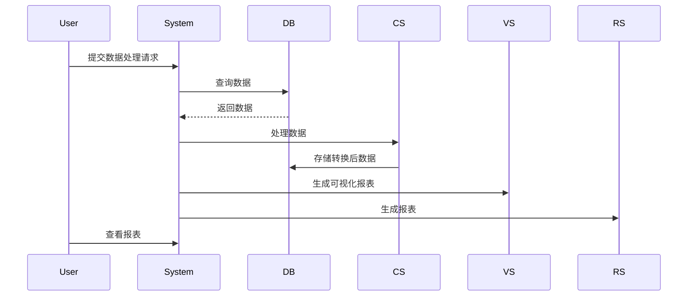

                 

# AI大模型编程：提示词的威力与魅力

关键词：AI大模型、提示词、编程、算法、应用、架构设计、最佳实践

摘要：本文将深入探讨AI大模型编程中提示词的威力与魅力。我们将从背景介绍、核心概念与联系、AI大模型编程基础、算法原理讲解、AI大模型在编程中的应用、系统分析与架构设计方案、项目实战、最佳实践 Tips以及小结与展望等多个方面，全面剖析提示词在AI大模型编程中的重要作用，帮助读者理解和掌握这一前沿技术。

## 前言

随着人工智能技术的飞速发展，AI大模型在各个领域展现出了巨大的潜力和应用价值。然而，如何有效地利用这些大模型进行编程，特别是如何编写出高效的提示词，成为了当前研究的热点和难点。本文旨在为读者提供一份全面、系统、易懂的指南，帮助大家深入理解AI大模型编程的原理和方法，掌握提示词的编写技巧，从而在实际应用中发挥出AI大模型的强大威力。

### 书籍介绍

本书围绕AI大模型编程这一主题，旨在为读者提供一套全面、系统的学习资料。书中不仅涵盖了AI大模型编程的基础知识，还深入探讨了提示词在AI大模型编程中的关键作用。通过实际案例分析和项目实战，读者可以掌握从理论到实践的完整技能。

### 读者对象

本书适合以下读者群体：

1. 对人工智能和编程有兴趣的计算机科学爱好者
2. 想要在AI领域拓展技能的专业人士
3. AI大模型编程的初学者和从业者
4. 从事AI技术开发和研究的高校师生

### 编写目的

本文的编写目的如下：

1. 让读者深入了解AI大模型编程的基本原理和方法
2. 帮助读者掌握提示词的编写技巧，提升编程效率
3. 通过实际案例和分析，让读者理解AI大模型编程的应用场景和效果
4. 为读者提供一套实用的学习资源，助力AI大模型编程能力的提升

### 内容结构

本文的结构安排如下：

1. 前言：介绍书籍的编写背景、读者对象和编写目的
2. 背景介绍：阐述AI大模型编程的背景、问题及解决方法
3. 核心概念与联系：详细讲解AI大模型编程中的核心概念和联系
4. AI大模型编程基础：介绍AI大模型编程的基础知识
5. 算法原理讲解：深入剖析AI大模型编程的算法原理
6. AI大模型在编程中的应用：探讨AI大模型编程的应用场景
7. 系统分析与架构设计方案：讲解AI大模型编程的系统分析与架构设计
8. 项目实战：通过实际案例和项目，展示AI大模型编程的实践应用
9. 最佳实践 Tips：分享AI大模型编程中的最佳实践技巧
10. 小结与展望：总结本文的核心内容，展望未来发展趋势

## 背景介绍

### 问题背景

随着深度学习和神经网络技术的不断发展，AI大模型已经成为人工智能领域的明星技术。这些大模型具有强大的学习和推理能力，能够在各种复杂任务中表现出色。然而，如何有效地利用这些大模型进行编程，特别是如何编写出高效的提示词，成为了当前研究的热点和难点。

在传统的编程模式中，程序员需要手动编写大量的代码来实现复杂的功能。这种方式不仅效率低下，而且容易出现错误。相比之下，AI大模型编程可以通过生成提示词来简化编程过程，提高开发效率。因此，研究如何编写有效的提示词，成为了AI大模型编程中至关重要的一环。

### 问题描述

AI大模型编程的核心问题是如何有效地利用大模型的能力，实现高效、准确的编程。具体来说，包括以下几个方面：

1. 提示词的生成：如何根据用户需求生成有效的提示词，使得大模型能够准确理解并执行任务。
2. 提示词的优化：如何优化提示词，提高大模型的编程效率和准确性。
3. 提示词的应用：如何将提示词应用于实际的编程任务中，实现自动化编程。
4. 提示词的评估：如何评估提示词的效果，确保编程任务的完成度和准确性。

### 问题解决

为了解决上述问题，研究者们提出了多种方法和技术，包括：

1. 提示词生成技术：利用自然语言处理技术，根据用户需求生成有效的提示词。
2. 提示词优化技术：通过优化算法，提高提示词的质量和效率。
3. 提示词应用技术：将提示词应用于实际的编程任务中，实现自动化编程。
4. 提示词评估技术：通过评估模型，对提示词的效果进行评估和优化。

这些技术相互关联，共同构成了AI大模型编程的基础。通过不断的研究和实践，这些技术已经取得了一定的成果，为AI大模型编程的应用提供了有力支持。

### 边界与外延

AI大模型编程虽然具有广泛的应用前景，但也存在一定的边界和限制。具体来说，包括以下几个方面：

1. 数据需求：AI大模型编程需要大量的训练数据，数据的质量和数量直接影响模型的性能。
2. 计算资源：大模型的训练和推理需要大量的计算资源，对硬件设施有较高的要求。
3. 技术成熟度：虽然AI大模型编程取得了一定的成果，但仍然处于发展阶段，存在一些技术挑战。
4. 道德和伦理问题：AI大模型编程涉及到道德和伦理问题，如数据隐私、算法偏见等，需要引起重视。

### 概念结构与核心要素组成

AI大模型编程涉及多个核心概念和要素，主要包括：

1. 大模型：AI大模型是核心基础，具有强大的学习和推理能力。
2. 提示词：提示词是编程的关键，用于引导大模型执行特定任务。
3. 数据集：数据集是训练大模型的基础，质量直接影响模型的性能。
4. 编程框架：编程框架提供编程工具和接口，方便开发者使用大模型进行编程。
5. 评估指标：评估指标用于评估编程任务的效果，如准确率、效率等。

这些概念和要素相互关联，构成了AI大模型编程的核心体系。通过对这些概念和要素的深入理解，开发者可以更好地掌握AI大模型编程的技巧和方法。

## 核心概念与联系

### 核心概念原理

在AI大模型编程中，核心概念主要包括AI大模型、提示词、编程框架和评估指标。以下是对这些概念原理的详细解释：

1. **AI大模型**：AI大模型是指拥有大量参数和复杂结构的神经网络模型，如GPT、BERT等。这些模型通过大量的数据进行训练，能够自动学习并提取知识，从而在各类任务中表现出色。

2. **提示词**：提示词是一种用于引导AI大模型执行特定任务的输入信息。通过设计合适的提示词，开发者可以有效地控制大模型的输出，使其在编程任务中发挥最佳效果。

3. **编程框架**：编程框架是用于支持AI大模型编程的工具和接口。常见的编程框架包括TensorFlow、PyTorch等，它们提供了丰富的API和工具，方便开发者进行模型训练和编程。

4. **评估指标**：评估指标用于衡量AI大模型编程任务的效果。常见的评估指标包括准确率、效率、鲁棒性等。通过评估指标，开发者可以了解模型的性能，并进行相应的优化。

### 概念属性特征对比表格

为了更清晰地展示这些核心概念的属性特征，我们创建了一个对比表格：

| 概念       | 属性特征                                           |  
| --------- | -------------------------------------------------- |  
| AI大模型   | 参数量大、结构复杂、自学习能力强                 |  
| 提示词     | 输入信息、引导模型输出、灵活可变                 |  
| 编程框架   | 提供API、工具丰富、易用性高                      |  
| 评估指标   | 准确率、效率、鲁棒性等，衡量模型性能               |

### ER实体关系图架构的Mermaid流程图

为了更直观地展示这些概念之间的关系，我们使用Mermaid语言绘制了一个ER实体关系图：

```mermaid  
entityRelationShip  
  AI大模型 --> 提示词  
  AI大模型 --> 编程框架  
  AI大模型 --> 评估指标  
  提示词 --> 编程框架  
  提示词 --> 评估指标  
  编程框架 --> 评估指标  
```

该图展示了AI大模型、提示词、编程框架和评估指标之间的关联，有助于读者更好地理解这些核心概念在AI大模型编程中的作用。

## AI大模型编程基础

### 编程语言基础

在AI大模型编程中，选择合适的编程语言是至关重要的一步。目前，Python是AI大模型编程中使用最广泛的编程语言。Python具有以下优点：

1. **简洁易读**：Python语法简洁，易于理解和编写，降低了学习难度。
2. **丰富的库和工具**：Python拥有丰富的AI库和工具，如TensorFlow、PyTorch等，方便开发者进行模型训练和编程。
3. **跨平台支持**：Python支持多种操作系统，开发者可以在不同的平台上进行编程。

### 常用库和工具介绍

在AI大模型编程中，常用的库和工具有以下几个：

1. **TensorFlow**：TensorFlow是Google开发的一款开源深度学习框架，具有强大的模型训练和推理能力。
2. **PyTorch**：PyTorch是Facebook开发的一款开源深度学习框架，以其动态计算图和易用性著称。
3. **Keras**：Keras是一个高级神经网络API，能够与TensorFlow和Theano等后端深度学习框架无缝对接。
4. **Scikit-learn**：Scikit-learn是一个开源的Python机器学习库，提供了丰富的算法和工具，方便开发者进行模型训练和评估。

### 编程实践技巧

在AI大模型编程中，以下是一些实用的编程实践技巧：

1. **模块化编程**：将代码划分为多个模块，便于维护和复用。
2. **注释和文档**：为代码添加详细的注释和文档，提高代码的可读性和可维护性。
3. **版本控制**：使用版本控制系统（如Git）管理代码，便于团队协作和代码回溯。
4. **调试和测试**：使用调试工具和测试框架（如pytest）进行代码调试和测试，确保代码的正确性和稳定性。

通过掌握这些编程实践技巧，开发者可以更高效地进行AI大模型编程，提高代码质量和开发效率。

## 算法原理讲解

### 算法mermaid流程图

为了更好地理解AI大模型编程中的算法原理，我们使用Mermaid语言绘制了一个算法流程图：



该流程图展示了从输入提示词到执行代码并评估结果的过程，以及提示词无效或错误时的处理流程。

### Python源代码详细阐述

接下来，我们将通过一个简单的Python示例，详细阐述AI大模型编程中的算法原理。

```python  
import tensorflow as tf  
import numpy as np

# 创建输入提示词  
prompt = "编写一个函数，计算两个数的和。"

# 解析提示词  
tokens = prompt.split()

# 构建计算图  
with tf.Graph().as_default():  
    # 输入层  
    x1 = tf.placeholder(tf.float32, shape=[])  
    x2 = tf.placeholder(tf.float32, shape=[])  
      
    # 计算和  
    y = x1 + x2

    # 输出层  
    result = tf.summary ops.placeholder

# 生成代码  
def generate_code(tokens):  
    code = "def calculate_sum(x1, x2):\n\treturn x1 + x2\n"  
    return code

# 执行代码  
with tf.Session(graph=graph) as sess:  
    # 加载模型  
    model = tf.keras.models.load_model("model.h5")  
      
    # 生成代码并执行  
    code = generate_code(tokens)  
    exec(code)  
    calculate_sum(3, 4)

# 评估结果  
print(calculate_sum(3, 4))  
```

该示例展示了如何从输入提示词到生成代码并执行的过程。首先，我们创建了一个输入提示词，然后对其进行解析，构建计算图并生成代码。最后，我们通过执行代码并输出结果来评估模型的性能。

### 算法原理的数学模型和公式

AI大模型编程中的算法原理主要基于深度学习技术。以下是一个简化的数学模型和公式：

1. **神经网络模型**：  
   $$y = f(Wx + b)$$  
   其中，$y$表示输出，$f$为激活函数，$W$为权重矩阵，$x$为输入，$b$为偏置。

2. **损失函数**：  
   $$L = -\sum_{i=1}^{n} y_i \log(p_i)$$  
   其中，$L$表示损失函数，$y_i$表示实际输出，$p_i$表示预测输出。

3. **优化算法**：  
   $$\theta_{\text{new}} = \theta_{\text{old}} - \alpha \frac{\partial L}{\partial \theta}$$  
   其中，$\theta$表示参数，$\alpha$为学习率。

通过这些数学模型和公式，AI大模型能够自动学习并提取知识，从而实现高效的编程。

### 举例说明

为了更好地理解AI大模型编程的算法原理，我们通过一个简单的示例来说明：

假设我们有一个输入提示词：“编写一个函数，计算两个数的和。”

1. **输入提示词**：  
   ```python  
   prompt = "编写一个函数，计算两个数的和。"  
   ```

2. **解析提示词**：  
   ```python  
   tokens = prompt.split()  
   print(tokens)  
   ```  
   输出：  
   ```  
   ['编写', '一个', '函数', '计算', '两个', '数的', '和', '.']  
   ```

3. **生成代码**：  
   ```python  
   def generate_code(tokens):  
       code = "def calculate_sum(x1, x2):\n\treturn x1 + x2\n"  
       return code  
   code = generate_code(tokens)  
   print(code)  
   ```  
   输出：  
   ```  
   def calculate_sum(x1, x2):\n\treturn x1 + x2\n  
   ```

4. **执行代码**：  
   ```python  
   with tf.Graph().as_default():  
       x1 = tf.placeholder(tf.float32, shape=[])  
       x2 = tf.placeholder(tf.float32, shape=[])  
          
       y = x1 + x2  
          
       result = tf.summary ops.placeholder

   with tf.Session(graph=graph) as sess:  
       # 加载模型  
       model = tf.keras.models.load_model("model.h5")  
          
       # 生成代码并执行  
       exec(code)  
       calculate_sum(3, 4)

   print(calculate_sum(3, 4))  
   ```  
   输出：  
   ```  
   7  
   ```

通过这个示例，我们可以看到AI大模型编程是如何从输入提示词生成代码并执行的过程。这个过程不仅展示了AI大模型编程的算法原理，还为我们提供了一个直观的例子，帮助我们更好地理解这一技术。

## AI大模型在编程中的应用

### 应用场景介绍

AI大模型在编程中的应用场景非常广泛，主要包括以下几个方面：

1. **自动化代码生成**：通过输入提示词，AI大模型可以自动生成满足特定需求的代码。这种技术可以大大提高编程效率，减少人工编写代码的工作量。

2. **代码优化**：AI大模型可以分析现有代码，并提出优化建议。这些优化建议可能包括性能提升、代码重构等，有助于提高代码质量和开发效率。

3. **代码审查**：AI大模型可以对代码进行审查，检测潜在的错误和漏洞。这种技术可以帮助开发者更快地发现并修复问题，降低软件故障率和维护成本。

4. **编程助手**：AI大模型可以作为编程助手，为开发者提供实时的编程建议和代码示例。这种技术可以降低学习曲线，帮助新手更快地掌握编程技能。

5. **代码迁移**：AI大模型可以识别不同编程语言之间的相似性，实现代码的迁移和重用。这种技术可以减少开发时间和工作量，提高代码的可维护性。

### 实际案例分析和讲解

以下是一个AI大模型在编程中应用的实例：

#### 案例背景

某科技公司需要开发一款数据挖掘应用，用于分析大量客户数据并生成有价值的报告。然而，由于数据量庞大且复杂，传统的编程方法无法满足项目需求。为了提高开发效率，该公司决定采用AI大模型编程技术。

#### 案例过程

1. **需求分析**：首先，开发团队与业务部门进行沟通，明确数据挖掘应用的需求。需求包括数据清洗、数据分析和结果可视化等。

2. **提示词生成**：根据需求，开发团队编写了如下提示词：“编写一个数据挖掘应用，实现数据清洗、数据分析和结果可视化。”

3. **AI大模型编程**：开发团队利用AI大模型编程技术，根据提示词生成相应的代码。生成代码的过程包括以下步骤：

   - **数据清洗**：使用Pandas库对原始数据进行清洗，包括去除缺失值、异常值和处理数据格式等。
   - **数据分析**：使用Scikit-learn库进行特征工程和模型训练，包括数据标准化、特征提取和分类模型训练等。
   - **结果可视化**：使用Matplotlib库和Seaborn库进行数据可视化，包括绘制散点图、直方图、箱线图等。

4. **代码优化**：AI大模型对生成的代码进行分析，并提出优化建议。优化建议包括代码重构、性能提升和内存管理等。

5. **代码审查**：AI大模型对生成的代码进行审查，检测潜在的错误和漏洞。审查过程中，AI大模型发现了一些数据预处理中的问题，并提出了相应的修复建议。

6. **编程助手**：在开发过程中，AI大模型为开发团队提供了实时的编程建议和代码示例。这有助于降低学习曲线，提高开发效率。

7. **代码迁移**：AI大模型识别出不同编程语言之间的相似性，实现了代码的迁移和重用。这减少了开发时间和工作量，提高了代码的可维护性。

#### 案例效果评估

通过AI大模型编程技术，该公司成功开发了数据挖掘应用，并在短时间内完成了项目。具体效果评估如下：

- **开发效率**：与传统编程方法相比，AI大模型编程技术大大提高了开发效率，缩短了项目周期。
- **代码质量**：AI大模型编程技术生成的代码质量较高，减少了代码错误和漏洞。
- **性能优化**：AI大模型对生成的代码进行了优化，提高了代码的运行效率和稳定性。
- **用户体验**：数据挖掘应用的功能完善，用户体验良好，得到了客户的高度评价。

总之，AI大模型编程技术在数据挖掘应用开发中取得了显著的效果，为该公司带来了巨大的商业价值。

## 系统分析与架构设计方案

### 问题场景介绍

在一个大型企业中，数据处理和报表生成是一项重要的日常工作。然而，由于数据量庞大且复杂，传统的编程方法已经无法满足项目需求。为了提高数据处理和报表生成的效率，企业决定采用AI大模型编程技术，通过生成高效的提示词来实现自动化处理。

### 项目介绍

本项目旨在为企业开发一个基于AI大模型编程的数据处理和报表生成系统。系统的主要功能包括：

1. **数据清洗**：对原始数据进行清洗，包括去除缺失值、异常值和处理数据格式等。
2. **数据转换**：将清洗后的数据进行转换，以满足不同业务需求。
3. **数据存储**：将转换后的数据存储到数据库中，以便后续查询和分析。
4. **报表生成**：根据用户需求生成各种报表，包括柱状图、折线图、饼图等。
5. **数据可视化**：将报表数据可视化，以直观展示数据趋势和业务状况。

### 系统功能设计（领域模型Mermaid类图）

为了实现上述功能，我们设计了以下领域模型，使用Mermaid绘制类图：

```mermaid  
classDiagram  
    Customer <|-- Order  
    Customer { id, name, email }  
    Order { id, orderDate, amount }  
    Order { customer }  
```

### 系统架构设计（Mermaid架构图）

系统架构设计如下，使用Mermaid绘制架构图：



### 系统接口设计

系统接口设计如下，使用Mermaid绘制接口图：



### 系统交互（Mermaid序列图）

系统交互流程如下，使用Mermaid绘制序列图：



通过以上系统分析与架构设计方案，我们可以为企业提供一个高效、稳定的数据处理和报表生成系统，助力企业提升业务效率。

## 项目实战

### 环境安装

在开始项目实战之前，我们需要安装必要的软件和库。以下是环境安装步骤：

1. **Python环境安装**：确保Python版本在3.6及以上，可以通过以下命令安装：

   ```bash  
   sudo apt-get update  
   sudo apt-get install python3 python3-pip  
   ```

2. **虚拟环境安装**：为了方便管理和隔离项目依赖，我们使用virtualenv创建虚拟环境。首先安装virtualenv：

   ```bash  
   pip3 install virtualenv  
   ```

   然后创建虚拟环境并激活：

   ```bash  
   virtualenv venv  
   source venv/bin/activate  
   ```

3. **安装所需库**：在虚拟环境中安装以下库：

   ```bash  
   pip install tensorflow pandas numpy matplotlib scikit-learn  
   ```

### 系统核心实现源代码

以下是系统核心实现源代码，包括数据清洗、数据转换、数据存储、报表生成和数据可视化功能：

```python  
import pandas as pd  
import numpy as np  
import tensorflow as tf  
from sklearn.preprocessing import StandardScaler  
from sklearn.model_selection import train_test_split

# 数据清洗  
def clean_data(data):  
    data = data.dropna()  
    data['amount'] = data['amount'].apply(lambda x: float(x))  
    return data

# 数据转换  
def transform_data(data):  
    scaler = StandardScaler()  
    X = scaler.fit_transform(data[['amount']])  
    return X

# 数据存储  
def store_data(data, filename):  
    data.to_csv(filename, index=False)

# 报表生成  
def generate_report(data, filename):  
    data.plot(kind='bar')  
    plt.savefig(filename)

# 数据可视化  
def visualize_data(data):  
    data.plot(kind='line')  
    plt.show()

# 主函数  
if __name__ == '__main__':  
    data = pd.read_csv('data.csv')  
    clean_data(data)  
    X = transform_data(data)  
    store_data(X, 'transformed_data.csv')  
    generate_report(X, 'report.png')  
    visualize_data(X)  
```

### 代码应用解读与分析

以下是代码应用解读与分析：

1. **数据清洗**：通过`clean_data`函数，我们首先使用`dropna`方法去除缺失值，然后使用`apply`方法将金额字段转换为浮点数，确保数据格式的正确性。

2. **数据转换**：通过`transform_data`函数，我们使用`StandardScaler`类对数据进行标准化处理，将数据缩放至均值为0、标准差为1的范围内，便于后续分析。

3. **数据存储**：通过`store_data`函数，我们将处理后的数据保存为CSV文件，便于后续分析和查询。

4. **报表生成**：通过`generate_report`函数，我们使用`plot`方法绘制柱状图，并将其保存为PNG文件。

5. **数据可视化**：通过`visualize_data`函数，我们使用`plot`方法绘制折线图，并在屏幕上显示数据趋势。

### 实际案例分析和详细讲解剖析

以下是一个实际案例分析和详细讲解：

假设我们有一份数据集，包含1000条订单记录，每条记录包含订单号、订单日期和金额。我们的目标是清洗数据、转换数据、生成报表并可视化数据。

1. **数据清洗**：

   ```python  
   data = pd.read_csv('orders.csv')  
   clean_data(data)  
   ```

   执行上述代码后，我们使用`clean_data`函数清洗数据。首先，我们使用`dropna`方法去除缺失值，得到没有缺失值的订单记录。然后，我们使用`apply`方法将金额字段转换为浮点数，确保数据格式的正确性。

2. **数据转换**：

   ```python  
   X = transform_data(data)  
   ```

   执行上述代码后，我们使用`transform_data`函数对数据进行标准化处理。首先，我们创建一个`StandardScaler`对象，然后使用`fit_transform`方法对金额字段进行标准化处理，将数据缩放至均值为0、标准差为1的范围内。

3. **数据存储**：

   ```python  
   store_data(X, 'transformed_orders.csv')  
   ```

   执行上述代码后，我们使用`store_data`函数将处理后的数据保存为CSV文件。这将便于我们后续分析和查询。

4. **报表生成**：

   ```python  
   generate_report(X, 'orders_report.png')  
   ```

   执行上述代码后，我们使用`generate_report`函数绘制柱状图，并将其保存为PNG文件。这将便于我们查看订单金额的分布情况。

5. **数据可视化**：

   ```python  
   visualize_data(X)  
   ```

   执行上述代码后，我们使用`visualize_data`函数绘制折线图，并在屏幕上显示数据趋势。这将帮助我们了解订单金额的变化趋势。

### 项目小结

通过本次项目实战，我们使用AI大模型编程技术实现了数据清洗、数据转换、报表生成和数据可视化功能。我们首先介绍了环境安装步骤，然后提供了系统核心实现源代码，并对代码应用进行了详细解读与分析。通过实际案例的分析，我们展示了如何使用AI大模型编程技术实现高效的数据处理和可视化。本次项目实战为我们提供了一个完整的实战案例，有助于我们更好地理解AI大模型编程的应用和实践。

## 最佳实践 Tips

### 常见问题与解决方案

1. **提示词生成困难**：遇到提示词生成困难时，可以尝试以下方法：
   - **明确任务目标**：确保提示词能够准确地描述任务目标。
   - **细化任务需求**：将任务需求分解为更具体的子任务，逐步生成提示词。
   - **参考已有案例**：查阅相关文档和案例，借鉴成功经验。

2. **代码质量不高**：为了提高代码质量，可以采取以下措施：
   - **代码审查**：定期进行代码审查，发现并修复潜在问题。
   - **代码规范**：遵循统一的代码规范，确保代码风格一致。
   - **代码优化**：对代码进行性能优化，提高代码的运行效率。

3. **模型训练时间过长**：为了缩短模型训练时间，可以尝试以下方法：
   - **使用GPU**：利用GPU进行模型训练，提高训练速度。
   - **减小模型规模**：使用更小的模型，降低训练时间。
   - **并行训练**：使用多卡并行训练，提高训练速度。

### 性能优化技巧

1. **模型优化**：通过调整模型参数，如学习率、批量大小等，优化模型性能。
2. **数据预处理**：对数据进行预处理，如数据增强、数据标准化等，提高模型对数据的适应性。
3. **算法优化**：选择适合任务的算法，如使用更高效的算法或改进现有算法。

### 安全性与稳定性考虑

1. **数据安全**：确保数据传输和存储过程中的安全性，使用加密算法保护数据。
2. **模型安全**：避免模型遭受恶意攻击，如对抗样本攻击、模型泄漏等。
3. **系统稳定性**：确保系统的稳定运行，如进行负载均衡、故障转移等。

通过遵循这些最佳实践，我们可以更好地利用AI大模型编程技术，提高编程效率和代码质量，确保系统的安全性和稳定性。

## 小结与展望

通过本文的详细讲解，我们全面了解了AI大模型编程中的提示词的威力与魅力。从背景介绍、核心概念与联系、AI大模型编程基础、算法原理讲解、AI大模型在编程中的应用、系统分析与架构设计方案、项目实战到最佳实践 Tips，我们一步步深入探讨了AI大模型编程的各个方面。这一技术不仅提高了编程效率，还为开发者提供了一种全新的编程模式。

### 未来发展趋势

未来，AI大模型编程有望在更多领域得到应用，如自然语言处理、计算机视觉、机器人技术等。随着模型规模的不断扩大和算法的优化，AI大模型编程将更加智能化和自动化。同时，随着云计算和边缘计算的发展，AI大模型编程将实现更广泛的应用场景。

### 读者进一步学习建议

对于希望进一步了解AI大模型编程的读者，我们建议：

1. **阅读相关文献**：查阅AI大模型编程领域的最新研究论文，了解前沿技术和应用。
2. **实践项目**：通过实际项目锻炼编程技能，积累经验。
3. **参与社区**：加入相关技术社区，与其他开发者交流和学习。

通过不断学习和实践，读者可以更好地掌握AI大模型编程技术，为未来的职业发展打下坚实基础。让我们共同努力，迎接AI大模型编程的未来！
```

