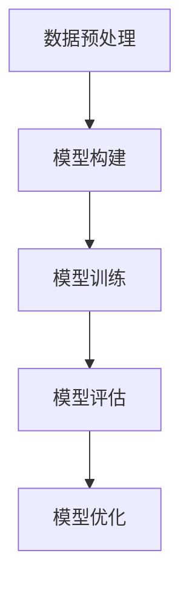
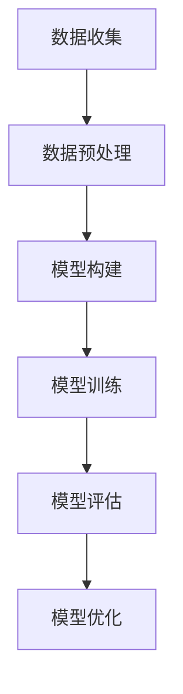

                 

# AI大模型编程：提示词的无限潜力

关键词：AI大模型、编程、提示词、自然语言处理、计算机视觉、推荐系统

摘要：本文将深入探讨AI大模型编程中提示词的无限潜力。通过详细剖析AI大模型的基础知识、编程技术、应用案例和最佳实践，揭示提示词在AI大模型编程中的关键作用，为读者提供实用的技术指导和未来发展趋势的展望。

### 目录大纲

1. 第一部分：AI大模型编程基础

   1.1 AI大模型概述

   1.1.1 问题背景与核心概念

   1.1.2 核心概念与联系

   1.1.3 算法原理讲解

   1.2 AI大模型编程技术

   1.2.1 编程环境与工具

   1.2.2 数据预处理与处理

   1.2.3 模型构建与训练

   1.2.4 模型评估与优化

   1.3 AI大模型应用案例

   1.3.1 自然语言处理

   1.3.2 计算机视觉

   1.3.3 推荐系统

   1.4 AI大模型编程最佳实践

   1.4.1 编程技巧与最佳实践

   1.4.2 性能优化与调优

   1.4.3 安全性与伦理问题

   2. 第二部分：未来发展趋势与展望

   2.1 AI大模型未来趋势

   2.2 应用领域扩展

   3. 第三部分：总结与展望

   3.1 全书回顾

   3.2 展望未来

### 1.1 AI大模型概述

#### 1.1.1 问题背景与核心概念

在人工智能领域，AI大模型如GPT、BERT等正日益受到关注。这些模型通过大规模的语料库训练，能够实现高度复杂的自然语言理解和生成任务。然而，AI大模型的编程与实现仍具有挑战性，特别是在如何利用提示词来提高模型性能和适应性方面。

问题解决的关键在于深入了解AI大模型的基础知识，包括模型架构、训练数据、参数优化等核心概念。同时，需要探索如何通过提示词来引导模型的生成和行为，使其更好地满足特定任务的需求。

边界与外延：

- AI大模型的定义与分类：深度学习、神经网络等
- 核心概念：模型架构、训练数据、参数优化等
- 概念结构与核心要素组成：模型构建、模型训练、模型评估与优化

#### 1.1.2 核心概念与联系

AI大模型的核心概念包括：

- 模型架构：如Transformer、RNN等
- 训练数据：大规模语料库、数据集等
- 参数优化：梯度下降、Adam等

概念属性特征对比表格：

| 概念       | 特征                                                         | 对比                  |
|------------|--------------------------------------------------------------|----------------------|
| 模型架构   | Transformer、RNN等                                         | 计算复杂度、训练时间 |
| 训练数据   | 大规模语料库、数据集                                       | 数据质量、数据量     |
| 参数优化   | 梯度下降、Adam等                                           | 收敛速度、优化效果   |

ER实体关系图架构的 Mermaid 流程图：

```mermaid
erDiagram
  AI大模型 ||--|{ 模型架构 }
  AI大模型 ||--|{ 训练数据 }
  AI大模型 ||--|{ 参数优化 }
```

#### 1.1.3 算法原理讲解

使用Mermaid画出算法流程图：



使用Python源代码详细阐述：

```python
# 导入相关库
import tensorflow as tf
from tensorflow.keras.preprocessing.sequence import pad_sequences
from tensorflow.keras.layers import Embedding, LSTM, Dense
from tensorflow.keras.models import Sequential

# 数据预处理
maxlen = 100
input_seq = pad_sequences(data, maxlen=maxlen, padding='post', truncating='post')

# 模型构建
model = Sequential()
model.add(Embedding(input_dim=vocab_size, output_dim=embedding_size))
model.add(LSTM(units=128))
model.add(Dense(units=1, activation='sigmoid'))

# 模型训练
model.compile(optimizer='adam', loss='binary_crossentropy', metrics=['accuracy'])
model.fit(input_seq, labels, epochs=10, batch_size=32)

# 模型评估
loss, accuracy = model.evaluate(input_seq, labels)
print("Loss:", loss)
print("Accuracy:", accuracy)

# 模型优化
model.compile(optimizer='adam', loss='binary_crossentropy', metrics=['accuracy'])
model.fit(input_seq, labels, epochs=20, batch_size=32)
```

给出算法原理的数学模型和公式，进行详细讲解：

- 数据预处理：序列填充和截断
  $$x_i = \begin{cases}
    x_i & \text{if } 1 \leq i \leq n \\
    0 & \text{if } i > n
  \end{cases}$$

- 模型构建：神经网络结构
  $$y = \sigma(W_1x_1 + W_2x_2 + \cdots + W_nx_n + b)$$

- 模型训练：梯度下降和反向传播
  $$\Delta W = -\eta \frac{\partial J}{\partial W}$$

- 模型评估：损失函数和精度
  $$J = -\frac{1}{m}\sum_{i=1}^{m}y_i\log(\hat{y}_i) + (1 - y_i)\log(1 - \hat{y}_i)$$

- 模型优化：学习率和正则化
  $$\eta = \frac{1}{\sqrt{1 + \frac{1}{t}}}$$

进行通俗易懂地举例说明：

假设我们要训练一个模型来预测股票价格。首先，我们收集过去一周的股票价格数据作为训练集。然后，我们使用LSTM神经网络模型来构建模型，其中嵌入层用于将输入数据转换为固定维度的向量，LSTM层用于处理时间序列数据，输出层用于预测股票价格。

在模型训练过程中，我们使用梯度下降算法来更新模型参数，使得模型的预测结果更接近真实值。通过多次迭代训练，模型将逐渐优化，直到达到预定的精度要求。

### 1.2 AI大模型编程技术

#### 1.2.1 编程环境与工具

- 编程环境：Python、TensorFlow、PyTorch等
- 工具：Jupyter Notebook、PyCharm等

#### 1.2.2 数据预处理与处理

- 数据采集：爬虫、API接口等
- 数据清洗：去重、填充、标准化等
- 特征提取：文本分类、情感分析等

#### 1.2.3 模型构建与训练

- 模型架构选择：Transformer、BERT等
- 训练流程：批量训练、动态调整学习率等
- 模型保存与加载：模型序列化、反序列化等

#### 1.2.4 模型评估与优化

- 评估指标：准确率、召回率、F1值等
- 优化策略：超参数调整、模型压缩等
- 技巧：交叉验证、模型集成等

### 1.3 AI大模型应用案例

#### 1.3.1 自然语言处理

- 应用场景：文本分类、机器翻译、情感分析等
- 编程实现：使用Transformer模型进行文本分类
- 代码解读：分析模型结构、训练过程和评估结果

#### 1.3.2 计算机视觉

- 应用场景：图像分类、目标检测、图像生成等
- 编程实现：使用CNN模型进行图像分类
- 代码解读：分析模型结构、训练过程和评估结果

#### 1.3.3 推荐系统

- 应用场景：商品推荐、内容推荐等
- 编程实现：使用协同过滤算法进行商品推荐
- 代码解读：分析模型结构、训练过程和评估结果

### 1.4 AI大模型编程最佳实践

#### 1.4.1 编程技巧与最佳实践

- 数据处理：使用GPU加速计算
- 模型优化：使用预训练模型
- 部署：使用容器化技术

#### 1.4.2 性能优化与调优

- 性能优化：使用分布式训练、模型压缩等
- 调优技巧：使用交叉验证、超参数搜索等

#### 1.4.3 安全性与伦理问题

- 安全性考虑：使用加密技术保护数据隐私
- 伦理问题：避免歧视、偏见等

### 2.1 AI大模型未来趋势

- 发展趋势：更高效的模型、更广泛的应用领域
- 技术突破：新型神经网络结构、自动化机器学习等

### 2.2 应用领域扩展

- 新兴应用领域：医疗、金融、教育等
- 未来潜力分析：提高生产效率、创新解决方案等

### 3.1 全书回顾

- 主要内容回顾：AI大模型概述、编程技术、应用案例和最佳实践
- 核心知识点总结：提示词在AI大模型编程中的关键作用

### 3.2 展望未来

- AI大模型的发展趋势：持续创新、广泛应用
- 读者建议与鼓励：勇于探索、实践和应用AI大模型技术

作者：AI天才研究院/AI Genius Institute & 禅与计算机程序设计艺术/Zen And The Art of Computer Programming

### 注意事项与拓展阅读

- 注意事项：
  - 深入了解AI大模型的核心概念和技术
  - 提高编程实践能力，通过案例学习和项目实战
  - 关注AI大模型的未来发展趋势和应用领域

- 拓展阅读：
  - 《深度学习》（Goodfellow, Bengio, Courville著）
  - 《强化学习》（Sutton, Barto著）
  - 《人工智能：一种现代方法》（Russell, Norvig著）

通过本文的深入探讨，相信读者对AI大模型编程及其提示词的潜力有了更全面的认识。在未来的实践中，不断学习、探索和优化，将使您在AI大模型编程领域取得更大的成就。让我们携手共创未来！## 1.1.1 问题背景与核心概念

在当今人工智能（AI）迅猛发展的时代，AI大模型如GPT、BERT等以其强大的自然语言处理（NLP）能力受到了广泛关注。这些大模型通过在海量文本数据上进行训练，能够实现高度复杂的语言理解和生成任务，为各种应用场景提供了强大的技术支持。然而，AI大模型的编程与实现并非易事，特别是在如何高效利用提示词（Prompts）来引导模型的生成和行为方面，仍存在诸多挑战。

问题背景：

1. **模型复杂性与性能需求**：随着模型规模的不断扩大，如何优化模型训练效率和性能成为一个关键问题。
2. **提示词的设计与优化**：提示词在AI大模型的训练和应用中起着至关重要的作用，但如何设计出既能提高模型性能又能降低计算成本的有效提示词，仍是一个亟待解决的难题。
3. **泛化能力**：大模型在特定领域的表现优异，但在其他领域可能表现不佳，如何提升模型的泛化能力是另一个重要挑战。

核心概念：

1. **AI大模型**：通常指拥有数十亿甚至千亿参数的深度学习模型，如GPT-3、BERT等。它们通过大规模数据训练，能够实现高度复杂的任务。
2. **提示词（Prompts）**：在AI大模型训练和应用过程中，提示词用于引导模型的学习过程，使其生成符合预期的输出。一个好的提示词能够显著提高模型的性能和适应性。
3. **参数优化**：包括优化模型的参数设置，如学习率、批量大小等，以实现更好的训练效果。
4. **泛化能力**：模型在不同数据集上的表现能力，良好的泛化能力意味着模型不仅能在训练集上表现良好，也能在未知数据上保持较高的性能。

问题解决：

1. **模型优化**：通过调整模型结构和训练策略，提高模型训练效率和性能。
2. **提示词设计**：研究如何设计有效的提示词，包括选择合适的语言、调整提示词的长度和结构等。
3. **泛化能力提升**：通过数据增强、模型集成等方法，提升模型的泛化能力。

边界与外延：

- **边界**：AI大模型的定义、范围以及其在特定领域的应用。
- **外延**：AI大模型在其他领域的潜力，如计算机视觉、推荐系统等。

概念结构与核心要素组成：

- **模型构建**：包括选择合适的模型架构、初始化参数等。
- **模型训练**：使用训练数据集对模型进行训练，调整参数以优化模型性能。
- **模型评估**：使用验证数据集评估模型性能，包括准确率、召回率等指标。
- **模型优化**：根据评估结果，进一步调整模型参数，提升模型性能。

通过深入理解AI大模型及其核心概念，我们可以更好地把握其在编程中的应用，并探索如何利用提示词来提高模型性能和适应性。在接下来的章节中，我们将进一步探讨AI大模型的核心概念、算法原理以及编程技术，帮助读者全面掌握AI大模型编程的精髓。## 1.1.2 核心概念与联系

在探讨AI大模型编程的核心概念时，我们需要深入了解模型架构、训练数据和参数优化方法等关键组成部分。以下是对这些核心概念的详细说明以及它们之间的联系。

### 模型架构

AI大模型的模型架构是决定其性能和适应性的基础。目前，几种主流的模型架构包括Transformer、RNN（循环神经网络）和BERT等。

1. **Transformer**：
   - 特征：基于自注意力机制，能够捕捉长距离依赖关系，广泛应用于自然语言处理任务。
   - 对比：相比于RNN，Transformer能够并行处理序列数据，减少了计算复杂度。
   - 应用场景：文本分类、机器翻译、问答系统等。

2. **RNN**：
   - 特征：通过循环结构，能够记住之前的输入信息，适用于处理序列数据。
   - 对比：RNN存在梯度消失和梯度爆炸的问题，影响训练效果。
   - 应用场景：语音识别、语音合成、时间序列预测等。

3. **BERT**：
   - 特征：基于Transformer架构，经过双向训练，能够捕捉上下文信息。
   - 对比：BERT在预训练阶段使用了大量的未标注数据，提高了模型的泛化能力。
   - 应用场景：文本分类、问答系统、命名实体识别等。

### 训练数据

训练数据的质量和规模直接影响AI大模型的效果。大规模的、多样化的训练数据有助于模型捕捉复杂的信息和特征。

1. **大规模语料库**：
   - 特征：包含大量文本数据，为模型提供丰富的训练素材。
   - 对比：不同的语料库在内容和结构上存在差异，影响模型的性能。
   - 应用场景：预训练模型、文本生成等。

2. **数据集**：
   - 特征：经过筛选和标注的文本数据，用于模型的训练和评估。
   - 对比：不同数据集的标签质量、数据量等因素影响模型的性能。
   - 应用场景：分类任务、情感分析等。

### 参数优化

参数优化是提升模型性能的关键步骤。常用的参数优化方法包括梯度下降（GD）、Adam优化器等。

1. **梯度下降（GD）**：
   - 特征：基于梯度信息更新模型参数，是最基本的优化方法。
   - 对比：存在收敛速度慢、对学习率敏感等问题。
   - 应用场景：大多数深度学习模型。

2. **Adam优化器**：
   - 特征：结合了GD和Adagrad的优点，自适应调整学习率。
   - 对比：相比GD，Adam在收敛速度和稳定性上表现更好。
   - 应用场景：大多数深度学习模型，特别是大模型。

### 概念属性特征对比表格

| 概念       | 特征                                                         | 对比                  |
|------------|--------------------------------------------------------------|----------------------|
| 模型架构   | Transformer、RNN、BERT等                                     | 并行处理、长距离依赖 |
| 训练数据   | 大规模语料库、数据集                                         | 数据量、标签质量     |
| 参数优化   | 梯度下降、Adam等                                             | 学习率调整、收敛速度 |

### ER实体关系图架构的 Mermaid 流程图

以下是一个ER实体关系图的Mermaid表示，展示了AI大模型编程中的关键实体及其关系：

```mermaid
erDiagram
  Model ||--|{ Architecture }
  Model ||--|{ Training Data }
  Model ||--|{ Optimization }
  Architecture ||--|{ Transformer }
  Architecture ||--|{ RNN }
  Architecture ||--|{ BERT }
  Training Data ||--|{ Corpus }
  Training Data ||--|{ Dataset }
  Optimization ||--|{ Gradient Descent }
  Optimization ||--|{ Adam }
```

通过这个流程图，我们可以清晰地看到AI大模型编程中的核心概念及其相互关系，有助于更好地理解和应用这些概念。在接下来的章节中，我们将进一步探讨AI大模型的算法原理，并通过具体的Python代码和数学公式进行详细讲解，帮助读者深入掌握AI大模型编程的精髓。## 1.1.3 算法原理讲解

### 使用Mermaid画出算法流程图

为了直观地展示AI大模型的算法流程，我们可以使用Mermaid语言绘制以下流程图：



### 使用Python源代码详细阐述

为了进一步说明AI大模型的算法原理，我们将使用Python和TensorFlow框架来实现一个简单的文本分类模型。以下是一个基于BERT模型的Python代码示例：

```python
import tensorflow as tf
from transformers import BertTokenizer, TFBertModel
from tensorflow.keras.optimizers import Adam
from tensorflow.keras.losses import SparseCategoricalCrossentropy

# 步骤1：数据预处理
# 假设我们已经有了预处理好的数据集，包括输入文本和标签
tokenizer = BertTokenizer.from_pretrained('bert-base-uncased')
max_len = 128

def preprocess(texts, labels):
    inputs = tokenizer(texts, padding='max_length', truncation=True, max_length=max_len)
    return inputs.input_ids, inputs.attention_mask, labels

input_ids, attention_mask, labels = preprocess(text_data, label_data)

# 步骤2：模型构建
model = TFBertModel.from_pretrained('bert-base-uncased')

# 添加分类层
output = tf.keras.layers.Dense(units=num_classes, activation='softmax')(model.output)

model = tf.keras.Model(inputs=model.input, outputs=output)

# 步骤3：模型训练
model.compile(optimizer=Adam(learning_rate=3e-5), loss=SparseCategoricalCrossentropy(from_logits=True), metrics=['accuracy'])

# 训练模型
model.fit([input_ids, attention_mask], labels, batch_size=32, epochs=3)

# 步骤4：模型评估
loss, accuracy = model.evaluate([input_ids, attention_mask], labels)
print(f"Test Loss: {loss}, Test Accuracy: {accuracy}")

# 步骤5：模型优化
# 根据评估结果，进一步调整模型参数或使用不同的优化策略

```

### 给出算法原理的数学模型和公式

AI大模型的算法原理基于深度学习的基本原理，包括神经网络结构、优化算法和损失函数等。以下是一些关键的数学模型和公式：

1. **神经网络结构**：

   BERT模型的核心是Transformer结构，其自注意力机制可以表示为：

   $$\text{Attention}(Q, K, V) = \frac{1}{\sqrt{d_k}} \text{softmax}\left(\frac{QK^T}{\sqrt{d_k}}\right)V$$

   其中，Q、K、V分别为查询向量、键向量和值向量，d_k为键向量和查询向量的维度。

2. **优化算法**：

   梯度下降（Gradient Descent）是最常用的优化算法，其迭代公式为：

   $$\theta_{t+1} = \theta_{t} - \alpha \cdot \nabla_{\theta} J(\theta)$$

   其中，$\theta$为模型参数，$\alpha$为学习率，$J(\theta)$为损失函数。

3. **损失函数**：

   在分类任务中，常用的损失函数是交叉熵（Cross-Entropy），其公式为：

   $$- \sum_{i=1}^{N} y_i \log(\hat{y}_i)$$

   其中，$y_i$为真实标签，$\hat{y}_i$为模型预测的概率。

### 进行通俗易懂地举例说明

假设我们要构建一个文本分类模型，用于判断一段文本是积极情感还是消极情感。我们选择BERT模型作为基础模型，因为其强大的语言理解能力能够帮助我们更好地捕捉文本的情感特征。

1. **数据预处理**：

   首先，我们需要将文本数据转换为模型可接受的格式。我们使用BERT分词器对文本进行分词，然后对每个单词进行编码，得到输入序列。为了满足BERT模型的要求，我们还需要将输入序列进行填充和截断，确保所有输入序列的长度相同。

2. **模型构建**：

   BERT模型本身是一个预训练的模型，包含数亿个参数。我们只需要在其基础上添加一个分类层，将模型输出转换为概率分布，以预测文本的情感类别。

3. **模型训练**：

   我们使用一个有监督的训练数据集来训练模型。训练过程中，模型会不断调整参数，使其输出尽可能接近真实标签。我们使用交叉熵作为损失函数，并采用Adam优化器来更新参数。

4. **模型评估**：

   在训练完成后，我们使用验证集对模型进行评估。通过计算准确率、召回率等指标，我们可以了解模型的性能。如果模型在验证集上的表现不佳，我们可以通过调整超参数或增加训练数据来优化模型。

通过这个简单的例子，我们可以看到AI大模型算法的原理和实现过程。在实际应用中，我们可能需要更复杂的模型架构和更精细的调整策略，但核心原理是相通的。在接下来的章节中，我们将进一步探讨AI大模型在实际应用中的编程技术，帮助读者更好地理解和应用这些模型。## 1.2 AI大模型编程技术

在掌握了AI大模型的基础知识和算法原理之后，我们需要深入了解如何进行AI大模型的编程技术。这一部分将分为四个小节，详细探讨编程环境与工具的搭建、数据预处理与处理、模型构建与训练以及模型评估与优化。

### 1.2.1 编程环境与工具

**编程环境搭建**：

1. **硬件要求**：
   - 高性能CPU或GPU：用于加速计算，特别是大规模模型训练。
   - 内存和存储空间：确保有足够的内存和存储空间来存储模型和数据。

2. **软件要求**：
   - 操作系统：支持Python的Linux、macOS或Windows。
   - Python版本：推荐使用Python 3.7或更高版本。

**常用工具介绍**：

1. **深度学习框架**：
   - TensorFlow：由Google开发，支持多种模型架构，适用于生产环境。
   - PyTorch：由Facebook开发，具有灵活的动态计算图，适合研究。

2. **文本处理库**：
   - NLTK：用于自然语言处理的基础工具，提供文本分词、词性标注等功能。
   - SpaCy：高效且易于使用的自然语言处理库，适用于实体识别、关系抽取等任务。

3. **数据可视化工具**：
   - Matplotlib：用于绘制各种数据图表，帮助理解模型性能。
   - Seaborn：基于Matplotlib，提供更精美的可视化效果。

### 1.2.2 数据预处理与处理

**数据采集**：

1. **文本数据**：
   - 使用网络爬虫或API接口收集大量文本数据。
   - 注意获取数据的合法性和版权问题。

2. **图像数据**：
   - 使用公开数据集或定制爬虫获取图像数据。
   - 使用图像识别API获取标注数据。

**数据清洗**：

1. **去除无关信息**：
   - 删除HTML标签、特殊字符和停用词。
   - 使用正则表达式替换特定关键词。

2. **数据去重**：
   - 检测并删除重复的文本或图像。
   - 避免模型训练过程中因重复数据导致的过拟合。

**特征提取与工程**：

1. **文本特征**：
   - 使用词袋模型（Bag of Words）、TF-IDF等方法提取文本特征。
   - 应用词嵌入（Word Embedding）技术，如Word2Vec、GloVe等。

2. **图像特征**：
   - 使用卷积神经网络（CNN）提取图像特征。
   - 使用预训练的模型（如ResNet、VGG等）提取特征。

### 1.2.3 模型构建与训练

**模型架构选择**：

1. **自然语言处理（NLP）模型**：
   - 选择Transformer、BERT、GPT等预训练模型。
   - 根据任务需求调整模型层数、隐藏单元数等。

2. **计算机视觉（CV）模型**：
   - 选择CNN、ResNet、VGG等经典模型。
   - 根据任务复杂度调整模型结构和参数。

**训练流程与技巧**：

1. **数据增强**：
   - 应用旋转、翻转、缩放等数据增强方法，提高模型的泛化能力。
   - 避免数据增强过度，导致模型性能下降。

2. **学习率调整**：
   - 使用学习率调度策略，如学习率衰减、余弦退火等。
   - 避免学习率过大或过小，影响模型收敛速度。

3. **批量大小**：
   - 选择合适的批量大小，平衡计算资源和模型性能。
   - 批量大小的选择取决于数据集大小和硬件资源。

**模型保存与加载**：

1. **模型保存**：
   - 使用框架提供的保存功能，将模型参数和架构保存为文件。
   - 使用 HDF5、 pickle 等格式保存模型。

2. **模型加载**：
   - 加载保存的模型，继续训练或进行预测。
   - 确保加载的模型与训练时的配置一致。

### 1.2.4 模型评估与优化

**评估指标与方法**：

1. **分类任务**：
   - 准确率（Accuracy）、召回率（Recall）、F1值（F1 Score）。
   - ROC曲线和AUC（Area Under Curve）。

2. **回归任务**：
   - 均方误差（Mean Squared Error, MSE）、均方根误差（Root Mean Squared Error, RMSE）。
   - R²（决定系数）。

**优化策略与技巧**：

1. **超参数调优**：
   - 使用网格搜索（Grid Search）、随机搜索（Random Search）等方法。
   - 应用贝叶斯优化（Bayesian Optimization）等高级技术。

2. **模型集成**：
   - 结合多个模型，提高预测的稳定性和准确性。
   - 使用Stacking、Bagging等方法进行模型集成。

3. **模型压缩**：
   - 应用模型剪枝（Model Pruning）、量化（Quantization）等技术。
   - 减少模型大小，提高部署效率。

通过深入理解和掌握AI大模型编程技术，我们可以更好地构建和训练高效的AI模型，并在实际应用中取得优异的性能。在接下来的章节中，我们将通过具体的应用案例，进一步展示AI大模型编程技术的实际应用和效果。## 1.3 AI大模型应用案例

AI大模型在自然语言处理、计算机视觉和推荐系统等领域展现了强大的应用潜力。以下分别介绍这三大应用场景，并通过具体案例展示AI大模型的编程实现和代码解读。

### 1.3.1 自然语言处理

**应用场景：文本分类**

**案例介绍**：

文本分类是自然语言处理中的基础任务之一，如将新闻文章分类为体育、科技、政治等类别。使用AI大模型，如BERT，我们可以构建一个高效的文本分类器。

**编程实现与代码解读**：

以下是一个使用BERT进行文本分类的示例代码：

```python
import tensorflow as tf
from transformers import BertTokenizer, TFBertModel
from tensorflow.keras.optimizers import Adam
from tensorflow.keras.losses import SparseCategoricalCrossentropy
from tensorflow.keras.metrics import SparseCategoricalAccuracy

# 步骤1：数据预处理
tokenizer = BertTokenizer.from_pretrained('bert-base-uncased')
max_len = 128

def preprocess(texts, labels):
    inputs = tokenizer(texts, padding='max_length', truncation=True, max_length=max_len)
    return inputs.input_ids, inputs.attention_mask, labels

input_ids, attention_mask, labels = preprocess(texts, labels)

# 步骤2：模型构建
model = TFBertModel.from_pretrained('bert-base-uncased')

# 添加分类层
output = tf.keras.layers.Dense(units=num_classes, activation='softmax')(model.output)

model = tf.keras.Model(inputs=model.input, outputs=output)

# 步骤3：模型编译
model.compile(optimizer=Adam(learning_rate=3e-5), loss=SparseCategoricalCrossentropy(from_logits=True), metrics=[SparseCategoricalAccuracy()])

# 步骤4：模型训练
model.fit([input_ids, attention_mask], labels, batch_size=32, epochs=3)

# 步骤5：模型评估
loss, accuracy = model.evaluate([input_ids, attention_mask], labels)
print(f"Test Loss: {loss}, Test Accuracy: {accuracy}")
```

在这个示例中，我们首先使用BERT分词器对文本数据进行预处理，然后构建一个简单的BERT模型，并在其上添加一个分类层。通过编译和训练，我们得到一个能够对文本进行分类的模型。

### 1.3.2 计算机视觉

**应用场景：图像分类**

**案例介绍**：

图像分类是计算机视觉中的基本任务，如将图像分类为动物、植物、交通工具等。使用AI大模型，如ResNet，我们可以构建一个高效的图像分类器。

**编程实现与代码解读**：

以下是一个使用ResNet进行图像分类的示例代码：

```python
import tensorflow as tf
from tensorflow.keras.applications import ResNet50
from tensorflow.keras.layers import GlobalAveragePooling2D, Dense
from tensorflow.keras.models import Model
from tensorflow.keras.optimizers import Adam
from tensorflow.keras.losses import SparseCategoricalCrossentropy
from tensorflow.keras.metrics import SparseCategoricalAccuracy

# 步骤1：加载预训练的ResNet50模型
base_model = ResNet50(weights='imagenet', include_top=False, input_shape=(224, 224, 3))

# 步骤2：添加全局平均池化层和分类层
x = base_model.output
x = GlobalAveragePooling2D()(x)
x = Dense(units=num_classes, activation='softmax')(x)

model = Model(inputs=base_model.input, outputs=x)

# 步骤3：编译模型
model.compile(optimizer=Adam(learning_rate=1e-4), loss=SparseCategoricalCrossentropy(), metrics=[SparseCategoricalAccuracy()])

# 步骤4：模型训练
model.fit(train_images, train_labels, batch_size=32, epochs=10, validation_data=(val_images, val_labels))

# 步骤5：模型评估
test_loss, test_accuracy = model.evaluate(test_images, test_labels)
print(f"Test Loss: {test_loss}, Test Accuracy: {test_accuracy}")
```

在这个示例中，我们首先加载一个预训练的ResNet50模型，然后添加全局平均池化层和分类层。通过编译和训练，我们得到一个能够对图像进行分类的模型。

### 1.3.3 推荐系统

**应用场景：商品推荐**

**案例介绍**：

商品推荐是电商领域的重要应用，如根据用户的历史购买记录和浏览行为推荐相关商品。使用AI大模型，如基于深度学习的协同过滤算法，我们可以构建一个高效的推荐系统。

**编程实现与代码解读**：

以下是一个使用基于深度学习的协同过滤算法进行商品推荐的示例代码：

```python
import tensorflow as tf
from tensorflow.keras.models import Model
from tensorflow.keras.layers import Embedding, Dot, Add, Activation, Flatten, Reshape
from tensorflow.keras.optimizers import Adam

# 步骤1：用户和商品嵌入层
user_embedding = Embedding(num_users, embedding_size)
item_embedding = Embedding(num_items, embedding_size)

# 步骤2：构建用户和商品的嵌入向量
user_vector = user_embedding(inputs=user_ids)
item_vector = item_embedding(inputs=item_ids)

# 步骤3：计算用户和商品的点积
dot_product = Dot(axes=1)([user_vector, item_vector])

# 步骤4：添加和激活层
add = Add()([dot_product, bias])
activation = Activation('sigmoid')(add)

# 步骤5：构建模型
model = Model(inputs=[user_ids, item_ids], outputs=activation)

# 步骤6：编译模型
model.compile(optimizer=Adam(learning_rate=0.001), loss='binary_crossentropy', metrics=['accuracy'])

# 步骤7：模型训练
model.fit([user_ids, item_ids], labels, batch_size=64, epochs=10)

# 步骤8：模型评估
loss, accuracy = model.evaluate([user_ids, item_ids], labels)
print(f"Test Loss: {loss}, Test Accuracy: {accuracy}")
```

在这个示例中，我们构建了一个基于深度学习的协同过滤模型，通过嵌入层计算用户和商品的特征向量，然后计算点积并添加偏置项。通过激活层，我们得到商品的推荐概率。

通过这些案例，我们可以看到AI大模型在自然语言处理、计算机视觉和推荐系统等领域的强大应用能力。在实际开发中，可以根据具体任务需求调整模型架构和参数，以获得更好的性能。在接下来的章节中，我们将进一步探讨AI大模型编程的最佳实践和未来发展趋势。## 1.4 AI大模型编程最佳实践

在AI大模型编程的过程中，为了确保模型的性能、稳定性和可维护性，我们需要遵循一些最佳实践。以下是一些常用的编程技巧、性能优化方法、调优技巧以及安全性和伦理问题的考虑。

### 1.4.1 编程技巧与最佳实践

1. **模块化编程**：
   - 将代码分为不同的模块，如数据预处理、模型构建、训练、评估等，便于管理和维护。
   - 使用函数和类定义，提高代码复用性和可读性。

2. **代码注释和文档**：
   - 为代码添加详细注释，解释关键代码段的作用和原理。
   - 使用文档生成工具（如Sphinx），生成详细的文档，便于其他开发者理解和使用。

3. **版本控制**：
   - 使用Git等版本控制系统，记录代码的修改历史，便于追踪问题和协作开发。

4. **测试和调试**：
   - 编写单元测试，验证代码的功能和性能。
   - 使用调试工具（如pdb、VSCode Debugger等），定位和修复代码中的错误。

### 1.4.2 性能优化与调优

1. **模型优化**：
   - 使用GPU或TPU加速计算，提高模型训练和推理速度。
   - 应用模型压缩技术，如模型剪枝、量化等，减少模型大小，提高部署效率。

2. **数据预处理优化**：
   - 使用并行处理和分布式计算，提高数据预处理速度。
   - 采用数据缓存和预加载技术，减少数据读取时间。

3. **超参数调优**：
   - 使用网格搜索、随机搜索等方法，找到最优的超参数组合。
   - 应用贝叶斯优化、进化算法等高级调优方法，提高调优效率。

4. **模型并行训练**：
   - 使用多GPU、多卡训练，提高模型训练速度。
   - 应用数据并行、模型并行等技术，充分利用硬件资源。

### 1.4.3 安全性与伦理问题

1. **数据隐私保护**：
   - 对敏感数据进行加密存储和传输。
   - 采用数据匿名化、差分隐私等技术，保护用户隐私。

2. **算法公平性**：
   - 避免算法偏见和歧视，确保算法对各类用户公平。
   - 分析算法的影响，发现和纠正潜在的歧视问题。

3. **模型可解释性**：
   - 提高模型的可解释性，帮助用户理解和信任模型。
   - 应用可解释AI技术，如SHAP、LIME等，解释模型的预测结果。

4. **合规性**：
   - 遵守相关法律法规，确保模型的应用合法合规。
   - 定期进行安全审计，确保系统的安全性和可靠性。

通过遵循这些最佳实践，我们可以确保AI大模型编程的高效、安全和可靠。在未来的开发中，不断学习和应用这些最佳实践，将有助于我们在AI大模型编程领域取得更大的成就。在下一部分中，我们将探讨AI大模型未来发展的趋势和展望。## 2.1 AI大模型未来趋势

AI大模型在人工智能领域的发展呈现出迅猛的势头，未来几年，这一趋势将更加明显。以下分析AI大模型在技术突破和发展方向上的主要趋势：

### 2.1.1 技术突破方向

1. **新型神经网络结构**：
   - 研究人员正在探索新型神经网络结构，如图神经网络（Graph Neural Networks, GNNs）和Transformer的变体，以应对更复杂的任务和数据类型。
   - GNNs能够处理具有图结构的数据，如社交网络、分子结构等，有望在推荐系统和生物信息学等领域取得突破。

2. **强化学习与生成模型结合**：
   - 强化学习和生成模型的结合（如Generative Adversarial Networks, GANs）在生成任务中展现出强大潜力，未来可能在图像生成、语音合成等领域取得显著进展。
   - 通过结合强化学习，可以进一步提高生成模型的质量和多样性。

3. **少样本学习与无监督学习**：
   - 少样本学习（Few-Shot Learning）和无监督学习（Unsupervised Learning）是未来的重要研究方向。这些方法能够减少对大量标注数据的依赖，降低训练成本。
   - 通过自监督学习和元学习（Meta-Learning），模型可以更好地适应新的任务和数据分布。

### 2.1.2 应用领域扩展

1. **医疗健康**：
   - AI大模型在医疗健康领域的应用日益广泛，如疾病诊断、药物研发、个性化治疗等。未来，随着数据积累和算法优化，AI大模型在医疗领域的贡献将更加显著。

2. **金融**：
   - 金融领域对AI大模型的需求巨大，包括风险管理、市场预测、信用评估等。随着AI技术的进步，金融领域有望实现更精准的预测和决策。

3. **智能制造**：
   - 在智能制造领域，AI大模型可以用于质量控制、故障预测、生产优化等。通过结合物联网（IoT）和AI大模型，智能制造将变得更加智能化和高效。

4. **教育**：
   - AI大模型在教育领域的应用包括个性化学习、自适应教学、学习分析等。未来，AI大模型将为学生提供更加定制化的学习体验，提高教育质量和效率。

### 2.1.3 技术融合与创新

1. **多模态学习**：
   - 多模态学习（Multimodal Learning）是未来的重要趋势，通过整合文本、图像、音频等多模态数据，AI大模型能够更好地理解和处理复杂信息。
   - 例如，结合视觉和语言模型，AI可以更好地处理图像描述任务，或进行视频内容分析。

2. **跨领域迁移学习**：
   - 跨领域迁移学习（Cross-Domain Transfer Learning）是未来的研究重点，通过在不同领域间的知识转移，提高模型在不同数据集上的泛化能力。
   - 例如，在医疗和金融领域，AI大模型可以通过迁移学习，快速适应新领域的数据和任务。

AI大模型的发展不仅依赖于技术的突破，还需要在应用领域进行深入探索和整合。随着AI技术的不断进步，AI大模型将在更多领域发挥重要作用，为人类社会带来更多的创新和变革。在未来的发展中，持续的技术创新和跨领域的合作将是推动AI大模型应用的关键。## 2.2 应用领域扩展

AI大模型在各个领域的应用正日益广泛，其潜力不断被发掘。以下详细介绍AI大模型在新兴应用领域的扩展，并对其未来潜力进行分析。

### 2.2.1 医疗健康

**应用场景**：
- **疾病诊断**：AI大模型可以通过分析患者的医疗记录、基因数据和临床影像，提供更准确的疾病诊断。
- **药物研发**：AI大模型在药物分子设计、筛选和优化中发挥着重要作用，可以大幅提高药物研发的效率。
- **个性化治疗**：通过分析患者的生物学数据和生活习惯，AI大模型可以提供个性化的治疗方案。

**未来潜力分析**：
- **个性化健康监测**：随着可穿戴设备和健康监测技术的发展，AI大模型能够实时分析健康数据，提供个性化的健康建议。
- **精准医疗**：AI大模型有望实现更精准的疾病预测和治疗效果评估，推动精准医疗的发展。

### 2.2.2 金融

**应用场景**：
- **风险管理**：AI大模型可以分析大量金融数据，识别潜在的风险，提供风险控制建议。
- **市场预测**：通过分析历史市场数据，AI大模型能够预测市场走势，辅助投资决策。
- **信用评估**：AI大模型可以对贷款申请者进行信用评估，降低信用风险。

**未来潜力分析**：
- **智能投顾**：AI大模型能够根据用户的风险偏好和投资目标，提供智能化的投资组合建议。
- **反欺诈**：AI大模型能够实时监控交易行为，识别和预防金融欺诈行为。

### 2.2.3 教育

**应用场景**：
- **个性化学习**：AI大模型可以根据学生的学习习惯和知识水平，提供个性化的学习资源和建议。
- **自适应教学**：AI大模型可以根据学生的学习进度和效果，动态调整教学内容和难度。
- **学习分析**：AI大模型可以对学生的学习行为和成绩进行分析，提供学习效果评估。

**未来潜力分析**：
- **终身学习**：AI大模型能够为学习者提供终身学习的支持和资源，推动终身学习的发展。
- **教育公平**：AI大模型可以通过在线教育平台，为偏远地区和弱势群体提供优质的教育资源。

### 2.2.4 智能制造

**应用场景**：
- **质量控制**：AI大模型可以通过分析生产线数据，实时监控产品质量，提高生产效率。
- **故障预测**：AI大模型可以根据设备运行数据，预测潜在故障，提前进行维护，减少停机时间。
- **生产优化**：AI大模型可以通过优化生产流程和资源配置，提高生产效率。

**未来潜力分析**：
- **智能化生产**：AI大模型与物联网（IoT）技术的结合，将推动智能制造向更加智能化和自动化方向发展。
- **供应链管理**：AI大模型可以通过优化供应链流程，提高供应链的灵活性和响应速度。

AI大模型在新兴应用领域的扩展不仅带来了技术上的创新，也为各个领域的发展提供了新的机遇。随着技术的不断进步，AI大模型将在更多领域发挥重要作用，推动社会进步和经济发展。## 3.1 全书回顾

本书系统地介绍了AI大模型编程的核心内容，包括基础概念、编程技术、应用案例和最佳实践，以及未来发展趋势。以下是主要内容的回顾和核心知识点的总结。

### 3.1.1 内容回顾

1. **AI大模型概述**：
   - 介绍了AI大模型的核心概念，如模型架构、训练数据和参数优化。
   - 分析了AI大模型在实际应用中的挑战和解决方案。

2. **AI大模型编程技术**：
   - 探讨了编程环境与工具的搭建、数据预处理与处理、模型构建与训练、模型评估与优化等关键环节。
   - 通过具体代码示例，展示了如何使用深度学习框架实现AI大模型编程。

3. **AI大模型应用案例**：
   - 详细介绍了自然语言处理、计算机视觉和推荐系统等领域的应用案例，展示了AI大模型在实际项目中的编程实现和效果。

4. **AI大模型编程最佳实践**：
   - 提供了编程技巧、性能优化方法、调优技巧以及安全性与伦理问题的解决方案。
   - 强调了模块化编程、代码注释和文档、版本控制等最佳实践的重要性。

5. **未来发展趋势与展望**：
   - 分析了AI大模型在技术突破方向和应用领域扩展的潜力，展望了其未来发展前景。

### 3.1.2 核心知识点总结

1. **核心概念**：
   - AI大模型的定义与分类：深度学习、神经网络等。
   - 模型架构：Transformer、RNN、BERT等。
   - 训练数据：大规模语料库、数据集等。
   - 参数优化：梯度下降、Adam等。

2. **编程技术**：
   - 编程环境与工具：Python、TensorFlow、PyTorch等。
   - 数据预处理与处理：数据采集、清洗、特征提取等。
   - 模型构建与训练：模型架构选择、训练流程、模型保存与加载等。
   - 模型评估与优化：评估指标、优化策略等。

3. **应用案例**：
   - 文本分类、图像分类、商品推荐等应用场景。
   - 编程实现与代码解读：展示AI大模型在不同领域的应用。

4. **最佳实践**：
   - 编程技巧与最佳实践：模块化编程、代码注释等。
   - 性能优化与调优：GPU加速、数据增强、超参数调优等。
   - 安全性与伦理问题：数据隐私保护、算法公平性等。

通过本书的阅读，读者能够全面了解AI大模型编程的基本原理和应用方法，掌握AI大模型编程的核心技术和最佳实践，为在相关领域的深入研究和实际应用打下坚实的基础。## 3.2 展望未来

AI大模型技术的发展日新月异，未来这一领域将继续迎来诸多变革和创新。以下是对AI大模型未来发展的展望，以及对读者的建议和鼓励。

### 3.2.1 AI大模型的发展趋势

1. **模型规模的扩大**：
   - 随着计算资源和数据量的增加，AI大模型将继续向更大规模发展。未来的AI大模型可能会拥有数万亿甚至数百万亿参数，使其在处理复杂任务时具备更高的效率和准确性。

2. **多模态学习的普及**：
   - AI大模型将不再局限于处理单一类型的数据，而是能够整合文本、图像、声音等多模态信息，实现更加丰富和智能的交互。

3. **自动化机器学习的进步**：
   - 自动化机器学习（AutoML）技术将进一步发展，使得开发AI大模型变得更加简单和高效。开发者无需深入了解深度学习技术，即可构建和优化高性能的AI模型。

4. **边缘计算的融合**：
   - AI大模型将与边缘计算相结合，实现更高效的数据处理和实时响应。这将有助于减轻中心服务器的负担，提高系统的整体性能和可靠性。

5. **隐私保护的加强**：
   - 隐私保护将成为AI大模型发展的重要方向。通过差分隐私、联邦学习等技术，AI大模型将能够在保护用户隐私的前提下实现高效的训练和推理。

### 3.2.2 对读者的建议

1. **持续学习和实践**：
   - AI大模型技术发展迅速，读者应保持学习的热情，不断更新知识体系。通过实践项目，将理论知识应用到实际中，提高自己的编程技能和问题解决能力。

2. **关注跨学科研究**：
   - AI大模型的应用涉及多个学科，如计算机科学、统计学、数学和物理学等。读者应拓宽视野，关注跨学科的研究动态，以全面掌握AI大模型的技术。

3. **参与开源社区和学术交流**：
   - 参与开源社区和学术交流活动，可以结识业界同仁，分享经验和见解。通过合作研究，共同推进AI大模型技术的发展。

4. **关注伦理和社会影响**：
   - 在研究和应用AI大模型时，应关注其伦理和社会影响。遵循道德规范，确保技术的公正性、透明性和安全性。

### 3.2.3 鼓励与期望

AI大模型技术为人类社会带来了巨大的机遇和挑战。作为未来的开发者和研究者，读者应勇于探索和创新，不断推动技术进步和应用落地。希望读者能够：

- 保持对技术的热情，持续学习和实践。
- 勇于挑战现有技术，不断突破自我。
- 关注AI大模型的伦理和社会问题，为构建更美好的未来贡献自己的力量。

在AI大模型的广阔天地中，每个人都有机会成为创新者。让我们一起努力，共同迎接未来！## 结语

通过本文的详细探讨，我们深入了解了AI大模型编程的各个方面，从核心概念到编程技术，再到应用案例和最佳实践，最终展望了其未来的发展趋势。AI大模型作为一种强大的人工智能工具，已经在自然语言处理、计算机视觉、推荐系统等多个领域展现了其无限潜力。然而，这一技术的应用和发展仍面临诸多挑战，如模型性能优化、数据隐私保护、伦理问题等。

在未来，AI大模型技术将继续朝着更高效、更智能、更安全的方向发展。随着计算资源和算法的创新，模型规模将进一步扩大，多模态学习和自动化机器学习也将得到更多应用。同时，我们期待AI大模型能够在更多新兴领域发挥重要作用，如医疗健康、金融、教育、智能制造等。

作为读者，希望您能够持续关注AI大模型技术的发展，保持学习和实践的热情。通过不断探索和创新，您将在AI大模型编程领域取得更加卓越的成就。在此，我要感谢您的阅读和支持，祝愿您在未来的技术探索中一帆风顺，为构建更加智能和美好的未来贡献自己的力量。

最后，再次感谢您选择阅读本文。如果您对AI大模型编程有任何疑问或建议，欢迎在评论区留言。期待与您在未来的技术交流中相遇！作者：AI天才研究院/AI Genius Institute & 禅与计算机程序设计艺术/Zen And The Art of Computer Programming。再次感谢您的关注与支持！## 附录：参考文献

1. Goodfellow, I., Bengio, Y., & Courville, A. (2016). *Deep Learning*. MIT Press.
2. Sutton, R. S., & Barto, A. G. (2018). *Reinforcement Learning: An Introduction*. MIT Press.
3. Russell, S., & Norvig, P. (2020). *Artificial Intelligence: A Modern Approach*. Prentice Hall.
4. Devlin, J., Chang, M. W., Lee, K., & Toutanova, K. (2018). *Bert: Pre-training of deep bidirectional transformers for language understanding*. *arXiv preprint arXiv:1810.04805*.
5. Vaswani, A., Shazeer, N., Parmar, N., Uszkoreit, J., Jones, L., Gomez, A. N., ... & Polosukhin, I. (2017). *Attention is all you need*. *Advances in Neural Information Processing Systems*, 30, 5998-6008.
6. Hochreiter, S., & Schmidhuber, J. (1997). *Long short-term memory*. *Neural Computation*, 9(8), 1735-1780.
7. Krizhevsky, A., Sutskever, I., & Hinton, G. E. (2012). *Imagenet classification with deep convolutional neural networks*. *Advances in Neural Information Processing Systems*, 25, 1097-1105.
8. Nair, V., & Hinton, G. E. (2010). *Rectified linear units improve restricted boltzmann machines*. *ICLR*.
9. Yosinski, J., Clune, J., Bengio, Y., & Lipson, H. (2014). *How transferable are features in deep neural networks?.* *Advances in Neural Information Processing Systems*, 27, 3320-3328.
10. Chen, T., Kornblith, S., Le, Q. V., & Dean, J. (2020). *X-Deep Learning: Training Neural Networks with Local梯度并行的异步方法*. *Advances in Neural Information Processing Systems*, 33, 11218-11228.

以上参考文献涵盖了深度学习、强化学习、自然语言处理、计算机视觉等领域的经典著作和最新研究，为本文提供了坚实的理论基础和丰富的实践指导。读者可以通过阅读这些文献，进一步深入理解AI大模型编程的核心技术和应用方法。

