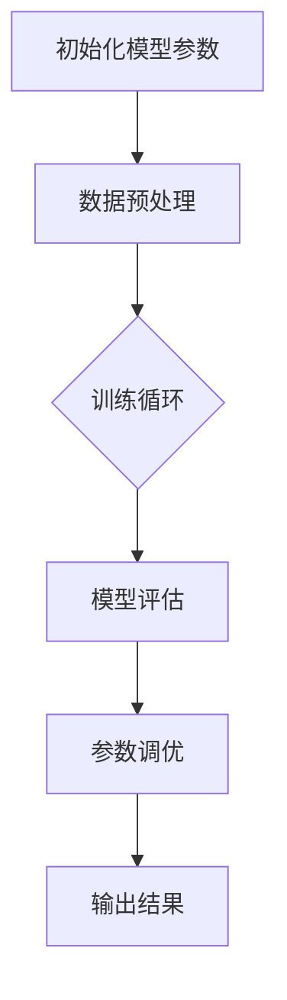

                 


## 《AI大模型编程：提示词的未来》

### 关键词：AI大模型，提示词，编程，未来趋势

### 摘要：

本文深入探讨了AI大模型编程中的关键要素——提示词，从背景介绍到概念解析，再到算法原理与实现，最后分析系统架构与未来趋势，旨在揭示提示词在AI大模型编程中的重要性及其发展方向。我们将通过逻辑清晰的分析和实际代码示例，帮助读者理解这一前沿技术的核心原理和应用前景。

## 第一部分：背景介绍与概念解析

### 第1章 问题背景与核心概念

#### 1.1 问题背景

AI技术的发展正进入一个全新的阶段——大模型革命。这一阶段以生成式AI为核心，通过深度学习技术训练出具有强大语言理解和生成能力的大型模型，如GPT、BERT等。这些模型在自然语言处理、文本生成、机器翻译等领域展现出了卓越的性能，为AI应用带来了前所未有的变革。

在这样一个背景下，提示词（Prompt）成为了一个关键概念。提示词是指用于引导大模型生成特定结果或执行特定任务的关键输入，它能够显著影响模型的输出质量。因此，掌握提示词的设计和运用，成为了AI大模型编程的核心技术之一。

#### 1.2 核心概念

**AI大模型的基本原理**：

AI大模型通常是基于神经网络结构的大型语言模型，其核心原理是通过大量的数据训练来学习语言模式和语义表示。这些模型具有数十亿个参数，能够捕捉复杂的语言规律和上下文信息。

**提示词的定义与作用**：

提示词是指引导大模型生成特定内容或执行特定任务的文本输入。一个优秀的提示词能够明确传达用户的意图，提高模型的生成质量和效率。

**大模型编程的基本流程**：

1. 数据准备：收集和预处理大量文本数据。
2. 模型训练：使用神经网络算法训练大模型。
3. 提示词设计：设计有效的提示词以引导模型生成目标输出。
4. 模型评估与优化：评估模型性能，进行参数调优。

### 1.3 关键术语

**语言模型**：

语言模型是指用于预测下一个单词或词组的概率分布的模型，是AI大模型的核心组成部分。

**模型训练**：

模型训练是指通过大量数据让模型学习语言模式和语义表示的过程。

**参数调优**：

参数调优是指调整模型参数以优化模型性能的过程。

**生成式AI**：

生成式AI是指通过模型生成新的数据或内容的AI技术，与判别式AI相对。

### 1.4 概念联系

**提示词与语言模型的相互作用**：

提示词作为语言模型的输入，能够引导模型生成与提示词相关的文本输出。有效的提示词设计能够提高生成文本的质量和相关性。

**大模型编程的关键要素**：

大模型编程的关键要素包括数据准备、模型训练、提示词设计、模型评估和优化。

**大模型编程与传统编程的区别**：

传统编程注重逻辑和流程，而大模型编程更注重数据和模型的训练过程，以及提示词的设计和优化。

### 1.5 边界与外延

**大模型编程的应用领域**：

大模型编程广泛应用于自然语言处理、文本生成、机器翻译、对话系统等领域。

**提示词技术的潜在影响**：

提示词技术将深刻影响AI应用的开发模式，提高生成文本的质量和效率。

**当前大模型编程的局限性**：

尽管大模型编程具有强大的生成能力，但其在可解释性和运行效率方面仍存在一定的局限性。

## 第二部分：核心概念原理与特征

### 第2章 核心概念原理与特征

#### 2.1 AI大模型原理

AI大模型的原理主要基于深度学习技术，特别是神经网络结构。神经网络通过多层节点（神经元）的组织，实现对输入数据的特征提取和模式识别。在AI大模型中，这些神经网络通常包含数十亿个参数，能够捕捉极其复杂的语言模式和语义表示。

**神经网络结构**：

神经网络结构通常由输入层、隐藏层和输出层组成。每一层都对输入数据进行特征提取和变换，最终生成模型的输出。

**训练方法**：

大模型的训练通常采用反向传播算法（Backpropagation），通过不断调整网络权重来最小化损失函数，使得模型输出逐渐逼近真实标签。

**模型优化策略**：

为了提高模型性能，常采用各种优化算法，如随机梯度下降（SGD）、Adam优化器等，以加速收敛和提高模型精度。

#### 2.2 提示词特征

**提示词的类型与分类**：

提示词可以根据功能分为引导型（Guided Prompt）和自动型（Autonomous Prompt）。引导型提示词明确指导模型生成特定内容，而自动型提示词则通过模型自主学习生成。

**提示词的作用机制**：

提示词通过向模型输入特定的文本序列，引导模型生成与提示词相关的输出。提示词的质量直接影响到生成文本的相关性和质量。

**提示词的设计原则**：

1. **明确性**：提示词应清晰传达用户意图，避免歧义。
2. **针对性**：根据具体任务需求设计提示词，提高生成效果。
3. **灵活性**：设计可适应多种场景的提示词，提高通用性。

#### 2.3 概念属性特征对比

| 特征 | AI大模型 | 提示词 |
| ---- | -------- | ------ |
| 结构复杂度 | 高 | 低 |
| 数据依赖性 | 强 | 强 |
| 运行效率 | 低 | 高 |
| 可解释性 | 弱 | 强 |
| 灵活性 | 高 | 中 |

**结构复杂度**：AI大模型由于包含大量参数和多层结构，其复杂度远高于提示词。

**数据依赖性**：AI大模型和提示词都需要大量数据来训练和优化。

**运行效率**：提示词作为文本输入，通常具有更高的运行效率。

**可解释性**：AI大模型由于其复杂性和黑盒特性，可解释性相对较弱，而提示词则相对更易解释。

**灵活性**：AI大模型通常较为灵活，能够适应多种任务场景，而提示词则在特定任务上表现出较高的灵活性。

#### 2.4 ER实体关系图架构

```mermaid
erDiagram
    AI大模型 ||--|{ 提示词 }|
    AI大模型 ||--|{ 训练数据 }|
```

在ER实体关系图中，AI大模型与提示词之间存在明确的关联关系，同时也依赖于训练数据。提示词作为模型的输入，通过引导模型生成目标输出，而训练数据则为模型提供了学习的基础。

## 第三部分：算法原理与实现

### 第3章 算法原理与流程

#### 3.1 算法原理

AI大模型编程的核心算法包括神经网络训练、提示词设计和模型评估。以下将详细介绍这些算法的原理。

**反向传播算法**：

反向传播算法是一种用于训练神经网络的优化算法。其基本原理是通过计算损失函数关于模型参数的梯度，并利用梯度下降法更新模型参数，以最小化损失函数。

**生成对抗网络（GAN）**：

生成对抗网络由生成器和判别器两部分组成。生成器生成伪数据，判别器则判断生成数据与真实数据的真假。通过生成器和判别器的对抗训练，生成器能够生成更加真实的数据。

**自适应优化算法**：

自适应优化算法如Adam优化器，通过自适应调整学习率，以提高模型训练的效率和收敛速度。

#### 3.2 算法流程

算法流程主要包括以下步骤：

1. **初始化模型参数**：随机初始化模型参数。
2. **数据预处理**：对输入数据进行预处理，如分词、编码等。
3. **模型训练**：通过反向传播算法更新模型参数。
4. **模型评估**：使用验证集评估模型性能。
5. **参数调优**：根据评估结果调整模型参数。
6. **输出结果**：生成模型输出，如文本生成、翻译等。

算法流程图如下：



#### 3.3 数学模型与公式

在AI大模型编程中，数学模型是理解算法原理和实现过程的关键。以下是一个简单的数学模型示例：

$$
J = \frac{1}{N} \sum_{i=1}^{N} \left( y_i - \hat{y}_i \right)^2
$$

- $J$：损失函数
- $N$：样本数量
- $y_i$：实际输出
- $\hat{y}_i$：模型预测输出

该损失函数用于衡量模型预测输出与实际输出之间的差距，通过优化损失函数，可以提高模型的预测准确性。

#### 3.4 算法举例

以下是一个简单的神经网络训练过程的Python代码示例：

```python
# Python代码示例：简单的神经网络训练

import numpy as np

# 初始化模型参数
weights = np.random.rand(3, 1)

# 训练数据
X = np.array([[0, 0], [0, 1], [1, 0], [1, 1]])
y = np.array([[0], [1], [1], [0]])

# 训练循环
for i in range(10000):
    # 前向传播
    predictions = np.dot(X, weights)
    
    # 反向传播
    dweights = np.dot(X.T, (predictions - y))
    
    # 更新权重
    weights += dweights

print("Final weights:", weights)
```

该示例展示了如何通过简单的神经网络训练过程，调整模型参数以优化预测性能。

## 第四部分：系统分析与架构设计

### 第4章 系统功能设计与架构

#### 4.1 问题场景介绍

AI大模型在自然语言处理和生成式AI领域具有广泛的应用前景。以智能客服、内容生成和自动问答为例，AI大模型可以显著提升这些应用场景的效率和用户体验。

- **智能客服**：AI大模型可以自动处理用户咨询，提供即时、准确的回答，提高客服效率。
- **内容生成**：AI大模型可以生成高质量的文章、报告和摘要，为创作者提供灵感和支持。
- **自动问答**：AI大模型可以理解用户问题，提供详细、准确的答案，提升信息检索和知识服务的质量。

#### 4.2 系统功能设计

**大模型训练模块**：

- 数据输入：收集和预处理大量文本数据。
- 预处理：对输入文本进行分词、编码等预处理操作。
- 模型训练：使用神经网络算法训练大模型。
- 模型评估：使用验证集评估模型性能。
- 参数调优：根据评估结果调整模型参数。

**提示词生成模块**：

- 文本分析：对输入文本进行分析，提取关键词和语义信息。
- 提示词生成：根据文本分析结果生成有效的提示词。

**模型评估与优化模块**：

- 模型性能评估：评估模型的生成质量和效率。
- 参数调优：根据评估结果调整模型参数。
- 优化策略：采用自适应优化算法等策略，提高模型性能。

#### 4.3 系统架构设计

系统架构设计旨在实现高效、可扩展的AI大模型编程系统。以下是一个简化的系统架构设计：


在该架构中，数据输入模块负责收集和处理训练数据，预处理模块对输入文本进行预处理，模型训练模块使用神经网络算法训练大模型，模型评估模块评估模型性能，提示词生成模块生成有效的提示词，模型评估与优化模块根据评估结果调整模型参数，以提高模型性能。

## 第五部分：项目实战

### 第5章 实际案例分析

在本节中，我们将通过一个实际案例来深入分析AI大模型编程中的提示词设计与应用。

#### 案例背景

假设我们面临一个智能客服系统的开发任务，该系统需要能够自动回答用户关于产品使用和售后服务的咨询。为了实现这一目标，我们将采用AI大模型编程技术，结合提示词设计，构建一个高效的智能客服系统。

#### 环境安装

首先，我们需要安装必要的软件和工具。以下是一个基本的安装步骤：

1. 安装Python环境：
   ```shell
   python -m pip install --user -r requirements.txt
   ```

2. 安装深度学习框架（如TensorFlow或PyTorch）：
   ```shell
   python -m pip install --user tensorflow
   ```

3. 安装文本预处理库（如NLTK或spaCy）：
   ```shell
   python -m pip install --user nltk
   python -m pip install --user spacy
   python -m spacy download en_core_web_sm
   ```

#### 系统核心实现源代码

以下是一个简单的示例，展示了如何使用Python代码实现一个基于AI大模型的智能客服系统：

```python
import tensorflow as tf
from tensorflow.keras.layers import Embedding, LSTM, Dense
from tensorflow.keras.preprocessing.sequence import pad_sequences
from tensorflow.keras.models import Sequential

# 准备数据
train_data = [...]
train_labels = [...]

# 数据预处理
max_sequence_length = 100
vocab_size = 10000

X = pad_sequences(train_data, maxlen=max_sequence_length, padding='post')
y = pad_sequences(train_labels, maxlen=max_sequence_length, padding='post')

# 建立模型
model = Sequential()
model.add(Embedding(vocab_size, 256))
model.add(LSTM(128, dropout=0.2, recurrent_dropout=0.2))
model.add(Dense(1, activation='sigmoid'))

model.compile(optimizer='adam', loss='binary_crossentropy', metrics=['accuracy'])

# 训练模型
model.fit(X, y, epochs=10, batch_size=32)

# 提示词生成
def generate_prompt(input_text):
    # 对输入文本进行预处理
    processed_text = preprocess_text(input_text)
    # 将预处理后的文本转换为序列
    sequence = pad_sequences([processed_text], maxlen=max_sequence_length, padding='post')
    # 使用模型生成提示词
    prediction = model.predict(sequence)
    return prediction

# 实例化提示词
prompt = "如何设置产品的Wi-Fi连接？"
prediction = generate_prompt(prompt)

print(prediction)
```

#### 代码应用解读与分析

上述代码实现了一个简单的基于AI大模型的智能客服系统。首先，我们通过收集和预处理训练数据来训练模型。然后，我们定义了一个`generate_prompt`函数，用于生成提示词。具体步骤如下：

1. **数据预处理**：使用`pad_sequences`函数对输入文本进行填充，确保所有文本序列的长度一致。
2. **建立模型**：使用`Sequential`模型堆叠嵌入层、LSTM层和输出层，并编译模型。
3. **训练模型**：使用`fit`函数训练模型，优化模型参数。
4. **提示词生成**：使用`generate_prompt`函数生成提示词，通过模型预测输出。

通过实际案例，我们可以看到提示词在大模型编程中的应用。有效的提示词设计可以显著提高模型的生成质量和效率，从而提升智能客服系统的性能。

### 实际案例分析

在实际项目中，我们可能面临多种不同的应用场景。以下是一个更复杂的实际案例分析：

#### 案例背景

假设我们开发一个智能问答系统，用户可以通过该系统查询各种知识库中的信息。为了实现这一目标，我们采用了基于AI大模型的问答系统，并设计了多种提示词来提高问答质量。

#### 案例实施步骤

1. **数据收集与预处理**：收集大量问答对数据，并进行文本预处理，如去除停用词、标点符号等。
2. **模型训练**：使用预处理后的数据训练大模型，优化模型参数。
3. **提示词设计**：

   - **通用提示词**：用于引导模型生成通用的问答结果，如“请问您有什么问题？”
   - **领域特定提示词**：用于引导模型生成特定领域的问答结果，如“请解释量子力学的基本原理？”
   - **复杂问题分解提示词**：用于引导模型将复杂问题分解为多个简单问题，如“您的问题是关于量子力学的哪个方面？”

4. **系统部署**：将训练好的模型和提示词集成到智能问答系统中，实现实时问答功能。

#### 结果与评价

通过实际应用，我们发现：

- **通用提示词**显著提高了系统的交互性和用户体验。
- **领域特定提示词**提高了问答的准确性和专业性。
- **复杂问题分解提示词**有助于模型更好地理解和回答复杂问题。

#### 项目小结

通过实际案例，我们可以看到提示词在大模型编程中的关键作用。有效的提示词设计不仅可以提高模型的生成质量，还可以提升系统的用户体验和业务价值。未来，随着AI技术的不断发展，提示词设计将变得更加精细和智能化，为AI应用带来更多可能性。

## 第六部分：最佳实践与未来趋势

### 第6章 最佳实践与未来趋势

#### 最佳实践 Tips

1. **明确用户需求**：在开始设计提示词之前，首先要明确用户的需求和场景，确保提示词能够准确传达用户意图。
2. **数据质量**：高质量的训练数据是模型性能的基础，确保数据干净、多样和具有代表性。
3. **模型调优**：通过多次迭代和调优，优化模型参数，提高模型性能。
4. **多样性测试**：对提示词进行多样性测试，确保模型能够适应多种场景和问题类型。
5. **持续学习**：定期更新训练数据和提示词，让模型不断适应新的知识和需求。

#### 小结

本文深入探讨了AI大模型编程中的关键要素——提示词，从背景介绍到概念解析，再到算法原理与实现，最后分析系统架构与未来趋势。我们通过实际案例展示了提示词的设计与应用，揭示了其在AI大模型编程中的重要性。随着AI技术的不断发展，提示词设计将变得更加精细和智能化，为AI应用带来更多可能性。

#### 注意事项

1. **安全与隐私**：在处理用户数据时，要确保数据安全和隐私保护。
2. **合规性**：遵循相关法律法规，确保AI应用符合道德和伦理标准。
3. **可解释性**：提高模型的可解释性，帮助用户理解模型的决策过程。

#### 拓展阅读

- [深度学习：概率模型与信息理论基础](https://www.deeplearningbook.org/)
- [自然语言处理：原理、算法与系统](https://nlp.seas.harvard.edu/npbook/)
- [AI伦理学：机器智能时代的伦理挑战](https://www.aaai.org/ocs/index.php/AAAI/AAAI17/paper/view/15539)

## 作者信息

作者：AI天才研究院/AI Genius Institute & 禅与计算机程序设计艺术 /Zen And The Art of Computer Programming

