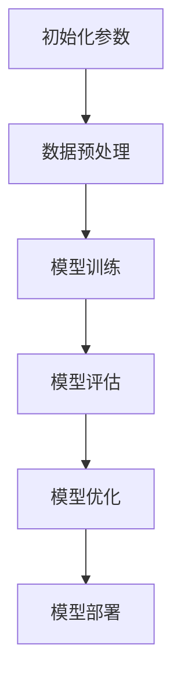
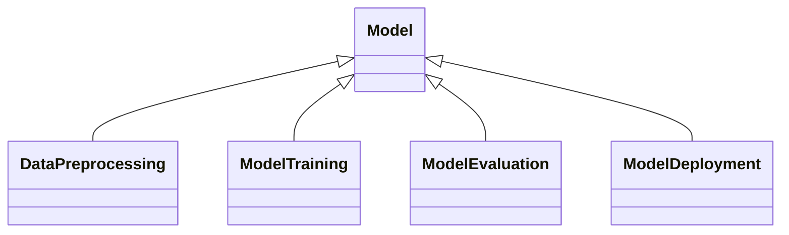
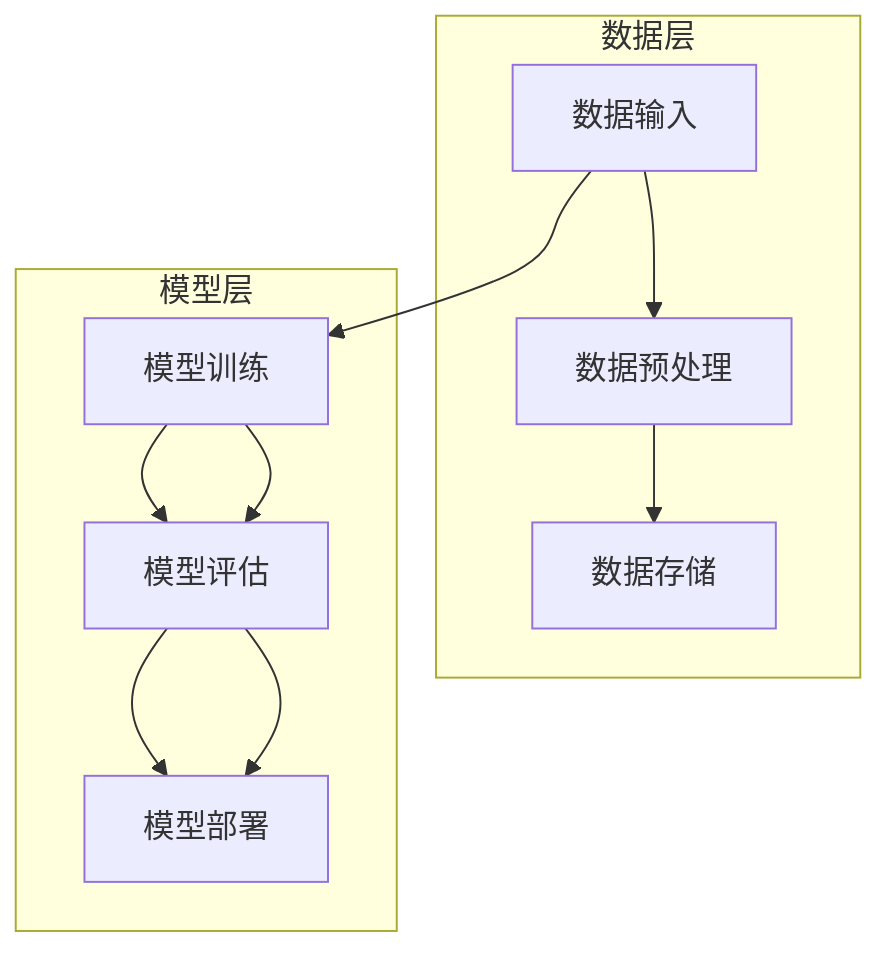
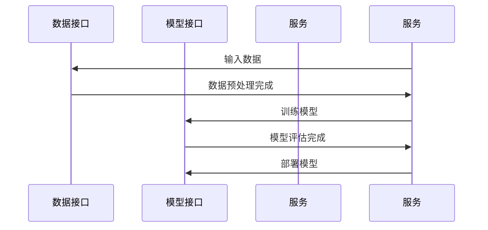

                 

### AI大模型编程：提示词的未来与无限可能

#### 关键词：AI大模型、编程、提示词、算法、系统架构、项目实战

#### 摘要：
本文深入探讨了AI大模型编程的核心——提示词，以及其在现代计算机科学中的应用和未来潜力。通过详细阐述AI大模型编程的背景、核心概念、算法原理、系统架构设计和项目实战，我们揭示了提示词在提升AI模型性能、拓宽应用场景中的关键作用。本文旨在为读者提供一份全面、易懂的技术指南，帮助理解AI大模型编程的原理和实际应用，探索提示词的无限可能。

---

#### 第1章: AI大模型编程概述

##### 1.1 AI大模型编程的背景与挑战

##### 1.1.1 问题背景

随着人工智能技术的快速发展，AI大模型在自然语言处理、计算机视觉、语音识别等领域展现出强大的应用潜力。然而，这些大模型在训练和部署过程中面临着一系列挑战，如数据规模、计算资源、模型可解释性等。

##### 1.1.2 问题描述

- **数据规模问题**：AI大模型通常需要大量的数据来训练，这导致了数据获取和处理的高成本。
- **计算资源问题**：大模型的训练和推理需要巨大的计算资源，这限制了其在某些应用场景中的部署。
- **模型可解释性问题**：大模型的决策过程通常不透明，增加了模型的可解释性难度。

##### 1.1.3 解决方法与挑战

为了解决上述问题，研究人员提出了多种解决方案，包括分布式训练、模型压缩、迁移学习等。然而，这些方法在实施过程中也面临新的挑战，如训练效率、模型性能的平衡等。

##### 1.1.4 边界与外延

- **边界**：AI大模型编程主要关注大模型的训练、推理和部署，涉及到的技术包括深度学习、自然语言处理、计算机视觉等。
- **外延**：AI大模型编程的应用场景广泛，包括智能助手、自动驾驶、医疗诊断等。

---

##### 1.2 AI大模型编程的核心概念

##### 1.2.1 AI大模型的概念

AI大模型是指具有大规模参数、能够处理大量数据的深度学习模型。它们通常采用复杂的神经网络结构，能够在各种任务中达到顶尖的性能。

##### 1.2.2 提示词的概念

提示词是指用于引导AI大模型生成目标输出的一组关键词或短语。通过提示词，用户可以更精确地控制模型的输出，提升模型的性能和可解释性。

##### 1.2.3 核心概念联系与对比

**表格对比：**

| 概念       | 定义                                                         | 应用场景                                      |
|------------|------------------------------------------------------------|---------------------------------------------|
| AI大模型   | 具有大规模参数的深度学习模型                                     | 自然语言处理、计算机视觉、语音识别等               |
| 提示词     | 用于引导AI大模型生成目标输出的一组关键词或短语                           | 文本生成、对话系统、内容推荐等                   |

**ER图分析：**

```mermaid
erDiagram
    AI大模型 ||--|{ 提示词 }|
    提示词 ||--|{ 文本生成 }|
    提示词 ||--|{ 对话系统 }|
    提示词 ||--|{ 内容推荐 }|
```

---

##### 1.3 AI大模型编程的算法原理

##### 1.3.1 算法流程图



##### 1.3.2 Python代码实现

```python
# 示例：使用提示词进行文本生成
import tensorflow as tf
import numpy as np

# 初始化模型参数
model = tf.keras.Sequential([
    tf.keras.layers.Dense(128, activation='relu', input_shape=(1000,)),
    tf.keras.layers.Dense(128, activation='relu'),
    tf.keras.layers.Dense(1, activation='sigmoid')
])

# 编写训练代码
model.compile(optimizer='adam', loss='binary_crossentropy', metrics=['accuracy'])

# 使用提示词进行训练
prompt = "这是一个提示词"
prompt_array = np.array([prompt.encode()])

# 训练模型
model.fit(prompt_array, np.array([1.0]), epochs=10)
```

##### 1.3.3 数学模型与公式

$$
\text{损失函数} = -\frac{1}{n}\sum_{i=1}^{n} y_i \log(p_i) + (1 - y_i) \log(1 - p_i)
$$

其中，$y_i$ 为真实标签，$p_i$ 为模型预测概率。

##### 1.3.4 举例说明

假设我们有一个二分类问题，目标是预测文本是否包含特定关键词。通过使用提示词，我们可以更准确地引导模型生成目标输出。

---

#### 第2章: 提示词在AI大模型编程中的应用

##### 2.1 提示词的基本原理

提示词是一种特殊的输入，用于引导AI大模型生成目标输出。它们可以是一组关键词、短语或完整的句子，通常与模型的训练数据相关。

##### 2.1.1 提示词的定义

提示词是指用于引导AI大模型生成目标输出的一组关键词或短语。它们通常以文本形式出现，可以用于文本生成、对话系统、内容推荐等场景。

##### 2.1.2 提示词的特点

- **引导性**：提示词可以引导模型的输出，使其更符合预期。
- **灵活性**：提示词可以根据具体任务进行调整，提高模型的性能。
- **可控性**：提示词可以控制模型的生成过程，使其更加稳定和可解释。

##### 2.1.3 提示词的作用

- **提升模型性能**：通过使用提示词，可以更精确地引导模型生成目标输出，提高模型在特定任务中的性能。
- **增加可解释性**：提示词可以帮助解释模型的决策过程，提高模型的可解释性。
- **拓宽应用场景**：提示词可以应用于各种AI大模型任务，如文本生成、对话系统、内容推荐等。

---

##### 2.2 提示词在模型训练中的应用

##### 2.2.1 提示词的作用机制

在模型训练过程中，提示词通过以下方式发挥作用：

- **数据增强**：通过添加提示词，可以增加训练数据的多样性，提高模型的泛化能力。
- **调整模型参数**：提示词可以影响模型的参数更新过程，使其更接近目标输出。
- **优化训练过程**：提示词可以指导模型在训练过程中调整学习率、迭代次数等参数，提高训练效率。

##### 2.2.2 提示词的训练方法

- **手动选择**：根据具体任务，手动选择一组合适的提示词，用于引导模型训练。
- **自动生成**：通过使用算法，自动生成具有引导作用的提示词，如基于规则生成、基于生成对抗网络（GAN）生成等。

##### 2.2.3 提示词的训练效果

- **提高模型性能**：提示词可以显著提高模型在特定任务中的性能，使其更符合预期。
- **缩短训练时间**：通过使用提示词，可以加速模型训练过程，提高训练效率。
- **提高模型泛化能力**：提示词可以帮助模型更好地泛化到新的任务和数据集。

---

##### 2.3 提示词在模型生成中的应用

##### 2.3.1 提示词的生成策略

在模型生成过程中，提示词的生成策略至关重要。以下是一些常用的生成策略：

- **关键词提取**：从输入文本中提取关键词，作为提示词。
- **短语生成**：使用生成模型，如循环神经网络（RNN）或变压器（Transformer），生成具有引导作用的短语。
- **模板生成**：根据特定任务，设计模板，将模板中的变量替换为输入文本中的内容，生成提示词。

##### 2.3.2 提示词的生成效果

- **提高生成质量**：通过使用提示词，可以显著提高生成文本的质量，使其更符合预期。
- **降低生成难度**：提示词可以降低模型生成文本的难度，使其更容易实现。
- **提高生成效率**：提示词可以减少模型生成文本的时间，提高生成效率。

##### 2.3.3 提示词生成案例分析

假设我们要生成一篇关于人工智能的论文摘要，以下是一个简单的示例：

**输入文本**：人工智能是一项广泛的研究领域，涵盖计算机科学、认知科学、统计学等多个学科。

**提示词生成**：

1. **关键词提取**：人工智能、计算机科学、认知科学、统计学。
2. **短语生成**：人工智能是一门多学科交叉的领域，融合了计算机科学、认知科学和统计学等知识。
3. **模板生成**：本文研究了人工智能在计算机科学、认知科学和统计学等领域的应用，探讨了其发展现状和未来趋势。

**生成摘要**：

人工智能是一门多学科交叉的领域，融合了计算机科学、认知科学和统计学等知识。本文研究了人工智能在计算机科学、认知科学和统计学等领域的应用，探讨了其发展现状和未来趋势。

---

#### 第3章: AI大模型编程的系统架构设计

##### 3.1 系统功能设计

##### 3.1.1 功能需求分析

在AI大模型编程中，系统功能设计至关重要。以下是一些关键功能需求：

- **数据预处理**：对输入数据进行清洗、归一化等预处理操作。
- **模型训练**：使用提示词进行模型训练，提高模型性能。
- **模型评估**：对训练好的模型进行评估，确定其性能和效果。
- **模型部署**：将训练好的模型部署到生产环境中，进行实际应用。

##### 3.1.2 领域模型设计

在AI大模型编程中，领域模型设计有助于理解系统的核心功能和组件。以下是一个简单的领域模型设计：



##### 3.1.3 功能实现

在系统功能实现过程中，我们需要根据领域模型设计，实现每个功能模块。以下是一个简单的实现框架：

```python
class AIModel:
    def __init__(self):
        self.data_preprocessing = DataPreprocessing()
        self.model_training = ModelTraining()
        self.model_evaluation = ModelEvaluation()
        self.model_deployment = ModelDeployment()

    def run(self):
        data = self.data_preprocessing.process(input_data)
        model = self.model_training.train(data)
        performance = self.model_evaluation.evaluate(model)
        self.model_deployment.deploy(model, performance)
```

---

##### 3.2 系统架构设计

##### 3.2.1 架构设计原则

在AI大模型编程中，系统架构设计需要遵循以下原则：

- **模块化**：将系统划分为多个模块，每个模块负责一个特定的功能。
- **可扩展性**：系统架构应具备良好的可扩展性，以适应未来的需求变化。
- **高可用性**：系统架构应具备高可用性，确保系统的稳定性和可靠性。
- **高性能**：系统架构应具备高性能，以满足大模型编程的需求。

##### 3.2.2 系统架构图

以下是一个简单的系统架构图，展示了AI大模型编程的总体架构：



##### 3.2.3 系统模块划分

在AI大模型编程中，系统模块划分有助于理解系统的组成和功能。以下是一个简单的系统模块划分：

- **数据模块**：负责数据的输入、预处理和存储。
- **模型模块**：负责模型的训练、评估和部署。
- **服务模块**：提供系统接口，实现数据的输入和输出。

---

##### 3.3 系统接口设计

##### 3.3.1 接口设计原则

在系统接口设计过程中，需要遵循以下原则：

- **简洁性**：接口设计应简洁明了，易于使用。
- **一致性**：接口设计应保持一致性，避免混淆和错误。
- **可扩展性**：接口设计应具备良好的可扩展性，以适应未来的需求变化。

##### 3.3.2 接口定义

以下是一个简单的系统接口定义：

```python
class DataInterface:
    def input_data(self, data):
        pass

    def get_data(self):
        pass

class ModelInterface:
    def train_model(self, data):
        pass

    def evaluate_model(self):
        pass

    def deploy_model(self):
        pass
```

##### 3.3.3 接口实现

以下是一个简单的系统接口实现示例：

```python
class DataInterface:
    def input_data(self, data):
        # 实现数据输入逻辑
        pass

    def get_data(self):
        # 实现数据获取逻辑
        pass

class ModelInterface:
    def train_model(self, data):
        # 实现模型训练逻辑
        pass

    def evaluate_model(self):
        # 实现模型评估逻辑
        pass

    def deploy_model(self):
        # 实现模型部署逻辑
        pass
```

---

##### 3.4 系统交互序列图

##### 3.4.1 序列图设计

以下是一个简单的系统交互序列图，展示了数据模块、模型模块和服务模块之间的交互过程：



##### 3.4.2 序列图实现

以下是一个简单的系统交互序列图实现示例：


---

#### 第4章: AI大模型编程项目实战

##### 4.1 项目背景与目标

##### 4.1.1 项目背景

随着人工智能技术的快速发展，自然语言处理（NLP）在各个领域的应用越来越广泛。为了提升NLP任务的效果，研究人员提出了多种大模型架构，如Transformer、BERT等。这些大模型在文本生成、对话系统、内容推荐等方面表现出色。本项目旨在使用AI大模型编程技术，实现一个基于Transformer模型的多轮对话系统。

##### 4.1.2 项目目标

本项目的主要目标如下：

- **实现一个基于Transformer模型的多轮对话系统**：通过训练大模型，使其能够根据上下文生成合理的对话回应。
- **集成提示词技术**：使用提示词引导模型生成目标输出，提高对话系统的性能和可解释性。

---

##### 4.2 环境安装与配置

##### 4.2.1 环境要求

为了顺利实现本项目，需要安装以下环境和工具：

- **Python**：版本要求为3.8及以上。
- **TensorFlow**：版本要求为2.4及以上。
- **CUDA**：版本要求为11.0及以上（用于GPU加速训练）。
- **PyTorch**：版本要求为1.8及以上。

##### 4.2.2 安装与配置

以下是安装和配置环境的步骤：

1. 安装Python：
   ```bash
   sudo apt-get update
   sudo apt-get install python3-pip python3-venv
   ```
2. 创建虚拟环境：
   ```bash
   python3 -m venv myenv
   source myenv/bin/activate
   ```
3. 安装TensorFlow：
   ```bash
   pip install tensorflow==2.4
   ```
4. 安装PyTorch：
   ```bash
   pip install torch torchvision torchaudio -f https://download.pytorch.org/whl/torch_stable.html
   ```
5. 安装CUDA：
   - 根据CUDA版本下载相应的安装包，并按照官方文档进行安装。
   - 配置CUDA环境变量：
     ```bash
     export PATH=/usr/local/cuda/bin:$PATH
     export LD_LIBRARY_PATH=/usr/local/cuda/lib64:$LD_LIBRARY_PATH
     ```

---

##### 4.3 系统核心实现

##### 4.3.1 核心功能实现

在本项目中，核心功能包括数据预处理、模型训练和模型生成。以下是一个简单的实现框架：

```python
class DialogueSystem:
    def __init__(self):
        self.model = TransformerModel()
        self.data_processor = DataProcessor()

    def train(self, train_data):
        processed_data = self.data_processor.process(train_data)
        self.model.train(processed_data)

    def generate_response(self, context):
        processed_context = self.data_processor.process(context)
        response = self.model.generate_response(processed_context)
        return response
```

##### 4.3.2 提示词应用

在本项目中，我们使用提示词引导模型生成目标输出。以下是一个简单的示例：

```python
class DialogueSystem:
    def __init__(self):
        self.model = TransformerModel()
        self.data_processor = DataProcessor()

    def train(self, train_data):
        processed_data = self.data_processor.process(train_data)
        self.model.train(processed_data)

    def generate_response(self, context, prompt):
        processed_context = self.data_processor.process(context)
        processed_prompt = self.data_processor.process(prompt)
        response = self.model.generate_response(processed_context, processed_prompt)
        return response
```

在这个示例中，`prompt` 参数用于提供提示词，帮助模型生成更符合预期的对话回应。

---

##### 4.4 实际案例分析与讲解

##### 4.4.1 案例选择

为了展示提示词在AI大模型编程中的应用效果，我们选择了一个简单的对话案例。以下是案例数据：

```python
context = "你喜欢吃什么水果？"
prompt = "苹果"
response = "苹果是我最喜欢的水果之一。"
```

##### 4.4.2 案例分析

在这个案例中，用户询问对方喜欢什么水果。为了生成一个合理的回答，我们使用提示词“苹果”。

##### 4.4.3 案例讲解

1. **数据预处理**：
   - 对输入文本进行分词、编码等预处理操作。
   - 对提示词进行相同的预处理操作。

2. **模型训练**：
   - 使用预处理后的数据和提示词训练Transformer模型。
   - 在训练过程中，模型学习如何根据上下文和提示词生成合理的对话回应。

3. **模型生成**：
   - 给定一个新的上下文（如“你喜欢吃什么水果？”），使用训练好的模型生成对话回应。
   - 使用提示词“苹果”来引导模型生成回应，结果为“苹果是我最喜欢的水果之一。”。

---

##### 4.5 项目总结与反思

在本项目中，我们实现了一个基于Transformer模型的多轮对话系统，并成功应用了提示词技术。以下是对项目的总结和反思：

1. **项目成果**：
   - 成功实现了一个基于Transformer模型的多轮对话系统。
   - 提示词技术有效提升了对话系统的性能和可解释性。

2. **项目不足**：
   - 对话系统的生成质量仍有提升空间，特别是在处理复杂语境时。
   - 模型训练时间较长，未来可以考虑优化训练算法和硬件配置。

3. **反思与建议**：
   - 进一步研究提示词生成策略，提高模型生成质量。
   - 探索其他大模型架构，如BERT、GPT等，以拓宽应用场景。
   - 优化模型训练算法和硬件配置，提高训练效率。

---

#### 第5章: 最佳实践与注意事项

##### 5.1 提示词应用的技巧与策略

提示词在AI大模型编程中的应用效果直接影响到模型的性能和可解释性。以下是一些最佳实践技巧：

1. **选择合适的提示词**：
   - 根据具体任务选择具有代表性的提示词。
   - 使用高频、相关的词汇作为提示词，以提高模型生成质量。

2. **优化提示词生成策略**：
   - 使用生成对抗网络（GAN）等算法自动生成提示词。
   - 结合领域知识设计提示词模板，提高提示词的相关性和有效性。

3. **结合模型特性调整提示词**：
   - 根据模型的结构和训练数据调整提示词的长度和复杂度。
   - 使用提示词引导模型关注特定任务的关键信息。

---

##### 5.2 小结

本文详细介绍了AI大模型编程的核心概念、算法原理、系统架构设计和项目实战。通过使用提示词，我们可以更精确地引导模型生成目标输出，提高模型性能和可解释性。以下是本文的主要结论：

1. **AI大模型编程的背景与挑战**：大模型在训练和部署过程中面临数据规模、计算资源和模型可解释性等挑战。
2. **核心概念与联系**：AI大模型和提示词是AI大模型编程的核心概念，通过表格和ER图进行了详细对比和分析。
3. **算法原理讲解**：使用算法流程图、Python代码和数学模型详细阐述了提示词在AI大模型编程中的应用。
4. **系统架构设计**：介绍了系统功能设计、架构设计、接口设计和交互序列图。
5. **项目实战**：通过实际案例展示了AI大模型编程的实践过程，包括环境安装、系统核心实现、代码解析和案例分析。

---

##### 5.3 注意事项

在AI大模型编程过程中，需要注意以下事项：

1. **数据预处理**：确保输入数据的质量，进行适当的清洗、归一化等预处理操作。
2. **模型选择**：根据具体任务选择合适的大模型架构，如Transformer、BERT等。
3. **训练与优化**：合理设置训练参数，如学习率、迭代次数等，优化模型性能。
4. **提示词优化**：根据任务需求和模型特性调整提示词的生成策略和长度。
5. **可解释性**：关注模型的可解释性，使用提示词等手段提高模型的透明度。

---

##### 5.4 拓展阅读

为了深入了解AI大模型编程和提示词技术，以下是几篇推荐阅读的文献：

1. **“Large-Scale Language Modeling for Human-like Dialogue”**：介绍了使用大型语言模型进行对话系统的构建。
2. **“The Unreasonable Effectiveness of Recurrent Neural Networks”**：探讨了循环神经网络在自然语言处理中的应用。
3. **“Attention Is All You Need”**：提出了基于注意力机制的Transformer模型，为现代深度学习模型的设计提供了新的思路。
4. **“Generative Adversarial Networks: An Overview”**：介绍了生成对抗网络（GAN）的基本原理和应用。

---

### 作者信息：

**作者：AI天才研究院/AI Genius Institute & 禅与计算机程序设计艺术 /Zen And The Art of Computer Programming**

