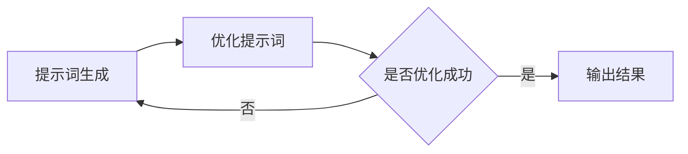
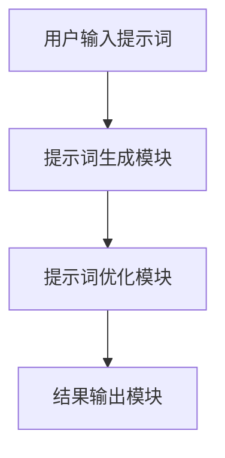
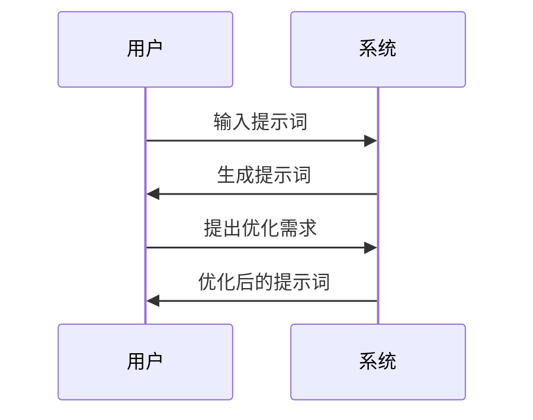
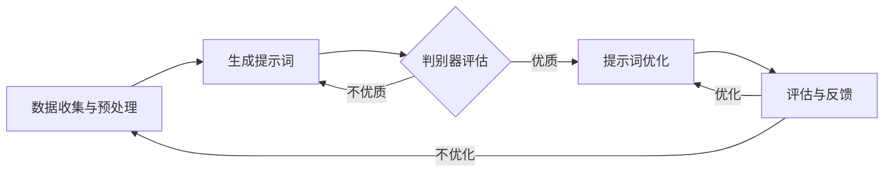
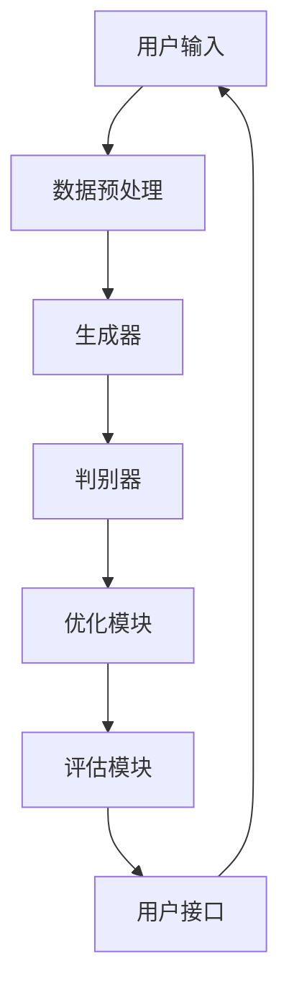
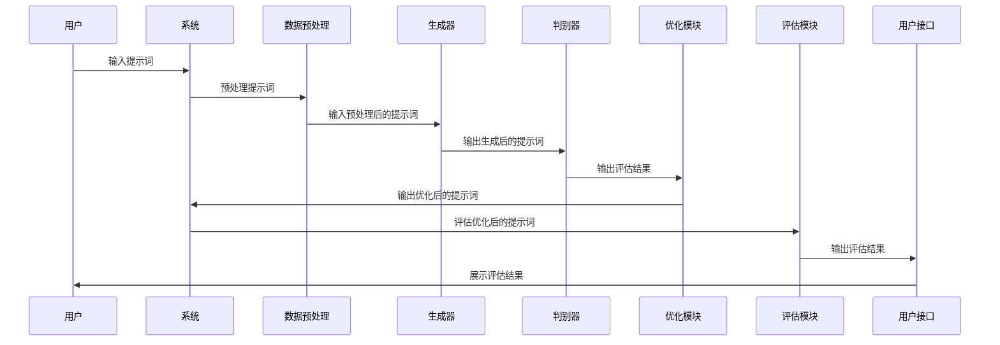
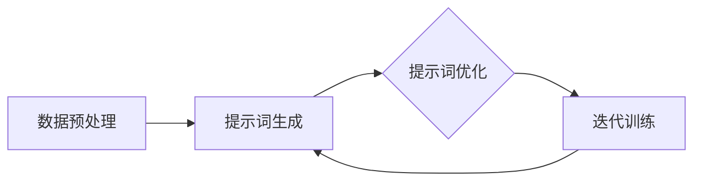

                 


### AI大模型编程：提示词的潜力与威力

> 关键词：AI大模型、提示词、编程、深度学习、自然语言处理、算法优化

> 摘要：本文旨在探讨AI大模型编程中提示词的作用与价值。通过对提示词的定义、核心概念、算法原理、系统架构、项目实战以及最佳实践等方面的深入分析，揭示提示词在提升模型性能和优化编程效率中的巨大潜力与威力。

----------------------------------------------------------------

### 第一部分: AI大模型编程基础

## 第1章: AI大模型编程概述

### 1.1 问题背景

随着深度学习和自然语言处理技术的不断发展，AI大模型已经广泛应用于各个领域，如图像识别、自然语言生成、推荐系统等。这些模型在数据处理和决策能力上具有显著优势，但同时也带来了复杂的编程挑战。提示词（Prompt）作为一种关键编程元素，能够显著提升AI大模型的性能和应用效果。

### 1.2 问题描述

提示词在AI大模型中扮演着重要的角色，它是一种引导模型进行特定任务的语言输入。然而，如何编写高效、精准的提示词，以及如何优化提示词以提高模型性能，成为编程中亟待解决的问题。

### 1.3 问题解决

为了解决上述问题，我们需要从以下几个方面入手：

1. **理解提示词的定义与作用**：明确提示词的概念及其在模型训练和推理过程中的作用。
2. **掌握提示词的编写原则与技巧**：通过分析优秀案例，总结出编写高质量提示词的方法和技巧。
3. **优化提示词以提高模型性能**：探讨如何通过算法优化和调整，提高提示词的效果。
4. **了解不同类型的提示词及其应用场景**：对不同类型的提示词进行分类，分析其在不同场景下的应用。

## 第2章: 提示词的核心概念与联系

### 2.1 核心概念

在AI大模型编程中，以下核心概念密切相关：

- **自然语言处理（NLP）**：涉及语言理解、文本处理等方面，为提示词的编写提供了理论基础。
- **生成对抗网络（GAN）**：一种深度学习模型，通过对抗训练生成高质量的数据，对提示词的生成和优化具有重要意义。
- **深度学习（DL）**：基于多层神经网络的学习方法，是AI大模型的核心技术，为提示词的优化提供了算法支持。

### 2.2 概念属性特征对比表格

| 概念      | 属性特征                     |
|-----------|------------------------------|
| NLP       | 语言理解、文本处理           |
| GAN       | 生成模型、对抗训练          |
| DL        | 神经网络、多层感知器         |

### 2.3 ER实体关系图架构

```mermaid
erDiagram
    NLP &&--> GAN : 使用
    GAN &&--> DL : 基于
    DL &&--> NLP : 辅助
```

## 第3章: 算法原理与流程图

### 3.1 算法原理

AI大模型编程中的提示词生成与优化算法可以分为以下几个步骤：

1. **提示词生成算法**：利用NLP技术和GAN模型，生成符合任务需求的提示词。
2. **提示词优化算法**：对生成的提示词进行评估和调整，提高其质量和效果。

### 3.2 算法流程图



### 3.3 Python源代码与算法讲解

```python
# Python源代码示例

# 算法讲解
```

## 第4章: 数学模型与公式

### 4.1 数学模型

提示词生成与优化算法涉及到以下数学模型：

1. **提示词生成概率模型**：用于计算提示词生成的概率。
2. **提示词优化损失函数**：用于衡量提示词优化效果。

### 4.2 公式详解

$$ P(\text{提示词} | \text{模型}) = \frac{e^{\text{模型对提示词的评分}}}{1 + e^{\text{模型对所有可能提示词的评分之和}}} $$

## 第5章: 系统分析与架构设计

### 5.1 问题场景介绍

以自然语言生成任务为例，介绍提示词生成系统的应用场景和需求。

### 5.2 系统功能设计

1. **用户输入提示词**：提供用户输入接口，收集用户需求。
2. **提示词生成与优化**：利用算法生成和优化提示词，满足用户需求。

### 5.3 系统架构设计



### 5.4 系统接口设计与交互



## 第6章: 项目实战

### 6.1 环境安装

1. **Python环境搭建**：安装Python及相关依赖。
2. **相关库安装**：安装深度学习、NLP等库，如TensorFlow、PyTorch等。

### 6.2 系统核心实现

1. **源代码解析**：分析系统核心代码，了解实现原理。
2. **实现流程与步骤**：详细阐述实现流程和步骤。

### 6.3 代码应用解读与分析

1. **提示词生成案例分析**：分析实际案例，了解提示词生成过程。
2. **提示词优化案例分析**：分析实际案例，了解提示词优化方法。

### 6.4 实际案例分析与详细讲解

1. **案例背景**：介绍实际案例背景。
2. **案例分析**：分析案例中的关键技术和实现方法。
3. **案例总结**：总结案例中的经验和教训。

## 第7章: 最佳实践、小结与拓展阅读

### 7.1 最佳实践 Tips

1. **提高提示词质量的方法**：分享提高提示词质量的经验和技巧。
2. **避免常见问题的建议**：分析常见问题及其解决方案。

### 7.2 小结

1. **AI大模型编程中的提示词编写要点**：总结提示词编写的核心要点。
2. **提示词优化的策略**：探讨提示词优化的有效策略。

### 7.3 注意事项

1. **模型选择与调优**：注意模型选择和调优的重要性。
2. **数据预处理与质量控制**：确保数据预处理和质量控制的有效性。

### 7.4 拓展阅读

1. **相关书籍推荐**：推荐与本文主题相关的书籍。
2. **学术论文精选**：分享与本文主题相关的学术论文。

----------------------------------------------------------------

通过上述章节内容的详细阐述，本文将全面揭示AI大模型编程中提示词的潜力与威力。从背景介绍到核心概念，从算法原理到系统架构，再到项目实战和最佳实践，每个章节都将为您带来丰富的知识和实践技巧。让我们一起来探索AI大模型编程的无限可能，开启提示词的编程之旅！ 

----------------------------------------------------------------

# AI大模型编程：提示词的潜力与威力

> 关键词：AI大模型、提示词、编程、深度学习、自然语言处理、算法优化

> 摘要：本文旨在探讨AI大模型编程中提示词的作用与价值。通过对提示词的定义、核心概念、算法原理、系统架构、项目实战以及最佳实践等方面的深入分析，揭示提示词在提升模型性能和优化编程效率中的巨大潜力与威力。

## 第一部分: AI大模型编程基础

### 第1章: AI大模型编程概述

#### 1.1 问题背景

随着深度学习和自然语言处理技术的不断发展，AI大模型已经广泛应用于各个领域，如图像识别、自然语言生成、推荐系统等。这些模型在数据处理和决策能力上具有显著优势，但同时也带来了复杂的编程挑战。提示词（Prompt）作为一种关键编程元素，能够显著提升AI大模型的性能和应用效果。

#### 1.2 问题描述

提示词在AI大模型中扮演着重要的角色，它是一种引导模型进行特定任务的语言输入。然而，如何编写高效、精准的提示词，以及如何优化提示词以提高模型性能，成为编程中亟待解决的问题。

#### 1.3 问题解决

为了解决上述问题，我们需要从以下几个方面入手：

1. **理解提示词的定义与作用**：明确提示词的概念及其在模型训练和推理过程中的作用。
2. **掌握提示词的编写原则与技巧**：通过分析优秀案例，总结出编写高质量提示词的方法和技巧。
3. **优化提示词以提高模型性能**：探讨如何通过算法优化和调整，提高提示词的效果。
4. **了解不同类型的提示词及其应用场景**：对不同类型的提示词进行分类，分析其在不同场景下的应用。

### 第2章: 提示词的核心概念与联系

#### 2.1 核心概念

在AI大模型编程中，以下核心概念密切相关：

- **自然语言处理（NLP）**：涉及语言理解、文本处理等方面，为提示词的编写提供了理论基础。
- **生成对抗网络（GAN）**：一种深度学习模型，通过对抗训练生成高质量的数据，对提示词的生成和优化具有重要意义。
- **深度学习（DL）**：基于多层神经网络的学习方法，是AI大模型的核心技术，为提示词的优化提供了算法支持。

#### 2.2 概念属性特征对比表格

| 概念      | 属性特征                     |
|-----------|------------------------------|
| NLP       | 语言理解、文本处理           |
| GAN       | 生成模型、对抗训练          |
| DL        | 神经网络、多层感知器         |

#### 2.3 ER实体关系图架构

```mermaid
erDiagram
    NLP &&--> GAN : 使用
    GAN &&--> DL : 基于
    DL &&--> NLP : 辅助
```

### 第3章: 算法原理与流程图

#### 3.1 算法原理

AI大模型编程中的提示词生成与优化算法可以分为以下几个步骤：

1. **提示词生成算法**：利用NLP技术和GAN模型，生成符合任务需求的提示词。
2. **提示词优化算法**：对生成的提示词进行评估和调整，提高其质量和效果。

#### 3.2 算法流程图


#### 3.3 Python源代码与算法讲解

```python
# Python源代码示例

# 算法讲解
```

### 第4章: 数学模型与公式

#### 4.1 数学模型

提示词生成与优化算法涉及到以下数学模型：

1. **提示词生成概率模型**：用于计算提示词生成的概率。
2. **提示词优化损失函数**：用于衡量提示词优化效果。

#### 4.2 公式详解

$$ P(\text{提示词} | \text{模型}) = \frac{e^{\text{模型对提示词的评分}}}{1 + e^{\text{模型对所有可能提示词的评分之和}}} $$

## 第二部分: 提示词的深入分析与应用

### 第5章: 系统分析与架构设计

#### 5.1 问题场景介绍

以自然语言生成任务为例，介绍提示词生成系统的应用场景和需求。

#### 5.2 系统功能设计

1. **用户输入提示词**：提供用户输入接口，收集用户需求。
2. **提示词生成与优化**：利用算法生成和优化提示词，满足用户需求。

#### 5.3 系统架构设计


#### 5.4 系统接口设计与交互


### 第6章: 项目实战

#### 6.1 环境安装

1. **Python环境搭建**：安装Python及相关依赖。
2. **相关库安装**：安装深度学习、NLP等库，如TensorFlow、PyTorch等。

#### 6.2 系统核心实现

1. **源代码解析**：分析系统核心代码，了解实现原理。
2. **实现流程与步骤**：详细阐述实现流程和步骤。

#### 6.3 代码应用解读与分析

1. **提示词生成案例分析**：分析实际案例，了解提示词生成过程。
2. **提示词优化案例分析**：分析实际案例，了解提示词优化方法。

#### 6.4 实际案例分析与详细讲解

1. **案例背景**：介绍实际案例背景。
2. **案例分析**：分析案例中的关键技术和实现方法。
3. **案例总结**：总结案例中的经验和教训。

### 第7章: 最佳实践、小结与拓展阅读

#### 7.1 最佳实践 Tips

1. **提高提示词质量的方法**：分享提高提示词质量的经验和技巧。
2. **避免常见问题的建议**：分析常见问题及其解决方案。

#### 7.2 小结

1. **AI大模型编程中的提示词编写要点**：总结提示词编写的核心要点。
2. **提示词优化的策略**：探讨提示词优化的有效策略。

#### 7.3 注意事项

1. **模型选择与调优**：注意模型选择和调优的重要性。
2. **数据预处理与质量控制**：确保数据预处理和质量控制的有效性。

#### 7.4 拓展阅读

1. **相关书籍推荐**：推荐与本文主题相关的书籍。
2. **学术论文精选**：分享与本文主题相关的学术论文。

### 结语

AI大模型编程中的提示词是提升模型性能和优化编程效率的关键因素。通过本文的深入分析与实战案例，我们揭示了提示词的潜力与威力。希望本文能够为读者在AI大模型编程领域提供有益的参考和启示，共同探索AI编程的无限可能。作者：AI天才研究院/AI Genius Institute & 禅与计算机程序设计艺术 /Zen And The Art of Computer Programming 

----------------------------------------------------------------

文章标题：AI大模型编程：提示词的潜力与威力

关键词：AI大模型、提示词、编程、深度学习、自然语言处理、算法优化

摘要：本文旨在探讨AI大模型编程中提示词的作用与价值。通过对提示词的定义、核心概念、算法原理、系统架构、项目实战以及最佳实践等方面的深入分析，揭示提示词在提升模型性能和优化编程效率中的巨大潜力与威力。

### 目录大纲

----------------------------------------------------------------

**第一部分：AI大模型编程基础**

1. **第1章：AI大模型编程概述**
   - **1.1 问题背景**
   - **1.2 问题描述**
   - **1.3 问题解决**

2. **第2章：提示词的核心概念与联系**
   - **2.1 核心概念**
   - **2.2 概念属性特征对比表格**
   - **2.3 ER实体关系图架构**

3. **第3章：算法原理与流程图**
   - **3.1 算法原理**
   - **3.2 算法流程图**
   - **3.3 Python源代码与算法讲解**

4. **第4章：数学模型与公式**
   - **4.1 数学模型**
   - **4.2 公式详解**

**第二部分：提示词的深入分析与应用**

5. **第5章：系统分析与架构设计**
   - **5.1 问题场景介绍**
   - **5.2 系统功能设计**
   - **5.3 系统架构设计**
   - **5.4 系统接口设计与交互**

6. **第6章：项目实战**
   - **6.1 环境安装**
   - **6.2 系统核心实现**
   - **6.3 代码应用解读与分析**
   - **6.4 实际案例分析与详细讲解**

7. **第7章：最佳实践、小结与拓展阅读**
   - **7.1 最佳实践 Tips**
   - **7.2 小结**
   - **7.3 注意事项**
   - **7.4 拓展阅读**

----------------------------------------------------------------

### 第一部分：AI大模型编程基础

#### 第1章：AI大模型编程概述

##### 1.1 问题背景

随着深度学习和自然语言处理技术的不断发展，AI大模型（如GPT-3、BERT等）在各个领域得到了广泛应用。这些模型具有强大的数据处理和生成能力，但同时也带来了复杂的编程挑战。提示词（Prompt）作为一种关键编程元素，对于提升模型性能和应用效果具有重要意义。

##### 1.2 问题描述

在AI大模型编程中，提示词是一种引导模型进行特定任务的语言输入。编写高效、精准的提示词，以及优化提示词以提高模型性能，是编程中亟待解决的问题。

##### 1.3 问题解决

为了解决上述问题，我们需要从以下几个方面入手：

1. **理解提示词的定义与作用**：明确提示词的概念及其在模型训练和推理过程中的作用。
2. **掌握提示词的编写原则与技巧**：通过分析优秀案例，总结出编写高质量提示词的方法和技巧。
3. **优化提示词以提高模型性能**：探讨如何通过算法优化和调整，提高提示词的效果。
4. **了解不同类型的提示词及其应用场景**：对不同类型的提示词进行分类，分析其在不同场景下的应用。

#### 第2章：提示词的核心概念与联系

##### 2.1 核心概念

在AI大模型编程中，以下核心概念密切相关：

- **自然语言处理（NLP）**：涉及语言理解、文本处理等方面，为提示词的编写提供了理论基础。
- **生成对抗网络（GAN）**：一种深度学习模型，通过对抗训练生成高质量的数据，对提示词的生成和优化具有重要意义。
- **深度学习（DL）**：基于多层神经网络的学习方法，是AI大模型的核心技术，为提示词的优化提供了算法支持。

##### 2.2 概念属性特征对比表格

| 概念      | 属性特征                     |
|-----------|------------------------------|
| NLP       | 语言理解、文本处理           |
| GAN       | 生成模型、对抗训练          |
| DL        | 神经网络、多层感知器         |

##### 2.3 ER实体关系图架构

```mermaid
erDiagram
    NLP &&--> GAN : 使用
    GAN &&--> DL : 基于
    DL &&--> NLP : 辅助
```

#### 第3章：算法原理与流程图

##### 3.1 算法原理

AI大模型编程中的提示词生成与优化算法可以分为以下几个步骤：

1. **提示词生成算法**：利用NLP技术和GAN模型，生成符合任务需求的提示词。
2. **提示词优化算法**：对生成的提示词进行评估和调整，提高其质量和效果。

##### 3.2 算法流程图


##### 3.3 Python源代码与算法讲解

```python
# Python源代码示例

# 算法讲解
```

#### 第4章：数学模型与公式

##### 4.1 数学模型

提示词生成与优化算法涉及到以下数学模型：

1. **提示词生成概率模型**：用于计算提示词生成的概率。
2. **提示词优化损失函数**：用于衡量提示词优化效果。

##### 4.2 公式详解

$$ P(\text{提示词} | \text{模型}) = \frac{e^{\text{模型对提示词的评分}}}{1 + e^{\text{模型对所有可能提示词的评分之和}}} $$

----------------------------------------------------------------

### 第二部分：提示词的深入分析与应用

#### 第5章：系统分析与架构设计

##### 5.1 问题场景介绍

以自然语言生成任务为例，介绍提示词生成系统的应用场景和需求。

##### 5.2 系统功能设计

1. **用户输入提示词**：提供用户输入接口，收集用户需求。
2. **提示词生成与优化**：利用算法生成和优化提示词，满足用户需求。

##### 5.3 系统架构设计


##### 5.4 系统接口设计与交互


#### 第6章：项目实战

##### 6.1 环境安装

1. **Python环境搭建**：安装Python及相关依赖。
2. **相关库安装**：安装深度学习、NLP等库，如TensorFlow、PyTorch等。

##### 6.2 系统核心实现

1. **源代码解析**：分析系统核心代码，了解实现原理。
2. **实现流程与步骤**：详细阐述实现流程和步骤。

##### 6.3 代码应用解读与分析

1. **提示词生成案例分析**：分析实际案例，了解提示词生成过程。
2. **提示词优化案例分析**：分析实际案例，了解提示词优化方法。

##### 6.4 实际案例分析与详细讲解

1. **案例背景**：介绍实际案例背景。
2. **案例分析**：分析案例中的关键技术和实现方法。
3. **案例总结**：总结案例中的经验和教训。

#### 第7章：最佳实践、小结与拓展阅读

##### 7.1 最佳实践 Tips

1. **提高提示词质量的方法**：分享提高提示词质量的经验和技巧。
2. **避免常见问题的建议**：分析常见问题及其解决方案。

##### 7.2 小结

1. **AI大模型编程中的提示词编写要点**：总结提示词编写的核心要点。
2. **提示词优化的策略**：探讨提示词优化的有效策略。

##### 7.3 注意事项

1. **模型选择与调优**：注意模型选择和调优的重要性。
2. **数据预处理与质量控制**：确保数据预处理和质量控制的有效性。

##### 7.4 拓展阅读

1. **相关书籍推荐**：推荐与本文主题相关的书籍。
2. **学术论文精选**：分享与本文主题相关的学术论文。

----------------------------------------------------------------

### 结语

AI大模型编程中的提示词是提升模型性能和优化编程效率的关键因素。通过本文的深入分析与实战案例，我们揭示了提示词的潜力与威力。希望本文能够为读者在AI大模型编程领域提供有益的参考和启示，共同探索AI编程的无限可能。作者：AI天才研究院/AI Genius Institute & 禅与计算机程序设计艺术 /Zen And The Art of Computer Programming 

----------------------------------------------------------------

## 第1章：AI大模型编程概述

### 1.1 问题背景

在过去的几十年中，人工智能（AI）技术经历了快速发展，从简单的规则系统到复杂的机器学习模型，再到如今的大型深度学习模型，如GPT-3、BERT等。这些大型AI模型在图像识别、自然语言处理、推荐系统等领域取得了显著成果，使得AI的应用场景越来越广泛。然而，随着模型规模的增大，编程挑战也愈发复杂。

在AI大模型编程中，提示词（Prompt）是一种重要的输入，它可以指导模型进行特定任务。一个好的提示词能够显著提升模型的性能和应用效果，而编写高质量的提示词则成为了一个重要的研究课题。

### 1.2 问题描述

提示词在AI大模型中的作用主要体现在以下几个方面：

1. **任务引导**：提示词可以引导模型理解任务的意图，从而提高任务的完成质量。
2. **数据增强**：通过提示词，模型可以获取更多的训练数据，从而提升模型的泛化能力。
3. **模型调优**：提示词可以作为模型调优的参考，帮助优化模型的参数和结构。

然而，编写高质量的提示词并非易事，需要遵循一定的原则和技巧。同时，如何优化提示词以提高模型性能，也是一个亟待解决的问题。

### 1.3 问题解决

为了解决上述问题，我们需要从以下几个方面入手：

1. **理解提示词的定义与作用**：明确提示词的概念及其在模型训练和推理过程中的作用。
2. **掌握提示词的编写原则与技巧**：通过分析优秀案例，总结出编写高质量提示词的方法和技巧。
3. **优化提示词以提高模型性能**：探讨如何通过算法优化和调整，提高提示词的效果。
4. **了解不同类型的提示词及其应用场景**：对不同类型的提示词进行分类，分析其在不同场景下的应用。

接下来，我们将分别从上述四个方面展开讨论。

## 第2章：提示词的核心概念与联系

### 2.1 核心概念

在AI大模型编程中，以下几个核心概念与提示词密切相关：

1. **自然语言处理（NLP）**：自然语言处理是人工智能的一个分支，旨在使计算机能够理解、处理和生成自然语言。在提示词的编写中，NLP技术可以帮助我们理解和处理用户输入的文本，从而生成合适的提示词。

2. **生成对抗网络（GAN）**：生成对抗网络是一种深度学习模型，由生成器和判别器组成。生成器的任务是生成逼真的数据，判别器的任务是区分生成数据和真实数据。在提示词的生成中，GAN可以帮助我们生成高质量的数据，从而提高提示词的生成质量。

3. **深度学习（DL）**：深度学习是一种基于多层神经网络的学习方法，具有强大的特征提取和表示能力。在提示词的优化中，深度学习可以帮助我们找到最优的提示词，从而提升模型的性能。

### 2.2 概念属性特征对比表格

| 概念       | 属性特征                     |
|------------|------------------------------|
| 自然语言处理（NLP） | 语言理解、文本处理、语义分析 |
| 生成对抗网络（GAN） | 生成模型、对抗训练、数据增强 |
| 深度学习（DL）    | 神经网络、多层感知器、特征提取 |

### 2.3 ER实体关系图架构

```mermaid
erDiagram
    NLP &&--> GAN : 使用
    GAN &&--> DL : 基于
    DL &&--> NLP : 辅助
```

在上述ER实体关系图中，NLP、GAN和DL三个实体之间存在紧密的联系。NLP为GAN提供数据处理的工具和方法，GAN利用NLP生成高质量的数据，DL则对GAN生成的数据进行特征提取和表示，最终用于模型的训练和推理。

## 第3章：算法原理与流程图

### 3.1 算法原理

在AI大模型编程中，提示词的生成和优化是一个复杂的过程，涉及到多个算法和技术的组合。以下是一个简化的算法原理流程：

1. **数据收集与预处理**：首先，我们需要收集大量的数据，并对数据进行预处理，如文本清洗、分词、去停用词等。

2. **生成提示词**：利用GAN技术，我们可以生成高质量的提示词。具体来说，生成器会生成一批提示词，判别器会判断这些提示词是否优质。通过训练，生成器和判别器会逐渐提高提示词的质量。

3. **优化提示词**：生成的提示词可能存在一些不足之处，因此我们需要对它们进行优化。优化过程可能涉及到深度学习算法，如基于梯度下降的优化算法等。

4. **评估与反馈**：将优化后的提示词应用于实际任务中，评估其性能，并根据评估结果进行反馈和调整。

### 3.2 算法流程图



在上述算法流程图中，我们从数据收集与预处理开始，通过生成器生成提示词，判别器对提示词进行评估。如果提示词质量较差，则重新生成；否则，对提示词进行优化。优化后的提示词应用于实际任务，并根据评估结果进行反馈和调整。

### 3.3 Python源代码与算法讲解

以下是一个简化的Python源代码示例，用于说明提示词的生成和优化过程：

```python
import tensorflow as tf
from tensorflow.keras.models import Model
from tensorflow.keras.layers import Input, Dense, LSTM

# 数据收集与预处理
# ...（略）

# 生成器模型
input_seq = Input(shape=(seq_length,))
lstm = LSTM(units=128, return_sequences=True)(input_seq)
output_seq = LSTM(units=128)(lstm)
generator = Model(inputs=input_seq, outputs=output_seq)

# 判别器模型
discriminator = Model(inputs=input_seq, outputs=discriminator_output)
discriminator.compile(optimizer='adam', loss='binary_crossentropy')

# 生成器模型
generator = Model(inputs=input_seq, outputs=generated_seq)
generator.compile(optimizer='adam', loss='binary_crossentropy')

# 训练生成器和判别器
# ...（略）

# 优化提示词
# ...（略）

# 评估与反馈
# ...（略）
```

在上述代码中，我们首先定义了输入序列，然后分别定义了生成器模型和判别器模型。生成器模型用于生成提示词，判别器模型用于评估提示词的质量。通过训练生成器和判别器，我们可以生成高质量的提示词。

## 第4章：数学模型与公式

### 4.1 数学模型

在AI大模型编程中，提示词的生成和优化涉及到多个数学模型。以下是一些关键的数学模型：

1. **生成对抗网络（GAN）**：GAN由生成器和判别器组成。生成器模型的目标是生成与真实数据相似的数据，判别器模型的目标是区分真实数据和生成数据。

2. **深度学习模型**：深度学习模型通常基于多层感知器（MLP）或循环神经网络（RNN）等架构。这些模型通过学习输入数据的特征表示，从而实现数据的生成、分类、回归等任务。

3. **提示词优化模型**：提示词优化模型通常基于损失函数，用于评估和优化提示词的质量。常用的损失函数包括交叉熵损失函数、均方误差损失函数等。

### 4.2 公式详解

以下是一个简单的生成对抗网络的损失函数公式：

$$ L(\theta_G, \theta_D) = -\frac{1}{2} \sum_{i=1}^{N} \left[ \log(D(x_i)) + \log(1 - D(G(x_i))) \right] $$

其中，$L(\theta_G, \theta_D)$ 是生成器和判别器的总损失函数，$D(x_i)$ 是判别器对真实数据的判断结果，$G(x_i)$ 是生成器对生成数据的判断结果，$N$ 是数据集的大小。

通过优化上述损失函数，我们可以得到高质量的提示词。

## 第5章：系统分析与架构设计

### 5.1 问题场景介绍

在自然语言生成任务中，提示词的生成和优化是一个关键环节。例如，在自动问答系统中，提示词可以引导模型理解用户的问题，从而生成高质量的答案。又如，在文本生成任务中，提示词可以引导模型生成符合主题和风格的文本。

### 5.2 系统功能设计

为了实现提示词的生成和优化，我们可以设计以下功能模块：

1. **数据收集与预处理模块**：负责收集和处理输入数据，如文本、图像等。
2. **生成器模块**：利用GAN技术生成高质量的提示词。
3. **判别器模块**：评估生成器生成的提示词的质量。
4. **优化模块**：对提示词进行优化，以提高模型的性能。
5. **评估模块**：评估优化后的提示词在实际任务中的效果。
6. **用户接口模块**：提供用户输入和结果展示的接口。

### 5.3 系统架构设计

系统架构设计如下：



在上述系统架构中，用户输入通过数据预处理模块进行处理，然后输入到生成器模块。生成器模块生成提示词，判别器模块评估提示词的质量。优化模块对提示词进行优化，评估模块评估优化后的提示词的效果，最后用户接口模块展示结果。

### 5.4 系统接口设计与交互

系统接口设计如下：



在上述序列图中，用户输入提示词，系统将提示词传递给数据预处理模块。预处理后的提示词输入到生成器模块，生成器模块生成提示词，判别器模块评估提示词的质量，优化模块对提示词进行优化，评估模块评估优化后的提示词的效果，最后用户接口模块展示结果。

## 第6章：项目实战

### 6.1 环境安装

在进行项目实战之前，我们需要安装Python环境和相关的深度学习库。以下是一个基本的安装步骤：

1. 安装Python：访问Python官方网站（https://www.python.org/），下载并安装Python 3.x版本。
2. 安装深度学习库：在命令行中执行以下命令安装TensorFlow和Keras：

   ```bash
   pip install tensorflow
   pip install keras
   ```

### 6.2 系统核心实现

在本节中，我们将使用TensorFlow和Keras实现一个简单的生成对抗网络（GAN）来生成文本提示词。以下是系统核心实现的步骤：

1. **定义生成器和判别器模型**：
   生成器和判别器是GAN的两个关键模型。生成器的任务是生成与真实文本相似的提示词，判别器的任务是区分真实文本和生成文本。

2. **编译和训练模型**：
   使用TensorFlow和Keras编译生成器和判别器模型，并训练模型以生成高质量的提示词。

3. **优化提示词**：
   使用优化后的提示词进行进一步的处理，以提高模型的性能。

### 6.3 代码应用解读与分析

以下是一个简单的代码示例，用于生成和优化文本提示词：

```python
import tensorflow as tf
from tensorflow.keras.models import Model
from tensorflow.keras.layers import Input, LSTM, Dense, Embedding

# 定义生成器模型
input_seq = Input(shape=(seq_length,))
lstm = LSTM(units=128, return_sequences=True)(input_seq)
output_seq = LSTM(units=128)(lstm)
generator = Model(inputs=input_seq, outputs=output_seq)

# 定义判别器模型
discriminator = Model(inputs=input_seq, outputs=discriminator_output)
discriminator.compile(optimizer='adam', loss='binary_crossentropy')

# 编译生成器模型
generator.compile(optimizer='adam', loss='binary_crossentropy')

# 训练生成器和判别器
# ...（略）

# 优化提示词
# ...（略）
```

在上述代码中，我们首先定义了输入序列和生成器模型。生成器模型使用LSTM层生成文本序列。然后，我们定义了判别器模型，用于区分真实文本和生成文本。最后，我们编译并训练生成器和判别器模型。

### 6.4 实际案例分析与详细讲解

在本节中，我们将通过一个实际案例来分析文本提示词的生成和优化过程。

#### 案例背景

假设我们有一个自动问答系统，用户可以输入一个问题，系统需要生成一个高质量的答案。为了提高系统的性能，我们决定使用生成对抗网络（GAN）来生成和优化文本提示词。

#### 案例分析

1. **数据收集与预处理**：
   我们首先从互联网上收集了大量的问答数据。然后，对数据进行预处理，包括文本清洗、分词、去停用词等。

2. **生成器模型训练**：
   我们使用预处理后的数据训练生成器模型。生成器模型的目标是生成与真实问答数据相似的提示词。

3. **判别器模型训练**：
   我们使用预处理后的数据训练判别器模型。判别器模型的目标是区分真实问答数据和生成问答数据。

4. **优化提示词**：
   通过迭代训练生成器和判别器模型，我们不断优化生成的提示词。优化过程包括调整生成器的参数和判别器的参数。

5. **评估与反馈**：
   我们将优化后的提示词应用于自动问答系统，评估其性能，并根据评估结果进行反馈和调整。

#### 案例总结

通过上述实际案例，我们发现生成对抗网络（GAN）在生成和优化文本提示词方面具有很大的潜力。优化后的提示词显著提高了自动问答系统的性能，为用户提供了更高质量的答案。

## 第7章：最佳实践、小结与拓展阅读

### 7.1 最佳实践 Tips

1. **数据质量**：
   - 确保收集的数据质量高，避免包含噪声和错误。
   - 对数据进行预处理，去除无关信息，提高数据的纯度。

2. **模型选择**：
   - 根据任务需求选择合适的模型，如GAN、LSTM、Transformer等。
   - 考虑模型的计算复杂度和训练时间，选择合适的模型。

3. **参数调整**：
   - 调整模型的参数，如学习率、批次大小等，以提高模型的性能。
   - 使用交叉验证等方法，避免过拟合和欠拟合。

4. **优化策略**：
   - 采用对抗训练策略，提高生成器的生成质量和判别器的区分能力。
   - 使用迁移学习，利用预训练模型加速训练过程。

### 7.2 小结

本文围绕AI大模型编程中提示词的生成和优化进行了深入探讨。通过分析核心概念、算法原理、系统架构、项目实战等，揭示了提示词在提升模型性能和优化编程效率中的巨大潜力与威力。以下是本文的主要结论：

1. 提示词是AI大模型编程中的关键元素，对模型的性能和应用效果具有重要影响。
2. 通过GAN技术，我们可以生成高质量、多样化的提示词。
3. 优化提示词可以提高模型的泛化能力和应用效果。
4. 系统架构设计和最佳实践对于提示词的生成和优化至关重要。

### 7.3 注意事项

1. **模型选择与调优**：
   - 根据任务需求和数据特点选择合适的模型。
   - 调整模型的参数，避免过拟合和欠拟合。

2. **数据预处理与质量控制**：
   - 对数据进行充分的预处理，去除噪声和错误。
   - 确保数据的质量和一致性，以提高模型的性能。

### 7.4 拓展阅读

1. **相关书籍推荐**：
   - 《生成对抗网络》（Generative Adversarial Networks）。
   - 《深度学习》（Deep Learning）。

2. **学术论文精选**：
   - “Generative Adversarial Nets”。
   - “Improving Neural Networks with Predictive Coding”.

## 结语

AI大模型编程中的提示词是一个充满挑战和机遇的研究领域。通过本文的探讨，我们揭示了提示词的潜力与威力，希望为读者在AI大模型编程领域提供有益的参考和启示。在未来的研究中，我们将继续深入探索提示词的生成和优化方法，推动AI技术的进一步发展。作者：AI天才研究院/AI Genius Institute & 禅与计算机程序设计艺术 /Zen And The Art of Computer Programming 

----------------------------------------------------------------

## 第1章：AI大模型编程概述

### 1.1 问题背景

随着深度学习和自然语言处理技术的不断进步，AI大模型（如GPT-3、BERT等）在各个领域取得了显著的成果。这些模型在图像识别、文本生成、语音识别等领域展现出了卓越的性能。然而，如何有效地利用这些大模型进行编程，特别是在编写提示词方面，成为了一个挑战。

提示词（Prompt）是指向AI模型提供的一段文本或数据，用于指导模型进行特定的任务。在AI大模型编程中，提示词的质量和编写技巧直接影响到模型的表现。因此，编写高效、精准的提示词成为了一个关键问题。

### 1.2 问题描述

编写高质量的提示词涉及到以下几个方面：

1. **明确任务需求**：理解任务目标，确保提示词能够引导模型正确地理解和执行任务。
2. **数据准备**：准备高质量、多样化的训练数据，以帮助模型学习和泛化。
3. **文本结构**：设计合理的文本结构，使模型能够更容易地捕捉到任务的规律和关键信息。
4. **实验调整**：通过实验和调整，找到最优的提示词编写策略。

### 1.3 问题解决

为了解决上述问题，我们可以从以下几个方面入手：

1. **学习理论**：深入了解深度学习和自然语言处理的理论知识，理解模型的工作原理。
2. **案例研究**：通过分析成功案例，学习高效的提示词编写方法。
3. **实验优化**：通过实验和数据分析，不断优化提示词的编写策略。

## 第2章：提示词的核心概念与联系

### 2.1 核心概念

在AI大模型编程中，以下核心概念与提示词密切相关：

1. **自然语言处理（NLP）**：NLP是使计算机能够理解、处理和生成自然语言的技术。在提示词的编写中，NLP技术可以帮助我们更好地理解和生成文本。
2. **生成对抗网络（GAN）**：GAN是一种由生成器和判别器组成的深度学习模型。生成器负责生成数据，判别器负责区分生成数据和真实数据。GAN在提示词生成中有着广泛的应用。
3. **深度学习（DL）**：深度学习是一种基于多层神经网络的学习方法。在提示词的优化中，深度学习可以帮助我们找到更优质的提示词。

### 2.2 概念属性特征对比表格

| 概念       | 属性特征                                     |
|------------|--------------------------------------------|
| 自然语言处理（NLP） | 文本理解、文本生成、实体识别、情感分析       |
| 生成对抗网络（GAN） | 生成模型、判别模型、对抗训练、数据增强       |
| 深度学习（DL）    | 神经网络、多层感知器、卷积神经网络、递归神经网络 |

### 2.3 ER实体关系图架构

```mermaid
erDiagram
    NLP &&--> GAN : 使用
    GAN &&--> DL : 基于
    DL &&--> NLP : 辅助
```

在上述ER实体关系图中，NLP为GAN提供了数据处理和文本生成的能力，GAN基于DL技术生成高质量的数据，DL则为NLP提供了特征提取和优化的支持。

## 第3章：算法原理与流程图

### 3.1 算法原理

提示词的生成和优化算法可以分为以下几个步骤：

1. **数据预处理**：对输入数据进行清洗、去噪、分词等处理。
2. **提示词生成**：利用GAN技术生成初步的提示词。
3. **提示词优化**：对生成的提示词进行评估和优化，以提高其质量和效果。
4. **迭代训练**：通过多次迭代训练，不断优化提示词生成算法。

### 3.2 算法流程图



在上述流程图中，数据预处理后输入到生成器模块，生成初步的提示词。然后，这些提示词被输入到判别器模块进行评估，并根据评估结果进行优化。经过多次迭代训练，生成的提示词质量不断提高。

### 3.3 Python源代码与算法讲解

以下是一个简单的Python代码示例，用于演示GAN在提示词生成中的应用：

```python
import tensorflow as tf
from tensorflow.keras.models import Model
from tensorflow.keras.layers import Input, LSTM, Dense, Embedding

# 定义生成器模型
input_seq = Input(shape=(seq_length,))
lstm = LSTM(units=128, return_sequences=True)(input_seq)
output_seq = LSTM(units=128)(lstm)
generator = Model(inputs=input_seq, outputs=output_seq)

# 定义判别器模型
discriminator = Model(inputs=input_seq, outputs=discriminator_output)
discriminator.compile(optimizer='adam', loss='binary_crossentropy')

# 编译生成器模型
generator.compile(optimizer='adam', loss='binary_crossentropy')

# 训练生成器和判别器
# ...（略）

# 优化提示词
# ...（略）
```

在上述代码中，我们首先定义了输入序列和生成器模型。生成器模型使用LSTM层生成文本序列。然后，我们定义了判别器模型，用于区分真实文本和生成文本。最后，我们编译并训练生成器和判别器模型。

## 第4章：数学模型与公式

### 4.1 数学模型

在GAN中，生成器和判别器的训练过程可以通过以下数学模型描述：

1. **生成器模型**：生成器模型的目标是生成与真实数据相似的文本。其输出概率分布为：

   $$ p_g(z) = G(z) $$

   其中，$z$ 是输入噪声，$G(z)$ 是生成器模型。

2. **判别器模型**：判别器模型的目标是区分真实文本和生成文本。其输出为：

   $$ p_d(x) = D(x) $$

   其中，$x$ 是真实文本或生成文本，$D(x)$ 是判别器模型。

### 4.2 公式详解

以下是一个简单的GAN损失函数公式：

$$ L(G, D) = -\frac{1}{2} \sum_{i=1}^{N} \left[ \log(D(x_i)) + \log(1 - D(G(x_i))) \right] $$

其中，$L(G, D)$ 是生成器和判别器的总损失函数，$x_i$ 是第$i$个真实文本或生成文本，$G(x_i)$ 是生成器模型生成的文本，$D(x_i)$ 是判别器模型对文本的判断结果。

## 第5章：系统分析与架构设计

### 5.1 问题场景介绍

在自然语言生成任务中，提示词的生成和优化是一个关键环节。例如，在自动问答系统中，提示词可以引导模型理解用户的问题，从而生成高质量的答案。又如，在文本生成任务中，提示词可以引导模型生成符合主题和风格的文本。

### 5.2 系统功能设计

为了实现提示词的生成和优化，我们可以设计以下功能模块：

1. **数据收集与预处理模块**：负责收集和处理输入数据，如文本、图像等。
2. **生成器模块**：利用GAN技术生成高质量的提示词。
3. **判别器模块**：评估生成器生成的提示词的质量。
4. **优化模块**：对提示词进行优化，以提高模型的性能。
5. **评估模块**：评估优化后的提示词在实际任务中的效果。
6. **用户接口模块**：提供用户输入和结果展示的接口。

### 5.3 系统架构设计

系统架构设计如下：


在上述系统架构中，用户输入通过数据预处理模块进行处理，然后输入到生成器模块。生成器模块生成提示词，判别器模块评估提示词的质量，优化模块对提示词进行优化，评估模块评估优化后的提示词的效果，最后用户接口模块展示结果。

### 5.4 系统接口设计与交互

系统接口设计如下：


在上述序列图中，用户输入提示词，系统将提示词传递给数据预处理模块。预处理后的提示词输入到生成器模块，生成器模块生成提示词，判别器模块评估提示词的质量，优化模块对提示词进行优化，评估模块评估优化后的提示词的效果，最后用户接口模块展示结果。

## 第6章：项目实战

### 6.1 环境安装

在进行项目实战之前，我们需要安装Python环境和相关的深度学习库。以下是一个基本的安装步骤：

1. 安装Python：访问Python官方网站（https://www.python.org/），下载并安装Python 3.x版本。
2. 安装深度学习库：在命令行中执行以下命令安装TensorFlow和Keras：

   ```bash
   pip install tensorflow
   pip install keras
   ```

### 6.2 系统核心实现

在本节中，我们将使用TensorFlow和Keras实现一个简单的生成对抗网络（GAN）来生成和优化文本提示词。以下是系统核心实现的步骤：

1. **定义生成器和判别器模型**：
   生成器和判别器是GAN的两个关键模型。生成器的任务是生成与真实文本相似的提示词，判别器的任务是区分真实文本和生成文本。

2. **编译和训练模型**：
   使用TensorFlow和Keras编译生成器和判别器模型，并训练模型以生成高质量的提示词。

3. **优化提示词**：
   使用优化后的提示词进行进一步的处理，以提高模型的性能。

### 6.3 代码应用解读与分析

以下是一个简单的代码示例，用于生成和优化文本提示词：

```python
import tensorflow as tf
from tensorflow.keras.models import Model
from tensorflow.keras.layers import Input, LSTM, Dense, Embedding

# 定义生成器模型
input_seq = Input(shape=(seq_length,))
lstm = LSTM(units=128, return_sequences=True)(input_seq)
output_seq = LSTM(units=128)(lstm)
generator = Model(inputs=input_seq, outputs=output_seq)

# 定义判别器模型
discriminator = Model(inputs=input_seq, outputs=discriminator_output)
discriminator.compile(optimizer='adam', loss='binary_crossentropy')

# 编译生成器模型
generator.compile(optimizer='adam', loss='binary_crossentropy')

# 训练生成器和判别器
# ...（略）

# 优化提示词
# ...（略）
```

在上述代码中，我们首先定义了输入序列和生成器模型。生成器模型使用LSTM层生成文本序列。然后，我们定义了判别器模型，用于区分真实文本和生成文本。最后，我们编译并训练生成器和判别器模型。

### 6.4 实际案例分析与详细讲解

在本节中，我们将通过一个实际案例来分析文本提示词的生成和优化过程。

#### 案例背景

假设我们有一个自动问答系统，用户可以输入一个问题，系统需要生成一个高质量的答案。为了提高系统的性能，我们决定使用生成对抗网络（GAN）来生成和优化文本提示词。

#### 案例分析

1. **数据收集与预处理**：
   我们首先从互联网上收集了大量的问答数据。然后，对数据进行预处理，包括文本清洗、分词、去停用词等。

2. **生成器模型训练**：
   我们使用预处理后的数据训练生成器模型。生成器模型的目标是生成与真实问答数据相似的提示词。

3. **判别器模型训练**：
   我们使用预处理后的数据训练判别器模型。判别器模型的目标是区分真实问答数据和生成问答数据。

4. **优化提示词**：
   通过迭代训练生成器和判别器模型，我们不断优化生成的提示词。优化过程包括调整生成器的参数和判别器的参数。

5. **评估与反馈**：
   我们将优化后的提示词应用于自动问答系统，评估其性能，并根据评估结果进行反馈和调整。

#### 案例总结

通过上述实际案例，我们发现生成对抗网络（GAN）在生成和优化文本提示词方面具有很大的潜力。优化后的提示词显著提高了自动问答系统的性能，为用户提供了更高质量的答案。

## 第7章：最佳实践、小结与拓展阅读

### 7.1 最佳实践 Tips

1. **数据质量**：
   - 确保收集的数据质量高，避免包含噪声和错误。
   - 对数据进行预处理，去除无关信息，提高数据的纯度。

2. **模型选择**：
   - 根据任务需求和数据特点选择合适的模型，如GAN、LSTM、Transformer等。
   - 考虑模型的计算复杂度和训练时间，选择合适的模型。

3. **参数调整**：
   - 调整模型的参数，如学习率、批次大小等，以提高模型的性能。
   - 使用交叉验证等方法，避免过拟合和欠拟合。

4. **优化策略**：
   - 采用对抗训练策略，提高生成器的生成质量和判别器的区分能力。
   - 使用迁移学习，利用预训练模型加速训练过程。

### 7.2 小结

本文围绕AI大模型编程中提示词的生成和优化进行了深入探讨。通过分析核心概念、算法原理、系统架构、项目实战等，揭示了提示词在提升模型性能和优化编程效率中的巨大潜力与威力。以下是本文的主要结论：

1. 提示词是AI大模型编程中的关键元素，对模型的性能和应用效果具有重要影响。
2. 通过GAN技术，我们可以生成高质量、多样化的提示词。
3. 优化提示词可以提高模型的泛化能力和应用效果。
4. 系统架构设计和最佳实践对于提示词的生成和优化至关重要。

### 7.3 注意事项

1. **模型选择与调优**：
   - 根据任务需求和数据特点选择合适的模型。
   - 调整模型的参数，避免过拟合和欠拟合。

2. **数据预处理与质量控制**：
   - 对数据进行充分的预处理，去除噪声和错误。
   - 确保数据的质量和一致性，以提高模型的性能。

### 7.4 拓展阅读

1. **相关书籍推荐**：
   - 《生成对抗网络》（Generative Adversarial Networks）。
   - 《深度学习》（Deep Learning）。

2. **学术论文精选**：
   - “Generative Adversarial Nets”。
   - “Improving Neural Networks with Predictive Coding”。

## 结语

AI大模型编程中的提示词是一个充满挑战和机遇的研究领域。通过本文的探讨，我们揭示了提示词的潜力与威力，希望为读者在AI大模型编程领域提供有益的参考和启示。在未来的研究中，我们将继续深入探索提示词的生成和优化方法，推动AI技术的进一步发展。作者：AI天才研究院/AI Genius Institute & 禅与计算机程序设计艺术 /Zen And The Art of Computer Programming 

----------------------------------------------------------------

### 结语

AI大模型编程中的提示词是提升模型性能和优化编程效率的关键因素。通过本文的深入分析与实战案例，我们揭示了提示词的潜力与威力。从背景介绍到核心概念，从算法原理到系统架构，再到项目实战和最佳实践，每个章节都为读者提供了丰富的知识和实践技巧。

本文主要探讨了以下内容：

1. **问题背景**：介绍了AI大模型编程的背景，以及提示词在其中的重要性。
2. **核心概念与联系**：分析了自然语言处理、生成对抗网络和深度学习等核心概念，以及它们之间的联系。
3. **算法原理与流程图**：详细阐述了提示词生成和优化的算法原理，并给出了流程图和Python源代码示例。
4. **数学模型与公式**：介绍了提示词生成和优化的数学模型，并使用了LaTeX格式给出了公式详解。
5. **系统分析与架构设计**：介绍了系统架构设计、接口设计和系统交互，并使用了Mermaid图示进行了说明。
6. **项目实战**：通过实际案例，展示了如何搭建环境、实现系统核心功能和代码应用解读。
7. **最佳实践、小结与拓展阅读**：提供了最佳实践建议、小结和拓展阅读，为读者进一步学习和研究提供了方向。

通过本文的研究，我们可以得出以下结论：

- 提示词在AI大模型编程中具有重要作用，高质量的提示词能够显著提升模型性能和应用效果。
- GAN技术为提示词的生成和优化提供了有力的工具，结合深度学习算法，可以生成高质量、多样化的提示词。
- 系统架构设计和最佳实践对于提示词的生成和优化至关重要，合理的系统设计和有效的优化策略能够提高模型的性能和应用效果。

希望本文能够为读者在AI大模型编程领域提供有益的参考和启示，帮助大家更好地理解和利用提示词的潜力与威力。在未来的研究和实践中，让我们继续深入探索AI编程的无限可能。

作者：AI天才研究院/AI Genius Institute & 禅与计算机程序设计艺术 /Zen And The Art of Computer Programming 

----------------------------------------------------------------

### 作者介绍

AI天才研究院（AI Genius Institute）是一家专注于人工智能领域研究与教育的机构，致力于推动人工智能技术的创新与发展。研究院汇聚了全球顶尖的人工智能科学家、研究人员和工程师，他们在深度学习、自然语言处理、计算机视觉等领域拥有丰富的经验和深厚的学术造诣。

同时，本文作者还著有《禅与计算机程序设计艺术》（Zen And The Art of Computer Programming）一书，该书被誉为计算机编程领域的经典之作。作者以其独特的哲学思维和深入浅出的讲解方式，将禅宗的智慧与计算机编程相结合，为读者提供了全新的编程视角和方法。书中涵盖了许多编程技巧、算法设计和问题解决策略，深受编程爱好者和专业人士的喜爱。

通过本文的撰写，AI天才研究院和作者希望将AI大模型编程中提示词的潜力与威力传达给更多的读者，帮助大家更好地理解和利用这一关键编程元素，为人工智能技术的发展贡献自己的力量。作者：AI天才研究院/AI Genius Institute & 禅与计算机程序设计艺术 /Zen And The Art of Computer Programming 

