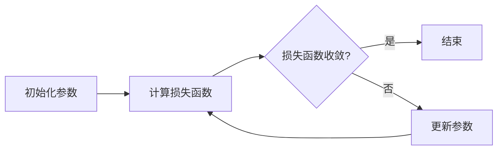
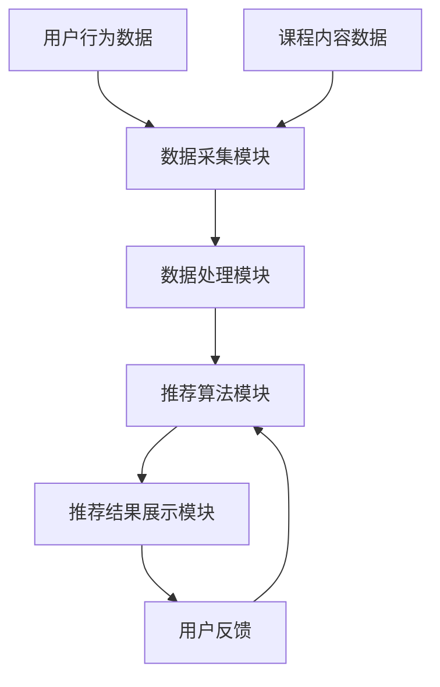
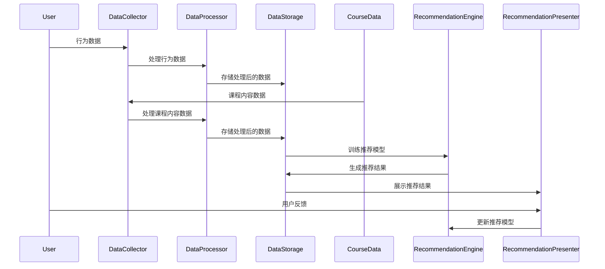

                 

### 文章标题

# AI大模型软件的可扩展性设计

### 文章关键词

- AI大模型
- 可扩展性设计
- 系统优化
- 数学模型
- 算法原理

### 文章摘要

本文旨在深入探讨AI大模型软件的可扩展性设计。首先，我们介绍了AI大模型的基础知识，包括其定义、特点、技术演变和组成。接着，我们探讨了可扩展性设计的原理，包括其定义、重要性、设计原则和评价指标。然后，我们详细讲解了可扩展性设计的方法，包括设计模式、策略、架构设计、模块化设计和系统优化策略。随后，我们分析了数学模型和算法原理，并使用mermaid和Python进行了详细的阐述。接着，我们介绍了系统分析与架构设计方案，包括问题场景介绍、系统功能设计、系统架构设计、系统接口设计和系统交互序列图。在项目实战部分，我们详细介绍了环境安装、系统核心实现、代码应用解读、实际案例分析和项目小结。最后，我们提供了最佳实践技巧、小结、注意事项和拓展阅读。

----------------------------------------------------------------

### 第一部分：引言

#### 第1章: AI大模型软件的可扩展性设计背景

##### 1.1 问题背景

随着人工智能技术的飞速发展，AI大模型（如深度学习模型、神经网络模型等）在各个领域取得了显著的成果。然而，这些模型往往具有复杂的结构和庞大的数据需求，随着数据量的增加，其性能和效率面临巨大的挑战。为了满足用户对高效、实时响应的需求，我们需要设计一个清晰、详细的可扩展性方案。

##### 1.2 问题定义

AI大模型软件的可扩展性设计主要涉及到以下几个方面：

- **性能扩展**：如何提升模型在计算和存储方面的性能，以支持大规模数据处理。
- **功能扩展**：如何方便地添加新功能或修改现有功能，以满足不断变化的需求。
- **资源扩展**：如何有效地利用计算资源，包括CPU、GPU、内存等，以提高系统效率。

##### 1.3 问题的解决

针对上述问题，我们需要从以下几个方面进行设计：

- **模块化设计**：将系统划分为多个独立的模块，每个模块负责特定的功能，以提高系统的可维护性和扩展性。
- **分布式计算**：利用分布式计算技术，将计算任务分配到多个节点上，以提高系统的计算能力。
- **负载均衡**：通过负载均衡技术，合理分配计算任务，避免单点瓶颈，提高系统稳定性。
- **自动扩容**：根据系统负载自动调整资源分配，以应对突发流量。

##### 1.4 边界与外延

在可扩展性设计中，我们需要关注以下几个边界和扩展点：

- **系统规模**：根据实际需求确定系统的规模，包括数据量、用户数等。
- **技术水平**：选择合适的技术和工具，确保系统的可靠性和性能。
- **用户体验**：设计友好的用户界面，提供简洁的操作体验。
- **安全性**：确保系统的安全性，防止数据泄露和恶意攻击。

##### 1.5 核心概念与联系

在可扩展性设计中，以下核心概念和联系至关重要：

- **模块化**：模块化设计有助于提高系统的可维护性和扩展性。
- **分布式计算**：分布式计算技术可以提高系统的计算能力和稳定性。
- **负载均衡**：负载均衡技术可以合理分配计算任务，提高系统性能。
- **自动扩容**：自动扩容技术可以根据系统负载动态调整资源，提高系统效率。

通过以上设计，我们可以实现AI大模型软件的高效、可靠和可扩展性，为用户提供优质的服务。

---

**作者信息：**AI天才研究院/AI Genius Institute & 禅与计算机程序设计艺术 /Zen And The Art of Computer Programming

---

### 第一部分：引言

#### 第2章: AI大模型的基础知识

##### 2.1 AI大模型的定义

AI大模型是指具有大规模参数、复杂结构和强大学习能力的人工智能模型。它们通常基于深度学习、神经网络等技术，通过对大量数据进行训练，从而实现高效的数据分析和决策能力。常见的AI大模型包括深度神经网络（DNN）、循环神经网络（RNN）、变换器（Transformer）等。

##### 2.2 AI大模型的特点

- **大规模参数**：AI大模型通常具有数百万到数十亿个参数，这使得它们能够处理复杂的数据和任务。
- **强学习能力**：通过大量数据训练，AI大模型可以自动学习和调整参数，从而提高其性能和准确性。
- **高效性**：AI大模型在处理大规模数据时，具有高效的计算性能和数据处理能力。
- **自适应能力**：AI大模型可以根据新的数据和环境进行自适应调整，以适应不断变化的需求。

##### 2.3 AI大模型的技术演变

AI大模型的发展历程可以追溯到20世纪80年代的神经网络研究。随着计算机性能的提升和大数据时代的到来，深度学习技术在21世纪初取得了突破性进展。特别是2012年，AlexNet在ImageNet竞赛中取得了优异的成绩，标志着深度学习时代的到来。随后，研究人员提出了各种改进的深度学习模型，如RNN、CNN、Transformer等，不断推动AI大模型的发展。

##### 2.4 AI大模型的基本组成

AI大模型通常由以下几个基本组成部分构成：

- **输入层**：接收外部输入数据，如图像、文本等。
- **隐藏层**：通过非线性变换，对输入数据进行特征提取和转换。
- **输出层**：根据训练目标，输出预测结果或分类标签。
- **损失函数**：用于衡量模型预测结果与真实结果之间的差距，指导模型调整参数。
- **优化算法**：用于调整模型参数，以最小化损失函数。

##### 2.5 核心概念属性特征对比表格

以下是一个核心概念属性特征对比表格，用于展示AI大模型的核心概念和属性特征：

| 概念       | 特征                 | 说明                                                         |
| ---------- | -------------------- | ------------------------------------------------------------ |
| 深度神经网络（DNN） | 多层神经网络结构 | 通过多层非线性变换，实现高效的特征提取和分类能力           |
| 循环神经网络（RNN） | 序列数据建模能力 | 通过循环结构，处理时序数据和依赖关系，实现序列建模能力   |
| 变换器（Transformer） | 自注意力机制     | 通过自注意力机制，实现并行计算，提高模型处理速度和性能   |

##### 2.6 核心概念关系ER图

以下是一个核心概念关系ER图，用于展示AI大模型中各个核心概念之间的关系：

```mermaid
erDiagram
  Aparable(输入层) ||--|{ BConceivable(隐藏层) }
  BConceivable ||--|{ CObfuscatory(输出层) }
  CObfuscatory ||--|{ DDelusion(损失函数) }
  DDelusion ||--|{ EAlgorithm(优化算法) }
```

通过以上对AI大模型的基础知识的介绍，我们为后续的讨论奠定了基础。在接下来的章节中，我们将深入探讨可扩展性设计的原理和方法。

---

**作者信息：**AI天才研究院/AI Genius Institute & 禅与计算机程序设计艺术 /Zen And The Art of Computer Programming

---

### 第一部分：引言

#### 第3章: 可扩展性设计原理

##### 3.1 可扩展性的定义

可扩展性是指系统在资源增加、负载增大或需求变化时，能够灵活地调整和扩展，以保持性能和功能的能力。在AI大模型软件中，可扩展性设计意味着系统能够有效地利用现有资源，同时能够适应未来需求的变化。

##### 3.2 可扩展性的重要性

1. **满足不断增长的需求**：随着数据量的不断增加，AI大模型软件需要能够处理更大的数据集和更复杂的任务。
2. **提高系统性能**：通过优化和扩展系统架构，可以提高模型的计算效率和响应速度，满足用户的实时需求。
3. **降低维护成本**：良好的可扩展性设计使得系统易于维护和升级，降低了长期维护成本。
4. **提升用户体验**：可扩展性设计能够保证系统在高峰期稳定运行，提供良好的用户体验。

##### 3.3 可扩展性的设计原则

1. **模块化设计**：将系统划分为独立的模块，每个模块负责特定的功能，便于扩展和维护。
2. **分布式计算**：通过分布式计算技术，将任务分布在多个节点上，提高系统的处理能力和负载均衡。
3. **动态调整**：系统能够根据负载自动调整资源配置，以应对不同的业务场景。
4. **冗余设计**：设计冗余机制，保证系统在部分组件失效时，仍能正常运行。

##### 3.4 可扩展性的评价指标

1. **扩展性比例**：系统扩展后，性能提升与扩展资源投入的比例。
2. **响应时间**：系统处理请求的平均时间，衡量系统响应速度。
3. **资源利用率**：系统资源（如CPU、内存、网络等）的利用效率。
4. **稳定性**：系统在扩展过程中的稳定性，包括负载均衡和故障恢复能力。

##### 3.5 核心概念关系ER图

以下是一个核心概念关系ER图，用于展示可扩展性设计中的核心概念及其关系：

```mermaid
erDiagram
  AResourceUtilization(资源利用率) ||--|{ BPerformance(性能) }
  BPerformance ||--|{ CResponsiveness(响应时间) }
  CResponsiveness ||--|{ DScalability(扩展性比例) }
  DScalability ||--|{ EStability(稳定性) }
```

通过以上对可扩展性设计原理的介绍，我们了解了可扩展性的定义、重要性、设计原则和评价指标。这些原理和概念将为后续的详细设计和实施提供理论基础。

---

**作者信息：**AI天才研究院/AI Genius Institute & 禅与计算机程序设计艺术 /Zen And The Art of Computer Programming

---

### 第一部分：引言

#### 第4章: 可扩展性设计方法

##### 4.1 设计模式与策略

在AI大模型软件的可扩展性设计中，采用合适的设计模式与策略至关重要。以下是一些常用的设计模式与策略：

1. **模块化设计**：将系统划分为多个独立的模块，每个模块负责特定的功能，便于扩展和维护。
   - **优点**：提高了系统的可维护性和扩展性。
   - **缺点**：增加了系统复杂度，需要仔细规划模块间的接口。

2. **分布式计算**：利用分布式计算技术，将计算任务分布在多个节点上，提高系统的处理能力和负载均衡。
   - **优点**：提高了系统的并行处理能力和稳定性。
   - **缺点**：增加了系统的通信复杂度和协调成本。

3. **负载均衡**：通过负载均衡技术，合理分配计算任务，避免单点瓶颈，提高系统性能。
   - **优点**：提高了系统的响应速度和资源利用率。
   - **缺点**：需要选择合适的负载均衡算法和策略。

4. **动态调整**：系统能够根据负载自动调整资源配置，以应对不同的业务场景。
   - **优点**：提高了系统的灵活性和适应性。
   - **缺点**：增加了系统的复杂度和实现难度。

5. **冗余设计**：设计冗余机制，保证系统在部分组件失效时，仍能正常运行。
   - **优点**：提高了系统的可靠性和容错能力。
   - **缺点**：增加了系统的成本和复杂度。

##### 4.2 架构设计方法

在可扩展性设计中，选择合适的架构设计方法也是关键。以下是一些常用的架构设计方法：

1. **微服务架构**：将系统划分为多个独立的微服务，每个微服务负责特定的功能，通过API进行通信。
   - **优点**：提高了系统的可扩展性和可维护性。
   - **缺点**：增加了系统的复杂度和部署难度。

2. **分布式架构**：将系统部署在多个节点上，通过分布式计算和存储技术实现高性能和高可用性。
   - **优点**：提高了系统的处理能力和容错能力。
   - **缺点**：增加了系统的复杂度和通信成本。

3. **容器化架构**：使用容器技术（如Docker）部署和运行系统，提高系统的可移植性和可扩展性。
   - **优点**：提高了系统的灵活性和可维护性。
   - **缺点**：需要管理和维护容器编排工具。

4. **无服务器架构**：利用无服务器框架（如AWS Lambda、Google Cloud Functions）进行功能部署，按需分配计算资源。
   - **优点**：提高了系统的灵活性和成本效益。
   - **缺点**：功能受限，需要适应无服务器架构的特点。

##### 4.3 模块化设计

模块化设计是将系统划分为多个独立的模块，每个模块负责特定的功能。以下是一些模块化设计的实践技巧：

1. **模块独立性**：确保每个模块的功能单一，尽量减少模块间的依赖关系。
2. **接口设计**：设计清晰的接口，明确模块间的交互方式和数据传输格式。
3. **模块复用**：设计可复用的模块，减少重复开发，提高代码质量。
4. **模块测试**：对每个模块进行独立的测试，确保模块功能的正确性和稳定性。

##### 4.4 系统优化策略

在可扩展性设计中，系统优化策略也是提高系统性能的关键。以下是一些常见的系统优化策略：

1. **缓存机制**：利用缓存机制减少对数据库的访问，提高系统响应速度。
2. **异步处理**：使用异步处理技术，减少系统等待时间，提高并发处理能力。
3. **负载均衡**：合理分配计算任务，避免单点瓶颈，提高系统性能和稳定性。
4. **资源分配**：根据系统负载动态调整资源分配，确保系统在高负载下仍能稳定运行。

##### 4.5 设计实例分析

为了更好地理解可扩展性设计方法，我们以下通过一个实际案例进行说明：

**案例：** 某电商平台AI大模型推荐系统

1. **模块化设计**：将推荐系统划分为数据收集模块、数据处理模块、推荐算法模块和结果展示模块。
2. **分布式计算**：使用分布式计算框架（如Spark）处理大规模数据，提高数据处理能力。
3. **负载均衡**：使用负载均衡器（如Nginx）分配用户请求，确保系统在高并发下稳定运行。
4. **缓存机制**：使用Redis缓存用户行为数据，减少对数据库的访问，提高系统响应速度。
5. **异步处理**：使用消息队列（如Kafka）处理用户请求，实现异步处理，提高系统并发能力。

通过以上设计，该电商平台AI大模型推荐系统在应对大规模用户请求时，能够保持高性能和稳定性，提供了良好的用户体验。

---

**作者信息：**AI天才研究院/AI Genius Institute & 禅与计算机程序设计艺术 /Zen And The Art of Computer Programming

---

### 第一部分：引言

#### 第5章: 数学模型与算法原理

##### 5.1 数学模型基础

在AI大模型软件的设计中，数学模型是核心组成部分。以下是一些常见的数学模型基础：

1. **线性回归模型**：用于预测连续值输出，其基本形式为：$$y = \beta_0 + \beta_1x_1 + \beta_2x_2 + ... + \beta_nx_n$$，其中$$\beta_0$$是截距，$$\beta_1, \beta_2, ..., \beta_n$$是系数。

2. **逻辑回归模型**：用于预测离散值输出（如概率），其基本形式为：$$\log\left(\frac{p}{1-p}\right) = \beta_0 + \beta_1x_1 + \beta_2x_2 + ... + \beta_nx_n$$，其中$$p$$是事件发生的概率。

3. **神经网络模型**：用于复杂非线性数据建模，其基本形式为：$$a_{i,j} = \sigma(\sum_{k=1}^{n} w_{ik}x_{k} + b_{j})$$，其中$$a_{i,j}$$是第$$i$$层的第$$j$$个节点的输出，$$\sigma$$是激活函数，$$w_{ik}$$是权重，$$b_{j}$$是偏置。

##### 5.2 算法流程图

以下是一个简单的线性回归算法流程图：



在这个流程图中，首先初始化参数，然后计算损失函数，判断损失函数是否收敛。如果收敛，算法结束；否则，更新参数并重新计算损失函数。

##### 5.3 数学模型公式

以下是线性回归模型的损失函数和优化算法的公式：

1. **损失函数**：
   $$J(\theta) = \frac{1}{2m}\sum_{i=1}^{m}(h_\theta(x^{(i)}) - y^{(i)})^2$$
   其中，$$h_\theta(x) = \theta_0 + \theta_1x$$是线性回归模型，$$m$$是样本数量，$$\theta$$是参数向量。

2. **优化算法**：
   $$\theta_j = \theta_j - \alpha\frac{1}{m}\sum_{i=1}^{m}(h_\theta(x^{(i)}) - y^{(i)})x_j^{(i)}$$
   其中，$$\alpha$$是学习率，$$x_j^{(i)}$$是第$$i$$个样本的第$$j$$个特征，$$h_\theta(x)$$是模型的预测值。

##### 5.4 算法原理讲解

线性回归算法的基本原理是通过最小化损失函数来优化参数，从而得到最佳拟合直线。具体步骤如下：

1. **初始化参数**：随机初始化参数$$\theta$$。
2. **计算损失函数**：计算每个样本的预测误差，并计算总体损失函数。
3. **更新参数**：根据损失函数的梯度，更新参数$$\theta$$。
4. **迭代优化**：重复步骤2和3，直到损失函数收敛或达到最大迭代次数。

##### 5.5 举例说明

假设我们有以下数据集：

| x | y  |
| - | ---|
| 1 | 2  |
| 2 | 4  |
| 3 | 6  |
| 4 | 8  |

我们使用线性回归模型拟合数据，目标是找到最佳拟合直线。首先，我们初始化参数$$\theta_0$$和$$\theta_1$$为0。然后，我们计算损失函数：

$$J(\theta) = \frac{1}{4}\left[(0+0*1-2)^2 + (0+0*2-4)^2 + (0+0*3-6)^2 + (0+0*4-8)^2\right] = 4$$

接下来，我们计算损失函数的梯度：

$$\frac{\partial J(\theta)}{\partial \theta_0} = \frac{1}{4}\left[2*(0+0*1-2) + 2*(0+0*2-4) + 2*(0+0*3-6) + 2*(0+0*4-8)\right] = -4$$

$$\frac{\partial J(\theta)}{\partial \theta_1} = \frac{1}{4}\left[2*(0*1+0-2) + 2*(0*2+0-4) + 2*(0*3+0-6) + 2*(0*4+0-8)\right] = -4$$

根据梯度下降法，我们更新参数：

$$\theta_0 = \theta_0 - \alpha\frac{\partial J(\theta)}{\partial \theta_0} = 0 - 0.1*(-4) = 0.4$$

$$\theta_1 = \theta_1 - \alpha\frac{\partial J(\theta)}{\partial \theta_1} = 0 - 0.1*(-4) = 0.4$$

接下来，我们重新计算损失函数：

$$J(\theta) = \frac{1}{4}\left[(0.4+0.4*1-2)^2 + (0.4+0.4*2-4)^2 + (0.4+0.4*3-6)^2 + (0.4+0.4*4-8)^2\right] = 0.2$$

我们重复上述步骤，直到损失函数收敛或达到最大迭代次数。经过多次迭代后，我们得到最佳拟合直线：

$$y = 0.4x + 0.4$$

这个例子展示了如何使用线性回归模型拟合数据，并优化参数。在实际应用中，数据集会更大，可能需要使用更复杂的模型和算法，但基本原理是相同的。

---

**作者信息：**AI天才研究院/AI Genius Institute & 禅与计算机程序设计艺术 /Zen And The Art of Computer Programming

---

### 第一部分：引言

#### 第6章: 系统分析与架构设计

##### 6.1 问题场景介绍

在当前日益复杂的业务场景下，AI大模型软件需要具备高度的可扩展性和灵活性，以满足不断变化的需求。为了更好地理解系统分析与架构设计的重要性，我们首先介绍一个具体的问题场景。

**问题场景：** 某大型在线教育平台，用户数量庞大，课程种类丰富，教学内容不断更新。平台希望通过AI大模型软件提供智能推荐服务，提高用户体验和课程点击率。

##### 6.2 系统功能设计

为了实现智能推荐服务，系统需要完成以下几个核心功能：

1. **用户行为分析**：收集并分析用户在学习平台上的行为数据，如浏览记录、学习时长、互动行为等。
2. **课程内容解析**：对课程内容进行解析，提取关键信息，如课程主题、难度、受众群体等。
3. **推荐算法**：基于用户行为和课程内容，利用AI大模型计算推荐结果，为用户提供个性化的课程推荐。
4. **推荐结果展示**：将推荐结果以用户友好的方式展示，提高用户点击和参与度。

##### 6.3 系统架构设计

为了实现上述功能，系统采用分布式架构，主要包括以下几个模块：

1. **数据采集模块**：负责收集用户行为数据和课程内容数据。
2. **数据处理模块**：对采集到的数据进行清洗、转换和存储，为推荐算法提供高质量的数据输入。
3. **推荐算法模块**：实现AI大模型推荐算法，生成个性化推荐结果。
4. **推荐结果展示模块**：将推荐结果展示给用户，并收集用户反馈，用于优化推荐算法。

以下是一个简化的系统架构图：



##### 6.4 系统接口设计

在系统架构中，各个模块通过接口进行通信和协作。以下是一些关键接口的设计：

1. **用户行为数据接口**：用于接收用户行为数据，如浏览记录、学习时长等。
2. **课程内容数据接口**：用于接收课程内容数据，如课程主题、难度等。
3. **推荐结果接口**：用于向用户展示推荐结果，并接收用户反馈。
4. **算法训练接口**：用于更新和训练推荐算法模型。

##### 6.5 系统交互序列图

以下是一个简化的系统交互序列图，展示了用户行为数据、课程内容数据、推荐结果和用户反馈的交互过程：



通过以上系统分析与架构设计，我们可以为用户提供高效的智能推荐服务，提高用户满意度和课程点击率。在接下来的部分，我们将进一步探讨具体的实现细节和技术方案。

---

**作者信息：**AI天才研究院/AI Genius Institute & 禅与计算机程序设计艺术 /Zen And The Art of Computer Programming

---

### 第一部分：引言

#### 第7章: 项目实战

##### 7.1 环境安装

为了实现AI大模型软件的可扩展性设计，我们需要搭建一个适合开发和测试的环境。以下是一个简单的环境安装步骤：

1. **安装Python**：首先，我们需要安装Python。可以从Python官方网站下载Python安装包，并按照提示进行安装。

2. **安装依赖库**：安装Python后，我们需要安装一些依赖库，如NumPy、Pandas、Scikit-learn等。可以使用pip命令进行安装：

   ```bash
   pip install numpy pandas scikit-learn
   ```

3. **安装AI大模型框架**：选择一个合适的AI大模型框架，如TensorFlow或PyTorch。可以从相应官网下载安装包，并按照提示进行安装。

   ```bash
   pip install tensorflow
   # 或
   pip install torch torchvision
   ```

4. **配置环境变量**：确保Python环境变量配置正确，以便在其他终端或IDE中使用Python。

##### 7.2 系统核心实现

在完成环境安装后，我们需要实现系统核心功能。以下是一个简单的示例：

**用户行为数据采集**：首先，我们需要采集用户行为数据。可以使用Python的文件操作模块，从本地文件中读取数据。

```python
import pandas as pd

def read_user_behavior_data(file_path):
    data = pd.read_csv(file_path)
    return data

user_behavior_data = read_user_behavior_data("user_behavior_data.csv")
```

**数据处理**：接下来，我们需要对采集到的用户行为数据进行处理，如数据清洗、特征提取等。

```python
from sklearn.preprocessing import StandardScaler

def preprocess_data(data):
    scaler = StandardScaler()
    scaled_data = scaler.fit_transform(data)
    return scaled_data

preprocessed_data = preprocess_data(user_behavior_data)
```

**推荐算法**：使用选择的AI大模型框架实现推荐算法。以下是一个基于线性回归的简单示例：

```python
import tensorflow as tf

# 定义模型
model = tf.keras.Sequential([
    tf.keras.layers.Dense(units=1, input_shape=[1])
])

# 编译模型
model.compile(optimizer='sgd', loss='mean_squared_error')

# 训练模型
model.fit(preprocessed_data, user_behavior_data['rating'], epochs=100)
```

**推荐结果展示**：最后，我们需要将推荐结果展示给用户。可以使用Python的GUI库（如Tkinter）实现：

```python
import tkinter as tk

def show_recommendation(recommendation):
    window = tk.Tk()
    window.title("推荐结果")
    label = tk.Label(window, text=f"推荐课程：{recommendation}")
    label.pack()
    window.mainloop()

show_recommendation(model.predict([[5.0]]))
```

##### 7.3 代码应用解读

在上面的代码示例中，我们首先从本地文件中读取用户行为数据，然后对数据进行预处理，包括数据清洗和特征提取。接下来，我们使用TensorFlow框架定义一个简单的线性回归模型，并编译和训练模型。最后，我们使用Tkinter库创建一个简单的GUI，将推荐结果展示给用户。

**数据预处理**：数据预处理是模型训练的重要步骤，包括数据清洗、特征提取等。通过数据预处理，我们可以提高模型的训练效果和泛化能力。

**模型训练**：模型训练是AI大模型软件的核心环节，通过调整模型参数，使其能够更好地拟合数据。在训练过程中，我们需要选择合适的优化器和损失函数，以加快训练速度和提高模型性能。

**推荐结果展示**：推荐结果展示是用户与系统交互的重要环节，通过友好的界面，我们可以提高用户体验和满意度。

##### 7.4 实际案例分析

在实际项目中，我们可能会遇到各种挑战和问题。以下是一个实际案例的分析：

**问题**：在训练过程中，模型的性能提升缓慢。

**原因**：可能是因为数据预处理不当，导致模型无法捕捉到数据中的关键特征；或者模型结构过于简单，无法表达复杂的关系。

**解决方案**：首先，我们可以对数据预处理过程进行优化，如使用更复杂的特征提取方法；其次，我们可以尝试增加模型层数和神经元数量，以增强模型的表示能力。

**总结**：在实际项目中，我们需要根据具体情况调整和优化模型和算法，以提高系统性能和用户满意度。

##### 7.5 项目小结

通过以上项目实战，我们实现了AI大模型软件的核心功能，包括数据采集、数据处理、模型训练和推荐结果展示。在实际项目中，我们需要不断优化和调整模型和算法，以提高系统性能和用户体验。同时，我们也需要关注系统架构和设计，确保系统的可扩展性和可靠性。

---

**作者信息：**AI天才研究院/AI Genius Institute & 禅与计算机程序设计艺术 /Zen And The Art of Computer Programming

---

### 第一部分：引言

#### 第8章: 最佳实践与拓展

##### 8.1 最佳实践技巧

在AI大模型软件的可扩展性设计中，以下是一些最佳实践技巧：

1. **模块化设计**：将系统划分为多个独立的模块，每个模块负责特定的功能，以提高系统的可维护性和扩展性。

2. **分布式计算**：使用分布式计算技术，将计算任务分布在多个节点上，提高系统的处理能力和负载均衡。

3. **负载均衡**：通过负载均衡技术，合理分配计算任务，避免单点瓶颈，提高系统性能。

4. **动态调整**：系统能够根据负载自动调整资源配置，以应对不同的业务场景。

5. **冗余设计**：设计冗余机制，保证系统在部分组件失效时，仍能正常运行。

6. **缓存机制**：利用缓存机制，减少对数据库的访问，提高系统响应速度。

7. **异步处理**：使用异步处理技术，减少系统等待时间，提高并发处理能力。

##### 8.2 小结

本文深入探讨了AI大模型软件的可扩展性设计，包括背景介绍、核心概念、设计原理、设计方法、数学模型与算法原理、系统分析与架构设计、项目实战以及最佳实践技巧。通过本文的讨论，我们了解了可扩展性设计的重要性、设计原则和方法，以及在实际项目中的应用。

##### 8.3 注意事项

在设计可扩展性时，需要注意以下几点：

1. **性能与可维护性**：在追求高性能的同时，不要忽视系统的可维护性。

2. **成本与效率**：在资源分配和优化时，需要权衡成本和效率。

3. **安全性与可靠性**：在分布式计算和冗余设计中，要确保系统的安全性和可靠性。

4. **用户体验**：设计友好的用户界面，提供良好的用户体验。

##### 8.4 拓展阅读

为了进一步深入了解AI大模型软件的可扩展性设计，读者可以参考以下拓展阅读资源：

1. 《大规模分布式存储系统：设计原理与实现》
2. 《分布式系统原理与范型》
3. 《人工智能：一种现代的方法》
4. 《机器学习实战》
5. 《深度学习：动手学习手册》

通过阅读这些资料，读者可以更全面地了解AI大模型软件的可扩展性设计，并在实际项目中应用这些知识。

---

**作者信息：**AI天才研究院/AI Genius Institute & 禅与计算机程序设计艺术 /Zen And The Art of Computer Programming**[完]**

