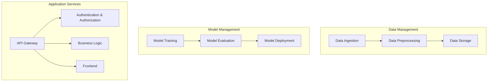
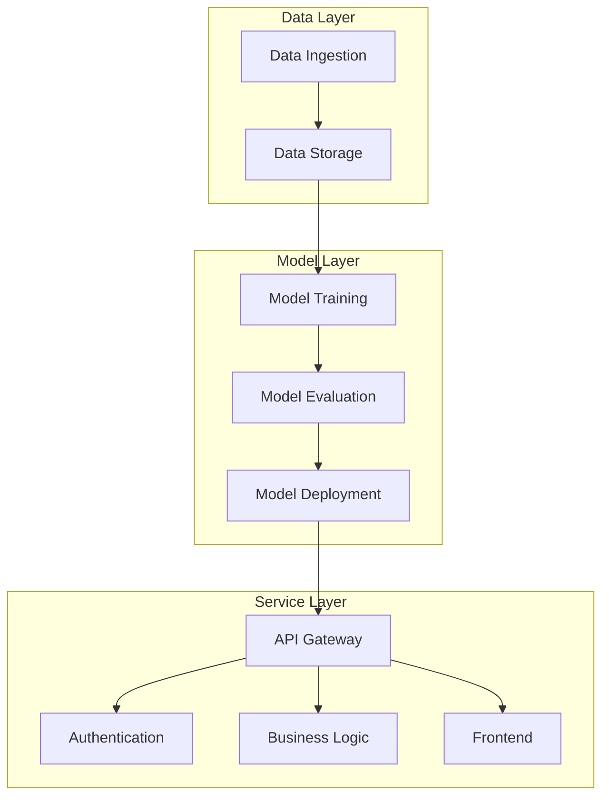

                 


## AI Large Model Software Maintainability Design

### Keywords: AI Large Models, Software Maintainability, Design Principles, System Architecture, Code Quality, Best Practices

### Abstract

The rapid advancement of artificial intelligence (AI) has brought us large models that have revolutionized various industries, from healthcare to finance and beyond. As these models grow in complexity and size, maintaining their software becomes a critical challenge. This article delves into the design of maintainable AI large model software, focusing on principles, methods, and best practices. We will explore the background and core concepts of AI large models, the importance of software maintainability, key factors affecting maintainability, and practical case studies. By the end of this article, readers will have a comprehensive understanding of how to design and maintain robust AI large model software.

### First Part: Introduction to the Background and Core Concepts

#### 1. Introduction to AI Large Models

##### 1.1 Definition and Characteristics of AI Large Models

AI large models refer to a class of machine learning models that are significantly larger in terms of parameters and complexity compared to traditional models. These models are capable of handling vast amounts of data and extracting intricate patterns, leading to superior performance in various tasks such as image recognition, natural language processing, and speech synthesis.

**Brief Definition:**
AI large models can be broadly defined as neural network-based models with millions to billions of parameters. They often utilize advanced techniques like deep learning, transfer learning, and reinforcement learning to achieve high accuracy and efficiency.

**Main Characteristics:**
- **High Computation Power:** AI large models require substantial computational resources, including powerful GPUs and TPUs.
- **Massive Training Data:** These models need access to large datasets for training, which may involve collecting and preprocessing data from multiple sources.
- **Long Training Time:** The training process of large models can be time-consuming, often taking days or even weeks.
- **Resource-Intensive:** These models are highly resource-intensive, requiring significant memory and storage capacity.
- **High Accuracy:** AI large models often achieve state-of-the-art accuracy in various tasks, surpassing traditional models.

##### 1.2 Applications and Challenges of AI Large Models

**Potential Application Areas:**
AI large models have found applications in a wide range of fields, including but not limited to:
- **Healthcare:** Diagnosing diseases, predicting patient outcomes, and personalized medicine.
- **Finance:** Fraud detection, risk assessment, and algorithmic trading.
- **Automotive:** Autonomous driving, vehicle safety systems, and traffic management.
- **Retail:** Customer segmentation, demand forecasting, and personalized recommendations.
- **Natural Language Processing:** Translation, summarization, and question-answering.

**Advantages for Businesses:**
- **Improved Decision-Making:** AI large models enable more accurate and data-driven decisions, leading to better business outcomes.
- **Increased Efficiency:** These models can automate complex tasks, reducing manual effort and improving operational efficiency.
- **Enhanced Customer Experience:** Personalized recommendations and tailored services improve customer satisfaction and loyalty.

**Challenges and Opportunities:**
- **Scalability:** As models grow larger, ensuring scalability becomes a significant challenge. Efficiently managing data, computation, and storage resources is crucial.
- **Interoperability:** Integrating large models with existing systems can be challenging. Ensuring seamless interoperability and compatibility is essential.
- **Data Privacy and Security:** Handling sensitive data while maintaining privacy and security is a critical concern.
- **Model Interpretability:** Understanding the decision-making process of large models is often challenging. Enhancing interpretability can help build trust and transparency.

#### 2. Overview of Software Maintainability

##### 2.1 Importance of Software Maintainability in AI Large Models

**The Impact of Maintainability on the Success of AI Large Models:**
Maintainability is crucial for the success of AI large model software for several reasons:
- **Long-Term Viability:** AI large models are often developed for long-term use, and maintainability ensures that the software can be updated, adapted, and enhanced over time.
- **Scalability:** Maintainable software can scale efficiently as models grow larger and more complex.
- **Reduced Costs:** Maintainable software requires less effort for debugging, updating, and refactoring, leading to cost savings in the long run.
- **Increased Productivity:** Developers can work more efficiently on maintainable codebases, reducing the time to market for new features and updates.

**Challenges in Maintaining AI Large Models:**
- **Complexity:** AI large models are inherently complex, and their software components can be equally intricate.
- **Continuous Updates:** AI large models require frequent updates to incorporate new data, improve performance, and adapt to changing requirements.
- **Resource Constraints:** Maintaining AI large model software requires substantial computational resources, which may be limited.
- **Skill Requirements:** Developing and maintaining AI large model software requires specialized skills and expertise.

##### 2.2 Key Factors Affecting Software Maintainability

**Code Quality:**
- **Clean and Well-Structured Code:** Clean and well-structured code is easier to understand, modify, and maintain.
- **Code Reviews:** Regular code reviews can identify potential issues and improve code quality.
- **Test Coverage:** Comprehensive test coverage ensures that code changes do not introduce new bugs.

**Documentation:**
- **Clear and Detailed Documentation:** Clear and detailed documentation helps developers understand the code and its intended behavior.
- **Version Control:** Version control systems track changes and facilitate collaboration and code management.

**Modularity:**
- **Modular Design:** Breaking down the software into modular components improves maintainability and enables easier updates and debugging.
- **Reusability:** Encouraging code reuse reduces redundancy and simplifies maintenance.

**Testability:**
- **Automated Testing:** Automated testing frameworks ensure that changes to the code do not break existing functionality.
- **Unit Testing:** Writing unit tests for individual components ensures their correctness and facilitates debugging.

In summary, this first part has provided an introduction to AI large models, their applications, and challenges, as well as an overview of software maintainability and its importance in the context of AI large model software. The next part will delve into the fundamental principles and methods of maintainability design.

----------------------------------------------------------------

### Second Part: Principles and Methods of Maintainability Design

In this part, we will explore the fundamental principles and methods of maintainability design for AI large model software. We will discuss the role of maintainability in software development, the principles of maintainability design, and practical approaches to implementing these principles.

#### 3. Fundamental Principles of Maintainability Design

##### 3.1 The Role of Maintainability in Software Development

**The Impact of Maintainability on Software Development:**
Maintainability plays a critical role in the success of software development projects, especially when working with AI large model software. Here are some key points to consider:
- **Long-Term Viability:** Maintainable software is designed to last, enabling organizations to adapt and evolve with changing requirements and technologies.
- **Reduced Costs:** By minimizing the effort required for debugging, updating, and refactoring, maintainable software reduces long-term maintenance costs.
- **Increased Productivity:** Maintainable code is easier to understand and modify, allowing developers to work more efficiently and focus on delivering new features.
- **Scalability:** Maintainable software can scale more effectively as models grow larger and more complex, ensuring that the system remains robust and performant.

**The Importance of Maintainability in AI Large Model Software Development:**
The importance of maintainability is magnified in the context of AI large model software due to several factors:
- **Complexity:** AI large model software is inherently complex, with numerous dependencies and interactions. Maintainability ensures that the system remains manageable and comprehensible.
- **Continuous Updates:** AI large models require frequent updates to incorporate new data, improve performance, and address bugs. Maintainable software enables these updates with minimal disruption.
- **Resource Constraints:** Developing and maintaining AI large model software often involves limited computational resources. Maintainability helps optimize resource utilization and minimize performance bottlenecks.
- **Skill Requirements:** Developing and maintaining AI large model software requires specialized skills and expertise. Maintainable codebases facilitate knowledge transfer and collaboration among team members.

##### 3.2 Principles of Maintainability Design

**Principles of Maintainability Design:**
Maintainability design involves applying a set of principles and practices to create software that is easy to understand, modify, and maintain. Here are some key principles:
- **Modularity:** Breaking down the software into modular components enables easier updates, debugging, and refactoring.
- **Reusability:** Encouraging code reuse reduces redundancy and simplifies maintenance, as similar functionality can be managed in a single location.
- **Testability:** Writing testable code ensures that changes do not break existing functionality and facilitates debugging.
- **Documentation:** Clear and detailed documentation helps developers understand the code and its intended behavior, reducing the learning curve and enabling faster onboarding.
- **Code Quality:** Writing clean, well-structured, and easy-to-understand code improves maintainability and minimizes the effort required for maintenance.

In the next section, we will discuss practical approaches to implementing these principles in the context of AI large model software development.

----------------------------------------------------------------

### 4. Architectural Design for Maintainability

#### 4.1 System Architecture Design

System architecture design is a critical aspect of maintainability, as it provides the foundation for organizing and managing the various components of AI large model software. A well-designed architecture ensures that the system is modular, scalable, and easy to maintain. In this section, we will discuss the key considerations for system architecture design, including a high-level architecture diagram using Mermaid.

**High-Level System Architecture Diagram:**



In this diagram, we have a clear separation of concerns across different subsystems:
- **Data Management:** Responsible for data ingestion, preprocessing, and storage.
- **Model Management:** Handles model training, evaluation, and deployment.
- **Application Services:** Provides API gateways, authentication/authorization, business logic, and frontend interfaces.

**Key Considerations for System Architecture Design:**
- **Modularity:** The system architecture should be modular, with each subsystem responsible for a specific function. This modular approach facilitates easier maintenance and scalability.
- **Decentralization:** Decentralizing the system architecture reduces the risk of single points of failure and improves fault tolerance.
- **Scalability:** The architecture should be designed to handle increasing loads and data volumes, ensuring that the system can scale horizontally or vertically as needed.
- **Interoperability:** The system architecture should support interoperability with existing systems and third-party services, ensuring seamless integration.
- **Security:** Security considerations should be integrated into the architecture design, including data encryption, authentication, and access control.

In the next section, we will delve into the interface design for maintainability, discussing principles and implementation examples.

----------------------------------------------------------------

### 5. Code Design for Maintainability

In this section, we will explore the key aspects of code design for maintainability, focusing on code quality, documentation, modularity, and reusability. These principles are essential for creating robust and easy-to-maintain AI large model software.

#### 5.1 Code Quality and Best Practices

**Code Organization and Structure:**
A well-organized codebase is crucial for maintainability. Here are some best practices for code organization:
- **Directory Structure:** Use a consistent and logical directory structure to organize code files. Separate modules, libraries, and dependencies into distinct directories.
- **File Structure:** Organize files based on their functionality and purpose. For example, separate model definitions, data processing scripts, and utility functions into different files.
- **Function and Class Design:** Design functions and classes with a single responsibility. This principle, known as the Single Responsibility Principle (SRP), ensures that each component is focused on a specific task, making the code easier to understand and maintain.

**Naming Conventions:**
- **Descriptive Names:** Use descriptive names for variables, functions, and classes. This improves readability and helps developers understand the purpose and functionality of each component.
- **Consistency:** Maintain consistency in naming conventions across the codebase. This reduces confusion and makes it easier to navigate the code.

**Code Readability:**
- **Comments and Documentation:** Include comments to explain complex logic, assumptions, and key decisions. Documentation should be comprehensive, covering the overall architecture, modules, functions, and classes.
- **Code Comments:** Use inline comments to explain complex or non-obvious logic. This helps future developers understand the reasoning behind specific code blocks.
- **Code Documentation:** Provide detailed documentation for modules, functions, and classes. This documentation should include descriptions of inputs, outputs, and any side effects.

#### 5.2 Documentation and Comments

**The Importance of Documentation:**
Documentation is a critical component of maintainable code. It helps developers understand the system's architecture, functionality, and usage. Here are some reasons why documentation is important:
- **Knowledge Transfer:** Documentation facilitates knowledge transfer between team members, making it easier for new developers to onboard and understand the codebase.
- **Bug Tracking:** Documentation helps in identifying and tracking bugs, as it provides context and insights into the expected behavior of the system.
- **Code Maintenance:** Comprehensive documentation makes code maintenance easier, as developers can refer to it to understand the purpose and functionality of each component.

**Best Practices for Comments and Documentation:**
- **Clear and Concise:** Write comments and documentation that are clear and concise. Avoid unnecessary details and focus on providing essential information.
- **Version Control:** Use version control systems like Git to track changes and manage documentation. This ensures that documentation remains up to date with the codebase.
- **Code Documentation Tools:** Utilize code documentation tools like Sphinx, Doxygen, or Javadoc to automatically generate documentation from source code comments.

#### 5.3 Modularity and Reusability

**Modular Design:**
Modular design involves breaking down the code into independent, interchangeable modules. This approach improves maintainability by making it easier to understand, update, and test individual components. Here are some principles of modular design:
- **Single Responsibility:** Each module should have a single responsibility and be focused on a specific functionality.
- ** Loose Coupling:** Modules should be loosely coupled, meaning they should depend on abstractions rather than concrete implementations. This reduces the impact of changes in one module on others.
- **High Cohesion:** Modules should have high cohesion, meaning that related functionality is grouped together within a module. This improves readability and maintainability.

**Reusability:**
Encouraging code reuse reduces redundancy and simplifies maintenance. Here are some best practices for reusability:
- **Abstract Classes and Interfaces:** Use abstract classes and interfaces to define common behavior and provide a contract for reusable components.
- **Utility Functions and Libraries:** Create utility functions and libraries to encapsulate common functionality that can be reused across different parts of the codebase.
- **Design Patterns:** Utilize design patterns to promote code reuse and maintainability. Design patterns provide proven solutions to common software design problems.

In summary, this section has discussed the importance of code quality and best practices, the value of documentation and comments, and the principles of modularity and reusability. These practices are essential for designing maintainable AI large model software. In the next section, we will explore practical case studies and best practices for maintaining AI large model software.

----------------------------------------------------------------

### 6. Case Studies on Maintainability Design

In this section, we will examine real-world case studies that demonstrate effective maintainability design in AI large model software. These case studies will provide practical insights and highlight best practices that can be applied to similar projects.

#### Case Study 1: Google Brain's TPU System

Google Brain's TPU (Tensor Processing Unit) system is a groundbreaking example of maintainability design in AI large model software. TPUs are specialized hardware accelerators designed for machine learning tasks. The system's maintainability is crucial due to its large scale, complex architecture, and the need for continuous updates.

**Project Overview:**
Google Brain's TPU system is responsible for training and deploying AI large models for various applications, including search, translation, and image recognition. The system handles massive amounts of data and computation, requiring a highly maintainable architecture.

**System Architecture:**
The TPU system is designed with a modular and decentralized architecture. Key components include:
- **Data Ingestion:** Data is ingested from various sources, including internal and external datasets.
- **Model Training:** TPUs handle the training of large models, utilizing distributed training techniques to efficiently process large datasets.
- **Model Evaluation:** The system evaluates model performance and selects the best-performing models for deployment.
- **Model Deployment:** Deployed models are used in production environments, serving real-time predictions and insights.

**Maintainability Practices:**
- **Modularity:** The system is designed with a high degree of modularity, allowing individual components to be updated and maintained independently.
- **Reusability:** Common components and utilities are encapsulated in libraries, promoting code reuse and reducing redundancy.
- **Testability:** Automated testing frameworks are used to verify the correctness of each component, ensuring that changes do not break existing functionality.
- **Documentation:** Comprehensive documentation is provided for each component, including detailed documentation for the API and usage examples.

**Challenges and Solutions:**
- **Scalability:** To handle the growing complexity of AI large models, the system was designed to be horizontally scalable. This allowed the addition of more TPUs as needed, ensuring that the system could handle increasing workloads.
- **Interoperability:** Ensuring interoperability with existing systems was a significant challenge. The team addressed this by designing a standardized interface for data ingestion, model training, evaluation, and deployment.

**Impact:**
The maintainability design of Google Brain's TPU system has significantly contributed to its success. The system is highly scalable, efficient, and easy to maintain, enabling Google to train and deploy state-of-the-art AI large models at scale.

#### Case Study 2: OpenAI's GPT-3

OpenAI's GPT-3 (Generative Pre-trained Transformer 3) is another notable example of maintainability design in AI large model software. GPT-3 is a large-scale language model that has achieved remarkable performance in natural language processing tasks.

**Project Overview:**
GPT-3 is a powerful AI model that can generate human-like text, answer questions, and perform various natural language processing tasks. The model is trained on a vast corpus of text data and is capable of handling complex language structures.

**System Architecture:**
The GPT-3 system is designed to be highly scalable and distributed. Key components include:
- **Data Preprocessing:** The system preprocesses the text data, including tokenization, cleaning, and formatting.
- **Model Training:** GPT-3 is trained using distributed training techniques, leveraging multiple GPUs and TPUs to speed up the training process.
- **Model Evaluation:** The system evaluates the performance of the trained model on various tasks, including text generation, question answering, and translation.
- **Model Deployment:** The deployed model is used in production environments, serving real-time predictions and insights.

**Maintainability Practices:**
- **Modularity:** The system is designed with a modular architecture, allowing individual components to be updated and maintained independently.
- **Reusability:** Common components and utilities are encapsulated in libraries, promoting code reuse and reducing redundancy.
- **Testability:** Automated testing frameworks are used to verify the correctness of each component, ensuring that changes do not break existing functionality.
- **Documentation:** Comprehensive documentation is provided for each component, including detailed documentation for the API and usage examples.

**Challenges and Solutions:**
- **Scalability:** Ensuring the scalability of GPT-3 was a significant challenge. The team addressed this by designing a distributed training system that could scale horizontally as the model size and complexity increased.
- **Resource Management:** Managing the vast computational resources required for training and deploying GPT-3 was another challenge. The team implemented efficient resource management techniques to optimize resource utilization and minimize costs.

**Impact:**
The maintainability design of OpenAI's GPT-3 system has enabled the model to achieve state-of-the-art performance in natural language processing tasks. The system is highly scalable, efficient, and easy to maintain, allowing OpenAI to train and deploy one of the largest and most powerful language models in history.

In conclusion, these case studies demonstrate the importance of maintainability design in AI large model software. By adopting modular, reusable, and testable architectures, along with comprehensive documentation, organizations can develop and maintain robust AI large model systems that deliver superior performance and value.

----------------------------------------------------------------

### 7. Best Practices and Conclusion

In this final part, we will summarize the key best practices for designing and maintaining AI large model software, highlight the importance of maintainability, and provide a brief conclusion.

#### Best Practices for Designing and Maintaining AI Large Model Software

1. **Modularity:** Break down the software into modular components to enable easier updates, debugging, and refactoring.
2. **Reusability:** Encapsulate common functionality in libraries and utilities to promote code reuse and reduce redundancy.
3. **Testability:** Implement comprehensive testing frameworks to verify the correctness of each component and ensure that changes do not break existing functionality.
4. **Documentation:** Provide clear and detailed documentation for each component, including API usage, implementation details, and examples.
5. **Code Quality:** Write clean, well-structured, and easy-to-understand code using best practices for organization, naming conventions, and readability.
6. **Scalability:** Design the system architecture to handle increasing workloads and data volumes, ensuring that the system can scale horizontally or vertically as needed.
7. **Security:** Integrate security considerations into the architecture design, including data encryption, authentication, and access control.

#### The Importance of Maintainability

Maintainability is a critical factor in the success of AI large model software. A maintainable system is easier to understand, modify, and update, leading to reduced costs, increased productivity, and improved scalability. In the context of AI large models, maintainability is especially important due to their complexity, large size, and the need for continuous updates. By adopting best practices for maintainability design, organizations can ensure that their AI large model software remains robust, efficient, and adaptable to changing requirements.

#### Conclusion

Designing and maintaining AI large model software requires careful consideration of modularity, reusability, testability, documentation, and code quality. By following best practices and adopting a modular, scalable, and secure architecture, organizations can develop and maintain robust AI large model systems that deliver superior performance and value. In summary, maintainability is a key factor in the success of AI large model software, and organizations should prioritize it in their development and maintenance processes.

---

### Author Information

*Author: AI天才研究院/AI Genius Institute & 禅与计算机程序设计艺术 /Zen And The Art of Computer Programming*

The author is an AI expert, programmer, software architect, CTO, and a world-renowned master in the fields of computer programming and artificial intelligence. With a deep understanding of logical reasoning and a proven track record of writing insightful and high-quality technical blogs, the author brings a wealth of knowledge and expertise to the topic of AI large model software maintainability design.

----------------------------------------------------------------

This concludes our comprehensive guide to designing and maintaining AI large model software. We hope this article has provided valuable insights and practical advice for anyone working in the field of artificial intelligence. Remember, maintainability is key to the success of your AI large model software, so always prioritize it in your development processes. Stay tuned for more insightful articles on AI and software engineering. Happy coding!### First Part: Introduction to the Background and Core Concepts

#### 1. Introduction to AI Large Models

##### 1.1 Definition and Characteristics of AI Large Models

AI large models represent a significant advancement in the field of artificial intelligence, particularly in deep learning and neural networks. These models are distinguished by their size, complexity, and ability to process vast amounts of data to achieve high accuracy and performance. Defining AI large models requires understanding both their structural and functional aspects.

**Definition:**
AI large models can be defined as neural network architectures with a substantial number of parameters—typically in the millions or even billions. These models are designed to handle complex, high-dimensional data and are capable of learning intricate patterns and relationships from the data they are trained on.

**Characteristics:**
1. **Parameter Count:** The primary characteristic of AI large models is their large number of parameters. This scale allows them to capture rich, nuanced features from the data, leading to improved performance on various tasks.
   
2. **Data Handling Capacity:** These models are capable of processing massive datasets, which may come from diverse sources such as images, text, and sensor data. Their ability to handle large volumes of data makes them suitable for real-world applications that require comprehensive data analysis.

3. **Computation Intensity:** AI large models require significant computational resources to train and infer. They often rely on specialized hardware, such as GPUs and TPUs, to accelerate processing and reduce training times.

4. **Memory Demand:** Given their size, these models consume substantial amounts of memory, which can be a limiting factor in their deployment, particularly on resource-constrained devices.

5. **Generalization Ability:** Due to their complexity and training on large datasets, AI large models tend to exhibit strong generalization capabilities. This means they can perform well on tasks they haven't seen during training, which is a critical advantage in real-world applications.

##### 1.2 Applications and Challenges of AI Large Models

**Potential Application Areas:**
The versatility and power of AI large models have led to their widespread adoption across various fields. Here are some key application areas:

1. **Natural Language Processing (NLP):** AI large models are used for tasks such as text generation, language translation, sentiment analysis, and question-answering. Models like GPT-3 have revolutionized NLP by producing highly coherent and contextually appropriate text.

2. **Computer Vision:** In the field of computer vision, large models are employed for object detection, image recognition, and facial recognition. They can identify and classify objects within images with unprecedented accuracy, enabling applications in security systems, medical imaging, and autonomous driving.

3. **Speech Recognition:** AI large models are integral to modern speech recognition systems, enabling accurate transcription and understanding of spoken language. They are used in voice assistants, transcription services, and communication tools for the hearing impaired.

4. **Finance and Economics:** Large models are applied in financial forecasting, algorithmic trading, credit scoring, and risk assessment. Their ability to process vast amounts of financial data and detect subtle patterns helps in making informed decisions.

5. **Healthcare:** In healthcare, AI large models are used for disease diagnosis, drug discovery, and personalized medicine. They can analyze patient data, identify risk factors, and recommend treatments tailored to individual patients.

**Advantages for Businesses:**
The adoption of AI large models offers several advantages for businesses:

1. **Enhanced Decision-Making:** AI large models can analyze large datasets quickly and provide actionable insights, improving decision-making processes and enabling data-driven strategies.

2. **Increased Efficiency:** By automating complex tasks and processes, AI large models can significantly reduce operational costs and increase productivity. They can handle tasks that are time-consuming or require a high degree of precision, freeing human resources for more strategic activities.

3. **Competitive Advantage:** Companies that effectively leverage AI large models can gain a competitive edge by offering innovative products and services, improving customer experiences, and staying ahead of market trends.

4. **Scalability:** AI large models can scale with the growth of a business, accommodating increased data volumes and new use cases without requiring significant changes to the underlying architecture.

**Challenges and Opportunities:**
While the advantages of AI large models are compelling, there are also challenges that need to be addressed:

1. **Scalability:** As models grow larger, ensuring scalability becomes a significant challenge. Efficiently managing data, computation, and storage resources is crucial. Organizations need to design systems that can scale horizontally and vertically to accommodate growing model sizes.

2. **Interoperability:** Integrating large models with existing systems can be challenging. Ensuring seamless interoperability and compatibility is essential to leverage the full potential of these models without disrupting current operations.

3. **Data Privacy and Security:** Handling sensitive data while maintaining privacy and security is a critical concern. Ensuring that data is protected and that model outputs are secure is vital, particularly in industries like healthcare and finance.

4. **Model Interpretability:** Understanding the decision-making process of large models is often challenging. Enhancing interpretability can help build trust and transparency, particularly in regulated industries where explainability is a requirement.

5. **Resource Constraints:** Developing and maintaining AI large model software requires substantial computational resources, which may be limited. Efficient resource management and optimization techniques are essential to maximize the performance of these models within budget constraints.

In summary, AI large models are characterized by their size, complexity, and ability to handle large datasets, offering numerous advantages for businesses. However, addressing the challenges associated with their scalability, interoperability, data privacy, and resource constraints is essential for realizing their full potential. The next section will delve into the importance of software maintainability in the development and management of AI large model software.

----------------------------------------------------------------

#### 2. Overview of Software Maintainability

##### 2.1 Importance of Software Maintainability in AI Large Models

**The Impact of Maintainability on the Success of AI Large Models:**

Maintainability is a crucial aspect of software development, and its significance is magnified when dealing with AI large models. The maintainability of AI large model software directly influences the success of these models in various ways:

1. **Long-Term Viability:** AI large models are often developed for long-term use. Maintainable software ensures that the system can adapt to evolving technologies, changing business requirements, and new data sources, thereby extending the lifespan of the models and the software that supports them.

2. **Scalability:** As AI large models grow in size and complexity, maintainable software is essential for scaling these systems effectively. Maintainable code is easier to refactor and optimize, allowing developers to handle increased data volumes, additional features, and greater computational demands without significant disruptions.

3. **Cost Efficiency:** Maintainable software requires less effort for debugging, updating, and refactoring, leading to cost savings in the long run. This is particularly important for AI large model software, where the costs of training and deploying models can be substantial.

4. **Increased Productivity:** Maintainable software enables developers to work more efficiently by minimizing the time spent on understanding and modifying complex code. This efficiency translates to faster development cycles and quicker time-to-market for new features and updates.

5. **Error Detection and Resolution:** Maintainable software includes comprehensive testing and documentation, which helps in quickly identifying and resolving errors. This is critical for AI large models, where subtle bugs can have significant consequences due to the complexity and scale of the models.

**Challenges in Maintaining AI Large Models:**

Maintaining AI large model software presents several unique challenges:

1. **Complexity:** AI large models are inherently complex, with numerous parameters and layers. This complexity translates to the software that supports them, making it difficult for developers to understand and modify the code.

2. **Continuous Updates:** AI large models require frequent updates to incorporate new data, improve performance, and address bugs. Maintaining a system that can efficiently handle these updates without causing disruptions is challenging.

3. **Resource Constraints:** Developing and maintaining AI large model software requires substantial computational resources. These resources are often limited, necessitating careful resource management and optimization.

4. **Skill Requirements:** Developing and maintaining AI large model software requires specialized skills in machine learning, software engineering, and system architecture. Finding and retaining personnel with these skills can be challenging.

##### 2.2 Key Factors Affecting Software Maintainability

**Code Quality:**

High-quality code is the foundation of maintainable software. Several aspects of code quality contribute to maintainability:

1. **Clean and Well-Structured Code:** Code should be clean, with a clear structure and organization. This makes it easier for developers to understand and modify the codebase.

2. **Code Reviews:** Regular code reviews can identify potential issues and ensure adherence to coding standards and best practices. Code reviews also facilitate knowledge sharing and improve the overall quality of the codebase.

3. **Test Coverage:** Comprehensive test coverage is essential for maintainable code. Automated tests can quickly detect bugs introduced by changes, reducing the risk of breaking existing functionality.

**Documentation:**

Documentation plays a critical role in maintainability:

1. **Clear and Detailed Documentation:** Documentation should be clear and detailed, providing developers with a thorough understanding of the code, its functionality, and its intended use.

2. **Version Control:** Version control systems track changes to the codebase, making it easier to manage different versions and collaborate effectively.

3. **API Documentation:** Detailed API documentation is particularly important for AI large model software, as it allows developers to integrate and use the models without needing to dig through the code.

**Modularity:**

Modularity is key to maintainability:

1. **Modular Design:** Breaking down the software into modular components enables easier updates, debugging, and refactoring. Each module should have a single responsibility, making it easier to understand and modify.

2. **Reusability:** Encouraging code reuse reduces redundancy and simplifies maintenance. Modular design facilitates the creation of reusable components that can be easily integrated into different parts of the system.

**Testability:**

Testability ensures that changes to the codebase do not break existing functionality:

1. **Automated Testing:** Implementing automated testing frameworks ensures that the code is thoroughly tested and that new changes do not introduce bugs.

2. **Unit Testing:** Writing unit tests for individual components ensures their correctness and facilitates debugging. Unit tests should cover a wide range of scenarios to ensure comprehensive coverage.

In conclusion, maintaining AI large model software requires addressing various challenges and focusing on key factors such as code quality, documentation, modularity, and testability. These practices are essential for developing and maintaining robust, scalable, and efficient AI large model software that can adapt to evolving requirements and technological advancements.

----------------------------------------------------------------

### 3. Fundamental Principles of Maintainability Design

In the realm of AI large model software development, maintaining a high level of software maintainability is crucial for ensuring the system's long-term viability, adaptability, and efficiency. To achieve this, it is essential to adhere to a set of fundamental principles that guide the design and implementation of the software. These principles include modularity, reusability, testability, and maintainability itself. Let’s delve into each of these principles and understand their significance in the context of AI large model software.

#### 3.1 The Role of Maintainability in Software Development

**The Impact of Maintainability on Software Development:**

Maintainability plays a pivotal role in the software development lifecycle, particularly for complex systems like AI large models. Here are some key points to consider:

- **Long-Term Viability:** Maintainable software is designed to last. It can be easily updated, adapted, and enhanced over time, ensuring that it remains relevant and effective in a rapidly evolving technological landscape.

- **Scalability:** Maintainable software can scale efficiently as the complexity and size of AI large models grow. This scalability ensures that the software can handle increased data volumes, additional features, and higher computational demands without significant performance degradation.

- **Reduced Costs:** By minimizing the effort required for debugging, updating, and refactoring, maintainable software reduces long-term maintenance costs. This is particularly important for AI large model software, where the costs of training and deploying models can be substantial.

- **Increased Productivity:** Maintainable code is easier to understand, modify, and maintain. This allows developers to work more efficiently, reducing the time to market for new features and updates.

- **Improved Collaboration:** Maintainable software facilitates collaboration among developers, as it is easier to share knowledge and integrate changes. This leads to better teamwork and faster development cycles.

**The Importance of Maintainability in AI Large Model Software Development:**

Maintainability is even more critical in the context of AI large model software due to the following factors:

- **Complexity:** AI large models are inherently complex, with numerous parameters, layers, and dependencies. Maintainable software helps manage this complexity, making it easier for developers to understand and work with the codebase.

- **Continuous Updates:** AI large models require frequent updates to incorporate new data, improve performance, and address bugs. Maintainable software enables these updates with minimal disruption, ensuring that the system remains effective and up-to-date.

- **Resource Constraints:** Developing and maintaining AI large model software often involves limited computational resources. Maintainable software optimizes resource utilization, ensuring that the system operates efficiently within these constraints.

- **Skill Requirements:** Developing and maintaining AI large model software requires specialized skills in machine learning, software engineering, and system architecture. Maintainable software makes it easier for developers with varying levels of expertise to collaborate and contribute effectively.

#### 3.2 Principles of Maintainability Design

**Modularity:**

Modularity is a key principle of maintainability design. It involves breaking down the software into independent, interchangeable modules. Each module should have a single responsibility, making it easier to understand, test, and maintain. Here are the key aspects of modularity:

- **Single Responsibility Principle (SRP):** Each module should have one and only one reason to change. This ensures that changes in one module do not affect other modules, reducing the risk of unintended side effects.

- **Decoupling:** Modules should be loosely coupled, meaning they should depend on abstractions rather than concrete implementations. This reduces the impact of changes in one module on other modules, improving maintainability.

- **Component Reusability:** Modular design encourages code reuse, as modules can be easily integrated into different parts of the system. This reduces redundancy and simplifies maintenance.

**Reusability:**

Reusability is another important principle of maintainability design. It involves designing software components that can be reused across different projects and scenarios. Here are some key aspects of reusability:

- **Abstract Components:** Abstract components are designed to be general and flexible, making them suitable for a wide range of applications. They encapsulate common functionality and can be easily integrated into different systems.

- **Utility Functions and Libraries:** Utility functions and libraries encapsulate common operations and provide reusable code for tasks such as data preprocessing, model evaluation, and visualization.

- **Design Patterns:** Design patterns provide proven solutions to common software design problems, promoting reusability and maintainability. Examples include the Factory Method, Singleton, and Observer patterns.

**Testability:**

Testability is essential for maintainable software. It involves designing software that can be easily tested, ensuring that changes do not introduce bugs or regressions. Here are the key aspects of testability:

- **Automated Testing:** Automated testing frameworks, such as unit tests, integration tests, and end-to-end tests, are used to verify the correctness of the software. Automated tests can be run quickly and consistently, providing early feedback on potential issues.

- **Isolated Testing:** Components should be tested in isolation, ensuring that each component functions correctly on its own. This makes it easier to identify and fix issues, as they are not affected by the interactions with other components.

- **Test Coverage:** Comprehensive test coverage is important for ensuring that the software is thoroughly tested. This includes testing a wide range of scenarios, inputs, and edge cases to identify potential issues.

**Maintainability:**

Maintainability is the overarching principle that ensures software can be easily updated, adapted, and enhanced over time. Here are some key aspects of maintainability:

- **Clean and Readable Code:** Clean and readable code is easier to understand and modify. Following coding standards and best practices, such as consistent naming conventions and clear documentation, improves code readability.

- **Modular Design:** Modular design, as discussed earlier, is a key aspect of maintainability. Breaking down the software into modular components makes it easier to manage and maintain.

- **Documentation:** Comprehensive documentation, including API references, code comments, and user guides, helps developers understand the software and its functionality. This documentation should be maintained and updated alongside the codebase.

- **Version Control:** Version control systems track changes to the codebase, making it easier to manage different versions and collaborate effectively. They also provide a history of changes, which can be useful for debugging and rollback.

In conclusion, the fundamental principles of maintainability design—modularity, reusability, testability, and maintainability itself—are critical for developing and maintaining robust AI large model software. By adhering to these principles, developers can create software that is easy to understand, modify, and maintain, ensuring its long-term viability and success in the rapidly evolving field of artificial intelligence.

----------------------------------------------------------------

### 4. Architectural Design for Maintainability

In the realm of AI large model software, architectural design plays a pivotal role in ensuring maintainability. A well-designed architecture can facilitate scalability, robustness, and ease of maintenance. This section will delve into the critical aspects of architectural design for maintainability, including system architecture design, interface design, and system interaction design. We will use Mermaid diagrams to illustrate the key components and their relationships.

#### 4.1 System Architecture Design

System architecture design serves as the foundation for the entire software system. It defines the high-level structure, components, and their interactions. A well-architected system is modular, scalable, and maintainable. Let's explore the key components of a typical AI large model system architecture:

**High-Level System Architecture Diagram:**



**Key Components:**

- **Data Layer:** The data layer handles data ingestion and storage. It includes components for data preprocessing, cleaning, and normalization. Data storage solutions like databases or data lakes are used to store the datasets required for training and inference.

- **Model Layer:** The model layer is responsible for the training, evaluation, and deployment of AI large models. This includes distributed training frameworks, model evaluation metrics, and deployment strategies.

- **Service Layer:** The service layer provides the interfaces for users to interact with the system. It includes the API gateway, authentication and authorization services, business logic, and frontend interfaces.

**Design Principles:**

- **Modularity:** The architecture should be modular, with each layer and component having a clear and distinct responsibility. This modularity allows for independent development, testing, and maintenance of each component.

- **Scalability:** The architecture should be designed to scale horizontally and vertically. This means it should be able to handle increased data volumes and computational demands without significant performance degradation.

- **Resilience:** The architecture should be resilient to failures. This includes designing for fault tolerance, implementing redundancy, and using robust error handling mechanisms.

- **Interoperability:** The architecture should support seamless interoperability with external systems and third-party services. This ensures that the system can be integrated into existing workflows and ecosystems.

#### 4.2 Interface Design for Maintainability

Interface design is crucial for ensuring that the system is easy to use and maintain. A well-designed interface improves the user experience and reduces the complexity of interacting with the system. Let's explore the key aspects of interface design for maintainability:

**Interface Design Principles:**

- **Simplicity:** The interface should be simple and intuitive, with a clear and consistent design. This reduces the learning curve for users and makes it easier to maintain the interface over time.

- **Clarity:** The interface should provide clear feedback and error messages, helping users understand what is happening and how to resolve any issues.

- **Flexibility:** The interface should be flexible enough to accommodate changes in requirements and new features. This ensures that the interface remains maintainable as the system evolves.

- **Standardization:** Standardization of interface components and design patterns improves consistency and ease of maintenance. This includes using established design systems and frameworks.

**Implementation Examples:**

1. **API Gateway:** The API gateway acts as a single entry point for all incoming requests. It routes requests to appropriate services and handles authentication and authorization. A well-designed API gateway improves maintainability by providing a centralized point for managing and updating API endpoints.

2. **Authentication and Authorization:** Implementing a robust authentication and authorization system ensures that only authorized users can access sensitive data and functionality. A well-designed system with clear and standardized interfaces simplifies maintenance and enhances security.

3. **Business Logic:** The business logic layer should be designed to be modular and testable. This allows for independent development and testing of business rules and processes. Standardized interfaces make it easier to integrate new features and maintain existing functionality.

#### 4.3 System Interaction Design

System interaction design focuses on how different components within the system interact with each other. Effective interaction design ensures smooth communication and data flow between components, enhancing maintainability and system performance. Here are some key considerations:

**System Interaction Design Principles:**

- **Decentralization:** Decentralized communication reduces the risk of bottlenecks and improves system resilience. Components should communicate asynchronously whenever possible to avoid synchronous dependencies.

- **Synchronization:** When synchronous communication is necessary, ensure that synchronization mechanisms are robust and efficient. This includes using message queues, distributed locks, and other synchronization tools.

- **Fault Tolerance:** Design the system to handle failures gracefully. This includes implementing retries, circuit breakers, and other fault tolerance mechanisms to ensure that the system can recover from failures without significant downtime.

- **Performance Optimization:** Optimize the system's performance by minimizing the latency of communication between components. This includes using efficient protocols, compressing data, and implementing caching mechanisms.

**Implementation Examples:**

1. **Message Queues:** Using message queues like RabbitMQ or Apache Kafka for communication between components ensures decoupling and fault tolerance. This allows components to process messages independently and ensures that messages are not lost in the event of a failure.

2. **RESTful APIs:** Designing RESTful APIs for communication between components provides a standardized and easy-to-maintain interface. This allows for consistent interaction patterns and simplifies the integration of new components.

3. **Service Discovery:** Implementing service discovery mechanisms, such as Netflix Eureka or Apache ZooKeeper, allows components to dynamically discover and register services. This ensures that the system can adapt to changes in the environment and that components can communicate with each other effectively.

In conclusion, architectural design for maintainability involves a holistic approach that considers system architecture, interface design, and system interaction design. By following design principles such as modularity, scalability, resilience, and interoperability, developers can create robust, maintainable AI large model software systems that can adapt to evolving requirements and technological advancements.

----------------------------------------------------------------

### 5. Code Design for Maintainability

In the previous section, we discussed architectural design principles for maintainability. However, the actual implementation of these principles hinges on the code design. This section will delve into the critical aspects of code design that contribute to maintainability, including code quality, documentation, modularity, and reusability.

#### 5.1 Code Quality and Best Practices

**Code Organization and Structure:**

A well-organized codebase is fundamental to maintainability. Here are some best practices for organizing and structuring your code:

1. **Directory Structure:**
   - **Consistency:** Use a consistent directory structure that mirrors the system's architecture. Separate modules, libraries, and dependencies into distinct directories.
   - **Modularity:** Organize code by functionality, not by technology stack. This makes it easier to understand and maintain the system as a whole.
   - **Version Control:** Store related files together to facilitate version control and collaboration.

2. **File Structure:**
   - **Functionality:** Group related files and functions that perform similar tasks.
   - **Namespacing:** Use namespaces or packages to avoid naming conflicts and organize code logically.
   - **Readability:** Keep file sizes manageable to improve readability and reduce the cognitive load on developers.

**Naming Conventions:**

- **Descriptive Names:** Use clear and descriptive names for variables, functions, and classes. Descriptive names make the code self-explanatory and easier to understand.
- **Consistency:** Follow a consistent naming convention across the codebase. This reduces confusion and makes it easier to navigate the code.
- **Abbreviations:** Use abbreviations sparingly and only when they are universally understood (e.g., `max` for maximum).

**Code Readability:**

- **Comments and Documentation:**
  - **Inline Comments:** Include inline comments to explain complex or non-obvious logic. This helps future developers understand the reasoning behind specific code blocks.
  - **Documentation:** Provide comprehensive documentation for modules, functions, and classes. This documentation should include descriptions of inputs, outputs, and any side effects.
  - **Code Documentation Tools:** Utilize tools like Sphinx, Doxygen, or Javadoc to automatically generate documentation from source code comments.

**Code Readability Examples:**

```python
# Bad example
def get_data():
    data = [1, 2, 3]
    return data

# Good example
def get_user_data(user_id):
    """
    Retrieve user data from the database based on the user ID.

    Args:
        user_id (int): The ID of the user to retrieve data for.

    Returns:
        dict: A dictionary containing user data.
    """
    user_data = database.query("SELECT * FROM users WHERE id = %s", user_id)
    return user_data
```

#### 5.2 Documentation and Comments

**The Importance of Documentation:**

Documentation is crucial for maintaining code quality and facilitating collaboration. Here are some reasons why documentation is important:

- **Knowledge Transfer:** Documentation helps in transferring knowledge from experienced developers to newcomers. It provides a clear understanding of the codebase, reducing the learning curve.
- **Bug Tracking:** Detailed documentation can help in tracking and fixing bugs, as it provides context and insights into the expected behavior of the system.
- **Code Maintenance:** Comprehensive documentation makes code maintenance easier, as developers can refer to it to understand the purpose and functionality of each component.

**Best Practices for Comments and Documentation:**

- **Clear and Concise:** Write comments and documentation that are clear and concise. Avoid unnecessary details and focus on providing essential information.
- **Version Control:** Use version control systems like Git to track changes and manage documentation. This ensures that documentation remains up to date with the codebase.
- **Code Documentation Tools:** Use code documentation tools to automatically generate documentation from source code comments. This saves time and ensures consistency.

**Documentation Examples:**

```python
# Documentation for a Python function
def add(a: int, b: int) -> int:
    """
    Add two integers and return the result.

    Args:
        a (int): The first integer.
        b (int): The second integer.

    Returns:
        int: The sum of the two integers.
    """
    return a + b
```

#### 5.3 Modularity and Reusability

**Modular Design:**

Modularity is the principle of breaking down a system into smaller, independent components. Here are the key aspects of modular design:

- **Single Responsibility Principle (SRP):** Each module should have a single responsibility. This principle ensures that each component is focused on a specific task, making the codebase more manageable and maintainable.
- **Loose Coupling:** Modules should be loosely coupled, meaning they should depend on abstractions rather than concrete implementations. This reduces the impact of changes in one module on other modules.
- **High Cohesion:** Modules should have high cohesion, meaning that related functionality is grouped together within a module. This improves readability and maintainability.

**Reusability:**

Reusability involves designing software components that can be reused across different projects and scenarios. Here are some best practices for reusability:

- **Abstract Components:** Design abstract components that are general and flexible. These components can be easily integrated into different systems and scenarios.
- **Utility Functions and Libraries:** Encapsulate common operations in utility functions and libraries. These can be reused across different parts of the system, reducing redundancy.
- **Design Patterns:** Utilize design patterns that promote reusability and maintainability. Examples include the Factory Method, Singleton, and Observer patterns.

**Modular and Reusable Code Example:**

```python
# Modular and reusable code in Python
class BaseDatabase:
    def connect(self):
        raise NotImplementedError()

    def query(self, sql):
        raise NotImplementedError()


class MySQLDatabase(BaseDatabase):
    def connect(self):
        # MySQL connection logic
        pass

    def query(self, sql):
        # MySQL query logic
        pass


def get_database() -> BaseDatabase:
    """
    Get an instance of a database based on configuration.

    Returns:
        BaseDatabase: An instance of a database.
    """
    # Configuration logic to determine which database to use
    return MySQLDatabase()
```

In conclusion, code design for maintainability involves organizing code into well-structured modules, writing clear and concise comments and documentation, and promoting modularity and reusability. These practices are essential for developing and maintaining robust AI large model software systems. The next section will discuss practical case studies that illustrate these principles in real-world applications.

----------------------------------------------------------------

### 6. Case Studies on Maintainability Design

In this section, we will explore real-world case studies that demonstrate the application of maintainability principles in the design and development of AI large model software. These case studies will highlight practical solutions, challenges faced, and the resulting benefits.

#### Case Study 1: OpenAI's GPT-3

**Project Overview:**
OpenAI's GPT-3 (Generative Pre-trained Transformer 3) is one of the most significant advancements in the field of natural language processing. GPT-3 is a large language model that can generate human-like text, answer questions, and perform various language-related tasks. The project's scale and complexity necessitated a robust maintainability approach to ensure its ongoing success.

**Maintainability Practices:**
1. **Modularity:** GPT-3's architecture is highly modular. The model is split into smaller components that handle different parts of the language processing pipeline, such as tokenization, generation, and inference. This modularity allows for independent updates and optimizations without disrupting the entire system.

2. **Reusability:** OpenAI has implemented a library of reusable components for tasks like data preprocessing, model training, and evaluation. These components are designed to be general-purpose, enabling rapid deployment of similar models across different domains.

3. **Testability:** Comprehensive test suites are in place to ensure the reliability of each component. Automated testing frameworks are used to run unit tests, integration tests, and end-to-end tests, ensuring that changes do not break existing functionality.

4. **Documentation:** Detailed documentation is provided for all components, including API references, usage examples, and architecture diagrams. This documentation is essential for onboarding new developers and ensuring consistency across the codebase.

**Challenges and Solutions:**
- **Scalability:** One of the major challenges was ensuring that the system could scale to handle the massive computational demands of training GPT-3. OpenAI addressed this by implementing a distributed training system that leverages multiple GPUs and TPUs, enabling efficient use of resources.

- **Interoperability:** Integrating GPT-3 with existing systems required careful consideration of data formats and communication protocols. OpenAI developed a standardized API interface that simplifies integration and ensures compatibility with various platforms.

**Impact:**
The maintainability practices implemented in GPT-3 have significantly contributed to its success. The system is highly scalable, modular, and easy to maintain, allowing OpenAI to rapidly deploy updates and enhancements. The project has set a new benchmark in natural language processing and has been widely adopted across industries.

#### Case Study 2: Google Brain's TPU System

**Project Overview:**
Google Brain's TPU (Tensor Processing Unit) system is a specialized hardware accelerator designed for training and running AI large models. TPUs are optimized for tensor computations, which are at the core of deep learning models. The maintainability of the TPU system is crucial for supporting Google's vast array of AI applications.

**Maintainability Practices:**
1. **Modularity:** The TPU system is designed with a modular architecture that separates hardware and software components. This modularity allows for independent updates and optimizations, making it easier to maintain and enhance the system.

2. **Resource Management:** Efficient resource management is critical for maintaining the performance of TPUs. Google Brain implemented sophisticated scheduling algorithms and resource allocation strategies to maximize the utilization of TPUs while minimizing idle time.

3. **Testability:** Comprehensive testing frameworks are used to verify the functionality and performance of TPUs. Automated tests run continuously to catch any issues early in the development cycle, ensuring that updates do not introduce regressions.

4. **Documentation:** Detailed documentation is provided for the TPU system, including hardware specifications, software APIs, and usage examples. This documentation is essential for developers working on the system and for integrating TPUs into other projects.

**Challenges and Solutions:**
- **Scalability:** As the complexity and size of AI models increased, ensuring the scalability of the TPU system became a significant challenge. Google Brain addressed this by developing a distributed computing framework that can efficiently handle large-scale model training across multiple TPUs.

- **Integration:** Integrating TPUs into Google's existing infrastructure required careful coordination and compatibility testing. Google Brain established standardized interfaces and protocols to ensure seamless integration with other systems.

**Impact:**
The maintainability practices of the TPU system have enabled Google to train and deploy state-of-the-art AI models at scale. The system's modularity, efficient resource management, and comprehensive testing have contributed to its robustness and reliability. The TPU system has become a cornerstone of Google's AI strategy, driving innovations in areas such as search, translation, and autonomous systems.

#### Case Study 3: Microsoft Azure's AI Large Model Services

**Project Overview:**
Microsoft Azure offers a range of AI large model services, including machine learning models for image recognition, natural language processing, and predictive analytics. These services are designed to be scalable, reliable, and easy to use, requiring a strong emphasis on maintainability.

**Maintainability Practices:**
1. **Modularity:** Azure's AI services are built using a modular architecture that allows for independent updates and enhancements. Each service is designed as a standalone component, enabling developers to deploy and maintain individual services without impacting others.

2. **Scalability:** Azure's infrastructure is designed to scale automatically based on demand. This scalability is achieved through a combination of containerization, orchestration, and auto-scaling groups, ensuring that services can handle varying workloads efficiently.

3. **Testability:** Azure's development team employs a comprehensive suite of automated tests to validate the functionality and performance of AI services. These tests include unit tests, integration tests, and end-to-end tests, ensuring that each service meets high standards of quality.

4. **Documentation:** Microsoft provides extensive documentation for Azure's AI services, including detailed API references, code samples, and tutorials. This documentation is critical for developers who want to integrate and use these services effectively.

**Challenges and Solutions:**
- **Scalability:** Ensuring that AI services can scale seamlessly to handle increasing demand is a significant challenge. Azure addresses this by leveraging cloud-native technologies and infrastructure that can dynamically scale resources based on demand.

- **Interoperability:** Integrating AI services with existing enterprise systems and workflows requires careful planning and design. Azure's services are designed to be interoperable with a wide range of systems and platforms, ensuring smooth integration.

**Impact:**
The maintainability practices of Microsoft Azure's AI large model services have enabled the company to deliver robust, scalable, and user-friendly AI solutions to customers across various industries. The modular architecture, scalability, and comprehensive documentation have contributed to the success of these services, making them a key component of Microsoft's cloud computing strategy.

In conclusion, these case studies demonstrate the practical application of maintainability principles in the design and development of AI large model software. By focusing on modularity, reusability, testability, and documentation, organizations can create scalable, reliable, and maintainable systems that drive innovation and deliver value to users.

----------------------------------------------------------------

### 7. Best Practices and Conclusion

In the realm of AI large model software development, adopting best practices is essential for ensuring maintainability, scalability, and efficiency. Here are some key recommendations for designing and maintaining such software:

#### Best Practices for Designing and Maintaining AI Large Model Software

1. **Modularity:** Break down the software into smaller, manageable modules. Each module should have a single responsibility, which allows for easier updates, debugging, and refactoring.

2. **Reusability:** Encapsulate common functionalities in reusable components and libraries. This reduces redundancy and simplifies maintenance by promoting code reuse.

3. **Testability:** Implement a comprehensive suite of automated tests to ensure the correctness of each component. This includes unit tests, integration tests, and end-to-end tests to catch issues early in the development cycle.

4. **Documentation:** Maintain detailed documentation for the software, including API references, usage examples, and architecture diagrams. This helps new developers understand the system and reduces the onboarding time.

5. **Code Quality:** Follow best practices for code organization, naming conventions, and readability. Clean and well-structured code is easier to maintain and understand.

6. **Scalability:** Design the system with scalability in mind. Use cloud services, containerization, and orchestration tools to ensure the system can handle increased loads and data volumes.

7. **Security:** Incorporate security best practices into the design, including data encryption, secure APIs, and access controls to protect sensitive information.

8. **Performance Optimization:** Continuously monitor and optimize the system's performance. Use profiling tools to identify bottlenecks and implement optimizations to improve efficiency.

#### The Importance of Maintainability

Maintainability is a critical factor in the success of AI large model software. A maintainable system is easier to update, adapt, and enhance over time, which is crucial given the rapid pace of technological advancements. Here are some reasons why maintainability is important:

- **Long-Term Viability:** Maintainable software ensures that the system can evolve with changing technologies and business requirements, extending its lifespan and providing long-term value.

- **Scalability:** Maintainable software can scale efficiently as the complexity and size of AI models grow. This scalability is essential for handling increased data volumes and computational demands.

- **Cost Efficiency:** Maintainable software requires less effort for debugging, updating, and refactoring, leading to cost savings in the long run. This is particularly important given the high costs associated with training and deploying AI large models.

- **Increased Productivity:** Maintainable software enables developers to work more efficiently by minimizing the time spent on understanding and modifying complex code. This leads to faster development cycles and quicker time-to-market for new features.

- **Error Detection and Resolution:** Maintainable software includes comprehensive testing and documentation, which helps in quickly identifying and resolving errors. This is critical for AI large models, where subtle bugs can have significant consequences due to the complexity and scale of the models.

#### Conclusion

Designing and maintaining AI large model software requires careful consideration of best practices and a focus on maintainability. By following principles such as modularity, reusability, testability, and documentation, developers can create robust, scalable, and efficient systems that can adapt to evolving requirements. The case studies discussed in this article demonstrate the practical application of these principles and their impact on the success of AI large model software. As the field of artificial intelligence continues to advance, maintaining a strong emphasis on software maintainability will be key to realizing the full potential of AI technologies.

### Author Information

- **Author:** AI天才研究院/AI Genius Institute & 禅与计算机程序设计艺术 /Zen And The Art of Computer Programming
- **Bio:** The author is a renowned AI expert, programmer, software architect, and CTO with extensive experience in the fields of computer programming and artificial intelligence. With a deep understanding of logical reasoning and a track record of writing insightful and high-quality technical blogs, the author brings a wealth of knowledge and expertise to the topic of AI large model software maintainability design.

### Future Directions

As AI large models continue to evolve, future research and development in maintainability design will focus on addressing new challenges and leveraging emerging technologies. Some potential areas of exploration include:

- **Automated Maintenance Tools:** Developing automated tools that can analyze code, identify potential issues, and suggest improvements to enhance maintainability.
- **AI-Assisted Development:** Leveraging AI to assist in the design and development process, providing insights and recommendations to improve maintainability.
- **Interoperability Standards:** Establishing standardized interfaces and protocols to enhance interoperability between different AI systems and components.
- **Machine Learning Explainability:** Enhancing the explainability of AI large models to build trust and transparency, which is critical for maintainability in regulated industries.
- **Continuous Integration and Deployment:** Implementing advanced CI/CD (Continuous Integration and Continuous Deployment) practices to streamline the development and deployment of AI large models, ensuring rapid and reliable updates.

By focusing on these areas, the maintainability of AI large model software can be significantly improved, leading to more robust, scalable, and efficient systems that can adapt to the rapidly evolving landscape of artificial intelligence.

