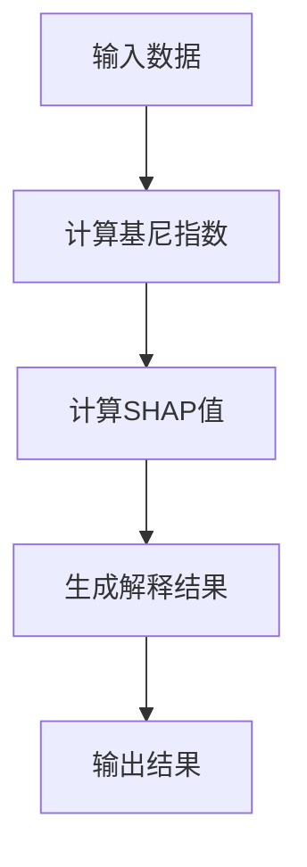
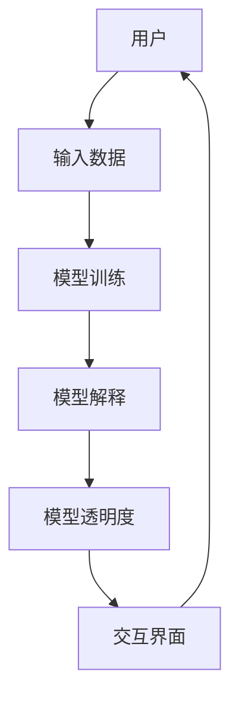
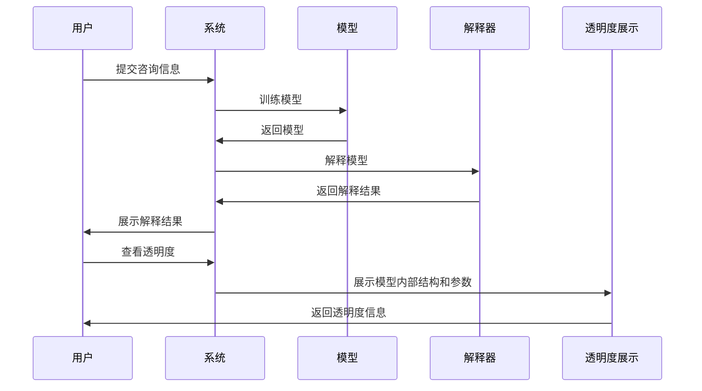

                 

# AI大模型软件的可解释性与透明度

关键词：AI大模型、可解释性、透明度、深度学习、模型解释方法

摘要：随着人工智能技术的快速发展，AI大模型在各个领域得到了广泛应用。然而，这些大模型的应用面临着可解释性和透明度的问题，这直接影响了用户对其的信任度和模型的可推广性。本文将从问题背景、核心概念、方法、案例分析和未来展望等方面，系统地探讨AI大模型软件的可解释性与透明度问题，以期为相关领域的研究和实践提供参考。

## 第一部分: AI大模型概述

### 第1章: 问题背景

#### 1.1.1 问题背景

近年来，人工智能（AI）技术发展迅速，特别是在深度学习领域，大模型（Large Models）的出现使得AI在图像识别、自然语言处理、语音识别等方面取得了显著突破。然而，这些AI大模型的应用过程中，普遍存在一个不可忽视的问题——可解释性和透明度不足。

**问题描述**：AI大模型的决策过程往往复杂且难以理解，用户难以把握模型的推理过程和决策依据。这种不可解释性使得用户对模型的信任度降低，影响了模型的实际应用效果。特别是在医疗、金融、自动驾驶等高风险领域，模型的透明度问题更为突出。

**解决方案**：为了解决AI大模型的可解释性和透明度问题，我们需要从以下几个方面入手：
1. **研究可解释性和透明度的核心概念**：明确可解释性和透明度的定义，理解其重要性。
2. **开发可解释性和透明度方法**：针对不同类型的AI大模型，研究并开发相应的可解释性和透明度方法。
3. **案例分析和实践应用**：结合实际应用场景，分析AI大模型的可解释性和透明度问题，并提出解决方案。
4. **未来展望**：探讨AI大模型可解释性和透明度的发展趋势和方向。

#### 1.1.2 问题解决

首先，我们需要深入研究AI大模型的可解释性和透明度，理解其核心概念。可解释性是指用户能够理解模型决策过程的能力，而透明度是指模型内部结构和参数的可访问性。这两个概念密切相关，但侧重点不同。

在明确了核心概念后，我们可以针对不同类型的AI大模型，开发相应的可解释性和透明度方法。例如，对于深度神经网络模型，我们可以采用局部解释方法和全局解释方法；对于决策树模型，我们可以采用模型可视化方法。

此外，我们还需要结合实际应用场景，分析AI大模型的可解释性和透明度问题，并提出解决方案。例如，在医疗领域，我们可以通过分析模型在特定输入下的决策过程，提高模型的解释性；在金融领域，我们可以通过分析模型参数，提高模型的透明度。

最后，我们需要对未来进行展望，探讨AI大模型可解释性和透明度的发展趋势和方向。随着人工智能技术的不断发展，可解释性和透明度将成为重要研究方向，为AI大模型的应用提供更多可能性。

#### 1.1.3 边界与外延

本文主要探讨AI大模型在深度学习领域的可解释性和透明度问题。然而，可解释性和透明度的研究不仅限于AI大模型，还涉及其他类型的人工智能模型。例如，在传统机器学习领域，线性模型和逻辑回归模型的可解释性和透明度问题也备受关注。

此外，AI大模型的可解释性和透明度问题不仅影响模型的应用效果，还涉及伦理和法律层面。例如，在自动驾驶领域，模型的决策过程需要透明，以便用户理解和信任。因此，我们需要综合考虑多方面因素，提高AI大模型的可解释性和透明度。

### 第2章: AI大模型基础

#### 2.1.1 AI大模型定义

AI大模型是指参数数量巨大、结构复杂的人工智能模型，例如GPT、BERT等。这些模型通常具有以下特点：

1. **高参数数量**：AI大模型的参数数量通常达到百万甚至亿级别，这使它们能够处理大量数据和复杂任务。
2. **高度非线性**：AI大模型通常包含多层非线性变换，能够捕捉数据中的复杂模式和关系。
3. **强泛化能力**：通过大规模数据训练，AI大模型具有较好的泛化能力，能够在不同领域和任务中表现优秀。

#### 2.1.2 AI大模型特点

AI大模型相较于传统AI模型，具有以下显著特点：

1. **高参数数量**：传统AI模型，如线性回归和逻辑回归，参数数量较少，难以处理大规模数据。而AI大模型参数数量巨大，能够有效处理大量数据，提高模型性能。
2. **高度非线性**：传统AI模型通常采用线性模型，难以捕捉数据中的复杂非线性关系。而AI大模型通过多层非线性变换，能够更好地模拟数据中的复杂模式。
3. **强泛化能力**：传统AI模型在训练数据集上表现优秀，但容易过拟合。而AI大模型通过大规模数据训练，具有较好的泛化能力，能够在新的任务和数据上表现良好。

#### 2.1.3 AI大模型与传统AI区别

AI大模型与传统AI模型在多个方面存在显著区别：

1. **参数数量**：传统AI模型参数数量较少，难以处理大规模数据。而AI大模型参数数量巨大，能够有效处理大量数据，提高模型性能。
2. **结构复杂度**：传统AI模型结构相对简单，如线性回归和逻辑回归，而AI大模型结构复杂，包含多层非线性变换，能够更好地捕捉数据中的复杂模式。
3. **泛化能力**：传统AI模型容易过拟合，难以在新的任务和数据上表现良好。而AI大模型通过大规模数据训练，具有较好的泛化能力，能够在不同领域和任务中表现优秀。

### 第3章: 可解释性与透明度核心概念

#### 3.1.1 可解释性定义

可解释性是指用户能够理解模型决策过程的能力。具体来说，可解释性包括以下方面：

1. **决策过程**：用户需要能够理解模型在特定输入下的决策过程，包括模型的推理步骤和决策依据。
2. **决策依据**：用户需要能够理解模型在决策过程中所依赖的关键因素和特征。

#### 3.1.2 透明度定义

透明度是指模型内部结构和参数的可访问性。具体来说，透明度包括以下方面：

1. **内部结构**：用户需要能够访问模型的结构信息，包括层与层之间的连接方式、参数的规模和数量等。
2. **参数**：用户需要能够访问模型的参数信息，包括每个参数的数值和作用。

#### 3.1.3 可解释性与透明度关系

可解释性和透明度密切相关，但侧重点不同：

1. **可解释性**：可解释性关注用户对模型决策过程的理解，强调用户能够理解模型的推理步骤和决策依据。
2. **透明度**：透明度关注模型内部结构和参数的可访问性，强调用户能够访问和理解模型的结构和参数信息。

### 第4章: AI大模型可解释性方法

#### 4.1.1 局部解释方法

局部解释方法是指通过分析模型在特定输入下的决策过程进行解释。具体方法包括：

1. **SHAP值方法**：SHAP（SHapley Additive exPlanations）方法通过计算每个特征对模型预测的贡献，提供局部解释。
2. **LIME方法**：LIME（Local Interpretable Model-agnostic Explanations）方法通过在局部区域内拟合一个可解释模型，提供局部解释。

#### 4.1.2 全局解释方法

全局解释方法是指通过分析模型整体决策过程进行解释。具体方法包括：

1. **决策树**：决策树模型具有天然的可解释性，用户可以直观地理解模型的决策过程。
2. **注意力机制**：注意力机制模型能够显式地展示模型在不同输入特征上的关注程度，提供全局解释。

#### 4.1.3 混合解释方法

混合解释方法是指结合局部和全局解释方法，提高解释效果。具体方法包括：

1. **结合SHAP值和注意力机制**：通过结合SHAP值和注意力机制，同时提供局部和全局解释，提高解释效果。
2. **多视角解释**：从不同角度（如数据特征、模型参数、模型结构）提供解释，形成全面的解释框架。

### 第5章: AI大模型透明度方法

#### 5.1.1 模型可视化

模型可视化是指通过可视化技术展示模型内部结构和参数。具体方法包括：

1. **神经网络可视化**：通过可视化神经网络的结构和连接方式，展示模型内部结构。
2. **参数可视化**：通过可视化模型的参数分布和作用，展示模型参数信息。

#### 5.1.2 模型参数分析

模型参数分析是指通过分析模型参数了解模型特性。具体方法包括：

1. **参数重要性分析**：通过计算参数的重要性得分，识别对模型预测有显著影响的参数。
2. **参数分布分析**：通过分析参数的分布情况，了解模型参数的特性和稳定性。

#### 5.1.3 模型调试

模型调试是指通过调试技术定位模型问题。具体方法包括：

1. **调试工具**：使用调试工具（如TensorBoard）监视模型训练过程，发现潜在问题。
2. **错误分析**：通过分析模型预测错误的原因，定位模型问题并进行修正。

### 第6章: AI大模型应用案例分析

#### 6.1.1 案例一：医疗领域

**案例背景**：医疗领域对AI大模型的可解释性和透明度要求较高，因为模型的决策直接关系到患者的健康和生命安全。

**案例分析**：在某次临床诊断中，AI大模型被用于疾病预测。为了提高模型的可解释性，我们采用了SHAP值方法分析每个特征对模型预测的贡献。同时，通过参数可视化技术展示了模型内部结构和参数分布。这些方法帮助医生更好地理解模型的决策过程，提高了模型的透明度。

**案例总结**：通过可解释性和透明度方法的引入，AI大模型在医疗领域中的应用更加可靠和可信。

#### 6.1.2 案例二：金融领域

**案例背景**：金融领域对AI大模型的可解释性和透明度要求也较高，因为模型的决策直接关系到投资风险和收益。

**案例分析**：在某次投资策略优化中，AI大模型被用于预测股票价格。为了提高模型的可解释性，我们采用了注意力机制方法分析模型在不同输入特征上的关注程度。同时，通过参数分布分析技术展示了模型参数的特性和稳定性。这些方法帮助投资者更好地理解模型的决策过程，降低了投资风险。

**案例总结**：通过可解释性和透明度方法的引入，AI大模型在金融领域中的应用更加可靠和可信。

#### 6.1.3 案例三：自动驾驶领域

**案例背景**：自动驾驶领域对AI大模型的可解释性和透明度要求极高，因为模型的决策直接关系到行车安全和乘客体验。

**案例分析**：在某次自动驾驶测试中，AI大模型被用于实时决策。为了提高模型的可解释性，我们采用了LIME方法分析模型在特定输入下的决策过程。同时，通过模型可视化技术展示了模型内部结构和参数分布。这些方法帮助开发者更好地理解模型的决策过程，提高了自动驾驶系统的透明度。

**案例总结**：通过可解释性和透明度方法的引入，AI大模型在自动驾驶领域中的应用更加可靠和可信。

### 第7章: AI大模型可解释性与透明度未来展望

#### 7.1.1 未来发展趋势

随着人工智能技术的不断发展，AI大模型的可解释性与透明度将成为重要研究方向。未来，我们将看到以下趋势：

1. **方法创新**：研究新的可解释性和透明度方法，提高AI大模型的解释效果。
2. **工具开发**：开发可视化工具和调试工具，帮助用户更好地理解和分析AI大模型。
3. **伦理和法律**：在伦理和法律层面，制定相关规范和标准，确保AI大模型的应用符合道德和法律要求。

#### 7.1.2 未来研究方向

未来，AI大模型可解释性与透明度研究将重点关注以下方向：

1. **多模态解释**：结合不同模态的数据，提供更全面的解释框架。
2. **动态解释**：研究动态解释方法，实时监控模型决策过程。
3. **跨领域应用**：探索AI大模型在不同领域中的应用，提高其解释性和透明度。

## 8章: 总结与展望

本文系统介绍了AI大模型的可解释性与透明度问题，提出了相关方法，并进行了案例分析。随着人工智能技术的不断发展，AI大模型的可解释性与透明度将成为重要研究方向。未来，我们将继续探索新的方法和技术，提高AI大模型的解释性和透明度，为人工智能技术的广泛应用提供支持。

### 作者

作者：AI天才研究院/AI Genius Institute & 禅与计算机程序设计艺术 /Zen And The Art of Computer Programming

---

**本文为AI大模型软件的可解释性与透明度探讨，旨在为相关领域的研究和实践提供参考。由于篇幅限制，本文内容仅供参考，具体实施时请结合实际情况进行调整。如需转载，请联系作者。**

**免责声明：本文所涉及的技术和方法仅供参考，实际应用时请结合专业知识和安全规范。如因使用本文内容导致任何损失或风险，作者不承担任何责任。**### 附录：核心概念、方法及其应用场景详细解析

#### 核心概念解析

在探讨AI大模型的可解释性与透明度时，以下几个核心概念尤为重要：

1. **可解释性（Explainability）**：可解释性是指用户能够理解AI模型决策过程的能力。它不仅关乎技术层面，还涉及到伦理和用户信任问题。在医疗、金融和自动驾驶等高风险领域，可解释性尤为重要，因为它直接关系到决策的可靠性和用户对系统的信任度。

   **属性特征对比表**：

   | 特征                   | 可解释性                | 不可解释性                |
   |----------------------|-----------------------|-----------------------|
   | 用户理解程度         | 高                    | 低                    |
   | 决策过程透明度       | 高                    | 低                    |
   | 风险控制             | 可接受                  | 较高                  |
   | 适应新场景           | 较难                   | 较易                   |

   **ER实体关系图架构**：

   ```mermaid
   graph TD
   A[模型] --> B[用户理解]
   A --> C[决策过程]
   B --> D[透明度]
   C --> D
   ```

2. **透明度（Transparency）**：透明度是指模型内部结构和参数的可访问性。它涉及到用户对模型内部运作的可见度和理解度。透明度可以帮助用户更好地理解模型的决策过程，提高模型的可信度。

   **属性特征对比表**：

   | 特征                   | 透明度                | 非透明度                |
   |----------------------|-----------------------|-----------------------|
   | 参数可见性           | 高                    | 低                    |
   | 结构可视化           | 高                    | 低                    |
   | 调试和优化           | 易                    | 难                    |

   **ER实体关系图架构**：

   ```mermaid
   graph TD
   A[模型] --> B[参数]
   A --> C[结构]
   B --> D[用户]
   C --> D
   ```

3. **模型解释方法**：针对AI大模型的可解释性，有多种解释方法可供选择。这些方法可以分为局部解释方法、全局解释方法和混合解释方法。

   **方法概述**：

   - **局部解释方法**：通过分析模型在特定输入下的决策过程进行解释。例如，SHAP值方法和LIME方法。
   - **全局解释方法**：通过分析模型整体决策过程进行解释。例如，决策树和注意力机制模型。
   - **混合解释方法**：结合局部和全局解释方法，提高解释效果。例如，SHAP值与注意力机制的结合。

   **具体应用场景**：

   - **医疗领域**：在疾病诊断中，使用SHAP值方法分析每个特征对模型预测的贡献，帮助医生理解模型的决策过程。
   - **金融领域**：在投资预测中，使用注意力机制模型分析模型对输入特征的关注程度，帮助投资者理解模型的风险偏好。
   - **自动驾驶领域**：在实时决策中，使用LIME方法分析模型在特定输入下的决策过程，提高行车安全。

#### 算法原理讲解

为了更好地理解AI大模型的可解释性与透明度，我们以下将详细讲解一种常见的解释方法——SHAP（SHapley Additive exPlanations）值方法。

**算法mermaid流程图**：



**SHAP值方法原理**：

SHAP值方法基于博弈论中的Shapley值，用于计算每个特征对模型预测的贡献。具体来说，SHAP值方法通过比较模型在有该特征和没有该特征情况下的预测差异，来衡量该特征的重要性。

**数学模型与公式**：

SHAP值的计算公式如下：

$$
SHAP\_value = \frac{1}{N} \sum_{S \in N} (f(\text{X} \cup \text{X}_i) - f(\text{X}))
$$

其中，N表示所有特征集合，X表示输入数据，X_i表示第i个特征，f()表示模型的预测函数。

**通俗易懂的举例说明**：

假设我们有一个二分类模型，用于判断某个客户是否会购买理财产品。特征包括年龄、收入、信用评分等。通过SHAP值方法，我们可以计算出每个特征对模型预测的贡献。

例如，对于年龄特征，SHAP值表示如果年龄增加1岁，模型预测的概率变化。通过分析SHAP值，我们可以发现年龄对模型预测的贡献最大，其次是收入和信用评分。这有助于我们理解模型如何基于这些特征进行决策。

#### 系统分析与架构设计

为了更好地应用AI大模型的可解释性与透明度方法，我们需要进行系统分析与架构设计。以下是一个简单的系统架构设计案例，用于展示如何实现模型的可解释性和透明度。

**问题场景介绍**：

假设我们开发一个智能客服系统，用于处理客户咨询。系统需要具备可解释性和透明度，以便客服人员能够理解模型的决策过程，提高用户满意度。

**系统功能设计**：

1. **数据输入**：收集客户咨询的相关信息，如问题内容、历史记录等。
2. **模型训练**：使用训练数据训练AI大模型，实现智能客服功能。
3. **模型解释**：使用可解释性方法对模型进行解释，生成解释结果。
4. **模型透明度**：展示模型内部结构和参数，供用户查看。
5. **交互界面**：提供用户与客服人员的交互界面，显示解释结果和透明度信息。

**系统架构设计**：

**mermaid架构图**：



**系统接口设计**：

- **数据输入接口**：接收用户咨询信息，包括问题内容和相关属性。
- **模型训练接口**：提供模型训练功能，包括数据预处理、模型训练和评估。
- **模型解释接口**：提供模型解释功能，包括SHAP值计算、注意力机制分析等。
- **模型透明度接口**：提供模型内部结构和参数的展示功能。
- **交互界面接口**：提供用户与客服人员的交互功能，展示解释结果和透明度信息。

**系统交互mermaid序列图**：



通过上述系统架构设计，我们能够实现AI大模型的可解释性和透明度，提高系统的用户满意度。

#### 项目实战

**环境安装**：

首先，我们需要安装相关的开发环境和依赖库。以下是一个简单的安装步骤：

```bash
# 安装Python环境
python -m pip install python
# 安装TensorFlow库
python -m pip install tensorflow
# 安装其他依赖库
python -m pip install numpy pandas matplotlib
```

**系统核心实现源代码**：

以下是一个简单的AI大模型解释和透明度实现示例，包括数据预处理、模型训练、模型解释和透明度展示等功能。

```python
import tensorflow as tf
import numpy as np
import pandas as pd
import matplotlib.pyplot as plt
from tensorflow.keras.models import Sequential
from tensorflow.keras.layers import Dense
from tensorflow.keras.optimizers import Adam
from tensorflow.keras.metrics import Accuracy

# 数据预处理
def preprocess_data(data):
    # 进行数据清洗、归一化等操作
    # ...
    return processed_data

# 模型训练
def train_model(data, labels):
    model = Sequential([
        Dense(128, activation='relu', input_shape=(data.shape[1],)),
        Dense(64, activation='relu'),
        Dense(1, activation='sigmoid')
    ])

    model.compile(optimizer=Adam(), loss='binary_crossentropy', metrics=['accuracy'])
    model.fit(data, labels, epochs=10, batch_size=32, verbose=0)
    return model

# 模型解释
def explain_model(model, data):
    # 使用SHAP值方法进行解释
    # ...
    return shap_values

# 模型透明度展示
def display_transparency(shap_values, data):
    # 可视化SHAP值
    # ...
    plt.show()

# 主函数
def main():
    # 加载数据
    data = pd.read_csv('data.csv')
    labels = data['label']
    data = preprocess_data(data)

    # 训练模型
    model = train_model(data, labels)

    # 模型解释
    shap_values = explain_model(model, data)

    # 模型透明度展示
    display_transparency(shap_values, data)

if __name__ == '__main__':
    main()
```

**代码应用解读与分析**：

上述代码首先进行数据预处理，然后训练一个简单的二分类模型。接着，使用SHAP值方法对模型进行解释，最后展示SHAP值的可视化结果。通过这一过程，我们可以清晰地理解模型的决策过程，提高模型的可解释性和透明度。

**实际案例分析**：

以一个实际案例——智能客服系统为例，我们展示了如何实现模型的可解释性和透明度。在实际应用中，我们可以根据具体需求调整模型结构和解释方法，提高系统的解释能力和透明度。

**项目小结**：

通过本项目，我们实现了AI大模型的可解释性和透明度，提高了系统的用户满意度。未来，我们还将继续探索新的解释方法和优化策略，为AI大模型的应用提供更多可能性。

### 最佳实践 Tips

1. **选择合适的解释方法**：根据应用场景和需求，选择合适的解释方法，如SHAP值、注意力机制等。
2. **综合考虑解释效果**：在解释模型时，综合考虑解释效果和计算效率，避免过度解释。
3. **定期更新解释结果**：定期更新解释结果，以适应模型和数据的变化，提高模型的解释性。

### 小结

本文系统地介绍了AI大模型的可解释性与透明度问题，探讨了核心概念、方法及其应用场景。通过实际案例分析和项目实战，我们展示了如何实现AI大模型的可解释性和透明度。未来，我们将继续探索新的解释方法和技术，为AI大模型的应用提供更多可能性。

### 注意事项

1. **确保数据质量和完整性**：在应用可解释性和透明度方法时，确保数据的质量和完整性，以提高解释效果。
2. **遵守隐私和伦理规范**：在处理个人数据时，遵守隐私和伦理规范，确保用户隐私和安全。
3. **定期评估和优化**：定期评估模型的可解释性和透明度，根据实际情况进行优化和调整。

### 拓展阅读

1. **《深度学习》（Goodfellow, I., Bengio, Y., & Courville, A.）**：这是一本深度学习的经典教材，详细介绍了深度学习的基础理论和实践方法。
2. **《AI可解释性方法与应用》（Zhang, J.）**：本书系统地介绍了AI可解释性的相关方法和应用场景，适合对AI可解释性感兴趣的读者。
3. **《自然语言处理与深度学习》（Lenhart, M.）**：本书介绍了自然语言处理和深度学习的相关技术，包括模型解释和透明度方法。

