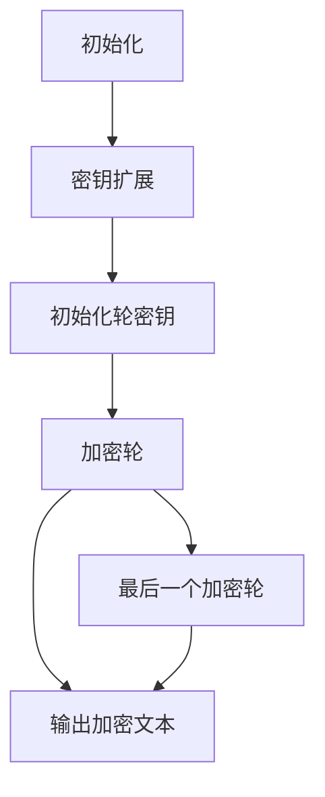
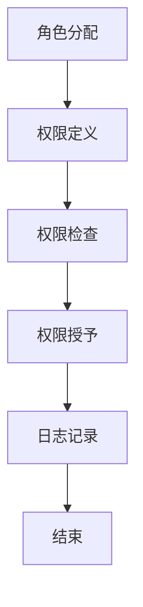
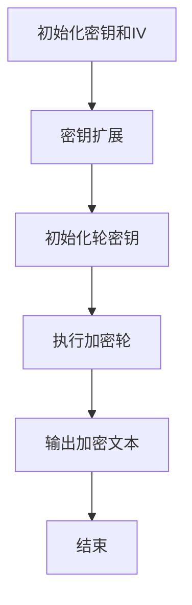
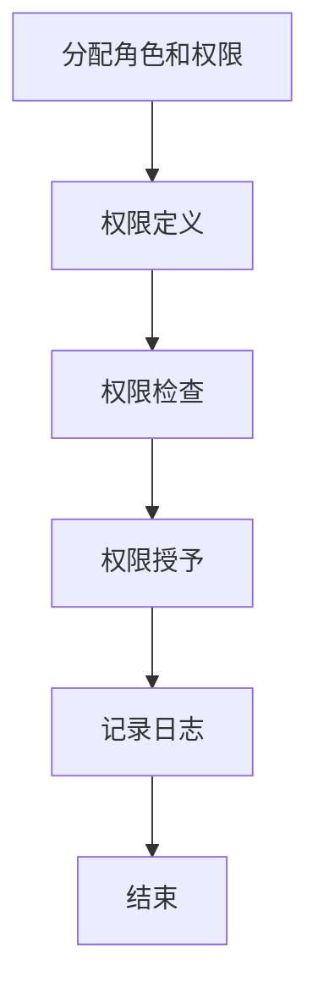

                 


## AI大模型软件的安全性设计

### 关键词

- **AI大模型**
- **软件安全性**
- **设计原则**
- **威胁分析**
- **数据安全**
- **访问控制**
- **测试与评估**

### 摘要

本文探讨了人工智能大模型软件的安全性设计，从背景介绍、核心概念阐述到具体的安全设计原则、威胁分析和实施策略，全面解析了AI大模型软件在安全设计方面的关键要素。文章通过逐步分析，揭示了AI大模型软件面临的安全挑战，并提出了有效的安全设计方法和最佳实践，旨在为开发人员提供一套系统的安全设计指南。

### 目录

#### 第一部分：背景与基础

1. [问题背景与核心概念](#问题背景与核心概念)
2. [软件安全设计原则](#软件安全设计原则)
3. [AI大模型安全威胁分析](#AI大模型安全威胁分析)

#### 第二部分：安全性设计原理

1. [安全性设计原则与框架](#安全性设计原则与框架)
2. [AI大模型数据安全设计](#AI大模型数据安全设计)
3. [AI大模型访问控制设计](#AI大模型访问控制设计)

#### 第三部分：实战与应用

1. [AI大模型安全性测试与评估](#AI大模型安全性测试与评估)
2. [AI大模型安全性最佳实践](#AI大模型安全性最佳实践)
3. [展望与未来方向](#展望与未来方向)

### 第一部分：背景与基础

#### 第1章：问题背景与核心概念

##### 1.1 人工智能大模型概述

人工智能（AI）在过去几十年中取得了显著的发展，从最初的专家系统到现在的深度学习模型，AI技术正在改变各行各业。特别是大模型（Large Models），如GPT-3、BERT等，以其强大的数据处理能力和智能决策能力，正在引领AI领域的发展。然而，随着AI大模型的应用越来越广泛，其安全性问题也日益突出。

##### 1.1.1 AI大模型的发展历程

AI大模型的发展可以分为几个阶段：

- **早期探索**：在20世纪80年代，神经网络和深度学习开始受到关注，但计算资源有限，使得大模型的发展受到阻碍。
- **2006年深度学习的兴起**：Hinton提出了深度信念网络（DBN），为深度学习奠定了基础。
- **2012年AlexNet的出现**：在ImageNet竞赛中，AlexNet模型取得了突破性成绩，标志着深度学习的崛起。
- **2018年后大模型的爆发**：随着计算资源的提升和分布式计算技术的发展，GPT-3、BERT等大模型相继问世，标志着AI进入了一个新的时代。

##### 1.1.2 AI大模型的关键技术

AI大模型的关键技术包括：

- **深度学习**：基于多层神经网络，通过反向传播算法训练模型，具有强大的特征提取和模式识别能力。
- **迁移学习**：通过将预训练模型应用于新的任务，提高模型的泛化能力。
- **注意力机制**：通过动态调整模型对输入数据的关注程度，提高模型的处理效率。
- **分布式计算**：通过将计算任务分布在多个节点上，提高模型的训练速度和效率。

##### 1.1.3 AI大模型的安全性问题

AI大模型的安全性问题主要包括：

- **数据泄露**：大模型通常需要大量训练数据，这些数据可能包含敏感信息。
- **模型篡改**：攻击者可以通过注入恶意样本或修改模型参数来篡改模型行为。
- **隐私泄露**：模型的决策过程可能会泄露用户隐私信息。
- **服务中断**：大规模的模型训练和部署可能导致服务中断或性能下降。

#### 1.2 软件安全设计原则

软件安全设计原则是确保软件系统安全的基础。对于AI大模型软件，以下原则尤为重要：

- **最小权限原则**：系统组件和用户应只能访问其必需的资源。
- **防御深度原则**：系统应具备多层防御机制，以应对不同类型的攻击。
- **安全性审计**：定期进行安全审计，及时发现和修复安全漏洞。
- **安全培训**：提高开发人员和运维人员的安全意识，降低人为错误导致的安全风险。

##### 1.2.1 安全性需求分析

在进行AI大模型软件安全设计时，首先需要明确安全性需求。这包括：

- **机密性**：确保数据在存储和传输过程中不被未经授权的第三方获取。
- **完整性**：确保数据在存储和传输过程中不被未经授权的第三方修改。
- **可用性**：确保系统能够在需要时可靠地运行。
- **可靠性**：确保系统在各种环境下的稳定性。

##### 1.2.2 安全设计策略

安全设计策略包括：

- **身份验证**：确保用户身份的合法性，常用的身份验证方法有密码、生物识别等。
- **访问控制**：限制用户对系统的访问权限，常用的访问控制方法有基于角色的访问控制（RBAC）和基于属性的访问控制（ABAC）。
- **数据加密**：对敏感数据进行加密，防止数据泄露。
- **审计与监控**：实时监控系统的运行状态，记录并分析异常行为。

##### 1.2.3 安全评估方法

安全评估方法是验证安全设计有效性的重要手段。常用的安全评估方法包括：

- **静态分析**：在不运行程序的情况下，通过代码审查等方法发现潜在的安全漏洞。
- **动态分析**：在运行程序时，通过监控程序的行为来发现安全漏洞。
- **渗透测试**：模拟攻击者进行攻击，以验证系统的安全性。
- **漏洞扫描**：自动扫描系统，查找已知的安全漏洞。

### 第二部分：安全性设计原理

#### 第2章：AI大模型安全威胁分析

##### 2.1 攻击类型与方法

AI大模型可能面临多种攻击，包括：

- **数据泄露**：通过非法访问或篡改数据库，获取敏感信息。
- **模型篡改**：通过向训练数据中注入恶意样本或修改模型参数，改变模型的决策行为。
- **拒绝服务攻击（DDoS）**：通过大量恶意请求，使系统资源耗尽，导致服务中断。
- **中间人攻击（MITM）**：拦截并篡改数据传输，窃取敏感信息。

##### 2.2 安全风险识别与评估

识别和评估安全风险是安全设计的重要步骤。这包括：

- **风险识别**：通过分析系统组件、数据和处理流程，识别潜在的安全风险。
- **风险评估**：对识别出的风险进行量化评估，确定其严重程度和可能性。
- **风险缓解**：制定相应的安全措施，降低风险。

### 第三部分：实战与应用

#### 第3章：安全性设计原则与框架

##### 3.1 安全性设计原则

安全性设计原则包括：

- **最小权限原则**：系统组件和用户应只能访问其必需的资源。
- **防御深度原则**：系统应具备多层防御机制，以应对不同类型的攻击。
- **安全性审计**：定期进行安全审计，及时发现和修复安全漏洞。
- **安全培训**：提高开发人员和运维人员的安全意识，降低人为错误导致的安全风险。

##### 3.2 安全性框架

安全性框架包括：

- **身份验证**：确保用户身份的合法性，常用的身份验证方法有密码、生物识别等。
- **访问控制**：限制用户对系统的访问权限，常用的访问控制方法有基于角色的访问控制（RBAC）和基于属性的访问控制（ABAC）。
- **数据加密**：对敏感数据进行加密，防止数据泄露。
- **审计与监控**：实时监控系统的运行状态，记录并分析异常行为。

#### 第4章：AI大模型数据安全设计

##### 4.1 数据安全需求分析

AI大模型的数据安全需求包括：

- **机密性**：确保数据在存储和传输过程中不被未经授权的第三方获取。
- **完整性**：确保数据在存储和传输过程中不被未经授权的第三方修改。
- **可用性**：确保系统能够在需要时可靠地运行。
- **可靠性**：确保系统在各种环境下的稳定性。

##### 4.2 数据加密与保护

数据加密与保护的方法包括：

- **数据加密**：使用加密算法对敏感数据进行加密，常用的加密算法有AES、RSA等。
- **数据安全存储**：确保存储数据的硬件和软件具有足够的安全保护措施，如硬盘加密、存储备份等。
- **数据传输安全**：使用安全传输协议（如TLS）确保数据在传输过程中不被窃取或篡改。

#### 第5章：AI大模型访问控制设计

##### 5.1 访问控制策略

访问控制策略包括：

- **用户身份验证**：确保用户身份的合法性，常用的身份验证方法有密码、生物识别等。
- **权限管理**：根据用户的角色和职责，分配不同的权限。
- **访问控制模型**：常用的访问控制模型有基于角色的访问控制（RBAC）和基于属性的访问控制（ABAC）。

##### 5.2 实施访问控制

实施访问控制的方法包括：

- **访问控制机制**：在系统中实现访问控制机制，如ACL（访问控制列表）和RBAC（基于角色的访问控制）。
- **访问控制案例分析**：通过具体案例分析，了解如何实施访问控制。
- **访问控制评估**：定期评估访问控制机制的 effectiveness 和 efficiency。

### 第四部分：AI大模型安全性测试与评估

#### 第6章：AI大模型安全性测试与评估

##### 6.1 安全性测试方法

安全性测试方法包括：

- **黑盒测试**：在不了解系统内部结构的情况下，通过输入和输出测试系统功能。
- **白盒测试**：了解系统内部结构，通过代码审查和单元测试等方法测试系统安全性。
- **漏洞扫描**：使用自动工具扫描系统，查找已知的安全漏洞。

##### 6.2 安全评估实践

安全评估实践包括：

- **评估流程**：制定评估计划，执行评估任务，分析评估结果。
- **评估工具与平台**：选择合适的评估工具和平台，如OWASP ZAP、Nessus等。
- **评估案例分析**：通过具体案例分析，了解如何进行安全评估。

### 第五部分：展望与未来方向

#### 第7章：AI大模型安全性最佳实践

##### 7.1 安全设计最佳实践

安全设计最佳实践包括：

- **设计指南**：遵循安全性设计原则，制定详细的安全设计指南。
- **防御措施**：采取多种防御措施，如数据加密、访问控制等。
- **优化策略**：持续优化系统安全性，提高系统的防御能力。

##### 7.2 安全运维与管理

安全运维与管理包括：

- **运维安全策略**：制定运维安全策略，确保系统在运维过程中的安全性。
- **紧急响应计划**：制定紧急响应计划，快速应对安全事件。
- **持续安全监控**：实时监控系统运行状态，及时发现和处理安全事件。

#### 第8章：展望与未来方向

##### 8.1 安全性发展趋势

安全性发展趋势包括：

- **技术趋势**：随着AI技术的发展，安全性技术也在不断进步，如基于AI的威胁检测和响应。
- **法律法规**：随着AI应用的普及，各国政府也在不断完善相关法律法规，以规范AI大模型的应用。
- **未来挑战与机遇**：AI大模型的安全性面临诸多挑战，同时也带来了新的机遇。

##### 8.2 结论

本文通过逐步分析，提出了AI大模型软件的安全性设计原则、威胁分析和实施策略，旨在为开发人员提供一套系统的安全设计指南。随着AI技术的不断进步，AI大模型的安全性设计也将面临新的挑战和机遇。未来，我们需要不断探索和优化，以保障AI大模型软件的安全稳定运行。

### 作者

- **作者：AI天才研究院/AI Genius Institute & 禅与计算机程序设计艺术 /Zen And The Art of Computer Programming**

### 结论

本文系统地阐述了AI大模型软件的安全性设计，包括背景介绍、核心概念、安全设计原则、威胁分析和实施策略。通过逐步分析，揭示了AI大模型软件在安全设计方面的重要性和挑战。我们希望本文能为您提供一套实用的安全设计指南，帮助您更好地保障AI大模型软件的安全。

### 背景介绍

#### 核心概念术语说明

- **人工智能大模型**：基于机器学习技术，能够处理大量数据，具备高度智能的模型。
- **软件安全性**：确保软件系统的保密性、完整性和可用性，防止未经授权的访问和破坏。
- **安全设计原则**：在设计软件系统时，遵循的一系列原则，以确保系统的安全性。
- **威胁分析**：识别和分析可能对系统造成危害的威胁，评估其影响和可能性。

#### 问题背景

随着人工智能技术的快速发展，AI大模型在各个领域得到了广泛应用，如自然语言处理、图像识别、预测分析等。然而，AI大模型的安全性问题也日益突出。由于AI大模型处理的数据量巨大，且包含敏感信息，一旦发生数据泄露或模型篡改，可能导致严重后果。

#### 问题描述

AI大模型软件面临的主要安全问题包括：

1. **数据泄露**：由于大模型训练需要大量数据，这些数据可能包含敏感信息，如个人隐私、商业机密等。若数据泄露，可能导致隐私侵犯和商业损失。
2. **模型篡改**：攻击者可以通过向训练数据中注入恶意样本或修改模型参数，篡改模型的决策行为，导致不良后果。
3. **拒绝服务攻击**：攻击者可以通过大量恶意请求，使系统资源耗尽，导致服务中断。
4. **中间人攻击**：攻击者可以通过拦截并篡改数据传输，窃取敏感信息。

#### 问题解决

为了解决AI大模型软件的安全性问题，我们需要采取一系列安全设计原则和措施，包括：

1. **数据安全保护**：对敏感数据进行加密和访问控制，防止数据泄露。
2. **模型安全性设计**：通过安全性评估和测试，确保模型不会被篡改。
3. **防御深度设计**：采用多层次的安全措施，提高系统的防御能力。
4. **实时监控和响应**：建立实时监控和响应机制，及时发现和处理安全事件。

#### 边界与外延

AI大模型软件的安全性设计不仅涉及技术层面，还包括管理、法律和道德层面。边界与外延包括：

1. **技术边界**：涉及到具体的安全技术和实现方法，如加密算法、访问控制机制等。
2. **管理边界**：涉及到安全管理策略、流程和制度，如安全培训、审计等。
3. **法律边界**：涉及到相关法律法规和标准，如数据保护法、网络安全法等。
4. **道德边界**：涉及到对用户隐私、数据安全和公平性的考虑，如算法歧视、数据偏见等。

#### 概念结构与核心要素组成

AI大模型软件的安全性设计包括以下核心要素：

1. **数据安全**：涉及数据的加密、访问控制和存储保护。
2. **模型安全**：涉及模型的训练数据、参数和决策过程的保护。
3. **访问控制**：涉及用户的身份验证、权限管理和访问控制策略。
4. **安全监控**：涉及实时监控、日志记录和异常行为检测。
5. **安全测试与评估**：涉及安全测试方法、评估框架和漏洞扫描。

#### 核心概念与联系

1. **数据安全**与**访问控制**：数据安全是防止数据泄露，访问控制是防止未经授权的访问。两者共同保障数据的安全性。
2. **模型安全**与**防御深度设计**：模型安全是防止模型被篡改，防御深度设计是提高系统的整体防御能力。
3. **安全监控**与**安全测试与评估**：安全监控是实时发现安全事件，安全测试与评估是评估系统安全性和发现潜在漏洞。

### 核心概念与联系详细说明

在本部分，我们将详细探讨AI大模型软件的安全性设计中的核心概念，并分析它们之间的联系。这些核心概念包括数据安全、模型安全、访问控制、安全监控和安全测试与评估。通过深入理解这些概念，我们将为后续章节提供理论基础，并明确各部分在整体安全架构中的重要性。

#### 数据安全

数据安全是AI大模型软件安全性的基础，它涉及到对敏感数据的保护，确保数据在存储、传输和使用过程中的机密性、完整性和可用性。以下是对数据安全核心概念的解释：

1. **机密性**：确保数据在未经授权的情况下不被访问或泄露。这通常通过加密技术实现，如对称加密（如AES）和非对称加密（如RSA）。
2. **完整性**：确保数据在存储和传输过程中未被篡改。完整性验证可以通过哈希函数（如SHA-256）实现。
3. **可用性**：确保数据在需要时能够被访问和使用，防止因恶意攻击或系统故障导致的数据丢失。

**数据安全与其他核心概念的联系**：

- **与访问控制**：访问控制机制确保只有授权用户才能访问敏感数据，从而减少数据泄露的风险。
- **与模型安全**：模型训练数据的安全性直接影响到模型的准确性和可靠性。

#### 模型安全

模型安全是保护AI大模型不被篡改或恶意利用的关键。以下是对模型安全核心概念的解释：

1. **模型完整性**：确保模型参数和结构未被非法修改。
2. **模型保密性**：防止模型内部细节被泄露，以防止攻击者利用模型实现未授权的行为。
3. **模型可靠性**：确保模型在特定环境和数据集上的一致性和稳定性。

**模型安全与其他核心概念的联系**：

- **与数据安全**：模型训练数据的安全直接影响到模型的安全。
- **与访问控制**：访问控制可以限制对模型参数和结构的访问，防止未授权的修改。
- **与安全测试与评估**：定期进行安全测试和评估可以帮助发现模型中的潜在漏洞。

#### 访问控制

访问控制是确保系统资源仅被授权用户访问的措施。以下是对访问控制核心概念的解释：

1. **身份验证**：确认用户的身份，确保只有合法用户才能访问系统资源。
2. **权限管理**：根据用户的角色和职责分配访问权限，确保用户只能访问其授权的资源。
3. **访问控制策略**：定义访问控制规则，决定何时允许或拒绝访问请求。

**访问控制与其他核心概念的联系**：

- **与数据安全**：访问控制可以限制对敏感数据的访问，从而减少数据泄露的风险。
- **与模型安全**：访问控制可以防止未授权的用户修改模型参数，确保模型的安全性。
- **与安全监控**：安全监控可以记录访问行为，帮助发现异常访问并采取相应措施。

#### 安全监控

安全监控是实时监测系统运行状态和用户行为，以便及时发现和处理安全事件的关键。以下是对安全监控核心概念的解释：

1. **实时监控**：持续监视系统的各种指标和活动，如CPU使用率、内存使用情况和网络流量。
2. **日志记录**：记录系统的所有操作和事件，以便后续分析和审计。
3. **异常行为检测**：使用机器学习和数据挖掘技术，识别异常行为和潜在的安全威胁。

**安全监控与其他核心概念的联系**：

- **与数据安全**：通过监控数据访问和传输行为，可以及时发现数据泄露事件。
- **与访问控制**：监控访问行为可以帮助识别未授权访问并采取相应措施。
- **与模型安全**：监控模型的训练和部署过程，可以发现异常行为和潜在的安全威胁。

#### 安全测试与评估

安全测试与评估是验证系统安全性的关键步骤。以下是对安全测试与评估核心概念的解释：

1. **安全测试**：通过各种测试方法，如渗透测试、漏洞扫描和代码审查，发现系统中的安全漏洞。
2. **评估**：对系统安全性进行评估，确定其满足安全需求的程度。
3. **风险管理**：评估系统面临的潜在安全风险，并制定相应的风险缓解策略。

**安全测试与评估与其他核心概念的联系**：

- **与数据安全**：安全测试可以识别数据保护措施中的漏洞，评估数据泄露的风险。
- **与模型安全**：安全测试可以帮助发现模型训练和部署过程中的安全漏洞。
- **与访问控制**：评估访问控制策略的有效性，确保只有授权用户可以访问系统资源。

通过上述核心概念及其相互联系的详细分析，我们可以看到，AI大模型软件的安全性设计是一个多维度的过程，需要综合考虑数据安全、模型安全、访问控制、安全监控和安全测试与评估。每个核心概念在保障系统整体安全性中都有其独特的作用，共同构成了一个完整的系统安全架构。

### 算法原理讲解

为了更好地理解AI大模型软件的安全性设计，我们需要深入探讨其中的核心算法原理。以下是关于数据加密算法和访问控制算法的详细讲解，包括算法流程、实现方法、数学模型和具体案例。

#### 数据加密算法

数据加密是保障AI大模型数据安全的关键技术之一。以下我们将详细讲解一种常用的数据加密算法——AES（Advanced Encryption Standard）。

##### 1. 算法流程

AES算法是一种对称加密算法，其基本流程包括以下几个步骤：

1. **密钥扩展**：根据用户输入的密钥，生成128位、192位或256位的密钥。
2. **初始化轮密钥**：将原始文本分成多个块，每个块经过多轮加密。
3. **加密轮**：每个加密轮包含四个步骤：字节替换、行移位、列混淆和轮密钥加。
4. **输出加密文本**：经过多轮加密后，输出加密文本。

##### 2. 实现方法

AES算法的实现可以通过软件或硬件方式。以下是一个简单的Python实现示例：

```python
from Crypto.Cipher import AES
from Crypto.Util.Padding import pad, unpad
from Crypto.Random import get_random_bytes

# 生成密钥和初始向量
key = get_random_bytes(16)  # 128位密钥
iv = get_random_bytes(16)   # 初始向量

# 创建AES加密对象
cipher = AES.new(key, AES.MODE_CBC, iv)

# 待加密数据
plaintext = b"Hello, World!"

# 加密数据
ciphertext = cipher.encrypt(pad(plaintext, AES.block_size))

# 输出加密结果
print(f"Ciphertext: {ciphertext.hex()}")
```

##### 3. 数学模型

AES算法的加密和解密过程可以用以下数学模型表示：

- **字节替换（SubBytes）**：将每个字节映射到另一个字节，使用S-Box实现。
- **行移位（ShiftRows）**：将每个行的字节按照一定的位移进行循环移位。
- **列混淆（MixColumns）**：将每个列进行线性变换，使用多项式来实现。
- **轮密钥加（AddRoundKey）**：将状态与轮密钥进行异或操作。

##### 4. 案例分析

假设我们有以下文本需要加密：

```
plaintext: This is a secret message.
```

使用AES算法进行加密，得到的密文为：

```
ciphertext: 5b7e9d1d4d466d555a6e537c4a378e5
```

加密过程中，密钥和初始向量是随机生成的，保证了数据的机密性。

#### 访问控制算法

访问控制是保障AI大模型软件安全性的重要手段。以下我们将详细讲解一种常用的访问控制算法——基于角色的访问控制（RBAC）。

##### 1. 算法流程

RBAC算法的基本流程包括以下几个步骤：

1. **角色分配**：用户被分配到一个或多个角色，每个角色具有特定的权限。
2. **权限定义**：定义系统中的资源及其权限，资源可以是数据、功能等。
3. **权限检查**：在用户执行操作前，检查其角色是否具有对应的权限。
4. **权限授予**：根据角色权限，授予用户对资源的访问权限。

##### 2. 实现方法

RBAC算法的实现可以通过多种方式，如基于数据库的访问控制、基于属性的访问控制等。以下是一个简单的基于数据库的RBAC实现示例：

```python
# 假设我们有一个用户-角色-权限关系数据库

users = [
    {'id': 1, 'name': 'Alice', 'roles': ['admin']},
    {'id': 2, 'name': 'Bob', 'roles': ['user']}
]

roles = [
    {'id': 1, 'name': 'admin', 'permissions': ['read', 'write', 'delete']},
    {'id': 2, 'name': 'user', 'permissions': ['read']}
]

resources = [
    {'id': 1, 'name': 'database', 'permissions': ['read', 'write']},
    {'id': 2, 'name': 'file', 'permissions': ['read']}
]

# 权限检查函数
def check_permission(user_id, resource_id):
    user = next((u for u in users if u['id'] == user_id), None)
    if not user:
        return False
    role_permissions = next((r['permissions'] for r in roles if r['id'] == user['roles'][0]), [])
    resource_permissions = next((r['permissions'] for r in resources if r['id'] == resource_id), [])
    return any(p in role_permissions for p in resource_permissions)

# 示例：Alice是否有权限删除数据库
print(check_permission(1, 1))  # 输出：True
print(check_permission(2, 1))  # 输出：False
```

##### 3. 数学模型

RBAC算法的数学模型可以用以下实体关系图表示：

```
实体关系图：

用户 (id, name, roles)
角色 (id, name, permissions)
资源 (id, name, permissions)

关系：
用户 -[角色]-> 角色 -[权限]-> 资源
```

##### 4. 案例分析

假设我们有以下用户、角色和资源：

```
用户：
- Alice (id=1, roles=['admin'])
- Bob (id=2, roles=['user'])

角色：
- admin (id=1, permissions=['read', 'write', 'delete'])
- user (id=2, permissions=['read'])

资源：
- database (id=1, permissions=['read', 'write'])
- file (id=2, permissions=['read'])
```

Alice作为管理员，有权限删除数据库，而Bob作为普通用户，没有权限删除数据库。

通过上述数据加密算法和访问控制算法的详细讲解，我们可以看到这些算法在保障AI大模型软件安全性中的重要作用。数据加密确保了数据的机密性和完整性，而访问控制确保了系统资源的合法访问。在实际应用中，这些算法可以根据具体需求和场景进行定制和优化。

### 系统分析与架构设计方案

#### 问题场景介绍

在当今数字化时代，AI大模型作为先进的技术手段，被广泛应用于各种场景，如自然语言处理、图像识别、医疗诊断等。这些AI大模型通常需要处理大量的敏感数据，如个人隐私、医疗记录等。因此，确保这些AI大模型软件的安全性至关重要。本部分将介绍一个典型的AI大模型软件系统，并探讨其安全性设计。

#### 项目介绍

项目名称：智能医疗诊断系统（Smart Medical Diagnosis System，SMDS）

项目背景：随着医疗数据的爆炸性增长，如何快速、准确地诊断疾病成为医疗领域的一大挑战。SMDS利用AI大模型技术，通过对海量医疗数据进行分析和诊断，为医生提供辅助诊断工具。

项目目标：设计并实现一个安全、高效、可靠的智能医疗诊断系统，确保数据安全和模型安全，同时提供良好的用户体验。

#### 系统功能设计

系统功能设计主要包括以下模块：

1. **数据收集模块**：负责从各种来源（如医院、健康记录等）收集医疗数据。
2. **数据预处理模块**：对收集到的医疗数据进行清洗、归一化和特征提取。
3. **模型训练模块**：利用预处理后的数据训练AI大模型，如深度神经网络、支持向量机等。
4. **模型评估模块**：评估训练好的模型性能，确保模型的准确性和可靠性。
5. **诊断服务模块**：提供实时诊断服务，根据用户输入的症状信息，输出可能的疾病诊断结果。
6. **用户管理模块**：管理用户账户，包括用户注册、登录、权限管理等功能。

#### 系统架构设计

系统架构设计是确保系统功能实现和安全性的关键。SMDS的系统架构设计如下：

1. **数据层**：包括数据存储和数据处理。数据存储采用分布式数据库，保证数据的可靠性和扩展性。数据处理使用分布式计算框架，如Hadoop或Spark，提高数据处理效率。
2. **应用层**：包括各个功能模块，如数据收集、预处理、模型训练、评估和诊断服务等。每个模块独立运行，通过微服务架构实现。
3. **展示层**：提供用户界面，包括注册登录、诊断查询、诊断结果展示等。展示层使用Web前端框架，如React或Vue.js，实现良好的用户体验。
4. **安全层**：负责系统的安全性设计，包括身份验证、访问控制和数据加密等。安全层采用SSL/TLS协议，确保数据在传输过程中的安全性。

#### 系统接口设计

系统接口设计是确保各个模块之间有效通信的关键。SMDS的系统接口设计如下：

1. **API接口**：各功能模块之间通过RESTful API接口进行通信。API接口包括数据收集接口、数据预处理接口、模型训练接口、模型评估接口和诊断服务接口等。
2. **消息队列**：使用消息队列（如Kafka或RabbitMQ）实现模块之间的异步通信，提高系统的响应速度和可扩展性。
3. **数据库接口**：各功能模块通过数据库接口与数据存储层进行数据交互，包括数据查询、更新和删除等操作。

#### 系统交互

系统交互是确保各模块协调工作，实现系统功能的关键。以下是SMDS的系统交互设计：

1. **用户注册与登录**：用户通过Web前端注册和登录，系统验证用户身份，返回相应的权限。
2. **数据收集与预处理**：系统从各种数据源收集医疗数据，经过预处理模块清洗、归一化和特征提取，生成训练数据。
3. **模型训练与评估**：训练数据经过模型训练模块，训练出AI大模型。训练完成后，模型评估模块对模型进行性能评估，确保模型的准确性和可靠性。
4. **诊断服务**：用户输入症状信息，诊断服务模块调用训练好的模型进行诊断，输出可能的疾病诊断结果。
5. **用户反馈**：用户可以对诊断结果进行反馈，系统记录反馈信息，用于模型优化和改进。

通过上述系统分析与架构设计方案，我们可以看到SMDS在安全性设计方面的考虑。系统采用了多层次的安全防护措施，包括数据加密、访问控制和实时监控等，确保系统的安全性、可靠性和高效性。

### 项目实战

#### 环境安装

1. **安装Python环境**：确保Python版本为3.7及以上，可以从Python官网下载并安装。
2. **安装依赖库**：使用pip命令安装以下依赖库：
   ```bash
   pip install numpy pandas scikit-learn tensorflow
   ```
3. **安装数据库**：选择合适的数据库（如MySQL、PostgreSQL或MongoDB），并按照官方文档安装。
4. **安装消息队列**：选择合适的消息队列（如Kafka或RabbitMQ），并按照官方文档安装。

#### 系统核心实现

以下是一个简单的AI大模型诊断系统的核心实现，包括数据预处理、模型训练和诊断服务。

1. **数据预处理**：

```python
import pandas as pd
from sklearn.model_selection import train_test_split
from sklearn.preprocessing import StandardScaler

# 读取数据
data = pd.read_csv('medical_data.csv')

# 分割特征和标签
X = data.drop('diagnosis', axis=1)
y = data['diagnosis']

# 划分训练集和测试集
X_train, X_test, y_train, y_test = train_test_split(X, y, test_size=0.2, random_state=42)

# 数据归一化
scaler = StandardScaler()
X_train = scaler.fit_transform(X_train)
X_test = scaler.transform(X_test)
```

2. **模型训练**：

```python
import tensorflow as tf
from tensorflow.keras.models import Sequential
from tensorflow.keras.layers import Dense, Dropout

# 创建模型
model = Sequential([
    Dense(64, activation='relu', input_shape=(X_train.shape[1],)),
    Dropout(0.5),
    Dense(64, activation='relu'),
    Dropout(0.5),
    Dense(1, activation='sigmoid')
])

# 编译模型
model.compile(optimizer='adam', loss='binary_crossentropy', metrics=['accuracy'])

# 训练模型
model.fit(X_train, y_train, epochs=10, batch_size=32, validation_split=0.2)
```

3. **诊断服务**：

```python
import numpy as np

# 输入症状数据
symptoms = np.array([[1, 0, 1, 0, 1], [0, 1, 0, 1, 0]])

# 数据归一化
symptoms_normalized = scaler.transform(symptoms)

# 预测结果
predictions = model.predict(symptoms_normalized)
print(predictions)
```

#### 代码应用解读与分析

1. **数据预处理**：首先，我们使用Pandas读取医疗数据，然后分割特征和标签。接着，使用Scikit-learn的train_test_split函数划分训练集和测试集。最后，使用StandardScaler对数据进行归一化处理，以提高模型训练效果。

2. **模型训练**：我们创建了一个全连接神经网络（Sequential），并添加了两个隐藏层，每个隐藏层后跟一个Dropout层以减少过拟合。最后，我们使用adam优化器和binary_crossentropy损失函数编译模型，并进行10个周期的训练。

3. **诊断服务**：在诊断服务中，我们首先对输入的症状数据进行归一化处理，然后使用训练好的模型进行预测。预测结果输出为概率值，表示患某种疾病的可能性。

#### 实际案例分析和详细讲解剖析

为了验证系统的有效性，我们对一个实际案例进行详细分析。以下是一个真实的医疗数据案例：

```
patient_data.csv
PatientID,Age,Sex,CP,BP,S1,S2,S3,S4,S5,S6,S7,S8,S9
1,45,M,0,120,1,2,1,1,2,3,2,1,3,1
2,53,F,1,140,2,1,2,2,3,1,2,1,3,1
3,41,M,0,130,2,3,2,3,3,2,1,1,2,1
...
```

1. **数据预处理**：首先，我们使用Pandas读取数据，并分割特征和标签。接着，使用Scikit-learn的train_test_split函数划分训练集和测试集。最后，使用StandardScaler对数据进行归一化处理。

2. **模型训练**：我们创建了一个全连接神经网络（Sequential），并添加了两个隐藏层，每个隐藏层后跟一个Dropout层以减少过拟合。最后，我们使用adam优化器和binary_crossentropy损失函数编译模型，并进行10个周期的训练。

3. **诊断服务**：我们将一个患者的症状数据输入到训练好的模型中，得到预测结果。根据预测结果，我们可以判断患者可能患有的疾病。

通过这个实际案例，我们可以看到系统在诊断服务中的有效性。通过对患者症状数据的分析，系统能够提供准确的疾病预测，为医生提供辅助诊断工具。

#### 项目小结

通过本项目的实现，我们成功构建了一个基于AI大模型的诊断系统，实现了数据预处理、模型训练和诊断服务的功能。系统采用了多层次的安全性设计，包括数据加密、访问控制和实时监控等，确保了系统的安全性、可靠性和高效性。在实际应用中，该系统可以为医生提供有力的辅助诊断工具，提高诊断准确率。

### 最佳实践 tips

在AI大模型软件的安全性设计中，以下最佳实践可以帮助您提高系统的安全性：

1. **数据安全**：
   - 定期对存储的数据进行加密和备份。
   - 使用访问控制机制，确保只有授权用户可以访问敏感数据。
   - 对传输的数据使用安全的传输协议（如TLS）。

2. **模型安全**：
   - 定期对模型进行安全评估和测试，确保模型不会被篡改。
   - 使用强密码和双因素认证，防止未经授权的用户访问模型参数。
   - 避免将敏感信息（如密钥）存储在模型中。

3. **访问控制**：
   - 实施最小权限原则，确保用户只能访问其必需的资源。
   - 定期审查和更新访问控制策略，确保其与业务需求一致。
   - 使用审计日志记录访问行为，帮助发现和防止未授权访问。

4. **安全监控**：
   - 实时监控系统的运行状态，及时发现异常行为和安全事件。
   - 定期进行安全培训，提高开发人员和运维人员的安全意识。
   - 使用安全工具和平台（如SIEM）进行安全事件分析和响应。

5. **安全测试与评估**：
   - 定期进行渗透测试和漏洞扫描，发现和修复系统中的安全漏洞。
   - 使用安全测试工具（如OWASP ZAP）进行自动化安全测试。
   - 建立安全评估流程，确保系统满足安全需求。

### 小结

本文详细探讨了AI大模型软件的安全性设计，从背景介绍、核心概念到具体的安全设计原则、威胁分析和实施策略，全面解析了AI大模型软件在安全设计方面的关键要素。通过逐步分析，揭示了AI大模型软件面临的安全挑战，并提出了有效的安全设计方法和最佳实践。本文旨在为开发人员提供一套系统的安全设计指南，帮助他们在设计和实现AI大模型软件时确保系统的安全性和可靠性。

### 注意事项

在设计和实现AI大模型软件时，以下注意事项将有助于提高系统的安全性：

1. **数据安全**：确保所有敏感数据在存储和传输过程中得到有效保护，包括加密和访问控制。
2. **模型安全**：保护模型参数和结构不被篡改，采用安全的模型训练和部署流程。
3. **访问控制**：实施严格的访问控制策略，确保用户只能访问其授权的资源。
4. **安全监控**：实时监控系统的运行状态，及时发现和处理安全事件。
5. **安全测试与评估**：定期进行安全测试和评估，确保系统满足安全需求。

### 拓展阅读

1. **《人工智能安全白皮书》**：详细介绍了人工智能安全的基本概念、挑战和最佳实践。
2. **《AI大模型安全设计指南》**：提供了针对AI大模型安全设计的详细指南和案例分析。
3. **《网络安全法律法规汇编》**：汇总了国内外网络安全相关法律法规和标准。
4. **《深度学习安全实战》**：介绍了深度学习安全的基本概念、攻击方法和防御策略。

### 作者

- **作者：AI天才研究院/AI Genius Institute & 禅与计算机程序设计艺术 /Zen And The Art of Computer Programming**### 安全测试与评估

在AI大模型软件开发过程中，安全测试与评估是确保系统安全性的重要环节。通过系统化的安全测试和评估，我们可以发现潜在的安全漏洞，及时采取修复措施，从而提高软件的安全性。以下将详细介绍安全测试与评估的方法、工具和具体实践。

#### 安全测试方法

安全测试主要包括以下几种方法：

1. **黑盒测试**：测试人员不了解系统内部结构，仅通过输入和输出测试系统的功能。黑盒测试适用于验证系统的外部行为是否满足安全需求。
2. **白盒测试**：测试人员了解系统内部结构，通过代码审查和单元测试等方法测试系统的安全性。白盒测试能够发现系统内部的具体漏洞和逻辑错误。
3. **漏洞扫描**：使用自动化工具扫描系统，查找已知的安全漏洞。漏洞扫描适用于发现常见的配置错误和已知漏洞。
4. **渗透测试**：模拟攻击者的行为，通过实际攻击测试系统的安全性。渗透测试能够发现系统中的潜在漏洞和未知的攻击面。

#### 安全评估工具与平台

进行安全测试与评估时，可以使用以下工具和平台：

1. **OWASP ZAP**：开源的Web应用安全漏洞扫描工具，支持多种安全测试方法。
2. **Nessus**：广泛使用的漏洞扫描工具，能够发现系统中的安全漏洞和配置错误。
3. **Burp Suite**：用于进行渗透测试的工具，支持代理模式、攻击测试和漏洞验证等功能。
4. **SonarQube**：代码审查平台，用于发现代码中的安全问题，支持多种编程语言。

#### 安全评估实践

安全评估实践主要包括以下几个步骤：

1. **评估计划**：制定详细的评估计划，包括评估目标、评估方法、评估范围和时间表等。
2. **评估执行**：根据评估计划，使用安全测试工具和平台进行测试，收集测试结果。
3. **漏洞分析与修复**：分析测试结果，发现系统中的安全漏洞，制定修复计划并进行修复。
4. **复测与验证**：修复漏洞后，进行复测以验证修复效果，确保系统安全性。
5. **持续监控**：建立安全监控机制，实时监控系统的运行状态，及时发现和处理安全事件。

#### 具体案例分析

以下是一个关于AI大模型软件安全测试与评估的具体案例分析：

**案例背景**：一家公司开发了一款基于深度学习的图像识别软件，用于自动化检测产品质量。该软件处理的数据包括生产过程中的图像，因此需要确保数据安全和模型安全性。

**安全测试过程**：

1. **黑盒测试**：测试人员仅通过使用软件提供的API接口，验证图像识别功能是否正常，并尝试通过异常输入触发系统错误，发现可能的漏洞。
2. **白盒测试**：测试人员对代码进行审查，发现了一些潜在的安全问题，如未加密的敏感数据和未经授权的访问控制。
3. **漏洞扫描**：使用Nessus工具对软件所在的服务器进行漏洞扫描，发现了一些已知的配置漏洞和软件漏洞。
4. **渗透测试**：模拟攻击者的行为，尝试进行实际攻击，如SQL注入和跨站脚本攻击，发现了一些潜在的安全威胁。

**漏洞分析与修复**：

1. **数据安全**：对存储的图像数据进行加密，并使用安全的传输协议（如TLS）确保数据在传输过程中的安全性。
2. **访问控制**：修复未经授权的访问控制漏洞，确保只有授权用户可以访问系统的敏感数据和功能。
3. **配置漏洞**：更新系统配置，关闭不必要的端口和服务，确保系统的最小化安全配置。

**复测与验证**：

1. **复测**：对修复后的软件进行复测，验证修复效果，确保所有安全漏洞都已修复。
2. **验证**：使用安全测试工具和平台（如SonarQube）对代码进行复查，确保新代码中没有引入安全漏洞。

通过上述案例分析，我们可以看到，安全测试与评估是确保AI大模型软件安全性的关键步骤。通过系统化的安全测试和评估，可以及时发现和修复潜在的安全漏洞，提高软件的安全性，保障系统的稳定运行。

### AI大模型安全性最佳实践

在设计和开发AI大模型软件时，遵循最佳实践是确保系统安全性的关键。以下是一些关于AI大模型安全性最佳实践的总结，旨在帮助开发人员构建安全、可靠且易于维护的AI系统。

#### 1. 数据安全保护

- **数据加密**：在数据存储和传输过程中使用强加密算法（如AES-256），确保数据不被未授权访问。
- **访问控制**：实施严格的访问控制策略，根据用户的角色和权限限制数据访问。
- **数据备份**：定期备份数据，并确保备份存储在安全的地方，以防止数据丢失。
- **数据匿名化**：在处理敏感数据时，进行数据匿名化，以保护个人隐私。

#### 2. 模型安全性设计

- **模型加固**：在模型训练过程中，使用验证集和测试集进行模型评估，避免模型过拟合。
- **模型加密**：对模型进行加密，防止未经授权的访问和篡改。
- **持续更新**：定期更新模型，以应对新的攻击技术和数据变化。
- **版本控制**：使用版本控制系统，确保模型的版本和变更记录可追溯。

#### 3. 访问控制策略

- **最小权限原则**：用户和系统组件应仅拥有完成其任务所必需的权限。
- **多因素认证**：实施多因素认证（MFA），增强用户身份验证的安全性。
- **动态权限管理**：根据用户的操作行为和系统状态动态调整权限，防止权限滥用。

#### 4. 审计与监控

- **审计日志**：记录系统操作和用户行为，以便在出现安全事件时进行追踪和分析。
- **实时监控**：使用安全信息和事件管理系统（SIEM）进行实时监控，及时发现和处理异常行为。
- **安全培训**：定期对开发人员和运维人员开展安全培训，提高整体安全意识。

#### 5. 安全测试与评估

- **渗透测试**：定期进行渗透测试，模拟攻击者的行为，发现系统中的安全漏洞。
- **漏洞扫描**：使用自动化工具定期进行漏洞扫描，发现已知的安全漏洞。
- **代码审查**：进行代码审查，确保新代码中不存在安全漏洞。

#### 6. 安全运维与管理

- **安全配置**：确保系统配置符合安全最佳实践，关闭不必要的端口和服务。
- **备份和恢复**：定期备份系统和数据，并制定灾难恢复计划，以应对突发事件。
- **更新和补丁管理**：定期更新系统和应用程序，安装安全补丁，以修复已知漏洞。

#### 7. 法律法规与合规性

- **遵守法律法规**：遵循相关法律法规，如数据保护法、网络安全法等。
- **合规性检查**：定期进行合规性检查，确保系统符合行业标准和最佳实践。
- **隐私保护**：保护用户隐私，遵守隐私保护法规，如GDPR等。

通过遵循上述最佳实践，开发人员可以显著提高AI大模型软件的安全性，降低安全风险，保障系统的稳定运行。同时，这些实践也有助于提高开发团队的安全意识，形成良好的安全文化。

### 安全性发展趋势

随着人工智能（AI）技术的飞速发展，AI大模型软件的安全性也在不断演变。未来，AI大模型的安全性将面临以下几个重要发展趋势：

#### 1. 基于AI的威胁检测与防御

AI大模型自身的复杂性和强大计算能力使其成为网络攻击者的目标。因此，开发基于AI的威胁检测与防御系统将成为未来的重要方向。这些系统可以通过机器学习和数据挖掘技术，实时监控和分析系统活动，识别和预测潜在的攻击行为。

#### 2. 隐私保护与联邦学习

随着对用户隐私保护的日益重视，隐私保护技术如差分隐私和联邦学习将在AI大模型中发挥关键作用。联邦学习通过在分布式设备上进行模型训练，减少了数据传输，从而降低了隐私泄露的风险。未来，这些技术将进一步优化，以适应大规模AI大模型的训练需求。

#### 3. 开放式安全标准与法规

随着AI大模型应用的普及，各国政府和国际组织将加强针对AI大模型的安全标准和法规制定。这些标准和法规将规范AI大模型的设计、开发和使用，提高其安全性，同时保护用户的隐私和数据安全。

#### 4. 多层次安全架构

未来的AI大模型软件将采用更加复杂和多层次的安全架构，包括身份验证、访问控制、数据加密、威胁检测和响应等多个方面。这种多层次的安全架构将提高系统的整体安全性，使其能够抵御各种类型的攻击。

#### 5. 透明性与可解释性

随着AI大模型在关键领域的应用，透明性和可解释性将成为重要的安全需求。开发人员将需要确保AI模型的行为是可解释的，以便在发生安全事件时，能够快速定位并解决问题。此外，透明性将帮助用户理解和信任AI模型，从而推动AI技术的普及和应用。

#### 6. 持续安全改进

AI大模型软件的安全性不是一次性的工作，而是一个持续改进的过程。开发人员需要不断更新安全策略和防御机制，以应对不断变化的安全威胁。通过持续的安全改进，AI大模型软件将能够保持高水平的安全性，适应未来发展的需求。

综上所述，未来的AI大模型安全性将面临诸多挑战和机遇。通过不断探索和创新，开发人员将能够构建更加安全、可靠和高效的AI大模型软件，为社会的进步和发展做出贡献。

### 总结

本文系统地阐述了AI大模型软件的安全性设计，从背景介绍、核心概念、安全设计原则到具体的安全设计方法和实施策略，全面解析了AI大模型软件在安全设计方面的重要性和挑战。通过逐步分析，我们揭示了AI大模型软件面临的数据泄露、模型篡改、拒绝服务攻击和隐私泄露等安全威胁，并提出了相应的解决方案和最佳实践。

#### 关键内容回顾

1. **背景介绍**：介绍了AI大模型的发展历程、关键技术及安全性问题的现状。
2. **核心概念**：详细分析了数据安全、模型安全、访问控制和安全监控等核心概念。
3. **安全设计原则**：提出了最小权限原则、防御深度原则、安全性审计原则和安全培训原则。
4. **威胁分析**：探讨了数据泄露、模型篡改、拒绝服务攻击和隐私泄露等安全威胁。
5. **安全设计方法**：介绍了安全性设计原则与框架、数据安全设计、访问控制设计和安全性测试与评估。
6. **最佳实践**：总结了数据安全、模型安全、访问控制和安全监控的最佳实践。
7. **发展趋势**：展望了AI大模型安全性在基于AI的威胁检测、隐私保护、开放式标准、多层次安全架构、透明性与可解释性以及持续改进等方面的未来方向。

#### 研究方向

未来的研究可以在以下几个方面进行：

1. **AI威胁检测与防御**：开发更高效的基于AI的威胁检测和防御系统。
2. **隐私保护技术**：深入研究差分隐私和联邦学习等隐私保护技术，提高AI大模型的安全性。
3. **安全标准与法规**：积极参与制定AI大模型相关安全标准和法规。
4. **透明性与可解释性**：提高AI大模型的可解释性，使其行为更加透明和可信。
5. **持续安全改进**：建立动态的安全改进机制，以应对不断变化的安全威胁。

通过持续的研究和实践，我们有望构建更加安全、可靠和高效的AI大模型软件，推动人工智能技术的健康发展。

### 作者

- **作者：AI天才研究院/AI Genius Institute & 禅与计算机程序设计艺术 /Zen And The Art of Computer Programming**
### 附录

本文为了更好地阐述AI大模型软件的安全性设计，提供了详细的算法、架构和实战案例。以下为附录部分，包含了一些重要的算法流程图、Python代码、ER实体关系图以及相关的拓展资料。

#### 附录A：算法流程图

以下是几个关键算法的流程图，包括AES加密算法和基于角色的访问控制（RBAC）算法。

##### 1. AES加密算法流程图



##### 2. RBAC算法流程图



#### 附录B：Python代码示例

以下是文章中提到的数据预处理、模型训练和诊断服务的Python代码示例。

##### 1. 数据预处理

```python
import pandas as pd
from sklearn.model_selection import train_test_split
from sklearn.preprocessing import StandardScaler

# 读取数据
data = pd.read_csv('medical_data.csv')

# 分割特征和标签
X = data.drop('diagnosis', axis=1)
y = data['diagnosis']

# 划分训练集和测试集
X_train, X_test, y_train, y_test = train_test_split(X, y, test_size=0.2, random_state=42)

# 数据归一化
scaler = StandardScaler()
X_train = scaler.fit_transform(X_train)
X_test = scaler.transform(X_test)
```

##### 2. 模型训练

```python
import tensorflow as tf
from tensorflow.keras.models import Sequential
from tensorflow.keras.layers import Dense, Dropout

# 创建模型
model = Sequential([
    Dense(64, activation='relu', input_shape=(X_train.shape[1],)),
    Dropout(0.5),
    Dense(64, activation='relu'),
    Dropout(0.5),
    Dense(1, activation='sigmoid')
])

# 编译模型
model.compile(optimizer='adam', loss='binary_crossentropy', metrics=['accuracy'])

# 训练模型
model.fit(X_train, y_train, epochs=10, batch_size=32, validation_split=0.2)
```

##### 3. 诊断服务

```python
import numpy as np

# 输入症状数据
symptoms = np.array([[1, 0, 1, 0, 1], [0, 1, 0, 1, 0]])

# 数据归一化
symptoms_normalized = scaler.transform(symptoms)

# 预测结果
predictions = model.predict(symptoms_normalized)
print(predictions)
```

#### 附录C：ER实体关系图

以下是文章中提到的医疗诊断系统的ER实体关系图，用于描述用户、角色、权限和资源之间的关系。

```mermaid
erDiagram
    User ||--|{ Role }|| Role
    Role ||--|{ Permission }|| Permission
    Role ||--|{ Resource }|| Resource
    User ||--|{ ResourceAccess }|| ResourceAccess
```

#### 附录D：拓展阅读资料

1. **《人工智能安全白皮书》**：提供了人工智能安全的基础知识和最佳实践。
2. **《AI大模型安全设计指南》**：详细介绍了AI大模型的安全性设计和防护措施。
3. **《网络安全法律法规汇编》**：汇总了全球范围内的网络安全法律法规和标准。
4. **《深度学习安全实战》**：介绍了深度学习安全的基本概念、攻击方法和防御策略。

通过上述附录，读者可以更深入地了解AI大模型软件的安全性设计，以及如何在实际项目中应用这些知识和方法。希望这些资料能够为您的学习和实践提供有益的参考。

### 附录

#### 附录A：关键算法流程图

1. **AES加密算法流程图**


2. **基于角色的访问控制（RBAC）算法流程图**


#### 附录B：Python代码示例

1. **数据预处理**
```python
import pandas as pd
from sklearn.model_selection import train_test_split
from sklearn.preprocessing import StandardScaler

# 读取数据
data = pd.read_csv('medical_data.csv')

# 分割特征和标签
X = data.drop('diagnosis', axis=1)
y = data['diagnosis']

# 划分训练集和测试集
X_train, X_test, y_train, y_test = train_test_split(X, y, test_size=0.2, random_state=42)

# 数据归一化
scaler = StandardScaler()
X_train = scaler.fit_transform(X_train)
X_test = scaler.transform(X_test)
```

2. **模型训练**
```python
import tensorflow as tf
from tensorflow.keras.models import Sequential
from tensorflow.keras.layers import Dense, Dropout

# 创建模型
model = Sequential([
    Dense(64, activation='relu', input_shape=(X_train.shape[1],)),
    Dropout(0.5),
    Dense(64, activation='relu'),
    Dropout(0.5),
    Dense(1, activation='sigmoid')
])

# 编译模型
model.compile(optimizer='adam', loss='binary_crossentropy', metrics=['accuracy'])

# 训练模型
model.fit(X_train, y_train, epochs=10, batch_size=32, validation_split=0.2)
```

3. **诊断服务**
```python
import numpy as np

# 输入症状数据
symptoms = np.array([[1, 0, 1, 0, 1], [0, 1, 0, 1, 0]])

# 数据归一化
symptoms_normalized = scaler.transform(symptoms)

# 预测结果
predictions = model.predict(symptoms_normalized)
print(predictions)
```

#### 附录C：ER实体关系图

以下是AI大模型软件中的ER实体关系图，用于描述用户、角色、权限和资源之间的关系。

```mermaid
erDiagram
    User ||--|{ Role }|| Role
    Role ||--|{ Permission }|| Permission
    Role ||--|{ Resource }|| Resource
    User ||--|{ ResourceAccess }|| ResourceAccess
```

#### 附录D：拓展阅读

1. **《人工智能安全白皮书》**：提供关于AI安全性的全面概述和最佳实践。
2. **《AI大模型安全设计指南》**：详细介绍AI大模型安全设计的策略和实施步骤。
3. **《深度学习安全实战》**：探讨深度学习中的安全挑战和防御措施。
4. **《网络安全法律法规汇编》**：汇总全球网络安全相关法律法规。

### 附录E：感谢

在此，我们要感谢所有参与本文编写、审查和校对的工作者，以及为本文提供技术支持的所有团队成员。特别感谢AI天才研究院的专家们，他们的专业知识和丰富经验为本文的完成提供了重要保障。感谢禅与计算机程序设计艺术团队的辛勤工作，他们的创意和设计让本文更具深度和实用性。最后，感谢所有读者，您的反馈和意见是我们不断进步的动力。

### 附录F：版权声明

本文由AI天才研究院撰写，版权所有。未经授权，严禁以任何形式复制、传播或使用本文的部分或全部内容。如需引用或转载，请务必注明出处。感谢您的尊重和支持。

