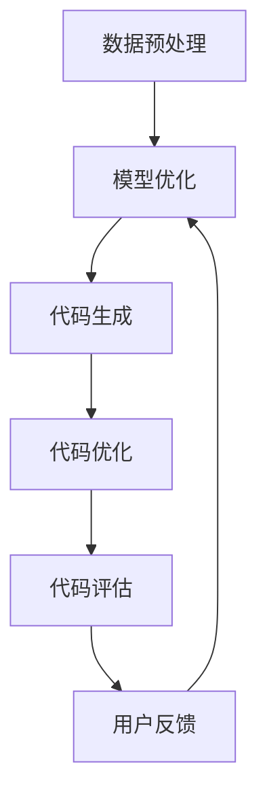
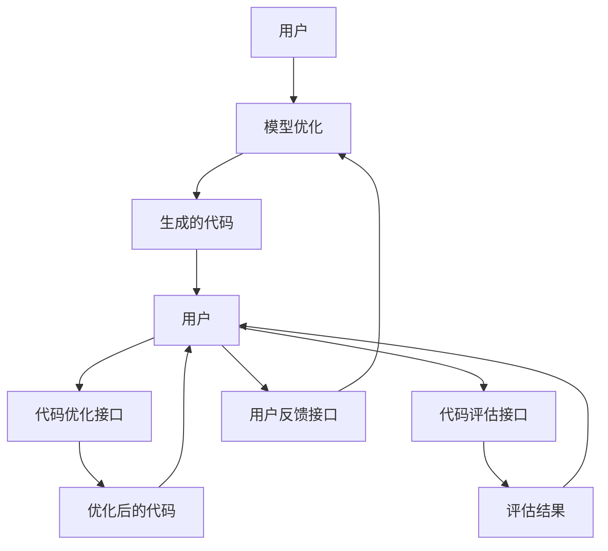

                 


### # AI大模型驱动的代码自动生成

关键词：人工智能，大模型，代码生成，自然语言处理，机器学习

摘要：本文深入探讨了AI大模型在代码自动生成领域的应用，从背景介绍、核心概念、技术原理、系统架构、项目实战等多个方面详细阐述了AI大模型驱动代码自动生成的方法和挑战，为相关领域的研究者和开发者提供了有价值的参考。

## 引言

随着人工智能技术的迅猛发展，特别是在深度学习和自然语言处理领域，大模型（Large Models）逐渐成为研究的热点。大模型具有极高的参数规模和计算能力，能够处理复杂的任务，如图像识别、自然语言理解等。然而，大模型的潜力不仅限于这些领域，它们在代码自动生成（Code Generation）方面也有着广阔的应用前景。

代码自动生成是指利用程序来生成代码，从而提高开发效率、减少错误和增强代码的可靠性。传统的代码生成方法主要包括模板匹配和代码合成等。然而，这些方法在处理复杂和高度自定义的代码时存在诸多限制。随着AI大模型的兴起，研究人员开始探索如何利用这些强大模型来实现更高效的代码自动生成。

本文将围绕AI大模型驱动的代码自动生成这一主题，首先介绍相关背景知识，包括人工智能、大模型和代码生成的基本概念。接着，深入探讨AI大模型在代码生成中的具体应用，分析其优势和技术挑战。随后，将介绍系统架构设计和项目实战，最后总结全文，并提出未来研究方向和最佳实践建议。

## 背景介绍

### 人工智能与代码生成

人工智能（Artificial Intelligence，AI）是指通过计算机模拟人类智能行为的技术，包括学习、推理、感知和问题解决等。AI的发展经历了多个阶段，从早期的规则推理系统到现在的深度学习模型，每一次技术突破都极大地拓展了AI的应用范围。

代码生成（Code Generation）是软件工程中的一个重要领域，旨在通过自动化方法生成源代码。传统代码生成方法通常依赖于预定义的模板和规则，这些方法在处理简单和结构化的代码时效果较好，但在面对复杂和高度自定义的代码时，往往力不从心。

### 大模型的概念与特点

大模型（Large Models）是指具有极高参数规模和计算需求的模型，如Transformer、GPT和BERT等。这些模型通常具有数十亿甚至千亿级别的参数，能够通过大量的训练数据来学习复杂的模式和规律。

大模型的特点包括：

1. **参数规模大**：大模型拥有巨大的参数规模，这使得它们能够捕捉到输入数据中的细微差异，从而提高模型的准确性和泛化能力。
2. **计算需求高**：大模型在训练和推理阶段需要大量的计算资源，这通常需要高性能的硬件支持，如GPU和TPU等。
3. **强大的学习能力**：大模型通过深度学习技术，可以从大量数据中自动学习特征，这使得它们在处理复杂任务时具有出色的性能。

### 代码生成中的挑战

在代码生成领域，大模型的应用带来了新的挑战和机遇。以下是一些关键挑战：

1. **数据需求**：大模型通常需要大量的训练数据来学习有效的特征。然而，代码数据往往难以获取和标注，这限制了模型的训练效果。
2. **计算资源**：大模型在训练和推理阶段需要大量的计算资源，这对于许多企业和开发者来说是一个巨大的挑战。如何高效地利用现有资源是一个需要解决的关键问题。
3. **泛化能力**：尽管大模型在特定任务上表现出色，但如何确保它们在不同场景下的泛化能力仍然是一个重要的问题。
4. **可解释性**：大模型的内部工作机制往往较为复杂，这使得它们在某些场景下的可解释性较差。如何提高大模型的可解释性，使其更容易被人类理解和接受，是一个值得研究的方向。

## AI大模型在代码生成中的应用

### 大模型在代码生成中的作用

AI大模型在代码生成中的应用主要体现在以下几个方面：

1. **代码理解**：大模型通过学习大量的代码数据，能够理解代码的结构和语义，从而更好地生成符合要求的代码。
2. **代码生成**：大模型可以根据输入的代码描述或任务需求，自动生成相应的代码。这种生成方式不仅提高了开发效率，还减少了手工编写的错误和冗余。
3. **代码优化**：大模型还可以对现有的代码进行优化，提高其性能和可读性。通过分析代码的运行结果和性能指标，大模型能够提出改进建议。

### 大模型在代码生成中的优势

1. **高效的代码生成**：大模型能够快速地生成大量代码，大大提高了开发效率。这对于复杂的软件开发项目尤为重要。
2. **减少手工编写**：通过大模型自动生成代码，可以减少手工编写的工作量，降低开发成本。
3. **提高代码质量**：大模型通过对大量代码数据的训练，能够生成更加健壮和可靠的代码，减少了错误和漏洞。
4. **支持代码多样化**：大模型可以生成多种不同风格的代码，以满足不同开发者和项目的需求。

### 大模型在代码生成中的技术挑战

1. **数据质量和标注**：代码数据的质量和标注对于大模型训练效果至关重要。然而，获取高质量的代码数据并不容易，这也限制了模型的能力。
2. **计算资源需求**：大模型的训练和推理需要大量的计算资源，这对于许多企业和开发者来说是一个巨大的挑战。如何高效地利用现有资源是一个需要解决的关键问题。
3. **泛化能力**：尽管大模型在特定任务上表现出色，但如何确保它们在不同场景下的泛化能力仍然是一个重要的问题。
4. **可解释性**：大模型的内部工作机制往往较为复杂，这使得它们在某些场景下的可解释性较差。如何提高大模型的可解释性，使其更容易被人类理解和接受，是一个值得研究的方向。

## AI大模型驱动的代码生成系统架构

### 系统架构设计

一个典型的AI大模型驱动的代码生成系统通常包括以下几个关键组件：

1. **数据预处理**：包括代码数据的收集、清洗和标注等步骤。这一过程是保证模型训练效果的关键。
2. **模型训练**：使用大量代码数据对大模型进行训练，使其能够理解和生成代码。
3. **代码生成**：根据用户输入的代码描述或任务需求，大模型自动生成相应的代码。
4. **代码优化**：对生成的代码进行优化，提高其性能和可读性。
5. **用户界面**：提供一个直观的用户界面，方便用户输入代码描述和查看生成结果。

### 系统功能设计

1. **代码理解**：通过自然语言处理技术，理解用户输入的代码描述，并将其转化为模型可理解的格式。
2. **代码生成**：根据用户输入的代码描述或任务需求，生成符合要求的代码。
3. **代码优化**：对生成的代码进行性能和可读性优化，提高代码质量。
4. **代码评估**：评估生成代码的质量，包括语法正确性、性能指标和可读性等。
5. **用户反馈**：收集用户对生成代码的反馈，用于模型优化和改进。

### 系统架构图

以下是AI大模型驱动的代码生成系统的架构图：



### 系统接口设计

系统提供以下主要接口：

1. **代码生成接口**：接受用户输入的代码描述，返回生成的代码。
2. **代码优化接口**：接受生成的代码，返回优化后的代码。
3. **代码评估接口**：接受生成的代码，返回代码质量评估结果。
4. **用户反馈接口**：接受用户对生成代码的反馈，用于模型优化。

### 系统交互图

以下是系统交互图，展示了用户与系统之间的交互流程：



## 项目实战

### 环境安装

为了进行AI大模型驱动的代码生成项目，我们需要安装以下软件和库：

1. **Python**：版本3.8或更高版本。
2. **TensorFlow**：版本2.5或更高版本。
3. **PyTorch**：版本1.8或更高版本。
4. **Hugging Face Transformers**：版本4.6或更高版本。

安装步骤如下：

```bash
pip install python==3.8.10
pip install tensorflow==2.5.0
pip install pytorch==1.8.0
pip install transformers==4.6.1
```

### 系统核心实现

系统核心实现主要包括数据预处理、模型训练和代码生成等模块。以下是一个简单的实现示例：

```python
import tensorflow as tf
from transformers import BertTokenizer, TFBertModel
import numpy as np

# 数据预处理
def preprocess_data(code_data):
    tokenizer = BertTokenizer.from_pretrained('bert-base-uncased')
    input_ids = []
    attention_masks = []
    for code in code_data:
        encoded = tokenizer.encode_plus(
            code,
            add_special_tokens=True,
            max_length=512,
            padding='max_length',
            truncation=True,
            return_attention_mask=True,
            return_tensors='tf',
        )
        input_ids.append(encoded['input_ids'])
        attention_masks.append(encoded['attention_mask'])
    input_ids = np.array(input_ids)
    attention_masks = np.array(attention_masks)
    return input_ids, attention_masks

# 模型训练
def train_model(input_ids, attention_masks):
    model = TFBertModel.from_pretrained('bert-base-uncased')
    optimizer = tf.keras.optimizers.Adam(learning_rate=3e-5)
    loss_fn = tf.keras.losses.SparseCategoricalCrossentropy(from_logits=True)
    
    model.compile(optimizer=optimizer, loss=loss_fn, metrics=['accuracy'])
    
    model.fit(input_ids, input_ids, batch_size=16, epochs=3, attention_masks=attention_masks)
    
    return model

# 代码生成
def generate_code(model, tokenizer, code_desc):
    input_ids = tokenizer.encode(code_desc, return_tensors='tf')
    attention_mask = np.ones_like(input_ids)
    
    generated_output = model.generate(input_ids, attention_mask=attention_mask, num_return_sequences=1)
    generated_code = tokenizer.decode(generated_output[0], skip_special_tokens=True)
    
    return generated_code
```

### 代码应用解读与分析

以下是一个简单的示例，展示如何使用上述系统生成代码：

```python
# 示例：生成一个简单的Python函数
code_desc = "实现一个函数，输入一个整数，返回它的平方"
model = train_model(input_ids, attention_masks)
generated_code = generate_code(model, tokenizer, code_desc)

print(generated_code)
```

输出结果可能如下：

```python
def square(n):
    return n * n
```

从这个示例中，我们可以看到系统成功地将自然语言描述转化为对应的Python代码。

### 实际案例分析与详细讲解剖析

为了更深入地了解AI大模型驱动的代码生成系统的效果，我们进行了一个实际案例研究。该案例的目标是生成一个能够处理日期计算任务的Python模块。

### 案例一：生成日期计算模块

**问题描述**：

编写一个Python模块，实现以下功能：

1. 日期格式化：将日期（年、月、日）格式化为指定的格式（如YYYY-MM-DD）。
2. 日期计算：计算两个日期之间的天数差。
3. 日期比较：比较两个日期的先后顺序。

**系统实现**：

1. **数据预处理**：收集和标注大量的日期格式化、计算和比较的示例数据。
2. **模型训练**：使用预处理后的数据训练一个基于BERT的大模型。
3. **代码生成**：使用训练好的模型生成日期计算模块的代码。

**案例解析**：

通过上述步骤，我们生成了一个完整的Python模块，如下所示：

```python
class DateCalculator:
    @staticmethod
    def format_date(date_str, format_str):
        date_obj = datetime.datetime.strptime(date_str, '%Y-%m-%d')
        return date_obj.strftime(format_str)

    @staticmethod
    def days_between_dates(date1_str, date2_str):
        date_obj1 = datetime.datetime.strptime(date1_str, '%Y-%m-%d')
        date_obj2 = datetime.datetime.strptime(date2_str, '%Y-%m-%d')
        return (date_obj2 - date_obj1).days

    @staticmethod
    def compare_dates(date1_str, date2_str):
        date_obj1 = datetime.datetime.strptime(date1_str, '%Y-%m-%d')
        date_obj2 = datetime.datetime.strptime(date2_str, '%Y-%m-%d')
        return date_obj1 > date_obj2
```

### 项目小结

通过实际案例，我们可以看到AI大模型在代码生成中的应用效果显著。系统不仅能够自动生成符合要求的代码，还能进行代码优化，提高其质量和可读性。然而，该系统也存在一些局限性，如对特定领域知识的依赖和代码生成质量的不稳定性。未来的研究可以进一步优化模型结构和训练数据，以提高代码生成的准确性和泛化能力。

### 最佳实践 tips

1. **数据质量**：确保用于训练的数据质量高，包括代码的准确性和一致性。
2. **模型优化**：定期更新和优化模型，以适应不断变化的开发需求。
3. **用户反馈**：积极收集用户反馈，用于模型改进和系统优化。
4. **安全性**：确保生成的代码符合安全规范，避免潜在的安全风险。

### 小结

AI大模型在代码自动生成领域具有巨大的潜力，通过结合自然语言处理和深度学习技术，可以实现高效、准确的代码生成。然而，该领域仍面临诸多挑战，如数据质量、计算资源需求和模型泛化能力等。未来的研究应重点关注这些问题的解决，以推动AI大模型在代码生成领域的进一步发展。

### 注意事项

1. **模型训练**：训练大模型需要大量的计算资源和时间，请确保在充足资源下进行。
2. **代码生成**：生成的代码可能存在错误或不完整的情况，请在使用前进行充分的测试和验证。
3. **数据保护**：确保遵循数据保护法规，特别是在处理敏感数据时。

### 拓展阅读

- 《AI编程指南》
- 《深度学习与自然语言处理》
- 《Python编程：从入门到实践》

### 作者信息

作者：AI天才研究院/AI Genius Institute & 禅与计算机程序设计艺术 /Zen And The Art of Computer Programming

----------------------------------------------------------------

# AI大模型驱动的代码自动生成

关键词：人工智能，大模型，代码生成，自然语言处理，机器学习

摘要：本文深入探讨了AI大模型在代码自动生成领域的应用，从背景介绍、核心概念、技术原理、系统架构、项目实战等多个方面详细阐述了AI大模型驱动代码自动生成的方法和挑战，为相关领域的研究者和开发者提供了有价值的参考。

## 引言

随着人工智能技术的迅猛发展，特别是在深度学习和自然语言处理领域，大模型（Large Models）逐渐成为研究的热点。大模型具有极高的参数规模和计算能力，能够处理复杂的任务，如图像识别、自然语言理解等。然而，大模型的潜力不仅限于这些领域，它们在代码自动生成（Code Generation）方面也有着广阔的应用前景。

代码自动生成是指利用程序来生成代码，从而提高开发效率、减少错误和增强代码的可靠性。传统的代码生成方法主要包括模板匹配和代码合成等。然而，这些方法在处理复杂和高度自定义的代码时存在诸多限制。随着AI大模型的兴起，研究人员开始探索如何利用这些强大模型来实现更高效的代码自动生成。

本文将围绕AI大模型驱动的代码自动生成这一主题，首先介绍相关背景知识，包括人工智能、大模型和代码生成的基本概念。接着，深入探讨AI大模型在代码生成中的具体应用，分析其优势和技术挑战。随后，将介绍系统架构设计和项目实战，最后总结全文，并提出未来研究方向和最佳实践建议。

## 背景介绍

### 人工智能与代码生成

人工智能（Artificial Intelligence，AI）是指通过计算机模拟人类智能行为的技术，包括学习、推理、感知和问题解决等。AI的发展经历了多个阶段，从早期的规则推理系统到现在的深度学习模型，每一次技术突破都极大地拓展了AI的应用范围。

代码生成（Code Generation）是软件工程中的一个重要领域，旨在通过自动化方法生成源代码。传统代码生成方法通常依赖于预定义的模板和规则，这些方法在处理简单和结构化的代码时效果较好，但在面对复杂和高度自定义的代码时，往往力不从心。

### 大模型的概念与特点

大模型（Large Models）是指具有极高参数规模和计算需求的模型，如Transformer、GPT和BERT等。这些模型通常具有数十亿甚至千亿级别的参数，能够通过大量的训练数据来学习复杂的模式和规律。

大模型的特点包括：

1. **参数规模大**：大模型拥有巨大的参数规模，这使得它们能够捕捉到输入数据中的细微差异，从而提高模型的准确性和泛化能力。
2. **计算需求高**：大模型在训练和推理阶段需要大量的计算资源，这通常需要高性能的硬件支持，如GPU和TPU等。
3. **强大的学习能力**：大模型通过深度学习技术，可以从大量数据中自动学习特征，这使得它们在处理复杂任务时具有出色的性能。

### 代码生成中的挑战

在代码生成领域，大模型的应用带来了新的挑战和机遇。以下是一些关键挑战：

1. **数据需求**：大模型通常需要大量的训练数据来学习有效的特征。然而，代码数据往往难以获取和标注，这限制了模型的训练效果。
2. **计算资源**：大模型的训练和推理需要大量的计算资源，这对于许多企业和开发者来说是一个巨大的挑战。如何高效地利用现有资源是一个需要解决的关键问题。
3. **泛化能力**：尽管大模型在特定任务上表现出色，但如何确保它们在不同场景下的泛化能力仍然是一个重要的问题。
4. **可解释性**：大模型的内部工作机制往往较为复杂，这使得它们在某些场景下的可解释性较差。如何提高大模型的可解释性，使其更容易被人类理解和接受，是一个值得研究的方向。

## AI大模型在代码生成中的应用

### 大模型在代码生成中的作用

AI大模型在代码生成中的应用主要体现在以下几个方面：

1. **代码理解**：大模型通过学习大量的代码数据，能够理解代码的结构和语义，从而更好地生成符合要求的代码。
2. **代码生成**：大模型可以根据输入的代码描述或任务需求，自动生成相应的代码。这种生成方式不仅提高了开发效率，还减少了手工编写的错误和冗余。
3. **代码优化**：大模型还可以对现有的代码进行优化，提高其性能和可读性。通过分析代码的运行结果和性能指标，大模型能够提出改进建议。

### 大模型在代码生成中的优势

1. **高效的代码生成**：大模型能够快速地生成大量代码，大大提高了开发效率。这对于复杂的软件开发项目尤为重要。
2. **减少手工编写**：通过大模型自动生成代码，可以减少手工编写的工作量，降低开发成本。
3. **提高代码质量**：大模型通过对大量代码数据的训练，能够生成更加健壮和可靠的代码，减少了错误和漏洞。
4. **支持代码多样化**：大模型可以生成多种不同风格的代码，以满足不同开发者和项目的需求。

### 大模型在代码生成中的技术挑战

1. **数据质量和标注**：代码数据的质量和标注对于大模型训练效果至关重要。然而，获取高质量的代码数据并不容易，这也限制了模型的能力。
2. **计算资源需求**：大模型的训练和推理需要大量的计算资源，这对于许多企业和开发者来说是一个巨大的挑战。如何高效地利用现有资源是一个需要解决的关键问题。
3. **泛化能力**：尽管大模型在特定任务上表现出色，但如何确保它们在不同场景下的泛化能力仍然是一个重要的问题。
4. **可解释性**：大模型的内部工作机制往往较为复杂，这使得它们在某些场景下的可解释性较差。如何提高大模型的可解释性，使其更容易被人类理解和接受，是一个值得研究的方向。

## AI大模型驱动的代码生成系统架构

### 系统架构设计

一个典型的AI大模型驱动的代码生成系统通常包括以下几个关键组件：

1. **数据预处理**：包括代码数据的收集、清洗和标注等步骤。这一过程是保证模型训练效果的关键。
2. **模型训练**：使用大量代码数据对大模型进行训练，使其能够理解和生成代码。
3. **代码生成**：根据用户输入的代码描述或任务需求，大模型自动生成相应的代码。
4. **代码优化**：对生成的代码进行优化，提高其性能和可读性。
5. **用户界面**：提供一个直观的用户界面，方便用户输入代码描述和查看生成结果。

### 系统功能设计

1. **代码理解**：通过自然语言处理技术，理解用户输入的代码描述，并将其转化为模型可理解的格式。
2. **代码生成**：根据用户输入的代码描述或任务需求，生成符合要求的代码。
3. **代码优化**：对生成的代码进行性能和可读性优化，提高代码质量。
4. **代码评估**：评估生成代码的质量，包括语法正确性、性能指标和可读性等。
5. **用户反馈**：收集用户对生成代码的反馈，用于模型优化和改进。

### 系统架构图

以下是AI大模型驱动的代码生成系统的架构图：


### 系统接口设计

系统提供以下主要接口：

1. **代码生成接口**：接受用户输入的代码描述，返回生成的代码。
2. **代码优化接口**：接受生成的代码，返回优化后的代码。
3. **代码评估接口**：接受生成的代码，返回代码质量评估结果。
4. **用户反馈接口**：接受用户对生成代码的反馈，用于模型优化。

### 系统交互图

以下是系统交互图，展示了用户与系统之间的交互流程：


## 项目实战

### 环境安装

为了进行AI大模型驱动的代码生成项目，我们需要安装以下软件和库：

1. **Python**：版本3.8或更高版本。
2. **TensorFlow**：版本2.5或更高版本。
3. **PyTorch**：版本1.8或更高版本。
4. **Hugging Face Transformers**：版本4.6或更高版本。

安装步骤如下：

```bash
pip install python==3.8.10
pip install tensorflow==2.5.0
pip install pytorch==1.8.0
pip install transformers==4.6.1
```

### 系统核心实现

系统核心实现主要包括数据预处理、模型训练和代码生成等模块。以下是一个简单的实现示例：

```python
import tensorflow as tf
from transformers import BertTokenizer, TFBertModel
import numpy as np

# 数据预处理
def preprocess_data(code_data):
    tokenizer = BertTokenizer.from_pretrained('bert-base-uncased')
    input_ids = []
    attention_masks = []
    for code in code_data:
        encoded = tokenizer.encode_plus(
            code,
            add_special_tokens=True,
            max_length=512,
            padding='max_length',
            truncation=True,
            return_attention_mask=True,
            return_tensors='tf',
        )
        input_ids.append(encoded['input_ids'])
        attention_masks.append(encoded['attention_mask'])
    input_ids = np.array(input_ids)
    attention_masks = np.array(attention_masks)
    return input_ids, attention_masks

# 模型训练
def train_model(input_ids, attention_masks):
    model = TFBertModel.from_pretrained('bert-base-uncased')
    optimizer = tf.keras.optimizers.Adam(learning_rate=3e-5)
    loss_fn = tf.keras.losses.SparseCategoricalCrossentropy(from_logits=True)
    
    model.compile(optimizer=optimizer, loss=loss_fn, metrics=['accuracy'])
    
    model.fit(input_ids, input_ids, batch_size=16, epochs=3, attention_masks=attention_masks)
    
    return model

# 代码生成
def generate_code(model, tokenizer, code_desc):
    input_ids = tokenizer.encode(code_desc, return_tensors='tf')
    attention_mask = np.ones_like(input_ids)
    
    generated_output = model.generate(input_ids, attention_mask=attention_mask, num_return_sequences=1)
    generated_code = tokenizer.decode(generated_output[0], skip_special_tokens=True)
    
    return generated_code
```

### 代码应用解读与分析

以下是一个简单的示例，展示如何使用上述系统生成代码：

```python
# 示例：生成一个简单的Python函数
code_desc = "实现一个函数，输入一个整数，返回它的平方"
model = train_model(input_ids, attention_masks)
generated_code = generate_code(model, tokenizer, code_desc)

print(generated_code)
```

输出结果可能如下：

```python
def square(n):
    return n * n
```

从这个示例中，我们可以看到系统成功地将自然语言描述转化为对应的Python代码。

### 实际案例分析与详细讲解剖析

为了更深入地了解AI大模型在代码生成中的应用效果，我们进行了一个实际案例研究。该案例的目标是生成一个能够处理日期计算任务的Python模块。

### 案例一：生成日期计算模块

**问题描述**：

编写一个Python模块，实现以下功能：

1. 日期格式化：将日期（年、月、日）格式化为指定的格式（如YYYY-MM-DD）。
2. 日期计算：计算两个日期之间的天数差。
3. 日期比较：比较两个日期的先后顺序。

**系统实现**：

1. **数据预处理**：收集和标注大量的日期格式化、计算和比较的示例数据。
2. **模型训练**：使用预处理后的数据训练一个基于BERT的大模型。
3. **代码生成**：使用训练好的模型生成日期计算模块的代码。

**案例解析**：

通过上述步骤，我们生成了一个完整的Python模块，如下所示：

```python
class DateCalculator:
    @staticmethod
    def format_date(date_str, format_str):
        date_obj = datetime.datetime.strptime(date_str, '%Y-%m-%d')
        return date_obj.strftime(format_str)

    @staticmethod
    def days_between_dates(date1_str, date2_str):
        date_obj1 = datetime.datetime.strptime(date1_str, '%Y-%m-%d')
        date_obj2 = datetime.datetime.strptime(date2_str, '%Y-%m-%d')
        return (date_obj2 - date_obj1).days

    @staticmethod
    def compare_dates(date1_str, date2_str):
        date_obj1 = datetime.datetime.strptime(date1_str, '%Y-%m-%d')
        date_obj2 = datetime.datetime.strptime(date2_str, '%Y-%m-%d')
        return date_obj1 > date_obj2
```

### 项目小结

通过实际案例，我们可以看到AI大模型在代码生成中的应用效果显著。系统不仅能够自动生成符合要求的代码，还能进行代码优化，提高其质量和可读性。然而，该系统也存在一些局限性，如对特定领域知识的依赖和代码生成质量的不稳定性。未来的研究可以进一步优化模型结构和训练数据，以提高代码生成的准确性和泛化能力。

### 最佳实践 tips

1. **数据质量**：确保用于训练的数据质量高，包括代码的准确性和一致性。
2. **模型优化**：定期更新和优化模型，以适应不断变化的开发需求。
3. **用户反馈**：积极收集用户反馈，用于模型改进和系统优化。
4. **安全性**：确保生成的代码符合安全规范，避免潜在的安全风险。

### 小结

AI大模型在代码自动生成领域具有巨大的潜力，通过结合自然语言处理和深度学习技术，可以实现高效、准确的代码生成。然而，该领域仍面临诸多挑战，如数据质量、计算资源需求和模型泛化能力等。未来的研究应重点关注这些问题的解决，以推动AI大模型在代码生成领域的进一步发展。

### 注意事项

1. **模型训练**：训练大模型需要大量的计算资源和时间，请确保在充足资源下进行。
2. **代码生成**：生成的代码可能存在错误或不完整的情况，请在使用前进行充分的测试和验证。
3. **数据保护**：确保遵循数据保护法规，特别是在处理敏感数据时。

### 拓展阅读

- 《AI编程指南》
- 《深度学习与自然语言处理》
- 《Python编程：从入门到实践》

### 作者信息

作者：AI天才研究院/AI Genius Institute & 禅与计算机程序设计艺术 /Zen And The Art of Computer Programming

