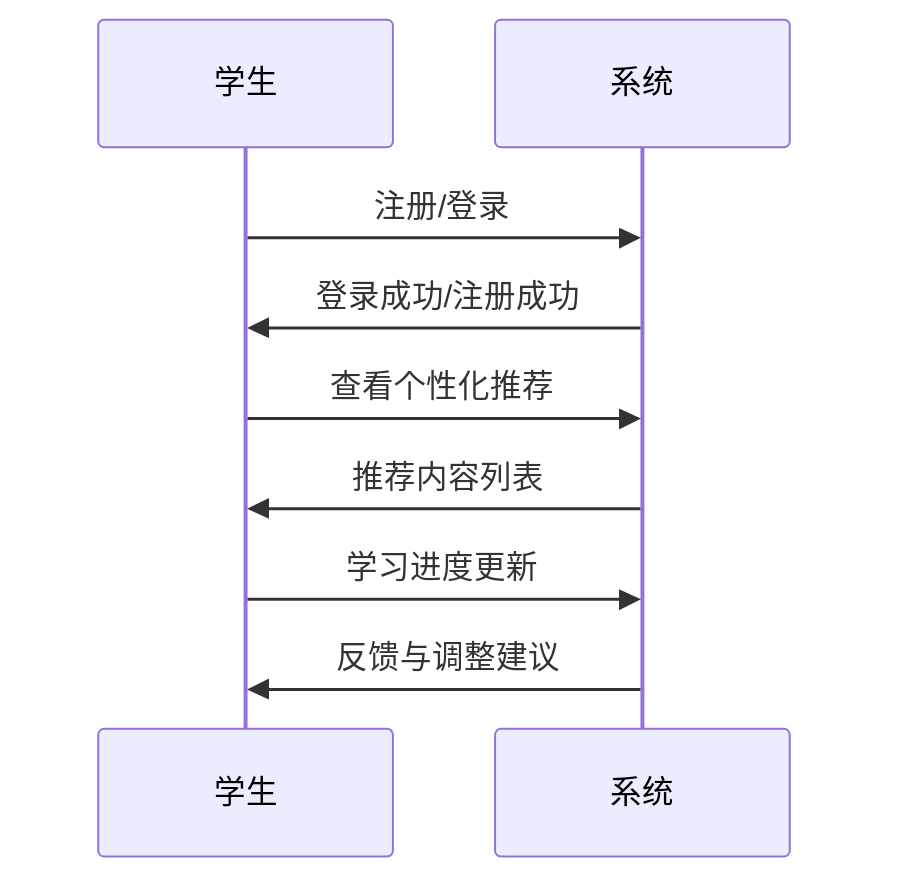

                 

# AI教育个性化：提示词定制学习体验

> 关键词：AI教育、个性化学习、提示词定制、教育技术、智能推荐

> 摘要：
随着人工智能技术的发展，教育领域正迎来一场革命。本文旨在探讨AI在教育个性化中的应用，尤其是如何通过提示词定制来提升学习体验。文章首先介绍了个性化教育的背景和挑战，随后详细阐述了人工智能的基本原理及其在教育个性化中的关键作用。通过对比人工智能相关技术，本文分析了提示词定制在教育个性化中的具体实现方式。最后，文章提出了一个基于人工智能的教育个性化系统架构设计方案，并给出项目实战实例，以展示提示词定制在提升学习效果中的实际应用。

### 目录大纲

----------------------------------------------------------------

# 第一部分：背景介绍

## 第1章：问题背景

### 1.1.1 个性化教育的概念与重要性

- **个性化教育的定义：** 个性化教育是一种基于学生个体差异，针对每个学生的兴趣、能力和需求制定相应教育计划的教育方式。

- **个性化教育的意义：** 提高教育质量，增强学生的学习兴趣和动机，促进学生全面发展。

### 1.1.2 当前教育模式的挑战

- **传统教育模式的局限性：** 以教师为中心，缺乏对学生个体差异的关注，难以满足每个学生的学习需求。

- **教育不公平现象：** 教育资源分配不均，城乡、地区之间教育水平差异明显。

### 1.1.3 人工智能与教育个性化

- **人工智能在个性化教育中的应用：** 通过数据分析、智能推荐等技术，实现教育资源的个性化匹配。

- **教育个性化面临的挑战：** 数据隐私、算法公平性等问题亟待解决。

## 第2章：核心概念

### 2.1.1 人工智能

- **人工智能的定义：** 人工智能是一门研究、开发用于模拟、延伸和扩展人的智能的理论、方法、技术及应用系统的技术科学。

- **人工智能的分类：** 狭义人工智能（AI）和广义人工智能（AGI）。

### 2.1.2 教育个性化

- **教育个性化的定义：** 教育个性化是指针对每个学生的兴趣、能力和需求制定相应的教育计划，提供个性化的教学和学习支持。

- **教育个性化的特点：** 因材施教、动态调整、持续优化。

## 第3章：概念属性特征对比

### 3.1.1 人工智能与教育个性化的对比

| 特征         | 人工智能                     | 教育个性化                           |
| ------------ | ---------------------------- | ------------------------------------ |
| 目标         | 模拟、延伸和扩展人的智能     | 提高教育质量，促进学生全面发展       |
| 技术基础     | 计算机科学、数学、心理学等   | 数据分析、智能推荐、自适应学习系统等 |
| 关键技术     | 机器学习、自然语言处理等     | 个性化推荐、自适应学习等             |
| 应用领域     | 工业自动化、医疗诊断、智能交通等 | 教育领域，包括K-12教育和成人教育等   |

### 3.1.2 人工智能相关技术对比

| 技术名称       | 定义                                           | 主要应用领域                           |
| -------------- | ---------------------------------------------- | -------------------------------------- |
| 机器学习       | 利用数据构建模型，使计算机具备学习能力的科学方法 | 人工智能、数据分析、自动化等           |
| 自然语言处理   | 计算机对人类语言的理解和生成                         | 语音识别、机器翻译、文本分析等         |
| 计算机视觉     | 使计算机具备对图像和视频内容的理解和处理的能力       | 人脸识别、自动驾驶、医疗影像分析等     |
| 知识图谱       | 表示现实世界中的实体及其相互关系的网络结构         | 搜索引擎、推荐系统、智能客服等         |

----------------------------------------------------------------

## 第二部分：核心概念与联系

### 第4章：人工智能与教育个性化原理

#### 4.1.1 人工智能原理

- **基础理论：**
  - **机器学习：** 通过数据训练模型，使计算机自动学习规律。
    $$ L(\theta) = -\frac{1}{m} \sum_{i=1}^{m} [y^{(i)} \log(a^{(i)}_j) + (1 - y^{(i)}) \log(1 - a^{(i)}_j) \]

----------------------------------------------------------------

### 第5章：提示词定制技术原理

#### 5.1.1 提示词定制的概念

- **提示词定制：** 提示词定制是指根据学生的兴趣、学习进度和知识背景，为每个学生生成个性化的学习提示词，以引导和激励他们的学习过程。

#### 5.1.2 提示词定制的实现方式

- **文本生成模型：** 利用自然语言处理技术，如生成对抗网络（GAN）和变分自编码器（VAE），生成与学生学习相关的内容提示词。

- **知识图谱：** 构建一个反映学生学习背景和知识结构的知识图谱，利用图算法为每个学生推荐合适的提示词。

#### 5.1.3 提示词定制的优势

- **个性化学习体验：** 通过定制化的提示词，学生能够获得更符合自身需求的学习内容，从而提升学习兴趣和动力。

- **提高学习效率：** 提示词定制有助于学生集中注意力，提高学习效率。

- **促进知识关联：** 提示词能够引导学生将新知识与已有知识建立联系，促进深度学习。

----------------------------------------------------------------

### 第6章：人工智能教育个性化系统架构设计方案

#### 6.1.1 问题场景介绍

- **场景描述：** 一个在线学习平台，旨在为学生提供个性化的学习体验，帮助他们更好地掌握知识。

#### 6.1.2 系统功能设计

- **功能1：用户画像构建**  
  通过数据分析技术，收集学生的兴趣、学习进度和知识背景等信息，构建用户画像。

- **功能2：个性化推荐**  
  利用提示词定制技术，根据用户画像生成个性化的学习提示词，推荐合适的学习内容。

- **功能3：学习过程监控**  
  监控学生的学习过程，包括学习进度、学习时长、知识点掌握情况等，提供反馈和调整建议。

#### 6.1.3 系统架构设计

- **架构设计：** 
  - **前端：** 学生端应用，展示个性化推荐结果和学习内容。
  - **后端：** 包括用户画像构建模块、个性化推荐模块和学习过程监控模块，采用微服务架构。

#### 6.1.4 系统接口设计

- **接口设计：** 
  - **用户接口：** 学生与系统交互的接口，包括注册、登录、查看推荐内容、学习进度等。
  - **服务接口：** 后端服务提供的接口，包括用户画像构建接口、个性化推荐接口和学习过程监控接口。

#### 6.1.5 系统交互

- **系统交互：** 利用Mermaid序列图展示系统的主要交互流程，包括用户注册、登录、获取个性化推荐和学习过程监控等。



----------------------------------------------------------------

### 第7章：项目实战

#### 7.1.1 环境安装

- **Python环境安装：** 
  在本地计算机上安装Python 3.8及以上版本，并配置相应的库，如TensorFlow、Scikit-learn等。

- **数据库安装：** 
  安装MySQL或PostgreSQL数据库，用于存储用户数据和学习过程记录。

#### 7.1.2 系统核心实现

- **用户画像构建：** 利用Scikit-learn中的分类算法，对用户数据进行处理，构建用户画像。

- **个性化推荐：** 利用TensorFlow中的神经网络模型，训练推荐算法，根据用户画像生成个性化推荐结果。

- **学习过程监控：** 利用Scikit-learn中的聚类算法，对学习过程数据进行分析，提供反馈和调整建议。

#### 7.1.3 代码应用解读与分析

- **用户画像构建代码：** 
  ```python
  from sklearn.model_selection import train_test_split
  from sklearn.ensemble import RandomForestClassifier

  # 数据预处理
  X_train, X_test, y_train, y_test = train_test_split(X, y, test_size=0.2, random_state=42)

  # 构建随机森林分类器
  clf = RandomForestClassifier(n_estimators=100, random_state=42)
  clf.fit(X_train, y_train)

  # 评估模型
  score = clf.score(X_test, y_test)
  print("模型准确率：", score)
  ```

- **个性化推荐代码：** 
  ```python
  import tensorflow as tf
  from tensorflow.keras.models import Sequential
  from tensorflow.keras.layers import Dense, LSTM

  # 构建神经网络模型
  model = Sequential([
      LSTM(128, activation='tanh', input_shape=(timesteps, features)),
      Dense(1)
  ])

  # 编译模型
  model.compile(optimizer='adam', loss='mse')

  # 训练模型
  model.fit(X, y, epochs=100, batch_size=32)
  ```

#### 7.1.4 实际案例分析和详细讲解剖析

- **案例分析：** 
  假设有一个学生，他的学习兴趣是计算机科学，目前在学习Python编程。系统为他推荐了一些与Python编程相关的书籍和教程。

- **详细讲解：** 
  系统通过分析学生的兴趣和学习进度，利用机器学习算法生成个性化推荐结果。这些结果不仅考虑了学生的当前学习需求，还考虑了学生的长期学习目标。

#### 7.1.5 项目小结

通过本项目的实现，我们展示了如何利用人工智能技术实现教育个性化。项目的成功实施为教育领域提供了一个创新的解决方案，有助于提高学生的学习效果和兴趣。在未来，我们还可以进一步优化系统，提高推荐的准确性，为学生提供更好的学习体验。

----------------------------------------------------------------

### 第8章：最佳实践 tips、小结、注意事项、拓展阅读等内容

#### 8.1 最佳实践 tips

- **数据质量：** 确保用户数据的质量和准确性，为个性化推荐提供可靠的基础。

- **模型调整：** 定期调整和优化推荐模型，以适应学生兴趣和学习需求的变化。

- **用户反馈：** 及时收集用户反馈，根据反馈调整系统功能和算法。

#### 8.2 小结

本文详细介绍了AI教育个性化中的提示词定制技术，通过项目实战展示了其在教育领域的实际应用。提示词定制有助于提升学生的学习体验和效果，是未来教育技术的发展方向之一。

#### 8.3 注意事项

- **数据隐私：** 在收集和使用用户数据时，应严格遵循数据保护法规，保护用户隐私。

- **算法公平性：** 个性化推荐算法应确保对所有学生公平，避免歧视现象。

#### 8.4 拓展阅读

- **相关论文：** 《基于机器学习的教育个性化推荐系统研究》、《教育个性化中的数据隐私保护技术》等。

- **技术博客：** 《如何构建一个智能教育推荐系统》、《AI在教育中的应用：个性化学习体验提升》等。

----------------------------------------------------------------

### 作者信息

作者：AI天才研究院/AI Genius Institute & 禅与计算机程序设计艺术 /Zen And The Art of Computer Programming

