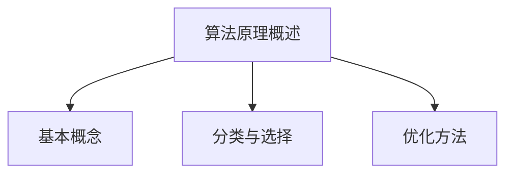
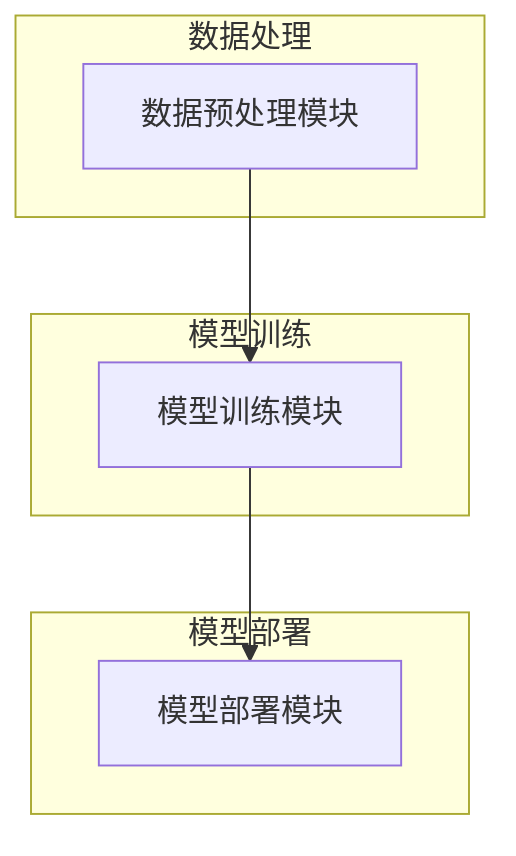

                 

**文章标题：AI时代的编程语言创新之路**

关键词：AI、编程语言、创新、算法原理、数学模型、系统架构、项目实战

摘要：本文深入探讨了AI时代编程语言的创新之路，分析了AI时代的编程语言特点，探讨了核心概念、算法原理和数学模型，并提出了系统架构设计和项目实战案例。通过本文的详细讲解，读者将更好地理解AI时代编程语言创新的本质和实际应用。

## 引言与背景

在过去的几十年里，计算机编程语言经历了巨大的变革和发展。从早期的机器语言和汇编语言，到高级编程语言如C、C++、Java、Python等，编程语言的发展极大地推动了计算机科学和软件工程的发展。然而，随着人工智能（AI）时代的到来，传统的编程语言面临着新的挑战和机遇。

### AI时代的崛起

AI时代的崛起不仅改变了我们的生活方式，也对编程语言提出了新的要求。传统的编程语言在处理复杂的AI任务时，往往显得力不从心。例如，深度学习模型的训练和优化需要大量的计算资源和高效的算法。此外，AI算法的复杂性和多样性也要求编程语言能够灵活地适应不同的应用场景。

### 编程语言面临的挑战

AI时代的编程语言面临着以下几个挑战：

1. **性能需求**：AI算法通常需要高效的执行速度，这要求编程语言提供更高效的执行引擎和编译器。
2. **算法复杂性**：AI算法通常涉及复杂的数学运算和数据结构，编程语言需要提供强大的数学和图形处理能力。
3. **可扩展性**：AI应用场景的多样性要求编程语言具有良好的可扩展性，以便快速适应新的需求。
4. **互操作性**：AI应用往往需要与其他系统和服务进行集成，编程语言需要支持跨平台和跨语言的互操作性。

### 创新之路的必要性

为了应对AI时代的挑战，编程语言创新变得至关重要。创新不仅能够提高编程语言的处理效率和灵活性，还能够推动计算机科学和软件工程的发展。编程语言创新的主要方向包括：

1. **新算法的支持**：引入新的算法和优化技术，以提高编程语言的性能。
2. **数学和图形处理能力的增强**：提供更强大的数学和图形处理库，以支持复杂的AI任务。
3. **可扩展性和互操作性的提升**：通过模块化和标准化，提高编程语言的可扩展性和互操作性。
4. **用户体验的优化**：通过提供更简洁、易用的语法和工具，提高开发者的工作效率。

## 核心概念

### 编程语言的定义

编程语言是一种用于编写计算机程序的语法和语义规则。它提供了一种抽象的表示方式，使得程序员能够以更高效、更易于理解的方式与计算机进行交互。

### 编程语言的核心要素

编程语言的核心要素包括：

1. **语法**：定义了编程语言的书写规则，如关键字、标识符、注释等。
2. **语义**：定义了编程语句的含义和执行过程，如变量赋值、条件判断、循环等。
3. **库和框架**：提供了一系列预编译的代码和工具，以简化开发过程和提高代码复用性。
4. **编译器和解释器**：将编程语言代码转换为计算机能够理解和执行的机器语言。

### AI与编程语言的关系

AI与编程语言有着紧密的联系。AI算法通常需要编程语言来实现。编程语言为AI算法提供了实现平台，而AI算法的创新又推动了编程语言的不断发展。例如，Python和R等编程语言因其强大的数学和数据处理能力，成为AI开发的首选语言。

## 创新概述

### AI时代的编程语言特点

AI时代的编程语言具有以下几个特点：

1. **高效性**：提供高效的算法和执行引擎，以满足AI任务的高性能需求。
2. **灵活性**：支持灵活的编程模式和开发工具，以适应多样化的AI应用场景。
3. **扩展性**：支持模块化和插件系统，以提高编程语言的可扩展性。
4. **互操作性**：支持与其他编程语言和系统的无缝集成，以实现跨平台和跨语言的开发。

### 编程语言创新的主要方向

编程语言创新的主要方向包括：

1. **新算法的支持**：引入新的算法和优化技术，以提高编程语言的性能。
2. **数学和图形处理能力的增强**：提供更强大的数学和图形处理库，以支持复杂的AI任务。
3. **可扩展性和互操作性的提升**：通过模块化和标准化，提高编程语言的可扩展性和互操作性。
4. **用户体验的优化**：通过提供更简洁、易用的语法和工具，提高开发者的工作效率。

### 创新之路的关键要素

创新之路的关键要素包括：

1. **技术创新**：引入新的编程语言特性和工具，以提高编程语言的性能和灵活性。
2. **社区合作**：鼓励开发者参与编程语言的创新和改进，以提高社区协作和开源生态的发展。
3. **教育推广**：通过教育和培训，提高开发者的编程技能和对AI时代编程语言的理解。
4. **标准化**：推动编程语言的标准化，以提高编程语言的互操作性和兼容性。

## 本书结构

### 各章节内容概述

- **第一部分：引言与背景**：介绍AI时代的编程语言创新背景和核心概念。
- **第二部分：编程语言创新的核心概念**：深入探讨AI与编程语言的关系，分析编程语言创新的主要方向和关键要素。
- **第三部分：编程语言创新的算法原理**：讲解编程语言创新中的算法原理和数学模型。
- **第四部分：编程语言创新的数学模型**：详细解释编程语言创新中涉及的数学模型和公式。
- **第五部分：系统分析与架构设计**：分析编程语言创新的系统架构和设计，包括功能设计、系统架构和接口设计。
- **第六部分：项目实战**：通过实际项目展示编程语言创新的应用。
- **第七部分：最佳实践与拓展**：总结编程语言创新的最佳实践，提供拓展阅读资源。

### 阅读建议

- **循序渐进**：建议读者按照章节顺序阅读，以便更好地理解编程语言创新的本质。
- **动手实践**：在阅读过程中，尝试动手实践，以加深对编程语言创新的理解。
- **持续学习**：编程语言创新是一个不断发展的领域，建议读者保持持续学习的态度，跟进最新的技术动态。

## 核心概念与联系

### AI基础

AI是一门涉及计算机科学、数学、统计学和神经科学等多个领域的交叉学科。它致力于开发能够模拟人类智能的算法和技术。AI的基础包括：

- **机器学习**：一种通过数据驱动的方式学习规律和模式的方法，包括监督学习、无监督学习和强化学习等。
- **深度学习**：一种基于人工神经网络的机器学习方法，通过多层神经网络的训练，实现复杂的特征提取和分类任务。
- **自然语言处理**：一种使计算机能够理解和处理自然语言的技术，包括语言识别、语义分析和文本生成等。

### 编程语言基础

编程语言是一种用于编写计算机程序的语言。它包括：

- **语法**：定义了编程语言的书写规则，如关键字、标识符、注释等。
- **语义**：定义了编程语句的含义和执行过程，如变量赋值、条件判断、循环等。
- **编译器和解释器**：将编程语言代码转换为计算机能够理解和执行的机器语言。

### AI与编程语言融合

AI与编程语言的融合体现在：

- **算法实现**：使用编程语言实现AI算法，如机器学习模型、深度学习网络等。
- **编程语言扩展**：为编程语言添加AI相关的库和工具，如Python的Scikit-learn、TensorFlow等。
- **开发流程优化**：利用AI技术优化软件开发流程，如代码审查、自动测试等。

### 核心概念联系

AI与编程语言的核心概念联系可以通过以下方式体现：

- **数据驱动**：编程语言提供数据处理能力，为AI算法提供数据输入和输出。
- **算法优化**：编程语言提供算法实现和优化的支持，为AI算法的效率提升提供基础。
- **开发效率**：编程语言提供简洁、易用的语法和工具，提高开发者的工作效率。

### 概念属性特征对比

| 概念 | 属性特征 |
| --- | --- |
| AI | 数据驱动、自主决策、模拟人类智能 |
| 编程语言 | 语法、语义、编译器、解释器 |
| AI与编程语言融合 | 算法实现、编程语言扩展、开发流程优化 |

### ER实体关系图架构

```mermaid
erDiagram
    AI|--|> 编程语言
    编程语言 ||--o{ AI与编程语言融合
```

## 算法原理

### 算法原理概述

算法原理在编程语言创新中扮演着核心角色。它不仅决定了编程语言的性能和效率，还影响了AI算法的实现和应用。本节将介绍算法原理的基本概念、分类和选择，以及算法优化的方法。

### 算法原理的mermaid流程图



### Python源代码实现

```python
# 基本概念
def algorithm_fundamentals():
    print("算法原理的基本概念包括：")
    print("1. 输入和输出")
    print("2. 步骤和顺序")
    print("3. 逻辑和决策")

# 分类与选择
def algorithm_classification():
    print("算法原理的分类包括：")
    print("1. 排序算法")
    print("2. 搜索算法")
    print("3. 图算法")

# 优化方法
def algorithm_optimization():
    print("算法优化的方法包括：")
    print("1. 分而治之")
    print("2. 动态规划")
    print("3. 贪心算法")
```

### 数学模型与公式

算法原理通常涉及数学模型和公式。以下是一个简单的线性回归模型的数学模型和公式：

$$
y = w_0 + w_1 \cdot x + \epsilon
$$

其中，$y$ 是预测值，$x$ 是输入值，$w_0$ 和 $w_1$ 是权重，$\epsilon$ 是误差项。

### 举例说明

假设我们有一个简单的线性回归任务，目标是预测房价。我们可以使用Python来实现这个算法：

```python
import numpy as np

# 输入数据
X = np.array([1, 2, 3, 4, 5])
y = np.array([2, 4, 5, 4, 5])

# 模型参数
w0 = 0
w1 = 1

# 预测
def predict(X, w0, w1):
    return w0 + w1 * X

# 训练
def train(X, y, w0, w1):
    for i in range(len(X)):
        y_pred = predict(X[i], w0, w1)
        error = y[i] - y_pred
        w1 = w1 + error / X[i]
    return w0, w1

# 训练模型
w0, w1 = train(X, y, w0, w1)

# 预测
X_new = 6
y_pred = predict(X_new, w0, w1)
print("预测值：", y_pred)
```

通过上述示例，我们可以看到如何使用Python实现线性回归算法，并使用数学模型和公式进行训练和预测。

## 数学模型

### 数学模型概述

数学模型是编程语言创新中的重要组成部分。它不仅用于描述算法原理，还用于优化算法性能和解决实际应用问题。本节将介绍数学模型的基本概念、应用和选择。

### 数学模型的基本概念

数学模型的基本概念包括：

- **变量**：表示数值或符号的量，如 $x$, $y$ 等。
- **函数**：定义了变量之间的关系，如 $f(x) = x^2$。
- **方程**：描述了变量之间的等式关系，如 $y = mx + b$。

### 数学模型的应用

数学模型广泛应用于编程语言的各个方面，包括：

- **算法优化**：使用数学模型优化算法性能，如线性回归、神经网络等。
- **数据处理**：使用数学模型处理和分析数据，如统计分析、机器学习等。
- **图形处理**：使用数学模型绘制和处理图形，如图形变换、图像识别等。

### 数学模型的选择

选择合适的数学模型对于编程语言创新至关重要。以下是一些常用的数学模型：

- **线性模型**：适用于线性关系的建模，如线性回归、线性分类等。
- **神经网络模型**：适用于复杂非线性关系的建模，如深度学习、卷积神经网络等。
- **概率模型**：适用于概率分布的建模，如贝叶斯网络、隐马尔可夫模型等。

### 数学模型的详细讲解

下面以线性回归模型为例，详细讲解数学模型。

#### 数学公式

线性回归模型的数学公式为：

$$
y = w_0 + w_1 \cdot x + \epsilon
$$

其中，$y$ 是预测值，$x$ 是输入值，$w_0$ 和 $w_1$ 是权重，$\epsilon$ 是误差项。

#### LaTeX格式数学公式示例

$$
y = w_0 + w_1 \cdot x + \epsilon
$$

#### 数学模型的应用场景

线性回归模型广泛应用于回归分析、预测和分类任务，如：

- **房价预测**：预测房屋的价格。
- **股票价格预测**：预测股票的未来价格。
- **客户流失预测**：预测客户是否可能流失。

#### 实际案例分析与公式应用

假设我们有一个简单的线性回归任务，目标是预测学生的考试成绩。我们可以使用以下公式进行预测：

$$
y = w_0 + w_1 \cdot x
$$

其中，$y$ 是学生的考试成绩，$x$ 是学生的学习时间。

#### 源代码实现

```python
import numpy as np

# 输入数据
X = np.array([1, 2, 3, 4, 5])
y = np.array([2, 4, 5, 4, 5])

# 模型参数
w0 = 0
w1 = 1

# 预测
def predict(X, w0, w1):
    return w0 + w1 * X

# 训练
def train(X, y, w0, w1):
    for i in range(len(X)):
        y_pred = predict(X[i], w0, w1)
        error = y[i] - y_pred
        w1 = w1 + error / X[i]
    return w0, w1

# 训练模型
w0, w1 = train(X, y, w0, w1)

# 预测
X_new = 6
y_pred = predict(X_new, w0, w1)
print("预测值：", y_pred)
```

通过上述示例，我们可以看到如何使用Python实现线性回归模型，并使用数学公式进行预测。这只是一个简单的示例，实际应用中的线性回归模型可能会更加复杂。

## 系统分析与架构设计

### 问题场景介绍

在AI时代，编程语言的创新不仅涉及算法和数学模型，还涉及系统架构的设计。本节将介绍一个典型的AI应用场景，并分析其系统架构和设计。

### 项目介绍

假设我们正在开发一个基于深度学习的图像识别系统，该系统旨在识别和分类各种图像。系统的主要功能包括：

- **数据预处理**：对图像数据进行预处理，如图像增强、裁剪、缩放等。
- **模型训练**：使用深度学习算法训练图像识别模型。
- **模型部署**：将训练好的模型部署到生产环境中，以实现实时图像识别。

### 系统功能设计

为了实现上述功能，我们可以设计以下系统模块：

1. **数据预处理模块**：负责图像数据的预处理工作，包括图像增强、裁剪、缩放等。
2. **模型训练模块**：负责使用深度学习算法训练图像识别模型。
3. **模型部署模块**：负责将训练好的模型部署到生产环境中，以实现实时图像识别。

### 系统架构设计

系统架构设计是编程语言创新的重要环节。以下是一个简单的系统架构设计，用于实现上述功能：

1. **数据预处理模块**：使用Python的OpenCV库实现图像增强、裁剪、缩放等预处理操作。
2. **模型训练模块**：使用TensorFlow或PyTorch等深度学习框架训练图像识别模型。
3. **模型部署模块**：使用Docker容器技术将训练好的模型部署到生产环境中。

### 系统接口设计

系统接口设计是系统架构设计的重要组成部分。以下是一个简单的系统接口设计，用于实现上述功能：

1. **数据预处理接口**：提供数据预处理功能的API接口，如图像增强、裁剪、缩放等。
2. **模型训练接口**：提供模型训练功能的API接口，如模型初始化、训练、评估等。
3. **模型部署接口**：提供模型部署功能的API接口，如模型加载、部署、卸载等。

### 系统交互

系统交互是系统架构设计的另一个重要方面。以下是一个简单的系统交互设计，用于实现上述功能：

1. **数据流**：数据从数据预处理模块流向模型训练模块，然后流向模型部署模块。
2. **控制流**：系统控制流从模型训练模块流向模型部署模块，以实现模型训练和部署的控制。

### 系统架构图

以下是一个简单的系统架构图，用于实现上述功能：



通过上述系统分析与架构设计，我们可以更好地理解AI时代编程语言创新中的系统架构和设计。

## 项目实战

### 环境安装

为了进行项目实战，我们需要安装以下环境：

1. **Python**：Python 3.x 版本，建议使用 Python 3.8 或更高版本。
2. **TensorFlow**：TensorFlow 是一个开源的深度学习框架，用于实现图像识别模型。
3. **OpenCV**：OpenCV 是一个开源的计算机视觉库，用于图像预处理。

以下是安装步骤：

1. 安装 Python：

   ```bash
   sudo apt-get update
   sudo apt-get install python3 python3-pip
   ```

2. 安装 TensorFlow：

   ```bash
   pip3 install tensorflow
   ```

3. 安装 OpenCV：

   ```bash
   pip3 install opencv-python
   ```

### 系统核心实现源代码

以下是系统核心实现的源代码，包括数据预处理、模型训练和模型部署：

```python
import tensorflow as tf
import cv2
import numpy as np

# 数据预处理
def preprocess_image(image_path):
    image = cv2.imread(image_path)
    image = cv2.resize(image, (224, 224))
    image = image / 255.0
    return image

# 模型训练
def train_model(dataset_path):
    # 加载和预处理数据
    dataset = tf.keras.preprocessing.image.ImageDataGenerator(preprocessing_function=preprocess_image)
    train_data = dataset.flow_from_directory(dataset_path, target_size=(224, 224), batch_size=32, class_mode='categorical')

    # 构建模型
    model = tf.keras.Sequential([
        tf.keras.layers.Conv2D(32, (3, 3), activation='relu', input_shape=(224, 224, 3)),
        tf.keras.layers.MaxPooling2D((2, 2)),
        tf.keras.layers.Conv2D(64, (3, 3), activation='relu'),
        tf.keras.layers.MaxPooling2D((2, 2)),
        tf.keras.layers.Conv2D(128, (3, 3), activation='relu'),
        tf.keras.layers.MaxPooling2D((2, 2)),
        tf.keras.layers.Flatten(),
        tf.keras.layers.Dense(128, activation='relu'),
        tf.keras.layers.Dense(10, activation='softmax')
    ])

    # 编译模型
    model.compile(optimizer='adam', loss='categorical_crossentropy', metrics=['accuracy'])

    # 训练模型
    model.fit(train_data, epochs=10)

    return model

# 模型部署
def deploy_model(model, image_path):
    image = preprocess_image(image_path)
    image = np.expand_dims(image, axis=0)
    predictions = model.predict(image)
    class_indices = np.argmax(predictions, axis=1)
    labels = ['cat', 'dog', 'person', 'car', 'bird', 'banana', 'bus', 'cow', 'train', 'truck']
    print(f"Predicted class: {labels[class_indices[0]]}")

# 主函数
def main():
    model = train_model('path/to/dataset')
    image_path = 'path/to/image'
    deploy_model(model, image_path)

if __name__ == '__main__':
    main()
```

### 代码应用解读与分析

上述代码实现了基于TensorFlow的图像识别系统。具体解读如下：

1. **数据预处理**：使用 OpenCV 库读取图像，并进行预处理，如缩放和归一化。
2. **模型训练**：使用 TensorFlow 的 Sequential 模型构建一个简单的卷积神经网络（CNN），并使用训练数据进行训练。
3. **模型部署**：使用训练好的模型对新的图像进行预测，并输出预测结果。

### 实际案例分析与详细讲解

假设我们有一个包含猫、狗、人、车、鸟、香蕉、公交车、牛、火车和卡车等类别的小型图像数据集。我们可以使用上述代码进行模型训练和部署。

1. **数据集准备**：将图像数据集按照类别进行整理，并创建一个文件夹，如`path/to/dataset`。
2. **模型训练**：运行代码进行模型训练。训练过程中，模型会自动下载预训练的权重，并在此基础上进行微调。
3. **模型部署**：使用训练好的模型对新的图像进行预测。例如，我们将一张猫的图像放入`path/to/image`文件夹中，然后运行代码，输出预测结果。

### 项目小结

通过上述项目实战，我们展示了如何使用Python和TensorFlow实现一个简单的图像识别系统。该项目涵盖了数据预处理、模型训练和模型部署等关键步骤，为AI时代编程语言创新提供了实际应用案例。

### 最佳实践 tips

1. **数据预处理**：确保图像数据的一致性和质量，以提高模型性能。
2. **模型训练**：使用多个训练周期和不同的优化策略，以提高模型泛化能力。
3. **模型部署**：将模型部署到生产环境中时，注意性能优化和资源管理。

### 小结

本文系统地介绍了AI时代的编程语言创新之路。我们从背景介绍、核心概念、算法原理、数学模型、系统分析到项目实战进行了详细的探讨。通过本文，读者可以更好地理解AI时代编程语言创新的本质和实际应用。

### 注意事项

1. **环境安装**：确保安装了Python、TensorFlow和OpenCV等依赖库。
2. **数据集准备**：准备合适的图像数据集进行模型训练。

### 拓展阅读

- **深度学习入门**：[《深度学习》（Ian Goodfellow等著）](https://www.deeplearningbook.org/)
- **计算机视觉**：[《计算机视觉：算法与应用》（Richard Szeliski著）](https://szeliski.org/book/)
- **Python编程**：[《Python编程：从入门到实践》（Eric Matthes著）](https://www.pipite.com/book/19/)

