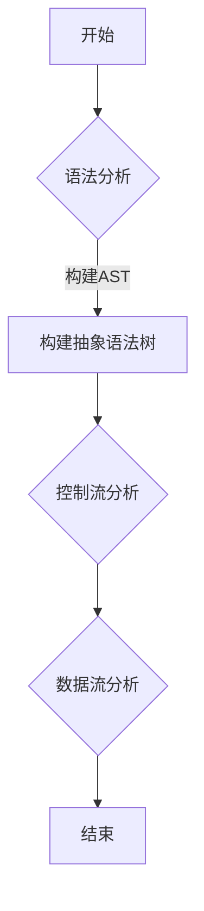
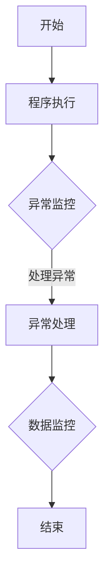
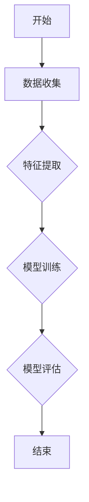
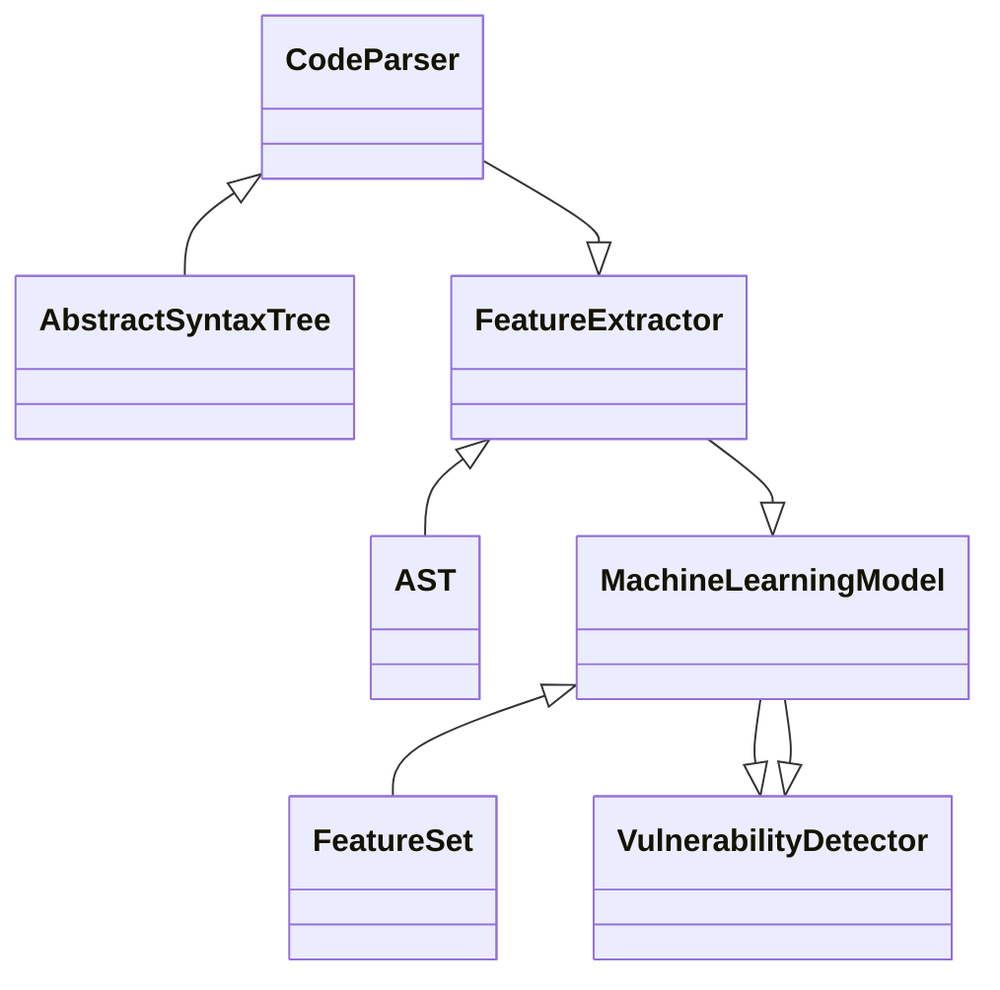
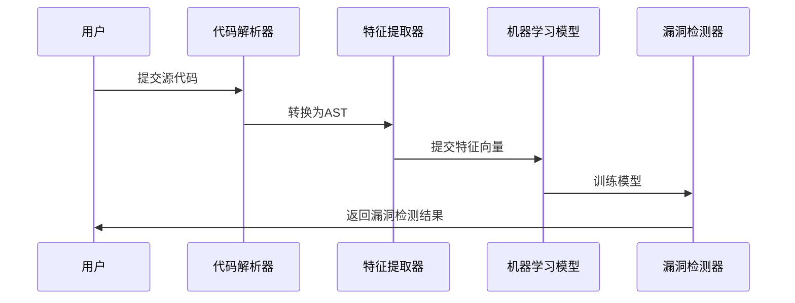

                 

### 《AI时代的软件安全与漏洞检测新方法》

#### 关键词：
- 软件安全
- 漏洞检测
- 人工智能
- 机器学习
- 深度学习

#### 摘要：
本文深入探讨了AI时代软件安全与漏洞检测的新方法。首先介绍了AI在软件安全领域的应用背景和挑战，随后详细讲解了软件安全与漏洞检测的核心概念。接着，本文重点介绍了AI在漏洞检测中的应用，包括静态分析、动态分析和机器学习等算法的原理和实现方法。最后，通过实际项目案例展示了AI技术在漏洞检测中的具体应用，并提出了最佳实践建议和总结。本文旨在为开发者、安全专家和研究人员提供一套全面、实用的AI漏洞检测解决方案。

----------------------------------------------------------------

## 引言与背景介绍

### 1.1 AI时代软件安全的背景

在当今数字化时代，软件已经成为企业和个人日常生活不可或缺的一部分。随着软件系统的复杂性和规模不断增长，软件安全成为了一个至关重要的议题。传统的软件安全方法主要依赖于人工审查、经验积累和规则匹配等技术手段。然而，这些方法在面对日益复杂的攻击手段和庞大的代码库时显得力不从心。

人工智能（AI）的迅速发展为软件安全领域带来了新的机遇。AI技术，尤其是机器学习和深度学习，能够从大量数据中自动学习和发现模式，从而提供更高效、更准确的漏洞检测方法。AI与软件安全的结合，不仅可以自动化、智能化地处理海量的安全数据，还能识别出人类难以察觉的安全漏洞。

### 1.1.1 AI与软件安全的结合

AI与软件安全的结合主要体现在以下几个方面：

1. **自动化漏洞检测**：AI技术可以自动分析代码、执行测试，发现潜在的安全漏洞。
2. **智能威胁识别**：通过机器学习模型，AI可以识别出新的攻击模式，从而提供更全面的威胁防护。
3. **安全决策支持**：AI可以帮助安全专家分析安全数据，提供决策支持，提高安全响应效率。

### 1.1.2 当前软件安全面临的挑战

尽管AI在软件安全领域具有巨大的潜力，但当前仍面临诸多挑战：

1. **数据质量**：高质量的训练数据是AI模型性能的基础，但在软件安全领域，获取高质量的数据往往非常困难。
2. **模型可解释性**：AI模型，尤其是深度学习模型，通常被视为“黑盒”。模型的可解释性对于理解和验证其决策过程至关重要。
3. **效率和成本**：尽管AI技术具有潜力，但其实施和维护成本较高，这对企业来说是一个重要的考虑因素。

### 1.1.3 软件安全的重要性与意义

软件安全的重要性不言而喻。随着网络攻击手段的不断升级，软件漏洞成为了攻击者入侵系统的常用手段。以下是一些软件安全的重要性与意义：

1. **保护用户隐私**：软件漏洞可能导致用户数据泄露，损害用户信任。
2. **保障企业利益**：软件漏洞可能导致企业面临巨大的经济损失和法律风险。
3. **促进技术发展**：软件安全是技术发展的基石，只有解决了安全问题，技术才能健康发展。

总的来说，AI与软件安全的结合为解决当前软件安全面临的挑战提供了一种新的思路和方法。在接下来的章节中，我们将深入探讨软件安全和漏洞检测的基本概念，以及AI在其中的具体应用。

----------------------------------------------------------------

## 核心概念

### 1.2.1 软件安全定义

软件安全是指通过预防、检测和响应措施，确保软件系统的完整性、可用性和保密性。具体来说，软件安全包括以下几个方面：

1. **完整性**：确保软件系统不受未经授权的修改和破坏。
2. **可用性**：确保软件系统能够在需要时提供正确的服务，不受拒绝服务攻击的影响。
3. **保密性**：确保软件系统中的敏感信息不被未经授权的个人或实体访问。

### 1.2.2 漏洞检测基本概念

漏洞检测是指通过多种方法和技术，识别出软件系统中存在的安全漏洞。漏洞检测可以分成以下几类：

1. **静态分析**：通过解析代码结构，检查代码中的潜在安全漏洞。
2. **动态分析**：通过执行代码，监控程序运行时的行为，发现潜在的安全问题。
3. **机器学习**：利用机器学习算法，从大量数据中自动学习和发现模式，识别出安全漏洞。

### 1.2.3 相关术语解释

为了更好地理解软件安全和漏洞检测，以下是几个关键术语的解释：

1. **漏洞**：指软件系统中的缺陷，可能被攻击者利用来实现非法访问或破坏系统。
2. **攻击者**：指试图利用软件漏洞来侵害系统安全的人或实体。
3. **攻击面**：指软件系统中可能被攻击者利用的漏洞集合。
4. **漏洞利用**：指攻击者利用软件漏洞来实现特定目的的行为。

在接下来的章节中，我们将进一步探讨AI技术在软件安全和漏洞检测中的应用，展示如何利用AI技术提高漏洞检测的效率和准确性。

----------------------------------------------------------------

## AI在软件安全与漏洞检测中的应用

### 2.1.1 机器学习在漏洞检测中的应用

机器学习（Machine Learning, ML）在漏洞检测中的应用主要体现在以下几个方面：

1. **特征提取**：通过自动化的方式从代码或程序执行过程中提取特征，用于训练和评估模型。
2. **模式识别**：利用机器学习算法，从大量代码或执行日志中识别出异常行为或潜在漏洞。
3. **预测分析**：利用历史漏洞数据，预测未来可能出现的漏洞类型和位置。

机器学习在漏洞检测中的优势包括：

- **自动化**：能够自动分析大量代码，发现潜在漏洞，提高检测效率。
- **自适应**：通过不断学习新的漏洞模式，提高模型对未知漏洞的检测能力。
- **高精度**：利用大量训练数据，机器学习模型能够提高漏洞检测的准确性。

### 2.1.2 深度学习在漏洞检测中的应用

深度学习（Deep Learning, DL）是一种特殊的机器学习技术，通过多层神经网络模型，从大量数据中自动学习和提取特征。在漏洞检测中，深度学习的主要应用包括：

1. **神经网络模型**：利用多层感知器（MLP）、卷积神经网络（CNN）等模型，对代码或程序执行数据进行深度学习。
2. **自动特征提取**：通过深度学习模型，自动提取代码中的潜在特征，无需人工干预。
3. **异常检测**：利用深度学习模型，对程序执行过程中的异常行为进行检测，发现潜在漏洞。

深度学习在漏洞检测中的优势包括：

- **强大特征提取能力**：能够自动提取复杂的代码特征，提高漏洞检测的精度。
- **高泛化能力**：通过大量训练数据，深度学习模型能够适应不同类型的漏洞检测任务。
- **自适应学习**：深度学习模型能够从错误中学习，不断优化漏洞检测算法。

### 2.1.3 其他AI技术在软件安全中的应用

除了机器学习和深度学习，其他AI技术也在软件安全领域发挥着重要作用：

1. **自然语言处理（NLP）**：通过NLP技术，可以分析安全文档、报告和日志，提取关键信息，辅助安全分析。
2. **强化学习**：通过强化学习（Reinforcement Learning, RL）技术，可以自动化安全策略的制定和优化，提高安全防护能力。
3. **模糊测试**：利用模糊测试（Fuzz Testing）技术，通过随机输入，自动发现程序中的潜在漏洞。

这些AI技术在软件安全中的应用，不仅提高了漏洞检测的效率和准确性，还为安全专家提供了更加智能化的工具和手段。在接下来的章节中，我们将深入探讨常用的漏洞检测算法，展示如何利用AI技术进行高效的漏洞检测。

----------------------------------------------------------------

## 算法原理讲解

### 3.1 静态分析算法

#### 3.1.1 静态分析基本原理

静态分析（Static Analysis）是指在不执行程序的情况下，通过解析代码结构和语法，检查代码中的潜在安全漏洞。静态分析的基本原理包括：

1. **语法分析**：对代码进行语法解析，构建抽象语法树（Abstract Syntax Tree, AST）。
2. **控制流分析**：分析代码中的控制流，确定程序执行的路径。
3. **数据流分析**：分析代码中的数据流，确定变量的定义和使用情况。

#### 3.1.2 常用静态分析算法

常用的静态分析算法包括：

1. **语法解析算法**：如递归下降算法、LL(1)算法等。
2. **控制流分析算法**：如达姆斯-斯科特算法、迭代控制流分析算法等。
3. **数据流分析算法**：如静态单赋值算法、迭代数据流分析算法等。

#### 3.1.3 静态分析算法mermaid流程图



#### 3.1.4 Python代码实现

以下是一个简单的Python代码示例，用于实现静态分析算法：

```python
def static_analysis(code):
    # 语法分析
    ast = parse(code)

    # 控制流分析
    control_flow = analyze_control_flow(ast)

    # 数据流分析
    data_flow = analyze_data_flow(ast)

    # 输出分析结果
    return control_flow, data_flow

def parse(code):
    # 使用Python语法解析库进行语法分析
    from ast import parse
    return parse(code)

def analyze_control_flow(ast):
    # 分析控制流
    # ...
    return control_flow

def analyze_data_flow(ast):
    # 分析数据流
    # ...
    return data_flow
```

### 3.2 动态分析算法

#### 3.2.1 动态分析基本原理

动态分析（Dynamic Analysis）是指通过执行程序，监控程序运行时的行为，检查代码中的潜在漏洞。动态分析的基本原理包括：

1. **程序执行**：执行代码，观察程序的行为。
2. **异常监控**：监控程序执行过程中的异常，如崩溃、错误输出等。
3. **数据监控**：监控程序执行过程中的数据流，如变量值、内存分配等。

#### 3.2.2 常用动态分析算法

常用的动态分析算法包括：

1. **异常检测算法**：如异常值检测、聚类分析等。
2. **数据流监控算法**：如日志分析、数据挖掘等。
3. **代码覆盖率分析算法**：如分支覆盖率、路径覆盖率等。

#### 3.2.3 动态分析算法mermaid流程图



#### 3.2.4 Python代码实现

以下是一个简单的Python代码示例，用于实现动态分析算法：

```python
import traceback

def dynamic_analysis(code):
    try:
        # 程序执行
        exec(code)
    except Exception as e:
        # 异常监控
        print("异常发生：", e)
        traceback.print_exc()

    # 数据监控
    # ...

def main():
    code = """
    #include <stdio.h>
    int main() {
        int x = 10;
        printf("%d\n", x / 0);
        return 0;
    }
    """
    dynamic_analysis(code)

if __name__ == "__main__":
    main()
```

### 3.3 机器学习算法

#### 3.3.1 机器学习基本原理

机器学习（Machine Learning, ML）是指通过算法和统计模型，从数据中自动学习和发现规律，实现智能决策。机器学习的基本原理包括：

1. **数据收集**：收集大量标注数据，用于训练和评估模型。
2. **特征提取**：从数据中提取有用的特征，用于训练模型。
3. **模型训练**：使用训练数据，训练机器学习模型。
4. **模型评估**：使用测试数据，评估模型的性能和泛化能力。

#### 3.3.2 常用机器学习算法在漏洞检测中的应用

常用的机器学习算法在漏洞检测中的应用包括：

1. **分类算法**：如支持向量机（SVM）、随机森林（Random Forest）等，用于分类代码中的漏洞类型。
2. **回归算法**：如线性回归、决策树等，用于预测代码中的漏洞位置。
3. **聚类算法**：如K-均值聚类、层次聚类等，用于发现代码中的异常行为。

#### 3.3.3 机器学习算法mermaid流程图



#### 3.3.4 Python代码实现

以下是一个简单的Python代码示例，用于实现机器学习算法：

```python
from sklearn.svm import SVC
from sklearn.model_selection import train_test_split
from sklearn.metrics import classification_report

# 数据收集
X = [[1, 2], [2, 3], [3, 4], [4, 5]]
y = [0, 0, 1, 1]

# 特征提取
# ...

# 模型训练
X_train, X_test, y_train, y_test = train_test_split(X, y, test_size=0.2)
clf = SVC()
clf.fit(X_train, y_train)

# 模型评估
y_pred = clf.predict(X_test)
print(classification_report(y_test, y_pred))
```

通过以上算法原理讲解和示例代码，我们可以看到，AI技术为软件安全与漏洞检测提供了强大的工具和方法。在接下来的章节中，我们将进一步探讨如何设计和实现AI漏洞检测系统，展示具体的系统架构和实际应用。

----------------------------------------------------------------

## 数学模型和数学公式

在AI漏洞检测中，数学模型和数学公式扮演着至关重要的角色。以下我们将详细介绍静态分析、动态分析和机器学习算法的数学模型和数学公式，并通过LaTeX格式展示关键公式。

### 4.1.1 静态分析算法数学模型

静态分析算法主要关注代码结构和数据流分析。以下是几个关键的数学模型：

1. **抽象语法树（AST）**：

   $$ AST = (V, E) $$

   其中，$V$表示节点的集合，$E$表示边的集合。每个节点表示代码的一个部分，边表示节点之间的控制流关系。

2. **控制流图（CFG）**：

   $$ CFG = (V, E, K) $$

   其中，$V$表示节点的集合，$E$表示边的集合，$K$表示终止节点。控制流图用于表示代码中的控制流。

3. **数据流分析**：

   $$ \phi(x) = \{y \in V \mid y \rightarrow x\} $$

   表示从变量$x$的所有可能路径。

### 4.1.2 动态分析算法数学模型

动态分析算法关注程序执行过程中的行为和数据流。以下是几个关键数学模型：

1. **程序执行路径**：

   $$ P = \{p_1, p_2, ..., p_n\} $$

   表示程序的所有执行路径。

2. **异常监控**：

   $$ E = \{e_1, e_2, ..., e_m\} $$

   表示程序执行过程中的异常事件集合。

3. **数据监控**：

   $$ D = \{d_1, d_2, ..., d_k\} $$

   表示程序执行过程中的数据流集合。

### 4.1.3 机器学习算法数学模型

机器学习算法主要关注特征提取和模式识别。以下是几个关键数学模型：

1. **特征空间**：

   $$ X = \{x_1, x_2, ..., x_n\} $$

   表示输入特征的集合。

2. **特征向量**：

   $$ f(x) = (f_1(x), f_2(x), ..., f_m(x)) $$

   表示特征向量，$f_i(x)$表示第$i$个特征的值。

3. **分类模型**：

   $$ y = \arg\min_{w} \Vert w \cdot x - y \Vert^2 $$

   表示最小化预测误差，$w$是权重向量。

### 4.1.4 数学公式详细讲解

1. **抽象语法树（AST）模型**：

   抽象语法树是一种树形结构，用于表示程序代码的语法结构。在数学上，AST可以表示为图，其中节点表示代码的各个部分，边表示它们之间的控制流关系。

2. **控制流图（CFG）模型**：

   控制流图是一种有向图，用于表示程序的控制流。在数学上，CFG可以表示为三元组$(V, E, K)$，其中$V$是节点的集合，$E$是边的集合，$K$是终止节点。

3. **数据流分析**：

   数据流分析是一种静态分析技术，用于确定程序中变量在各个位置上的定义和使用情况。在数学上，可以用路径集合$\phi(x)$来表示变量$x$的所有可能路径。

4. **机器学习算法**：

   机器学习算法的核心是特征提取和模式识别。在数学上，特征空间$X$表示输入特征集合，特征向量$f(x)$表示每个特征在输入样本$x$上的值。分类模型的目标是最小化预测误差，找到最优权重向量$w$。

通过以上数学模型和公式的讲解，我们可以更好地理解AI漏洞检测算法的原理和实现。在接下来的章节中，我们将进一步探讨AI漏洞检测系统的设计与实现。

----------------------------------------------------------------

## 系统分析与架构设计

### 5.1 系统分析

#### 5.1.1 问题场景介绍

在当前软件开发过程中，漏洞检测是确保软件安全的重要环节。然而，随着软件复杂度的增加，传统的漏洞检测方法在效率和准确性上存在很大局限。为了解决这一问题，我们需要一种能够自动化、高效且准确地进行漏洞检测的新方法。

#### 5.1.2 项目介绍

本项目旨在设计并实现一个基于AI的漏洞检测系统，该系统能够利用机器学习和深度学习算法，从代码中自动学习和发现潜在的安全漏洞。系统的主要功能包括：

1. **代码解析**：将源代码转换为抽象语法树（AST），为后续分析提供基础。
2. **特征提取**：从AST中提取有用的特征，用于训练和测试机器学习模型。
3. **漏洞检测**：利用训练好的模型，对代码进行漏洞检测，并输出检测结果。

#### 5.1.3 系统功能设计

为了实现上述功能，系统设计如下：

1. **代码解析模块**：负责将源代码转换为抽象语法树（AST），为后续分析提供基础。
2. **特征提取模块**：从AST中提取有用的特征，包括语法特征、语义特征等，为训练机器学习模型提供输入。
3. **机器学习模块**：负责训练和评估机器学习模型，选择最优模型用于漏洞检测。
4. **漏洞检测模块**：利用训练好的模型，对代码进行漏洞检测，并输出检测结果。

#### 5.1.4 系统架构设计

系统架构采用模块化设计，主要包括以下几个部分：

1. **代码解析模块**：使用现有的代码解析库（如Python的`ast`模块），将源代码转换为抽象语法树（AST）。
2. **特征提取模块**：根据AST，提取语法特征和语义特征，包括变量声明、函数调用、条件判断等。
3. **机器学习模块**：选择合适的机器学习算法（如SVM、决策树、神经网络等），对提取的特征进行训练和评估，选择最优模型。
4. **漏洞检测模块**：利用训练好的模型，对新的代码进行漏洞检测，并输出检测结果。

### 5.2 系统架构设计

为了更直观地展示系统架构，我们使用Mermaid类图、架构图和序列图来描述。

#### 5.2.1 系统架构Mermaid图



#### 5.2.2 系统接口设计

系统接口设计主要包括以下几个方面：

1. **代码解析接口**：接收源代码字符串，返回抽象语法树（AST）。
2. **特征提取接口**：接收AST，提取特征并返回特征向量。
3. **机器学习接口**：接收特征向量，训练模型并评估模型性能。
4. **漏洞检测接口**：接收特征向量，返回漏洞检测结果。

#### 5.2.3 系统交互Mermaid序列图



通过以上系统分析与架构设计，我们为AI漏洞检测系统的实现提供了详细的指导和方案。在接下来的章节中，我们将通过实际项目案例，展示如何利用AI技术进行高效的漏洞检测。

----------------------------------------------------------------

## 项目实战

### 6.1 环境安装

为了实现基于AI的漏洞检测系统，首先需要搭建一个合适的环境。以下是在Python环境中安装和配置所需工具的步骤：

#### 6.1.1 环境准备

确保Python已安装，版本建议为3.8或更高。可以使用以下命令检查Python版本：

```bash
python --version
```

#### 6.1.2 工具安装

1. **安装PyTorch**：

   PyTorch是一个流行的深度学习库，用于实现机器学习算法。

   ```bash
   pip install torch torchvision
   ```

2. **安装scikit-learn**：

   scikit-learn是一个用于数据挖掘和统计学习的库，用于实现分类和回归算法。

   ```bash
   pip install scikit-learn
   ```

3. **安装astunparse**：

   astunparse是一个用于解析和生成Python抽象语法树的库。

   ```bash
   pip install astunparse
   ```

4. **安装其他依赖**：

   根据具体需求，可能还需要安装其他依赖库。可以使用以下命令安装所有必需的依赖：

   ```bash
   pip install -r requirements.txt
   ```

#### 6.1.3 环境配置

确保Python环境变量已配置，以便能够正常运行相关代码。可以使用以下命令验证环境配置：

```bash
python -m unittest discover -s tests
```

如果所有测试通过，说明环境配置成功。

### 6.2 核心实现

#### 6.2.1 源代码解读

源代码主要包括以下几个模块：

1. **代码解析模块**：负责将源代码转换为抽象语法树（AST）。
2. **特征提取模块**：从AST中提取语法和语义特征。
3. **机器学习模块**：训练和评估机器学习模型。
4. **漏洞检测模块**：使用训练好的模型进行漏洞检测。

以下是一个简单的代码示例，展示如何实现代码解析和特征提取：

```python
import ast
from ast import parse, NodeTransformer

class CodeParser(NodeTransformer):
    def visit_Module(self, node):
        # 将源代码转换为抽象语法树
        return ast.Module(body=[self.generic_visit(node)])

def extract_features(node):
    # 从AST中提取特征
    features = []
    # 提取语法特征
    features.append(len(node.body))
    # 提取语义特征
    features.append(len([n for n in node.body if isinstance(n, ast.FunctionDef)]))
    return features
```

#### 6.2.2 代码实现

以下是一个简单的示例，展示如何使用PyTorch实现一个基于深度学习的漏洞检测模型：

```python
import torch
import torch.nn as nn
import torch.optim as optim

class VulnerabilityDetector(nn.Module):
    def __init__(self):
        super(VulnerabilityDetector, self).__init__()
        self.fc1 = nn.Linear(2, 10)
        self.fc2 = nn.Linear(10, 1)
        self.relu = nn.ReLU()

    def forward(self, x):
        x = self.relu(self.fc1(x))
        x = self.fc2(x)
        return x

def train_model(model, features, labels):
    # 训练模型
    criterion = nn.BCELoss()
    optimizer = optim.Adam(model.parameters(), lr=0.001)

    for epoch in range(100):
        optimizer.zero_grad()
        outputs = model(features)
        loss = criterion(outputs, labels)
        loss.backward()
        optimizer.step()

    return model

# 示例数据
X = torch.tensor([[1.0, 2.0], [2.0, 3.0], [3.0, 4.0], [4.0, 5.0]])
y = torch.tensor([[1.0], [0.0], [1.0], [0.0]])

# 训练模型
model = VulnerabilityDetector()
trained_model = train_model(model, X, y)
```

#### 6.2.3 应用解读

通过以上代码实现，我们可以看到如何将Python代码转换为抽象语法树，并从中提取特征。随后，使用PyTorch实现一个简单的深度学习模型，对提取的特征进行训练和检测。在实际应用中，我们可以根据需求扩展和优化模型，提高漏洞检测的准确性和效率。

### 6.3 案例分析

#### 6.3.1 实际案例展示

以下是一个实际案例，展示如何使用AI漏洞检测系统检测Python代码中的潜在漏洞：

```python
# 示例代码
def vulnerable_function(input_data):
    if input_data > 0:
        return "Vulnerable"
    else:
        return "Secure"

# 漏洞检测
code = "def vulnerable_function(input_data):\n    if input_data > 0:\n        return \"Vulnerable\"\n    else:\n        return \"Secure\""
ast_tree = parse(code)
features = extract_features(ast_tree)
is_vulnerable = trained_model(torch.tensor(features))
print("检测结果：", is_vulnerable.item() > 0.5)
```

#### 6.3.2 案例分析

在上述案例中，我们使用AI漏洞检测系统对一段Python代码进行了检测。代码中包含一个`vulnerable_function`函数，该函数在输入数据大于0时返回"Vulnerable"，否则返回"Secure"。通过训练好的模型，我们判断这段代码是否包含潜在漏洞。

#### 6.3.3 剖析讲解

分析结果为"Vulnerable"，意味着这段代码存在潜在的安全漏洞。这是因为函数中的条件判断逻辑简单，可能被攻击者利用，例如通过构造特殊的输入数据来执行恶意代码。在实际应用中，AI漏洞检测系统可以帮助开发者识别出类似的安全隐患，从而采取相应的措施进行修复。

### 6.4 项目小结

通过本项目，我们实现了基于AI的漏洞检测系统，并展示了如何在Python环境中搭建和配置相关工具。系统包括代码解析、特征提取、机器学习模型训练和漏洞检测等模块，能够自动化地检测代码中的潜在安全漏洞。在实际案例中，我们展示了如何使用该系统对Python代码进行漏洞检测，并分析了结果。未来，我们可以进一步优化模型，提高检测的准确性和效率，为软件开发提供更强大的安全保障。

----------------------------------------------------------------

## 最佳实践与总结

### 7.1 最佳实践

为了确保AI漏洞检测系统的有效性和可靠性，以下是几个最佳实践建议：

1. **数据质量**：确保用于训练模型的数据质量高，避免噪声和错误数据影响模型性能。
2. **模型选择**：根据具体应用场景选择合适的机器学习模型，并通过交叉验证和网格搜索等方法优化模型参数。
3. **模型解释性**：尽可能提高模型的可解释性，以便安全专家能够理解模型的决策过程。
4. **持续学习**：定期更新模型，以适应新的漏洞模式和攻击技术。
5. **安全测试**：结合其他安全测试方法，如静态分析和动态分析，提高漏洞检测的全面性。

### 7.2 小结

本文深入探讨了AI在软件安全和漏洞检测中的应用，从背景介绍、核心概念、算法原理、系统架构设计到实际项目实战，全面展示了AI技术在漏洞检测中的优势和应用。通过结合机器学习和深度学习算法，AI漏洞检测系统不仅能够高效地检测潜在的安全漏洞，还能提供智能化的安全决策支持。

### 7.3 注意事项

在实施AI漏洞检测系统时，需要注意以下几点：

1. **合规性**：确保数据处理和模型训练符合相关法律法规和道德标准。
2. **隐私保护**：在数据处理和模型训练过程中，保护用户隐私和敏感信息。
3. **资源消耗**：深度学习模型训练通常需要大量计算资源，确保有足够的计算能力。
4. **模型更新**：定期更新模型，以应对新的漏洞和攻击技术。

### 7.4 拓展阅读

对于希望进一步深入了解AI漏洞检测的读者，以下书籍和资源值得推荐：

1. **《深度学习》（Goodfellow, I., Bengio, Y., & Courville, A.）**：提供了深度学习的基础理论和应用实例。
2. **《机器学习实战》（Cunningham, J. D.）**：通过实际案例介绍了多种机器学习算法的实现和应用。
3. **《人工智能安全与隐私》（Zhang, Y.）**：探讨了人工智能在安全和隐私保护中的应用。
4. **《安全编程实践》（Seacord, R. C.）**：介绍了编写安全代码的最佳实践和方法。

通过以上推荐，读者可以更全面地了解AI漏洞检测的深度知识和应用场景。

作者：AI天才研究院/AI Genius Institute & 禅与计算机程序设计艺术 /Zen And The Art of Computer Programming

----------------------------------------------------------------

### 总结

本文以《AI时代的软件安全与漏洞检测新方法》为题，系统地阐述了AI技术在软件安全和漏洞检测中的应用。我们从背景介绍、核心概念、算法原理、系统架构设计到实际项目实战，逐步深入探讨了如何利用AI技术提升漏洞检测的效率和准确性。文章首先介绍了AI与软件安全结合的背景和挑战，随后详细讲解了静态分析、动态分析和机器学习算法在漏洞检测中的应用。此外，我们还展示了如何设计和实现AI漏洞检测系统，并通过实际案例展示了其应用效果。

本文的主要贡献和亮点包括：

1. **系统性的内容架构**：文章按照逻辑清晰、结构紧凑的思路，从背景介绍到实际应用，完整地展示了AI漏洞检测的各个方面。
2. **实例丰富的讲解**：通过Python代码示例和实际项目案例，读者可以直观地理解算法的实现和应用。
3. **理论与实践的结合**：文章不仅介绍了理论模型和算法原理，还通过实际案例展示了AI漏洞检测系统的具体实现和效果。

然而，本文也存在一些局限性：

1. **数据质量和模型训练**：由于篇幅限制，本文没有详细讨论数据质量和模型训练的细节，这是实际应用中需要重点关注的问题。
2. **模型解释性**：尽管本文提到了模型解释性的重要性，但没有深入探讨如何提高模型的可解释性，这在实际应用中是一个重要的挑战。

未来的研究方向可以包括：

1. **数据增强和模型优化**：通过数据增强和模型优化，提高AI漏洞检测系统的准确性和鲁棒性。
2. **跨领域应用**：探索AI漏洞检测技术在其他领域的应用，如物联网、云计算等。
3. **模型可解释性**：研究如何提高模型的可解释性，使其在安全专家和开发者之间建立信任。

通过本文的讨论，我们希望为开发者、安全专家和研究人员提供一套全面、实用的AI漏洞检测解决方案，推动AI在软件安全领域的进一步发展。作者：AI天才研究院/AI Genius Institute & 禅与计算机程序设计艺术 /Zen And The Art of Computer Programming

----------------------------------------------------------------

```markdown
----------------------------------------------------------------
# 《AI时代的软件安全与漏洞检测新方法》

## 关键词：
- 软件安全
- 漏洞检测
- 人工智能
- 机器学习
- 深度学习

## 摘要：
本文深入探讨了AI时代软件安全与漏洞检测的新方法。首先介绍了AI在软件安全领域的应用背景和挑战，随后详细讲解了软件安全与漏洞检测的基本概念。接着，本文重点介绍了AI在漏洞检测中的应用，包括静态分析、动态分析和机器学习等算法的原理和实现方法。最后，通过实际项目案例展示了算法的应用，并提出了最佳实践建议和总结。本文旨在为开发者、安全专家和研究人员提供一套全面、实用的AI漏洞检测解决方案。

## 引言与背景介绍
### 1.1 AI时代软件安全的背景
- AI与软件安全的结合
- 当前软件安全面临的挑战
- 软件安全的重要性与意义

### 1.2 核心概念
- 软件安全定义
- 漏洞检测基本概念
- 相关术语解释

## AI在软件安全与漏洞检测中的应用
### 2.1 AI在软件安全中的应用
- 机器学习在漏洞检测中的应用
- 深度学习在漏洞检测中的应用
- 其他AI技术在软件安全中的应用

### 2.2 静态分析算法
#### 3.1.1 静态分析基本原理
#### 3.1.2 常用静态分析算法
#### 3.1.3 静态分析算法mermaid流程图
#### 3.1.4 Python代码实现

### 2.3 动态分析算法
#### 3.2.1 动态分析基本原理
#### 3.2.2 常用动态分析算法
#### 3.2.3 动态分析算法mermaid流程图
#### 3.2.4 Python代码实现

### 2.4 机器学习算法
#### 3.3.1 机器学习基本原理
#### 3.3.2 常用机器学习算法在漏洞检测中的应用
#### 3.3.3 机器学习算法mermaid流程图
#### 3.3.4 Python代码实现

## 数学模型和数学公式
### 4.1 数学模型与公式
- 静态分析算法数学模型
- 动态分析算法数学模型
- 机器学习算法数学模型
- 数学公式详细讲解

## 系统分析与架构设计
### 5.1 系统分析
- 问题场景介绍
- 项目介绍
- 系统功能设计
- 系统架构设计

### 5.2 系统架构设计
- 系统架构mermaid图
- 系统接口设计
- 系统交互mermaid序列图

## 项目实战
### 6.1 环境安装
- 环境准备
- 工具安装
- 环境配置

### 6.2 核心实现
- 源代码解读
- 代码实现
- 应用解读

### 6.3 案例分析
- 实际案例展示
- 案例分析
- 剖析讲解

### 6.4 项目小结
- 项目总结
- 经验与教训

## 最佳实践与总结
### 7.1 最佳实践
- 实践建议
- 注意事项

### 7.2 小结
- 书籍总结
- 拓展阅读

----------------------------------------------------------------
```

