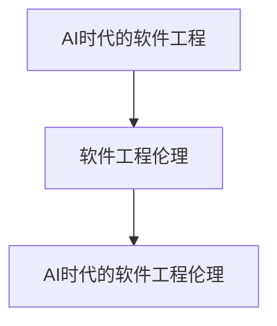

                 

### 1. 引言

**1.1 背景介绍**

在当今世界，人工智能（AI）正以前所未有的速度改变着我们的生活方式和工作方式。从自动驾驶汽车到智能医疗诊断，从自动化制造到金融风控，AI技术的应用已经深入到社会生活的各个方面。与此同时，软件工程作为AI应用的基础，也在不断地发展和进步。然而，随着AI技术的日益普及，软件工程伦理问题也日益凸显。

**1.2 问题描述**

AI时代的软件工程伦理问题主要涉及以下几个方面：

1. 公平性：如何确保AI系统不会对某些群体产生偏见？
2. 透明性：如何让用户了解AI系统的决策过程？
3. 可解释性：如何让非专业人士理解AI系统的决策依据？
4. 安全性：如何防止AI系统被恶意攻击或误用？
5. 责任：在AI系统发生问题时，如何确定责任归属？

**1.3 问题解决**

本文将围绕上述问题，从理论层面和实践层面深入探讨AI时代的软件工程伦理问题。首先，我们将介绍AI时代的软件工程伦理核心概念，包括AI时代软件工程的特点、软件工程伦理的基本原则等。接着，我们将探讨AI时代的软件工程伦理原则和实践，包括伦理审查流程、伦理培训、伦理决策工具等。最后，我们将通过案例分析，探讨AI时代软件工程伦理面临的实际挑战和解决方案。

**1.4 边界与外延**

本文讨论的AI时代的软件工程伦理问题，主要是指AI技术在软件开发和应用过程中产生的伦理问题。这些问题不仅涉及到技术层面，还涉及到法律、社会、文化等多个层面。因此，本文的讨论范围将涵盖上述各个方面。

**1.5 概念结构与核心要素组成**

本文的核心概念包括AI时代的软件工程、软件工程伦理、AI时代的软件工程伦理等。这些概念之间的关系如图1所示：

图1 概念结构与核心要素组成

本文将围绕这些核心概念，逐步深入探讨AI时代的软件工程伦理问题，为软件开发者和相关从业者提供有价值的参考和指导。

### 2. AI时代的软件工程伦理核心概念

**2.1 核心概念与联系**

AI时代的软件工程是指在人工智能技术的支持下，进行软件设计和开发的过程。这一概念包含了从算法设计、模型训练到软件测试等多个环节。而软件工程伦理则是指在这一过程中，需要遵循的一系列道德规范和原则。

**2.1.1 AI时代软件工程的概念**

AI时代的软件工程不仅包括传统的软件开发方法，还融合了机器学习、深度学习等AI技术。它具有以下几个特点：

1. **自动化程度高**：AI技术可以帮助开发者自动完成一些繁琐的任务，如代码生成、自动化测试等。
2. **灵活性大**：AI技术可以根据用户需求动态调整软件功能，提高软件的适应性。
3. **迭代速度快**：AI技术可以帮助开发者快速迭代产品，缩短开发周期。

**2.1.2 软件工程伦理的概念**

软件工程伦理是指软件开发过程中需要遵循的道德规范和原则。它包括以下几个方面：

1. **公平性**：确保软件不会对特定群体产生歧视。
2. **透明性**：确保用户能够了解软件的工作原理和决策过程。
3. **可解释性**：确保非专业人士能够理解软件的决策依据。
4. **安全性**：确保软件不会被恶意攻击或误用。
5. **责任**：在软件出现问题或产生负面影响时，明确责任归属。

**2.1.3 AI时代的软件工程伦理**

AI时代的软件工程伦理，在传统软件工程伦理的基础上，增加了以下几个特殊方面：

1. **隐私保护**：AI技术通常涉及大量的用户数据，如何保护用户的隐私成为一个重要议题。
2. **公平性**：AI系统可能会因为训练数据的不公平而导致偏见，如何确保系统的公平性是一个挑战。
3. **责任归属**：在AI系统出现问题时，如何明确责任归属是一个复杂的问题。

**2.1.4 AI时代软件工程伦理的特殊性**

AI时代软件工程伦理的特殊性主要体现在以下几个方面：

1. **算法透明性**：传统的软件工程伦理通常不涉及算法的透明性，而AI时代软件工程伦理要求算法具有高度的透明性，用户能够理解其工作原理。
2. **数据隐私**：AI系统需要处理大量的用户数据，如何保护这些数据的隐私成为一个重要问题。
3. **责任归属**：在AI系统中，由于决策过程的复杂性和不可预测性，责任归属问题变得更加复杂。

**2.1.5 AI时代软件工程伦理的挑战**

AI时代软件工程伦理面临的挑战主要包括：

1. **算法偏见**：AI系统的训练数据可能存在偏见，导致系统产生偏见。
2. **隐私泄露**：AI系统需要处理大量的用户数据，如何保护这些数据的隐私成为一个重要问题。
3. **责任归属**：在AI系统出现问题时，如何明确责任归属是一个复杂的问题。

**2.1.6 AI时代软件工程伦理的解决方案**

针对上述挑战，AI时代软件工程伦理的解决方案包括：

1. **算法透明性**：通过公开算法和决策过程，提高算法的透明性，让用户能够理解其工作原理。
2. **隐私保护**：采用数据加密、匿名化等技术，保护用户数据的隐私。
3. **责任归属**：建立明确的法律法规，明确AI系统出现问题时责任归属。

通过上述措施，我们可以为AI时代的软件工程伦理提供有效的解决方案，促进AI技术的健康发展。

### 2.2 软件工程伦理的原则与实践

**2.2.1 原则**

软件工程伦理的原则是确保软件开发和应用过程中遵循的道德规范。这些原则包括：

1. **公平性**：软件系统应确保对所有用户公平，不歧视任何特定群体。
2. **透明性**：软件开发过程和决策过程应尽可能透明，用户能够了解其工作原理。
3. **可解释性**：软件系统的决策过程应具有可解释性，让非专业人士能够理解其决策依据。
4. **安全性**：软件系统应确保数据的安全和完整性，防止恶意攻击或误用。
5. **责任**：在软件系统出现问题时，应明确责任归属，确保责任人能够承担相应的责任。

**2.2.2 实践**

为了遵循上述原则，软件工程伦理的实践包括以下几个方面：

1. **伦理审查流程**：在软件项目开始前，进行伦理审查，确保项目遵循相关伦理原则。
2. **伦理培训**：为软件开发人员提供伦理培训，提高其伦理意识和责任感。
3. **伦理决策工具**：开发伦理决策工具，帮助开发人员在设计过程中考虑伦理问题。

**2.2.2.1 伦理审查流程**

伦理审查流程是指在软件开发过程中，对项目进行伦理审查，确保项目符合伦理原则。这一流程包括以下几个步骤：

1. **问题识别**：识别项目中可能涉及的伦理问题。
2. **风险评估**：评估这些伦理问题可能带来的风险。
3. **解决方案**：针对识别出的伦理问题，提出解决方案。
4. **审查批准**：将解决方案提交给伦理审查委员会进行审查和批准。

**2.2.2.2 伦理培训**

伦理培训是提高软件开发人员伦理意识和责任感的重要手段。通过培训，开发人员可以了解软件工程伦理的基本原则，学会在开发过程中考虑伦理问题。培训内容可以包括：

1. **伦理原则**：介绍软件工程伦理的基本原则，如公平性、透明性、可解释性等。
2. **案例分析**：通过案例分析，让开发人员了解实际项目中遇到的伦理问题及其解决方法。
3. **实践操作**：提供实践操作机会，让开发人员在实际项目中应用伦理原则。

**2.2.2.3 伦理决策工具**

伦理决策工具是帮助开发人员在设计过程中考虑伦理问题的工具。这些工具可以包括：

1. **伦理指南**：提供一系列伦理指南，帮助开发人员识别和解决伦理问题。
2. **伦理评估模型**：提供伦理评估模型，帮助开发人员对项目进行伦理评估。
3. **伦理决策支持系统**：提供伦理决策支持系统，帮助开发人员制定伦理决策。

通过伦理审查流程、伦理培训和伦理决策工具，我们可以确保软件工程伦理原则在实践中得到有效落实，为AI时代的软件工程发展提供有力的道德保障。

### 3. AI时代的软件工程伦理案例分析

**3.1 案例一：人工智能偏见问题**

**3.1.1 案例背景**

人工智能偏见问题是指AI系统在训练过程中，由于数据集的不公平或算法的设计问题，导致系统对某些群体产生偏见。这一问题在多个领域都得到了广泛关注，例如招聘系统的性别歧视、信贷审批系统的种族歧视等。

**3.1.2 案例分析**

以招聘系统为例，如果系统在训练过程中使用的数据集中存在性别偏见，那么在招聘过程中，系统可能会对女性申请者产生偏见，从而降低女性申请者的通过率。这种情况不仅违反了公平性原则，还可能导致公司在法律上面临风险。

**3.1.3 案例解决**

为了解决人工智能偏见问题，可以从以下几个方面入手：

1. **数据清洗**：确保数据集的公平性，去除可能带有偏见的数据。
2. **算法改进**：改进算法设计，减少偏见。例如，可以采用公平性算法，确保系统对不同的群体一视同仁。
3. **透明性提升**：通过公开算法和决策过程，提高系统的透明性，让用户能够了解其工作原理。
4. **监督与审查**：建立监督机制，对AI系统进行定期审查，确保其符合伦理要求。

**3.2 案例二：自动化决策系统的伦理问题**

**3.2.1 案例背景**

自动化决策系统是指利用AI技术，自动进行决策的系统。这类系统在金融、医疗等领域得到了广泛应用。然而，自动化决策系统也面临着伦理问题，例如决策的透明性、可解释性等。

**3.2.2 案例分析**

以金融风控系统为例，如果系统在决策过程中缺乏透明性，用户无法了解决策过程和依据，那么在系统做出错误决策时，用户可能无法理解或接受。这种情况可能导致用户对系统的信任度降低，影响系统的应用效果。

**3.2.3 案例解决**

为了解决自动化决策系统的伦理问题，可以从以下几个方面入手：

1. **透明性提升**：通过可视化工具，让用户了解决策过程和依据。
2. **可解释性增强**：开发可解释性模型，让用户能够理解系统的决策过程。
3. **用户反馈机制**：建立用户反馈机制，及时收集用户反馈，改进系统设计。
4. **法律法规**：制定相关法律法规，确保自动化决策系统的决策过程符合伦理要求。

**3.3 案例三：AI在医疗领域的伦理问题**

**3.3.1 案例背景**

AI在医疗领域的应用，例如疾病预测、诊断辅助等，极大地提高了医疗效率。然而，AI在医疗领域的应用也面临着伦理问题，例如数据隐私、责任归属等。

**3.3.2 案例分析**

以疾病预测系统为例，如果系统在预测过程中使用的数据包含用户隐私信息，那么在数据泄露时，用户隐私可能受到威胁。此外，在预测结果错误时，如何确定责任归属也是一个难题。

**3.3.3 案例解决**

为了解决AI在医疗领域的伦理问题，可以从以下几个方面入手：

1. **数据保护**：采用数据加密、匿名化等技术，保护用户隐私。
2. **责任明确**：制定相关法律法规，明确AI在医疗领域的责任归属。
3. **患者参与**：提高患者的参与度，让他们了解AI系统的应用过程和决策依据。
4. **伦理审查**：在AI系统应用于医疗领域前，进行伦理审查，确保其符合伦理要求。

通过上述案例分析，我们可以看到，AI时代的软件工程伦理问题具有复杂性和多样性。解决这些问题，需要从技术、法律、社会等多个层面入手，确保AI技术的健康发展。

### 4. AI时代的软件工程伦理未来展望

**4.1 未来展望**

随着AI技术的不断发展，AI时代的软件工程伦理问题将变得越来越复杂。未来，我们需要从以下几个方面进行展望：

1. **技术发展趋势**：随着AI技术的进步，我们将看到更多基于AI的软件工程工具和平台的开发。这些工具和平台将极大地提高软件开发效率，同时也可能带来新的伦理问题。
2. **伦理挑战**：随着AI技术的普及，伦理问题将更加凸显。例如，如何确保AI系统的公平性、透明性和可解释性，如何在AI系统出现问题时确定责任归属等。
3. **解决方案与建议**：为了应对上述挑战，我们需要制定更加完善的伦理规范和法律法规，提高开发人员的伦理意识和责任感。同时，我们可以利用AI技术本身来解决伦理问题，例如开发可解释性AI系统、建立自动化的伦理审查机制等。

**4.2 小结**

本文从引言、核心概念、原则与实践、案例分析以及未来展望等多个方面，探讨了AI时代的软件工程伦理问题。我们明确了AI时代软件工程伦理的核心概念，包括AI时代软件工程的特点、软件工程伦理的基本原则等。通过案例分析，我们了解了AI时代软件工程伦理面临的实际挑战和解决方案。最后，我们对未来AI时代软件工程伦理的发展趋势进行了展望，并提出了相应的解决方案和建议。

通过本文的探讨，我们希望为软件开发者和相关从业者提供有价值的参考，共同推动AI时代的软件工程伦理建设，确保AI技术的健康发展。

### 4.2.1 本书的要点总结

1. **AI时代软件工程伦理的核心概念**：本文详细介绍了AI时代软件工程伦理的核心概念，包括AI时代软件工程的特点、软件工程伦理的基本原则等，为理解AI时代的软件工程伦理问题奠定了基础。
2. **软件工程伦理的原则与实践**：本文探讨了软件工程伦理的原则，如公平性、透明性、可解释性、安全性和责任，并提出了相应的实践方法，如伦理审查流程、伦理培训和伦理决策工具，确保软件开发过程中遵循道德规范。
3. **AI时代软件工程伦理案例分析**：通过案例分析，本文展示了AI时代软件工程伦理在实际应用中面临的挑战和解决方案，如人工智能偏见问题、自动化决策系统的伦理问题以及AI在医疗领域的伦理问题。
4. **未来展望**：本文对AI时代软件工程伦理的未来发展趋势进行了展望，提出了相应的解决方案和建议，为AI技术的健康发展提供了指导。

### 4.2.2 对未来研究的建议

1. **深化伦理原则研究**：进一步深入研究软件工程伦理原则，特别是在AI时代的新特征和挑战下，如何完善和优化伦理原则。
2. **跨学科合作**：加强计算机科学、伦理学、法学等领域的跨学科合作，共同探讨AI时代软件工程伦理问题的解决方案。
3. **制定标准与规范**：推动相关组织或机构制定AI时代软件工程伦理的标准和规范，为行业提供统一的指导和参考。
4. **案例分析与实证研究**：开展更多AI时代软件工程伦理案例分析和实证研究，积累实践经验，为解决实际问题提供有力支持。

### 4.2.3 对读者的建议

1. **持续学习**：AI时代软件工程伦理是一个不断发展的领域，读者应保持持续学习，跟上技术发展的步伐。
2. **实践应用**：将所学知识应用于实际工作中，提高伦理意识和责任感，为推动AI时代软件工程伦理建设贡献力量。
3. **积极参与**：积极参与相关讨论和研究，为AI时代软件工程伦理的发展提供宝贵的意见和建议。
4. **传播知识**：将AI时代软件工程伦理的知识传播给更多人，提高全社会的伦理意识和责任感，共同推动AI技术的健康发展。 

作者：AI天才研究院/AI Genius Institute & 禅与计算机程序设计艺术 /Zen And The Art of Computer Programming

**完**

