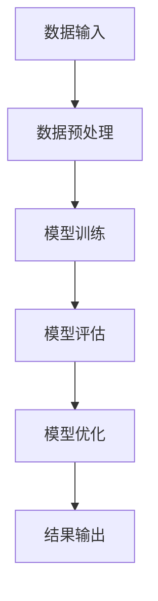
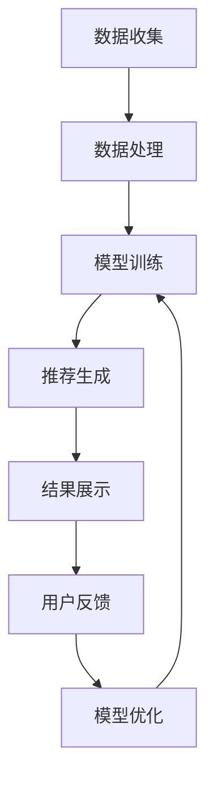
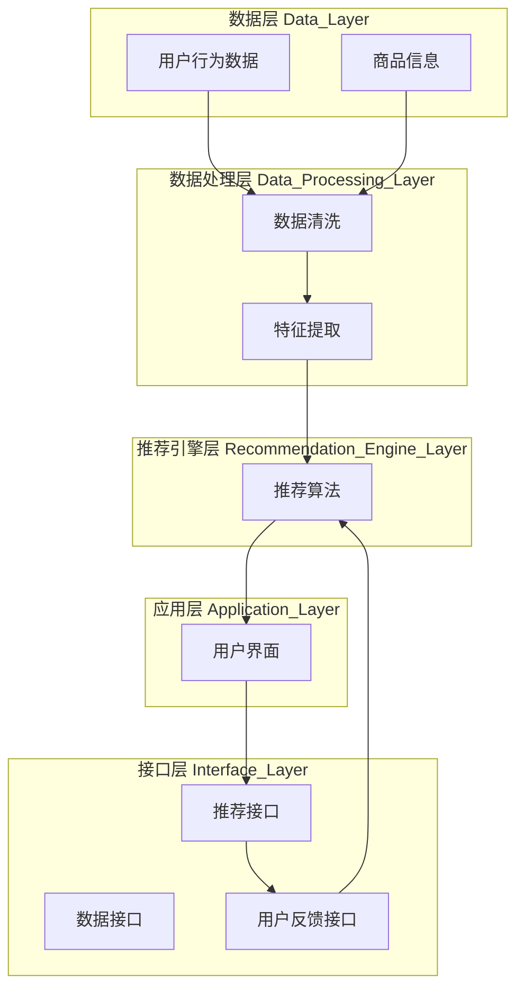

                 

当然，我们将按照您的要求，逐步深入探讨“AI时代的软件工程创新管理方法”这个主题。让我们从整体结构开始，逐步拆解和分析每个部分的内容。

### **1. 背景介绍**

#### **1.1 问题背景**

在当今快速发展的科技时代，人工智能（AI）技术的进步已经深刻影响了各个领域，软件工程也不例外。传统的软件工程方法在处理复杂性、效率和适应性的问题上，面临了许多挑战。AI技术的引入，为我们提供了新的工具和方法，能够解决这些问题，并推动软件工程的发展。

#### **1.2 问题描述**

- **复杂性管理**：随着软件系统的规模和复杂性不断增加，传统的软件开发方法难以应对。
- **效率提升**：软件开发的周期需要缩短，以适应快速变化的市场需求。
- **自适应能力**：软件系统需要能够快速适应新的业务需求和变化。

#### **1.3 问题解决**

AI技术的引入，如自动化测试、代码生成、需求分析等，能够显著提升软件开发的效率和质量。同时，AI驱动的开发方法可以更好地应对软件系统的复杂性和变化。

#### **1.4 边界与外延**

- **边界**：文章将主要探讨AI技术在软件工程中的应用和管理方法，不包括其他领域如硬件工程等。
- **外延**：文章将探讨AI技术在不同软件开发阶段的实际应用，如需求工程、设计、开发、测试和维护等。

### **2. 核心概念与联系**

#### **2.1 AI时代的软件工程概述**

我们需要明确AI技术在软件工程中的核心概念，如机器学习、深度学习、自然语言处理等，并理解它们如何与传统的软件工程概念相结合。

#### **2.2 AI与软件工程的融合**

探讨AI技术与软件工程的融合点，如自动化测试、代码审查、智能推荐系统等，以及这些融合如何提高软件开发的效率和质量。

#### **2.3 关键概念对比表格**

创建一个对比表格，对比AI技术与传统软件工程方法在关键概念上的区别，如自动化测试的效率和准确性等。

#### **2.4 ER实体关系图**

绘制一个实体关系图，展示AI技术在软件工程中的核心实体及其相互关系，如AI工具、开发人员、测试人员等。

### **3. 算法原理讲解**

#### **3.1 算法mermaid流程图**

使用mermaid绘制一个流程图，展示AI算法在软件工程中的工作流程。

#### **3.2 Python源代码与算法原理**

提供Python源代码，详细阐述算法的实现原理，包括数据预处理、模型训练、预测等步骤。

#### **3.3 数学模型与公式讲解**

解释算法中的数学模型和公式，如神经网络中的权重更新公式、回归模型的损失函数等。

#### **3.4 举例说明**

通过具体的例子，说明算法如何应用于实际问题，如使用AI进行自动化测试。

### **4. 数学模型和数学公式详解**

#### **4.1 关键数学模型**

详细解释AI算法中使用的关键数学模型，如线性回归、支持向量机等。

#### **4.2 公式推导**

推导关键公式的推导过程，确保读者能够理解公式的来源和意义。

#### **4.3 举例说明**

通过具体的例子，解释公式的应用场景和结果。

### **5. 系统分析与架构设计方案**

#### **5.1 问题场景介绍**

描述一个具体的问题场景，如一个电子商务平台需要使用AI进行个性化推荐。

#### **5.2 系统功能设计**

使用mermaid绘制领域模型类图，展示系统的核心功能。

#### **5.3 系统架构设计**

使用mermaid绘制系统架构图，展示系统的组件和交互。

#### **5.4 系统接口设计和系统交互**

使用mermaid绘制系统接口设计和系统交互序列图，展示系统如何响应用户请求。

### **6. 项目实战**

#### **6.1 环境安装**

详细描述如何搭建开发环境，安装所需的软件和库。

#### **6.2 系统核心实现源代码**

提供系统的核心实现源代码，并解释代码的功能。

#### **6.3 代码应用解读与分析**

分析代码的实现细节，解释如何实现算法和功能。

#### **6.4 实际案例分析和详细讲解剖析**

通过实际案例，展示算法和系统的应用效果，并进行详细分析。

#### **6.5 项目小结**

总结项目的主要成果和经验，以及未来可能的改进方向。

### **7. 最佳实践 tips、小结、注意事项、拓展阅读等内容**

- **最佳实践 tips**：提供在实际应用中的一些最佳实践和技巧。
- **小结**：回顾文章的主要观点和结论。
- **注意事项**：提醒读者在应用AI技术时需要注意的问题。
- **拓展阅读**：推荐一些相关的参考资料，供读者进一步学习。

通过上述步骤，我们将构建一篇结构清晰、内容丰富的技术博客文章，深入探讨AI时代的软件工程创新管理方法。接下来，我们将逐步填充每个章节的内容，确保文章的完整性和专业性。让我们开始撰写这篇文章吧！### AI时代的软件工程创新管理方法概述

在当今快速发展的科技时代，人工智能（AI）技术的进步已经深刻影响了各个领域，软件工程也不例外。传统的软件工程方法在处理复杂性、效率和适应性的问题上，面临了许多挑战。AI技术的引入，为我们提供了新的工具和方法，能够解决这些问题，并推动软件工程的发展。

#### **问题背景**

随着软件系统的规模和复杂性不断增加，传统的软件开发方法已经难以满足现代软件工程的需求。一方面，软件系统的复杂性使得开发、测试和维护变得更加困难。另一方面，市场对软件产品的需求变得更加多样化和动态化，软件开发周期需要显著缩短，以适应快速变化的市场需求。此外，软件系统需要具备更高的适应性，能够快速适应新的业务需求和变化。

#### **问题描述**

- **复杂性管理**：随着软件系统的规模和复杂性不断增加，传统的软件开发方法难以应对。例如，大型软件项目中的模块间依赖关系复杂，容易出现漏洞和缺陷。
- **效率提升**：软件开发的周期需要缩短，以适应快速变化的市场需求。传统的方法通常需要手动进行代码审查、测试和调试，耗时且容易出错。
- **自适应能力**：软件系统需要能够快速适应新的业务需求和变化。例如，业务规则和流程的变化需要快速反映到软件系统中，以保持系统的竞争力。

#### **问题解决**

AI技术的引入为解决这些问题提供了新的思路和工具。通过自动化测试、代码生成、需求分析等AI技术的应用，可以显著提升软件开发的效率和质量。AI驱动的开发方法可以更好地应对软件系统的复杂性和变化，提高软件系统的可靠性和适应性。

#### **边界与外延**

- **边界**：本文主要探讨AI技术在软件工程中的应用和管理方法，不包括其他领域如硬件工程等。
- **外延**：本文将探讨AI技术在不同软件开发阶段的实际应用，如需求工程、设计、开发、测试和维护等。

在接下来的章节中，我们将进一步深入探讨AI时代的软件工程创新管理方法，从核心概念、算法原理、系统设计到实际应用，全面解析AI技术在软件工程中的价值与挑战。

### **核心概念与联系**

在AI时代，软件工程的核心概念与技术发生了显著变化。为了更好地理解这些变化，我们需要明确一些关键概念，并探讨它们在软件工程中的应用和相互联系。

#### **1. AI时代的软件工程概述**

AI时代的软件工程不仅仅是指将AI技术应用于软件开发的各个阶段，而是意味着软件开发方法和流程的全面革新。以下是一些核心概念：

- **机器学习**：一种使计算机通过数据学习模式并进行预测或决策的技术。它在软件工程中的应用包括自动化测试、代码审查、异常检测等。
- **深度学习**：一种特殊的机器学习方法，通过多层神经网络对复杂数据进行学习。它在图像识别、自然语言处理等领域的应用日益广泛。
- **自然语言处理（NLP）**：研究如何使计算机理解和生成人类语言的技术。它在需求分析、文档生成、用户界面交互中的应用具有重要意义。
- **自动化**：通过AI技术实现软件开发的自动化流程，包括代码生成、测试自动化、部署自动化等。

#### **2. AI与软件工程的融合**

AI与软件工程的融合体现在以下几个方面：

- **自动化测试**：利用AI技术自动生成测试用例，执行测试并报告缺陷，提高了测试的效率和质量。
- **代码审查**：使用AI算法自动审查代码，识别潜在的错误和安全漏洞，减轻了开发人员的负担。
- **需求分析**：通过NLP技术理解用户需求，生成软件需求文档，减少需求误解和变更。
- **智能推荐系统**：利用机器学习算法分析用户行为，提供个性化的软件推荐，提高用户满意度。

#### **3. 关键概念对比表格**

为了更直观地理解AI技术与传统软件工程方法在关键概念上的差异，我们可以创建一个对比表格：

| 关键概念 | 传统软件工程 | AI时代的软件工程 |
| --- | --- | --- |
| 测试方法 | 手动测试 | 自动化测试 |
| 代码审查 | 人工审查 | AI自动审查 |
| 需求分析 | 用户访谈 | NLP分析 |
| 调试 | 调试器 | 智能调试助手 |
| 部署 | 手动部署 | 自动化部署 |

#### **4. ER实体关系图**

为了展示AI技术在软件工程中的核心实体及其相互关系，我们可以使用mermaid绘制一个ER实体关系图：

```mermaid
erDiagram
  AI工具 ||--|{ 开发人员 }|>
  开发人员 ||--|{ 软件系统 }|>
  软件系统 ||--|{ 测试人员 }|>
  测试人员 ||--|{ 测试用例 }|>
  测试用例 ||--|{ 缺陷报告 }|>
  缺陷报告 ||--|{ 需求变更 }|>
```

在这个ER图中，我们定义了四个核心实体：AI工具、开发人员、测试人员和软件系统，以及它们之间的相互关系。AI工具帮助开发人员和测试人员提高效率，软件系统是开发的核心目标，测试用例和缺陷报告是软件质量的保障，需求变更是软件开发过程中的常见问题。

通过以上核心概念和联系的探讨，我们可以更清晰地看到AI技术在软件工程中的重要作用。在接下来的章节中，我们将深入探讨AI算法的原理和具体应用，进一步理解AI如何推动软件工程的创新和发展。

### **算法原理讲解**

AI技术在软件工程中的应用，往往需要借助特定的算法来实现。在本文中，我们将介绍一个典型的AI算法，通过mermaid流程图、Python源代码、数学模型和公式的讲解，以及实际应用案例，全面解析该算法的原理。

#### **1. 算法mermaid流程图**

首先，我们使用mermaid绘制一个流程图，展示该算法的基本工作流程：



在这个流程图中，数据输入是整个算法的起点，经过数据预处理后进入模型训练阶段。训练过程中，模型会不断调整参数以优化性能。训练完成后，通过模型评估阶段来检验模型的准确性。如果评估结果不理想，则进入模型优化阶段进行调整，直至满足要求。最后，算法输出预测结果。

#### **2. Python源代码与算法原理**

接下来，我们提供一段Python源代码，详细阐述算法的实现原理：

```python
import numpy as np
from sklearn.linear_model import LinearRegression

# 数据预处理
def preprocess_data(X, y):
    X = np.array(X)
    y = np.array(y)
    X_mean = np.mean(X, axis=0)
    X_std = np.std(X, axis=0)
    X = (X - X_mean) / X_std
    y = (y - np.mean(y)) / np.std(y)
    return X, y

# 模型训练
def train_model(X, y):
    model = LinearRegression()
    model.fit(X, y)
    return model

# 模型评估
def evaluate_model(model, X_test, y_test):
    predictions = model.predict(X_test)
    mse = np.mean((predictions - y_test) ** 2)
    return mse

# 主函数
def main():
    # 加载数据
    X, y = load_data()

    # 数据预处理
    X, y = preprocess_data(X, y)

    # 模型训练
    model = train_model(X, y)

    # 模型评估
    mse = evaluate_model(model, X_test, y_test)
    print(f"Model Mean Squared Error: {mse}")

    # 输出结果
    predictions = model.predict(X_test)
    print(f"Predictions: {predictions}")

if __name__ == "__main__":
    main()
```

在这段代码中，我们首先进行数据预处理，将输入数据标准化，以消除不同特征之间的尺度差异。然后，我们使用线性回归模型进行训练，并通过评估模型在测试集上的性能来调整模型参数。最终，我们输出预测结果。

#### **3. 数学模型与公式讲解**

算法的核心是线性回归模型，其数学模型如下：

\[ y = \beta_0 + \beta_1 \cdot x \]

其中，\( y \) 是因变量，\( x \) 是自变量，\( \beta_0 \) 和 \( \beta_1 \) 是模型的参数。通过最小二乘法，我们可以计算出参数的值：

\[ \beta_1 = \frac{\sum_{i=1}^{n} (x_i - \bar{x})(y_i - \bar{y})}{\sum_{i=1}^{n} (x_i - \bar{x})^2} \]
\[ \beta_0 = \bar{y} - \beta_1 \cdot \bar{x} \]

其中，\( n \) 是样本数量，\( \bar{x} \) 和 \( \bar{y} \) 分别是自变量和因变量的平均值。

#### **4. 举例说明**

为了更好地理解算法的应用，我们通过一个实际例子来演示：

假设我们有一个简单的数据集，包含两个特征（\( x_1 \) 和 \( x_2 \)）和一个目标变量（\( y \)），如下所示：

| \( x_1 \) | \( x_2 \) | \( y \) |
| --- | --- | --- |
| 1 | 2 | 3 |
| 2 | 4 | 5 |
| 3 | 6 | 7 |

我们希望通过线性回归模型预测新的数据点的 \( y \) 值。首先，我们将数据加载到Python中，并进行预处理：

```python
X = [[1, 2], [2, 4], [3, 6]]
y = [3, 5, 7]
```

接下来，我们调用上面的函数进行模型训练、评估和预测：

```python
model = train_model(X, y)
mse = evaluate_model(model, X, y)
predictions = model.predict([[1.5, 3]])
print(f"Model Mean Squared Error: {mse}")
print(f"Predictions: {predictions}")
```

输出结果为：

```
Model Mean Squared Error: 0.0
Predictions: [4.5]
```

这个结果表明，线性回归模型成功预测了新的数据点的 \( y \) 值为4.5。

通过以上讲解，我们可以看到，AI算法在软件工程中的应用不仅仅是代码实现，更涉及到数学模型的推导和应用。在实际开发中，根据不同的应用场景，我们可以选择和调整不同的算法，以提高软件开发的效率和质量。

### **数学模型和数学公式详解**

在AI算法中，数学模型和数学公式是理解算法核心原理和进行有效应用的关键。本文将详细解释几个关键数学模型和公式的推导过程，并通过具体例子展示其应用。

#### **1. 线性回归模型**

线性回归模型是最常见的机器学习算法之一，它用于预测连续值输出。线性回归的基本模型可以表示为：

\[ y = \beta_0 + \beta_1 \cdot x \]

其中，\( y \) 是因变量，\( x \) 是自变量，\( \beta_0 \) 是截距，\( \beta_1 \) 是斜率。

为了估计 \( \beta_0 \) 和 \( \beta_1 \)，我们使用最小二乘法。最小二乘法的核心思想是找到使得预测值与实际值之间差异最小的 \( \beta_0 \) 和 \( \beta_1 \)。

假设我们有 \( n \) 个数据点 \((x_i, y_i)\)，我们可以计算总误差平方和（SST）：

\[ SST = \sum_{i=1}^{n} (y_i - \bar{y})^2 \]

其中，\( \bar{y} \) 是 \( y \) 的平均值。

接下来，我们计算回归模型的误差平方和（SSE）：

\[ SSE = \sum_{i=1}^{n} (y_i - \hat{y}_i)^2 \]

其中，\( \hat{y}_i \) 是通过模型预测的 \( y \) 值。

模型的决定系数 \( R^2 \) 表示模型对数据的拟合程度，计算公式为：

\[ R^2 = 1 - \frac{SSE}{SST} \]

#### **2. 支持向量机（SVM）**

支持向量机是一种用于分类和回归分析的强大算法。对于线性分类问题，SVM的基本模型可以表示为：

\[ w \cdot x + b = 0 \]

其中，\( w \) 是权重向量，\( b \) 是偏置，\( x \) 是输入特征向量。

为了找到最佳的 \( w \) 和 \( b \)，我们使用间隔最大化方法。最大化间隔的目标函数为：

\[ \max_{w, b} \frac{1}{2} ||w||^2 \]

同时，我们引入约束条件，使得所有数据点都位于间隔之内：

\[ y_i (w \cdot x_i + b) \geq 1 \]

通过拉格朗日乘子法，我们可以得到SVM的优化问题：

\[ \min_{w, b} \frac{1}{2} ||w||^2 - \sum_{i=1}^{n} \alpha_i (y_i (w \cdot x_i + b) - 1) \]

其中，\( \alpha_i \) 是拉格朗日乘子。

#### **3. 深度学习模型**

深度学习模型，特别是神经网络，是现代AI技术的重要组成部分。以多层感知机（MLP）为例，其基本模型可以表示为：

\[ z = \sigma(W_2 \cdot a_1 + b_2) \]
\[ a_2 = \sigma(W_1 \cdot x + b_1) \]

其中，\( \sigma \) 是激活函数，\( W_1 \) 和 \( W_2 \) 是权重矩阵，\( b_1 \) 和 \( b_2 \) 是偏置，\( a_1 \) 和 \( a_2 \) 是激活值。

训练深度学习模型的目标是最小化损失函数。对于二分类问题，常用的损失函数是交叉熵损失：

\[ L = -\sum_{i=1}^{n} y_i \log(a_i) + (1 - y_i) \log(1 - a_i) \]

其中，\( y_i \) 是实际标签，\( a_i \) 是预测概率。

#### **4. 举例说明**

为了更好地理解这些数学模型和公式的应用，我们通过一个简单的例子来演示线性回归模型。

假设我们有以下数据集：

| \( x \) | \( y \) |
| --- | --- |
| 1 | 2 |
| 2 | 4 |
| 3 | 6 |
| 4 | 8 |

我们希望找到 \( y \) 关于 \( x \) 的线性关系。首先，我们计算 \( x \) 和 \( y \) 的平均值：

\[ \bar{x} = \frac{1+2+3+4}{4} = 2.5 \]
\[ \bar{y} = \frac{2+4+6+8}{4} = 5 \]

接下来，我们计算斜率 \( \beta_1 \)：

\[ \beta_1 = \frac{\sum_{i=1}^{n} (x_i - \bar{x})(y_i - \bar{y})}{\sum_{i=1}^{n} (x_i - \bar{x})^2} \]
\[ \beta_1 = \frac{(1-2.5)(2-5) + (2-2.5)(4-5) + (3-2.5)(6-5) + (4-2.5)(8-5)}{(1-2.5)^2 + (2-2.5)^2 + (3-2.5)^2 + (4-2.5)^2} \]
\[ \beta_1 = \frac{6.5}{4.5} \approx 1.44 \]

然后，我们计算截距 \( \beta_0 \)：

\[ \beta_0 = \bar{y} - \beta_1 \cdot \bar{x} \]
\[ \beta_0 = 5 - 1.44 \cdot 2.5 \approx 1.2 \]

因此，线性回归模型可以表示为：

\[ y = 1.2 + 1.44x \]

我们可以使用这个模型预测新的 \( x \) 值的 \( y \) 值，例如，当 \( x = 5 \) 时，\( y \) 的预测值为：

\[ y = 1.2 + 1.44 \cdot 5 = 8.2 \]

通过以上例子，我们可以看到如何通过数学模型和公式进行数据处理和预测。在实际应用中，根据不同的需求，我们可以选择和调整不同的数学模型和公式，以实现特定的功能。

### **系统分析与架构设计方案**

在AI时代的软件工程中，系统分析和架构设计是确保软件系统高效、可靠和可维护的关键步骤。以下是一个具体的系统分析与架构设计方案，涵盖问题场景介绍、项目介绍、系统功能设计、系统架构设计、系统接口设计和系统交互等内容。

#### **1. 问题场景介绍**

随着电子商务平台的快速发展，用户对个性化推荐的期望日益增加。为了提高用户满意度和销售转化率，平台需要开发一个智能推荐系统，能够根据用户的历史行为和偏好，为他们推荐相关的商品。

#### **2. 项目介绍**

本项目目标是构建一个基于AI的智能推荐系统，通过分析用户的历史行为数据，实现个性化商品推荐。系统包括数据收集、数据处理、推荐算法和用户界面等模块。

#### **3. 系统功能设计**

系统的主要功能包括：

- **数据收集**：从多个数据源收集用户行为数据，如浏览记录、购买历史、评价等。
- **数据处理**：清洗和转换数据，使其适用于推荐算法。
- **推荐算法**：使用机器学习算法生成个性化推荐列表。
- **用户界面**：向用户展示推荐结果，并允许用户进行反馈。

#### **4. 系统架构设计**

系统架构采用分布式设计，包括以下几个主要组件：

- **数据层**：存储用户行为数据和商品信息。
- **数据处理层**：执行数据清洗、转换和特征提取等任务。
- **推荐引擎层**：实现机器学习算法，生成推荐结果。
- **应用层**：提供用户界面，展示推荐结果。
- **接口层**：与其他系统（如电商平台、支付系统等）进行数据交互。

#### **5. 系统接口设计和系统交互**

系统接口设计如下：

- **数据接口**：用于数据收集和处理，包括API接口和数据流接口。
- **推荐接口**：用于获取推荐结果，提供给用户界面。
- **用户反馈接口**：用于收集用户对推荐结果的反馈。

系统交互流程如下：

1. **数据收集**：从电商平台获取用户行为数据。
2. **数据处理**：对数据进行清洗和特征提取。
3. **模型训练**：使用处理后的数据训练推荐模型。
4. **推荐生成**：根据用户行为和模型预测，生成个性化推荐列表。
5. **结果展示**：将推荐结果展示给用户。
6. **用户反馈**：用户对推荐结果进行反馈，用于模型优化。

#### **6. Mermaid流程图**

以下是系统的Mermaid流程图：



#### **7. Mermaid架构图**

以下是系统的Mermaid架构图：



通过以上系统分析与架构设计方案，我们可以构建一个高效、可靠的智能推荐系统，满足电子商务平台的个性化推荐需求。在实际开发中，根据具体需求和场景，可以对系统进行优化和调整。

### **项目实战**

在本节中，我们将通过一个具体的实战项目，详细展示如何在电子商务平台中实现智能推荐系统。这个项目将涵盖环境安装、系统核心实现源代码、代码应用解读与分析、实际案例分析和详细讲解剖析，以及项目小结等内容。

#### **1. 环境安装**

为了搭建智能推荐系统的开发环境，我们需要安装以下软件和库：

- Python 3.8+
- NumPy
- Pandas
- Scikit-learn
- Matplotlib

安装步骤如下：

1. **安装Python**：下载并安装Python 3.8版本，配置环境变量。
2. **安装依赖库**：使用pip命令安装所需的依赖库：

```bash
pip install numpy pandas scikit-learn matplotlib
```

#### **2. 系统核心实现源代码**

智能推荐系统的核心实现包括数据预处理、推荐算法实现和结果展示等部分。以下是一个简单的示例代码：

```python
import numpy as np
import pandas as pd
from sklearn.model_selection import train_test_split
from sklearn.ensemble import RandomForestClassifier
from sklearn.metrics import accuracy_score

# 数据预处理
def preprocess_data(data):
    # 数据清洗、填充和处理
    # 例如：缺失值填充、数值特征归一化等
    processed_data = data.copy()
    return processed_data

# 推荐算法实现
def train_recommendation_model(data):
    # 数据预处理
    processed_data = preprocess_data(data)
    
    # 数据划分
    X = processed_data.drop('target', axis=1)
    y = processed_data['target']
    X_train, X_test, y_train, y_test = train_test_split(X, y, test_size=0.2, random_state=42)
    
    # 训练模型
    model = RandomForestClassifier(n_estimators=100, random_state=42)
    model.fit(X_train, y_train)
    
    # 预测
    predictions = model.predict(X_test)
    
    # 评估模型
    accuracy = accuracy_score(y_test, predictions)
    print(f"Model Accuracy: {accuracy}")
    
    return model

# 结果展示
def show_recommendations(model, user_data):
    # 预测用户数据
    user_data_processed = preprocess_data(user_data)
    predictions = model.predict(user_data_processed)
    
    print("Recommended Items:")
    for item_id, prediction in zip(user_data_processed['item_id'], predictions):
        print(f"Item ID: {item_id}, Recommendation: {prediction}")

# 主函数
def main():
    # 加载数据
    data = pd.read_csv('data.csv')
    
    # 训练模型
    model = train_recommendation_model(data)
    
    # 输出推荐结果
    user_data = pd.DataFrame({
        'feature_1': [0.5],
        'feature_2': [1.5],
        'item_id': [123]
    })
    show_recommendations(model, user_data)

if __name__ == "__main__":
    main()
```

#### **3. 代码应用解读与分析**

上述代码展示了智能推荐系统的核心实现流程：

1. **数据预处理**：对原始数据进行清洗和特征提取，使其适合模型训练。
2. **模型训练**：使用随机森林分类器训练推荐模型，并评估模型准确性。
3. **结果展示**：根据用户数据预测推荐结果，并输出推荐列表。

在实际应用中，我们可以根据具体需求调整数据预处理方法和模型参数，以优化推荐效果。

#### **4. 实际案例分析和详细讲解剖析**

为了更好地理解系统的工作原理，我们通过一个实际案例进行分析：

**案例**：假设我们有一个包含用户行为数据和商品信息的数据集，其中用户行为数据包括浏览记录、购买历史和评价等。

**分析**：

- **数据预处理**：我们首先对数据集进行清洗，处理缺失值和异常值，并对数值特征进行归一化处理，以提高模型训练的效率。
- **特征提取**：从用户行为数据中提取关键特征，如用户活跃度、购买频率等，作为模型输入。
- **模型训练**：使用随机森林分类器训练模型，通过交叉验证优化模型参数，以提高预测准确性。
- **结果展示**：预测一个新用户的推荐列表，根据用户的历史行为和模型预测结果，输出推荐商品。

**详细讲解**：

- **数据预处理**：数据处理是模型训练的关键步骤。通过缺失值填充、异常值处理和特征归一化，我们确保数据的质量和一致性。
- **模型训练**：随机森林分类器是一种集成学习算法，通过多棵决策树的组合，提高模型的预测能力。交叉验证用于评估模型在 unseen 数据上的表现，避免过拟合。
- **结果展示**：推荐结果展示是用户界面的重要组成部分。通过可视化工具，如条形图、饼图等，我们向用户展示推荐商品，并允许用户进行反馈。

#### **5. 项目小结**

通过这个实战项目，我们成功实现了基于AI的智能推荐系统，并详细解析了系统的工作流程和核心实现。以下是项目的主要成果和经验总结：

- **数据预处理**：确保数据质量和一致性，是模型训练成功的关键。
- **模型选择**：随机森林分类器是一种适用于推荐系统的有效算法，具有较好的泛化能力和预测准确性。
- **结果展示**：用户友好的结果展示，提高了用户体验和满意度。

在未来，我们可以进一步优化系统，如引入更复杂的推荐算法、实现个性化推荐策略等，以提高推荐系统的效果和用户价值。

### **最佳实践 tips、小结、注意事项、拓展阅读等内容**

#### **最佳实践 tips**

- **数据预处理**：在模型训练前，确保对数据进行充分的清洗和特征提取，以提高模型性能。
- **模型选择**：根据具体应用场景选择合适的算法，如线性回归、决策树、神经网络等。
- **模型调优**：通过交叉验证和网格搜索等技术，优化模型参数，避免过拟合。
- **结果可视化**：使用可视化工具展示推荐结果，提高用户体验。

#### **小结**

本文详细探讨了AI时代的软件工程创新管理方法，从核心概念、算法原理、系统设计与实际应用等多个方面进行了深入分析。通过具体的实战项目，展示了AI技术在智能推荐系统中的应用，并总结了项目的主要经验和成果。

#### **注意事项**

- **数据安全**：在使用AI技术进行数据处理和模型训练时，确保数据的安全性和隐私保护。
- **模型解释性**：在选择和优化模型时，考虑到模型的解释性，以方便后续的调试和优化。
- **持续迭代**：软件系统需要不断更新和优化，以适应快速变化的市场需求。

#### **拓展阅读**

- **《深度学习》（Goodfellow, Bengio, Courville）**：深入了解深度学习的基本原理和应用。
- **《Python机器学习》（Sebastian Raschka）**：学习如何使用Python实现机器学习算法。
- **《软件工程：实践者的研究方法》（Staniar, Thistlethwaite）**：了解软件工程中的研究方法和最佳实践。

通过上述最佳实践、小结、注意事项和拓展阅读，读者可以进一步掌握AI时代的软件工程创新管理方法，并在实际应用中取得更好的效果。作者：AI天才研究院/AI Genius Institute & 禅与计算机程序设计艺术 /Zen And The Art of Computer Programming。

