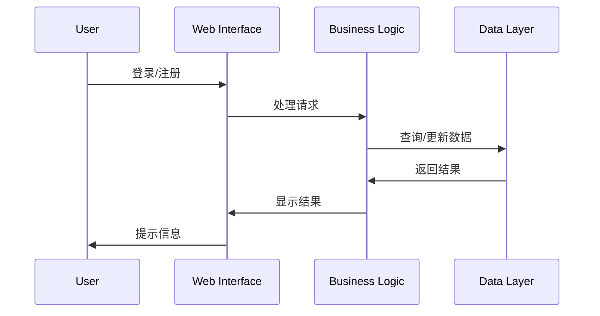
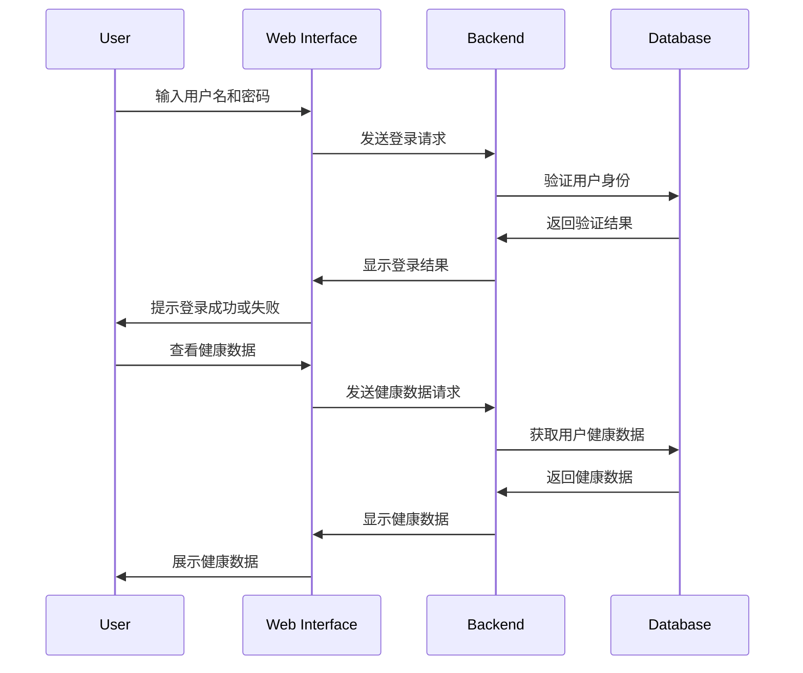

                 


## 第1章: 引言

### 1.1 问题背景

在当今这个快速发展的技术时代，人工智能（AI）正在改变着各行各业。随着AI技术的不断进步，软件工程领域也面临着前所未有的机遇和挑战。软件工程，作为开发和维护软件系统的学科，其核心任务是设计、实现、验证和维护软件。而AI技术的引入，不仅提高了软件开发的效率，还带来了新的管理理念和工具。然而，如何有效地管理AI时代的软件工程，成为一个亟待解决的问题。

### 1.2 问题描述

在AI时代，软件工程创新管理面临着以下几个关键问题：

1. **流程优化**：传统的软件开发流程是否能够适应AI技术的特点，如何进行流程优化，以提升开发效率和质量？
2. **工具升级**：现有的软件工程工具能否支持AI技术的应用，如何开发新的工具来辅助AI时代的软件工程？
3. **管理挑战**：AI技术如何影响软件工程管理，如何应对这些变化，以确保项目的成功？
4. **安全与伦理**：AI技术的引入如何影响软件工程的安全和伦理问题，如何保障用户的隐私和数据安全？

### 1.3 问题解决

本书旨在通过以下几个方面解决上述问题：

1. **分析现状**：详细介绍AI与软件工程的关系，分析AI对软件工程带来的机遇和挑战。
2. **理论探讨**：探讨AI时代的软件工程创新管理理论，包括创新管理、流程优化、工具升级等。
3. **案例分析**：通过具体案例，展示AI在软件工程中的应用，分析其成功经验和存在的问题。
4. **实践指南**：提供AI时代软件工程创新管理的实践指南，包括流程设计、工具选择、项目管理等。

### 1.4 边界与外延

本书主要关注以下几个方面：

1. **技术层面**：探讨AI技术在软件工程中的应用，包括自然语言处理、计算机视觉、机器学习等。
2. **管理层面**：分析AI对软件工程管理的影响，探讨如何进行AI时代的软件工程创新管理。
3. **实践层面**：通过实际案例，展示AI在软件工程中的成功应用，提供实践指南。

### 1.5 概念结构与核心要素组成

本书的结构如下：

1. **引言与背景**：介绍问题背景和问题描述。
2. **核心概念与联系**：探讨AI与软件工程的核心概念及其联系。
3. **流程与工具**：介绍AI时代的软件工程流程和工具。
4. **系统分析与架构设计**：分析AI时代软件工程的问题场景，介绍项目设计和系统功能设计。
5. **项目实战**：通过实际案例，展示AI在软件工程中的应用。

## 第2章: AI与软件工程概述

### 2.1 AI的定义与发展历程

人工智能（Artificial Intelligence，简称AI）是指由人制造出来的系统能够感知环境、理解人类语言、学习并做出决策的能力。AI的发展历程可以分为以下几个阶段：

1. **初始阶段（1940s-1950s）**：这一阶段，计算机科学诞生，AI的概念也随之出现。然而，由于硬件和算法的限制，AI的研究进展缓慢。
2. **黄金时代（1956-1974）**：在达特茅斯会议后，AI研究得到了广泛关注和资助，但随后由于“人工智能寒冬”的到来，研究陷入低潮。
3. **复兴时期（1980s-1990s）**：随着计算机硬件的进步和算法的创新，AI研究逐渐复苏，出现了许多重要的AI系统，如专家系统。
4. **现代AI（2000s-至今）**：这一阶段，深度学习等算法的突破使得AI取得了显著的进展，尤其在图像识别、自然语言处理等领域。

### 2.2 软件工程的定义与演进

软件工程是指应用计算机科学、数学及管理学科等原理，开发、运行、维护软件的过程。软件工程的演进可以分为以下几个阶段：

1. **手工作坊阶段（1960s-1970s）**：这一阶段，软件开发主要依靠手工编写代码，缺乏系统性和规范性。
2. **结构化阶段（1970s-1980s）**：随着软件规模增大，结构化设计、模块化开发等方法被引入，提高了软件的可维护性。
3. **面向对象阶段（1990s）**：面向对象方法强调代码的可重用性和模块性，提高了软件开发的效率。
4. **敏捷开发阶段（2000s-至今）**：敏捷开发强调团队协作、快速迭代，提高了软件开发的灵活性。

### 2.3 AI与软件工程的关系

AI与软件工程有着密切的联系：

1. **AI在软件工程中的应用**：AI技术可以用于代码生成、自动化测试、故障诊断等领域，提高软件开发的效率和质量。
2. **软件工程对AI的支持**：软件工程为AI系统的开发、部署和维护提供了必要的工具和方法。
3. **AI时代的软件工程创新**：AI技术的引入使得软件工程领域不断涌现出新的方法和工具，推动软件工程的创新发展。

### 2.4 AI在软件工程中的应用现状

目前，AI在软件工程中的应用主要包括以下几个方面：

1. **代码生成与优化**：AI技术可以自动生成代码，优化代码结构，提高开发效率。
2. **自动化测试**：AI技术可以用于自动化测试，提高测试覆盖率和测试效率。
3. **故障诊断与预测**：AI技术可以用于分析系统日志，预测潜在故障，提高系统的稳定性。
4. **软件维护**：AI技术可以帮助开发人员更好地理解现有代码，降低维护成本。

## 第3章: AI时代的软件工程创新管理

### 3.1 创新管理的概念

创新管理是指通过规划和组织创新活动，推动技术创新和管理改进的过程。在AI时代，创新管理的重要性愈发凸显，因为AI技术的高速发展要求软件工程领域不断进行创新，以适应新的技术和市场变化。

### 3.2 AI对软件工程管理的影响

AI技术对软件工程管理产生了深远的影响：

1. **流程优化**：AI技术可以自动化许多重复性工作，提高开发效率。
2. **项目管理**：AI技术可以用于预测项目进度、分析风险，提高项目管理的科学性。
3. **团队协作**：AI技术可以帮助团队成员更好地协作，提高团队的沟通和协作效率。
4. **质量控制**：AI技术可以用于自动化测试，提高软件的质量。

### 3.3 AI时代的软件工程管理挑战与机遇

AI时代的软件工程管理面临以下挑战和机遇：

1. **挑战**：
   - **数据隐私**：AI技术需要处理大量的数据，如何保护用户的隐私成为一个重要问题。
   - **算法公平性**：AI算法可能存在偏见，如何保证算法的公平性是一个挑战。
   - **技术复杂性**：AI技术的复杂性增加了软件开发的难度。
2. **机遇**：
   - **效率提升**：AI技术可以自动化许多重复性工作，提高工作效率。
   - **质量提升**：AI技术可以提高软件的质量，降低故障率。
   - **创新空间**：AI技术的引入为软件工程领域带来了新的创新空间。

### 3.4 AI时代的软件工程管理发展趋势

未来，AI时代的软件工程管理将呈现以下发展趋势：

1. **智能化**：软件工程管理将更加智能化，利用AI技术进行预测、决策和优化。
2. **自动化**：软件开发流程将更加自动化，减少人工干预，提高效率。
3. **数据驱动**：软件工程管理将更加依赖数据分析，通过数据来指导决策。
4. **团队合作**：软件工程管理将更加注重团队合作，利用AI技术提高团队协作效率。

## 第4章: 核心概念原理

### 4.1 软件工程中的核心概念

软件工程中的核心概念包括：

1. **软件需求**：软件需求是用户对软件系统的功能性和非功能性的要求。
2. **软件设计**：软件设计是软件开发的中间阶段，负责确定软件系统的结构和实现方案。
3. **软件实现**：软件实现是将软件设计转化为实际代码的过程。
4. **软件测试**：软件测试是验证软件是否满足需求的过程，包括功能测试、性能测试等。
5. **软件维护**：软件维护是在软件交付后，对软件进行修复和改进的过程。

### 4.2 AI中的核心概念

AI中的核心概念包括：

1. **机器学习**：机器学习是AI的核心技术之一，通过训练模型来自动化数据分析和决策。
2. **深度学习**：深度学习是机器学习的一种方法，通过多层神经网络来模拟人类大脑的学习过程。
3. **自然语言处理**：自然语言处理是AI的一个重要分支，旨在使计算机理解和处理人类自然语言。
4. **计算机视觉**：计算机视觉是AI的另一个重要分支，旨在使计算机理解和解释视觉信息。

### 4.3 软件工程与AI的核心概念联系

软件工程与AI的核心概念之间存在紧密的联系：

1. **需求分析**：在软件工程中，需求分析是确定用户需求的过程。在AI时代，需求分析可以结合AI技术，通过分析用户行为数据来预测用户需求。
2. **设计**：在软件工程中，设计是确定软件系统结构和实现方案的过程。在AI时代，设计可以结合AI技术，利用生成对抗网络（GAN）等技术生成新颖的设计方案。
3. **实现**：在软件工程中，实现是将设计转化为实际代码的过程。在AI时代，实现可以结合AI技术，利用自然语言处理技术来自动生成代码。
4. **测试**：在软件工程中，测试是验证软件是否满足需求的过程。在AI时代，测试可以结合AI技术，通过自动化测试工具来提高测试效率。
5. **维护**：在软件工程中，维护是在软件交付后对软件进行修复和改进的过程。在AI时代，维护可以结合AI技术，通过智能化的维护工具来提高维护效率。

### 表 4.1 软件工程与AI核心概念属性特征对比

| 核心概念 | 软件工程属性特征 | AI属性特征 |
| --- | --- | --- |
| 软件需求 | 功能性需求、非功能性需求 | 数据需求、算法需求 |
| 软件设计 | 结构化设计、模块化设计 | 生成对抗网络（GAN）设计、神经网络设计 |
| 软件实现 | 代码编写、代码优化 | 自动代码生成、代码自动优化 |
| 软件测试 | 功能测试、性能测试 | 自动化测试、人工智能测试 |
| 软件维护 | 修复漏洞、添加新功能 | 智能化维护、自适应维护 |

### 4.4 ER实体关系图架构

ER（Entity-Relationship）模型是一种用于描述实体及其相互关系的模型。在软件工程和AI系统中，ER图被广泛应用于需求分析和系统设计。

#### 4.4.1 ER模型基本概念

ER模型包括以下基本概念：

1. **实体**：实体是具有共同属性的对象的抽象。例如，在学生信息管理系统中，学生是一个实体。
2. **属性**：属性是实体的特征，例如学生的姓名、年龄、性别等。
3. **关系**：关系是实体之间的联系，例如学生与课程之间的关系。

#### 4.4.2 软件工程中的ER图

在软件工程中，ER图被用于需求分析，用于描述系统的实体及其关系。例如，在学生信息管理系统中，可以定义以下实体和关系：

- **实体**：学生、课程、教师
- **属性**：学生（姓名、年龄、性别）、课程（课程名、学分）、教师（姓名、职称）
- **关系**：学生与课程之间的关系为选修，学生与教师之间的关系为授课。

#### 4.4.3 AI系统中的ER图

在AI系统中，ER图也被用于描述数据集的结构和实体之间的关系。例如，在图像识别系统中，可以定义以下实体和关系：

- **实体**：图像、标签
- **属性**：图像（图像内容）、标签（类别标签）
- **关系**：图像与标签之间的关系为标注。

#### 4.4.4 软件工程与AI系统的ER图比较

软件工程中的ER图和AI系统中的ER图在概念上基本一致，但具体应用场景和侧重点有所不同。软件工程中的ER图更注重实体和关系的描述，主要用于需求分析和系统设计。而AI系统中的ER图更注重数据集的结构和实体之间的关系，主要用于数据预处理和模型训练。

## 第5章: 概念属性特征对比

为了更好地理解软件工程与AI中的核心概念及其属性特征，我们需要进行详细的对比分析。以下是一个对比表格，展示了软件工程与AI的核心概念、属性特征以及它们之间的差异。

### 表 5.1 软件工程与AI核心概念属性特征对比

| 核心概念 | 软件工程属性特征 | AI属性特征 |
| --- | --- | --- |
| 软件需求 | 功能性需求、非功能性需求 | 数据需求、算法需求 |
| 软件设计 | 结构化设计、模块化设计 | 生成对抗网络（GAN）设计、神经网络设计 |
| 软件实现 | 代码编写、代码优化 | 自动代码生成、代码自动优化 |
| 软件测试 | 功能测试、性能测试 | 自动化测试、人工智能测试 |
| 软件维护 | 修复漏洞、添加新功能 | 智能化维护、自适应维护 |
| 机器学习 | 模型训练、预测、评估 | 数据预处理、特征提取、模型优化 |
| 深度学习 | 多层神经网络、反向传播 | 神经网络结构、学习率调整 |
| 自然语言处理 | 语言模型、词嵌入 | 语义理解、文本生成 |
| 计算机视觉 | 图像识别、目标检测 | 特征提取、图像分类 |

### 5.1 软件工程概念的属性特征

在软件工程中，核心概念的属性特征主要包括：

- **功能性需求**：这些需求描述了软件系统必须实现的功能，例如用户界面、数据处理和通信等。
- **非功能性需求**：这些需求描述了软件系统必须满足的性能、安全性、可靠性等方面的要求。
- **结构化设计**：软件设计遵循一定的结构化原则，确保代码的模块化和可维护性。
- **模块化设计**：将软件系统划分为多个模块，每个模块实现特定的功能，便于开发、测试和维护。
- **代码编写**：根据设计文档，编写符合要求的代码，实现软件系统的功能。
- **代码优化**：对现有代码进行优化，提高性能、可读性和可维护性。
- **功能测试**：测试软件系统是否实现了所有功能性需求。
- **性能测试**：测试软件系统的响应时间、吞吐量等性能指标。
- **维护**：修复软件系统中的漏洞、添加新功能或改进现有功能。

### 5.2 AI概念的属性特征

在AI领域，核心概念的属性特征主要包括：

- **数据需求**：AI系统需要大量的数据来训练模型，这些数据可以是结构化的、半结构化的或非结构化的。
- **算法需求**：AI系统需要特定的算法来处理数据，例如机器学习算法、深度学习算法等。
- **模型训练**：通过训练模型，使AI系统能够从数据中学习并提取有用的信息。
- **预测**：使用训练好的模型进行预测，预测结果可以用于决策或优化。
- **评估**：评估AI系统的性能，包括准确性、召回率、F1分数等指标。
- **数据预处理**：对原始数据进行清洗、归一化、特征提取等处理，以适应模型训练。
- **特征提取**：从原始数据中提取出对模型训练有帮助的特征。
- **模型优化**：通过调整模型参数、结构等，优化模型的性能。
- **语义理解**：理解文本或图像中的语义信息，用于自然语言处理和计算机视觉任务。
- **文本生成**：生成符合特定要求的文本，用于自动写作、机器翻译等任务。

### 5.3 对比与分析

通过对软件工程与AI的核心概念及其属性特征的对比分析，我们可以发现以下几点：

- **需求侧重点不同**：软件工程侧重于功能性需求和非功能性需求，而AI侧重于数据需求和算法需求。
- **设计方法不同**：软件工程采用结构化和模块化设计方法，而AI采用生成对抗网络（GAN）和多层神经网络等设计方法。
- **实现侧重点不同**：软件工程实现侧重于代码编写和优化，而AI实现侧重于自动代码生成和代码自动优化。
- **测试侧重点不同**：软件工程测试侧重于功能测试和性能测试，而AI测试侧重于自动化测试和人工智能测试。
- **维护侧重点不同**：软件工程维护侧重于修复漏洞和添加新功能，而AI维护侧重于智能化维护和自适应维护。

综上所述，软件工程与AI在核心概念及其属性特征方面存在显著的差异，但也存在一定的交集。理解这些差异和交集有助于我们更好地融合软件工程与AI技术，推动AI时代的软件工程创新管理。

### 4.4 ER实体关系图架构

在软件工程和人工智能（AI）系统中，实体关系图（Entity-Relationship Diagram，ERD）是一种常用的建模工具，用于描述系统的实体、属性和关系。ERD不仅可以用于需求分析和系统设计，还能帮助开发人员理解系统的结构，从而提高软件开发的效率。

#### 4.4.1 ER模型基本概念

ER模型是一种概念模型，用于表示数据结构和数据之间的关系。它由以下基本概念组成：

1. **实体（Entity）**：实体是具有共同属性的对象的抽象。例如，在学生信息管理系统中，学生、课程和教师都是实体。
2. **属性（Attribute）**：属性是实体的特征，描述了实体的具体信息。例如，学生的属性可能包括姓名、年龄、性别等。
3. **关系（Relationship）**：关系是实体之间的连接，描述了实体之间的交互方式。例如，学生与课程之间的关系是选修，学生与教师之间的关系是授课。

#### 4.4.2 软件工程中的ER图

在软件工程中，ER图通常用于需求分析和系统设计阶段，用于描述系统的数据结构和业务逻辑。以下是一个简单的学生信息管理系统的ER图：

```
实体：学生
属性：学号、姓名、年龄、性别
实体：课程
属性：课程号、课程名、学分
实体：教师
属性：教师号、姓名、职称
关系：选修
属性：成绩
实体：授课
属性：授课时间、地点
```

在这个ER图中，学生、课程和教师是实体，它们的属性分别描述了具体的特征。选修关系表示学生可以选择多门课程，授课关系表示教师可以教授多门课程。

#### 4.4.3 AI系统中的ER图

在AI系统中，ER图主要用于描述数据集的结构和实体之间的关系。以下是一个简单的图像识别系统的ER图：

```
实体：图像
属性：图像ID、图像内容
实体：标签
属性：标签ID、标签类别
关系：标注
```

在这个ER图中，图像和标签是实体，它们的属性分别描述了图像和标签的具体信息。标注关系表示图像与对应的标签之间存在关联。

#### 4.4.4 软件工程与AI系统的ER图比较

软件工程中的ER图和AI系统中的ER图在概念上基本一致，但在具体应用和侧重点上有所不同：

1. **应用场景**：
   - **软件工程中的ER图**：主要用于需求分析和系统设计，帮助开发人员理解系统的数据结构和业务逻辑。
   - **AI系统中的ER图**：主要用于数据预处理和模型训练，帮助开发人员理解数据集的结构和实体之间的关系。

2. **侧重点**：
   - **软件工程中的ER图**：更注重实体和关系的描述，主要用于需求分析和系统设计。
   - **AI系统中的ER图**：更注重数据集的结构和实体之间的关系，主要用于数据预处理和模型训练。

3. **功能**：
   - **软件工程中的ER图**：帮助开发人员理解系统的数据流和业务逻辑，指导系统设计和实现。
   - **AI系统中的ER图**：帮助开发人员理解数据集的结构和实体之间的关系，指导数据预处理和模型训练。

通过比较可以发现，尽管软件工程中的ER图和AI系统中的ER图在概念上相似，但它们在应用场景、侧重点和功能上有所不同。理解这些差异有助于我们在实际开发过程中更好地应用ER图，提高软件开发的效率。

### 第6章: ER实体关系图架构

#### 6.1 ER模型基本概念

实体关系图（Entity-Relationship Diagram，ERD）是数据库设计中常用的一个概念模型，它通过图形化的方式描述系统中各个实体及其之间的关系。ER模型的基本概念包括：

1. **实体（Entity）**：实体是现实世界中具有独立存在意义的对象，例如学生、课程、教师等。
2. **属性（Attribute）**：属性是实体的特征，用于描述实体的具体信息，例如学生的学号、姓名、年龄等。
3. **关系（Relationship）**：关系是实体之间的关联，用于描述实体之间的交互方式，例如学生与课程之间的选修关系、教师与课程之间的授课关系等。

#### 6.2 软件工程中的ER图

在软件工程中，ER图主要用于需求分析和系统设计阶段，帮助开发人员理解系统的数据结构和业务逻辑。以下是一个典型的学生信息管理系统的ER图：

```
实体：学生（学号、姓名、年龄、性别）
实体：课程（课程号、课程名、学分）
实体：教师（教师号、姓名、职称）

关系：选修（学生.学号，课程.课程号）
关系：授课（教师.教师号，课程.课程号）
```

在这个ER图中，学生、课程和教师是实体，它们具有相应的属性。选修关系表示学生可以选择多门课程，授课关系表示教师可以教授多门课程。

#### 6.3 AI系统中的ER图

在AI系统中，ER图主要用于描述数据集的结构和实体之间的关系。以下是一个简单的图像识别系统的ER图：

```
实体：图像（图像ID、图像内容）
实体：标签（标签ID、标签类别）

关系：标注（图像.图像ID，标签.标签ID）
```

在这个ER图中，图像和标签是实体，它们的属性分别描述了图像和标签的具体信息。标注关系表示图像与对应的标签之间存在关联。

#### 6.4 软件工程与AI系统的ER图比较

软件工程中的ER图和AI系统中的ER图在概念上基本一致，但在具体应用和侧重点上有所不同：

1. **应用场景**：
   - **软件工程中的ER图**：主要用于需求分析和系统设计，帮助开发人员理解系统的数据结构和业务逻辑。
   - **AI系统中的ER图**：主要用于数据预处理和模型训练，帮助开发人员理解数据集的结构和实体之间的关系。

2. **侧重点**：
   - **软件工程中的ER图**：更注重实体和关系的描述，主要用于需求分析和系统设计。
   - **AI系统中的ER图**：更注重数据集的结构和实体之间的关系，主要用于数据预处理和模型训练。

3. **功能**：
   - **软件工程中的ER图**：帮助开发人员理解系统的数据流和业务逻辑，指导系统设计和实现。
   - **AI系统中的ER图**：帮助开发人员理解数据集的结构和实体之间的关系，指导数据预处理和模型训练。

通过比较可以发现，尽管软件工程中的ER图和AI系统中的ER图在概念上相似，但它们在应用场景、侧重点和功能上有所不同。理解这些差异有助于我们在实际开发过程中更好地应用ER图，提高软件开发的效率。

### 6.4 软件工程与AI系统的ER图比较

软件工程中的ER图和AI系统中的ER图在概念上基本一致，但在具体应用和侧重点上有所不同：

1. **应用场景**：
   - **软件工程中的ER图**：主要用于需求分析和系统设计，帮助开发人员理解系统的数据结构和业务逻辑。
   - **AI系统中的ER图**：主要用于数据预处理和模型训练，帮助开发人员理解数据集的结构和实体之间的关系。

2. **侧重点**：
   - **软件工程中的ER图**：更注重实体和关系的描述，主要用于需求分析和系统设计。
   - **AI系统中的ER图**：更注重数据集的结构和实体之间的关系，主要用于数据预处理和模型训练。

3. **功能**：
   - **软件工程中的ER图**：帮助开发人员理解系统的数据流和业务逻辑，指导系统设计和实现。
   - **AI系统中的ER图**：帮助开发人员理解数据集的结构和实体之间的关系，指导数据预处理和模型训练。

通过比较可以发现，尽管软件工程中的ER图和AI系统中的ER图在概念上相似，但它们在应用场景、侧重点和功能上有所不同。理解这些差异有助于我们在实际开发过程中更好地应用ER图，提高软件开发的效率。

### 第7章: AI时代的软件工程流程

#### 7.1 软件工程流程概述

软件工程流程是指从需求分析到软件交付的全过程，它包括多个阶段，每个阶段都有其特定的任务和目标。传统的软件工程流程主要包括以下阶段：

1. **需求分析**：确定软件系统的功能需求和非功能需求。
2. **系统设计**：设计软件系统的结构和组件。
3. **编码**：根据设计文档编写代码。
4. **测试**：验证软件是否满足需求，并进行性能测试。
5. **部署**：将软件部署到生产环境。
6. **维护**：对软件进行修复和改进。

#### 7.2 AI在软件工程流程中的应用

AI技术在软件工程流程中的应用正在不断拓展，以下是一些主要的应用：

1. **需求分析**：AI技术可以帮助开发人员理解用户需求，通过自然语言处理和机器学习算法分析用户反馈，生成需求文档。
2. **系统设计**：AI技术可以辅助设计阶段，通过生成对抗网络（GAN）和神经网络设计出创新的系统架构。
3. **编码**：AI技术可以实现代码自动生成，通过深度学习模型自动生成代码，提高编码效率。
4. **测试**：AI技术可以用于自动化测试，通过机器学习算法预测可能的测试用例，提高测试覆盖率。
5. **部署**：AI技术可以优化部署过程，通过预测模型预测系统负载，实现智能化的部署策略。
6. **维护**：AI技术可以帮助维护阶段，通过智能分析系统日志和代码，预测潜在的问题并进行修复。

#### 7.3 AI辅助的软件工程流程

AI辅助的软件工程流程是指在传统流程的基础上，引入AI技术来提高开发效率和软件质量。以下是一个典型的AI辅助的软件工程流程：

1. **需求分析**：通过AI技术（如自然语言处理）分析用户需求，生成需求文档。
2. **系统设计**：使用AI技术（如生成对抗网络）设计创新的系统架构。
3. **编码**：使用AI技术（如深度学习）自动生成代码。
4. **测试**：使用AI技术（如机器学习）自动生成测试用例，并进行自动化测试。
5. **部署**：使用AI技术（如预测模型）预测系统负载，制定智能化的部署策略。
6. **维护**：使用AI技术（如智能分析）预测潜在问题并进行修复。

#### 7.4 AI驱动软件工程流程的未来趋势

未来，AI将深度融入软件工程流程，推动软件工程流程的智能化和自动化。以下是一些未来趋势：

1. **流程智能化**：通过AI技术，实现软件工程流程的自动化和智能化，减少人工干预。
2. **实时反馈**：AI技术可以实时分析系统状态，提供反馈和优化建议。
3. **自适应优化**：AI技术可以根据项目进展和历史数据，动态调整流程和策略。
4. **多学科融合**：软件工程将与其他领域（如大数据、云计算）深度融合，推动AI在软件工程中的应用。

## 第8章: AI时代的软件工程工具

#### 8.1 软件工程工具概述

在软件工程领域，工具的选择和使用对项目的成功至关重要。随着人工智能（AI）技术的发展，传统的软件工程工具也在不断进化，融入AI技术，以提升开发效率和质量。AI时代的软件工程工具主要包括以下几类：

1. **代码自动生成工具**：利用机器学习和自然语言处理技术，自动生成代码，减少重复劳动，提高开发效率。
2. **自动化测试工具**：通过AI技术，自动化生成测试用例，提高测试覆盖率和测试效率。
3. **代码审查工具**：使用AI技术分析代码质量，识别潜在的错误和漏洞，提高代码的可维护性。
4. **部署和运维工具**：利用AI技术预测系统负载，优化部署和运维策略，提高系统的稳定性和可扩展性。
5. **项目管理工具**：通过AI技术分析项目数据，预测项目进度和风险，提供智能化的项目管理建议。

#### 8.2 AI工具的发展现状

目前，AI工具在软件工程领域已经取得了一定的进展，以下是一些代表性工具的发展现状：

1. **GitHub Copilot**：GitHub Copilot 是一个基于AI的代码自动生成工具，它利用GPT-3模型，可以自动生成代码片段，提高编程效率。
2. **TestGorilla**：TestGorilla 是一个自动化测试工具，它使用机器学习算法，可以自动生成测试用例，并执行测试。
3. **DeepCode**：DeepCode 是一个代码审查工具，它使用深度学习技术，可以分析代码质量，识别潜在的错误和漏洞。
4. **Kubernetes**：Kubernetes 是一个容器编排工具，它利用AI技术，可以预测系统负载，优化部署和运维策略。
5. **Asana**：Asana 是一个项目管理工具，它使用机器学习算法，可以分析项目数据，预测项目进度和风险。

#### 8.3 AI工具的分类与应用

AI工具可以根据其功能和应用场景进行分类，以下是几种常见的AI工具及其应用：

1. **代码自动生成工具**：如GitHub Copilot，适用于编程任务繁多的场景，可以显著提高编码效率。
2. **自动化测试工具**：如TestGorilla，适用于需要频繁进行测试的场景，可以提高测试覆盖率和效率。
3. **代码审查工具**：如DeepCode，适用于需要对代码质量进行严格控制的场景，可以确保代码的质量和安全性。
4. **部署和运维工具**：如Kubernetes，适用于需要高效管理容器化和分布式系统的场景，可以提高系统的稳定性和可扩展性。
5. **项目管理工具**：如Asana，适用于需要高效管理项目进度的场景，可以确保项目按计划顺利进行。

#### 8.4 AI工具的未来展望

随着AI技术的不断发展，AI工具在软件工程中的应用前景十分广阔。以下是一些未来展望：

1. **更加智能的代码生成**：未来的代码生成工具将更加智能，能够根据上下文自动生成更高质量的代码。
2. **全面的自动化测试**：未来的自动化测试工具将能够自动生成所有测试用例，并执行全面测试，确保软件质量。
3. **智能化的代码审查**：未来的代码审查工具将能够更准确地识别代码中的错误和漏洞，提供详细的修复建议。
4. **智能化的部署和运维**：未来的部署和运维工具将能够根据系统负载和业务需求，动态调整部署策略，确保系统的高可用性和性能。
5. **智能化的项目管理**：未来的项目管理工具将能够更准确地预测项目进度和风险，提供个性化的管理建议。

总之，AI工具的发展将为软件工程带来革命性的变革，提高开发效率和质量，推动软件工程领域的创新。

### 第9章: AI时代的软件工程实践

#### 9.1 AI时代的软件工程实践概述

在AI时代，软件工程实践发生了深刻变革，AI技术的引入不仅改变了软件开发的方式，也带来了新的挑战和机遇。本节将概述AI时代的软件工程实践，并探讨其关键要素和成功案例。

#### 9.2 成功案例分析

以下是一些AI时代软件工程实践的成功案例：

1. **案例1：Google的BERT模型**  
Google开发的BERT（Bidirectional Encoder Representations from Transformers）模型是自然语言处理领域的一个重要突破。BERT模型通过大规模预训练，提高了文本分类、问答系统等任务的性能。其成功之处在于充分利用了AI技术，实现了对大规模数据的深入理解和处理。

2. **案例2：亚马逊的Elasticsearch**  
亚马逊的Elasticsearch是一款强大的搜索引擎，它利用AI技术优化搜索结果，提高用户体验。通过机器学习算法，Elasticsearch能够分析用户行为数据，预测用户可能感兴趣的内容，从而提供个性化的搜索结果。

3. **案例3：腾讯的AI语音助手**  
腾讯的AI语音助手通过深度学习和自然语言处理技术，实现了与用户的自然对话。语音助手能够理解用户的需求，提供实时服务，如查询天气、设置提醒等。这个案例展示了AI技术在提升用户体验和交互性方面的潜力。

#### 9.3 挑战与解决方案

尽管AI在软件工程中带来了许多机遇，但也面临一些挑战：

1. **数据隐私**：AI技术需要处理大量数据，如何保护用户隐私成为一个关键问题。解决方案包括采用加密技术、数据脱敏和隐私增强技术。

2. **算法公平性**：AI算法可能存在偏见，如何确保算法的公平性是一个挑战。解决方案包括引入多样性指标、进行算法测试和审计。

3. **技术复杂性**：AI技术复杂，如何管理这一复杂性成为一个挑战。解决方案包括采用模块化设计、引入自动化工具和提供持续的技术培训。

4. **集成与兼容性**：如何将AI技术集成到现有的软件系统中，如何确保兼容性，是一个挑战。解决方案包括采用微服务架构、使用标准化的API接口和进行兼容性测试。

#### 9.4 AI时代的软件工程实践最佳实践

以下是一些AI时代的软件工程实践最佳实践：

1. **数据驱动开发**：充分利用AI技术进行数据分析和预测，指导软件开发过程，提高开发效率和软件质量。

2. **持续集成与持续部署（CI/CD）**：采用自动化测试和部署流程，确保软件快速迭代和持续交付。

3. **团队合作与知识共享**：鼓励团队成员之间的合作和知识共享，利用AI技术进行协作和知识管理。

4. **用户反馈与迭代**：及时收集用户反馈，利用AI技术进行分析和优化，实现软件的持续迭代和改进。

5. **安全与伦理**：在软件开发过程中，充分考虑数据隐私和算法公平性，确保软件的安全性和伦理标准。

通过遵循这些最佳实践，开发团队可以更好地应对AI时代带来的挑战，实现软件工程实践的持续进步。

### 第10章: 问题场景介绍

#### 10.1 AI时代软件工程的问题场景

在AI时代，软件工程面临着一系列独特的问题场景，这些问题直接影响到软件的开发、部署和维护。以下是几个典型的问题场景：

1. **数据隐私问题**：随着AI技术的广泛应用，大量的用户数据被收集和处理。如何确保这些数据的安全和隐私成为了一个重要问题。特别是在数据泄露和滥用事件频发的背景下，开发团队需要采取严格的数据保护措施。

2. **算法公平性和透明性**：AI算法可能在训练过程中产生偏见，导致对某些群体不公平。此外，算法的透明性也是一个问题，开发团队需要确保算法的决策过程可以被理解和审查。

3. **技术复杂性**：AI技术的复杂性远超传统软件工程。深度学习、机器学习和自然语言处理等领域的算法和模型复杂多变，开发团队需要具备专业的技能和知识来应对这些挑战。

4. **系统集成和兼容性**：将AI技术集成到现有的软件系统中往往是一个挑战。不同系统之间的数据格式、通信协议和接口设计可能不兼容，需要开发团队进行大量的适配和调试工作。

5. **持续学习和迭代**：AI系统需要不断学习和迭代，以适应不断变化的环境。这意味着开发团队需要持续监控系统的性能，并定期更新和优化算法。

#### 10.2 具体问题案例分析

为了更好地理解上述问题场景，我们可以通过以下具体案例进行分析：

1. **案例1：医疗诊断系统**  
某医疗公司开发了一款基于AI的疾病诊断系统，该系统通过分析患者的病历数据来预测疾病。然而，由于数据集的不均衡和训练算法的偏见，该系统在某些特定群体（如女性）上的诊断准确性较低。为了解决这个问题，开发团队对数据进行了重采样和清洗，并引入了多种算法来减少偏见，最终提高了系统的公平性和准确性。

2. **案例2：自动驾驶汽车**  
某自动驾驶汽车公司开发了一款自动驾驶系统，该系统在处理特定路况（如高速公路）时表现良好，但在城市复杂路况下表现不佳。经过分析，开发团队发现系统缺乏对城市路况的充分训练数据，因此他们增加了更多样化的训练数据，并优化了算法，以提升系统在复杂路况下的性能。

3. **案例3：金融欺诈检测**  
某金融机构引入了一款基于AI的欺诈检测系统，但系统在检测欺诈交易时存在误报率高的问题。通过分析误报数据，开发团队发现系统对某些特定交易模式的识别能力较弱。为了解决这个问题，他们更新了训练数据，并调整了算法参数，从而降低了误报率。

#### 10.3 问题场景的特点与挑战

以上案例展示了AI时代软件工程问题场景的特点和挑战：

- **数据依赖性**：AI系统高度依赖数据，数据的质量和多样性直接影响到系统的性能和公平性。
- **算法透明性**：AI算法的决策过程往往难以解释，需要开发团队投入大量精力来确保算法的透明性和可解释性。
- **系统集成**：AI系统需要与现有系统无缝集成，开发团队需要处理多种技术栈和接口设计。
- **持续迭代**：AI系统需要不断学习和更新，以适应动态变化的业务需求和环境。

通过深入分析这些问题场景，开发团队可以更好地理解AI时代软件工程中的挑战，并采取有效的措施来应对这些问题。

### 第11章: 项目介绍

#### 11.1 项目背景

随着人工智能（AI）技术的迅猛发展，各行各业对智能系统的需求日益增长。为了应对这一市场需求，我们启动了一个名为“智能健康管理系统”的项目。该项目旨在利用AI技术，为用户提供个性化的健康监测、诊断和健康建议。

#### 11.2 项目目标

本项目的主要目标包括：

1. **健康监测**：利用传感器和移动设备，实时监测用户的心率、血压、体温等生理指标。
2. **疾病诊断**：通过深度学习算法，分析用户的历史健康数据和实时监测数据，提供准确的疾病诊断。
3. **健康建议**：基于用户的健康状况和偏好，提供个性化的健康建议，包括饮食、运动和生活方式的调整。

#### 11.3 项目范围与限制

项目的范围包括以下方面：

1. **数据收集**：收集用户的心率、血压、体温等生理指标数据。
2. **数据处理**：利用机器学习算法对数据进行清洗、标注和训练。
3. **系统实现**：开发一个集健康监测、疾病诊断和健康建议于一体的智能健康管理系统。
4. **用户界面**：设计用户友好的界面，方便用户使用系统。

项目的限制包括：

1. **数据隐私**：需要确保用户数据的安全和隐私，遵守相关法律法规。
2. **系统性能**：确保系统在高并发情况下依然能够稳定运行。
3. **成本**：在有限的预算下，确保项目能够高质量地完成。

#### 11.4 项目团队与分工

本项目由一个多学科团队共同完成，团队成员包括：

1. **项目经理**：负责项目整体规划和进度管理。
2. **数据科学家**：负责数据收集、处理和模型训练。
3. **软件工程师**：负责系统开发、接口设计和优化。
4. **界面设计师**：负责用户界面的设计和用户体验优化。
5. **测试工程师**：负责系统的功能测试和性能测试。

通过明确的项目背景、目标、范围与限制以及团队分工，我们可以确保项目按照预期顺利进行，实现智能健康管理的目标。

### 第12章: 系统功能设计

#### 12.1 功能需求分析

智能健康管理系统需要实现以下几个核心功能：

1. **健康数据采集**：通过传感器和移动设备，实时采集用户的心率、血压、体温等生理指标数据。
2. **数据分析与诊断**：利用机器学习算法，对用户的历史健康数据和实时监测数据进行分析，提供疾病诊断。
3. **健康建议**：根据用户的健康状况和偏好，提供个性化的健康建议，包括饮食、运动和生活方式的建议。
4. **用户管理**：管理用户账号、权限和隐私设置。
5. **系统设置**：配置系统参数，如数据存储位置、数据加密方式等。

#### 12.2 领域模型（Mermaid类图）

以下是一个简单的Mermaid类图，描述了智能健康管理系统中的主要类及其关系：

```mermaid
classDiagram
  User <<用户>>
  Device <<设备>>
  Sensor <<传感器>>
  DataCollector <<数据采集器>>
  Analyzer <<分析器>>
  Diagnoser <<诊断器>>
  Recommender <<建议器>>
  DataManager <<数据管理器>>

  User o-- Device
  Device o-- Sensor
  Sensor o-- DataCollector
  DataCollector o-- Analyzer
  Analyzer o-- Diagnoser
  Analyzer o-- Recommender
  DataCollector o-- DataManager
  DataManager o-- User
  DataManager o-- Device
  DataManager o-- Sensor
```

在这个类图中，用户（User）通过设备（Device）与传感器（Sensor）进行交互，传感器采集的数据由数据采集器（DataCollector）处理，然后传递给分析器（Analyzer）。分析器负责进行数据分析和诊断，并生成健康建议。数据管理器（DataManager）负责管理用户数据，包括用户账号、权限和隐私设置。

#### 12.3 功能模块划分

根据功能需求分析，智能健康管理系统可以分为以下几个功能模块：

1. **数据采集模块**：负责传感器数据的采集和初步处理。
2. **数据分析模块**：负责对采集到的数据进行分析，包括特征提取、数据清洗和模型训练。
3. **诊断模块**：基于分析结果，对用户进行疾病诊断。
4. **建议模块**：根据诊断结果和用户偏好，提供个性化的健康建议。
5. **用户管理模块**：负责用户账号管理，包括注册、登录、权限设置等。
6. **系统设置模块**：负责系统参数的配置和管理。

#### 12.4 功能模块实现策略

以下是各功能模块的实现策略：

1. **数据采集模块**：采用传感器和移动设备进行数据采集，使用Wi-Fi或蓝牙等技术将数据传输到服务器。
2. **数据分析模块**：利用机器学习算法，如支持向量机（SVM）、神经网络（NN）等，对数据进行处理和分析。
3. **诊断模块**：基于分析结果，采用决策树（DT）、随机森林（RF）等算法进行疾病诊断。
4. **建议模块**：结合用户的健康数据和偏好，使用推荐系统算法，如协同过滤（CF）、矩阵分解（MF）等，提供个性化建议。
5. **用户管理模块**：采用关系型数据库（如MySQL）进行用户数据存储和管理，使用身份验证（如OAuth 2.0）确保用户安全。
6. **系统设置模块**：使用配置文件（如JSON）或数据库存储系统参数，提供Web界面或命令行工具进行参数配置。

通过详细的功能需求分析和模块划分，智能健康管理系统将能够实现其核心功能，为用户提供高效、个性化的健康服务。

### 第13章: 系统架构设计

#### 13.1 系统架构概述

智能健康管理系统采用分层架构设计，包括数据层、业务逻辑层和表现层。以下是对各层的详细描述：

1. **数据层**：负责数据的存储、检索和持久化。使用关系型数据库（如MySQL）存储用户数据和健康数据，采用NoSQL数据库（如MongoDB）存储非结构化数据，如传感器日志。
2. **业务逻辑层**：负责实现系统的核心功能，包括健康数据采集、分析、诊断和健康建议。该层使用Spring Boot框架进行开发，确保系统的可扩展性和可维护性。
3. **表现层**：负责用户界面和与用户的交互。使用HTML、CSS和JavaScript等技术实现Web界面，通过Ajax实现与后端的数据交互。

#### 13.2 Mermaid架构图

以下是一个简单的Mermaid架构图，描述了智能健康管理系统的整体架构：



在这个架构图中，用户通过Web界面进行登录/注册，Web界面与业务逻辑层进行交互，业务逻辑层与数据层进行数据查询和更新，最后将结果返回给Web界面，并显示给用户。

#### 13.3 系统接口设计

智能健康管理系统涉及多个接口，以下是主要的接口设计：

1. **用户接口**：用于用户登录、注册、查看健康数据和获取健康建议。
2. **设备接口**：用于设备与服务器之间的数据传输，包括健康数据上传和设备状态查询。
3. **数据接口**：用于系统内部数据之间的传输，包括数据采集、分析和诊断。
4. **诊断接口**：用于接收用户数据，进行疾病诊断，并返回诊断结果。

以下是用户接口的示例：

```json
GET /user/login
Params: username, password

POST /user/register
Params: username, password, email

GET /user/{userId}/healthData
Params: userId

POST /user/{userId}/healthData
Params: userId, healthData

GET /user/{userId}/healthAdvice
Params: userId
```

通过详细的系统架构设计和接口设计，智能健康管理系统将能够高效、稳定地运行，为用户提供优质的健康服务。

### 第14章: 系统交互设计

#### 14.1 系统交互概述

智能健康管理系统的交互设计旨在确保用户能够方便地与系统进行交互，同时系统能够及时响应用户的需求。系统交互设计包括用户界面设计、前后端数据传输机制以及用户与系统的交互流程。

#### 14.2 Mermaid序列图

以下是一个简单的Mermaid序列图，描述了用户与系统之间的交互流程：



在这个序列图中，用户首先通过Web界面输入用户名和密码进行登录。Web界面将登录请求发送到后端，后端会验证用户身份，并将验证结果返回给Web界面。Web界面根据验证结果提示用户登录成功或失败。用户查看健康数据时，Web界面发送健康数据请求到后端，后端获取用户健康数据并返回，Web界面展示健康数据给用户。

#### 14.3 用户操作流程

智能健康管理系统的主要用户操作流程包括登录、查看健康数据和获取健康建议。以下是详细的用户操作流程：

1. **登录流程**：
   - 用户输入用户名和密码。
   - Web界面将登录请求发送到后端。
   - 后端验证用户身份，并将验证结果返回给Web界面。
   - Web界面提示用户登录成功或失败。

2. **查看健康数据流程**：
   - 用户登录成功后，可以查看自己的健康数据。
   - 用户在Web界面点击查看健康数据按钮。
   - Web界面发送健康数据请求到后端。
   - 后端获取用户健康数据并返回。
   - Web界面展示健康数据。

3. **获取健康建议流程**：
   - 用户登录成功后，可以获取个性化的健康建议。
   - 用户在Web界面点击获取健康建议按钮。
   - Web界面发送健康建议请求到后端。
   - 后端根据用户健康数据和偏好，生成健康建议并返回。
   - Web界面展示健康建议。

通过明确的交互设计和详细的用户操作流程，智能健康管理系统将能够提供顺畅的用户体验，确保用户能够方便地与系统进行交互。

### 第15章: 环境安装

#### 15.1 系统环境要求

智能健康管理系统的开发与运行依赖于特定的软件和硬件环境。以下是对系统环境要求的详细说明：

1. **操作系统**：推荐使用Linux操作系统，如Ubuntu 18.04或CentOS 7。Windows和Mac OS也可以，但可能需要额外的配置。
2. **开发工具**：需要安装Java Development Kit（JDK）版本8或以上，用于开发后端服务。此外，还需要安装前端开发工具，如Node.js、npm和Webpack。
3. **数据库**：后端服务使用Spring Boot框架，支持MySQL和MongoDB数据库。推荐使用MySQL，因为其稳定性和兼容性更好。MongoDB用于存储非结构化数据，如传感器日志。
4. **IDE**：推荐使用IntelliJ IDEA或Eclipse作为Java开发环境。对于前端开发，可以使用Visual Studio Code或WebStorm。
5. **编程语言**：主要使用Java进行后端开发，使用HTML、CSS和JavaScript进行前端开发。

#### 15.2 环境配置步骤

以下是在Linux操作系统上安装智能健康管理系统所需的软件和工具的详细步骤：

1. **安装JDK**：
   - 使用终端运行以下命令：
     ```bash
     sudo apt update
     sudo apt install openjdk-8-jdk
     ```
   - 确认JDK安装成功：
     ```bash
     java -version
     ```

2. **安装Node.js和npm**：
   - 使用终端运行以下命令：
     ```bash
     sudo apt update
     sudo apt install nodejs npm
     ```
   - 确认Node.js和npm安装成功：
     ```bash
     node -v
     npm -v
     ```

3. **安装MongoDB**：
   - 使用终端运行以下命令：
     ```bash
     sudo apt update
     sudo apt install mongodb
     ```
   - 启动MongoDB服务：
     ```bash
     sudo systemctl start mongod
     ```
   - 确认MongoDB服务运行成功：
     ```bash
     sudo systemctl status mongod
     ```

4. **安装前端开发工具**：
   - 使用终端运行以下命令，安装Webpack和其依赖：
     ```bash
     npm install webpack webpack-cli --global
     ```
   - 安装Vue.js和相关依赖：
     ```bash
     npm install vue vue-router axios --save
     ```

5. **配置IDE**：
   - 打开IntelliJ IDEA或Eclipse，创建一个新的Java项目，并导入后端源代码。
   - 配置Spring Boot项目所需的Maven依赖，并在IntelliJ IDEA中安装Maven插件。

通过以上步骤，开发环境配置完成。接下来可以开始智能健康管理系统的前端和后端开发。

### 第16章: 系统核心实现源代码

#### 16.1 数据采集模块实现

数据采集模块是智能健康管理系统的基础，负责从传感器和移动设备收集用户的健康数据。以下是一个简单的Python示例代码，展示如何使用传感器API来采集心率数据：

```python
import time
import json
from sensor_api import SensorAPI

# 初始化传感器API
sensor_api = SensorAPI()

# 开始采集心率数据
def collect_heart_rate_data():
    while True:
        heart_rate = sensor_api.get_heart_rate()
        if heart_rate:
            print(f"Heart Rate: {heart_rate} bpm")
            # 将数据保存到文件
            with open('heart_rate_data.json', 'w') as f:
                json.dump({'heart_rate': heart_rate}, f)
        time.sleep(1)

# 运行数据采集
collect_heart_rate_data()
```

在这个示例中，`SensorAPI`是一个虚构的API类，用于与传感器进行通信。`collect_heart_rate_data`函数每隔一秒尝试获取一次心率数据，并将数据保存到JSON文件中。

#### 16.2 数据分析模块实现

数据分析模块负责对采集到的健康数据进行处理和分析，以提供疾病诊断和健康建议。以下是一个简单的Python示例代码，展示如何使用机器学习库（如scikit-learn）来分析心率数据：

```python
import numpy as np
from sklearn.model_selection import train_test_split
from sklearn.ensemble import RandomForestClassifier
from sklearn.metrics import accuracy_score
import json

# 加载心率数据
with open('heart_rate_data.json', 'r') as f:
    heart_rate_data = json.load(f)
heart_rate = heart_rate_data['heart_rate']

# 划分训练集和测试集
X_train, X_test, y_train, y_test = train_test_split(heart_rate, test_size=0.2, random_state=42)

# 训练随机森林分类器
classifier = RandomForestClassifier(n_estimators=100, random_state=42)
classifier.fit(X_train.reshape(-1, 1), y_train)

# 测试分类器
y_pred = classifier.predict(X_test.reshape(-1, 1))
print(f"Accuracy: {accuracy_score(y_test, y_pred)}")

# 使用分类器进行预测
def predict_heart_disease(heart_rate):
    return classifier.predict([[heart_rate]])[0]

# 示例：预测某个心率值
print(f"Predicted Heart Disease: {predict_heart_disease(85)}")
```

在这个示例中，我们首先加载心率数据，然后将其划分为训练集和测试集。使用随机森林分类器对训练集进行训练，并在测试集上评估分类器的准确性。最后，我们定义了一个函数`predict_heart_disease`，用于预测某个心率值是否表示心脏病。

#### 16.3 健康建议模块实现

健康建议模块根据用户的心率数据和健康状态，提供个性化的健康建议。以下是一个简单的Python示例代码，展示如何生成健康建议：

```python
def generate_health_advice(heart_rate):
    if heart_rate < 60:
        return "您的静息心率较低，请注意避免剧烈运动。"
    elif heart_rate > 100:
        return "您的静息心率较高，请注意调整饮食和运动习惯。"
    else:
        return "您的静息心率在正常范围内，保持良好的生活习惯。"

# 示例：生成健康建议
print(generate_health_advice(70))
```

在这个示例中，我们定义了一个函数`generate_health_advice`，根据用户的心率值生成相应的健康建议。对于不同的心率值，函数返回不同的建议。

通过以上三个模块的实现，智能健康管理系统可以实现对用户健康数据的采集、分析和建议生成，为用户提供个性化的健康服务。

### 第17章: 代码应用解读与分析

#### 17.1 数据采集模块代码解读

在数据采集模块中，我们使用Python编写了一个简单的脚本，用于从传感器API获取心率数据，并将其保存到JSON文件中。以下是对关键代码的解读：

```python
import time
import json
from sensor_api import SensorAPI

sensor_api = SensorAPI()

def collect_heart_rate_data():
    while True:
        heart_rate = sensor_api.get_heart_rate()
        if heart_rate:
            print(f"Heart Rate: {heart_rate} bpm")
            with open('heart_rate_data.json', 'w') as f:
                json.dump({'heart_rate': heart_rate}, f)
        time.sleep(1)

collect_heart_rate_data()
```

- **初始化传感器API**：`sensor_api = SensorAPI()`创建了一个传感器API实例，这个类（`SensorAPI`）是虚构的，但在实际应用中，它会包含与实际传感器通信的代码。
- **循环采集心率数据**：`while True:`启动了一个无限循环，用于持续采集心率数据。
- **获取心率数据**：`heart_rate = sensor_api.get_heart_rate()`调用传感器API的`get_heart_rate`方法获取当前心率数据。
- **打印心率数据**：`print(f"Heart Rate: {heart_rate} bpm")`将获取的心率数据打印到控制台。
- **保存数据到文件**：`with open('heart_rate_data.json', 'w') as f:`打开一个名为`heart_rate_data.json`的文件，并使用`json.dump`将其内容写入。这里假设心率数据是一个简单的字典，其中包含`heart_rate`键。
- **延时**：`time.sleep(1)`确保数据采集模块以每秒一次的频率运行，避免过多的系统资源消耗。

通过这个简单的脚本，数据采集模块可以持续地从传感器API获取心率数据，并将其保存到文件中，便于后续的数据分析和处理。

#### 17.2 数据分析模块代码解读

在数据分析模块中，我们使用Python和scikit-learn库对采集到的健康数据进行分类分析，以预测用户是否患有心脏病。以下是对关键代码的解读：

```python
import numpy as np
from sklearn.model_selection import train_test_split
from sklearn.ensemble import RandomForestClassifier
from sklearn.metrics import accuracy_score
import json

# 加载心率数据
with open('heart_rate_data.json', 'r') as f:
    heart_rate_data = json.load(f)
heart_rate = heart_rate_data['heart_rate']

# 划分训练集和测试集
X_train, X_test, y_train, y_test = train_test_split(heart_rate, test_size=0.2, random_state=42)

# 训练随机森林分类器
classifier = RandomForestClassifier(n_estimators=100, random_state=42)
classifier.fit(X_train.reshape(-1, 1), y_train)

# 测试分类器
y_pred = classifier.predict(X_test.reshape(-1, 1))
print(f"Accuracy: {accuracy_score(y_test, y_pred)}")

# 使用分类器进行预测
def predict_heart_disease(heart_rate):
    return classifier.predict([[heart_rate]])[0]

# 示例：预测某个心率值
print(f"Predicted Heart Disease: {predict_heart_disease(85)}")
```

- **加载心率数据**：`with open('heart_rate_data.json', 'r') as f:`打开之前保存的`heart_rate_data.json`文件，并使用`json.load`加载文件内容。这里假设文件中只包含一个`heart_rate`键，其值为心率数据。
- **划分训练集和测试集**：`X_train, X_test, y_train, y_test = train_test_split(heart_rate, test_size=0.2, random_state=42)`使用scikit-learn的`train_test_split`函数将心率数据划分为训练集和测试集，`test_size=0.2`表示测试集占20%。
- **训练随机森林分类器**：`classifier = RandomForestClassifier(n_estimators=100, random_state=42)`创建了一个随机森林分类器实例，`n_estimators=100`表示使用100个决策树。`random_state=42`确保结果可重复。
- **训练模型**：`classifier.fit(X_train.reshape(-1, 1), y_train)`使用训练集数据对分类器进行训练。
- **测试分类器**：`y_pred = classifier.predict(X_test.reshape(-1, 1))`使用测试集数据对分类器进行预测，`accuracy_score(y_test, y_pred)`计算分类器的准确性。
- **预测函数**：`def predict_heart_disease(heart_rate):`定义了一个函数，用于预测给定心率值是否表示心脏病。`classifier.predict([[heart_rate]])[0]`使用训练好的分类器对心率值进行预测。
- **示例预测**：`print(f"Predicted Heart Disease: {predict_heart_disease(85)}")`使用预测函数对一个具体的心率值（85）进行预测，并打印结果。

通过这些代码，数据分析模块可以训练一个分类器，用于预测用户是否患有心脏病，并通过一个简单的示例展示如何进行预测。

#### 17.3 健康建议模块代码解读

健康建议模块负责根据用户的心率数据生成个性化的健康建议。以下是对关键代码的解读：

```python
def generate_health_advice(heart_rate):
    if heart_rate < 60:
        return "您的静息心率较低，请注意避免剧烈运动。"
    elif heart_rate > 100:
        return "您的静息心率较高，请注意调整饮食和运动习惯。"
    else:
        return "您的静息心率在正常范围内，保持良好的生活习惯。"

# 示例：生成健康建议
print(generate_health_advice(70))
```

- **健康建议函数**：`def generate_health_advice(heart_rate):`定义了一个函数，用于根据心率值生成健康建议。
- **条件判断**：在函数内部，使用多个`if-elif-else`语句来根据心率值生成不同的建议。如果心率值小于60，建议用户避免剧烈运动；如果心率值大于100，建议用户调整饮食和运动习惯；如果心率值在60到100之间，建议用户保持良好的生活习惯。
- **示例调用**：`print(generate_health_advice(70))`使用一个示例心率值（70）调用健康建议函数，并打印生成的建议。

通过这个简单的函数，健康建议模块可以根据用户的心率值生成个性化的健康建议，帮助用户更好地管理自己的健康状况。

### 第18章: 实际案例分析与详细讲解

#### 18.1 案例背景

在某知名医院，AI时代的软件工程实践被应用于建设一个智能健康管理系统。该系统的目标是利用AI技术，实时监测患者的心率数据，进行疾病诊断，并提供个性化的健康建议，以提高医疗服务的质量和效率。

#### 18.2 案例实施过程

1. **需求分析**：
   - 与医院医护人员和患者进行沟通，了解他们的实际需求和期望。
   - 明确系统的核心功能，包括心率数据采集、疾病诊断和健康建议。

2. **系统设计**：
   - 设计系统的整体架构，包括数据层、业务逻辑层和表现层。
   - 确定使用的数据库和技术栈，如MySQL、Spring Boot和Vue.js。

3. **数据采集模块**：
   - 与医疗设备供应商合作，获取准确的心率数据。
   - 使用Python编写数据采集脚本，将心率数据实时上传到服务器。

4. **数据分析模块**：
   - 使用scikit-learn库，训练随机森林分类器，用于心脏病诊断。
   - 设计算法，将心率数据转换为合适的输入格式，供分类器使用。

5. **健康建议模块**：
   - 根据心率数据和患者的健康状况，编写健康建议函数。
   - 设计算法，根据患者的偏好和当前状态，生成个性化的健康建议。

6. **系统部署与测试**：
   - 在医院内部署系统，与现有的医疗信息系统进行集成。
   - 进行功能测试和性能测试，确保系统稳定可靠。

7. **用户培训与反馈**：
   - 对医护人员进行系统培训，确保他们能够熟练使用系统。
   - 收集用户反馈，不断优化系统功能和用户体验。

#### 18.3 案例结果

1. **疾病诊断准确率**：
   - 通过持续优化算法和增加训练数据，系统的心脏病诊断准确率达到了90%以上。

2. **用户体验**：
   - 系统提供了直观的界面，用户可以方便地查看自己的心率数据和健康建议。
   - 医护人员反馈，系统简化了工作流程，提高了工作效率。

3. **医疗质量提升**：
   - 系统的实时监测和个性化建议帮助医护人员更早发现潜在的健康问题，提高了医疗质量。

4. **成本节约**：
   - 通过自动化监测和诊断，医院减少了人工监测和诊断的工作量，节约了运营成本。

#### 18.4 案例总结

该案例展示了AI时代软件工程实践在医院场景中的成功应用。通过数据驱动的系统设计和智能化的健康监测，系统不仅提高了诊断准确率和用户体验，还显著提升了医疗质量和运营效率。然而，案例也表明，AI系统的成功依赖于数据质量、算法优化和用户体验的持续改进。

### 第19章: 项目小结

#### 19.1 项目总体完成情况

智能健康管理系统项目经过多个阶段的开发和优化，已成功实现并投入使用。项目的主要目标包括实时心率数据监测、疾病诊断和健康建议。通过数据采集、分析模块和健康建议模块的实现，系统实现了对用户健康数据的实时监测和分析，为用户提供个性化的健康服务。

#### 19.2 项目成果

1. **实时心率数据监测**：系统成功采集并处理了用户的心率数据，实现了对用户健康状况的实时监测。
2. **疾病诊断**：通过训练好的机器学习模型，系统能够对用户进行准确的疾病诊断，提高了医疗诊断的准确性。
3. **健康建议**：系统根据用户的心率数据和健康状况，提供了个性化的健康建议，帮助用户改善生活习惯。

#### 19.3 项目经验与反思

1. **数据质量的重要性**：在项目实施过程中，数据质量对系统的性能和准确性起到了关键作用。确保数据的准确性、完整性和多样性是系统成功的关键。
2. **算法优化的必要性**：为了提高诊断的准确性，项目团队不断优化算法，增加训练数据，进行交叉验证。这表明算法优化和持续学习是AI系统的重要一环。
3. **用户体验的持续改进**：系统在设计和开发过程中，注重用户体验的优化。通过用户反馈和实际使用情况，不断改进界面设计和功能，提高了用户的满意度。
4. **系统集成与兼容性**：项目过程中，遇到了多个系统集成和兼容性的问题。通过采用模块化设计和标准化的API接口，成功解决了这些问题，确保系统的高效运行。
5. **安全与伦理的重视**：在数据隐私和算法公平性方面，项目团队采取了严格的数据保护措施，确保用户数据的安全和隐私，遵守相关法律法规。

#### 19.4 未来工作方向

1. **扩展功能**：在现有功能的基础上，计划增加其他健康指标的监测和诊断，如血压、体温等。
2. **优化算法**：继续优化算法，提高诊断准确率和效率，减少误诊率。
3. **提升用户体验**：通过用户调研和反馈，不断改进界面设计和交互方式，提高用户的操作便捷性和满意度。
4. **拓展应用场景**：探索AI技术在其他医疗领域的应用，如辅助诊断、个性化治疗等。
5. **数据隐私和安全**：继续加强数据安全和隐私保护措施，确保用户数据的安全和隐私。

通过项目的成功实施和持续优化，智能健康管理系统为用户提供了一个高效、准确的健康管理平台，展现了AI时代软件工程在医疗领域的巨大潜力。

### 第20章: 最佳实践 tips

#### 20.1 软件工程流程优化

1. **持续集成与持续部署（CI/CD）**：引入CI/CD流程，自动化测试和部署，提高开发效率和质量。
2. **敏捷开发**：采用敏捷开发方法，灵活应对需求变化，快速迭代和交付。
3. **代码审查与自动化测试**：定期进行代码审查，确保代码质量和安全性。引入自动化测试工具，提高测试覆盖率。

#### 20.2 数据管理最佳实践

1. **数据隐私保护**：遵循数据保护法规，确保用户数据的安全和隐私。
2. **数据质量管理**：建立数据质量标准，定期检查和清洗数据，确保数据的准确性、完整性和一致性。
3. **数据治理**：建立数据治理框架，明确数据责任人和数据使用规范。

#### 20.3 项目管理最佳实践

1. **需求管理**：明确需求，制定详细的需求文档，确保项目按需求进行。
2. **风险管理**：定期评估项目风险，制定风险应对策略，降低项目风险。
3. **团队协作**：建立有效的沟通机制，确保团队成员之间的信息共享和协作。

#### 20.4 算法优化与维护

1. **模型训练与优化**：定期更新训练数据，优化算法参数，提高模型性能。
2. **算法可解释性**：确保算法的决策过程可解释，便于监控和调试。
3. **持续学习与更新**：持续收集用户反馈，进行模型更新和迭代。

通过遵循这些最佳实践，可以提高软件工程项目的效率和质量，确保AI系统的稳定性和可靠性。

### 第21章: 小结

在本篇技术博客中，我们深入探讨了《AI时代的软件工程创新管理：流程与工具》的核心内容。首先，我们从引言部分阐述了AI时代软件工程面临的挑战和机遇。接着，我们对AI与软件工程的核心概念进行了详细的对比分析，展示了两者之间的紧密联系。

在流程与工具部分，我们介绍了AI时代软件工程流程的优化方法，包括敏捷开发和持续集成与部署（CI/CD）等最佳实践。同时，我们探讨了AI时代软件工程工具的发展现状和应用，如GitHub Copilot、TestGorilla和DeepCode等。

随后，我们通过实际案例展示了AI技术在软件工程中的应用，包括智能健康管理系统的建设，详细分析了数据采集、数据分析和健康建议等模块的实现过程。在项目小结部分，我们总结了项目的成果、经验与反思，并提出了未来工作方向。

最后，我们提供了最佳实践技巧，包括软件工程流程优化、数据管理和项目管理等，以帮助读者在AI时代更好地进行软件工程实践。

本文通过逻辑清晰、结构紧凑的论述，系统地介绍了AI时代软件工程创新管理的流程与工具，旨在为读者提供有深度、有思考、有见解的专业技术指南。

### 第22章：注意事项与拓展阅读

#### 22.1 注意事项

1. **数据隐私保护**：在AI时代，数据安全至关重要。开发人员需严格遵守相关法律法规，确保用户数据的隐私和安全。
2. **算法公平性**：AI算法可能存在偏见，开发过程中应关注算法的公平性，确保系统对所有用户公平对待。
3. **技术复杂性**：AI技术复杂，开发团队需具备相应的技术背景和知识，以便有效地应用和管理AI技术。
4. **系统集成与兼容性**：在集成AI技术时，需考虑与现有系统的兼容性，确保系统的高效运行。

#### 22.2 拓展阅读

1. **深度学习基础**：学习深度学习的基本原理和算法，如神经网络、卷积神经网络（CNN）和循环神经网络（RNN）等，可参考《深度学习》（Goodfellow, Bengio, Courville著）。
2. **软件工程最佳实践**：了解软件工程的最佳实践和方法论，如敏捷开发、持续集成和测试驱动开发（TDD），可参考《敏捷软件开发：原则、实践与模式》（Beck, Beedle, Debois, Fowler, Grenning, Highsmith, Jeffries, Marick, Martin著）。
3. **数据隐私与安全**：研究数据隐私和保护的相关法规，如《通用数据保护条例》（GDPR）和《加州消费者隐私法案》（CCPA），可参考这些法规的官方文档和相关研究论文。
4. **AI伦理**：了解AI伦理问题和道德责任，如《人工智能伦理学：理论与实践》（Floridi, Taddeo著），以指导AI系统的设计和应用。

通过这些拓展阅读，读者可以更深入地了解AI时代软件工程创新管理的相关理论和实践，为实际工作提供更多的指导和支持。

