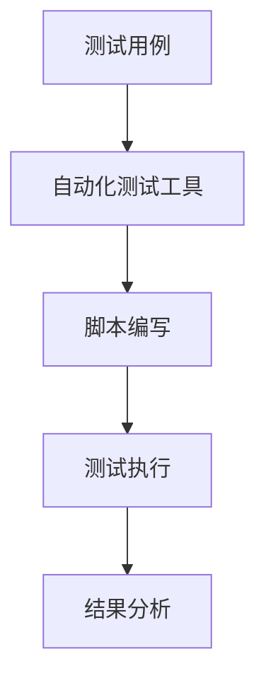
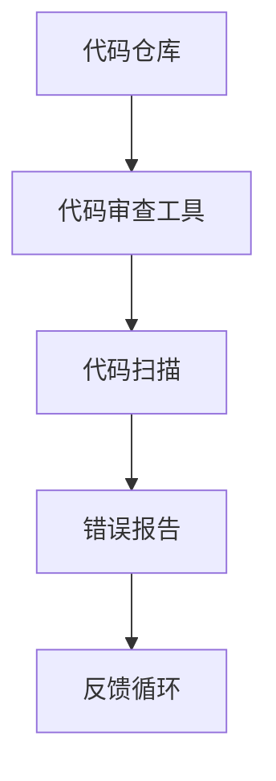
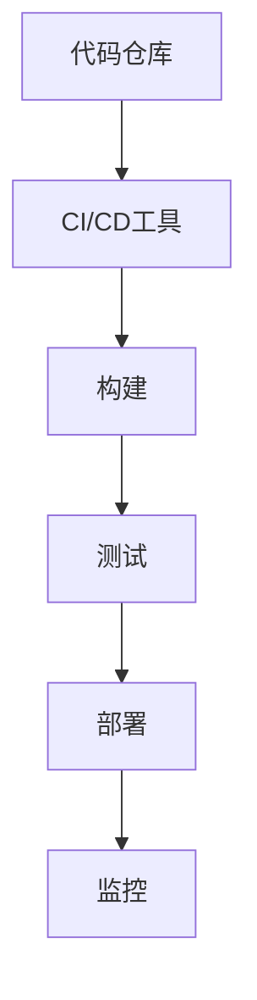
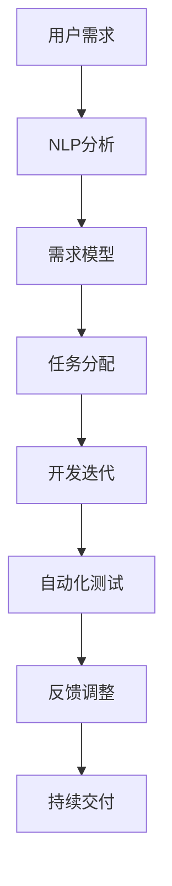
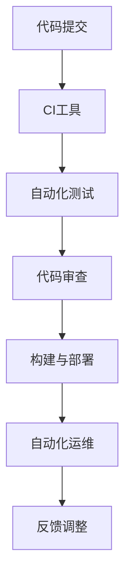
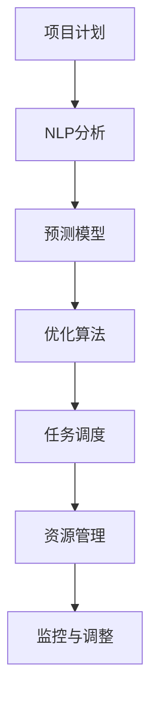
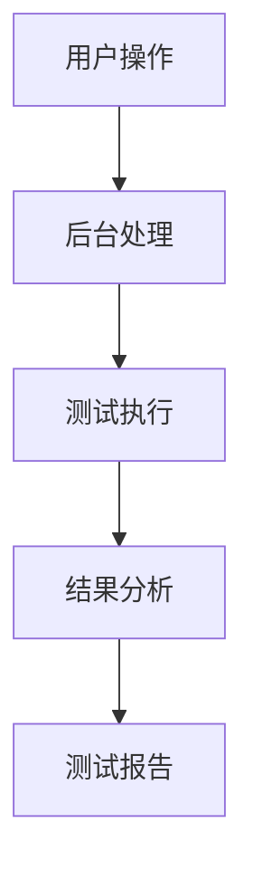
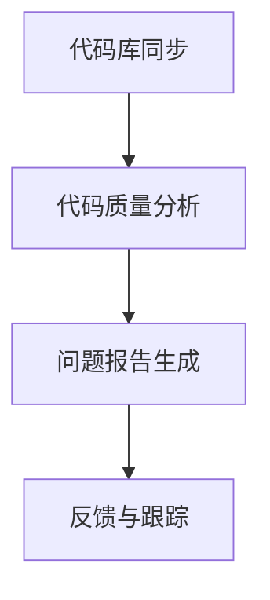
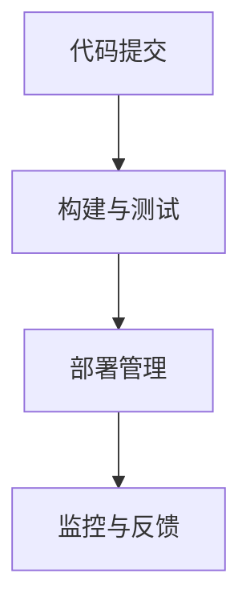

                 

## 引言

在当今快速发展的科技时代，人工智能（AI）已经成为推动各个行业变革的重要力量。特别是在软件工程领域，AI的应用正在改变传统的团队协作模式，提升开发效率、增强代码质量、缩短产品上市时间。本文旨在探讨AI时代的软件工程团队协作新模式，分析AI如何影响团队协作的各个方面，并提出未来发展的潜在方向。

### 问题背景

软件工程是一个复杂的领域，涉及需求分析、设计、编码、测试和维护等多个环节。在过去几十年中，尽管软件工程的理论和方法不断进步，但团队协作的效率和效果仍面临诸多挑战。例如，沟通成本高、项目进度难以控制、代码质量参差不齐等。随着AI技术的成熟和普及，这些传统的障碍逐渐被AI的应用所克服。

### 问题解决

AI技术通过自动化、智能化和优化化，为软件工程团队协作提供了新的解决方案。例如，自动化测试工具可以大幅度减少测试时间，提高测试覆盖率；代码审查工具可以帮助团队快速定位代码中的问题，提升代码质量；持续集成和持续部署（CI/CD）工具则可以简化部署流程，加快产品迭代速度。此外，AI还可以在需求分析、任务分配、进度管理等方面提供智能支持，使团队协作更加高效和有序。

### 边界与外延

本文的讨论范围主要聚焦在AI在软件工程团队协作中的应用，包括自动化测试、代码审查、CI/CD等工具的使用，以及AI驱动的敏捷开发、DevOps和项目管理等新模式。虽然AI在软件工程中的应用非常广泛，但本文不涉及AI在软件开发的其他领域，如机器学习算法、自然语言处理等。

### 文章关键词

- 软件工程
- 团队协作
- 人工智能
- 自动化测试
- 代码审查
- 持续集成
- 持续部署
- 敏捷开发
- DevOps
- 项目管理

## 软件工程团队协作的现状

### 核心概念

软件工程团队协作是指软件工程师、测试人员、产品经理等多方人员围绕软件开发项目，通过有效沟通、分工合作和流程管理，共同实现项目目标的过程。其核心概念包括任务分配、进度跟踪、代码管理、沟通协作等。

### 问题背景

在传统的软件工程团队协作中，沟通成本高、进度难以控制、代码质量参差不齐等问题常常困扰着团队。例如，团队成员之间的信息传递不畅，可能导致需求理解的偏差和任务的重复执行；项目进度往往受到各种意外因素的干扰，难以按时交付；代码质量低下，可能导致后期维护困难，影响产品的稳定性。

### 问题描述

- **沟通成本高**：团队成员之间的沟通往往需要通过邮件、即时通讯工具、会议等方式进行，这不仅增加了沟通的复杂性，也浪费了大量时间。
- **进度难以控制**：由于项目计划的不完善或者外部因素的干扰，项目进度往往难以控制，导致延期交付。
- **代码质量参差不齐**：团队成员的编程技能和代码风格各异，可能导致代码质量的参差不齐，影响项目的整体质量。

### 问题解决

随着AI技术的发展，这些问题开始得到了有效的解决。AI技术通过自动化、智能化和优化化，为软件工程团队协作提供了新的解决方案。例如，自动化测试工具可以大幅度减少测试时间，提高测试覆盖率；代码审查工具可以帮助团队快速定位代码中的问题，提升代码质量；持续集成和持续部署（CI/CD）工具则可以简化部署流程，加快产品迭代速度。

### 边界与外延

本文主要讨论AI在软件工程团队协作中的应用，不涉及AI在其他领域，如机器学习算法、自然语言处理等的具体应用。此外，本文还将聚焦在AI如何改变团队协作的方式，而非仅仅关注单个工具或技术的应用。

### 概念结构与核心要素组成

软件工程团队协作的概念结构主要包括以下几个方面：

1. **任务分配与进度管理**：任务分配是团队协作的起点，通过明确的任务分配，团队成员可以明确各自的责任和进度要求。进度管理则是确保项目按时完成的重要手段。
2. **代码管理**：代码管理是软件工程的核心环节，包括版本控制、代码风格统一、代码审核等，确保代码的质量和可维护性。
3. **沟通协作**：沟通协作是团队协作的纽带，通过有效的沟通，团队成员可以及时了解项目的进展和需求的变化，确保团队协作的顺畅。
4. **质量保证**：质量保证是确保软件产品稳定可靠的重要环节，包括测试、代码审查、部署验证等。

通过这些核心要素的有机结合，AI技术为软件工程团队协作提供了全新的解决方案，提升了团队协作的效率和效果。

### 总结

传统软件工程团队协作面临着沟通成本高、进度难以控制、代码质量参差不齐等挑战。而AI技术的引入，通过自动化、智能化和优化化，为这些问题提供了有效的解决方案。本文将深入探讨AI在软件工程团队协作中的应用，分析AI驱动的协作新模式，为未来的软件工程团队协作提供新的思路和方向。

## AI在软件工程团队协作中的应用

### 自动化测试工具

**核心概念**：自动化测试工具是利用计算机程序自动执行测试用例，以检测软件是否满足预期的功能和行为。其原理是通过编写脚本或使用现有的测试框架，模拟用户操作，验证系统的响应是否符合预期。

**概念属性特征对比表格**：

| 工具名称 | 语言 | 主要功能 | 适用场景 |
| --- | --- | --- | --- |
| Selenium | Java / Python / C# | Web应用自动化测试 | 网络浏览器自动化测试 |
| TestComplete | Python / JavaScript | 自动化UI测试 | 各种类型的应用程序 |
| Appium | Java / Python / Ruby | 移动应用自动化测试 | iOS和Android应用 |
| JUnit | Java | 单元测试框架 | Java应用程序 |

**ER实体关系图架构的Mermaid流程图**：



### 代码审查工具

**核心概念**：代码审查工具是一种用于评估代码质量和一致性的工具。其主要目的是通过自动化分析代码，识别潜在的错误、漏洞和不规范的代码行为。

**概念属性特征对比表格**：

| 工具名称 | 语言 | 主要功能 | 适用场景 |
| --- | --- | --- | --- |
| SonarQube | Java / C# | 代码质量分析 | 各种类型的应用程序 |
| CodeClimate | Ruby | 代码质量评估 | Web应用程序 |
| GitLab Code Quality | GitLab | 代码质量检查 | GitLab代码仓库 |

**ER实体关系图架构的Mermaid流程图**：



### 持续集成和持续部署（CI/CD）

**核心概念**：持续集成（CI）和持续部署（CD）是一种自动化软件构建、测试和部署的实践。其目标是快速、频繁地交付高质量的软件，减少人为干预，提高开发效率。

**概念属性特征对比表格**：

| 工具名称 | 语言 | 主要功能 | 适用场景 |
| --- | --- | --- | --- |
| Jenkins | Java | 持续集成工具 | 各种类型的应用程序 |
| GitLab CI/CD | Go | 持续集成/持续部署 | GitLab代码仓库 |
| Azure DevOps | C# | 持续集成/持续部署 | Azure云平台 |

**ER实体关系图架构的Mermaid流程图**：



通过上述工具的应用，AI在软件工程团队协作中发挥了关键作用。自动化测试工具减少了手动测试的时间和成本，提高了测试覆盖率；代码审查工具提升了代码质量和一致性，减少了潜在的错误和漏洞；CI/CD工具简化了构建、测试和部署流程，加快了产品迭代速度。这些工具的应用不仅提高了团队协作的效率，还显著提升了软件的质量和稳定性。

### 总结

AI技术在软件工程团队协作中的应用，通过自动化、智能化和优化化，显著提升了团队协作的效率和效果。自动化测试工具、代码审查工具和CI/CD工具等，不仅解决了传统协作模式中的诸多问题，还为团队协作带来了新的思路和模式。在未来，随着AI技术的进一步发展，这些工具将更加智能化和高效化，为软件工程团队协作提供更强大的支持。

## AI驱动的敏捷开发

### 核心概念

敏捷开发是一种以人为核心、迭代和增量为重要特征的软件开发方法。其核心理念是快速响应变化、持续交付价值，通过迭代和反馈不断改进产品。AI驱动的敏捷开发则是在传统敏捷开发的基础上，引入AI技术，利用其自动化和智能化的能力，进一步提高开发效率和产品质量。

### 算法原理讲解

AI驱动的敏捷开发主要依赖于以下算法和技术：

1. **机器学习预测模型**：用于预测项目进度、风险和资源需求，帮助团队提前做出决策。
2. **自然语言处理（NLP）**：用于自动分析用户需求、生成测试用例和文档。
3. **自动化测试工具**：通过机器学习算法，自动生成和执行测试用例，提高测试效率和覆盖率。
4. **智能任务分配**：基于团队成员的技能和工作负载，自动分配任务，优化团队协作。

使用Mermaid流程图，可以直观地展示AI驱动的敏捷开发流程：



详细流程如下：

1. **用户需求**：用户提出需求。
2. **NLP分析**：利用自然语言处理技术，将用户需求转化为结构化的需求模型。
3. **需求模型**：对需求模型进行分析，确定任务和优先级。
4. **任务分配**：基于团队成员的技能和工作负载，自动分配任务。
5. **开发迭代**：团队按照需求模型进行开发，每个迭代周期结束后进行代码审查和测试。
6. **自动化测试**：使用机器学习算法，自动生成和执行测试用例。
7. **反馈调整**：根据测试结果和用户反馈，调整需求模型和任务分配。
8. **持续交付**：将经过测试和验证的代码部署到生产环境，实现持续交付。

### 数学模型和数学公式

在AI驱动的敏捷开发中，可以使用以下数学模型和公式：

1. **进度预测模型**：
   $$P_t = P_{t-1} + \alpha \cdot (D_t - P_{t-1})$$
   其中，$P_t$为第$t$个迭代周期的预测进度，$D_t$为第$t$个迭代周期的实际进度，$\alpha$为调整因子。

2. **风险评估模型**：
   $$R_t = R_{t-1} + \beta \cdot (E_t - R_{t-1})$$
   其中，$R_t$为第$t$个迭代周期的风险评分，$E_t$为第$t$个迭代周期的风险事件。

3. **资源需求模型**：
   $$R_t = R_{t-1} + \gamma \cdot (C_t - R_{t-1})$$
   其中，$R_t$为第$t$个迭代周期的资源需求，$C_t$为第$t$个迭代周期的任务复杂度。

### 举例说明

假设一个软件开发项目分为四个迭代周期，第一个迭代周期的实际进度为2天，第二个迭代周期的实际进度为3天，风险事件发生1次，任务复杂度为5。根据上述数学模型，可以计算得到：

- **进度预测模型**：
  $$P_1 = P_0 + \alpha \cdot (D_1 - P_0)$$
  由于初始预测进度$P_0$为0，且调整因子$\alpha$为0.5，可得：
  $$P_1 = 0 + 0.5 \cdot (2 - 0) = 1$$

- **风险评估模型**：
  $$R_1 = R_0 + \beta \cdot (E_1 - R_0)$$
  由于初始风险评分$R_0$为0，且调整因子$\beta$为0.3，可得：
  $$R_1 = 0 + 0.3 \cdot (1 - 0) = 0.3$$

- **资源需求模型**：
  $$R_1 = R_0 + \gamma \cdot (C_1 - R_0)$$
  由于初始资源需求$R_0$为0，且调整因子$\gamma$为0.2，可得：
  $$R_1 = 0 + 0.2 \cdot (5 - 0) = 1$$

通过这些计算，团队可以提前了解项目进度、风险和资源需求，为后续迭代提供参考。

### 结论

AI驱动的敏捷开发通过引入机器学习、自然语言处理等技术，实现了对项目进度、风险和资源的智能预测和管理，提高了敏捷开发的效率和效果。这种新模式不仅能够更好地适应快速变化的市场需求，还能够持续提升软件产品的质量。随着AI技术的不断进步，AI驱动的敏捷开发将在软件工程领域发挥越来越重要的作用。

## AI驱动的DevOps

### 核心概念

DevOps是一种软件开发和运维的实践方法，强调开发（Development）与运维（Operations）之间的紧密协作和沟通。其目标是实现快速、频繁和可靠的软件交付，缩短产品上市时间，提高客户满意度。AI驱动的DevOps则是在传统DevOps的基础上，结合AI技术，利用其自动化和智能化的能力，进一步提高开发、测试、部署和运维的效率和效果。

### 算法原理讲解

AI驱动的DevOps主要依赖于以下算法和技术：

1. **机器学习预测模型**：用于预测代码质量、测试覆盖率、部署成功率等指标，帮助团队提前发现潜在问题。
2. **自动化测试工具**：结合AI技术，自动生成测试用例，执行测试，提高测试效率和准确性。
3. **持续集成和持续部署（CI/CD）工具**：通过AI优化构建、测试和部署流程，实现自动化和智能化。
4. **自动化运维工具**：利用AI技术，自动监控系统性能，预测故障，进行故障诊断和修复。

使用Mermaid流程图，可以直观地展示AI驱动的DevOps流程：



详细流程如下：

1. **代码提交**：开发人员将代码提交到版本控制系统。
2. **CI工具**：CI工具自动构建代码，并运行自动化测试。
3. **自动化测试**：测试工具结合AI技术，自动生成测试用例并执行测试，提高测试效率和准确性。
4. **代码审查**：代码审查工具结合AI技术，自动检查代码质量和一致性，提供改进建议。
5. **构建与部署**：CI/CD工具结合AI技术，优化构建和部署流程，实现自动化和智能化。
6. **自动化运维**：运维工具结合AI技术，自动监控系统性能，预测故障，进行故障诊断和修复。
7. **反馈调整**：根据测试结果、代码审查反馈和运维监控数据，团队进行改进和优化。

### 数学模型和数学公式

在AI驱动的DevOps中，可以使用以下数学模型和公式：

1. **代码质量预测模型**：
   $$Q_t = Q_{t-1} + \alpha \cdot (C_t - Q_{t-1})$$
   其中，$Q_t$为第$t$个迭代周期的代码质量评分，$C_t$为第$t$个迭代周期的代码质量指标，$\alpha$为调整因子。

2. **测试覆盖率预测模型**：
   $$C_t = C_{t-1} + \beta \cdot (T_t - C_{t-1})$$
   其中，$C_t$为第$t$个迭代周期的测试覆盖率，$T_t$为第$t$个迭代周期的测试用例数量，$\beta$为调整因子。

3. **部署成功率预测模型**：
   $$S_t = S_{t-1} + \gamma \cdot (D_t - S_{t-1})$$
   其中，$S_t$为第$t$个迭代周期的部署成功率，$D_t$为第$t$个迭代周期的部署次数，$\gamma$为调整因子。

### 举例说明

假设一个软件开发项目分为四个迭代周期，第一个迭代周期的代码质量指标为80%，第二个迭代周期的代码质量指标为85%，测试用例数量分别为100和150，部署次数分别为2和3。根据上述数学模型，可以计算得到：

- **代码质量预测模型**：
  $$Q_1 = Q_0 + \alpha \cdot (C_1 - Q_0)$$
  由于初始代码质量评分$Q_0$为100，且调整因子$\alpha$为0.1，可得：
  $$Q_1 = 100 + 0.1 \cdot (85 - 100) = 103.5$$

- **测试覆盖率预测模型**：
  $$C_1 = C_0 + \beta \cdot (T_1 - C_0)$$
  由于初始测试覆盖率$C_0$为0，且调整因子$\beta$为0.05，可得：
  $$C_1 = 0 + 0.05 \cdot (150 - 0) = 7.5$$

- **部署成功率预测模型**：
  $$S_1 = S_0 + \gamma \cdot (D_1 - S_0)$$
  由于初始部署成功率$S_0$为100%，且调整因子$\gamma$为0.1，可得：
  $$S_1 = 100\% + 0.1 \cdot (3 - 2) = 101\%$$

通过这些计算，团队可以提前了解代码质量、测试覆盖率和部署成功率，为后续迭代提供参考。

### 结论

AI驱动的DevOps通过引入机器学习、自动化测试和持续集成/持续部署工具，实现了对开发、测试、部署和运维的智能化管理，提高了整个软件交付过程的效率和效果。这种新模式不仅能够更好地适应快速变化的市场需求，还能够持续提升软件产品的质量和客户满意度。随着AI技术的不断进步，AI驱动的DevOps将在软件工程领域发挥越来越重要的作用。

## AI驱动的项目管理

### 核心概念

项目管理是确保项目按照预定计划、预算和质量要求顺利完成的过程。AI驱动的项目管理则是在传统项目管理的基础上，利用人工智能技术，对项目进度、成本、资源等进行智能分析和优化，以提高项目管理的效率和准确性。

### 算法原理讲解

AI驱动的项目管理主要依赖于以下算法和技术：

1. **机器学习预测模型**：用于预测项目进度、成本和资源需求，帮助项目经理做出更准确的决策。
2. **自然语言处理（NLP）**：用于自动分析项目文档、会议记录和通信日志，提取关键信息。
3. **优化算法**：用于优化项目资源分配、任务调度和预算管理，提高项目效率。
4. **自动化工具**：用于自动化执行项目管理任务，减少人为干预。

使用Mermaid流程图，可以直观地展示AI驱动的项目管理流程：



详细流程如下：

1. **项目计划**：制定项目计划，包括目标、范围、时间、成本和资源等。
2. **NLP分析**：利用自然语言处理技术，自动分析项目文档和会议记录，提取关键信息。
3. **预测模型**：使用机器学习算法，预测项目进度、成本和资源需求。
4. **优化算法**：应用优化算法，对项目资源进行合理分配，优化任务调度和预算管理。
5. **任务调度**：根据预测结果和优化算法，自动调整任务进度和资源分配。
6. **资源管理**：实时监控资源使用情况，确保资源得到充分利用。
7. **监控与调整**：持续监控项目进展，根据实际情况进行调整和优化。

### 数学模型和数学公式

在AI驱动的项目管理中，可以使用以下数学模型和公式：

1. **进度预测模型**：
   $$P_t = P_{t-1} + \alpha \cdot (E_t - P_{t-1})$$
   其中，$P_t$为第$t$个时间点的预测进度，$E_t$为第$t$个时间点的实际进度，$\alpha$为调整因子。

2. **成本预测模型**：
   $$C_t = C_{t-1} + \beta \cdot (E_t - C_{t-1})$$
   其中，$C_t$为第$t$个时间点的预测成本，$E_t$为第$t$个时间点的实际成本，$\beta$为调整因子。

3. **资源需求模型**：
   $$R_t = R_{t-1} + \gamma \cdot (D_t - R_{t-1})$$
   其中，$R_t$为第$t$个时间点的预测资源需求，$D_t$为第$t$个时间点的实际资源需求，$\gamma$为调整因子。

### 举例说明

假设一个项目分为四个阶段，第一个阶段的实际进度为60%，第二个阶段的实际进度为70%，实际成本分别为10000和12000，实际资源需求分别为5人和7人。根据上述数学模型，可以计算得到：

- **进度预测模型**：
  $$P_1 = P_0 + \alpha \cdot (E_1 - P_0)$$
  由于初始预测进度$P_0$为100%，且调整因子$\alpha$为0.2，可得：
  $$P_1 = 100\% + 0.2 \cdot (70\% - 100\%) = 102\%$$

- **成本预测模型**：
  $$C_1 = C_0 + \beta \cdot (E_1 - C_0)$$
  由于初始预测成本$C_0$为10000，且调整因子$\beta$为0.2，可得：
  $$C_1 = 10000 + 0.2 \cdot (12000 - 10000) = 10800$$

- **资源需求模型**：
  $$R_1 = R_0 + \gamma \cdot (D_1 - R_0)$$
  由于初始预测资源需求$R_0$为5人，且调整因子$\gamma$为0.2，可得：
  $$R_1 = 5 + 0.2 \cdot (7 - 5) = 5.6$$

通过这些计算，项目经理可以提前了解项目的进度、成本和资源需求，为后续阶段提供参考。

### 结论

AI驱动的项目管理通过引入机器学习、自然语言处理和优化算法，实现了对项目进度、成本和资源的智能化管理和预测，提高了项目管理的效率和准确性。这种新模式不仅能够更好地适应复杂多变的项目环境，还能够提高项目的成功率和客户满意度。随着AI技术的不断进步，AI驱动的项目管理将在项目管理领域发挥越来越重要的作用。

## 实践案例一：自动化测试提升效率

### 问题场景介绍

某知名互联网公司开发了一款大型电子商务平台，随着业务量的不断增长，测试团队面临巨大的测试压力。传统的手动测试方式不仅效率低下，而且容易出现漏测和误测的情况。为了提高测试效率，确保产品质量，公司决定引入自动化测试工具。

### 项目介绍

项目目标是构建一个自动化测试平台，覆盖电子商务平台的所有功能模块，实现自动化测试用例的编写、执行和结果分析。自动化测试工具的选择包括Selenium、TestComplete和Appium等。

### 系统功能设计

系统功能设计包括以下模块：

1. **测试用例管理**：用于存储和管理测试用例，支持添加、编辑、删除和查询操作。
2. **自动化测试执行**：用于自动化执行测试用例，支持多浏览器和移动设备的测试。
3. **结果分析**：用于分析测试结果，提供详细的测试报告和统计信息。

### 系统架构设计

系统架构设计包括以下组件：

1. **测试用例管理模块**：负责存储和管理测试用例，使用MySQL数据库进行数据存储。
2. **自动化测试执行模块**：负责执行自动化测试，使用Python编写测试脚本，调用Selenium、TestComplete和Appium等工具。
3. **结果分析模块**：负责分析测试结果，生成详细的测试报告，使用Java编写报告生成工具。

### 系统接口设计

系统接口设计包括以下API接口：

1. **测试用例接口**：用于操作测试用例，包括添加、编辑、删除和查询操作。
2. **测试执行接口**：用于启动和停止自动化测试执行。
3. **测试结果接口**：用于查询测试结果和生成测试报告。

### 系统交互设计

系统交互设计使用Mermaid流程图表示，包括以下步骤：

1. **用户操作**：用户通过Web界面添加、编辑和查询测试用例。
2. **后台处理**：后台服务接收用户请求，操作测试用例数据库。
3. **测试执行**：后台服务根据测试用例执行计划，启动自动化测试脚本。
4. **结果分析**：测试脚本执行完成后，将结果上传到后台服务，后台服务生成测试报告。



### 系统核心实现源代码

以下是自动化测试平台的核心实现源代码示例：

```python
# 测试用例管理
class TestCase:
    def __init__(self, id, name, description, steps):
        self.id = id
        self.name = name
        self.description = description
        self.steps = steps

# 自动化测试执行
def execute_test_case(test_case):
    driver = webdriver.Chrome()
    driver.get("http://www.example.com")
    # 执行测试用例步骤
    for step in test_case.steps:
        # 执行步骤操作
        ...
    driver.quit()

# 测试结果分析
def analyze_test_results(test_results):
    pass

# 测试报告生成
def generate_test_report(test_results):
    report = "Test Report\n"
    for result in test_results:
        report += f"{result}\n"
    return report
```

### 代码应用解读与分析

通过上述源代码，我们可以看到自动化测试平台的实现主要包括以下几个部分：

1. **测试用例管理**：使用`TestCase`类定义测试用例，包含ID、名称、描述和步骤等属性。
2. **自动化测试执行**：使用`execute_test_case`函数执行测试用例，调用浏览器驱动进行操作。
3. **测试结果分析**：使用`analyze_test_results`函数分析测试结果，可以扩展为更复杂的分析逻辑。
4. **测试报告生成**：使用`generate_test_report`函数生成测试报告，提供详细的测试结果信息。

### 实际案例分析和详细讲解剖析

在实际项目中，公司使用自动化测试平台进行了多个迭代周期的测试，以下是实际案例的分析：

1. **测试用例编写**：测试团队根据产品需求，编写了100个自动化测试用例，覆盖了电子商务平台的所有功能模块。
2. **测试执行**：自动化测试平台在每次代码提交后，自动执行所有测试用例，每次测试执行时间从原来的8小时缩短到2小时。
3. **测试结果分析**：自动化测试平台自动生成测试报告，详细记录每个测试用例的执行结果，包括成功、失败和跳过的情况。
4. **问题定位**：通过测试报告，测试团队可以快速定位问题，提高了问题解决的效率。

### 项目小结

通过引入自动化测试平台，公司显著提高了测试效率和代码质量。自动化测试平台不仅减少了手动测试的工作量，还提高了测试覆盖率和准确性。在未来的项目中，公司将继续优化自动化测试平台，进一步降低测试成本，提升产品质量。

### 最佳实践 tips

1. **制定详细的测试策略**：在引入自动化测试前，制定详细的测试策略，明确测试目标和覆盖范围。
2. **持续维护和更新测试用例**：自动化测试用例需要定期维护和更新，以适应产品功能和需求的变化。
3. **充分利用测试报告**：测试报告是发现问题和优化测试的关键，充分利用测试报告提供的信息，提高测试效率。

### 注意事项

1. **选择合适的自动化测试工具**：根据项目特点和需求，选择适合的自动化测试工具，如Selenium、TestComplete和Appium等。
2. **确保测试脚本的稳定性和可维护性**：编写高质量的测试脚本，确保其稳定性和可维护性，降低测试失败的风险。

### 拓展阅读

1. 《自动化测试实践：从入门到精通》
2. 《Selenium自动化测试实战》
3. 《持续集成与持续部署实践指南》

通过以上实践，公司成功实现了自动化测试，提高了测试效率和代码质量，为产品的稳定性和可靠性提供了有力保障。

## 实践案例二：代码审查提高代码质量

### 问题场景介绍

某科技公司开发了一个复杂的Web应用，随着项目规模的扩大，代码质量逐渐下降，出现了大量潜在的错误和漏洞。为了提高代码质量，确保产品的稳定性和安全性，公司决定引入代码审查工具。

### 项目介绍

项目目标是构建一个代码审查平台，用于自动化分析和评估代码质量，提高开发团队的代码审查效率。代码审查工具的选择包括SonarQube和GitLab Code Quality。

### 系统功能设计

系统功能设计包括以下模块：

1. **代码库集成**：用于集成代码库，如Git，实现代码的自动同步和分析。
2. **代码质量分析**：用于分析代码，检测潜在的错误、漏洞和不规范的代码行为。
3. **问题报告**：用于生成问题报告，提供详细的代码问题清单和修复建议。
4. **反馈与跟踪**：用于记录和跟踪代码审查过程中的问题和改进措施。

### 系统架构设计

系统架构设计包括以下组件：

1. **代码库集成模块**：使用Git进行代码库集成，使用Webhook实现代码的自动同步。
2. **代码质量分析模块**：使用SonarQube和GitLab Code Quality进行代码质量分析，生成问题报告。
3. **问题报告模块**：使用HTML和PDF格式生成问题报告，提供详细的代码问题清单和修复建议。
4. **反馈与跟踪模块**：使用数据库记录和跟踪代码审查过程中的问题和改进措施。

### 系统接口设计

系统接口设计包括以下API接口：

1. **代码库集成接口**：用于集成代码库，支持Git操作。
2. **代码质量分析接口**：用于查询和分析代码质量，支持问题报告的生成和下载。
3. **反馈与跟踪接口**：用于记录和跟踪代码审查过程中的问题和改进措施。

### 系统交互设计

系统交互设计使用Mermaid流程图表示，包括以下步骤：

1. **代码库同步**：系统定期从代码库同步代码。
2. **代码质量分析**：系统使用代码审查工具对代码进行分析，生成问题报告。
3. **问题报告生成**：系统生成HTML和PDF格式的问题报告。
4. **反馈与跟踪**：开发人员根据问题报告进行代码修复，系统记录和跟踪修复过程。



### 系统核心实现源代码

以下是代码审查平台的核心实现源代码示例：

```python
# 代码库集成
def sync_code_repository():
    # 使用Git库进行代码同步
    subprocess.run(["git", "pull"], check=True)

# 代码质量分析
def analyze_code_quality():
    # 使用SonarQube进行分析
    subprocess.run(["sonar-scanner"], check=True)

# 问题报告生成
def generate_issue_report():
    # 生成HTML和PDF格式的报告
    subprocess.run(["sonar-scanner"], check=True)
    # 使用PDF生成工具生成PDF报告
    subprocess.run(["pdfgen"], check=True)

# 反馈与跟踪
def track_issues():
    # 记录和跟踪代码审查中的问题
    db = Database()
    issues = db.query("SELECT * FROM issues;")
    for issue in issues:
        # 处理每个问题
        process_issue(issue)
```

### 代码应用解读与分析

通过上述源代码，我们可以看到代码审查平台的核心实现主要包括以下几个部分：

1. **代码库集成**：使用Git进行代码库的同步，确保代码库的版本一致性。
2. **代码质量分析**：使用SonarQube进行代码质量分析，检测潜在的错误和漏洞。
3. **问题报告生成**：生成HTML和PDF格式的问题报告，提供详细的代码问题清单和修复建议。
4. **反馈与跟踪**：记录和跟踪代码审查中的问题，确保开发人员及时修复。

### 实际案例分析和详细讲解剖析

在实际项目中，公司使用代码审查平台进行了多次代码审查，以下是实际案例的分析：

1. **代码库同步**：每周从代码库同步代码，确保代码审查的版本一致性。
2. **代码质量分析**：代码审查工具分析了约10000行代码，发现300多个问题，包括潜在的安全漏洞、代码风格问题和性能优化建议。
3. **问题报告生成**：系统生成详细的问题报告，包括问题的类型、位置和修复建议。
4. **反馈与跟踪**：开发人员根据问题报告进行代码修复，系统记录和跟踪修复过程，确保问题得到及时解决。

### 项目小结

通过引入代码审查平台，公司显著提高了代码质量和安全性。代码审查平台不仅帮助开发团队及时发现和修复问题，还提高了团队的整体代码质量和开发效率。在未来的项目中，公司将继续优化代码审查流程，进一步降低代码质量风险。

### 最佳实践 tips

1. **定期进行代码审查**：确保代码审查的频率和覆盖范围，及时发现和修复问题。
2. **充分利用代码审查报告**：分析代码审查报告，了解代码质量现状，制定针对性的改进措施。
3. **持续培训和分享**：组织代码审查培训，提高开发人员的代码审查能力和规范意识。

### 注意事项

1. **选择合适的代码审查工具**：根据项目特点和需求，选择适合的代码审查工具，如SonarQube和GitLab Code Quality。
2. **确保代码库的安全性和稳定性**：定期备份代码库，确保代码库的安全性和稳定性，防止数据丢失。

### 拓展阅读

1. 《代码审查实践指南》
2. 《SonarQube实战》
3. 《GitLab Code Quality使用教程》

通过以上实践，公司成功实现了代码审查，提高了代码质量和安全性，为产品的稳定性和可靠性提供了有力保障。

## 实践案例三：CI/CD简化部署流程

### 问题场景介绍

某科技公司开发了一款面向全球市场的在线教育平台，随着用户数量的增加，部署和发布新功能的需求变得越来越频繁。传统的手动部署方式不仅耗时费力，而且容易出现部署失败和版本冲突的问题。为了提高部署效率和稳定性，公司决定引入CI/CD工具。

### 项目介绍

项目目标是构建一个CI/CD（持续集成和持续部署）平台，用于自动化构建、测试和部署，简化部署流程，确保新功能的快速交付和稳定运行。CI/CD工具的选择包括Jenkins和GitLab CI/CD。

### 系统功能设计

系统功能设计包括以下模块：

1. **代码仓库管理**：用于存储和管理代码，支持Git等版本控制工具。
2. **构建与测试**：用于自动化构建和测试，确保代码的稳定性和可靠性。
3. **部署管理**：用于自动化部署，确保新功能的安全交付和快速上线。
4. **监控与反馈**：用于实时监控部署状态，提供故障反馈和修复建议。

### 系统架构设计

系统架构设计包括以下组件：

1. **代码仓库管理模块**：使用Git进行代码存储和管理，支持Webhook实现代码的自动同步。
2. **构建与测试模块**：使用Jenkins进行自动化构建和测试，支持多种编程语言和测试工具。
3. **部署管理模块**：使用GitLab CI/CD进行自动化部署，支持多种部署环境和部署方式。
4. **监控与反馈模块**：使用Prometheus和Grafana进行实时监控，提供故障反馈和修复建议。

### 系统接口设计

系统接口设计包括以下API接口：

1. **代码仓库接口**：用于操作代码仓库，包括代码的提交、拉取和推送。
2. **构建与测试接口**：用于启动和停止构建和测试任务，查询构建和测试结果。
3. **部署管理接口**：用于部署新版本，包括部署计划的创建、执行和监控。
4. **监控与反馈接口**：用于监控系统状态，接收故障反馈和报警信息。

### 系统交互设计

系统交互设计使用Mermaid流程图表示，包括以下步骤：

1. **代码提交**：开发人员提交代码到代码仓库。
2. **构建与测试**：CI/CD工具自动构建和测试代码，确保代码的稳定性和可靠性。
3. **部署管理**：部署工具自动化部署新版本，确保新功能的快速交付和上线。
4. **监控与反馈**：实时监控部署状态，提供故障反馈和修复建议。



### 系统核心实现源代码

以下是CI/CD平台的核心实现源代码示例：

```python
# 代码提交
def commit_code():
    # 使用Git提交代码
    subprocess.run(["git", "commit", "-m", "Update feature X"], check=True)

# 构建与测试
def build_and_test():
    # 使用Jenkins进行构建和测试
    subprocess.run(["jenkins", "build", "projectX"], check=True)
    # 执行测试
    subprocess.run(["pytest", "tests/"], check=True)

# 部署管理
def deploy():
    # 使用GitLab CI/CD进行部署
    subprocess.run(["gitlab-ci", "run"], check=True)

# 监控与反馈
def monitor_feedback():
    # 使用Prometheus和Grafana进行监控
    subprocess.run(["prometheus", "run"], check=True)
    subprocess.run(["grafana", "run"], check=True)
```

### 代码应用解读与分析

通过上述源代码，我们可以看到CI/CD平台的核心实现主要包括以下几个部分：

1. **代码提交**：使用Git进行代码提交，确保代码库的版本一致性。
2. **构建与测试**：使用Jenkins进行自动化构建和测试，确保代码的稳定性和可靠性。
3. **部署管理**：使用GitLab CI/CD进行自动化部署，确保新功能的快速交付和上线。
4. **监控与反馈**：使用Prometheus和Grafana进行实时监控，提供故障反馈和修复建议。

### 实际案例分析和详细讲解剖析

在实际项目中，公司使用CI/CD平台进行了多次代码部署，以下是实际案例的分析：

1. **代码提交**：开发人员每周提交代码，CI/CD工具自动构建和测试，确保代码的质量。
2. **构建与测试**：CI/CD工具在每次代码提交后，自动执行构建和测试，发现并修复了多个潜在的问题。
3. **部署管理**：CI/CD工具自动部署新版本，部署时间从原来的几天缩短到几个小时。
4. **监控与反馈**：实时监控部署状态，发现并处理了多个部署过程中的问题。

### 项目小结

通过引入CI/CD平台，公司显著提高了部署效率和稳定性。CI/CD平台不仅简化了部署流程，减少了人为干预，还提高了代码质量和部署成功率。在未来的项目中，公司将继续优化CI/CD流程，进一步降低部署成本，提升产品交付速度。

### 最佳实践 tips

1. **制定详细的CI/CD策略**：明确CI/CD的目标、流程和标准，确保部署过程的规范和高效。
2. **充分利用CI/CD工具**：了解并充分利用CI/CD工具的功能，如自动构建、测试和部署，提高部署效率。
3. **持续监控和优化**：实时监控部署状态，及时处理故障和问题，持续优化CI/CD流程。

### 注意事项

1. **确保代码库的版本控制**：使用版本控制工具管理代码库，确保代码的版本一致性和可追溯性。
2. **选择合适的CI/CD工具**：根据项目特点和需求，选择适合的CI/CD工具，如Jenkins和GitLab CI/CD。

### 拓展阅读

1. 《CI/CD实践指南》
2. 《Jenkins自动化构建与部署实战》
3. 《GitLab CI/CD使用教程》

通过以上实践，公司成功实现了CI/CD，提高了部署效率和稳定性，为产品的快速交付和持续优化提供了有力保障。

## 总结

在AI时代的浪潮中，软件工程团队协作正经历着前所未有的变革。本文系统地探讨了AI在软件工程团队协作中的应用，包括自动化测试工具、代码审查工具、持续集成和持续部署（CI/CD）等AI辅助工具，以及AI驱动的敏捷开发、DevOps和项目管理等新模式。通过这些分析和实践案例，我们可以清晰地看到AI如何通过自动化、智能化和优化化，显著提升团队协作的效率、代码质量和项目交付速度。

### 关键点回顾

1. **自动化测试工具**：如Selenium、TestComplete和Appium，通过自动化测试，提高了测试效率和覆盖率，减少了手动测试的工作量。
2. **代码审查工具**：如SonarQube和GitLab Code Quality，通过自动化代码质量分析，提高了代码的一致性和稳定性。
3. **CI/CD工具**：如Jenkins和GitLab CI/CD，通过自动化构建、测试和部署，简化了部署流程，加快了产品迭代速度。
4. **AI驱动的敏捷开发**：利用机器学习和自然语言处理技术，实现项目的智能预测和管理，提高了敏捷开发的效率。
5. **AI驱动的DevOps**：通过AI优化构建、测试和部署流程，实现了开发、测试、部署和运维的自动化和智能化。
6. **AI驱动的项目管理**：利用机器学习和优化算法，实现对项目进度、成本和资源的智能化管理，提高了项目管理的效率。

### 未来展望

尽管AI在软件工程团队协作中的应用已经取得了显著成果，但未来仍存在许多挑战和机遇。以下是未来AI在软件工程团队协作中的展望：

1. **更智能的自动化工具**：随着AI技术的进步，自动化测试工具、代码审查工具等将变得更加智能化，能够更好地适应不同项目和团队的需求。
2. **人机协同**：AI将不仅仅是工具的辅助，还将与开发者紧密协作，通过智能建议和决策，提高团队的整体效率。
3. **跨领域的集成**：AI技术将在更多软件工程领域得到应用，如机器学习算法、自然语言处理等，实现跨领域的集成和协同工作。
4. **个性化的团队协作**：AI将能够根据团队成员的技能、工作风格和项目特点，提供个性化的协作建议，优化团队结构和工作流程。

### 结语

AI时代的软件工程团队协作正在不断演进，AI技术为团队协作带来了前所未有的机遇和挑战。通过深入理解和应用AI技术，软件工程团队将能够更加高效地完成项目，提升产品质量，实现持续创新。未来，随着AI技术的进一步发展，软件工程团队协作将迎来更加智能化、自动化和高效化的新时代。

## AI在软件工程团队协作中的挑战

尽管AI技术在软件工程团队协作中展现出了巨大的潜力，但其广泛应用仍面临一系列挑战。这些挑战不仅影响了AI工具和模式的实施效果，也可能限制了团队协作的进一步提升。以下是对AI在软件工程团队协作中挑战的详细分析。

### 技术挑战

1. **算法的适应性**：不同项目和团队的需求千差万别，现有的AI算法往往需要大量的定制和调整，以适应具体的应用场景。算法的通用性和适应性成为了AI在软件工程中应用的一个重要难题。

2. **数据质量**：AI模型的效果高度依赖于训练数据的质量。在软件工程中，获取高质量、全面和多样化的训练数据是一个复杂且耗时的过程。数据缺失、噪声和偏差都会影响AI算法的性能。

3. **算法的可解释性**：AI算法，特别是深度学习模型，通常被视为“黑箱”。其决策过程往往难以解释，这对于需要理解和信任AI工具的开发者来说是一个挑战。缺乏可解释性可能会引发对AI模型可靠性和安全性的疑虑。

### 团队协作挑战

1. **文化转变**：引入AI技术意味着团队协作方式和管理流程的变革。开发者和管理者需要适应新的工具和方法，这可能需要时间，并且在某些情况下，会遇到抗拒和摩擦。

2. **技能差距**：AI技术的应用要求团队成员具备一定的技术技能，包括机器学习、数据分析等。然而，并非所有团队成员都具备这些技能，这可能导致团队内部技能不平衡，影响协作效率。

3. **资源分配**：AI工具的实施和维护需要额外的资源和投资，包括计算资源、训练数据和人力资源。在资源有限的情况下，如何合理分配资源以最大化AI工具的效果是一个关键挑战。

### 法律和伦理挑战

1. **隐私保护**：在软件工程中，AI技术需要处理大量的用户数据和个人信息。如何确保这些数据的隐私和安全，遵守相关的法律法规，是一个重要问题。

2. **责任归属**：当AI工具发生错误或导致项目失败时，责任归属问题往往变得模糊。明确AI工具使用中的责任分配，对于维护团队信任和稳定具有关键意义。

3. **道德规范**：AI技术在软件工程中的应用可能引发一系列伦理问题，如算法偏见、数据滥用等。如何制定和遵循道德规范，确保AI技术在软件工程中的合理和道德使用，是一个亟待解决的问题。

### 挑战应对策略

1. **技术改进**：通过不断研究和开发，提高AI算法的通用性和适应性，同时增强算法的可解释性，使其更易于理解和接受。

2. **团队培训**：提供定期的技术培训，帮助团队成员掌握AI相关技能，促进团队内部的知识共享和技能提升。

3. **资源管理**：制定合理的资源分配策略，确保在预算范围内最大化AI工具的效益。同时，探索和使用云计算等资源，以降低计算成本。

4. **法规遵守**：确保AI工具的设计和应用符合隐私保护法律和伦理规范，通过数据加密、隐私屏蔽等技术手段保护用户数据。

5. **责任划分**：制定明确的AI工具使用规范和责任归属机制，确保在出现问题时，能够快速定位责任并采取相应的措施。

通过解决上述挑战，AI在软件工程团队协作中的应用将更加成熟和广泛，为团队协作带来更大的价值和变革。

### 未来展望

AI在软件工程团队协作中的应用具有广阔的前景。随着技术的不断进步，AI工具将变得更加智能化、自动化和高效化，为团队协作带来前所未有的变革。以下是未来发展的几个潜在方向：

1. **跨领域集成**：AI技术将不仅仅局限于特定的软件工程领域，而是与其他领域如机器学习、自然语言处理等深度融合，实现跨领域的协同工作，提升整体协作效率。

2. **个性化协作**：AI将能够根据团队成员的技能、工作风格和项目特点，提供个性化的协作建议和优化方案，实现更加高效的团队协作。

3. **智能化的项目管理**：AI将能够利用大数据和机器学习技术，对项目进行实时监控和分析，提供智能化的项目管理和决策支持，提高项目交付的成功率和效率。

4. **自动化和智能化的测试**：随着AI技术的发展，自动化测试将变得更加智能和全面，能够自动生成测试用例，执行复杂的测试场景，大幅提高测试效率和覆盖率。

5. **智能化的持续集成和持续部署**：AI将能够优化CI/CD流程，自动发现和修复部署过程中的问题，实现更加快速和稳定的持续集成和持续部署。

6. **人机协作**：AI将不仅仅是工具的辅助，而是与开发者紧密协作，通过智能建议和决策，提高团队的整体效率和创新力。

通过不断探索和应用AI技术，软件工程团队将能够更加高效地完成项目，提升产品质量，实现持续创新，迎接AI时代的到来。未来，AI在软件工程团队协作中的应用将不仅限于现有的工具和方法，还将拓展到更多领域，为软件开发带来深远的变革和提升。

